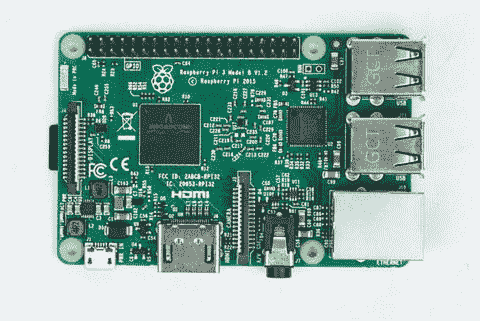
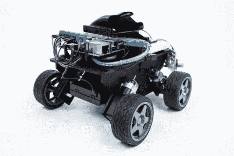
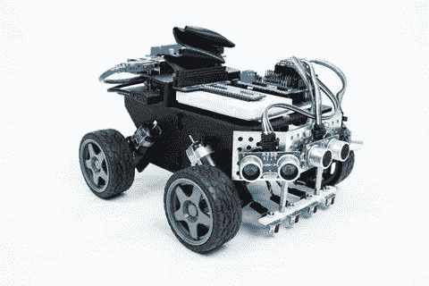
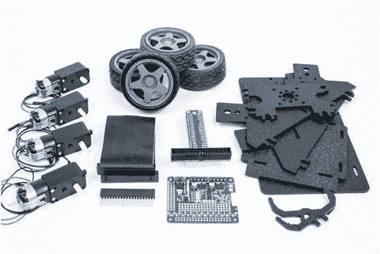
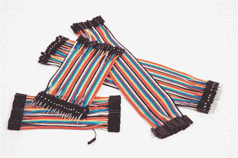
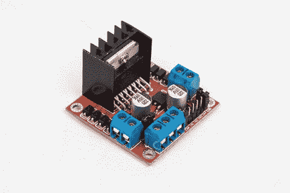

# 一、机器人学导论

机器人这个词可以有很多含义。对某些人来说，它是任何自己移动的东西；运动艺术是机器人技术。对其他人来说，机器人意味着可移动的东西或可以自己从一个地方移动到另一个地方的东西。实际上有一个领域叫做移动机器人学；自动吸尘器，如 Roomba 或 Neato，就属于这一类。对我来说，机器人学介于运动艺术和移动机器人学之间。

机器人是一种应用逻辑以自动方式执行任务的技术。这是一个相当宽泛的定义，但机器人学是一个相当宽泛的领域。它可以涵盖从儿童玩具到一些汽车的自动平行泊车功能的所有内容。在这本书里，我们制作了一个小型移动机器人。

你在本书中接触到的许多原则很容易转移到其他领域。事实上，我们将从头到尾经历制造一个机器人的整个过程。在本章的稍后部分，我将回顾我们将要构建的项目。到时候，我会提供一本书中用到的零件清单。这些部件包括传感器、驱动器、电机等等。欢迎您使用手头的任何东西，因为在很大程度上，我们在本书中讨论的所有内容都可以应用到其他项目中。

## 机器人基础

我喜欢告诉那些机器人新手，或者只是对机器人好奇的人，机器人由三个要素组成。

*   收集数据的能力
*   处理或处理收集到的数据的能力
*   与环境互动的能力

在接下来的章节中，我们将应用这个原理来制作一个小型的移动机器人。我们将使用超声波测距仪和红外线传感器来收集环境数据。具体来说，我们将识别何时有要避开的物体，何时我们将开车离开桌子的边缘，以及桌子和我们将跟随的线之间的对比。一旦我们有了这些数据，我们将应用逻辑来确定适当的响应。

我们将在 Linux 环境中使用 Python 来处理信息，并向我们的电机发送命令。我选择 Python 作为编程语言，因为它很容易学习，而且你不必有复杂的开发环境来构建一些非常复杂的应用。

我们与环境的互动将只是控制马达的速度和方向。这将允许我们的机器人在桌子或地板上自由移动。驾驶汽车真的没什么难的。我们将研究两种实现方式:一种是为 Raspberry Pi 设计的电机驱动器，另一种是通用的电机控制器。

这本书旨在具有挑战性。我涵盖了一些相当复杂的材料，而且做得很快。我没有办法对这些话题中的任何一个提供详细的报道，但是我希望在本书结束的时候让你看到一个功能机器人。在每一章中，我都试图为您提供更多的资源来跟进所讨论的主题。你有时会挣扎；我过去是这样，现在也经常这样。

不是每个人都对所有的科目感兴趣。期望你能在本书之外拓展你最感兴趣的领域。坚持有回报。

在书的最后，我增加了一点挑战。在第 9 章中，我们开始利用树莓派的真正力量。我们看计算机视觉。具体来说，我们看一个叫做 OpenCV (CV 代表计算机视觉)的开源包。这是一个常见的和非常强大的实用程序集合，使处理图像和视频流变得非常容易。它也是在最新版本的树莓派基础上构建的六小时版本。为了让事情变得简单一些，节省更多的时间，我可以下载一个已经安装了 OpenCV 的操作系统版本。我将在第二章[中详细讨论这一点。](02.html)

### Linux 和机器人技术

Linux 是基于 Unix 的操作系统。它非常受程序员和计算机科学家的欢迎，因为它简单明了。他们似乎很喜欢终端基于文本的界面。然而，对于包括我在内的许多其他人来说，Linux 可能非常具有挑战性。那么，我为什么要选择这个环境来写一本机器人导论的书呢？这个问题有三个答案。

首先，当你从事机器人工作时，你最终不得不面对 Linux。那只是事实。您可以不用输入一个`sudo`命令就做很多事情，但是您的能力有限。`sudo`命令代表 Linux 中的超级用户 do。这告诉操作系统，您将要执行一个受保护的功能，该功能需要比一般用户更多的访问权限。当我们开始使用树莓派时，你会了解到更多。

第二，Linux 具有挑战性。正如我之前所说的，这本书会挑战你。如果你之前在 Linux 工作过，那么这个理由对你不适用。然而，如果你不熟悉 Linux，Raspberry Pi，或者在命令行中工作，那么我们做的一些事情将会很有挑战性。这很好。你正在学习新的东西，这应该是一个挑战。

第三，也是最重要的一点，Raspberry Pi 使用 Linux。是的，您可以在 Pi 上安装其他操作系统，但是它是为使用 Linux 设计的。事实上，Raspberry Pi 有它自己的 Linux 风格，叫做 Raspbian。这是推荐的操作系统，所以我们将使用它。使用预构建的操作系统的好处之一，除了它的易用性，是许多工具已经安装并准备好了。

由于我们使用的是 Linux，我们将广泛使用命令行指令。这是大多数新用户遇到问题的地方。命令行代码是通过终端输入的。Raspbian 有一个我们将使用的 Windows 风格的界面，但它的大部分使用终端。图形用户界面(GUI)中有一个终端窗口，因此我们将使用它。然而，当我们设置 Pi 时，我们将默认设置它引导到终端模式。进入 GUI 只是一个简单的`startx`命令。所有这些都包含在第二章中。

### 传感器和 GPIO

GPIO 代表通用输入/输出。它表示设备的各种连接。Raspberry Pi 有很多 GPIO 选项:HDMI、USB、音频等等。然而，当我在本书中谈论 GPIO 时，我通常指的是 40 针 GPIO 接头。此接头提供了对大多数电路板功能的直接访问。我将在第 2 章中讨论这一点。

Arduino 也有 GPIO。事实上，有人可能会说 Arduino 完全是 GPIO。鉴于所有其他连接都允许您与 Arduino 核心的 AVR 芯片通信并为其供电，这与事实相差不远。

所有这些接头和 GPIO 连接都在那里，因此我们可以访问电路板外部的传感器。传感器是一种收集数据的设备。有许多不同类型的传感器，它们都有各自的用途。传感器可用于检测光线水平、与物体的距离、温度、速度等。特别是，我们将使用配有超声波测距仪和红外探测器的 GPIO 接头。

### 运动和控制

大多数机器人的定义都有一个共同点，那就是它需要能够移动。当然，你可以拥有一个实际上不动的机器人，但这种类型的设备通常被称为物联网。

有许多方法可以将运动添加到项目中。最常见的是使用马达。但是你也可以使用螺线管、空气或水压。我在第 [6](06.html) 章中详细讨论了电机。

虽然可以用 Raspberry Pi 或 Arduino 板直接驱动电机，但强烈建议不要这样做。电机消耗的电流往往超过电路板上的处理器所能处理的。相反，建议您使用电机控制器。像电机一样，电机控制器也有多种形式。我们将使用的电机控制板是通过 Raspberry Pi 的头部访问的。我还讨论了如何用 L298N 双电机控制器驱动电机。

## 树莓派和 Arduino

我们将使用 Raspberry Pi(见图 [1-1](#Fig1) )结合 Arduino(见图 [1-2](#Fig2) )作为我们机器人的处理平台。

图 1-2

Arduino Uno

图 1-1

Raspberry Pi 3 B+

Raspberry Pi 是一种单板计算机，大约有信用卡大小。尽管它的尺寸很小，但它是一个非常强大的设备。Pi 运行一个 Linux 版本，该版本被定制为在驱动它的 ARM 处理器上工作。这将许多功能放入一个小设备中，该设备很容易嵌入到像机器人这样的东西中。但是，尽管它是一台伟大的计算机，但也有一些地方它并不出色。一个领域是与外部设备接口。它可以与传感器和外部设备一起工作，但 Arduino 在这方面做得更好。

Arduino 是另一种易于获得和使用的小型处理设备。然而，与 Raspberry Pi 不同，它不具备完整操作系统的能力。它不是运行 ARM 这样的微处理器，而是使用一种不同类型的芯片，称为微控制器。不同之处在于，微控制器是专门设计来与传感器、电机、灯和各种设备进行交互的。它直接与这些外部设备交互。Pi 在到达设备所连接的引脚之前，需要经过多层处理。

通过结合 Raspberry Pi 和 Arduino，我们能够利用各自的优势。Raspberry Pi 提供了完整计算机的高级处理能力。Arduino 提供对外部设备的原始控制。Pi 允许我们处理来自简单 USB 摄像机的视频流；而 Arduino 允许我们从各种传感器收集信息，并应用逻辑来理解所有数据，然后将简明的结果返回给 Pi。

在第 [2](02.html) 章你会学到更多关于树莓派的知识。稍后，您将把 Arduino 连接到 Pi，并学习如何对它进行编程，以及如何在 Arduino 和 Pi 之间来回传递信息。

## 项目概述

在本书中，我们将构建一个小型移动机器人。这个机器人被设计用来演示你在每一章中学到的课程。然而，在我们实际建造机器人之前，我们需要涵盖大量的材料，并为未来的课程奠定基础。

### 机器人

我们将要建造的机器人是一个小型的两轮或四轮自主漫游车。它将能够探测障碍物和桌子的边缘，并跟随一条线。我选择的底盘是一个四轮机器人，但也有适合这个项目的其他设计(见图 [1-3](#Fig3) 和 [1-4](#Fig4) )。

图 1-4

The back of our robot shows the Raspberry Pi and motor control board

图 1-3

The front of our robot shows the ultrasonic sensors and Pi T Cobbler on a breadboard

虽然我提供了一份我在这个项目中使用的零件的清单，但是你可以随意使用。重要的是，他们的行为方式与我所列举的方式相似。

### 材料清单

在很大程度上，我试图让材料列表尽可能通用。有几项是特定于供应商的。我选择它们是因为它们提供了很多功能和便利。DC &步进电机控制器和圆饼匠来自一家名为 Adafruit 的在线零售商，这是一个零件、教程和灵感的绝佳资源。底盘套件来自一家名为 ServoCity 的在线零售商，该零售商为机器人生产许多机械零件。

以下是我们在本书中使用的特殊零件(如图 [1-5](#Fig5) 所示):

图 1-5

Runt Rover chassis parts and the Pi T Cobbler, ribbon cable, motor control hat, and extended header

*   来自 ServoCity.com 的小型机器人底盘
*   阿达果 DC &树莓派步进电机帽–迷你套件 PID: 2348
*   Pi A+/B+/Pi 2/Pi 3 的 GPIO 堆叠接头–超长 2×20 引脚 PID: 2223(允许使用额外的板和补鞋匠来连接到试验板)
*   组装的 Pi T-Cobbler Plus–GPIO 分线点–Pi A+、B+、Pi 2、Pi 3、零 PID: 2028

以下零件(如图 [1-6](#Fig6) 所示)相当普通，可以从大多数供应商处购买:

*   raspberry Pi 3–型号 B–arm V8，带 1G RAM
*   Arduino 一号
*   4 × AA 电池盒，带开/关开关(为电机供电)
*   USB 电池组–2200 mAh 容量–5V 1A 输出 PID: 1959(为 Raspberry Pi 供电)
*   半尺寸试验板
*   超声波传感器–HC-sr04 您可能想要几个这样的传感器。你会发现，超声波传感器在角度上是不可靠的，有一组这样的传感器是很好的。我在大部分项目中至少使用三种。
*   一组跳线(见图 [1-7](#Fig7) )您需要公对公跳线和公对母跳线。这是一个好主意，让他们在一些颜色。黑色和红色用于为您的设备供电。其他颜色的集合可以帮助你理解你的电路。幸运的是，你可以用彩色带状电缆制作各种类型的跳线。
*   Arduino 的 USB 电缆
*   一根微型 USB 线，用于您的树莓派
*   一个普通的 USB 手机充电器，最好是现代智能手机或平板电脑的充电器，可以提供 2 安培的电源
*   HDMI 电视或电脑显示器大多数电脑显示器上没有 HDMI 端口。不过，您可以购买 HDMI-DVI 转换器，以便使用现有的显示器。
*   USB 键盘和鼠标(我喜欢罗技 K400 无线键盘和触摸板的组合，但有无数的选择)
*   联网的计算机
*   Wi-Fi or Ethernet cable for the Pi

    

    图 1-7

    Jumpers in ribbon cable form. Pull off what you need

    

    图 1-6

    Common parts: Raspberry Pi, Arduino Uno, ultrasonic sensor, battery holder, and breadboard

你不需要对显示器和键盘着迷。一旦你阅读了第 2 章，在那里我们安装和配置了 Raspberry Pi，你不再需要它们了。我有几个无线键盘，因为我通常会同时进行几个项目。对于显示器，我只需使用一台带有 HDMI-DVI 适配器的电脑显示器。

如果您没有使用包含电机和车轮的底盘套件，您还需要以下零件(参见图 [1-8](#Fig8) ):

图 1-8

DC geared motor and wheels

*   业余齿轮马达-200 转/分(一对)
*   车轮–65 毫米(橡胶轮胎，一对)

如果您不想使用 Adafruit 电机和步进器，您也可以使用几乎任何电机控制器，尽管每个控制器都有不同的接口和代码。一个常见且相当受欢迎的选项是 L298N 双电机控制器(见图 [1-9](#Fig9) )。

图 1-9

The L298N dual motor controller module comes in numerous varieties, but essentially work the same

我还保留了一些其他的供应品，因为它们几乎在每个项目中都要用到。第 [7](07.html) 章，我们组装机器人；你还需要双面胶、4 英寸的拉链和自粘 Velcro。随着你继续学习机器人技术，你会发现自己会经常接触到这些东西。事实上，你可能想储备各种尺寸的拉链。相信我。

## 摘要

机器人入门并不困难。然而，这很有挑战性。如果你想在这个领域取得成功，这本书介绍了一些你需要发展的技能。我们制造的机器人向你介绍树莓派、Linux、Arduino、传感器和计算机视觉。这些技能很容易扩展到更大的机器人和其他类似的项目。