# 二、树莓派简介

这本书的目的是挑战你建立一个简单的机器人，它将随着时间的推移而扩展。这本书被认为是难的；然而，这并不太困难或不必要的复杂。在这个过程中，你会经历很多复杂的事情，但是在你的 Raspberry Pi 上安装操作系统并不是其中之一。

## 下载并安装 Raspbian

本质上，在您的 Pi 上安装操作系统(OS)有两种方法。

第一步包括下载最新的 Raspbian 映像，将其写入 SD 卡，然后从那里开始。这种方法需要安装第三方软件包，该软件包在 SD 卡上写入可引导映像。好处是它在你的 SD 卡上占用的空间更少。如果你使用最低 8GB 的 SD 卡，这可能会有所帮助；如果你变得更大，那么这个考虑是没有意义的。

尽管直接安装并不复杂(实际上相当简单)，但有一种更简单的方法，不需要在系统上安装额外的软件。NOOBS(新的开箱即用软件)旨在使您的树莓派 的安装和配置更容易。它允许您从多个操作系统中进行选择，并简单地安装。然而，NOOBS 包仍然在 SD 卡上，并吃掉宝贵的空间。它确实允许您返回并修复您的操作系统或完全更改操作系统，但这可以非常容易地手动处理。

最终，选择权在你。我将介绍这两个选项，以便您可以选择最适合您的安装路径。无论您选择哪个选项，您的旅程都是从 [`www.raspberrypi.org/downloads/`](http://www.raspberrypi.org/downloads/) 的 Raspbian 下载页面开始的(见图 [2-1](#Fig1) )。

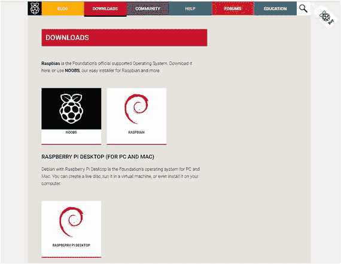

图 2-1

Raspbian download screen

### 使用 OpenCV 的 Raspbian

在这本书的结尾，我们将与计算机视觉一起向你展示为什么你应该使用一个树莓派 而不是一个能力较差的平台。然而，为了做到这一点，您需要在您的 Pi 上安装 OpenCV。不幸的是，对于 Raspberry Pi 没有简单的 OpenCV 安装程序。因为 Pi 运行在 ARM 处理器上，所以软件包必须从源代码编译，这是一个六小时的过程。

为了方便起见，我在 Raspbian Jesse 中预编译了 OpenCV，并在 [`https://github.com/jcicolani/Jesse-OpenCV`](https://github.com/jcicolani/Jesse-OpenCV) 创建了一个可下载的映像。

您仍然需要完成安装和配置过程来定制安装。该映像包含您需要更改的默认设置(除了构建时需要的一些例外)。

### “艰难”的方式

更困难的方法是将 Raspbian 操作系统映像直接安装在 SD 卡上——准备启动。这是我使用的方法，因为它并不比前面的方法更复杂，而且它允许我使用 NOOBS 没有的版本。

对于 Raspbian 安装，您有两种选择。Jessie 是操作系统的最新稳定版本；这是我们将要使用的。第一个选项是 Raspbian Jessie 和 PIXEL——他们新的优化 GUI。这是一个 1.5GB 的下载，解压缩后是一个 4.2GB 的图像。第二个选项是 Raspbian Jessie Lite，这是一个最小的映像，下载量小得多，只有 300MB(解压缩后只有 1.4GB)。然而，最小意味着没有 GUI，所以一切都是通过命令行完成的。如果你是无头 Linux 的粉丝，那么这是你的选择。我们将使用更大的像素安装。

如果安装了 BitTorrent 客户端，请单击“下载 Torrent”。这比下载。zip 文件。

1.  导航到 [`www.raspberrypi.org/downloads/`](http://www.raspberrypi.org/downloads/) 。
2.  单击 Raspbian 图像。
3.  选择您想要安装的 Raspbian 版本。
4.  下载完成后，将文件解压到你容易找到的地方。
5.  下载并安装 Win32 磁盘映像器。这允许您将刚刚下载的图像文件写入 micro SD 卡。可以在 [`https://sourceforge.net/projects/win32diskimager/`](https://sourceforge.net/projects/win32diskimager/) 获得。
6.  或者，您可能还想下载 SDFormatter，以确保您的 SD 卡已准备妥当。可以在 [`www.sdcard.org/downloads/formatter_4/`](http://www.sdcard.org/downloads/formatter_4/) 获得。
7.  将您的 micro SD 卡插入连接到计算机的读卡器。
8.  If you have downloaded and installed SDFormatter, open it. You should see a dialog box similar to the one shown in Figure [2-2](#Fig2).

    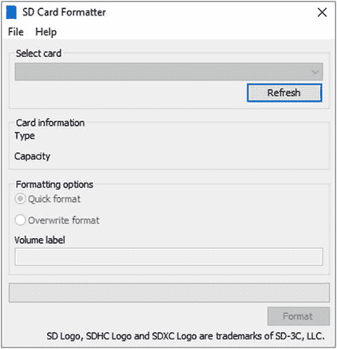

    图 2-2

    SD Card Formatter  
9.  确保您选择的驱动器代表您的 SD 卡。你将要格式化它，所以如果你选择了错误的东西，它会清除你在那个驱动器上的所有东西。工具通常默认选择正确的，但是要仔细检查。明智的做法是断开任何其他外部存储设备。
10.  确保“格式大小调整”设置为“开”。这将删除卡上的任何其他分区，并使用整个分区。将所有其他设置保留为默认值。
11.  单击开始。该过程完成后，您就可以安装操作系统了。
12.  要将图像刷新到 SD 卡，请打开 Win32 Disk Imager。
13.  在“图像文件”字段中，选择您下载的 Raspbian 图像。您可以点击文件夹图标来浏览它。
14.  确保在设备下拉框中选择了您的 SD 卡。同样，选择错误的设备可能会导致世界的伤害；所以要注意。
15.  单击写入。
16.  该过程完成后，从读卡器中取出卡。
17.  将卡插入 Raspberry Pi 上的 micro SD 读卡器。

这听起来很长，但是做起来非常快速和容易。接下来，我们来看一下 NOOBS 的安装过程。

### “简单”的方法

我把这个方法称为“简单”的方法，尽管困难的方法实际上很简单。让这变得容易的是，你不必直接写图像。你可能想要格式化卡片，但是如果是一张新卡，那就没有必要了。更简单的是，如果你购买的 Pi 是入门套件的一部分，那么它可能已经在 micro SD 卡上安装了 NOOBS。如果是这种情况，可以跳过前几步。

你有两个选择:NOOBS 和 NOOBS 建兴。NOOBS 在下载中包含了 Raspbian 的图像，所以一旦它存在你的 SD 卡上，你就不需要连接到网络来下载任何东西了。如果你愿意，你可以选择另一个操作系统，但是你需要把你的 Pi 连接到网络上，这样 NOOBS 才能下载它。NOOBS 建兴不包括完整的拉斯扁形象。出于我们的目的，选择标准 NOOBS 安装。

1.  单击下载页面上的 NOOBS 图像。
2.  选择你的 NOOBS 风味。如果安装了 BitTorrent 客户端，请单击“下载 Torrent”。这比下载。zip 文件。
3.  或者，您可能还想下载 SDFormatter，以确保您的 SD 卡已准备妥当。可以在 [`www.sdcard.org/downloads/formatter_4/`](http://www.sdcard.org/downloads/formatter_4/) 获得。
4.  如果您下载并安装了 SDFormatter，请将其打开。
5.  确保您选择的驱动器代表您的 SD 卡。你将要格式化它，所以如果你选择了错误的东西，它会清除你在那个驱动器上的所有东西。工具通常默认选择正确的，但是要仔细检查。明智的做法是断开任何其他外部存储设备。
6.  确保“格式大小调整”设置为“开”。这将删除卡上的任何其他分区，并使用整个分区。将所有其他设置保留为默认值。
7.  单击开始。该过程完成后，您就可以安装操作系统了。
8.  将 NOOBS 文件直接解压到 SD 卡上。
9.  从读卡器中取出卡。
10.  将卡插入 Raspberry Pi 上的 micro SD 读卡器。
11.  此时，您需要连接您的 Pi 以继续。所以，请跳到本章的“连接树莓派”一节。完成这些步骤后，请返回本部分继续设置。
12.  当你连接电源到树莓派，它启动到 NOOBS 安装屏幕。如果你使用 NOOBS 建兴，你有你的操作系统的选择。如果您使用标准的 NOOBS 下载，您唯一的选择是 Raspbian(这是可以的，因为这是我们正在使用的)。
13.  单击“Raspbian”以确保它已被选中。还要确保在屏幕底部选择了正确的语言(在我的例子中，是英语(美国))。
14.  单击屏幕顶部的安装按钮。

安装可能需要一点时间，所以去喝杯咖啡吧。

## 连接树莓派

现在你的微型 SD 卡已经准备好了，你需要连接上你的树莓派。如果你使用的是原始的第一代 Pi，这就有点复杂了。

然而，第一代之后的每个型号都包括多个 USB 端口和一个 HDMI 连接器，使事情变得更简单。连接 Pi 非常简单。

1.  通过 HDMI 电缆连接显示器。如果您使用的是配有分量连接而不是 HDMI 的小型电视机，Pi 上的音频插孔是一个四极分量插孔。你需要一个 RCA 到 3.5 毫米的转换器，通常是电缆形式，来做到这一点。
2.  将键盘和鼠标连接到 USB 端口。我使用无线键盘/触摸板组合，因为它小巧便携。
3.  确保您的带有 Raspbian 或 NOOBS 的 micro SD 卡安装在 Pi 上的 micro SD 端口中。本质上，这是你的小型电脑的硬盘，所以它必须在正确的位置。它不会通过连接到其中一个 USB 端口的 SD 读卡器读取操作系统。
4.  如果您使用以太网电缆，请将其连接到以太网端口。您也可以将 Wi-Fi 加密狗插入 USB 端口。如果你和我一样用的是 Pi 3，Wi-Fi 是内置的。
5.  将 5V 电源连接到微型 USB 端口。此端口仅用于电源。您不能通过 USB 访问主板。

就是这样。你的树莓派 应该看起来类似于图 [2-3](#Fig3) 所示。Pi 应该在您的显示器上启动。如果您正在安装 NOOBS，请返回 Noobian 安装的步骤 10 以完成安装过程。

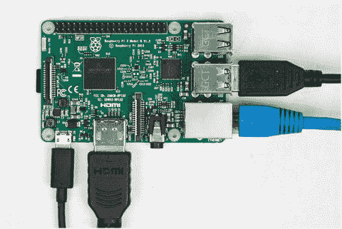

图 2-3

Raspberry Pi connections

现在您已经连接并启动，您需要登录。以下是 Raspbian 安装的默认凭据:

*   用户名:pi
*   密码:树莓

当然，默认的用户名和密码从来都不安全。因此，为了防止你的网络安全朋友带着你的机器人逃跑，我们要做的第一件事就是更改密码。在稍后的配置中，我们将更改默认用户名。

## 配置您的 Pi

现在我们已经完成了初始安装，接下来我们将进行一些定制。根据您的特定用途，Pi 有几个您可以启用的功能。最初，它们无法减少运行操作系统所需的一些开销。我们将要实现的配置设置是为了安全和方便。

### 使用 raspi-config

为了进行定制，Raspberry Pi Foundation 的优秀人员提供了一个名为 raspi-config 的实用程序。使用它需要命令行终端。现在只输入了一条命令，但是随着我们在研讨会中的深入，您会对终端窗口更加熟悉。如果你是 Linux 新手(Raspbian 是基于 Linux 的)，这可能有点吓人。不需要这样，我会尽力让你适应。但你必须学会如何应对。

你可以在 [`www.raspberrypi.org/documentation/configuration/raspi-config.md`](http://www.raspberrypi.org/documentation/configuration/raspi-config.md) 找到更多关于 raspi-config 实用程序的信息。

此时，您应该已经启动了您的 Raspberry Pi。如果没有，现在就做。

我们将做几件事来配置 Pi，首先扩展文件系统以利用整个 SD 卡。默认情况下，Raspbian 不使用整个 SD 卡，所以我们想告诉它。如果您正在使用 NOOBS，这已经为您完成，所以您可以跳过这一步。

1.  单击屏幕顶部的 Raspberry Pi 图标。这将打开一个应用列表。
2.  Select Accessories ➤ Terminal, as shown in Figure [2-4](#Fig4). When opened, the terminal window is displayed (see Figure [2-5](#Fig5)).

    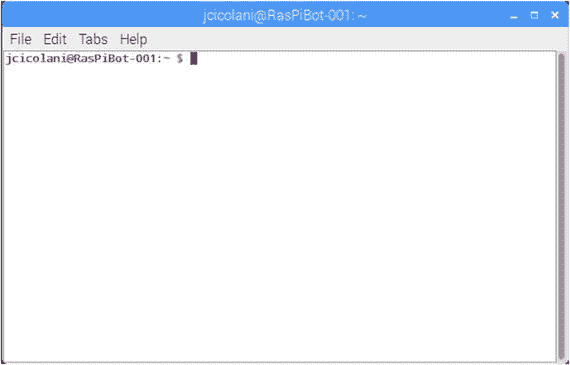

    图 2-5

    Terminal window

    

    图 2-4

    Terminal selection from the applications list. The terminal icon is also on the quick access bar.  
3.  Type `sudo raspi-config`. This opens the Raspberry Pi Software Configuration Tool, as shown in Figure [2-6](#Fig6).

    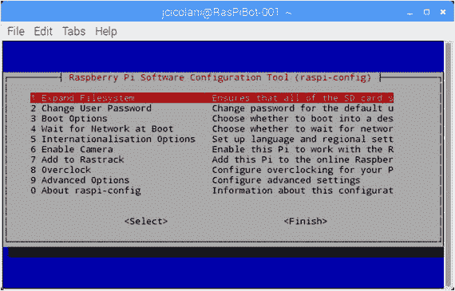

    图 2-6

    The raspi-config screen. Most OS-level options can be set here, including activating and deactivating services. Newer versions of Raspbian automatically expand your file system the first time you start the Pi. Unless you are using an older version of Raspbian, you should be able to skip this next step and move on to changing the password.  
4.  确保突出显示扩展文件系统。
5.  按回车键。系统弹出一条关于扩展文件系统的消息，要求您重新启动。(我们将在完成大部分更改后重启。)接下来，我们将更改用户密码。
6.  确保突出显示“更改用户密码”。
7.  按回车键。系统显示一条消息，提示您输入新密码。
8.  按回车键。这将使您进入终端，输入新密码。
9.  输入您的新密码，然后按 Enter 键。
10.  Confirm your new password and press Enter. This displays a confirmation that the password was successfully updated (see Figure [2-7](#Fig7)).

    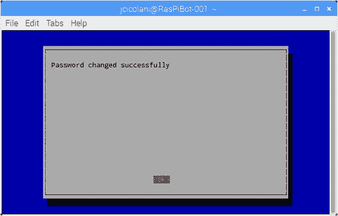

    图 2-7

    A password change confirmation in raspi-config  
11.  按回车键。接下来的几个步骤将激活我们稍后会用到的一些服务。首先，我们将把您的 Pi 的主机名改为在网络上更容易找到的唯一名称。当你和另外 20 个树莓派共处一室时，这变得尤为重要。
12.  Make sure that advanced options is highlighted, and then press Enter. This displays the interface and other options (see Figure [2-8](#Fig8)).

    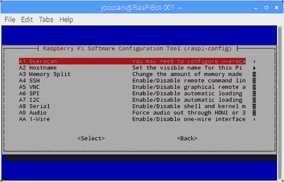

    图 2-8

    raspi-config advanced options. Hostname and service activation is accessed here. The hostname is how your Raspberry Pi appears on the network. You’ll want to give your Pi a unique name, especially when you consider how many of them may be on the network at any given time. The hostname should be both meaningful to the application and unique.  
13.  突出显示主机名，然后按回车键。
14.  一个对话框解释了主机名的要求。它只能是字母数字字符:没有符号，没有连字符，没有下划线。按回车键继续。
15.  输入您的新主机名，然后按 Enter 键。SSH 允许我们从另一台计算机通过终端窗口(SSH 客户端)访问 Pi。在 Windows 上，PuTTY 是一个非常流行的免费 SSH 客户端。SSH 不提供 GUI。所有交互都是使用终端命令完成的。如果您想要快速执行程序、安装软件等等，这是很有帮助的。随着您对终端越来越熟悉，您可能会发现自己使用 SSH 来连接简单的命令，而将 VNC(远程桌面)留给更复杂的任务，如编写程序。
16.  返回高级选项菜单。
17.  选择启用 SSH 并按回车键。
18.  确认您想要启用 SSH，然后按 Enter 键。
19.  再次按回车键返回菜单。I2C 是一种串行通信协议，在 Pi、Arduino 等嵌入式系统中非常流行。通过使用多个引脚，它可以与多个器件进行稳定的通信。我们将使用的电机控制板通过 I2C 进行通信。(如果你后来选择添加其他板，如伺服控制板，它也将使用 I2C。)只要设备有不同的地址，就可以一直堆叠。
20.  返回高级选项菜单。
21.  选择启用 I2C 并按回车键。
22.  确认您要启用 SSH，然后按 Enter。
23.  再次按回车键返回菜单。因为我们还计划使用 Raspberry Pi headless(没有连接显示器、键盘或鼠标)，所以让我们将它设置为自动引导到控制台。不用担心；正如您将看到的，当您想启动桌面 GUI 时，它是非常容易的。
24.  转到启动选项，然后按回车键。
25.  选择控制台并按回车键。如果您相信只有您能直接访问您的 Pi，您可以选择控制台自动登录。自动登录不适用于远程会话，只能通过键盘和显示器直接访问。
26.  更新所有设置后，突出显示 Finish 并按 Enter 键。
27.  Pi 会询问您是否要重新启动。选择是并按回车键。此时，您的 Pi 会重新启动。这可能需要几分钟，特别是如果您没有通过 NOOBS 安装，Pi 必须扩展您的文件系统。记住，我们设置 Pi 默认引导到控制台。因为接下来的几个步骤都是通过命令行完成的，所以我们不需要加载 GUI。然而，让我们无论如何做它以便你能看见它是多么容易。
28.  键入`startx`并按回车键。

你现在在 GUI 桌面上。

要退出桌面，请执行以下操作

1.  单击程序菜单(左上角的树莓图标)。
2.  单击电源按钮。
3.  选择退出到命令行。

您现在应该回到命令行了。

### 用户

Raspbian 的每个安装的默认用户是 pi。之前，我们更改了密码，使其更加安全。但是，您可能不希望总是以 pi 用户的身份登录。

记得我说过我们会更多地使用终端吗？好吧，现在开始。创建和管理用户最简单的方法是通过命令行。我们现在要走一遍这个过程。

#### 保护根

除了默认用户 pi 之外，Pi 上还有另一个默认用户。这是根用户。根用户本质上是机器用来执行低级命令的管理用户。这个用户可以访问任何东西，可以做任何事情，因为它是一台机器。但是，与默认 pi 用户不同，root 没有默认密码。它没有密码。

因此，当我们为我们的机器人配置和保护计算机时，让我们给根用户一个密码。

1.  打开终端窗口。
2.  类型`sudo passwd root`。`(`注意，`passwd`是正确的命令，而不是输入错误。)
3.  输入 root 用户的新密码。
4.  再次输入密码进行确认。

您的 root 用户现在是安全的，这很好，因为您将在配置的下一步需要它。

#### 更改默认用户名

您要做的第一件事是将默认用户名更改为您选择的名称。这将把用户名 pi 替换为您自己的用户名。这在设备上提供了另一层安全性；现在，不仅有人需要找出密码，他们甚至没有默认的用户名。它还保留了默认用户被赋予的一些特殊的、未记录的权限。

1.  注销 pi 用户。你可以通过菜单系统或者简单地在终端中输入`logout`来实现。
2.  使用现在安全的 root 用户登录。
3.  键入

    ```py
    usermod -l <newname> pi

    ```

    `<newname>`是您选择的新用户名。命令中不要包含`<`或`>`。
4.  要更新主目录名，请再次键入

    ```py
    usermod -m -d /home/<newname> <newname>

    ```

    ，`<newname>`是您在上一步中使用的新用户名。
5.  注销 root 用户，并使用您的新用户名重新登录。

此时，您已经更改了默认用户和 root 用户的默认用户凭据。您还更改了主机名。这是保护你的私人侦探和机器人的最低要求。

您的 Raspberry Pi 现在已经设置、配置好了，可以使用了。在我们进入下一章之前，我们还有一件事要做，那就是设置你的 Pi 为无头。

让一台机器“无头”仅仅意味着对它进行配置，这样你就不再需要连接显示器、键盘和鼠标来操作它。这通常通过两种方式实现:使用 KVM 交换机或设置远程访问。在移动机器人上，连接 KVM 并不是一个真正的选择。事实上，这与简单地将一切都连接到它没有什么不同。我们想要做的是设置 Pi，以便我们可以通过网络远程访问它。但首先，让我们确保您已连接到网络。

### 连接到无线网络

当您最初连接您的 Raspberry Pi 时，您可以选择连接以太网电缆。如果你这样做了，那么你已经在网络上了。但是，您仍然希望连接到无线网络。这允许你在机器人移动的时候遥控它。你可以向它发送命令，更新代码，甚至从第 [10](10.html) 章安装的网络摄像头观看视频。

若要连接到无线网络，您需要 Wi-Fi 连接。如果你使用的是 Raspberry Pi 3，那么你已经内置了一个；否则，你需要一个 Wi-Fi 加密狗，最好是可以通过 USB 端口供电的。这里的一点研究大有帮助。

1.  通过键入`startx`登录 GUI 界面。
2.  Click the network icon at the top right of your screen. This icon looks like Figure [2-9](#Fig9).

    

    图 2-9

    Network connection icon  
3.  从列表中选择您的无线网络。
4.  输入网络的安全密钥。

您现在应该已连接到无线网络。

## 变得没头了

在参加这些研讨会时，您不会想要携带额外的显示器、键盘和鼠标。为了让您的生活更加轻松，让我们设置一下，这样您就可以无头访问 Pi 了。

### 远程存取

有两种方法可以获得远程访问。一种方法是使用 SSH，它允许您使用终端客户端连接到远程设备。另一种方法是设置远程桌面。

#### 使用 xrdp 的远程桌面

让我们从从另一台计算机远程访问桌面开始。以下说明适用于 Windows 用户。大多数现代的 Windows 安装都已经安装了远程桌面连接，这是我们在设置好 Pi 后用来连接它的。

让我们在 Pi 上安装几个服务:tightVNCserver 和 xrdp。理论上，xrdp 应该自己安装 VNC 服务器。事实上，并不是这样。此时，您应该在 Pi 的命令行上。

1.  类型`sudo apt-get install tightvncserver`。
2.  完成安装。
3.  类型`sudo apt-get install xrdp`。安装完成后，您就可以开始工作了。若要连接，请执行以下操作。
4.  在 Pi 上，键入`sudo ifconfig`。
5.  如果您使用以太网电缆，请记下 eth0 块中的互联网地址(inet addr ),如果使用 Wi-Fi，请记下 wlan0 块中的互联网地址。
6.  On your laptop, open Remote Desktop Connection. This displays the connection dialog box, as shown in Figure [2-10](#Fig10).

    

    图 2-10

    Windows Remote Desktop Connection  
7.  从您的 Pi 输入 inet 地址。
8.  Click Connect. You should see the remote desktop screen with the xrdp login form (see Figure [2-11](#Fig11)).

    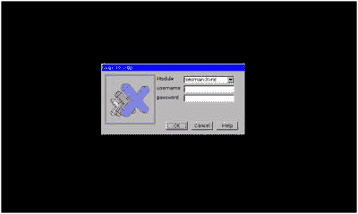

    图 2-11

    XRDP remote desktop login screen  
9.  输入您的用户名和密码。
10.  Click OK. This opens the desktop from your Pi (see Figure [2-12](#Fig12)).

    

    图 2-12

    Default Raspbian desktop viewed through a remote desktop session  

只要您的 Pi 的 IP 地址不变，您就不再需要键盘、鼠标或显示器来使用您的 Pi。

#### 带 PuTTY 的 SSH

最常见的 SSH 客户端可能是 PuTTY。免费使用，可从 [`www.chiark.greenend.org.uk/~sgtatham/putty/download.html`](http://www.chiark.greenend.org.uk/%7Esgtatham/putty/download.html) 下载。

您为 PuTTY 下载的文件是一个可执行文件，不需要安装。把它放在你的桌面或容易找到的地方。若要连接，请执行以下操作。

1.  Open the PuTTY interface (see Figure [2-13](#Fig13)).

    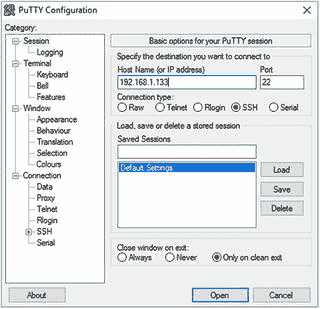

    图 2-13

    PuTTY configuration window  
2.  输入您的 Raspberry Pi 的 IP 地址。
3.  单击打开。
4.  You will likely get a security warning , as shown in Figure [2-14](#Fig14), but we know that this is the proper connection, so click Yes.

    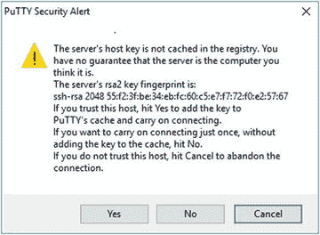

    图 2-14

    Security warning on first SSH connection with PuTTY A terminal window opens, asking for your username and password.  
5.  输入您的用户名和密码。你现在应该看到终端提示，如图 [2-15](#Fig15) 所示。

就是这样。您现在通过 SSH 连接到您的 Raspberry Pi。你可以同时拥有多个连接，但是不要超过你所需要的。当你使用像机器人操作系统(ROS)这样的东西时，多重连接是很方便的。(别担心，还有一段路呢。)ROS 通过终端运行多个程序。每一个都需要自己的终端窗口。使用 PuTTY，您可以根据需要拥有任意多的远程终端连接。

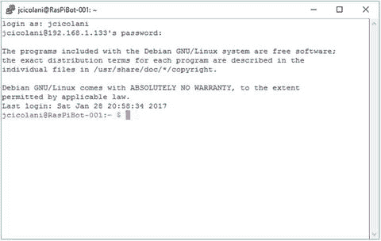

图 2-15

Open SSH connection

#### 在网络上查找您的设备

要远程访问您的 Pi，您需要知道它在网络上的 IP 地址。通常，网络交换机从一个会话到另一个会话保留设备的 IP；然而，这并不能保证。

在网络上找到你的设备的 IP 地址可能会很棘手。如果您在家，并且可以访问路由器的管理面板，这可能是找到您的设备的最直接的方法。只需登录您的路由器，找到连接的设备列表，向下滚动，直到找到您的 Raspberry Pi 的主机名。

如果你需要找到 IP 地址，但不在家，有几种方法可以做到这一点。最简单的是在手机上使用 Nmap 应用。我在安卓手机上用一个叫 Fing 的应用。一旦手机连接到本地 Wi-Fi 网络，该应用就会扫描网络，并列出该网络上的所有其他设备。您可以向下滚动列表，直到找到您的主机名。

如果网络对您来说是陌生的，您的 Raspberry Pi 不会自动连接到它。这种情况让事情变得有点棘手。为了方便起见，出门前要做好准备。我是 Windows 用户；如果不是，您需要为您的操作系统查找正确的过程。我在旅行时用我的笔记本电脑做这个操作。它允许我远程进入 Pi 足够长的时间来连接到本地 Wi-Fi 并获得 wlan0 IP 地址。

请记住，IP 是由笔记本电脑分配的。您在此操作结束时获得的 IP 可能无法在任何其他机器上工作。

在 Windows 7 或更高版本的机器上，您可以执行以下步骤来直接远程访问您的 Pi 以获取其 IP 地址。如果您需要直接连接到 Pi 来建立新的 Wi-Fi 连接，请记下 IP 地址。你需要一根短的以太网电缆，它应该放在你的工具箱里。

确定您能够在设置了显示器、键盘和鼠标的情况下，或者通过 Wi-Fi 网络的远程连接来查看您的 Raspberry Pi。Pi 不能通过以太网电缆连接到网络，因为此操作需要该端口。

1.  将以太网电缆连接到您的笔记本电脑。
2.  将另一端连接到 Pi 上的以太网端口。
3.  在 Pi 上打开一个终端窗口。
4.  类型`sudo ifconfig`。
5.  找到 eth0 模块中的 inet 地址。
6.  打开笔记本电脑上的终端窗口。您可以通过在开始菜单中搜索`cmd`来完成此操作。
7.  在 Windows 终端中键入以下内容:

    ```py
    ping <your.Pis.IP.address>

    ```

    `<your.Pis.IP.address>`是来自 Pi 的 eth0 IP 地址。
8.  打开笔记本电脑上的远程桌面连接。
9.  从 Pi 输入 IP 地址，然后按 Enter 键。

现在，您应该可以从笔记本电脑直接远程连接到 Raspberry Pi。请确保保存此 IP 地址，以便以后可以找到它。远程桌面连接应该记住它，但最好也将它保存在其他地方。

现在，无论您何时尝试连接到新的 Wi-Fi 网络，您都可以使用以太网电缆直接从笔记本电脑远程连接到您的 Pi。远程登录后，只需从可用网络列表中选择网络，然后输入密码(如果有)。

## 摘要

树莓派是为业余爱好者设计的。小型 Linux 计算机使它对许多不同类型的项目非常有用，但这意味着你需要学习一点 Linux。Raspberry Pi 基金会的开发人员提供了一个简单易用的 Debian Linux 版本，名为 Raspbian。

我们通过配置远程访问将基本安装向前推进了一步。这使你可以通过网络远程访问你的机器人，这意味着不再需要显示器和键盘。