# 六、驱动电机

在第 [4](04.html) 章中，我们使用 Raspberry Pi 的 GPIO 引脚来控制 LED 并接收来自超声波传感器的信息。在第 5 章[中，我们讨论了 Arduino，并讨论了为什么它是通用 GPIO 功能的更好选择。我们将超声波测距仪和 LED 连接到 Arduino，并学习如何在两块电路板之间传递数据。](05.html)

但这并不意味着我们已经完成了 Raspberry Pi 的 GPIO 头。在这一章中，我们将使用 GPIO 引脚连接到一个叫做电机驱动器的电路板，该电路板用于与 DC 电机和步进机交互。我将介绍一些不同类型的电机，并讨论什么是电机驱动器，以及为什么它在我们的工作中很重要。

我们将把 DC 马达连接到马达控制器上，并编写一个小程序使它们转动。作为示例程序的一部分，我们将研究如何控制电机的速度和方向。我们还将了解为研讨会选择的特定电机控制器的一些属性。

您可能选择不使用建议的电机控制器，因此我们也将看看一个常见的替代方案:L298N 电机驱动器。许多制造商提供的驱动板旨在连接到 L298N H 桥控制器芯片的核心。但是因为这些板依赖 PWM 信号来设置速度，我们必须通过 Arduino 连接它。我将在这一章的结尾回顾这一切。

在本次研讨会结束时，你将拥有开始制造机器人所需的最后一个组件:运动。在第 [7](07.html) 章中，我们将把所有东西和底盘套件放在一起，让你的机器人动起来。

## 电机和驱动器

在讨论电机控制器之前，让我们花点时间看看我们在控制什么。我们使用的驱动器是为简单的 DC 电机设计的，尽管它也可以用来驱动步进电机。让我们在这一节看看驱动器和电机。

### 电机类型

马达将电能转化为旋转能。它们有许多不同的类型，它们为几乎所有移动的东西提供动力。最常见的电机类型是简单的 DC 电机，它甚至用于许多其他类型的电机。例如，伺服电机是一种将 DC 电机与电位计或其他反馈设备以及控制精确运动的传动装置结合在一起的设备，无论是角度运动还是方向运动。其他类型的电机包括步进电机，它使用电脉冲来控制非常精确的运动，以及无芯电机，它重新排列 DC 电机的典型部件以提高效率。

#### DC 汽车公司

DC 发动机由磁场中的一系列线圈组成。当电荷加在线圈上时，会使线圈绕着它们共有的轴旋转。简单的电动机的线圈围绕一个中心轴排列和连接。当轴和线圈旋转时，与轴接触的电刷保持电气连接。轴又从组件中伸出，以利用旋转力做功。图 [6-1](#Fig1) 显示了典型的 DC 电机。

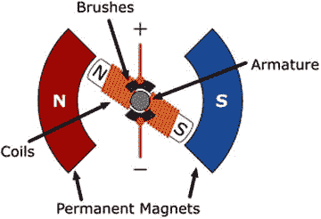

图 6-1

DC motor operation

你通常会发现这些电机连接到变速箱、皮带或链条上，以转速为代价来放大电机的扭矩。这样做是因为一个裸露的 DC 发动机可以产生很大的速度，但原始速度很少有用。

我们正在使用的发动机就是这种类型的。它们是附在齿轮箱上的简单的 DC 发动机。

#### 无刷电机

另一种类型的电机将机械连接移动到磁体。线圈保持静止。当施加电荷时，磁铁绕着共同轴上的线圈旋转(见图 [6-2](#Fig2) )。这样就不需要电刷了，所以被称为无刷电机。

在业余爱好领域，无刷电机通常与多旋翼飞机联系在一起。它们也广泛应用于其他需要高速和高效率的领域，例如 CNC(计算机数字控制)主轴。你可能熟悉 Dremel 工具或路由器；这两种设备都是主轴类型，使用无刷电机。

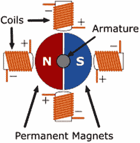

图 6-2

Brushless motor operation

#### 步进电机

到目前为止，我所讨论的所有马达都有一个或多个线圈，利用单一电荷工作。电荷可以是正的，也可以是负的，从而改变马达的方向。

步进电机则不同。步进器使用带有不同电荷的多个线圈(见图 [6-3](#Fig3) )，将一次完整的旋转分成多个步进。通过操纵这些电荷，我们可以使马达移动并保持在某一步的位置上。这使得这些电机非常适用于数控机床、3D 打印机和机器人等应用中的有限控制。

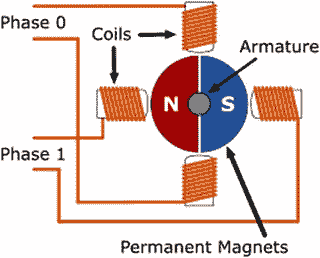

图 6-3

Stepper motor operation

##### 伺服系统

伺服电机是一个移动到特定角度并保持该位置的电机。它们通常在任一方向上具有 45 至 90 度的最大旋转。他们通过在最终输出齿轮上连接一个电位计来实现这一点。电位计向内部控制板提供反馈。当伺服系统接收到信号时，通常是以 PWM 的形式，电机旋转直到电位计和信号达到平衡。

图 [6-4](#Fig4) 显示了一个典型的爱好伺服。

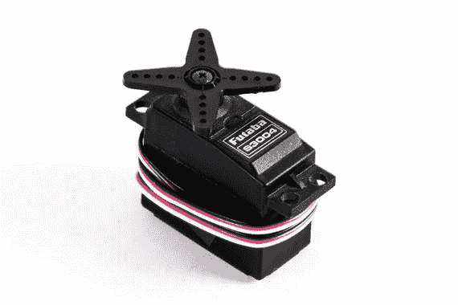

图 6-4

Common servomotor

去掉限制器和电位计的伺服系统称为连续旋转伺服系统。它们用于需要扭矩的应用中。许多机器人由连续旋转伺服系统驱动。

这是一个一种爱好极大地有益于另一种爱好的例子。常见的爱好伺服最初用于爱好遥控飞机。由于大多数爱好者买不起昂贵的设备来控制他们的工艺，他们想出了如何大幅降低价格。这当然有助于我们这些机器人爱好者。

### 电机属性

在我们的项目中，有一些关于电机的事情需要记住。最重要的是电机的电气特性，特别是电压和电流。

#### 电压

你已经对电压有些熟悉了，电压是运行一个设备所需要的电能的一种度量。Pi 由 5 伏电压供电，但在 3.3 伏电压下运行。Arduino 在 5 伏电压下运行，由 Pi 的 USB 端口供电。我们正在使用的马达是 6 伏的。保持这些电压是很重要的。如果你在一个 3.3 伏的设备上加 5 伏电压，你可能会损坏你的设备。

有专门设计的设备来帮助管理项目中的电压。电压调节器(升压或降压)保持恒定的电压。常见的 7805 5V 稳压器，取 6 到 12 伏，转换成 5 伏。多余的能量以热的形式消散，它们会变得非常热。

电压调节器非常适合电压供应，但对于转换器件中的 5 伏和 3.3 伏电压用处不大。为此，我们使用逻辑电平转换器，它需要来自两个器件的基准电压，但可以安全地转换器件之间的电压。

现在，您已经意识到了设备电压需求的差异。接下来，我们看看安培数。

#### 安培数

安培数是电流的量度，或者是我们的设备运行所需的电压。最常见的类比是流水线中的水，其中电压是流水线的大小，安培数是流经流水线的水量。实际上，我喜欢将类比改为使用橡胶管。如果你试图通过一个橡胶管推出太多的水，就会发生不好的事情。

在电子领域，这通常用较小的单位毫安来衡量，通常记为 mA。例如，大多数设备的 USB 端口被限制在 800 毫安的功率。这恰好与我们选择的电机使用的功率相同；但是，它没有考虑功率尖峰。

设备上的电压有些被动。该设备使用你提供的电压，从不试图获取更多。安培数完全相反。一个设备渴望安培数，并继续汲取它所需要的，直到它满意地做它的工作，或超过可用的供应。

组件和设备需要一定的功率来工作。他们也有一个他们可以承受的最大功率。由于额外的电能转化为热量，如果你超过一个设备的最大耐受电流，它就会变热并死亡。有时非常壮观。

这个故事的寓意是“永远注意你正在画的水流。”这不仅适用于电机。led 因消耗大量电流而臭名昭著。

##### 电机和放大器

众所周知，电机是耗电设备。他们不断地试图实现他们的目的:旋转。当电机上没有负载、重量或阻力时，它会以最小的电流消耗愉快地旋转。然而，开始增加电阻，电机汲取越来越多的电流，直到它达到它可以汲取的最大值，这被称为失速电流。失速电流实质上是当轴被物理限制移动时电机的安培数。

当电机启动、快速改变方向或遇到太大的旋转阻力时，它消耗的功率会急剧增加。如果这种突然的汲取对于供应来说太多了，那么一定有什么东西损坏了。我们拿一个 800mA 的源来说，比如一个 USB 插口；如果电机突然消耗 1 安培或更大的电流，USB 插孔可能会损坏。

### 电机驱动器

大多数微控制器、微处理器和电子设备只能处理少量电流。如果电流过大，它就会开始烧坏。因为电机通常很容易超过这个最大电流，所以通常不希望将任何大尺寸的电机直接连接到处理器。因此，我们将使用一种称为电机驱动器或电机控制器的设备。

电机控制器就是为此目的而设计的。它使用来自微控制器的低功率信号来控制大得多的电流和/或电压。在我们的例子中，我们使用电机控制器来控制来自 GPIO 引脚的 3.3 伏电压和 6 伏电压。我们通过一系列具有更大 1.2A (1，200mA)电流容差的元件来实现这一点，这些元件可以处理高达 3.0A (3，000mA)的短暂尖峰。

## 使用电机控制器

让我们看看两个电机控制器。第一个是阿达果的 DC &步进电机帽。该控制板专门设计用于安装在 Raspberry Pi 上。实用性和便利性的结合使它成为我对像我们这样的项目的首选。

另一个电机控制器是 L298N，它是一个 H 桥 IC。虽然 L298N 实际上是一个独立的组件——一个芯片，但有许多制造商已经构建了一个方便的分线板。当有人提到 L298N 电机控制器时，通常指的就是这种类型的电路板。本书中使用的是我在亚马逊上花 5 美元找到的通用版本。我的一些朋友说我为此付出了太多。

### Adafruit DC &步进电机

本项目中的电机驱动器为 Adafruit 的一款，可在 [`www.adafruit.com/products/2348`](http://www.adafruit.com/products/2348) 买到。关于如何使用它的信息在 [`https://learn.adafruit.com/adafruit-dc-and-stepper-motor-hat-for-raspberry-pi`](https://learn.adafruit.com/adafruit-dc-and-stepper-motor-hat-for-raspberry-pi) 。事实上，我们要讲的大部分内容都来自这个 Adafruit 网站。

为我们的机器人选择这个设备有几个原因；更重要的是，它直接安装在树莓皮上，从而限制了在机器人上安装电子设备所需的面积。你很快就会知道，安装空间对大多数机器人来说都是非常珍贵的；尤其是如果你想保持它的紧凑。以下是使用此板的一些其他原因:

*   它可以控制多达四个 DC 电机或两个步进电机。
*   通信是通过 I2C 串行通道处理的，它允许多个器件堆叠在一起(这就是为什么我们在接头上使用较长的引脚)。
*   因为它使用 I <sup>2</sup> C，它有自己专用的 PWM 模块来控制电机，所以我们不必依赖 Pi 本身的 PWM。
*   它有四个 H 桥电机控制电路，电流为 1.2A，峰值电流为 3.0A，具有热关断功能，内部保护二极管可保护您的主板。
*   有四个双向电机控制，带 8 位速度控制(0 至 255)。
*   使用端子板可以轻松连接。
*   有现成的 Python 库。

#### 需要一些组件

该板以套件形式提供，需要焊接。如果您还没有这样做，您需要在继续项目之前组装它。请记住，我们为接头指定了更长的引脚，所以不要使用套件附带的引脚。

焊接练习时间到了。

有许多小引脚(40 个)需要焊接。如果你不熟悉焊接，你需要花点时间来学习。尽管焊接指导非常简单，但它超出了本书的范围。互联网上有很多有用的视频。我也强烈建议你找到你当地的创客空间。那里肯定有人能给你上一堂速成课。图 [6-5](#Fig5) 显示了我的简单焊接设置。

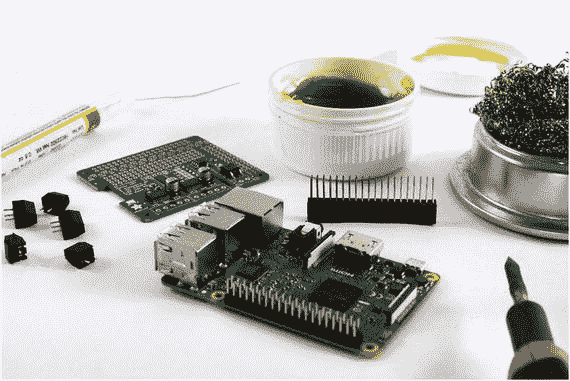

图 6-5

Preparing to assemble the motor HAT

组装电机帽非常容易，虽然有焊接涉及。你可以在 Adafruit 网站 [`https://learn.adafruit.com/adafruit-dc-and-stepper-motor-hat-for-raspberry-pi/assembly`](https://learn.adafruit.com/adafruit-dc-and-stepper-motor-hat-for-raspberry-pi/assembly) 找到组装的详细说明。

在这个练习中，你需要一个烙铁和焊料。我建议手边准备一些助焊剂，以及一些保持焊接头清洁的东西。回到学校后，我们用湿海绵来清洁顶端，但现在有更好的东西来做这项工作。你的覆盆子酱也会有帮助。

1.  Mount the extended header onto the Raspberry Pi’s 40-pin header (see Figure [6-6](#Fig6)). This helps stabilize things as you solder.

    

    图 6-6

    Extended stacking header on the Pi’s 40-pin GPIO  
2.  Mount the Motor HAT circuit board onto the headers (see Figure [6-7](#Fig7)). To help hold the board at a better angle for soldering, you may want to put something to support the other side. One of the terminal blocks works well for this.

    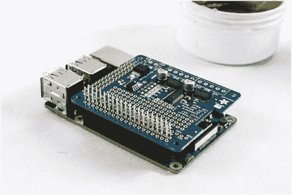

    图 6-7

    Circuit board mounted on the header  
3.  焊接第一个引脚。
4.  Once the first pin is soldered, heat it up again and adjust the board so that it sits properly (see Figure [6-8](#Fig8)). When the solder for the pin cools, it will hold the board at the right angle while you solder the rest of the pins. If you supported the board with a terminal block or something else so that the board is sitting straight, you may be able to skip this step .

    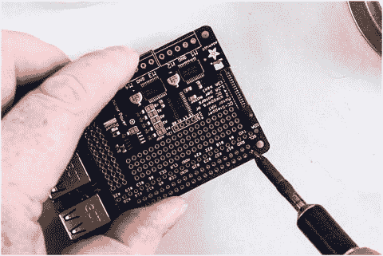

    图 6-8

    Adjusting the placement and angle of the board  
5.  Solder the rest of the first row (see Figure [6-9](#Fig9)). You want a nice, clean, shiny joint.

    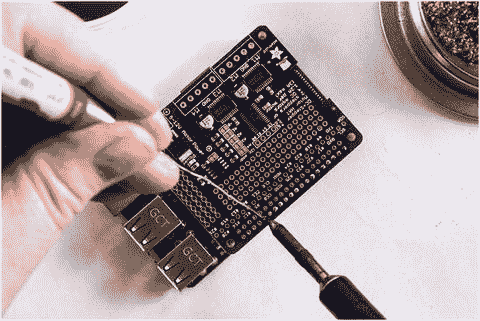

    图 6-9

    Solder the first row of pins  
6.  Rotate the board 180 degrees and solder the second row (see Figure [6-10](#Fig10)).

    

    图 6-10

    Rotate the Pi and solder the remaining pins  
7.  从码头上取下帽子。
8.  Mount the screw terminals onto the board (see Figure [6-11](#Fig11)).

    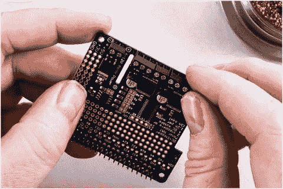

    图 6-11

    Adding the terminal blocks to the circuit board  
9.  Use tape to hold the terminals in place while you flip the board over (see Figure [6-12](#Fig12)).

    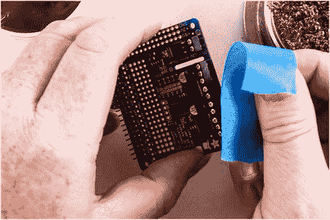

    图 6-12

    Tape helps hold the terminal blocks on the board while you turn it over to solder them into place  
10.  Solder the terminals in place (see Figure [6-13](#Fig13)).

    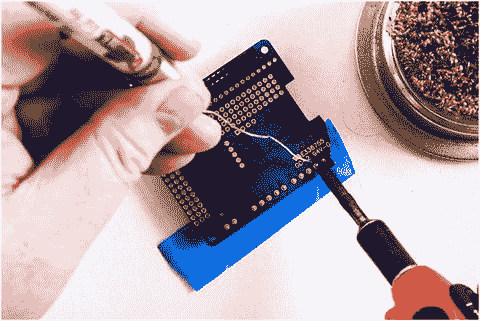

    图 6-13

    Soldering the terminal pins  

一旦你拿掉胶带，你就完成了。马达帽已经可以使用了。将帽子安装到码头上。您需要支撑带有端子的一侧，使其不会在 HDMI 外壳上短路(参见图 [6-14](#Fig14) )。

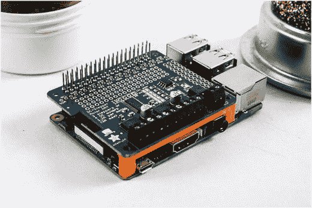

图 6-14

The completed board mounted on the Raspberry Pi. The orange support piece is 3D printed .

#### 连接电机控制器

连接发动机罩非常简单。只需将电路板安装在 Pi 的 GPIO 接头上。然而，有几件事需要注意。首先，小心不要弄弯树莓皮或帽子上的任何一个别针。这非常容易做到。电机帽上的接头销特别容易弯曲。

您还需要注意不要使端子板短路。你会注意到，安装时，焊点非常靠近 HDMI 连接的金属外壳(见图 [6-15](#Fig15) )。对此有两个简单的解决方案。第一种解决方案(在您应用第二种解决方案之前，这是我们将在研讨会中进行的工作)是简单地在 Pi 的 micro USB 和 HDMI 连接器的金属外壳上放置一块绝缘胶带。第二个解决方案(推荐)是获得一些偏移量来支持帽子的侧面。垫片和螺钉也可以完成这项工作。重点是，你不希望电路板下垂并与外壳接触，这可能会导致短暂的灯光表演，并破坏电机帽和 Pi。

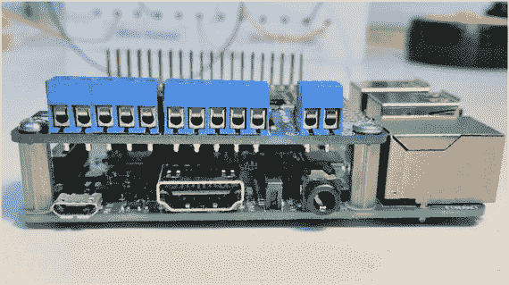

图 6-15

Adafruit Motor HAT mounted on a Raspberry Pi

一旦电路板安装好，并安全地与短路绝缘，就该连接电机了。在第一个教程中，我们将只使用一个电机。第二段代码控制两个，所以我们现在最好把它们连接起来。

但在此之前，我们必须准备好马达。现在，如果你的马达附带了引线，那么你就领先了。否则，您需要将导线焊接到您的电机上，如图 [6-16](#Fig16) 所示。我倾向于为有问题的电机使用适当尺寸的黑色和红色电线。我还喜欢确保每个电机上的导线匹配(黑线连接到每个电机的同一个电极，红线连接到每个电机的同一个电极)。这样我就不必事后猜测事情是如何联系在一起的。

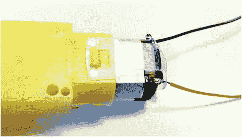

图 6-16

Leads soldered to motor terminals

在这种情况下，我使用的是 26AWG 绞合线。铅丝一般有两种:绞合的和实心的。固体更加坚硬，非常适合跳投或者没有太多力矩的情况。绞合线由包裹在一个护套中的多根较细的线组成。它更加灵活，非常适合可能会有移动的应用。绞合线稍难处理，进入端子板的末端应镀锡，或涂上焊料(见图 [6-17](#Fig17) )。这使得该端具有刚性，并且它在端子板中连接得更好。

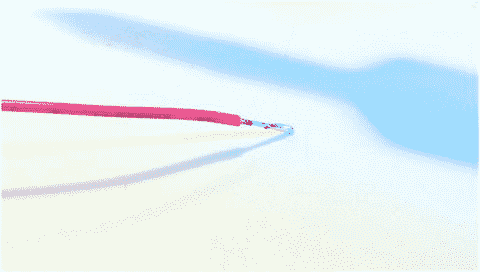

图 6-17

Tinned lead

接下来的步骤是将电机连接到端子板。

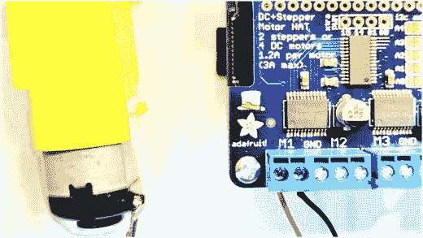

图 6-18

Motor connected to the Motor HAT

1.  确保接线盒是打开的，接线盒内的螺钉一直拧到顶部。确保不要拆下螺丝。你需要用一把相当好的十字螺丝刀。
2.  将一根镀锡导线插入标有 M1 的端子板一侧的孔中(参见图 [6-18](#Fig18) )。哪根线连接到哪个端口并不重要，只要两根线连接到同一个驱动程序的不同端口(在本例中是 M1)。
3.  拧紧与电线插入的孔相对应的螺钉。
4.  对电机的第二根导线重复该程序。

在这一点上，如果你是如此倾向，你可以连接第二个电机。我倾向于颠倒引线的顺序，因为它们是指向机器人的相反侧。您需要一个正向命令来使左马达朝一个方向转动，右马达朝另一个方向转动。如果它们都朝同一个方向转动，那么机器人就原地旋转。

您将对四节 AA 电池组的电源端子重复该过程。确保红色导线指向正极(+)侧，黑色导线指向负极(–)侧(参见图 [6-19](#Fig19) )。

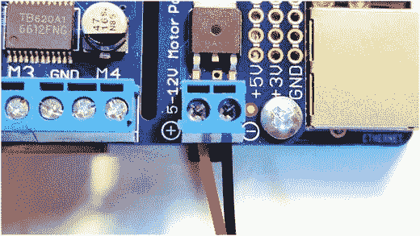

图 6-19

External battery pack connected to the Motor HAT

您的电路板和电机看起来应该与图 [6-20](#Fig20) 相似。连接好电机和电池组后，您就可以开始编码了！

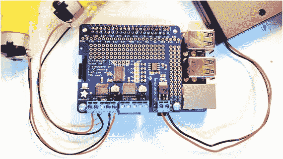

图 6-20

Completed connections to the Motor HAT

#### 使用摩托帽

安装好电机帽，连接好电机和电机电源后，就可以启动 Pi 并登录了。

##### 安装库

一旦启动并连接到您的 Pi，您需要为 Motor HAT 安装 Python 库。这些可以从 Adafruit GitHub 站点获得。

1.  打开终端窗口。
2.  导航到您的 Python 代码目录。我的情况是`TRG-RasPi_Robot`。
3.  输入以下内容:

    ```py
    git clone https://github.com/adafruit/Adafruit-Motor-HAT-Python-Library.git
    cd Adafruit-Motor-HAT-Python-Library

    ```

4.  安装 Python 开发库。

    ```py
    sudo apt-get install python-dev

    ```

5.  安装马达帽库。

    ```py
    sudo python setup.py install

    ```

至此，您的 Pi 已经用必要的库更新了，是时候开始编写代码了。

##### 代码

在我们开始编码之前，有一个快速但重要的注意事项。以前，我们几乎什么都用 Python 3。在本次研讨会中，我们将使用 Python 2.7。为什么？嗯，Adafruit 提供的默认库在 Python 2.7 中。可能会有 Python 3.x 库，但我们将使用本次研讨会的默认库。

正如您在之前的研讨会中所发现的，无论何时使用 GPIO 引脚，您都需要以超级用户的身份运行您的代码(`sudo`)。有几种方法可以做到。一种方法是保存您的 Python 代码，使文件可执行，然后用`sudo`运行程序。这是您将来运行代码的正确方式。对于车间，我们将走捷径。我们将从命令行使用`sudo`启动 IDLE IDE，这使得任何程序都可以使用`sudo`从 IDLE run 实例运行。

###### 转动单个电机

1.  打开终端窗口。您可以使用安装时使用的同一台计算机；但是只要 IDLE 是打开的，这个终端窗口就是锁定的。
2.  类型`sudo idle`。
3.  在空闲的 IDE 中，创建一个新文件并另存为`motors.py`。
4.  输入以下代码:

    ```py
    from Adafruit_MotorHAT import Adafruit_MotorHAT as amhat
    from Adafruit_MotorHAT import Adafruit_DCMotor as adcm

    import time

    # create a motor object
    mh = amhat(addr=0x60)
    myMotor = mh.getMotor(1)

    # set start speed
    myMotor.setSpeed(150)

    while True:
        # set direction
        myMotor.run(amhat.FORWARD)

        # wait 1 second
        time.sleep(1)

        # stop motor
        myMotor.run(amhat.RELEASE)

        # wait 1 second
        time.sleep(1)

    ```

5.  保存文件。
6.  按 F5 运行程序。

让我们看一下代码。

我们首先从 Adafruit_MotorHAT 库中导入我们需要的对象，并为它们分配别名，这样我们就不必在每次使用它们时都写下完整的名称。我们还为代码后面的延迟导入了时间库。

```py
from Adafruit_MotorHAT import Adafruit_MotorHAT as amhat
from Adafruit_MotorHAT import Adafruit_DCMotor as adcm

import time

```

接下来，我们创建一个电机对象的实例。为此，我们告诉 Python 我们正在使用位于默认 I2C 地址`0x60`的 Motor HAT。然后，我们为连接到 M1 的马达或马达 1 创建一个马达对象。这让我们可以访问马达的方法和属性。

```py
mh = amhat(addr=0x60)
myMotor = mh.getMotor(1)

```

在我们打开马达之前，对于这个程序，我们将启动速度设置为半速多一点。

```py
myMotor.setSpeed(150)

```

现在我们将电机驱动代码的剩余部分包装在一个`while`循环中。只要`True`值为真，这段代码就会一直执行。

```py
while True:

```

驱动电机的代码非常简单。我们向前驱动电机一秒钟，然后停止电机一秒钟。程序一直这样做。

```py
    # set direction
    myMotor.run(amhat.FORWARD)

    # wait 1 second
    time.sleep(1)

    # stop motor
    myMotor.run(amhat.RELEASE)

    # wait 1 second
    time.sleep(1)

```

在键盘上按 Ctrl-C。

请注意，程序结束，但电机继续转动。那是因为马达帽是自由运转的。这意味着控制器继续执行从 Pi 接收的最后一个命令。如果我们不让它停下来，它就不会停下来。

现在我们要做一些有趣的事情。一些我们以前没做过的事。我们将把电机驱动代码打包到一个`try/except`块中。这是一段代码，它允许我们捕获发生的任何错误，然后优雅地处理它们。

在这个特殊的例子中，我们将使用`try/except`块来捕获`KeyboardInterrupt`事件。当我们使用 Ctrl-C 退出程序时，这个事件被触发。

1.  将`while`循环的代码修改如下:

    ```py
    try:
        while True:
            # set direction
            myMotor.run(amhat.FORWARD)

            # wait 1 second
            time.sleep(1)

            # stop motor
            myMotor.run(amhat.RELEASE)

            # wait 1 second
            time.sleep(1)

    except KeyboardInterrupt:
        myMotor.run(amhat.RELEASE)

    ```

2.  运行程序。
3.  让它运行一会儿，然后按 Ctrl-C。

程序退出时，电机将停止。

Python 捕获了`KeyboardInterrupt`事件，并在退出之前执行最后一行代码。代码释放电机，并简单地关闭它。

###### 转动两个电机

转动单个马达很好，但我们的机器人将有两个马达，我们希望它们独立运行。我们还希望它们能够改变速度和方向。

要操作多个电机，只需为每个电机创建一个不同的电机对象实例。假设您之前连接了两台电机，我们将创建两台电机并向每台电机发送命令。我们还改变了马达的速度和方向。

1.  从空闲状态创建新的 Python 文件。
2.  将文件另存为`two_motors.py`。
3.  输入以下代码:

    ```py
    from Adafruit_MotorHAT import Adafruit_MotorHAT as amhat, Adafruit_DCMotor as adcm

    import time

    # create 2 motor objects
    mh = amhat(addr=0x60)

    motor1 = mh.getMotor(1)
    motor2 = mh.getMotor(2)

    # set start speed
    motor1.setSpeed(0)
    motor2.setSpeed(0)

    # direction variable
    direction = 0

    # wrap actions in try loop
    try:
        while True:
            # if direction = 1 then motor1 forward and motor2 backward
            # else motor1 backward and motor2 forward
            if direction == 0:
                motor1.run(amhat.FORWARD)
                motor2.run(amhat.BACKWARD)
            else:
                motor1.run(amhat.BACKWARD)
                motor2.run(amhat.FORWARD)

            # ramp up the speed from 1 to 255
            for i in range(255):
                j = 255-i

                motor1.setSpeed(i)
                motor2.setSpeed(j)

                time.sleep(0.01)

            # ramp down the speed from 255 to 1
            for i in reversed(range(255)):
                j = 255-i

                motor1.setSpeed(i)
                motor2.setSpeed(j)

                time.sleep(0.01)

            # wait half a second
            time.sleep(0.5)

            # change directions
            if direction == 0:
                direction = 1
            else:
                direction = 0

    # kill motors and exit program on ctrl-c
    except KeyboardInterrupt:
        motor1.run(amhat.RELEASE)
        motor2.run(amhat.RELEASE)

    ```

4.  保存文件。
5.  按 F5 运行程序。

在很大程度上，代码是相同的。我们添加了几个`for`循环来计数到 255，然后再返回。我们创建了两个变量来保存这个值；第二个函数通过从 255 中减去该值来反转该值。我们也有一个变量来跟踪电机转动的方向。一旦两个马达都再次加速和减速，我们改变方向，再做一次。我们使用和以前一样的退出代码。

### L298N 通用电机驱动器

L298N 是一种常见的 H 桥电机控制器芯片。一些制造商已经将芯片安装在电路板上，并添加了所有必要的支持电子设备。最终结果是一个流行的，通用的电机控制器。

#### h 桥电机控制器

H 桥电机控制器是你会遇到的最常见的电机控制器。它的名字来源于示意图中独特的 H 形。H 桥本质上由四个控制电机电流的栅极组成。根据闸门打开和关闭的方式，您可以控制电机旋转的方向。

在 L298N 上，有两个使能引脚(每个电机一个)和四个输入引脚。in1 和 in2 引脚控制电机 1，而 in3 和 in4 控制电机 2。图 [6-21](#Fig21) 显示了浇口的排列方式；in1 控制着 S1 和 S4，in2 控制着 S3 和 S2。当 in1 或 in2 为高电平时，它们各自的栅极关闭。当它们处于低位时，门就会打开。

当 in1 为高电平，in2 为低电平时，电流流动，使电机顺时针旋转。如果 in1 为低电平，in2 为高电平，电机逆时针旋转。如果两个引脚都为高电平，电机就不会旋转，实际上是踩了刹车。如果两个引脚都为低电平，则没有电流流过电机，电机自由旋转。


图 6-21

H-bridge motor controller operation

剩下使能引脚 enA 和 enB，用于设置电机速度。这就是我们在这些引脚上使用 PWM 的原因。PWM 允许我们改变每个电机的速度。如果我们使用标准的数字引脚，我们可以启动和停止电机，但它要么是全功率或无功率。PWM 让我们能够更好地控制电机。

#### 使用 L298N

L298N 有几种使用方法；各有利弊。一种方法是将引脚连接到 Raspberry Pi，其优点是可以直接由 Pi 控制。缺点是您可能必须使用逻辑电平转换器，因为 Pi 的引脚是 3.3 伏，而控制器是 5 伏。而且，你失去了控制速度的能力。速度控制需要 PWM，正如我在前面章节中所讨论的，这是 Pi 所不具备的一个方面。

我首选的连接 L298N 的方法是通过 Arduino。这样，你就可以通过 PWM 来控制速度。此外，由于 Arduino 和控制器都是 5 伏，所以不需要使用逻辑电平转换器。当然，这里的缺点是，你必须通过串行将电机指令传递给 Arduino。

##### Arduino 伫列

在本练习中，Arduino 只是充当电机控制器的通道。我们将从串行流中读取指令，并将这些值传递给电机控制器。Arduino 将不执行任何逻辑。如果在现实世界中实现这一点，您可能希望传感器充当中断。通过允许传感器中断正常操作，您可以在项目中建立一些安全性。

1.  在 Arduino IDE 中打开一个新的草图。
2.  将草图另存为`L298N_passthrough`。
3.  输入以下代码:

    ```py
    int enA = 9;
    int in1 = 8;
    int in2 = 7;
    int in3 = 5;
    int in4 = 4;
    int enB = 3;

    int enAVal, in1Val, in2Val, in3Val, in4Val, enBVal;

    void setup() {
      // put your setup code here, to run once:
      Serial.begin(9600);

      pinMode(enA, OUTPUT);
      pinMode(in1, OUTPUT);
      pinMode(in2, OUTPUT);
      pinMode(in3, OUTPUT);
      pinMode(in4, OUTPUT);
      pinMode(enB, OUTPUT); 

    }

    void loop() {
      // Only work if there is data in the serial buffer
      while(Serial.available() > 0){

        // Read the ints from the serial port
        enAVal = Serial.parseInt();
        in1Val = Serial.parseInt();
        in2Val = Serial.parseInt();
        // Only read the next three if there is data
        if(Serial.available() > 0){
          in3Val = Serial.parseInt();
          in4Val = Serial.parseInt();
          enBVal = Serial.parseInt();
        }

        // Write the values to the L298N
        analogWrite(enA, enAVal);
        digitalWrite(in1, in1Val);
        digitalWrite(in2, in2Val);
        digitalWrite(in3, in3Val);
        digitalWrite(in4, in4Val);
        analogWrite(enB, enBVal);

        // Purge any remaining data because we don't need it
        while(Serial.available() > 0){
          char x = Serial.read();
        }
      }
    }

    ```

4.  保存草图并上传到 Arduino。

你不会在 Arduino 上看到任何事情发生。我们所做的是用代码加载 Arduino，该代码简单地读取串行端口并将读取的值传递给 L298N。

我们在这段代码中做了一些你想注意的事情。

```py
if(Serial.available() > 2){

```

首先要注意的是我们读入`in2Val`的值后的`if`语句。接下来的两个练习中都会用到此代码。第一个练习将只传递三个值。第二个将传递六个值。我们只读取后三个值，如果它们存在的话；否则，我们会得到一个错误。为了确保避免错误，如果有三个或更多的值要读取，我们只想读取接下来的三个值。

```py
while(Serial.available() > 0){
  char x = Serial.read();
}

```

在草图的最后，我们添加了一个小的`while`循环。如果在读取完所有六个值后，串行缓冲区中还有任何剩余数据，我们需要将其清除，以便下一个周期缓冲区中没有任何离散数据。这个块只是读取所有剩余的字节，并将它们从缓冲区中删除。

##### 连接 L298N

连接电机控制器比仅仅将其插入割台要复杂一些。我们将通过 Arduino 进行连接，以利用 PWM 引脚。与电机帽一样，我们将从四节 AAA 电池组为电机控制器提供外部电源。这提供了电机需要的 6 伏电压，而不会烧坏 Arduino。

##### 转动一个电机

在 L298N 的第一个练习中，您将学习如何转动单个马达。我们设定马达的速度和方向，改变方向，改变速度。图 [6-22](#Fig22) 显示了本练习的电路。

1.  将电机控制器上的 enA 连接到 Arduino 上的引脚 9。您可能需要移除跳线。
2.  将 in1 连接到引脚 8。
3.  将 in2 连接到引脚 7。
4.  将 Arduino 上的接地引脚连接到螺丝端子上的接地柱。这可能是中柱。
5.  将一根引线连接到 out1，另一根引线连接到 out2，从而将电机连接到电机控制器。目前，哪个领导去哪个输出岗位并不重要。
6.  将电池组的黑色导线连接到 L298N 上的接地端子。
7.  Connect the red lead from the battery pack to the positive terminal. It is usually labeled + or VCC.

    

    图 6-22

    L298N single motor wiring  
8.  在空闲状态下打开一个新文件。
9.  将文件另存为`L298N_1_motor_example.py`。
10.  输入以下代码:

    ```py
    import serial
    import time

    directon = 1

    ser = serial.Serial("/dev/ttyACM0",9600,timeout=1)

    def driveMotor(int speed, int drct):
        enA = speed

        # determine direction
        if drct == 1:
            in1 = 1
            in2 = 0
        else if drct == -1:
            in1 = 0
            in2 = 1
        else:
            in1 = 0
            in2 = 0

        valList = str(enA) + ',' + str(in1) + ',' + str(in2)
        serString = ','.join(valList)
        ser.write(serString)
        time.sleep(0.1)

    while 1:
        # ramp up speed
        while motSpeed < 256:
            driveMotor(motSpeed, direction)
            motSpeed = motSpeed + 1

        # ramp down speed
        while motSpeed > 0:
            driveMotor(motSpeed, direction)
            motSpeed = motSpeed - 1

        # reverse direction
        direction = -direction

    ```

11.  保存并运行文件

电机应该开始旋转，越来越快，直到它达到最高速度。在那时，它减速到停止，反转方向，然后重复。这种情况一直持续到您按 Ctrl-C 停止程序。

##### 转动两个电机

接下来，我们旋转两个马达。设置和代码与我们刚才做的非常相似，只是多了一个马达。您应该已经连接了第一个电机。如果没有，请完成上一个练习中的步骤 1 到 7。让我们在增加第二个电机的情况下开始(见图 [6-23](#Fig23) )。

1.  将 Arduino 上的引脚 5 连接到电机控制器上的 in3。
2.  将引线从引脚 4 连接到 in 4。
3.  将引脚 3 连接到 enB。
4.  Connect the leads from the second motor to the out2 terminals. Again, it matters very little in this exercise which lead goes to which terminal. Later, when you are mounting the motors onto the robot, you want to make sure that the motors are connected so that they turn opposite to each other. For now, however, we only care that they actually turn.

    

    图 6-23

    L298N two motor wiring  
5.  在空闲状态下打开一个新文件。
6.  将文件另存为`L298N_2_motor_example.py`。
7.  输入以下代码:

    ```py
    import serial
    import time

    directon = 1

    ser = serial.Serial("/dev/ttyACM0",9600,timeout=1)

    def driveMotor(int motor, int speed, int drct):
        enA = speed

        # determine direction
        if drct == 1:
            in1 = 1
            in2 = 0
            in3 = 1
            in4 = 0
        else if drct == -1:
            in1 = 0
            in2 = 1
            in3 = 0
            in4 = 1
        else:
            in1 = 0
            in2 = 0
            in3 = 0
            in4 = 0

        valList = str(enA) + ',' + str(in1) + ',' + str(in2) +
            ',' + str(in3) + ',' + str(in4) + ',' + str(enB)
        serString = ','.join(valList)
        ser.write(serString)
        time.sleep(0.1)

    while 1:
        # ramp up speed
        while motSpeed < 256:
            driveMotor(motSpeed, direction)
            motSpeed = motSpeed + 1

        # ramp down speed
        while motSpeed > 0:
            driveMotor(motSpeed, direction)
            motSpeed = motSpeed - 1

        # reverse direction
        direction = -direction

    ```

这段代码与之前的练习没有太大的不同。我们所做的只是为第二台电机添加启用和输入变量。两个马达应该以相同的速度旋转。他们加速，减速，然后转向。看一下代码，确定如何让马达彼此独立地旋转。

## 摘要

在这一章，我们看了常见类型的电机:DC，无铁芯，步进电机和伺服电机。我们组装了阿达果 DC &步进电机帽子。(你现在应该对烙铁相当熟悉了。)然后，你学会了如何把你的马达连接到它上面，让它们旋转起来。

我们还研究了一种常见的通用电机控制器。L298N 的工作方式略有不同，因为方向是通过改变两个引脚的状态来设置的。我们通过 Arduino 连接 L298N，以利用 PWM 引脚来控制电机的速度和方向。我们可以轻松地将使能引脚连接到 Raspberry Pi GPIO 接头上的数字输出引脚。然而，对电机速度进行离散控制是很重要的。在接下来的一章中，你会看到为什么这很重要。

至此，您已经获得了构建一个简单的小机器人所需的所有信息。你已经学习了 Python 和 Arduino 编程。你已经用传感器让你的机器人探测周围环境。最后，你让你的马达旋转，所以你有运动。逻辑、感知和运动是每个机器人的本质。其他一切都是这些元素的更高级版本。

现在你已经了解了你需要的关于机器人的一切，我们将组装底盘套件并制造一个机器人。之后，我们开始让我们的机器人变得更有能力、更聪明。我们从红外传感器开始，继续控制算法，然后给机器人眼睛。嗯，一只眼睛。