# 七、组装机器人

在最后一章中，我们制作了 Adafruit 电机帽，这是一个电子设备，允许你用你的树莓派 控制多达四个 DC 电机。我们还研究了一个通用电机控制器，我们在 Arduino 板上运行了这个控制器。现在你知道如何让你的机器人移动，让我们开始建造它。

在这一章中，我们将建造我们的机器人。在这个过程中，我会给出一些我在构建中获得的提示和指示。组装机器人时有很多小事要考虑。你会遇到一些你没有考虑到的奇怪情况。最容易被忽视的是布线和电线管理。像操作顺序和组件放置这样的事情非常重要。在构建早期做出的决策可能会导致以后的复杂化。注意这些事情可以帮助你避免拆卸你的机器人来纠正你早期犯下的错误。

该建筑分为四个独立练习。我们将从构建 Whippersnapper 底盘套件开始。然后我们将安装电子设备，接着是电线。最后，我们来看看如何安装超声波传感器。在每个练习中，我将指出在构建自己的版本时需要考虑的一些事情。

## 组装底盘

对于这个构建，我选择使用一个商业上可用工具包。套件的好处在于，一个好的套件包含了您开始使用所需的一切。有许多不同价位和不同制造商的产品可供选择。许多低成本的工具包，通常在网上从外国卖家那里找到，不如其他的完整。通常，这些是流行设备的套件，但组装时很少考虑零件如何搭配。所以，如果你打算买一套工具，确保它有所有的硬件，并且零件设计成可以一起工作。

### 选择材料

选择机箱时，材料是另一个需要考虑的因素。金属底盘不错。它往往比塑料机箱更贵，但也更耐用。就塑料套件而言，请记住，并非所有塑料都是相同的。

丙烯酸是一种便宜且使用方便的材料；然而，它不是大多数应用的合适材料。丙烯酸易碎、不灵活，并且容易刮伤。当它断裂时，通常是锋利的碎片。记住不要在任何类型的高摩擦应用中使用丙烯酸树脂也是明智的，因为它容易分解成粗颗粒，从而放大摩擦。

如果你要用塑料，ABS 是更好的材料。像丙烯酸树脂一样，ABS 也是片状的，而且相当便宜。不像压克力，它更耐用。它不容易开裂或断裂，而且更耐刮擦。ABS 是可钻孔的，比亚克力更容易加工。

另一种选择是聚苯乙烯。苯乙烯是用于塑料模型套件的材料。所以，如果你熟悉使用这些工具，那么苯乙烯是一个简单的选择。它比丙烯酸树脂或 ABS 更柔韧。它往往比其他的贵一点，但是很容易操作。

### 自以为是的年轻人

Whippersnapper 是一款由激光切割 ABS 板材制成的商用套件。它是 Actobotics 的 Runt Rover 系列的一部分，由 ServoCity 制造。我曾经使用过 Actobotics 系列的几个套件，我知道它们是设计精良的优质产品。除了机器人套件之外，他们还生产一系列可以协同工作的零件。

所有这些都有助于选择自以为是者(见图 [7-1](#Fig1) )作为该项目的基地。它是一个好看的机箱，有空间容纳所有的电子产品，并留有一些增长空间，这没有什么坏处。

为了清楚起见，树莓派将安装在机器人的后部。Arduino 会在最前面。这将使布线稍微容易一些。


图 7-1

All the Whippersnapper parts

首先，我想展示一下各个部分。这有助于你确保所有的东西都在那里，并让你熟悉所有的部分。这套工具是按扣合在一起的。事实上，你唯一需要的工具是十字螺丝刀和尖嘴钳。将零件扣合在一起时，要注意配合很紧，需要一些力才能将所有零件合在一起。只要你保持这些部件笔直，它们就不会坏。牢牢抓住零件，均匀施加压力。

1.  Attach the center support to one of the sides. Make sure that the course side is facing out. Take note of the tabs on the center support. The single pair of tabs attaches to the bottom plate (see Figure [7-2](#Fig2)).

    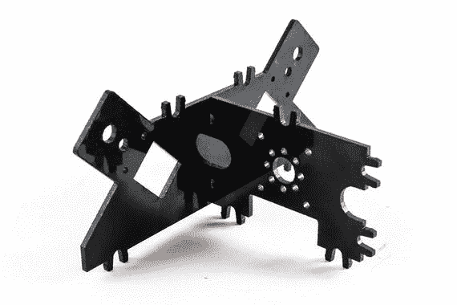

    图 7-2

    Center support attached to an outer plate  
2.  将第二块侧板安装到中心支架上。再一次，确保路线在机器人的外面。
3.  Snap the top plate to the assembly. There are six sets of tabs that snap to the top plate (see Figure [7-3](#Fig3)).

    

    图 7-3

    Top plate added  

在接下来的步骤中，我们连接电机。电机的一侧是一个小销钉(见图 [7-4](#Fig4) )，它有助于对齐电机并将其保持在适当的位置。

1.  安装电机，使轴穿过下面的孔，销钉进入第二个孔。
2.  Use two screws and nuts to hold the motor in place (see Figure [7-5](#Fig5)). Although not included in the kit, some #4 split lock washers would be good to use here. If you don’t have any, use Loctite Threadlocker Blue on the nuts. Without something to lock them into place, the nuts will rattle off.

    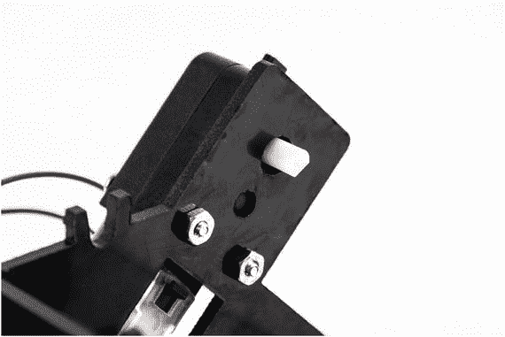

    图 7-5

    Mounted motor  
3.  Repeat the process for each of the three remaining motors (see Figure [7-6](#Fig6)).

    

    图 7-6

    All motors mounted  
4.  Flip the chassis over and attach the bottom plate. There are five sets of tabs holding the bottom plate on (see Figure [7-7](#Fig7)).

    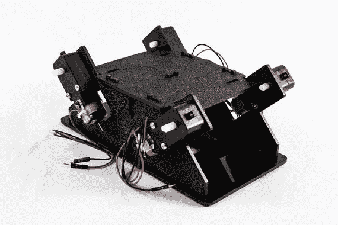

    图 7-7

    Bottom plate added  
5.  Feed the wires for each motor into the chassis through the hole behind the motor (see Figure [7-8](#Fig8)). This bit of housekeeping keeps the wires from getting tangled in the wheels or caught onto something.

    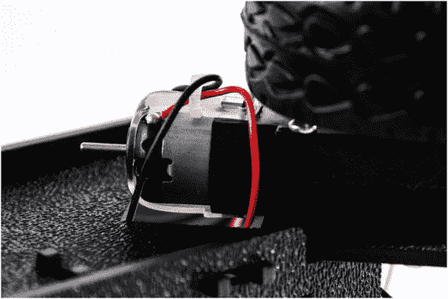

    图 7-8

    Motor wires fed through the hole behind the motor  
6.  将电子夹固定在顶板上。这些夹子将用于固定树莓酱。
7.  将前马达的电线穿过中心支撑板上的孔。

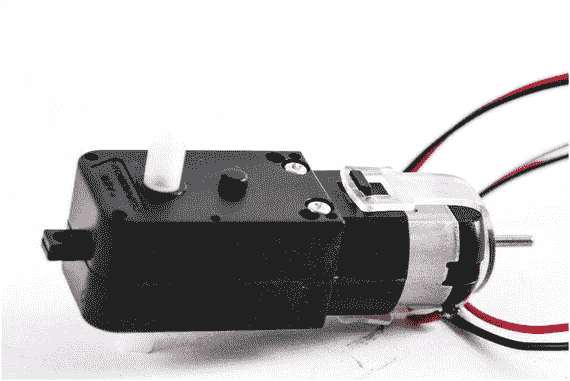

图 7-4

Motor with tab

现在，机箱已准备好安装电子设备。你的机器人底盘应该如图 [7-9](#Fig9) 所示。


图 7-9

The completed Whippersnapper

## 安装电子设备

接下来，我们将把电子设备安装到底盘上。从 Raspberry Pi 开始，我们将连接每个组件，Arduino 和试验板安装在前面。

在这部分制作过程中，经常使用安装胶带和拉链。板子的位置由你决定。有些人将一些电子设备安装在机箱内。然而，我发现下面的安排对我最有效。它可以更容易地接触到电子设备，并为额外的组件节省内部空间。

1.  Snap the Raspberry Pi into the clips on the top plate (see Figure [7-10](#Fig10)). The Pi should be held firmly in place by the top barbs.

    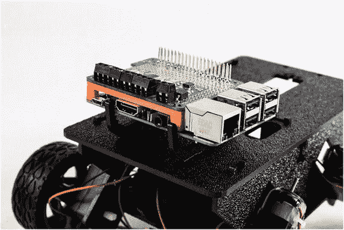

    图 7-10

    Raspberry Pi mounted in the clips The tabs that hold the chassis together (see Figure [7-11](#Fig11)) make mounting the Arduino and breadboard a challenge. This is one reason I like to use foam mounting tape—it provides some padding. To clear the tabs, we’ll need to double up on the tape.

    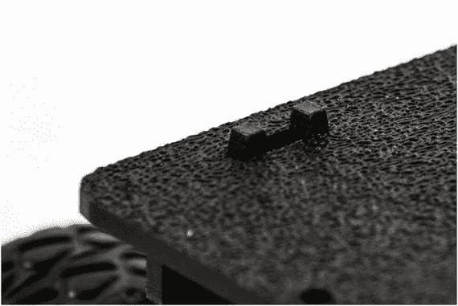

    图 7-11

    Clip protruding from the top plate  
2.  Stack two pieces of foam tape on top of each other and place them on the top plate. Use a second set of stacked foam tape to form a T (see Figure [7-12](#Fig12)). This adds stability.

    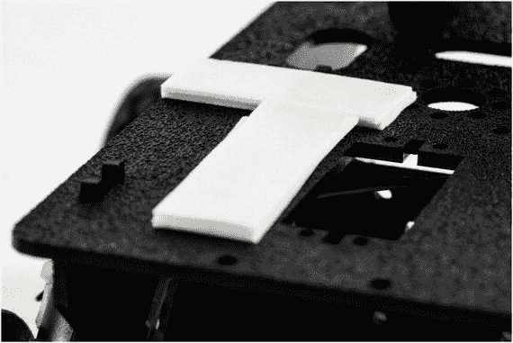

    图 7-12

    Double layer of mounting tape for the breadboard  
3.  Remove the protective paper from the bottom of the breadboard and press the breadboard firmly into the T-shaped tape on the top plate (see Figure [7-13](#Fig13)).

    

    图 7-13

    Mounted breadboard . Note that the T-cobbler has been moved forward to allow room for the power pack.  
4.  Repeat the procedure for the Arduino (see Figure [7-14](#Fig14)).

    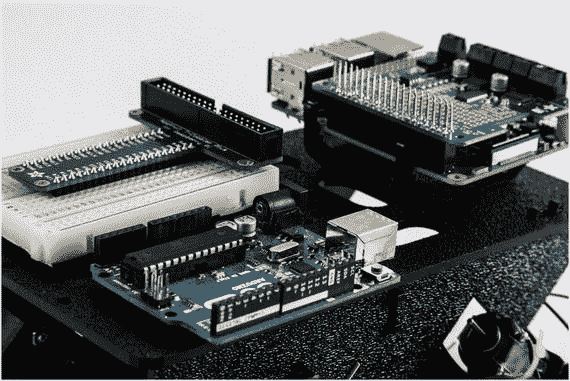

    图 7-14

    Arduino mounted on a double layer of mounting tape When mounting the Arduino, remember to leave room for the USB cable. I offset the Arduino from the center so that the USB plug is clear of the Raspberry Pi (see Figure [7-15](#Fig15)).

    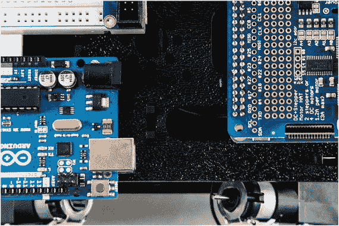

    图 7-15

    Leaving clearance for the USB cable  
5.  将 4 节 AA 电池盒安装在背面的机箱内。如果适用的话，确保安装时能够接触到电池和电源开关。我用泡沫胶带来固定我的。
6.  找到一个安全安装 5V 电源组的地方。我发现试验板和树莓皮之间的空间对我使用的小型电源组来说很好。您的位置将由您的电源组的外形决定。

电子设备就位后，是时候开始将各部分连接在一起了。

## 接线

试图把这一部分写成一步一步的说明是不合适的。如何连接机器人完全取决于你。每个机器人都不一样。布线由组件位置、您使用的电缆和个人偏好决定。相反，我将向您介绍我是如何连接我的机器人的，以及我做出决定背后的思考过程，并包括对您的项目的考虑。

我喜欢尽可能保持我的电缆整洁。有些人很少考虑他们是如何走线的。我在一些机器人的掩护下看到过一些纠结的乱七八糟的东西。对我来说，能够方便地接触零件很重要，这包括电线和电缆。

为 Pi 供电和连接 Arduino 的 USB 电缆比我在大多数项目中喜欢的要长一点。有多种类型的电缆可供选择，包括带有直角插头的电缆，这使得布线相当容易。因为电缆有点长，我用拉链把它们捆成小一点的东西。用于 Arduino 的较重的电缆然后被捆绑到用于 Pi 的安装夹上。从电源组到 Pi 的电缆塞在 Pi 下面(参见图 [7-16](#Fig16) )。

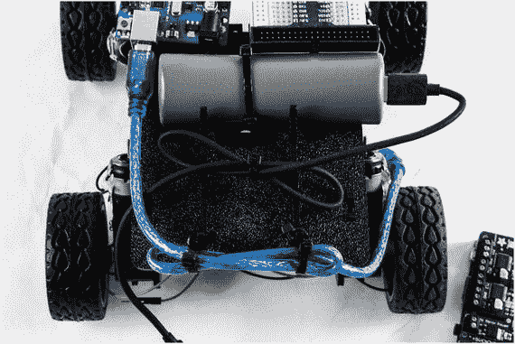

图 7-16

USB cables bundled for tidiness

接下来，我将电线从马达连接到马达帽。DC 发动机的发动机罩有四个输出。有四个马达。我可以将马达成对连接到两个不同的输出端:一个用于左侧，一个用于右侧；然而，小而便宜的马达在速度上往往不太稳定。即使两台电机接收到相同的信号，也不能保证它们以相同的速度转动。能够独立调节每个电机的速度是我利用的一个很好的功能。因此，每个电机都有自己的输出(见图 [7-17](#Fig17) )。

我在每个马达的速度上加了一个乘数。只要稍微调整一下倍增器，我就能让马达更加稳定地转动。


图 7-17

Motor and external battery pack wires connected to the Motor HAT

一旦马达连接好，我就接通电源。当你连接你的，注意极性。作为标准，红色为正，黑色为负。由于我的电池组是改装的，电线不是红黑相间的。我用伏特计来确定电线的极性，并适当地连接它们。

要连接的最后一根电缆是 T 形补鞋器的带状电缆(见图 [7-18](#Fig18) )。只有一种方法将带状电缆连接到 T 形补鞋匠。塞子上的突出部对准塞子上的间隙。在 Pi 上，确保带有白色条纹的导线连接到引脚 1。对于 Pi，这是最靠近拐角的引脚。

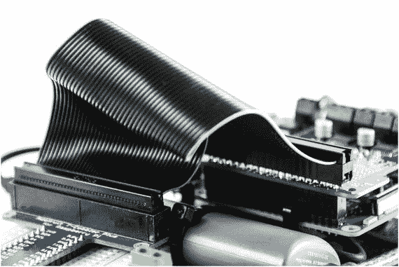

图 7-18

Ribbon cable attaches the T-cobbler to the Pi. Note the white stripe .

## 安装传感器

这是组装机器人最需要创造力的地方。大多数机箱没有传感器安装硬件。如果有，它们是针对您可能不会使用的特定传感器。

安装传感器有许多不同的方法。我发现简单地准备一些不同的材料对我来说很有用。

当我长大的时候，我有一套直立装置。如果你不熟悉 Erector，他们生产一种建筑玩具，包括许多金属部件:横梁、支架、螺丝、螺母、滑轮、皮带等等。我花了数小时制造卡车、拖拉机、飞机，是的，甚至在 20 世纪 80 年代，还有机器人。想象一下我在寻找一些项目中使用的通用零件时的喜悦，我在当地的业余爱好商店遇到了一个安装工。更让我高兴的是，我发现当地一家大型五金店在他们的杂件箱中出售单个零件。

安装工具是许多项目中所需的各种小零件的重要来源。在这种情况下，我使用其中一个横梁和一个支架来安装超声波测距仪(见图 [7-19](#Fig19) )。

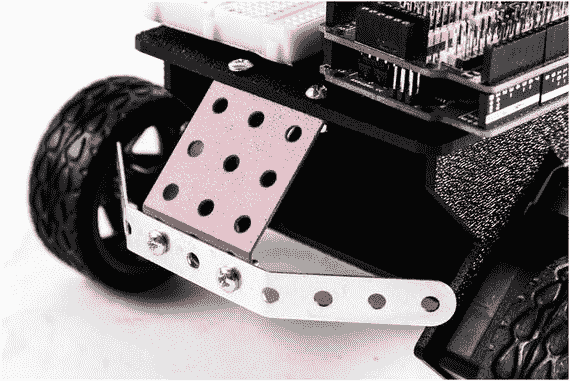

图 7-19

A bracket and beam from the Erector Set. The beam is bent to provide angles for the sensors.

支架就位后，我使用安装胶带来固定传感器(见图 [7-20](#Fig20) )。在这种特殊情况下，磁带有两个用途。首先，它将传感器固定在金属上。第二个目的是绝缘。传感器背面的电子元件暴露在外；将它们连接到金属部件上有导致短路的风险。泡沫安装带是很好的绝缘体。

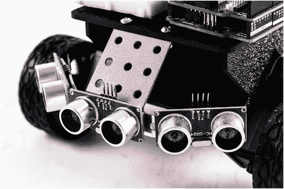

图 7-20

Ultrasonic sensors mounted

我学到的一件事是不要只相信安装带来固定传感器，尤其是金属。过去，胶带会变松，导致传感器出现故障。解决方法是我另一个最喜欢的方法:拉链。胶带将传感器固定到位并提供绝缘；然而，拉链增加了安全性和强度。在这一点上，我很确定事情不会有任何进展。

传感器安装好后，最后要做的就是将它们连接到 Arduino。我使用从传感器到 Arduino 的母到母跳线(参见图 [7-21](#Fig21) )。在 Arduino 上，我安装了一个传感器屏蔽。传感器屏蔽为每个数字模拟引脚增加了一个 5V 的接地引脚。其中一些甚至有串行或无线设备专用接口。我用的是一个非常简单的没有很多专业头的。传感器护罩使传感器和其他设备的安装变得更加容易。

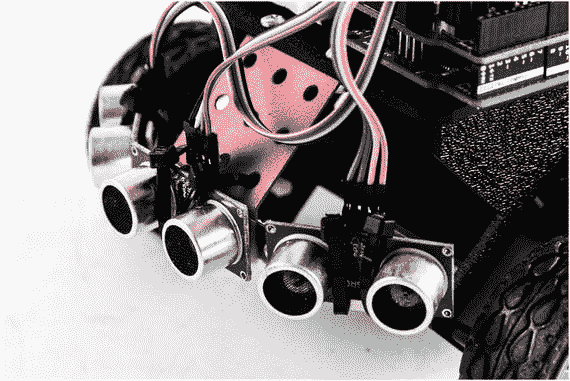

图 7-21

Ultrasonic rangefinders secured with zip ties and wired to Arduino

## 成品机器人

加上传感器，我就有了一个完整的机器人。剩下唯一要做的就是写代码让它动起来。图 [7-22](#Fig22) 显示了我完成的机器人。

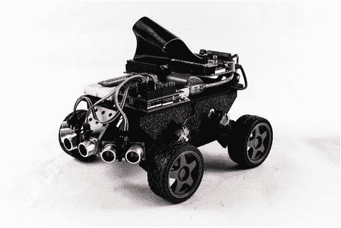

图 7-22

The finished Whippersnapper with electronics

### 让机器人可以移动

目前，我们有一个非常好的零件集合。没有合适的软件，我们就没有真正的机器人。接下来，我概述了我们希望机器人做什么。我们将把它转化为行为，而这些行为又转化为让这个小机器人活起来所需的代码。

#### 这个计划

在前面的章节中，我们用例子说明了不同的主题。由于这是我们第一次应用工作机器人，让我们花一点时间来概述我们希望机器人做什么。

这个计划是基于我在本章前面制作的机器人。它假设有三个超声波传感器和四个独立工作的电机。电机通过安装在 Pi 上的电机帽控制。传感器通过 Arduino 操作。

##### 传感器

如前所述，我们将操作三个超声波传感器。传感器通过传感器护罩连接到 Arduino。因为我们使用串行与 Pi 通信，所以不能使用引脚 0 和 1。这些是串行端口使用的引脚。因此，我们的第一个传感器，即中间的传感器，位于引脚 2 和 3 上；左侧传感器在针脚 4 和 5 上；右边的传感器在引脚 6 和 7 上。

传感器按顺序触发，从中间开始，接着是左边，然后是右边。每个传感器都会等到前一个传感器完成后再触发。结果以半秒的时间间隔被发送回 Pi，作为一串浮点数，以厘米为单位表示距离每个传感器的距离。

##### 发动机

电机连接到树莓皮上的电机帽。每个电机都连接到控制器上四个电机通道中的一个。电机 1，左前电机，连接到 M1。电机 2，即左后电机，与 M2 相连。电机 3，即右前电机，位于 M3 上。电机 4，右后电机，在 M4。

机器人使用差动转向驱动，也称为坦克驱动或滑动转向。为此，左侧电机一起驱动，右侧电机一起驱动。我称它们为左右声道。因此，同样的命令被发送到 M1 和 M2。同样，M3 和 M4 也接受共同指挥。

每个电机的代码都有乘数。乘数被应用于每个相应的电机以补偿速度差。这意味着我们需要一个缓冲区来容纳这种差异。因此，最高速度设置为 255 分中的 200 分。最初，乘数设置为 1。你需要调整你的乘数来适应你的机器人。

##### 行为

这个机器人是一个简单的随机漫步者。它沿着直线行驶，直到检测到障碍物。然后它调整自己的路线以避免撞到障碍物。这并不是一个特别复杂的解决方案，但它说明了机器人操作的一些基础。

机器人的行为规则如下:

*   它向前行驶。
*   如果它发现左边有物体，它会向右转。
*   如果它发现右边有物体，它就向左转。
*   如果它检测到正前方有物体，它会停下来，转向距离最远的方向。
*   如果两个方向的距离相等，或者两侧的传感器都超过截止值，机器人在继续前进之前会在一个随机的方向上转动一段预定的时间。

这种行为有些基础，但它应该提供一个在房子里自主走动的机器人。

#### 代码

代码分为两部分:Arduino 和 Pi。在 Arduino 上，我们关心的只是操作传感器，并以预定的时间间隔将读数传回 Pi。在这种情况下，每 500 毫秒或半秒。

Raspberry Pi 使用传入的数据来执行行为。它从串行端口读取数据，并将数据解析为变量。Pi 使用这些变量来确定下一步行动。这个动作被翻译成电机的指令，然后被发送到电机控制器执行。

##### Arduino 伫列

这个程序简单地操作机器人前面的三个超声波传感器。然后，它通过串行连接将这些值作为一串浮点数返回给 Raspberry Pi。代码基本上与第 [5](05.html) 章中的 Pinguino 示例相同。不同的是，我们使用三个传感器，而不是一个。

1.  在 Arduino IDE 中打开一个新的草图。
2.  将草图另存为`robot_sensors`。
3.  输入以下代码:

    ```py
    int trigMid = 2;
    int echoMid = 3;
    int trigLeft = 4;
    int echoLeft = 5;
    int trigRight = 6;
    int echoRight = 7;
    float distMid = 0.0;
    float distLeft = 0.0;
    float distRight = 0.0;
    String serialString;

    void setup() {
      // set the pinModes for the sensors
      pinMode(trigMid, OUTPUT);
      pinMode(echoMid, INPUT);
      pinMode(trigLeft, OUTPUT);
      pinMode(echoLeft, INPUT);
      pinMode(trigRight, OUTPUT);
      pinMode(echoRight, INPUT);

      // set trig pins to low;
      digitalWrite(trigMid,LOW);
      digitalWrite(trigLeft,LOW);
      digitalWrite(trigRight,LOW);

      // starting serial
      Serial.begin(115200);
    }

    // function to operate the sensors
    // returns distance in centimeters
    float ping(int trigPin, int echoPin){
      // Private variables, not available
      // outside the function
      int duration = 0;
      float distance = 0.0;

      // operate sensor
      digitalWrite(trigPin, HIGH);
      delayMicroseconds(10);
      digitalWrite(trigPin, LOW);

      // get results and calculate distance
      duration = pulseIn(echoPin, HIGH);
      distance = duration/58.2;

      // return the results
      return distance;
    }

    void loop() {
      // get the distance for each sensor
      distMid = ping(trigMid, echoMid);
      distLeft = ping(trigLeft, echoLeft);
      distRight = ping(trigRight, echoRight);

      // write the results to the serial port
      Serial.print(distMid); Serial.print(",");
      Serial.print(distLeft); Serial.print(",");
      Serial.println(distRight);

      // wait 500 milliseconds before looping
      delay(500);
    }

    ```

4.  保存草图并上传到 Arduino。

Arduino 现在应该是 ping 通了，但是因为没有监听，所以我们还不知道。接下来，我们将编写树莓派的代码。

##### 树莓派 代码

现在是时候编写在 Raspberry Pi 上运行的代码了。这是一个相当长的程序，所以我会边走边分解。这其中的绝大多数应该看起来非常熟悉。为了适应这种逻辑，这里或那里做了一些更改，但在大多数情况下，我们以前已经这样做过了。每当我们做新的事情时，我都会花时间带你经历一遍。

1.  Python 2.7 的 Open IDLE。记住，Adafruit 库在 Python 3 中还不能工作。
2.  创建一个新文件。
3.  另存为`pi_roamer_01.py`。
4.  输入以下代码。我一步一步地看每一部分，以确保你对这一过程中发生的事情有一个坚实的概念。
5.  导入您需要的库。

    ```py
    import serial
    import time
    import random

    from Adafruit_MotorHAT import Adafruit_MotorHAT as amhat
    from Adafruit_MotorHAT import Adafruit_DCMotor as adamo

    ```

6.  创建电机变量并打开串口。Arduino 设置为以更高的波特率运行，因此 Pi 也需要以更高的波特率运行。

    ```py
    # create motor objects
    motHAT = amhat(addr=0x60)
    mot1 = motHAT.getMotor(1)
    mot2 = motHAT.getMotor(2)
    mot3 = motHAT.getMotor(3)
    mot4 = motHAT.getMotor(4)

    # open serial port
    ser = serial.Serial('/dev/ttyACM0', 115200)

    ```

7.  创建所需的变量。它们中的许多都是浮点数，因为我们使用的是小数。

    ```py
    # create variables
    # sensors
    distMid = 0.0
    distLeft = 0.0
    distRight = 0.0

    # motor multipliers
    m1Mult = 1.0
    m2Mult = 1.0
    m3Mult = 1.0
    m4Mult = 1.0

    # distance threshold
    distThresh = 12.0
    distCutOff = 30.0

    ```

8.  设置管理电机所需的变量。您会注意到，我已经创建了许多默认值，然后将这些值赋给了其他变量。`leftSpeed`、`rightSpeed`和`driveTime`变量应该是我们在代码中真正改变的唯一变量。其余的是在整个程序中提供一致性。如果你想改变默认速度，你可以简单地改变`speedDef`，改变在任何地方都适用。

    ```py
    # speeds
    speedDef = 200
    leftSpeed = speedDef
    rightSpeed = speedDef
    turnTime = 1.0
    defTime = 0.1
    driveTime = defTime

    ```

9.  创建`drive`函数。它在程序主体的两个地方被调用。因为涉及到大量的工作，所以最好将代码分解到一个单独的功能块中。

    ```py
    def driveMotors(leftChnl = speedDef, rightChnl = speedDef, duration = defTime):
        # determine the speed of each motor by multiplying
        # the channel by the motors multiplier
        m1Speed = leftChnl * m1Mult
        m2Speed = leftChnl * m2Mult
        m3Speed = rightChnl * m3Mult
        m4Speed = rightChnl * m4Mult

        # set each motor speed. Since the speed can be a
        # negative number, we take the absolute value
        mot1.setSpeed(abs(int(m1Speed)))
        mot2.setSpeed(abs(int(m2Speed)))
        mot3.setSpeed(abs(int(m3Speed)))
        mot4.setSpeed(abs(int(m4Speed)))

        # run the motors. if the channel is negative, run
        # reverse. else run forward
        if(leftChnl < 0):
            mot1.run(amhat.BACKWARD)
            mot2.run(amhat.BACKWARD)
        else:
            mot1.run(amhat.FORWARD)
            mot2.run(amhat.FORWARD)

        if (rightChnl > 0):
            mot3.run(amhat.BACKWARD)
            mot4.run(amhat.BACKWARD)
        else:
            mot3.run(amhat.FORWARD)
            mot4.run(amhat.FORWARD)

        # wait for duration
        time.sleep(duration)

    ```

10.  通过将代码包装在`try`块中，开始程序的主块。这允许我们干净地退出程序。如果没有它和相应的 except 块，电机将继续执行它们收到的最后一个命令。

    ```py
    try:
        while 1:

    ```

11.  继续主程序块，读取串口并解析接收到的字符串

    ```py
    # read the serial port
    val = ser.readline().decode('utf=8')
    print val

    # parse the serial string
    parsed = val.split(',')
    parsed = [x.rstrip() for x in parsed]

    # only assign new values if there are
    # three or more available
    if(len(parsed)>2):
        distMid = float(parsed[0] + str(0))
        distLeft = float(parsed[1] + str(0))
        distRight = float(parsed[2] + str(0))

    ```

12.  输入逻辑代码。这是执行前面概述的行为的代码。请注意，中间传感器块(执行停止和转向的那个)写在左右避障代码之外。这样做是因为我们希望对这个逻辑进行评估，而不管左右代码的结果如何。通过将它包含在其他代码之后，中间代码会覆盖左/右代码创建的任何值。

    ```py
    # apply cutoff distance
    if(distMid > distCutOff):
        distMid = distCutOff
    if(distLeft > distCutOff):
        distLeft = distCutOff
    if(distRight > distCutOff):
        distRight = distCutOff

    # reset driveTime
    driveTime = defTime

    # if obstacle to left, steer right by increasing
    # leftSpeed and running rightSpeed negative defSpeed
    # if obstacle to right, steer to left by increasing
    # rightSpeed and running leftSpeed negative
    if(distLeft <= distThresh):
        leftSpeed = speedDef
        rightSpeed = -speedDef
    elif (distRight <= distThresh):
        leftSpeed = -speedDef
        rightSpeed = speedDef
    else:
        leftSpeed = speedDef
        rightSpeed = speedDef

    # if obstacle dead ahead, stop then turn toward most
    # open direction. if both directions open, turn random
    if(distMid <= distThresh):
        # stop
        leftSpeed = 0
        rightSpeed = 0
        driveMotors(leftSpeed, rightSpeed, 1)
        time.sleep(1)
        leftSpeed = -150
        rightSpeed = -150
        driveMotors(leftSpeed, rightSpeed, 1)
        # determine preferred direction. if distLeft >
        # distRight, turn left. if distRight > distLeft,
        # turn right. if equal, turn random
        dirPref = distRight - distLeft
        if(dirPref == 0):
            dirPref = random.random()
        if(dirPref < 0):
            leftSpeed = -speedDef
            rightSpeed = speedDef
        elif(dirPref > 0):
            leftSpeed = speedDef
            rightSpeed = -speedDef
        driveTime = turnTime

    ```

13.  调用我们之前创建的`driveMotors`函数。

    ```py
    # drive the motors
    driveMotors(leftSpeed, rightSpeed, driveTime)

    ```

14.  刷新串行缓冲区中的所有字节。

    ```py
    ser.flushInput()

    ```

15.  进入`except`块。它允许我们在退出程序前点击 Ctrl-C 来关闭电机。

    ```py
    except KeyboardInterrupt:
        mot1.run(amhat.RELEASE)
        mot2.run(amhat.RELEASE)
        mot3.run(amhat.RELEASE)
        mot4.run(amhat.RELEASE)

    ```

16.  保存文件。
17.  按 F5 运行程序。

当你看完你的小机器人在房间里漫游时，按 Ctrl-C 结束程序。

恭喜你。您刚刚构建并编程了您的第一个基于 Raspberry Pi 的机器人。

我们在这个项目中做了很多——尽管真的没有什么是你以前没见过的。在程序的第一部分，我们导入了我们需要的库并创建了马达对象。在下一节中，我们定义了所有的变量。程序的一个重要部分是我们在变量之后创建的函数。在此功能中，我们驱动电机。电机速度和驱动时间作为函数的参数传递，用于设置每个电机的速度。我们使用速度的符号来确定电机的方向。之后，我们通过将主块包装在一个`try`块中来开始我们的主块。然后我们进入了`while`循环，它允许程序无限重复。

在`while`循环中，我们从读取串行字符串开始，然后解析它以提取三个浮点值。将字符串转换成浮点数的算法与我们用来转换成整数的算法略有不同。更具体地说，我们不必将结果除以 10。在一个十进制数的末尾加一个 0 不会改变这个值，所以我们可以在它被转换的时候使用它。

距离测量决定了机器人的下一步行动。`if/elsif/else`模块评估传感器值。如果左侧或右侧传感器检测到预定义阈值内的障碍物，机器人将转向相反的方向。如果没有探测到障碍物，机器人继续前进。一个单独的`if`块确定机器人正前方是否有障碍物。如果有障碍物，机器人会停下来，然后转向。它使用左右传感器值来确定前进的方向。如果不能确定方向，机器人转向随机方向。

所有这些都需要时间，在此期间 Arduino 会愉快地发送串行字符串并填充 Pi 的缓冲区。在继续之前，必须清除这些字符串。我们使用串行对象的`flushInput()`方法来实现这一点。这样，我们只使用最新的信息。

最后，我们使用`except`块来捕获键盘中断命令。当它被接收时，马达被释放，停止它们。然后程序退出。

## 摘要

这一章是关于把我们到目前为止学到的所有东西整合到一个工作机器人中。我们组装了机器人底盘套件，并安装了所有的电子设备。一旦所有东西都安装到机器人上，我们就编写一个程序来运行机器人。这是一个相当简单的漫游程序。当你运行它时，你的新机器人应该可以在房间里成功地走动，这取决于房间里家具的拥挤程度。

在接下来的章节中，我们将致力于改进机器人——添加更多的传感器，改进逻辑，并添加一些更高级的功能。具体来说，我们将添加一个摄像头，并学习如何使用 OpenCV 来跟踪颜色和追球。