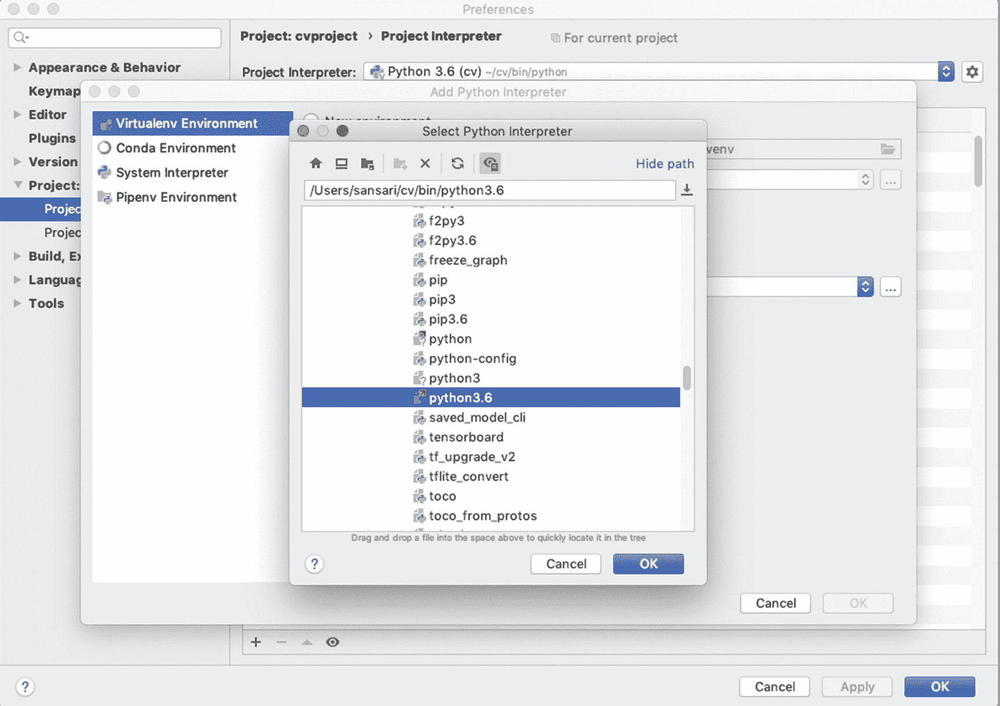

# 一、先决条件和软件安装

这是一本描述如何用 Python 编程语言开发计算机视觉应用程序的实践书籍。在本书中，您将学习如何使用 OpenCV 操作图像，并使用 TensorFlow 构建机器学习模型。

OpenCV 最初由英特尔开发，用 C++编写，是一个开源的计算机视觉和机器学习库，由 2500 多种用于处理图像和视频的优化算法组成。TensorFlow 是一个用于高性能数值计算和大规模机器学习的开源框架。它是用 C++编写的，提供了对 GPU 的原生支持。Python 是开发机器学习应用最广泛的编程语言。它被设计成与 C++一起工作。TensorFlow 和 OpenCV 都提供 Python 接口来访问它们的底层功能。虽然 TensorFlow 和 OpenCV 提供了其他编程语言的接口，如 Java、C++和 MATLAB，但我们将使用 Python 作为主要语言，因为它很简单，而且有很大的支持社区。

这本书的先决条件是 Python 的实用知识和对 NumPy 和 Pandas 的熟悉。本书假设您熟悉 Python 中的内置数据容器，如字典、列表、集合和元组。以下是一些可能有助于满足先决条件的资源:

*   Python: [`https://www.w3schools.com/python/`](https://www.w3schools.com/python/)

*   熊猫: [`https://pandas.pydata.org/docs/getting_started/index.html`](https://pandas.pydata.org/docs/getting_started/index.html)

*   NumPy: [`https://numpy.org/devdocs/user/quickstart.html`](https://numpy.org/devdocs/user/quickstart.html)

在我们继续之前，让我们准备好我们的工作环境，并为我们将要进行的练习做好准备。在这里，我们将从下载和安装所需的软件库和软件包开始。

## Python 和 PIP

Python 是我们主要的编程语言。PIP 是 Python 的包安装程序，也是安装和管理 Python 包的事实上的标准。为了设置我们的工作环境，我们将从在我们的工作计算机上安装 Python 和 PIP 开始。安装步骤取决于您使用的操作系统(OS)。确保您按照操作系统的说明进行操作。如果您已经安装了 Python 和 PIP，请确保您使用的是 Python 版本 3.6 或更高版本以及 PIP 版本 19 或更高版本。要检查 Python 的版本号，请在您的终端上执行以下命令:

```py
$ python3 --version

```

这个命令的输出应该是这样的:Python 3.6.5。

要检查 PIP 的版本号，请在您的终端上执行以下命令:

```py
$ pip3 --version

```

该命令应该显示 PIP 3 的版本号，例如 PIP 19.1。

### 在 Ubuntu 上安装 Python 和 PIP

在 Ubuntu 终端中运行以下命令:

```py
sudo apt update
sudo apt install python3-dev python3-pip

```

### 在 macOS 上安装 Python 和 PIP

在 macOS 上运行以下命令:

```py
brew update
brew install python

```

这将同时安装 Python 和 PIP。

### 在 CentOS 7 上安装 Python 和 PIP

在 CentOS 7 上运行以下命令:

```py
sudo yum install rh-python36
sudo yum groupinstall 'Development Tools'

```

### 在 Windows 上安装 Python 和 PIP

安装 Microsoft Visual C++ 2015 可再发行更新 3。这是 Visual Studio 2015 附带的，但可以通过以下步骤单独安装:

1.  前往 [`https://visualstudio.microsoft.com/vs/older-downloads/`](https://visualstudio.microsoft.com/vs/older-downloads/) 的 Visual Studio 下载。

2.  选择可再发行软件和构建工具。

3.  下载并安装 Microsoft Visual C++ 2015 可再发行更新 3。

确保在 Windows 上启用了长路径。下面是这样做的说明: [`https://superuser.com/questions/1119883/windows-10-enable-ntfs-long-paths-policy-option-missing`](https://superuser.com/questions/1119883/windows-10-enable-ntfs-long-paths-policy-option-missing) 。

从 [`https://www.python.org/downloads/windows/`](https://www.python.org/downloads/windows/) 安装用于 Windows 的 64 位 Python 3 版本(选择 PIP 作为可选功能)。

如果这些安装说明在您的环境中不起作用，请参考位于 [`https://www.python.org/`](https://www.python.org/) 的 Python 官方文档。

## virtualenv(虚拟环境)

virtualenv 是一个创建独立 Python 环境的工具。virtualenv 创建一个目录，其中包含使用 Python 项目所需的包所需的所有可执行文件。virtualenv 提供了以下优势:

*   virtualenv 允许您拥有同一个库的两个版本，这样您的两个程序都可以继续运行。假设你有一个程序需要 Python 库的版本 1，而另一个程序需要同一个库的版本 2；virtualenv 将允许您同时运行这两种功能。

*   virtualenv 为您的开发工作创建了一个有用的独立和自包含的环境，可以在生产环境中使用，而无需安装依赖项。

接下来，我们将安装 virtualenv，并使用所有必需的软件配置环境。对于本书的其余部分，我们将假设我们的引用程序依赖项将包含在这个 virtualenv 中。

使用以下 PIP 命令安装 virtualenv(该命令在所有操作系统上都是相同的):

```py
$ sudo pip3 install -U virtualenv

```

这将在系统范围内安装 virtualenv。

### 安装和激活 virtualenv

首先，创建一个要安装 virtualenv 的目录。我已经把这个目录命名为`cv`(“计算机视觉”的简称)。

```py
$ mkdir cv
Then create the virtualenv in this directory, cv
$ virtualenv --system-site-packages -p python3 ./cv

```

以下是运行此命令的输出示例(在我的 MacBook 上):

```py
Running virtualenv with interpreter /anaconda3/bin/python3
Already using interpreter /anaconda3/bin/python3
Using base prefix '/anaconda3'
New python executable in /Users/sansari/cv/bin/python3
Also creating executable in /Users/sansari/cv/bin/python
Installing setuptools, pip, wheel...
done.

```

使用特定于 shell 的命令激活虚拟环境。

```py
$ source ./cv/bin/activate  # for sh, bash, ksh, or zsh

```

当 virtualenv 处于活动状态时，您的 shell 提示符会带有前缀`(cv)`。这里有一个例子:

```py
(cv) Shamshads-MacBook-Air:~ sansari$

```

在虚拟环境中安装软件包，而不影响主机系统设置。从升级 PIP 开始(确保在 virtualenv 中不要以 root 或 sudo 身份运行任何命令)。

```py
$ pip install --upgrade pip

$ pip list  # show packages installed within the virtual environment

```

完成后，如果您想退出 virtualenv，请执行以下操作:

```py
$ deactivate  # don't exit until you're done with your programming

```

## TensorFlow

TensorFlow 是一个用于数值计算和大规模机器学习的开源库。您将在后续章节中了解更多关于 TensorFlow 的内容。让我们首先安装它，并为我们的深度学习练习做好准备。

### 安装 TensorFlow

我们将安装 PyPI ( [`https://pypi.org/project/tensorflow/`](https://pypi.org/project/tensorflow/) )最新版本的 TensorFlow。我们将为 CPU 安装 TensorFlow。确保您处于 virtualenv 中，并运行以下命令:

```py
(cv) $ pip install --upgrade tensorflow

```

通过运行以下命令测试 TensorFlow 安装:

```py
(cv) $ python -c "import tensorflow as tf"

```

如果 TensorFlow 安装成功，输出应该不会显示任何错误。

## 我喜欢这里

您可以使用您最喜欢的 IDE 来编写和管理 Python 代码，但是出于本书的目的，我们将使用 PyCharm 的社区版本，这是一个 Python IDE。

### 安装 PyCharm

进入 PyCharm 官网 [`https://www.jetbrains.com/pycharm/download/#section=linux`](https://www.jetbrains.com/pycharm/download/%2523section%253Dlinux) ，选择合适的操作系统，点击下载(社区版下)。下载完成后，单击下载的软件包，并按照屏幕上的说明进行操作。以下是不同操作系统的直接链接:

*   Linux: [`https://www.jetbrains.com/pycharm/download/download-thanks.html?platform=linux&code=PCC`](https://www.jetbrains.com/pycharm/download/download-thanks.html%253Fplatform%253Dlinux%2526code%253DPCC)

*   Mac: [`https://www.jetbrains.com/pycharm/download/download-thanks.html?platform=mac&code=PCC`](https://www.jetbrains.com/pycharm/download/download-thanks.html%253Fplatform%253Dmac%2526code%253DPCC)

*   Windows: [`https://www.jetbrains.com/pycharm/download/download-thanks.html?platform=windows&code=PCC`](https://www.jetbrains.com/pycharm/download/download-thanks.html%253Fplatform%253Dwindows%2526code%253DPCC)

### 配置 PyCharm 以使用 virtualenv

按照以下步骤使用我们之前创建的 virtualenv，`cv`:



图 1-1

选择口译员

1.  启动 PyCharm IDE，为 Windows 和 Linux 选择文件➤设置，或者为 macOS 选择 PyCharm ➤首选项。

2.  在设置/首选项对话框中，选择项目 <project name="">➤项目解释器。</project>

3.  点击图标，然后点击添加。

4.  在添加 Python 解释器对话框的左侧窗格中，选择现有环境。

5.  展开解释器列表并选择任何现有的解释器。或者，点击并在您的文件系统中指定 Python 可执行文件的路径，例如`/Users/sansari/cv/bin/python3.6`(参见图 [1-1](#Fig1) )。

6.  如果您愿意，请选择“对所有项目可用”复选框。

## 开放计算机视觉

OpenCV 是最流行和广泛使用的图像处理库之一。本书中的所有代码示例都基于 OpenCV 4。因此，我们的安装步骤是针对 OpenCV 版本 4 的。

### 使用 OpenCV

OpenCV 是用 C/C++编写的，因为它依赖于平台，所以不同的操作系统有不同的安装说明。换句话说，OpenCV 需要为您的特定平台/操作系统构建，以便平稳运行。我们将使用 Python 绑定来调用 OpenCV 以满足任何图像处理需求。

像任何其他库一样，OpenCV 也在发展；因此，如果以下安装说明在您的情况下不起作用，请查看官方网站了解确切的安装过程。

我们将采用一种简单的方法，使用 PIP 安装 OpenCV 4 和 Python 3 绑定。我们将在之前创建的虚拟环境中安装来自 PyPI 的`opencv-python-contrib`包。

所以我们开始吧！

### 使用 Python 绑定安装 OpenCV4

确保你在你的虚拟环境中。只需将目录切换到您的 virtualenv 目录(我们之前创建的`cv`目录)并键入以下命令:

```py
$ source cv/bin/activate

```

使用以下命令快速安装 OpenCV:

```py
$ pip install opencv-contrib-python

```

## 附加库

在我们研究一些例子时，还需要一些额外的库。让我们安装并保存它们。

### 安装 SciPy

使用以下内容安装 SciPy:

```py
$ pip install scipy

```

### 安装 Matplotlib

使用以下内容安装 Matplotlib:

```py
$ pip install matplotlib

```

请注意，本章中安装的库经常更新。强烈建议查看官方网站的更新、这些库的新版本以及最新的安装说明。