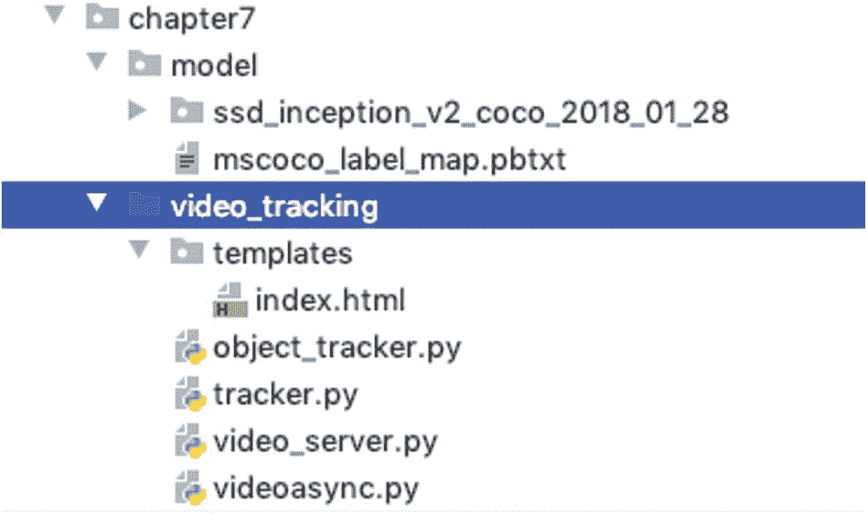
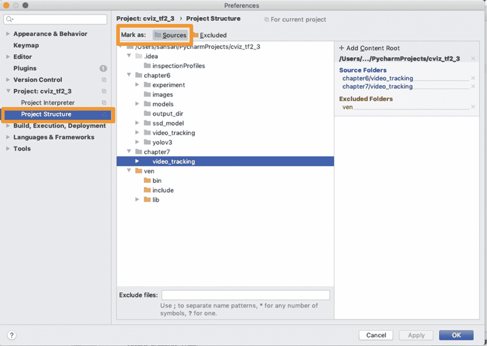
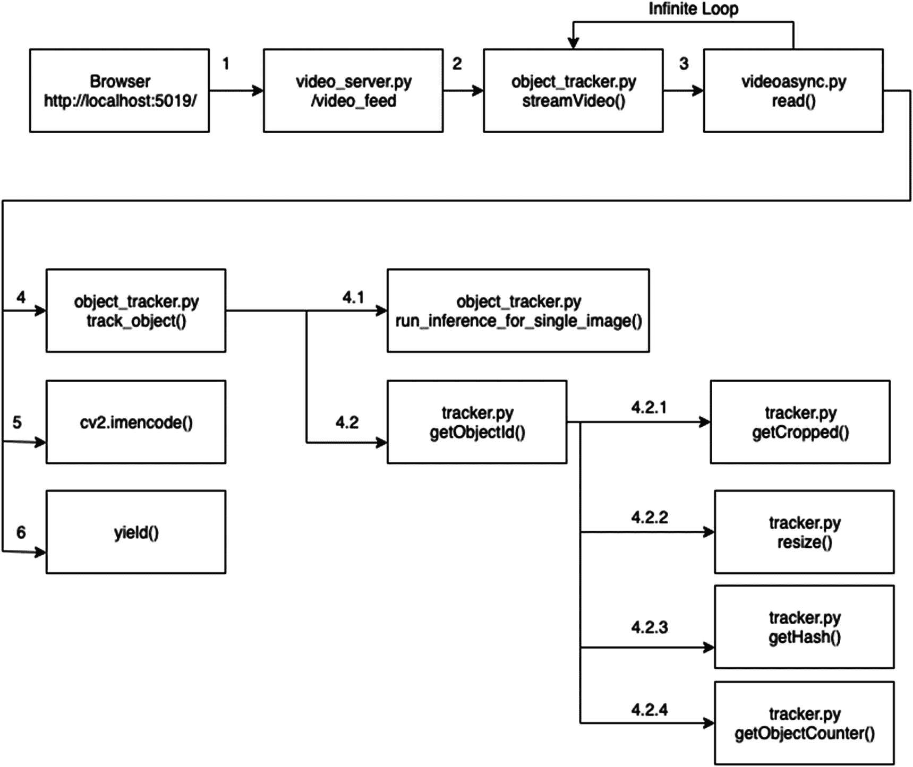

# 七、实际例子：视频中的对象跟踪

本章的重点是计算机视觉的两个关键能力:目标检测和目标跟踪。一般而言，在一组图像的背景下，对象检测提供了识别图像中的一个或多个对象的能力，而对象跟踪提供了在一组图像上跟踪检测到的对象的能力。在之前的章节中，我们探讨了训练深度学习模型以检测对象的技术方面。在这一章中，我们将探索一个简单的例子，将这些知识应用到视频中。

视频中的对象跟踪，或简称为视频跟踪，涉及检测和定位对象并随时间跟踪它。视频跟踪不仅要检测不同帧中的目标，还要跨帧跟踪目标。当第一次检测到一个对象时，它的唯一身份被提取，然后在后续的帧中被跟踪。

对象跟踪在现实世界中有许多应用，例如:

*   自动驾驶汽车

*   安全和监控

*   交通控制

*   增强现实

*   犯罪侦查和犯罪追踪

*   医学成像等

在这一章中，我们将学习如何实现视频跟踪，并完成代码示例。在本章结束时，你将拥有一个功能齐全的视频跟踪系统。

我们的高级实施计划如下:

1.  *视频源*:我们将使用 OpenCV 从网络摄像头或笔记本电脑的内置摄像头读取实时视频流。您也可以从文件或 IP 摄像头读取视频。

2.  *对象检测模型*:我们将使用在 COCO 数据集上预先训练的 SSD 模型。您可以为您的特定用例训练您自己的模型(查看第 [6](06.html) 章了解关于训练对象检测模型的信息)。

3.  *预测*:我们将预测视频每一帧内的物体类别(检测)及其包围盒(定位)(查看第 [6](06.html) 章了解检测图像中物体的信息)。

4.  *唯一标识*:我们将使用散列算法来创建每个对象的唯一标识。我们将在本章后面了解更多关于散列算法的知识。

5.  *跟踪*:我们将使用汉明距离算法(本章稍后会详细介绍)来跟踪之前检测到的物体。

6.  *Display* :我们将流式输出视频，以便在 web 浏览器中显示。我们将为此使用烧瓶。Flask 是一个轻量级的 web 应用程序微框架。

## 准备工作环境

让我们建立一个目录结构，这样就可以很容易地遵循代码并完成下面的例子。我们将看到前面描述的六个步骤的代码片段。最后，我们将把所有的东西放在一起，使目标跟踪系统完整和可行。

我们有一个名为`video_tracking`的目录。其中有一个名为`templates`的子目录，里面有一个名为`index.html`的 HTML 文件。子目录`templates`是 Flask 查找 HTML 页面的标准位置。在`video_tracking`目录中，我们有四个 Python 文件:`videoasync.py`、`object_tracker.py`、`tracker.py`和`video_server.py`。图 [7-1](#Fig1) 显示了该目录结构。



图 7-1

代码目录结构

我们将把`videoasync`作为一个模块导入到`object_tracker.py`中。因此，目录`video_tracking`必须被认为是 PyCharm 中的源目录。要使其成为 PyCharm 中的源目录，点击屏幕左上方的 PyCharm 菜单选项，然后点击 Preferences，展开左侧面板中的 Project，点击 Project Structure，高亮显示`video_tracking`目录，点击 Mark as Source(位于屏幕上方)，如图 [7-2](#Fig2) 所示。最后，单击确定关闭窗口。



图 7-2

在 PyCharm 中将目录标记为源

## 读取视频流

OpenCV 提供了连接视频源和从视频帧中读取图像的便捷方法。OpenCV 在内部将这些帧中的图像转换成 NumPy 数组。这些 NumPy 数组被进一步处理以检测和跟踪其中的对象。检测过程是计算密集型的，它可能跟不上读取帧的速度。因此，在主线程中读取帧和执行检测操作会表现出较低的性能，尤其是在处理高清(HD)视频时。在清单 [7-1](#PC1) 中，我们将实现多线程来捕捉帧。我们称之为视频帧的*异步读取*。

```py
1    # file: videoasync.py
2    import threading
3    import cv2
4
5    class VideoCaptureAsync:
6       def __init__(self, src=0):
7           self.src = src
8           self.cap = cv2.VideoCapture(self.src)
9           self.grabbed, self.frame = self.cap.read()
10          self.started = False
11          self.read_lock = threading.Lock()
12
13      def set(self, key, value):
14          self.cap.set(key, value)
15
16      def start(self):
17          if self.started:
18              print('[Warning] Asynchronous video capturing is already started.')
19              return None
20          self.started = True
21          self.thread = threading.Thread(target=self.update, args=())
22          self.thread.start()
23          return self
24
25      def update(self):
26          while self.started:
27              grabbed, frame = self.cap.read()
28              with self.read_lock:
29                  self.grabbed = grabbed
30                  self.frame = frame
31
32      def read(self):
33          with self.read_lock:
34              frame = self.frame.copy()
35              grabbed = self.grabbed
36          return grabbed, frame
37
38      def stop(self):
39          self.started = False
40         self.thread.join()
41
42
43
44      def __exit__(self, exec_type, exc_value, traceback):
45          self.cap.release()

Listing 7-1Implementation of Asynchronous Reading of Video Frames

```

文件`videoasync.py`实现了类`VidoCaptureAsync`(第 5 行)，它由一个构造函数和启动线程、读取帧和停止线程的函数组成。

第 6 行定义了一个将视频源作为参数的构造函数。该源的默认值`src=0`(也称为*设备索引*)代表来自笔记本电脑内置摄像头的输入。如果您有 USB 摄像头，请相应地设置此`src`的值。如果您的计算机端口上连接了多个摄像机，则没有标准的方法来查找设备索引。一种方法是从起始索引 0 开始循环，直到连接到设备。您可以打印设备属性来标识您想要连接的设备。对于基于 IP 的摄像机，传递 IP 地址或 URL。

如果您的视频源是一个文件，请传递视频文件的路径。

第 8 行使用 OpenCV 的`VideoCapture()`函数，并传递源 ID 来连接视频源。分配给`self.cap`变量的`VideoCapture`对象用于读取帧。

第 9 行读取第一帧，并占用与摄像机的连接。

第 10 行是用于管理锁的标志。第 11 行实际上获得了线程锁。

第 13 行和第 14 行实现了一个函数来设置`VideoCapture`对象的属性，比如帧高、宽度和每秒帧数(FPS)。

第 16 到 23 行实现了启动线程异步读取帧的函数。

第 25 到 30 行实现了一个`update()`函数来读取帧并更新类级别的帧变量。更新函数在第 21 行的开始函数中内部使用，以异步读取视频帧。

第 32 到 36 行实现了`read()`函数。`read()`功能只是返回在`update()`功能块中更新的帧。这还会返回一个布尔值来指示该帧是否被成功读取。

第 38 到 40 行实现了`stop()`函数来停止线程并将控制权返回给主线程。`join()`函数防止主线程关闭，直到子线程完成它的执行。

在退出时，视频源被释放(第 45 行)。

我们现在将编写代码来利用异步视频读取模块。在同一个目录`video_tracking`中，我们将创建一个名为`object_tracker.py`的 Python 文件，它实现了以下功能。

## 加载对象检测模型

我们将使用我们在第 [6](06.html) 章中使用的相同的预训练 SSD 模型来检测图像中的对象。如果您已经根据自己的图像训练了一个模型，则可以使用该模型。您所要做的就是提供模型目录的路径。清单 [7-2](#PC2) 显示了如何从磁盘加载训练好的模型。回想一下，这是我们在第 [6](06.html) 章的清单 [6-11](https://doi.org/10.1007/978-1-4842-5887-3_6-11) 中使用的同一个函数。我们将只加载模型一次，并使用它来检测所有帧中的对象。

```py
43   # # Model preparation
44   def load_model(model_path):
45      model_dir = pathlib.Path(model_path) / "saved_model"
46      model = tf.saved_model.load(str(model_dir))
47      model = model.signatures['serving_default']
48      return model
49
50   model = load_model(model_path)

Listing 7-2load_model() Function to Load Trained Model from the Disk

```

## 检测视频帧中的对象

探测物体的代码和我们在第六章中使用的代码几乎一样。不同之处在于，这里我们创建了一个无限循环，在这个循环中，我们一次读取一个图像帧，并调用函数`track_object()`来跟踪该帧中的对象。`track_object()`函数内部调用我们在第 [6](06.html) 章的清单 [6-12](https://doi.org/10.1007/978-1-4842-5887-3_6-12) 中实现的同一个`run_inference_for_single_image()`函数。

`run_inference_for_single_image()`函数的输出是一个包含`detection_classes`、`detection_boxes`和`detection_scores`的字典。我们将利用这些值来计算每个对象的唯一身份，并跟踪它们的位置。

清单 [7-3](#PC3) 显示了`streamVideo()`函数，该函数实现了从视频源读取流帧的无限循环。

在清单 [7-3](#PC3) 中，第 115 行启动了`streamVideo()`函数的块。第 116 行使用了带有线程锁的关键字`global`。

第 117 行开始无限的`while`循环。在这个循环中，第一行，第 118 行，通过调用`VideoCaptureAsync`类的`read()`函数读取当前的视频帧(图像)。`read()`函数返回一个指示帧是否被成功读取的布尔值元组和一个图像帧的 NumPy 数组。

如果帧被成功检索(第 119 行)，则获取锁(第 120 行)，以便在当前线程的图像仍在被检测对象时，其他线程不会修改帧编号。

第 121 行通过传递模型对象和框架 NumPy 来调用`track_object()`函数。我们将在后面的清单 [7-13](#PC15) 中看到这个`track_object()`函数的作用。在第 123 行，输出的 NumPy 数组被转换成压缩的`.jpg`图像，因此它是轻量级的，易于在网络上传输。我们使用`cv2.imencode()`将 NumPy 数组转换成图像。此函数返回一个布尔值元组，指示转换是否成功，并返回编码图像。

如果图像转换不成功，则跳过该帧(第 125 行)。

最后，在第 127 行，它产生了字节编码的图像。`yield`关键字从`while`循环返回一个只读一次的迭代器。

第 130 到 137 行是当程序被终止或者屏幕被按 Q 键退出时的清理函数。

```py
114  # Function to implement infinite while loop to read video frames and generate the output   #for web browser
115  def streamVideo():
116     global lock
117     while (True):
118         retrieved, frame = cap.read()
119         if retrieved:
120             with lock:
121                 frame = track_object(model, frame)
122
123                 (flag, encodedImage) = cv2.imencode(".jpg", frame)
124                 if not flag:
125                     continue
126
127                 yield (b'--frame\r\n' b'Content-Type: img/jpeg\r\n\r\n' +
128                    bytearray(encodedImage) + b'\r\n')
129
130         if cv2.waitKey(1) & 0xFF == ord('q'):
131             cap.stop()
132             cv2.destroyAllWindows()
133             break
134
135     # When everything done, release the capture
136     cap.stop()
137     cv2.destroyAllWindows()

Listing 7-3Implementing Infinite Loop for Reading Streams of Video Frames and Internally Calling an Object Tracking Function for Each Frame

```

## 使用 dHash 为对象创建唯一标识

我们使用感知散列来创建在图像中检测到的对象的唯一身份。差分哈希，简称 dHash，是计算图像唯一哈希最常用的算法之一。dHash 提供了几个优点，使其成为识别和比较图像的合适选择。以下是使用 dHash 的一些好处:

*   如果长宽比改变，图像哈希不会改变。

*   亮度或对比度的变化将不会改变图像散列或稍微改变它。这意味着哈希仍然以不同的对比度接近其他哈希。

*   dHash 的计算速度非常快。

我们不使用加密哈希，如 MD-5 或 SHA-1。原因是，对于这些哈希算法，如果映像中有微小的变化，加密哈希将完全不同。即使是单个像素的变化，也会产生完全不同的哈希。因此，如果两个图像在感知上相似，它们的加密哈希将完全不同。这使得当我们必须比较两幅图像时，它不适合应用程序。

dHash 算法很简单。以下是计算 dHash 的步骤:

1.  将图像或图像片段转换为灰度。这使得计算速度更快，如果颜色有轻微的变化，dHash 也不会改变太多。在对象检测中，我们使用边界框裁剪检测到的对象，并将裁剪后的图像转换为灰度。

2.  调整灰度图像的大小。为了计算 64 位哈希，图像被调整为 9×8 像素，忽略其纵横比。纵横比被忽略，以确保得到的图像散列将匹配相似的图像，而不管它们的初始空间尺寸。

    为什么是 9×8 像素？在 dHash 中，该算法计算相邻像素的梯度差。9 行与相邻行的差异将在结果中仅产生 8 行，从而产生具有 8×8 像素的最终输出，这将给出 64 位散列。

3.  通过应用“大于”公式将每个像素转换为 0 或 1 来构建哈希，如下所示:

如果 P[x=1] > P[x]，那么 1 否则 0。

然后，二进制值被转换为整数哈希。

清单 [7-4](#PC4) 展示了 dHash 的 Python 和 OpenCV 实现。

```py
32      def getCropped(self, image_np, xmin, ymin, xmax, ymax):
33          return image_np[ymin:ymax, xmin:xmax]
34
35      def resize(self, cropped_image, size=8):
36          resized = cv2.resize(cropped_image, (size+1, size))
37          return resized
38
39      def getHash(self, resized_image):
40          diff = resized_image[:, 1:] > resized_image[:, :-1]
41          # convert the difference image to a hash
42          dhash = sum([2 ** i for (i, v) in enumerate(diff.flatten()) if v])
43          return int(np.array(dhash, dtype="float64"))

Listing 7-4Calculating the dHash from an Image

```

第 32 行和第 33 行实现了裁剪功能。我们传递完整图像帧的 NumPy 数组和围绕对象的边界框的四个坐标。该功能裁剪图像中包含检测到的对象的部分。

第 35 到 37 行用于将裁剪后的图像调整为 9×8 的大小。

第 39 到 43 行实现了 dHash 的计算。第 40 行通过应用前面描述的大于规则找到相邻像素的差异。第 42 行从二进制位值构建数字散列。第 43 行将散列转换成整数，并从函数中返回 dhash。

## 利用汉明距离确定图像相似度

汉明距离通常用于比较两个哈希。汉明距离测量两个散列中不同比特的数量。

如果两个散列的汉明距离为零，则意味着这两个散列是相同的。汉明距离越低，两个哈希越相似。

清单 [7-5](#PC5) 展示了如何计算两个散列之间的汉明距离。

```py
45      def hamming(self, hashA, hashB):
46          # compute and return the Hamming distance between the integers
47          return bin(int(hashA) ^ int(hashB)).count("1")

Listing 7-5Calculation of the Hamming Distance

```

第 45 行的函数`hamming()`将两个散列作为输入，并返回位数，这两个输入散列中的位数是不同的。

## 目标跟踪

在图像中检测到对象后，通过计算包含该对象的图像的裁剪部分的 dHash 来创建其唯一身份。通过计算物体的 dHash 的汉明距离，从一帧到另一帧跟踪物体。跟踪有许多用例。在我们的示例中，我们创建了两个跟踪函数来完成以下任务:

1.  从对象在一帧中的第一次出现到后续帧中的所有出现，跟踪对象的路径。该函数跟踪边界框的中心，并绘制一条连接所有这些中心的线或路径。清单 [7-6](#PC6) 展示了这个实现。函数`createHammingDict()`获取当前对象的轮廓、边界框的中心以及所有对象及其中心的历史。该函数将当前对象的数据与迄今为止看到的所有数据进行比较，并使用汉明距离来查找相似的对象，以跟踪其运动或路径。

1.  获取对象的唯一标识符，并跟踪检测到的唯一对象的数量。清单 [7-7](#PC7) 实现了一个名为`getObjectCounter()`的函数，它计算跨帧检测到的唯一对象的数量。它将当前对象的 dHash 与所有先前帧中计算的所有 dHash 进行比较。

```py
49      def createHammingDict(self, dhash, center, hamming_dict):
50          centers = []
51          matched = False
52          matched_hash = dhash
53          # matched_classid = classid
54
55          if hamming_dict.__len__() > 0:
56              if hamming_dict.get(dhash):
57                  matched = True
58
59              else:
60                  for key in hamming_dict.keys():
61
62                      hd = self.hamming(dhash, key)
63
64                      if(hd < self.threshold):
65                          centers = hamming_dict.get(key)
66                          if len(centers) > self.max_track_frame:
67                              centers.pop(0)
68                          centers.append(center)
69                          del hamming_dict[key]
70                          hamming_dict[dhash] = centers
71                          matched = True
72                          break
73
74          if not matched:
75              centers.append(center)
76              hamming_dict[dhash] = centers
77
78          return  hamming_dict

Listing 7-6Tracking the Centers of Bounding Boxes of Detected Objects Between Multiple Frames

```

```py
79
80      def getObjectCounter(self, dhash, hamming_dict):
81          matched = False
82          matched_hash = dhash
83          lowest_hamming_dist = self.threshold
84          object_counter = 0
85
86          if len(hamming_dict) > 0:
87              if dhash in hamming_dict:
88                  lowest_hamming_dist = 0
89                  matched_hash = dhash
90                  object_counter = hamming_dict.get(dhash)
91                  matched = True
92
93              else:
94                  for key in hamming_dict.keys():
95                      hd = self.hamming(dhash, key)
96                      if(hd < self.threshold):
97                          if hd < lowest_hamming_dist:
98                              lowest_hamming_dist = hd
99                              matched = True
100                             matched_hash = key
101                             object_counter = hamming_dict.get(key)
102         if not matched:
103             object_counter = len(hamming_dict)
104         if matched_hash in hamming_dict:
105             del hamming_dict[matched_hash]
106
107         hamming_dict[dhash] = object_counter
108         return  hamming_dict
109

Listing 7-7Function to Track Count of Unique Objects Detected in Video Frames

```

## 在网络浏览器中显示实况视频流

我们将把我们的视频跟踪代码发布到 Flask，一个轻量级的 web 框架。这将允许我们使用 URL 在 web 浏览器中查看带有跟踪对象的视频直播流。您可以使用其他框架，比如 Django，来发布可以从 web 浏览器访问的视频。我们选择 Flask 作为我们的示例，因为它是轻量级的、灵活的，并且只需要几行代码就可以轻松实现。

让我们探索一下如何在我们当前的上下文中使用 Flask。我们将从安装 Flask 到我们的 virtualenv 开始。

### 安装烧瓶

我们将使用`pip`命令来安装 Flask。确保激活 virtualenv 并执行命令`pip install flask`，如下所示:

```py
 (cv_tf2) computername:~ username$ pip install flask

```

### 烧瓶目录结构

参见图 [7-1](#Fig1) 中的目录结构。我们在`video_tracking`目录中创建了一个名为`templates`的子目录。我们将创建一个 HTML 文件，`index.html`，它将包含显示视频流的代码。我们将把`index.html`保存到`templates`目录中。目录名必须是`templates`，因为 Flask 会在这个目录中查找 HTML 文件。

### 用于显示视频流的 HTML

清单 [7-8](#PC9) 显示了保存在`index.html`页面中的 HTML 代码。第 7 行是显示实时视频流的最重要的一行。这是 HTML 的标准``标签，通常用于在 web 浏览器中显示图像。第 7 行代码的`{{...}}`部分是 Flask 符号，指示 Flask 从一个 URL 加载图像。当这个 HTML 页面被加载时，它将调用`/video_feed` URL 并从那里获取图像以显示在``标签中。

```py
1    <html>
2     <head>
3       <title>Computer Vision</title>
4     </head>
5     <body>
6       <h1>Video Surveillance</h1>
7        </img>
8     </body>
9    </html>
10

Listing 7-8HTML Code for Displaying the Video Stream

```

现在我们需要一些服务于这个 HTML 页面的服务器端代码。我们还需要一个服务器端实现来在调用`/video_feed` URL 时提供图像。

我们将在一个单独的 Python 文件`video_server.py`中实现这两个函数，这个文件保存在`video_tracking`目录中。确保这个`video_server.py`文件和`templates`目录在同一个父目录下。

清单 7-9 展示了 Flask 服务的服务器端实现。2 号线进口烧瓶及其相关包装。第 3 行导入了我们的`object_tracker`包，它实现了对象检测和跟踪。

第 4 行使用构造函数`app = Flask(__name__)`创建了一个 Flask 应用程序，它将当前模块作为参数。通过调用构造函数，我们实例化 Flask web 应用程序框架，并将其赋给一个名为`app`的变量。我们将把所有的服务器端服务绑定到这个`app`。

所有 Flask 服务都是通过 URL 提供的，我们必须将 URL 或路由绑定到它将提供的服务。下面是我们需要为我们的示例实现的两个服务:

*   将从主页 URL 呈现`index.html`的服务，例如`http://localhost:5019/`

*   将从`/video_feed` URL 提供视频流的服务，例如`http://localhost:5019/video_feed`

### 用于加载 HTML 页面的 Flask

清单 [7-9](#PC10) 的第 6 行有一个路由绑定`/`，它表示 home URL。当从 web 浏览器调用 home URL 时，调用函数`index()`来服务请求(第 7 行)。`index()`函数只是从模板`index.html`中呈现一个 HTML 页面，我们在清单 [7-8](#PC9) 中创建了这个模板。

### 提供视频流的烧瓶

清单 [7-9](#PC10) 的第 11 行将`/video_feed` URL 绑定到 Python 函数`video_feed()`。这个函数反过来调用我们实现的用于检测和跟踪视频中物体的`streamVideo()`函数。第 15 行从视频帧中创建`Response`对象，并向调用者发送一个多部分 HTTP 响应。

```py
1    # video_server.py
2    from flask import Flask, render_template, Response
3    import object_tracker as ot
4    app = Flask(__name__)
5
6    @app.route("/")
7    def index():
8       # return the rendered template
9    return render_template("index.html")
10
11   @app.route("/video_feed")
12   def video_feed():
13       # return the response generated along with the specific media
14       # type (mime type)
15       return Response(ot.streamVideo(),mimetype = "multipart/x-mixed-replace; boundary=frame")
16
17   if __name__ == '__main__':
18       app.run(host="localhost", port="5019", debug=True,
19                    threaded=True, use_reloader=False)
20

Listing 7-9Flask Server-Side Code to Launch index.html and Serve Video Stream

```

### 运行 Flask 服务器

通过从`video_tracking`目录键入命令`python video_server.py`从终端执行`video_server.py`文件。确保您已经激活了 virtualenv。

```py
(cv) computername:video_tracking username$ python video_server.py

```

这将启动 Flask 服务器并在`host="localhost"`和`port="5019"`上运行(清单 [7-9](#PC10) 的第 18 行)。您应该为您的生产环境更改主机和端口。此外，通过在第 18 行设置`debug=False`来关闭调试模式。

当服务器启动时，将您的网络浏览器指向 URL `http://localhost:5019/`以查看带有对象跟踪的实时视频流。

## 把所有的放在一起

我们已经探索了视频跟踪系统的构建模块。让我们把它们放在一起，形成一个功能齐全的系统。图 [7-3](#Fig3) 显示了我们的视频跟踪系统的高级函数调用序列。



图 7-3

视频跟踪系统的功能调用序列示意图

当使用 URL `http://localhost:5019/`启动 web 浏览器时，Flask 后端服务器服务于`index.html`页面，该页面在内部调用调用服务器端函数`video_feed()`的 URL `http://localhost:5019/video_feed`。其余的函数调用，如图 [7-3](#Fig3) 所示，完成后将检测到物体的视频帧及其跟踪信息发送到网页浏览器显示。清单 [7-10](#PC12) 到 [7-14](#PC16) 提供了视频跟踪系统的完整源代码。

清单 [7-10](#PC12) 的文件路径为`video_tracking/templates/index.html`。

```py
<html>
 <head>
   <title>Computer Vision</title>
 </head>
 <body>
   <h1>Video Surveillance</h1>
    </img>
 </body>
</html>

Listing 7-10index.html

```

清单 [7-11](#PC13) 的文件路径为`video_tracking/video_server.py`。

```py
# video_server.py
from flask import Flask, render_template, Response
import object_tracker as ot
app = Flask(__name__)

@app.route("/")
def index():
   # return the rendered template
  return render_template("index.html")

@app.route("/video_feed")
def video_feed():
  # return the response generated along with the specific media
  # type (mime type)
  return Response(ot.streamVideo(),mimetype = "multipart/x-mixed-replace; boundary=frame")

if __name__ == '__main__':
  app.run(host="localhost", port="5019", debug=True,
        threaded=True, use_reloader=False)

Listing 7-11video_server.py

```

清单 [7-12](#PC14) 的文件路径为`video_tracking/object_tracker.py`。

```py
import os
import pathlib
import random
import numpy as np
import tensorflow as tf
import cv2
import threading

# Import the object detection module.
from object_detection.utils import ops as utils_ops
from object_detection.utils import label_map_util

from videoasync import VideoCaptureAsync
import tracker as hasher

lock = threading.Lock()

# to make gfile compatible with v2
tf.gfile = tf.io.gfile

model_path = "./../model/ssd_inception_v2_coco_2018_01_28"
labels_path = "./../model/mscoco_label_map.pbtxt"

# List of the strings that is used to add correct label for each box

.
category_index = label_map_util.create_category_index_from_labelmap(labels_path, use_display_name=True)
class_num =len(category_index)+100
object_ids = {}
hasher_object = hasher.ObjectHasher()

#Function to create color table for each object class
def get_color_table(class_num, seed=50):
   random.seed(seed)
   color_table = {}
   for i in range(class_num):
       color_table[i] = [random.randint(0, 255) for _ in range(3)]
   return color_table

colortable = get_color_table(class_num)

# Initialize and start the asynchronous video capture thread
cap = VideoCaptureAsync().start()

# # Model preparation
def load_model(model_path):
   model_dir = pathlib.Path(model_path) / "saved_model"
   model = tf.saved_model.load(str(model_dir))
   model = model.signatures['serving_default']
   return model

model = load_model(model_path)

# Predict objects and bounding boxes and format the result
def run_inference_for_single_image(model, image):
   # The input needs to be a tensor, convert it using `tf.convert_to_tensor`.
   input_tensor = tf.convert_to_tensor(image)
   # The model expects a batch of images, so add an axis with `tf.newaxis`.
   input_tensor = input_tensor[tf.newaxis, ...]

   # Run prediction from the model
   output_dict = model(input_tensor)

   # Input to model is a tensor, so the output is also a tensor
   # Convert to NumPy arrays, and take index [0] to remove the batch dimension.
   # We're only interested in the first num_detections.
   num_detections = int(output_dict.pop('num_detections'))
   output_dict = {key: value[0, :num_detections].numpy()
                  for key, value in output_dict.items()}
   output_dict['num_detections'] = num_detections

   # detection_classes should be ints.
   output_dict['detection_classes'] = output_dict['detection_classes'].astype(np.int64)

   return output_dict

# Function to draw bounding boxes and tracking information on the image frame
def track_object(model, image_np):
   global object_ids, lock
   # Actual detection.
   output_dict = run_inference_for_single_image(model, image_np)

   # Visualization of the results of a detection.
   for i in range(output_dict['detection_classes'].size):

       box = output_dict['detection_boxes'][i]
       classes = output_dict['detection_classes'][i]
       scores = output_dict['detection_scores'][i]

       if scores > 0.5:
           h = image_np.shape[0]
           w = image_np.shape[1]

           classname = category_index[classes]['name']
           classid =category_index[classes]['id']
           #Draw bounding boxes
           cv2.rectangle(image_np, (int(box[1] * w), int(box[0] * h)), (int(box[3] * w), int(box[2] * h)), colortable[classid], 2)

           #Write the class name on top of the bounding box
           font = cv2.FONT_HERSHEY_COMPLEX_SMALL

           hash, object_ids = hasher_object.getObjectId(image_np, int(box[1] * w), int(box[0] * h), int(box[3] * w),
                                            int(box[2] * h), object_ids)

           size = cv2.getTextSize(str(classname) + ":" + str(scores)+"[Id: "+str(object_ids.get(hash))+"]", font, 0.75, 1)[0][0]

           cv2.rectangle(image_np,(int(box[1] * w), int(box[0] * h-20)), ((int(box[1] * w)+size+5), int(box[0] * h)), colortable[classid],-1)
           cv2.putText(image_np, str(classname) + ":" + str(scores)+"[Id: "+str(object_ids.get(hash))+"]",
                   (int(box[1] * w), int(box[0] * h)-5), font, 0.75, (0,0,0), 1, 1)

           cv2.putText(image_np, "Number of objects detected: "+str(len(object_ids)),
                       (10,20), font, 0.75, (0, 0, 0), 1, 1)
       else:
           break
   return image_np

# Function to implement infinite while loop to read video frames and generate the output for web browser
def streamVideo():
   global lock
   while (True):
       retrieved, frame = cap.read()
       if retrieved:
           with lock:
               frame = track_object(model, frame)

               (flag, encodedImage) = cv2.imencode(".jpg", frame)
               if not flag:
                   continue

               yield (b'--frame\r\n' b'Content-Type: img/jpeg\r\n\r\n' +
                  bytearray(encodedImage) + b'\r\n')

       if cv2.waitKey(1) & 0xFF == ord('q'):
           cap.stop()
           cv2.destroyAllWindows()
           break

   # When everything done, release the capture
   cap.stop()
   cv2.destroyAllWindows()

Listing 7-12object_tracker.py

```

清单 [7-13](#PC15) 的文件路径为`video_tracking/videoasync.py`。

```py
# file: videoasync.py
import threading
import cv2

class VideoCaptureAsync:
   def __init__(self, src=0):
       self.src = src
       self.cap = cv2.VideoCapture(self.src)
       self.grabbed, self.frame = self.cap.read()
       self.started = False
       self.read_lock = threading.Lock()

   def set(self, var1, var2):
       self.cap.set(var1, var2)

   def start(self):
       if self.started:
           print('[Warning] Asynchronous video capturing is already started.')
           return None
       self.started = True
       self.thread = threading.Thread(target=self.update, args=())
       self.thread.start()
       return self

   def update(self):
       while self.started:
           grabbed, frame = self.cap.read()
           with self.read_lock:
               self.grabbed = grabbed
               self.frame = frame

   def read(self):
       with self.read_lock:
           frame = self.frame.copy()
           grabbed = self.grabbed
       return grabbed, frame

   def stop(self):
       self.started = False
       # self.cap.release()
       # cv2.destroyAllWindows()
       self.thread.join()

   def __exit__(self, exec_type, exc_value, traceback):
       self.cap.release()

Listing 7-13videoasync.py

```

清单 [7-14](#PC16) 的文件路径为`video_tracking/tracker.py`。

```py
# tracker.py
import numpy as np
import cv2

class ObjectHasher:
   def __init__(self, threshold=20, size=8, max_track_frame=10, radius_tracker=5):
       self.threshold = 20
       self.size = 8
       self.max_track_frame = 10
       self.radius_tracker = 5

   def getCenter(self, xmin, ymin, xmax, ymax):
       x_center = int((xmin + xmax)/2)
       y_center = int((ymin+ymax)/2)
       return (x_center, y_center)

   def getObjectId(self, image_np, xmin, ymin, xmax, ymax, hamming_dict={}):
       croppedImage = self.getCropped(image_np,int(xmin*0.8), int(ymin*0.8), int(xmax*0.8), int(ymax*0.8))
       croppedImage = cv2.cvtColor(croppedImage, cv2.COLOR_BGR2GRAY)

       resizedImage = self.resize(croppedImage, self.size)

       hash = self.getHash(resizedImage)
       center = self.getCenter(xmin*0.8, ymin*0.8, xmax*0.8, ymax*0.8)

       # hamming_dict = self.createHammingDict(hash, center, hamming_dict)
       hamming_dict = self.getObjectCounter(hash, hamming_dict)
       return hash, hamming_dict

   def getCropped(self, image_np, xmin, ymin, xmax, ymax):
       return image_np[ymin:ymax, xmin:xmax]

   def resize(self, cropped_image, size=8):
       resized = cv2.resize(cropped_image, (size+1, size))
       return resized

   def getHash(self, resized_image):
       diff = resized_image[:, 1:] > resized_image[:, :-1]
       # convert the difference image to a hash
       dhash = sum([2 ** i for (i, v) in enumerate(diff.flatten()) if v])
       return int(np.array(dhash, dtype="float64"))

   def hamming(self, hashA, hashB):
       # compute and return the Hamming distance between the integers
       return bin(int(hashA) ^ int(hashB)).count("1")

   def createHammingDict(self, dhash, center, hamming_dict):
       centers = []
       matched = False
       matched_hash = dhash
       # matched_classid = classid

       if hamming_dict.__len__() > 0:
           if hamming_dict.get(dhash):
               matched = True

           else:
               for key in hamming_dict.keys():

                   hd = self.hamming(dhash, key)

                   if(hd < self.threshold):
                       centers = hamming_dict.get(key)
                       if len(centers) > self.max_track_frame:
                           centers.pop(0)
                       centers.append(center)
                       del hamming_dict[key]
                       hamming_dict[dhash] = centers
                       matched = True
                       break

       if not matched:
           centers.append(center)
           hamming_dict[dhash] = centers

       return  hamming_dict

   def getObjectCounter(self, dhash, hamming_dict):
       matched = False
       matched_hash = dhash
       lowest_hamming_dist = self.threshold
       object_counter = 0

       if len(hamming_dict) > 0:
           if dhash in hamming_dict:
               lowest_hamming_dist = 0
               matched_hash = dhash
               object_counter = hamming_dict.get(dhash)
               matched = True

           else:
               for key in hamming_dict.keys():
                   hd = self.hamming(dhash, key)
                   if(hd < self.threshold):
                       if hd < lowest_hamming_dist:
                           lowest_hamming_dist = hd
                           matched = True
                           matched_hash = key
                           object_counter = hamming_dict.get(key)
       if not matched:
           object_counter = len(hamming_dict)
       if matched_hash in hamming_dict:
           del hamming_dict[matched_hash]

       hamming_dict[dhash] = object_counter

       return  hamming_dict

   def drawTrackingPoints(self, image_np, centers, color=(0,0,255)):
       image_np = cv2.line(image_np, centers[0], centers[len(centers) - 1], color)
       return image_np

Listing 7-14tracker.py

```

通过从终端执行命令`python video_server.py`来运行 Flask 服务器。要观看实时视频流，启动您的网络浏览器并指向 URL `http://localhost:5019`。

## 摘要

在本章中，我们使用预先训练的 SSD 模型开发了一个全功能视频跟踪系统。我们还学习了差分哈希(dHash)算法，并使用汉明距离来确定图像的相似性。我们将我们的系统部署到 Flask microweb 框架，以在 web 浏览器中呈现实时视频跟踪。