# 十、云环境下的计算机视觉建模

训练最先进的卷积神经网络可能需要大量的计算机资源。根据训练样本的数量、网络配置和可用的硬件资源，训练网络可能需要几个小时或几天的时间。单个 GPU 可能不适合训练包含大量训练图像的复杂网络。模型需要在多个 GPU 上训练。单台机器上只能安装有限数量的 GPU。一台具有多个 GPU 的机器可能不足以对大量图像进行训练。如果在多台机器上训练模型，并且每台机器都有多个 GPU，那么速度会更快。

很难估计在某个时间框架内训练一个模型所需的 GPU 和机器数量。在大多数实际情况下，事先并不知道建模需要多少台机器以及培训将运行多长时间。还有，建模不是经常做的。预测准确度高的模型可能不需要几天、几周、几个月的重新训练，或者只要它给出准确的结果就可以。因此，在模型被重新训练之前，为建模而采购的任何硬件都可以保持空闲。

在云上建模是跨多台机器和 GPU 扩展培训的好方法。大多数云提供商以按需购买的模式提供虚拟机、计算资源和存储。这意味着您将只为模型学习期间使用的云资源付费。模型成功定型后，您可以将模型导出到应用服务器，在那里它将用于预测。此时，所有不再需要的云资源都可以删除，这样会降低成本。

TensorFlow 提供 API，用于在安装在单台或多台机器上的多个 CPU 和 GPU 上训练机器学习模型。

在这一章中，我们将探索分布式建模，并在云上训练大规模的计算机视觉模型。

本章的学习目标如下:

*   探索用于分布式培训的 TensorFlow APIs

*   在三个流行的云提供商上建立分布式 TensorFlow 集群，包括多个虚拟机和 GPU:Amazon Web Services(AWS)、Google Cloud Platform (GCP)和 Microsoft Azure

*   在云上的分布式集群上训练计算机视觉模型

## TensorFlow 分布式训练

本节将介绍 TensorFlow 分布式培训。

### 什么是分布式培训？

用于计算机视觉的最先进的神经网络从大量图像中计算出数百万个参数。如果所有的计算都在单个 CPU 或 GPU 上执行，那么训练是非常耗时的。此外，需要将整个训练数据集加载到内存中，这可能会超过单台机器的内存。

在分布式训练中，计算在多个 CPU 或 GPU 上同时执行，结果被组合以创建最终的模型。理想情况下，计算应该与 GPU 或 CPU 的数量成线性比例。换句话说，如果在一个 GPU 上训练一个模型需要 *H* 个小时，那么在 *N* 个 GPU 上训练模型就应该需要 *H/N* 个小时。

分布式训练中常用的并行实现方法有两种:数据并行和模型并行。TensorFlow 提供 API，通过在多个设备(CPU、GPU 或计算机)上拆分模型来分发培训。

#### 数据并行性

大型训练数据集可以分成更小的小批。小型批处理可以分布在集群架构中的多台计算机上。SGD 可以在拥有少量数据的计算机上独立并行地计算权重。可以将来自各个计算机的结果合并到中央计算机，以获得最终的优化重量。

SGD 还可以通过在具有多个 CPU 或 GPU 的单台计算机中使用并行处理来优化权重。使用 SGD 算法计算优化权重的分布式和并行操作有助于更快地收敛。

图 [10-1](#Fig1) 显示了数据并行性的图示。

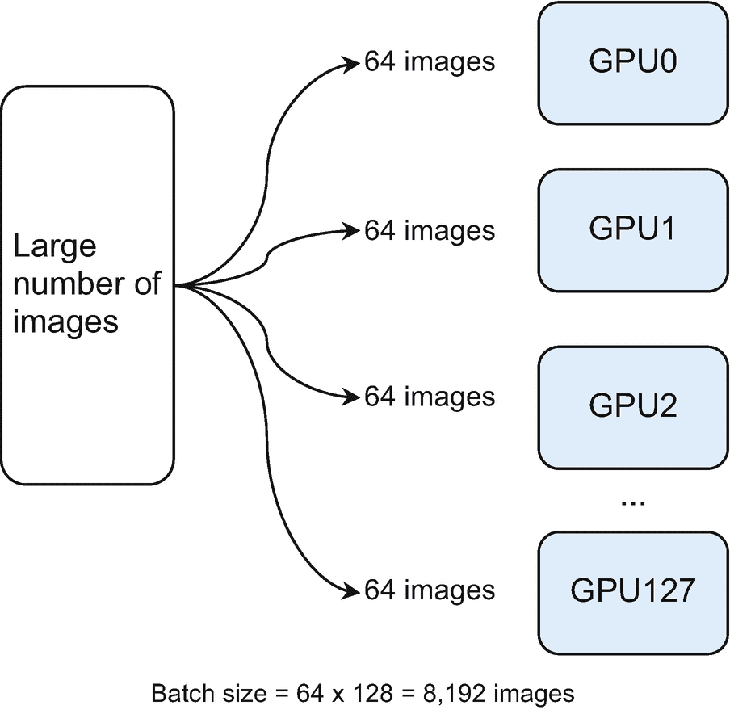

图 10-1

数据并行性和批量计算

数据并行可以通过以下两种方式实现:

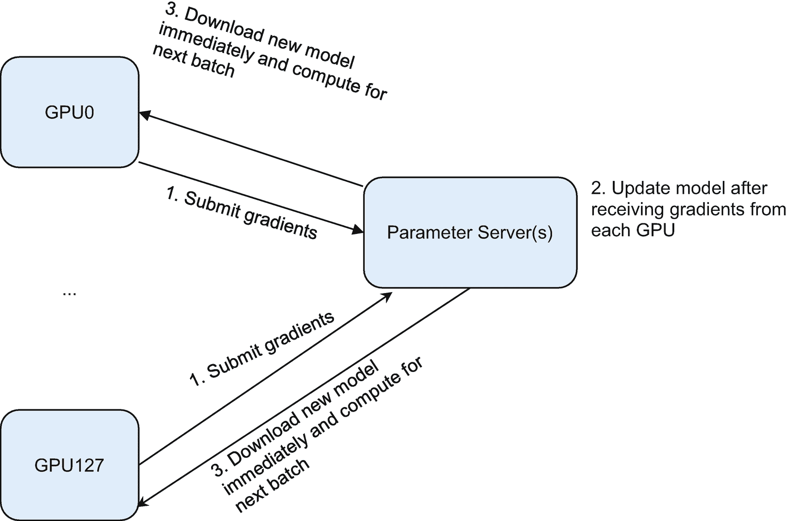

图 10-3

使用参数服务器的异步数据并行

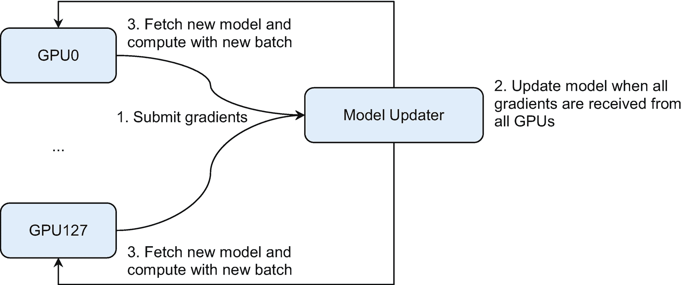

图 10-2

同步数据并行

*   *异步*:在这种情况下，所有节点通过一个名为*参数服务器*的专用服务器对输入数据进行独立训练并异步更新变量，如图 [10-3](#Fig3) 所示。

*   *同步*:在这种情况下，所有节点在不同的输入数据块上训练，并在每一步聚合梯度。梯度的同步是通过 all-reduce 方法完成的，如图 [10-2](#Fig2) 所示。

#### 模型并行性

深度神经网络，如 Darknet，计算数十亿个参数。在单个 CPU 或 GPU 的内存中加载整个网络是一个挑战，即使批量很小。模型并行是一种将模型分成不同部分的方法，每个部分在物理计算机硬件的不同 CPU、GPU 或节点中对同一组数据执行操作。相同的数据批次被复制到集群中的所有节点，但是节点获得模型的不同部分。这些模型部件在不同的节点上同时对其输入数据集进行操作。

当模型的各个部分并行运行时，它们的共享参数需要同步。这种并行方法最适用于同一台机器上有多个 CPU 或 GPU 的情况，因为这些设备通过高速总线连接。

我们现在将探索 TensorFlow 如何在多个 GPU 或机器之间分配训练。

### TensorFlow 分布策略

TensorFlow 提供了一个高级 API 来跨多个 GPU 或多个节点分发训练。API 是通过`tf.distribute.Strategy`类公开的。只需添加几行代码和少量代码更改，我们就可以分布我们在前面所有示例中探索过的神经网络。

我们可以将`tf.distribute.Strategy`与 Keras 一起使用，来分发使用 Keras API 构建的网络。我们也可以用它来分发定制的训练循环。一般来说，TensorFlow 中的任何计算都可以使用这个 API 来分发。

TensorFlow 支持以下类型的分发策略。

#### 镜像策略

`MirroredStrategy`支持一台机器上多个 GPU 的同步分布式训练。模型的所有变量都在所有 GPU 上镜像。这些变量统称为 MirroredVariables。训练的计算在每个 GPU 上并行执行。通过应用相同的更新，变量彼此同步。

使用 all-reduce 算法在所有设备上更新 MirroredVariables。all-reduce 算法通过将所有设备上的张量相加来聚合它们，并使它们在每个设备上可用。图 [10-2](#Fig2) 展示了一个全归约算法的例子。这些算法是高效的，并且没有太多用于同步的通信开销。

有几种全归约算法。TensorFlow 在`MirroredStrategy`中使用英伟达 NCCL 作为默认的 all-reduce 算法。

我们将探讨如何使用`MirroredStrategy`来分配深度神经网络的训练。为了让它简单易懂，让我们修改清单 [5-2](05.html#PC6) 中的代码，并把它分发出去。参见清单 [5-2](05.html#PC6) 的第 11、19、24 行。下面是这几行代码的样子:

*   第 11 行，列表 [5-2](05.html#PC6) : `model = tf.keras.models.Sequential([...])`

*   第 19 行，列表 [5-2](05.html#PC6) : `model.compile(...)`

*   第 24 行，列表 [5-2](05.html#PC6) : `history = model.fit(...)`

以下是将清单 [5-2](05.html#PC6) 的训练并行化的步骤:

1.  创建一个`MirroredStrategy`的实例。

2.  将模型的创建和编译(清单 [5-2](05.html#PC6) 的第 11 行和第 19 行)移到`MirroredStrategy`对象的`scope()`方法中。

3.  拟合模型(第 24 行，没有任何变化)。

清单 [5-2](05.html#PC6) 的所有其他行保持不变。

清单 [10-1](#PC1) 展示了这个概念。

```py
1   strategy = tf.distribute.MirroredStrategy()

2   with strategy.scope():
3     model = tf.keras.Sequential([...])
4     model.compile(...)

5   model.fit(...)

Listing 10-1Synchronous Distributed Training Using MirroredStrategy

```

因此，只需增加两行代码和少量调整，我们就可以将我们的训练分布到一台机器上的多个 GPU 上。

如清单 [10-1](#PC1) 所示，在`MirroredStrategy`对象的`scope()`方法中，我们创建了想要以分布式并行方式运行的计算。`MirroredStrategy`对象负责在可用的 GPU 上复制模型的训练，聚合渐变等等。

每批输入在副本中平均分配。例如，如果输入批量大小为 16，我们将`MirroredStrategy`与两个 GPU 一起使用，每个 GPU 将在每个步骤中获得八个输入示例。我们应该适当地调整批量大小，以有效地利用 GPU 的计算能力。

`tf.distribute.MirroredStrategy()`方法创建默认对象，该对象使用 TensorFlow 可见的所有可用 GPU。如果您只想使用机器的部分 GPU，只需执行以下操作:

```py
strategy = tf.distribute.MirroredStrategy(devices=["/gpu:0", "/gpu:1"])

```

这里有一个练习:修改清单 [5-4](05.html#PC8) 中所示的代码示例，并使用`MirroredStrategy`以分布式模式训练数字识别模型。

#### 中央仓库战略

`CentralStorageStrategy`将模型变量放在 CPU 上，并在一台机器上的所有本地 GPU 上复制计算。除了将变量放置在 CPU 上而不是在 GPU 上复制它们之外，`CentralStorageStrategy`与`MirroredStrategy`相似。

在写这本书的时候，`CentralStorageStrategy`是实验性的，将来可能会改变。要分发`CentralStorageStrategy`下的培训，只需将清单 [10-1](#PC1) 的第 1 行替换为以下内容:

```py
strategy = tf.distribute.experimental.CentralStorageStrategy()

```

#### 多重工作镜像策略

`MultiWorkerMirroredStrategy`类似于`MirroredStrategy`。它将训练分布在多台机器上，每台机器都有一个或多个 GPU。它将模型中的所有变量复制到所有机器的每台设备上。这些进行计算的机器被称为*工人*。

为了保持所有工人之间的变量同步，它使用`CollectiveOps`作为 all-reduce 通信方法。集合运算是 TensorFlow 图中的单个运算。它可以根据硬件、网络拓扑和张量大小在 TensorFlow 运行时自动选择 all-reduce 算法。

要将培训分配给`MultiWorkerMirroredStrategy`下的多个工人，只需将清单 [10-1](#PC1) 的第 1 行替换为以下内容:

```py
strategy = tf.distribute.experimental.MultiWorkerMirroredStrategy()

```

这将创建默认的`MultiWorkerMirroredStrategy`，并将`CollectiveCommunication.AUTO`作为`CollectiveOps`的默认设置。您可以选择以下两种`CollectiveOps`实现之一:

*   `CollectiveCommunication.RING`使用 gRPC 作为通信层实现基于环的集合。gRPC 是 Google 开发的远程过程调用的开源实现。要使用它，调用前面的实例化如下:

    ```py
    strategy = tf.distribute.experimental.MultiWorkerMirroredStrategy(
            tf.distribute.experimental.CollectiveCommunication.RING)

    ```

*   `CollectiveCommunication.NCCL`使用英伟达 NCCL 实现集体。下面是一个用法示例:

    ```py
    strategy = tf.distribute.experimental.MultiWorkerMirroredStrategy(
            tf.distribute.experimental.CollectiveCommunication.NCCL)

    ```

##### 集群配置

TensorFlow 可以轻松地将培训分配给多个员工。但是它如何知道集群配置呢？在我们运行使用`MultiWorkerMirroredStrategy`来分发培训的代码之前，我们必须为将要参与模型培训的所有工人设置`TF_CONFIG`环境变量。`TF_CONFIG`将在本节稍后描述。

##### 数据集分片

如何向员工提供数据？

当我们使用`model.fit(x=train_datasets, epochs=3, steps_per_epoch=5)`时，我们将训练集直接传递给`fit()`函数。在多工作人员培训中，数据集会自动分片。

##### 容错

如果任何一个工作线程失败，整个集群都会失败。TensorFlow 中没有内置的故障恢复机制。然而，`tf.distribute.Strategy` with Keras 通过保存训练检查点提供了一种容错机制。如果任何一个工作者失败，所有其他工作者将等待失败的工作者重新启动。由于保存了检查点，一旦失败的工作人员恢复工作，训练将从停止的点开始。

为了使您的分布式集群容错，您必须保存训练检查点(查看第 [5](05.html) 章，了解如何使用回调保存检查点)。

#### 贸易策略

张量处理单元(TPU)是由谷歌设计的专用集成电路(ASICs)，旨在大幅加速机器学习工作负载。云 TPU 和 Google Colab 上都有 TPU。

在实现方面，`TPUStrategy`与`MirroredStrategy`相同，只是模型变量被镜像到 TPU。清单 10-2 展示了如何实例化`TPUStrategy`。

```py
1   cluster_resolver = tf.distribute.cluster_resolver.TPUClusterResolver(
    tpu=tpu_address)
2   tf.config.experimental_connect_to_cluster(cluster_resolver)

3   tf.tpu.experimental.initialize_tpu_system(cluster_resolver)

4   tpu_strategy = tf.distribute.experimental.TPUStrategy(cluster_resolver)

Listing 10-2Instantiation of TPUStrategy

```

在第 1 行，通过将 TPU 地址传递给参数`tpu=tpu_address`来指定它。

#### 参数服务器策略

在`ParameterServerStrategy`中，模型变量被放置在一个专用的机器上，称为*参数服务器*。在这种情况下，一些机器被指定为工作机，一些被指定为参数服务器。当参数服务器中的变量被更新时，计算在所有工作线程的所有 GPU 上被复制。

`ParameterServerStrategy`的实现与`MultiWorkerMirroredStrategy`相同。我们必须在每台参与的机器上设置`TF_CONFIG`环境变量。`TF_CONFIG`接下来解释。

要分发`ParameterServerStrategy`下的培训，只需将清单 [10-1](#PC1) 的第 1 行替换为以下内容:

```py
strategy = tf.distribute.experimental.ParameterServerStrategy()

```

#### OneDeviceStrategy

有时，我们希望在将分布式代码转移到涉及多个设备的完全分布式系统之前，在单个设备(GPU)上测试我们的分布式代码。`OneDeviceStrategy`就是为此而设计的。当我们使用这种策略时，模型变量被放在一个指定的设备上。

要使用这个策略，只需使用下面的代码并替换清单 [10-1](#PC1) 的第 1 行:

```py
strategy = tf.distribute.OneDeviceStrategy(device="/gpu:0")

```

这个策略仅用于测试代码。在完全分布式环境中训练您的模型之前，请切换到其他策略。

值得注意的是，除了`MirroredStrategy`之外，所有之前用于分布式培训的策略目前都是实验性的。

### TF_CONFIG: TensorFlow 群集配置

用于分布式训练的 TensorFlow 集群由一台或多台机器组成，称为 *workers* 。模型训练的计算在每个工人中进行。有一种专门的工人，叫做*师傅*或*首席工人*，他们除了是一名普通工人之外还有额外的责任。首席工作者的额外职责包括保存检查点和为 TensorBoard 编写摘要文件。

TensorFlow 集群还可以包括用于参数服务器的专用机器。在`ParameterServerStrategy`的情况下，参数 server 是强制的。

TensorFlow 集群配置由一个`TF_CONFIG`环境变量指定。我们必须在集群上的所有机器上设置这个环境变量。

`TF_CONFIG`的格式是 JSON 文件，由两部分组成:`cluster`和`task`。

`cluster`组件提供了关于参与模型训练的工人和参数服务器的信息。这是工作人员主机名和通信端口的字典列表(例如，`localhost:1234`)。

`task`组件为当前任务指定工作者的角色。通常将工人列表中索引为 0 的第一个工人指定为主工人或主要工人。

表 [10-1](#Tab1) 描述了`TF_CONFIG`的键值对。

表 10-1

TF_CONFIG 格式描述

<colgroup><col class="tcol1 align-left"> <col class="tcol2 align-left"> <col class="tcol3 align-left"></colgroup> 
| 

钥匙

 | 

描述

 | 

例子

 |
| --- | --- | --- |
| `cluster` | 包含关键字`worker`、`chief`和`ps`的字典。这些键中的每一个都是参与培训的所有机器的`hostname:port`列表。 | `cluster: {``worker:["host1:12345","host2:2345"]``}` |
| `task` | 指定特定机器将执行的任务。它有以下键:`type`:指定工人类型，取一串`worker`、`chief`或`ps`。`index`:任务的从零开始的索引。大多数分布式培训作业都有一个主任务、一个或多个参数服务器以及一个或多个工作人员。`trial`:执行超参数调谐时使用。该值设置要训练的试验次数。这有助于识别当前正在运行的试验。这需要一个包含试验编号的字符串值，从 1 开始。 | `task: { type: chief, index:0}`这表明`host1:1234`是主节点。 |
| `job` | 启动作业时使用的作业参数。这是可选的，在大多数情况下可以忽略。 |   |

#### TF_CONFIG 示例

假设我们有一个由三台机器组成的集群，希望用于分布式培训。这些机器的主机名分别是`host1.local`、`host2.local`和`host3.local`。假设它们都通过端口 8900 进行通信。

此外，假设每台机器都有以下角色:

```py
worker: host1.local (chief worker)
worker: host2.local (normal worker)
ps: host3.local (parameter server)

```

三台机器上都需要设置的`TF_CONFIG`环境变量，如表 [10-2](#Tab2) 所示。

表 10-2

具有两个工作线程和一个参数服务器的三节点集群中的 TF_CONFIG 环境变量示例

<colgroup><col class="tcol1 align-left"> <col class="tcol2 align-left"> <col class="tcol3 align-left"></colgroup> 
| 

掌握

 | 

工人

 | 

著名图象处理软件

 |
| --- | --- | --- |
| `'cluster': {``'worker': ["host1.local:8900", "host2.local:8900"], "ps":["host3.local:8900"]``},``'task': {'type': worker, 'index': 0}``}` | `'cluster': {``'worker': ["host1.local:8900", "host2.local:8900"], "ps":["host3.local:8900"]``},``'task': {'type': worker, 'index': 1}``}` | `'cluster': {``'worker': ["host1.local:8900", "host2.local:8900"], "ps":["host3.local:8900"]``},``'task': {'type': ps, 'index': 0}``}` |

## 带参数服务器的分布式培训示例代码

清单 [10-3](#PC11) ，清单 [5-2](05.html#PC6) 的修改版本，展示了`ParameterServerStrategy`的一个简单实现，将培训分配给多个工人。我们将探索如何在云上执行这些代码。

```py
File name: distributed_training_ps.py
01: import argparse
02: import tensorflow as tf
03: from tensorflow_core.python.lib.io import file_io
04:
05: #Disable eager execution
06: tf.compat.v1.disable_eager_execution()
07:
08: #Instantiate the distribution strategy -- ParameterServerStrategy.
    #This needs to be in the beginning of the code.
09: strategy = tf.distribute.experimental.ParameterServerStrategy()
10:
11: #Parse the command line arguments
12: parser = argparse.ArgumentParser()
13: parser.add_argument(
14:      "--input_path",
15:      type=str,
16:      default="",
17:      help="Directory path to the input file. Could you be cloud storage"
18: )
19: parser.add_argument(
20:      "--output_path",
21:      type=str,
22:      default="",
23:      help="Directory path to the input file. Could you be cloud storage"
24: )
25: FLAGS, unparsed = parser.parse_known_args()
26:
27: # Load MNIST data using built-in datasets' download function
28: mnist = tf.keras.datasets.mnist
29: (x_train, y_train), (x_test, y_test) = mnist.load_data()
30:
31: #Normalize the pixel values by dividing each pixel by 255
32: x_train, x_test = x_train / 255.0, x_test / 255.0
33:
34: BUFFER_SIZE = len(x_train)
35: BATCH_SIZE_PER_REPLICA = 16
36: GLOBAL_BATCH_SIZE = BATCH_SIZE_PER_REPLICA * 2
37: EPOCHS = 10
38: STEPS_PER_EPOCH = int(BUFFER_SIZE/EPOCHS)
39:
40: train_dataset = tf.data.Dataset.from_tensor_slices((x_train,       y_train)).shuffle(BUFFER_SIZE).batch(GLOBAL_BATCH_SIZE)
41: test_dataset = tf.data.Dataset.from_tensor_slices((x_test, y_test)).batch(GLOBAL_BATCH_SIZE)
42:
43:
44: with strategy.scope():

45:     # Build the ANN with 4-layers
46:    model = tf.keras.models.Sequential([
47:    tf.keras.layers.Flatten(input_shape=(28, 28)),
48:    tf.keras.layers.Dense(128, activation="relu"),
49:    tf.keras.layers.Dense(60, activation="relu"),
50:    tf.keras.layers.Dense(10, activation="softmax")])
51:
52:    # Compile the model and set optimizer,loss function and metrics
53:    model.compile(optimizer='adam',
54:              loss='sparse_categorical_crossentropy',
55:              metrics=['accuracy'])
56:
57: #Save checkpoints to the output location--most probably on a cloud storage, such as GCS
58: callback = tf.keras.callbacks.ModelCheckpoint(filepath=FLAGS.output_path)
59: # Finally, train or fit the model
60: history = model.fit(train_dataset, epochs=EPOCHS, steps_per_epoch=STEPS_PER_EPOCH, callbacks=[callback])
61:
62: # Save the model to the cloud storage
63: model.save("model.h5")
64: with file_io.FileIO('model.h5', mode="r") as input_f:
65:     with file_io.FileIO(FLAGS.output_path+ '/model.h5', mode='w+') as output_f:
66:        output_f.write(input_f.read())

Listing 10-3Distributing Training Across Multiple Workers Using ParameterServerStrategy

```

清单 [10-3](#PC11) 中的代码可以分为四个逻辑部分。

*   读取和解析命令行参数(第 11 行到第 25 行)。它接受两个参数:用于保存检查点和最终模型的训练数据输入路径和输出路径。

*   加载输入图像并创建训练集和测试集(第 27 到 41 行)。需要注意的是，`ParameterServerStrategy`不支持最后的部分批处理，当数据集在多个工作线程上不平衡时，将`steps_per_epoch`参数传递给`model.fit()`。注意第 38 行中`steps_per_epoch`的计算。

*   在`ParameterServerStrategy`范围内创建和编译 Keras 模型(第 9 行和第 44 至 55 行)。以下是需要考虑的几个要点:

*   在程序的开头创建`ParameterServerStrategy`或`MultiWorkerMirroredStrategy`的实例，并在策略实例化后放入可能创建 ops 的代码。

*   需要分发的代码部分必须包含在策略的范围内。

*   第 44 行定义了`scope()`块，我们在其中包装了模型定义和编译。

*   第 45 到 50 行在策略范围内创建模型。

*   第 53 到 55 行在策略范围内编译模型。

*   训练模型并保存检查点和最终模型(第 57 到 66 行)。
    1.  第 58 行创建了模型检查点对象，该对象被传递给模型的`fit()`函数，以便在模型训练时保存检查点。

    2.  第 60 行通过调用`fit()`函数触发模型训练。如前所述，传递给`fit()`函数的`train_dataset`由分发策略自动分发(在本例中为`ParameterServerStrategy`)。

    3.  第 63 行将完整的模型保存在本地目录中。第 64 到 66 行将本地模型复制到云存储中，比如谷歌云存储(GCS)或者亚马逊 S3。

    4.  请注意，第 57 行到第 66 行超出了策略的范围。

我们现在有了模型训练代码，它可以分布在多个工作人员中，并使用参数服务器以并行模式进行训练。接下来，我们将使用图 [10-4](#Fig4) 所示的架构在云上运行该培训。


图 10-4

TensorFlow 集群架构，在云虚拟机上有主服务器、工作服务器和参数服务器。数据和模型位于可扩展存储系统上

## 在云上运行分布式培训的步骤

我们将基于图 [10-4](#Fig4) 所示的架构在云上部署 TensorFlow 集群，并执行以下步骤来执行培训:

1.  *创建 TensorFlow 集群。*
    1.  *参数服务器、首席和工作节点*:所有三个云提供商——AWS、GCP、Azure——都提供了基于浏览器的外壳和图形用户界面(UI)来创建和管理虚拟机。根据数据大小和神经网络的复杂性，我们可以创建基于 GPU 的虚拟机或基于 CPU 的虚拟机。

2.  *在所有虚拟机上安装 TensorFlow 和所有必备库*:查看第 [1](01.html) 章了解安装必备库的说明。为了运行清单 [10-3](#PC11) 中的代码，我们将只安装 TensorFlow。

3.  *创建云存储目录(也称为存储桶)*:根据云提供商，我们将创建以下内容之一:
    *   AWS S3 铲斗

    *   谷歌云存储(GCS)桶

    *   天蓝色容器

4.  *上传 Python 代码并在每台机器上执行培训*:使用云 shell 或任何其他 SSH 客户端，登录到每个节点并执行以下操作:
    *   将包含依赖项和模型训练代码(清单 [10-3](#PC11) )的 Python 包上传到每个节点。通过`scp`或任何其他文件传输协议上传代码。因为我们的代码是在 GitHub 中提交的，所以我们可以克隆存储库并跨所有节点下载代码。

        在每台机器上，克隆 GitHub 库，如清单 [10-4](#PC12) 所示。

*   我们需要在每台机器上设置特定于机器角色的`TF_CONFIG`环境变量，并执行 Python 代码进行分布式训练，如清单 [10-5](#PC13) 所示。

```py
git clone https://github.com/ansarisam/dist-tf-modeling.git

Listing 10-4Cloning the GitHub Repository

```

```py
export TF_CONFIG=-CONFIG;python distributed_training_ps.py --input_path gs://cv_training_data --output_path gs://cv_distributed_model/output

Listing 10-5Executing Distributed Training

```

在每个节点上手动执行清单 [10-5](#PC13) 中的命令效率不高，尤其是当有大量工作人员时。我们可以编写脚本，在大型集群上自动启动分布式培训。清单 [10-4](#PC12) 中显示的 GitHub 库有一个 Python 脚本，可以用于自动化。为了了解其工作原理，我们将按照手动步骤，在每个虚拟机上逐一启动培训。

## 基于谷歌云的分布式培训

谷歌云平台(GCP)是一套云计算服务，运行在谷歌内部用于其最终用户产品(如谷歌搜索和 YouTube)的相同基础设施上。

我们将使用两个 GCP 服务来运行分布式培训。这两项服务是用于保存检查点和训练模型的谷歌云存储(GCS)和用于虚拟机(VM)的计算引擎。

我们开始吧！

### 注册 GCP 访问

如果您已经有一个 GCP 帐户，请跳过这一部分。如果没有，请在 [`https://cloud.google.com`](https://cloud.google.com) 创建一个 GCP 账户。谷歌为教育和学习提供 300 分的学分。我们将在本节的练习中使用这个免费帐户。您必须为业务和生产部署启用计费。

创建帐户后，在 [`https://console.cloud.google.com`](https://console.cloud.google.com) 登录谷歌云控制台。成功登录后，您将进入 GCP 仪表盘，如图 [10-5](#Fig5) 所示。

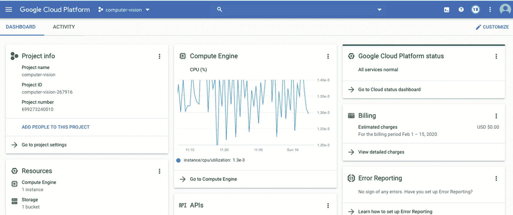

图 10-5

谷歌云平台仪表板

### 创建一个谷歌云存储桶

GCS 是 Google Cloud 上的一个高度持久的对象存储。它可以扩展到存储数十亿字节的数据。GCS 桶类似于文件系统中的目录。我们可以通过以下两种方式之一创建 GCS 存储桶。

### 从 Web 用户界面创建 GCS 存储桶

要使用 web UI 创建存储桶，请执行以下步骤:

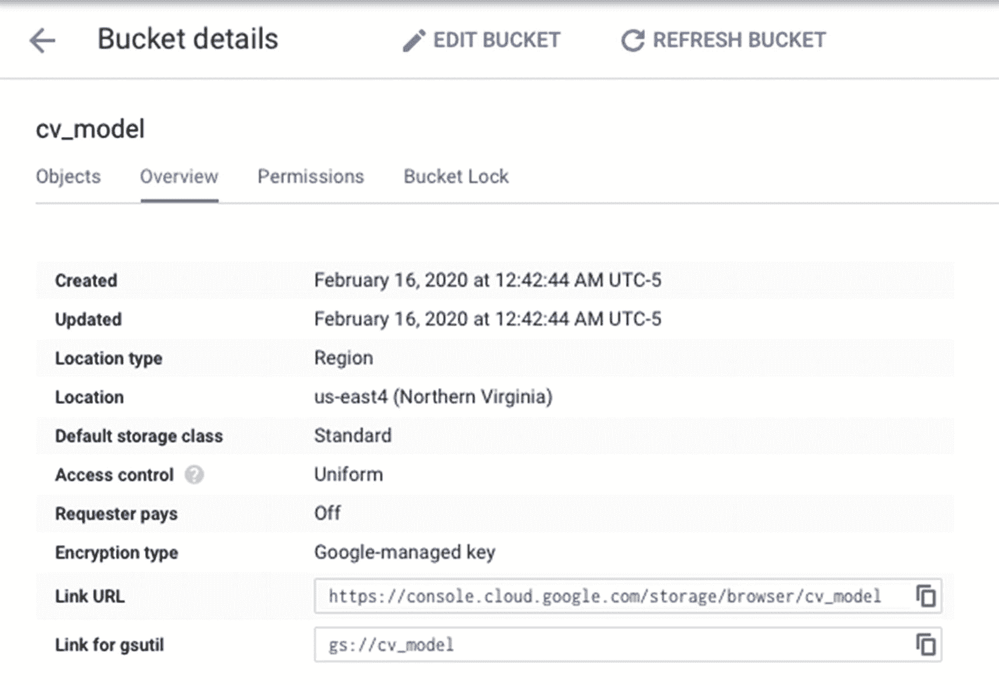

图 10-8

时段详细信息页面

1.  Log in to the Google Cloud Console, at [`https://cloud.google.com`](https://cloud.google.com). From the left-side navigation menu, click Storage and then Browse to launch the storage browser page (see Figure [10-6](#Fig6)).

    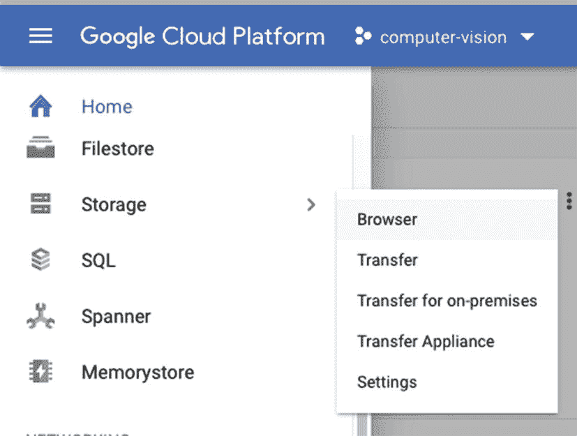

    图 10-6

    存储菜单

2.  单击页面顶部的创建存储桶按钮。

3.  On the next page, fill in the bucket name (e.g., `cv_model`) and click Continue. Select Region for the location type, select the appropriate location such as “us-east4 (Northern Virginia),” and then click Continue (see Figure [10-7](#Fig7)).

    

    图 10-7

    创建存储桶的表单

4.  选择“标准”作为默认存储类别，然后单击“继续”。

5.  为访问控制选择统一，然后单击继续。

6.  单击“创建”按钮创建存储桶。

7.  在下一页上，点击概览选项卡以查看铲斗详情(参见图 [10-8](#Fig8) )。

### 从云外壳创建 GCS 存储桶

如果您已经使用 web UI 创建了存储桶，那么您不需要遵循这些步骤。使用命令行很容易创建 bucket。

1.  点击右上角的图标激活云壳。在图 [10-5](#Fig5) 中，该图标标有一个红色矩形。云壳将在屏幕底部打开(在同一个浏览器窗口中)。

2.  在云 Shell 中执行清单 [10-6](#PC14) 中的命令来创建 bucket。

```py
gsutil mb -c regional -l us-east4 gs://cv_model

Listing 10-6gsutil Command to Create GCS Bucket

```

在清单 [10-6](#PC14) 的命令中提供适当的区域和存储桶名称。如果您已经使用 web UI 创建了存储桶，请确保使用不同的存储桶名称。

`gsutil`是一个 Python 应用，允许我们从命令行访问云存储。

图 [10-9](#Fig9) 显示了`gsutil`命令在云壳中的执行。


图 10-9

gsutil 命令使用云 Shell 创建一个 bucket

### 启动 GCP 虚拟机

在我们的练习中，我们将启动以下类型的虚拟机:

*   *一个基于 GPU 的虚拟机*:参数服务器

*   *一个基于 GPU 的虚拟机*:主节点

*   *两个基于 GPU 的虚拟机*:工作节点

虚拟机将在我们的 GCS 存储区所在的同一区域启动(上例中为 us-east4)。

要启动虚拟机，请执行以下步骤:


图 10-12

单击“更改”按钮启动“启动盘”选择页面

1.  在主导航菜单中，单击计算引擎，然后单击“虚拟机实例”以启动显示先前启动的虚拟机列表的页面。

2.  Click Create to launch the web form that we need to fill in to create the instance. Figure [10-10](#Fig10) and Figure [10-11](#Fig11) show the instance creation form.

    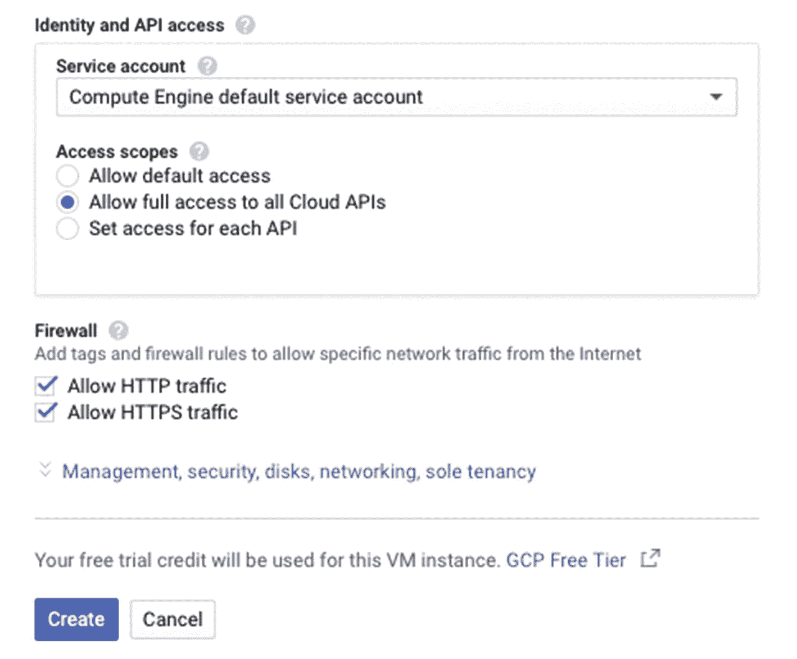

    图 10-11

    实例创建表单的底部

    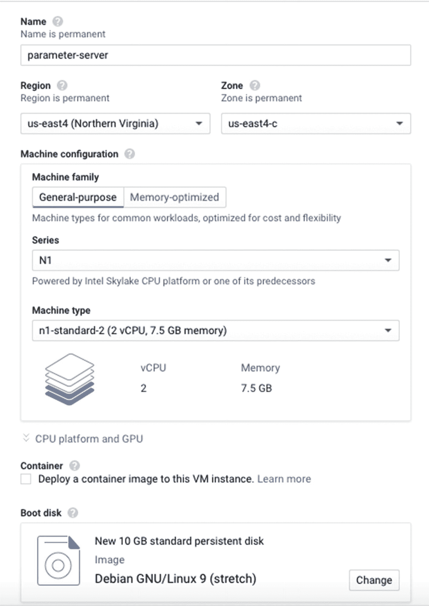

    图 10-10

    表单(顶部)提供创建虚拟机的信息

3.  我们将创建四个基于 GPU 的虚拟机来创建集群。在实例创建表单中，点击“启动盘”下图片旁边的更改按钮(如图 [10-12](#Fig12) )。

在下一个屏幕上(如图 [10-13](#Fig13) 所示)，为操作系统选择 Linux 上的深度学习，为版本选择深度学习映像:TensorFlow 1.15.0 m45。

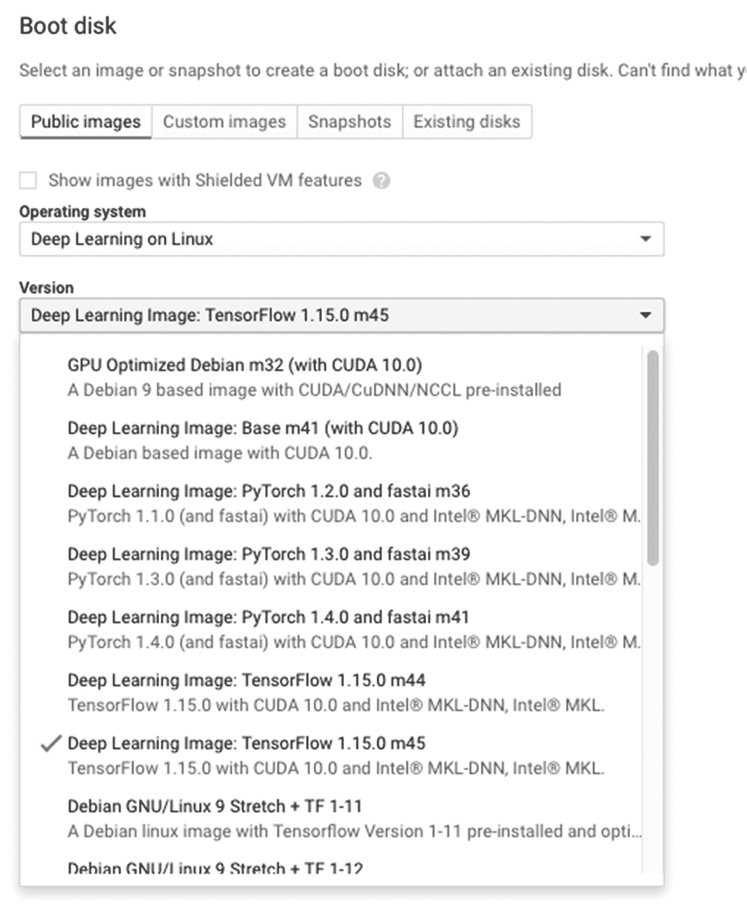

图 10-13

基于 CUDA 10 的 Linux 操作系统，预装 TensorFlow 1.15

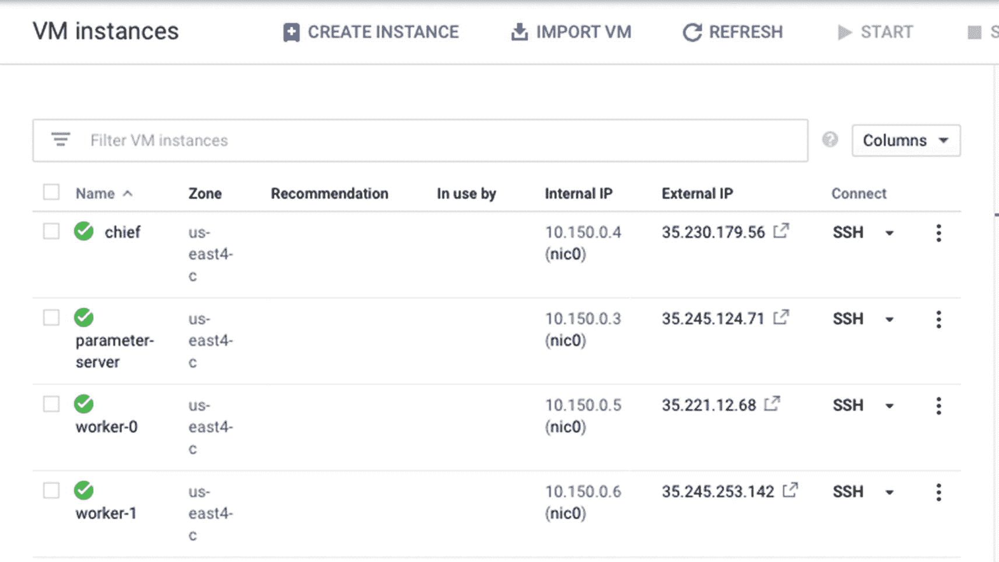

图 10-14

创建的所有虚拟机的列表

1.  图 [10-14](#Fig14) 显示了列出我们创建的所有四个虚拟机的屏幕。

### 登录到每个虚拟机的 SSH

我们将使用云 Shell 和`gsutil`登录到之前创建的所有四个虚拟机。激活云壳并点击+图标(在图 [10-15](#Fig15) 中用红色矩形标记)。

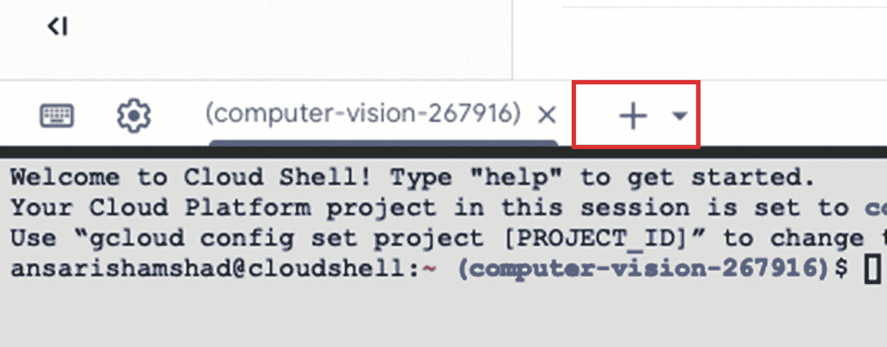

图 10-15

通过单击+图标创建云壳的多个选项卡

要通过 SSH 登录，请执行清单 [10-7](#PC15) 中所示的命令(在四个 Cloud Shell 选项卡中)。

```py
SSH to parameter server    gcloud compute ssh parameter-server
SSH to chief               gcloud compute ssh chief
SSH to worker-0            gcloud compute ssh worker-0
SSH to worker-1            gcloud compute ssh worker-1

Listing 10-7SSH to Log In to All 4VMs Using Cloud Shell

```

### 上传分布式培训的代码或克隆 GitHub 存储库

当通过 SSH 登录时，执行以下命令来克隆包含分布式模型训练代码的 GitHub 存储库(如清单 [10-8](#PC16) 所示)。这需要在所有机器上进行。

```py
git clone https://github.com/ansarisam/dist-tf-modeling.git

Listing 10-8Command to Clone the GitHub Repository

```

如果`git`命令不起作用，使用`sudo apt-get install git`命令安装`git`。

### 安装先决条件和 TensorFlow

镜像“Linux 上的深度学习”已经预装了所有的先决条件和 TensorFlow。然而，如果我们想要配置我们的环境，执行清单 [10-9](#PC17) 中的所有命令(查看章节 [1](01.html) 以获得详细说明)。

```py
sudo apt-get update
sudo apt-get -y upgrade && sudo apt-get install -y python-pip python-dev
sudo apt-get install python3-dev python3-pip
sudo pip3 install -U virtualenv
mkdir cv
virtualenv --system-site-packages -p python3 ./cv
source ./cv/bin/activate
pip install tensorflow==1.15

Listing 10-9Installing Prerequisites Including TensorFlow

```

### 运行分布式培训

确保您已经在所有机器上克隆了 GitHub 库(如清单 [10-8](#PC16) 所示)。此外，确保您通过 SSH(使用云 Shell)登录到每个虚拟机。在每个虚拟机上执行以下命令，启动分布式培训。

下面是参数服务器的命令:

```py
cd dist_tf_modeling
export TF_CONFIG='{"task": {"index": 0, "type": "ps"}, "cluster": {"chief":["chief:8900"],"worker": ["worker-0:8900", "worker-1:8900"],  "ps":["parameter-server:8900"]}}';python distributed_training_ps.py --output_path gs://cv_model_v1

```

以下是主节点的命令:

```py
cd dist_tf_modeling
export TF_CONFIG='{"task": {"index": 0, "type": "chief"}, "cluster": {"chief":["chief:8900"],"worker": ["worker-0:8900", "worker-1:8900"],  "ps":["parameter-server:8900"]}}';python distributed_training_ps.py --output_path gs://cv_model_v1

```

以下是 worker-0 节点的命令:

```py
cd dist_tf_modeling
export TF_CONFIG='{"task": {"index": 0, "type": "worker"}, "cluster": {"chief":["chief:8900"],"worker": ["worker-0:8900", "worker-1:8900"],  "ps":["parameter-server:8900"]}}';python distributed_training_ps.py --output_path gs://cv_model_v1

```

以下是 worker-1 节点的命令:

```py
cd dist_tf_modeling
export TF_CONFIG='{"task": {"index": 1, "type": "worker"}, "cluster": {"chief":["chief:8900"],"worker": ["worker-0:8900", "worker-1:8900"],  "ps":["parameter-server:8900"]}}';python distributed_training_ps.py --output_path gs://cv_model_v1

```

注意，所有参与节点必须能够通过`TF_CONFIG`中配置的端口与参数服务器通信。此外，节点必须对 GCS 存储桶拥有必要的读写权限。

模型检查点保存在 GCS 中的路径`gs://cv_model_v1`。训练好的模型在`gs://cv_model_v1`中保存为`model.h5`。

使用 GPU 的 GCP 实例非常昂贵。如果不再使用它们以避免任何费用，您应该终止它们。

## Azure 上的分布式培训

微软 Azure 是一种云计算服务，用于通过微软管理的数据中心构建、测试、部署和管理应用和服务。

清单 [10-3](#PC11) 中的`ParameterServerStrategy`的分布式训练也将在 Azure 上工作，几乎与它在 GCP 上工作的方式相同。GCP 和 Azure 的区别在于我们创建虚拟机节点的方式。我们将探索一种不同的分布式训练策略，而不是重复在 Azure 集群上分发基于参数服务器的训练的过程。

我们将使用`MirroredStrategy`在具有多个 GPU 的单个节点上分发培训。在本节中，我们将了解以下内容:

*   如何使用 web 界面在 Azure 上创建基于多 GPU 的虚拟机

*   如何设置 TensorFlow 在 GPU 上运行

*   要让清单 [10-3](#PC11) 中的代码在多个 GPU 上工作，需要做哪些改变

*   如何执行培训并监督培训

请注意，对 TensorFlow 的 GPU 支持适用于 Ubuntu 和 Windows 以及支持 CUDA 的卡。在本练习中，我们将创建一个基于 Ubuntu 18.4 的带有两个 GPU 的虚拟机。

### 在 Azure 上创建具有多个 GPU 的虚拟机

我们需要首先在 [`https://azure.microsoft.com/`](https://azure.microsoft.com/) 注册创建一个免费账户。然后进入 [`https://portal.azure.com/`](https://portal.azure.com/) 并登录你的账户。免费帐户允许您创建一个只有一个 GPU 的虚拟机。要创建具有多个 GPU 的虚拟机，您必须激活计费。要激活它，请遵循以下说明:

1.  单击主导航(展开位于左上角的汉堡图标)。

2.  选择成本管理+计费，点击“Azure 订阅”

3.  单击添加。

4.  遵循屏幕上的说明。

要创建虚拟机，请执行以下操作:


图 10-18

显示公共 IP 地址的虚拟机详细信息页面

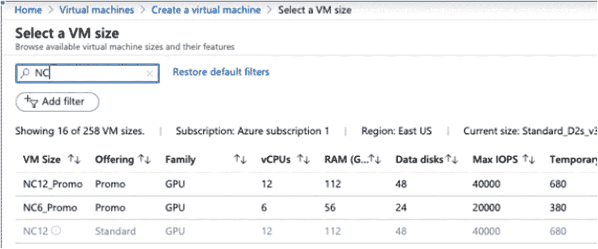

图 10-17

设备大小(GPU)选择屏幕

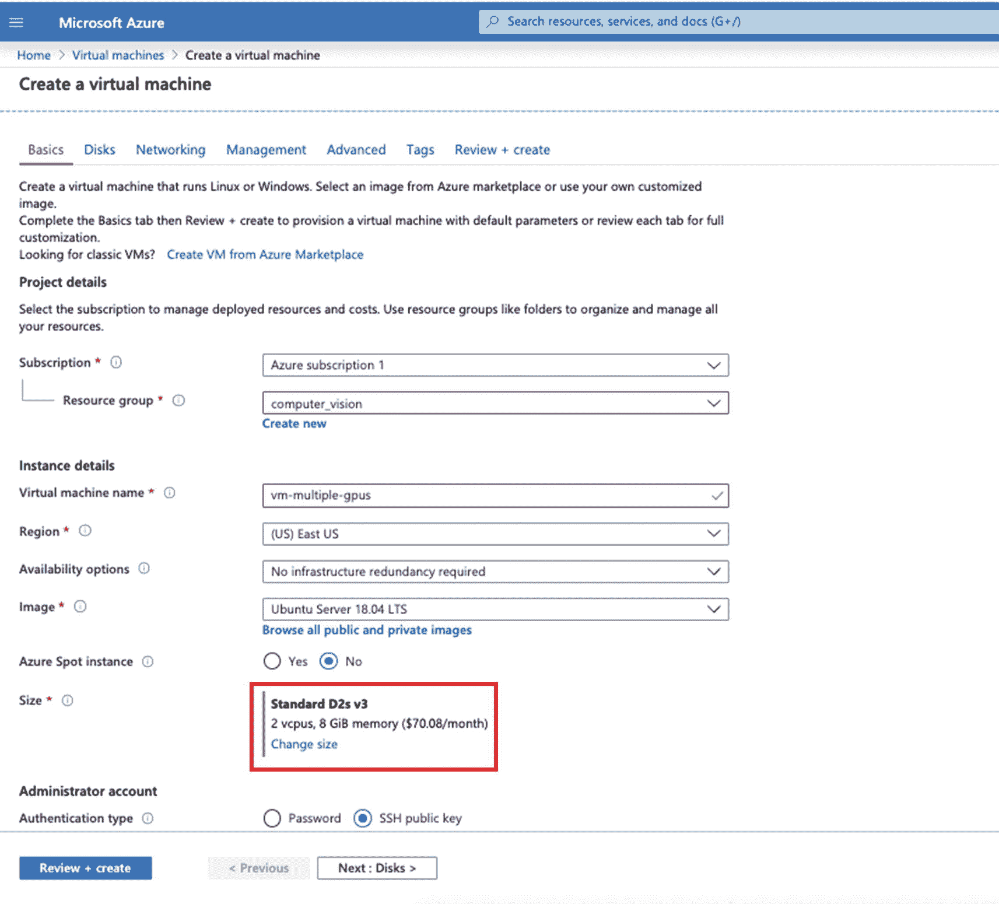

图 10-16

用于创建虚拟机的 Azure 配置页面

1.  在主页上，单击“虚拟机”图标

2.  单击页面底部的“创建虚拟机”按钮，或单击左上角的+添加图标。

3.  填写表格以配置虚拟机。图 [10-16](#Fig16) 显示了基本配置的顶部。对于字段图像，选择 Ubuntu Server 10.04 LTS 版。

4.  我们将为虚拟机添加 GPU。点击图 [10-16](#Fig16) 中红色矩形内显示的链接“更改尺寸”。这将启动一个页面，显示您在图 [10-3](#Fig3) 的区域字段中选择的区域内所有可用设备的列表。

    如图 [10-17](#Fig17) 所示，首先清除所有过滤器，搜索 *NC* 找到 NC 系列的 GPU。我们将选择 NC12_Promo 虚拟机大小，这为我们提供了两个 GPU、12 个 vCPUs 和 112GB 内存。突出显示与 NC12_Promo 大小相对应的行，并单击位于屏幕底部的选择按钮。

    有关其他虚拟机大小的更多信息，请访问 [`https://docs.microsoft.com/en-us/azure/virtual-machines/linux/sizes-gpu`](https://docs.microsoft.com/en-us/azure/virtual-machines/linux/sizes-gpu) 。

    如果与我们要使用的 GPU 对应的行呈灰色显示，这意味着您尚未升级您的订阅，或者您没有足够的配额来使用该虚拟机。

    您可以要求 Microsoft 增加您的配额。请访问 [`https://docs.microsoft.com/en-us/azure/azure-resource-manager/templates/error-resource-quota`](https://docs.microsoft.com/en-us/azure/azure-resource-manager/templates/error-resource-quota) 了解有关如何申请增加配额的更多信息。

    On the Basic configuration screen (Figure [10-3](#Fig3)), you can select either of the following (depending on your security policy) for the authentication type:
    *   *SSH 公钥*:粘贴您将用来访问这个虚拟机的 SSH 公钥。

    *   *密码*:创建一个用户名和密码，您需要在通过 SSH 连接时提供。我们将在练习中使用该选项。

5.  将其他内容保留为默认设置，然后单击屏幕左下角的“查看+创建”按钮。在下一页，我们将检查我们的配置，以确保所有内容都选择正确，然后最后单击“Create”按钮。如果一切顺利，将创建具有两个 GPU 的 VM。我们的虚拟机可能需要几分钟才能准备就绪。

    在这种情况下，我们没有创建任何磁盘，因为虚拟机附带了足够大的磁盘来运行我们的培训。这不是一个永久磁盘，如果虚拟机终止，它将被删除。因此，在生产中，您必须添加一个永久磁盘以避免丢失数据。

6.  在我们的虚拟机准备就绪后，如果我们没有离开上一页，我们将看到一个警告，表明虚拟机已准备就绪。我们还可以返回主页，单击“Virtual machines”图标，查看我们创建的虚拟机列表。点击虚拟机名称，打开详细页面，如图 [10-18](#Fig18) 所示。

7.  记下或复制公共 IP 地址，因为我们将需要它来 SSH 到我们的虚拟机。使用 SSH 客户端，如用于 Windows 的 Putty 或用于 Mac 或 Linux 的 Shell 终端，使用您之前选择的身份验证方法登录到虚拟机。以下是通过两种身份验证方法对 SSH 执行的命令:
    *   基于密码的认证:

        ```py
        - ssh username@13.82.230.148
        username@13.82.230.148's password:

        ```

    *   基于 SSH 公钥的认证:

```py
- ssh -i ~/sshkey.pem 13.82.230.148

```

如果成功通过身份验证，您将登录到虚拟机。

### 安装 GPU 驱动程序和库

要在基于 GPU 的机器上运行 TensorFlow，我们需要安装 GPU 驱动程序和一些库。执行以下步骤:

1.  在终端上执行清单 [10-10](#PC24) 的所有命令(确保通过 SSH 登录)。

1.  如果成功添加了 NVIDIA 软件包库，请使用清单 [10-11](#PC25) 中的命令安装 NVIDIA 驱动程序。

```py
# Add NVIDIA package repositories
- wget https://developer.download.nvidia.com/compute/cuda/repos/ubuntu1804/x86_64/cuda-repo-ubuntu1804_10.1.243-1_amd64.deb
- sudo dpkg -i cuda-repo-ubuntu1804_10.1.243-1_amd64.deb
sudo apt-key adv --fetch-keys - https://developer.download.nvidia.com/compute/cuda/repos/ubuntu1804/x86_64/7fa2af80.pub
- sudo apt-get update
- wget http://developer.download.nvidia.com/compute/machine-learning/repos/ubuntu1804/x86_64/nvidia-machine-learning-repo-ubuntu1804_1.0.0-1_amd64.deb
- sudo apt install ./nvidia-machine-learning-repo-ubuntu1804_1.0.0-1_amd64.deb
sudo apt-get update

Listing 10-10Commands to Add NVIDIA Package Repositories

```

1.  要使之前的安装生效，您需要重新启动虚拟机。在 SSH 终端 shell 上，执行命令`sudo reboot`。

2.  再次对虚拟机进行 SSH。

3.  要测试 NVIDIA 驱动程序是否安装成功，请执行以下命令:

```py
- sudo apt-get install --no-install-recommends nvidia-driver-418

Listing 10-11Installing the NVIDIA Driver

```

```py
- nvidia-smi

```

该命令应该显示类似图 [10-19](#Fig19) 的内容。


图 10-19

nvidia-smi 命令的输出

1.  我们现在将安装开发和运行时库(清单 [10-12](#PC27) )。这将是大约 4GB 的大小。

1.  安装 TensorRT 库(清单 [10-13](#PC28) )。

```py
- sudo apt-get install --no-install-recommends \
    cuda-10-1 \
    libcudnn7=7.6.4.38-1+cuda10.1  \
    libcudnn7-dev=7.6.4.38-1+cuda10.1

Listing 10-12Installing Development and Runtime Libraries

```

```py
- sudo apt-get install -y --no-install-recommends libnvinfer6=6.0.1-1+cuda10.1 \
    libnvinfer-dev=6.0.1-1+cuda10.1 \
    libnvinfer-plugin6=6.0.1-1+cuda10.1

Listing 10-13Installing TensorRT

```

### 创建 virtualenv 并安装 TensorFlow

按照第 [1](01.html) 章中提供的说明安装您需要的所有库和依赖项。我们将执行清单 [10-14](#PC29) 中的命令来安装我们当前练习所需的所有先决条件。

```py
- sudo apt update
- sudo apt-get install python3-dev python3-pip
- sudo pip3 install -U virtualenv
- mkdir cv
- virtualenv --system-site-packages -p python3 ./cv
- source ./cv/bin/activate
(cv) - pip install  tensorflow
(cv) - pip install tensorflow-gpu

Listing 10-14Installing Python, Creating virtualenv, and Installing TensorFlow

```

### 实施镜像策略

参见清单 [10-3](#PC11) 第 9 行。我们将创建一个`MirroredStrategy`的实例，而不是实例化`ParameterServerStrategy`，如下所示:

```py
strategy = tf.distribute.MirroredStrategy()

```

清单 [10-3](#PC11) 的所有其他行将保持不变。

我们已经向 GitHub 库提交了修改后的代码，该代码实现了用于分布式训练的`MirroredStrategy`。GitHub 库位置为 [`https://github.com/ansarisam/dist-tf-modeling.git`](https://github.com/ansarisam/dist-tf-modeling.git) ，包含`MirroredStrategy`代码的文件名为`mirrored_strategy.py`。

### 运行分布式培训

通过 SSH 登录到我们之前创建的虚拟机。然后克隆 GitHub 库，如清单 [10-15](#PC31) 所示。

```py
- git clone https://github.com/ansarisam/dist-tf-modeling.git

Listing 10-15Cloning GitHub Repository

```

执行清单 [10-16](#PC32) 中所示的 Python 代码来训练分布式模型。

```py
- python dist-tf-modeling/mirrored_strategy.py

Listing 10-16Executing the MirroredStrategy-Based Distributed Model

```

如果一切顺利，您将看到终端控制台上打印的训练进度。图 [10-20](#Fig20) 显示了一些示例输出。

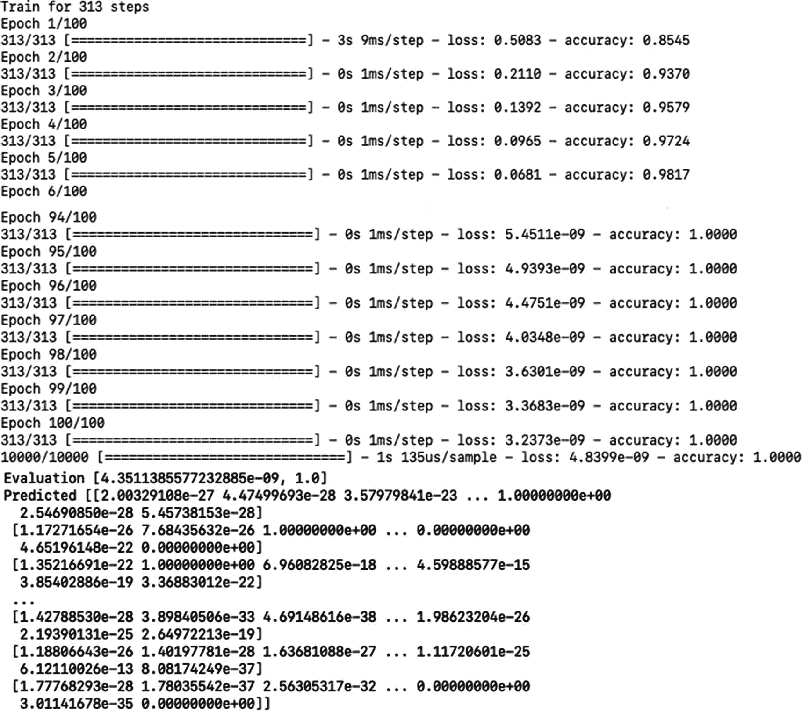

图 10-20

显示培训进度和评估结果的示例屏幕

为了检查 GPU 是否用于分布式训练，从不同的终端 SSH 到 VM，并执行清单 [10-17](#PC33) 中所示的命令。

```py
- nvidia-smi

Listing 10-17Checking the GPU Status

```

图 [10-21](#Fig21) 和 [10-22](#Fig22) 显示了该命令的输出。

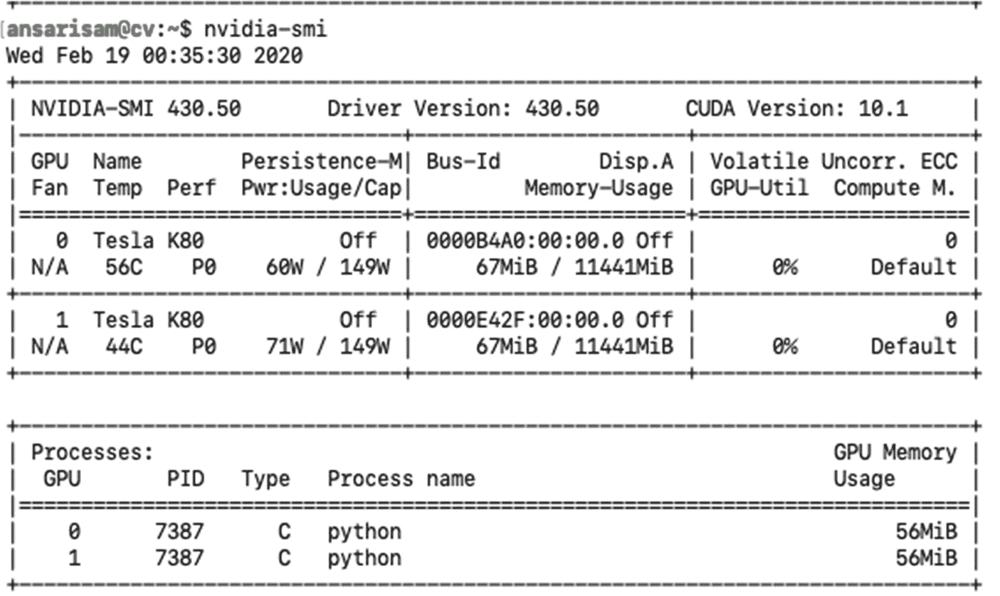

图 10-22

训练过程中的 GPU 状态

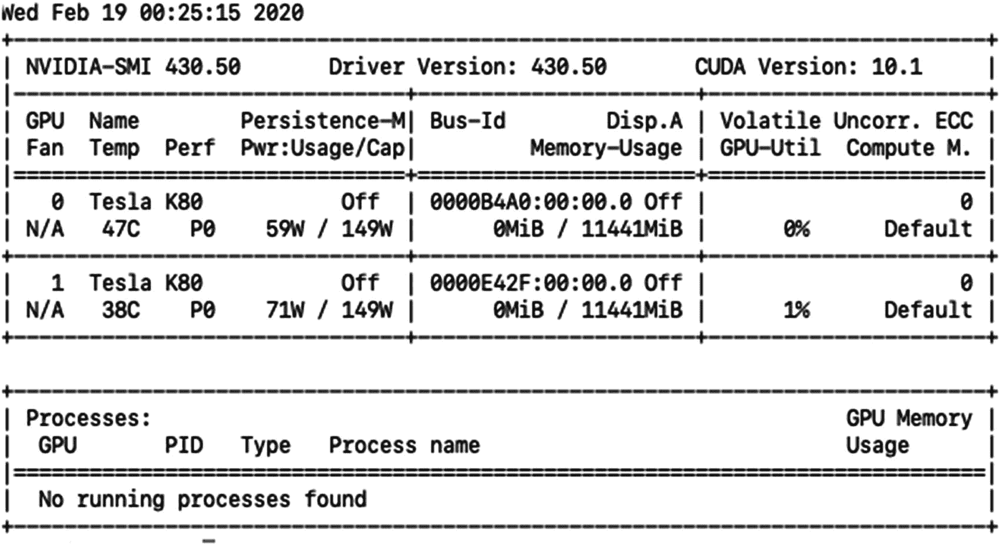

图 10-21

培训开始前的 GPU 状态

如果您不再需要虚拟机，您应该终止它以避免任何成本，因为这些基于 GPU 的虚拟机非常昂贵。在终止虚拟机之前，请确保将训练好的模型和检查点下载并存储到永久存储中。

## AWS 分布式培训

亚马逊网络服务(AWS)是亚马逊的一家子公司，以计量付费的方式向个人、公司和政府提供按需云计算平台和 API。在这一节中，我们将探索如何在 AWS 上训练一个分布式模型。

清单 [10-3](#PC11) 的分布式培训也适用于 AWS。我们需要做的就是创建虚拟机，并按照我们为训练 GCP 模型所做的步骤进行操作。

类似地，我们可以在拥有多个 GPU 的 AWS 虚拟机上训练基于`MirroredStrategy`的模型。除了创建基于多 GPU 的虚拟机的方法之外，所有关于 Azure 的培训说明对于 AWS 都是一样的。

在这里，我们将探索另一种在云上训练可伸缩模型的技术。我们将学习如何使用 Horovod 在 AWS 上分发培训。我们先来了解一下 Horovod 框架是什么，以及如何在分布式模型训练中使用它。

### 霍罗沃德

官方文档将 Horovod 描述为用于 TensorFlow、Keras、PyTorch 和 Apache MXNet 的分布式深度学习训练框架。旨在让分布式深度学习变得快速易用。Horovod 是在优步开发的，由 Linux 基金会 AI 托管。

带有文档的源代码保存在位于 [`https://github.com/horovod/horovod`](https://github.com/horovod/horovod) 的 GitHub 库中。官方文档在 [`https://horovod.readthedocs.io/en/latest/summary_include.html`](https://horovod.readthedocs.io/en/latest/summary_include.html) 。

要使用 Horovod，我们需要对 TensorFlow 代码进行一些小的修改，以便进行模型训练。我们将使用清单 [5-2](05.html#PC6) 中的相同示例代码，并进行修改以使其与 Horovod 兼容。

### 如何使用 Horovod

当我们定义一个神经网络时，我们指定优化算法，例如 AdaGrad，我们希望我们的网络使用它来优化梯度。在分布式学习中，在多个节点中计算梯度，使用全部减少或全部收集算法进行平均，并使用优化算法进行进一步优化。Horovod 提供了一个包装器函数来将优化分配给所有参与节点，并将梯度优化任务委托给我们在 Horovod 中包装的原始优化算法。

我们将使用 Horovod 和 TensorFlow 将模型训练分发到多个节点，每个节点都有一个或多个 GPU。我们将处理清单 [5-2](05.html#PC6) 中的同一个代码示例，对它做一些小的修改，使它与 Horovod 兼容，并在 AWS 上执行培训。要使用 Horovod，我们需要对清单 [5-2](05.html#PC6) 的代码进行如下修改:

1.  将`horovod.tensorflow`作为`hvd`导入。

2.  使用`hvd.init()`初始化 Horovod。

3.  使用以下命令锁定将处理渐变的 GPU(每个进程一个 GPU):

    ```py
    config = tf.ConfigProto()
    config.gpu_options.visible_device_list = str(hvd.local_rank())

    ```

4.  像我们通常在 TensorFlow 中做的那样建立模型。定义损失函数。

5.  定义 TensorFlow 优化函数，如下所示:

1.  调用 Horovod 分布式优化函数，并传递步骤 5 中的原始 TensorFlow 优化器。这是霍洛佛德的核心。

```py
opt = tf.train.AdagradOptimizer(0.01 * hvd.size())

```

1.  创建一个 Horovod 钩子向所有处理器广播训练变量。

```py
opt = hvd.DistributedOptimizer(opt)

```

```py
hooks = [hvd.BroadcastGlobalVariablesHook(0)]

```

0 表示所有处理器的等级为零(例如，第一个 GPU)。

1.  最后，使用以下代码训练模型:

```py
train_op = opt.minimize(loss)

```

让我们将所有这些放在一起，并将清单 [5-2](05.html#PC6) 中的代码转换成 Horovod 兼容的代码，这些代码可以通过多个 GPU 分布在多个节点上。清单 [10-18](#PC39) 显示了我们可以在 Horovod 集群上使用 TensorFlow 作为执行引擎执行的完整代码。取自 Horovod 官方源代码的`examples`目录的代码维护在`https.//` [`github.com/horovod/horovod.git`](http://github.com/horovod/horovod.git) 。

```py
File name: horovod_tensorflow_mnist.py
01: import tensorflow as tf
02: import horovod.tensorflow.keras as hvd
03:
04: # Horovod: initialize Horovod.
05: hvd.init()
06:
07: # Horovod: pin GPU to be used to process local rank (one GPU per process)
08: gpus = tf.config.experimental.list_physical_devices('GPU')
09: for gpu in gpus:
10:     tf.config.experimental.set_memory_growth(gpu, True)
11: if gpus:
12:     tf.config.experimental.set_visible_devices(gpus[hvd.local_rank()], 'GPU')
13:
14: # Load MNIST data using built-in datasets download function

15: mnist = tf.keras.datasets.mnist
16: (x_train, y_train), (x_test, y_test) = mnist.load_data()
17:
18: #Normalize the pixel values by dividing each pixel by 255
19: x_train, x_test = x_train / 255.0, x_test / 255.0
20:
21: BUFFER_SIZE = len(x_train)
22: BATCH_SIZE_PER_REPLICA = 16
23: GLOBAL_BATCH_SIZE = BATCH_SIZE_PER_REPLICA * 2
24: EPOCHS = 100
25: STEPS_PER_EPOCH = int(BUFFER_SIZE/EPOCHS)
26:
27: train_dataset = tf.data.Dataset.from_tensor_slices((x_train, y_train)).repeat().shuffle(BUFFER_SIZE).batch(GLOBAL_BATCH_SIZE,drop_remainder=True)
28: test_dataset = tf.data.Dataset.from_tensor_slices((x_test, y_test)).batch(GLOBAL_BATCH_SIZE)
29:
30:
31: mnist_model = tf.keras.Sequential([
32:     tf.keras.layers.Conv2D(32, [3, 3], activation="relu"),
33:     tf.keras.layers.Conv2D(64, [3, 3], activation="relu"),
34:     tf.keras.layers.MaxPooling2D(pool_size=(2, 2)),
35:     tf.keras.layers.Dropout(0.25),
36:     tf.keras.layers.Flatten(),
37:     tf.keras.layers.Dense(128, activation="relu"),
38:     tf.keras.layers.Dropout(0.5),
39:     tf.keras.layers.Dense(10, activation="softmax")
40: ])
41:
42: # Horovod: adjust learning rate based on number of GPUs.
43: opt = tf.optimizers.Adam(0.001 * hvd.size())
44:
45: # Horovod: add Horovod DistributedOptimizer.
46: opt = hvd.DistributedOptimizer(opt)
47:
48: # Horovod: Specify `experimental_run_tf_function=False` to ensure TensorFlow

49: # uses hvd.DistributedOptimizer() to compute gradients.
50: mnist_model.compile(loss=tf.losses.SparseCategoricalCrossentropy(),
51:                     optimizer=opt,
52:                     metrics=['accuracy'],
53:                     experimental_run_tf_function=False)
54:
55: callbacks = [
56:     # Horovod: broadcast initial variable states from rank 0 to all other processes.
57:     # This is necessary to ensure consistent initialization of all workers when
58:     # training is started with random weights or restored from a checkpoint.
59:     hvd.callbacks.BroadcastGlobalVariablesCallback(0),
60:
61:     # Horovod: average metrics among workers at the end of every epoch.
62:     #
63:     # Note: This callback must be in the list before the ReduceLROnPlateau,
64:     # TensorBoard or other metrics-based callbacks.
65:     hvd.callbacks.MetricAverageCallback(),
66:
67:     # Horovod: using `lr = 1.0 * hvd.size()` from the very beginning leads to worse final
68:     # accuracy. Scale the learning rate `lr = 1.0` ---> `lr = 1.0 * hvd.size()` during
69:     # the first three epochs. See https://arxiv.org/abs/1706.02677 for details.
70:     hvd.callbacks.LearningRateWarmupCallback(warmup_epochs=3, verbose=1),
71: ]
72:
73: # Horovod: save checkpoints only on worker 0 to prevent other workers from corrupting them.
74: if hvd.rank() == 0:
75:     callbacks.append(tf.keras.callbacks.ModelCheckpoint('./checkpoint-{epoch}.h5'))
76:
77: # Horovod: write logs on worker 0.
78: verbose = 1 if hvd.rank() == 0 else 0
79:
80: # Train the model.
81: # Horovod: adjust the number of steps based on the number of GPUs.
82: mnist_model.fit(train_dataset, steps_per_epoch=500 // hvd.size(), callbacks=callbacks, epochs=24, verbose=verbose)

Listing 10-18Distributed Training with Horovod

```

使用 Horovod APIs 的代码部分在注释中用标签`Horovod:`标记。代码被适当地注释以帮助你理解如何使用 Horovod。所有其他代码行已经在第 [5 章](05.html)中解释过了。

### 在 AWS 上创建 Horovod 集群

您必须拥有 AWS 帐户，并且能够登录到您的 AWS web 控制台。如果您没有帐户，请在 [`https://aws.amazon.com`](https://aws.amazon.com) 创建一个。AWS 免费提供某些类型的资源一年。但是，为了在 Horovod 集群上训练我们的模型，我们需要的资源类型可能需要您启用计费。您的帐户可能会为您将用于运行分布式培训的资源付费。您可能还需要请求增加某些资源(如 vCPU 和 GPU)的配额。在 [`https://aws.amazon.com/about-aws/whats-new/2019/06/introducing-service-quotas-view-and-manage-quotas-for-aws-services-from-one-location/`](https://aws.amazon.com/about-aws/whats-new/2019/06/introducing-service-quotas-view-and-manage-quotas-for-aws-services-from-one-location/) 有增加配额的说明。

#### Horovod 星团

AWS 提供了一种便捷的方式，只需点击几下鼠标就可以创建大规模可伸缩的 Horovod 集群。出于本节练习的目的，我们将创建一个包含两个节点的集群，每个节点只有一个 GPU。我们将执行以下操作:


图 10-32

将 id_rsa.pub 内容粘贴到 authorized_keys 文件的末尾


图 10-31

猫~/。ssh/id_ras.pub 输出。从 ssh-rsa 开始复制整个文本


图 10-30

ssh-keygen 输出

1.  登录您的 AWS 帐户以访问 AWS 管理控制台； [`https://console.aws.amazon.com`见](https://console.aws.amazon.com)。

2.  Click Services, then EC2, then Instances, and then Launch Instance (as shown in Figure [10-23](#Fig23)).

    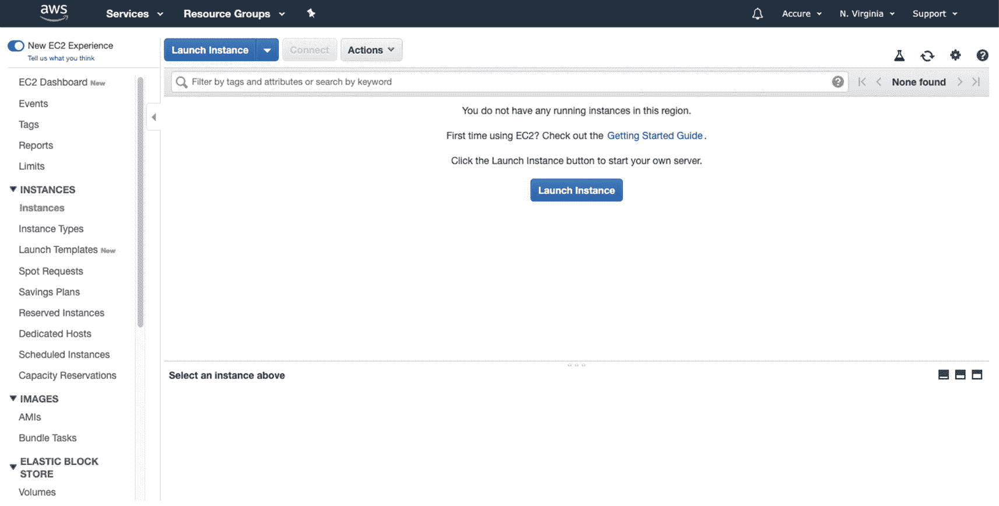

    图 10-23

    AWS 实例启动屏幕

3.  On the next screen, search for *deep learning* and select “Deep Learning AMI (Deep Learning AMI (Amazon Linux) Version 26.0 - ami-02bd97932dabc037b)” from the list of Amazon machine images (AMIs). See Figure [10-24](#Fig24).

    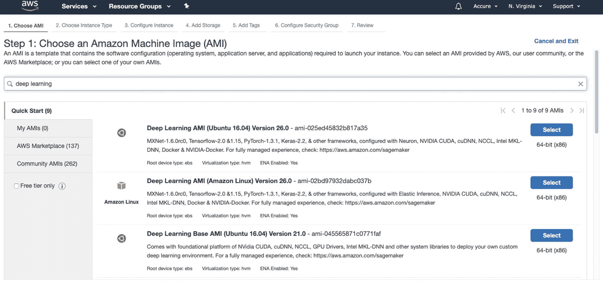

    图 10-24

    AMI 选择屏幕

4.  On the Choose an Instance Type page, select the GPU instances, type **g2.2xlarge**, set the vCPUs to 8, and set the memory to 15GB (as shown in Figure [10-25](#Fig25)). You can select any GPU-based instance to meet your training requirements. Click the Next: Configuration Instance Details button at the bottom of the screen.

    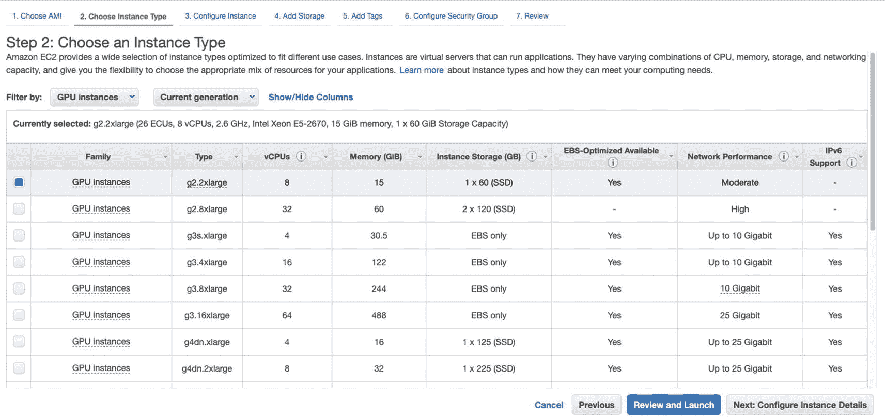

    图 10-25

    选择实例类型选择屏幕

5.  填写配置实例详细信息页面(如图 [10-26](#Fig26) )。在 Number of Instances 字段中，我们输入 **2** 在集群中创建两个节点。您可以根据需要创建任意数量的节点来扩展您的训练。

    对于放置组，选中“将实例添加到放置组”框，并创建一个新组或添加到现有组。为安置组策略选择“集群”。

    We will leave everything else at the default settings on this page. Click the Next: Add Storage button.

    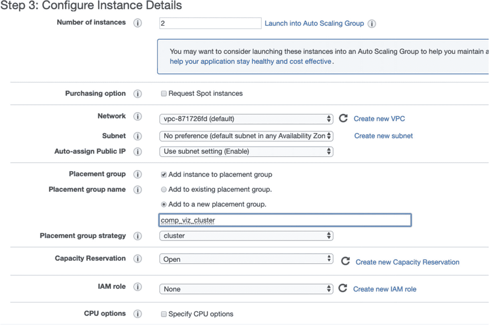

    图 10-26

    配置实例详细信息

6.  On the Add Storage page (as shown in Figure [10-27](#Fig27)), provide the numbers for the disk size as per your needs. In this example, we will leave everything as is. Click the Next: Add Tags button and then the Next: Configure Security Groups button.

    

    图 10-27

    添加存储页面

7.  Either create a new security group or use “Select an existing security group” if you want an existing security group (see Figure [10-28](#Fig28)). Click Review and Launch followed by the Launch buttons. This will display a pop-up screen to either create or select a key pair. This key pair is used to log on to the VM using SSH. Follow the on-screen instructions (as shown in Figure [10-29](#Fig29)).

    

    图 10-29

    创建或选择密钥对的弹出屏幕

    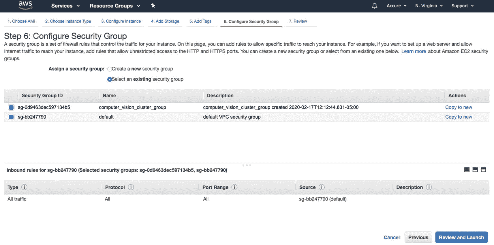

    图 10-28

    用于创建或选择安全组的页面

8.  成功启动实例后，我们将需要创建无密码 SSH，以使每个节点能够相互通信。我们在一台机器上创建一个 RSA 密钥，并将公钥从`rsa_id.pub`文件复制到所有节点的`authorized_keys`文件。以下是步骤:
    1.  SSH 到机器 1，并从它的主目录执行命令`ssh-keygen`。每出现一个提示就按 Enter 键，直到看到指纹印在屏幕上。终端输出应如图 [10-30](#Fig30) 所示。

    2.  将`~/.ssh/id_rsa.pub`的内容复制到`~/.ssh/authorized_keys`，如图 [10-31](#Fig31) 和图 [10-32](#Fig32) 所示。

    3.  将一台机器的`id_rsa.pub`内容复制到所有节点的`authorized_keys`文件的末尾。

    4.  重复该过程，在其余机器上创建`ssh-keygen`，并将`id_rsa.pub`的内容复制到每个节点的`authorized_keys`的末尾。

    5.  您应该通过 SSH 从一台机器登录到另一台机器来进行验证。它应该允许您不需要任何密码就可以登录。如果 SSH 提示输入密码，这意味着您没有从一台机器到另一台机器的无密码通信。为了让 Horovod 工作，所有机器必须能够在没有密码的情况下与其他机器进行通信。

#### 运行分布式培训

我们在这个例子中使用的 AMI 包含以分布式模式启动培训的脚本。有一个位于`/home/ec2-user/examples/horovod/tensorflow`的`train_synthetic.sh` shell 脚本。您可以修改这个脚本以指向您的代码并启动培训。

这个示例脚本在我们刚刚创建的 Horovod 集群上启动了一个基于 RestNet 的培训。只需按如下方式执行:

```py
sh /home/ec2-user/examples/horovod/tensorflow/train_synthetic.sh 2

```

参数 2 表示群集中 GPU 的数量。

如果一切顺利，您将拥有一个经过训练的模型，您可以将它下载到您将托管使用该模型来预测结果的应用的机器上。

我们用的 AMI 已经安装了 Horovod。如果您想使用没有 Horovod 的 VM，请遵循下一节中的安装说明。

### 安装 Horovod

Horovod 依赖于 OpenMPI 来运行。首先，我们需要使用清单 [10-19](#PC41) 中所示的命令安装 OpenMPI。

```py
# Download Open MPI
- wget https://download.open-mpi.org/release/open-mpi/v4.0/openmpi-4.0.2.tar.gz
# Uncompress
- gunzip -c openmpi-4.0.2.tar.gz | tar xf -
- cd openmpi-4.0.2
- ./configure --prefix=/usr/local
- make all install

Listing 10-19Installing OpenMPI

```

安装 OpenMPI 需要几分钟时间。

OpenMPI 成功安装后，使用`pip`命令安装 Horovod，如清单 [10-20](#PC42) 所示。

```py
- pip install horovord

Listing 10-20Installing Horovord

```

清单 [10-19](#PC41) 和 [10-20](#PC42) 必须在集群的所有机器上执行。

### 运行 Horovod 以执行分布式培训

要在具有四个 GPU 的计算机上运行，请使用以下命令:

```py
- horovodrun -np 4 -H localhost:4 python horovod_tensorflow_mnist.py

```

要在四台各有四个 GPU 的机器上运行，请运行以下命令:

```py
- horovodrun -np 16 -H host1:4,host2:4,host3:4,host4:4 python horovod_tensorflow_mnist.py

```

您还可以在主机文件中指定主机节点。这里有一个例子:

```py
- cat horovod_cluster.conf
host1 slots=2
host2 slots=2
host3 slots=2

```

这个例子列出了主机名(`host1`、`host2`和`host3`)以及每个主机名有多少个“插槽”。槽表示训练可能在一个节点上执行的 GPU 数量。

要在名为`horovod_cluster.conf`的文件中指定的主机上运行，请运行以下命令:

```py
- horovodrun -np 6 -hostfile horovod_cluster.conf python horovod_tensorflow_mnist.py

```

使用 GPU 的虚拟机成本高昂。因此，如果不再使用虚拟机，建议将其终止。图 [10-33](#Fig33) 显示了如何终止实例。


图 10-33

终止 AWS 虚拟机

## 摘要

本章首先介绍了计算机视觉模型的分布式训练。我们探索了 TensorFlow 中支持的各种分布式策略，并学习了如何为分布式培训编写代码。

我们基于 GCP、Azure 和 AWS 云基础设施上的 MNIST 数据集训练了我们的手写识别模型。我们探索了在三个云平台上训练模型的三种不同技术。我们的示例训练基于 TensorFlow 支持的分发策略:`ParameterServerStrategy`和`MirroredStrategy`。还学习了如何使用 Horovod 进行计算机视觉模型的大规模训练。