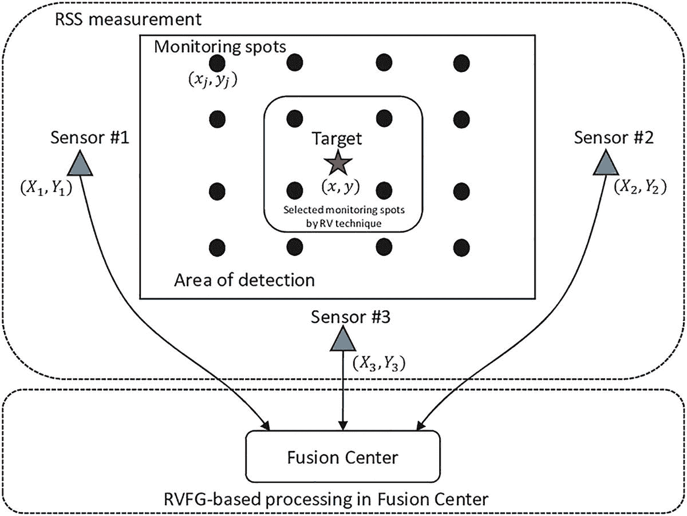
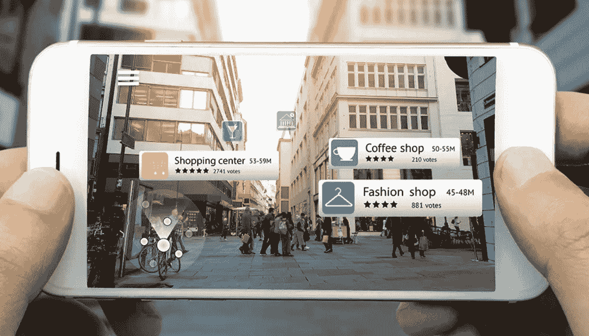

# 二、增强现实简介

这一章将着重于什么是增强现实，技术的发展，以及它的不同应用。

## 什么是增强现实？

几十年来，人类总是使用某种技术来可视化数据、讲述故事、教育学生，甚至娱乐。数据可视化对于许多组织和个人更好地理解信息和做出决策至关重要。讲故事在让观众参与到活动中起着重要的作用。教育对于今天的学生塑造未来至关重要。娱乐形式可以是电子游戏、运动和音乐会。所有这些都是通过增加物理世界中的数字对象并使消费者能够与它们互动而变得更加互动的活动的例子。为了成功地增强物理世界中的数字对象，我们必须将光投射到定制的形状中，并将其显示在物理对象上。然而，这种方法需要大多数消费者不常用的附加硬件，例如屏幕投影仪和全息投影仪。需要额外的硬件来“增加”物理世界中的数字对象的事实使得该技术不太容易获得，并且由于所需硬件的高价格标签而难以扩展。随着计算机视觉的发展，更多的研究人员和工程师一起开发各种技术，以增强物理世界中的数字对象，并实现与计算机交互的新方式，从而开发出我们今天所知的增强现实。

增强现实是通过在物理世界中重建和显示交互式数字对象来开发交互式用户体验的领域。在开发增强现实技术和应用的过程中，我们需要考虑三个核心概念:

1.  物理世界重建和映射技术

2.  数字物体投影技术

3.  新的人机交互指南

增强物理世界中的数字对象并与之交互的早期方法之一是由计算机研究人员米隆·克鲁格开发的一个项目，他使用相机的实时视觉数据并投影计算机界面，以与物理世界中的数字计算机组件进行交互(图 2-1 )。

图 2-1

video place–AR 的开始

许多其他方法也依赖摄像机的实时视觉数据来理解场景；但是数字组件的投影总是在变化。一些尝试创造了耳机和眼镜，将数字组件投射到可佩戴的小屏幕上。其他人会将摄像机的实时视觉数据传输到计算机屏幕上，并通过屏幕与数字组件进行交互。随着计算机视觉技术的发展，以及在便携式屏幕上提供实时反馈的相机设备变得越来越受欢迎，越来越容易被消费者使用，我们今天所熟悉的增强现实技术开始发展。除了开发计算机视觉和数字对象投影技术来实现增强现实，使增强现实对人类友好并易于使用对于实现该技术的全部潜力至关重要。计算机视觉、硬件和人机交互研究人员和工程师多年来一直在共同努力，创造最终的增强现实体验，这导致开发了今天在手机中看到的最常见的增强现实形式。

如今，智能手机，如 iOS 和 Android 设备，是让用户体验增强现实的主要设备，因为大多数智能手机都有强大的摄像头、传感器和地理定位硬件。通过利用智能手机中硬件提供的信息，我们可以通过增强现实为用户提供身临其境的娱乐体验。智能手机中提供足够信息来实现增强现实的硬件包括单镜头或多镜头相机、加速度计、陀螺仪、磁力计和地理定位传感器(图 2-2 )。

图 2-2

单镜头照相机

单镜头相机从一个角度提供场景的视觉数据，这有助于检测和跟踪场景中表面的简单特征。另一方面，多镜头相机从两个不同的角度提供视觉数据，这有助于检测和跟踪场景中的深度，深度跟踪可以实现更准确的真实世界距离测量。加速度计、陀螺仪和磁力计都是惯性测量单元(IMU)的一部分，可以测量设备的加速度，并估计其速度、距离、方向和重力。地理定位传感器提供有关设备位置和地理坐标的信息，这使得能够在特定位置区域增加和“锁定”数字对象(图 2-3 )。

图 2-3

地理定位传感器测量

如前所述，在开发增强现实技术时，我们需要考虑三个核心概念，第一个概念是物理世界重建和映射，也称为场景重建。场景重建是一项计算机视觉任务，其核心目标是将视频帧重建为三维场景。这种视觉任务对于将数字对象放置在房间的特定部分以及使用从重建的三维场景中检索的特定坐标值来识别对象在物理世界中的位置是必不可少的。

为了执行这项视觉任务，我们需要从单镜头或多镜头相机中检索视频帧。由于缺乏深度信息，从单镜头相机检索的视频帧将使重建场景更加困难；然而，由于一种被称为运动结构(SfM)的计算机视觉技术，场景重建可以通过单镜头相机进行。SfM 是一种使用二维图像阵列来检测图像阵列中的独特特征并重建三维场景的技术(图 2-4 )。与单镜头相机不同，使用来自多镜头相机的图像进行场景重建的挑战性稍低，因为我们可以从两个或更多个图像中估计深度，并使用深度数据重建三维场景。

图 2-4

来自运动模型的结构

虽然在某些情况下使用仅视觉技术的场景重建可能是足够的，但是在许多情况下，来自手持移动电话的视觉数据由于过度运动和不可预测的照明条件而失真，导致大的误差容限，并且在某些情况下不能实现场景重建。在这种情况下，可以在当今大多数移动电话中找到的惯性测量单元(IMU)将与视觉数据一起使用，以产生可能的最佳场景重建。当视觉数据因任何原因失真或延迟时，从 IMU 设备检索的信息(如方向和加速度)非常有用，因为 IMU 数据的提供频率高于视觉数据，这有助于检测运动和环境中任何微小或显著的变化。这种 IMU 数据与视觉数据对齐，以计算设备的初始速度和物理坐标。

在计算机视觉和增强现实领域，使用 IMU 数据和来自相机的视觉数据来执行场景重建和其他物理世界测量任务是一种常见的方法。事实上，它通常被称为视觉惯性里程计，简称 VIO。VIO 最初被开发用于空中机器人，如无人机和车辆，以实现自主应用。随着该技术从仅依赖多镜头视觉数据发展到单镜头视觉数据，其应用不断增加，并最终在智能手机上实现了增强现实。VIO 的增强现实应用主要围绕“无标记 AR”，这使得在不需要“标记”的情况下增强物理世界中的数字对象 AR 标记是唯一标识的对象或图像，用于增强数字对象；这可以是二维码、书籍中的图像或人/动物的身体部位，如脸、手和脚。为了实现基于标记的增强现实，需要各种视觉任务，例如物体姿态估计、注释和地标检测。

## 不同类型的增强现实

目前常用的增强现实有几种类型；这包括基于标记、无标记和基于地理位置的增强现实(AR)。所有这三种类型的核心目标都是增强物理世界中的数字对象；然而，用于实现每种类型的技术各不相同。此外，每种类型的应用都有不同的用途。例如，基于标记的 AR 需要先前定义的图像特征，我们可以使用这些特征来增强数字对象。一个常见的使用案例是面部过滤器。AR 人脸过滤器增加检测到的人脸上或周围的数字对象，并跟踪人脸运动，以相应地改变数字对象的位置(图 2-5 )。

图 2-5

人脸检测和地标估计

为了实现 AR 人脸过滤器，我们需要执行计算机视觉任务，如人脸检测和人脸标志检测/跟踪。人脸检测是从给定图像中分割和检测人脸的过程。面部标志检测是检测面部特征并跟踪变化的过程，例如眨眼、嘴巴张开/闭合和面部表情。通过实时结合关于面部的两种信息，我们将能够成功地增强面部的数字对象。除了使用检测到的面部作为标记之外，还有依赖于各种其他标记的其他方法，例如简单的 QR 码、独特的图像和定制的物理对象(即，瓶子、杯子、帽子等)。).用于实现其他基于标记的增强现实方法的处理技术源自特征检测、跟踪和姿态估计的计算机视觉概念。随着我们在本书末尾更接近实现过程，我们将更深入地描述用于实现基于标记的 AR 的算法。

无标记 AR 是一种健壮的技术，不需要任何先前的环境知识；然而，它需要某些硬件来实现。在无标记 AR 开发的早期，实现无标记 AR 所需的硬件类型通常不为消费者所拥有，例如立体相机和高级 IMU 设备。随着 AR 研发的增加，我们看到了各种方法来最大限度地减少不常用硬件的使用，而是依赖于消费者可以广泛接触到的硬件，如低成本 IMU 设备和单镜头相机，这些设备在今天的智能手机中很常见。在上一节中，我们简要介绍了当今大多数手机如何使用视觉惯性里程计技术实现无标记 AR，这种技术利用从 IMU 设备和摄像头检索的信息来执行场景重建，以及其他支持无标记 AR 的计算机视觉任务。无标记 AR 应用是无限的，更有创意和影响力的应用有很大的空间。今天，无标记 AR 可以用来测量物理对象，并模拟物理世界的体验。这些应用对教育、设计、旅游等许多行业都产生了巨大的影响。总之，无标记和基于标记的增强现实基本相同，但由于每种技术的限制，它们的应用完全不同。尽管这两种增强现实方法有着极其不同的应用，但它们可以同时用于实现更复杂的增强现实体验，这就导致了基于地理位置的增强现实。

基于地理位置的增强现实将无标记和基于标记的增强现实与地理位置数据相集成，以在特定的地理位置坐标中增强和“锁定”数字对象(图 2-6 )。

图 2-6

基于地理位置的 AR

## 摘要

在本章中，我们讨论了一些与增强现实相关的基本概念。之后，讨论了不同类型的增强现实。

AR 可以定义为一个包含三个基本特征的系统:真实和虚拟世界的结合、实时交互以及虚拟和真实对象的精确 3D 注册。

任何基于 AR 的工具的核心组件是处理器、传感器、输入设备，主要是显示器。显示器可以是智能手机、手持设备、智能眼镜或头戴式显示器(HMD)。输入设备是照相机或网络摄像机。传感器包括陀螺仪和加速度计。

在下一章，我们将详细了解图像和视频处理的基础知识。