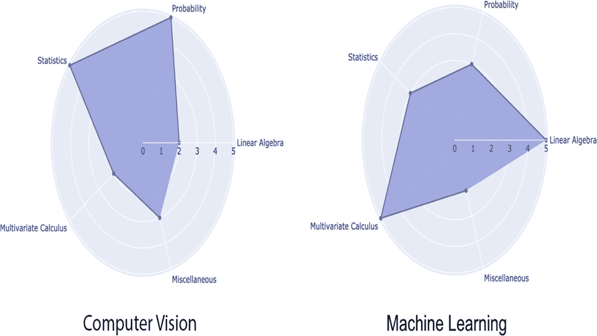
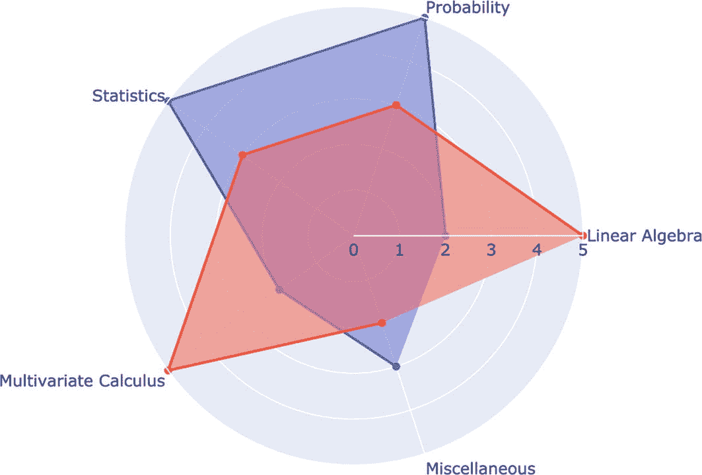
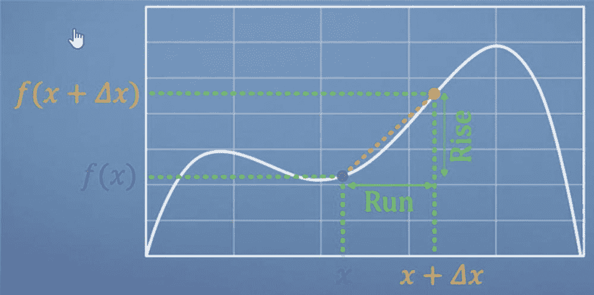
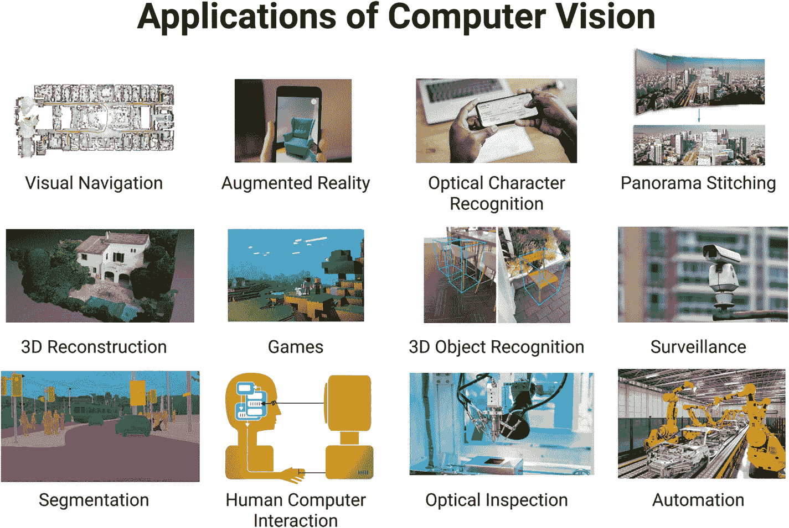
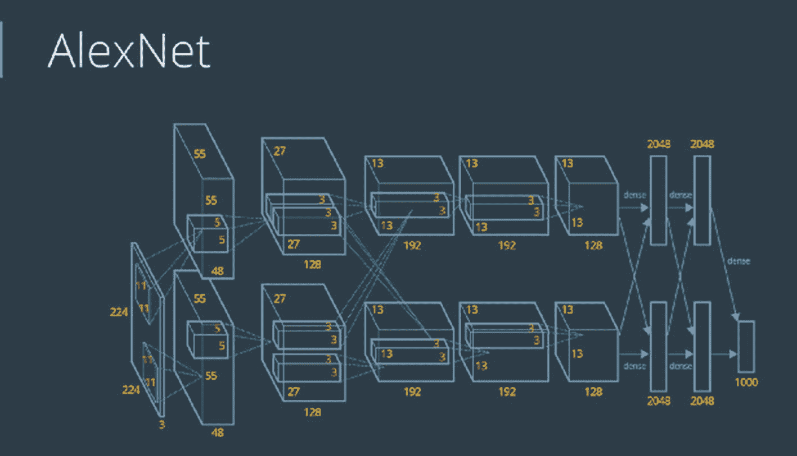
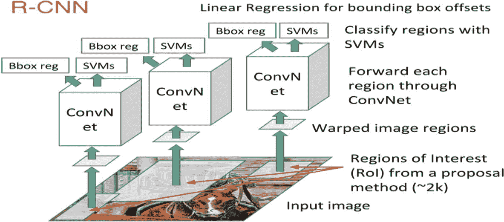
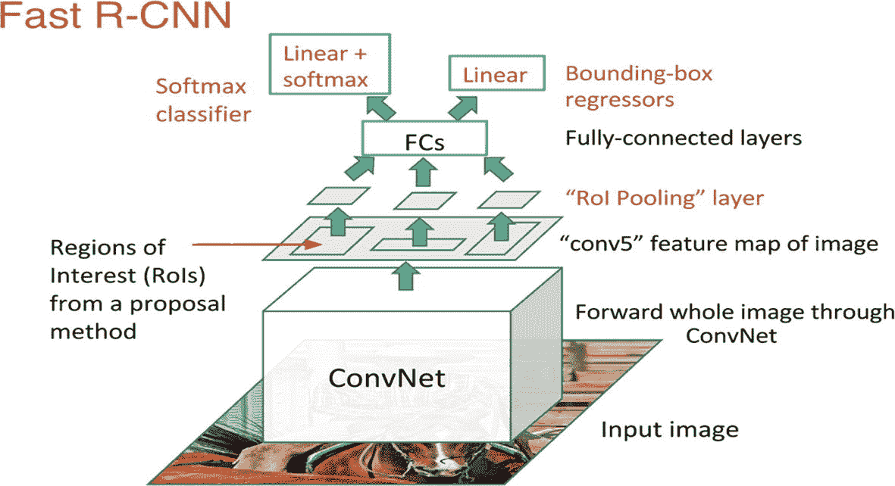
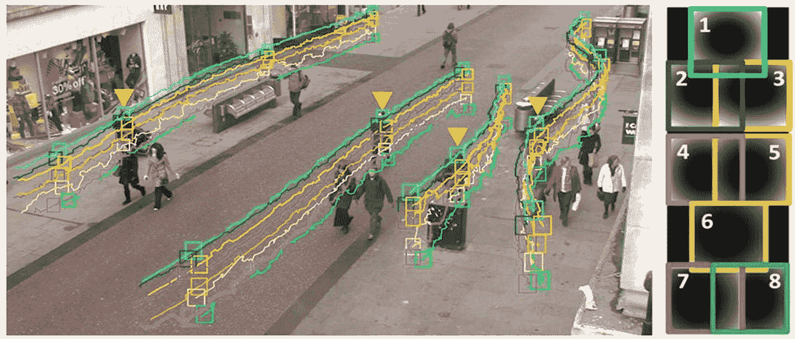

# 三、图像和视频处理基础

本章将重点介绍图像和视频处理的基础知识，包括所需的数学知识、标准算法、实现选项，以及在 C++应用中实现一个实际例子。

## 数学概述

自从第一台计算机发明以来，数学一直是计算机工作的基础。事实上，计算机的早期应用之一是在需要在短时间内计算复杂数学问题的业务中。随着计算机硬件能力在过去几十年中开始改善，计算机在短短*秒*内可以完成的复杂计算量急剧增加，使计算机能够轻松执行图像和视频处理，从而使计算机能够用于高速和高计算能力的应用，如图形处理和音频处理。在前面的章节中，我们简要回顾了图像是如何显示、渲染和处理的。在这一节中，我们将介绍支持当今图像和视频处理(也称为计算机视觉)和人工智能技术的数学基础。

虽然计算机视觉和人工智能有着密切的关系，但它们对数学的侧重略有不同。下面的雷达图总结了这一论点。在下面的情节中，你可能会看到与人工智能/深度学习相比，计算机视觉如何融合数学的不同分支。计算机视觉对概率和统计的利用远远超过深度学习(图 3-1 )。

图 3-1

计算机视觉与机器学习

虽然计算机视觉和深度学习有很多共同点，但它们的主要侧重点却截然不同。我们在计算机视觉方面的主要目标是调查和分析图像或视频，提出建议，并验证它们。

这些似乎是用来揭示数据中隐藏的假设的方法，这些假设乍一看是不可见的。因此，为了比较和检验假设，我们必须完全依靠统计和概率概念(图 3-2 )。计算机视觉和机器学习都强调线性代数原理，因为它是所有复杂系统的起点。另一方面，多变量微积分与参数分析有关，这将是我们将在本书中进一步讨论的所有深度神经网络背后的驱动因素。

图 3-2

数学在计算机视觉中的应用

考虑一下这个。我们更喜欢数据挖掘技术中使用的数据是干净的，并且是根据方法论准备的。如果我们想要端到端地工作(计算机视觉+机器学习)，我们应该学习和探索计算机视觉和人工智能应用所需的数学基础。

在计算机视觉和机器学习中，数学不是分析数据；它是关于理解正在发生的事情，为什么会发生，以及我们如何实验不同的变量来得到我们想要的结果。下图展示了给定变量的变化率；这也被称为上升超过运行，斜率公式，或有时被称为梯度。这允许我们从给定的输入中理解变化的上下文。

*变量变化率图*

在处理给定图像时，任何线性方程的几何解释和直觉都是必不可少的。下面的公式是梯度公式的标准表示:

*变量变化率(微分)*

这有助于我们破译这些令人费解的声明的解释。

好吧，让我们把重点转向理解为什么我们必须学习这些不同的数学分支，以及什么是直观学习它们的好来源。

## 图像处理基础

目前，最热门的研究领域之一是深度学习。深度学习是一种机器学习和人工智能(AI)技术，模仿人们如何获取某些类型的知识。深度学习算法建立在日益复杂和抽象的层次结构中，不像典型的机器学习算法那样是线性的。深度学习作为一个领域，融合了一系列学术学科，包括计算机科学(图形、算法、哲学、结构和建筑)、数学(信息检索、机器学习)、工程(机器人、语音、NLP、图像处理)、物理(光学)、生物学(神经科学)和心理学(认知科学)等等。

由于其跨领域的掌握，许多科学家认为机器视觉为人工通用智能铺平了道路，因为它代表了对视觉环境及其上下文的相对理解。

**那么什么是计算机视觉呢？**

正式教科书中的定义如下:

*   “从图像中构建对物理对象的明确、有意义的描述”([巴拉德&布朗](https://www.amazon.com/Computer-Vision-Dana-H-Ballard/dp/0131653164)，1982)。

*   “……从一个或多个数字图像中计算三维世界的属性”([特鲁科&维里](https://www.amazon.com/Introductory-Techniques-3-D-Computer-Vision/dp/0132611082)，1998)。

*   “……根据感应到的图像对真实的物理对象和场景做出有用的决定”([索克曼&夏皮罗](https://www.amazon.com/Computer-Vision-Linda-G-Shapiro/dp/0130307963)，2001)。

为什么选择计算机视觉？

最明显的反应是，这一研究领域的实际应用越来越多。这里仅举几个例子(图 3-3 ):

*   面部识别:为了添加过滤器并在图像中识别你，Snapchat 和脸书使用面部检测算法。

*   图片检索:为了找到合适的图片，Google Images 使用基于内容的查询。该算法探索查询图像的内容，并根据最相关的内容返回结果。

*   Gaming and controls: Microsoft Kinect is a brilliant commercial device that uses stereo vision in gaming.

    

    图 3-3

    计算机视觉的应用

*   监控摄像头在公共场所很常见，用于跟踪异常活动。

*   指纹、虹膜和面部匹配是一些最流行的生物认证技术。

*   视觉仍然是检测道路信号、灯和智能车辆的其他视觉特征的主要知识来源。

计算机视觉涉及视觉识别，如图像描述、定位和识别。

## 标准算法

由于神经网络和深度学习方法的最新进展，这些最先进的视觉识别技术的效率已经大大提高。这本书是学习深度学习架构以及它们如何用于尖端机器视觉科学的一个很好的平台。在本书中，我们将介绍五种最重要的计算机视觉策略，它们是:卷积神经网络、AlexNet、基于区域的卷积神经网络(R-CNN)和快速 R-CNN。此外，我们将介绍主要的深度学习模型和每个策略可以用于的应用。

**图像分类**

图像分类(图 3-4 )的目标如下:给我们一系列图像，这些图像都标有一个类别，我们被要求为一组新的测试图像预测这些类别，我们被要求计算我们预测的准确性。视点变化、大小变化、类内变化、图像变形、图像遮挡、照明条件和上下文混乱都是该活动呈现的问题。

图 3-4

图像分类

我们如何着手建立一个算法，可以将图像分成不同的组？计算机视觉领域的研究人员已经为这个问题设计了一个数据驱动的解决方案。他们为计算机提供每个图像类别的几个示例，然后创建学习算法，这些算法查看这些示例并了解每个类别的视觉外观，而不是试图在代码中明确确定每个感兴趣的图像类别看起来像什么。

换句话说，标记图像的训练数据集首先被馈送到系统，以相应地处理和创建分类模型。以下是影像分类流水线的正式版本:

*   提供包含 N 个图像的训练数据集作为输入，每个图像标记有 K 个组中的一个；其中 N 是所有组中图像的总数，K 是分类模式中的组数。一个组代表图像所属的类别。

*   然后，我们使用这个训练包来教分类器如何对图像进行分类。

*   最后，我们测量分类器的输出，告诉它为一系列从未见过的新图像推断标签。这些图像的实际标签将等同于由分类器投射的标签。

卷积神经网络(CNN)是最常用的图像识别架构。当你提供网络图像，网络对数据进行分类时，这是 CNN 的一个常见用例。CNN 通常以输入“扫描仪”开始，它不是为一次处理所有训练数据而设计的(图 3-5 )。例如，当使用 CNN 时，您不会想要一个有 10，000 个节点的层，在其中输入一个 100 × 100 像素的文件。这将是非常低效的，并且在更大规模上是不实际的。

图 3-5

卷积神经网络

相反，您可以创建一个 10 × 10 的扫描输入层，将图像的前 10 × 10 个像素输入其中。传递数据后，将扫描仪向右移动 1 个像素，以输入下一个 10 × 10 像素。滑动窗口是这个过程的名称。

卷积层，而不是常规层，用于处理输入数据。每个节点只关心其紧邻的小区。由于可快速分割的输入因子，这些卷积层往往随着厚度的增加而收缩。除了卷积层之外，它们通常还有池层。最大池策略是一种流行的池策略，在这种策略中，我们取 2 × 2 像素，然后移动到具有最大某个属性的像素。

ImageNet 是一个包含近 120 万个高分辨率训练文件的数据集，用于训练当今大多数图像识别技术。将在没有初始注释(即，没有分割或标签)的情况下查看测试图像，并且将需要算法来创建标签，以显示图像中存在哪些对象。来自牛津、INRIA 和 XRCE 的领先计算机视觉小组在这个数据集上测试了一些当前较好的计算机视觉方法。通常，计算机视觉解决方案使用多级流水线，通过在早期阶段调整一些参数来手动调整。

第一届 ImageNet 竞赛的获胜者 Alex Krizhevsky (NIPS 2012)构建了一个由 Yann LeCun 开创的非常深度的卷积神经网络。它的架构中有七个秘密层，不包括任何最大池层(图 3-6 )。前两层是卷积层，最后一层是全局相关层。在每块秘密板中，激活函数都是经过校正的线性单位。这些部队比后勤部队更善于表达，训练速度也更快。此外，当附近单元的活动较强时，采用竞争归一化来消除秘密行为。这有助于力量的差异。

图 3-6

阿勒克斯网

在硬件方面，Alex 使用了两个 Nvidia GTX 580 GPU 来运行一个非常强大的卷积网实现(超过 1000 个快速小内核)。GPU 非常适合矩阵-矩阵乘法，并且有很大的内存带宽。这有助于他们在一周内训练网络，并在测试期间快速合并十个补丁的结果。随着内核越来越便宜，数据库越来越大，大型神经网络可以比传统的 CV 网络进步更多。

## 目标检测

输出特定对象的边界框和标记广泛用于描述图像中的对象。这不同于分类/定位挑战，在分类/定位挑战中，分类和定位应用于大量对象，而不是单个主要对象。项目边界框和非对象边界框是仅有的两种对象分组类型。例如，在汽车检测中，您必须检测给定图片中的所有汽车及其边界框(图 3-7 )。

图 3-7

目标检测

如果我们使用滑动窗口技术来识别和定位图像，我们需要将 CNN 添加到图像的几个不同部分。由于 CNN 将每种作物分类为一个实体或一个上下文，我们必须将 CNN 应用于大范围的位置和大小，这在计算上是昂贵的。

为了解决这个问题，神经网络理论家建议使用区域来代替，区域是图像区域，可能包括外观上“成团”的特征。

这是一个相对容易玩的游戏。R-CNN(基于区域的卷积神经网络)是第一个让它动起来的模型。在 R-CNN 中，我们首先使用选择性搜索算法来扫描输入图像中的潜在伪像，产生 2000 个区域建议(图 3-8 )。然后，在所有这些地区提案之上，我们运行一个 CNN。最后，我们将每个 CNN 的输出输入到一个 SVM 中来识别区域，并通过线性回归来收紧对象的边界框。

图 3-8

R-CNN 网络

本质上，我们将目标识别问题转化为图像分类问题。但是有几个弊端:准备时间长，需要大量的磁盘空间，推理往往比较迟缓。

快速 R-CNN 是 R-CNN 的直接后代，它通过执行两个增强来提高检测速度:(1)在提出区域之前执行特征提取，导致在整个图像上仅运行一个 CNN，以及(2)用 softmax 层代替 SVM，导致扩展用于预测的神经网络，而不是开发新的模型。

由于它只对一个 CNN 进行整幅画面的训练，所以 fast R-CNN 在速度上表现要好得多。另一方面，选择性搜索算法也需要很长时间来产生区域建议。

因此，更快的 R-CNN 被开发出来，并从此成为基于深度学习的对象检测的规范标准(图 3-9 )。它插入一个区域建议网络(RPN)来预测来自特征的建议，用一个快速的神经网络代替缓慢的选择性搜索算法。为了最小化整个推理过程的计算需求，RPN 用于确定“在哪里”寻找。RPN 快速有效地扫描每个位置，以决定该区域是否需要额外的处理。它通过产生 K 个包围盒建议来实现这一点，每个包围盒建议有两个分数，显示一个项目出现在每个站点的可能性。

图 3-9

快速 R-CNN

一旦我们有了地区想法，我们就直接把它们输入到快速的 R-CNN 中。最后添加一个汇集层、几个全连接层、一个 softmax 分类层和一个边界框回归器。

总体而言，更快的 R-CNN 在速度和准确性方面优于竞争对手。虽然未来的模型大大提高了检测速度，但只有少数模型能够远远超过速度更快的 R-CNN。换句话说，虽然更快的 R-CNN 不是最简单或最快的目标检测过程，但它仍然是最有效的方法之一(图 3-10 )。

图 3-10

更快的 R-CNN

近年来，全球目标检测模式已经朝着更简单和更强大的检测系统发展。作为在整个画面上共享计算的一步，像你只看一次(YOLO)、单次多盒检测器(SSD)和基于区域的全卷积网络(R-FCNs)这样的方法是可观察到的。因此，这些策略将它们自己从三个 R-CNN 技术的昂贵子网中分离出来。这些模式背后的关键原因是停止让不同的算法孤立地专注于它们各自的子问题，这可能会增加训练时间并降低网络精度。

在给定场景中跟踪单个兴趣点或几个物体的方法称为物体跟踪(图 3-11 )。它在历史上曾被用于视频和现实世界中的遭遇，在最初识别一个对象后做出发现。现在，它对于优步和特斯拉的自动驾驶汽车等自动驾驶应用非常重要。

图 3-11

目标跟踪

根据观察范式，目标跟踪方法可以分为两类:生成式和判别式。生成式方法，例如 PCA，使用生成式模型来解释可见特征并最小化重建误差。

鉴别方法将区分目标和背景；其精度更可靠，越来越取代传统的跟踪方式。通过检测进行跟踪是区分过程的另一个术语，深度学习属于这一类。为了通过检测实现跟踪，我们在所有帧中检测候选对象，然后使用深度学习在候选对象中对目标对象进行分类。堆叠自动编码器(SAEe)和卷积神经网络(CNN)是两种可以使用的简单网络模型。

深度学习跟踪器(DLT)是使用 SAE 监控任务的最常见的深度网络，因为它允许离线预训练和在线微调。该过程如下:

*   通过对输入图像施加噪声并重构原始图像，堆叠去噪自动编码器将实现更鲁棒的函数表达能力。

为了创建分类网络，将预训练网络的编码部分与分类器结合，然后使用从原始帧收集的正样本和负样本来微调网络，以区分当前实体和过去实体。DLT 使用粒子过滤器作为运动模型，为当前帧创建候选补片。分类网络为这些小块产生似然性分数，这表明它们的分类有多可信，然后选择这些小块中最高的作为对象。

*   DLT 采用最小阈值方法进行模型更新。

由于在图像识别和目标检测方面的优势，CNN 已经成为机器视觉和视觉识别的标准深度范式。一般来说，大规模的 CNN 可以被训练成分类器和跟踪器。全卷积网络跟踪器(FCNT)和多域 CNN 是基于 CNN 的跟踪算法(MD Net)的两个例子。

*   FCNT 成功地分析和利用了 VGG 模型的功能图，这是一个预先训练的 ImageNet，产生了以下结果:
    *   CNN 功能图可用于监控和定位。

    *   对于从上下文中区分特定对象的任务，CNN 功能图通常是模糊的或不相关的。

    *   较低层编码更具识别性的属性以捕捉类内变化，而较高层捕捉关于对象类别的语义概念。

根据这些结果，FCNT 构建了一个要素发现网络，以在 VGG 网络的 con v4–3 和 con V5–3 图层上选取最重要的要素地图。然后，它为从两个图层中分别选择的特征地图创建两个附加通道(称为 SNet 和 GNet ),以防止在有噪声的图层上过度拟合。GNet 捕捉对象的类别细节，而 SNet 将对象从看起来相似的上下文中区分出来。

为了获得对象的热图，在第一帧中用指定的边界框初始化两个网络，并且对于新帧，在前一帧中以对象位置为中心的感兴趣区域(ROI)被裁剪和传播。最后，分类器通过 SNet 和 GNet 接收两个热图进行预测，跟踪器根据是否有干扰物来确定哪个热图将用于产生最终的跟踪结果。FCNT 管线如下图所示(图 3-12 )。

图 3-12

卷积网络流水线

.

## 摘要

本章涵盖了计算机视觉的基础数学，包括线性代数和多变量微积分。还包括为什么要学习计算机视觉。本章涵盖的标准算法是图像分类、对象检测、实例分割和对象跟踪。它还包括计算机如何读取图像。

图像分类是根据特定规则对图像中的像素组或向量组进行分类和标记的过程。

对象检测是一种计算机视觉技术，它允许我们在图像或视频中识别和定位对象。

语义分割描述了将图像的每个像素与类别标签(例如花、人、道路、天空、海洋或汽车)相关联的过程。

在下一章中，我们将讨论面部检测/识别和身体检测/跟踪。