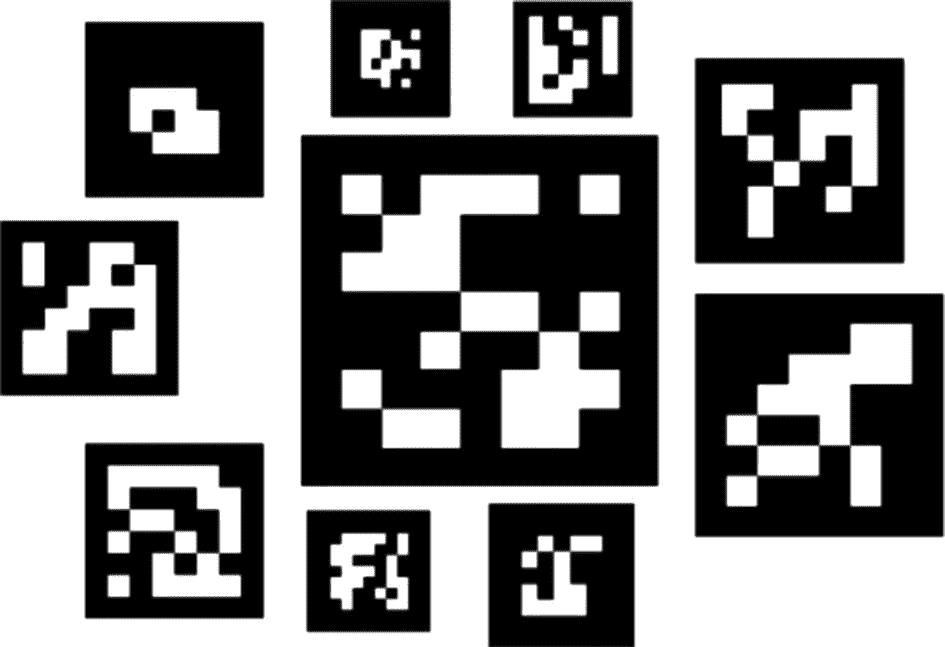
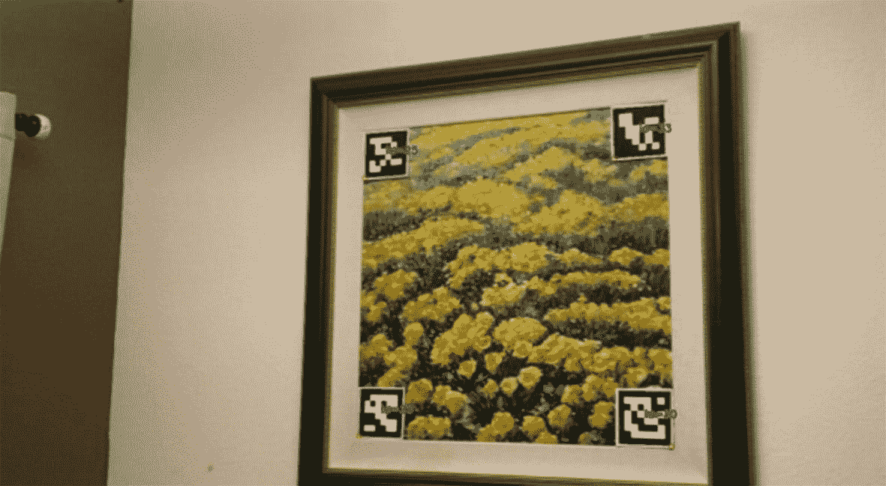
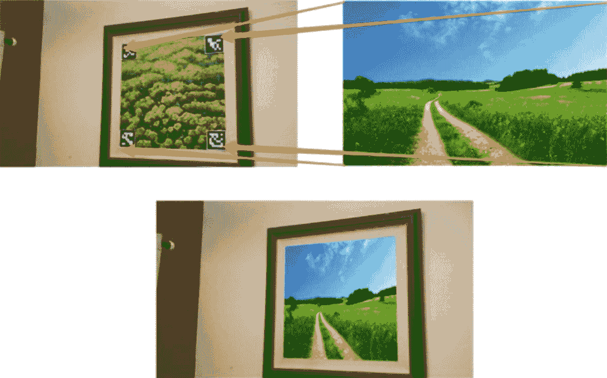
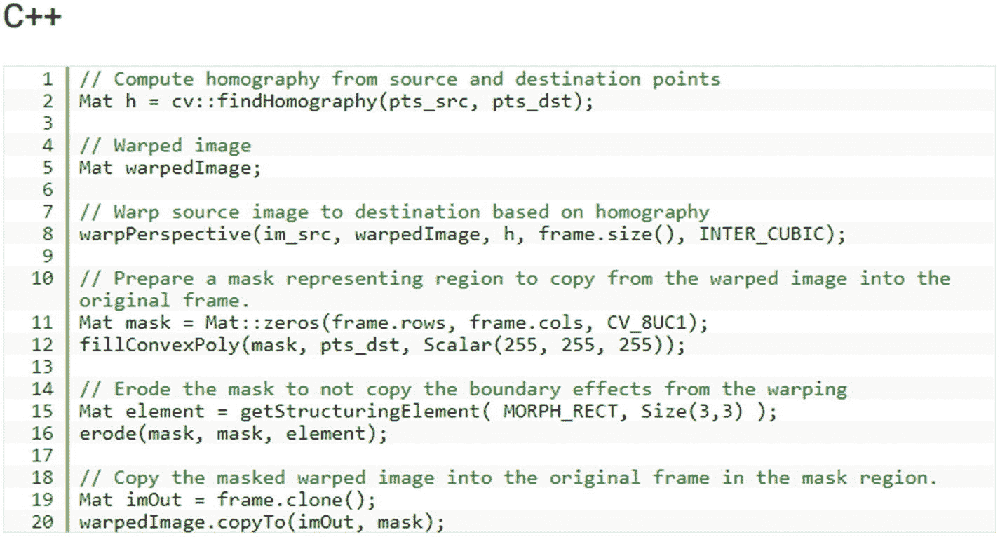

# 六、使用 OpenCV 的增强现实

本章解释了如何通过测量周期平均背景场景，使用缩小的图像细节实时跟踪运动和静止对象。

## 概观

增强现实，也称为 AR，是一种允许我们在视野中看到虚拟物体和细节的技术。我们可以获得物体的细节，我们可以用增强现实来可视化。这通过结合真实世界的组件来改进屏幕。例如，如果我将手机指向一条街道，这将为我提供额外的信息，如餐馆、健身中心、医生等的名字。数字知识与人的世界的实时结合被称为增强现实。用户可以通过使用增强现实技术与自然环境中的虚拟对象进行交互。佩戴虚拟现实眼镜的人可以使用手机或平板电脑屏幕来查看他们正在查看的任何物体的细节。

这里讨论三种不同类型的 AR。

### 基于标记的 AR

数字世界与物理世界是相互联系的。我们必须知道，用户正在将摄像机对准特定的页面，以将教育动画直接显示在杂志的纸上。因此，系统最初应该从摄像头的实时视图中检测出您正在查看哪一页。这可以通过在页面上使用独特的图像或形式来实现。图像将被识别，动画将立即开始，跟踪页面上的正确位置。用户也可以将真实的书翻转过来，看看虚拟世界是否与页面的真实表面一致。标记是系统识别的可识别图像的名称。只要具有足够明显的视觉特征，几乎所有东西都可以用作标记。

#### 无标记 AR

虚拟对象由用户移动。考虑一种增强现实技术，它允许你在起居室里放置虚拟家具。它使我们能够尝试不同的对象设计，以及位置组合。客户必须确定在这样的过程中将虚拟对象定位在哪里。它被称为“无标记增强现实”

### 基于位置的增强现实

虚拟世界存在于现实世界中。

增强现实技术通过基于位置的 ar 连接到特定的位置。假设你走在一条你不熟悉的公共道路上，从你的智能手机摄像头看到一个显示街道名称的虚拟街道标志，这就是基于位置的 ar。而且，与我们的 AR City 应用程序非常相似，这可以通过在您面前的实际路径上叠加路线来帮助您向位置移动。

### 基于标记的增强现实

#### 在 OpenCV (C++)中使用 ArUco 标记创建增强现实

在本节中，我们将介绍什么是 ArUco 标记，以及如何在 OpenCV 中使用它们来执行基本的增强现实活动。长期以来，ArUco 标记已被用于虚拟现实、相机姿态预测和校准。让我们仔细看看它。

#### 什么是 ArUco 标记？

ArUco 代表科尔多瓦增强现实大学(图 [6-1](#Fig1) )。科尔多瓦大学是西班牙科尔多瓦的一所大学，也是它的发源地。

图 6-1

ArUco 标记器

以下是几个例子:

ArUco 标记是一个基准标记，放置在拍摄项目和场景上。这是一个二进制的正方形，有深色的背景和边框，还有一个白色的图案可以识别它。深色边框更容易看清。它有各种尺寸可供选择。为了有效检测，根据对象的大小以及场景来选择大小。虽然相当小的标记没有被识别出来，但简单地增加它们的大小将有助于它们被发现。

一个概念将是扫描这样的标记，以及在现实生活中使用它们。拍摄自然世界可以让你特别识别这些标记。当你是初学者时，你可能会想，“这对我有什么帮助？”让我们看几个例子。我们在文章中提到的例子中，把打印的和标记的大部分放在图像框的边缘。因此，当标记被特别识别时，您可以通过图片或剪辑来替换图像帧。一旦你切换相机，一个新的图像似乎有正确的观点扭曲。这种标记可以放置在仓库的路线上，两者都在机器人应用程序中安装了摄像头。由于每个标记似乎都有唯一的 ID，因此我们可以识别标记在仓库中的位置。每当机器人的摄像头识别出这些标记中的任何一个，它就能在仓库内精确定位。

#### 使用 OpenCV 创建 ArUco 标记

利用 OpenCV，我们可以快速产生这样的标记。OpenCV 的 aruco 模块中有 25 个预定义的标记词汇表。字典的标记都包括相同的块大小轨道(44、55、66 或 77)，因此每个词汇都有一组标记(50、100、250 或 1000)。

下面是展示如何识别和生成 Aruco 标记的 C++代码。我们必须使用阿鲁科模块。代码中的 PredefinedDictionary 显示了如何加载包含 250 个标记的字典。

前面的 drawMarker 函数允许我们从一组 250 个 ID 范围从 0 到 249 的标记中选择一个具有特定 ID(第二个参数–33)的标记。产生的标记的大小由 drawMarker 函数的第三个参数决定。在前面的实例中，它可能会生成一个 200 × 200 像素的图片。将用于保存创建的标记的对象是第四个参数(在 markerImage 之前)。最终，密度参数指的是应该作为朝向形成的二进制模式的边界插入的块的数量。在前面的插图中，一个 1 位的边框将被插入到 66%生成的形状中，从而在一个 200 × 200 像素的图片中产生一个 77%位的图片(图 [6-2](#Fig2) )。前面的代码将生成一个类似于下面所示的标记。

图 6-2

样品制造商

在大多数情况下，我们需要创建几个标记，将它们打印出来，并将它们放置在场景中。

ArUco 标记 **检测**:我们必须识别 ArUco 标记，然后在附加分析中使用它们，直到一个场景被它可视化。我们将在下面向您展示如何找到标记。

首先，我们加载一个用于创建标记的相似词汇表。DetectorParameters 用于检测参数的起始集合:make something()。我们可以使用 OpenCV 在识别阶段调整许多参数。默认参数在大多数情况下都可以正常工作，OpenCV 建议您使用它们。因此，我们将保持相同的设置。标记的四个侧点通过每个活动标记检测来识别，顺序为左上、右上、右下和左下。这种矩形指针在 C++中被处理为点的向量，以及图片中的几个标记被组合成点的向量的向量。利用检测标记特征来寻找和检测标记的角。带有标记的场景图片将是第一个参数。用于创建标记的字典是第二个参数。被准确识别的标记将被保存为 markerCorners，或者它们的 id 将被保存在 markerIds 中。作为参数发送的还有之前创建的 DetectorParameters 实体。最终，被取消资格的成员被保留在被拒绝的候选人数据库中。

无论何时在场景中打印、剪切和插入标记，都要在标记的黑色边界上留一条白色边界，以便于识别。

#### 增强现实应用

ArUco marker 的设计旨在克服一个问题，即只为广泛的应用程序(如增强现实)估计相机姿态。在本节中，我们将在一个增强现实应用程序中使用它们，该应用程序允许我们将每个当前场景叠加在当前图片或剪辑上。我们选择了一个场景，在有着如此巨大的图像框架的房子里，我们想要替换成最新的图像框架来观察它们在表面上的表现。之后，我们尝试将剪辑嵌入到电影中。我们通过打印、剪切和粘贴宽 ArUco 标记到图片区域的边缘来实现这一点，如图所示，然后录制一个剪辑。已经拍摄的剪辑可以在页面顶部的视频左侧找到。之后，我们逐一处理视频的每一帧。首先为每个图片检测标记。在下图中，已识别的标记以绿色显示。一个小小的红色圆环表示第一个点。通过顺时针导航标记的边界，您可以到达第二、第三和第四阶段。

为了计算单应性，利用输入图像内的四个对应点以及当前场景图像(图 [6-3](#Fig3) )。在我们之前的一篇文章中，我们讨论了单应性。单应性实际上是一种变换映射，是场景不同观点中另一个给定交叉点的参照点。

图 6-3

OpenCV 中使用 ArUco 标记的增强现实

在整个示例中使用单应性度量将新场景图片扭曲成由点击的图片中的标记所标识的四边形。在下面的代码中，我们演示了如何做到这一点。

源点(pts src)是当前场景图片边缘点，而端点位置(dst src)是所点击图片内的相框内的匹配图像中心点。使用 OpenCV 函数 findHomography 计算输入点和目标点之间的单应性函数“h”。然后，使用单应矩阵将当前图片扭曲以融合到目标帧中。一个被屏蔽和复制的失真图片被粘贴到预定的帧中。该阶段在剪辑中的每一帧内一直持续。

#### 在手机上使用视觉惯性估计的无标记增强现实

在增强现实(AR)中，真实世界环境的实时视图与计算机生成的虚拟内容相结合。在移动增强/虚拟现实(AR/VR)中，虚拟场景与现实世界的注册需要实时的六自由度(6-DoF)运动跟踪。即便如此，由于当今移动终端的计算能力有限，移动 AR/VR 中的用户体验将受到连续到达姿势之间的延迟的伤害。使用来自惯性传感器的高频和无源输出来实现移动 AR/VR 的到达姿态的实时精度。此外，传统的仅基于视觉的运动跟踪的鲁棒性也得到了改善，从而在存在运动模糊时提高了移动 AR/VR 效率。此外，开发了一个自适应滤波系统来自动处理不同的运动情况，通过平衡视觉-惯性融合过程中的抖动和延迟，允许实时的 6 自由度运动跟踪。AR 系统面临着特定的障碍，例如需要高质量的相机姿态估计，以及需要在资源最少的平台上运行。移动 AR 旨在以准确的姿势在现实世界的背景下制作虚拟对象。该设备必须能够使用移动计算来确定用户在哪里以及他们在看什么。

另一方面，移动虚拟现实允许用户和虚拟世界之间的各种交互和连接。在这里，我们展示了一个基于混合方法的完整系统，该方法使用 ORB 二进制特征和光流在消费者平板电脑上进行接近实时的操作。因此，移动 AR/VR 中最相关的问题之一是姿势跟踪，这涉及到实时测量用户的位置和方向。即便如此，由于移动设备的计算能力有限，移动 AR/VR 的实时运动跟踪仍然是一个瓶颈。基于标记或基于模型的方法只能利用场景的一些先验知识来执行 6-DoF 跟踪，而无标记运动跟踪可以在任何情况下操作。因此，未来无标记跟踪将在移动 AR/VR 中变得更加常见。

即便如此，由于高计算需求和多变的环境，移动 AR/VR 的实时 6-DoF 无标记运动监控的适用性和鲁棒性仍需要进一步研究。该设备采用自适应特征映射来增加可以使用的 ORB 特征的数量。“地图”被描述为特征描述符及其 3D 世界坐标的列表。所以每张地图都有一个由四个世界坐标组成的三维边界框。一旦计算出相机姿态，就可以将该边界框投影到图片框架中。

通过集成单目摄像机和惯性传感器，实现了基于传感器融合的移动 AR/VR 实时六自由度运动跟踪。提出了一种自适应滤波器架构，以平衡视觉-惯性融合过程中的抖动和延迟现象，允许对移动 AR/VR 进行实时平滑的 6 自由度运动跟踪。在这里，我们展示了如何通过所提出的特定于平台的优化来实现实时效率，以及如何使用两种现有的姿态估计算法来提高跟踪速度和范围。如果我们想在合成的 VR 世界中建立一种存在感，跟踪用户的姿势也是必不可少的。由于用户的 6 自由度姿势的细节，该设备将从用户的角度显示虚拟世界。同步定位和测绘(SLAM)是一种常见的无标记跟踪方法，可以在未准备好的环境中检测移动相机的 6 自由度姿态，允许手机 AR/VR 应用程序无需基准标记。

#### 虚拟现实的增强现实(AR)子类

虚拟现实(VR)有一个子类叫做增强现实(AR)。用户收到的所有感官反馈都是在真正的虚拟现实应用中模拟的。在增强现实中，虚拟内容与现实世界的感官反馈混合在一起，产生一个组合版本的环境。这通常由当今的消费级移动设备来完成。该系统能够实现实时性能，使用计算机视觉技术分析来自手持摄像机或头戴式显示器(HMD)的实时视频输入，以评估摄像机在 3D 空间中的位置和方向(姿态)。使用这种姿势数据，虚拟增强可以无缝地合并到现实世界的视频流中。无标记 AR 可用于更普遍和特别的应用。无标记 AR 系统不依赖人工标记，而是利用环境中当前存在的自然特征。无标记 AR 最困难的方面是通过自然特征检测和匹配来接近相机姿态估计的计算需求。这个问题在手持移动设备中至关重要。一个校准的单眼是该设备工作所需要的。

几乎每个过程，包括地图制作，都是在线实时完成的，这限制了处理速度和内存。对于管道中的每一点，都讨论了移动设备的计算限制，并使用一个 Android 实现来测试整个系统。当找到足够数量的良好匹配时，该设备尝试使用地图的已知 3D 坐标和 2D 帧位置来估计相机的姿态。在决定姿态时，考虑两种情况:来自描述符匹配的姿态和来自跟踪的内联体的姿态，混合系统的每种模式一个。尽管在匹配过程中实施了各种限制和阈值，但是仍然可能存在假阳性。这种糟糕的匹配可以构成对应关系的很大一部分，如果它们不被丢弃，恢复的相机姿态的准确性就会受到影响。目标是只使用正确的匹配来计算姿态。最大迭代次数通过反复试验来计算。由于 RANSAC 算法不是概率性的，相机姿态的可信度高度依赖于在最大可能迭代次数中选择四个正确点对应的可能性。虽然在 5000 次迭代后找不到内联器的风险微乎其微，但运行时间会太长。

修改地图后，最后一步是将恢复的姿态返回到 OpenGL，在那里它将用于生成模型-视图矩阵。任何 3D 增强都可以使用从精确的相机姿态获得的模型视图矩阵来绘制。有了足够的 3D 图形知识，一个人可以创建复杂的增强，融入他们的真实环境。我们的系统算法与其他候选算法进行比较，特别关注执行速度。笔记本电脑测试旨在展示当前笔记本电脑和智能手机/平板电脑之间的效率差距。由于光流不受所用检测器的影响，图像解码速度在三种实施方案中进行了测试——基于 CPU 的浮点和整数转换，以及我们新推出的基于整数的加速转换。

#### 估计

首先定位被追踪的特征以进行计算是很简单的。系统的两种姿态估计方法(迭代和 EPnP)在时间上进行比较。因为迭代方法仅用于监测时的最小二乘估计，所以这是容易的。在找到合适的姿态之前执行的 RANSAC 迭代的次数决定了 EPnP 的计算时间。由于每个 AR 系统的目的都是创建一个流畅和交互式的用户体验，下面的图像通过用户视角的实时屏幕截图显示了系统的运行。在顶行中，一个 3D 立方体以三种不同的大小以及一个倾斜的角度被放大。在底部一行可以识别出三个独立的地图，根据所跟踪的地图绘制不同颜色的三角形。无标记虚拟现实系统可以在当今的移动设备上实时使用。

#### 眼球功能检测器

ORB 函数检测器将使用 NEON 和 SIMD 引擎来实现，这是最紧迫的未来工作。如果系统以前的 NEON 实现有任何指示，这将显著提高系统的最坏情况执行速度，甚至可以在光流跟踪的基础上进行特征匹配，以提供更鲁棒的姿态估计。此外，随着移动硬件的进步，PC 实现中使用的加速方法将变得更加重要。通过 GPU 进行并行化是提高算法性能和速度的常用方法。NVidia 最近推出了 Tegra 4 处理器，该处理器将包括一个可编程的 72-CUDA 核心 GPU，使 CUDA 实现可以在手机上运行。随着性能的提高，可以添加额外的功能。目前，该设备无法在单个相机帧中识别多个地图；相反，它会选择查找分数最高的地图。在选择可能的地图之后，描述符匹配和姿态估计过程将分别应用于每一个地图。由于氖加速，匹配阶段足够快，可以重复几次而不会显著影响输出。

尽管姿势估计要慢得多，但通过使用 NEON 或 GPU 加速来加速特征检测，可以减轻多次进行姿势估计的影响。这将产生几个相机姿态，每个姿态都将被发送回 OpenGL 并单独增强。此外，需要实时相机跟踪性能来实现移动 AR/VR 的 SLAM 技术。移动 AR 的到达姿态的频率应该至少与标准视频帧速率(25 Hz)一样高，该视频帧速率通常被指定为实时输出的标准规则。对于非移动 VR 实时输出，本文档中也考虑了该规范。由于移动 VR 提供了比传统场景更好的实时效率，6-DoF 运动跟踪到达频率应该至少为 60 Hz。只有以这种方式，虚拟现实环境中的个人才会有愉快的体验。否则，用户会对 VR 环境中的延迟概念感到厌恶。据我们所知，当在移动设备上实时操作时，没有完整的 AR 系统包含本书中讨论的所有组件。在线地图开发和多地图支持是现有系统目前缺少的两个功能。

#### SLAM 过程

另一方面，特定的 SLAM 过程涉及计算整个图像的光度误差，在跟踪相机的同时执行密集(图像中的所有像素)或半密集(高梯度区域)重建，并且由于计算开销，实时性能需要 GPU 加速。市场移动设备的处理能力不足以进行直接实时摄像机监控。除了其高性能，基于特征的 SLAM 也被认为比直接 SLAM 更可靠。因此，本文中基于视觉的监控方法是基于特征的 SLAM 系统。然而，这些实时监控技术只在电脑上测试过。为了创建可以实时监控运动的移动设备，我们结合了各种图像处理技术来检测给定帧集中的关键特征，以通过产生单应矩阵来找到差异点。

即便如此，这种仅基于视觉的跟踪方法也存在较差的特征或运动模糊，使得难以监控重要的图像特征。此外，移动 VR 的帧率要求比智能手机 AR 大得多，以减轻模拟世界中的头晕现象。因此，前面的仅视觉跟踪方法对智能手机 AR 和 VR 都无效。可以使用其他传感器来进一步提高移动 AR/VR 的运动跟踪的鲁棒性和帧率。

惯性传感器可以作为主要运动捕捉传感器，为姿态估计提供高频和被动测量。通过视觉-惯性融合的六自由度运动监控已经被一些研究者所总结。基于各种融合框架，传感器融合解决方案可分为紧耦合或松耦合。紧耦合方法可以进行视觉和惯性测量单元(IMU)测量的系统融合，这通常会增加复杂性，而松耦合方法分别优化视觉和 IMU 监控，从而降低计算复杂性。包含广角单目摄像机和 IMU 的外部传感器模块用于这项工作，以增加摄像机的视野(FOV)。

#### 单目摄像机

单目相机可以每秒 30 帧的速度采集 640 × 480 像素的图像流，IMU 可以每秒 250 帧的速度输出线加速度和角速度。没有使用 GPU 或其他加速方法来加速运动跟踪，以测试所提出的系统的效率。收集每个传入帧从前端特征提取到后端姿势优化的累计处理时间，以检查我们在智能手机中基于视觉的跟踪的处理效率。平均移动运动跟踪效率可以达到接近实时的精度。延迟趋势很明显，因为手机 AR/VR 的新过滤姿态强烈依赖于先前的姿态。

#### 关键问题

因此，移动 AR/VR 的一个关键问题是如何在各种情况下进行实时运动跟踪，同时自动平衡抖动和延迟。对于现有的单目相机和惯性传感器，传入照片和 IMU 测量的帧速率是恒定的，导致视觉-惯性融合的相邻到达姿态之间的时间间隔恒定。结果，相邻姿势的位置变化被用于实时区分各种运动环境。

以下给出了对所提出的分段策略的广泛分析，以进一步解释所提出的自适应滤波器系统:

*   抖动过滤:所以当移动 AR/VR 设备接近静止或逐渐运行时，相邻姿势之间的过渡几乎可以忽略。因此，在这种情况下，抖动现象占主导地位，而移动 AR/VR 用户的延迟现象可以忽略。这种阶段在本书中被称为抖动滤波。同时，到达姿态之间的实时距离目前足够小。

*   适度过滤:在中等距离髓的工作中，当移动 AR/VR 系统的运动情况处于中等运动环境下时，这一阶段被称为适度过滤。

*   延迟过滤:每当移动 AR/VR 系统经历快速运动时，相邻到达姿态之间的差异是显著的。当姿势没有按时到达时，消费者会注意到等待时间。因此，在移动 AR/VR 的这种情况下，延迟现象占主导地位，而在快速移动的情况下，抖动现象可以忽略。延迟过滤是这一点的术语。

按照前面的解释，相邻姿势之间的归一化距离可以用于馈送给所提出的自适应滤波器系统。因此，为了解决各种运动情况，决定适当的滤波器相位。为了有效地解决抖动和延迟现象，在抖动和延迟阶段使用二次函数来消除极端运动条件。此外，线性函数被称为适度滤波，以桥接移动终端上的抖动滤波和等待时间滤波阶段，从而降低计算复杂度。这些分段框架旨在估计理想的动态系统，从而为移动 AR/VR 抖动和延迟提供简单且次优的解决方案。因此，自适应滤波器机制可以管理实时运动的抖动和延迟。通过定性实验测试了所提出的移动增强现实/虚拟现实实时运动跟踪的有效性。以及基于移动 AR/VR 的实际运动场景的跟踪，以检查设备不确定性。视觉-惯性融合方法可以在 IMU 的帮助下很容易地提供高频到达姿态，尽管它容易由于移动中两个视觉帧之间 IMU 的组合误差而漂移。

#### 建议的自适应视觉惯性方法

提出的自适应视觉惯性方法有几个优点。此外，根据 IMU 在短时间内的可靠姿态估计，当遭受运动模糊或纹理不良时，可以增强跟踪稳定性。为了进一步验证所提出的方法，进行了定量实验。所提出的方法的基础事实是从典型的目标模式获得的轨迹，其已知具有高精度。由于难以置信的模糊画面，智能手机 AR 仅基于基于视觉的运动跟踪容易崩溃。尽管如此，由快速运动模糊引起的跟踪丢失现象可以使用所提出的传感器融合相关跟踪方法来减轻。

虚拟现实帮助用户以各种方式与虚拟世界交流。因此，实时监控用户的姿势和行为对于 VR 设备来说至关重要。此外，VR 中运动跟踪的帧率高于 AR。或者，消费者将由于潜伏现象而生病。使用所提出的自适应视觉-惯性融合过程，可以实时实现细胞虚拟现实的平滑 6 自由度运动跟踪。使用安装在用户头部的建议的多传感器设备，可以实时观察用户的 6-DoF 运动。因此，当用户在现实世界中独立行走时，虚拟场景的焦点将会调整，以匹配真实的 6 自由度运动跟踪。

#### 实时运动跟踪

实时运动跟踪对于任何 AR/VR 设备来说都是一个至关重要的问题，因此有多种方法可以实现这一性能。在基于标记的运动跟踪中，在计算观察者的相对姿态之前，设备必须首先检测和识别标记。尽管如此，标记必须提前放置在相关物品上或附近，并且在某些情况下并不总是可能这样做。此外，标记必须在整个移动 AR/VR 操作中保持可见，因为如果标记不可见，跟踪更有可能被破坏。相应的，另一种流行的移动 AR/VR 的运动跟踪系统是基于模型的方法。这种跟踪方法使用要跟踪的环境的先验模型。通常，这种先验知识包括真实场景的 3D 模型或 2D 模板。

## 摘要

这项工作提出了一种智能手机 AR/VR 的实时运动跟踪策略，比传统的基于视觉的无标记跟踪方法更有效。在该文献中开发了单目视觉-惯性融合，其可以在惯性传感器的帮助下有效地提高跟踪鲁棒性并提高帧率，从而为移动 AR/VR 提供实时和鲁棒的姿态到达。此外，提出了一种自适应滤波器系统来减轻异构传感器融合中的抖动现象，该系统可以根据各种运动环境改变滤波器权重，从而实现对两种技术的实时平滑运动监控。最后，在各种 AR/VR 场景下进行了实验，实验结果表明该方法是鲁棒和准确的。为了简化计算，本文提出了一种分段自适应框架，并获得了智能手机 AR/VR 实时运动跟踪的次优输出。即便如此，在跟踪输出中的分段点处会出现不稳定的过渡，因此未来的工作将集中在视觉-惯性融合的更连续的滤波系统上。