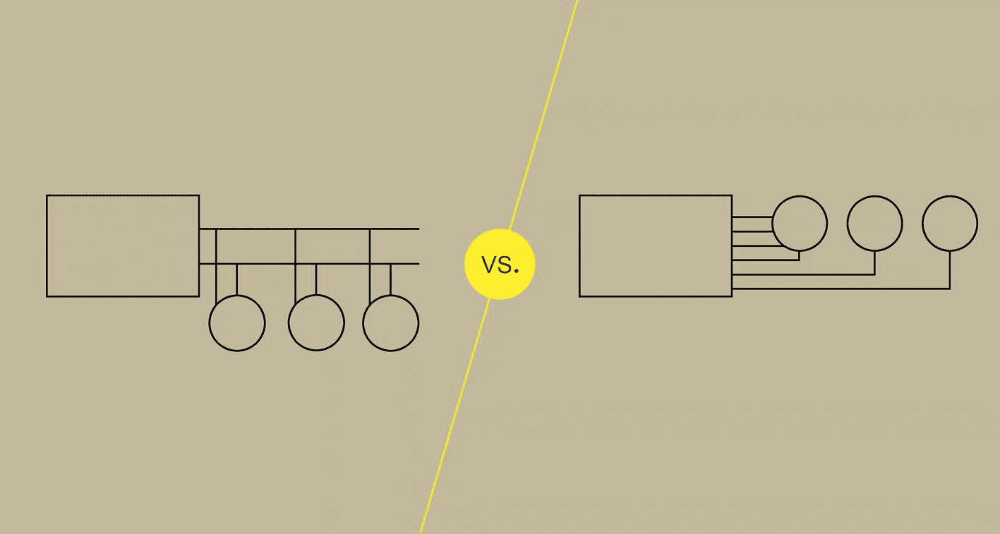
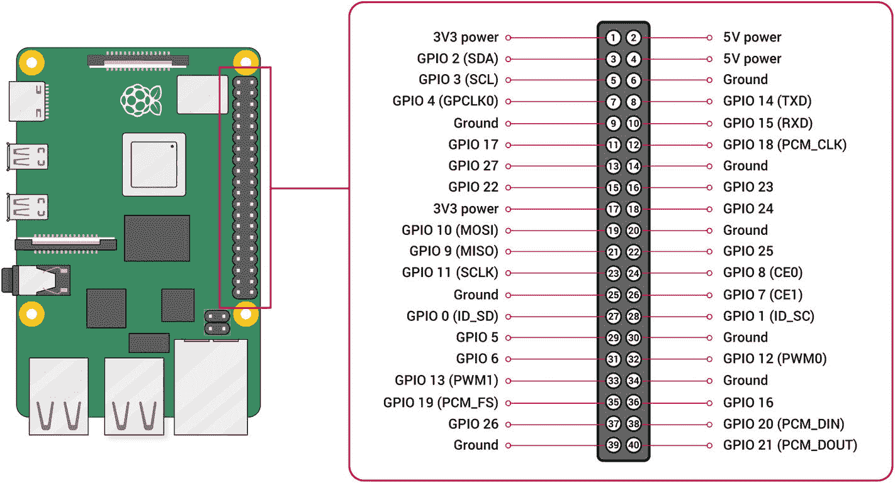
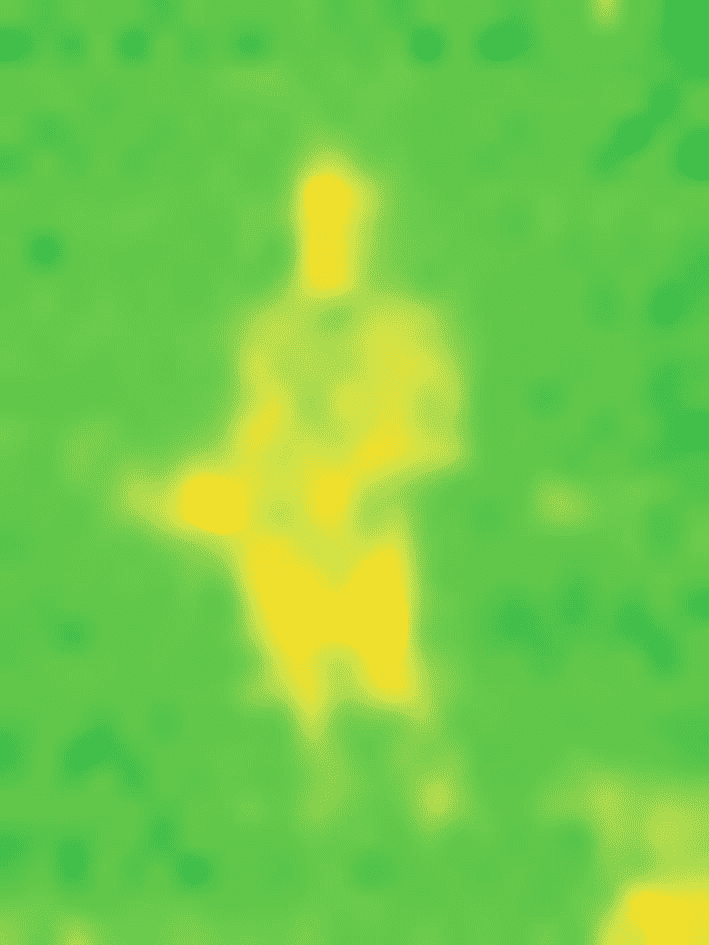
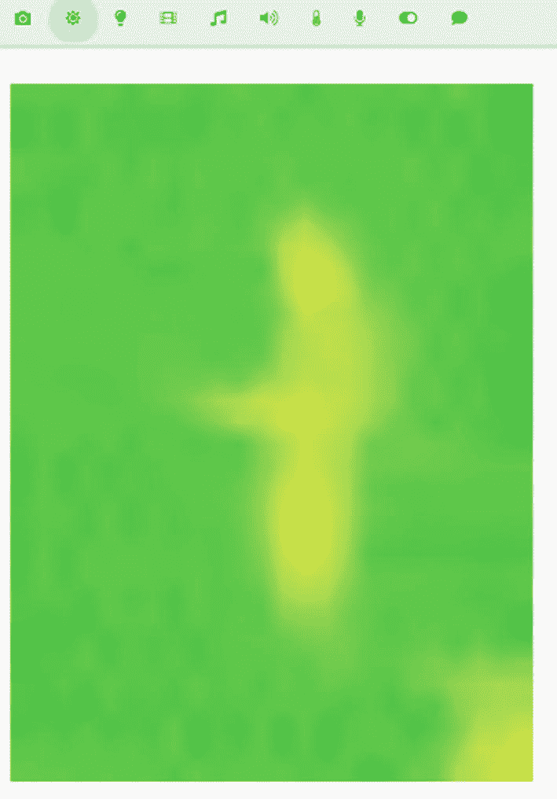
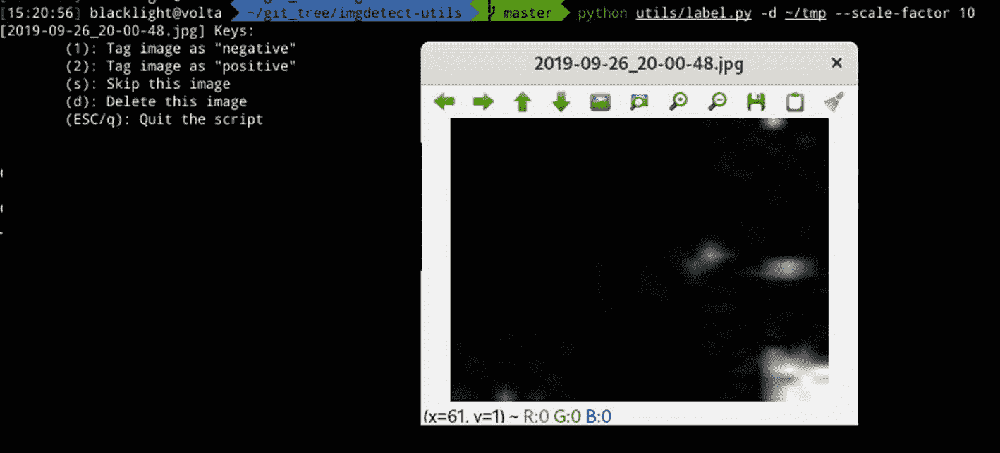
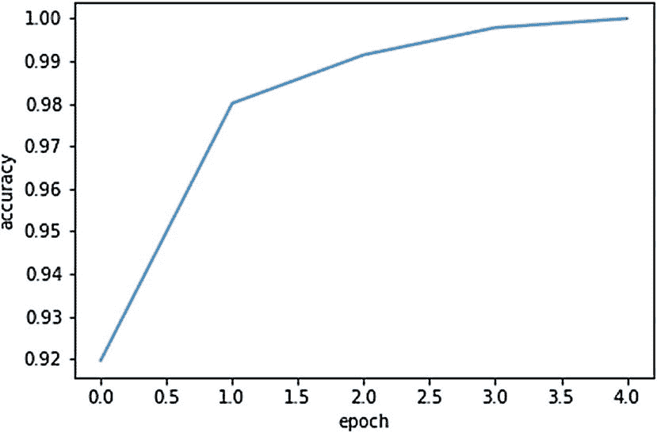
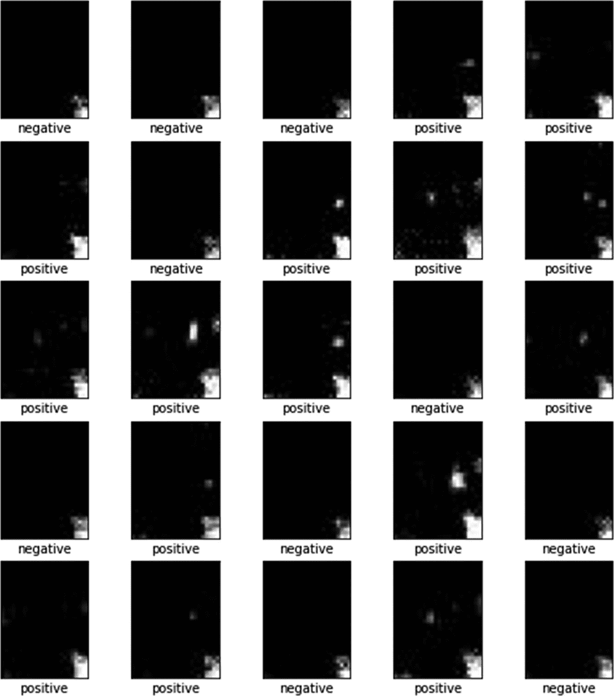
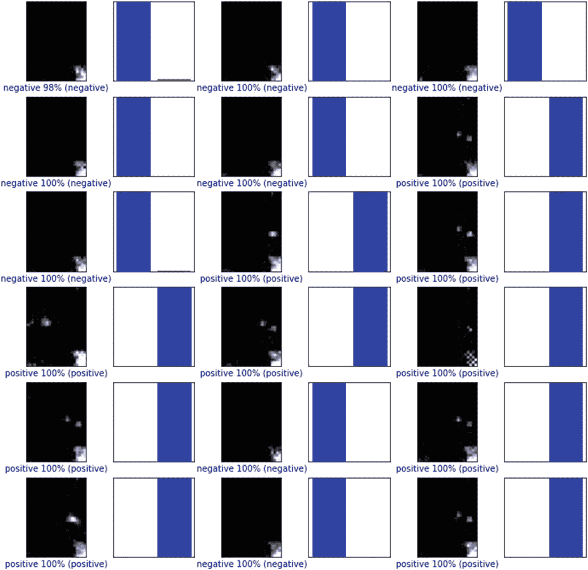
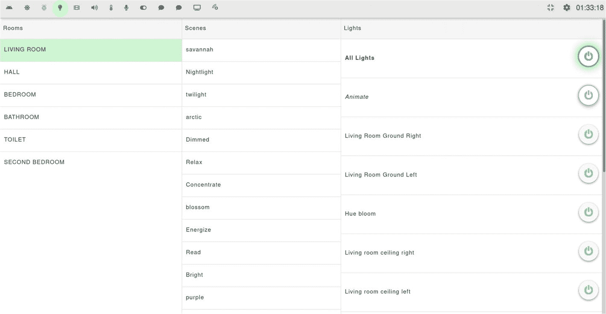

# 三、树莓派的计算机视觉

既然我们已经很好地理解了如何使用 TensorFlow 构建机器学习模型，那么是时候将我们的知识付诸实践，训练一个可以识别房间中人的存在，并且可以使用一些廉价硬件在树莓 Pi 上运行的模型了。

Raspberry Pi 可以说是过去十年中开发的最成功的信用卡大小的片上系统(SoC)。其紧凑的外形、灵活性和实惠的价格(价格从微型单核 Raspberry Pi Zero 的约 10 美元到 8GB RAM 的四核 Raspberry Pi 4 的约 80 美元)使其成为许多物联网项目的一个非常有吸引力的选择。当谈到机器学习应用程序时，它肯定不是一匹马力强劲的马(如果你正在寻找一台更强大的嵌入式机器来训练更复杂的模型，你可能会选择 NVIDIA Jetson boards 等解决方案)，我的建议通常是在你的笔记本电脑或更强大的机器上训练你的模型，但一旦你训练了一个不太复杂的模型，Raspberry Pi 肯定是一个很好的预测候选人。然而，请注意，在运行 TensorFlow 代码时，功能最弱的选项(如 Raspberry Pi Zero 和 Raspberry Pi A+)可能会遇到一些延迟，但我已经在 Raspberry Pi 3 和 4 设备上运行了许多模型，只要模型不太复杂，我就没有遇到任何问题。

在这一章中，我们将看到如何使用 Raspberry Pi 和廉价的红外摄像机来构建一个实时模型，以识别房间中的人。虽然前几章中探讨的许多例子都涉及到根据光学相机的“正常”图像训练的模型，但根据我的经验，在小环境中检测人的存在是一项由红外相机更好地执行的任务。如果你想到这一点，人们在一个房间里可能有许多站着或坐着的方式，你也可能有不同数量的人在房间里，在离你的相机任意的距离，在任意的亮度条件下。这使得在光学图像上建立一个鲁棒的存在检测模型的任务非常具有挑战性——该模型必须在尽可能代表真实环境所有可变性的庞大数据集上进行训练，并且它可能有许多层来辨别所有可能的模式，这使得它容易过度拟合。红外摄像机更适合这项任务。由于红外摄像机可以检测到其前方任何物体的温度梯度变化，因此它对亮度条件的变化不敏感，对人的位置变化也不敏感。我使用这种方法遇到的唯一问题是当环境过于温暖时——如果人体温度在 36–37°C 左右，环境较冷，红外摄像机是检测人的非常好的工具，但如果环境温度与人体温度相同，那么梯度温度不足以检测人的存在——但如果您房间的温度通常低于 36 度，那么您可以继续使用这种方法！然而，作为后续措施，您也可以轻松地将本章中说明的过程应用于光学图像，这可能需要更大的数据集、更长的训练阶段和更多层的 CNN，但过程完全相同。本章中说明的过程可以很容易地扩展到任何需要数据收集、标记、训练模型以及部署该模型进行实时预测的应用程序。

该项目包括四个阶段:

1.  准备硬件和软件。

2.  构建逻辑，定期从红外摄像机捕获快照，将其规范化，并将其存储在某个地方。

3.  给图片贴上标签(检测到存在/没有检测到存在),并在上面训练一个模型。

4.  在 Raspberry Pi 上部署该模型，并针对新捕获的图像定期运行该模型，以检测房间中是否有人。可选地，我们可以添加一些额外的逻辑，在模型运行时运行一些自动化部分(例如，当有人进入/离开房间时打开/关闭灯，或者如果检测到存在但我们不在家时收到移动通知)。

## 3.1 准备硬件和软件

本章中的例子已经在 Raspberry Pi 上进行了广泛的测试，但是它们在任何基于 Linux 的 SoC 上只需很少的修改或者不需要修改就可以很好地工作。

### 准备硬件

您可以使用任何 Raspberry Pi [23]设备来捕捉图像，部署您的模型，并使用它进行预测。然而，如前所述，低功耗设备(如 Raspberry Pi Zero)可能会经历更多的延迟——即使我已经成功地将人员检测模型部署到 Raspberry Pi Zero，但在捕捉图像或进行预测时，我无法获得低于 2-3 秒的基本延迟。然而，任何 Raspberry Pi 3 或更高版本都应该为基本的机器学习项目提供流畅的性能。

所以，为了开始，你需要


图 3-1

Pimoroni MLX90640 热感摄像机分线点

1.  Raspberry Pi 或任何类似的基于 Linux 的 SoC。

2.  一个空的 micro SD 卡(最好 16GB 以上)。检查你的 SD 卡的质量和速度也是一个好主意——根据我的经验，超快的 SanDisk 卡是闪存 Raspberry Pi 操作系统的好选择，但任何足够快和足够强大的东西都应该可以完成这项工作。

3.  红外摄像机。本章中的示例将基于基于 Pimoroni MLX90640 的热感相机分线点 24 )，这是一款相对便宜的 24x32 热感相机，在捕捉几米深度的热梯度方面表现出色，但任何热感相机或红外相机都应该可以工作。

如果您使用 MLX90640 分线摄像机或除 USB 摄像机或原生 PiCamera 之外的任何摄像机，请注意硬件协议。这一突破超越了 *I* <sup>2</sup> *C* 协议。当谈到 Raspberry Pi、Arduino 和其他物联网设备的电子设备时，您通常会发现三种流行的硬件协议:

1.  *I* <sup>2</sup> *C*

2.  SPI(串行外设接口)

3.  直接 GPIO

直接 GPIO 基本上意味着您的设备和主设备(Raspberry Pi、Arduino、ESP 等)的引脚之间的直接映射。).对于引脚数和传输速率较低的简单设备，这通常是一个受欢迎的选择，而吞吐量较高的设备通常选择基于总线的接口，即 *I* <sup>2</sup> *C* 和 SPI 通常是该领域最受欢迎的协议。这两种总线接口的高级比较如图 3-2 所示。 *I* <sup>2</sup> *C* 最初是由飞利浦半导体在 1982 年开发的，它已经存在了足够长的时间，被许多硬件设备广泛使用。这是一种同步、双向、基于数据包的串行通信协议，依赖于每个设备上的两个连接器:



图 3-2

*I* <sup>2</sup> *C* (左)和 SPI(右)的物理总线连接比较(鸣谢:Lifewire)

1.  SDA(串行数据线)，用于通过串行总线接口双向传输数据

2.  SCL(串行时钟线)，用于同步连接的设备并调节对总线的访问

MLX90640 使用该接口，因此，它包括 SDA 和 SCL 连接器，可以连接到 Raspberry Pi 的 *I* <sup>2</sup> *C* 接口(或任何具有兼容引脚排列的 SoC)。VCC 和 GND 连接器必须连接到与 Raspberry Pi 或任何 Raspberry Pi 3.3V/GND 引脚相同的电源和地线，而我们可以在这个项目中省略 INT(中断)连接，它通常用于引发异步事件。将 *I* <sup>2</sup> *C* 或 SPI 设备连接到 Raspberry Pi 主要有三种选择:



图 3-3

树莓派 GPIO(鸣谢:树莓派基金会)

1.  硬件*I*??【2】??*C*连接。尽管 Raspberry Pi 的 GPIO 引脚应该是通用的(顾名思义)，但一些引脚在硬件层面进行了优化，以更好地实现某些目的。GPIO 引脚 2 和 3 就是这种情况，如图 3-3 所示，它们分别被配置为 SDA 和 SCL 接口。因此，最快的选择是将您的 *I* <sup>2</sup> *C* 摄像机的 SDA 和 SCL 引脚直接连接到这些引脚。这种连接的优点是速度快(因为它使用了*I*<sup>2</sup>*C*协议的本地硬件实现),并且几乎不需要软件配置即可工作。缺点是 Raspberry Pi 只有一对专门的 SDA/SCL 引脚，你只能将一个设备连接到这个接口(如果你只将 Raspberry Pi GPIO 用于热感相机，这不是一个大问题，但如果你想连接更多的*I*<sup>2</sup>*C*设备，这可能是一个问题)。

2.  软件*I*??【2】??*C*连接。在这种配置中，您可以使用任何 GPIO 引脚对作为 SDA/SCL 接口。这种方法的优点是，您可以更加灵活地连接更多的*I*2C 器件，或者更一般地说，您可以连接更多的器件，而不必占用 GPIO 引脚 2 和 3。这种方法的缺点表现在它的速度(协议由软件管理，特别是由内核管理，这通常比基于硬件的实现慢)以及它可能需要对软件配置进行更多调整的事实。

3.  使用类似于*分线架*【25】的分线板(参见图 3-4 )。这可能是我最喜欢的方法。分线板可以直接插在您的 Raspberry Pi GPIO 引脚的顶部，它们充当 *I* <sup>2</sup> *C* 和 SPI 设备的硬件多路复用器。它们提供了一个硬件接口来连接多达四个*I*2C 器件和两个 SPI 器件，并且它们使连接变得像将器件插入插槽一样简单——不需要布线也不需要焊接。

### 准备操作系统

一旦你把所有的硬件都准备好了，就该在 SD 卡上刷新你的 Raspberry Pi 的操作系统了。最受欢迎的选项通常是 NOOBS [26]和 Raspberry Pi OS 27，前者是基于 Debian 的发行版，对于那些不太熟悉终端的人来说也很容易使用。作为 Arch Linux 的坚定支持者，大多数示例都在运行 Arch Linux ARM 的设备上进行了深入的测试，但是由于在嵌入式设备上运行 Arch 的学习曲线通常比使用 NOOBS 或 Raspberry Pi 操作系统要高，所以本章中的示例将主要针对这两个发行版。然而，它们应该在任何其他 Raspberry Pi 操作系统上进行较小的修改或不进行修改，唯一的区别可能是您安装一些系统包的方式，例如，通过“pacman”或“yum”而不是“apt-get”。

为您的设备下载 Raspberry Pi 操作系统或 NOOBS 的映像，并将其闪存到 SD 卡中。你可以使用任何软件来写图像 Raspberry Pi 基金会为 Windows 和 macOS 提供了一个 *Imager* 程序来写图像，但是你可以通过网络搜索找到其中的许多。如果您在 Linux 上，您可以使用内置的`dd`命令轻松地编写映像:

```py
# FIRST check where your SD card is mounted!!
# Make sure that you don't write the image to any other hard drive!
cat /proc/partitions  # Find something like e.g. /dev/sdb

[sudo] dd if=/path/to/raspberrypi-os-version.img of=/dev/sdb \
    conv=fsync bs=4M status=progress

```

一旦图像被刷新，(安全地)从你的电脑中取出 SD 卡，并将其插入 Raspberry Pi。至少在第一次启动时，建议还插上一个显示器(通过 HDMI)和一个 USB 键盘/鼠标。一旦一切都连接好了，插上 USB 电源，启动树莓派。几秒钟后，您应该会在连接的显示器上看到欢迎屏幕。如果需要登录，默认凭证是 **user=pi** 和 **password=raspberry** 。其他系统可能有不同的默认凭据—如果是这样，请查阅他们的网页。然而，尽快更改默认凭证是一个**非常好的做法，尤其是如果您计划启用远程 SSH 访问——只需打开一个终端并键入 *passwd* 。**


图 3-4

分会场花园*I*2C/SPI 硬件多路复用器(鸣谢:皮莫尔尼)

如果您的 Raspberry Pi 是通过网线连接的，那么它可能会自行连接到网络，无需任何配置。否则，如果您计划通过 Wi-Fi 连接它，现在启用该界面是一个好主意——您可以通过应用程序面板中的 Wi-Fi 图标或通过终端(`raspi-config`命令)来实现。其他选项包括手动创建和启用`netctl`配置文件或使用另一个网络管理器。

一旦连接了 Raspberry Pi，最好启用 SSH(或者 VNC ),这样您就可以轻松地从笔记本电脑上访问它，而无需连接屏幕和鼠标/键盘。使用`raspi-config`启用 SSH 服务或手动启动并启用`sshd`服务:

```py
[sudo] systemctl start sshd.service
[sudo] systemctl enable sshd.service

```

记下设备的 IP 地址(`ifconfig`或`ip addr`)，回到您的计算机，使用 PuTTY 或命令行 ssh 客户端连接到您的 Raspberry Pi:

```py
ssh pi@[ip-of-the-rpi]

```

登录后，就可以安装软件依赖项来运行我们的项目了。

## 3.2 安装软件依赖项

本章中的例子将使用 Platypush [28]作为平台来自动捕获图像、运行模型和执行自动化例程。在过去的几年里，我自己构建了 Platypush，现在它已经足够成熟，可以在 SoC 设备上执行许多任务。然而，将本章中的例子移植到其他常见的自动化平台应该相对容易——比如 Home Assistant 或 OpenHAB。

首先，通过`python3 –version`在 Raspberry Pi 上检查 Python 的版本——你至少需要 3.6 或更高版本才能运行 Platypush。这在大多数现代发行版上应该不是问题，但是旧发行版可能有旧版本——如果是这样，要么升级发行版，要么手动编译更高版本的 Python。

是时候更新 apt 镜像以查看是否有任何软件包更新了:

```py
[sudo] apt-get update
[sudo] apt-get upgrade

```

如果尚未安装，则安装`pip`:

```py
[sudo] apt-get install python3-pip

```

然后安装 Platypush——现在用`http`模块。有两种方法可以做到:

1.  通过`pip`安装最新的稳定版本:

1.  从 GitHub 安装最新的快照。如果您计划使用 MLX90640 分线点或任何其他需要从 Platypush 代码库编译特定驱动程序的设备，则特别建议使用这种方法。首先确保安装了 git:

```py
[sudo] pip3 install 'platypush[http]'

```

```py
[sudo] apt-get install git

```

然后克隆存储库及其子模块:

```py
mkdir -p ~/projects && cd ~/projects
git clone https://github.com/BlackLight/platypush
cd platypush
git submodule init
git submodule update
[sudo] pip3 install '.[http]'

```

此外，Platypush 依赖 Redis 作为消息传递系统在不同的组件之间分发命令。在 Raspberry Pi 上安装、启动和启用 Redis:

```py
# On other systems the Redis server is called simply redis
[sudo] apt-get install redis-server
[sudo] systemctl start redis-server.service
[sudo] systemctl enable redis-server.service

```

现在是时候看看我们需要的 Platypush 模块了。Platypush 附带了一组广泛的集成，记录在官方文档页面[29]上，每个集成可能需要不同的依赖项或自己的配置。默认情况下，从`~/.config/platypush/config.yaml`读取配置；通过使用构造函数参数中显示的相同属性，可以在这个文件(YAML 格式)中配置每个模块(另外，**强烈建议**以非根用户身份运行 Platypush)。模块可以分为*插件*和*后端*。插件(通常)是无状态的，可以用来执行动作——比如开灯、播放音乐、捕捉相机画面、根据模型进行预测等等。相反，后端是在后台运行的服务，并在发生某些事情时触发*事件*(例如，播放某些媒体文件、接收电子邮件、创建日历事件、从传感器读取某些数据等)。)—虽然有些插件也可能引发事件。这些事件可以被定制的事件钩子捕获，钩子可以运行任何你喜欢的逻辑。一些模块需要额外的依赖——它们通常在模块的文档中报告，并且通常可以通过`pip`安装。依赖项也在项目的`requirements.txt`中报告——您可以取消注释您需要的依赖项，然后通过

```py
[sudo] pip3 install -r requirements.txt

```

依赖项也在项目的`setup.py`文件中报告，它们可以通过

```py
[sudo] pip3 install 'platypush[module1,module2,module3]'

```

出于这个项目的目的，我们希望首先从我们的相机定期捕获图像，并将它们存储在本地，以便我们可以在以后使用它们来训练我们的模型。如果你使用的是 MLX90640 热感摄像机，那么你首先要编译 Pimoroni 提供的驱动程序。首先，安装所需的依赖项:

```py
[sudo] apt-get install libi2c-dev build-essentials

```

然后转到之前克隆的 Platypush 存储库目录，编译驱动程序:

```py
cd ~/projects/platypush/plugins/camera/ir/mlx90640/lib
make clean
make bcm2835
make examples/rawrgb I2C_MODE=LINUX

```

如果编译过程顺利，您应该会在文件夹`examples`下找到一个名为`rawrgb`的可执行文件。记下这个可执行文件的路径，或者将其复制到另一个`bin`目录。如果您尝试运行它，并且 MLX90640 分线点正确连接，您应该会看到连续的字节流，这是相机捕捉的帧的 RGB 表示。如果出错，通常是因为树莓派上的*I*2C 总线没有启用。如果是这种情况，您可以通过`raspi-config`或者手动将该行添加到`/boot/config.txt`来启用*I*2C 接口:

```py
dtparam=i2c_arm=on
# Optionally, increase the throughput on the bus
dtparam=i2c1_baudrate=400000

```

请注意，在某些系统上，`dtparam`可能被命名为`i2c`而不是`i2c_arm`，并且更改 *I* <sup>2</sup> *C* 配置可能需要重新启动系统。一旦`rawrgb`可执行文件可以成功捕获帧，安装 Platypush 通用摄像机模块依赖项:

```py
cd ~/projects/platypush
[sudo] pip3 install '.[camera]'
# Or, if you installed Platypush directly from pip:
[sudo] pip3 install 'platypush[camera]'

```

如果您选择了可以通过硬件 Raspberry Pi 摄像头接口连接的摄像头，您应该安装`picamera`模块(同时确保 Pi camera 接口在`raspi-config`中启用):

```py
cd ~/projects/platypush
[sudo] pip3 install '.[picamera]'
# Or, if you installed Platypush directly from pip:
[sudo] pip3 install 'platypush[picamera]'

```

相反，如果你有一个 USB 连接的相机，你可以通过`camera.cv`、`camera.ffmpeg`或`camera.gstreamer`插件将 Platypush 连接到它，这些插件分别通过 OpenCV、FFmpeg 和 GStreamer 与相机设备交互(查看它们的文档页面或`setup.py`了解它们所需的依赖关系)。Platypush 提供的相机接口提供了一个 API 来透明地与这些插件进行交互。一旦安装了所有的依赖项，就可以继续配置 Platypush 自动化了。

首先，在 Platypush 中启用 web 服务器——我们将使用它从 web 界面访问相机，并通过 web API 测试捕捉。将这些行添加到`~/.config/platypush/config.yaml`:

```py
backend.http:
    port: 8008  # Default listen port

```

其次，我们将配置`camera.ir.mlx90640`插件并指定`rawrgb`路径的位置:

```py
camera.ir.mlx90640:
    rawrgb_path: ~/bin/rawrgb
    # You may want to specify the rotation of the camera
    rotate: 270
    # Optionally, specify the number of frames per second
    fps: 16
    # And flip the image vertically/horizontally
    vertical_flip: True
    horizontal_flip: True

```

如果您选择通过 PiCamera 兼容的光学或红外相机收集图像，配置将如下所示:

```py
camera.pi:
    # Same options as camera.ir.mlx90640
    # except it doesn't need the rawrgb_path

```

或者，对于兼容 OpenCV/FFmpeg/GStreamer 的摄像机:

```py
camera.cv:
    device: /dev/video0
    # Same options available for camera.pi

camera.ffmpeg:
    device: /dev/video0
    # Same options available for camera.pi

camera.gstreamer:
    device: /dev/video0
    # Same options available for camera.pi

```

现在您可以通过`platypush`命令启动服务。将它注册为用户服务也是一个好主意，这样您就不必在每次重新启动时或者它终止时手动重新启动它:



图 3-5

MLX90640 红外摄像机的快照

```py
mkdir -p ~/.config/systemd/user
cd ~/projects/platypush
cp examples/systemd/platypush.service ~/.config/systemd/user
# You may also want to modify the ExecStart parameter if
# Platypush was installed on a path other than /usr/bin
systemctl --user daemon-reload
systemctl --user start platypush.service
systemctl --user enable platypush.service

```

如果 Platypush 成功启动，您可以在`http://raspberry-pi-ip:8008/`检查是否可以从浏览器访问 web 面板。首次访问时，您需要设置用户名和密码。登录后，您可以选择与红外摄像机关联的面板(通常由一个太阳形状的图标标识)并开始传输。

如果一切顺利，您应该会看到如图 3-5 和 3-6 所示的图像流，显示检测到较冷温度的蓝绿色区域和温度较高的黄红色区域。如果你使用了另一个相机插件(`camera.pi`、`camera.cv`、`camera.ffmpeg`或`camera.gstreamer`)，你也应该在标签中看到它的界面，不管你使用的是什么相机界面，下面的说明都会起作用——你只需要用你使用的相机插件的名称替换`camera.ir.mlx90640`。

您也可以通过直接打开捕获 URL 来捕获单个图像:

```py
http://raspberry-pi-ip:8008/camera/ir.mlx90640/photo?scale_x=10&scale_y=10

```

可能需要`scale_x`和`scale_y`参数来提高图像的分辨率，因为 MLX90640 以较小的 24x32 分辨率捕捉图像。如果您想访问连续流，只需将前面 URL 中的`photo`替换为`video`，如果您使用不同的插件，将`camera/ir.mlx90640`替换为`camera.pi`或`camera.cv`。



图 3-6

网络面板 MLX90640 界面预览

Platypush 也通过 HTTP 公开其 API，您可以使用它以编程方式从相机拍摄照片或记录视频流，例如:

```py
curl -XPOST -u 'user:pass' -H 'Content-Type: application/json' -d '
{
    "type":"request",
    "action":"camera.ir.mlx90640.capture_image",
    "args": {
        "image_file": "~/image.jpg"
    }
}' http://raspberrypi-pi-ip:8008/execute

curl -XPOST -u 'user:pass' -H 'Content-Type: application/json' -d '
{
    "type":"request",
    "action":"camera.ir.mlx90640.capture_video",
    "args": {
        "video_file": "~/video.mp4"
    }
}' http://raspberrypi-pi-ip:8008/execute

```

这个 API 也可以在其他后端上公开。例如，如果您启用了`backend.mqtt`，您可以通过 MQTT 向 Platypush 发送类似前面的 JSON 格式的消息(默认情况下，该服务将监听关于主题`platypush_bus_mq/hostname`的命令)，类似的原则也适用于`backend.websocket`、`backend.kafka`和`backend.redis`。所以请记住，如果您不想公开 web 服务，您可以使用多个接口来运行您的命令。

该 API 也可用于其他相机插件——只需将`camera.ir.mlx90640`替换为你的相机插件名称。一般来说，插件文档中显示的任何方法都可以通过 HTTP API 调用。

## 3.3 捕捉图像

现在我们已经准备好了所有的硬件和软件，让我们配置 Platypush 定期捕捉相机图像并将其存储在本地——我们稍后将使用这些图像来训练我们的模型。

Platypush 提供了 cronjobs 的概念，基本上是可以定期执行并运行一些自定义操作的过程。让我们添加一个 cron 到我们的`config.yaml`中，它从传感器中获取图片并将它们存储在本地目录中。首先，在 Raspberry Pi 上创建图像目录:

```py
mkdir -p ~/datasets/people_detect

```

然后在`config.yaml`中添加 cron 的逻辑:

```py
cron.ThermalCameraSnapshotCron:
  cron_expression: '* * * * *'
  actions:
    - action: camera.ir.mlx90640.capture_image
      args:
        image_file: ~/datasets/people_detect/\
            ${int(__import__('time').time())}.jpg
        grayscale: true

```

一些观察结果:

*   Platypush cronjobs 由`cron.<CRON_NAME>`语法标识。

*   `cron_expression`定义了 cron 应该多久执行一次。这与 UNIX cronjob 的语法相同，所以在本例中，`* * * * *`表示*每分钟拍摄一张照片*。秒也支持更高的粒度，但是为了向后兼容 UNIX cron 表达式，它们通常在表达式的末尾报告——所以如果您想每 30 秒运行一次这个过程，那么表达式应该是`* * * * * */30`。

*   要执行的动作在`actions`部分定义为一个列表。

*   每个`action`都有一个`<plugin_name>.<method_name>`语法和一个可选的`args`属性来指定它的参数。某个插件可用的动作列表在插件本身的文档中报告，以及支持的参数列表。

*   您可以使用`${}`语法在 Platypush cron、过程或事件钩子的定义中嵌入 Python 的片段。在这种情况下，我们使用`~/datasets/people_detect/${int(__import__('time').time())}.jpg`参数将数据集目录下的每个图像保存为一个时间戳命名的文件。

*   说到红外/热成像图片，我体验过将 RGB 输出转换为灰度的最佳性能 MLX90640 的 Platypush 插件已经有一个内置逻辑，通过为红色组件分配更多权重并减去蓝色组件的贡献，将 RGB 热成像图片转换为灰度。通过为颜色分量适当分配权重的灰度转换，可以非常容易地生成图像，这些图像可以清晰地以白色显示温暖的区域，以黑色显示寒冷的区域，这可以使机器学习模型非常快地收敛。如果您使用不同的红外或热感相机也输出 RGB 伪像，请检查它们的温度范围和灵敏度，以了解如何利用输出颜色空间来提高转换为灰度时要检测的温度范围。

*   同样，cron 只需稍加修改就可以与任何其他相机插件一起工作——只需用您想要使用的插件替换`camera.ir.mlx90640`,只要它实现抽象的`camera`接口，它就可以与相同的 API 一起工作。

定义相机捕捉逻辑后，(重新)启动 Platypush，等待下一分钟的滴答。如果一切顺利的话，第一张灰度热图应该已经存储在`~/datasets/people_detect`下了。让逻辑运行至少 1-2 天，以捕捉足够的图片——根据我的经验，当用大约 900-1000 张图像训练时，模型已经可以很好地执行。尽可能地丰富数据集——在房间里走一圈，站在房间的不同点，在房间里有更多人时捕捉图像，在远离传感器时拍照，等等，这就足够了。训练集中捕获的条件的可变性越高，模型在真实场景中的表现就越准确。此外，确保传感器前有和没有人的照片数量平衡——理想情况下，目标是 50/50。

## 3.4 标记图像

一旦你捕捉到足够多的图像，就该把它们复制到你的电脑上，给它们贴上标签，并训练模型。如果您遵循了本章前面所述的说明，并在 Raspberry Pi 上启用了 SSH(并且您在 Raspberry Pi 或您的主计算机上运行了 SSH 服务器)，这将与在您的 Raspberry Pi 上运行以下命令一样简单:

```py
scp -r ~/datasets user@your-pc:/home/user/

```

无聊的部分正等着我们——手动将图像标记为正面或负面。我用一个脚本让这个任务变得不那么单调乏味了，这个脚本允许您在查看图像的同时交互式地标记图像，并把它们移动到正确的目标目录。在本地计算机上安装依赖项并克隆存储库:

```py
# The script uses OpenCV as a cross-platform
# tool to display images.
[sudo] pip3 install opencv

# Create a folder for the image utils and
# clone the repository
mkdir -p ~/projects
cd ~/projects
git clone https://github.com/BlackLight/imgdetect-utils

```

标签脚本将在一个目录中查找图像文件，并将任何子目录视为一个标签。让我们继续创建我们的标签，并开始贴标过程:



图 3-7

通过`utils/label.py`脚本的图像标记阶段的屏幕截图

```py
UTILS_DIR=~/projects/imgdetect-utils
IMG_DIR=~/datasets/people_detect

# Create the directories for the labels
cd $IMG_DIR
mkdir -p positive negative

# Do the labelling
cd $UTILS_DIR
python3 utils/label.py -d "$IMG_DIR" --scale-factor 10

```

您应该会看到如图 3-7 所示的窗口。您可以使用数字键(1 代表阴性，2 代表阳性)将某个图像标记为阳性或阴性，`s`跳过图像，`d`删除图像，`ESC` / `q`终止标记。传递给脚本的`–scale-factor 10`告诉在预览时将图像放大 10 倍——这在我们标记微小的 24x32 图像时非常有用。让时间戳来指导您(例如，了解人何时在房间里，何时不在房间里)，并记住，较亮的区域代表较热的身体，而较暗的区域代表较冷的身体或背景，因此您可能会在照片中看到人体作为“白色光环”，其大小和亮度取决于他们与传感器的距离以及他们的位置。还要记住，如果其他热源在相机传感器的范围内，它们可能会出现在图像中——如果你有水壶、锅炉或只是在房间里走动的宠物，请记住这一点——但如果它们是“背景”的一部分，并且它们出现在大多数照片中，那么它们应该不是一个大问题。例如，我的 MLX90640 位于一个突破花园中，就在一个具有主动冷却功能的树莓 Pi 4 的顶部，我可以清楚地看到树莓 Pi 风扇散发的热量在大多数拍摄的图片底部发出亮光。然而，由于发光基本上总是存在(在标记为负的图片中也是如此)，该模型将学习将其视为背景的一部分，预计不会触发许多误报。然而，请记住，如果你有一只猫时不时地在传感器前走过，情况可能就不是这样了。

在标记阶段之后，数据集目录将如下所示:

```py
-> ~/datasets/people_detect
  -> negative
    -> IMG0001.jpg
    -> IMG0002.jpg
    ...
  -> positive
    -> IMG0003.jpg
    -> IMG0004.jpg
    ...

```

一旦您完成了标记过程，您应该已经用您的训练图像正确填充了数据集中的两个目录(`positive`和`negative`),并且您已经准备好继续下一阶段——训练模型来检测人的存在。

## 3.5 训练模型

如果您应用了前几章中探索的相同技术，这一部分应该非常简单。我们有一个整齐标记的数据集，包含存储在`~/datasets/people_detect`下的 24x32 灰度热感相机图片，我们希望训练一个神经网络，它可以学习图像何时包含人形，何时不包含人形——所以是时候打开一个新的 Jupyter 笔记本了。

让我们从定义几个变量开始:

```py
import os

# Define the dataset directories
datasets_dir = os.path.join(os.path.expanduser('~'), 'datasets')
dataset_dir = os.path.join(datasets_dir, 'people_detect')

# Define the size of the input images. In the case of an
# MLX90640 it will be (24, 32) for horizontal images and
# (32, 24) for vertical images
image_size = (32, 24)

# Image generator batch size
batch_size = 64

# Number of training epochs
epochs = 5

```

在这种情况下，数据并没有像前面的一些例子那样整齐地划分为训练集和测试集，但是我们可以利用 Keras `ImageDataGenerator`类的`validation_split`参数，让它自动将数据集划分为训练集和测试集——特别是划分值将告诉构造函数应该将多少百分比的数据点划分到测试/验证集中。然后我们可以使用`flow_from_directory`的`subset`参数来提取这两个集合。

```py
from tensorflow.keras.preprocessing.image import ImageDataGenerator

# 30% of the images goes into the test set
generator = ImageDataGenerator(rescale=1./255, validation_split=0.3)

train_data = generator.flow_from_directory(dataset_dir,
                                           target_size=image_size,
                                           batch_size=batch_size,
                                           subset='training',
                                           class_mode='categorical',
                                           color_mode='grayscale')

test_data = generator.flow_from_directory(dataset_dir,
                                          target_size=image_size,
                                          batch_size=batch_size,
                                          subset='validation',
                                          class_mode='categorical',
                                          color_mode='grayscale')

```

与上一章中的示例不同，这里我们假设您的 Raspberry Pi 和摄像机不会移动太多，如果您要监控同一房间内的人的存在，那么快照应该总是捕捉相同的视图，因此我们不需要太多的图像转换——图像生成器执行的唯一转换是`1/255`重新缩放，以标准化`[0, 1]`范围内的图像像素值。相反，如果您希望移动相机或将它安装在一些移动组件的顶部，那么向图像生成器添加诸如`horizontal_flip`、`vertical_flip`、`rotate`等变换来创建更健壮的数据集仍然是一个好主意。此外，由于我们正在处理灰度图像，我们需要通过`color_mode`参数为`flow_from_directory`指定正确的颜色空间。像前面的例子一样，让我们看一下数据集，看看是否一切正常:

```py
import numpy as np
import matplotlib.pyplot as plt

index_to_label = {
    index: label
    for label, index in train_data.class_indices.items()
}

plt.figure(figsize=(10, 10))
batch = train_data.next()

for i in range(min(25, len(batch[0]))):
    img = batch[0][i]
    label = index_to_label[np.argmax(batch[1][i])]
    plt.subplot(5, 5, i+1)
    plt.xticks([])
    plt.yticks([])
    plt.grid(False)

    # Note the np.squeeze call - matplotlib can't
    # process grayscale images unless the extra
    # 1-sized dimension is removed.
    plt.imshow(np.squeeze(img))
    plt.xlabel(label)

plt.show()

```

您应该会看到如图 3-8 所示的图形。



图 3-9

热像仪人员检测模型在 5 个训练时期内的准确性



图 3-8

训练集中某些项目的预览

定义和训练模型的时间。如果你用足够多的图片来训练它，这个例子的模型可以非常简单，但仍然可以达到令人印象深刻的准确性。例如，让我们定义一个展平 32 × 24 灰度图像的模型，该模型包括两个隐藏层，其单元数分别为输入像素数的 80%和 30%，并在两个单元的输出层上输出预测值— `negative`和`positive`:

```py
import tensorflow as tf
from tensorflow import keras

model = keras.Sequential([
    keras.layers.Flatten(input_shape=image_size),
    keras.layers.Dense(round(0.8 * image_size[0] * image_size[1]),
        activation=tf.nn.relu),
    keras.layers.Dense(round(0.3 * image_size[0] * image_size[1]),
        activation=tf.nn.relu),
    keras.layers.Dense(len(train_data.class_indices),
        activation=tf.nn.softmax)
])

model.compile(loss='categorical_crossentropy',
              optimizer='adam',
              metrics=['accuracy'])

```

让我们通过之前声明的数据生成器来训练它:

```py
history = model.fit(
    train_data,
    steps_per_epoch=train_data.samples/batch_size,
    validation_data=test_data,
    validation_steps=test_data.samples/batch_size,
    epochs=epochs
)

```

我的系统上的输出如下所示:

```py
Epoch 1/5
loss: 0.2529 - accuracy: 0.9196 - val_loss: 0.0543 - val_accuracy: 0.9834
Epoch 2/5
loss: 0.0572 - accuracy: 0.9801 - val_loss: 0.0213 - val_accuracy: 0.9967
Epoch 3/5
loss: 0.0254 - accuracy: 0.9915 - val_loss: 0.0080 - val_accuracy: 1.0000
Epoch 4/5
loss: 0.0117 - accuracy: 0.9979 - val_loss: 0.0053 - val_accuracy: 0.9967
Epoch 5/5
loss: 0.0058 - accuracy: 1.0000 - val_loss: 0.0046 - val_accuracy: 0.9983

```

这意味着在 5 个时期后，训练集的准确率为 100%，测试集的准确率为 99.83%——考虑到我们使用的是一个相对简单的网络，没有卷积层，这一点都不差。与前面的示例一样，我们可以直观地看到模型的准确性是如何随着训练时期而提高的:

```py
epochs = history.epoch
accuracy = history.history['accuracy']

fig = plt.figure()
plot = fig.add_subplot()
plot.set_xlabel('epoch')
plot.set_ylabel('accuracy')
plot.plot(epochs, accuracy)

```

您应该会看到类似于图 3-9 所示的图。

尽管数据集相对较小(我在这些示例中使用了大约 1400 张图像的数据集)并且网络架构简单，但性能如此之高的原因是，我们甚至在构建模型之前就使用了正确的工具来解决问题。如果问题没有得到适当的约束，人物检测的问题很容易导致复杂模型的创建，例如，如果您使用来自通用光学相机的通用大型数据集，这些相机在大量不同的背景下拍摄人物。如果您正在构建一个需要安装在(例如)用于自动驾驶汽车的摄像头硬件上的通用应用程序，那么从大型通用数据集构建复杂模型的策略肯定是可行的，因为自动驾驶汽车需要在所有可能的位置、距离、方向和情况下识别人体。但是，如果你对问题进行足够的限制，例如，从一个不动的静态相机识别是否有人在你的房间里，该相机检测温度梯度，而不是依赖于在物体上反射的光，在一个为此目的优化的颜色空间中，并且在底片的情况下使用通常产生非常相似图像的输入源，那么模型不一定要复杂，数据集不一定要庞大。这是因为我们已经将*检测图片中人的存在*的问题转化为*检测灰度图片中比平常更多光晕的存在*的问题。在大多数情况下，定义良好的输入源、输入空间和输入数据集是构建良好模型的最重要因素。

和前面的例子一样，让我们定义一些效用函数，看看模型对测试集中的一些图像的表现如何:



图 3-10

模型对测试集的一批项目进行预测的示例

```py
def plot_image_and_predictions(prediction, classes, true_label, img):
    import numpy as np
    import matplotlib.pyplot as plt

    plt.grid(False)
    plt.xticks([])
    plt.yticks([])
    plt.imshow(np.squeeze(img))
    predicted_label = int(np.argmax(prediction))
    confidence = 100 * np.max(prediction)
    color = 'blue' if predicted_label == true_label else 'red'

    plt.xlabel('{predicted} {confidence:2.0f}% ({expected})'.format(
        predicted=classes[predicted_label],
        confidence=confidence,
        expected=classes[int(true_label)]), color=color)

def plot_value_array(prediction, true_label):
    import numpy as np
    import matplotlib.pyplot as plt

    plt.grid(False)
    plt.xticks([])
    plt.yticks([])
    thisplot = plt.bar(range(len(prediction)), prediction, color="#777777")
    plt.ylim([0, 1])
    predicted_label = np.argmax(prediction)

    thisplot[predicted_label].set_color('red')
    thisplot[true_label].set_color('blue')

# Plot the first X test images, their predicted label, and the true label
# Color correct predictions in blue, incorrect predictions in red
def plot_results(images, labels, predictions, classes, rows, cols):
    n_images = rows * cols
    plt.figure(figsize=(2 * 2 * cols, 2 * rows))

    for i in range(n_images):
        plt.subplot(rows, 2 * cols, 2 * i + 1)
        plot_image_and_predictions(
            predictions[i], classes, labels[i], images[i])

        plt.subplot(rows, 2 * cols, 2 * i + 2)
        plot_value_array(predictions[i], labels[i])

    plt.show()

```

并用第一批测试集的图像样本调用它:

```py
test_batch = test_data.next()
test_images = test_batch[0]
test_labels = test_batch[1]
predictions = model.predict(test_images)

index_to_label = {
    index: label
    for label, index in train_data.class_indices.items()
}

plot_results(
    images=test_images,
    labels=[np.argmax(label_values) for label_values in test_labels],
    classes=index_to_label,
    predictions=predictions,
    rows=6, cols=3)

```

您应该会看到如图 3-10 所示的图像。

## 3.6 部署模型

一旦您对模型的性能感到满意，就可以保存它了，使用类似于前面探索的保存标签名称的逻辑:

```py
def model_save(model, target, labels=None, overwrite=True):
    import json
    import pathlib

    # Check if we should save it like a .h5/.pb
    # file or as a directory
    model_dir = pathlib.Path(target)
    if str(target).endswith('.h5') or \
       str(target).endswith('.pb'):
        model_dir = model_dir.parent

    # Create the model directory if it doesn't exist
    pathlib.Path(model_dir).mkdir(parents=True, exist_ok=True)

    # Save the TensorFlow model using the save method
    model.save(target, overwrite=overwrite)

    # Save the label names of your model in a separate JSON file
    if labels:
        labels_file = os.path.join(model_dir, 'labels.json')
        with open(labels_file, 'w') as f:
            f.write(json.dumps(list(labels)))

model_dir = os.path.expanduser('~/models/people_detect')

model_save(model, model_dir,
    labels=train_data.class_indices.keys(), overwrite=True)

```

在前面的代码片段中，我们将模型保存为 TensorFlow 模型目录(`~/models/people_detect`)，但是您也可以选择将其保存为单个 Protobuf ( `.pb`扩展名)或分层数据格式(HDF4/HDF5，`.h4` / `.h5`扩展名)文件。TensorFlow 的最新版本可以加载和保存这些格式中的任何一种，Platypush 提供的 TensorFlow 插件也可以，但如果您计划将模型导入到其他应用程序中，通常最好仔细检查它们支持哪些格式。在任何一种情况下，如果提供了标签列表，`model_save`方法也会生成一个`labels.json`文件——这可以帮助将输出节点映射回实际的人类可读的类标签，我还没有找到一种标准的方法将它们原生添加到 TensorFlow 模型中。

一旦保存了模型，您就可以将它导出到 Raspberry Pi。回到 Raspberry Pi 并通过 SSH 复制它:

```py
mkdir -p ~/models
scp -r user@your-pc:/home/user/models/people_detect ~/models

```

模型文件现在应该已经复制到您的 Raspberry Pi 的`/home/pi/models/people_detect`下了。一旦模型上传到设备上，我们需要一种方法来使用它对实时数据进行预测。在 Raspberry Pi 上使用 TensorFlow/Keras 模型主要有两种方式:

1.  使用本机 **TensorFlow** 库。

2.  使用 **OpenCV** 。

直到不久前，安装这两个库并在 Raspberry Pi 上正常工作还是一个小小的技术挑战，但是如果您使用的是带有最新版本的 Raspberry Pi/Raspberry Pi 操作系统(或任何其他最新支持的发行版)的 Raspberry Pi 4，这应该相对容易。

### OpenCV 方式

使用 OpenCV 从树莓 Pi 上的训练模型进行预测曾经是我最喜欢的解决方案，直到不久前(事实上，我在 2019 年写了一篇文章，展示了如何使用之前训练的 TensorFlow 模型使用这种方法在树莓 Pi 上进行实时预测)。然而，这主要是因为让 TensorFlow 在 Raspberry Pi 上构建和运行过去是一个漫长而乏味的过程，但在 Raspberry Pi 4 上情况发生了很大的变化。OpenCV 方法主要有两个限制:

1.  在撰写本文时，`cv2.dnn` OpenCV 包只能读取模型——它不能用于实时训练，也不能保存模型。

2.  与 TensorFlow 格式的兼容性非常有限。它无法读取以 HDF5 格式保存的模型(在加载之前需要转换为 ProtobufWeb 上很少有脚本可以做到这一点)，我也遇到过加载最近 TensorFlow/Keras 版本保存的一些模型的问题。

然而，如果您的 Raspberry Pi 架构/发行版本身不支持 TensorFlow，OpenCV 可能是进行预测的一个很好的替代方案。

首先，您必须确保 OpenCV 安装在带有`contrib`包的设备上——这个包实际上包含了`cv2.dnn`模块。如果您在 Raspberry Pi 4 或更高版本上使用 Raspbian Buster，这应该像下面这样简单

```py
[sudo] pip3 install opencv-contrib-python

```

如果一切顺利，检查是否可以成功导入模块:

```py
>>> import cv2.dnn
>>>

```

如果在这个过程中出现任何问题，或者如果您使用另一个 OS/Raspberry Pi/SoC 设备，请在线查找在您的平台上安装 OpenCV Python3(和 contrib 包)的方法——一些用户已经发布了针对最棘手情况的分步解决方案。

一旦依赖关系就绪，您可能必须将 HDF5 模型导出到单个 Protobuf 文件中——我在导入最近 TensorFlow 版本生成的基于目录的`saved_model.pb`模型时遇到了问题，但是将`.h5`文件导出到`.pb`仍然有效。有几种工具可用于此目的，例如:

```py
git clone https://github.com/amir-abdi/keras_to_tensorflow
cd keras_to_tensorflow
python3 keras_to_tensorflow.py \
    --input_model=/home/pi/models/people_detect/model.h5 \
    --output_model=/home/pi/models/people_detect/exported_model.pb

```

然后，使用您的模型进行预测应该像运行以下代码行一样简单:

```py
import os
import json
import sys

import numpy as np
import cv2

assert len(sys.argv) >= 2, f'Usage: {sys.argv[0]} <image_file>'

image_file = os.path.expanduser(sys.argv[1])
model_dir = os.path.expanduser('~/models/people_detect')
model_file = os.path.join(model_dir, 'exported_model.pb')
labels_file = os.path.join(model_dir, 'labels.json')

model = cv2.dnn.readNet(model_file)
with open(labels_file, 'r') as f:
    labels = json.load(f)

img = cv2.imread(image_file)
model.setInput(img)
output = model.forward()
class_ = int(np.argmax(output))
label = labels[class_]

print('Predicted label for {img}: {label}. Confidence: {conf}%'.format(
      img=image_file, label=label, conf=100 * output[class_]))

```

如果前面的脚本运行良好，您可以通过 Platypush `ml.cv`插件使用您保存的模型，该插件通过 HTTP API(或任何其他在 Platypush 上启用的后端，例如 MQTT、WebSockets、Kafka 等)免费导出模型。).官方文档中报告了`ml.cv`的完整接口。例如，您可以使用它来预测 cURL(注意图像文件必须存在于 Raspberry Pi 存储中):

```py
curl -XPOST -u 'user:pass' -H 'Content-Type: application/json' -d '
{
    "type":"request",
    "action":"ml.cv.predict",
    "args": {
        "img": "~/dataset/people_detect/positive/some_image.jpg",
        "model_file": "~/models/people_detect/exported_model.pb",
        "classes": ["negative", "positive"]
    }
}' http://raspberrypi-pi-ip:8008/execute

```

回应:

```py
{
  "id": "<response-id>",
  "type": "response",
  "target": "http",
  "origin": "raspberrypi",
  "response": {
    "output": "positive",
    "errors": []
  }
}

```

然而，请注意，OpenCV Platypush 插件仅限于单个图像作为输入，并且由于`cv2.dnn`模块的限制，它只能用于现有训练模型的预测——没有实时训练。

### 3.6.2 张量流方式

如果您的设备和发行版支持安装和运行 TensorFlow 的简单方式，那么这可能是您最喜欢的方式。在装有 Raspbian Buster 或更高版本的 Raspberry Pi 4 上，这应该可以通过以下命令实现:

```py
[sudo] apt-get install python3-numpy
[sudo] apt-get install libatlas-base-dev
[sudo] apt-get install libblas-dev
[sudo] apt-get install liblapack-dev
[sudo] apt-get install python3-dev
[sudo] apt-get install gfortran
[sudo] apt-get install python3-setuptools
[sudo] apt-get install python3-scipy
[sudo] apt-get install python3-h5py
[sudo] pip3 install tensorflow keras

```

如果一切顺利，您可以测试是否可以使用我们之前看到的`model_load` TensorFlow 函数对之前训练的模型进行预测:

```py
import os
import json
import sys

import numpy as np
from tensorflow.keras.models import load_model
from tensorflow.keras.preprocessing import image

assert len(sys.argv) >= 2, f'Usage: {sys.argv[0]} <image_file>'

image_file = os.path.expanduser(sys.argv[1])
model_dir = os.path.expanduser('~/models/people_detect')
model_file = os.path.join(model_dir, 'saved_model.h5')
labels_file = os.path.join(model_dir, 'labels.json')

with open(labels_file, 'r') as f:
    labels = json.load(f)

model = load_model(model_file)

img = image.load_img(image_file, color_mode="grayscale")
data = image.img_to_array(img)

# Remove the extra color dimension if it's a grayscale image
data = np.squeeze(data)

output = model.predict(np.array([data]))[0]
class_ = np.argmax(output)
label = labels[class_]
print('Predicted label for {img}: {label}. Confidence: {conf}%'.format(
       img=image_file, label=label, conf=100 * output[class_]))

```

如果预测有效，您可以继续在 Platypush 中测试模型，通过`tensorflow`插件做出类似的预测:

```py
curl -XPOST -u 'user:pass' -H 'Content-Type: application/json' -d '
{
    "type":"request",
    "action":"tensorflow.predict",
    "args": {
        "inputs": "~/datasets/people_detect/positive/some_image.jpg",
        "model": "~/models/people_detect/saved_model.h5"
    }
}' http://raspberrypi-pi-ip:8008/execute

```

预期产出:

```py
{
  "id": "<response-id>",
  "type": "response",
  "target": "http",
  "origin": "raspberrypi",
  "response": {
    "output": {
      "model": "~/models/people_detect/saved_model.h5",
      "outputs": [
        {
          "negative": 0,
          "positive": 1
        }
      ],
      "predictions": [
        "positive"
      ]
    },
    "errors": []
  }
}

```

在这种情况下，`outputs`包含每个输入样本(在这种情况下，我们仅使用一幅图像)的输出单元的值(如果可用，则包含其相关联的标签)，并且`predictions`包含每个输入样本的预测标签列表，或者如果标签不可用，则包含它们的类别索引。



图 3-11

Platypush web 面板中`light.hue`选项卡的屏幕截图

## 3.7 构建您的自动化流程

既然您已经能够在 Raspberry Pi 上使用预先训练的模型进行预测，那么是时候利用 Platypush 将这些预测集成到自动化流程中，并根据预测的输出在其他设备上运行操作了。

例如，让我们构建一个执行以下操作的自动化:

1.  它以固定的时间间隔(例如，每分钟一次)从热感相机捕获图片，并将捕获的帧存储到临时 JPEG 文件中。

2.  如果检测到存在，打开灯。如果没有检测到存在，关闭灯。

我们可以再次利用 Platypush 的 crons 来完成这项工作。在这个例子中，我将介绍 Philips Hue 或任何与`light.hue`插件兼容的智能灯泡的实现，但是任何其他与 Platypush 插件兼容并实现抽象`light`插件的设备也应该可以工作。第一，如果你用飞利浦 Hue，那么安装 Platypush 插件依赖项(应该只包括`phue`):

```py
[sudo] pip3 install 'platypush[hue]'

```

并将以下配置添加到您的`config.yaml`:

```py
light.hue:
    bridge: 192.168.1.123
    groups:
        # Default light groups to be managed
        - Living Room

```

然后重启 Platypush，在浏览器中打开`http://raspberry-pi-ip:8008`。您可能需要通过按下物理同步按钮来授权到色调桥的第一次连接。在 Raspberry Pi 被授权后，刷新页面，你应该会看到一个如图 3-11 所示的面板——在灯泡图标下面。您可以通过尝试打开或关闭某些灯或改变颜色来测试连接。像所有插件一样，`light.hue`的动作也可以通过 API 获得，您可以轻松地将它们嵌入到您的流中。

为此，我们将创建一个作为 Python 脚本的 Platypush 过程——也可以通过文档化的 YAML 语法直接在`config.yaml`中完成，但是 YAML 语法对于复杂的流来说有点死板和冗长。首先，准备 Platypush 用户脚本目录(如果还没有的话):

```py
mkdir -p ~/.config/platypush/scripts
touch ~/.config/platypush/scripts/__init__.py
touch ~/.config/platypush/scripts/camera.py

```

您也可以直接在`__init__.py`中添加您的过程的代码，但是为了更好的模块化，我更喜欢将过程组合在模块中。将以下内容添加到`camera.py`:

```py
import os

from platypush.context import get_plugin
from platypush.procedure import procedure

@procedure
def check_presence(**context):
    # Get plugins by name
    camera = get_plugin('camera.ir.mlx90640')
    tensorflow = get_plugin('tensorflow')
    lights = get_plugin('light.hue')

    image_file = '/tmp/frame.jpg'
    model_file = os.path.expanduser('~/models/people_detect/saved_model.h5')

    camera.capture_image(
        image_file=image_file, grayscale=True)

    prediction = tensorflow.predict(
        inputs=image_file, model=model_file)['predictions'][0]

    if prediction == 'positive':
        lights.on()
    else:
        lights.off()

```

然后将程序导入`/.config/platypush/scripts/__init__.py`以便在`config.yaml`中使用:

```py
from scripts.camera import check_presence

```

最后，用一个新的 cron 替换`config.yaml`中以前的 cron，它只是简单地捕捉照片，而新的 cron 每分钟都调用新创建的过程来检查是否存在:

```py
cron.CheckPresenceCron:
    cron_expression: '* * * * *'
    actions:
        - action: procedure.check_presence

```

重启 Platypush，应该就是这样了——当有人进入或退出热感相机的视野时，灯光的状态会发生变化。是时候炫耀你的朋友了！请记住，Platypush 还提供了许多其他集成——从音乐、媒体和相机到云服务，到许多其他物联网设备，到 MQTT，到语音助手，等等——因此，您可以轻松地应用相同的基本成分来构建基于实时机器学习预测的其他智能流。

## 3.8 构建小型家庭监控系统

可以检测人的存在的模型的第二个示例应用是设置一个小型家庭监视系统，当我们不在家时，它会通知是否有人在家。我们可以使用以下构件来建立这样一个项目:

1.  使用手机上支持地理围栏的应用程序，即检测您何时进入或退出某个区域，并在此类事件发生时触发操作。对于这个例子，我们将为 Android 使用*任务器*和*自动定位*。

2.  例如，当您进入或离开您的家庭区域时，通过 MQTT 从您的手机向 Raspberry Pi 发送一条消息，并配置 Platypush 监听此类消息并更新`HOME`状态。

3.  保持每分钟左右从热感相机拍摄照片，并使用之前训练的模型来预测人的存在。

4.  如果检测到存在并且`HOME`状态为假，则从光学相机(例如，PiCamera)拍摄照片，并通过附件向手机发回消息(例如，通过推板或电报)以通知可能的入侵。

一步一步来，首先设置一个 MQTT 服务器，它在您的网络内外都是可访问的。有几个选项可以实现这一点:

1.  如果你在云中的某个地方有一个 Linux 机器(比如 Amazon 实例或 VPS)，在上面安装一个 MQTT 代理，比如 Mosquitto 如果这个机器有一个公共 IP 地址，那么当它不在你的家庭网络中时，你的手机也可以访问它。

2.  如果您的家庭网络路由器/提供商支持，请使用 Dyn(以前的 DynDNS)这样的服务来获取您的家庭路由器的主机名(例如，`my-home-router.gotdns.org`)，并运行`ddclient`或`inadyn`这样的客户端来保持主机名-IP 关联是最新的。在您的 Raspberry Pi 或网络中的其他设备上安装 Mosquitto，并在路由器上使用端口转发来暴露 MQTT 端口。注意:如果您遵循这条路线，您基本上将向外部世界公开您的网络内部的服务。在这种情况下，建议在 MQTT 服务器上设置身份验证和加密。

3.  例如，您可以使用 OpenVPN 或 WireGuard 设置来设置家庭 VPN，并通过 Android 客户端将您的手机连接到相同的 VPN。如果您在家庭网络中运行 MQTT 代理，也可以通过 VPN 地址从您的电话访问它。

4.  使用公共 MQTT 代理服务(如 HiveMQ、Adafruit。IO，或 MaQiaTTo)—它消除了本地安装 Mosquitto、VPN 和端口转发的需要，但您可能需要为无限制的服务支付一点费用。

无论您喜欢哪个选项，在这个过程的最后，您应该有一个 MQTT 代理的地址和端口，可以在您的网络内外访问它。回到您的 Raspberry Pi，安装 MQTT 集成的依赖项:

```py
[sudo] pip3 install 'platypush[mqtt]'

```

然后在您的`config.yaml`中添加`backend.mqtt`的配置:

```py
backend.mqtt:
    host: your-mqtt-address
    port: 1883
    listeners:
        - topics:
            - sensors/platypush/at_home

```

`listeners`部分指示 Platypush 应该在哪些主题上监听新消息——在本例中，我们将使用名为`sensors/platypush/at_home`的主题。

接下来，在你的(Android)手机上安装 Tasker 和 AutoLocation。如果您想将消息从手机发送到 MQTT 代理，您还需要一个支持 Tasker 集成的 MQTT 客户端应用程序——Join，也是由构建 Tasker 和 AutoLocation 的同一开发人员开发的，如果您使用的是没有身份验证或加密的简单 MQTT 代理，应该没问题，但如果不是这样，您应该选择 MQTT 客户端。配置 MQTT 应用程序，并确保它可以连接到您的代理并接收消息。然后，您可以根据自己的喜好调整自动定位，例如，它是否应该使用 GPS 数据、蜂窝 ID 信息或两者都使用；它将多久检查一次位置并配置后台监视器；诸如此类。然后在运行位置更新的 Tasker 界面中创建一个新的配置文件。以您的家庭住址为中心创建一个新位置，并选择一个敏感半径(例如，50、100 或 200 米)。然后创建一个新的任务，在您进入这个区域时运行，创建一个新的动作，选择您的 MQTT 集成，并指定您的代理的地址和端口、主题(例如，`sensors/platypush/at_home`)和消息(例如， **1** )。类似地，创建一个当您退出该区域时运行的任务(长按配置文件中的任务并选择*添加退出任务*)并将 **0** 发送到主题。如果一切顺利，无论您何时进入或退出您的家庭区域，您的手机都将开始向您的 MQTT 实例发送选定主题的 *0* 或 *1* 。

每当收到关注主题的新消息时，Platypush 就会触发一个`MQTTMessageEvent`。您可以很容易地在事件上定义*钩子*，也就是说，每当接收到匹配某个标准的事件时运行的逻辑片段，并且可以使用 YAML 和 Python 语法创建它们。例如，让我们在 Raspberry Pi 上创建一个钩子，它对在 home presence MQTT 主题上收到的新消息做出反应，并设置一个状态变量，我们可以在其他脚本或应用程序中使用该变量来表示我们是否在家。例如，将下列行添加到`~/.config/platypush/scripts/home.py`:

```py
from platypush.context import get_plugin
from platypush.event.hook import hook
from platypush.message.event.mqtt import MQTTMessageEvent

@hook(MQTTMessageEvent, topic='sensors/platypush/at_home')
def on_home_state_changed(event, **context):
    # Use the variable plugin to persist state variables
    # on the local storage
    variable = get_plugin('variable')
    variable.set('HOME', int(event.args['msg']))

```

并将事件挂钩导入到`/.config/platypush/scripts/__init__.py`中，使其对配置可见:

```py
from scripts.home import on_home_state_changed

```

现在，无论您何时进入或退出主区域，Raspberry Pi 都会保持`HOME`变量的值同步。

接下来，我们将需要一些消息集成，以便在发生事情时将消息从 Raspberry Pi 发送到您的手机。有多种方法可以实现这一点——通过 Pushbullet、Telegram 或 Twilio 集成发送消息，发送电子邮件，触发 IFTTT 规则，等等。出于这个例子的目的，我们将看到如何用 Pushbullet 传递消息，因为它需要的步骤最少。安装推杆集成:

```py
[sudo] pip3 install 'platypush[pushbullet]'

```

在你的手机上安装应用程序，然后前往 [`https://docs.pushbullet.com`](https://docs.pushbullet.com) 为你的账户获取一个 API 访问令牌。获得访问令牌后，配置 Platypush 来使用它:

```py
pushbullet:
    token: your-token

```

可选地，如果你还想在检测到存在时发送你房间的照片，你需要一个光学相机插件— `camera.pi`、`camera.ffmpeg`、`camera.gstreamer`和`camera.cv`将完成这项工作。例如，如果您有一台 PiCamera，您可以安装依赖项:

```py
[sudo] pip3 install 'platypush[picamera]'

```

并启用插件:

```py
camera.pi:
    enabled: True

```

最后，让我们通过修改前面的`check_presence` cron 将所有的部分放在一起

1.  它从热感相机上捕捉到一张照片。

2.  它使用之前训练的模型来预测照片中是否有人。

3.  如果我们在家，运行之前的逻辑——有人在画面就开灯；否则请关闭它们。

4.  如果我们不在家，并且检测到有人在，从 PiCamera 中拍摄一张照片，并通过 Pushbullet 发送到我们的手机，以通知我们有人可能在我们的房子里。

将所有的碎片放在一起:

```py
import os

from platypush.context import get_plugin
from platypush.procedure import procedure

@procedure
def check_presence(**context):
    # Get plugins by name
    thermal_camera = get_plugin('camera.ir.mlx90640')
    pi_camera = get_plugin('camera.pi')
    variable = get_plugin('variable')
    tensorflow = get_plugin('tensorflow')
    lights = get_plugin('light.hue')
    pushbullet = get_plugin('pushbullet')

    ir_image_file = '/tmp/ir-frame.jpg'
    pi_image_file = '/tmp/pi-frame.jpg'
    model_file = os.path.expanduser('~/models/people_detect/saved_model.h5')

    # Check if we are at home
    response = variable.get('HOME')
    at_home = int(response.get('HOME'))

    # Capture an image from the thermal camera
    thermal_camera.capture_image(
        image_file=ir_image_file, grayscale=True)

    # Use the model to predict if there is someone in the picture
    prediction = tensorflow.predict(
        inputs=image_file, model=model_file)['predictions'][0]

    # If we are at home, run the light on/off logic
    if at_home:
        if prediction == 'positive':
            lights.on()
        else:
            lights.off()
    elif prediction == 'positive':
        # Otherwise, if presence is detected and we are not at home,
        # take a picture from the PiCamera and send it over Pushbullet
        # to notify of a possible intrusion
        pi_camera.capture_image(image_file=pi_image_file)
        pushbullet.send_note(body='Possible intrusion detected!')
        pushbullet.send_file(filename=pi_image_file)

```

重启 Platypush，你的新家监控逻辑应该到位了！

## 3.9 现场培训和半监督学习

将经过训练的模型加载到内存中并使用远程 API 的一个很好的功能是，您可以使用新数据实时训练模型并保存它，而不必在您的笔记本电脑中寻找您用来训练它的特定笔记本，并且可以在远程服务上记录透明流。

此外，随着更多数据的处理，这种方法可用于增量训练模型。在 Platypush 的情况下，`tensorflow`插件公开了`tensorflow.train`方法，用于加载模型的现场训练。cURL 上训练会话示例:

```py
# Load the model from disk
curl -XPOST -u 'user:pass' -H 'Content-Type: application/json' -d '
{
    "type":"request",
    "action":"tensorflow.load",
    "args": {
        "model": "~/models/people_detect/saved_model.h5"
    }
}' http://raspberrypi-pi-ip:8008/execute

# Train the model with some new data.
# For instance, a new camera picture that we already
# know to be positive.
curl -XPOST -u 'user:pass' -H 'Content-Type: application/json' -d '
{
    "type":"request",
    "action":"tensorflow.train",
    "args": {
        "model": "~/models/people_detect/saved_model.h5",
        "inputs": ["/home/pi/datasets/people_detect/positive/some-image.jpg"],
        "outputs": ["positive"]
    }
}' http://raspberrypi-pi-ip:8008/execute

# Save the model once done
curl -XPOST -u 'user:pass' -H 'Content-Type: application/json' -d '
{
    "type":"request",
    "action":"tensorflow.save",
    "args": {
        "model": "~/models/people_detect/saved_model.h5"
    }
}' http://raspberrypi-pi-ip:8008/execute

# Unload the model once saved to save memory
curl -XPOST -u 'user:pass' -H 'Content-Type: application/json' -d '
{
    "type":"request",
    "action":"tensorflow.unload",
    "args": {
        "model": "~/models/people_detect/saved_model.h5"
    }
}' http://raspberrypi-pi-ip:8008/execute

```

`train` API 上的`inputs`字段非常灵活，它目前支持图像列表、CSV/TSV 文件、numpy 未压缩/压缩文件和原始数组，并且该 API 还公开了其他有用的属性——例如批量大小、时期数、验证数据和验证分割、权重等。

现场培训方法对于一种我喜欢称之为*导师学习*的方法特别有意思。你可以给你的 Raspberry Pi 配备其他设备来预感人的存在，例如运动探测器、光探测器或安装在房间不同位置的摄像机。您可以配置一个 cron，同时在所有这些设备上运行数据捕获。一旦传感器中的一个检测到存在(例如，通过运动)，则同时从热感相机拍摄的相应图片将被标记为阳性，并用于实时训练模型。类似地，该模型可以与光度传感器的输出配对，建立诸如“如果房间里很暗，并且没有检测到运动，并且时间在午夜和早上 8 点之间，那么在这个时间范围内拍摄的照片很可能不包括人”的推断

因此，您可以基于来自其他传感器的数据点构建一个半监督的训练逻辑，这些数据点可以更确定地跟踪您想要预测的指标。如果您将新训练的模型移动到另一台机器，或者您只是移除附件传感器，该模型应该仍然可以很好地跟踪存在，就好像其他传感器或摄像机仍然在那里一样。

作为另一个例子，您可以训练一个模型，用于从光学摄像机图像中检测人物，该模型使用来自热摄像机模型的数据作为*导师*。我们之前已经探讨了为什么在小环境中热源比光学相机更可靠来检测人的存在。但是，您可以首先根据热摄像机的输出训练一个检测模型，然后创建一个 cron，同时从热传感器和光学摄像机捕获帧。如果热模型的精度非常高，那么它的预测可以用作光学摄像机帧的标签，并用于向例如更复杂的 CNN 架构提供实时动态数据集。在使用这种(半)自动化策略对模型执行了充分的现场训练之后，并且一旦模型的性能度量足够令人满意，就可以拔掉热感相机，并且独立的光学相机模型应该仍然能够进行预测。

## 3.10 分类器即服务

为了总结 TensorFlow 模型和物联网工具之间的协同作用所提供的可能性，让我们看一个示例，其中通过 MLX90640 进行人员检测的先前模型的整个管理是通过服务(例如，Platypush)而不是笔记本进行的。

Platypush 提供了一个 API 来创建和编译模型，除了训练它们并使用它们进行预测——尽管其他流行的物联网解决方案如 Home Assistant 也可能提供类似的功能，如果它们提供 TensorFlow 集成的话。这种方法的优点是模型将由服务在内部进行一致的管理。此外，训练逻辑发生在 API 调用或 crons/event 挂钩上，而不是 Jupyter 笔记本上(有时很乱，很难跟踪)。

例如，MLX90640 存在检测模型可以通过 API 调用动态创建:

```py
curl -XPOST -u 'user:pass' -H 'Content-Type: application/json' -d '
{
  "type": "request",
  "action": "tensorflow.create_network",
  "args": {
    "name": "people_detect",
    "output_names": ["negative", "positive"],
    "optimizer": "adam",
    "loss": "categorical_crossentropy",
    "metrics": ["accuracy"],
    "layers": [
      {
        "type": "Flatten",
        "input_shape": [24, 32]
      },
      {
        "type": "Dense",
        # ~= 0.8 * 32 * 24
        "units": 614,
        "activation": "relu"
      },
      {
        "type": "Dense",
        # ~= 0.3 * 32 * 24
        "units": 230,
        "activation": "relu"
      },
      {
        "type": "Dense",
        "units": 2,
        "activation": "softmax"
      }
    ]
  }
}' http://raspberrypi-pi-ip:8008/execute

```

`tensorflow.create_network`动作的作用与我们之前用来定义模型的`keras.Sequential`调用相同。它可用于定义模型名称、输出标签、优化器、损失函数、性能指标和网络结构。然后，我们可以用收集的数据训练模型:

```py
curl -XPOST -u 'user:pass' -H 'Content-Type: application/json' -d '
{
  "type": "request",
  "action": "tensorflow.train",
  "args": {
    "model": "people_detect",
    "epochs": 5,
    "inputs": "~/datasets/ir_presence_detector/images",
    "validation_split": 0.3
  }
}' http://raspberrypi-pi-ip:8008/execute

```

我们使用之前定义的摄像机图像数据集，这些图像被组织到`negative`和`positive`子文件夹中，并指定历元数和验证分割——在这种情况下，30%的图像将用于模型验证。

`tensorflow.train`动作将在训练阶段生成几个事件，如果您想要创建您的定制挂钩，您可以附加到这些事件上——例如，如果性能指标没有降级，则在训练完成后将模型复制到另一台机器上，或者如果您正在处理连续流，则删除属于已经处理的批处理的图像，或者将模型在各个时期的性能记录到 CSV 文件中。其中一些事件是

1.  `TensorflowTrainStartedEvent`—训练开始时

2.  `TensorflowTrainEndedEvent`—训练阶段结束时

3.  `TensorflowBatchStartedEvent`—开始处理批次时

4.  `TensorflowBatchEndedEvent`—处理一个批次时

5.  当一个训练时期开始时

6.  `TensorflowEpochEndedEvent`—当一个训练时期结束时

在该过程结束时，HTTP 客户端应该会收到如下所示的输出:

```py
{
  "response": {
    "output": {
      "model": "people_detect",
      "epochs": [
        0,
        1,
        2,
        3,
        4
      ],
      "history": {
        "loss": [
          0.9747824668884277,
          0.6165147423744202,
          0.07518807053565979,
          0.06354894489049911,
          0.06809689849615097
        ],
        "accuracy": [
          0.9494661688804626,
          0.9843416213989258,
          0.9957295656204224,
          0.9950177669525146,
          0.9928825497627258
        ],
        "val_loss": [
          0.5309795141220093,
          0.4760192930698395,
          0.10130093991756439,
          0.32663050293922424,
          0.7078392505645752
        ],
        "val_accuracy": [
          0.9834162592887878,
          0.9850746393203735,
          0.9917080998420715,
          0.9867330193519592,
          0.9834162592887878
        ]
      }
    },
    "errors": []
  }
}

```

`history`的每个字段报告每个时期的训练和验证集的损失和性能度量。一旦您对模型满意，您就可以保存它:

```py
curl -XPOST -u 'user:pass' -H 'Content-Type: application/json' -d '
{
    "type":"request",
    "action":"tensorflow.save",
    "args": {
        "model": "people_detect"
    }
}' http://raspberrypi-pi-ip:8008/execute

```

模型将保存在`~/.local/share/platypush/tensorflow/models/people_detect`下。它可以导入到与 TensorFlow 模型兼容的其他应用程序中，或者导入到您自己的预测脚本中，并且可以在重启时轻松地重新加载到 Platypush 中:

```py
curl -XPOST -u 'user:pass' -H 'Content-Type: application/json' -d '
{
    "type":"request",
    "action":"tensorflow.load",
    "args": {
        "model": "people_detect"
    }
}' http://raspberrypi-pi-ip:8008/execute

```

并用于实时预测:

```py
curl -XPOST -u 'user:pass' -H 'Content-Type: application/json' -d '{
  "type": "request",
  "action": "tensorflow.predict",
  "args": {
    "model": "people_detect",
    "inputs": "/path/to/an/image.jpg"
  }
}' http://raspberrypi-pi-ip:8008/execute

```

这应该涵盖了如何使用远程 API 创建、训练、评估和管理您的模型的所有步骤——并且，理想情况下，不需要编写一行代码。