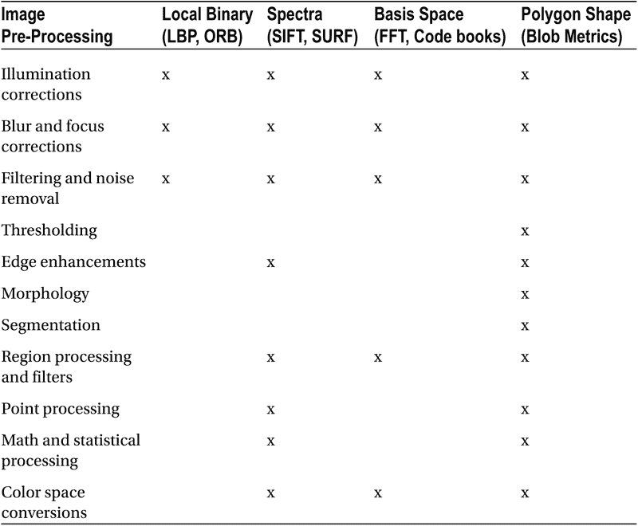
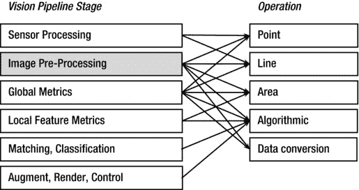
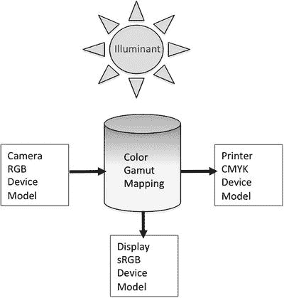
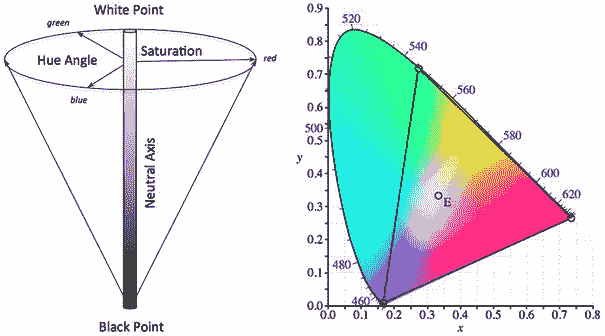
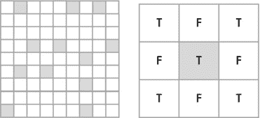
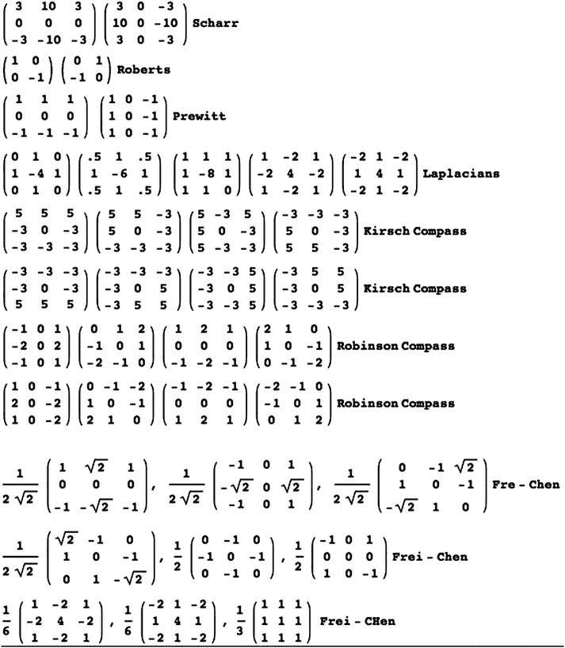
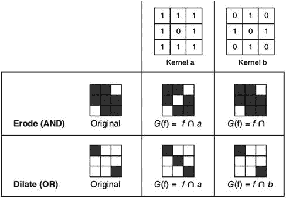
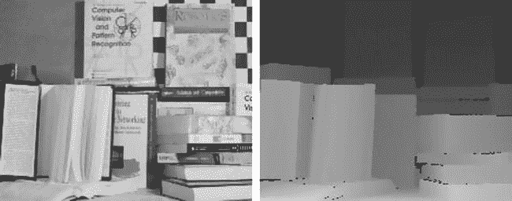
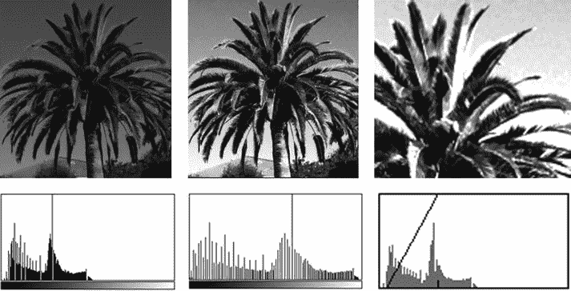
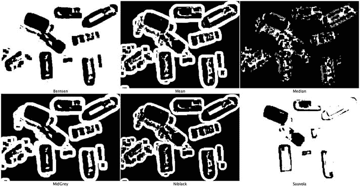

# 二、图像预处理

“我走进去，发现尼摩船长正在用代数方法计算 x 和其他量。”

*—儒勒·凡尔纳，*海底两万里

本章描述了用于准备图像以供进一步分析的方法，包括兴趣点和特征提取。这些方法中的一些对于全局和局部特征描述也是有用的，特别是从变换和基空间导出的度量。重点是计算机视觉的图像预处理，因此我们没有涵盖应用于计算摄影和照片增强等领域的所有图像处理主题，因此我们让感兴趣的读者参考数字图像处理和信号处理中的各种其他标准资源[4，9，325，326]，我们还指出了一些有趣的研究论文，这些论文将增强对这些主题的理解。

 **注**在图像处理方面有很强背景的读者可以从本章的轻松阅读中受益。

图像处理透视

图像处理是一个广阔的领域，不可能在一章中涵盖。那么我们为什么要在一本关于计算机视觉的书中讨论图像预处理呢？原因是促进局部和全局特征描述的科学，因为在特征描述的讨论中通常忽略图像预处理。由于应用和图像数据将指导图像预处理阶段，因此根据特征描述，此处涵盖了一些通用图像处理主题，旨在说明而非禁止。

有些人会认为图像预处理不是一个好主意，因为它扭曲或改变了原始数据的真实性质。然而，图像预处理的智能使用可以提供益处并解决问题，最终导致更好的局部和全局特征检测。我们调查了图像增强和校正的常用方法，这些方法会以有利和不利的方式影响视觉流水线下游的特征分析，具体取决于这些方法的使用方式。

图像预处理可能对特征提取的质量和图像分析的结果具有显著的积极影响 。图像预处理类似于数据集的数学归一化，这是许多特征描述符方法中的常见步骤。或者打个音乐的比方，把图像预处理想象成一个有一系列控件的声音系统，比如没有音量控件的 raw 声音；用一个简单的音调旋钮控制音量；音量控制加上高音、低音和中音；或者音量控制加上完整的图形均衡器、效果处理和卓越的扬声器，营造出一个听觉卓越的房间。这样，本章通过描述校正和增强的组合来促进图像预处理，校正和增强是计算机视觉流水线的基本部分。

图像预处理过程中需要解决的问题

在本节中，我们将根据您选择的特征描述符方法，为图像预处理提供一些建议。直接来自摄像机的原始图像数据可能会有各种各样的问题，如第一章中所述，因此它不太可能产生最佳的计算机视觉效果。这就是为什么仔细考虑图像预处理是至关重要的。例如，使用灰度数据的局部二进制描述符将需要与彩色 SIFT 算法不同的预处理；此外，需要一些探索性工作来微调图像预处理阶段以获得最佳结果。我们通过遵循四个基本的特征描述方法家族的视觉流水线来探索图像预处理，具有一些例子，如下:

1.  **本地二进制描述符** (LBP，ORB，FREAK，others)
2.  **光谱描述符** (SIFT，SURF，其他)
3.  **基空间描述符** (FFT，小波，其他)
4.  **多边形形状描述符** (斑点对象面积、周长、质心)

在第五章的中，这些特性描述度量家族被发展成一个分类法。在此之前，第四章讨论了特征描述符构建概念，而第三章涵盖了全局特征描述，然后第六章调查了局部特征描述。此处介绍的图像预处理方法和应用是示例，但在第八章中，我们将根据各种视觉流水线开发一组更完善的示例，包括预处理阶段的特定应用讨论。

视觉流水线和图像预处理

表 2-1 列出了常见的图像预处理操作，用四个描述符族中每一个的例子说明了这些图像预处理步骤之间的差异和共性，可以在特征描述之前应用。我们这里的目的是说明而不是禁止或限制所选择的方法。

表 2-1 。应用于不同视觉流水线的可能的图像预处理增强和校正



局部二元特征处理*点对*的像素强度比较。这使得比较对光照、亮度和对比度相对不敏感，因此可能不太需要图像预处理来获得良好的结果。文献中描述的当前局部二元模式方法通常不需要太多的图像预处理；它们依赖于一个简单的比较阈值，该阈值可以根据光照或对比度进行调整。

光谱描述符，如 SIFT(作用于局部区域梯度)和 SURF(使用具有局部区域上的积分像素值的 HAAR-like 特征)，提供了不同的预处理机会。使用图像金字塔的方法通常对图像金字塔执行一些图像预处理，以使用高斯滤波来平滑金字塔的较高层，从而创建数据的尺度空间表示。在计算梯度之前，基本的照明校正和过滤可能有助于增强图像，例如，增强可能包含特征的梯度边缘信息的强度带内的对比度。但是一般来说，文献没有报道用于在特征提取之前预处理图像数据的任何特定方法的好的或坏的结果，并且其中存在机会。

基础空间要素通常是全局的或区域性的，跨越一个规则形状的多边形-例如，在整个图像或块上计算的傅立叶变换。然而，基空间特征可以是局部特征的一部分，例如 LBP 直方图的傅立叶谱，其可以在局部描述符的直方图面元值上计算以提供旋转不变性。另一个例子是傅立叶描述符，用于计算显示特征圆度的径向线段长度的多边形因子，以提供旋转不变性。参见第三章，尤其是图 3-19 。

最复杂的描述符族是基于多边形形状的描述符，它可能需要几个图像预处理步骤来分离图像中的多边形结构和形状以进行测量。多边形形状描述流水线可能涉及从图像增强到结构形态学和分割技术的所有内容。设置面要素形状提取的预处理通常比任何其他方法都需要更多的工作，因为阈值和分割需要微调才能获得良好的结果。还要注意，多边形形状描述符不是局部模式，而是更大的区域结构，其特征跨越数十甚至数百个像素，因此处理也可以更密集。

在某些情况下，需要对图像进行预处理，以纠正否则会对特征描述产生不利影响的问题；我们接下来看看这个。

修改

在图像预处理期间，在特征测量和分析之前，图像中可能存在应该被校正的伪像。这里有各种候选人进行更正。

*   **传感器校正。**在第一章中讨论过，这些包括坏点校正、几何镜头失真和渐晕。
*   **灯光校正。**照明可以引入使局部纹理和结构模糊的深阴影；此外，场景中不均匀的照明可能会扭曲结果。候选校正方法包括等级滤波、直方图均衡化和 LUT 重映射。
*   **噪音。**这有多种形式，可能需要特殊的图像预处理。有许多方法可供选择，本章将对其中一些方法进行概述。
*   **几何校正。**如果整个场景被旋转或从错误的视角拍摄，在特征描述之前校正几何图形可能是有价值的。正如在第四章、第五章和第六章中所讨论的，一些特征比其他特征对几何变化更具鲁棒性。
*   **颜色校正。**重新分配色彩饱和度或校正亮度通道中的照明伪像可能会有所帮助。通常，色调是较难校正的属性之一，使用简单的伽马曲线和 sRGB 色彩空间可能无法进行校正。我们将在本章后面介绍更精确的比色法。

提高

增强功能用于优化特定的功能测量方法，而不是修复问题。常见的图像处理增强功能包括锐化和色彩平衡。以下是一些图像增强的一般示例，以及它们对特征描述的潜在好处。

*   **比例-空间金字塔。**当使用倍频程标度和像素抽取对图像进行子采样以创建金字塔来构建金字塔时，会引入子采样伪像和锯齿状像素过渡。尺度空间金字塔构建过程的一部分涉及将高斯模糊滤波器应用于子采样图像，这将移除锯齿状伪像。
*   **照明。**一般来说，光照总是可以增强的。可以使用简单的 LUT 重映射和像素点操作以及直方图均衡化和像素重映射来增强全局照明。可以使用梯度滤波器、局部直方图均衡化和等级滤波器来增强局部照明。
*   **模糊和对焦增强。**在预处理阶段，可以采用许多公知的锐化和模糊滤波方法。例如，为了补偿由旋转引入的像素混叠伪像，其可能表现为模糊精细细节的模糊像素，可以在梯度计算之前使用锐化滤波器来增强边缘特征。或者相反，旋转伪影可能太强，可以通过模糊来消除。

在任何情况下，预处理增强或校正取决于使用图像的描述符和应用。

为特征提取准备图像

每个特征描述方法家族对于流水线的预处理阶段具有不同的目标。让我们看看每个系列的几个例子，并检查每个系列可能的图像预处理方法。

本地二进制族预处理

局部二元描述符族主要与点对强度值比较有关，几种点对模式在第四章的中进行了说明，用于 FREAK、BRISK、BRIEF 和 ORB 等常用方法。如图图 2-4 所示，点与点之间的*比较*差(<、>、=)才是最重要的，因此几乎不需要任何图像预处理。基于上述讨论，以下是两种图像预处理方法:

1.  **保持像素不变。**除了使用像素值差比较阈值之外什么也不做，例如在 Census 变换和其他方法中所做的，因为阈值负责过滤噪声和其他伪像。

    ```py
    *if(|point1–point2|>threshold)*
    ```

2.  **使用过滤。**除了使用比较阈值之外，应用合适的过滤器来移除局部噪声，例如平滑或等级过滤器。或者，采取相反的方法，使用锐化过滤器来放大微小的差异，也许随后是平滑过滤器。根据数据和应用，这两种方法都可能奏效。

图 2-1 使用 3x3 局部区域中的中心相邻点对比较来说明局部阈值和局部二进制模式 LBP 的预处理操作之间的差异，如下所示:

*   左图:原始未处理的局部 3x3 区域数据；比较阈值= 5，暗像素距离中心像素> 5。
*   左中图像:比较阈值= 10；注意，通过简单地改变阈值，图案形状是不同的。
*   右侧中心图像:在对 3x3 区域应用拉普拉斯锐化滤波器后，请注意中心像素值从 52 变为 49，因此在比较阈值设置为 5 的情况下，图案现在不同于左侧的原始图案。
*   右图:拉普拉斯滤波数据的阈值设置为 10；请注意不同的结果二进制模式。


图 2-1 。LBP 如何受到预处理的影响，显示了比较阈值的影响。(左)比较阈值= 5。(中间偏左)比较阈值= 10。(中右)应用拉普拉斯算子后的原始数据。(右)对拉普拉斯滤波数据比较阈值= 5

光谱族预处理

由于光谱类别中的方法范围很广，因此很难概括可能有用的潜在预处理方法。例如，SIFT 涉及在每个像素计算的梯度信息。SURF 关注的是 HAAR 小波或积分像素值的局部矩形区域的组合，这降低了单个像素值的重要性。

对于使用类似 HAAR 特征的基于积分图像的方法，例如 SURF 和 Viola Jones，这里有一些假设的预处理选项。

1.  什么也不做。简单地通过对局部区域像素值求和，从积分图像计算 HAAR 特征；在总和中没有保留局部像素中的精细结构，因此一种选择是对图像预处理不做任何事情。
2.  **噪声去除。**这在 HAAR 预处理阶段似乎不需要，因为局部区域中的积分图像求和具有滤除噪声的趋势。
3.  **光照问题。**这可能需要预处理；例如，如果训练数据的照明不同于当前帧，对比度增强可能是个好主意。在这种情况下，一种预处理方法是为训练集中的图像计算全局对比度度量，然后在每一帧中计算相同的全局对比度度量，并且如果对比度偏离超过阈值，则调整图像对比度以更接近期望的全局对比度度量。对比度增强的方法包括 LUT 重映射、全局直方图均衡和局部自适应直方图均衡。
4.  **模糊不清。**如果模糊是当前帧中的问题，它可能表现为类似于局部对比度问题，因此可能需要局部对比度增强，例如锐化滤波器。计算诸如 SDM 的全局统计度量作为地面实况数据的一部分来测量局部或全局对比度可能是有用的；如果当前图像在对比度上偏离太多，可以应用合适的对比度增强作为预处理步骤。

注意在图 2-2 中，增加局部区域对比度会导致更大的梯度和更明显的边缘。依赖于局部梯度信息的特征描述符受到局部对比度的影响。


图 2-2 。局部对比度对梯度和边缘检测的影响:(左)原始图像和 Sobel 边缘。(右)对比调整后的图像，放大局部区域细节和生成的 Sobel 边缘

对于使用局部区域梯度的 SIFT 类型描述符，预处理可能有助于在计算之前增强局部梯度，从而影响某些特征:

1.  **模糊不清。**这将抑制梯度幅度计算，并可能使确定梯度方向变得困难，因此可能应采用局部等级滤波器、高通滤波器或锐化滤波器。
2.  **噪音。这将加剧局部梯度计算，使它们变得不可靠，因此应用几种现有的噪声去除算法之一可能会有所帮助。**
3.  **对比。如果局部对比度不够高，梯度计算就很困难且不可靠。也许可以应用局部直方图均衡化、LUT 重映射、等级滤波器或者甚至锐化滤波器来改善结果。**

基空间族预处理

根据我们在这项工作中遵循的分类法，不可能对基空间方法的图像预处理进行归纳，因为它们是非常多样的。如第四章、 5 和 6 所述，基空间方法包括傅立叶、小波、视觉词汇、KTL 等。然而，这里我们提供一些关于预处理的一般观察。

1.  **傅立叶方法，小波，斜变换，沃什·哈达玛，KLT。**这些方法将数据转换到另一个领域进行分析，在不了解预期应用的情况下，很难提出任何预处理建议。例如，计算傅立叶频谱会产生幅度和相位，相位在特征描述中非常有用，可以提供对模糊的不变性，正如在第六章中描述的 LPQ 线性相位量化方法中所报告的，因此在这种情况下，模糊的图像可能不是问题。
2.  稀疏编码和视觉词汇。这些方法依赖于局部特征描述符，其可以是 SURF、SIFT、LBP 或从空间域中的像素导出的任何其他期望的特征。因此，特征描述的方法将决定预处理的最佳方法。例如，使用相关和原始像素块作为稀疏码的方法可能不需要任何预处理。或者也许可以使用一些最小的预处理，例如平衡对比度的照明归一化、局部直方图均衡化或 LUT 对比度重新映射。

在图 2-3 中，对比度调整对傅立叶方法没有太大影响，因为图像中没有主导结构。傅立叶频谱典型地揭示了主导结构和功率被限制在象限移动 2D 图中心的较低频率。对于具有主要结构的图像，例如线条和其他形状，傅立叶功率谱将显示该结构，并且预处理可能更有价值。此外，傅立叶功率谱显示按对数值缩放，并不线性显示所有细节，因此线性频谱渲染可能会显示缩放和放大的较低频率，以便更好地擦除视图。


图 2-3 。在这个例子中，如傅立叶频谱所示，预处理没有任何好处；(左)之前。(右)对比度调整后的输入图像

多边形形状族预处理

当考虑图像预处理步骤时，多边形形状可能是要求最高的特征，因为如表 2-1 所示，潜在预处理方法的范围相当大，并且所采用方法的选择非常依赖于数据。可能是因为多边形形状测量的挑战和预期用例，它们仅用于各种利基应用，如细胞生物学。

在多边形形状测量之前，最常用的图像准备方法之一是物理校正照明并选择主体背景。例如，在自动化显微镜应用中，用荧光染料制备包含细胞的载玻片，以突出细胞中的特征，然后在放大下仔细调整照明角度和位置，以在待测量的每个细胞特征下提供均匀的背景；由此产生的图像更容易分割。

如图图 2-4 和图 2-5 所示，如果预处理错误，得到的形状特征描述符用处不大。在基于形状的特征提取之前，这里有一些比较突出的预处理选项，然后我们将在本章的后面介绍一系列其他方法。


图 2-4 。使用阈值处理来解决图像预处理期间的问题，以准备用于多边形形状测量的图像:(左)原始图像。(中间)已设定阈值的红色通道图像。(右)阈值以上的周界追踪


图 2-5 。多边形形状测量之前的另一系列形态学预处理步骤:(左)原始图像。(中间)范围阈值和扩大的红色通道。(右)阈值以上的形态周长形状

1.  **照明校正。**通常对定义二元特征的形状和轮廓至关重要。例如，如果周界跟踪或边界分割是基于边缘或阈值的，不均匀的照明将会引起问题，因为边界定义变得模糊。如果照明不能被校正，那么其他不基于阈值的分割方法是可用的，例如基于纹理的分割。
2.  **模糊和聚焦校正。**由于对象边界和形状的分割对模糊不太敏感，因此对于多边形形状检测来说，照明可能不那么重要。
3.  **滤波去噪。**形状检测对噪声有一定的容忍度，这取决于噪声的类型。散粒噪声或斑点噪声可能不是问题，并且可以使用各种噪声清除方法轻松消除。
4.  **阈值处理。**这对于多边形形状检测方法至关重要。采用了许多阈值处理方法，从简单的二进制阈值处理到本章后面讨论的局部自适应阈值处理方法。阈值处理是一个有问题的操作，除了仔细控制光源位置和方向以处理阴影之外，还需要算法参数微调。
5.  **边缘增强。**可能对周界轮廓定义有用。
6.  **形态学。**为测量准备多边形形状最常用的方法之一，本章稍后会详细介绍。形态学被用来改变形状，大概是为了变得更好，主要是通过腐蚀和膨胀操作的组合或流水线，如图图 2-5 所示。形态学示例包括对象区域边界清理、毛刺去除以及一般的线和周界清理和平滑。
7.  **分割。**这些方法使用图像中的结构或纹理，而不是阈值，作为将图像划分为连通区域或多边形的基础。本章稍后将介绍几种常见的分段方法。
8.  **面积/区域处理。**在分割之前，诸如锐化或模糊之类的卷积滤波器屏蔽以及诸如等级滤波器或媒体滤波器之类的统计滤波器可能是有用的。
9.  **点加工。**逐点对图像数据进行算术缩放，例如将每个像素乘以给定值，然后进行裁剪操作，以及 LUT 处理，通常在分割之前是有用的。
10.  **色彩空间转换。**对于准确处理颜色特征至关重要，将在本章稍后介绍。

如图 2-4 所示，范围阈值方法使用红色通道，因为桌子背景有很多红色，可以很容易地用红色进行阈值处理以去除桌面。通过剪切强度带之外的值来对图像进行阈值处理；请注意，右下角的 u 盘在阈值之后消失了，因为它是红色的，低于阈值。还要注意，底部中间的白色 u 盘也几乎不见了，因为它是白色的(最大 RGB 值)并且高于阈值。右图显示了试图追踪阈值以上的周界；它仍然不是很好，因为需要更多的预处理步骤。

图像处理方法的分类

在我们调查图像预处理方法之前，有一个简单的分类法来框架讨论是有用的。建议的分类法是一组操作，包括点、线、区域、算法和数据转换，如图 2-6 所示。图 2-1 中介绍的图像预处理操作的基本类别符合这个简单的分类法。请注意，根据预期用途，视觉流水线的每个阶段可能都有主要任务和相应的预处理操作。



图 2-6 。简化的典型图像处理分类，适用于整个视觉流水线

我们在这里提供一个分类法的简要介绍，随后在第五章中有更详细的讨论。注意，分类法遵循图像数据的内存布局和内存访问模式。内存布局尤其会影响性能和功耗。

点

点操作一次处理一个像素，不考虑相邻像素。例如，点处理操作可分为数学、布尔和像素值比较替换部分，如后面“点过滤”部分的表 2-2 所示其他点处理示例包括颜色转换和数字数据转换。

线条

线操作处理像素或数据的离散线，不考虑前面或后面的线。示例包括 FFT，这是一种可分离的变换，其中像素行和列可以作为 1D FFT 行操作独立地并行处理。如果算法需要数据行，那么可以对图像预处理存储器布局、流水线读/写和并行处理进行优化。优化将在第八章中介绍。

面积

区域操作通常需要局部像素块——例如，通过内核遮罩、卷积、形态学和许多其他操作进行空间过滤。区域操作会产生特定类型的内存流量，并且可以使用细粒度方法进行并行化，例如图形处理器中的通用着色器和粗粒度线程方法。

算法的

有些图像预处理方法是纯串行或者算法代码。并行化这些代码块是困难的，甚至是不可能的。在某些情况下，算法块可以被分割成几个独立的线程以实现粗粒度的并行，或者流水线化，如第八章中所讨论的。

数据转换

虽然这些任务是平凡而显而易见的，但是可以花费大量的时间来进行简单的数据转换。例如，整数传感器数据可以被转换成浮点，用于几何计算或色彩空间转换。在许多情况下，数据转换是图像预处理的重要组成部分。转换示例包括:

*   整数位深度转换(8/16/32/64)
*   浮点转换(单精度到双精度)
*   定点到整数或浮点
*   浮点数和整数的任意组合，反之亦然
*   各种颜色空间之间的颜色转换
*   基空间计算的转换，例如 FFT 的整数和浮点之间的转换

如第八章所述，在设计上关注数据转换和性能是合理的，可以提供良好的投资回报。

比色法

在本节中，我们将简要概述色彩科学，以指导特性描述，并关注色彩准确性、色彩空间和色彩转换。如果特征描述符使用颜色，那么颜色表示和处理应该是精心设计的，准确的，并且适合于应用。例如，在一些应用中，可能仅使用颜色来识别物体，可能使用汽车的油漆颜色来识别汽车，假设供应商每年为每个型号选择了唯一的油漆颜色。通过将颜色与另一个简单的特征(如形状)结合起来，可以设计出一个有效的描述符。

颜色科学是一个由国际标准定义并在文献[249，250，251]中详细描述的众所周知的领域。我们在这里只列出几个资源。

*   罗彻斯特理工学院的孟塞尔色彩科学实验室是色彩科学和成像领域的领先研究机构之一。它提供了广泛的资源，并与柯达、施乐等行业成像巨头有着密切的联系。
*   国际照明委员会(CIE)提供了与颜色科学相关的一系列光源的标准照明数据，以及众所周知的颜色空间 CIE XYZ、CIE Lab 和 CIE Luv 的标准。
*   ICC 国际色彩联盟为成像设备提供 ICC 标准色彩描述文件，以及许多其他行业标准，包括彩色显示器的 sRGB 色彩空间。
*   由行业领导者开发的专有色彩管理系统包括 Adobe CMM 和 Adobe RGB、Apple ColorSync 和 HP ColorSmart 也许最先进的是微软的 Windows 颜色系统，它是基于佳能早期在 CIECAM02 上使用的 Kyuanos 系统。

色彩管理系统概述

计算机视觉应用可能不需要成熟的色彩管理系统，但在处理色彩时，了解色彩管理的方法是至关重要的。如图 2-7 所示，色彩管理系统在设备色彩空间(如 RGB 或 s RGB)和*比色色彩空间*(如 CIE Luv、Lab、Jch 或 Jab)之间转换颜色，以执行*色域映射*。由于每个设备只能在特定的色域或颜色范围内再现颜色，因此需要色域映射，使用每个颜色设备的数学模型将颜色转换为最接近的匹配。



图 2-7 。具有 RGB 照相机设备模型、sRGB 显示设备模型、CMYK 打印机设备模型、色域映射模块和光源模型的色彩管理系统

发光体、白点、黑点和中性轴

*光源* 是自然光或荧光灯等光源，根据其光谱成分和光谱功率或色温定义为*白点*颜色。真实系统中的白点颜色值从来都不是完美的白色，而是一个测量值。白点值和相对的*黑点*值一起定义了颜色空间的*中性轴* (灰度强度)的端点，它不是一个完全直的颜色矢量。

色彩管理依赖于光源或发光体的准确信息和测量。如果没有关于测量颜色的光源的准确信息，颜色就无法表示，因为在荧光灯和自然光下颜色看起来是不同的，等等。CIE 标准定义了标准光源的几个值，例如 D65，如图 2-8 中的所示。



图 2-8 。(左)三维颜色空间的表示，中性轴表示白色量，色相角表示原色，饱和度表示存在的颜色量。(右)CIE XYZ 色度图，显示标准光源 D65 OE 作为白点的值，以及 R、G 和 B 的原色值

设备颜色型号

打印机、显示器和相机等真实设备通常会再现颜色，而标准色标是使用校准光源和光谱设备测量的，例如，广泛使用的 Munsel 色标根据标准光源在色调、亮度和色度(HVC)方面定义颜色。为了有效地管理给定设备的颜色，必须为每个设备创建数学模型或设备颜色模型，定义设备色域及其色域范围中的异常。

为了使色彩管理系统准确，必须在实验室中对每个真实设备进行光谱表征和建模，以创建数学设备模型，将每个设备的色域映射到标准照明模型。设备模型用于色彩空间之间的色域转换。

设备通常使用原色和二次色 RGB 和 CYMK 来表示颜色。RGB 是原色、加色空间；从黑色开始，添加 RGB 原色红、绿和蓝来创建颜色。CYMK 是第二颜色空间，因为颜色分量青色、黄色和品红色是 RGB 原色的第二组合；青色=绿色加蓝色，洋红色=红色加蓝色，黄色=红色加绿色。CYMK 也是一个减色空间，因为颜色是从白色背景中减去的，以创建特定的颜色。

色彩空间和色彩感知

色度空间以抽象的术语表示颜色，如亮度、色调或颜色以及颜色饱和度。每个颜色空间都是为不同的原因而设计的，并且每个颜色空间对于不同类型的分析和处理都是有用的。简单色彩空间的例子包括 HSV(色调、饱和度、值)和 HVC(色调、值、色度)。在 CIE 颜色空间的情况下，RGB 颜色分量由标准化值 CIE XYZ 分量代替，作为定义 CIE Luv 和 CIE Lab 颜色空间的基础。

在颜色科学的最高端，我们有更新的 CIECAM02 颜色模型和颜色空间，如 Jch 和 Jab。CIECAM02 不仅仅是光源和色标本身的色度学，它还提供了高级的颜色外观建模考虑因素，包括测量颜色的环境[254，249]。

虽然 CIECAM02 对于大多数应用来说可能有些过分，但还是值得研究一下。由于人们对颜色的感知方式不尽相同，因此颜色感知会因观察颜色的环境、组合的直接照明和环境照明的光谱和角度以及人类视觉系统本身而有很大差异。

色域映射和渲染意图

色域映射是在两个色彩空间之间转换颜色并获得最佳匹配的艺术和科学。由于每个设备的色域不同，色域映射是一个挑战，并且有许多不同的算法在使用，没有明确的赢家。根据渲染的目的，可以使用不同的方法，例如，从相机色彩空间到打印机色彩空间的色域映射不同于映射到 LCD 显示器进行查看。

CAM02 系统提供了详细的指导模型。例如，彩色成像设备可以很弱地捕捉蓝色，而显示器可以很好地显示蓝色。色域拟合方法应该使用颜色裁剪还是拉伸？如何计算色域之间的差异？哪个颜色空间？有关超过 90 种色域映射方法的出色调查，请参见 Morovic 的工作[252]。

在图 2-9 (左图)中，sRGB 色彩空间显示为适合 Adobe RGB 色彩空间，说明 sRGB 没有覆盖像 Adobe RGB 一样宽的色域。每个色域以不同的方式再现颜色，每个颜色空间可能是线性的或内部扭曲的。图 2-9 中的右图说明了一种色域映射方法，该方法使用欧几里德距离和裁剪来确定两个色域中最接近的共同颜色；然而，还有许多其他色域映射距离方法。根据周围的光线和环境，颜色感知会发生变化，从而使色域映射变得更加复杂。


图 2-9 。色域映射的中心问题:(左)使用 Gamutvision 软件创建的彩色 sRGB 和 Adobe RGB 色域。(右)色域映射细节

在色域映射中，有源色域和目标色域。例如，源可以是照相机，目的可以是 LCD 显示器。根据色域转换的渲染意图，已经开发了不同的算法来将颜色从源色域转换到目标色域。使用*感知意图*，色彩饱和度被映射并保持在目标色域的边界内，以努力保持相对色彩强度；并且来自源的色域外颜色被压缩到目标色域中，这允许更可逆的色域映射转换。使用*色度意图，*颜色可以直接从源色域映射到目标色域，而目标色域之外的颜色则被简单地剪切掉。

一种常见的颜色校正方法是依靠应用于强度通道的简单伽马曲线来帮助人眼更好地可视化数据，因为伽马曲线会使图像的暗区域变亮并压缩亮区域，这与人类视觉系统处理亮区域和暗区域的方式类似。然而，色域校正与真实的传感器数据没有关系，因此建议使用经过校准的色度校正方法。

色彩增强的实际考虑因素

对于图像预处理，颜色强度通常是唯一应该增强的颜色信息，因为颜色强度本身携带了大量信息并且是常用的。此外，在保持相对颜色的同时，颜色处理不能容易地在 RGB 空间中完成。例如，当 RGB 通道被重新组合成单个渲染时，使用锐化滤波器独立增强 RGB 通道将导致莫尔条纹伪像。因此，为了锐化图像，首先*将* RGB 正向转换到一个颜色空间，如 HSV 或 YIQ，然后锐化 V 或 Y 分量，然后*将*反向转换回 RGB。例如，为了校正彩色照明，诸如 LUT 重映射或直方图均衡化的标准图像处理方法将起作用，只要它们在强度空间中执行。

作为一个实际问题，快速的颜色转换到灰度从 RGB，这里有一些方法。(1)G 颜色通道是灰度信息的良好代理，因为如第一章的传感器讨论所示，光谱中的 RB 波长与 G 波长严重重叠。(2)从 RGB 到灰度强度 I 的简单转换，取 I = R+G+B / 3 即可。(3)在 NTSC 电视广播标准中使用的 YIQ 色彩空间提供了 RGB 和灰度分量 Y 之间简单的向前/向后色彩转换方法，如下所示:


颜色准确度和精度

如果颜色精度很重要，每个 RGB 颜色通道 8 位可能不够。有必要研究图像传感器供应商的数据手册，以了解传感器到底有多好。在撰写本文时，普通图像传感器每 RGB 通道产生 10 至 14 位的颜色信息。每个颜色通道可能有不同的光谱响应，如第一章中所述。

通常，在大多数设备上，绿色是一个良好且相当准确的颜色通道；红色通常也很好，并且如果从传感器移除 IR 滤光器，还可能具有近红外灵敏度；蓝色始终是一个挑战，因为蓝色波长在较小的硅阱中最难捕获，硅阱接近蓝色波长的尺寸，因此传感器供应商需要特别注意蓝色传感细节。

空间滤波

与使用傅立叶方法的频域滤波相比，对离散像素阵列的滤波被认为是*空间滤波、*或时域滤波。空间滤波器是频域方法的替代方法，并且在空间域中多种多样的处理方法是可能的。

卷积滤波和检测

*卷积*是一种基本的信号处理操作，易于计算为离散空间处理操作，对于 1D、2D 和 3D 处理是实用的。基本思想是将两个信号组合或卷积在一起，将源信号改变为更像滤波器信号。源信号是图像中的像素阵列；滤波信号是加权的核掩模，例如梯度峰值形状和定向边缘形状或其他加权形状。有关滤镜内核遮罩形状的几个示例，请参见本章后面讨论 Sobel、Scharr、Prewitt、Roberts、Kirsch、Robinson 和 Frei-Chen 滤镜遮罩的部分。

卷积通常用于滤波操作，如低通、带通和高通滤波器，但许多滤波器形状都有可能检测到 *f* 特征，如对边缘方向敏感的边缘检测内核，甚至是点、角和轮廓检测器。卷积被用作卷积网络方法中的检测器【85】，如第四章所述。

图 2-10 (中心图像)中的锐化内核遮罩旨在放大与相邻像素相关的中心像素。每个像素乘以其核心位置，结果(右图)显示中心像素是卷积的总和，相对于相邻像素已经增加或放大。


图 2-10 。卷积，在这种情况下是锐化滤波器:(从左到右)图像数据、锐化滤波器和结果图像数据

卷积运算之后通常会有一组后处理点运算来清理数据。以下是一些有用的后处理步骤:在本章后面的“点过滤器”一节中有更多的建议。

```py
switch (post_processor)
{
case RESULT_ASIS:
break;
case RESULT_PLUS_VALUE:
sum += value;
break;
case RESULT_MINUS_VALUE:
sum -= value;
break;
case RESULT_PLUS_ORIGINAL_TIMES_VALUE:
sum = sum + (result * value);
break;
case RESULT_MINUS_ORIGINAL_TIMES_VALUE:
sum = sum - (result * value);
break;
case ORIGINAL_PLUS_RESULT_TIMES_VALUE:
sum = result + (sum * value);
break;
case ORIGINAL_MINUS_RESULT_TIMES_VALUE:
sum = result - (sum * value);
break;
case ORIGINAL_LOW_CLIP:
sum = (result < value ? value : result);
break;
case ORIGINAL_HIGH_CLIP:
sum = (result > value ? value : result);
break;
}

switch (post_processing_sign)
{
case ABSOLUTE_VALUE:
        if (sum < 0) sum = -sum;
        if (sum > limit) sum = limit;
        break;
case POSITIVE_ONLY:
        if (sum < 0) sum = 0;
        if (sum > limit) sum = limit;
        break;
case NEGATIVE_ONLY:
        if (sum > 0) sum = 0;
        if (-sum > limit) sum = -limit;
        break;
case SIGNED:
        if (sum > limit) sum = limit;
        if (-sum > limit) sum = -limit;
        break;
}
```

卷积用于实现各种常见的滤波器，包括:

*   **渐变或锐化滤镜**，放大并检测最大值和最小值像素。例子包括拉普拉斯算子。
*   **边缘或线检测器**，其中线是显示线段或轮廓的连接梯度。边缘或线检测器可以转向特定的方向，如垂直、对角、水平或全向；在第三章中讨论了作为基集的可控滤波器。
*   **平滑和模糊滤镜**，取邻域像素。

内核过滤和形状选择

除了卷积方法之外，可以设计核来捕获像素区域，一般用于统计滤波操作，其中区域中的像素从低值到高值被分类到列表中。例如，假设一个 3×3 内核区域，我们可以设计以下统计过滤器:

```py
sort(&kernel, &image, &coordinates, &sorted_list);

switch (filter_type)
case RANK_FILTER:
        // Pick highest pixel in the list, rank = 8 for a 3x3 kernel 0..8
        // Could also pick the lowest, middle, or other rank
        image[center_pixel] = sorted_list[rank];
        break;
case MEDIAN_FILTER:
        // Median value is kernel size / 2, (3x3=9)/2=4 in this case
        image[center_pixel] = sorted_list[median];
        break;
case MAJORITY_FILTER:
        // Find the pixel value that occurs most often, count sorted pixel values
        count(&sorted_list, &counted_list);
        image[center_pixel] = counted_list[0];
        break;
}
```

等级过滤器是一种简单而强大的方法，它对区域中的每个像素进行排序，并用所需等级的像素替换中心像素，例如用区域中最高的像素替换中心像素，或者用中值或多数值替换。

形状选择或形成内核

任何区域操作都可以受益于形状选择核来从该区域中选择像素并排除其他像素。形状选择或形成可以作为预处理步骤应用于任何图像预处理算法或任何特征提取方法。形状选择核可以是二进制真值核，以选择来自源图像的哪些像素被用作一组，或者标记应该接受单独处理的像素。形状选择核，如图 2-11 所示，也可以应用于局部特征描述符和检测器；类似但有时更复杂的局部区域像素选择方法通常与局部二进制描述符方法一起使用，如第四章所述。



图 2-11 。真实核和形状核:(左)形状核灰色核位置，指示要处理或使用的像素，例如，要在局部二进制模式点对比较检测器之前进行卷积的像素。(右)指定用于区域平均的像素的真实形状内核，支持对角线-T 表示使用此像素，F 表示不使用

点过滤

在进行图像预处理实验时，通常会忽略单个像素的处理。点加工适用于许多优化方法，这将在第八章的中讨论。如上所述，卷积之后通常是点后处理步骤。表 2-2 举例说明了数学运算、布尔运算、比较和替换运算领域中几种常见的像素点处理方法，这些方法看似显而易见，但对探索图像增强方法以增强特征提取非常有价值。

表 2-2 。可能的点操作

| 

//数学运算

 | 

//比较和替代操作

 |
| --- | --- |
| 名称 math _ ops[]= {
" src+value->dst "、
"src - value - > dst "、
"src * value - > dst "、
"src / value - > dst "、
(src+dst)* value->dst "、
(src-dst)* value->dst "、
(src * dst)* dst)
“src * src+value->dst”，
“exp(src)+value->dst”，
“log(src)+value->dst”，
“log 10(src)+value->dst”，
“pow(src ^值)- > dst”，
“sin(src)+value->dst”
**//布尔运算**
名称 bool_ops[] = {
"src 与值- > dst "，
"src 或值- > dst "，
"src 异或值- > dst "，
"src 与 dst - > dst "，
"src 或 dst - > dst "，
"src 异或" | 名称 change _ ops[]= {
" if(src = thresh)value->dst "，
"if (src = dst) value - > dst "，
"if (src！= thresh) value - > dst "，
"if (src！= thresh) src - > dst "，
if(src！= dst)值- > dst "，
"if (src！= dst) src - > dst“，
“if(src>= thresh)value->dst”，
“if(src>= thresh)src->dst”，
“if(src>= dst)value->dst”，
“if(src>= dst)src->dst”，
“如果
“if(src<= dst)src->dst”，
“if(lo<= src<= hi)value->dst”，
“if(lo<= src<= hi)src->dst”，
}； |

噪声和伪像过滤

噪声通常是图像传感器的伪像，但并非总是如此。图像中还可能存在其他几种伪像。噪声去除的目标是在不扭曲底层图像的情况下去除噪声，并且去除伪像的目标是相似的。根据噪声或伪像的类型，可以采用不同的方法进行预处理。第一步是对噪声或伪影进行分类，然后设计正确的图像预处理策略。

*   **散斑，随机噪声。**这种类型的噪声显然是随机的，可以使用等级滤波器或中值滤波器去除。
*   **瞬时频率尖峰。**这可以使用傅立叶频谱来确定，并且可以使用尖峰上的陷波滤波器来移除；频率尖峰很可能位于频谱的异常区域，并可能表现为图像中的亮点。
*   **抖动和抖动线路噪声。**这是视频流特有的伪像，通常是由于电视电影伪像、摄像机运动或图像场景造成的，并且很难校正。它主要面向行，而不仅仅是面向单像素。
*   **运动模糊。**这可能由匀速或非匀速运动引起，是一个复杂的问题；有几种去除方法；参见参考文献[305]。

Gonzalez[4]讨论了消除噪声的标准方法。最基本的方法是去除异常值，并且采用各种方法，包括阈值和基于局部区域的统计滤波器，例如等级滤波器和中值滤波器。加权图像平均有时也用于从视频流中去除噪声；假设相机和对象不移动，它可以很好地工作。尽管有时使用去模糊或高斯平滑卷积核来去除噪声，但是这种方法可能导致拖尾，并且可能不是最佳方法。

Buades 等人【511】提供了噪声去除方法的调查和性能比较模型。该来源包括作者的 NL-means 方法的描述，该方法除了使用较大图像区域上的相似加权像素值之间的欧几里德距离度量之外，还使用非局部像素值统计来识别和去除噪声。

整体图像和盒式过滤器

积分图像用于快速找到矩形像素组的平均值。积分图像也被称为*总面积表*，其中积分图像中的每个像素是当前像素左侧和上方所有像素的积分和。积分图像可以在图像上的单次通过中快速计算。使用来自图像 *i(n，m)* 的当前像素值，结合先前进入总面积表的条目 *s(n，m)* ，计算总面积表中的每个值，如下所示:


如图图 2-12 所示，从积分图像中求一个 HAAR 矩形特征值，只使用积分图像表 A、B、C、D 中的四个点，而不是从图像中求几十或几百个点。然后，矩形区域的积分图像和可以除以矩形区域的大小，以产生平均值，这也被称为*盒式滤波器*。


图 2-12 。图像中的(左)像素。(中间)整体图像。(右)从积分图像中的四个点计算盒状过滤器值的区域:sum = s(A)+s(D)-s(B)-s(C)

积分图像和箱式滤波器用于许多计算机视觉方法，例如 HAAR 滤波器和特征描述符。积分图像也用作小区域的高斯滤波器的快速替代，作为降低计算成本的一种方式。事实上，具有大量重叠区域处理的描述符，如 BRISK [131]，有效地利用积分图像来构建描述符，并将积分图像用作快速高斯模糊或卷积的代理。

边缘检测器

边缘检测器的目标是增强图像中的连通梯度，其可以采取边缘、轮廓、线或一些连通的边缘集合的形式。许多边缘检测器被简单地实现为内核操作或卷积，我们在这里考察常用的方法。

核心集 :索贝尔、沙尔、普鲁伊特、罗伯茨、基尔希、罗宾逊、弗赖-陈

Sobel 算子检测边缘检测的梯度大小和方向。这里显示了基本方法。

1.  使用诸如 3×3 核的基本导数核近似，使用如下值，执行两个方向索贝尔滤波器( *x* 和 *y* 轴):
2.  

    

3.  计算总梯度为*G*<sub>v= |*S*<sub>*x*</sub>|+|*S*<sub>*y*</sub>|</sub>
4.  计算渐变方向为*θ*=*ATAN*(*S*<sub>*y*</sub>/*S*<sub>*x*</sub>)
5.  计算梯度幅度

用于 Sobel 边缘检测的核的面积大小和形状存在变化。除了上面示出的 Sobel 核之外，在实践中还使用其他类似的核集合，只要核的值相消并且加起来为零，例如由 Scharr、Prewitt、Roberts、Robinson 和 Frei-Chen 提出的那些核，以及拉普拉斯近似核。Frei-Chen 核被设计成在一个集合中一起使用，因此边是所有核的加权和。有关边缘检测掩模的更多信息，请参见参考文献[4]。一些内核具有指南针方向，例如 Kirsch、Robinson 和其他人开发的那些内核。参见图 2-13 。



图 2-13 。几个边缘检测核心掩码

Canny 探测器

Canny 方法[154]类似于 Sobel-style 梯度幅度和方向方法，但它增加了后处理来清理边缘。

1.  使用选定的卷积核(7x7，5，5 等)对图像执行高斯模糊。)，具体取决于所需的低通滤波水平。
2.  执行两个方向索贝尔滤波器( *x & y* 轴)。
3.  在渐变方向上执行非最大值抑制，将不在边缘上的像素(最小值)设置为零(0)。
4.  沿梯度方向在一个值带(高、低)内执行滞后阈值处理，以消除边缘混叠和异常伪像，并创建更好的连接边缘。

变换滤波、傅立叶变换等

本节讨论图像滤波中的基空间和图像变换，最常用和最广泛使用的是傅立叶变换。在第三章的[中，提供了特征描述上下文中对基础空间和变换的更全面的处理。Pratt [9]为图像处理环境中的变换滤波提供了一个很好的参考。](03.html)

为什么要使用转换来切换域？使图像预处理更容易或更有效，或者更有效地执行特征描述和匹配。在某些情况下，除了将图像变换到另一个域，没有更好的方法来增强图像或描述特征，例如，消除作为傅立叶频谱异常频率成分的噪声和其他结构性伪影，或者使用 HAAR 基特征对图像特征进行压缩描述和编码。

傅立叶变换族

傅立叶变换是众所周知的，并在布拉采维尔的标准参考文献[227]中有所涉及，它构成了一系列相关变换的基础。执行快速傅立叶变换(FFT)的几种方法在图像和信号处理库中很常见。傅立叶分析几乎触及了世界事务的每个领域，包括科学、金融、医学和工业，并被誉为“我们一生中最重要的数值算法”[290]。这里，我们讨论傅立叶分析的基本原理，以及傅立叶变换家族的几个分支和图像预处理应用。

傅立叶变换可以使用光学以光速计算[516]。然而，我们对适用于数字计算机的方法感兴趣。

基本原则

傅立叶分析[227，4，9]的基本思想是将周期函数分解成一系列正弦和余弦波 ( 图 2-14 )。傅立叶变换是在周期波和频域中相应的一系列谐波基函数之间的双向变换，其中每个基函数是正弦或余弦函数，与基频间隔整个谐波倍数。正向 FFT 的结果是由序列中每个正弦和余弦分量的幅度和相位数据组成的复数，也称为*实数据*和*虚数据*。


图 2-14 。(左)正弦波的调和级数。(右)正弦和余弦波的傅立叶调和级数

任意周期函数可以通过对期望的一组傅立叶基函数求和来合成，并且周期函数可以使用傅立叶变换分解成作为傅立叶级数的基函数。傅立叶变换在离散像素的时域和频域之间是可逆的，其中每个基函数的幅度和相位都可用于滤波和分析，幅度是最常用的分量。

2D 图像或 3D 体积的 FFT 是如何实现的？傅立叶变换是一种*可分离变换*，因此可以实现为一组并行 1D FFT 线变换 ( 图 2-15 )。因此，对于 2D 图像和 3D 体积，每个维度，例如 *x、y、z* 维度，可以作为独立的 *x* 线并行地就地计算，然后下一个维度或 *y* 列可以作为平行线就地计算，然后 *z* 维度可以作为平行线就地计算，并且根据变换缩放最终结果。任何好的 1D FFT 算法都可以设置成使用并行化处理 2D 图像或 3D 体积。


图 2-15 。傅立叶级数和傅立叶变换概念，表示由一系列傅立叶谐波近似得到的方波

为了从频率空间回到像素的逆变换的精度，FFT 计算将需要两个双精度 64 位浮点缓冲器来保存幅度和相位数据，因为诸如正弦和余弦之类的超越函数需要高浮点精度来保证精度；对图像数据使用 64 位双精度浮点数,可以计算图像的前向变换，然后进行逆变换，与原始图像相比精度没有损失——当然，非常大的图像需要两倍以上的精度。

由于 64 位浮点运算速度通常较慢，功耗也较高，这是由于 ALU 中的计算要求和芯片面积增加，以及存储器带宽负载较重，因此开发了使用整数变换的 FFT 优化方法，在某些情况下还使用定点，这是许多应用的良好选择。

注意在图 2-16 中，应用低通滤波器(中右)主要是为了保护靠近图中心的低频信息，并减少靠近边缘的高频成分，从而在最右边产生滤波后的图像。


图 2-16 。基本傅立叶滤波:(左)原图。(中左)傅立叶光谱。(中右)低通滤波器形状用于乘以傅立叶幅度。(右)使用低通滤波器的逆变换图像

一个关键的傅立叶应用是滤波，其中原始图像被正向转换成幅度和相位；幅度分量被显示为幅度数据的傅立叶功率谱，其将图像中的结构显示为直线和块，或者通常是噪声的异常结构或斑点。可以通过各种滤波器形状对幅度进行滤波，例如高通、低通、带通和斑点滤波器，以消除斑点噪声，从而影响频谱的任何部分。

在图 2-16 中，显示了一个圆形对称低通滤波器形状，滤波器系数从 1 到 0 平滑分布，在低频中心有高乘数，在边缘向高频逐渐下降到零。滤波器形状在频域中与幅度数据相乘，以滤除频谱图外部的较高频率分量，然后进行逆 FFT，以提供滤波后的图像。低频分量朝向中心；通常这些是最令人感兴趣的，因此大部分镜像功率包含在低频成分中。可以使用任何其他滤波器形状，例如点滤波器，来去除噪声或光谱特定位置处的任何结构。

傅立叶变换族

傅立叶变换是一系列变换[4]的基础，其中一些是:

1.  **离散傅立叶变换，快速傅立叶变换。**傅立叶变换的离散版本，通常作为快速版本或 FFT 来实现，通常用于图像处理。实现 FFT 的方法有很多种[227]。
2.  **正弦变换** **。**仅由正弦项组成的傅立叶公式。
3.  **余弦变换。**仅由余弦项组成的傅立叶公式。
4.  **DCT** ， **DST，MDCT**。离散傅立叶变换以几种形式实现:离散正弦变换(DST) 、离散余弦变换(DCT) 和改进的离散余弦变换(MDCT) 。这些相关方法对宏块(例如 16×16 或 8×8 像素区域)进行操作，因此可以针对整数而不是浮点的计算使用进行高度优化。典型地，DCT 在用于视频编码和解码应用的硬件中实现，用于从帧到帧的宏块的运动估计。为了计算效率，MDCT 对重叠的宏块区域进行操作。
5.  **快速哈特莱变换** **、DHT。**这是大约在 1925 年作为电话传输分析的傅立叶变换的替代公式开发的，被遗忘了许多年，然后被布拉采维尔重新发现并再次推广[227]作为傅立叶变换的替代。哈特利变换是傅立叶变换的对称公式，将信号分解为两组正弦函数，合起来作为一个*c*osine-a*nd-*s**ine*或 *cas( )* 函数，其中 *cas(vx)  cos(vx) + sin(vx)。*这包括正负频率分量，并完全根据实数进行输入和输出。Hartley 公式避免了傅立叶复指数*exp(jωx)中使用的复数。Hartley 变换已经被开发成被称为 DHT 的优化版本，显示出与优化的 FFT 速度相当。**

其他转换

其他几种变换可用于图像滤波，包括小波、可控滤波器组以及其他将在第三章的中描述的变换。请注意，变换通常有许多重叠的共同用途和应用，例如图像描述、图像编码、图像压缩和特征描述。

形态学和分段

为简单起见，我们将形态学的目标定义为形状和边界定义，分割的目标是定义具有内部相似性的区域，例如纹理或统计相似性。*形态学*用于将特征识别为可以用形状度量描述的多边形区域，这将在第三章和第六章中讨论，不同于使用其他方法的局部兴趣点和特征描述符。图像被*分割成区域*，以允许根据一些策略或处理目标对每个区域进行独立的处理和分析。区域覆盖的面积小于全局图像，但通常大于局部兴趣点特征，因此应用可能将全局、区域和小局部兴趣点度量一起用作*对象签名*。

Haralick 和 Shapiro 的工作[321]对几种分割方法进行了出色的回顾。在实践中，分割和形态学并不容易:结果往往不如预期的有用，需要反复试验，有太多的方法可以提供任何严格的指导，并且每个图像都是不同的。因此，这里我们只调查引入主题和说明复杂性的各种方法。区域分割方法概述见表 2-3 。

表 2-3 。分割方法

| 

方法

 | 

描述

 |
| --- | --- |
| 形态分割 | 基于阈值和形态学算子来定义该区域。 |
| 基于纹理的分割 | 区域的纹理用于将相似的纹理分组到相连的区域中。 |
| 基于变换的分割 | 基空间特征用于分割图像。 |
| 边缘边界分割 | 单独使用梯度或边缘来定义区域的边界，在某些情况下使用边缘链接来形成边界。 |
| 颜色分割 | 颜色信息用于定义区域。 |
| 超像素分割 | 内核和距离变换用于对像素进行分组，并将其值更改为公共值。 |
| 灰度/亮度分段 | 灰度阈值或带用于定义区域。 |
| 深度分割 | 深度图和距观看者的距离被用于将图像分割成前景、背景或其他场景间特征的渐变。 |

二元形态学

二进制形态学对二进制图像进行操作，二进制图像是从其他标量强度通道图像创建的。形态学[9]用于通过去除形状噪声或异常值，并通过加强主要特征特性，将特征形状*变形为新的形状，以供分析。例如，可以使用形态学去除孤立的像素，细化特征，并且仍然保留主要的形状。请注意，形态学本身是一个相当大的研究领域，可应用于一般对象识别、细胞生物学、医学、粒子分析和自动显微镜。我们在这里介绍二进制图像形态学的基本概念，然后在这一节之后介绍灰度和彩色数据的应用。*

二进制形态学从二进制化图像开始，因此通常首先进行阈值处理，以创建具有由 8 位黑白值组成的二进制值像素的图像，0 值=黑色，255 值=白色。在这一章的后面，我们将对阈值处理方法进行探讨，在形态学之前，阈值处理是至关重要的。

二值形态学是一种邻域运算，可以使用带有真值的成形核，如图图 2-17 所示。成形核通过定义哪些周围像素对形态有贡献来指导形态过程。图 2-17 显示了两个形成的内核:内核 a，其中所有接触当前像素的像素都被考虑，内核 b，其中只考虑正交相邻的像素。



图 2-17 。3×3 形成核以及使用核的二元腐蚀和膨胀；在给定的应用中，其他内核大小和数据值可能是有用的。(图片由英特尔出版社授权使用，来自构建智能系统)

形态学的基本运算包括布尔与、或、非。用于基本形态学操作的符号用于*膨胀*和*侵蚀*。在二值形态学中，膨胀是布尔 OR 运算符，而腐蚀是布尔 AND 运算符。在图 2-17 提供的例子中，只有带“1”的核元素用于形态计算，考虑到邻域贡献的变化。对于侵蚀，所有真正形成核心元素下的像素一起进行“与”运算；如果全部为真且像素特征保留，则结果为 1，否则像素特征被侵蚀或设置为 0。

对于中心像素的侵蚀，正在形成的真实内核下的所有像素必须是真实的。侵蚀试图减少稀疏要素，直到只剩下强要素。膨胀试图膨胀稀疏特征以使它们变得更胖，对于中心像素的膨胀，形成的核元素下只有 1 个像素必须为真，对应于布尔 or。

基于简单的腐蚀和膨胀，一系列的形态学操作如下所示，其中 =膨胀， =腐蚀。

```py
Erode                                  G(f) = f   `b`
`Dilate                                 G(f) = f`   ``b`
`Opening                        G(f) = (f`   ``b)` ` `b`
`Closing                        G(f) = (f`   ``b)`   ``b`
`Morphological Gradient           G(f) = f`   ``b or G(f) = f` ` `b – f` ` `b`
`Morphological Internal gradient G i(f) = f  -  f` ` `b`
`Morphological External gradient        G e(f) = f` ` `b -  f`
      ``````py````
```

 ``灰度和颜色形态和

灰度形态学有助于将像素合成并组合成具有相似强度值的均匀强度带或区域。灰度形态学可用于各个颜色分量，以提供影响各种颜色空间中的色调、饱和度和颜色强度的颜色形态学。

对于灰度形态学或彩色形态学，基本操作是最小值、最大值和最小最大值，其中最小值以上的像素变为相同的值，最大值以下的像素变为相同的值，而最小最大值范围内的像素变为相同的值。最小值和最大值是阈值的一种形式，而最小最大值允许像素值的带合并成相等的值，形成同质区域。

形态学优化和改进

除了简单形态学[9]，还有其他使用自适应方法的形态学分割方法[254，255，256]。简单形态学方法依赖于在整个图像的每个像素上使用固定的核，并假设阈值已经应用于图像；而自适应方法将形态学操作与基于局部像素强度统计的可变核和可变阈值相结合。这允许形态学适应局部区域强度，并且在某些情况下，产生更好的结果。自动阈值和自适应阈值方法将在本章稍后讨论，并在图 2-24 和图 2-26 中说明。

欧几里得距离图

距离图或欧几里德距离图(EDM)将二进制图像中的每个像素转换为每个像素到最近背景像素的距离，因此 EDM 需要输入二进制图像。EDM 对于分割很有用，如图 2-18 中的所示，其中 EDM 图像根据 EDM 值设定阈值——在这种情况下，类似于腐蚀操作符。


图 2-18 。预处理序列:(左)阈值处理和腐蚀后的图像。(中间)EDM 显示与像素到黑色背景的距离相对应的灰度级。(右)简单的二进制阈值 EDM 图像

超像素分割

一种超像素分割方法[257，258，259，260，261]试图将局部区域中的相似像素折叠成具有相等像素值的更大的超像素区域，因此相似值被归入更大的超像素中。超像素方法通常用于数字摄影应用，以创建缩放或水彩特效。超像素方法将每个像素视为图中的一个节点，基于相邻像素的相似性和图距离来确定区域之间的边。参见图 2-19 。


图 2-19 。各种超像素分割方法的比较(图片 Radhakrishna Achanta 博士，经许可使用)

可以基于超像素设计特征描述符，包括超像素值直方图、每个多边形超像素的形状因子以及相邻超像素值的空间关系。显然，在基于超像素的描述符方面做的工作很少；然而，几种程度的鲁棒性和不变性的潜力似乎很好。接下来，我们调查一系列超像素分割方法。

基于图形的超像素方法

基于图的方法基于像素与相似值像素区域的质心特征或边缘特征的距离将像素组织成树。计算复杂度因方法而异。

*   **SLIC 方法** [258]简单线性迭代聚类(SLIC)基于 5D 空间创建超像素，包括 CIE Lab 原色和 XY 像素坐标。SLIC 算法将所需数量的超像素作为输入，以生成并很好地适应灰度和 RGB 彩色图像。聚类距离函数与超像素的期望数量的大小相关，并且使用欧几里德距离函数将像素分组为超像素。
*   **归一化切割** [262，263]使用基于局部纹理和区域轮廓的递归区域分割方法来创建超像素区域。
*   **GS-FH 方法**【264】基于图形的 Felzenszwalb 和 Huttenlocher 方法试图使用基于感知或心理线索的边缘来分割图像区域。该方法使用图树结构中像素之间的最小长度来创建超像素区域。计算复杂度为 *O(n Log n)，*相对较快。
*   **SL 方法**【265】超像素点阵(SL)方法使用图形切割方法在平铺图像区域或像素带内找到区域边界。

基于梯度上升的超像素方法

梯度上升方法迭代地改进超像素聚类以优化分割，直到达到收敛标准。这些方法使用树形图结构根据一些标准将像素关联在一起，在这种情况下，这些标准可以是像素的笛卡尔坐标的 RGB 值，然后应用距离函数或其他函数来创建区域。因为这些是迭代方法，所以性能可能会很慢。

*   **均值偏移**【266】基于基于内核的均值平滑方法，通过配准区域质心来创建相似像素的区域。
*   **快速移动** [267]类似于均值移动方法，但不使用均值模糊内核，而是使用基于 RGB 值和 XY 像素坐标从图形结构计算的距离函数。
*   **分水岭**【268】从局部区域像素值极小点开始，寻找定义分水岭的基于像素值的轮廓线，或者流域轮廓，在其中相似的像素值可以被替换以创建同质像素值区域。
*   **turbo pixels**【269】使用小的圆形种子点，这些种子点放置在图像上的均匀网格中，超像素围绕这些种子点被收集到指定的区域中，然后超像素边界被逐渐扩展到未指定的区域中，使用几何流方法使用受控的边界值扩展标准来扩展边界，以便将更多的像素聚集到具有相当平滑和均匀的几何形状和大小的区域中。

深度分割

深度信息，如图 2-20 所示的深度图，是基于距离分割对象的理想选择。深度图可以通过各种各样的深度传感器和方法来计算，包括单个相机，正如在第一章中讨论的。深度相机，如微软 Kinect 相机，正变得越来越常见。深度图是 2D 图像或阵列，其中每个像素值是距离或 *Z* 值。



图 2-20 。来自米德尔伯里数据集的深度图像:(左)原始图像。(右)对应深度图。数据由 Daniel Scharstein 提供，经许可使用

计算机视觉中的许多不确定性源于在二维图像阵列中定位三维对象的问题，因此向视觉流水线添加深度图是一项巨大的资产。使用深度图，图像可以很容易地分割成前景和背景，并能够分割特定的特征或对象，例如，通过简单的深度阈值分割。

取决于深度感测方法，深度图通常非常模糊且有噪声，因此可能需要图像预处理。然而，深度图清理没有完美的过滤方法。许多从业者更喜欢双边滤波器[302]及其变体，因为它保留了局部结构，并且在处理边缘过渡方面做得更好。

颜色分割

有时颜色可以单独用于分割和阈值处理。使用正确的颜色分量可以很容易地从图像中过滤出特征。例如，在图 2-6 中，我们从 RGB 集合中的红色通道图像开始，目标是从桌子背景中分割出 u 盘。由于桌子是棕色的，包含很多红色，红色通道与 USB 记忆棒形成了有益的对比，允许通过红色进行分割。可能需要对图像进行色彩校正以获得最佳效果，例如色域校正或提高每种颜色的色调或饱和度以突出差异。

阈值处理

阈值处理的目标是以一定的强度水平分割图像，以揭示诸如前景、背景和特定对象等特征。存在从全局到局部自适应的多种阈值方法。在实践中，阈值处理非常困难，并且其本身通常不令人满意，必须针对数据集进行调整，并与视觉流水线中的其他预处理方法相结合。

阈值处理中的一个关键问题是照明不均匀，因此需要阈值处理的应用，如细胞生物学和显微镜，需要特别注意细胞制备、样本间距和光线位置。由于许多图像对涉及简单方法的全局阈值处理没有很好的响应，所以通常需要局部方法，其使用局部像素结构和统计关系来创建有效的阈值。这里讨论了阈值处理的全局和局部自适应方法。阈值可以有几种形式:

*   **地板**允许的最低像素强度
*   **上限**允许的最高像素强度
*   **斜坡**地板和天花板之间像素斜坡的形状，如线形或原木形
*   **点**可以是没有下限、上限或斜坡的二元阈值点

全局阈值

在全局确定的阈值水平上对整个图像进行阈值处理有时是开始探索图像数据的好地方，但是通常局部特征会受到影响，并且结果是难以理解的。可以使用统计方法来确定最佳阈值水平，从而改进阈值处理。可以构建查找表(LUT ),在统计矩的指导下创建地板、天花板和斜坡以及对图像执行快速 LUT 处理的函数，或者对图像进行假色以便可视化。

直方图峰值和谷值，以及滞后阈值

我们再次转向老的备用图像直方图。直方图中的峰值和谷值 可以指示用于分割和阈值处理的阈值【319】。一个滞后区域标记了具有相似值的像素，在直方图中很容易被发现，如图图 2-21 所示。此外，许多图像处理程序具有交互式滑块，允许使用指针设备设置阈值点甚至区域。 <sup>1</sup> 花些时间，通过直方图了解图像数据，并熟悉使用交互式阈值方法。


图 2-21 。用箭头标注的直方图显示了峰和谷，虚线显示了使用滞后阈值定义的相似强度的区域

如果直方图峰值之间没有明显的谷，那么建立两个阈值，在谷的每一侧一个，是一种定义滞后区域的方法。滞后区域内的像素值被视为在对象内部。此外，可以使用滞后范围和形态学将像素一起分类为一个区域，以确保区域连通性。

LUT 变换，对比度重新映射

简单查找表(lut)对于对比度重映射和全局阈值处理非常有效，交互式工具可用于创建 lut。一旦使用交互式实验找到最佳下限、上限和斜坡函数，就可以将 lut 生成为表数据结构，并用于在 fast 代码中设置阈值。使用伪彩色 lut 对图像进行假着色是常见的，对于理解数据中的阈值非常有价值。可以设计各种 LUT 形状和斜坡。使用线性斜坡函数的示例见图 2-22 。



图 2-22 。对比度校正:(左)原始图像显示棕榈叶细节压缩成一个狭窄的强度范围模糊细节。(中间)全局直方图均衡恢复了一些细节。(右)LUT 重映射功能将亮度值扩展到更窄的范围，以显示棕榈叶的细节。对角线下的直方图部分被拉伸以覆盖右图像中的全部强度范围；其他强度区域被剪切。当用诸如 Sobel 的梯度算子处理时，对比度校正的图像将产生更多的梯度信息

直方图均衡化和规范

直方图均衡化使用对比度重映射功能在地板和天花板之间分布像素值，目的是创建一个直方图，使近似相等的面元计数接近直线分布。参见图 2-23 。虽然此方法适用于灰度图像，但彩色图像应在所选色彩空间(如 HSV V)的强度通道中进行均衡。单独均衡每个 RGB 分量并重新渲染会产生彩色莫尔条纹。直方图均衡化使用固定区域和该区域中所有像素的固定重新映射；然而，自适应局部直方图均衡方法是可用的[314]。


图 2-23 。(左)原始图像和直方图。(右)直方图均衡化图像和直方图

可以创建所需的直方图形状或值分布，称为*直方图规范* ，然后重新映射源图像的所有像素值，以符合指定的直方图形状。可以直接创建该形状，或者可以使用来自第二图像的直方图形状来重新映射源图像以匹配第二图像。对于一些图像处理包，直方图规定可以是交互式的，并且可以放置和调整曲线上的点以创建期望的直方图形状。

全局自动阈值处理

已经设计了各种方法来基于图像直方图的统计特性自动寻找全局阈值[320，513，514，515]，并且在大多数情况下，结果不是很好，除非在自动阈值处理之前进行一些图像预处理。表 2-4 提供了自动阈值方法的简要概述，而图 2-24 显示了每种方法的效果图。

表 2-4 。从基本直方图特征导出的选定的少数全局自动阈值方法[303]

| 

方法

 | 

描述

 |
| --- | --- |
| 默认 | IsoData 方法的变体，也称为迭代中间方法。 |
| 黄 | 黄的模糊阈值法。 |
| 【生】节间部 | 迭代直方图平滑。 |
| 迭代自组织数据分析 | 对高于和低于阈值的值进行迭代像素平均，以导出高于复合平均值的新阈值。 |
| 里 | 迭代交叉熵阈值处理。 |
| 最大熵 | Kapur-Sahoo-Wong(最大熵)算法。 |
| 平均 | 使用平均灰度作为阈值。 |
| 米诺尔 | 来自 Kittler 和 Illingworth 的迭代方法收敛于最小误差阈值。 |
| 最低限度 | 假设双峰直方图，迭代直方图平滑。 |
| 朋友圈 | Tsai 阈值化算法旨在阈值化和保持原始图像矩。 |
| 大津 | 通过最小化方差来设置局部阈值的 Otsu 聚类算法。 |
| 百分位 | 根据前景和背景像素的预设分配调整阈值。 |
| 雷尼熵 | 另一种基于熵的方法。 |
| 山巴哥 | 使用模糊集度量来设置阈值。 |
| 三角 | 使用图像直方图峰值，假设峰值不在中心，在峰值两侧的最大区域设置阈值。 |


图 2-24 。所选自动阈值方法的渲染(使用 ImageJ 自动阈值插件生成的图像[303])

局部阈值

局部阈值方法从局部像素区域获取输入，并分别对每个像素进行阈值处理。下面是一些常用的有用的方法。

局部直方图均衡

局部直方图均衡化将图像分成小块，如 32×32 像素，并为每个块计算直方图，然后使用直方图均衡化重新渲染每个块。然而，对比度结果可能包含对应于所选直方图块大小的块伪影。局部直方图均衡有几种变化，包括对比度受限的自适应局部直方图均衡(CLAHE) [304]。

积分图像对比度滤波器

与直方图相关的方法使用积分图像来计算局部区域统计，而不需要计算直方图，然后相应地重新映射像素，这样速度更快，并且达到类似的效果(图 2-25 )。


图 2-25 。来自 ImageJ 的积分图像滤波器，用于重新映射局部区域的对比度，类似于直方图均衡化:(左)原始。(中间)20x20 个区域。(右)40x40 区域

本地自动阈值方法

局部阈值处理基于图像中每个目标像素周围的紧邻区域来调整阈值，因此局部阈值处理更像是标准区域操作或过滤器[513，514，515]。标准软件包中提供了局部自动阈值方法。 <sup>2</sup> 图 2-26 提供了一些自适应局部阈值方法的例子，总结在表 2-5 中。



图 2-26 。使用 ImageJ 插件呈现选定的几个局部自动和局部阈值方法[303]

表 2-5 。选定的几个局部自动阈值方法[303]

| 

方法

 | 

描述

 |
| --- | --- |
| 伯恩森 | 使用圆形窗口代替矩形和局部中间灰度值的 Bernsen 算法 |
| 平均 | 使用局部灰度平均值作为阈值 |
| 中位数 | 使用局部灰度平均值作为阈值 |
| Grey 医生 | 使用局部区域灰度均值- C(其中 C 是常数) |
| 尼布莱克 | 尼布莱克的算法是:p = (p >均值+ k *标准差- c)？对象:背景 |
| 索沃拉 | 索沃拉尼布莱克变奏:p = (p >均值* (1 + k *(标准差/ r - 1)))？对象:背景 |

摘要

在这一章中，我们考察了作为预处理步骤的图像处理，它可以改进图像分析和特征提取。我们开发了一种图像处理方法的分类法来构建讨论，并将该分类法应用于四个基本视觉流水线中的示例，这将在第五章的分类法中开发，包括(1)局部二进制描述符，如 LBP、ORB、FREAK(2)光谱描述符，如 SIFT、SURF(3)基空间描述符，例如 FFT、小波；以及(4)多边形形状描述符，例如斑点对象面积、周长和质心。讨论了图像预处理的常见问题和机会。从照明、噪声和伪像消除开始，我们讨论了一系列主题，包括分割变化，如深度分割和超像素方法、二进制、灰度和彩色形态学、卷积空间滤波和统计区域滤波，以及基础空间滤波。

__________________

<sup>1</sup> 参见开源包 ImageJ2，菜单项 Image 调整-亮度/对比度进行交互式阈值处理。

<sup>2</sup> 参见开源包 Imagej2，菜单项 Image 调整自动本地阈值|自动阈值。``