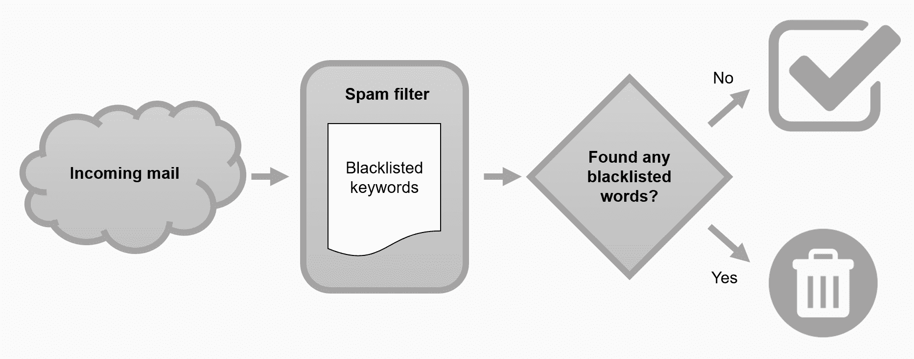
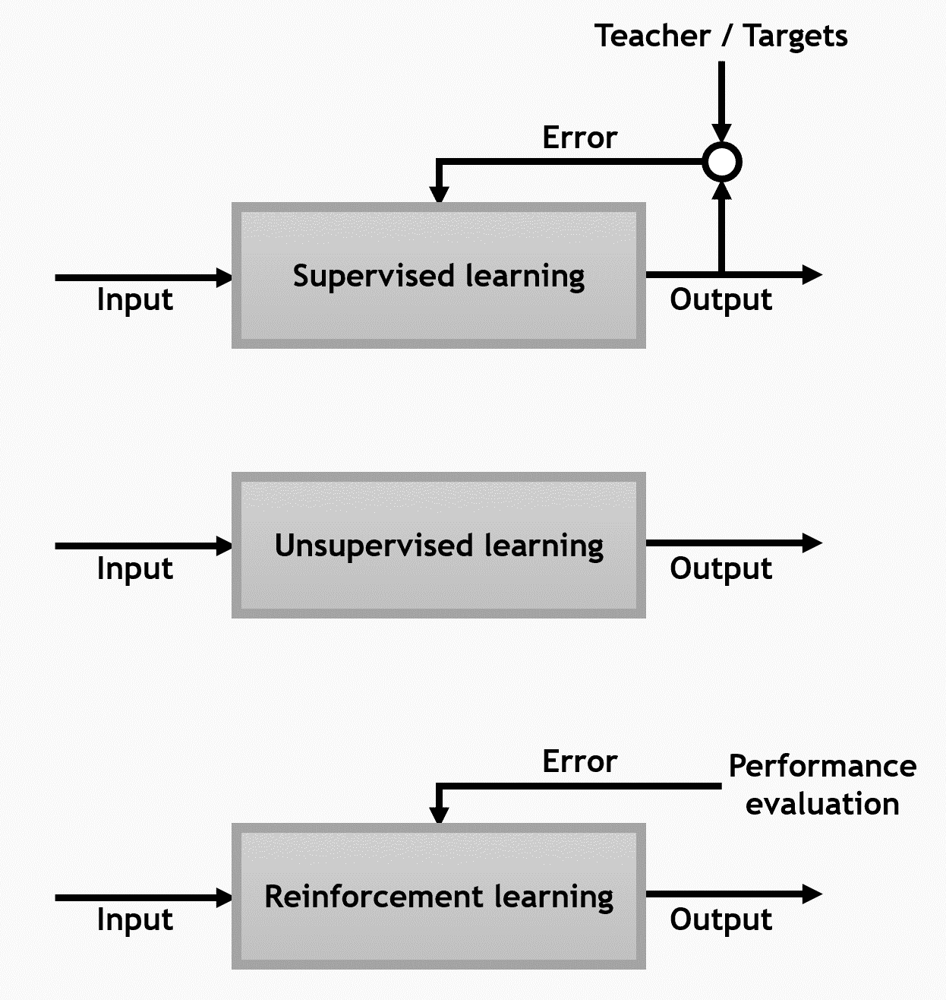

# 一、机器学习的风格

所以，你已经决定进入机器学习领域。太好了！

如今，机器学习无处不在——从保护我们的电子邮件，到在图片中自动标记我们的朋友，再到预测我们喜欢什么电影。机器学习作为人工智能的一种形式，使计算机能够通过经验进行学习；利用从过去收集的数据来预测未来。最重要的是，计算机视觉是当今机器学习最令人兴奋的应用领域之一，深度学习和卷积神经网络驱动着自动驾驶汽车和谷歌的 DeepMind 等创新系统。

然而，不要烦恼；您的应用程序不需要如此大规模或改变世界...

# 技术要求

可以通过以下链接查阅本章代码:[`github . com/PacktPublishing/Machine-Learning-for-OpenCV-Second-Edition/tree/master/chapter 01`](https://github.com/PacktPublishing/Machine-Learning-for-OpenCV-Second-Edition/tree/master/Chapter01)。

以下是软件和硬件要求的简短总结:

*   OpenCV 版本 4.1.x (4.1.0 或 4.1.1 都可以正常工作)。
*   Python 3.6 版本(任何 Python 3 . x 版本都可以)。
*   Anaconda Python 3，用于安装 Python 和所需的模块。
*   这本书可以使用任何操作系统——苹果操作系统、视窗操作系统和基于 Linux 的操作系统。我们建议您的系统中至少有 4 GB 内存。
*   运行本书提供的代码不需要 GPU。

# 机器学习入门

机器学习已经存在至少 60 年了。出于对人工智能的追求，早期的机器学习系统推断出`if...else`语句的手动编码规则来处理数据和做出决策。设想一个垃圾邮件过滤器，其工作是解析传入的电子邮件，并将不需要的邮件移动到垃圾邮件文件夹中，如下图所示:



我们可以想出一个单词黑名单，当它们出现在邮件中时，会将电子邮件标记为垃圾邮件。这是一个手工编码专家系统的简单例子。(我们将在第七章*中构建一个更智能的实施垃圾邮件...*

# 机器学习可以解决的问题

大多数机器学习问题属于以下三个主要类别之一:

*   在监督学习中，我们有一个数据点的标签。现在，这可以是图像中捕获的对象的类别、面部周围的边界框、图像中出现的数字或任何其他东西。把它想象成一个老师，他不仅教书，还告诉你问题的正确答案是什么。现在，学生可以尝试设计一个模型或方程，考虑所有的问题及其正确答案，并找出一个有(或没有)正确答案的问题的答案。进入模型学习的数据称为**训练数据**，测试过程/模型的数据称为**测试数据**。这些预测有两种风格，例如用正确的动物识别新照片(称为**分类** **问题**)或为其他二手车分配准确的销售价格(称为**回归** **问题**)。不要担心这是否有点超出你的理解范围——我们会用整本书来确定细节。

*   在无监督学习中，数据点没有关联的标签(第八章，*用*发现隐藏结构*无监督学习*)。把它想象成一堂课，老师给你一个混乱的谜题，让你自己去想该怎么做。在这里，最常见的结果是 **c** 光泽，其中包含具有相似特征的对象。它还会导致以不同的方式查看高维数据(复杂数据)，从而使其看起来更简单。
*   强化学习是关于在一个问题中获得最大回报。所以，如果老师每答对一个问题就给你一颗糖，每答错一个问题就惩罚你，那他/她就是在强化概念，让你增加收到糖果的次数，而不是让你受到惩罚的次数。

下图说明了这三个主要类别:



既然我们已经介绍了主要的机器学习类别，那么让我们回顾一下 Python 中的一些概念，这些概念在本书的旅程中将会非常有用。

# Python 入门

Python 已经成为许多数据科学和机器学习应用程序的通用语言，这要归功于它为数据加载、数据可视化、统计、图像处理和自然语言处理等过程提供的大量开源库。使用 Python 的主要优势之一是能够直接与代码交互，使用终端或其他工具，如 **Jupyter Notebook** ，我们将在稍后介绍。

如果你大部分时间都在结合 C++使用 OpenCV，我强烈建议你改用 Python，至少是为了学习这本书。这个决定不是出于恶意做出的！恰恰相反:我已经完成了相当一部分 C/C++编程——尤其是...

# OpenCV 入门

作为 OpenCV 的狂热用户，我相信你是，我可能不需要说服你 OpenCV 的力量。

OpenCV 旨在为计算机视觉应用程序提供通用基础设施，现已成为一套全面的经典和最先进的计算机视觉和机器学习算法。根据他们自己的文档，OpenCV 拥有超过 47，000 人的用户社区，下载量超过 700 万次。太令人印象深刻了！作为一个开源项目，研究人员、企业和政府机构很容易利用和修改已经可用的代码。

也就是说，作为最近机器学习热潮的一部分，出现了许多开源机器学习库，它们提供的功能比 OpenCV 多得多。一个突出的例子是 **scikit-learn** ，它提供了许多最先进的机器学习算法以及大量的在线教程和代码片段。由于 OpenCV 的开发主要是为了提供计算机视觉算法，其机器学习功能被限制在一个名为`ml`的模块中。正如我们将在本书中看到的，OpenCV 仍然提供了许多最先进的算法，但有时在功能上有点欠缺。在这些罕见的情况下，我们将简单地使用 scikit-learn 来达到我们的目的，而不是重新发明轮子。

最后但并非最不重要的一点是，使用 Python Anaconda 发行版安装 OpenCV 本质上是一个单行程序，我们将在下面的章节中看到。

If you are a more advanced user who wants to build real-time applications, OpenCV's algorithms are well-optimized for this task, and Python provides several ways to speed up computations where it is necessary (using, for example, **Cython** or parallel processing libraries such as **joblib** or **dask**).

# 装置

在开始之前，让我们确保已经安装了创建一个全面运行的数据科学环境所必需的所有工具和库。从 GitHub 下载本书的最新代码后，我们将安装以下软件:

*   Python 的 Anaconda 发行版，基于 Python 3.6 或更高版本
*   OpenCV 4.1
*   一些支持包

Don't feel like installing stuff? You can also visit [`mybinder.org/v2/gh/PacktPublishing/Machine-Learning-for-OpenCV-Second-Edition/master`](https://mybinder.org/v2/gh/PacktPublishing/Machine-Learning-for-OpenCV-Second-Edition/master), where you will find all the code for this book in an interactive, executable environment and 100% free and open source, thanks to the **Binder** project.

# 获取这本书的最新代码

你可以从 GitHub 获得这本书的最新代码:[`GitHub . com/PacktPublishing/机器学习 for OpenCV-第二版`](https://github.com/PacktPublishing/Machine-Learning-for-OpenCV-Second-Edition)。您可以下载一个`.zip`包(初学者)或者使用 Git(中间用户)克隆存储库。

Git is a version control system that allows you to track changes in files and collaborate with others on your code. In addition, the web platform GitHub makes it easy for people to share their code with you on a public server. As I make improvements to the code, you can easily update your local copy, file bug reports, or suggest code changes.

如果选择用 git 的话，第一步就是要确定安装了([`git-scm.com/downloads`](https://git-scm.com/downloads))。

然后，打开一个终端(或命令提示符，在窗口中称为):

*   在 Windows 10 上，右键单击开始菜单按钮，然后选择命令提示符。
*   在 macOS X 上，按 *Cmd* + *Space* 打开聚光灯搜索，然后输入`terminal`，点击*进入*。
*   在 Ubuntu、Linux/Unix 和朋友上，按 *Ctrl + Alt + T* 。在红帽上，右键单击桌面并从菜单中选择打开终端。

导航到要下载代码的目录:

```py
cd Desktop
```

然后，您可以通过键入以下内容来获取最新代码的本地副本:

```py
git clone https://github.com/PacktPublishing/Machine-Learning-for-OpenCV-Second-Edition.git
```

这将在名为`OpenCV-ML`的文件夹中下载最新的代码。

过一段时间，代码可能会在线更改。在这种情况下，您可以通过在`OpenCV-ML`目录中运行以下命令来更新您的本地副本:

```py
git pull origin master
```

# 掌握 Python 的 Anaconda 发行版

**Anaconda** 是 Continuum Analytics 为科学计算开发的免费 Python 发行版。它可以跨 Windows、Linux 和 macOS X 平台工作，并且是免费的，甚至可以用于商业用途。然而，它最好的一点是它附带了许多预安装的软件包，这些软件包对于数据科学、数学和工程来说是必不可少的。这些包包括以下内容:

*   **NumPy**:Python 中科学计算的基础包，为多维数组、高级数学函数和伪随机数生成器提供功能
*   **SciPy**:Python 中科学计算的函数集合，提供高级线性代数例程，...

# 在 conda 环境中安装 OpenCV

我们将执行以下步骤来安装 OpenCV:

1.  在终端中，导航到下载以下代码的目录:

```py
$ cd Desktop/OpenCV-ML
```

2.  然后，运行以下命令创建一个基于 Python 3.6 的 conda 环境，该环境还将一次性安装`environment.yml`文件(可在 GitHub 存储库中获得)中列出的所有必要的包:

```py
$ conda create env -f environment.yml
```

3.  你也可以看看下面的`environment.yml`文件:

```py
name: OpenCV-ML
channels:
  - conda-forge
dependencies:
  - python==3.6
  - numpy==1.15.4
  - scipy==1.1.0
  - scikit-learn==0.20.1
  - matplotlib
  - jupyter==1.0
  - notebook==5.7.4
  - pandas==0.23.4
  - theano
  - keras==2.2.4
  - mkl-service==1.1.2
  - pip
  - pip:
    - opencv-contrib-python==4.1.0.25
```

Notice that the environment's name will be `OpenCV-ML`. This code will use the `conda-forge` channel to download all the `conda` based dependencies and use `pip` to install `OpenCV 4.0 (along with opencv_contrib)`.

4.  要激活环境，请根据您的平台键入以下内容之一:

```py
$ source activate OpenCV-ML  # on Linux / Mac OS X
$ activate OpenCV-ML         # on Windows
```

5.  当我们关闭终端时，会话将被停用，因此下次我们打开新的终端时，必须再次运行最后一个命令。我们还可以手动关闭环境:

```py
$ source deactivate  # on Linux / Mac OS X
$ deactivate         # on Windows
```

完成了！让我们验证所有这些安装是否成功。

# 验证安装

仔细检查我们的安装是个好主意。当我们的终端仍然打开时，我们启动 IPython，这是一个运行 Python 命令的交互式外壳:

```py
$ ipython
```

接下来，确保您正在运行(至少)Python 3.6，而不是 Python 2.7。您可能会在 IPython 的欢迎消息中看到版本号。如果没有，您可以运行以下命令:

```py
In [1]: import sys...     print(sys.version)        3.6.0 | packaged by conda-forge | (default, Feb 9 2017, 14:36:55) [GCC 4.8.2 20140120 (Red Hat 4.8.2-15)]
```

现在尝试导入 OpenCV，如下所示:

```py
In [2]: import cv2
```

您应该不会收到错误消息。然后，尝试找出版本号，如下所示:

```py
In [3]: cv2.__version__Out[3]: '4.0.0'
```

确保 OpenCV 的版本...

# 了解 OpenCV 的 ml 模块

从 OpenCV 3.1 开始，OpenCV 中所有与机器学习相关的功能都被归入`ml`模块。对于 C++ API 来说，这种情况已经持续了很长时间。通过显示`ml`模块中的所有功能，您可以一窥接下来会发生什么:

```py
In [4]: dir(cv2.ml)
Out[4]: ['ANN_MLP_ANNEAL',
 'ANN_MLP_BACKPROP',
 'ANN_MLP_GAUSSIAN',
 'ANN_MLP_IDENTITY',
 'ANN_MLP_LEAKYRELU',
 'ANN_MLP_NO_INPUT_SCALE',
 'ANN_MLP_NO_OUTPUT_SCALE',
 ...
 '__spec__']
```

If you have installed an older version of OpenCV, the `ml` module might not be present. For example, the k-nearest neighbor algorithm (which we will talk about in Chapter 3, *First Steps in Supervised Learning)* used to be called `cv2.KNearest()` but is now called `cv2.ml.KNearest_create()`. In order to avoid confusion throughout the book, I recommend using OpenCV 4.0.

这一切都很好，但你现在会想为什么你甚至应该学习机器学习，以及它的应用是什么？让我们在下一节回答这个问题。

# 机器学习的应用

机器学习、人工智能、深度学习和数据科学是我认为将改变我们一直以来看待事物的方式的四个术语。让我们看看我是否能说服你我为什么这么相信。

从让计算机学习如何玩围棋并击败同一个游戏的世界冠军，到使用同一个分支仅仅通过观察一个人的大脑的电脑断层扫描来检测他是否有肿瘤，机器学习在每个领域都留下了印记。我参与的项目之一是利用机器学习来确定火电厂锅炉水冷壁管的剩余寿命周期。所提出的解决方案通过使用...

# OpenCV 4.0 有什么新功能？

所以，我们来到了第一章的最后一节。我将保持简短和中肯，因为你作为一个读者可以安全地跳过它。我们讨论的话题是 **OpenCV 4.0** 。

OpenCV 4.0 是 OpenCV 经过三年半的努力和 bug 修复的结果，最终在 2018 年 11 月发布。在本节中，我们将了解 OpenCV 4.0 中的一些主要变化和新功能:

*   随着 OpenCV 4.0 的发布，OpenCV 正式成为 C++11 库。这意味着当您试图编译 OpenCV 4.0 时，您必须确保系统中存在符合 C++11 的编译器。
*   延续上一点，删除了很多 C 语言的 API。受到影响的一些模块包括视频输入输出模块(`videoio`)、物体检测模块(`objdetect`)等。XML、YAML 和 JSON 的文件 IO 也删除了 C API。
*   OpenCV 4.0 在 DNN 模块(深度学习模块)中也有很多改进。增加了 ONNX 支持。**英特尔 OpenVINO** 也标志着其在全新 OpenCV 版本中的出现。我们将在后面的章节中更详细地探讨这个问题。
*   OpenCL 加速已经在 AMD 和 NVIDIA GPUs 上修复。
*   还增加了 OpenCV Graph API，这是一个高效的图像处理和其他操作的引擎。
*   正如在每一个 OpenCV 版本中一样，为了提高性能，有很多变化。还增加了一些新功能，如二维码检测和解码。

简而言之，OpenCV 4.0 有很多变化，它们有自己的用途。例如，ONNX 支持有助于模型跨各种语言和框架的可移植性，OpenCL 减少了计算机视觉应用程序的运行时间，Graph API 有助于提高应用程序的效率，OpenVINO 工具包使用英特尔的处理器和模型动物园来提供高效的深度学习模型。在后面的章节中，我们将主要关注 OpenVINO 工具包和 DLDT 以及加速计算机视觉应用。但是，我也应该在这里指出，OpenCV 3.4.4 和 OpenCV 4.0.0 都在高速修改以修复 bug。因此，如果您打算在任何应用程序中使用它们中的任何一个，请准备好修改您的代码和安装，以纳入所做的更改。同样，OpenCV 4.0.1 和 OpenCV 3.4.5 也是在前几个月内推出的。

# 摘要

在这一章中，我们在高抽象层次上讨论了机器学习:它是什么，为什么它很重要，以及它能解决什么样的问题。我们了解到机器学习问题有三种形式:监督学习、无监督学习和强化学习。我们谈到了监督学习的突出性，认为这个领域可以进一步分为两个子领域:分类和回归。分类模型允许我们将对象分类为已知的类别(例如将动物分类为猫和狗)，而回归分析可用于预测目标变量的连续结果(例如二手车的销售价格)。

我们还学习了如何使用建立数据科学环境...