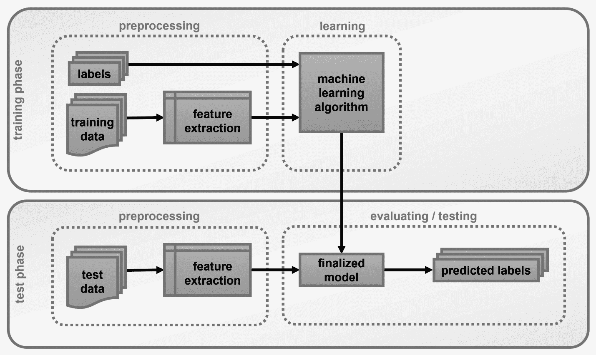
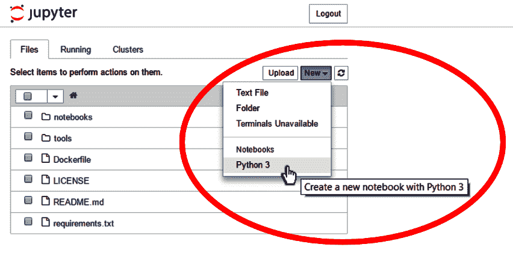
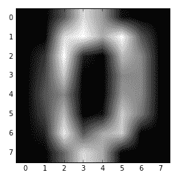
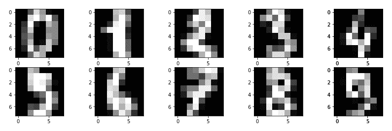

# 二、在 OpenCV 中处理数据

既然我们已经激起了对机器学习的兴趣，现在是时候深入研究构成典型机器学习系统的不同部分了。

太多时候，你会听到有人抛出这样一句话， *J* *必须将机器学习应用到你的数据中！*，好像那会瞬间解决你所有的问题。你可以想象这种情况的现实要复杂得多，尽管，我会承认，如今，仅仅通过从互联网上剪切和粘贴几行代码，就可以非常容易地构建自己的机器学习系统。然而，要建立一个真正强大和有效的系统，必须牢牢掌握基本概念，并深入了解每种方法的优缺点。所以，如果你还不认为自己是机器学习专家，不要担心。好事需要时间。

早些时候，我将机器学习描述为人工智能的一个子领域。这可能是真的——主要是出于历史原因——但大多数情况下，机器学习只是为了理解数据。因此，将机器学习视为数据科学的一个分支可能更合适，在这个分支中，我们构建数学模型来帮助我们理解数据。

因此，这一章是关于数据的。我们想学习数据如何与机器学习相适应，以及如何使用我们选择的工具来处理数据:OpenCV 和 Python。

在本章中，我们将涵盖以下主题:

*   了解机器学习工作流程
*   了解培训数据和测试数据
*   学习如何使用 OpenCV 和 Python 加载、存储、编辑和可视化数据

# 技术要求

可以从以下链接查阅本章代码:[`github . com/PacktPublishing/Machine-Learning-for-OpenCV-Second-Edition/tree/master/chapter 02`](https://github.com/PacktPublishing/Machine-Learning-for-OpenCV-Second-Edition/tree/master/Chapter02)。

以下是软件和硬件要求的总结:

*   您将需要 OpenCV 版本 4.1.x (4.1.0 或 4.1.1 都可以)。
*   您将需要 Python 3.6 版本(任何 Python 3 . x 版本都可以)。
*   您将需要 Anaconda Python 3 来安装 Python 和所需的模块。
*   除了这本书，你可以使用任何操作系统——苹果操作系统、视窗操作系统和基于 Linux 的操作系统。我们建议您的系统中至少有 4 GB 内存。
*   你不需要一个图形处理器来运行本书提供的代码。

# 了解机器学习工作流程

如前所述，机器学习就是建立数学模型来理解数据。当我们赋予机器学习模型调整其**内部参数**的能力时，学习方面就进入了这个过程；我们可以调整这些参数，以便模型更好地解释数据。从某种意义上说，这可以理解为模型从数据中学习。一旦模型学到了足够的东西——无论这意味着什么——我们就可以要求它解释新观察到的数据。

下图说明了一个典型的分类过程:



让我们一步一步地分解它。

首先要注意的是，机器学习问题总是被分成(至少)两个不同的阶段:

*   一个**训练阶段**，在此期间我们的目标是在一组我们称之为**训练数据集**的数据上训练一个机器学习模型
*   测试阶段，在此期间，我们在一组从未见过的新数据上评估所学习的(或最终确定的)机器学习模型，我们称之为**测试数据集**

将我们的数据分成训练集和测试集的重要性不可低估。我们总是在一个独立的测试集上评估我们的模型，因为我们有兴趣知道我们的模型**对新数据**的概括程度。最后，这不就是学习的全部吗——无论是机器学习还是人类学习？回想一下你自己还是学生时的学校:作为家庭作业的一部分，你必须解决的问题永远不会在期末考试中以完全相同的形式出现。同样的审查应该适用于机器学习模型；我们对我们的模型能多好地记住一组数据点(比如一个家庭作业问题)不太感兴趣，但我们想知道我们的模型将如何利用他们所学的知识来解决新问题(比如期末考试中出现的问题)并解释新的数据点。

The workflow of an advanced machine learning problem will typically include a third set of data termed a **validation dataset**. For now, this distinction is not important. A validation set is typically formed by further partitioning the training dataset. It is used in advanced concepts such as model selection, which we will talk about in Chapter 11, *Selecting the Right Model with Hyperparameter Tuning*, when we have become proficient in building machine learning systems.

接下来要注意的是，机器学习实际上是关于**数据**的。数据以原始形式进入前面描述的工作流图——无论这意味着什么——并在培训和测试阶段使用。数据可以是任何东西，从图像和电影到文本文档和音频文件。因此，在其原始形式中，数据可能由像素、字母、单词组成，甚至更糟:纯比特。很容易看出，这种原始形式的数据可能不太方便处理。相反，我们必须找到方法**预处理**数据，使其成为易于**解析或使用数据**的形式。

数据预处理分为两个阶段:

*   **特征选择**:这是识别数据中重要属性(或特征)的过程。图像的可能特征可能是边缘、角或脊的位置。您可能已经熟悉 OpenCV 提供的一些更高级的特征描述符，例如**加速健壮特征** ( **SURF** )或**方向梯度直方图** ( **HOG** )。尽管这些特性可以应用于任何图像，但对于我们的特定任务来说，它们可能并不那么重要(或工作得那么好)。例如，如果我们的任务是区分干净的水和脏的水，最重要的特征可能是水的颜色，SURF 或 HOG 特征的使用可能对我们没有太大帮助。
*   **特征提取**:这是将原始数据转化为期望的**特征空间**的实际过程。一个例子是**哈里斯算子**，它允许我们提取图像中的角点(也就是一个选定的特征)。

一个更高级的话题是发明信息特征的过程，这被称为**特征工程**。毕竟，在人们能够从流行的功能中进行选择之前，必须有人先发明它们。这对于我们算法的成功往往比算法本身的选择更重要。我们将在第四章、*中详细讨论特征工程，代表数据和工程特征*。

Don't let naming **conventions** confuse you! Sometimes, feature selection and feature extraction are hard to distinguish, mainly because of how things are named. For example, SURF stands for both the feature extractor as well as the actual name of the features. The same is true for the **S****cale-Invariant Feature Transform** (**SIFT**), which is a feature extractor that yields what is known as **SIFT** **features**. Unfortunately, both the algorithms are patented and cannot be used for commercial purposes. We won't be sharing any code about either algorithms. 

最后要说明的一点是，在监督学习中，每个数据点都必须有一个**标签**。标签标识属于某一类事物(如猫或狗)或具有某一价值(如房价)的数据点。说到底，有监督的机器学习系统的目标是预测测试集中所有数据点的标签(如上图所示)。我们通过学习训练数据中的规律性，使用随之而来的标签，然后在测试集上测试我们的性能来做到这一点。

因此，要构建一个运行良好的机器学习系统，我们首先必须涵盖如何加载、存储和操作数据。用 Python 在 OpenCV 中你是怎么做到的？

# 用 OpenCV 和 Python 处理数据

数据世界充满了各种各样的数据类型。这有时会使用户很难区分用于特定值的数据类型。在这里，我们将尝试通过将除标量值之外的所有内容都视为数组来保持简单，标量值将保留其标准数据类型。因此，图像将成为 2D 阵列，因为它们有宽度和高度。1D 阵列可以是强度随时间变化的声音片段。

如果你大部分时间都在使用 OpenCV 的 C++ **应用程序编程接口** ( **API** )并计划继续这样做，你可能会发现用 C++处理数据会有点痛苦。不仅要处理...

# 开始新的 IPython 或 Jupyter 会话

在我们拿到 NumPy 之前，我们需要打开一个 IPython 外壳或启动一个 Jupyter 笔记本:

1.  像我们在上一章中所做的那样打开一个终端，并导航到`OpenCV-ML`目录:

```py
 $ cd Desktop/OpenCV-ML
```

2.  激活我们在上一章中创建的`conda`环境:

```py
 $ source activate OpenCV-ML  # Mac OS X / Linux
 $ activate OpenCV-ML         # Windows
```

3.  开始新的 IPython 或 Jupyter 会话:

```py
 $ ipython           # for an IPython session
      $ jupyter notebook  # for a Jupyter session
```

如果您选择启动 IPython 会话，程序应该会向您发送如下欢迎消息:

```py
$ ipython
Python 3.6.0 | packaged by conda-forge | (default, Feb 9 2017, 14:36:55) 
Type 'copyright', 'credits' or 'license' for more information
IPython 7.2.0 -- An enhanced Interactive Python. Type '?' for help.

In [1]: 
```

以`In [1]`开始的一行是您键入常规 Python 命令的地方。此外，您还可以在键入变量和函数的名称时使用*选项卡*键，让 IPython 自动完成它们。

A limited number of Unix and macOS system shell commands work too—such as `ls` and `pwd`. You can run any shell command by prefixing it with `!`, such as `!ping www.github.com`. For more information, check out the official IPython reference at [`ipython.org/ipython-doc/3/interactive/tutorial.html`](https://ipython.org/ipython-doc/3/interactive/tutorial.html).

如果您选择启动 Jupyter 会话，您的网络浏览器中应该会打开一个指向`http://localhost:8888`的新窗口。要创建新笔记本，请单击右上角的新建，然后选择笔记本(Python 3):



这将打开一个新窗口，如下所示:


标有`In [ ]`的单元格(看起来像前面的文本框)与 IPython 会话中的命令行相同。现在你可以开始输入你的 Python 代码了！

# 使用 Python 的 NumPy 包处理数据

如果您安装了 Anaconda，我假设您的虚拟环境中已经安装了 NumPy。如果您使用了 Python 的标准发行版或任何其他发行版，您可以前往[`www.numpy.org`](http://www.numpy.org)并按照那里提供的安装说明进行操作。

如前所述，如果你还不是 Python 专家，也没关系。谁知道呢，也许你刚刚从 OpenCV 的 C++ API 切换过来。这一切都很好。我想给大家简单介绍一下如何开始使用 NumPy。如果您是更高级的 Python 用户，您可以跳过这一部分。

一旦您熟悉了 NumPy，您会发现 Python 世界中的大多数科学计算工具都是围绕它构建的...

# 正在导入 NumPy

启动新的 IPython 或 Jupyter 会话后，您可以导入 NumPy 模块并验证其版本，如下所示:

```py
In [1]: import numpy
In [2]: numpy.__version__
Out[2]: '1.15.4'
```

Recall that in the Jupyter Notebook, you can hit *Ctrl* + *Enter* to execute a cell once you have typed the command. Alternatively, *Shift* + *Enter* executes the cell and automatically inserts or selects the cell below it. Check out all of the keyboard shortcuts by clicking on Help | Keyboard Shortcut or take a quick tour by clicking on Help | User Interface Tour.

对于这里讨论的软件包部分，我建议使用 NumPy 版或更高版本。按照惯例，你会发现科学 Python 世界的大多数人都会使用`np`作为别名导入 NumPy:

```py
In [3]: import numpy as np
In [4]: np.__version__
Out[4]: '1.15.4'
```

在本章和本书的其余部分，我们将坚持同样的惯例。

# 理解 NumPy 数组

你可能已经知道 Python 是一种弱类型语言。这意味着无论何时创建新变量，都不必指定数据类型。例如，以下内容将自动表示为整数:

```py
In [5]: a = 5
```

您可以通过键入以下内容来再次检查:

```py
In [6]: type(a)Out[6]: int
```

As the standard Python implementation is written in C, every Python object is basically a C structure in disguise. This is true even for integers in Python, which are actually pointers to compound C structures that contain more than just the **raw** integer value. Therefore, the default C data type used to represent Python integers will depend on your system architecture (that is, whether it is a 32-bit ...

# 通过索引访问单个数组元素

如果您以前使用过 Python 的标准列表索引，那么您将不会在 NumPy 中发现许多索引问题。在 1D 数组中，可以通过在方括号中指定所需的索引来访问第*I*<sup>值(从零开始计算)，就像 Python 列表一样:</sup>

```py
In [13]: int_arr
Out[13]: array([0, 1, 2, 3, 4, 5, 6, 7, 8, 9])
In [14]: int_arr[0]
Out[14]: 0
In [15]: int_arr[3]
Out[15]: 3
```

要从数组末尾开始索引，可以使用负索引:

```py
In [16]: int_arr[-1]
Out[16]: 9
In [17]: int_arr[-2]
Out[17]: 8
```

**切片数组**还有其他一些很酷的技巧，如下所示:

```py
In [18]: int_arr[2:5]  # from index 2 up to index 5 - 1
Out[18]: array([2, 3, 4])
In [19]: int_arr[:5]    # from the beginning up to index 5 - 1
Out[19]: array([0, 1, 2, 3, 4])
In [20]: int_arr[5:]    # from index 5 up to the end of the array
Out[20]: array([5, 6, 7, 8, 9])
In [21]: int_arr[::2]   # every other element
Out[21]: array([0, 2, 4, 6, 8])
In [22]: int_arr[::-1]  # the entire array in reverse order
Out[22]: array([9, 8, 7, 6, 5, 4, 3, 2, 1, 0])
```

我鼓励你自己玩这些阵列！

The general form of slicing arrays in NumPy is the same as it is for standard Python lists. To access a slice of an array, `x`, use `x[start:stop:step]`. If any of these are unspecified, they default to the `start=0`, `stop=size of dimension`, `step=1` values. 

# 创建多维数组

数组不必局限于列表。事实上，它们可以有任意数量的维度。在机器学习中，我们通常至少处理 2D 数组，其中列索引代表特定特征的值，行包含实际的特征值。

有了 NumPy，从头开始创建多维数组就很容易了。假设我们要创建一个三行五列的数组，所有元素都初始化为零。如果我们不指定数据类型，NumPy 将默认使用浮点:

```py
In [23]: arr_2d = np.zeros((3, 5))...      arr_2dOut[23]: array([[0., 0., 0., 0., 0.],                [0., 0., 0., 0., 0.],                [0., 0., 0., 0., 0.]])
```

你可能从你的 OpenCV 时代就知道这一点...

# 在 Python 中加载外部数据集

感谢 SciPy 社区，有很多资源可以让我们获得一些数据。

一个特别有用的资源是 **scikit-learn** 的`sklearn.datasets`包。这个包预装了一些小数据集，不需要我们从外部网站下载任何文件。这些数据集包括以下内容:

*   `load_boston`:波士顿数据集包含波士顿不同郊区的房价，以及几个有趣的特征，如城镇人均犯罪率、住宅用地比例和非零售商业数量
*   `load_iris`:鸢尾数据集包含三种不同类型的鸢尾花(濑户鸢尾、云芝和弗吉尼亚鸢尾)，以及描述萼片和花瓣的宽度和长度的四个特征
*   `load_diabetes`:糖尿病数据集让我们可以根据患者年龄、性别、体重指数、平均血压和六项血清指标等特征，将患者分为糖尿病患者和非糖尿病患者
*   `load_digits`:数字数据集包含数字 *0-9* 的 8×8 像素图像
*   `load_linnerud`:Linnerud 数据集包含 3 个生理变量和 3 个运动变量，在健身俱乐部对 20 名中年男性进行了测量

此外，scikit-learn 允许我们直接从外部存储库下载数据集，例如:

*   `fetch_olivetti_faces`:Olivetti 人脸数据集包含 10 幅不同的图像，每幅图像包含 40 个不同的对象
*   `fetch_20newsgroups`:20 个新闻组数据集包含大约 18，000 个新闻组帖子，涉及 20 个主题

更好的是，可以在[`openml.org`](http://mldata.org)直接从机器学习数据库下载数据集。例如，要下载鸢尾花数据集，只需键入以下内容:

```py
In [1]: from sklearn import datasets
In [2]: iris = datasets.fetch_openml('iris', version=1)
In [3]: iris_data = iris['data']
In [4]: iris_target = iris['target']
```

鸢尾花数据库包含总共具有`4`特征的`150`样品——萼片长度、萼片宽度、花瓣长度和花瓣宽度。数据分为三类——濑户鸢尾、彩叶鸢尾和北美鸢尾。数据和标签在两个独立的容器中交付，我们可以按如下方式进行检查:

```py
In [5]: iris_data.shape 
Out[5]: (150, 4)
In [6]: iris_target.shape 
Out[6]: (150,)
```

在这里，我们可以看到`iris_data`包含`150`个样本，每个样本都有`4`特征(这就是为什么数字 4 在形状中)。标签储存在`iris_target`中，每个样品只有一个标签。

我们可以进一步检查所有目标的值，但我们不想只打印它们。相反，我们有兴趣看到所有不同的目标值，这在 NumPy 中很容易做到:

```py
In [7]: import numpy as np
In [8]: np.unique(iris_target) # Find all unique elements in array
Out[8]: array(['Iris-setosa', 'Iris-versicolor', 'Iris-virginica'], dtype=object)
```

Another Python library for data analysis that you should have heard about is **pandas** ([`pandas.pydata.org`](http://pandas.pydata.org)). pandas implements several powerful data operations for both databases and spreadsheets. However great the library, at this point, pandas is a bit too advanced for our purposes.

# 使用 Matplotlib 可视化数据

如果我们不知道如何查看数据，那么知道如何加载数据的用处有限。谢天谢地，有 **Matplotlib** ！

Matplotlib 是一个建立在 NumPy 数组上的多平台数据可视化库——看，我向你保证 NumPy 会再次出现。它是由约翰·亨特在 2002 年构思的，最初是作为 IPython 的补丁设计的，以便能够从命令行进行交互式 MATLAB 风格的绘图。近年来，更新、更闪亮的工具不断涌现，最终取代了 Matplotlib(如 R 语言中的`ggplot`和`ggvis`)，但 Matplotlib 作为一个久经考验的跨平台图形引擎仍然至关重要。

# 正在导入 Matplotlib

你可能又走运了:如果你遵循上一章中概述的建议，安装了 Python Anaconda 堆栈，那么你已经安装了 Matplotlib，并准备好了。否则，您可能需要访问[`matplotlib.org`](http://matplotlib.org/)了解安装说明。

就像我们使用 NumPy 的`np`简写一样，我们将使用 Matplotlib 导入的一些标准简写:

```py
In [1]: import matplotlib as mpl
In [2]: import matplotlib.pyplot as plt
```

`plt`界面是我们最常使用的，我们将在本书中看到。

# 制作一个简单的情节

不用多说，让我们创建我们的第一个情节。

假设我们想要产生正弦函数的简单线图`sin(x)`。我们希望在 *x* 轴上的所有点对函数进行评估，其中`0 < x < 10`。我们将使用 NumPy 的`linspace`功能在 *x* 轴上创建一个线性间距，从`x`值`0`到`10`，总共有`100`个采样点:

```py
In [3]: import numpy as npIn [4]: x = np.linspace(0, 10, 100)
```

我们可以使用 NumPy 的`sin`函数在所有点`x`评估`sin`函数，并通过调用`plt`的`plot`函数来可视化结果:

```py
In [5]: plt.plot(x, np.sin(x))
```

你自己试过吗？发生了什么事？有什么发现吗？

问题是，根据您运行该脚本的位置，您可能不会...

# 可视化外部数据集中的数据

作为本章的最后一个测试，让我们可视化一些来自外部数据集的数据，例如 scikit-learn 的`digits`数据集。

具体来说，我们需要三种可视化工具:

*   sci kit-了解实际数据
*   用于数据处理的数字
*   Matplotlib

所以，让我们从导入所有这些开始:

```py
In [1]: import numpy as np
...     from sklearn import datasets
...     import matplotlib.pyplot as plt
...     %matplotlib inline
```

第一步是实际加载数据:

```py
In [2]: digits = datasets.load_digits()
```

如果我们没记错的话，`digits`应该有两个不同的字段:包含实际图像数据的`data`字段和包含图像标签的`target`字段。与其相信我们的记忆，我们应该简单地调查`digits`对象。我们通过键入它的名称，添加一个句点，然后点击*选项卡*键:`digits.<TAB>`来实现。这将揭示`digits`对象还包含一些其他字段，例如名为`images`的字段。`images`和`data`这两个字段似乎只是形状不同:

```py
In [3]: print(digits.data.shape)
... print(digits.images.shape)
Out[3]: (1797, 64)
 (1797, 8, 8)
```

在这两种情况下，第一维对应于数据集中的图像数量。然而，`data`将所有像素排列在一个大向量中，而`images`保留了每个图像的 8×8 空间排列。

因此，如果我们想要绘制单个图像，则`images`字段会更合适。首先，我们使用 NumPy 的数组切片从数据集中获取单个图像:

```py
In [4]: img = digits.images[0, :, :]
```

这里，我们说我们想要抓取 1，797 项长数组中的第一行和所有对应的 *8 x 8 = 64* 像素。然后，我们可以使用`plt`的`imshow`功能绘制图像:

```py
In [5]: plt.imshow(img, cmap='gray') 
...     plt.savefig('figures/02.04-digit0.png') 
Out[5]: <matplotlib.image.AxesImage at 0x7efcd27f30f0>
```

前面的命令给出了以下输出。请注意，图像是模糊的，因为我们已经将它调整到更大的尺寸。原始图像的大小仅为 8 x 8:



此外，我还用`cmap`参数指定了一个颜色图。默认情况下，Matplotlib 使用 MATLAB 的默认颜色图 **jet** 。然而，在灰度图像的情况下，**灰色**彩色图更有意义。

最后，我们可以使用`plt`的`subplot`功能绘制整数个数字样本。`subplot`函数与 MATLAB 中的相同，我们指定行数、列数和当前子图索引(从`1`开始计数)。我们将使用`for`循环迭代数据集中的前 10 个图像，每个图像都被分配了自己的子情节:

```py
In [6]: plt.figure(figsize=(14,4))
...
...     for image_index in range(10):
...         # images are 0-indexed, but subplots are 1-indexed
...         subplot_index = image_index + 1
...         plt.subplot(2, 5, subplot_index)
...         plt.imshow(digits.images[image_index, :, :], cmap='gray')
```

这将导致以下输出:



Another great resource for all sorts of datasets is the machine learning repository of my alma mater, the University of California, Irvine: [`archive.ics.uci.edu/ml/index.php`](http://archive.ics.uci.edu/ml/index.php).

# 用 C++中 OpenCV 的 TrainData 容器处理数据

为了完整起见，对于坚持使用 OpenCV 的 C++ API 的人来说，让我们在 OpenCV 的`TrainData`容器上做一个快速的迂回，它允许我们从`.csv`文件加载数值数据。

除此之外，在 C++中，`ml`模块包含一个名为`TrainData`的类，它提供了一个在 C++中处理数据的容器。其功能仅限于从`.csv`文件(包含逗号分隔值)中读取(最好是)数字数据。因此，如果您想要处理的数据是以一个组织整齐的`.csv`文件的形式出现的，那么这个类将为您节省大量时间。如果你的数据来自不同的来源，恐怕你最好的选择可能是手工创建一个`.csv`文件，使用...

# 摘要

在本章中，我们讨论了处理机器学习问题的典型工作流:如何从原始数据中提取信息特征，如何使用数据和标签来训练机器学习模型，以及如何使用最终确定的模型来预测新的数据标签。我们了解到，将数据拆分为训练集和测试集是非常重要的，因为这是了解模型对新数据点的泛化能力的唯一方法。

在软件方面，我们显著提高了 Python 技能。我们学习了如何使用 NumPy 数组存储和操作数据，以及如何使用 Matplotlib 进行数据可视化。我们讨论了 scikit-learn 及其许多有用的数据资源。最后，我们还讨论了 OpenCV 自己的`TrainData`容器，它为 OpenCV 的 C++ API 的用户提供了一些缓解。

有了这些工具，我们现在准备实现我们的第一个真正的机器学习模型！在下一章中，我们将重点讨论监督学习及其两个主要问题类别，分类和回归。