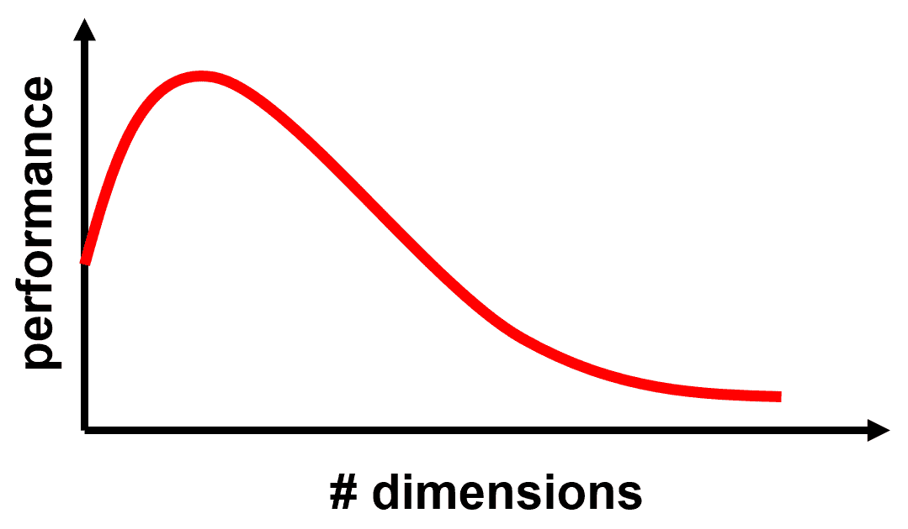
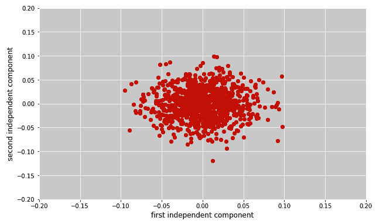
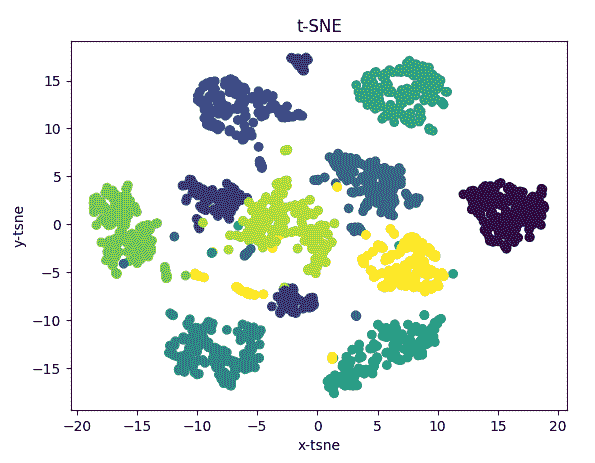
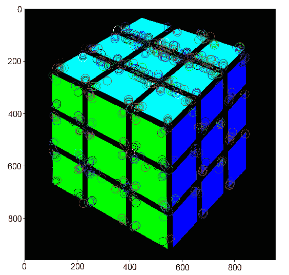

# 四、表示数据和工程特征

在最后一章中，我们构建了第一个监督学习模型，并将其应用于一些经典数据集，如 **Iris** 和 **Boston** 数据集。然而，在现实世界中，数据很少出现在一个整洁的`<n_samples x n_features>` **特征矩阵**中，该矩阵是预打包数据库的一部分。相反，我们有责任找到一种以有意义的方式表示数据的方法。寻找表示我们数据的最佳方式的过程被称为**特征工程**，它是数据科学家和机器学习从业者试图解决现实世界问题的主要任务之一。

我知道你宁愿直接跳到最后，建立人类有史以来最深的神经网络。...

# 技术要求

可以从以下链接查阅本章代码:[`github . com/PacktPublishing/Machine-Learning-for-OpenCV-Second-Edition/tree/master/chapter 04`](https://github.com/PacktPublishing/Machine-Learning-for-OpenCV-Second-Edition/tree/master/Chapter04)。

以下是软件和硬件要求的总结:

*   您将需要 OpenCV 版本 4.1.x (4.1.0 或 4.1.1 都可以)。
*   您将需要 Python 3.6 版本(任何 Python 3 . x 版本都可以)。
*   您将需要 Anaconda Python 3 来安装 Python 和所需的模块。
*   除了这本书，你可以使用任何操作系统——苹果操作系统、视窗操作系统和基于 Linux 的操作系统。我们建议您的系统中至少有 4 GB 内存。
*   你不需要一个图形处理器来运行本书提供的代码。

# 理解特征工程

信不信由你，一个机器学习系统学习的好坏主要取决于训练数据的质量。尽管每种学习算法都有其优缺点，但性能的差异往往归结于数据的准备或表示方式。因此，特征工程可以理解为**数据表示**的工具。机器学习算法试图从样本数据中学习一个问题的解决方案，而特征工程会问:样本数据的最佳表示是什么，用来学习问题的解决方案？

记住，前几章，我们讨论了整个机器学习管道。在这里，我们已经提到了特征提取，但是我们...

# 预处理数据

我们在处理数据时越有纪律性，最终可能会取得更好的结果。这个过程的第一步被称为**数据预处理**，它有(至少)三种不同的味道:

*   **数据格式化**:数据可能不是适合我们工作的格式；例如，数据可能以专有文件格式提供，而我们最喜欢的机器学习算法不理解这一点。

*   **数据清理**:数据可能包含无效或缺失的条目，需要清理或删除。

*   **数据采样**:数据对于我们的特定目的来说可能太大了，迫使我们对数据进行智能采样。

一旦对数据进行了预处理，我们就为实际的特征工程做好了准备:对预处理后的数据进行转换，以适合我们特定的机器学习算法。该步骤通常涉及三个可能程序中的一个或多个:

*   **缩放**:某些机器学习算法往往要求数据在一个共同的范围内，比如均值和单位方差为零。缩放是将所有要素(可能具有不同的物理单位)纳入一个共同的值范围的过程。
*   **分解**:数据集的特征通常比我们可能处理的要多得多。特征分解是将数据压缩成少量信息量大的数据成分的过程。
*   **聚合**:有时候，可以将多个特征组合成一个单一的、更有意义的特征。例如，数据库可能包含登录到基于网络的系统的每个用户的日期和时间。根据任务的不同，简单地计算每个用户的登录次数可以更好地表示这些数据。

让我们更详细地看看其中的一些过程。

# 标准化特征

**标准化**是指对数据进行缩放，使其均值和单位方差为零的过程。这是对各种机器学习算法的共同要求，如果单个特征不能满足这一要求，机器学习算法可能会表现不佳。我们可以通过从每个数据点减去所有数据的平均值( *μ* )并除以数据的方差( *σ* )来手动标准化我们的数据；也就是说，对于每个特征 *x* ，我们会计算 *(x - μ) / σ* 。

或者，scikit-learn 在其`preprocessing`模块中提供了这一过程的简单实现。

让我们考虑一个 3×3 的数据矩阵，`X`，代表三个数据点(行)，每个数据点(行)有三个任意选择的特征值(列):...

# 标准化特征

与标准化类似，标准化是缩放单个样本以获得单位范数的过程。我相信你知道范数代表向量的长度，可以用不同的方式定义。我们在前一章讨论了其中的两个:L1 范数(或曼哈顿距离)和 L2 范数(或欧几里德距离)。

在 scikit-learn 中，我们的数据矩阵`X`可以使用`normalize`函数进行归一化，而`l1`范数由`norm`关键字指定:

```py
In [5]: X_normalized_l1 = preprocessing.normalize(X, norm='l1')
...     X_normalized_l1
Out[5]: array([[ 0.2, -0.4, 0.4],
               [ 1\. , 0\. , 0\. ],
               [ 0\. , 0.5, -0.5]])
```

类似地，可以通过指定`norm='l2'`来计算 L2 范数:

```py
In [6]: X_normalized_l2 = preprocessing.normalize(X, norm='l2')
...     X_normalized_l2
Out[6]: array([[ 0.33333333, -0.66666667, 0.66666667],
               [ 1\. , 0\. , 0\. ],
               [ 0\. , 0.70710678, -0.70710678]])
```

# 将要素缩放到一个范围

将要素缩放至零均值和单位方差的替代方法是让要素位于给定的最小值和最大值之间。通常，这些值是 0 和 1，因此每个特征的最大绝对值都按单位大小进行缩放。在 scikit-learn 中，这可以通过使用`MinMaxScaler`来实现:

```py
In [7]: min_max_scaler = preprocessing.MinMaxScaler()...     X_min_max = min_max_scaler.fit_transform(X)...     X_min_maxOut[7]: array([[ 0.33333333, 0\. , 1\. ],               [ 1\. , 0.66666667, 0.33333333],               [ 0\. , 1\. , 0\. ]])
```

默认情况下，数据将被缩放到 0 和 1 之间。我们可以通过向`MinMaxScaler`构造函数传递关键字参数`feature_range`来指定不同的范围:

```py
In [8]: min_max_scaler = preprocessing.MinMaxScaler(feature_range ...
```

# 二值化特征

最后，我们可能会发现自己不太关心数据的确切特征值。相反，我们可能只想知道某个特性是存在还是不存在。二值化数据可以通过阈值化特征值来实现。让我们快速提醒自己我们的特征矩阵，`X`:

```py
In [9]: X
Out[9]: array([[ 1., -2., 2.],
               [ 3., 0., 0.],
               [ 0., 1., -1.]])
```

让我们假设这些数字代表我们银行账户中的数千美元。如果账户中有超过 0.5 千美元，我们认为这个人富有，我们用 1 表示。否则，我们放一个 0。这类似于用`threshold=0.5`设定数据的阈值:

```py
In [10]: binarizer = preprocessing.Binarizer(threshold=0.5)
...      X_binarized = binarizer.transform(X)
...      X_binarized
Out[10]: array([[ 1., 0., 1.],
                [ 1., 0., 0.],
                [ 0., 1., 0.]])
```

结果是一个完全由 1 和 0 组成的矩阵。

# 处理丢失的数据

特征工程中的另一个常见需求是缺失数据的处理。例如，我们可能有一个如下所示的数据集:

```py
In [11]: from numpy import nan...      X = np.array([[ nan, 0,   3 ],...                    [ 2,   9,  -8 ],...                    [ 1,   nan, 1 ],...                    [ 5,   2,   4 ],...                    [ 7,   6,  -3 ]])
```

大多数机器学习算法无法处理**非数字** ( **NAN** )值(【Python 中的 )。相反，我们首先必须用一些适当的填充值替换所有的`nan`值。这被称为缺失值的**插补**。

scikit-learn 提供了三种不同的估算缺失值的策略:

*   `mean`:用沿矩阵指定轴的平均值替换所有`nan`值(默认:*轴= 0* )
*   `median`:替换全部...

# 理解降维

数据集通常具有比我们可能处理的更多的特征。例如，假设我们的工作是预测一个国家的贫困率。我们可能会从匹配一个国家的名字和它的贫困率开始，但这不会帮助我们预测一个新国家的贫困率。所以，我们开始思考贫困的可能原因。但是贫困的可能原因有多少呢？因素可能包括一个国家的经济、缺乏教育、高离婚率、人口过剩等等。如果这些原因中的每一个都是用来帮助预测贫困率的特征，那么我们最终会得到无数个特征。如果你是数学家，你可能会把这些特征看作是高维空间中的轴，然后每个国家的贫困率就是这个高维空间中的一个点。

如果你不是数学家，从小处着手可能会有帮助。假设，我们首先只看两个特征:一个国家的**国内生产总值** ( **GDP** )和公民数量。在 2D 的空间里，我们把 GDP 解释为 *x 轴*，把公民人数解释为 *y 轴*。然后，我们看第一个国家。它的国内生产总值很小，公民人数也很平均。我们在 *x-y* 平面上画一个点，代表这个国家。我们添加了第二、第三和第四个国家。第四个国家恰好既有很高的 GDP，又有大量的公民。因此，我们的四个数据点可能分布在 *x-y* 平面上，如下图所示:


然而，如果我们开始在我们的分析中增加第三个特征，比如该国的离婚率，会发生什么？这将为我们的图添加第三个轴( *z 轴*)。突然，我们发现数据不再很好地在 *x-y-z* 立方体中传播，因为立方体的大部分仍然是空的。而在二维中，我们似乎覆盖了大部分的 *x-y* 方块，在三维中，我们需要更多的数据点来填充数据点 1 到 3 和右上角的孤立数据点 4 之间的空白。

This problem is also known as the **curse of dimensionality**: the number of data points needed to fill the available space grows exponentially with the number of dimensions (or plot axes). If a classifier is not fed with data points that span the entire feature space (such as shown in the preceding cube example), the classifier will not know what to do once a new data point is presented that lies far away from all of the previously encountered data points.

维数灾难意味着，在一定数量的特征(或维度)之后，分类器的性能将开始下降。让我们试着理解这一点。更多的特征本质上意味着可以考虑更多的数据集变化。但是，如果考虑的特征超过了要求的特征，分类器甚至会考虑任何异常值，或者过度填充数据集。因此，分类器的性能将开始下降，而不是提高:



但是，我们如何为数据集找到这个看似最优的维数呢？

这就是降维发挥作用的地方。这些是一系列技术，允许我们找到高维数据的紧凑表示，而不会丢失太多信息。

# 在 OpenCV 中实现主成分分析

最常见的降维技术之一叫做**主成分分析**。

类似于前面显示的 2D 和 3D 例子，我们可以将图像视为高维空间中的一个点。如果我们通过堆叠所有的列来展平高度 *m* 和宽度 *n* 的 2D 灰度图像，我们得到长度 *m x n x 1* 的(特征)向量。该向量中第*I*<sup>元素的值是图像中第*I*<sup>像素的灰度值。现在，假设我们想要用这些精确的维度来表示每一个可能的 2D 灰度图像。这会给出多少图像？</sup></sup>

由于灰度像素通常取 0 到 255 之间的值，因此总共有 256 个提升到 *m x* *n* 图像的幂。机会...

# 实现独立分量分析

scikit-learn 提供了与主成分分析密切相关的其他有用的降维技术，但没有 OpenCV。为了完整起见，我们在这里提到它们。独立分量分析执行与主成分分析相同的数学步骤，但是它选择分解的分量尽可能彼此独立，而不是像主成分分析那样按照预测器。

在 scikit-learn 中，ICA 可从`decomposition`模块获得:

```py
In [9]:  from sklearn import decomposition
In [10]: ica = decomposition.FastICA(tol=0.005)
```

Why do we use `tol=0.005`? Because we want the FastICA to converge to some particular value. There are two methods to do that—increase the number of iterations (the default value is `200`) or decrease the tolerance (the default value is `0.0001`). I tried to increase the iterations but, unfortunately, it didn't work, so I went ahead with the other option. Can you figure out why it didn't converge? 

如前所述，数据转换发生在`fit_transform`函数中:

```py
In [11]: X2 = ica.fit_transform(X)
```

在我们的例子中，绘制旋转的数据导致了与先前使用主成分分析获得的结果相似的结果，这可以在这个代码块后面的图表中得到验证。

```py
In [12]: plt.figure(figsize=(10, 6))
...      plt.plot(X2[:, 0], X2[:, 1], 'o')
...      plt.xlabel('first independent component')
...      plt.ylabel('second independent component')
...      plt.axis([-0.2, 0.2, -0.2, 0.2])
Out[12]: [-0.2, 0.2, -0.2, 0.2]
```

这可以在下图中看到:



# 实现非负矩阵分解(NMF)

另一种有用的降维技术叫做 **NMF** 。它再次实现了与主成分分析和独立分量分析相同的基本数学运算，但它有一个额外的限制，即它**只对非负数据**进行运算。换句话说，如果我们想使用 NMF，我们的特征矩阵中不能有负值；分解的结果部分也将具有非负值。

在 scikit-learn 中，NMF 的工作方式与 ICA 完全一样:

```py
In [13]: nmf = decomposition.NMF()In [14]: X2 = nmf.fit_transform(X)In [15]: plt.plot(X2[:, 0], X2[:, 1], 'o')...      plt.xlabel('first non-negative component')...      plt.ylabel('second non-negative component')...      plt.axis([-5, 20, -5, 10])Out[15]: [-5, 20, ...
```

# 用 t 分布随机邻域嵌入(t-SNE)可视化降维

t-SNE 是一种降维技术，最适合于高维数据的可视化。

在本节中，我们将看到一个如何使用 t-SNE 可视化高维数据集的示例。让我们在这种情况下使用数字数据集，它有从 0 到 9 的数字手写图像。这是一个公开的数据集，通常被称为 MNIST 数据集。我们将看到如何使用 t-SNE 可视化这个数据集的降维:

1.  首先，让我们加载数据集:

```py
In [1]: import numpy as np
In [2]: from sklearn.datasets import load_digits
In [3]: digits = load_digits()
In [4]: X, y = digits.data/255.0, digits.target
In [5]: print(X.shape, y.shape)
Out[5]: (1797, 64) (1797,)
```

2.  您应该首先应用一种降维技术(如 PCA)将大量的维度减少到一个较低的数量，然后使用一种技术(如 t-SNE)来可视化数据。但是，在这种情况下，让我们使用所有的维度，直接使用 t-SNE:

```py
In [6]: from sklearn.manifold import TSNE
In [7]: tsne = TSNE(n_components=2, verbose=1, perplexity=40, n_iter=300)
In [8]: tsne_results = tsne.fit_transform(df.loc[:,features].values)
Out[8]: [t-SNE] Computing 121 nearest neighbors...
... [t-SNE] Indexed 1797 samples in 0.009s...
... [t-SNE] Computed neighbors for 1797 samples in 0.395s...
... [t-SNE] Computed conditional probabilities for sample 1000 / 1797
... [t-SNE] Computed conditional probabilities for sample 1797 / 1797
... [t-SNE] Mean sigma: 0.048776
... [t-SNE] KL divergence after 250 iterations with early exaggeration: 61.094833
... [t-SNE] KL divergence after 300 iterations: 0.926492
```

3.  最后，让我们在散点图的帮助下，可视化我们使用 t-SNE 提取的两个维度:

```py
In [9]: import matplotlib.pyplot as plt
In [10]: plt.scatter(tsne_results[:,0],tsne_results[:,1],c=y/10.0)
...      plt.xlabel('x-tsne')
...      plt.ylabel('y-tsne')
...      plt.title('t-SNE')
In [11]: plt.show()
```

我们得到如下输出:



现在，让我们在下一节讨论如何表示分类变量。

# 表示分类变量

在构建机器学习系统时，我们可能会遇到的最常见的数据类型之一是**分类特征**(也称为**离散特征**)，例如水果的颜色或公司的名称。分类特征的挑战是它们不会以连续的方式变化，这使得很难用数字来表示它们。

例如，香蕉不是绿色就是黄色，但不是两者都有。一个产品要么属于服装部门，要么属于图书部门，但很少同时属于这两个部门，以此类推。

你会如何表现这些特征？

例如，让我们假设我们正在尝试编码一个数据集，该数据集由机器学习和人工智能的先辈列表组成:...

# 表示文本特征

与分类特征类似，scikit-learn 提供了一种对另一种常见特征类型(文本特征)进行编码的简单方法。使用文本功能时，将单个单词或短语编码为数值通常很方便。

让我们考虑一个包含少量文本短语的数据集:

```py
In [1]: sample = [
...        'feature engineering',
...        'feature selection',
...        'feature extraction'
...     ]
```

编码这种数据最简单的方法之一是通过字数统计；对于每个短语，我们简单地计算每个单词在其中的出现次数。在 scikit-learn 中，这很容易使用`CountVectorizer`完成，其功能类似于`DictVectorizer`:

```py
In [2]: from sklearn.feature_extraction.text import CountVectorizer
...     vec = CountVectorizer()
...     X = vec.fit_transform(sample)
...     X
Out[2]: <3x4 sparse matrix of type '<class 'numpy.int64'>'
                with 6 stored elements in Compressed Sparse Row format>
```

默认情况下，这将把我们的特征矩阵`X`存储为稀疏矩阵。如果我们想手动检查它，我们需要将它转换成一个常规数组:

```py
In [3]: X.toarray()
Out[3]: array([[1, 0, 1, 0],
               [0, 0, 1, 1],
               [0, 1, 1, 0]], dtype=int64)
```

为了理解这些数字的含义，我们必须查看功能名称:

```py
In [4]: vec.get_feature_names()
Out[4]: ['engineering', 'extraction', 'feature', 'selection']
```

现在，很清楚`X`中的整数是什么意思了。如果我们看一下在`X`的顶行中表示的短语，我们看到它包含单词`engineering`的一个出现和单词`feature`的一个出现。另一方面，它不包含`extraction`或`selection`字样。这有意义吗？快速浏览一下我们的原始数据`sample`就会发现这个短语确实是`feature engineering`。

只看`X`阵(不作弊！)，你能猜出`sample`中的最后一句话是什么吗？

这种方法的一个可能的缺点是，我们可能过于重视那些频繁出现的单词。解决这个问题的一种方法是**术语频率-反向文档频率** ( **TF-IDF** )。TF-IDF 所做的事情可能比它的名字更容易理解，它基本上是通过衡量字数在整个数据集中出现的频率来衡量字数。

TF-IDF 的语法与前面的命令非常相似:

```py
In [5]: from sklearn.feature_extraction.text import TfidfVectorizer
...     vec = TfidfVectorizer()
...     X = vec.fit_transform(sample)
...     X.toarray()
Out[5]: array([[ 0.861037 , 0\. , 0.50854232, 0\. ],
               [ 0\. , 0\. , 0.50854232, 0.861037 ],
               [ 0\. , 0.861037 , 0.50854232, 0\. ]])
```

我们注意到现在的数字比以前少了，第三列受到的冲击最大。这是有道理的，因为第三列对应于所有三个短语中最频繁出现的单词，`feature`:

```py
In [6]: vec.get_feature_names()
Out[6]: ['engineering', 'extraction', 'feature', 'selection']
```

If you're interested in the math behind TF-IDF, you can start with this paper: [`citeseerx.ist.psu.edu/viewdoc/download?doi=10.1.1.121.1424&rep=rep1&type=pdf`](http://citeseerx.ist.psu.edu/viewdoc/download?doi=10.1.1.121.1424&rep=rep1&type=pdf). For more information about its specific implementation in scikit-learn, have a look at the API documentation at [`scikit-learn.org/stable/modules/feature_extraction.html#tfidf-term-weighting`](http://scikit-learn.org/stable/modules/feature_extraction.html#tfidf-term-weighting)[.](http://citeseerx.ist.psu.edu/viewdoc/download?doi=10.1.1.121.1424&rep=rep1&type=pdf)

在第七章*中，用贝叶斯学习*实现垃圾邮件过滤器将变得非常重要。

# 表示图像

计算机视觉最常见和最重要的数据类型之一当然是图像。表示图像最直接的方法可能是使用图像中每个像素的灰度值。通常，灰度值不能很好地表示它们所描述的数据。例如，如果我们看到一个像素的灰度值为 128，我们能知道这个像素属于哪个对象吗？可能不会。因此，灰度值不是非常有效的图像特征。

# 使用颜色空间

或者，我们可能会发现颜色包含一些原始灰度值无法捕获的信息。大多数情况下，图像出现在传统的 RGB 颜色空间中，其中图像中的每个像素都获得其表观**红色**(**R**)**绿色** ( **G** )和**蓝色** ( **B** )的强度值。但是，OpenCV 提供了一整套其他的色彩空间，比如**色相饱和度值** ( **HSV** )、**色相饱和度明度** ( **HSL** )以及 Lab 色彩空间。让我们快速看一下它们。

# 在 RGB 空间中编码图像

我相信你已经熟悉了 RGB 色彩空间，它使用红色、绿色和蓝色的不同色调的添加混合来产生不同的合成颜色。RGB 色彩空间在日常生活中非常有用，因为它覆盖了人眼可以看到的很大一部分色彩空间。这就是为什么彩色电视机或彩色电脑显示器只需要关心产生红、绿、蓝光的混合物。

在 OpenCV 中，支持开箱即用的 RGB 图像。你只需要知道，或者需要提醒的是，彩色图像实际上是作为 BGR 图像存储在 OpenCV 中的；也就是说，颜色通道的顺序是蓝-绿-红，而不是红-绿-蓝。其原因是...

# 在 HSV 和 HLS 空间中编码图像

然而，自从 RGB 颜色空间被创建以来，人们已经意识到它实际上是人类视觉的相当差的表示。因此，研究人员开发了许多替代表示。其中一个称为**HSV**(?? 色相、饱和度和值的缩写)，另一个称为 **HLS** ( **色相、明度和饱和度**)。您可能在颜色选择器和常见的图像编辑软件中见过这些颜色空间。在这些颜色空间中，颜色的色调由单一色调通道捕捉，色彩由饱和度通道捕捉，亮度或明度由明度或值通道捕捉。

在 OpenCV 中，使用`cv2.cvtColor`可以很容易地将一幅 RGB 图像转换为 HSV 颜色空间:

```py
In [5]: img_hsv = cv2.cvtColor(img_bgr, cv2.COLOR_BGR2HSV)
```

HLS 颜色空间也是如此。事实上，OpenCV 提供了一系列额外的色彩空间，可通过`cv2.cvtColor`获得。我们需要做的就是用以下内容之一替换颜色标志:

*   HLS 使用`cv2.COLOR_BGR2HLS`
*   使用`cv2.COLOR_BGR2LAB`的 LAB(亮度、绿-红和蓝-黄)
*   使用`cv2.COLOR_BGR2YUV`的 YUV(整体亮度、蓝色亮度和红色亮度)

# 检测图像中的角点

在图像中最容易找到的传统特征之一可能是角(几条边相交的位置)。OpenCV 提供了至少两种不同的算法来查找图像中的角点:

*   **哈里斯·唐纳探测**:哈里斯和斯蒂芬斯知道边缘是所有方向都有高强度变化的区域，他们想出了一个快速找到这些位置的方法。该算法在 OpenCV 中实现为`cv2.cornerHarris`。
*   **Shi-Tomasi 角点检测** : Shi 和 Tomasi 对什么构成好的特征进行跟踪有自己的想法，通常通过找到 *N* 最强的角点，比 Harris 角点检测做得更好。该算法在 OpenCV 中实现为`cv2.goodFeaturesToTrack`。

哈里斯...

# 使用恒星探测器和简要描述符

然而，当图像的比例改变时，角点检测是不够的。已经发表了多篇论文，描述了用于特征检测和描述的不同算法。我们将查看**加速鲁棒特征** ( **SURF** )检测器(更多信息，请参见[`en.wikipedia.org/wiki/Speeded_up_robust_features`](https://en.wikipedia.org/wiki/Speeded_up_robust_features))和**二进制鲁棒独立基本特征** ( **简报**)描述符的组合。特征检测器识别图像中的关键点，特征描述符计算所有关键点的实际特征值。

这些算法的细节超出了本书的范围。高级用户可以参考详细描述这些算法的论文。

有关更多详细信息，您可以参考以下链接:

*   冲浪:https://www.vision.ee.ethz.ch/~surf/eccv06.pdf
*   简要说明:[`www.cs.ubc.ca/~lowe/525/papers/calonder_eccv10.pdf`](https://www.cs.ubc.ca/~lowe/525/papers/calonder_eccv10.pdf)

整个过程从读取图像开始，将其转换为灰度，使用恒星特征检测器找到感兴趣的点，最后使用简要描述符计算特征值。

1.  让我们首先读取图像并将其转换为灰度:

```py
In [23]: img = cv2.imread('data/rubic-cube.png')
In [24]: gray = cv2.cvtColor(img, cv2.COLOR_BGR2GRAY)
```

2.  现在，我们将创建特征检测器和描述符:

```py
In [25]: star = cv2.xfeatures2d.StarDetector_create()
In [26]: brief = cv2.xfeatures2d.BriefDescriptorExtractor_create()
```

3.  接下来，是时候使用恒星探测器来获取关键点并将它们传递给简要描述符了:

```py
In [27]: keyPoints = star.detect(gray, None)
In [28]: keyPoints, descriptors = brief.compute(img, keyPoints)
```

这里有个陷阱。在写这本书的时候，OpenCV 版本还没有`cv2.drawKeypoints`功能的解析版本。所以，我写了一个类似的函数，我们可以用来画关键点。您不需要担心函数中涉及的步骤，这只是供您参考。如果已经安装了本书指定的 OpenCV 版本(OpenCV 4.1.0 或 OpenCV 4.1.1)，可以直接使用`cv2.drawKeypoints`功能:

```py
In [29]: def drawKeypoint (img, keypoint, color):
...          draw_shift_bits = 4
...          draw_multiplier = 1 << draw_shift_bits

...          center = (int(round(keypoint.pt[0])),int(round(keypoint.pt[1])))

...          radius = int(round(keypoint.size/2.0))

...          # draw the circles around keypoints with the keypoints size
...          cv2.circle(img, center, radius, color, 1, cv2.LINE_AA)

...          # draw orientation of the keypoint, if it is applicable
...          if keypoint.angle != -1:

...              srcAngleRad = keypoint.angle * np.pi/180.0

...              orient = (int(round(np.cos(srcAngleRad)*radius)), \
                 int(round(np.sin(srcAngleRad)*radius)))

...              cv2.line(img, center, (center[0]+orient[0],\
                               center[1]+orient[1]),\
                 color, 1, cv2.LINE_AA)
...          else:
...              # draw center with R=1
...              radius = 1 * draw_multiplier
...              cv2.circle(img, center, radius,\
                  color, 1, cv2.LINE_AA)

...          return img
In [30]: from random import randint
...      def drawKeypoints(image, keypoints):
...          for keypoint in keypoints:
...              color = (randint(0,256),randint(0,256),randint(0,256))
...              image = drawKeypoint(image, keypoint, color)
...          return image
```

4.  现在让我们使用这个函数来绘制检测到的关键点:

```py
In [31]: result = drawKeypoints(img, keyPoints)
In [32]: print("Number of keypoints = {}".format(len(keyPoints)))
Out[32]: Number of keypoints = 453
In [33]: plt.figure(figsize=(18,9))
...      plt.imshow(result)
```

我们得到如下输出:



很棒，对吧？

虽然简单快捷，但它不适用于图像的旋转。您可以通过旋转图像(更多信息请访问[`www . pyimagesearch . com/2017/01/02/rotate-images-with-opencv-and-python/`](https://www.pyimagesearch.com/2017/01/02/rotate-images-correctly-with-opencv-and-python/))然后运行 LISTER 来尝试。让我们看看 ORB 如何帮助我们解决这个问题。

# 使用定向快速旋转简报

个人而言，我是 ORB 的超级粉丝。它是免费的，也是 SIFT 和 SURF 的一个很好的替代品，它们都受到专利法的保护。ORB 实际上比 SURF 好用。有趣的是，加里·布拉德斯基是题为*ORB:SIFT 和 SURF* 的有效替代品的论文作者之一。你能理解为什么这很有趣吗？谷歌加里·布拉德斯基和 OpenCV，你会得到你的答案。

整个过程或多或少会保持不变，所以让我们快速浏览一下代码:

```py
In [34]: img = cv2.imread('data/rubic-cube.png')...      gray = cv2.cvtColor(img, cv2.COLOR_BGR2GRAY)In [35]: orb = cv2.ORB_create()In [36]: keyPoints = orb.detect(gray,None)In [37]: keyPoints, descriptors ...
```

# 摘要

在这一章中，我们深入到兔子洞，研究了几种常见的特征工程技术，重点是特征选择和特征提取。我们成功地对数据进行了格式化、清理和转换，以便普通的机器学习算法能够理解它。我们了解了维数灾难，并通过在 OpenCV 中实现 PCA 对降维做了一点尝试。最后，我们简单介绍了 OpenCV 为图像数据提供的常见特征提取技术。

有了这些技能，我们现在可以接受任何数据，无论是数字数据、分类数据、文本数据还是图像数据。当我们遇到丢失的数据时，我们知道该做什么，我们知道如何传输我们的数据，使其适合我们首选的机器学习算法。

在下一章中，我们将进行下一步，并讨论一个具体的用例，即如何使用我们新获得的知识，使用决策树进行医学诊断。