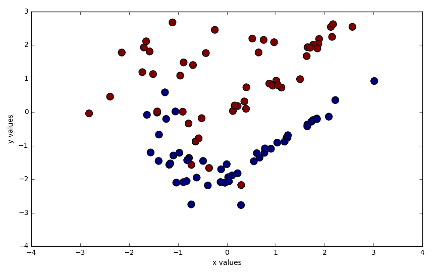
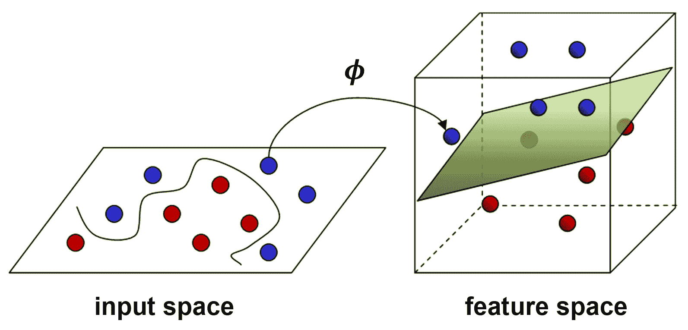
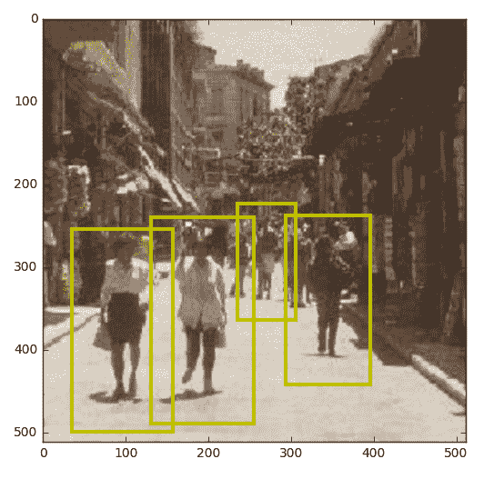

# 六、基于支持向量机的行人检测

在前一章中，我们讨论了如何使用决策树进行分类和回归。在这一章中，我们想把注意力转向机器学习世界中另一个成熟的监督学习者:**支持向量机** ( **支持向量机**)。SVMs 在 1990 年初推出后不久，就迅速在机器学习社区中流行起来，这主要是因为它们在早期手写数字分类中的成功。它们至今仍然适用，尤其是在计算机视觉等应用领域。

本章的目标是将支持向量机应用于计算机视觉中的一个流行问题:行人检测。与识别任务(我们命名对象的类别)相反，检测任务的目标是说明图像中是否存在特定的对象(或者在我们的情况下，行人)。您可能已经知道 OpenCV 可以用两到三行代码来实现这一点。但是，如果我们这样做，我们将不会学到任何东西。因此，我们将从头开始构建整个管道！我们将获得一个真实的数据集，使用方向梯度的**直方图** ( **HOG** )执行特征提取，并对其应用 SVM。

在本章中，我们将使用 Python 在 OpenCV 中实现支持向量机。我们将学习处理非线性决策边界和理解核心技巧。在这一章的最后，我们将学习在野外探测行人。

在此过程中，我们将涵盖以下主题:

*   用 Python 在 OpenCV 中实现支持向量机
*   处理非线性决策边界
*   理解内核技巧
*   在野外探测行人

兴奋吗？那我们走吧！

# 技术要求

您可以从以下链接查阅本章的代码:[`github . com/PacktPublishing/Machine-Learning-for-OpenCV-Second-Edition/tree/master/chapter 06`](https://github.com/PacktPublishing/Machine-Learning-for-OpenCV-Second-Edition/tree/master/Chapter06)。

以下是软件和硬件要求的简短总结:

*   OpenCV 版本 4.1.x (4.1.0 或 4.1.1 都可以正常工作)。
*   Python 3.6 版本(任何 Python 3 . x 版本都可以)。
*   Anaconda Python 3，用于安装 Python 和所需的模块。
*   这本书可以使用任何操作系统——苹果操作系统、视窗操作系统和基于 Linux 的操作系统。我们建议您的系统中至少有 4 GB 内存。
*   你不需要一个图形处理器来运行书中提供的代码。

# 理解线性支持向量机

为了理解支持向量机是如何工作的，我们必须考虑决策边界。当我们在前面的章节中使用线性分类器或决策树时，我们的目标总是最小化分类错误。我们通过使用均方误差评估准确性来做到这一点。一个 SVM 也试图实现低分类错误，但它只是含蓄地这样做。SVM 的明确目标是最大化数据点之间的边际

# 学习最优决策边界

让我们看一个简单的例子。考虑一些只有两个特征( *x* 和 *y* 值)和一个对应的目标标签(正(+)或负(-)的训练样本。由于标签是分类的，我们知道这是一个分类任务。此外，因为我们只有两个不同的类(+和-)，所以这是一个二元分类任务。

在二进制分类任务中，决策边界是一条线，它将训练集划分为两个子集，每个类一个子集。一个**最优** **决策** **边界**分割数据，使得来自一个类(比如，+)的所有数据样本位于决策边界的左侧，而所有其他数据样本(比如，-)位于决策边界的右侧。

SVM 更新了它的决策选择...

# 实施我们的第一个 SVM

但理论已经足够了。让我们做一些编码！

给自己定步调可能是个好主意。对于我们的第一个 SVM，我们可能应该关注一个简单的数据集，也许是一个二元分类任务。

关于 scikit-learn 的`datasets`模块，有一个很酷的技巧我没有告诉过你，那就是你可以生成大小和复杂度可控的随机数据集。一些值得注意的问题如下:

*   `datasets.make_classification([n_samples, ...])`:这个函数生成一个随机的*n*-类分类问题，我们可以在这里指定样本数、特征数、目标标签数
*   `datasets.make_regression([n_samples, ...])`:这个函数生成一个随机回归问题
*   `datasets.make_blobs([n_samples, n_features, ...])`:这个函数生成一些高斯斑点，我们可以用它们来进行聚类

这意味着我们可以使用`make_classification`为二进制分类任务构建一个自定义数据集。

# 生成数据集

我们现在可以在睡眠中背诵，一个二元分类问题正好有两个不同的目标标签(`n_classes=2`)。为了简单起见，我们只限于两个特征值(`n_features=2`；例如，一个 *x* 和一个 *y* 值。假设我们想要创建 100 个数据样本:

```py
In [1]: from sklearn import datasets...     X, y = datasets.make_classification(n_samples=100, n_features=2,...                                         n_redundant=0, n_classes=2,...                                         random_state=7816)
```

我们期望`X`有 100 行(数据样本)和 2 列(特征)，而`y`向量应该有一列包含所有目标标签:

```py
In [2]: X.shape, y.shapeOut[2]: ((100, 2), (100,))
```

# 可视化数据集

我们可以使用 Matplotlib 在散点图中绘制这些数据点。这里的想法是将 *x* 值(位于`X`、`X[:, 0]`的第一列)与 *y* 值(位于`X`、`X[:, 1]`的第二列)进行对比。一个巧妙的技巧是将目标标签作为颜色值传递(`c=y`):

```py
In [3]: import matplotlib.pyplot as plt
...     %matplotlib inline
...     plt.scatter(X[:, 0], X[:, 1], c=y, s=100)
...     plt.xlabel('x values')
...     plt.ylabel('y values')
Out[3]: <matplotlib.text.Text at 0x24f7ffb00f0>
```

这将产生以下输出:



前面的输出显示了二进制分类问题随机生成的数据。可以看到，大部分情况下，两个类的数据点是明显分开的。但是，有几个区域(特别是靠近图的左侧和底部)两个类别的数据点混合在一起。这些很难正确分类，我们马上就会看到。

# 预处理数据集

下一步是将数据点分成训练集和测试集，就像我们之前做的那样。但是，在此之前，我们必须为 OpenCV 准备如下数据:

*   `X`中的所有特征值必须是 32 位浮点数
*   目标标签必须是-1 或+1

我们可以通过以下代码实现这一点:

```py
In [4]: import numpy as np...     X = X.astype(np.float32)...     y = y * 2 - 1
```

现在，我们可以将数据传递给 scikit-learn 的`train_test_split`功能，就像我们在前面几章中所做的那样:

```py
In [5]: from sklearn import model_selection as ms...     X_train, X_test, y_train, y_test = ms.train_test_split(...         X, y, test_size=0.2, random_state=42...     )
```

在这里，我选择为测试集保留 20%的数据点，但是...

# 构建支持向量机

在 OpenCV 中，支持向量机的构建、训练和评分方式与我们迄今为止遇到的其他学习算法完全相同，使用以下四个步骤:

1.  调用`create`方法构建新 SVM:

```py
In [6]: import cv2
...     svm = cv2.ml.SVM_create()
```

如下图所示，我们可以在不同的*模式*下操作 SVM。目前，我们所关心的是我们在前面的例子中讨论过的情况:一个试图用直线分割数据的 SVM。这可以用`setKernel`方法指定:

```py
In [7]: svm.setKernel(cv2.ml.SVM_LINEAR)
```

2.  调用分类器的`train`方法找到最优决策边界:

```py
In [8]: svm.train(X_train, cv2.ml.ROW_SAMPLE, y_train)
      Out[8]: True
```

3.  调用分类器的`predict`方法预测测试集中所有数据样本的目标标签:

```py
In [9]: _, y_pred = svm.predict(X_test)
```

4.  使用 scikit-learn 的`metrics`模块对分类器进行评分:

```py
In [10]: from sklearn import metrics
...      metrics.accuracy_score(y_test, y_pred)
Out[10]: 0.80000000000000004
```

恭喜，我们获得了 80%正确分类的测试样本！

当然，到目前为止，我们还不知道引擎盖下发生了什么。据我们所知，我们还不如从网络搜索中获取这些命令，并将其输入终端，而不真正知道我们在做什么。但这不是我们想要的样子。让一个系统工作是一回事，理解它是另一回事。我们开始吧！

# 可视化决策边界

试图理解我们的数据是正确的，试图理解我们的分类器也是正确的:可视化是理解系统的第一步。我们知道 SVM 不知何故提出了一个决策边界，允许我们对 80%的测试样本进行正确分类。但是，我们如何才能发现决策边界实际上是什么样子的呢？

为此，我们将从 scikit-learn 背后的人那里借用一个技巧。这个想法是生成一个由 *x* 和 *y* 坐标组成的精细网格，并通过 SVM 的`predict`方法运行。这将允许我们知道，对于每个 *(x，y)* 点，分类器会预测什么目标标签。

我们将在一个专门的函数中这样做，我们称之为`plot_decision_boundary ...`

# 处理非线性决策边界

如果无法使用线性决策边界对数据进行最佳分区，该怎么办？在这种情况下，我们说数据不是线性可分的*。*

处理不可线性分离的数据的基本思想是创建原始特征的非线性组合。这就好比说我们想把数据投影到一个更高维的空间(比如从 2D 到 3D)，在这个空间里数据突然变成线性可分的。

下图说明了这一概念:



上图展示了如何在高维空间中找到线性超平面。如果原始输入空间(左)中的数据不能线性分离，我们可以应用映射函数 *ϕ(.)*将 2D 的数据投影到三维(或高维)空间。在这个高维空间中，我们可能会发现现在有一个线性决策边界(在 3D 中，它是一个平面)可以分隔数据。

A linear decision boundary in an *n*-dimensional space is called a **hyperplane**. For example, a decision boundary in 6D feature space is a 5D hyperplane; in 3D feature space, it's a regular 2D plane; and in 2D space, it's a straight line.

然而，这种映射方法的一个问题是，它在大维度上是不切实际的，因为它增加了许多额外的项来进行维度之间的数学投影。这就是所谓的**核心绝招**发挥作用的地方。

# 理解内核技巧

当然，我们没有时间开发真正理解内核技巧所需的所有数学。一个更现实的部分标题应该是*承认有一个叫做内核技巧的东西存在，并且接受它是有效的，*但是那样会有点罗嗦。

简单来说，这是核心技巧。

为了计算出决策超平面在高维空间中的斜率和方向，我们必须将所有特征值乘以适当的权重值，并将它们相加。我们的特征空间的维度越多，我们要做的工作就越多。

然而，比我们聪明的数学家早就意识到，SVM 不需要明确地在高维空间工作...

# 了解我们的内核

OpenCV 提供了一系列的 SVM 内核来进行实验。一些最常用的方法包括:

*   `cv2.ml.SVM_LINEAR`:这是我们之前用的内核。它在原始特征空间中提供了一个线性决策边界(即 *x* 和 *y* 值)。
*   `cv2.ml.SVM_POLY`:这个核提供了一个决策边界，它是原始特征空间中的多项式函数。为了使用这个内核，我们还必须通过`svm.setCoef0`指定一个系数(通常设置为`0`)并通过`svm.setDegree`指定多项式的次数。
*   `cv2.ml.SVM_RBF`:这个内核实现了我们之前讨论的那种高斯函数。
*   `cv2.ml.SVM_SIGMOID`:这个内核实现了一个 sigmoid 函数，类似于我们在第三章、*监督学习的第一步*中讨论逻辑回归时遇到的函数。
*   `cv2.ml.SVM_INTER`:这个内核是 OpenCV 3 的新增功能。它根据直方图的相似性来分类。

# 实现非线性支持向量机

为了测试我们刚刚谈到的一些 SVM 内核，我们将返回到前面提到的代码示例。我们希望在前面生成的数据集上重复构建和训练 SVM 的过程，但这次，我们希望使用一系列不同的内核:

```py
In [13]: kernels = [cv2.ml.SVM_LINEAR, cv2.ml.SVM_INTER,...                 cv2.ml.SVM_SIGMOID, cv2.ml.SVM_RBF]
```

你还记得这些代表什么吗？

设置不同的 SVM 内核相对简单。我们从`kernels`列表中获取一个条目，并将其传递给 SVM 类的`setKernels`方法。仅此而已。

重复事情最懒的方法是使用如下所示的`for`循环:

```py
In [14]: for idx, kernel in enumerate(kernels):
```

那么步骤如下:...

# 在野外探测行人

我们简单谈了一下检测和识别的区别。而识别关注的是对物体进行分类(例如，作为行人、汽车、自行车等)，检测基本上是回答这个问题:在这个图像中是否存在行人？

大多数检测算法背后的核心思想是将图像分割成许多小块，然后将每个图像块分类为包含行人或不包含行人。这正是我们在这一部分要做的。为了得到我们自己的行人检测算法，我们需要执行以下步骤:

1.  建立一个包含行人的图像数据库。这些将是我们的正面数据样本。
2.  建立一个不包含行人的图像数据库。这些将是我们的负数据样本。
3.  在数据集上训练 SVM。
4.  将 SVM 应用于测试图像的每个可能的补丁，以确定整个图像是否包含行人。

# 获取数据集

出于本节的目的，我们将使用麻省理工学院的人员数据集，我们可以将其免费用于非商业目的。因此，在获得相应的软件许可之前，请确保不要在您开创性的自主创业公司中使用这种软件。

However, if you followed our installation instructions from earlier and checked out the code on GitHub, you already have the dataset and are ready to go! The file can be found at [`github.com/PacktPublishing/Machine-Learning-for-OpenCV-Second-Edition/blob/master/data/chapter6/pedestrians128x64.tar.gz`](https://github.com/PacktPublishing/Machine-Learning-for-OpenCV-Second-Edition/blob/master/data/chapter6/pedestrians128x64.tar.gz).

通过参考以下步骤，您将学会在野外检测行人:

1.  因为我们应该从...

# 看一眼方向梯度的直方图

HOG 可能只是提供我们正在寻找的帮助，以便完成这个项目。HOG 是图像的特征描述符，很像我们在第四章、*中讨论的代表数据和工程特征*的描述符。它已经成功地应用于计算机视觉中的许多不同任务，但似乎在对人进行分类方面特别有效。

HOG 特征背后的本质思想是图像中物体的局部形状和外观可以通过边缘方向的分布来描述。图像被分成小的连接区域，在这些区域内，梯度方向(或边缘方向)的直方图被编译。然后，通过连接不同的直方图来组装描述符。为了提高性能，局部直方图也可以进行对比度归一化，这导致对光照和阴影变化的更好的不变性。

HOG 描述符在 OpenCV 中通过`cv2.HOGDescriptor`相当容易访问，它接受一堆输入参数，例如检测窗口大小(要检测的对象的最小大小，48 x 96)、块大小(每个框有多大，16 x 16)、单元格大小(8 x 8)和单元格跨度(从一个单元格移动到下一个单元格需要多少像素，8 x 8)。对于这些单元中的每一个，HOG 描述符然后使用九个面元计算定向梯度的直方图:

```py
In [7]: win_size = (48, 96)
...     block_size = (16, 16)
...     block_stride = (8, 8)
...     cell_size = (8, 8)
...     num_bins = 9
...     hog = cv2.HOGDescriptor(win_size, block_size, block_stride,
...                             cell_size, num_bins)
```

虽然这个函数调用看起来相当复杂，但这些实际上是实现 HOG 描述符的唯一值。最重要的论点是窗口大小(`win_size`)。

剩下要做的就是在我们的数据样本上调用`hog.compute`。为此，我们通过从数据目录中随机挑选行人图像来构建正样本数据集(`X_pos`)。在下面的代码片段中，我们从 900 多张可用图片中随机选择了 400 张，并对它们应用了 HOG 描述符:

```py
In [8]: import numpy as np
...     import random
...     random.seed(42)
...     X_pos = []
...     for i in random.sample(range(900), 400):
...         filename = "%s/per%05d.ppm" % (extractdir, i)
...         img = cv2.imread(filename)
...         if img is None:
...             print('Could not find image %s' % filename)
...             continue
...         X_pos.append(hog.compute(img, (64, 64)))
```

我们还应该记住，OpenCV 希望特征矩阵包含 32 位浮点数，目标标签是 32 位整数。我们不介意，因为转换为 NumPy 阵列将允许我们轻松研究我们创建的矩阵的大小:

```py
In [9]: X_pos = np.array(X_pos, dtype=np.float32)
...     y_pos = np.ones(X_pos.shape[0], dtype=np.int32)
...     X_pos.shape, y_pos.shape
Out[9]: ((399, 1980, 1), (399,))
```

看起来我们总共挑选了 399 个训练样本，每个样本有 1，980 个特征值(这些是 HOG 特征值)。

# 生成底片

然而，真正的挑战是拿出一个非行人的完美例子。毕竟，很容易想到行人的示例图像。但是行人的反面是什么呢？

这其实是尝试解决新的机器学习问题时的常见问题。研究实验室和公司都花费大量时间创建和注释符合其特定目的的新数据集。

如果你被难住了，让我给你一个如何解决这个问题的提示。找到行人的反面的一个很好的第一种近似方法是组装一个看起来像正类图像但不包含行人的图像数据集。这些图像可能包含汽车、自行车、街道、房屋，...

# 实施 SVM

我们已经知道如何在 OpenCV 中构建一个 SVM，所以这里没有什么可看的。提前计划，我们将培训过程包装成一个函数，以便将来更容易重复该过程:

```py
In [15]: def train_svm(X_train, y_train):
...          svm = cv2.ml.SVM_create()
...          svm.train(X_train, cv2.ml.ROW_SAMPLE, y_train)
...          return svm
```

评分功能也是如此。这里我们传递一个特征矩阵`X`和一个标签向量`y`，但是我们没有指定我们谈论的是训练集还是测试集。事实上，从函数的角度来看，数据样本属于哪一组并不重要，只要它们具有正确的格式:

```py
In [16]: def score_svm(svm, X, y):
...          from sklearn import metrics
...          _, y_pred = svm.predict(X)
...          return metrics.accuracy_score(y, y_pred)
```

然后，我们可以通过两个简短的函数调用来训练和评分 SVM:

```py
In [17]: svm = train_svm(X_train, y_train)
In [18]: score_svm(svm, X_train, y_train)
Out[18]: 1.0
In [19]: score_svm(svm, X_test, y_test)
Out[19]: 0.64615384615384619
```

多亏了 HOG 特征描述符，我们在训练集上没有出错。然而，我们的泛化性能相当糟糕(64.6%)，因为它远远低于训练性能(100%)。这表明模型过度拟合了数据。事实上，它在训练集上的表现比测试集好得多，这意味着模型已经求助于记忆训练样本，而不是试图将其抽象成有意义的决策规则。我们能做些什么来提高模型性能？

# 引导模型

提高模型性能的一个有趣方法是使用自举。这一思想实际上被应用在第一篇关于将支持向量机与 HOG 特征结合用于行人检测的论文中。因此，让我们向先驱们致敬，并试着了解他们做了什么。

他们的想法很简单。在训练集上训练 SVM 后，他们对模型进行评分，发现模型产生了一些误报。请记住，假阳性意味着模型预测的样本阳性(+)实际上是阴性(-)。在我们的上下文中，这意味着 SVM 错误地认为图像包含行人。如果数据集内的特定图像出现这种情况，则本例...

# 在更大的图像中检测行人

剩下要做的是将 SVM 分类程序与检测过程联系起来。这样做的方法是对图像中的每个可能的补丁重复我们的分类。这类似于我们之前可视化决策边界时所做的事情；我们创建了一个精细的网格，并对网格上的每个点进行分类。同样的想法也适用于这里。我们将图像分成多个小块，并将每个小块分类为是否包含行人。

通过执行以下步骤，您将能够检测到图像中的行人:

1.  我们首先必须在图像中循环所有可能的面片，如下所示，每次将我们感兴趣的区域移动少量`stride`像素:

```py
In [23]: stride = 16
...      found = []
...      for ystart in np.arange(0, img_test.shape[0], stride):
...          for xstart in np.arange(0, img_test.shape[1], stride):
```

2.  我们希望确保我们不会超越图像边界:

```py
...              if ystart + hroi > img_test.shape[0]:
...                  continue
...              if xstart + wroi > img_test.shape[1]:
...                  continue
```

3.  然后我们切割出感兴趣区域，对其进行预处理，并对其进行分类:

```py
...              roi = img_test[ystart:ystart + hroi,
...                             xstart:xstart + wroi, :]
...              feat = np.array([hog.compute(roi, (64, 64))])
...              _, ypred = svm.predict(feat)
```

4.  如果该特定补丁恰好被归类为行人，我们会将其添加到成功列表中:

```py
...              if np.allclose(ypred, 1):
...                  found.append((ystart, xstart, hroi, wroi))
```

5.  因为行人不仅可能出现在不同的位置，而且可能出现在不同的大小，我们将不得不重新缩放图像并重复整个过程。谢天谢地，OpenCV 以`detectMultiScale`函数的形式为这个多尺度检测任务提供了便利功能。这有点难，但我们可以将所有 SVM 参数传递给`hog`对象:

```py
In [24]: rho, _, _ = svm.getDecisionFunction(0)
...      sv = svm.getSupportVectors()
...      hog.setSVMDetector(np.append(sv.ravel(), rho))
```

6.  然后可以调用检测函数:

```py
In [25]: found = hog.detectMultiScale(img_test)
```

该函数将返回包含检测到的行人的边界框列表。

This seems to work only for linear SVM classifiers. The OpenCV documentation is terribly inconsistent across versions in this regard, so I'm not sure at which version this started or stopped working. Be careful!

7.  实际上，当人们面临诸如行人检测的标准任务时，他们通常依赖于内置于 OpenCV 中的预扫描 SVM 分类器。这就是我在本章开头暗示的方法。通过加载`cv2.HOGDescriptor_getDaimlerPeopleDetector()`或`cv2.HOGDescriptor_getDefaultPeopleDetector()`，我们可以从几行代码开始:

```py
In [26]: hogdef = cv2.HOGDescriptor()
...      pdetect = cv2.HOGDescriptor_getDefaultPeopleDetector()
In [27]: hogdef.setSVMDetector(pdetect)
In [28]: found, _ = hogdef.detectMultiScale(img_test)
```

8.  使用 matplotlib 绘制测试图像很容易，如下所示:

```py
In [29]: from matplotlib import patches
...      fig = plt.figure()
...      ax = fig.add_subplot(111)
...      ax.imshow(cv2.cvtColor(img_test, cv2.COLOR_BGR2RGB))
```

9.  然后我们可以通过在`found`中循环包围盒来标记图像中检测到的行人:

```py
...      for f in found:
...          ax.add_patch(patches.Rectangle((f[0], f[1]), f[2], f[3],
...                                         color='y', linewidth=3,
...                                         fill=False))
```

结果是这样的:



前面的截图显示了测试图像中检测到的行人。

# 进一步改进模型

虽然径向基函数内核是一个很好的默认内核，但它并不总是最适合我们的问题。要知道哪个内核对我们的数据最有效，唯一真正的方法是尝试所有的内核，并比较不同模型的分类性能。执行这种所谓的**超参数调整**有一些策略性的方法，我们将在第十一章、*中详细讨论使用超参数调整选择正确的模型。*

如果我们还不知道如何正确调整超参数呢？

嗯，我相信你还记得数据理解的第一步，*可视化数据*。可视化数据可以帮助我们了解线性 SVM 是否足够强大，可以对数据进行分类，在这种情况下，就不会有...

# 基于支持向量机的多类分类

支持向量机本质上是两类分类器。具体而言，实践中最流行的多类分类方法是创建 *|C|* 一对其余分类器(通常称为**一对所有** ( **OVA** )分类)，其中 *|C|* 是类的数量，并选择对测试数据进行分类的类具有最高的余量。另一种方法是开发一组一对一的分类器，并选择由最多分类器选择的类别。虽然这涉及构建 *|C|(|C| - 1)/2* 分类器，但训练分类器的时间可能会减少，因为每个分类器的训练数据集要小得多。

现在让我们快速跳到如何在真实数据集的帮助下使用支持向量机应用多类分类。

就本节而言，我们将使用智能手机数据集与 UCI 人类活动识别合作，我们可以将其免费用于非商业目的。因此，在获得相应的软件许可之前，请确保不要在您开创性的自主创业公司中使用这种软件。

数据集可从 Kaggle 网站[`www . Kaggle . com/UCI ml/人类活动-智能手机识别`](https://www.kaggle.com/uciml/human-activity-recognition-with-smartphones)获得。在那里你会发现一个下载按钮，它会引导你找到一个名为[的文件。](https://www.kaggle.com/uciml/human-activity-recognition-with-smartphones/downloads/human-activity-recognition-with-smartphones.zip/1)

However, if you followed our installation instructions from earlier and checked out the code on GitHub, you already have the dataset and are ready to go! The file can be found at `notebooks/data/multiclass`.

# 关于日期

在 19-48 岁的年龄组中选择了一组 30 名志愿者，并对他们进行了实验。每人借助系在腰间的智能手机进行了 6 项活动，分别是`Walking`、`Walking_Upstairs`、`Walking_Downstairs`、`Sitting`、`Standing`和`Laying`。主要使用嵌入式加速度计和陀螺仪捕获恒定速率为 50 Hz 的三轴线性加速度和三轴角速度。为了给这些数据贴上标签，这些实验被录了下来。数据集被随机分成两组，其中 70%的志愿者被选中生成训练数据，30%的志愿者被选中生成测试数据。

# 属性信息

对于数据集中的每个条目，提供了以下内容:

*   加速度计的三轴加速度和物体的近似加速度
*   陀螺仪的三轴角速度
*   具有 561 特征向量的时域和频域变量
*   各种活动标签
*   被观察对象的标识符

通过参考以下步骤，您将了解如何使用支持向量机构建多类分类:

1.  让我们快速导入您需要的所有必要库，以便实现具有多类分类的 SVM:

```py
In [1]: import numpy as np
...     import pandas as pd
...     import matplotlib.pyplot as plt 
...     %matplotlib inline
...     from sklearn.utils import shuffle
...     from sklearn.svm import SVC
...     from sklearn.model_selection import cross_val_score, GridSearchCV
```

2.  接下来，您将加载数据集。因为我们应该从`notebooks/`目录中的 Jupyter 笔记本运行这段代码，所以数据目录的相对路径只是`data/`:

```py
In [2]: datadir = "data"
...     dataset = "multiclass"
...     train = shuffle(pd.read_csv("data/dataset/train.csv"))
...     test = shuffle(pd.read_csv("data/dataset/test.csv"))
```

3.  让我们检查训练和测试数据集中是否有任何缺失值；如果有，我们将简单地从数据集中删除它们:

```py
In [3]: train.isnull().values.any()
Out[3]: False
In [4]: test.isnull().values.any()
Out[4]: False 
```

4.  接下来，我们将找到数据中类的频率分布，这意味着我们将检查有多少样本属于六个类中的每一个:

```py
In [5]: train_outcome = pd.crosstab(index=train["Activity"], # Make a crosstab
 columns="count") # Name the count column
... train_outcome
```

从下面的截图中，可以观察到`LAYING`类样本最多，但总体来说，数据分布大致均匀，没有出现类不平衡的主要迹象:


5.  接下来，我们将从训练和测试数据集中分离出预测值(输入值)和结果值(类标签):

```py
In [6]: X_train = pd.DataFrame(train.drop(['Activity','subject'],axis=1))
...     Y_train_label = train.Activity.values.astype(object)
...     X_test = pd.DataFrame(test.drop(['Activity','subject'],axis=1)) 
...     Y_test_label = test.Activity.values.astype(object)
```

6.  由于 SVM 期望数字输入和标签，您现在将把非数字标签转换为数字标签。但是首先，我们必须从`sklearn`库中导入一个`preprocessing`模块:

```py
In [7]: from sklearn import preprocessing
... encoder = preprocessing.LabelEncoder()
```

7.  现在，我们将列车和测试标签编码为数值:

```py
In [8]: encoder.fit(Y_train_label)
...     Y_train = encoder.transform(Y_train_label)
...     encoder.fit(Y_test_label)
...     Y_test = encoder.transform(Y_test_label) 
```

8.  接下来，我们将缩放(标准化)列车和测试特征集，为此，您将从`sklearn`导入`StandardScaler`:

```py
In [9]: from sklearn.preprocessing import StandardScaler
...     scaler = StandardScaler()
...     X_train_scaled = scaler.fit_transform(X_train)
...     X_test_scaled = scaler.transform(X_test)
```

9.  一旦数据被缩放并且标签的格式正确，现在就是我们拟合数据的时候了。但在此之前，我们将定义一个字典，该字典具有 SVM 在训练自身时将使用的不同参数设置，这种技术被称为`GridSearchCV`。参数网格将基于随机搜索的结果:

```py
In [10]: params_grid = [{'kernel': ['rbf'], 'gamma': [1e-3, 1e-4],
                     'C': [1, 10, 100, 1000]},
                    {'kernel': ['linear'], 'C': [1, 10, 100, 1000]}]
```

10.  最后，我们将使用前面的参数对数据调用`GridSearchCV`以获得最佳 SVM 拟合:

```py
In [11]: svm_model = GridSearchCV(SVC(), params_grid, cv=5)
...      svm_model.fit(X_train_scaled, Y_train)
```

11.  是时候检查一下 SVM 模型在数据上的训练效果了；总之，我们会找到准确性。不仅如此，我们还将检查 SVM 表现最好的参数设置:

```py
In [12]: print('Best score for training data:', svm_model.best_score_,"\n") 
...      print('Best C:',svm_model.best_estimator_.C,"\n") 
...      print('Best Kernel:',svm_model.best_estimator_.kernel,"\n")
...      print('Best Gamma:',svm_model.best_estimator_.gamma,"\n")
Out[12]: Best score for training data: 0.986
...      Best C: 100
...      Best Kerne: rbf
...      Best Gamma: 0.001
```

瞧啊。如我们所见，SVM 在多类分类问题的训练数据上达到了 98.6%的准确率。但是在我们找到测试数据的准确性之前，不要着急。所以，让我们快速检查一下:

```py
In [13]: final_model = svm_model.best_estimator_
... print("Training set score for SVM: %f" % final_model.score(X_train_scaled , Y_train))
... print("Testing set score for SVM: %f" % final_model.score(X_test_scaled , Y_test ))
Out[13]: Training set score for SVM: 1.00
... Testing set score for SVM: 0.9586
```

哇哦！是不是很神奇？我们能够在测试集上达到 95.86%的准确率；这就是支持向量机的力量。

# 摘要

在本章中，我们了解了各种形式和风格的支持向量机。我们现在知道如何在 2D 和高维空间中绘制决策边界和超平面。我们了解了不同的 SVM 内核，并研究了如何在 OpenCV 中实现它们。

此外，我们还将新获得的知识应用到行人检测的实际例子中。为此，我们必须了解 HOG 特征描述符，以及如何为任务收集合适的数据。我们使用自举来提高分类器的性能，并将分类器与 OpenCV 的多尺度检测机制相结合。

这不仅是一章要消化的内容，而且你已经读完了这本书的一半。恭喜你！

在下一章中，...