# 九、利用深度学习分类手写数字

现在让我们回到监督学习，讨论一族被称为**人工神经网络**的算法。对神经网络的早期研究可以追溯到 20 世纪 40 年代，当时沃伦·麦卡洛克和沃尔特·皮茨首次描述了大脑中的生物神经细胞(或神经元)是如何工作的。最近，人工神经网络在流行词“深度学习”下复兴，深度学习为最先进的技术提供动力，如谷歌的深度思维和脸书的深度人脸算法。

在这一章中，我们想把我们的头包在人工神经网络的一些简单版本上，例如麦卡洛克-皮茨神经元、感知器和多层感知器。一旦我们熟悉了基础知识，我们将准备好实现一个更复杂的深度神经网络来对来自流行的 **MNIST 数据库**(简称**国家标准与技术研究院混合数据库**)的手写数字进行分类。为此，我们将利用高级神经网络库 Keras，这也是研究人员和科技公司经常使用的库。

在此过程中，我们将讨论以下主题:

*   在 OpenCV 中实现感知器和多层感知器
*   区分随机和批量梯度下降，以及它们如何适应反向传播
*   找到你的神经网络的大小
*   使用 Keras 构建复杂的深层神经网络

兴奋吗？那我们走吧！

# 技术要求

您可以在以下链接查阅本章的代码:[https://github . com/PacktPublishing/Machine-Learning-for-OpenCV-Second-Edition/tree/master/chapter 09](https://github.com/PacktPublishing/Machine-Learning-for-OpenCV-Second-Edition/tree/master/Chapter09)。

以下是软件和硬件要求的简短总结:

*   OpenCV 版本 4.1.x (4.1.0 或 4.1.1 都可以正常工作)。
*   Python 3.6 版本(任何 Python 3 . x 版本都可以)。
*   Anaconda Python 3，用于安装 Python 和所需的模块。
*   你可以在这本书里使用任何操作系统——苹果电脑、视窗或基于 Linux 的。我们建议您的系统中至少有 4 GB 内存。
*   你不需要一个图形处理器来运行书中提供的代码。

# 理解麦卡洛克-皮茨神经元

1943 年，沃伦·麦卡洛克和沃尔特·皮茨发表了一篇关于神经元的数学描述，因为它们被认为在大脑中运行。一个神经元通过其树突树上的连接从其他神经元接收输入，这些连接被整合以在细胞体(或躯体)产生输出。然后，输出通过一根长电线(或轴突)传递给其他神经元，最终分支到其他神经元的树突树上形成一个或多个连接(在轴突末端)。

下图显示了一个神经元示例:

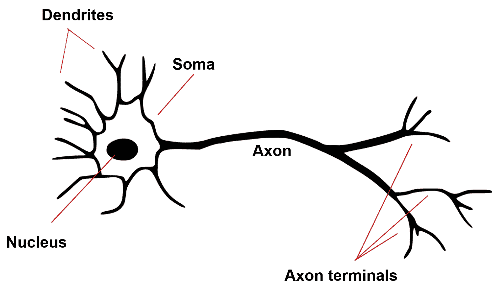

麦卡洛克和皮茨将这种神经元的内部工作原理描述为一个简单的逻辑门，它可以打开或关闭，这取决于它在树状结构上接收到的输入。具体来说，神经元会将所有输入相加，如果总和超过某个阈值，就会产生一个输出信号，并由轴突传递。

However, today we know that real neurons are much more complicated than that. Biological neurons perform intricate nonlinear mathematical operations on thousands of inputs and can change their responsiveness dynamically depending on the context, importance, or novelty of the input signal. You can think of real neurons being as complex as computers and of the human brain being as complex as the internet.

让我们考虑一个简单的人工神经元，它正好接收两个输入， *x <sub>0</sub>* 和 *x <sub>1</sub>* 。人工神经元的工作是计算两个输入的和(通常以加权和的形式)，如果这个和超过某个阈值(通常为零)，神经元将被认为是活动的，并输出一个 1；否则它将被认为是无声的，并输出一个负 1(或零)。用更数学的术语来说，这个麦卡洛克-皮茨神经元的输出 *y* 可以描述如下:


在上式中， *w <sub>0</sub>* 和 *w <sub>1</sub>* 是权重系数，与 *x <sub>0</sub>* 和 *x <sub>1</sub>* 一起构成加权和。在教科书中，输出 *y* 为 *+1* 和 *-1* 的两种不同情况通常会被激活函数 *ϕ* 所掩盖，该函数可能采用两种不同的值:


这里我们引入一个新的变量， *z* (所谓的**网络输入**，相当于加权和:*z = w<sub>0</sub>x<sub>0</sub>+w<sub>1</sub>x<sub>1</sub>T13】。然后将加权和与阈值 *θ* 进行比较，以确定 *ϕ* 的值，随后确定 *y* 的值。除此之外，这两个方程说的和前面一个完全一样。*

如果这些方程看起来奇怪地熟悉，你可能会想起[第 1 章](01.html)，*机器学习的味道*，当我们谈论线性分类器的时候。

你是对的，麦卡洛克-皮茨神经元本质上是一个线性的二元分类器！

你可以这样想:*x<sub>0</sub>T3】和 *x <sub>1</sub>* 是输入特征，*w<sub>0</sub>t11】和*w<sub>1</sub>t15】是待学习的权重，分类是通过激活功能 *ϕ.进行的*如果我们在学习权重方面做得很好，我们会在合适的训练集的帮助下做到这一点，我们可以将数据分为正样本或负样本。在这种情况下， *ϕ(z)=θ* 将作为决策边界。***

借助下图，这可能更有意义:

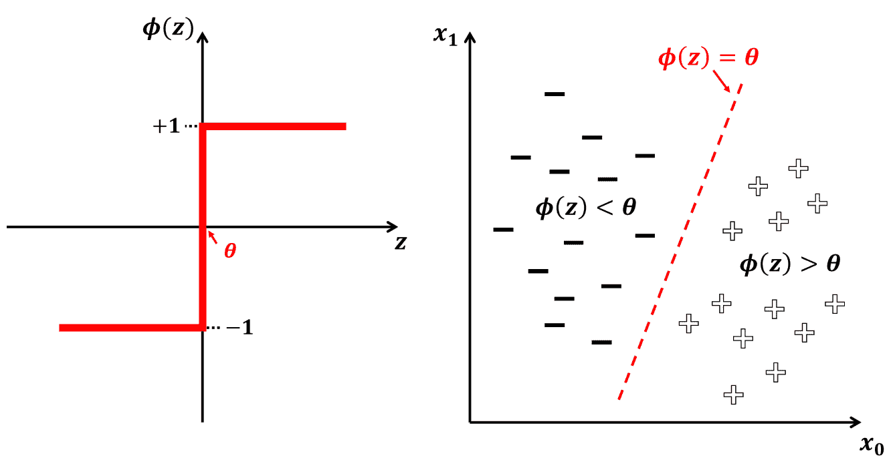

在左边，你可以看到神经元的激活功能 *ϕ* ，相对于 *z* 绘制。记住 *z* 只不过是两个输入 *x <sub>0</sub>* 和 *x <sub>1</sub>* <sub>的加权和。</sub>规则是只要加权和低于某个阈值， *θ* ，神经元的输出为-1；在 *θ* 以上，输出为+1。

在右侧，您可以看到由 *ϕ(z)=θ* 表示的决策边界，它将数据分为两个状态， *ϕ(z) < θ* (其中所有数据点被预测为负样本)和 *ϕ(z) > θ* (其中所有数据点被预测为正样本)。

The decision boundary does not need to be vertical or horizontal, it can be tilted as shown in the preceding diagram. But in the case of a single McCulloch-Pitts neuron, the decision boundary will always be a straight line.

当然，神奇之处在于学习权重系数， *w <sub>0</sub>* 和 *w <sub>1</sub>* ，使得决策边界恰好位于所有正数据点和所有负数据点之间。

为了训练神经网络，我们通常需要三样东西:

*   **训练数据**:得知我们需要一些数据样本来验证我们的分类器的有效性也就不足为奇了。
*   **成本函数(也称为损失函数)**:成本函数提供了当前权重系数有多好的度量。有各种各样的成本函数可供使用，我们将在本章末尾讨论。一种解决方法是计算错误分类的数量。另一个是计算**误差平方和**。
*   **学习规则**:学习规则从数学上规定了我们如何从一次迭代到下一次迭代更新权重系数。这种学习规则通常取决于我们在训练数据上观察到的误差(由成本函数衡量)。

这就是著名研究员弗兰克·罗森布拉特的工作。

# 理解感知器

20 世纪 50 年代，美国心理学家和人工智能研究员弗兰克·罗森布拉特发明了一种算法，可以自动学习执行精确二进制分类所需的最佳权重系数 *w <sub>0</sub>* 和 *w <sub>1</sub>* :感知器学习规则。

罗森布拉特最初的感知器算法可以总结如下:

1.  将权重初始化为零或一些小随机数。
2.  对于每个训练样本， *s <sub>i</sub>* ，执行以下步骤:
    1.  计算预测目标值， *ŷ* *<sub>i</sub> 。*
    2.  将 *ŷ* *<sub>i</sub>* 与地面实况、 *y* *<sub>i</sub>* 进行比较，并相应更新权重:
        *   如果两者相同(预测正确)，请跳过。
        *   如果两者不同(错误预测)，则推权重系数， *w <sub>0</sub>* 和

# 实现你的第一个感知机

感知器很容易从头开始实现。我们可以通过创建一个感知器对象来模仿典型的分类器的 OpenCV 或 scikit-learn 实现。这将允许我们初始化新的感知器对象，这些对象可以通过`fit`方法从数据中学习，并通过单独的`predict`方法进行预测。

当我们初始化一个新的感知器对象时，我们希望传递一个学习速率(上一节中的`lr`或 *η* )和算法应该终止的迭代次数(`n_iter`):

```py
In [1]: import numpy as np
In [2]: class Perceptron(object):
...     def __init__(self, lr=0.01, n_iter=10):
...     self.lr = lr
...     self.n_iter = n_iter
... 
```

`fit`方法是完成大部分工作的地方。该方法应该将一些数据样本(`X`)及其关联的目标标签(`y`)作为输入。然后我们将创建一个权重数组(`self.weights`)，每个特征一个(`X.shape[1]`)，初始化为零。为了方便起见，我们将偏差项(`self.bias`)与权重向量分开，并将其初始化为零。将偏差初始化为零的原因之一是因为权重中的小随机数在网络中提供了不对称中断:

```py
...         def fit(self, X, y):
...             self.weights = np.zeros(X.shape[1])
...             self.bias = 0.0
```

`predict`方法应该获取多个数据样本(`X`)，并为每个样本返回一个目标标签，或者+1 或者-1。为了执行这个分类，我们需要实现 *ϕ(z) > θ* 。这里我们选择 *θ = 0* ，加权和可以用 NumPy 的点积来计算:

```py
...         def predict(self, X):
...             return np.where(np.dot(X, self.weights) + self.bias >= 0.0,
...                             1, -1)
```

然后，我们将计算数据集中每个数据样本(`xi`、`yi`)的δ*w*项，并重复该步骤多次迭代(`self.n_iter`)。为此，我们需要将基础事实标签(`yi`)与预测标签(前面提到的`self.predict(xi)`)进行比较。得到的增量项将用于更新权重和偏差项:

```py
...             for _ in range(self.n_iter):
...                 for xi, yi in zip(X, y):
...                     delta = self.lr * (yi - self.predict(xi))
...                     self.weights += delta * xi
...                     self.bias += delta
```

就这样！

# 生成玩具数据集

在以下步骤中，您将学习如何创建和绘制玩具数据集:

1.  为了测试我们的感知器分类器，我们需要创建一些模拟数据。现在让我们保持简单，生成属于两个 blob(`centers`)之一的 100 个数据样本(`n_samples`)，再次依赖 scikit-learn 的`make_blobs`功能:

```py
In [3]: from sklearn.datasets.samples_generator import make_blobs...     X, y = make_blobs(n_samples=100, centers=2,...                       cluster_std=2.2, random_state=42)
```

2.  需要记住的一点是，我们的感知器分类器期望目标标签是+1 或-1，而`make_blobs`返回`0`和`1`。调整标签的一个简单方法是使用以下等式:

```py
In [4]: y = 2 * y - 1
```

4.  在下面的代码中，我们...

# 将感知器与数据拟合

在以下步骤中，您将学习在给定数据上拟合感知器算法:

1.  我们可以实例化我们的感知器对象，类似于我们在 OpenCV 中遇到的其他分类器:

```py
In [6]: p = Perceptron(lr=0.1, n_iter=10)
```

这里，我们选择了 0.1 的学习率，并告诉感知器在 10 次迭代后终止。这些值是在这一点上相当随意地选择的，尽管我们过一会儿会回到它们。

Choosing an appropriate learning rate is critical, but it's not always clear what the most appropriate choice is. The learning rate determines how quickly or slowly we move toward the optimal weight coefficients. If the learning rate is too large, we might accidentally skip the optimal solution. If it is too small, we will need a large number of iterations to converge to the best values.

2.  一旦建立了感知器，我们可以调用`fit`方法来优化权重系数:

```py
In [7]: p.fit(X, y)
```

3.  有用吗？让我们来看看学习到的重量值:

```py
In [8]: p.weights
Out[8]: array([ 2.20091094, -0.4798926 ])
```

4.  别忘了偷看一下偏见这个词:

```py
In [9]: p.bias
Out[9]: 0.20000000000000001
```

如果我们将这些值插入到我们的 *ϕ* 的等式中，很明显，感知器学习到了形式*2.2 x<sub>1</sub>-0.48 x<sub>2</sub>+0.2>= 0*的决策边界。

# 评估感知器分类器

在以下步骤中，您将根据测试数据评估经过训练的感知器:

1.  为了找出我们的感知器表现有多好，我们可以计算所有数据样本的准确度分数:

```py
In [10]: from sklearn.metrics import accuracy_score...      accuracy_score(p.predict(X), y)Out[10]: 1.0
```

满分！

2.  让我们通过回顾前面章节中的`plot_decision_boundary`来看看决策环境:

```py
In [10]: def plot_decision_boundary(classifier, X_test, y_test):...          # create a mesh to plot in...          h = 0.02 # step size in mesh...          x_min, x_max = X_test[:, 0].min() - 1, X_test[:, 0].max() + 1...          y_min, y_max = X_test[:, 1].min() - 1, X_test[:, 1].max() + 1... xx, yy = np.meshgrid(np.arange(x_min, ...
```

# 将感知器应用于不可线性分离的数据

在以下步骤中，您将学习构建感知器来分离非线性数据:

1.  由于感知器是一个线性分类器，您可以想象它在尝试对不可线性分离的数据进行分类时会有困难。我们可以通过增加玩具数据集中两个斑点的扩散(`cluster_std`)来测试这一点，以便两个斑点开始重叠:

```py
In [12]: X, y = make_blobs(n_samples=100, centers=2,
...      cluster_std=5.2, random_state=42)
...      y = 2 * y - 1
```

2.  我们可以使用 matplotlib 的`scatter`函数再次绘制数据集:

```py
In [13]: plt.scatter(X[:, 0], X[:, 1], s=100, c=y);
...      plt.xlabel('x1')
...      plt.ylabel('x2')
```

从下面的截图中可以明显看出，这些数据不再是线性可分的，因为没有直线可以完美地将两个斑点分开:

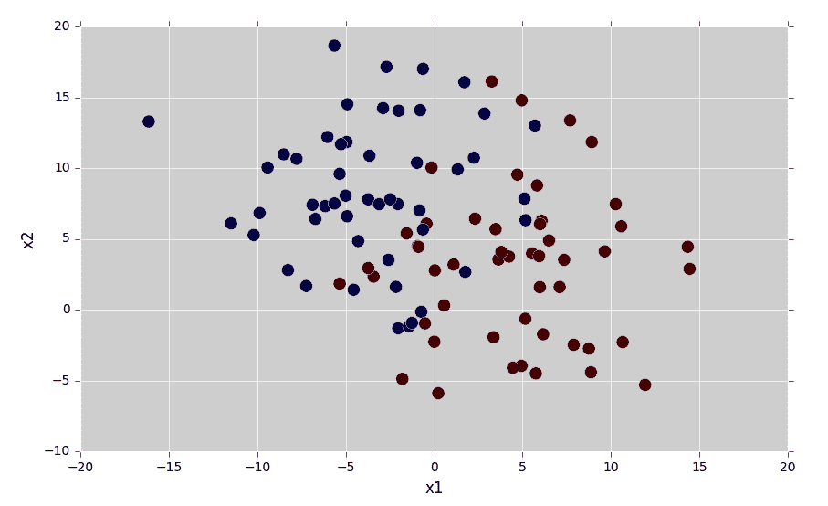

前面的截图显示了一个不可线性分离的数据示例。那么，如果我们将感知器分类器应用于这个数据集，会发生什么呢？

3.  我们可以通过重复前面的步骤找到这个问题的答案:

```py
In [14]: p = Perceptron(lr=0.1, n_iter=10)
...      p.fit(X, y)
```

4.  然后我们发现准确率为 81%:

```py
In [15]: accuracy_score(p.predict(X), y)
Out[15]: 0.81000000000000005
```

5.  为了找出哪些数据点被错误分类，我们可以使用我们的辅助函数再次可视化决策场景:

```py
In [16]: plot_decision_boundary(p, X, y)
...      plt.xlabel('x1')
...      plt.ylabel('x2')
```

下图显示了感知器分类器的局限性。作为一个线性分类器，它试图用直线分离数据，但最终失败了。它失败的主要原因是因为数据不是线性可分的，尽管我们达到了 81%的准确率。然而，从下面的图中，很明显许多红点位于蓝色区域，反之亦然。因此，与感知器不同，我们需要一种非线性算法，它可以创建非线性(圆形)决策边界，而不是直线:

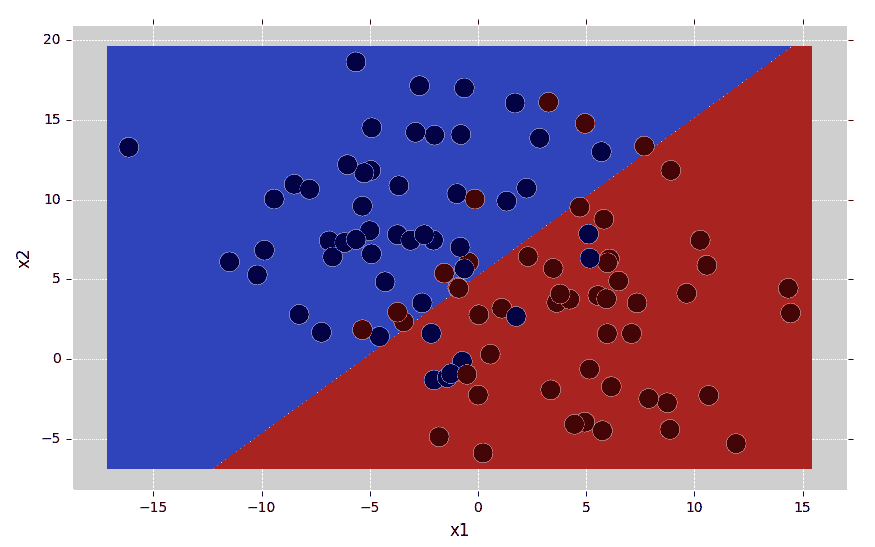

幸运的是，有办法使感知器更强大，并最终创建非线性决策边界。

# 理解多层感知器

为了创建非线性决策边界，我们可以组合多个感知器来形成一个更大的网络。这也被称为一个**多层感知器** ( **MLP** )。MLPs 通常至少由三层组成，其中第一层对数据集的每个输入要素都有一个节点(或神经元)，最后一层对每个类标签都有一个节点。中间的一层叫做**隐藏层**。

下图显示了这种前馈神经网络架构的一个示例:

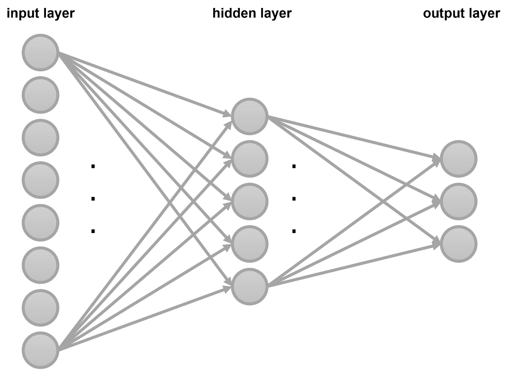

在这个网络中，每个圆都是一个人工神经元(或者说，本质上是一个感知器)，以及一个人工的输出...

# 理解梯度下降

当我们在本章前面谈到感知器时，我们确定了训练所需的三个基本要素:训练数据、成本函数和学习规则。虽然学习规则对单个感知器非常有效，但不幸的是，它不能推广到多层感知器，因此人们不得不提出一个更通用的规则。

如果你想一想我们如何衡量一个分类器的成功，我们通常是在成本函数的帮助下这样做的。一个典型的例子是网络的错误分类数或均方误差。这个函数(也称为**损失函数**)通常取决于我们试图调整的参数。在神经网络中，这些参数是权重系数。

让我们假设一个简单的神经网络有一个要调整的权重， *w* 。然后我们可以将成本可视化为重量的函数:

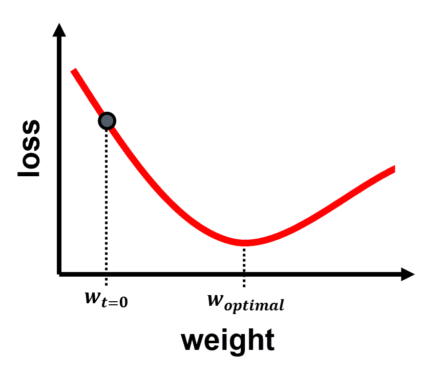

训练开始时，在时间零点，我们可能会从这个图左边的路开始( *w <sub>t=0</sub>* )。但是从图中我们知道 *w* 会有一个更好的值，即 *w <sub>最优</sub>T9】，这样会使成本函数最小化。最小的成本意味着最低的误差，所以通过学习达到 *w <sub>最优</sub>* 应该是我们的最高目标。*

这正是梯度下降的作用。你可以把梯度想象成一个指向山上的向量。在梯度下降中，我们试图走在梯度的对面，有效地走下山，从山峰到山谷:

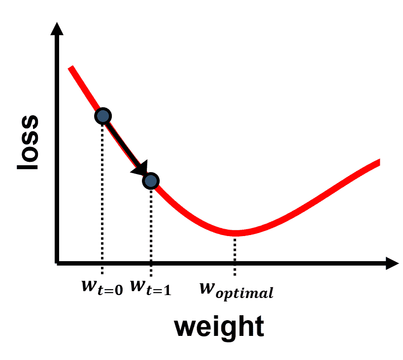

一旦你到达山谷，坡度就变为零，训练就完成了。

有几种方法可以到达山谷——我们可以从左边接近，也可以从右边接近。我们下降的起点由初始重量值决定。此外，我们必须小心不要走太大的一步，否则我们可能会错过山谷:


因此，在随机梯度下降(有时也称为迭代或在线梯度下降)中，目标是采取小步骤，但尽可能频繁地采取这些步骤。有效步长由算法的学习速率决定。

具体来说，我们将反复执行以下过程:

1.  向网络呈现少量训练样本(称为**批量**)。
2.  在这一小批数据上，计算成本函数的梯度。
3.  通过在梯度的相反方向朝着山谷走一小步来更新权重系数。
4.  重复步骤 1-3，直到重量成本不再下降。这表明我们已经到达了山谷。

其他一些改进 SGD 的方法是使用 Keras 框架中的学习速率查找器，减少各个时期的步长(学习速率)，并且如前所述，使用批量(或小批量)，这将更快地计算权重更新。

你能想出一个这个程序可能失败的例子吗？

想到的一个场景是，成本函数有多个谷，一些比另一些更深，如下图所示:

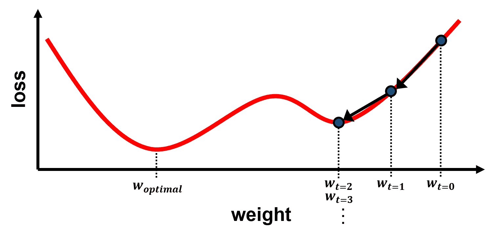

如果我们从左边开始，我们应该会像以前一样到达同一个山谷——没问题。但是，如果我们的起点一直向右，我们可能会在路上遇到另一个山谷。梯度下降会把我们直接带到山谷，但它没有任何办法爬出来。

This is also known as **getting stuck in a local minimum**. Researchers have come up with different ways to try and avoid this issue, one of them being to add noise to the process.

拼图中还剩一块。给定我们当前的权重系数，我们如何知道成本函数的斜率？

# 用反向传播训练 MLPs

这就是反向传播的用武之地，它是一种用于估计神经网络中成本函数梯度的算法。有人可能会说，这基本上是链规则的一个花哨词，链规则是一种计算依赖于多个变量的函数的偏导数的方法。尽管如此，这是一种帮助人工神经网络领域起死回生的方法，所以我们应该为此感到庆幸。

理解反向传播涉及到相当多的微积分，这里我只给大家简单介绍一下。

让我们提醒自己，成本函数及其梯度取决于真实输出(*y<sub>I</sub>T3)和当前输出(*ŷ<sub>I</sub>T7】之间的差异**

# 在 OpenCV 中实现一个 MLP

在 OpenCV 中实现 MLP 使用的语法和我们之前至少见过十几次的语法是一样的。为了了解 MLP 与单个感知器相比如何，我们将对与之前相同的玩具数据进行操作:

```py
In [1]: from sklearn.datasets.samples_generator import make_blobs
...     X_raw, y_raw = make_blobs(n_samples=100, centers=2,
...                               cluster_std=5.2, random_state=42)
```

# 预处理数据

但是，由于我们使用的是 OpenCV，这次我们希望确保输入矩阵由 32 位浮点数组成，否则代码将会中断:

```py
In [2]: import numpy as np... X = X_raw.astype(np.float32)
```

此外，我们需要回想一下[第 4 章](04.html)、*表示数据和工程特性*，并记住如何表示分类变量。我们需要找到一种方法来表示目标标签，不是作为整数，而是用一个热编码。最简单的方法是使用 scikit-learn 的`preprocessing`模块:

```py
In [3]: from sklearn.preprocessing import OneHotEncoder...     enc = OneHotEncoder(sparse=False, dtype=np.float32)...     y = enc.fit_transform(y_raw.reshape(-1, 1))
```

# 在 OpenCV 中创建 MLP 分类器

在 OpenCV 中创建 MLP 的语法与所有其他分类器相同:

```py
In [4]: import cv2
...     mlp = cv2.ml.ANN_MLP_create()
```

然而，现在我们需要指定网络中我们想要多少层，每层有多少个神经元。我们用一个整数列表来做，它指定了每一层中神经元的数量。由于数据矩阵`X`有两个特征，第一层也应该有两个神经元在里面(`n_input`)。由于输出有两个不同的值，最后一层应该也有两个神经元在里面(`n_output`)。

在这两层之间，我们可以放入尽可能多的隐藏层，有多少神经元就放多少。让我们选择单个隐藏层，其中有任意数量的 10 个神经元(`n_hidden`):

```py
In [5]: n_input = 2
...     n_hidden = 10
...     n_output = 2
...     mlp.setLayerSizes(np.array([n_input, n_hidden, n_output]))
```

# 自定义 MLP 分类器

在我们继续训练分类器之前，我们可以通过一些可选设置来自定义 MLP 分类器:

*   `mlp.setActivationFunction`:定义网络中每个神经元使用的激活函数。
*   `mlp.setTrainMethod`:这定义了一个合适的训练方法。
*   `mlp.setTermCriteria`:设置训练阶段的终止标准。

尽管我们自酿的感知器分类器使用了线性激活函数，但 OpenCV 提供了两个额外的选项:

*   `cv2.ml.ANN_MLP_IDENTITY`:这是线性激活函数， *f(x) = x* 。
*   `cv2.ml.ANN_MLP_SIGMOID_SYM`:这是对称的 sigmoid 函数(也称为**双曲正切**)，*f(x)=β(1-*exp*(-αx))/(1+*exp*(-αx))*。然而...

# 训练和测试 MLP 分类器

这是容易的部分。MLP 分类器的训练与所有其他分类器相同:

```py
In [11]: mlp.train(X, cv2.ml.ROW_SAMPLE, y)
Out[11]: True
```

预测目标标签也是如此:

```py
In [12]: _, y_hat = mlp.predict(X)
```

测量精度的最简单方法是使用 scikit-learn 的助手功能:

```py
In [13]: from sklearn.metrics import accuracy_score
...      accuracy_score(y_hat.round(), y)
Out[13]: 0.88
```

看起来我们能够将我们的性能从单个感知器的 81%提高到由 10 个隐藏层神经元和 2 个输出神经元组成的 MLP 的 88%。为了了解什么发生了变化，我们可以再看一次决策边界:

```py
In [14]: def plot_decision_boundary(classifier, X_test, y_test):
... # create a mesh to plot in
... h = 0.02 # step size in mesh
... x_min, x_max = X_test[:, 0].min() - 1, X_test[:, 0].max() + 1
... y_min, y_max = X_test[:, 1].min() - 1, X_test[:, 1].max() + 1
... xx, yy = np.meshgrid(np.arange(x_min, x_max, h),
... np.arange(y_min, y_max, h))
... 
... X_hypo = np.c_[xx.ravel().astype(np.float32),
... yy.ravel().astype(np.float32)]
... _, zz = classifier.predict(X_hypo)
```

然而，这里有一个问题，因为`zz`现在是一个单热编码矩阵。为了将一热编码转换为对应于类别标签(零或一)的数字，我们可以使用 NumPy 的`argmax`功能:

```py
...          zz = np.argmax(zz, axis=1)
```

其余的保持不变:

```py
...          zz = zz.reshape(xx.shape)
...          plt.contourf(xx, yy, zz, cmap=plt.cm.coolwarm, alpha=0.8)
...          plt.scatter(X_test[:, 0], X_test[:, 1], c=y_test, s=200)
```

然后我们可以这样调用函数:

```py
In [15]: plot_decision_boundary(mlp, X, y_raw)
```

输出如下所示:

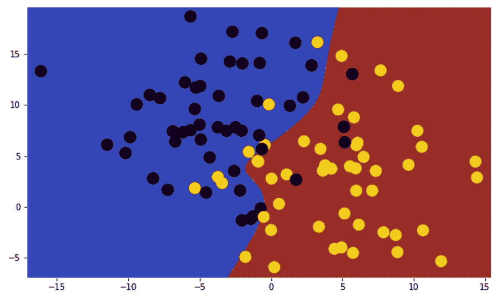

前面的输出显示了具有一个隐藏层的 MLP 的决策边界。

瞧啊。决策边界不再是一条直线。也就是说，您获得了巨大的性能提升，并且可能预期会有更大幅度的性能提升。但是没人说我们必须停在这里！

从现在开始，我们至少可以尝试两种不同的方式:

*   我们可以在隐藏层增加更多的神经元。您可以通过用更大的值替换第 6 行的`n_hidden`并再次运行代码来实现这一点。一般来说，你放入网络的神经元越多，MLP 就越强大。
*   我们可以添加更多的隐藏层。事实证明，这才是神经网络真正发挥作用的地方。

因此，这是我应该告诉你关于深度学习的地方。

# 熟悉深度学习

当深度学习还没有一个花哨的名字时，它被称为人工神经网络。所以你已经知道很多了！

最终，对神经网络的兴趣在 1986 年被重新点燃，当时大卫·鲁梅尔哈特、杰弗里·辛顿和罗纳德·威廉姆斯参与了上述反向传播算法的(重新)发现和普及。然而，直到最近，计算机才变得足够强大，因此它们实际上可以在大规模网络上执行反向传播算法，从而导致深度学习研究的激增。

You can find more information on the history and origin of deep learning in the following scientific article: Wang and Raj (2017), *On the Origin ...*

# 结识喀拉斯

Keras 的核心数据结构是一个模型，类似于 OpenCV 的分类器对象，只是它只关注神经网络。最简单的模型是序列模型，它将神经网络的不同层排列成线性堆栈，就像我们在 OpenCV 中对 MLP 所做的那样:

```py
In [1]: from keras.models import Sequential
...     model = Sequential()
Out[1]: Using TensorFlow backend.
```

然后，可以将不同的层逐个添加到模型中。在 Keras 中，层不仅仅包含神经元，它们还执行一种功能。一些核心层类型包括:

*   **密集**:这是一个密集连接的层。这正是我们在设计 MLP 时使用的方法:一层神经元与前一层的每个神经元相连。
*   **激活**:这将激活功能应用于输出。Keras 提供了一系列的激活功能，包括 OpenCV 的识别功能(`linear`)、双曲正切(`tanh`)、乙状结肠挤压功能(`sigmoid`)、softmax 功能(`softmax`)等等。
*   **重塑**:这将输出重塑为某个形状。

还有其他层对其输入进行算术或几何运算:

*   **卷积层**:这些层允许您指定一个内核，输入层与该内核卷积。这允许你在 1D、2D 甚至 3D 中执行诸如 Sobel 滤波器或应用高斯核的操作。
*   **汇集层**:这些层对其输入执行最大汇集操作，其中输出神经元的活动由最活跃的输入神经元给出。

深度学习中流行的其他一些层如下:

*   **丢弃**:该层在每次更新时随机将输入单位的分数设置为零。这是一种在训练过程中注入噪声的方法，使其更加健壮。
*   **嵌入** **g** :这个层编码分类数据，类似于 scikit-learn 的`preprocessing`模块的一些功能。
*   **高斯噪声**:该层应用加性零中心高斯噪声。这是在训练过程中注入噪声的另一种方式，使其更加健壮。

因此，可以使用具有两个输入和一个输出的密集层来实现类似于前一个的感知器。坚持我们前面的例子，我们将把权重初始化为零，并使用双曲正切作为激活函数:

```py
In [2]: from keras.layers import Dense
...     model.add(Dense(1, activation='tanh', input_dim=2,
...                     kernel_initializer='zeros'))
```

最后，我们要指定训练方法。Keras 提供了许多优化器，包括:

*   **随机梯度下降(SGD)** :这是我们之前讨论过的。
*   **均方根传播(RMSprop)** :这是一种针对每个参数调整学习速率的方法。
*   **自适应矩估计(Adam)** :这是对均方根传播的更新。

此外，Keras 还提供了许多不同的损失函数:

*   **均方误差(Mean _ square _ error)**:这是前面讨论过的。
*   **铰链损失(铰链)**:这是 SVM 常用的最大余量分类器，如[第 6 章](06.html)、*支持向量机检测行人*所述。

您可以看到有太多的参数需要指定，有太多的方法可供选择。为了忠实于我们前面提到的感知器实现，我们将选择 SGD 作为优化器，均方差作为成本函数，准确度作为评分函数:

```py
In [3]: model.compile(optimizer='sgd',
...                   loss='mean_squared_error',
...                   metrics=['accuracy'])
```

为了比较 Keras 实现和我们自酿版本的性能，我们将把分类器应用到同一个数据集:

```py
In [4]: from sklearn.datasets.samples_generator import make_blobs
...     X, y = make_blobs(n_samples=100, centers=2,
...     cluster_std=2.2, random_state=42)
```

最后，一个 Keras 模型用一个非常熟悉的语法适合数据。在这里，我们还可以选择训练多少次迭代(`epochs`)、计算误差梯度前要呈现多少样本(`batch_size`)、是否对数据集进行洗牌(`shuffle`)以及是否输出进度更新(`verbose`):

```py
In [5]: model.fit(X, y, epochs=400, batch_size=100, shuffle=False,
...               verbose=0)
```

训练完成后，我们可以如下评估分类器:

```py
In [6]: model.evaluate(X, y)
Out[6]: 32/100 [========>.....................] - ETA: 0s
        [0.040941802412271501, 1.0]
```

这里，第一个报告值是均方误差，而第二个值表示精度。这意味着最终的均方误差为 0.04，我们有 100%的准确性。比我们自己的实现好得多！

You can find more information on Keras, source code documentation, and a number of tutorials at [http://keras.io](http://keras.io).

有了这些工具，我们现在可以接近真实世界的数据集了！

# 手写数字分类

在前一节中，我们介绍了很多关于神经网络的理论，如果你是这个话题的新手，这些理论可能会有点让人不知所措。在本节中，我们将使用著名的 MNIST 数据集，其中包含 60，000 个手写数字样本及其标签。

我们将在上面训练两个不同的网络:

*   使用 OpenCV 的 MLP
*   使用 Keras 的深度神经网络

# 正在加载 MNIST 数据集

获取 MNIST 数据集最简单的方法是使用 Keras:

```py
In [1]: from keras.datasets import mnist
...     (X_train, y_train), (X_test, y_test) = mnist.load_data()
Out[1]: Using TensorFlow backend.
        Downloading data from
        https://s3.amazonaws.com/img-datasets/mnist.npz
```

这将从亚马逊云下载数据(可能需要一段时间，取决于您的互联网连接)，并自动将数据分割成训练集和测试集。

MNIST provides its own predefined train-test split. This way, it is easier to compare the performance of different classifiers because they will all use the same data for training and the same data for testing.

这些数据采用我们已经熟悉的格式:

```py
In [2]: X_train.shape, y_train.shape
Out[2]: ((60000, 28, 28), (60000,))
```

我们应该注意标签是 0 到 9 之间的整数值(对应于数字 0-9):

```py
In [3]: import numpy as np
...     np.unique(y_train)
Out[3]: array([0, 1, 2, 3, 4, 5, 6, 7, 8, 9], dtype=uint8)
```

我们可以看一些示例数字:

```py
In [4]: import matplotlib.pyplot as plt
...     %matplotlib inline
In [5]: for i in range(10):
...         plt.subplot(2, 5, i + 1)
...         plt.imshow(X_train[i, :, :], cmap='gray')
...         plt.axis('off')
```

数字如下所示:

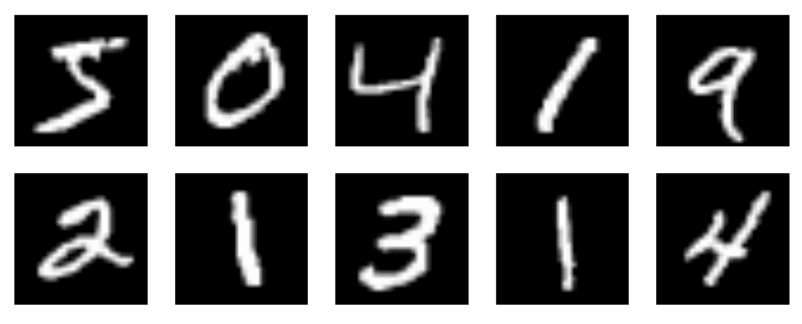

事实上，MNIST 数据集是 scikit-learn 提供的 NIST 数字数据集的继承者，我们以前使用过(`sklearn.datasets.load_digits`；参考[第 2 章](02.html)、*在 OpenCV* 中处理数据。一些显著的差异如下:

*   MNIST 图像比 NIST 图像(8 x 8 像素)大得多(28 x 28 像素)，因此更关注细微的细节，如失真和相同数字的图像之间的个体差异。
*   MNIST 数据集比 NIST 数据集大得多，提供了 60，000 个训练样本和 10，000 个测试样本(相比之下，NIST 图像的总数为 5，620 个)。

# 预处理 MNIST 数据集

正如我们在[第 4 章](04.html)、*中了解到的，表示数据和工程特性*有许多预处理步骤，我们可能希望在这里应用:

*   **居中**:重要的是图像中所有的数字都居中。例如，看一下上图中数字 1 的所有示例图像，它们都是由几乎垂直的一击组成的。如果图像没有对齐，打击可能位于图像的任何地方，这使得神经网络很难在训练样本中找到共性。幸运的是，MNIST 的图像已经居中。
*   **缩放**:对数字进行缩放也是如此，这样它们都有相同的大小。这样，冲击、曲线和循环的位置就很重要了。...

# 使用 OpenCV 训练 MLP

我们可以使用以下方法在 OpenCV 中设置和训练 MLP:

1.  实例化一个新的 MLP 对象:

```py
In [9]: import cv2
...     mlp = cv2.ml.ANN_MLP_create()
```

2.  指定网络中每一层的大小。我们可以随意添加任意数量的图层，但是我们需要确保第一个图层具有与输入要素相同数量的神经元(在我们的示例中为`784`)，最后一个图层具有与类标签相同数量的神经元(在我们的示例中为`10`)，同时有两个隐藏图层，每个图层都具有`512`节点:

```py
In [10]: mlp.setLayerSizes(np.array([784, 512, 512, 10]))
```

3.  指定激活功能。这里我们使用之前的 sigmoidal 激活函数:

```py
In [11]: mlp.setActivationFunction(cv2.ml.ANN_MLP_SIGMOID_SYM,
      ...                                2.5, 1.0)
```

4.  指定培训方法。这里，我们使用前面描述的反向传播算法。我们还需要确保选择足够小的学习率。由于我们有大约 10 个 <sup>5 个</sup>训练样本，所以最好将学习率设置为最多 10 个 <sup>-5 个</sup>:

```py
In [12]: mlp.setTrainMethod(cv2.ml.ANN_MLP_BACKPROP)
...      mlp.setBackpropWeightScale(0.00001)
```

5.  指定终止标准。这里，我们使用与之前相同的标准:运行 10 次迭代的训练(`term_max_iter`)或直到误差不再显著增加(`term_eps`):

```py
In [13]: term_mode = (cv2.TERM_CRITERIA_MAX_ITER + 
...                   cv2.TERM_CRITERIA_EPS)
...      term_max_iter = 10
...      term_eps = 0.01
...      mlp.setTermCriteria((term_mode, term_max_iter,
...                           term_eps))
```

6.  在训练集(`X_train_pre`)上训练网络:

```py
In [14]: mlp.train(X_train_pre, cv2.ml.ROW_SAMPLE, y_train_pre)
Out[14]: True
```

Before you call `mlp.train`, here is a word of caution: this might take several hours to run, depending on your computer setup! For comparison, it took just under an hour on my own laptop. We are now dealing with a real-world dataset of 60,000 samples: if we run 100 training epochs, we have to compute 6 million gradients! So beware.

训练完成后，我们可以计算训练集上的准确度分数，看看我们取得了多大的进步:

```py
In [15]: _, y_hat_train = mlp.predict(X_train_pre)
In [16]: from sklearn.metrics import accuracy_score
...      accuracy_score(y_hat_train.round(), y_train_pre)
Out[16]: 0.92976666666666663
```

但是，当然，真正重要的是我们从拖延的测试数据中得到的准确度分数，这在训练过程中没有考虑到:

```py
In [17]: _, y_hat_test = mlp.predict(X_test_pre)
...      accuracy_score(y_hat_test.round(), y_test_pre)
Out[17]: 0.91690000000000005
```

91.7%的准确率如果你问我的话一点也不差！你应该尝试的第一件事是改变前面`In [10]`中的图层大小，看看测试分数是如何变化的。当你向网络中添加更多的神经元时，你应该会看到训练分数的增加——希望测试分数也会随之增加。然而，将 *N* 神经元放在一层中并不等于将它们分散在几层中！你能证实这个观察吗？

# 使用 Keras 训练深度神经网络

尽管我们在前一届 MLP 取得了令人生畏的成绩，但我们的成绩并没有达到最先进的水平。目前，最佳结果的准确率接近 99.8%，比人类的表现还要好！这就是为什么，如今，手写数字分类的任务在很大程度上被认为已经解决。

为了更接近最先进的结果，我们需要使用最先进的技术。因此，我们回到喀拉斯。

# 预处理 MNIST 数据集

在以下步骤中，您将学习在数据被输入神经网络之前对其进行预处理:

1.  为了确保每次运行实验都得到相同的结果，我们将为 NumPy 的随机数生成器挑选一个随机种子。这样，从 MNIST 数据集中洗牌训练样本将总是产生相同的顺序:

```py
In [1]: import numpy as np
...     np.random.seed(1337)
```

2.  Keras 从 scikit-learn 的`model_selection`模块中提供了类似于`train_test_split`的加载功能。您可能会奇怪地熟悉它的语法:

```py
In [2]: from keras.datasets import mnist
...     (X_train, y_train), (X_test, y_test) = mnist.load_data()
```

In contrast to other datasets we have encountered so far, MNIST comes with a predefined train-test split. This allows the dataset to be used as a benchmark, as the test score reported by different algorithms will always apply to the same test samples.

3.  Keras 中的神经网络对特征矩阵的作用与标准的 OpenCV 和 scikit-learn 估计器略有不同。尽管 Keras 中特征矩阵的行仍然对应于样本的数量(在下面的代码中为`X_train.shape[0]`)，但是我们可以通过向特征矩阵添加更多维度来保持输入图像的二维特性:

```py
In [3]: img_rows, img_cols = 28, 28
...     X_train = X_train.reshape(X_train.shape[0], img_rows, img_cols, 1)
...     X_test = X_test.reshape(X_test.shape[0], img_rows, img_cols, 1)
...     input_shape = (img_rows, img_cols, 1)
```

4.  在这里，我们将特征矩阵重塑为四维矩阵，尺寸为`n_features` x 28 x 28 x 1。我们还需要确保我们操作的是[0，1]之间的 32 位浮点数，而不是[0，255]中的无符号整数:

```py
...     X_train = X_train.astype('float32') / 255.0
...     X_test = X_test.astype('float32') / 255.0
```

5.  然后，我们可以像以前一样对训练标签进行一次性编码。这将确保每一类目标标签都可以分配给输出层中的一个神经元。我们可以用 scikit-learn 的`preprocessing`来实现这一点，但是在这种情况下，使用 Keras 自己的实用函数更容易:

```py
In [4]: from keras.utils import np_utils
...     n_classes = 10
...     Y_train = np_utils.to_categorical(y_train, n_classes)
...     Y_test = np_utils.to_categorical(y_test, n_classes)
```

# 创建卷积神经网络

在以下步骤中，您将创建一个神经网络，并对之前预处理的数据进行训练:

1.  一旦我们对数据进行了预处理，就该定义实际的模型了。这里，我们将再次依靠`Sequential`模型来定义前馈神经网络:

```py
In [5]: from keras.model import Sequential... model = Sequential()
```

2.  然而，这一次，我们将对单个层更聪明。我们将围绕卷积层设计我们的神经网络，其中核心是一个 3×3 像素的二维卷积:

```py
In [6]: from keras.layers import Convolution2D...     n_filters = 32...     kernel_size = (3, 3)...     model.add(Convolution2D(n_filters, kernel_size[0], kernel_size[1],... border_mode='valid', ...
```

# 模型摘要

您还可以可视化模型的摘要，该摘要将列出所有图层以及它们各自的尺寸和每个图层包含的权重数。它还将为您提供有关网络中参数总数(权重和偏差)的信息:

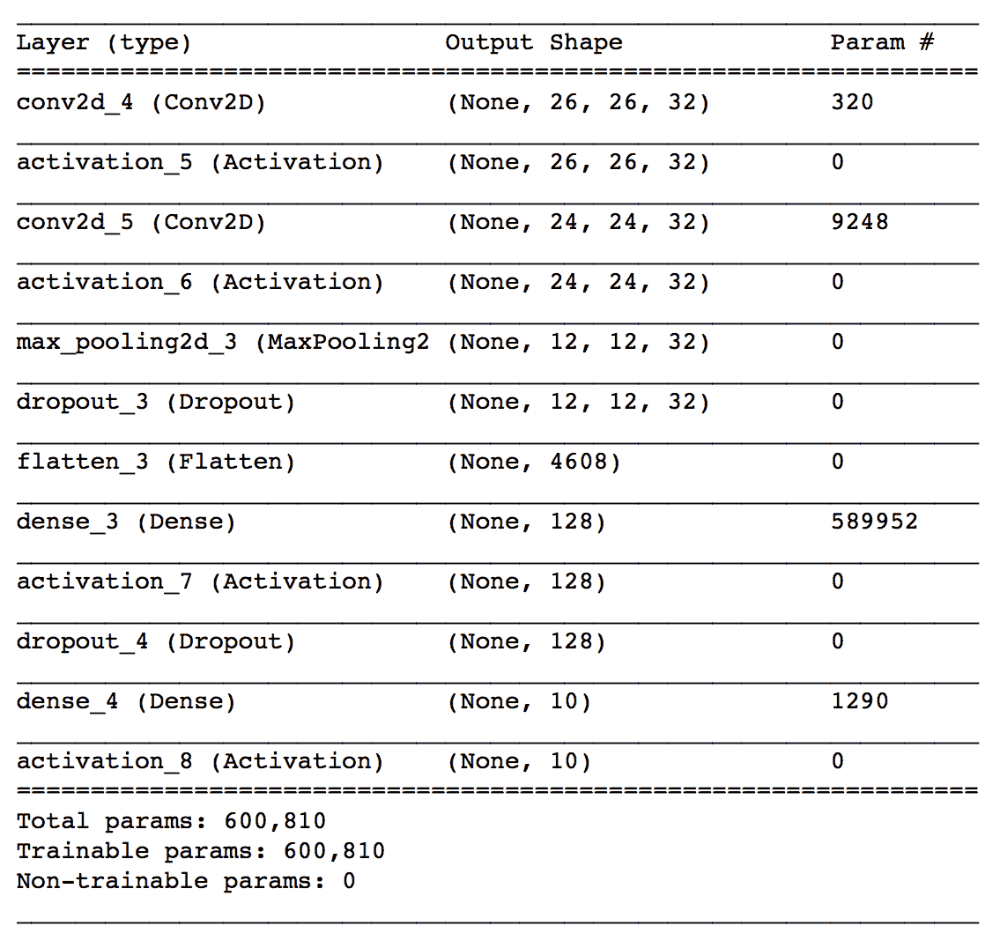

我们可以看到总共有 600，810 个参数将被训练，并且将需要大量的计算能力！请注意，我们如何计算每一层中的参数数量不在本书的讨论范围之内。

# 拟合模型

我们像处理所有其他分类器一样处理模型(注意，这可能需要一段时间):

```py
In [12]: model.fit(X_train, Y_train, batch_size=128, nb_epoch=12,...                verbose=1, validation_data=(X_test, Y_test))
```

训练完成后，我们可以评估分类器:

```py
In [13]: model.evaluate(X_test, Y_test, verbose=0)Out[13]: 0.99
```

我们达到了 99%的准确率！这与我们之前实现的 MLP 分类器截然不同。这只是做事的一种方式。正如你所看到的，神经网络提供了过多的调谐参数，而且根本不清楚哪一个会导致最好的性能。

# 摘要

在这一章中，作为一名机器学习实践者，我们在列表中添加了一大堆技能。我们不仅涵盖了人工神经网络的基础知识，包括感知器和 MLPs，我们还获得了一些先进的深度学习软件。我们学习了如何从头开始构建一个简单的感知器，以及如何使用 Keras 构建最先进的网络。此外，我们了解了神经网络的所有细节:激活函数、损失函数、层类型和训练方法。总而言之，这可能是迄今为止最密集的一章。

现在你已经知道了大多数基本的监督学习者，是时候谈谈如何将不同的算法组合成一个更强大的算法了。因此，在下一章中，我们将讨论如何构建集成分类器。