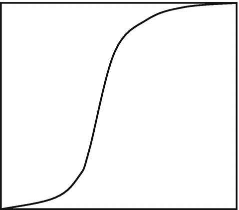
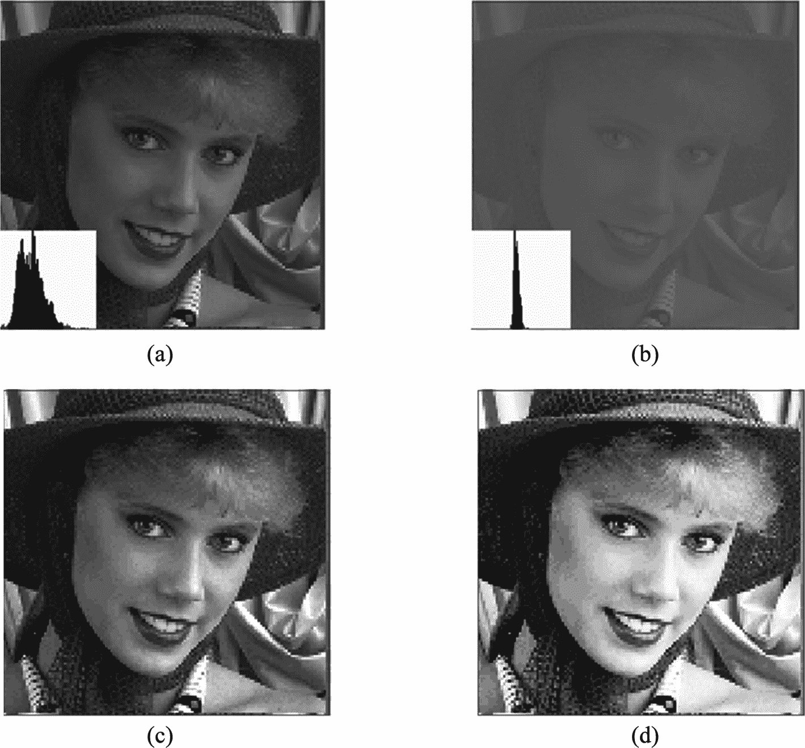
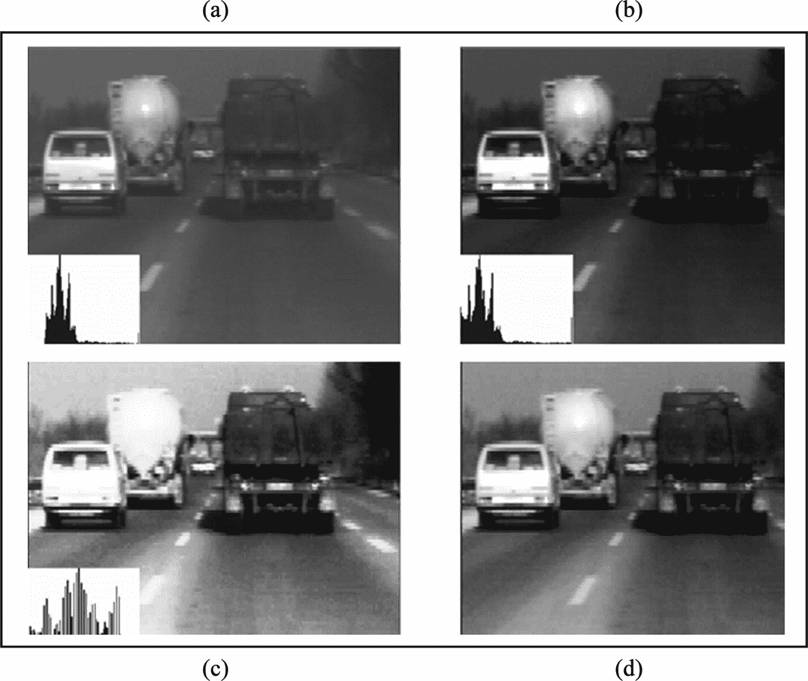
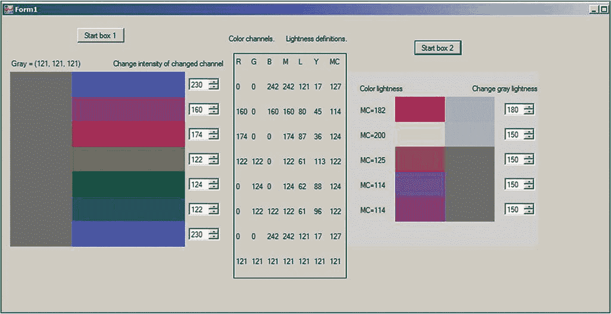
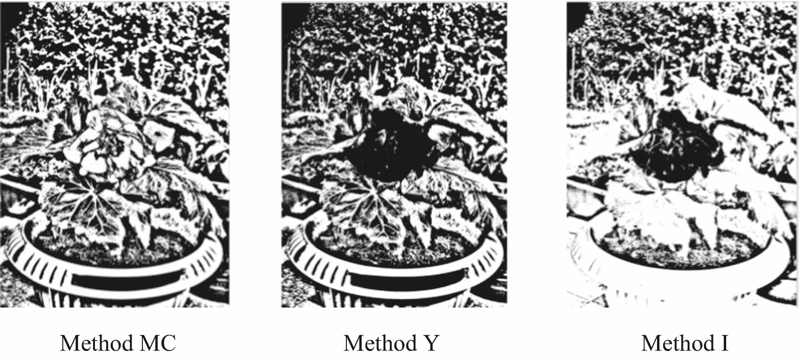
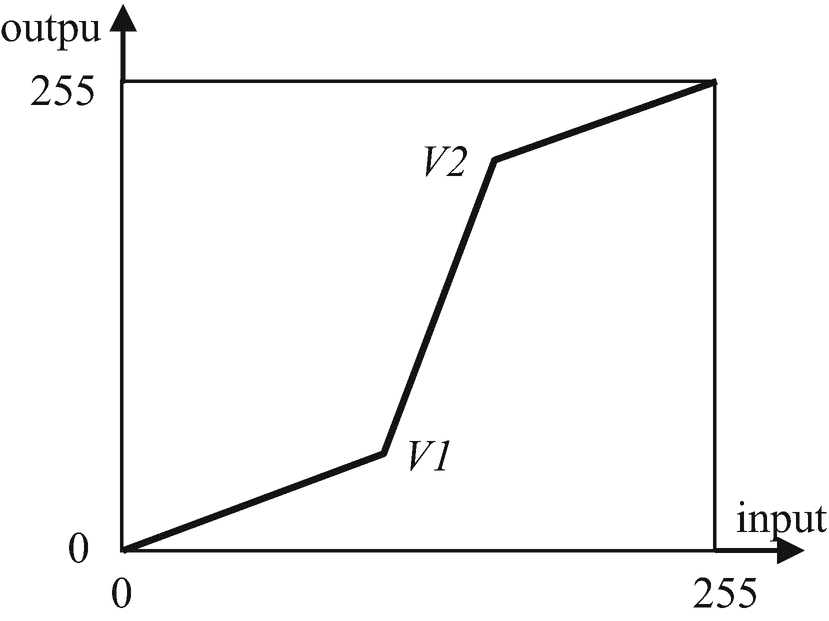
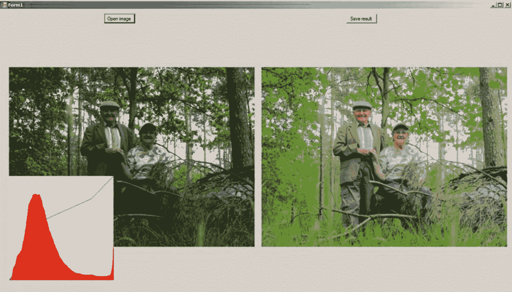

# 三、对比度增强

我们将数字图像的对比度定义如下:

*C*<sub>IP=(*李* <sub>*max*</sub> - *李*<sub>*min*</sub>)/*域*</sub>

其中*李* <sub>*max*</sub> 为最大值*李* <sub>*min*</sub> 为图像中的最小明度*域*为明度的域或差值的最大可能值*李*<sub>*max*-*李* <sub>*min*</sub> 。</sub>

刚刚定义的对比度度量显然取决于单个像素的亮度。为了获得更鲁棒的测量，有必要知道亮度值的频率:出现在少量像素中的值并不重要。频率包含在图像的直方图中。可以找到这样的亮度值`MinInp`和`MaxInp`，亮度低于`MinInp`和亮度高于`MaxInp`的像素数量小于预定值，我们称之为*丢弃区域*(因为像素数量是面积的度量)。则鲁棒对比度度量为

c<sub>r</sub>=(MaxInp–MinInp)/Domain。

## 自动线性对比度增强

大多数对比度增强程序，如 IrfanView，通过中间部分导数大于 1 的函数，使用图像中一组亮度值到另一组亮度值的映射(见图 3-1 )。



图 3-1

在其他程序中用于增加对比度的函数的图形示例

这里提出了另一种基于研究图像直方图的方法。我们算法的思想在于将图像中最低和最高亮度之间的间隔映射到整个间隔上；比如到`[0, 255]`上。重要的是要注意，具有极低或极高值的少量像素可以从本质上影响映射的结果。

因此，有必要从映射中排除具有极值的像素的预定部分(例如，1%)。为此，需要找到值`MinInp`和`MaxInp`，使得亮度小于`MinInp`和亮度大于`MaxInp`的像素数量小于图像中像素总数的 1%。

为了增加图像的对比度，我们必须增加最大和最小亮度之间的差异。这可以通过减少图像中亮度的小值并增加较大的值来实现。为了获得 1 的最大可能对比度，有必要以这样的方式变换亮度值，即用 0 代替`MinInp`和用 255 代替`MaxInp`，并且中间值单调变化；即，它们的顺序保持不变。

可以通过自动程序增加对比度。用户必须仅以图像大小的百分比来定义丢弃区域的值。建议使用查找表(LUT)来加快输出亮度的计算。LUT 是一个数组，包含尽可能多的输入值；例如 256 或从 0 到 255。LUT 的每个元素都包含预先计算的输出值。因此，只计算 256 次输出值就足够了，而不是宽度×高度的倍数，尽管宽度×高度的数值可能高达数千甚至数百万。从数组中获取一个值比计算这个值花费的时间要少得多。

也容易降低对比度。当计算 LUT 时，设置以下值就足够了:`MinInp=0`、`MaxInp=255`、`MinOut>0`和`MaxOut<255`。大幅降低对比度，然后自动提高，这是一个有趣的实验！

增加对比度的最简单方法(见图 3-2 )是通过以下分段线性变换:


图 3-2

最简单的分段线性对比度增强

```py
if (Linp <= MinInp) Lout = 0;
else if (Linp >= MaxInp) Lout = 255;
        else Lout = 255*(Linp - MinInp)/(MaxInp – MinInp);

```

这种非常简单的方法产生了非常好的结果，但对于包含大面积黑暗或大面积明亮区域的图像来说却不是这样。在这种情况下，当采用直方图均衡化方法时，有可能获得更好的结果，这将在下一节中解释。

## 直方图均衡

一些图像包含较大的低对比度暗区(参见图 3-3a )。先前描述的最简单的分段线性方法均匀地拉伸亮度值，而对于这样的图像，暗区域中的低值必须比其他区域中的值更强烈地分开。这种变换不能用最简单的分段线性方法来完成。



图 3-3

对比度变化的例子:(a)带直方图的原图；(b)直方图对比度降低；(c)线性对比度增强；直方图均衡化

增加这种图像的对比度的一个众所周知的想法是*直方图均衡化* *:* 有必要以这样一种方式转换亮度值，使得所有值获得几乎相同的频率。为了实现这一点，具有相对较高频率的灰度值 *inp* <sub>1</sub> 的像素(图 3-4a )必须被许多具有较低频率的不同灰度值的像素替换。这些灰度值 *out* <sub>1</sub> 、 *out* <sub>2</sub> 等等必须组成一个相邻值的序列(图 3-4b )。没有已知的方法来决定这些像素中的哪些必须获得某个值。幸运的是，这不是必须的:以平均频率保持不变的方式，用具有更大差值的其他值替换原始灰度值就足够了(图 3-4c )。这可以通过直方图均衡化来实现。


图 3-4

变换直方图以使频率或平均频率恒定:(a)具有大频率的直方图部分；(b)具有高频率的灰度值被许多具有较低频率的值代替；(c)具有使平均频率恒定的较大差值的值

为了实现直方图均衡，有必要计算累积直方图。这是一个有 256 个元素的整数数组。对应于亮度值 *L* 的元素包含亮度值小于或等于 *L* 的像素数量。为了计算 *L* 的累积直方图的值，将小于或等于 *L* 的所有值的常用直方图的值相加就足够了:

![$$ Cum\left[L\right]=\sum \limits_{i\le L} Hist\left[i\right]; $$](img/474294_1_En_3_Chapter_TeX_Equa.png)

直方图均衡化的 LUT 可以通过累积直方图来计算。大多数关于图像处理的教科书建议对 LUT 的元素使用以下公式:

*eq*[*l*= 255*cum*[*l*]/*max cum*；(3.1)

其中 *MaxCum* 是累积直方图的最大值，显然等于图像的尺寸宽度*高度。

然而，当使用该公式时，如果原始图像包含大量灰度值等于 *gMin，*的像素，这是直方图大于 0 的最小灰度值，则会出现困难。在这种情况下，通过根据等式 3.1 计算的 LUT 变换的图像可能非常差，因为许多像素具有与比 0 大得多的*和* [ *gMin* ]成比例的大灰度值。这种转换的一个例子如图 3-5b 所示。


图 3-5

直方图均衡的例子:(a)原始图像；(b)根据等式 3.1 用 LUT 变换；(c)根据等式 3.2 用 LUT 转换

为了解决这个问题，设置 LUT *等式*的第 *L* 个元素的值与差值*Cum*[*L*–*MinHist*成比例就足够了，而不是与 *Cum* [ *L* 成比例，其中*MinHist*=*Cum*[*gMin*]=*LUT 的元素必须根据以下公式计算:*

如果 *L* 小于或等于 *gMin* ，则*等式*[*L*]= 0；其他

*eq*[*l*]= 255(*cum**l*-*minorist*)/*max cum*

其中 *MaxCum=* width*height 为 *Cum* [ *L* 的最大值。

图 [3-5c 显示了根据等式 3.2 计算的 LUT 的变换示例。

直方图均衡化的结果并不总是令人满意的。因此，合理的做法是使用分段线性方法与均衡方法的组合，称为混合方法(见图 3-6 ):

*作战*[*【l】*]=*【w】**【lut】*[]+*(3.3)*

其中 *LUT*  *L* 为分段线性 LUT，权重 *W* <sub>1</sub> 和 *W* <sub>2</sub> 可以选择为和等于 1 的非负刹车。图 [3-6c 显示了使用 *CombiLUT* 与 *W* <sub>1</sub> = 0.2 *和 W* <sub>2</sub> = 0.8 的结果。



图 3-6

组合对比度增强:(a)原始图像；分段线性的；(c)直方图均衡；混合方法(20%)

## 测量彩色图像的亮度

为了定义彩色图像的对比度，需要计算每个像素的亮度或明度。在文献中，彩色像素的亮度有许多不同的定义。维基百科在论文“HSL 和 HSV”中提出了“明度”的不同定义；例如:

I = (R+G+B)/3 或

V = max(R，G，B)或

L = (max(R，G，B)+min(R，G，B))/2 或

Y = 0.30R + 0.59G + 0.11B

其中 *R* 、 *G、*和 *B* 分别是红色、绿色和蓝色通道的强度。作者开发了一个项目`WFluminance`来实验测试不同的亮度定义。

该项目在表单的左侧显示了八个不同颜色的矩形(图 3-7 ，并提供了通过相应的工具`numericUpDown`改变每个矩形的亮度而不改变其色调的可能性。每个彩色矩形的亮度已经改变，直到所有矩形看起来都具有相同的视觉上可接受的亮度，等于左边灰色矩形的亮度。众所周知，灰色具有彼此相等的所有三个颜色通道的强度:R = G = B。因此，可以假设灰色的亮度等于该恒定强度。



图 3-7

视觉亮度恒定的矩形

该项目根据不同的定义计算每个矩形的亮度值。结果如表 3-1 所示。从表 3-1 中可以看出，对于图 3-7 的所有八个矩形，MC 的值几乎是恒定的，看起来它们具有恒定的亮度。如图 3-7 右侧所示，其他颜色的 MC 值也测试成功，代表视觉亮度相等的矩形对。

表 3-1

根据不同定义的亮度值

<colgroup><col class="tcol1 align-left"> <col class="tcol2 align-left"> <col class="tcol3 align-left"> <col class="tcol4 align-left"> <col class="tcol5 align-left"> <col class="tcol6 align-left"> <col class="tcol7 align-left"> <col class="tcol8 align-left"> <col class="tcol9 align-left"></colgroup> 
| 

矩形

 | 

颜色

 | 

稀有

 | 

G

 | 

B

 | 

M

 | 

L

 | 

Y

 | 

主持人

 |
| --- | --- | --- | --- | --- | --- | --- | --- | --- |
| one | 蓝色 | Zero | Zero | Two hundred and forty-two | Two hundred and forty-two | One hundred and twenty-one | Seventeen | One hundred and twenty-seven |
| Two | 品红 | One hundred and sixty | Zero | One hundred and sixty | One hundred and sixty | Eighty | Forty-five | One hundred and fourteen |
| three | 红色 | One hundred and seventy-four | Zero | Zero | One hundred and seventy-four | Eighty-seven | Thirty-six | One hundred and twenty-four |
| four | 黄色 | One hundred and twenty-two | One hundred and twenty-two | Zero | One hundred and twenty-two | Sixty-one | One hundred and thirteen | One hundred and twenty-two |
| five | 格林（姓氏）；绿色的 | Zero | One hundred and twenty-four | Zero | One hundred and twenty-four | Sixty-two | Eighty-eight | One hundred and twenty-four |
| six | 蓝绿色 | Zero | One hundred and twenty-two | One hundred and twenty-two | One hundred and twenty-two | Sixty-one | Ninety-six | One hundred and twenty-two |
| seven | 蓝色 | Zero | Zero | Two hundred and forty-two | Two hundred and forty-two | One hundred and twenty-one | Seventeen | One hundred and twenty-seven |
| eight | 灰色的 | One hundred and twenty-one | One hundred and twenty-one | One hundred and twenty-one | One hundred and twenty-one | One hundred and twenty-one | One hundred and twenty-one | One hundred and twenty-one |

*注:M = max(R，G，B)；L = (M + min((R，G，B))；y = 0.2126 * R+0.7152 * G+0.0722 * R；MC = max(0.713*R，G，0.527*B)。*

右半部分颜色矩形左侧的文本显示矩形中颜色的 MC 值。项目的用户可以通过改变相应`numericUpDown`工具的值来改变相邻灰色矩形的灰度值，直到灰色矩形的视觉亮度等于彩色矩形的视觉亮度。如果`numericUpDown`的值近似等于 MC 值，则这证明 MC 方法给出了该颜色亮度的良好估计。如您所见，所有矩形的值大致相等。

有一个问题是彩色像素亮度的精确定义是否重要。此定义用于将彩色图像转换为灰度图像以及阴影校正。我们已经尝试使用不同的方法来计算彩色像素的亮度，同时将不同的彩色图像转换成灰度图像。在大多数情况下，结果并不取决于方法的选择。然而，在图 3-8 所示的例子中，当使用方法 Y(表 3-1 )时，彩色图像的相当大一部分消失了。

我们还测试了阴影校正的结果如何依赖于亮度测量方法的选择。与将彩色图像转换成灰度图像的情况类似，阴影校正的结果大多不取决于该选择。但是，有些图像的阴影校正强烈依赖于该选择。例如，参见图 3-9 中的图像。



图 3-9

阴影校正强烈依赖于亮度测量方法的图像示例；方法 Y 和方法 I


图 3-8

方法 Y 下零件消失的图像示例

考虑到刚才描述的结果，我们决定在任何地方都使用 MC 方法(作为方法`MaxC`)。

## 彩色图像的对比度

为了执行彩色图像的对比度增强，有必要计算亮度的直方图，然后像在灰度图像的情况下那样处理它。用于亮度变换的 LUT 的计算可以以与之前相同的方式进行，或者利用具有丢弃区域的分段线性规则，或者利用直方图均衡化。然而，为了改变颜色通道的强度，应该使用新的过程:需要为每个像素计算转换后的亮度与原始亮度的关系，然后将三个强度 *R* 、 *G、*和 *B* 中的每一个乘以该关系。例如，像素 *P* 的变换红色通道为:

*rt*=*【ro】**【lit/lio】*

其中 *RT* 和 *LiT* 是变换后的红色强度和亮度，而 *RO* 和 *LiO* 是像素 *P* 的红色强度和亮度的原始值。以这种方式，所有三种强度可以成比例地改变，并且色调保持不变，由此对比度增加。

## 手动控制对比度增强

一些照片具有相当不均匀的亮度，这是由被摄物体的不均匀照明引起的。照片的这一缺点可以通过直方图均衡化方法得到很大程度的纠正，直方图均衡化方法通常是一种很好的对比度增强方法。但是，有时需要在查看结果的同时更正 LUT 的内容。

一些建议的图像处理程序(例如，Photoshop)包含允许将 LUT 的图形制作成贝塞尔曲线的工具，贝塞尔曲线是具有连续导数的平滑曲线。然而，这是一个坏主意，因为由 LUT 实现的函数一定不是平滑的。它必须是连续的，更重要的是，单调递增的。贝塞尔曲线并不总是满足最后一个条件。如果 LUT 的函数不是单调递增的，那么得到的图像几乎不会失真。

将 LUT 函数定义为如图 3-10 所示的分段线性单调递增的直线要简单得多。



图 3-10

LUT 的分段线性函数

断点 *V1* 和 *V2* 可以通过鼠标点击来定义。转换后的图像必须在断点定义后立即显示。

我们开发了 Windows 窗体项目`WFpiecewiseLinear`来实现这个过程。运行项目的形式如图 3-11 所示。



图 3-11

运行项目的形式示例`WFpiecewiseLinear`

该表单包含两个按钮。当用户单击打开图像时，他或她可以选择一个图像。图像将显示在左边的图片框中。同时，图像的副本出现在右边的图片框中。图像的直方图出现在表单的左下角，蓝色线条显示 LUT 的函数图。用户现在可以点击线附近的两个点。线以这样一种方式改变，即它的断点位于被单击的点上。LUT 相应变化，用户可以观察到右边图片框中图像的选择。一旦用户对图像的外观感到满意，他或她就可以单击保存结果。然后，用户可以选择名称并保存结果图像。保存图像的类型可以是`Bmp`或`Jpg`。

如前一部分所解释的，为了计算颜色通道的新强度，有必要通过 LUT 计算像素的新亮度，然后将每个旧的颜色强度乘以新亮度，并除以旧亮度。必须对图像的每个像素执行该过程。由于乘法和除法，这花费了太多的时间，并且变换后的图像出现延迟。

为了使变换图像的计算更快，我们开发了一种使用`bigLUT`的方法。这是一个颜色通道的新强度的 2 <sup>16</sup> = 65，536 个值的 LUT。作为该表的一个参数，我们使用一个整数，其较低值字节是旧的颜色强度，第二个字节是亮度的旧值(不使用字节 3 和 4 ),取自先前准备的原始图像的灰度值版本。新色彩强度的 65，536 个值中的每一个都等于旧色彩强度与 LUT 值的乘积除以旧亮度。这些值在定义`bigLUT`时只计算一次。在项目运行期间，只需为每个像素计算自变量。新的强度仅仅是从`bigLUT`中读出的。下面是计算`bigLUT`的方法代码:

```py
    int[] bigLUT = new int[65536];

    private void makeBigLUT(int[] LUT)
    { for (int colOld = 0; colOld < 256; colOld++)  // old color intensity
       { for (int lightOld = 1; lightOld < 256; lightOld++) //old lightness
          { int colNew = colOld * LUT[lightOld] / lightOld;
             int arg = (lightOld << 8) | colOld;
             bigLUT[arg] = colNew;
          }
       }
    }

```

接下来是项目最重要部分的源代码。当单击“打开图像”按钮时，第一部分开始。这个部分打开图像，生成位图`origBmp`，定义类`CImage`的三个对象，并用`origBmp`的内容填充对象`origIm`。软件`WindowsForms`建议通过`GetPixels`的方法访问位图的像素，这个方法比较慢。我们开发了一个更快的方法`BitmapToGrid`，它使用了类`Bitmap`的方法`LockBits`。然而，`BitmapToGrid`不应该用于每像素 8 位的索引位图，因为这些位图包含一个调色板，像素值总是由调色板值定义。因此，对于 8 位索引位图，方法`BitmapToGrid`变得太慢。对于这样的位图，我们使用带有`GetPixel`的标准方法。

此外，我们项目的第一部分使用我们的方法`MaxC`计算彩色像素的亮度，用方法`ColorToGrayMC`将原始图像`origIm`转换成灰度图像`origGrayIm`。它还计算`origGrayIm`的直方图，绘制`pictureBox3`中的直方图，计算包含分段线性曲线(没有对比度增强)的值的标准 LUT，并绘制代表标准 LUT 的函数的线。它还将图像`contrastIm`定义为结果图像，通过类似于前面提到的方法`BitmapToGrid`的快速方法`GridToBitmap`在位图`ContrastBmp`中制作其副本，并在`pictureBox2`中显示`ContrastBmp`。

```py
private void button1_Click(object sender, EventArgs e) // Open image
{
  OpenFileDialog openFileDialog1 = new OpenFileDialog();
  if (openFileDialog1.ShowDialog() == DialogResult.OK)
  {
    try
    {
      origBmp = new Bitmap(openFileDialog1.FileName);
      pictureBox1.Image = origBmp;
    }
    catch (Exception ex)
    {
      MessageBox.Show("Error: Could not read file from disk. Original error: " +
        ex.Message);
    }
  }
  width = origBmp.Width;
  height = origBmp.Height;

  origIm = new CImage(width, height, 24);
  origGrayIm = new CImage(width, height, 8);  // grayscale version of origIm
  contrastIm = new CImage(width, height, 24);

  if (origBmp.PixelFormat == PixelFormat.Format8bppIndexed)
  {
    progressBar1.Visible = true;

    Color color;
    int y2 = height / 100 + 1, nbyte = 3;
    for (int y = 0; y < height; y++) //=====================
    {
      if (y % y2 == 1) progressBar1.PerformStep();
      for (int x = 0; x < width; x++) //=================
      {
        int i = x + width * y;
        color = origBmp.GetPixel(i % width, i / width);
        for (int c = 0; c < nbyte; c++)
        {
          if (c == 0) origIm.Grid[nbyte * i] = color.B;
          if (c == 1) origIm.Grid[nbyte * i + 1] = color.G;
          if (c == 2) origIm.Grid[nbyte * i + 2] = color.R;
        }
      } //========= end for ( int x... =================
    } //========== end for ( int y... ==================
    progressBar1.Visible = false;
  }
  else BitmapToGrid(origBmp, origIm.Grid);

  // Calculating the histogram:
  origGrayIm.ColorToGrayMC(origIm, this);
  for (int gv = 0; gv < 256; gv++) histo[gv] = 0;
  for (int i = 0; i < width * height; i++) histo[origGrayIm.Grid[i]]++;
  MaxHist = 0;
  for (int gv = 0; gv < 256; gv++) if (histo[gv] > MaxHist)

MaxHist = histo[gv];
  MinGV = 255;
  MaxGV = 0;
  for (MinGV = 0; MinGV < 256; MinGV++)
    if (histo[MinGV] > 0) break;
  for (MaxGV = 255; MaxGV >= 0; MaxGV--)
    if (histo[MaxGV] > 0) break;

  // Drawing the histogram:
  Graphics g = pictureBox3.CreateGraphics();
  SolidBrush myBrush = new SolidBrush(Color.LightGray);
  Rectangle rect = new Rectangle(0, 0, 256, 256);
  g.FillRectangle(myBrush, rect);

  Pen myPen = new Pen(Color.Red);
  Pen greenPen = new Pen(Color.Green);
  for (int gv = 0; gv < 256; gv++)
  {
    int hh = histo[gv]*255/MaxHist;
    if (histo[gv] > 0 && hh < 1) hh = 1;
    g.DrawLine(myPen, gv, 255, gv, 255 - hh);
    if (gv == MinGV || gv == MaxGV)
      g.DrawLine(greenPen, gv, 255, gv, 255 - hh);
  }

  // Calculating the standard LUT:
  int[] LUT = new int[256];
  int X = (MinGV + MaxGV) / 2;
  int Y = 128;
  for (int gv = 0; gv < 256; gv++)
  {
    if (gv <= MinGV) LUT[gv] = 0;
    if (gv > MinGV && gv <= X) LUT[gv] = (gv - MinGV) * Y / (X - MinGV);
    if (gv > X && gv <= MaxGV) LUT[gv] = Y + (gv - X) * (255 - Y) / (MaxGV - X);
    if (gv >= MaxGV) LUT[gv] = 255;
  }

  // Drawing the standard curve:

  int yy = 255;
  Pen myPen1 = new Pen(Color.Blue);
  g.DrawLine(myPen1, 0, yy, MinGV, yy);
  g.DrawLine(myPen1, MinGV, yy, X, yy - Y);
  g.DrawLine(myPen1, X, yy - Y, MaxGV, 0);
  g.DrawLine(myPen1, MaxGV, 0, yy, 0);

  // nbyte = 3;  origIm and contrastIm are both 24-bit images
  for (int i = 0; i < nbyte * width * height; i++) contrastIm.Grid[i] = (byte)LUT[(int)origIm.Grid[i]];

  ContrastBmp = new Bitmap(width, height, PixelFormat.Format24bppRgb);
  progressBar1.Visible = true;
  GridToBitmap(ContrastBmp, contrastIm.Grid);
  pictureBox2.Image = ContrastBmp;
  progressBar1.Visible = false;
} //***************** end Open image ***********************************

```

在第二章中描述了将位图内容快速复制到`CImage`类图像的方法`BitmapToGrid`。方法`GridToBitmap`类似，所以我不在这里介绍。

项目中用于控制`LUT`形状的部分允许用户在包含直方图图像的`pictureBox3`中点击两次，从而定义 LUT 分段线性曲线的尼克斯点。该部分使用了`Form1`中定义的整数变量`cntClick`、`X1`、`Y1`、`X2`和`Y2`。变量`cntClick`对点击进行计数，但是它的值`3`立即被`1`替换，因此它只能取值`1`和`2`。

当`cntClick`等于`1`时，则第一个拐点`V1`的坐标`X1`和`Y1`(图 3-11 )由点击点定义。从直方图的起点到计算点(`X1, Y1`)的分段线性曲线的第一个分支。

当`cntClick`等于`2`时，则定义第二个尼克斯点`V2`的坐标`X2`和`Y2`(图 3-11 )。用户应设置该点，使`X2`大于`X1`且`Y2`大于`Y1`。如果碰巧`X2`小于`X1`，那么`X2`被设置为`X1 + 1`；类似地`Y2`。因此分段线性曲线总是保持单调。计算从点(`X1, Y1`)到点(`X2, Y2`)的分段线性曲线的第二个分支和从点(`X2, Y2`)到直方图终点的第三个分支。然后如前所述计算 LUT `bigLUT`，并在`pictureBox2`中计算和显示对比图像。

下面是计算 LUT 并同时显示结果图像的部分代码。

```py
private void  pictureBox3_MouseDown(object sender, MouseEventArgs e)
// making new LUT and the resulting image
{
  int nbyte = 3;
  Graphics g = g2Bmp;  //pictureBox3.CreateGraphics();
  SolidBrush myBrush = new SolidBrush(Color.LightGray);
  Rectangle rect = new Rectangle(0, 0, 256, 256);

  cntClick++;
  if (cntClick == 3) cntClick = 1;
  int oldX = -1, oldY = -1;

  if (cntClick == 1)
  {
    X1 = e.X;
    if (X1 < MinGV) X1 = MinGV;
    if (X1 > MaxGV) X1 = MaxGV;
    Y1 = 255 - e.Y; // (X, Y) is the clicked point in the graph of the LUT
    if (X1 != oldX || Y1 != oldY) //---------------------------------------
    {
      // Calculating the LUT for X1 and Y1:
      for (int gv = 0; gv <= X1; gv++)
      {
        if (gv <= MinGV) LUT[gv] = 0;
        if (gv > MinGV && gv <= X1) LUT[gv] = (gv - MinGV) * Y1 / (X1 - MinGV);
        if (LUT[gv] > 255) LUT[gv] = 255;

      }
    }
    oldX = X1;
    oldY = Y1;

  }

  if (cntClick == 2)
  {
    X2 = e.X;
    if (X2 < MinGV) X2 = MinGV;
    if (X2 > MaxGV) X2 = MaxGV;
    if (X2 < X1) X2 = X1 + 1;
    Y2 = 255 - e.Y; // (X2, Y2) is the second clicked point in the graph of the LUT
    if (Y2 < Y1) Y2 = Y1 + 1;

    if (X2 != oldX || Y2 != oldY) //---------------------------------------
    {
      // Calculating the LUT for X2 and Y2:
      for (int gv = X1 + 1; gv < 256; gv++)
      {
        //if (gv <= MinGV) LUT[gv] = 0;
        if (gv > X1 && gv <= X2) LUT[gv] = Y1 + (gv - X1) * (Y2 - Y1) / (X2 - X1);
        if (gv > X2 && gv <= MaxGV)
                                    LUT[gv] = Y2 + (gv - X2) * (255 - Y2) / (MaxGV - X2);
        if (LUT[gv] > 255) LUT[gv] = 255;

        if (gv >= MaxGV) LUT[gv] = 255;
      }
    }
    oldX = X2;
    oldY = Y2;
  }

  Pen myPen1 = new Pen(Color.Blue);
  makeBigLUT(LUT);

  // Drawing the curve for LUT:
  g.FillRectangle(myBrush, rect);

  Pen myPen = new Pen(Color.Red);
  g.DrawLine(myPen, MinGV, 255, MinGV, 250);
  for (int gv = 0; gv < 256; gv++)
  {
    int hh = histo[gv] * 255 / MaxHist;
    if (histo[gv] > 0 && hh < 1) hh = 1;
    g.DrawLine(myPen, gv, 255, gv, 255 - hh);
  }

  int yy = 255;
  g.DrawLine(myPen1, 0, yy-LUT[0], MinGV, yy-LUT[0]);
  g.DrawLine(myPen1, MinGV, yy - LUT[0], X1, yy - LUT[X1]);
  g.DrawLine(myPen1, X1, yy - LUT[X1], X2, yy - LUT[X2]);
  g.DrawLine(myPen1, X2, yy - LUT[X2], MaxGV, 0);
  g.DrawLine(myPen1, MaxGV, 0, 255, 0);

  // Calculating 'contrastIm':
  int[] GV = new int[3];
  int arg, colOld, colNew;
  for (int i = 0; i < nbyte * width * height; i++) contrastIm.Grid[i] = 0;
  progressBar1.Visible = true;
  int y3 = 1 + nbyte * width * height / 100;

  for (int y = 0, yn=0; y < width * height; y += width, yn+=nbyte * width) //======
  {
    if (y % y3 == 1) progressBar1.PerformStep();
    for (int x = 0, xn=0; x < width; x++, xn+=nbyte)

    {
      int lum = origGrayIm.Grid[x + y];
      for (int c = 0; c < nbyte; c++)
      {
        colOld = origIm.Grid[c + xn + yn]; // xn + yn = nbyte*(x + width * y);
        arg=(lum << 8) | colOld;
        colNew = bigLUT[arg];
        if (colNew > 255) colNew = 255;
        contrastIm.Grid[c + xn + yn] = (byte)colNew;
      }
    }
  } //================ end for (int y = 0 ... ======================
  progressBar1.Visible = false;

  // Calculating "ContrastBmp":
  GridToBitmap(ContrastBmp, contrastIm.Grid);
  pictureBox2.Image = ContrastBmp;
  pictureBox3.Image = BmpPictBox3;
  progressBar1.Visible = false;
} //****************** end pictureBox3_MouseDown ***********************

```

还有一小部分代码用于保存结果图像。它使用对话框`SaveFileDialog`。如果用户想要将结果图像保存到输入原始图像的文件中，一些附加操作是必要的。输入文件的名称`OpenImageFile`必须确定并保存在程序部分`Open image`中。此外，必须定义一个名为`tmpFileName`的临时文件。生成的图像保存在`tmpFileName`文件中。那么必须调用下面的方法:

```py
File.Replace(tmpFileName, OpenImageFile,
       OpenImageFile.Insert(OpenImageFile.IndexOf("."), "BuP"));

```

该方法将`tmpFileName`的内容复制到输入文件`OpenImageFile`，删除`tmpFileName`，并将输入文件的旧内容保存到新文件中，新文件的名称是通过在`.`字符前的`OpenImageFile`中插入字符串`BuP`产生的。以下是项目这一部分的代码。

```py
private void button2_Click(object sender, EventArgs e)  // Save result
{
  SaveFileDialog dialog = new SaveFileDialog();
  dialog.Filter =
       "Image Files(*.BMP;*.JPG;*.GIF)|*.BMP;*.JPG;*.GIF|All files (*.*)|*.*";
  if (dialog.ShowDialog() == DialogResult.OK)
  {
    string tmpFileName;
    if (dialog.FileName == OpenImageFile)
    {
      tmpFileName = OpenImageFile.Insert(OpenImageFile.IndexOf("."), "$$$");
      if (dialog.FileName.Contains("jpg"))
            ContrastBmp.Save(tmpFileName, ImageFormat.Jpeg); // saving tmpFile
      else ContrastBmp.Save(tmpFileName, ImageFormat.Bmp);

      origBmp.Dispose();
      File.Replace(tmpFileName, OpenImageFile,
                     OpenImageFile.Insert(OpenImageFile.IndexOf("."), "BuP"));
      origBmp = new Bitmap(OpenImageFile);
      pictureBox1.Image = origBmp;
    }
    else
    {
      if (dialog.FileName.Contains("jpg"))
             ContrastBmp.Save(dialog.FileName, ImageFormat.Jpeg);
      else ContrastBmp.Save(dialog.FileName, ImageFormat.Bmp);
    }
    MessageBox.Show("The result image saved under " + dialog.FileName);
  }
} //****************** end Save result ******************************

```

图 3-12 显示了使用所述项目获得的对比度增强的示例。该项目可用于增强彩色和灰度图像的对比度。


图 3-12

项目`WFpiecewiseLinear`的对比度增强示例

项目`WFpiecewiseLinear`可以在本书的源代码中找到。