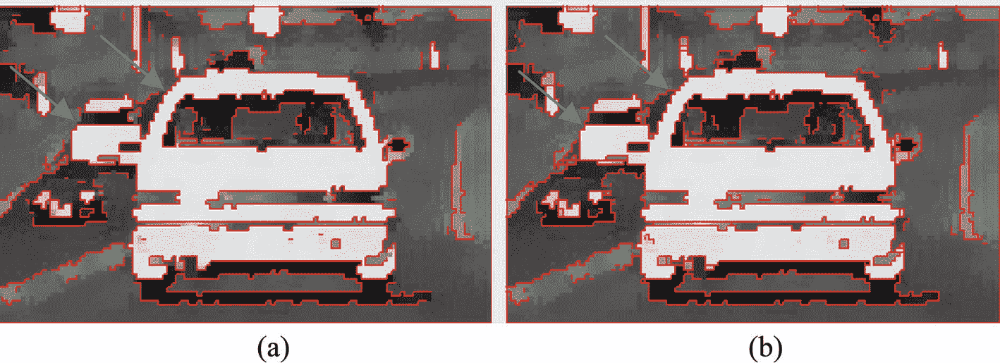
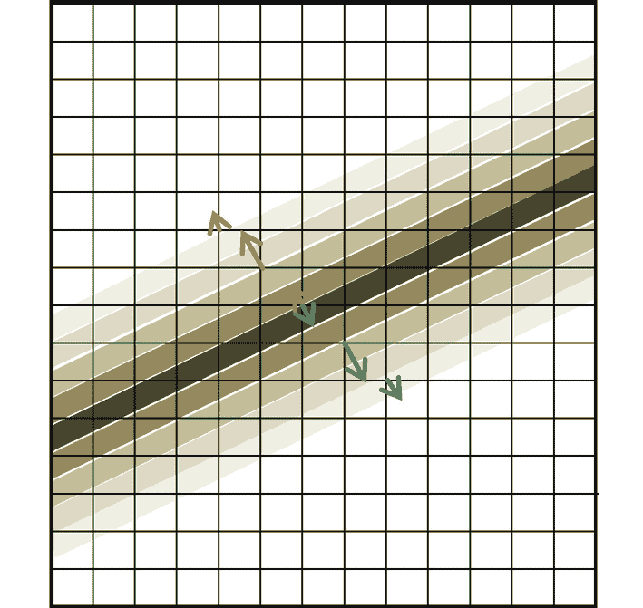
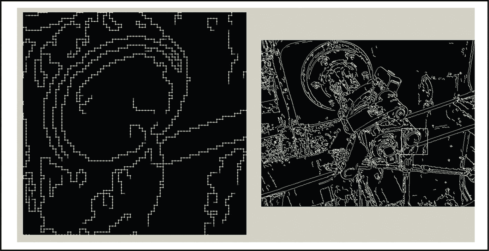
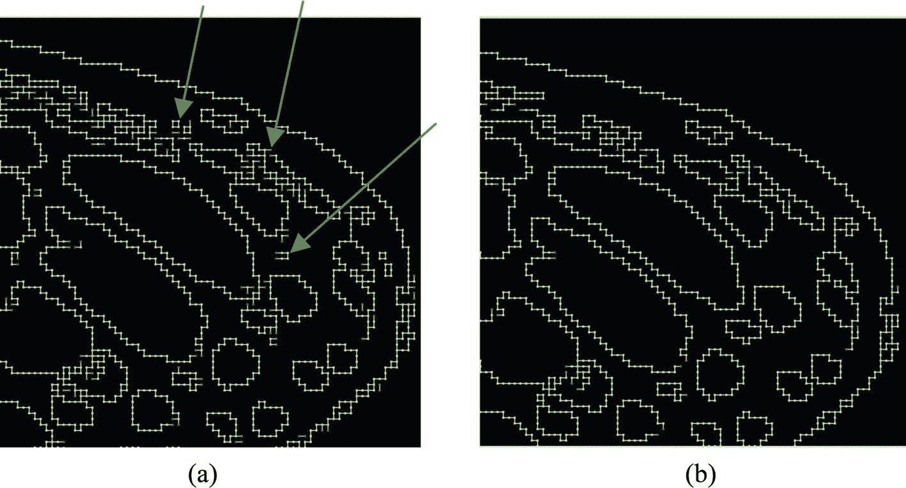
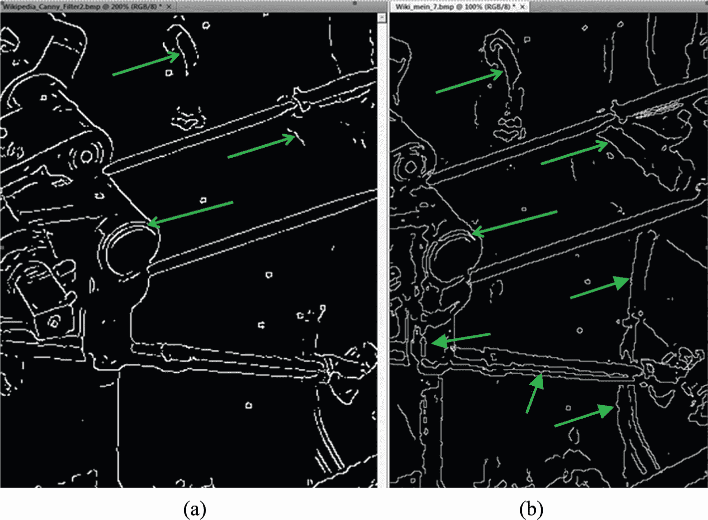
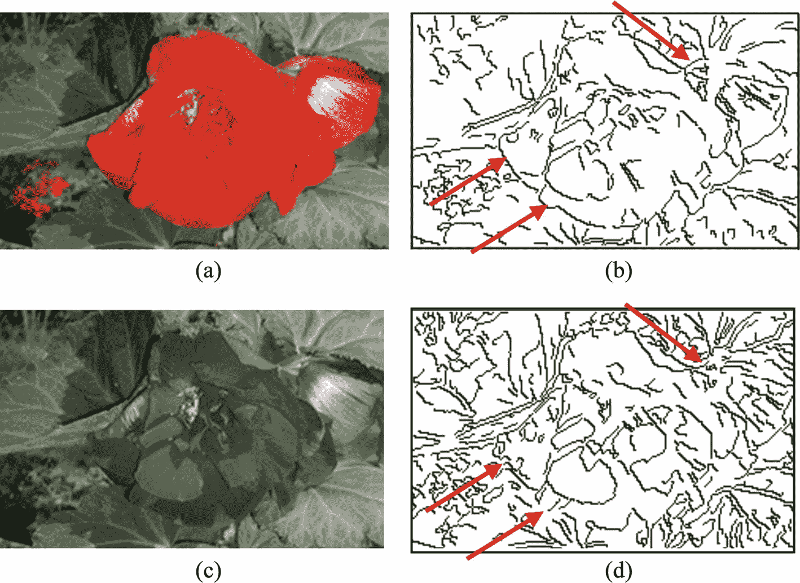

# 七、一种新的边缘检测方法

如图 6-11 的示例所示，sigma 和极值滤波器的实施提高了拉普拉斯过零的质量，从而也提高了边缘的质量。需要强调的是，这两种滤波器极大地提高了图像的质量，使得应用最简单的边缘检测方法成为可能。这是灰度值梯度的*二值化:*

度**(*、*和*)=*【gv】*、*和【y】******

度*和* ( *x* 、*和* ) = *GV x* 、*和*——*gv*

这里 *GV* ( *x* ， *y* )是像素的灰度值( *x* ， *y* )。必须将| Grad<sub>*x*</sub>(*x*， *y* )|和| Grad<sub>*y*</sub>(*x*， *y* )|的值与一个阈值进行比较。如果| Grad<sub>*x*</sub>(*x*， *y* )|的值大于阈值，则有一小块边缘位于像素( *x* ， *y* )和(*x—*1*，y* )之间。对于| Grad*(*x*， *y* )|:如果该值大于阈值，则边缘在像素( *x* ， *y* )和( *x* ，*y—*1)之间运行。*

 *在彩色图像的情况下，我们使用像素的色差( *x* <sub>1</sub> 、 *y* <sub>1</sub> )和( *x* <sub>2</sub> 、 *y* <sub>2</sub> )。我们称这种方法为二值化梯度。这是像素的颜色通道的强度差的绝对值之和:

difcolor =∑color(*I*、*x*<sub>、*和*<sub>)–color(*I*，，</sub></sub>

其中 color( *i* ， *x* ， *y* <sub>1</sub> )是像素的第 *i* 个颜色通道的强度( *x* <sub>1</sub> ， *y* <sub>1</sub> )，对于 color( *i* ，*x*<sub>2</sub>

图 7-1 显示了使用拉普拉斯零交叉(a)和二值化梯度(b)的边缘检测结果的比较示例。你可以看到这些图像几乎是一样的。



图 7-1

拉普拉斯零交叉(a)和二值化梯度(b)

比较绿色箭头指示的位置:通过二值化梯度找到的边缘没有由于过零方法的基本误差而在过零边缘出现的间隙。当使用色差时，边缘的进一步处理变得更加精确。

## 用于编码边缘的装置

对边缘进行编码不是一个简单的问题:例如，如果发现一对色差很大的像素( *x* 、 *y* )和(*x*–1、 *y* )，那么必须在包含边缘的图像中标记一个指示边缘位置的像素。假设我们决定用边缘来标记图像中的像素( *x* ， *y* )。在像素对( *x* 、 *y* )和( *x* 、*y*–1)的情况下，我们决定标记像素( *x* 、 *y* )。然后，在图 7-2 所示的具有不同边缘元素的三种情况下，阈值等于 40，同一像素，即阴影像素，将被标记，并且不可能在这三种情况之间进行区分。


图 7-2

边缘不同的三幅图像

如果我们决定用大的色差来标记一对相邻像素中的另一个像素，那么在其他图像的情况下也会发生相同的情况。解决这个问题的唯一可能的方法是引入另一种编码边缘的结构，即包含像素和位于两个相邻像素之间的边缘元素的不同元素的结构。这种结构被称为抽象细胞复合体(ACC 参见 Kovalevsky，1989，2008)。

## 抽象细胞复合体的概念

我们在这里将数字平面视为一个二维的细胞复合体，而不是一组像素(见图 7-3 )。因此，我们的数字平面除了像素之外还包含裂缝和点，它们被认为是小正方形。*裂缝*是这些方块的边；*点*是裂缝的端点，因此是像素的角。点是零维单元，裂缝是一维单元，像素是二维单元。


图 7-3

包含阴影子集裂纹边界的小型二维复合体的示例

将平面视为抽象的细胞复合体有许多优点:不再有第八章中描述的连通性悖论，子集的边界变成了面积为零的细曲线，区域的边界和它的补的边界是相同的，等等。数字曲线尤其是数字直线的定义和处理变得更加简单和清晰。从图像的经济编码和精确重建的角度来看，最重要的优点是能够通过极其简单和快速的算法(参见 Kovalevsky，(1990))来填充裂纹边界的内部，这在将边界表示为像素组时是不能应用的。

本节的其余部分包含对本演示重要的拓扑概念的简短总结。更多细节和拓扑基础请参考 Kovavlevsky (2008)。熟悉细胞复合体的读者可以跳过这一节的其余部分。

单元之间存在一种约束关系:一个较低维度的单元可能会约束一些较高维度的单元。回头参考图 7-3 所示的小型二维复合体的例子。像素被表示为正方形的内部，裂缝被表示为正方形的边，点(即 0 单元)是裂缝的端点，同时也是像素的角。

现在让我们介绍一些我们在续集中需要的概念。复合体的子集 *S* 的*边界裂缝*是将属于 *S* 的像素与不属于 *S* 的另一个像素分开的裂缝。图 7-3 中阴影子集的边界裂纹绘制为粗线。子集 *S* 的*边界*(也称为*裂纹边界*)是 *S* 的所有边界裂纹以及这些裂纹的所有端点的集合。边界不包含像素，因此是一个面积为零的稀疏集合。边界的连通子集称为*边界曲线*。关于连通性的概念，请参考 Kovalevsky (1989)。

我们认为数字平面是一个*笛卡尔二维复合体；*即作为平面坐标轴的两个一维复形的笛卡尔积。 *x* 坐标是一行的编号； *y* 坐标是行号。我们在这里使用计算机图形的坐标系统；即正 *x* 轴从左向右运行，正 *y* 轴从上向下运行。

为了保存`detected`边缘，我们需要一种特殊的 ACC:`Cartesian two-dimensional ACC``.`使用这种 ACC，引入细胞坐标成为可能。与数字图像的情况完全一样， *x* 坐标是一列的编号，而 *y* 坐标是一行的编号。

对于数字图像，我们使用通常的坐标，其中 *x* 从 0 变化到*宽度*–1， *y* 从 0 变化到*高度*–1。我们称这些坐标为*标准。*ACC 中代表*宽* × *高*像素图像的单元格坐标面积更大: *x* 坐标从 0 变为 2* *宽*， *y* 从 0 变为 2* *高*。因此，表示宽度为*×高度为像素的图像的 ACC 的大小具有(2* *宽度为* + 1) × (2* *高度为* + 1)个单元的大小。我们将图像中代表给定数字图像 ACC 的细胞坐标称为*组合坐标。*我们称包含 ACC 的图像为组合坐标中的*图像。**

 *注意，像素的组合坐标 *x* 和 *y* 都是奇数，而垂直裂纹的 *x* 坐标是偶数，其 *y* 坐标是奇数。在水平裂纹的情况下，情况相反:它的 *x* 坐标是奇数，而它的 *y* 坐标是偶数。一个点的两个组合坐标都是偶数。

在我们的一些项目中，我们处理检测到的边缘。例如，为了分析对象的形状，用多边形来近似检测到的边缘是相当方便的。要找到多边形，我们必须沿着边走。与通常只包含像素的图像相比，在组合坐标中跟踪图像的边缘要简单和方便得多。在我们的项目中，组合坐标中的图像被称为`CombIm`。

## 一种简单的边缘编码方法

该方法使用包含单元复合体的图像`CombIm`,该单元复合体的尺寸对应于已处理图像的尺寸:宽度`CombIm`等于 2 *宽度+ 1，高度等于 2 *高度+ 1，其中宽度和高度是已处理图像的尺寸。添加+ 1 是必要的，以便为右边的点和`CombIm`的底部边界留出位置，这有时对处理很重要。

方法`LabelCells`一行接一行地读取由极值滤波器处理的图像，并为每个像素( *x，y* )测试该像素( *x，y* )与其相邻像素之一(*x-*1*y*)和( *x，y-*1)的颜色的绝对差值是否大于给定的阈值。阈值可以由用户定义，用户应该知道在低阈值下，边缘裂纹的数量变大，并且边缘的某些部分变厚的概率也很大。阈值的正确值应该通过实验找到。

如果像素( *x，y* )和(*x—*1*，y* )的色差的绝对值大于阈值，则位于这些像素之间的垂直裂纹获得标记`1`。类似地，如果像素( *x，y* )和( *x，y—*1)的色差大于阈值，则相应的水平裂缝被标记为`1`。

与裂纹相关的两个点的标记将同时增加。如果一个点与许多裂纹相关联(最多可以有四个关联裂纹)，则该点的标签会增加许多倍。有限地，一个点的标号的值等于与该点相关的裂纹的数量。该信息可以在编码边缘的处理过程中使用。

下面是`LabelCells`方法的源代码。

```py
public void LabelCells(int th, CImage Image3)
{
  int difH, difV, nbyte, NXB = Image3.width, x, y;
  byte Lab = 1;
  if (Image3.N_Bits == 24) nbyte = 3;
  else nbyte = 1;
  for (x = 0; x < width * height; x++) Grid[x] = 0;

  byte[] Colorh = new byte[3];
  byte[] Colorp = new byte[3];
  byte[] Colorv = new byte[3];

  for (y = 0; y < height; y += 2)
    for (x = 0; x < width; x += 2) // through all points
      Grid[x + width * y] = 0;

  for (y = 1; y < height; y += 2)
    for (x = 1; x < width; x += 2) // through the right and upper pixels
    {
      if (x >= 3) //-- vertical cracks: abs.dif{(x/2, y/2)-((x-2)/2, y/2)} -------
      {
        for (int c = 0; c < nbyte; c++)
        {
          Colorv[c] = Image3.Grid[c + nbyte *((x-2)/2)+nbyte*NXB*(y/2)];
          Colorp[c] = Image3.Grid[c + nbyte * (x / 2) + nbyte *NXB*(y/2)];
        }
        if (nbyte == 3) difV = ColorDifAbs(Colorp, Colorv);
        else difV = Math.Abs(Colorp[0] - Colorv[0]);
        if (difV < 0) difV = -difV;
        if (difV > th)
        {
          Grid[x - 1 + width * y] = Lab; // vertical crack
          Grid[x - 1 + width * (y - 1)]++; // point above the crack;
          Grid[x - 1 + width * (y + 1)]++; // point below the crack

        }
      } //------------------------ end if (x>=3) --------------------------
      if (y >= 3) //--- horizontal cracks: abs.dif{(x/2, y/2)-(x/2, (y-2)/2)} ---
      {
        for (int c = 0; c < nbyte; c++)
        {
          Colorh[c] = Image3.Grid[c + nbyte *(x/2)+nbyte*NXB*((y-2)/2)];
          Colorp[c] = Image3.Grid[c + nbyte * (x / 2) + nbyte *NXB*(y/2)];
        }
        if (nbyte == 3) difH = ColorDifAbs(Colorp, Colorh);
        else difH = Math.Abs(Colorp[0] - Colorh[0]);
        if (difH > th)
        {
          Grid[x + width * (y - 1)] = Lab; // horizontal crack
          Grid[x - 1 + width * (y - 1)]++; // point left of crack
          Grid[x + 1 + width * (y - 1)]++;  // point right of crack
        }
      } //------------------------ end if (y>=3) --------------------------
    } //================= end for (x=1;... =====================
    } //******************* end LabelCells *************************

```

## 二值化梯度方法的改进

二值化梯度方法的最简单版本有一个缺点:对于灰度值或颜色的差异，用小阈值产生的边缘有时太厚。如果图像在某些位置模糊不清，就会出现这种情况，从而产生强度渐变。在斜坡宽度大于 4 个像素的情况下(这种情况很少发生)，通常使用的窗口为 5 × 5 像素的极值滤波器(前面源代码中的参数`hWind`等于 2)无法完全消除斜坡。然后边缘可以模糊。

为了消除这个问题，我们开发了一个改进版本的方法`LabelCells`，我们称之为`LabelCellsSign`。这种方法的目标类似于 Canny(1986)的无最大值抑制方法的目标，但是实现的解决方案非常不同。

让我们首先考虑应用于数字图像的梯度概念。人们不能使用梯度的经典概念(在二维情况下)定义为具有两个分量的向量，这两个分量是强度相对于坐标 *x* 和 *y，*的导数，因为数字图像不是欧几里德空间。需要用有限差分来代替导数:颜色的强度 *I* 相对于 *x* 的导数由 *I* ( *x* + 1，*y*)-*I*(*x*， *y* )和强度 *I* 相对于 *y* 的导数亮度 *I* ( *x* ， *y* )是像素的属性( *x* ， *y* )，其中 *x* 是列的编号， *y* 是行的编号。但是， *I* ( *x* + 1，*y*)–*I*(*x*， *y* )和 *I* ( *x* ，*y*+1)–*I*(*在这种情况下，ACC 的概念变得非常有用:两个差异中的每一个都可以分配给位于一对像素之间的相应裂纹(一维单元)。然后，应将梯度分配给与两个裂纹相关的点(零维单元)。*

首先考虑灰度图像的情况。有必要为图像中的每个位置计算灰度值的梯度，标记梯度的绝对值大于为边缘检测定义的阈值的位置，找到沿着平行于梯度的线的标记位置的连接子集，并找到该子集中梯度的绝对值达到最大值的位置。这个位置属于边缘。

很明显，在梯度的绝对值达到最大值的位置，其分量等于相邻像素中灰度值的差也达到最大值。我们感兴趣的是属于边缘的裂缝。因此，没有必要使用沿着梯度方向在连通子集中寻找位置的复杂过程。测试一行中的所有相邻像素对，以找到灰度值的差大于阈值的像素对，并在这些像素对中寻找差的最大值就足够了。这样，边缘的垂直裂缝将被发现。通过测试一列中的相邻像素对，可以以类似的方式找到边缘的水平裂缝。

然而，应该考虑梯度的方向或灰度值差异的符号。如果我们只考虑绝对值，那么图 7-4 中用红色和绿色箭头表示的情况无法区分，将会找到绝对值的单个最大值。但是，在这种情况下，必须找到两条边，因为有两条斜坡:一条斜坡在暗条上方亮度递减，另一条在暗条下方亮度递增。因此，我们必须考虑灰度值差异的符号，并寻找正差异的最大值和负差异的最小值。



图 7-4

灰度图像中亮度梯度的示例

让我们首先考虑灰度图像情况下的方法`LabelCellsSign`，尽管它也适用于彩色图像。

该方法实现了某种有限状态机。它使用一个变量`State`，其值对应于方法的不同状态。在方法开始时，`State`获得零值。

该方法属于类`CImage`并被称为`CombIm.LabelCellsSign(threshold, InputImage)`，其中`InputImage`是由极端过滤器计算的图像。`CombIm`是包含用于编码边缘的细胞复合体的图像。因此，其尺寸为(如之前描述的方法`LabelCells`的情况)`2*width + 1`和`2*height + 1`，其中`width`和`height`是`InputImage`的尺寸。

方法`LabelCellsSign`使用两对`for`循环，其变量`x`和`y`扫描包含在图像`CombIm`中的 ACC 的二维单元的所有位置，以保存边缘。

第一对线圈用于检测垂直裂缝。变量为`y`的外部循环遍历从`1`到`height - 1`的所有奇数值。带有变量`x`的内部循环从值`x = 3`开始，因为它使用值`x - 2`，该值必须保留在图像区域`CombIm`。在`x`循环的开始，计算输入图像站的两个相邻像素`((x - 1) / 2, y / 2)`和`(x / 2, y / 2)` ( `x`和`y`是图像`CombIm`中的坐标)的颜色差`difV`。在灰度图像的情况下，它是通过减法直接计算的。然而，在彩色图像的情况下，它是用方法`ColorDifSign`计算的，这将在后面解释。与方法`LabelCells`不同，这里计算的差值不是绝对值，而是一个符号。

变量`Inp`表示前面提到的两个像素的色差与边缘检测指定的`Threshold`的关系:如果差值大于`Threshold`，则`Inp`等于`1`，其他地方等于`0`。变量`State`和`Inp`组成控制变量`Contr`，等于`3*State + Inp`控制开关指令。变量`xStartP`包含大于`Threshold`的色差序列开始的`x`的值。类似地，变量`xStartM`包含`x`的值，其中`color`差小于负阈值`-Threshold`的序列开始。这里是`switch`指令的伪代码。

```py
switch (Contr)
{
  case 4: if (x > xStartP && difV > maxDif)
             { maxDiv = difV;
                xopt = x;
              }
              break;
  case 3: label the vertical crack at (xopt - 1, y) and its end points;
              State = 0;
              break;

  case 2: label the vertical crack at (xopt - 1, y) and its end points;
              minDif = difV;
              xStartM = x;
              State = -1;
              break;
  case 1: maxDiv = difV; xopt = x; xStartP = x;
              State = 1;
              break;
  case 0: break;
  case -1: maxDiv = difV; xopt = x; xStartP = x;
               State = -1;
               break;
  case -2: label the vertical crack at (xopt - 1, y) and its end points;
               maxDif = difV;
               xStartP = x;
               State = 1;
  case -3: label the vertical crack at (xopt - 1, y) and its end points;

               State = 0;
               break;
  case -4: if (x > xStartM && difV < minDif)
              { minDiv = difV;
                 xopt = x;
               }
               break;
} //:::::::::::::::::::::: end switch :::::::::::::::::::::::::::::::.:::::

```

在行首，变量`State`、`Inp`和`Contr`等于`0`。如果`Inp`变为值`1`，那么`Contr`也变为`1`，并且在`case 1:`中，最大值`maxDif`被设置为`difV` , `xopt`和`xStartP`被设置为`x`，并且`State`被设置为`1`。数值`xStartP`是色差大于`Threshold`的裂纹序列的起点坐标。如果`Inp`保留`1`，则`Contr`变为`4`，因为`State == 1`和`difV`的最大值是沿着`Inp`保留`1`的裂纹顺序计算的。

如果`Inp`变为`0`，那么`Contr`变为`3`，在最大位置`xopt - 1`标记一条垂直裂纹。这是像素序列中唯一一个`difV`大于`Threshold`的位置，在此标记了垂直裂缝。因此，在运行值`y`处，垂直裂纹序列变细。

水平裂纹及其端点的标记发生在第二对`for`环中，其中外环为`x`环，内环为`y`环。`switch`指令看起来与垂直裂纹的指令相似，但是变量`difV`被替换为`difH`，变量`xopt`被替换为`yopt`，变量`xStartP`被替换为`yStartP`，变量`xStartM`被替换为`yStartM`。下面是方法`LabelCellsSign`的源代码:

```py
public int LabelCellsSign(int th, CImage Extrm)
{
  int difH, difV, c, maxDif, minDif, nByte, NXB = Extrm.width, x, y, xopt, yopt;
  int Inp, State, Contr, xStartP, xStartM, yStartP, yStartM;
  if (Extrm.N_Bits == 24) nByte = 3;
  else nByte = 1;
  for (x = 0; x < width * height; x++) Grid[x] = 0;
  byte[] Colorp = new byte[3], Colorh = new byte[3], Colorv = new byte[3];
  maxDif = 0; minDif = 0;
  for (y = 1; y < height; y += 2) //====== vertical cracks ==============
  {
    State = 0;
    xopt = -1;
    xStartP = xStartM = -1;
    for (x = 3; x < width; x += 2)  //==============================
    {
      for (c = 0; c < nByte; c++)
      {
        Colorv[c] = Extrm.Grid[c + nByte * ((x - 2) / 2) + nByte*NXB*(y / 2)];
        Colorp[c] = Extrm.Grid[c + nByte * (x / 2) + nByte * NXB * (y / 2)];
      }
      if (nByte == 3) difV = ColorDifSign(Colorp, Colorv);
      else difV = Colorp[0] - Colorv[0];
      if (difV > th) Inp = 1;
      else
        if (difV > -th) Inp = 0;
        else Inp = -1;

      Contr = State * 3 + Inp;
      switch (Contr) //:::::::::::::::::::::::::::::::::::::::::::::::::
      {
        case 4:
          if (x > xStartP && difV > maxDif)
          {
            maxDif = difV;
            xopt = x;
          }
          break;
        case 3:
          Grid[xopt - 1 + width * y] = 1; // vertical crack
          Grid[xopt - 1 + width * (y - 1)]++; // point above
          Grid[xopt - 1 + width * (y + 1)]++; // point below
          State = 0;
          break;
        case 2:
          Grid[xopt - 1 + width * y] = 1; // vertical crack
          Grid[xopt - 1 + width * (y - 1)]++; // point above
          Grid[xopt - 1 + width * (y + 1)]++; // point below
          minDif = difV;
          xopt = x;
          xStartM = x;
          State = -1;
          break;
        case 1: maxDif = difV; xopt = x; xStartP = x; State = 1; break;
        case 0: break;
        case -1: minDif = difV; xopt = x; xStartM = x; State = -1; break;
        case -2:
          Grid[xopt - 1 + width * y] = 1;       // vertical crack
          Grid[xopt - 1 + width * (y - 1)]++; // point above
          Grid[xopt - 1 + width * (y + 1)]++; // point below
          maxDif = difV;
          xopt = x;
          xStartP = x;
          State = 1;
          break;
        case -3:
          Grid[xopt - 1 + width * y] = 1;       // vertical crack
          Grid[xopt - 1 + width * (y - 1)]++; // point above
          Grid[xopt - 1 + width * (y + 1)]++; // point below
          State = 0;
          break;
        case -4:
          if (x > xStartM && difV < minDif)
          {
            minDif = difV;
            xopt = x;
          }

          break;
      }  //:::::::::::::::::::::: end switch ::::::::::::::::::::::::::::::
    } //================ end for (x=3;... =====================
  } //================= end for (y=1;... ======================

  for (x = 1; x < width; x += 2) //=== horizontal cracks ===============
  {
    State = 0;
    minDif = 0; yopt = -1; yStartP = yStartM = 0;
    for (y = 3; y < height; y += 2)  //=============================
    {
      for (c = 0; c < nByte; c++)
      {
        Colorh[c] = Extrm.Grid[c + nByte * (x / 2) + nByte*NXB*((y - 2) / 2)];
        Colorp[c] = Extrm.Grid[c + nByte * (x / 2) + nByte * NXB * (y / 2)];
      }
      if (nByte == 3) difH = ColorDifSign(Colorp, Colorh);
      else difH = Colorp[0] - Colorh[0];
      if (difH > th)
        Inp = 1;
      else
        if (difH > -th) Inp = 0;
        else Inp = -1;

      Contr = State * 3 + Inp;
      switch (Contr) //:::::::::::::::::::::::::::::::::::::::::::::::::
      {
        case 4:
          if (y > yStartP && difH > maxDif)
          {
            maxDif = difH;
            yopt = y;
          }
          break;
        case 3:
          Grid[x + width * (yopt - 1)] = 1;     // horizontal crack
          Grid[x - 1 + width * (yopt - 1)]++; // left point
          Grid[x + 1 + width * (yopt - 1)]++; // right point
          State = 0;
          break;
        case 2:
          Grid[x + width * (yopt - 1)] = 1;       // horizontal crack
          Grid[x - 1 + width * (yopt - 1)]++; // left point
          Grid[x + 1 + width * (yopt - 1)]++; // right point
          yopt = y;
          State = -1;
          break;
        case 1: maxDif = difH; yopt = y; yStartP = y; State = 1; break;
        case 0: break;
        case -1: minDif = difH; yopt = y; yStartM = y; State = -1; break;
        case -2:
          Grid[x + width * (yopt - 1)] = 1;       // horizontal crack
          Grid[x - 1 + width * (yopt - 1)]++; // left point
          Grid[x + 1 + width * (yopt - 1)]++; // right point
          yopt = y;
          State = 1;
          break;
        case -3:
          Grid[x + width * (yopt - 1)] = 1; // horizontal crack
          Grid[x - 1 + width * (yopt - 1)]++; // left point
          Grid[x + 1 + width * (yopt - 1)]++; // right point
          State = 0;
          break;
        case -4:
          if (y > yStartM && difH < minDif)
          {
            minDif = difH;
            yopt = y;
          }

          break;
      }  //:::::::::::::::::::::: end switch ::::::::::::::::::::::::::::::
    } //================ end for (y=3;... =====================
  } //================= end for (x=1;... ======================
  return 1;
} //******************** end LabelCellsSign **********************

```

我们之前解释了这种方法在灰度图像的情况下是如何工作的。现在让我们解释一下它在彩色图像中的作用。

我们应该首先考虑应用于彩色数字图像的渐变概念。首先，在彩色图像的情况下，不存在单一的梯度，而是三个梯度，每个梯度对应于三原色之一:红色、绿色和蓝色。这些梯度中的每一个都由相邻像素中相应颜色的两个强度差来定义:作为 *I* ( *x* + 1，*y*–*I*(*x*， *y* )的 *x* 分量和作为 *I* ( *x* ，*y*的*分量亮度 *I* ( *x* ， *y* )是像素的属性( *x* ， *y* )，其中 *x* 是列的编号， *y* 是行的编号。但是，一个 *I* ( *x* + 1，*y*)–*I*(*x*， *y* )或者 *I* ( *x* ，*y*+1)–*I*(*x*)在这种情况下，ACC 的概念是非常有用的:两个差异中的每一个可以被分配给位于一对像素之间的两个相应的裂缝(一维单元)中的一个。然后，应将梯度分配给与两个裂纹相关的点(零维单元)。*

按照 Canny (1986)的正确思路，需要求梯度绝对值的最大值。在彩色图像的情况下，有必要决定应该使用三种颜色梯度值或它们的分量的哪种组合来正确地表示颜色的变化。一种可能性是使用三原色差的三个绝对值的和，而不是灰度值的差，正如我们在灰度图像的情况下所做的那样。但是，与灰度图像的情况一样，总和必须有符号。如果我们取颜色强度的有符号差的和，不同原色的差可以具有不同的符号，并且相互补偿，使得它们的和变小。我们的研究表明，彩色图像中边缘位置附近的三个颜色梯度具有非常不同的方向，因此它们实际上可以在总和中相互补偿。

我们已经决定使用分配有亮度差符号的绝对差之和。这是通过 ColorDifSign 方法实现的，如下所示。

```py
int ColorDifSign(byte[] Colp, byte[] Colh)
{
  int Dif = 0;
  for (int c = 0; c < 3; c++) Dif += Math.Abs(Colp[c] - Colh[c]);
  int Sign;
  if (MaxC(Colp[2], Colp[1], Colp[0])-MaxC(Colh[2], Colh[1], Colh[0])>0)
                                                                  Sign = 1;
  else Sign = -1;
  return (Sign * Dif) / 3;
}

```

在这段代码中，`MaxC( )`是第三章中描述的方法，返回像素颜色的亮度。

为了研究方法`LabelCellsSign`的功能，我们在项目`WFdetectEdges1`中开发了一种工具，用于显示图像`ExtremIm`的一条线的亮度变化、色差与边缘检测阈值的关系以及检测到的边缘垂直裂缝。用户可以点击右边图片框中的一个点。然后，在下面的第三个图片框中会出现从单击点开始的被单击线的放大部分。在每个上部图片框中，会出现一条水平线，显示下部框中显示的线条部分。图 7-5 以项目`WFdetectEdges1`的形式为例。

图 7-5 中的下方曲线显示了图像`SigmaIm`中一条线的亮度。绝对值大于阈值的色差在上部曲线中显示为彩色垂直线。红线表示正差异，绿线表示负差异。红线和绿线都表示检测到的边缘垂直裂纹的位置。


图 7-5

项目的形式`WFdetectEdges1`

图 7-6 显示了带有图 7-5 图像片段边缘的细胞复合体。这是通过稍后描述的方法`DrawComb`的边缘表示。图 7-5 和图 7-6 中所示的边缘是通过`LabelCellsSign`在色带中寻找最大绝对色差的方法产生的，色带是两个同质区域之间的一个窄条。这条带子的颜色变化很快。如你所见，这种方法效果很好。


图 7-6

在图 7-5 的图像片段中检测到的边缘

然而，使用我们的方法`ExtremLightUni`,滑动窗口的尺寸相对较大，必须大于斜坡的宽度，这产生了在斜坡内看起来像细线的大部分窄边缘。因此，可以成功使用前面描述的更简单的方法`LabelCells`。

为了证明我们的边缘检测方法的成功，我们复制了来自维基百科的文章“Canny Edge Detector”中的图像，并将我们的方法应用于该文章中的彩色图像。图 7-7 显示了这个图像的一个片段(a)，我们的方法检测到的边缘(b)，以及 Canny 边缘检测器检测到的边缘。


图 7-7

(a)图像的片段，(b)通过我们的方法检测的边缘，以及(c)通过 Canny 边缘检测器检测的边缘

## 二值化梯度方法的进一步改进

通过方法`LabelCellsSign`计算出的边缘总是很细很细。然而，由于一些图像的不均匀结构，经常存在小块边缘，这会不必要地干扰边缘的进一步处理。因此，我们开发了方法`CleanCombNew`，它由三部分组成。第一部分将看起来像正方形的四个裂缝的每个结构转换成由两个裂缝组成的角；第二部分删除了与分叉点关联的单个裂纹，这些裂纹有一个关联端点；第三部分删除包含的单元数量小于预定阈值的边的分量。这个阈值是`CleanCombNew`的一个参数。

第一部分和第二部分的代码很简单，所以我们不做解释。然而，第三部分的代码相当复杂。在解释它之前，我应该提到我们已经开发了一个方法 DrawComb，它显示了一个放大的片段`CombIm`,将裂缝表示为短白线，将点表示为小的彩色矩形。对于可被检测为具有单个裂纹的入射点的终点，颜色为红色。带有两条裂纹的点的颜色为绿色，带有三条裂纹的点的颜色为黄色，带有四条裂纹的点的颜色为紫色。用户可以通过用鼠标点击右边的图片框来选择片段的位置。单击点指定片段左上角的位置。片段的大小是标准的；它是以这样的方式选择的，即放大的片段适合左边图片框的窗口。图 7-8 显示了一个例子。所选择的片段在图 7-8 的右侧显示为一个白色小方块。



图 7-8

由`DrawComb`表示的边缘片段

方法的第三部分`CleanCombNew`必须找到边的连通分量并计算它们的单元数。连通分量的概念在图论中是众所周知的。请注意，表示为单元复合体的边是顶点为点、边为裂缝的图。一条边的连通分量是它的子集，其中任意两个元素存在包含这些元素的关联路径，关联路径是任意两个相邻元素关联的序列*a*1，*a*2，*a*3，… *a* <sub>n</sub> 。图的一条边与它的端点关联，而这些端点又与这条边关联。

通过众所周知的*广度优先搜索方法*来寻找边的连通分量。这是一个遍历图形的算法。它从图中的某个任意顶点开始，在移动到下一级邻居之前，首先探索邻居顶点。

在方法`CleanCombNew`中，在一对`for`循环中搜索起始点，其中变量`x`和`y`仅取偶数。请注意，我们的细胞复合体中的任何一点都有两个偶数坐标。

搜索以前未使用的点。使用的点获得标记的最高位`7`(标记 128)。当找到一个带有标签`1`、`3`或`4`的未使用点时，方法`ComponClean`开始。它使用图像`CombIm`的网格副本，因为`ComponClean`标记了它使用的网格中的一些单元格，这些标记会干扰`CombIm`的进一步使用。方法`ComponClean`通过其子例程`Trace`跟踪组件的所有单元，并对其进行计数。只要计数的细胞数量小于阈值`Size`作为`CleanCombNew`的参数，细胞的坐标就作为值`x + width * y`保存在数组`Index`中。扫描完一个组件的所有单元后，将它的编号与`Size`进行比较:如果小于`Size`，则删除保存的单元。图 7-9 显示了使用`CleanCombNew`前后的边缘示例。



图 7-9

使用参数`Size` = 21 的`CleanCombNew`之前和之后的边缘(a)和(b)

## Canny 边缘检测器

Canny (1986)著名的边缘检测器计算灰度值的梯度 *G* ( *x* ， *y* )=|Sobel。x |+|索贝尔。Y|使用 Sobel 滤镜(第六章)，计算边缘的方向(作为 45 的倍数)，并删除边缘上不具有梯度绝对值| *G* ( *x* ， *y* )|的局部最大值的所有候选。这是*非最大值抑制* (NMS)的过程:如果像素( *x* ， *y* )的值为| *G* ( *x* ， *y* )|并且其不位于边缘方向的邻居的值更大，那么该值被设置为等于零。之后应用一个特殊的程序:它使用两个阈值*T*1T2。扫描图像，直到找到| *G* ( *x* ， *y* )|的值大于 *T* <sub>2</sub> 的像素。这个像素位于边缘。该边缘在两个方向上被追踪，并且所有值大于*T*T<sub>1</sub>的像素被标记为属于该边缘。在这最后一步之后，算法就完成了。

图 7-10 比较了 Canny 算法和我们的二值化梯度的结果。正如你所看到的，二值化梯度提供了更多的细节，并且比 Canny 算法简单。



图 7-10

(Canny 算法和(b)二值化梯度的结果

## 彩色图像中的边缘

拉普拉斯的过零方法和 Canny 算法都要求将彩色图像转换成灰度图像。然而，在这种转换之后，彩色图像中的一些边缘消失了。如果两个相邻区域颜色不同但亮度相同，就会出现这种情况。

二值化梯度可以检测具有相同亮度但不同颜色的两个区域之间的真实颜色边缘。为此，需要适用于彩色图像的 sigma 滤波器和极限滤波器。第二章介绍了彩色图像的西格玛滤波器。用于彩色图像的极端过滤器具有一个特殊的特征:它必须找到具有最大差异的两种颜色，而不是在小滑动窗口中找到灰度值的最大值和最小值。两种颜色之间的差异是红色、绿色和蓝色通道的差异的平方和。输出图像中的中心像素获得与输入图像的中心像素的颜色具有较小差异的两种最不同颜色的颜色。

如前所述，我们的边缘检测器使用`ColorDifSign`方法计算两个相邻像素 P <sub>1</sub> (红色 <sub>1</sub> ，绿色 <sub>1</sub> ，蓝色 <sub>1</sub> 和 P <sub>2</sub> (红色 <sub>2</sub> ，绿色 <sub>2</sub> ，蓝色 <sub>2</sub> )之间的色差，作为具有亮度差符号的颜色通道的绝对差的总和:

ColorDifSign =

sign of(light<sub>2</sub>–light 1)*(|红色<sub>2</sub>–红色<sub>1</sub>|+|绿色<sub>2</sub>–绿色<sub>1</sub>|+|蓝色<sub>2</sub>–蓝色 <sub>1</sub> |)。

如果两个像素的色差为正且大于预定阈值，或者色差为负且小于(-阈值)，则边缘位于两个像素之间。我们的方法的优点可以在具有不同颜色和相等强度的两个区域之间的边缘上看到，如图 7-11 中红色花朵和具有几乎相同亮度的绿色叶子之间的边缘。注意箭头指示的位置。如你所见，图 7-11d 中缺失了许多边缘。



图 7-11

(a)原始图像；(b)彩色图像的边缘；(c)原始转换成灰度值；(d)灰度图像的边缘

## 结论

我们的边缘检测器(改进的二值化梯度)提供了比众所周知的 Canny 算法更好的结果。我们的方法也检测边缘的彩色图像更精确的方法比使用不同的灰度值。**