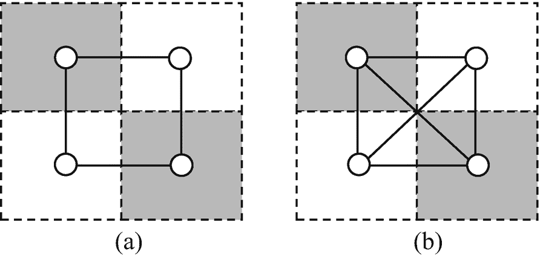
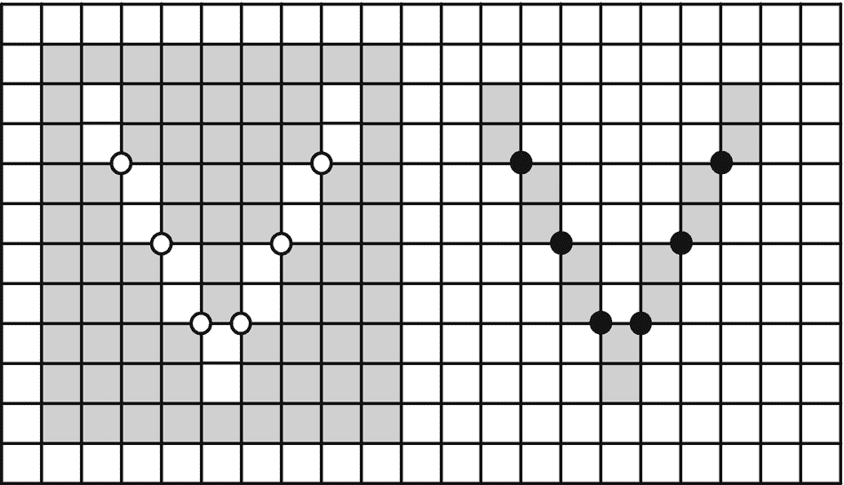
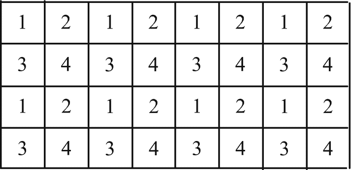
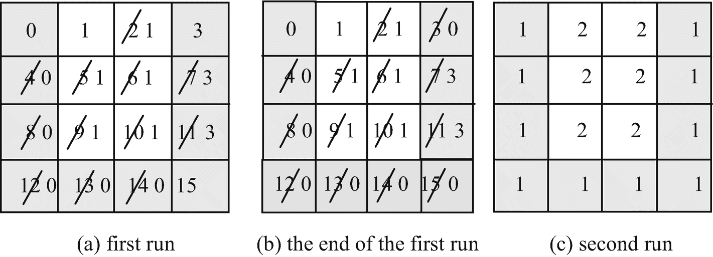
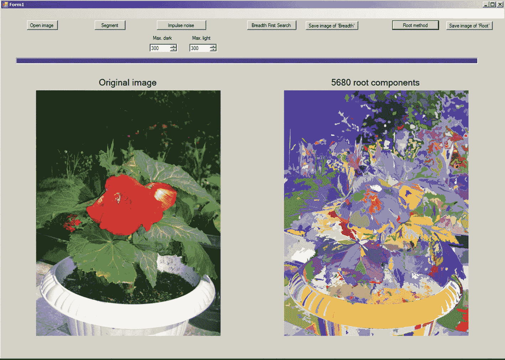

# 九、图像分割和连通分量

图像分割是图像分析中的一个重要步骤。以下是关于分割的已知信息(参见 Shapiro (2001 年):

> *在*计算机视觉中*、*、*、**图像分割**、*、*是将一幅*数字图像*分割成多个片段的过程(*集合像素*的*，也称为超像素)。分割的目标是简化和/或改变图像的表示，使其更有意义，更易于分析。*<sup>*【1】【2】*</sup>*图像分割通常用于定位物体和*边界*(直线、曲线等)。)在图像中。更准确地说，图像分割是给图像中的每个像素分配标签的过程，使得具有相同标签的像素共享某些特征。**

在科学文献中有大量关于分割方法的出版物。然而，让我们记住，任何阈值图像可以被认为是一个分段的。量化图像也可以被认为是分割的，其中所有灰度值或颜色被细分为相对较少数量的组，单一颜色被分配给一个组的所有像素。分段问题的困难仅在于定义有意义的分段的可能性；即从人类感知的角度来看有意义的片段。例如，对于一个分段，我们可以说，“这个分段是房子，这个分段是街道，这个分段是汽车，等等”，这将是一个有意义的分段。据我所知，开发一个有意义的分割是一个尚未解决的问题。在这一节中，我们考虑通过将图像的颜色量化成最佳地代表图像颜色的少量组来进行分割。

## 通过量化颜色进行分割

量化颜色是众所周知的压缩彩色图像的方法:颜色信息不是直接由图像像素数据携带，而是存储在称为调色板的独立数据中，调色板是颜色元素的阵列。数组中的每个元素都代表一种颜色，按其在数组中的位置进行索引。图像像素不包含颜色的完整规格，而仅包含其在调色板中的索引。这是众所周知的产生索引 8 位图像的方法。

我们的方法包括产生一个对具体图像最佳的调色板。为此，我们开发了第八章中描述的方法`MakePalette`，并成功用于项目`WFcompressPal`。

## 连接的组件

我们假设这些片段应该是像素的连接子集。连通性是一个拓扑概念，而经典拓扑主要考虑无限点集，其中一个点的每个邻域都包含无限多个点。经典拓扑学不适用于数字图像，因为它们是有限的。

连通性的概念也用在图论中。可以将数字图像视为顶点为像素的图形，图形的边连接任意两个相邻的像素。路径是一个像素序列，其中除了起始处的一个像素和末端的一个像素之外，每个像素都恰好与两个相邻的像素相关联。

众所周知(例如，参考 Hazewinkel，(2001))，在无向图中，如果路径从 x 通向 y，则无序的顶点对{x，y}称为连通的。否则，无序的顶点对称为不连通的。

连通图是一种无向图，其中图中的每一对无序顶点都是连通的。否则，它被称为不连通图。

将图论中的连通性概念应用到图像上是可能的。我们考虑两种邻接:四邻接(图 9-1a )和八邻接(图 9-1b )。在图 9-1a 的情况下，黑色像素和白色像素的子集都是断开的；在图 9-1b 的情况下，它们都被连接。在这两种情况下，都存在一个众所周知的连通性悖论:为什么图 9-1a 中的黑色像素应该是断开的，而它们之间没有任何东西？同样，为什么图 9-1b 中的黑色像素是相连的，尽管它们之间存在从一个白色像素到另一个白色像素的路径？



图 9-1

连通性悖论:(1)四邻接，和(2)八邻接

Rosenfeld (1970)建议在二进制图像中考虑黑色像素的八个邻接和白色像素的四个邻接。这个建议解决了二进制图像的问题，但是它不适用于多色图像。据我所知，多色图像连通性悖论的唯一解决方案是将数字图像视为一个细胞复合体，如第七章所述。然后，连通性可以通过下面指定的等式规则(参见 Kovalevsky (1989))被正确地定义，并且没有悖论。

坐标为(x，y)和(x + 1，y + 1)或(x，y)和(x–1，y + 1)的两个像素组成一对对角线。在 ACCs 理论中，如果两个像素具有相同的颜色，并且位于它们之间的低维单元(一维或零维)也具有该颜色，则一对八个相邻像素被定义为连通的。自然，谈论低维细胞的颜色没有什么意义，因为它们的面积为零。然而，有必要使用这个概念来一致地定义数字图像中的连通性。为了避免使用低维单元的颜色的概念，我们建议当像素的标签等于其颜色时，用标签代替颜色。

考虑图 9-2 的例子。假设有必要以白 V 和黑 V 都连接的方式来定义连通性。这在任何邻接关系下显然都是不可能的。该目的可以通过将隶属标签(例如，对应于颜色的整数)分配给较低维度的单元的等式规则来实现。



图 9-2

一幅图像中的白色和黑色 V 形区域，由于应用了等式规则，这两个区域相互连接

二维图像的等式规则表明，一维单元总是接收与其关联的两个主要(即二维)单元中最大的标签(较浅的颜色)。

零维单元格 *c* <sup>0</sup> 的标签定义如下:

*   如果 *c* <sup>0</sup> 的 2 × 2 邻域恰好包含一对具有相同标号(Equ)的对角像素，则 *c* <sup>0</sup> 接收该标号。如果有多个这样的对，但其中只有一个属于窄(Na)条带，则*c*0 接收窄条带的标签。否则*c*0 接收最大值；即*c*0 邻域内像素的较亮(Li)标号(即较大标号)。

后一种情况对应于当 *c* <sup>0</sup> 的邻域不包含具有相同标号的对角对或者包含多于一个这样的对角对并且其中多于一个对角对属于窄条的情况。

为了决定在 *c* <sup>0</sup> 附近的对角线对是否属于窄条纹，有必要扫描 4 × 4 = 16 像素的阵列，其中 *c* <sup>0</sup> 在中间，并且计数对应于两条对角线的标签。最小的计数表示窄条纹。其他有效成员规则的例子可以在 Kovalevsky (1989)中找到。

对于分割图像的分析来说，找到并区分图像的所有连接部分是很重要的。问题是找到图像的最大连通子集，每个子集包含恒定颜色的像素。然后，有必要对组件进行编号，并为每个像素分配其所属组件的编号。让我们称分配的数字为标签。

如果对于 *S* 中的任意两个像素，在 *S* 中存在包含这两个像素的相邻像素序列，则某种颜色的像素子集 *S* 被称为连通的。我们认为埃奎纳利街区。

为了找到并标记组件，图像必须包含相对较少的颜色。否则，彩色图像的每个像素可能是最大连通分量。分割图像大多满足拥有少量颜色的条件。

简单的方法包括逐行扫描图像，并为在已经扫描的子集中没有相同颜色的相邻像素的每个像素分配下一个未使用的标签。如果下一个像素在已经扫描的子集中具有相同颜色的相邻像素，并且它们具有不同的标签，则将这些不同标签中最小的标签分配给该像素。具有这些不同标签之一的已扫描子集的所有像素必须获得这个最小的标签。在最坏的情况下，替换可能影响高达高度 <sup>2</sup> /2 像素，其中高度是图像中的行数。在扫描了整个图像之后，替换的总数可以是大约高度 <sup>3</sup> /2。这个数字可能非常大，所以这种幼稚的方法是不实际的。标记一个分量的像素的有效方法是众所周知且广泛使用的图遍历方法。

## 图的遍历算法及其代码

现在让我们考虑图遍历方法。图像被视为图形，像素被视为顶点。如果对应的像素具有相等的值(例如，颜色)并且相邻，则两个顶点由图的边连接。邻接关系可以是四邻接或八邻接。很容易认识到，图形的分量正好对应于图像的期望分量。

至少有两种众所周知的遍历一个图的所有顶点的方法:深度优先搜索和宽度优先搜索算法。它们彼此非常相似，这里我们只考虑广度优先搜索。这种算法被用于我们抑制脉冲噪声的项目中(第二章)。我们在这里详细描述一下。

广度优先算法采用了众所周知的数据结构，称为 *queue，*也称为先进先出:值可以放入队列，先放入的值将首先从队列中出来。该算法的过程如下。

1.  将组件的编号 *NC* 设置为零。

2.  取任意未标记的顶点 *V* ，增加 *NC* ，用值 *NC* 标记 *V* ，并将 *V* 放入队列。顶点 *V* 是具有索引 *NC* 的新组件的“种子”。

3.  当队列不为空时，重复以下说明:
    1.  从队列中取出第一个顶点。

    2.  测试 *W* 的每个邻居 *N* 。如果 *N* 被贴上标签，忽略；否则用 *NC* 标记 *N* 并将其放入队列。

4.  当队列为空时，那么组件 *NC* 已经被标记。

继续第 2 步，找到下一个组件的种子，直到所有顶点都被标记。

让我们描述一下这个算法的伪代码。给定一个包含`N`个元素的多值数组`Image[]`以及方法`Neighb(i,m)`和`Adjacent(i,k)`，第一个返回第`i`个元素的第`m`个邻居的索引。如果第`i`个元素与第`k`个元素和`FALSE otherwise`相邻，第二个函数返回`TRUE`。作为标记的结果，每个元素获得其所属的连接组件的标记。标签保存在一个数组`Label[]`中，其大小与`Image[]`相同。我们假设所有方法都可以访问数组`Image`和`Label`以及它们的大小`N`。

### 广度优先算法的伪代码

分配数组`Label[N]`。`Label`的所有元素现在必须用零初始化，这意味着这些元素还没有被标记。

```py
for (i=0; i<N; i++) Label[i]=0; // setting all labels to 0
int NC=0; // number of components
for (V=0; V<N; V++) // loop through all elements of the image
{
  if (Label[V]≠0) continue; // looking for unlabeled elements
  NC=NC+1; // index of a new component
  Label[V]=NC; // labeling the element with index V with NC
  PutIntoQueue(V); // putting V into the queue
  while(QueueNotEmpty()) //loop running while queue not empty
  { W=GetFromQueue();
    for (n=0; n<Max_n; n++) // all neighbors of W ==========
    { N=Neighb(W,n); // the index of the nth neighbor of W
      if (Label[N]==0 AND Adjacent(W,N)==TRUE
                      AND Image[N]==Image[W])
      { Label[N]=NC; // labeling element with index N with NC
        PutIntoQueue(N);
      }
    } // ========= end for (n=0; ... =================
  } // =========== end while ========================
} // ============= end for (V =0;... ======================

```

**算法结束**

在这种情况下，值`Max_n`是图像元素的所有邻居的最大可能数量，而不管它是否已经被访问过。它等于 8。需要用方法`PutIntoQueue(i), GetFromQueue(),`和`QueueNotEmpty()`提供队列数据结构。如果队列不为空，最后一个方法返回`TRUE`；否则它返回`FALSE`。

该算法标记包含起始像素的组件的所有像素。为了标记图像的所有成分，有必要在那些没有被标记为属于已经被处理的成分的像素中选择下一个开始像素。这必须重复，直到图像的所有像素都被标记。

## 等价类方法

还有另一种方法来解决标记连通分量的问题，即等价类(EC ),它考虑同时标记图像的所有分量。Rosenfeld 和 Pfalz (1966)是关于 EC 方法的最早出版物之一。在二维图像的情况下，该算法的思想如下进行。该算法逐行扫描图像两次。它在每个像素 *P* 的第一次扫描期间，根据四个或八个相邻像素并具有与 *P* 相同的颜色，调查与 *P* 相邻的所有已访问像素的集合 *S* 。如果没有这样的像素，那么 *P* 获得下一个未使用的标签。否则 *P* 得到最小的标签(标签集必须是有序的；整数大多用作 *S* 中像素的标号。同时，该算法声明 *S* 的像素的所有标签等同于最小的标签。为此目的，该算法采用等价表，其中每一列对应于所采用的标签之一。等效标签存储在列的元素中。

当图像被完全扫描后，一种特殊的算法处理该表并确定等效标签的类别。每个类别由最小的等价标签表示。重新排列该表，使得在对应于每个标签的列中，保留该类的标签。在第二次扫描期间，图像中的每个标签都被该类的标签所替换。

该算法的缺点之一是难以先验地估计等价表的必要大小。Kovalevsky (1990)独立于 Gallert 和 Fisher (1964)开发了 EC 方法的改进版本，称为*根方法* *。*它采用了一个标签数组`L`，其元素数量与获得的图像中的像素数量相同。这是等价表的替代品。为了解释改进的思想，我们首先考虑二维二值图像的最简单情况，尽管该算法也适用于多值和多维图像的情况，而没有本质的改变。

建议的方法基于以下想法。图像的每个像素都有一个标签数组`L`的对应元素。我们姑且称之为像素的标签。数组`L`的类型必须能够在其元素中保存图像每个像素的索引`x + width*y`(类型`integer`对于任何大小的图像都足够)。如果一个组件包含一个像素，其标签等于该像素的索引，则该标签称为该组件的根。

在算法开始时，对应于像素( *x，y* )的数组`L`的每个元素被设置为等于索引`x+width*y`，其中`width`是图像的列数。因此，在开始时，每个像素被认为是一个组件。

该算法逐行扫描图像。如果像素在先前扫描的区域中没有相同颜色的相邻像素，则该像素保留其标签。然而，如果下一个像素 *P* 在已经访问过的像素中具有相同颜色的相邻像素，并且它们具有不同的标签，这意味着这些像素属于具有不同根的不同的先前发现的分量。这些不同的部件必须结合成一个单一的部件。为此，需要找到这些分量的根，并将所有这些根和标签 *P* 设置为最小根。重要的是要注意，只有根被改变，而不是与 *P* 相邻的像素的标签值被改变。像素的标签将在第二次扫描中改变。这就是这种方法如此快速的原因。在运行像素处相遇的所有分量得到相同的根，并且它们被合并成单个分量。不是根的标签保持不变。在前面提到的最坏情况下，替换可能只影响`width` /2 个像素。

在第一次扫描之后，每个像素的标签指向具有较小标签的相同组件的像素。因此，有一系列越来越小的标签以组件的根结束。在第二次扫描期间，所有标签都被后续的整数替换。

子集的连通性必须由邻接关系来定义。这可以是公知的( *n* ， *m* )邻接关系，其仅被定义用于二进制图像，或者是基于由方法`EquNaLi`定义的子集中较低维度的单元的成员的邻接关系。

可以看出，在根方法中使用的标签数组`L`需要太多的存储空间:为了存储索引，`L`的每个元素中的位数必须不小于`log2(size)`，其中`size`是图像元素的数量。然而，这个大小的`L`对于任何标记连通分量的方法都是必要的，如果该方法被认为适用于任何多值图像的话。事实上，图像中的每个元素都是一个组成部分。不同标签的数量等于图像元素的数量。例如图 9-3 所示的四种颜色的二维图像，在任何邻接关系下都具有这种性质。



图 9-3

具有四种颜色的图像示例，其组件数量与像素数量相同

如果已知所用标签的数量小于 size，那么每个元素具有较少比特数的数组 L 足以应用使用等价表的方法。然而，这对于现代计算机来说并不重要，因为现代计算机有充足的内存。因此，例如，在具有 32 位处理器的现代计算机上，数据类型 int 的数组可以用于包含多达 2 个 <sup>32 个</sup>元素的图像。因此，二维图像可以具有 65，536 × 65，536 像素的大小，而三维图像可以具有 2，048 × 2，048 × 1，024 个体素的大小。

让我们回到算法上来。它逐行扫描图像，并为每个像素 *P* 调查与 *P* 相邻的已经访问过的像素的集合 *S* 。如果在 *S* 中存在与 *P* 颜色相同的像素，并且它们具有不同的标号，那么算法找到这些像素的最小根标号，并将其分配给 *P* 和 *S* 的所有像素的根。因此，在连续像素处彼此相遇的所有分量获得相同的根，并被合并成单个分量。不是根的像素的标签保持不变。在单个组件的最坏情况下，替换只能影响`width` /2 个像素。

每个像素在第一次扫描后属于通向其分量的根的路径。在第二次扫描期间，根和所有其他像素的标记被随后的整数替换。

一个简单的二维例子如图 9-4 所示。给定的是一个`N` = 16 像素的二维二进制数组`Image[N]`。暗前景的两个像素相邻，当且仅当它们具有共同的入射 1 单元(四个相邻)，而亮背景的像素相邻，如果它们具有任何共同的入射单元(八个相邻)。在算法开始时，所有像素的标签等于它们的索引(图 9-4a 中从 0 到 15 的数字)。索引为 0 和 1 的像素在之前访问的像素中没有相同颜色的相邻像素。它们的标签 0 和 1 保持不变。它们是根。索引为 2 的像素具有相邻的像素 1，其根为 1。因此，标签 2 被 1 代替。在扫描第一行之后，标签 3 保持不变。根据前面的规则改变所有像素的标记，直到到达最后一个像素 15。该像素与像素 11 和 14 相邻。像素 11 的标签指向根 3；像素 14 的指向像素 0，像素 0 也是一个根。标签 0 小于 3。因此，根 3 的标签被更小的标签 0 取代(图 9-4b )。

在第二次运行期间，根的标记被随后的自然数 1 和 2 替换。所有其他像素的标签获得其根的新标签(图 9-4c )。EC 算法的代码将在后面描述。



图 9-4

标记连接组件的算法图示

## 根算法的伪代码

该算法可以应用于组合网格或标准网格中的图像。在组合网格中，其中两个单元的关联关系由它们的组合坐标来定义，从像素值集合中分配一个值(颜色)给任何维度的每个单元就足够了。具有相同值的两个*事件*单元是相邻的，并且将被分配给相同的组件。在标准网格中，必须给出一种方法来指定给定元素 *e* 的邻域中的哪些网格元素与 *e* 相邻，因此如果它们具有相同的值，则必须将其分配给相同的组件。在我们早期的简单二维例子中，我们采用了前景像素的四个相邻像素和背景像素的八个相邻像素。一般来说， *n* 维复合体的主单元的邻接必须由指定较低维单元的成员的规则来指定(例如，由类似于等式规则的规则来指定)，因为众所周知的( *m* ， *n* )邻接不适用于多值图像。我们在这里考虑标准网格情况下的伪代码。

给定的是一个包含`N`个元素的多值数组`Image[]`，以及方法`Neighb(i,m)`和`Adjacent(i,k)`。第一个函数返回第`i`个元素的第`m`个邻居的索引，如果第`i`个元素与第`k`个元素相邻，第二个函数返回`TRUE`。否则它返回`FALSE`。在二维情况下，这可以是实现等式规则的方法。作为标记的结果，每个元素获得它所属的连接组件的标记。标签保存在另一个数组`Label[].`

数组`Label[N]`的大小必须与`Image[N].`相同`Label`的每个元素必须至少有`log2N`位，其中`N`是`Image`的元素个数，并且必须用自己的索引进行初始化:

for(I = 1；I < N；i++)标签[i] = i。

为了使伪代码更简单，我们假设所有方法都可以访问数组`Image and Label`和它们的大小`N`。

在算法的第一个循环中，`Image`的每个元素都有一个指向其组件根的标签。值`Max_n`是已经被访问的元素(像素或体素)的相邻元素的最大可能数量。很容易识别出`Max_n`等于(3 <sup>*d*</sup> - 1)/2，其中 *d* 为图像的尺寸。例如，在二维情况下，`Max_n`等于 4，而在三维情况下，它等于 13 `.`

*求根算法*

```py
for (i=0; i<N; i++)
{ for (m=0; m<Max_n; m++)
  { k=Neighb(i,m); // the index of the mth adjacent element of i
    if(Adjacent(i,k) AND Image[k] == Image[i]) SetEqu(i, k);
  }
} // end of the first loop
SecondRun();

```

子程序`SetEqu(i,k)`(其伪代码见下)将元素`i`和`k`的根的索引相互比较，并将具有较大索引的根的标签设置为等于较小索引。因此，两个词根属于同一个成分。方法`Root(k)`返回索引序列中的最后一个值，其中第一个索引`k`是给定元素的索引，下一个是`Label[k],`的值，依此类推，直到`Label[k]`等于`k`。子程序`SecondRun()`根据`Label[k]`是否等于`k`用元件计数器的值或用`k`的根代替`Label[k]`的值。

*子程序的伪代码*

```py
subroutine SetEqu(i,k)
{ if (Root(i)<Root(k)) Label[Root(k)]=Root(i);
  else Label[Root(i)]=Root(k);
} // end subroutine.

int Root(k)
{ do
  { if (Label[k]==k) return k;
    k=Label[k];
  } while(1); // loop runs until condition Label[k]==k is fulfilled
} // end Root

subroutine SecondRun()
{ count=1;
  for (i=0; i<N; i++)
  { value=Label [i];
    if (value==i )
    { Label[i]=count; count=count+1;
    }
    else Label[i]=Label[value];
  }
} // end subroutine.

```

## 项目`WFsegmentAndComp`

我们已经开发了一个 Windows 窗体项目`WFsegmentAndComp`分割一个图像，并标记其连接组件的像素。

有可能以两种方式执行分割:或者通过将颜色聚类成相对小数量(例如，20 个)的聚类并将属于该聚类的所有像素的平均颜色分配给每个聚类，或者通过将彩色图像转换成灰度图像，将灰度值的全范围[0，255]细分成小数量的区间，并将平均灰度值分配给每个区间。这种转换不会导致信息的丢失，因为相连分量的标记是相对较大的数字，与原始颜色的颜色无关:具有某种颜色的像素集合可以由许多分量组成，每个分量具有另一个标记。

连通分量的标记是通过两种方法完成的，即广度优先搜索和根方法，以便用户可以比较这两种方法的速度。标记的结果被表示为具有 256 种颜色的人工调色板的彩色图像，并且调色板的索引是将标签除以 256 的结果。图 9-5 显示了项目的形式。



图 9-5

项目形式`WFsegmentAndComp`

当用户单击打开图像时，他或她可以选择要打开的图像。该图像将显示在左侧的图片框中，并将定义五个工作图像。

然后，用户应该单击下一个按钮“Segment”。原始图像将被转换为灰度图像。灰度值将除以 24，并且除法的整数结果将乘以 24。这样，新的灰度值变成 24 的倍数，灰度值的标度被量化成 256/24 + 1 = 11 个区间。分割的图像显示在右-右图片框中。

根据经验可知，即使是分割图像，分量的数量也是非常大的。在这些组件中，许多组件由单个像素或几个像素组成。图像分析对这些成分不感兴趣。为了减少小分量的数量，我们决定抑制分割图像的脉冲噪声。这将特定灰度级的许多小点与周围区域合并，并减少了小组件的数量。

用户可以选择要删除的暗点和亮点的最大尺寸，然后单击脉冲噪声。将呈现具有删除的暗点和亮点的图像，而不是分割的图像。

然后，用户可以单击广度优先搜索或根方法。带标签的图像将以错误的颜色显示；也就是说，使用包含 256 种颜色的人工调色板。调色板的索引等于标签除以 256。

第二章介绍了抑制脉冲噪声的代码。

这里，我们提出了用于标记分割图像的连接部分的宽度优先搜索的代码。如前所述，该算法处理包含起始像素的一个分量的像素。为了处理图像的所有组成部分，我们开发了方法`LabelC`，它扫描图像并测试每个像素是否被标记。如果不是，那么它是下一个组件的起始像素，并且调用方法`Breadth_First_Search`。

所有这些方法都是一个特殊类`CImageComp`的元素，它与类`CImage`的不同之处在于标签数组`Lab`的存在。属性`nLoop`和`DenomProg`用于控制指示方法`LabelC`进程的`progressBar`。

```py
public class CImageComp
{
  public byte[] Grid;
  public int[] Lab;
  public Color[] Palette;
  public int width, height, N_Bits, nLoop, denomProg;
  ... // here are the constructors and the methods
}

```

下面是`LabelC`的代码。

```py
public int LabelC(Form1 fm1)
{ int index, lab=0;
  for (index=0; index<width*height; index++) Lab[index]=0;

  int y1 = nLoop * height / denomProg;
  for (int y=0; y<height; y++) //========================
  {
    if (y % y1 == 0) fm1.progressBar1.PerformStep();
    for (int x = 0; x < width; x++) //=================
    { index=x+width*y;
      if (Lab[index]==0)
      {  lab++;
        Breadth_First_Search(index, lab);
      }
    } //================= end for (int x...============
  } //=================== end for (int x...==============
  return lab;
} //********************* end LabelC ***************************

```

可以看出，该方法非常简单:它扫描图像的所有像素，并检查实际像素是否已经被标记。如果不是，则调用方法`Breadth_First_Search`。

这里是`Breadth_First_Search`的代码。

```py
public int Breadth_First_Search(int root, int lab)
{ int light, gvP, Index, Len=1000, Nei;
   bool rv;
   iVect2 P = new iVect2(0, 0);
   CQue Q = new CQue(Len);
   light=Grid[root];
   if (Lab[root]==0) Lab[root]=lab;

   Q.Put(root);
   while(!Q.Empty()) //=============================
   { Index=Q.Get();
      gvP=Grid[Index];
      P.Y=Index/width; P.X=Index-width*P.Y;
      for (int n=0; n<8; n++) //====================
      { Nei=NeighbEqu(Index, n, width, height);
         rv=EquNaliDir(P, n, gvP);
         if (Nei<0) continue;
         if (Grid[Nei]==light && Lab[Nei]==0 && rv)
        {
           Lab[Nei]=lab;
           Q.Put(Nei);
        }
      } //============== end for (n... ==============
   } //================ end while ====================
   return 1;
} //****************** end Breadth_First_Search *************

```

为了显示组件标记的结果，我们使用一个简单的调色板，有 256 种颜色。调色板由方法`MakePalette`产生。这是它的代码。

```py
public int MakePalette( ref int nPal)
{ int r, g, b;
   byte Red, Green, Blue;
   int ii=0;
   for (r=1; r<=8; r++) // Colors of the palette
   for (g=1; g<=8; g++)
   for (b=1; b<=4; b++)
   { Red=(byte)(32*r);  if (r==8) Red=255;
      Green = (byte)(32 * g);
      if (g == 8) Green = 255;
      Blue= (byte)(64*b);  if (b==4) Blue=255;
      Palette[ii] = Color.FromArgb(Red, Green, Blue);
      ii++;
   }
   nPal=4*ii;
   return 1;
} //***************** end MakePalette *****************

```

类别`CImageComp`的图像`BreadthFirIm`包含组件和调色板的标签。为了使标签可见，我们通过方法`LabToBitmap`将图像`BreadthFirIm`转换为位图`BreadthBmp`，并将该位图显示在右边的图片框中。下面是`LabToBitmap`的代码。

```py
public void LabToBitmap(Bitmap bmp, CImageComp Image)
{
  if (Image.N_Bits != 8)
  {
    MessageBox.Show("Not suitable  format of 'Image'; N_Bits=" + Image.N_Bits);
    return;
  }
  switch (bmp.PixelFormat)
  {
    case PixelFormat.Format24bppRgb: nbyte = 3; break;
    case PixelFormat.Format8bppIndexed:
        MessageBox.Show("LabToBitmap: Not suitable  pixel format=" + bmp.PixelFormat);

        return;
    default: MessageBox.Show("LabToBitmap: Not suitable  pixel format=" + bmp.PixelFormat);
        return;
  }
  Rectangle rect = new Rectangle(0, 0, bmp.Width, bmp.Height);
  BitmapData bmpData = bmp.LockBits(rect, ImageLockMode.ReadWrite, bmp.PixelFormat);

  IntPtr ptr = bmpData.Scan0;
  int size = bmp.Width * bmp.Height;
  int bytes = Math.Abs(bmpData.Stride) * bmp.Height;
  byte[] rgbValues = new byte[bytes];
  Color color;
  int index = 0;
  int y1 = nLoop * bmp.Height / 220; // denomProg;
  for (int y = 0; y < bmp.Height; y++)
  {
    if (y % y1 == 0) progressBar1.PerformStep();
    for (int x = 0; x < bmp.Width; x++)
    {
      color = Image.Palette[Image.Lab[x + bmp.Width * y] & 255];
      index = 3 * x + Math.Abs(bmpData.Stride) * y;
      rgbValues[index + 0] = color.B;
      rgbValues[index + 1] = color.G;
      rgbValues[index + 2] = color.R;
    }
  }

  System.Runtime.InteropServices.Marshal.Copy(rgbValues, 0, ptr, bytes);
  bmp.UnlockBits(bmpData);
} //**************************** end LabToBitmap ***********************

```

位图`BreadthBmp`用假颜色显示组件。

用户可以通过单击“保存宽度图像”将带有标记组件的图像保存为彩色图像。

如前所述，我开发了另一种标记连接组件的方法。这种方法的优点是不用一个接一个地标记组分，而是同时并行地标记。这个方法的思想在前面已经描述过了。这里我们要呈现的是重要方法`ComponentE`的代码，当用户点击 Root method 时，这个方法作为图片`RootIm`的方法被调用。

```py
public int ComponentsE(Form1 fm1)
{ /* Labels connected components of "this" in "this->Lab" and returns
      the number of components. Uses the EquNaLi connectedness. --*/
  int Dir, light, i, nComp=0, rv, x1 = 0, y1 = 0;
  bool adjac;
  iVect2 P = new iVect2(0, 0);
  for (int k=0; k<width*height; k++) Lab[k]=k;

  int y2 = nLoop*height / denomProg;;
  for (int y=0; y<height; y++) //==========================================
  { if ((y % y2) == 0) fm1.progressBar1.PerformStep();
    for (int x = 0; x < width; x++) //=====================================
    {  i=x+width*y; // "i" is the index of the actual pixel
      light=Grid[i];
      P.X=x; P.Y=y;
      int nmax;
      if (y==0) nmax=0;
      else nmax=3;
      for (int n=0; n<=nmax; n++) //==== the four preceding neighbors ========
      { switch(n)
        { case 0: x1=x-1; y1=y; break;   // West
          case 1: x1=x-1; y1=y-1; break; // North-West
          case 2: x1=x;   y1=y-1; break; // North
          case 3: x1=x+1; y1=y-1; break; // North-East
        }

        if (x1<0 || x1>=width) continue;
        Dir=n+4;

        int indN=x1+width*y1;
        int lightNeib=Grid[indN];
        if (lightNeib!=light) continue;
        if ((Dir & 1)==0) adjac=true;
        else
          adjac=EquNaliDir(P, Dir, light);
        if (adjac)
          rv=SetEquivalent(i, indN); // Sets Lab[i] or Lab[indN] equal to Root
      } //==================== end for (int n ... ========================
    } //===================== end for (int x ... ========================
  } //====================== end for (int y ... ========================
  nComp=SecondRun(); // Writes indexes of components from 1 to nComp to "Comp".
  return nComp;  // nComp+1 is the number of indexes
} //************************* end ComponentsE **************************

```

类别`CImageComp`的图像`RootIm`包含组件和调色板的标签。就像在`Breadth_First_Search`的情况中一样，方法`MakePalette`和`LabToBitmap`被调用以使标签可见。图像`RootIm`被转换为位图`RootBmp`，后者显示在右边的图片框中。然后，用户可以通过单击“根”的保存图像来保存该图像。

## 结论

根算法和广度优先算法的时间复杂度与图像元素的数量成线性关系。只要定义了邻接关系，这两种算法都可以应用于任何维数的图像。

作者进行的大量实验表明，根算法和广度优先算法的运行时间几乎相等。根算法的优点是它测试图像的每个元素是否已经被标记(3 <sup>*d*</sup> - 1)/2 次，其中 *d* 等于 2 或者等于 3 是图像的维度，而宽度优先算法测试它 3 <sup>*d*</sup> 次，这大约是两倍多。广度优先算法可以直接用于只标记包含图像的给定元素的单个分量，而根算法必须同时标记所有分量。