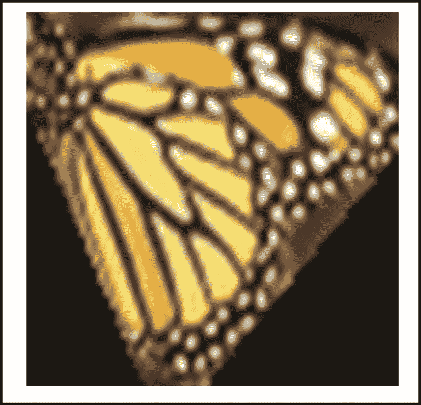

# 14.细胞分化的计算机模型

本章不属于图像处理领域。之所以把它收入本书，是因为作者的兴趣圈广泛而多才多艺。这一章的主题与生物学有关。

人们可能会问，尽管事实上不同类型的细胞都具有完全相同的脱氧核糖核酸(DNA)，但它们如何可能在有机体的生长过程中发育成不同类型的细胞。可以假定，每个细胞都必须获得一些信息，表明它在生长的有机体中的位置，也许是某种坐标。然后，DNA 必须包含不同的指令，用于具有不同坐标的细胞的发育。坐标可以在单元划分时产生:与具有坐标集( *X，Y，Z* )的旧单元相邻的新单元必须得到旧单元的其中一个坐标增加或减少了 1 的坐标集。改变三个坐标中的哪一个取决于向量从旧单元到新单元的方向。因此，这一章的两个主要观点是，细胞必须获得某种坐标，而指定细胞特性的 DNA 指令必须依赖于它的坐标。

我们已经开发了一个项目`WFcellDivision`，其中多细胞生物由 63 × 63 个细胞的阵列`Org`(生物)建模(奇数更好地精确定义中间的细胞)。

通过指定和保存其特征来模拟产生新单元的过程。每个细胞可以拥有坐标 *X* 和 *Y* 作为其特征，一个变量`Property`(这是一个颜色索引)，以及数组`DNA[63×63]`作为其遗传信息。单元格是`CCelln`类的一个对象。

```py
int const Cwidth=63, Cheight=63;

class CCelln
{ public:
    int X, Y, Property;
    unsigned char DNA[Cwidth*Cheight];
}

```

该项目的目的是模拟一个接一个细胞的生成，并为每个细胞的变量`Property`赋值。该值取决于该单元格的坐标以及保存在该单元格中的`DNA`的内容。【T2`DNA``to Properties of all cells of Org is supposed to be impossible. It is only possible to copy the DNA from one cell to the neighboring new originating cell and to copy inside the originating cell one certain value from the DNA of the cell to the Property of this cell. The aim of the project is to demonstrate that in spite of these limitations, it is possible to assign correct values of Property to all cells of Org.`

让我们描述一下这个项目的运作。方法`Form1`从定义和初始化拥有 63 × 63 个单元的存储器的数组`Org`开始。初始化`Org`包括将`Org`的每个单元的`Property`和数组`DNA[63×63]`的元素设置为`−1`，这意味着该单元不存在。

然后数组`Org`中间的一个单元格，即坐标为(31，31)的单元格被“填充”:它获得坐标 *X* = 31 和 *Y* = 31。它的数组`DNA`填充了一个 63 × 63 像素的小数字`Image`的颜色索引。该图像是任意选择的，以证明具体的内容可以分配给细胞的属性。`DNA`的内容成为数字图像的副本，其中每个元素是一个颜色索引，一个 0 到 255 之间的数字，可以通过颜色表`Palette`转换成一种颜色。在`Palette`中，为每个颜色索引保存一种颜色(红、绿、蓝)。数组`Org`的所有其他单元最初的坐标等于`−1`，数组`DNA`为空(即，用`−1`填充)。

接下来调用方法`Grow`。它模拟生物体的生长，同时从与中央细胞(31，31)相邻的细胞开始生成细胞坐标。坐标以这样的方式生成，即所有原始单元都位于围绕中心单元旋转的螺旋中。在生长过程中，越来越多的单元从相邻单元之一获得数组`DNA`的副本。它们还根据`DNA`和单元坐标的内容获得它们的坐标和某些`Property`值。

坐标为(31，31)的单元格的`Property`获取数组`DNA`(见图 [14-1](#Fig1) 、`DNA[31, 31]`的单个元素的值，即像素(31，31)的颜色索引。


图 14-1

将图像复制到`Org[31, 31].DNA`

生长生物体的形状由代表生长生物体的颜色区域周围的`DNA`的一些元素分配的黑色区域的边界指定。该数组在对应于应该存在于生物体中的细胞的每个元素中包含不同于(0，0，0)的颜色索引，并且在对应于不应该存在于生物体中的细胞的每个元素中包含指向(0，0，0)(黑色)的索引。

如果数组`Org`的一个单元格具有非零坐标，值`Property`指向不同于(0，0，0)的颜色，并且`DNA`的内容不同于-1，则该单元格被填充。

当生长过程开始时，数组`Org`中与填充单元格相邻的每个单元格都获得数组`DNA`的精确副本，该副本对所有单元格都是相同的。该单元的坐标获得的值与填充的相邻单元的坐标相差 1。例如，如果新单元格位于坐标为( *X，Y* )的已填充单元格的右侧，则它的 *X* 坐标获得值 *X* 1 = *X* + 1，它的 *Y* 坐标 *Y* 1 获得值 *Y* 。新单元获得了`DNA`的标准副本，其`Property`等于`DNA[X1, Y1]`，其中 *X* 1 和 *Y* 1 是新单元的坐标。

这里是`Grow`的代码。

```py
int Grow(CCelln[] Org, int width, int height)
{ int cnt=0, i, k, x=(width-1)/2, y=(height-1)/2, nCount=1, X, Y;
  do
  { for (i=0; i<nCount && x<width-1; i++)
    { x++;
      X=Org[x+width*y].X=Org[x-1+width*y].X+1;
      Y=Org[x+width*y].Y=Org[x-1+width*y].Y;
      for (k=0; k<width*height; k++) Org[x+width*y].DNA[k] =
                                                   Org[x-1+width*y].DNA[k];
      Org[x+width*y].Property=Org[x+width*y].DNA[X+width*Y];
    }
    cnt+=nCount;
    if (cnt==width*height) break;

    for (i=0; i<nCount && y<height-1; i++)
    {  y++;
      X=Org[x+width*y].X=Org[x+width*(y-1)].X;
      Y=Org[x+width*y].Y=Org[x+width*(y-1)].Y+1;
      for (k=0; k<width*height; k++) Org[x+width*y].DNA[k] =
                                                 Org[x+width*(y-1)].DNA[k];
      Org[x+width*y].Property=Org[x+width*y].DNA[X+width*Y];
    }
    cnt+=nCount;
    if (cnt==width*height) break;

    nCount++;
    for (i=0; i<nCount && x>0; i++)
    {  x--;
      X=Org[x+width*y].X=Org[x+1+width*y].X-1;
      Y=Org[x+width*y].Y=Org[x+1+width*y].Y;
      for (k=0; k<width*height; k++)
                             Org[x+width*y].DNA[k]=Org[x+1+width*y].DNA[k];
      Org[x+width*y].Property=Org[x+width*y].DNA[X+width*Y];
    }

    cnt+=nCount;
    if (cnt==width*height) break;

    for (i=0; i<nCount && y>0; i++)
    { y--;
      X=Org[x+width*y].X=Org[x+width*(y+1)].X;
      Y=Org[x+width*y].Y=Org[x+width*(y+1)].Y-1;
      for (k=0; k<width*height; k++)
                           Org[x+width*y].DNA[k]=Org[x+width*(y+1)].DNA[k];
      Org[x+width*y].Property=Org[x+width*y].DNA[X+width*Y];
    }
    cnt+=nCount;
    if (cnt==width*height) break;
    nCount++;
  } while(1);
  return 1;
}

```

当数组`Org`的所有单元都被填充时，该过程结束。然后将所有单元格的`Property`值复制到一个 63 × 63 像素的新数组(图像)中，目的是使结果可见。该图像与颜色表`Palette`一起显示，用户可以看到该图像与复制到`DNA[31, 31]`的原始图像`Image`相同，除了数组`DNA`中的像素具有指向黑色的索引。这些像素显示为黑色(参见图 [14-2](#Fig2) )。



图 14-2

从`Org[*].Property`复制的结果图像

因此，数组`Org`的所有单元都是不同的:它们包含不同的`Property`值，尽管它们都具有数组`DNA`的完全相同的副本。

## 结论

我们已经证明，尽管生物体的所有细胞都具有完全相同的遗传信息拷贝，并且尽管禁止将数组`DNA`直接复制到数组`Org[x, y].Property`中，但是产生具有不同细胞的生物体是可能的。