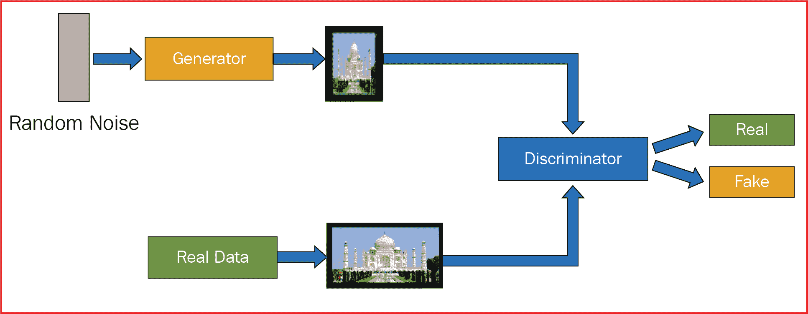
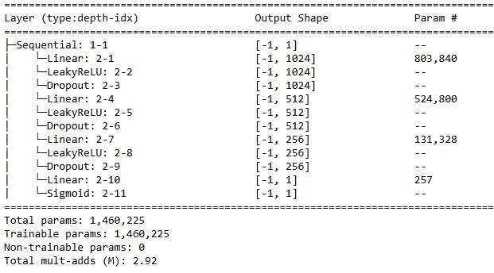
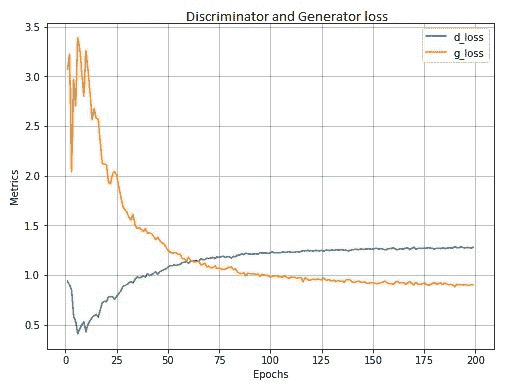
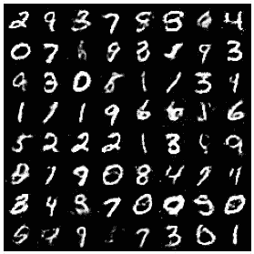
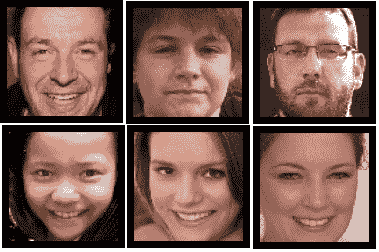
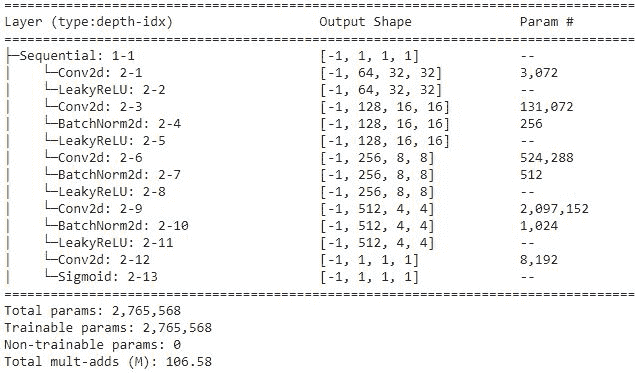
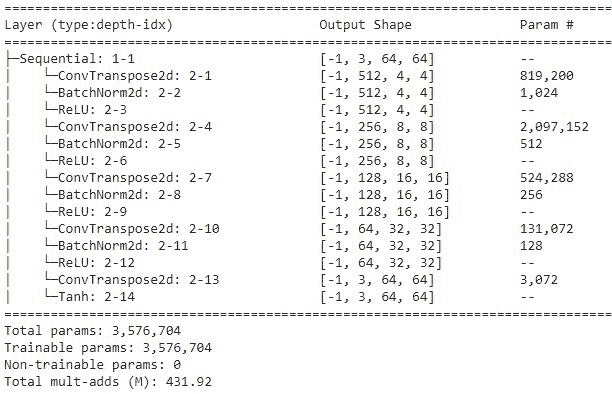
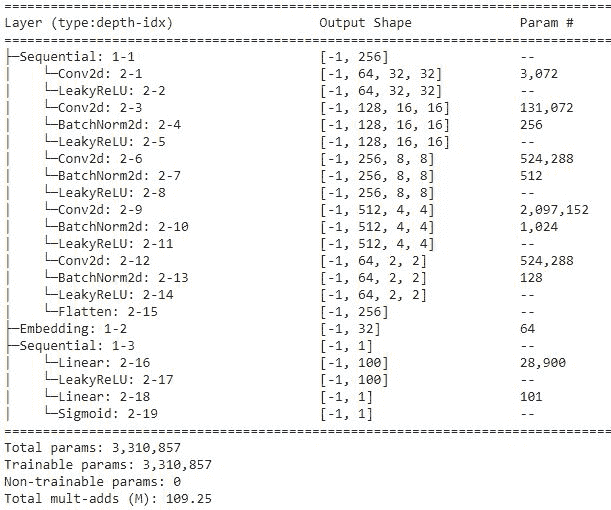
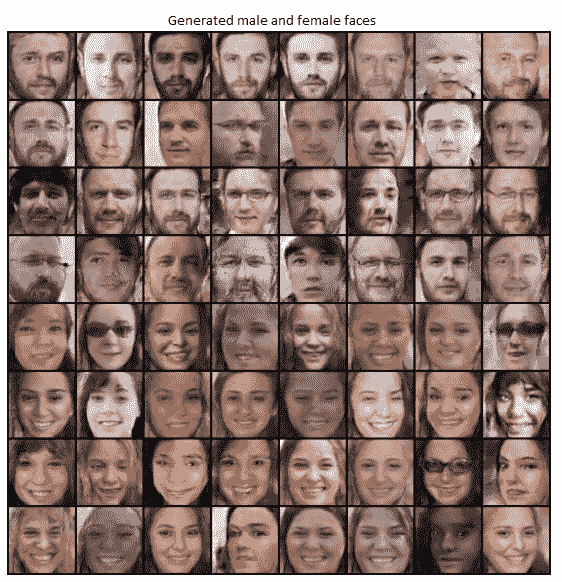

# 十二、使用 GAN 的图像生成

在前一章中，我们学习了使用神经风格迁移来处理图像，并将一幅图像中的表情叠加到另一幅图像上。然而，如果我们给网络一堆图像，让它自己想出一个全新的图像，会怎么样呢？

**生成对抗网络** ( **甘**)是实现给定一组图像生成一幅图像的壮举的一步。在这一章中，我们将从学习 GANs 的工作原理开始，然后从头开始构建一个。在我们写这本书的时候，gan 是一个正在扩展的广阔领域。本章将通过 GANs 的三种变体来奠定 GANs 的基础，而我们将在下一章学习更高级的 GANs 及其应用。

在本章中，我们将探讨以下主题:

*   GANs 简介
*   使用 GANs 生成手写数字
*   使用 DCGANs 生成人脸图像
*   实现有条件的 GANs

# GANs 简介

要理解 GANs，我们需要了解两个术语:**发生器**和**鉴别器**。首先，我们应该有一个物体图像的合理样本。生成网络(生成器)从图像样本中学习表示，然后生成与图像样本相似的图像。鉴别器网络(discriminator)是一种查看(由生成器网络)生成的图像和图像的原始样本并将图像分类为原始图像或生成的(伪造的)图像的网络。

生成器网络以鉴别器将图像分类为真实图像的方式生成图像。鉴别器网络将生成的图像分类为假的，而将原始样本中的图像分类为真的。

本质上，GAN 中的对抗性术语代表了两个网络的相反性质——生成者网络，它生成图像以欺骗鉴别者网络，鉴别者网络通过说明图像是生成的还是原始的来对每个图像进行分类。

让我们通过下图了解 GANs 采用的流程:



在上图中，生成器网络通过输入随机噪声生成图像。鉴别器网络查看生成器生成的图像，并将它们与真实数据(提供的图像样本)进行比较，以确定生成的图像是真的还是假的。生成器试图生成尽可能多的真实图像，而鉴别器试图检测由生成器生成的哪些图像是假的。这样，生成器通过学习鉴别器查看的内容来识别图像是否是假的，从而学习生成尽可能多的真实图像。

通常，发生器和鉴别器交替训练。这样就变成了警察和小偷的游戏，生成者是试图生成假数据的小偷，鉴别者是试图鉴别可用数据真假的警察。

现在，让我们了解如何计算发生器和鉴别器的损耗值，以便使用下图和步骤一起训练两个网络:


培训 GANs 的步骤如下:

1.  训练生成器(而不是鉴别器)生成图像，使鉴别器将图像分类为真实图像。
2.  训练鉴别器(而不是生成器)将生成器生成的图像分类为假的。
3.  重复这个过程，直到达到平衡。

在前面的场景中，当鉴别器可以很好地检测生成的图像时，与鉴别器对应的损耗相比，发生器对应的损耗要高得多。

因此，梯度以发电机会有损耗的方式调整。然而，它会使鉴频器损耗向更高的一侧倾斜。在下一次迭代中，梯度被调整，使得鉴频器损耗更低。通过这种方式，发生器和鉴别器不断接受训练，直到发生器生成真实图像而鉴别器无法区分真实图像或生成的图像。

有了这样的理解，让我们在下一节中生成与 MNIST 数据集相关的图像。

# 使用 GANs 生成手写数字

为了生成手写数字的图像，我们将利用在上一节中了解到的同一个网络。我们将采取的策略如下:

1.  导入 MNIST 数据。
2.  初始化随机噪声。
3.  定义发电机型号。
4.  定义鉴别器模型。
5.  交替训练两个模型。
6.  让模型训练，直到发电机和鉴频器损耗基本相同。

让我们在下面的代码中执行前面的每个步骤:

以下代码可在本书的 GitHub 资源库`Chapter12`文件夹中的`Handwritten_digit_generation_using_GAN.ipynb`处获得-【https://tinyurl.com/mcvp-packt代码长度适中。我们强烈建议您在 GitHub 中执行 notebook 以重现结果，同时理解执行的步骤和对文本中各种代码组件的解释。

1.  导入相关包并定义设备:

```py
!pip install -q torch_snippets
from torch_snippets import *
device = "cuda" if torch.cuda.is_available() else "cpu"
from torchvision.utils import make_grid
```

2.  导入`MNIST`数据，并使用内置数据转换定义数据加载器，以便输入数据缩放至平均值 0.5 和标准偏差 0.5:

```py
from torchvision.datasets import MNIST
from torchvision import transforms

transform = transforms.Compose([
                transforms.ToTensor(),
                transforms.Normalize(mean=(0.5,), std=(0.5,))
        ])

data_loader = torch.utils.data.DataLoader(MNIST('~/data', \
            train=True, download=True, transform=transform), \
            batch_size=128, shuffle=True, drop_last=True)
```

3.  定义`Discriminator`模型类:

```py
class Discriminator(nn.Module):
    def __init__(self):
        super().__init__()
        self.model = nn.Sequential( 
                                nn.Linear(784, 1024),
                                nn.LeakyReLU(0.2),
                                nn.Dropout(0.3),
                                nn.Linear(1024, 512),
                                nn.LeakyReLU(0.2),
                                nn.Dropout(0.3),
                                nn.Linear(512, 256),
                                nn.LeakyReLU(0.2),
                                nn.Dropout(0.3),
                                nn.Linear(256, 1),
                                nn.Sigmoid()
                            )
    def forward(self, x): return self.model(x)
```

注意，在前面的代码中，我们用`LeakyReLU`代替了`ReLU`作为激活函数。鉴别器网络概述如下:

```py
!pip install torch_summary
from torchsummary import summary
discriminator = Discriminator().to(device)
summary(discriminator,torch.zeros(1,784))
```

上述代码生成以下输出:



4.  定义`Generator`模型类:

```py
class Generator(nn.Module):
    def __init__(self):
        super().__init__()
        self.model = nn.Sequential(
                                nn.Linear(100, 256),
                                nn.LeakyReLU(0.2),
                                nn.Linear(256, 512),
                                nn.LeakyReLU(0.2),
                                nn.Linear(512, 1024),
                                nn.LeakyReLU(0.2),
                                nn.Linear(1024, 784),
                                nn.Tanh()
                            )

    def forward(self, x): return self.model(x)
```

请注意，生成器接受一个 100 维的输入(随机噪声),并根据该输入生成一个图像。发电机型号总结如下:

```py
generator = Generator().to(device)
summary(generator,torch.zeros(1,100))
```

上述代码生成以下输出:


5.  定义一个函数来产生随机噪声，并将其注册到设备:

```py
def noise(size):
    n = torch.randn(size, 100)
    return n.to(device)
```

6.  定义一个函数来训练鉴别器:

*   鉴别器训练函数(`discriminator_train_step`)将真实数据(`real_data`)和虚假数据(`fake_data`)作为输入:

```py
def discriminator_train_step(real_data, fake_data):
```

*   重置渐变:

```py
d_optimizer.zero_grad()
```

*   在对损失值进行反向传播之前，对真实数据(`real_data`)进行预测并计算损失(`error_real`):

```py
prediction_real = discriminator(real_data)
error_real = loss(prediction_real, \
                  torch.ones(len(real_data),1).to(device))
error_real.backward()
```

When we calculate the discriminator loss on real data, we expect the discriminator to predict an output of 1\. Hence, the discriminator loss on real data is calculated by expecting the discriminator to predict output as 1 using `torch.ones` during discriminator training.

*   在对损失值进行反向传播之前，对假数据(`fake_data`)进行预测并计算损失(`error_fake`):

```py
prediction_fake = discriminator(fake_data)
error_fake = loss(prediction_fake, \
            torch.zeros(len(fake_data),1).to(device))
error_fake.backward()
```

当我们计算伪数据的鉴别器损失时，我们期望鉴别器预测输出为 0。因此，在鉴别器训练期间，通过期望鉴别器使用`torch.zeros`将输出预测为 0 来计算鉴别器对假数据的损失。

*   更新权重并返回总损失(合计`real_data`上的`error_real`和`fake_data`上的`error_fake`的损失值):

```py
d_optimizer.step()
return error_real + error_fake
```

7.  训练发电机模型:

*   定义采用虚假数据(`fake_data`)的发电机训练函数(`generator_train_step`):

```py
def generator_train_step(fake_data):
```

*   重置生成器优化器的梯度:

```py
g_optimizer.zero_grad()
```

*   预测鉴别器对假数据的输出(`fake_data`):

```py
prediction = discriminator(fake_data)
```

*   通过传递`prediction`和期望值`torch.ones`来计算发电机损耗值，因为我们想在训练发电机时欺骗鉴别器输出值`1`:

```py
error = loss(prediction, \
             torch.ones(len(real_data),1).to(device))
```

*   执行反向传播，更新权重，并返回错误:

```py
error.backward()
g_optimizer.step()
return error
```

8.  定义模型对象、每个生成器和鉴别器的优化器以及要优化的损失函数:

```py
discriminator = Discriminator().to(device)
generator = Generator().to(device)
d_optimizer= optim.Adam(discriminator.parameters(),lr=0.0002)
g_optimizer = optim.Adam(generator.parameters(), lr=0.0002)
loss = nn.BCELoss()
num_epochs = 200
log = Report(num_epochs)
```

9.  在不断增加的时期内运行模型:

*   在*步骤 2* 中获得的`data_loader`函数上循环 200 个历元(`num_epochs`):

```py
for epoch in range(num_epochs):
    N = len(data_loader)
    for i, (images, _) in enumerate(data_loader):
```

*   加载真实数据(`real_data`)和虚假数据，其中虚假数据(`fake_data`)是通过`generator`网络传递`noise`(批量大小为`real_data`—`len(real_data)`中的数据点数)得到的。注意，运行`fake_data.detach()`很重要，否则训练不起作用。在分离时，我们创建一个张量的新副本，这样当在`discriminator_train_step`中调用`error.backward()`时，与生成器(创建`fake_data`)相关联的张量不受影响:

```py
        real_data = images.view(len(images), -1).to(device)
        fake_data=generator(noise(len(real_data))).to(device)
        fake_data = fake_data.detach()
```

*   使用*步骤 6* 中定义的`discriminator_train_step`功能训练鉴别器:

```py
        d_loss=discriminator_train_step(real_data, fake_data)
```

*   现在我们已经训练了鉴别器，让我们在这一步中训练生成器。从噪声数据中生成一组新的假图像(`fake_data`)，并使用*步骤 6* 中定义的`generator_train_step`训练生成器:

```py
        fake_data=generator(noise(len(real_data))).to(device)
        g_loss = generator_train_step(fake_data)
```

*   记录损失:

```py
        log.record(epoch+(1+i)/N, d_loss=d_loss.item(), \
                   g_loss=g_loss.item(), end='\r')
    log.report_avgs(epoch+1)
log.plot_epochs(['d_loss', 'g_loss'])
```

鉴频器和发生器在递增时期的损耗如下:



10.  训练后可视化虚假数据:

```py
z = torch.randn(64, 100).to(device)
sample_images = generator(z).data.cpu().view(64, 1, 28, 28)
grid = make_grid(sample_images, nrow=8, normalize=True)
show(grid.cpu().detach().permute(1,2,0), sz=5)
```

上述代码生成以下输出:



由此可见，我们可以利用 GANs 生成逼真的图像，但仍有改进的余地。在下一节中，我们将学习使用深度卷积 GANs 来生成更真实的图像。

# 使用 DCGANs 生成人脸图像

在上一节中，我们学习了使用 GANs 生成图像。然而，我们已经看到**卷积神经网络**(**CNN**)与普通神经网络相比，在图像环境中表现更好。在本节中，我们将学习使用**深度卷积生成对抗网络** ( **DCGANs** )生成图像，该网络在模型中使用卷积和池化操作。

首先，让我们了解一下我们将利用 100 个随机数生成图像的技术。我们首先将噪声转换成批量大小为 x 100 x 1 x 1 的形状。在 DCGANs 中添加额外的通道信息而不在 GAN 部分添加的原因是，我们将在本部分利用 CNN，它要求以批量 x 通道 x 高度 x 宽度的形式输入。

接下来，我们通过利用
`ConvTranspose2d`将生成的噪声转换成图像。

正如我们在`Chapter 9`、*中了解到的，图像分割*、`ConvTranspose2d`与卷积运算相反，它采用较小的特征图尺寸(高度 x 宽度)的输入，并使用预定义的内核尺寸、步幅和填充将其上采样到较大的尺寸。通过这种方式，我们可以逐渐将一个向量从批量大小为 x 100 x 1 x 1 的形状转换为批量大小为 x 3 x 64 x 64 的形状。这样，我们就有了一个大小为 100 的随机噪声矢量，并将其转换成一张人脸图像。

有了这样的理解，现在让我们建立一个模型来生成人脸图像:

以下代码可在本书的 GitHub 知识库的`Chapter12`文件夹中以`Face_generation_using_DCGAN.ipynb`的形式获得-【https://tinyurl.com/mcvp-packt 代码包含下载数据的 URL，长度适中。我们强烈建议您在 GitHub 中执行 notebook 以重现结果，同时理解执行的步骤和对文本中各种代码组件的解释。

1.  下载并提取面部图像:

```py
!wget https://www.dropbox.com/s/rbajpdlh7efkdo1/male_female_face_images.zip
!unzip male_female_face_images.zip
```

这里显示了一个图像示例:


2.  导入相关包:

```py
!pip install -q --upgrade torch_snippets
from torch_snippets import *
import torchvision
from torchvision import transforms
import torchvision.utils as vutils
import cv2, numpy as np, pandas as pd
device = "cuda" if torch.cuda.is_available() else "cpu"
```

3.  定义数据集和数据加载器:

*   确保我们裁剪图像，以便我们只保留图像中的面部，而丢弃图像中的其他细节。首先，我们将下载级联过滤器(在第十八章、*中关于 OpenCV 中级联过滤器的更多信息，使用 OpenCV 工具进行图像分析*)，这将有助于识别图像中的人脸:

```py
face_cascade = cv2.CascadeClassifier(cv2.data.haarcascades + \
                        'haarcascade_frontalface_default.xml')
```

*   创建一个新文件夹，并将所有裁剪的人脸图像转储到新文件夹中:

```py
!mkdir cropped_faces
images = Glob('/content/females/*.jpg') + \
            Glob('/content/males/*.jpg')
for i in range(len(images)):
    img = read(images[i],1)
    gray = cv2.cvtColor(img, cv2.COLOR_BGR2GRAY)
    faces = face_cascade.detectMultiScale(gray, 1.3, 5)
    for (x,y,w,h) in faces:
        img2 = img[y:(y+h),x:(x+w),:]
    cv2.imwrite('cropped_faces/'+str(i)+'.jpg', \
                cv2.cvtColor(img2, cv2.COLOR_RGB2BGR))
```

裁剪面的示例如下:



请注意，通过只裁剪和保留面，我们只保留了我们想要生成的信息。

*   指定要对每个图像执行的转换:

```py
transform=transforms.Compose([
                               transforms.Resize(64),
                               transforms.CenterCrop(64),
                               transforms.ToTensor(),
    transforms.Normalize((0.5, 0.5, 0.5), (0.5, 0.5, 0.5))])
```

*   定义`Faces`数据集类:

```py
class Faces(Dataset):
    def __init__(self, folder):
        super().__init__()
        self.folder = folder
        self.images = sorted(Glob(folder))
    def __len__(self):
        return len(self.images)
    def __getitem__(self, ix):
        image_path = self.images[ix]
        image = Image.open(image_path)
        image = transform(image)
        return image
```

*   创建数据集对象-`ds`:

```py
ds = Faces(folder='cropped_faces/')
```

*   如下定义`dataloader`类:

```py
dataloader = DataLoader(ds, batch_size=64, shuffle=True, \
                        num_workers=8)
```

4.  定义权重初始化，以便权重具有较小的分布:

```py
def weights_init(m):
    classname = m.__class__.__name__
    if classname.find('Conv') != -1:
        nn.init.normal_(m.weight.data, 0.0, 0.02)
    elif classname.find('BatchNorm') != -1:
        nn.init.normal_(m.weight.data, 1.0, 0.02)
        nn.init.constant_(m.bias.data, 0)
```

5.  定义`Discriminator`模型类，它获取一个批量大小为 x 3 x 64 x 64 的形状的图像，并预测它是真的还是假的:

```py
class Discriminator(nn.Module):
    def __init__(self):
        super(Discriminator, self).__init__()
        self.model = nn.Sequential(
                        nn.Conv2d(3,64,4,2,1,bias=False),
                        nn.LeakyReLU(0.2,inplace=True),
                        nn.Conv2d(64,64*2,4,2,1,bias=False),
                        nn.BatchNorm2d(64*2),
                        nn.LeakyReLU(0.2,inplace=True),
                        nn.Conv2d(64*2,64*4,4,2,1,bias=False),
                        nn.BatchNorm2d(64*4),
                        nn.LeakyReLU(0.2,inplace=True),
                        nn.Conv2d(64*4,64*8,4,2,1,bias=False),
                        nn.BatchNorm2d(64*8),
                        nn.LeakyReLU(0.2,inplace=True),
                        nn.Conv2d(64*8,1,4,1,0,bias=False),
                        nn.Sigmoid()
                    )
        self.apply(weights_init)    
def forward(self, input): 
    return self.model(input)
```

*   获取已定义模型的摘要:

```py
!pip install torch_summary
from torchsummary import summary
discriminator = Discriminator().to(device)
summary(discriminator,torch.zeros(1,3,64,64));
```

上述代码生成以下输出:



6.  定义从 shape 批处理大小 x 100 x 1 x 1 的输入生成假图像的`Generator`模型类:

```py
class Generator(nn.Module):
    def __init__(self):
        super(Generator,self).__init__()
        self.model = nn.Sequential(
            nn.ConvTranspose2d(100,64*8,4,1,0,bias=False,),
            nn.BatchNorm2d(64*8),
            nn.ReLU(True),
            nn.ConvTranspose2d(64*8,64*4,4,2,1,bias=False),
            nn.BatchNorm2d(64*4),
            nn.ReLU(True),
            nn.ConvTranspose2d( 64*4,64*2,4,2,1,bias=False),
            nn.BatchNorm2d(64*2),
            nn.ReLU(True),
            nn.ConvTranspose2d( 64*2,64,4,2,1,bias=False),
            nn.BatchNorm2d(64),
            nn.ReLU(True),
            nn.ConvTranspose2d( 64,3,4,2,1,bias=False),
            nn.Tanh()
        )
        self.apply(weights_init)
    def forward(self,input): return self.model(input)
```

*   获取已定义模型的摘要:

```py
generator = Generator().to(device)
summary(generator,torch.zeros(1,100,1,1))
```

上述代码生成以下输出:



请注意，我们已经利用`ConvTranspose2d`对数组进行了逐步上采样，使其非常类似于一幅图像。

7.  定义训练发生器(`generator_train_step`)和鉴别器(`discriminator_train_step`)的功能:

```py
def discriminator_train_step(real_data, fake_data):
    d_optimizer.zero_grad()
    prediction_real = discriminator(real_data)
    error_real = loss(prediction_real.squeeze(), \
                      torch.ones(len(real_data)).to(device))
    error_real.backward()
    prediction_fake = discriminator(fake_data)
    error_fake = loss(prediction_fake.squeeze(), \
                      torch.zeros(len(fake_data)).to(device))
    error_fake.backward()
    d_optimizer.step()
    return error_real + error_fake

def generator_train_step(fake_data):
    g_optimizer.zero_grad()
    prediction = discriminator(fake_data)
    error = loss(prediction.squeeze(), \
                 torch.ones(len(real_data)).to(device))
    error.backward()
    g_optimizer.step()
    return error
```

在前面的代码中，我们在预测的基础上执行了一个`.squeeze`操作，因为模型的输出具有批处理大小 x 1 x 1 x 1 的形状，并且它需要与具有批处理大小 x 1 的形状的张量进行比较。

8.  创建生成器和鉴别器模型对象、优化器以及要优化的鉴别器的损失函数:

```py
discriminator = Discriminator().to(device)
generator = Generator().to(device)
loss = nn.BCELoss()
d_optimizer = optim.Adam(discriminator.parameters(), \
                         lr=0.0002, betas=(0.5, 0.999))
g_optimizer = optim.Adam(generator.parameters(), \
                         lr=0.0002, betas=(0.5, 0.999))
```

9.  在不断增加的时期内运行模型:

*   在*步骤 3* 中定义的`dataloader`函数上循环 25 个时期:

```py
log = Report(25)
for epoch in range(25):
    N = len(dataloader)
    for i, images in enumerate(dataloader):
```

*   加载真实数据(`real_data`)并通过发电机网络生成虚假数据(`fake_data`):

```py
real_data = images.to(device)
fake_data = generator(torch.randn(len(real_data), \
                    100, 1, 1).to(device)).to(device)
fake_data = fake_data.detach()
```

请注意，在生成`real_data`时，vanilla GANs 和 dcgan 之间的主要区别是，在 dcgan 的情况下，我们不必展平`real_data`,因为我们利用了 CNN。

*   使用*步骤 7* 中定义的`discriminator_train_step`功能训练鉴别器:

```py
d_loss=discriminator_train_step(real_data, fake_data)
```

*   从噪声数据(`torch.randn(len(real_data))`)生成一组新的图像(`fake_data`)，并使用*步骤 7* 中定义的`generator_train_step`功能训练发生器:

```py
fake_data = generator(torch.randn(len(real_data), \
                    100, 1, 1).to(device)).to(device)
g_loss = generator_train_step(fake_data)
```

*   记录损失:

```py
        log.record(epoch+(1+i)/N, d_loss=d_loss.item(), \
                   g_loss=g_loss.item(), end='\r')
    log.report_avgs(epoch+1)
log.plot_epochs(['d_loss','g_loss'])
```

上述代码生成以下输出:


请注意，在这种设置下，发生器和鉴频器损耗的变化并不遵循我们在手写数字生成中看到的模式，原因如下:

1.  我们正在处理更大的图像(与我们在上一节中看到的 28 x 28 x 1 形状的图像相比，64 x 64 x 3 形状的图像)。
2.  与人脸图像中的特征相比，手指的变化较少。
3.  与面部图像中的信息相比，手写数字中的信息仅在少数像素中可用。

训练过程完成后，使用以下代码生成一个图像样本:

```py
generator.eval()
noise = torch.randn(64, 100, 1, 1, device=device)
sample_images = generator(noise).detach().cpu()
grid = vutils.make_grid(sample_images,nrow=8,normalize=True)
show(grid.cpu().detach().permute(1,2,0), sz=10, \
     title='Generated images')
```

上述代码生成以下一组图像:


请注意，虽然生成器从随机噪声中生成了人脸图像，但图像还不错，但仍然不够真实。一个潜在的原因是，并非所有的输入图像都具有相同的面部对齐。作为一个练习，我们建议您只在原始图像中没有倾斜面部并且人直视摄像机的那些图像上训练 DCGAN。此外，我们建议您尝试将鉴别器得分高的图像与鉴别器得分低的图像进行对比。

在这一节中，我们学习了如何生成人脸图像。然而，我们不能指定我们感兴趣的图像的生成。在下一节中，我们将致力于生成特定类的图像。

# 实现有条件的 GANs

想象一个场景，我们想要生成一个我们感兴趣的类的图像；例如，猫的图像或狗的图像，或戴眼镜的人的图像。我们如何指定我们想要生成我们感兴趣的图像？在这种情况下，有条件的甘来救援。

现在，让我们假设我们只有男性和女性面孔的图像以及它们相应的标签。在本节中，我们将学习从随机噪声中生成特定感兴趣类别的图像。

我们采取的策略如下:

1.  指定我们要生成为一次性编码版本的图像的标签。
2.  通过嵌入层传递标签，以生成每个类的多维表示。
3.  生成随机噪声，并与上一步生成的嵌入层连接。
4.  训练模型就像我们在前面的部分，但这一次与噪声向量级联与嵌入的图像类，我们希望生成。

在下面的代码中，我们将编写前面的策略:

下面的代码可以在本书的 GitHub 库【https://tinyurl.com/mcvp-packt[的`Chapter12`文件夹中找到`Face_generation_using_Conditional_GAN.ipynb`。我们强烈建议您在 GitHub 中执行 notebook 以重现结果，同时理解执行的步骤和对文本中各种代码组件的解释。](https://tinyurl.com/mcvp-packt)

1.  导入图像和相关包:

```py
!wget https://www.dropbox.com/s/rbajpdlh7efkdo1/male_female_face_images.zip
!unzip male_female_face_images.zip
!pip install -q --upgrade torch_snippets
from torch_snippets import *
device = "cuda" if torch.cuda.is_available() else "cpu"
from torchvision.utils import make_grid
from torch_snippets import *
from PIL import Image
import torchvision
from torchvision import transforms
import torchvision.utils as vutils
```

2.  创建数据集和数据加载器:

*   存储男性和女性图像路径:

```py
female_images = Glob('/content/females/*.jpg')
male_images = Glob('/content/males/*.jpg')
```

*   确保我们裁剪图像，以便只保留图像中的人脸，丢弃图像中的其他细节。首先，我们将下载级联过滤器(在第十八章、*中关于 OpenCV 中级联过滤器的更多信息，使用 OpenCV 工具进行图像分析*)，这将有助于识别图像中的人脸:

```py
face_cascade = cv2.CascadeClassifier(cv2.data.haarcascades + \
                        'haarcascade_frontalface_default.xml')
```

*   创建两个新文件夹(一个对应男性图像，另一个对应女性图像),并将所有裁剪的面部图像转储到各自的文件夹中:

```py
!mkdir cropped_faces_females
!mkdir cropped_faces_males

def crop_images(folder):
    images = Glob(folder+'/*.jpg')
    for i in range(len(images)):
        img = read(female_images[i],1)
        gray = cv2.cvtColor(img, cv2.COLOR_BGR2GRAY)
        faces = face_cascade.detectMultiScale(gray, 1.3, 5)
        for (x,y,w,h) in faces:
            img2 = img[y:(y+h),x:(x+w),:]
            cv2.imwrite('cropped_faces_'+folder+'/'+ \
                    str(i)+'.jpg',cv2.cvtColor(img2, \
                                    cv2.COLOR_RGB2BGR))
crop_images('females')
crop_images('males')
```

*   指定要对每个图像执行的转换:

```py
transform=transforms.Compose([
                               transforms.Resize(64),
                               transforms.CenterCrop(64),
                               transforms.ToTensor(),
    transforms.Normalize((0.5, 0.5, 0.5), (0.5, 0.5, 0.5))
                           ])
```

*   创建`Faces`数据集类，该类返回图像和图像中人的相应性别:

```py
class Faces(Dataset):
    def __init__(self, folders):
        super().__init__()
        self.folderfemale = folders[0]
        self.foldermale = folders[1]
        self.images = sorted(Glob(self.folderfemale)) + \
                        sorted(Glob(self.foldermale))
    def __len__(self):
        return len(self.images)
    def __getitem__(self, ix):
        image_path = self.images[ix]
        image = Image.open(image_path)
        image = transform(image)
        gender = np.where('female' in image_path,1,0)
        return image, torch.tensor(gender).long()
```

*   定义`ds`数据集和`dataloader`:

```py
ds = Faces(folders=['cropped_faces_females', \
                    'cropped_faces_males'])
dataloader = DataLoader(ds, batch_size=64, \
                        shuffle=True, num_workers=8)
```

3.  定义权重初始化方法(就像我们在 DCGAN 部分所做的那样),这样我们就不会在随机初始化的权重值之间有大范围的变化:

```py
def weights_init(m):
    classname = m.__class__.__name__
    if classname.find('Conv') != -1:
        nn.init.normal_(m.weight.data, 0.0, 0.02)
    elif classname.find('BatchNorm') != -1:
        nn.init.normal_(m.weight.data, 1.0, 0.02)
        nn.init.constant_(m.bias.data, 0)
```

4.  定义`Discriminator`模型类:

*   定义模型架构:

```py
class Discriminator(nn.Module):
    def __init__(self, emb_size=32):
        super(Discriminator, self).__init__()
        self.emb_size = 32
        self.label_embeddings = nn.Embedding(2, self.emb_size)
        self.model = nn.Sequential(
            nn.Conv2d(3,64,4,2,1,bias=False),
            nn.LeakyReLU(0.2,inplace=True),
            nn.Conv2d(64,64*2,4,2,1,bias=False),
            nn.BatchNorm2d(64*2),
            nn.LeakyReLU(0.2,inplace=True),
            nn.Conv2d(64*2,64*4,4,2,1,bias=False),
            nn.BatchNorm2d(64*4),
            nn.LeakyReLU(0.2,inplace=True),
            nn.Conv2d(64*4,64*8,4,2,1,bias=False),
            nn.BatchNorm2d(64*8),
            nn.LeakyReLU(0.2,inplace=True),
            nn.Conv2d(64*8,64,4,2,1,bias=False),
            nn.BatchNorm2d(64),
            nn.LeakyReLU(0.2,inplace=True),
            nn.Flatten()
        )
        self.model2 = nn.Sequential(
            nn.Linear(288,100),
            nn.LeakyReLU(0.2,inplace=True),
            nn.Linear(100,1),
            nn.Sigmoid()
        )
        self.apply(weights_init)
```

注意，在模型类中，我们有一个额外的参数`emb_size`，它出现在条件 gan 中，而不在 DCGANs 中。`emb_size`表示我们将输入类标签(我们想要生成的图像的类)转换成的嵌入数，存储为`label_embeddings`。我们将输入类标签从一次性编码的版本转换为更高维度的嵌入的原因是，模型具有更高的学习和调整自由度来处理不同的类。

虽然模型类在很大程度上仍然与我们在 DCGANs 中看到的一样，但我们正在初始化另一个模型(`model2`)来进行分类练习。在我们接下来讨论`forward`方法之后，将有更多关于第二个模型如何帮助的内容。通过下面的`forward`方法和模型的总结，你也会明白`self.model2`有 288 个值作为输入的原因:

*   定义将图像和图像标签作为输入的`forward`方法:

```py
def forward(self, input, labels):
    x = self.model(input)
    y = self.label_embeddings(labels)
    input = torch.cat([x, y], 1)
    final_output = self.model2(input)
    return final_output
```

在定义的`forward`方法中，我们获取第一个模型的输出(`self.model(input)`)和通过`label_embeddings`传递`labels`的输出，然后连接这些输出。接下来，我们通过我们之前定义的第二个模型(`self.model2`)传递连接的输出，该模型获取我们的鉴别器输出。

*   获取已定义模型的摘要:

```py
!pip install torch_summary
from torchsummary import summary
discriminator = Discriminator().to(device)
summary(discriminator,torch.zeros(32,3,64,64).to(device), \
        torch.zeros(32).long().to(device));
```

上述代码生成以下输出:



请注意，`self.model2`接受 288 个值的输入，因为`self.model`的输出每个数据点有 256 个值，然后将这些值与输入类标签的 32 个嵌入值连接起来，得到`self.model2`的 256 + 32 = 288 个输入值。

5.  定义`Generator`网络类:

*   定义`__init__`方法:

```py
class Generator(nn.Module):
    def __init__(self, emb_size=32):
        super(Generator,self).__init__()
        self.emb_size = emb_size
        self.label_embeddings = nn.Embedding(2, self.emb_size)      
```

注意，在前面的代码中，我们使用`nn.Embedding`将 2D 输入(属于类)转换为 32 维向量(`self.emb_size`):

```py
        self.model = nn.Sequential(
            nn.ConvTranspose2d(100+self.emb_size,\
                               64*8,4,1,0,bias=False),
            nn.BatchNorm2d(64*8),
            nn.ReLU(True),
            nn.ConvTranspose2d(64*8,64*4,4,2,1,bias=False),
            nn.BatchNorm2d(64*4),
            nn.ReLU(True),
            nn.ConvTranspose2d(64*4,64*2,4,2,1,bias=False),
            nn.BatchNorm2d(64*2),
            nn.ReLU(True),
            nn.ConvTranspose2d(64*2,64,4,2,1,bias=False),
            nn.BatchNorm2d(64),
            nn.ReLU(True),
            nn.ConvTranspose2d(64,3,4,2,1,bias=False),
            nn.Tanh()
        )
```

注意，在前面的代码中，我们利用了`nn.ConvTranspose2d`来获取图像作为输出。

*   应用权重初始化:

```py
        self.apply(weights_init)
```

*   定义将噪声值(`input_noise`)和输入标签(`labels`)作为输入并生成图像输出的`forward`方法:

```py
def forward(self,input_noise,labels):
    label_embeddings = self.label_embeddings(labels) \
                        .view(len(labels), \
                              self.emb_size,1, 1)
    input = torch.cat([input_noise, label_embeddings], 1)
    return self.model(input)
```

*   获取已定义的`generator`功能的摘要:

```py
generator = Generator().to(device)
summary(generator,torch.zeros(32,100,1,1).to(device), \
        torch.zeros(32).long().to(device));
```

上述代码生成以下输出:


6.  定义一个函数(`noise`)生成 100 个值的随机噪声，并将其注册到设备:

```py
def noise(size):
    n = torch.randn(size, 100, 1, 1, device=device)
    return n.to(device)
```

7.  定义训练鉴别器的功能-`discriminator_train_step`:

*   鉴别器接受四个输入——真实图像(`real_data`)、真实标签(`real_labels`)、虚假图像(`fake_data`)和虚假标签(`fake_labels`):

```py
def discriminator_train_step(real_data, real_labels, \
                             fake_data, fake_labels):
    d_optimizer.zero_grad()
```

这里，我们正在重置对应于鉴别器的梯度:

*   计算与实际数据上的预测相对应的损失值(`prediction_real`)。`real_data`和`real_labels`通过`discriminator`网络时输出的损耗值与`(torch.ones(len(real_data),1).to(device))`的期望值进行比较，得到`error_real`，然后进行反向传播；

```py
prediction_real = discriminator(real_data, real_labels)
error_real = loss(prediction_real, \
                  torch.ones(len(real_data),1).to(device))
error_real.backward()
```

*   计算与假数据上的预测相对应的损失值(`prediction_fake`)。`fake_data`和`fake_labels`通过`discriminator`网络时输出的损耗值与`(torch.zeros(len(fake_data),1).to(device))`的期望值进行比较，得到`error_fake`，然后进行反向传播；

```py
prediction_fake = discriminator(fake_data, fake_labels)
error_fake = loss(prediction_fake, \
                torch.zeros(len(fake_data),1).to(device))
error_fake.backward()
```

*   更新权重并返回损失值:

```py
d_optimizer.step()    
return error_real + error_fake
```

8.  定义生成器的训练步骤，其中我们传递假图像(`fake_data`)以及假标签(`fake_labels`)作为输入:

```py
def generator_train_step(fake_data, fake_labels):
    g_optimizer.zero_grad()
    prediction = discriminator(fake_data, fake_labels)
    error = loss(prediction, \
                 torch.ones(len(fake_data), 1).to(device))
    error.backward()
    g_optimizer.step()
    return error
```

请注意，`generator_train_step`函数类似于`discriminator_train_step`，除了它有一个期望，即在我们训练生成器的情况下，用`torch.ones(len(fake_data),1).to(device))`代替零作为输出。

9.  定义`generator`和`discriminator`模型对象、损耗优化器和`loss`函数:

```py
discriminator = Discriminator().to(device)
generator = Generator().to(device)
loss = nn.BCELoss()
d_optimizer = optim.Adam(discriminator.parameters(), \
                         lr=0.0002, betas=(0.5, 0.999))
g_optimizer = optim.Adam(generator.parameters(), \
                         lr=0.0002, betas=(0.5, 0.999))
fixed_noise = torch.randn(64, 100, 1, 1, device=device)
fixed_fake_labels = torch.LongTensor([0]* \
                                     (len(fixed_noise)//2) \
                    + [1]*(len(fixed_noise)//2)).to(device)
loss = nn.BCELoss()
n_epochs = 25
img_list = []
```

在前面的代码中，在定义`fixed_fake_labels`时，我们指定一半的图像对应于一个类(类 0)，其余的对应于另一个类(类 1)。此外，我们正在定义`fixed_noise`，它将用于从随机噪声中生成图像。

10.  在增加的时期(`n_epochs`)内训练模型:

*   指定`dataloader`的长度:

```py
log = Report(n_epochs)
for epoch in range(n_epochs):
    N = len(dataloader)
```

*   遍历一批图像及其标签:

```py
for bx, (images, labels) in enumerate(dataloader):
```

*   指定`real_data`和`real_labels`:

```py
real_data, real_labels = images.to(device), \
                        labels.to(device)
```

*   初始化`fake_data`和`fake_labels`:

```py
fake_labels = torch.LongTensor(np.random.randint(0, \
                        2,len(real_data))).to(device)
fake_data=generator(noise(len(real_data)),fake_labels)
fake_data = fake_data.detach()
```

*   使用*步骤 7* 中定义的`discriminator_train_step`函数训练鉴频器，计算鉴频器损耗(`d_loss`):

```py
d_loss = discriminator_train_step(real_data, \
                real_labels, fake_data, fake_labels)
```

*   重新生成假图像(`fake_data`)和假标签(`fake_labels`)，使用*步骤 8* 中定义的`generator_train_step`函数训练发电机，计算发电机损耗(`g_loss`):

```py
fake_labels = torch.LongTensor(np.random.randint(0, \
                        2,len(real_data))).to(device)
fake_data = generator(noise(len(real_data)), \
                      fake_labels).to(device)
g_loss = generator_train_step(fake_data, fake_labels)
```

*   按如下方式记录指标:

```py
    pos = epoch + (1+bx)/N
    log.record(pos, d_loss=d_loss.detach(), \
               g_loss=g_loss.detach(), end='\r')
log.report_avgs(epoch+1)
```

一旦我们训练了模型，生成男性和女性图像:

```py
with torch.no_grad():
    fake = generator(fixed_noise, \
                     fixed_fake_labels).detach().cpu()
    imgs = vutils.make_grid(fake, padding=2, \
                            normalize=True).permute(1,2,0)
    img_list.append(imgs)
    show(imgs, sz=10)
```

在前面的代码中，我们将噪声(`fixed_noise`)和标签(`fixed_fake_labels`)传递给生成器，以获取`fake`图像，这些图像在 25 个时期的模型训练结束时如下所示:



从前面的图像中，我们可以看到，前 32 个图像对应于男性图像，而接下来的 32 个图像对应于女性图像，这证实了一个事实，即条件甘的表现符合预期。

# 摘要

在这一章中，我们已经学习了利用两种不同的神经网络来使用 GANs 生成新的手写数字图像。接下来，我们使用 DCGANs 生成真实的人脸。最后，我们学习了条件甘，它帮助我们生成某类图像。使用不同的技术生成图像后，我们仍然可以看到生成的图像不够真实。此外，虽然我们通过指定我们希望在条件 GANs 中生成的图像类来生成图像，但我们仍然无法执行图像转换，即我们要求用另一个对象替换图像中的一个对象，而其他内容保持不变。此外，我们还没有一个图像生成机制，其中要生成的类(样式)的数量更不受监督。

在下一章，我们将学习使用一些最新的 GANs 变体来生成更真实的图像。此外，我们将学习以一种更加无人监督的方式生成不同风格的图像。

# 问题

1.  如果生成器和鉴别器模型的学习率很高会怎么样？
2.  在生成器和鉴别器训练有素的场景中，给定图像是真实的概率是多少？
3.  为什么我们在生成图像时使用`convtranspose2d`？
4.  为什么在条件 gan 中，与类的数量相比，嵌入的大小很大？
5.  我们如何生成有胡子的男人的图像？
6.  为什么我们在发生器的最后一层激活 Tanh，而不是 ReLU 或 Sigmoid？
7.  为什么我们得到了真实的图像，即使我们没有对生成的数据进行反规格化？

8.  如果我们在训练 GAN 之前不裁剪对应于图像的面部，会发生什么？
9.  为什么训练生成器时鉴频器的权重没有更新(因为`generator_train_step`函数涉及鉴频器网络)？
10.  为什么在训练鉴别器时，我们得到真实图像和虚假图像的损失，而在训练生成器时，我们只得到虚假图像的损失？