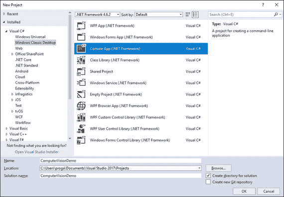
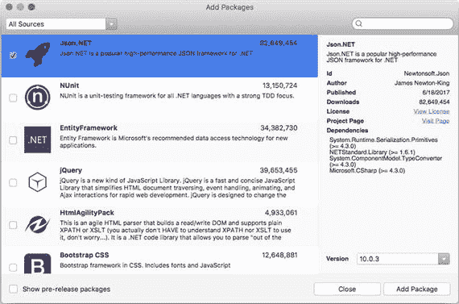
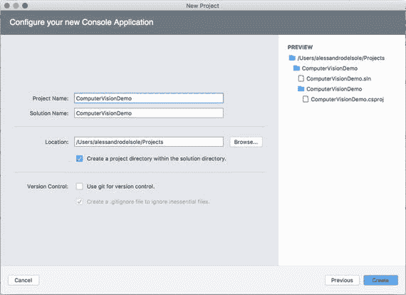
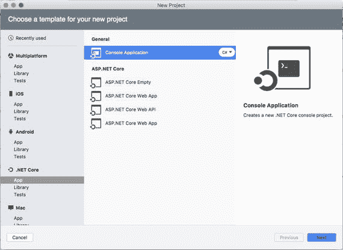
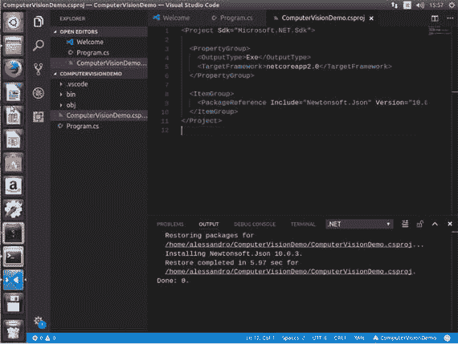

# 三、从 C# 调用计算机视觉 API

作为 RESTful 服务，所有的认知服务 API，包括计算机视觉 API，都可以被任何支持 HTTP 请求和 JSON 格式的编程语言查询。这一章是关于 C#的，并解释了如何用可以跨平台使用的 C#代码来分析图像。您将学习如何使用微软的所有主要 ide 来执行计算机视觉提供的所有分析操作。

第一步是设置您的工具箱，然后您将能够编写一些代码。

Note

永远小心你如何使用认知服务和你上传的图片。微软有严格的条款，在使用 API 之前必须阅读，可在 [`http://azure.microsoft.com/en-us/support/legal/cognitive-services-terms`](http://azure.microsoft.com/en-us/support/legal/cognitive-services-terms) 获得。

## 获取样本图像

很明显，你可以完全自由地使用你自己的图像进行分析，我也鼓励你这样做，但是如果你没有任何有用的图像文件，我在我的博客上为你准备了三个。

*   一幅海边风景: [`http://community.visual-basic.img/community_visual-basic_it/Alessandro/184/o_SeasideLandscape.jpg`](http://community.visual-basic.img/community_visual-basic_it/Alessandro/184/o_SeasideLandscape.jpg)
*   一张自己的照片，将用来演示人脸检测: [`http://community.visual-basic.img/community_visual-basic_it/Alessandro/184/o_AleDelSole.png`](http://community.visual-basic.img/community_visual-basic_it/Alessandro/184/o_AleDelSole.png)
*   一张带有一些印刷文字的图片，将用来演示光学字符识别: [`http://community.visual-basic.img/community_visual-basic_it/Alessandro/184/o_OcrSample.jpg`](http://community.visual-basic.img/community_visual-basic_it/Alessandro/184/o_OcrSample.jpg)

在将任何应用投入生产之前，请记住查看认知服务使用条款。

## 创建 C#控制台应用

因为本章的目的是解释如何在 C#中针对计算机视觉服务进行编码，所以使用控制台应用是一个好主意，它是一个独立于平台的项目类型。在接下来的两章中，您将分别看到如何创建移动应用和 web 应用。

我现在将解释如何使用 Visual Studio 2017、Visual Studio for Mac 和 Visual Studio 代码创建控制台应用。

Note

C#中有很多方法可以解析 JSON 标记。NET 对象，具有内置类型和第三方库。在本书中，我将使用流行的 Newtonsoft。Json 库( [`https://www.newtonsoft.com/json`](https://www.newtonsoft.com/json) )，这是以一种方便的方式使用 JSON 的事实上的标准。

### 在 Visual Studio 2017 中创建控制台应用

Visual Studio 2017 允许您同时使用。NET 框架和。NET 核心运行时。我将创建一个基于。NET Framework，但是请记住，相同的步骤也适用于。NET Core，如果你已经安装了的话。请记住，认知服务可以在任何平台上使用，这意味着基于。NET 框架(如 Windows Presentation Foundation、Windows 窗体和 ASP.NET)也可以利用认知服务。

在 Visual Studio 2017 中，选择文件➤新➤项目。在新建项目对话框中，选择位于 Windows Classic Desktop 下的控制台应用模板(见图 3-1 )。



图 3-1。

The Console App template in Visual Studio 2017

将新项目命名为 ComputerVisionDemo，然后单击 OK。计算机视觉 API 以 JSON 格式返回分析结果；因此，您需要一种方法来解析 JSON 响应，并以 C#对象的形式使用结果。要做到这一点，您可以使用流行的 Newtonsoft。可以从 NuGet 安装的 Json 库。在解决方案资源管理器中右击项目名称，然后选择“管理 NuGet 包”。在 NuGet 用户界面中，您应该已经在包列表中看到了这个库(如果没有看到，只需在搜索框中键入它的名称)。选择库，然后点击右边的安装按钮，如图 3-2 所示。


图 3-2。

Installing the Newtonsoft.Json NuGet package

安装完软件包后，在您的`Program.cs`文件中添加以下`using`指令:

```py
using System.Net;
using System.Net.Http;
using Newtonsoft.Json;
using Newtonsoft.Json.Linq;

```

这些指令对于缩短调用 RESTful 服务和使用 JSON 标记所需的对象调用非常有用。现在一切都在 Visual Studio 2017 中设置好了，让我们转移到 Visual Studio for Mac 环境。

### 在 Visual Studio for Mac 中创建控制台应用

Visual Studio for Mac 允许您构建。NET 核心应用，并提供一个控制台应用模板。要在 macOS 上创建和配置控制台应用，请按照下列步骤操作:



图 3-5。

Installing the Newtonsoft.Json NuGet package



图 3-4。

Assigning a name to the new project



图 3-3。

Creating a console app in Visual Studio for Mac

1.  单击文件➤新解决方案。
2.  在“新建项目”对话框中，选择下的应用项目。NET Core，然后选择控制台应用项目模板，确保 C#是所选的语言(参见图 3-3 )。
3.  单击下一步，如果需要，指定。您选择的 NET Core 版本。我建议你使用最新的版本。
4.  输入一个项目名称(见图 3-4 )，如 ComputerVisionDemo 最后，单击创建。
5.  当项目准备就绪时，在解决方案面板中右键单击项目名称，然后选择添加➤ NuGet 包。在添加包对话框中(见图 3-5 ，搜索 Json.NET 包，然后点击添加包。请注意，这是之前在 Visual Studio 2017 中讨论过的同一个库，但在这里它以一个替代的显示名称出现。

在您的`Program.cs`文件的顶部，添加下面的`using`指令，其目的是简化对。您将用来调用 RESTful 服务和使用 JSON 标记的. NET 对象:

```py
using System.Net;
using System.Net.Http;
using Newtonsoft.Json;
using Newtonsoft.Json.Linq;

```

### 用 Visual Studio 代码创建控制台应用

Visual Studio 代码是一个流行的跨平台工具，它允许开发人员在多个系统上用多种语言编写代码，包括 Windows、macOS 和 Linux(及其最流行的发行版)。特别是对于基于 Linux 的系统，Visual Studio 代码是编写基于。NET 核心运行时。我现在将演示如何在 Ubuntu 机器上设置控制台应用，但是如果您决定在 Windows 和 macOS 上使用 Visual Studio 代码，同样的步骤也适用于这些系统。

Ubuntu 可能是 Linux 最流行的桌面客户端发行版；因此，出于演示目的，这是一个不错的选择。如果还没有安装，您需要下载并安装 Visual Studio 代码( [`http://code.visualstudio.com`](http://code.visualstudio.com/) )和。网芯 SDK ( [`www.microsoft.com/net/download/core`](http://www.microsoft.com/net/download/core) )。

Note

如果您在 Windows 或 macOS 上工作，并希望在 Ubuntu 上尝试 Visual Studio 代码，您可以使用该操作系统创建一个虚拟机。你可以从 Ubuntu.com 下载 Ubuntu 的 ISO 镜像。

假设您已经安装了 Visual Studio 代码和。NET Core 2.0，要创建 C#控制台应用，请遵循以下步骤:

1.  在 Files 程序的帮助下，找到你的个人文件夹(通常是`/Home/YourName`)。
2.  右键单击文件夹，然后选择在终端中打开。这将打开一个文件夹的终端窗口。
3.  使用以下命令创建一个包含新项目的新目录:

    ```py
               > mkdir ComputerVisionDemo

    ```

4.  使用以下命令将新创建的目录设置为当前目录:

    ```py
               > cd ComputerVisionDemo

    ```

5.  使用以下命令搭建一个新的 C#控制台项目:

    ```py
    > dotnet new console

    ```

6.  使用以下命令打开 Visual Studio 代码:

    ```py
    > code.

    ```

Visual Studio 代码启动时，会打开之前创建的 C#项目(见图 3-6 )。



图 3-6。

The new project opened in Visual Studio Code

Visual Studio 代码没有内置的 NuGet 包管理器，所以需要手动编辑项目文件(`.csproj`)来添加对 Newtonsoft 的引用。Json 包，这是将计算机视觉 API 返回的 JSON 服务解析为 C#对象所必需的。为此，在浏览器栏中，单击`ComputerVisionDemo.csproj`文件，并将以下 XML 标记添加到该文件中:

```py
<ItemGroup>
  <PackageReference Include="Newtonsoft.Json" Version="10.0.3" />
</ItemGroup>

```

如果您现在选择“文件”“➤”“全部保存”, Visual Studio 代码将询问您是否允许还原丢失的依赖项，以便 Newtonsoft。Json 包已安装。一旦你完成了这些，打开`Program.cs`文件并添加下面的`using`指令:

```py
using System.Net;
using System.Net.Http;
using Newtonsoft.Json;
using Newtonsoft.Json.Linq;

```

它们有助于缩短对用于调用 RESTful 服务和使用 JSON 标记的对象的调用。

## 描述和分析图像

计算机视觉 API 允许你描述和分析图像。区别很简单:描述图像意味着检索图像内容的自然语言描述，加上一系列相关标签和关于图像文件的细节，比如大小和格式；分析图像包括描述图像，但它也允许检索进一步的细节，如成人和色情内容以及主色。先来描述一个形象。

### 描述图像

你用来描述一个图像的端点是`https://[location].api.cognitive.microsoft.com/vision/v1.0/describe[?maxCandidates]`，其中`[location]`必须替换为你最近的 Azure 区域的域名(见第二章),`maxCandidates`表示一个查询字符串参数，确定应该返回多少描述。如果未指定此参数，默认值为 1。现在假设你想用计算机视觉 API 来描述我提供的风景图片。这可以通过下面的代码来完成(参见注释):

```py
async static Task DescribeImageAsync()
{
    var client = new HttpClient();

    // Return two natural language sentences
    string requestParameters = "maxCandidates=2";

    // Add the subscription key to the header
    client.DefaultRequestHeaders.Add("Ocp-Apim-Subscription-Key",
             "YOUR-KEY-GOES-HERE");

    // Define the API endpoint including the query string parameters
    string uri = "https://westus.api.cognitive.microsoft.com/vision/v1.0/describe?" +
                  requestParameters;

    HttpResponseMessage response;

    // Construct a well-formed JSON key/value pair that
    // represents the image URL
    JObject imageUrl = new JObject(
                       new JProperty("url",
                       "http://community.visual-basic.img/community_visual-basic_it/Alessandro/184/o_SeasideLandscape.jpg"));

    // You pass the JSON object above as the request body
    using (var content =
        new StringContent(imageUrl.ToString(), Encoding.UTF8, "application/json"))
    {
        // Add headers
        content.Headers.ContentType = new MediaTypeHeaderValue("application/json");

        // Call the endpoint
        response = await client.PostAsync(uri, content);

        // If successful...
        if (response.StatusCode == HttpStatusCode.OK)
        {
            // Read the resulting HTTP content as a string
            string jsonResponse = await response.Content.ReadAsStringAsync();

            // Generate fully indented JSON markup from the original response
            var parsedJson = JObject.Parse(jsonResponse);

            Console.WriteLine(parsedJson.ToString());
        }

    }

    Console.ReadLine();
}

```

对于所有请求，您将使用`HttpClient`类，提供适当的头，然后调用它的`PostAsync`方法，传递端点 URL 和请求体。注意请求体是如何通过`JObject`类构造的，它允许您生成格式良好的 JSON 对象。`JProperty`类允许您指定一个键/值对，在本例中是一个表示图像 URL 的键/值对。在这种情况下，代码还提供了`maxCandidates`参数来检索多个描述。`PostAsync`向计算机视觉 API 发送 HTTP POST 请求；并且，如果操作成功完成，来自`Content`对象(类型为`HttpContent`)的`ReadAsStringAsync`方法将返回一个 JSON 字符串，其中包含服务能够返回的所有细节。为了清楚起见，调用`JObject.Parse`来获得一个完全缩进的 JSON 字符串，它将出现在控制台窗口中。必须从`Program`类的`Main`方法中调用前面的方法，如下所示:

```py
static void Main(string[] args)
{
    DescribeImageAsync().Wait();
}

```

因为您不能在`Main`方法中使用`async`和`await`，除非您使用 C# 7.1，否则调用实际上是使用`Wait`方法同步完成的。

Note

C# 7.1 引入了在`Main`方法中使用`async`和`await`的选项，需要 Visual Studio 2017 版本 15.3 及更高版本。我在本书中没有使用这种语言版本，这样你就可以毫无问题地运行示例代码。

例如，我从这个 RESTful 调用中得到的响应如下:

```py
{
  "description": {
    "tags": [
      "outdoor",
      "boat",
      "scene",
      "water",
      "harbor",
      "filled",
      "ship",
      "dock",
      "carrying",
      "large",
      "small",
      "people",
      "man",
      "docked",
      "many",
      "bunch",
      "group",
      "air",
      "truck",
      "ocean",
      "white",
      "airplane",
      "plane",
      "body",
      "parked",
      "standing",
      "ramp",
      "board"
    ],
    "captions": [
      {
        "text": "a group of people on a boat in a harbor",
        "confidence": 0.74378581874407157
      },
      {
        "text": "a boat is docked next to a body of water"

,
        "confidence": 0.74278581874407157
      }
    ]
  },
  "requestId": "aed5709e-c6c6-43c7-b583-94a2fe0930ad",
  "metadata": {
    "width": 3840,
    "height": 2160,
    "format": "Jpeg"
  }
}

```

名为`description`的第一个 JSON 元素公开了一个`tags`数组，该数组包含服务能够基于图片内容生成的标签列表。`description`中的第二个数组叫做`captions`，包含由服务生成的自然语言句子列表和置信度。级别越高，关于生成的句子的准确度的置信度越高。`requestId`元素是唯一标识请求的 GUID，而`metadata`元素包含图像大小和格式，具有不言自明的属性。在 C#中，你有很多选择来访问和迭代数组。然而，您也可以利用`JObject`实例上的索引器来检索特定的信息。例如，下面一行检索数组中第二个标题的自然语言句子:

```py
//Return "a boat is docked next to a body of water"
string description = parsedJson["description"]["captions"][1]["text"].ToString();

```

作为另一个示例，您可以迭代标签列表，如下所示:

```py
foreach(var item in parsedJson["description"]["tags"])
{
    Console.WriteLine(item.ToString());
}

```

正如你所看到的，计算机视觉 API 能够用自然语言语句描述图像内容以及它如何返回标签和元数据是非常出色的。

### 分析图像

分析图像的工作方式基本上类似于描述图像，但区别在于您可以检索更多的细节，因此您可以创建更复杂的查询字符串。分析一张图片的终点是`https://[location].api.cognitive.microsoft.com/vision/v1.0/analyze[?visualFeatures][&details][&language]`，其中`[location]`必须替换为最接近 Azure 区域的域名。您还可以提供许多可选的查询字符串参数:

*   `visualFeatures`允许您指定应该返回哪些视觉特征。支持的功能列表将很快提供。
*   `details`允许您包含特定领域的详细信息，如名人和地标名称。支持的值有`Celebrities`和`Landmarks`。
*   `language`提供一个选项来指定服务应该使用什么语言来描述图像。在撰写本文时，支持的语言是`en`(英语)和`zh`(简体中文)。如果没有指定语言，则默认为英语。

以下是您可以为更深入的图像分析指定的视觉特征列表:

*   `Categories`:该服务将为图像生成一个可能的类别列表。
*   `Tags`:该服务将生成与图像内容相关的单词列表。
*   该服务将检索图像中的任何人脸，如果有的话，将生成坐标、年龄和性别。
*   `ImageType`:该服务检测图像是剪贴画还是线条画。
*   `Color`:该服务检测强调色、主色，以及图像是否为黑白。
*   `Adult`:该服务检测图片是否包含露骨的色情内容。

您可以通过用逗号分隔来组合多个视觉特征。例如，下面的代码演示了如何在包含人脸的图像上检索视觉特征:

```py
async static Task AnalyzeImageAsync()
{
    var client = new HttpClient();

    // Request parameters. Visual features are comma-separated
    string requestParameters = "visualFeatures=Categories,Description,Color,Faces,Adult";

    // Request headers
    client.DefaultRequestHeaders.Add("Ocp-Apim-Subscription-Key",
                                                    "YOUR-KEY-GOES-HERE");

    string uri =
        "https://westus.api.cognitive.microsoft.com/vision/v1.0/analyze?"
        + requestParameters;

    HttpResponseMessage response;

    JObject imageUrl = new JObject(
                       new JProperty("url",
                       "http://community.visual-basic.img/community_visual-basic_it/Alessandro/184/o_AleDelSole.png"));

    // Request body
    using (var content =
        new StringContent(imageUrl.ToString(), Encoding.UTF8, "application/json"))
    {
        content.Headers.ContentType = new MediaTypeHeaderValue("application/json");
        response = await client.PostAsync(uri, content);

        if(response.StatusCode == HttpStatusCode.OK)
        {
            string jsonResponse = await response.Content.ReadAsStringAsync();

            var parsedJson = JObject.Parse(jsonResponse);
            Console.WriteLine(parsedJson.ToString());
        }

    }

    Console.ReadLine();
}

```

前面的代码用于分析我提供的照片，将返回以下 JSON:

```py
{
  "categories": [
    {
      "name": "people_portrait",
      "score": 0.91015625
    }
  ],
  "adult": {
    "isAdultContent": false,
    "isRacyContent": false,
    "adultScore": 0.0095219314098358154,
    "racyScore": 0.0099660586565732956
  },
  "description": {
    "tags": [
      "person",
      "man",
      "outdoor",
      "building",
      "camera",
      "smiling",
      "standing",
      "holding",
      "car",
      "street",
      "bus",
      "sitting",
      "wearing",
      "city",
      "black",
      "glasses",
      "large",
      "woman",
      "dog",
      "phone",
      "white"
    ],
    "captions": [
      {
        "text": "a man smiling for the camera",
        "confidence": 0.96098232754013913

      }
    ]
  },
  "requestId": "591dac9c-4729-4964-96f4-726c2c292210",
  "metadata": {
    "width": 234,
    "height": 234,
    "format": "Png"
  },
  "faces": [
    {
      "age": 37,
      "gender": "Male",
      "faceRectangle": {
        "left": 53,
        "top": 68,
        "width": 134,
        "height": 134
      }
    }
  ],
  "color": {
    "dominantColorForeground": "White",
    "dominantColorBackground": "Black",
    "dominantColors": [
      "White",
      "Grey"
    ],
    "accentColor": "8D6B3E",
    "isBWImg": false
  }
}

```

JSON 标记非常容易理解。除了通过描述图像已经获得的信息之外，您还可以获得关于检测到的人脸、性别、年龄和人脸位置坐标的物理细节。还要注意`adult`元素的结果，您可以正确地看到该图像不包含成人或色情内容。为了给你更准确的概念，我写这篇文章的时候已经 40 岁了，但是这张照片是我 35 岁的时候拍的。该服务检测到一名 37 岁的男子，这是一个很好的近似水平。您可以使用前面描述的相同技术将 JSON 元素和子元素解析成`JObject`实例，以便更容易地访问 JSON 数组及其属性/值对。

### 生成缩略图

计算机视觉 API 使得生成图像缩略图变得容易。端点是`https://[location].api.cognitive.microsoft.com/vision/v1.0/generateThumbnail[?width][&height][&smartCropping]`，其中`[location]`是你最近的 Azure 区域的域名。`width`、`height`和`smartCropping`查询字符串参数表示缩略图的宽度和高度以及用于启用智能裁剪的布尔标志。

如您所料，在这种情况下，计算机视觉服务不会返回纯文本 JSON 响应。返回的对象实际上是二进制数据，C#允许您将这些数据包装到一个`MemoryStream`中，然后您可以根据自己的需要对其进行处理，比如将流内容直接显示为图像，或者使用一个`FileStream`从流中创建一个文件。下面的代码演示了如何生成缩略图:

```py
async static Task GenerateThumbnailAsync()
{
    var client = new HttpClient();

    // Return two natural language sentences
    string requestParameters = "width=320&height=240";

    // Add the subscription key to the header
    client.DefaultRequestHeaders.Add("Ocp-Apim-Subscription-Key",
                                                    "YOUR-KEY-GOES-HERE");

    // Define the API endpoint
    string uri = "https://westus.api.cognitive.microsoft.com/vision/v1.0/GenerateThumbnail?" +
              requestParameters;

    HttpResponseMessage response;

    // Construct a well-formed JSON key/value pair that
    // represents the image URL
    JObject imageUrl = new JObject(
                       new JProperty("url",
                       "http://community.visual-basic.img/community_visual-basic_it/Alessandro/184/o_SeasideLandscape.jpg"));

    // You pass the JSON object above as the request body
    using (var content =
        new StringContent(imageUrl.ToString(), Encoding.UTF8, "application/json"))
    {
        // Add headers
        content.Headers.ContentType = new MediaTypeHeaderValue("application/json");

        // Call the endpoint
        response = await client.PostAsync(uri, content);

        // If successful,
        if (response.StatusCode == HttpStatusCode.OK)
        {
            // Get the thumbnail as a MemoryStream
            var binaryResponse = await response.Content.ReadAsStreamAsync();
        }

    }

    Console.ReadLine();
}

```

注意这次您是如何调用`ReadAsStreamAsync`将响应解析成 C#可以使用的流对象的。

### 标记图像

计算机视觉 API 还允许您根据图像内容快速生成图像标签，而无需执行更详细的分析。用于标记的端点在`https://[location].api.cognitive.microsoft.com/vision/v1.0/tag`可用，并且没有查询字符串参数可用。您可以编写以下代码:

```py
async static Task TagImageAsync()
{
    var client = new HttpClient();

    // Add the subscription key to the header
    client.DefaultRequestHeaders.Add("Ocp-Apim-Subscription-Key",
              "YOUR-KEY-GOES-HERE");

    // Define the API endpoint
    string uri = "https://westus.api.cognitive.microsoft.com/vision/v1.0/tag";

    HttpResponseMessage response;

    // Construct a well-formed JSON key/value pair that
    // represents the image URL
    JObject imageUrl = new JObject(
                       new JProperty("url",
                       "http://community.visual-basic.img/community_visual-basic_it/Alessandro/184/o_SeasideLandscape.jpg"));

    // You pass the JSON object above as the request body
    using (var content =
        new StringContent(imageUrl.ToString(), Encoding.UTF8, "application/json"))
    {
        // Add headers
        content.Headers.ContentType = new MediaTypeHeaderValue("application/json");

        // Call the endpoint
        response = await client.PostAsync(uri, content);

        // If successful,
        if (response.StatusCode == HttpStatusCode.OK)
        {
            // Read the resulting HTTP content as a string
            string jsonResponse = await response.Content.ReadAsStringAsync();

            // Generate fully indented JSON markup from the original response
            var parsedJson = JObject.Parse(jsonResponse);
            Console.WriteLine(parsedJson.ToString());
        }

    }

    Console.ReadLine();
}

```

您将得到的结果类似于下面的 JSON:

```py
{
  "tags": [
    {
      "name": "sky",
      "confidence": 0.99912935495376587
    },
    {
      "name": "outdoor",
      "confidence": 0.97800672054290771
    },
    {
      "name": "boat",
      "confidence": 0.94631272554397583
    },
    {
      "name": "scene",
      "confidence": 0.89682495594024658
    },
    {
      "name": "harbor",
      "confidence": 0.77457839250564575
    }
  ],
  "requestId": "37a85e3b-3008-4166-ba36-7da2c2a78cd7",
  "metadata": {
    "width": 3840,
    "height": 2160,
    "format": "Jpeg"
  }
}

```

如您所见，这个简化的 JSON 响应包含一个`tags`数组，其中每个元素包含单词和置信度。您仍然可以使用`JObject`类和前面描述的技术来访问数组中的单个元素。

## 使用光学字符识别

计算机视觉 API 提供光学字符识别(OCR)。OCR 功能强大:计算机视觉可以检测文本，它可以检测语言、单词的位置、文本方向以及检测到的文本相对于最近的水平或垂直方向的角度(以度为单位)。您可以通过将所需的图像以二进制流或 URL 的形式传递到以下端点来利用 OCR:`https://[location].api.cognitive.microsoft.com/vision/v1.0/ocr[?language][&detectOrientation]`。

与其他端点一样，您将使用最近的 Azure 区域的域名替换`[location]`，并且您可以传递`language`和`detectOrientation`查询字符串参数。第一个参数允许您为想要分析的文本指定语言，而第二个参数指定您还想要检索文本方向。请注意，提供语言完全是可选的，因为计算机视觉算法会自动检测语言。值得一提的是，这个服务足够强大，可以检索图像中其他元素内的文本。在 C#中，调用服务的方式类似于前面的例子。

```py
async static Task RecognizeTextAsync()
{
    var client = new HttpClient();

    // Add the subscription key to the header
    client.DefaultRequestHeaders.Add("Ocp-Apim-Subscription-Key",
                                                     "YOUR-KEY-GOES-HERE");

    // Define the API endpoint
    string uri = "https://westus.api.cognitive.microsoft.com/vision/v1.0/ocr";

    HttpResponseMessage response;

    // Construct a well-formed JSON key/value pair that
    // represents the image URL
    JObject imageUrl = new JObject(
                       new JProperty("url",
                       "http://community.visual-basic.img/community_visual-basic_it/Alessandro/184/o_OcrSample.jpg"));

    // You pass the JSON object above as the request body
    using (var content =
        new StringContent(imageUrl.ToString(), Encoding.UTF8, "application/json"))
    {
        // Add headers

        content.Headers.ContentType = new MediaTypeHeaderValue("application/json");

        // Call the endpoint
        response = await client.PostAsync(uri, content);

        // If successful,
        if (response.StatusCode == HttpStatusCode.OK)
        {
            // Read the resulting HTTP content as a string
            string jsonResponse = await response.Content.ReadAsStringAsync();

            // Generate fully indented JSON markup from the original response
            var parsedJson = JObject.Parse(jsonResponse);
            Console.WriteLine(parsedJson.ToString());
        }

    }

    Console.ReadLine();
}

```

对于指定的图像，您从计算机视觉的 OCR 服务获得的响应类似于以下 JSON:

```py
{
  "language": "en",
  "textAngle": -2.0000000000000338,
  "orientation": "Up",
  "regions": [
    {
      "boundingBox": "92,165,467,136",
      "lines": [
        {
          "boundingBox": "97,165,451,57",
          "words": [
            {
              "boundingBox": "97,165,8,42",
              "text": "I"
            },
            {
              "boundingBox": "126,167,106,44",
              "text": "CAN"
            },
            {
              "boundingBox": "255,171,293,51",
              "text": "RECOGNIZE"

            }
          ]
        },
        {
          "boundingBox": "92,243,467,58",
          "words": [
            {
              "boundingBox": "92,243,159,46",
              "text": "WHAT"
            },
            {
              "boundingBox": "265,249,108,45",
              "text": "YOU"
            },
            {
              "boundingBox": "393,253,166,48",
              "text": "WRITE"
            }
          ]
        }
      ]
    }
  ]
}

```

JSON 响应由以下核心元素组成:

*   `regions`:一个对象数组，其中每个对象代表一个检测到的文本区域
*   `lines`:一个对象数组，每个对象代表一个区域中的一行文本
*   `words`:一个对象数组，每个对象代表一行中的一个单词

当您想用 OCR 解析检测到的文本时，您需要记住这个更复杂的层次结构。当然，您仍然可以使用`JObject`类来解析 JSON 响应的内容，就像您之前看到的那样。

### 检索手写文本

计算机视觉 API 还提供了一项有趣的服务，允许您从图像中检索手写文本。它的行为类似于 OCR 服务，但是您调用下面的端点:`https://[location].api.cognitive.microsoft.com/vision/v1.0/recognizeText[?handwriting]`。这里您需要做的是提供`handwriting=true`查询字符串参数来启用手写文本识别。如果不指定此参数，服务将通过 OCR 搜索打印文本。

## 使用领域特定的模型

通过特定领域的模型，计算机视觉算法可以对特定类别的图像进行专门的分析。在撰写本文时，计算机视觉 API 提供了两个现成的特定领域模型:名人识别和地标识别。特定领域模型的列表将来肯定会增加，并且您可以选择创建自己的模型。

假设您想要检测照片中的名人。首先，您需要检索特定领域模型的列表，并获得名人识别的引用。这是通过针对`https://[location].api.cognitive.microsoft.com/vision/v1.0/models`端点的 HTTP GET 请求来完成的，如下面的代码所示:

```py
async static Task ListModelsAsync()
{
    var client = new HttpClient();

    // Add the subscription key to the header
    client.DefaultRequestHeaders.Add("Ocp-Apim-Subscription-Key", "YOUR-KEY-GOES-HERE");

    // Define the API endpoint
    string uri = "https://westus.api.cognitive.microsoft.com/vision/v1.0/models";

    HttpResponseMessage response;

    // Call the endpoint
    response = await client.GetAsync(uri);

    // If successful,
    if (response.StatusCode == HttpStatusCode.OK)
    {
       // Read the resulting HTTP content as a string
       string jsonResponse = await response.Content.ReadAsStringAsync();

       // Generate fully indented JSON markup from the original response
       var parsedJson = JObject.Parse(jsonResponse);
       Console.WriteLine(parsedJson.ToString());
    }

    Console.ReadLine();
}

```

前面的调用将返回以下 JSON(将来可能会有所不同):

```py
{
  "models": [
    {
      "name": "celebrities",
      "categories": [
        "people_"
      ]
    },
    {
      "name": "landmarks",
      "categories": [
        "outdoor_",
        "building_"
      ]
    }
  ],
  "requestId": "d7a81873-fdf9-4e48-8247-26b1ec0725b4"
}

```

可以看到，有一个数组叫做`models`。对于数组中的每一项，您将需要检查`name`属性的值，比如`celebrities`或`landmarks`。这必须传递给对图像执行实际识别的端点。用于识别特定领域内容的端点的 URL 如下:`https://[location].api.cognitive.microsoft.com/vision/v1.0/models/{model}/analyze`。这里你需要用最近的 Azure 区域的域名替换`[location]`，用`celebrities`或`landmarks`替换`{model}`。出于版权原因，我不会显示名人的图片，也不会指向关于名人的现有图像 URL，但是您可以使用以下代码来检索名人识别图像的结果:

```py
async static Task RecognizeCelebrityAsync()
{
    var client = new HttpClient();

    // Add the subscription key to the header
    client.DefaultRequestHeaders.Add("Ocp-Apim-Subscription-Key", "YOUR-KEY-GOES-HERE");

    // Define the API endpoint
    string uri = "https://westus.api.cognitive.microsoft.com/vision/v1.0/models/celebrities/analyze";

    HttpResponseMessage response;

    // Construct a well-formed JSON key/value pair that
    // represents the image URL
    JObject imageUrl = new JObject(
                       new JProperty("url",
                       "IMAGE-URL-GOES-HERE"));

    // You pass the JSON object above as the request body
    using (var content =
        new StringContent(imageUrl.ToString(), Encoding.UTF8, "application/json"))
    {
        // Add headers
        content.Headers.ContentType = new MediaTypeHeaderValue("application/json");

        // Call the endpoint
        response = await client.PostAsync(uri, content);

        // If successful,
        if (response.StatusCode == HttpStatusCode.OK)
        {
            // Read the resulting HTTP content as a string
            string jsonResponse = await response.Content.ReadAsStringAsync();

            // Generate fully indented JSON markup from the original response
            var parsedJson = JObject.Parse(jsonResponse);
            Console.WriteLine(parsedJson.ToString());
        }

    }

    Console.ReadLine();
}

```

您得到的 JSON 响应如下所示:

```py
{
  "requestId": "ab594260-2d70-4919-b997-425cddd9758d",
  "metadata": {
    "width": 960,
    "height": 540,
    "format": "Jpeg"
  },
  "result": {
    "celebrities": [
      {
        "name": "Celebrity name",
        "faceRectangle": {
          "left": 346,
          "top": 74,
          "width": 75,
          "height": 75
        },
        "confidence": 0.9925701
      }
    ]
  }
}

```

JSON 响应包含`metadata`项中的图像信息和一个名为`celebrities`的数组。这包含了一个在图像中检测到的所有名人名字的列表，对于每个名人，你可以看到他们的脸的坐标。至于其他端点，您可以使用`JObject`类来解析 JSON 结果。NET 对象。地标识别以同样的方式工作，但是你有一个名为`landmarks`的阵列来代替`celebrities`阵列。

## 摘要

计算机视觉 API 提供了强大而复杂的算法，允许您使用自然语言描述来描述和分析图像。为了查询服务，您向各个端点发送 HTTP POST 和 GET 请求。在 C#中，更常见的是在。NET 中，这可以用`System.Net.Http.HttpClient`类来完成，它可以跨平台移植，因此可以在所有。NET 平台和所有的微软 ide，如 Visual Studio 2017、Visual Studio for Mac 和 Visual Studio Code。

在 Windows、macOS 和 Ubuntu 上创建和配置了控制台应用之后，您通过首先学习如何用自然语言、机器生成的描述来描述图像，从而了解了计算机视觉 API 的功能。然后，您看到了如何使用图像分析检索更复杂的结果。然后讨论转移到如何使用简单的 API 调用生成缩略图和标签。继续，您看到了 OCR 引擎如何强大到足以识别图像中的印刷文本和手写文本。最后，您从特定于领域的模型开始，学习如何获得可用模型的列表，然后学习如何执行名人识别。在所有代码示例中，您都使用了`JObject`类来构造和解析 JSON 对象。

到目前为止，您已经看到了如何调用计算机视觉 API，并且学习了如何发送请求和解析字符串形式的 JSON 响应。在下一章中，您将开始在使用 Xamarin 的移动应用中使用计算机视觉 API。表单和基于计算机视觉客户端库的不同方法。