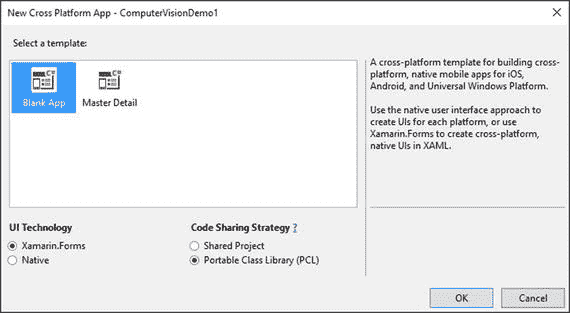
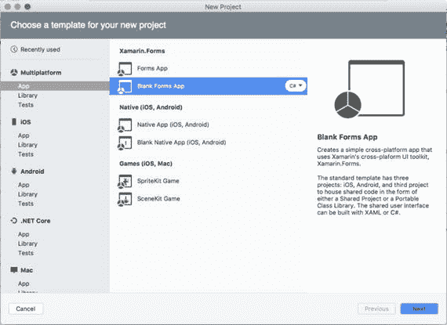
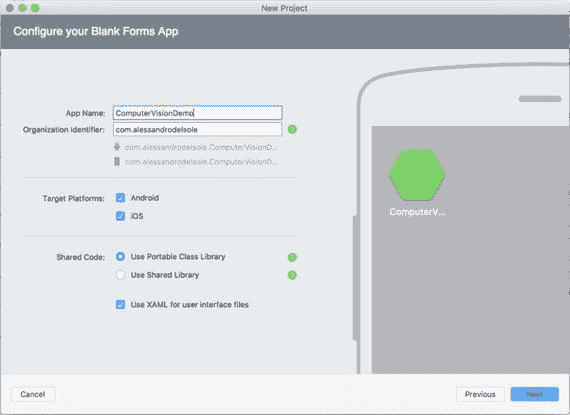
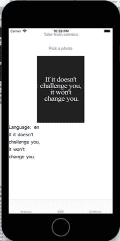

# 四、基于 Xamarin 的移动应用的计算机视觉

如果人工智能随处可用，它会给用户带来巨大的好处。有了移动设备和移动应用，这当然是可能的。出于这个原因，作为一名开发人员，理解如何在移动应用中使用认知服务是非常重要的。

从 C#开发的角度来看，Xamarin 无疑是您在移动应用开发中需要考虑的技术。使用 Xamarin，您可以用 C#为 Android、iOS、macOS 和 tvOS 构建本机应用。此外，使用 Xamarin。表单，您可以使用一个共享的 C#代码库为 Android、iOS 和 Windows 10 编写本机应用，从而创建跨平台的解决方案。本章向您介绍了 Xamarin 在移动设备上的计算机视觉的奇妙世界。形式，我相信你会立即察觉到人工智能给移动开发者带来的不可思议的机会。

Note

在本章中，您将使用模拟器运行示例项目的 iOS、Android 和 Windows 10 版本。然而，对于现实世界的移动开发，我强烈建议您在物理设备上工作。

## 创造一个 Xamarin。表单解决方案

本章的目标之一是解释如何在多种移动平台上使用计算机视觉 API(以及更一般的微软认知服务)。在手机 app 开发方面，Xamarin。Forms 当然是最合适的选择，因为它允许你从一个 C#代码库创建 iOS、Android 和 Windows 10 的应用。更具体地说，您将看到如何创建一个用户界面由三个选项卡组成的应用，允许描述图像、识别文本和识别名人。

建造一个 Xamarin。表单解决方案，需要 Windows 上的 Visual Studio 2017 或者 macOS 上的 Visual Studio for Mac。两种 ide 免费社区版都完全支持 Xamarin。表单开发。我现在将描述创建和配置一个新的示例 Xamarin 的步骤。在两个系统上形成解决方案。

Note

因为本章的目标不是介绍 Xamarin。表单，而是描述如何从 Xamarin 调用计算机视觉 API。表单解决方案，Xamarin 的基本知识。强烈建议使用表单来完成本章。如果你没有经验，你可以免费使用我的 Xamarin。形式简洁的电子书，可在 [`http://bit.ly/2gegT9l`](http://bit.ly/2gegT9l) 买到。我假设您知道如何创建页面，以及如何使用可扩展应用标记语言(XAML)来设计基本的用户界面。

### 为 Xamarin 配置 Visual Studio 2017

Note

如果您已经随 Visual Studio 2017 一起安装了 Xamarin 开发工具，则可以跳过这一部分。假设您在安装时选择了 Xamarin 组件，那么您不需要在 Visual Studio for Mac 上进行任何额外的配置，Visual Studio for Mac 已经包含了所有必需的工具。

在 Visual Studio 2017 中开始 Xamarin 开发之前，必须安装适当的工具。为此，首先需要启动 Visual Studio Installer 工具，然后选择“Mobile development with”。NET”工作量，如图 [4-1](#Fig1) 所示。


图 4-1。

Installing the Xamarin development tools

此时，单击“Individual components”选项卡，找到模拟器组，并确保至少选择了以下组件:

*   谷歌安卓模拟器
*   英特尔硬件加速执行管理器
*   Windows 10 移动模拟器(尽可能选择最高的 Windows 版本)

准备就绪后，单击修改。Visual Studio 安装程序将需要几分钟时间来安装选定的组件。安装完成后，您可以关闭 Visual Studio 安装程序并启动 Visual Studio 2017。

### 介绍计算机视觉客户端库

在前一章中，您看到了如何使用`System.Net.HttpClient`类对计算机视觉 API 服务执行 HTTP 请求，然后您使用了 Newtonsoft。Json 名称空间来解析 JSON 响应。这种方法是最通用的，因为它可以很容易地跨平台重用，但它要求您实现自己的方法。NET 对象来表示对图像的分析结果，当您创建一个`HttpClient`实例和调用它的方法(通常是`PostAsync`和`GetAsync`)时，它需要您手动指定头、内容类型、端点和查询字符串参数。

Microsoft 还开发了一个客户端可移植库，它将 HTTP 请求封装到特定的方法中，并公开一些类，您可以使用这些类轻松地将分析结果反序列化到。NET 强类型对象。这个库叫做`Microsoft.ProjectOxford.Vision.dll`，作为一个 NuGet 包提供。

Note

牛津项目是微软认知服务发布前的项目名称。

在使用可移植库的解决方案中，该库可以极大地简化您与计算机视觉 API 的交互方式。因此，它非常适合 Xamarin。表单解决方案，在本章中，您将学习如何使用这个库而不是其他方法，以便您完全了解查询计算机视觉服务的所有方法。表 [4-1](#Tab1) 列出了该库提供的最重要的类型和成员。

表 4-1。

Most Important Types and Members in the Microsoft.ProjectOxford.Vision Library

<colgroup><col> <col> <col></colgroup> 
| 名字 | 类型 | 描述 |
| --- | --- | --- |
| `VisionServiceClient` | 班级 | 提供对计算机视觉 API 的托管访问，并允许您指定订阅密钥 |
| `AnalyzeImageAsync` | 方法 | 允许您分析和描述图像 |
| `RecognizeTextAsync` | 方法 | 对包含文本的图像执行 OCR |
| `AnalyzeImageInDomainAsync` | 方法 | 允许您基于特定领域的模型(如名人和地标)分析图像 |
| `AnalysisResult` | 班级 | 表示对图像分析结果的响应 |
| `AnalysisInDomainResult` | 班级 | 表示基于特定领域模型的图像分析的响应 |
| `VisualFeature` | 列举型别 | 表示查询计算机视觉服务必须返回的信息 |

这些类型和成员将在创建示例应用页面时详细讨论。

在创建 Xamarin 之前提到这个库。Forms 解决方案是必要的，以便您在安装所有必要的 NuGet 包时知道它是什么。

### 创造一个 Xamarin。Visual Studio 2017 中的表单解决方案

在 Visual Studio 2017 中，选择文件➤新➤项目。在新建项目对话框中，定位跨平台节点，然后选择跨平台 App (Xamarin)项目模板，如图 [4-2](#Fig2) 所示。输入 ComputerVisionDemo 作为项目名称，然后单击确定。

在下一个对话框中，Visual Studio 将要求您指定 UI 技术和代码共享策略。选择 Xamarin。表单和可移植类库(PCL)(见图 [4-3](#Fig3) )。



图 4-3。

Configuring a Xamarin.Forms solution


图 4-2。

Creating a Xamarin.Forms solution

准备就绪后，单击确定。出现提示时，选择您想要的最高版本的 Windows 10。几秒钟后，Visual Studio 将生成一个由以下内容组成的解决方案:

*   一个包含所有跨平台共享代码的可移植类库(PCL)项目
*   一个 Xamarin。面向 Android 设备的 Android 项目
*   针对 iOS 设备的 Xamarin.iOS 项目
*   面向 Windows 10 设备和机器的通用 Windows 平台(UWP)项目

PCL 项目是您编写可以跨平台共享的所有代码的地方，这些代码包括用户界面和所有不特定于平台的代码。您现在需要几个 NuGet 包，通过在解决方案资源管理器中右键单击解决方案名称，然后选择 Manage NuGet Packages 来安装这些包。当 NuGet 用户界面出现时，您需要安装以下软件包:

*   微软。ProjectOxford.Vision，前面描述的客户端库。此库依赖于 Newtonsoft。Json 包，它也将被安装。
*   Xam。Plugin.Media 是一个库，可以很容易地使用跨平台代码访问媒体文件。
*   Xam。Plugin.Connectivity，一个允许你用跨平台代码检查互联网连接可用性的库。

解决方案现在已经建立。现在将提供关于 Visual Studio for Mac 的指南，然后您将开始编写代码。

### 创造一个 Xamarin。Visual Studio for Mac 中的窗体解决方案

在 Visual Studio for Mac 中，选择“文件”>“新建解决方案”。当新项目对话框出现时，找到多平台下的应用节点，并选择空白表单应用模板(参见图 [4-4](#Fig4) )。不要选择 Forms 应用模板，因为它包含对本例没有用的样板代码。



图 4-4。

Creating a Xamarin.Forms solution on the Mac

点击下一步时，系统会要求您输入项目名称(参见图 [4-5](#Fig5) )。进入 ComputerVisionDemo 并确保“使用可移植类库”和“对用户界面文件使用 XAML”都被选中。



图 4-5。

Configuring a Xamarin.Forms solution on the Mac

请记住 Xamarin。用 Visual Studio for Mac 创建的窗体解决方案不支持通用 Windows 平台项目类型。单击下一步，等待解决方案创建完成。现在你需要安装一些 NuGet 包。与 Windows 上的 Visual Studio 2017 不同，在 Visual Studio for Mac 中，您不能直接在解决方案级别安装软件包。这意味着您需要在每个单独的项目中安装相同的 NuGet 包。要将一个或多个 NuGet 包安装到项目中，您需要在解决方案面板中右键单击项目名称，然后选择添加➤添加 Nuget 包。当“添加包”对话框出现时，您可以搜索并选择要安装到同一个项目中的多个包。您需要的软件包如下:

*   微软。ProjectOxford.Vision，前面描述的客户端库。此包仅在您的解决方案的 PCL 项目中是必需的，并且依赖于 Newtonsoft。Json 包，它也将被安装。
*   Xam。Plugin.Media 是一个库，可以很容易地使用跨平台代码访问媒体文件。此包必须安装到解决方案中的所有项目中。
*   Xam。Plugin.Connectivity，一个允许你用跨平台代码检查互联网连接可用性的库。此包必须安装到解决方案中的所有项目中。

完成 NuGet 包的安装后，您就可以使用 Xamarin 解决方案中的计算机视觉 API 了。

## 实例化服务客户端

计算机视觉客户端库提供了一个名为`VisionServiceClient`的类，来自微软。ProjectOxford.Vision 命名空间，它允许您以完全。面向网络的时尚。因此，您需要这个类的一个实例，创建它的一个好地方是在`App`类和`App.xaml.cs`文件中。

这样，您将有一个单独的实例来服务不同应用页面中的多个请求。下面的代码演示了如何声明和创建`VisionServiceClient`类的共享实例:

```py
using Microsoft.ProjectOxford.Vision;
using Xamarin.Forms;

namespace ComputerVisionDemo
{
    public partial class App : Application
    {
        internal static VisionServiceClient visionClient;
        public App()
        {
            InitializeComponent();

            visionClient = new VisionServiceClient("YOUR-KEY-GOES-HERE",
                "https://YourAzureRegion.api.cognitive.microsoft.com/vision/v1.0");
            MainPage = new ComputerVisionDemo.MainPage();
        }
}

```

请注意构造函数是如何接受两个字符串参数的:第一个参数代表您的订阅密钥，第二个参数是根服务 URL，您需要用第 [2](2.html) 章中总结的 URL 之一替换关于 Azure 区域的部分。

## 实施图像分析

您要实现的第一个功能是利用计算机视觉客户端库来分析和描述图像。这将通过一个特定的页面提供，该页面稍后将嵌入到应用的主页中。

首先，向 PCL 项目添加一个新的 XAML 内容页面。在 Visual Studio 2017 中，您可以通过右击项目名称，然后选择“添加➤新项”来完成此操作。在 Visual Studio for Mac 中，可以通过右击项目名，然后选择“添加➤新文件”来完成此操作。在这两种情况下，选择 ContentPage XAML 项模板并调用新页面`ImageAnalysisPage.xaml`。当您添加页面时，Visual Studio 还会生成一个 C#代码隐藏文件，在本例中为`ImageAnalysisPage.xaml.cs`。您将在这里编写代码，将图像上传到计算机视觉服务进行分析并获得响应。这可以通过调用`VisionServiceClient`类的`AnalyzeImageAsync`方法来完成，封装逻辑如下:

```py
private async Task<AnalysisResult> AnalyzePictureAsync(Stream inputFile)
{
    // Use the connectivity plugin to detect
    // if a network connection is available
    // Remember a using Plugin.Connectivity; directive
    if (!CrossConnectivity.Current.IsConnected)
    {
        await DisplayAlert("Network error",
            "Please check your network connection and retry.", "OK");
        return null;
    }

    VisualFeature[] visualFeatures = new VisualFeature[] { VisualFeature.Adult,
        VisualFeature.Categories, VisualFeature.Color, VisualFeature.Description,
        VisualFeature.Faces, VisualFeature.ImageType, VisualFeature.Tags };

    AnalysisResult analysisResult =
        await App.visionClient.AnalyzeImageAsync(inputFile,
        visualFeatures);

    return analysisResult;
}

```

这段代码首先通过利用`Xam.Plugin.Connectivity`库中的`CrossConnectivity`类来检查互联网连接的可用性。然后它创建了一个由`VisualFeature`对象组成的数组，每个对象代表一条您想要从图像中检索的信息。`VisualFeature`实际上是一个枚举，数组组合了多个成员。这就是`VisualFeature`是如何在幕后实现的:

```py
namespace Microsoft.ProjectOxford.Vision
{
    public enum VisualFeature
    {
        ImageType = 0,
        Color = 1,
        Faces = 2,
        Adult = 3,
        Categories = 4,
        Tags = 5,
        Description = 6
    }
}

```

`AnalyzeImageAsync`方法接收两个参数:输入文件，它是一个流，以及`VisualFeature`对象的数组。结果被封装到一个类型为`AnalysisResult`的对象中，定义如下:

```py
namespace Microsoft.ProjectOxford.Vision.Contract
{
    public class AnalysisResult
    {
        public AnalysisResult();

        public Guid RequestId { get; set; }
        public Metadata Metadata { get; set; }
        public ImageType ImageType { get; set; }
        public Color Color { get; set; }
        public Adult Adult { get; set; }
        public Category[] Categories { get; set; }
        public Face[] Faces { get; set; }
        public Tag[] Tags { get; set; }
        public Description Description { get; set; }
    }
}

```

这个类的每个属性都是一个专用类型。看看它们是如何定义的是一个好主意；您需要知道您需要的信息实际存储在哪里，因为您可能希望从用户界面到这些对象执行数据绑定。在当前的示例应用中，您将考虑`Color`、`Adult`、`Category`、`Face`、`Tags`和`Description`类型。顺便说一下，示例应用将只使用这些类型中的一些属性，因此表 [4-2](#Tab2) 总结了将被使用的属性。如果您想查看完整的类型定义，只需在代码编辑器中右击类型名称，然后选择“转到定义”。

表 4-2。

Most Common Properties for Image Analysis

<colgroup><col> <col> <col> <col></colgroup> 
| 财产 | 班级 | 描述 | 类型 |
| --- | --- | --- | --- |
| `AccentColor` | `Color` | 返回图片中的主色 | `string` |
| `IsAdultContent` | `Adult` | 如果图像包含明确的内容，则返回 true | `bool` |
| `IsRacyContent` | `Adult` | 如果图像包含色情内容，则返回 true | `bool` |
| `Captions` | `Description` | 由一个`Text`字符串属性和一个`Confidence`双精度属性组成的`Caption`类型的数组，表示图像的人类语言描述 | `Caption[]` |

然后，您需要一些代码，允许用户从设备中选取现有图像，或者从内置相机中拍摄新照片。为了实现这一点，您可以利用`Xam.Plugin.Media`库并编写以下代码，这些代码与即将在用户界面中声明的两个按钮相关(还要注意，`Indicator1`是一个`ActivityIndicator`控件，稍后将放入用户界面中):

```py
private async void TakePictureButton_Clicked(object sender, EventArgs e)
{
    await CrossMedia.Current.Initialize();

    if (!CrossMedia.Current.IsCameraAvailable || !CrossMedia.Current.IsTakePhotoSupported)
    {
        await DisplayAlert("No Camera", "No camera available.", "OK");
        return;
    }

    var file = await CrossMedia.Current.TakePhotoAsync(new StoreCameraMediaOptions

    {
        SaveToAlbum = true,
        Name = "test.jpg"
    });

    if (file == null)
        return;

    this.Indicator1.IsVisible = true;
    this.Indicator1.IsRunning = true;

    Image1.Source = ImageSource.FromStream(() => file.GetStream());
    this.BindingContext = await AnalyzePictureAsync(file.GetStream());

    this.Indicator1.IsRunning = false;
    this.Indicator1.IsVisible = false;
}

private async void UploadPictureButton_Clicked(object sender, EventArgs e)
{
    if (!CrossMedia.Current.IsPickPhotoSupported)
    {
        await DisplayAlert("No upload", "Picking a photo is not supported.", "OK");
        return;
    }

    var file = await CrossMedia.Current.PickPhotoAsync();
    if (file == null)
        return;

    this.Indicator1.IsVisible = true;
    this.Indicator1.IsRunning = true;
    Image1.Source = ImageSource.FromStream(() => file.GetStream());

    try

    {
        this.BindingContext = await AnalyzePictureAsync(file.GetStream());
    }
    catch (Exception ex)
    {
        await DisplayAlert("Error", ex.Message, "OK");
        return;
    }
    finally
    {
        this.Indicator1.IsRunning = false;
        this.Indicator1.IsVisible = false;
    }
}

```

Note

在前面的代码中，`AnalyzePictureAsync`方法的结果被直接赋给了`BindingContext`属性，只是为了演示的目的。在真实世界的代码中，您将希望创建一个合适的视图模型，该模型还将作为用户界面的数据源。

以下是前面代码中的一些有趣之处:

*   Xam 中的`CrossMedia`类。Plugin.Media library 允许你分别用`PickPhotoAsync`和`TakePhotoAsync`方法从相机中选择一个现有的图像或拍摄一个。
*   `TakePhotoAsync`允许您指定文件名以及是否将文件保存到相机胶卷中。
*   选中的图片被分配给一个名为`Image1`的`Image`控件的`Source`属性，并且必须作为一个开放流传递给之前定义的`AnalyzePictureAsync`方法。
*   从`AnalyzePictureAsync`返回的`AnalysisResult`类的实例被分配给页面的`BindingContext`属性，作为用户界面的数据源。这允许将控件数据绑定到`AnalysisResult`实例中的属性，稍后您将在 XAML 代码中看到这一点。

现在让我们看看如何允许用户选择图像，以及如何在当前页面的用户界面中显示分析结果。

### 设计用户界面

当前页面的用户界面的 XAML 代码很简单。根`StackLayout`包含一个`Image`控件，其中将显示所选图像；一个`ActivityIndicator`控件，用于显示进度指示器；一个`ScrollView`，其内容是一组绑定到`AnalysisResult`对象属性的`Label`控件；以及一个`ListView`控件，将通过数据绑定显示检测到的标签列表。XAML 代码如下所示:

```py
<?xml version="1.0" encoding="utf-8" ?>
<ContentPage  Title="Analysis"
             xmlns:x="http://schemas.microsoft.com/winfx/2009/xaml"
             x:Class="ComputerVisionDemo.ImageAnalysisPage">
    <ContentPage.Content>
        <StackLayout Orientation="Vertical">
            <Button x:Name="TakePictureButton" Clicked="TakePictureButton_Clicked"
          Text="Take from camera"/>
            <Button x:Name="UploadPictureButton" Clicked="UploadPictureButton_Clicked"
        Text="Pick a photo"/>
            <ActivityIndicator x:Name="Indicator1" IsVisible="False" IsRunning="False" />
            <Image x:Name="Image1" HeightRequest="240" WidthRequest="320" />

            <ScrollView Padding="10">
                <StackLayout>
                    <StackLayout Orientation="Horizontal">
                        <Label Text="Adult content: "/>
                        <Label Text="{Binding Adult.IsAdultContent}"/>
                    </StackLayout>
                    <StackLayout Orientation="Horizontal">
                        <Label Text="Racy content: "/>
                        <Label Text="{Binding Adult.IsRacyContent}"/>
                    </StackLayout>
                    <StackLayout Orientation="Horizontal">
                        <Label Text="Description: "/>
                        <Label Text="{Binding Description.Captions[0].Text}"/>

                    </StackLayout>
                    <StackLayout Orientation="Horizontal">
                        <Label Text="Accent color: "/>
                        <Label Text="{Binding Color.AccentColor}"/>
                    </StackLayout>
                    <StackLayout Orientation="Horizontal">
                        <Label Text="Tags: "/>
                        <ListView ItemsSource="{Binding Tags}">
                            <ListView.ItemTemplate>
                                <DataTemplate>
                                    <ViewCell>
                                        <Label Text="{Binding Name}"/>
                                    </ViewCell>
                                </DataTemplate>
                            </ListView.ItemTemplate>
                        </ListView>
                    </StackLayout>
                </StackLayout>
            </ScrollView>
        </StackLayout>
    </ContentPage.Content>
</ContentPage>

```

前面的 XAML 代码中的关注点由`Binding`表达式表示，每个表达式指向`AnalysisResult`类的属性及其子属性。有趣的是，`Description.Captions`数组中的第一个元素(索引为零)包含图像的自然语言描述。现在您将看到如何实现光学字符识别。

## 实现光学字符识别

计算机视觉客户端库还简化了图像的光学字符识别，其方法类似于图像分析，即从`VisionServiceClient`类中调用一个名为`RecognizeTextAsync`的方法，传递您想要分析的图像并获得一个类型为`OcrResults`的对象作为响应。也就是说，在 PCL 项目中添加一个新的 XAML 内容页面，名为`OcrRecognitionPage.xaml`。在 C#代码隐藏文件中，您可以编写以下方法来对作为流传递的图像文件实现 OCR 识别:

```py
private async Task<OcrResults> AnalyzePictureAsync(Stream inputFile)
{
    if (!CrossConnectivity.Current.IsConnected)
    {
        await DisplayAlert("Network error", "Please check your network connection and retry.", "OK");
        return null;
    }

    OcrResults ocrResult = await App.visionClient.RecognizeTextAsync(inputFile);
    return ocrResult;
}

```

正如您之前所做的，您可以使用`CrossConnectivity`类来检测互联网连接的可用性。`OcrResults`类比`AnalysisResult`更复杂。在其他特性中，它公开了一个类型为`Region[]`的`Regions`属性。数组中的每个`Region`代表服务能够识别的文本区域，并公开类型`Line[]`的`Lines`属性。数组中的每一行代表区域中的一行，并公开一个类型为`Word[]`的`Words`属性。数组中的每个`Word`代表该行中的一个单词，它的`Text`属性包含实际的单词。由于这种更复杂的结构，检索已识别文本的一种可能方式是迭代区域，然后是行，然后是单词。例如，您可以创建多个`StackLayout`容器，这些容器带有多个代表检测到的文本的标签，如下所示:

```py
private void PopulateUIWithRegions(OcrResults ocrResult)
{
    // Iterate the regions
    foreach (var region in ocrResult.Regions)
    {
        // Iterate lines per region
        foreach (var line in region.Lines)
        {
            // For each line, add a panel
            // to present words horizontally
            var lineStack = new StackLayout
            { Orientation = StackOrientation.Horizontal };

            // Iterate words per line and add the word
            // to the StackLayout
            foreach (var word in line.Words)
            {
                var textLabel = new Label { Text = word.Text };
                lineStack.Children.Add(textLabel);
            }

            // Add the StackLayout to the UI
            this.DetectedText.Children.Add(lineStack);
        }
    }
}

```

`DetectedText`是 UI 中的根`StackLayout`容器，用`AnalyzePictureAsync`检索 OCR 结果后会调用`PopulateUIWithRegions`方法。现在，正如您对图像分析所做的那样，您可以实现两个`Button.Clicked`事件处理程序，一个用于从设备的磁盘中选取图像，一个用于从相机中拍摄照片:

```py
private async void UploadPictureButton_Clicked(object sender, EventArgs e)
{
    if (!CrossMedia.Current.IsPickPhotoSupported)
    {
        await DisplayAlert("No upload", "Picking a photo is not supported.", "OK");
        return;
    }

    var file = await CrossMedia.Current.PickPhotoAsync();
    if (file == null)
        return;

    this.Indicator1.IsVisible = true;
    this.Indicator1.IsRunning = true;
    Image1.Source = ImageSource.FromStream(() => file.GetStream());

    var ocrResult = await AnalyzePictureAsync(file.GetStream());
    this.BindingContext = ocrResult;

    PopulateUIWithRegions(ocrResult);

    this.Indicator1.IsRunning = false;
    this.Indicator1.IsVisible = false;
}

private async void TakePictureButton_Clicked(object sender, EventArgs e)

{
    await CrossMedia.Current.Initialize();

    if (!CrossMedia.Current.IsCameraAvailable || !CrossMedia.Current.IsTakePhotoSupported)
    {
        await DisplayAlert("No Camera", "No camera available.", "OK");
        return;
    }

    var file = await CrossMedia.Current.TakePhotoAsync(new StoreCameraMediaOptions
    {
        SaveToAlbum = true,
        Name = "test.jpg"
    });

    if (file == null)
        return;

    this.Indicator1.IsVisible = true;
    this.Indicator1.IsRunning = true;

    Image1.Source = ImageSource.FromStream(() => file.GetStream());

    var ocrResult = await AnalyzePictureAsync(file.GetStream());
    this.BindingContext = null;
    this.BindingContext = ocrResult;

    PopulateUIWithRegions(ocrResult);

    this.Indicator1.IsRunning = false;
    this.Indicator1.IsVisible = false;
}

```

注意 OCR 的结果是如何分配给页面的`BindingContext`属性的。原因是用户界面会将一个标签数据绑定到`OcrResults`类的`Language`属性，该属性包含识别文本的语言。然后注意对`PopulateUIWithRegions`的调用如何用所有单独的文本行填充 UI。

### 设计用户界面

这个页面的用户界面甚至更简单，因为它包含显示所选图像的`Image`控件、两个按钮、一个显示进度指示器的`ActivityIndicator`、一个显示语言的数据绑定的`Label`,以及一个在运行时用`PopulateUIWithRegions`方法填充的可滚动的`StackLayout`。XAML 标记如下所示:

```py
<?xml version="1.0" encoding="utf-8" ?>
<ContentPage  Title="OCR"
             xmlns:x="http://schemas.microsoft.com/winfx/2009/xaml"
             x:Class="ComputerVisionDemo.OcrRecognitionPage">

  <StackLayout Orientation="Vertical">
    <Button x:Name="TakePictureButton" Clicked="TakePictureButton_Clicked"
          Text="Take from camera"/>
    <Button x:Name="UploadPictureButton" Clicked="UploadPictureButton_Clicked"
        Text="Pick a photo"/>
    <ActivityIndicator x:Name="Indicator1" IsVisible="False" IsRunning="False" />
    <Image x:Name="Image1" HeightRequest="240" />

    <StackLayout Orientation="Horizontal">
      <Label Text="Language: "/>
      <Label Text="{Binding Language}"/>
    </StackLayout>

    <ScrollView>
      <StackLayout x:Name="DetectedText"/>
    </ScrollView>

  </StackLayout>
</ContentPage>

```

你差不多完成了。下一步是实施名人认可，然后你将能够在行动中看到你的工作成果。

## 实施名人认可

名人识别是计算机视觉 API 中可用的领域特定模型的一部分。在撰写本文时，该服务支持将名人和地标识别为特定于领域的模型。关于特定于领域的模型，计算机视觉客户端库提供了`VisionServiceClient.AnalyzeImageInDomainAsync`方法，该方法返回一个类型为`AnalysisInDomainResult`的对象。

为了理解它是如何工作的，向 PCL 项目添加一个名为`CelebrityRecognitionPage.xaml`的新页面。在 C#代码隐藏中，添加以下方法:

```py
private async Task<AnalysisInDomainResult> AnalyzePictureAsync(Stream inputFile)
{
    if (!CrossConnectivity.Current.IsConnected)
    {
        await DisplayAlert("Network error", "Please check your network connection and retry.", "OK");
        return null;
    }

    AnalysisInDomainResult analysisResult =
        await App.visionClient.AnalyzeImageInDomainAsync(inputFile, await GetDomainModel());

   return analysisResult;
}

```

如您所见，`AnalyzeImageInDomainAsync`方法需要输入文件作为参数，还需要一个类型为`Model`的对象，该对象表示特定于领域的模型，图像必须根据该模型进行分析。在本例中，这个对象由一个名为`GetDomainModel`的方法返回，其代码如下:

```py
private async Task<Model> GetDomainModel()
{
    ModelResult modelResult = await App.visionClient.ListModelsAsync();
    // At this writing, only celebrity recognition
    // is available. It is the first model in the list
    return modelResult.Models.First();
}

```

`ListModelsAsync`方法返回可用的特定领域模型的列表。列表中的第一个模型是关于名人的，但是您可以选择不同的模型。解析分析结束时返回的`AnalysisInDomainResult`对象更加复杂，因为它的`Result`属性是`object`类型，因此您必须进行一些手动解析。结果实际上是 JSON 标记，其中包含一个名为`celebrities`的元素，该元素包含一个名人姓名数组，每个姓名由`name`属性标识。简单地说，您可以使用`Newtonsoft.Json.Linq.JObject`类将 JSON 内容解析成字符串内容，如下所示:

```py
private string ParseCelebrityName(object analysisResult)
{
    JObject parsedJSONresult = JObject.Parse(analysisResult.ToString());

    var celebrities = from celebrity in parsedJSONresult["celebrities"]
                      select (string)celebrity["name"];

    return celebrities.FirstOrDefault();
}

```

注意，为了保持 UI 简单，前面的代码只返回一个名人的名字。如果您想处理多个名人的名字，可以修改代码来删除`FirstOrDefault`并返回一个`IEnumerable<string>`。正如您之前所做的，您现在可以处理两个`Button.Clicked`事件，如下所示:

```py
private async void TakePictureButton_Clicked(object sender, EventArgs e)
{
    await CrossMedia.Current.Initialize();

    if (!CrossMedia.Current.IsCameraAvailable || !CrossMedia.Current.IsTakePhotoSupported)
    {
        await DisplayAlert("No Camera", "No camera available.", "OK");
        return;
    }

    var file = await CrossMedia.Current.TakePhotoAsync(new StoreCameraMediaOptions
    {
        SaveToAlbum = true,
        Name = "test.jpg"
    });

    if (file == null)
        return;

    this.Indicator1.IsVisible = true;
    this.Indicator1.IsRunning = true;

    Image1.Source = ImageSource.FromStream(() => file.GetStream());

    var analysisResult = await AnalyzePictureAsync(file.GetStream());
    this.CelebrityName.Text = ParseCelebrityName(analysisResult.Result);

    this.Indicator1.IsRunning = false;
    this.Indicator1.IsVisible = false;
}

private async void UploadPictureButton_Clicked(object sender, EventArgs e)
{
    if (!CrossMedia.Current.IsPickPhotoSupported)
    {
        await DisplayAlert("No upload", "Picking a photo is not supported.", "OK");
        return;
    }

    var file = await CrossMedia.Current.PickPhotoAsync();
    if (file == null)
        return;

    this.Indicator1.IsVisible = true;
    this.Indicator1.IsRunning = true;
    Image1.Source = ImageSource.FromStream(() => file.GetStream());

    AnalysisInDomainResult analysisResult = await AnalyzePictureAsync(file.GetStream());
    this.CelebrityName.Text = ParseCelebrityName(analysisResult.Result);

    this.Indicator1.IsRunning = false;
    this.Indicator1.IsVisible = false;
}

```

在这种特殊情况下，没有数据绑定。只有一个名为`CelebrityName`的标签，其`Text`属性被赋予了`ParseCelebrityName`的结果。如果您更改代码来处理多个名人的名字，显然您将需要多个标签或一个`ListView`控件。

### 设计用户界面

这个页面的用户界面的 XAML 代码非常简单。在核心部分，您需要一个`Image`控件来显示选中的图像，一个`Label`控件来显示名人的名字:

```py
<?xml version="1.0" encoding="utf-8" ?>
<ContentPage  Title="Celebrity"
             xmlns:x="http://schemas.microsoft.com/winfx/2009/xaml"
             x:Class="ComputerVisionDemo.CelebrityRecognitionPage">
  <StackLayout Orientation="Vertical">
    <Button x:Name="TakePictureButton" Clicked="TakePictureButton_Clicked"
          Text="Take from camera"/>
    <Button x:Name="UploadPictureButton" Clicked="UploadPictureButton_Clicked"
        Text="Pick a photo"/>
    <ActivityIndicator x:Name="Indicator1" IsVisible="False" IsRunning="False" />
    <Image x:Name="Image1" HeightRequest="240" />

    <Label x:Name="CelebrityName"/>
  </StackLayout>
</ContentPage>

```

现在是时候把所有的页面放在一起，看看应用是如何工作的。

## 把所有的放在一起

示例 Xamarin 的最后一步。表单解决方案是创建一个包含以前创建的内容页面的选项卡式页面。为此，您可以将`MainPage.xaml`页面的内容从一个`ContentPage`对象更改为一个`TabbedPage`对象，其 XAML 标记如下所示:

```py
<?xml version="1.0" encoding="utf-8" ?>
<TabbedPage 
             xmlns:x="http://schemas.microsoft.com/winfx/2009/xaml"
             xmlns:local="clr-namespace:ComputerVisionDemo"
             x:Class="ComputerVisionDemo.MainPage">

    <TabbedPage.Children>
        <local:ImageAnalysisPage />
        <local:OcrRecognitionPage />
        <local:CelebrityRecognitionPage />
    </TabbedPage.Children>
</TabbedPage>

```

请注意如何将`ContentPage`对象添加到`TabbedPage.Children`属性和 Xamarin 中。表单将根据应用运行的系统解析适当的布局。在 C#代码隐藏中，您需要将`MainPage`对象的继承从`ContentPage`更改为`TabbedPage`，如下所示:

```py
public partial class MainPage : TabbedPage
{

    public MainPage()
    {
        InitializeComponent();
    }
}

```

现在，您已经准备好测试您的示例应用，但是还有最后一步您必须完成，那就是在所需的平台上启用访问相机和图片库的权限。对于 UWP 项目，您不需要更改应用清单，因为已经设置了所有必需的权限。对于 Android 项目，需要在应用清单中选择以下权限:`CAMERA`、`INTERNET`、`READ_EXTERNAL_STORAGE`。对于 iOS 项目，在`Info.plist`文件中，您需要包含带有字符串描述的`NSCameraUsageDescription`和`NSPhotoLibraryUsageDescription`属性，以支持 iOS 10 和更高版本中的隐私限制。此时，选择您的目标平台，并使用系统上可用的工具栏或键盘快捷键开始调试。图 [4-6](#Fig6) 显示了 Windows 平板电脑模拟器上的图像描述示例，而图 [4-7](#Fig7) 显示了基于 iOS 模拟器的 OCR 示例。出于版权原因，我不会展示名人识别的结果，但您可以亲自尝试。



图 4-7。

The sample app performing OCR on the iPhone


图 4-6。

The sample app running on a Windows 10 tablet

正如你所见，根据图像质量，你的应用将能够对图像进行复杂的分析。在您的移动应用中实现计算机视觉会带来无限的场景，并将帮助您构建下一代智能应用。

## 摘要

人工智能在移动应用上非常有用，因为用户可以在口袋里装上由智能算法支持的应用，无论他们去哪里。基于此，本章介绍了如何在使用 Xamarin.Forms 开发的移动应用上使用计算机视觉 API。

您了解了如何创建 Xamarin。Visual Studio 2017 和 Visual Studio for Mac 上的窗体解决方案，以及如何使用正确的 NuGet 包配置该解决方案。然后，您了解了查询计算机视觉 API 的另一种方法，这种方法基于计算机视觉客户端库，由 Microsoft。Vision 包，它公开了允许执行操作和检索结果的类型和成员。面向网络的时尚。然后讨论转移到分析操作的实际实现，包括描述图像、执行 OCR 和识别名人，同时利用有用的 Xamarin 插件。使用客户端库的最大好处是您不需要执行复杂的 JSON 解析，因为您得到的是强类型。NET 对象来表示服务返回的响应。通过实现，您看到了如何设计基本的用户界面，以及如何在模拟器中测试示例应用。相反，下一章将向您概述另一个有趣的机会，那就是使用 ASP.NET web 应用的计算机视觉 API。