# 四、人工神经网络优化

在自动特征学习方法创新之前，数据科学家被要求知道使用什么特征、使用哪个模型、如何优化结果等等。随着大量数据和高速设备的存在，DL 可用于自动推断最佳特征。数据科学家的两个核心任务是模型设计和优化。

模型优化与构建模型本身一样重要，甚至更重要。先前创建的证明其准确性的 DL 模型可以被重用，从而解决了模型设计问题。剩下的任务是优化。我们正处于优化的时代，运筹学(OR)科学家在其中扮演着至关重要的角色。最优化领域与人工智能密切相关。

为 ML 任务选择最佳参数具有挑战性。一些结果可能不是因为数据有噪声或者所使用的学习算法弱，而是因为参数值的错误选择。理想情况下，优化通过查看不同的解决方案并选择最佳方案来保证返回最佳方案。定义解决方案优劣的指标越多，就越难找到最佳解决方案。本章介绍了最优化，并讨论了一种简单的最优化技术，称为遗传算法。基于给出的例子，如何在基于优势概念的单目标和多目标优化问题(MOOPs)中使用它将变得清楚。该算法与人工神经网络一起使用，以产生更好的权重，有助于提高分类精度。

## 优化简介

假设一位数据科学家将一个图像数据集划分为多个类别，并且要创建一个图像分类器。在数据科学家研究了数据集之后，K-最近邻(KNN)似乎是一个不错的选择。要使用 KNN 算法，有一个重要参数需要使用，即 K，指的是邻居的数量。假设选择初始值 3。

科学家从选定的 K=3 开始 KNN 算法的学习过程。训练后的模型达到了 85%的分类准确率。这个百分比可以接受吗？换句话说，我们能得到比目前更好的分类精度吗？在进行不同的实验之前，我们不能说 85%是最好的准确度。但是要做另一个实验，我们肯定必须在实验中改变一些东西，比如改变 KNN 算法中使用的 K 值。我们不能肯定地说 3 是在这个实验中使用的最佳值，除非我们尝试不同的 K 值并注意分类准确度如何变化。问题是如何找到使分类性能最大化的 K 的最佳值。这被称为超参数优化。

在最优化中，我们从实验中使用的变量的某种初始值开始。因为这些值可能不是最佳值，所以我们必须改变它们，直到得到最佳值。在某些情况下，这些值是由复杂的函数生成的，我们无法轻松地手动求解。但是进行优化是非常重要的，因为分类器可能产生差的分类精度。原因可能不是数据有噪声或者使用的学习算法弱，而是参数选择不好。因此，或研究人员提出了不同的优化技术来完成此类工作。

### 单目标与多目标优化

对最优化问题进行分类的一种方法是基于它是单目标问题还是多目标问题。让我们在这一小节中对它们进行区分。

假设有一个图书出版商想从卖书中获取最大利润。他们用等式 4-1 来计算他们每天的利润，其中 X 代表书籍的数量，Y 代表利润。优化时要问自己的问题是，为了让结果更好，要改变什么。

*Y*=(*X*2)<sup>3</sup>+3(方程式 4-1)

我们可以回到前面的问题。为了优化前面的问题，我们希望达到输出变量的最佳值。这里，我们只有一个输出变量，y。

为了得到输出变量 Y 的最佳值，我们可以在问题中改变什么来改变变量 Y？换句话说，Y 依赖的变量是什么？看看等式 4-1，Y 只依赖于一个变量，即输入变量 X。通过改变 X，我们可以将 Y 改变为一个更好的值。因此，前一个问题可以适用于这个特定的问题，如下所示:输入变量 X 的最佳值是什么，它返回输出变量 Y 的最佳值？

假设输入变量 X 的范围是 1 到 3，包括 1 和 3。哪个值的利润最高？如果没有信息指引我们找到最佳解决方案，我们必须尝试所有可能的解决方案(即输入变量 X 的所有可能值)，并选择利润最大化的解决方案(即对应于输出变量 Y 的最大值的解决方案)。表 [4-1](#Tab1) 显示了所有可能的 X 值及其对应的 Y 值。基于它，最佳解是 Y=4，对应 X=1。

表 4-1

单变量问题的所有可能的解决方案

<colgroup><col class="tcol1 align-left"> <col class="tcol2 align-left"></colgroup> 
| 

X

 | 

Y

 |
| --- | --- |
| one | four |
| Two | three |
| three | Two |

让我们把问题变得复杂一点。假设这个问题有另一个用于利润计算的因素，那就是它的在线网站的访问者数量。它被表示为变量 Z，取值范围从 1 到 2。修正在方程 4-2 中。按照前面的程序，我们需要尝试表 [4-2](#Tab2) 中输入 X 和 Z 的所有可能组合。最佳解对应于 X=2 和 Z=2。

*Y*=*Z*<sup>3</sup>-(*X*2)<sup>3</sup>+3(方程式 4-2)

表 4-2

有两个输入变量的问题的所有可能的解

<colgroup><col class="tcol1 align-left"> <col class="tcol2 align-left"> <col class="tcol3 align-left"></colgroup> 
| 

**X**

 | 

**Z**

 | 

**Y**

 |
| --- | --- | --- |
| one | one | five |
| one | Two | six |
| Two | one | four |
| Two | Two | Eleven |
| three | one | three |
| three | Two | Ten |

有时输入变量的范围是无限的，我们不能尝试它的所有值。例如，输入 X 和 Z 的范围可能都是实数。按照前面尝试所有可能值的过程，我们将在这种情况下失败。必须有某种东西引导我们走向最佳解决方案，而不需要尝试所有可能的输入值。

以前的优化问题只有一个目标，就是利润最大化。另一个目标可以是最小化由等式 4-3 表示的废纸，其中 W 表示废纸的量，范围从 2 到 4 吨。结果，问题变成了 MOOP，如方程 4-4 所示。

*K*=(*X*2)<sup>2</sup>+1(方程式 4-3)

<colgroup><col class="tcol1 align-left"> <col class="tcol2 align-left"></colgroup> 
| 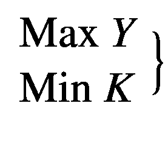在哪里***Y***=***Z***<sup>3</sup>—***X***—2)<sup>2</sup>+3***K***=(***X***2)<sup>2</sup>+1使遭受1≤t0**≤3&【1≤T4】**【z】**≤2** | (方程式 4-4) |

我们的目标不仅是利润最大化，而且是废纸量最小化。这使得问题变得更加复杂，因为我们必须记住，X 的选定值应该满足两个目标，而不是一个，特别是当两个目标相互冲突时。这是因为减少废纸量可能会降低利润。目标之间必须有所取舍，因为一个解决方案在一个目标中可能更好，而在另一个目标中可能更差。注意，为了简单起见，最大化目标被转化为最小化目标。

随着目标和变量数量的增加，复杂性也随之增加，问题变得难以人工解决。这就是为什么我们需要自动优化技术来解决这样的问题。

本章讨论遗传算法，这是一个简单的技术，解决单目标和多目标优化问题。非支配排序遗传算法-II (NSGA-II)是一种基于遗传算法的多目标进化算法(MOEA ),寻找满足多个目标的可行解。因为 MOOPs 可能有多个解决方案，NSGA-II 可以返回所有目标的可能可行的解决方案。基于用户的偏好，可以筛选出最佳的单个解决方案。

观察各种自然物种，我们可以注意到它们是如何进化和适应环境的。我们可以从这些已经存在的自然系统和它们的自然进化中受益，来创造我们的人工系统做同样的工作。这叫仿生学。比如飞机是基于鸟类如何飞行，雷达来自蝙蝠，潜艇是基于鱼类发明的等等。因此，一些优化算法的原理来自于自然。比如 GA，它的核心思想来自查尔斯·达尔文的自然进化论:“适者生存。”

我们可以说优化是使用 EAs 执行的。传统算法和进化算法的区别在于进化算法不是静态的，而是动态的，因为它们可以随着时间的推移而进化。

职业介绍所有三个主要特征:

1.  基于群体:进化算法是优化一个过程，在这个过程中，当前的解决方案是不好的，以产生新的和更好的解决方案。从中产生新解的当前解的集合称为群体。

2.  以健身为导向:如果有几个方案，怎么能说一个方案比另一个方案好呢？从适应度函数计算出的每个单独的解决方案都有一个相关的适应度值。这样的适应值反映了解决方案有多好。

3.  变异驱动:如果根据从每个个体计算的适应度函数，在当前种群中没有可接受的解，我们应该做出一些东西来生成新的更好的解。因此，单个解决方案将经历许多变化以生成新的解决方案。

我们现在将开始讨论应用这些概念的遗传算法。

## 通用航空

遗传算法是一种随机优化技术。所谓“随机”，是指为了使用 GA 找到一个解决方案，随机变化被应用到当前的解决方案以生成新的解决方案。遗传算法是基于达尔文的进化论。这是一个缓慢、渐进的过程，通过对其解决方案进行细微的改变，直到找到更好的解决方案。通过在几代人之间发展解决方案，新的解决方案有望比旧的解决方案更好。

遗传算法处理由多个解组成的群体。群体大小是解的数量。每个解决方案都被称为个体。每个个体代表一条染色体。染色体被表示为一组定义个体特征或参数的基因。有不同的方式来表示基因，如二进制或十进制。图 [4-1](#Fig1) 给出了一个有四个个体(染色体)的群体的例子，其中每个染色体有四个基因，每个基因用一个二进制数字表示。


图 4-1

GA 的群体、染色体和基因

在建立了第一代(第 0 代)的种群后，下一步是选择最佳的交配方案并产生新的更好的方案。为了选择最佳解决方案，使用了适应度函数。适应度函数的结果是代表解的质量的适应度值。适应值越高，解的质量越高。在配对池中选择具有最高适应值的解决方案。这样的解决方案将结合产生新的解决方案。

交配池内的解称为亲本。父母为了产生后代(孩子)而交配。仅仅通过优质个体的交配，就有望获得比其父母更优质的后代。这阻止了坏个体产生更多的坏个体。保持选择和匹配高质量的个体，通过只保留好的特性和去除坏的特性，有更高的机会提高解决方案的质量。最后，这将以期望的最优或可接受的解决方案结束。

当双亲简单交配时，后代只具有双亲的特征；没有添加新的属性。假设所有的父母都患有一种局限性，他们一起交配肯定会产生具有相同局限性的后代。为了克服这个问题，对每个后代进行一些改变，以产生具有新特性的新个体。新的后代将是下一代人口中的解决方案。

因为应用于后代的改变是随机的，所以我们不能确定新的后代会比双亲更好。当代人的解决方案可能比他们的父辈更糟糕。因此，新的种群将由父母和后代组成。一半是父母，另一半是新的后代。如果群体大小是 8，那么新的群体将由之前的 4 个父母和 4 个后代组成。在最坏的情况下，当所有的后代都比父母更差时，质量不会下降，就像我们保留了父母一样。图 [4-1](#Fig1) 总结了 GA 的步骤。

要全面了解 GA，需要回答两个问题:

1.  父母双方的两个后代是如何产生的？

2.  每一个后代是如何被轻微改变的？

这些问题我们以后再来回答。

染色体有不同的表示法，选择正确的表示法要视具体问题而定。一个好的表示法是使搜索空间更小，从而更容易搜索。

可用于染色体的表示包括以下内容:

*   二进制:每个染色体被表示为一串 0 和 1。

*   排列:对于排序问题很有用，比如旅行推销员问题。

*   值:实际值按原样编码。

例如，如果我们用二进制编码数字 5，它可能看起来像图 [4-2](#Fig2) 中的第一条染色体。

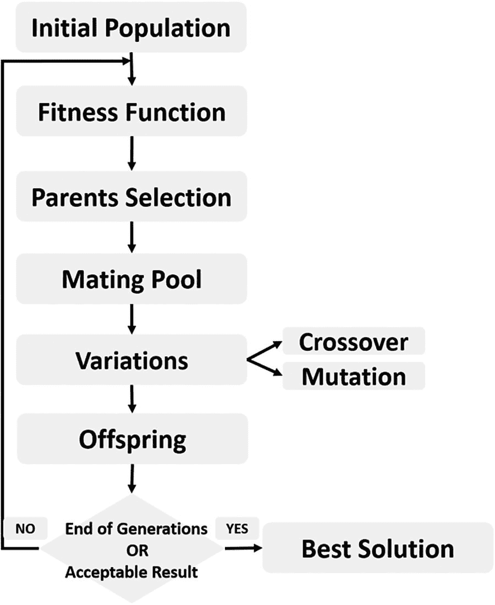

图 4-2

GA 步骤

前面染色体的每一部分被称为一个基因。每个基因都有两种特性。第一个是它的值(等位基因)，第二个是在染色体内的位置(基因座)。图 [4-1](#Fig1) 中每条染色体最右边的位置代表位置 0，最左边的位置代表位置 3。

每条染色体有两种表现形式:

1.  基因型:代表染色体的一组基因。

2.  表型:染色体的实际物理表现。

二进制数 0101 <sub>2</sub> 为基因型，5 <sub>10</sub> 为表现型表示。二进制表示可能不是表示给定问题解决方案的最佳方式，尤其是当表示基因的位数不固定时。

以正确的方式表示每个染色体后，下一步是计算每个个体的适应值。

### 最佳父母选择

假设等式 4-5 是我们在图 [4-1](#Fig1) 的例子中使用的适应度函数，其中 x 是染色体十进制值。

*f*(*x*)= 2*x*2(等式 4-5)

第一个解决方案的适应度值为十进制值 5，计算如下:


计算染色体适应值的过程称为评估。表 [4-3](#Tab3) 中给出了所有解决方案的适应值。

表 4-3

每个解决方案的适合度值

<colgroup><col class="tcol1 align-left"> <col class="tcol2 align-left"> <col class="tcol3 align-left"></colgroup> 
| 

解决方案编号

 | 

小数值

 | 

健身价值

 |
| --- | --- | --- |
| one | five | eight |
| Two | Eleven | Twenty |
| three | Twelve | Twenty-two |
| four | Two | Two |

在交配池中选择当前种群中最好的个体。在这一步之后，我们将最终选择交配池中的一个种群子集。但是父母选择的数量是多少呢？这取决于正在解决的问题。在我们的例子中，我们可以只选择两个父母。这两个父母将交配产生两个后代。父母和后代的结合将产生一个由四个父母组成的新群体。根据表 [4-3](#Tab3) ，最好的两个方案是编号为 2 和 3 的方案。

### 变异算子

选择的两个亲本应用于变异算子以产生后代。算子是交叉和变异。

#### 交叉

使用交叉操作，来自父母双方的基因被选择来创建新的孩子。因此，孩子将继承父母双方的财产。每个父母携带的基因数量是不固定的。有时后代从父母一方获得一半基因，从另一方获得另一半基因，有时这些百分比会发生变化。

对于每两个亲本，通过选择染色体中的随机点并交换来自两个亲本的该点前后的基因来进行交叉。产生的染色体就是后代。因为我们用了单点来分裂染色体，所以这个算子叫做单点交叉。有不同类型的操作符，如混合、两点和均匀。图 [4-3](#Fig3) 显示了如何在两个亲本之间应用交叉来产生两个后代。

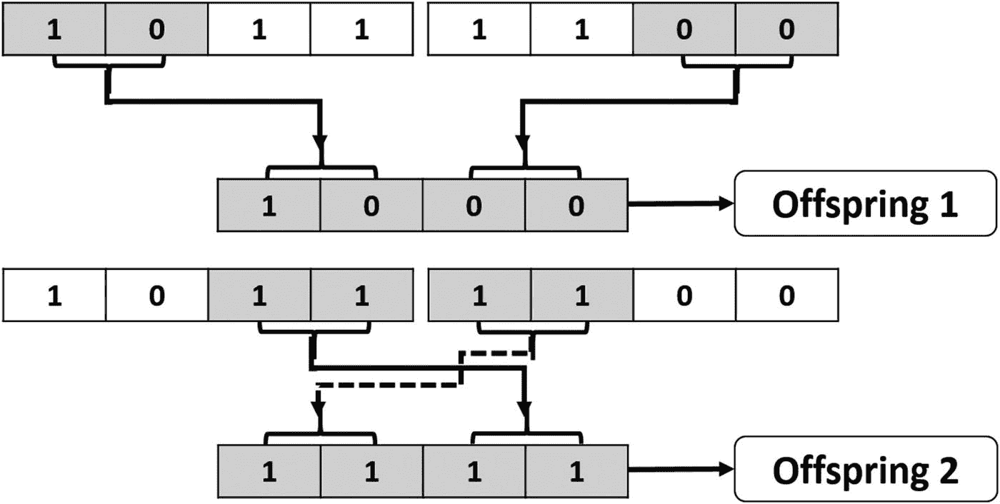

图 4-3

双亲之间的单点杂交产生两个后代

#### 变化

基于交叉操作，除了双亲中存在的特性之外，没有新的特性添加到基因中。这是因为所有的基因都取自父母。通过从每个染色体中选择一定百分比的基因并随机改变它们的值来应用突变。突变因染色体表现而异。如果使用二进制编码(即每个基因的值空间正好是 0 和 1)，那么翻转参与变异操作的每个基因的位值。其他类型的突变包括交换、反向、均匀、非均匀、高斯和收缩。

应用突变的基因的百分比应该很小，因为变化是随机的。我们不应该承担由于随机变化而丢失大量现有信息的风险，因为随机变化不能保证更好的结果。对于我们的问题，我们可以只选择一个基因来随机翻转它的值。图 [4-4](#Fig4) 显示了选择位置 0 最左边的基因进行突变时的结果。请注意，变异应用于交叉结果。

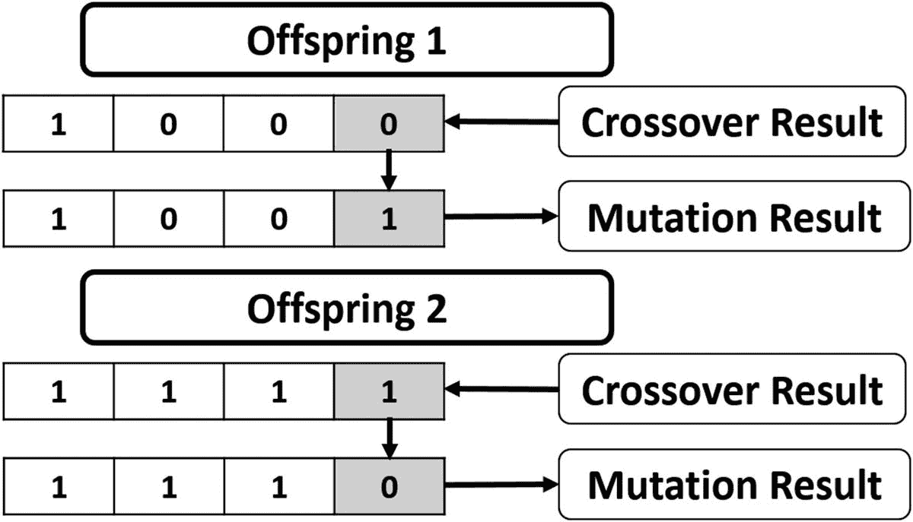

图 4-4

交叉结果上的位翻转变异

通过应用交叉和变异，新的后代完全准备好了。我们可以根据适应值来衡量他们比父母更好还是更差。两个后代的适应值对于第一个后代是 16，对于第二个后代是 26。与双亲(20 和 22)的适应值相比，第二个后代中的一个比所有双亲更好，并且 GA 能够进化解决方案以产生更好的一个。但是第一个适应值为 16 的后代比所有的父母都差。保持在新群体中选择的亲本确保了这样的坏解在下一代中不会被选择作为亲本。因此，我们确信下一代解决方案的质量不会比上一代差。

在一些问题中，基因不是用二进制表示的，因此突变是不同的。如果基因值来自多于两个值的空间，例如(1，2，3，4，5)，则位翻转突变不适用。一种方法是从这个集合中随机选择一个值。图 [4-5](#Fig5) 给出了一个由基因的有限值(多于两个值)表示的解决方案的例子。被选择用于突变的基因的值被随机地改变为其它值之一。

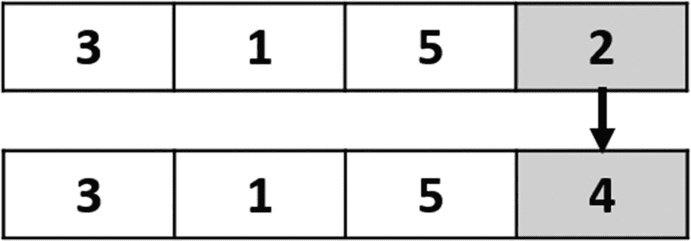

图 4-5

基因有两个以上值的解的一致变异

有时解决方案由一组无限的值来表示。例如，如果值的范围在–1.0 和 1.0 之间，我们可以选择该范围内的任何值来替换旧值。

### Python 实现的一个例子

现在我们已经了解了遗传算法的概念，让我们用 Python 来实现它，以优化一个简单的例子，在这个例子中，我们将最大化等式 4-6 的输出。这就是健身功能。实现中使用了十进制表示、单点交叉和均匀变异。

*和*=*【w】**+*【w】<sub>2</sub>

该方程有六个输入( *x* <sub>1</sub> 到*x*T6】6)和六个权重( *w* _ 1 到 *w* <sub>6</sub> )，输入值为( *x* <sub>1</sub> ， *x* <sub>2</sub> ，*x*<sub>3<sub>我们正在寻找使这个等式最大化的参数(权重)。最大化这个等式的想法似乎很简单。正输入要乘以最大可能的正数，负数要乘以最小可能的负数。但我们希望实现的想法是如何让 GA 自己完成这项工作。GA 自己应该知道，最好是正输入用正权重，负输入用负权重。让我们开始实现 GA。</sub></sub>

根据清单 [4-1](#PC1) ，创建了一个包含六个输入的列表，以及一个包含权重数量的变量。

```py
# Inputs of the equation.
equation_inputs = [4,-2,3.5,5,-11,-4.7]
# Number of the weights we are looking to optimize.
num_weights = 6

Listing 4-1Inputs of the Function to Optimize

```

下一步是定义初始群体。基于权重的数量，群体中的每个染色体(解或个体)肯定会有六个基因，一个基因对应一个权重。但问题是，每个人口有多少解？没有固定的值，我们可以选择最适合我们问题的值。但是我们可以让它保持通用，这样就可以在代码中修改它。在清单 [4-2](#PC2) 中，创建了一个变量来保存每个群体的解的数量，另一个变量保存群体的大小，最后一个变量保存实际的初始群体。

```py
import numpy
sol_per_pop = 8
# Defining the population size.
pop_size = (sol_per_pop,num_weights) # The population will have sol_per_pop chromosome where each chromosome has num_weights genes.
#Creating the initial population.
new_population = numpy.random.uniform(low=-4.0, high=4.0, size=pop_size)

Listing 4-2Creating the Initial Population

```

导入 numpy 库后，我们能够使用 numpy.random.uniform 函数随机创建初始群体。根据所选参数，其形状为(8，6)。也就是说，有八条染色体，每条染色体有六个基因，每个基因对应一个体重。表 [4-4](#Tab4) 给出了运行前一个代码后群体的解。请注意，它是由代码随机生成的，因此当您运行它时，它肯定会发生变化。

表 4-4

原始群体

<colgroup><col class="tcol1 align-left"> <col class="tcol2 align-left"> <col class="tcol3 align-left"> <col class="tcol4 align-left"> <col class="tcol5 align-left"> <col class="tcol6 align-left"> <col class="tcol7 align-left"></colgroup> 
|   | 

*W*T2 1

 | 

*W*T2】2

 | 

*W*T2】3

 | 

*W*T2】4

 | 

*W*T2】5

 | 

*W*T2】6

 |
| --- | --- | --- | --- | --- | --- | --- |
| 解决方案 1 | –2.19 | –2.89 | Two point zero two | –3.97 | Three point four five | Two point zero six |
| 解决方案 2 | Two point one three | Two point nine seven | Three point six | Three point seven nine | Zero point two nine | Three point five two |
| 解决方案 3 | One point eight one | Zero point three five | One point zero three | –0.33 | Three point five three | Two point five four |
| 解决方案 4 | –0.64 | –2.86 | Two point nine three | –1.4 | –1.2 | Zero point three one |
| 解决方案 5 | –1.49 | –1.54 | One point one two | –3.68 | One point three three | Two point eight six |
| 解决方案 6 | One point one four | Two point eight eight | One point seven five | –3.46 | Zero point nine six | Two point nine nine |
| 解决方案 7 | One point nine seven | Zero point five one | Zero point five three | –1.57 | –2.36 | Two point three |
| 解决方案 8 | Three point zero one | –2.75 | Three point two seven | –0.72 | Zero point seven five | Zero point zero one |

准备好群体后，接下来是按照图 [4-2](#Fig2) 中 GA 的步骤进行。基于适应度函数，我们将选择当前种群中最好的个体作为交配的亲本。下一步是应用 GA 变体(交叉和变异)来产生下一代的后代，通过追加父母和后代来创建新的群体，并重复这些步骤多次迭代/世代。清单 [4-3](#PC3) 应用这些步骤。

```py
import GA
num_generations = 10,000
num_parents_mating = 4
for generation in range(num_generations):
    # Measuring the fitness of each chromosome in the population.
    fitness = GA.cal_pop_fitness(equation_inputs, new_population)

    # Selecting the best parents in the population for mating.
    parents = GA.select_mating_pool(new_population, fitness,
                                      num_parents_mating)

    # Generating next generation using crossover.
    offspring_crossover = GA.crossover(parents,
                                       offspring_size=(pop_size[0]-parents.shape[0], num_weights))

    # Adding some variations to the offspring using mutation.
    offspring_mutation = GA.mutation(offspring_crossover)

    # Creating the new population based on the parents and offspring.
    new_population[0:parents.shape[0], :] = parents
    new_population[parents.shape[0]:, :] = offspring_mutation

Listing 4-3Iterating Through GA Steps

```

名为“GA”的模块保存了清单 [4-3](#PC3) 中使用的函数的实现。第一个函数名为 GA.cal_pop_fitness，用于查找群体中每个解的适应值。根据清单 [4-4](#PC4) ，该功能在 GA 模块内定义。

```py
def cal_pop_fitness(equation_inputs, pop):
    # Calculating the fitness value of each solution in the current population.
    # The fitness function calculates the SOP between each input and its corresponding weight.
    fitness = numpy.sum(pop*equation_inputs, axis=1)
    return fitness

Listing 4-4GA Fitness Function

```

除了总体，适应度函数还接受方程输入值(x_1 到 x_6)。根据等式 4-6，将适应值计算为每个输入与其相应基因(权重)之间的 SOP。根据每个群体的解决方案数量，将有与表 [4-5](#Tab5) 中相同数量的标准操作程序。请注意，适应值越高，解决方案越好。

表 4-5

初始种群解的适应值

<colgroup><col class="tcol1 align-left"> <col class="tcol2 align-left"> <col class="tcol3 align-left"> <col class="tcol4 align-left"> <col class="tcol5 align-left"> <col class="tcol6 align-left"> <col class="tcol7 align-left"> <col class="tcol8 align-left"> <col class="tcol9 align-left"></colgroup> 
|   | 

解决方案 1

 | 

解决方案 2

 | 

解决方案 3

 | 

解决方案 4

 | 

解决方案 5

 | 

解决方案 6

 | 

解决方案 7

 | 

解决方案 8

 |
| --- | --- | --- | --- | --- | --- | --- | --- | --- |
| 健康 | Sixty-three point four one | Fourteen point four | –42.23 | Eighteen point two four | –45.44 | –37.0 | Sixteen | Seventeen point zero seven |

在计算了所有解的适应值之后，下一步是根据 GA.select _ mating _ pool 函数在交配池中选择其中最好的作为亲本。该函数接受群体、适应值和所需的父代数量，并返回所选的父代。它在 GA 模块中的实现如清单 [4-5](#PC5) 所示。

```py
def select_mating_pool(pop, fitness, num_parents):
# Selecting the best individuals in the current generation as parents for producing the offspring of the next generation.
    parents = numpy.empty((num_parents, pop.shape[1]))
    for parent_num in range(num_parents):
        max_fitness_idx = numpy.where(fitness == numpy.max(fitness))
        max_fitness_idx = max_fitness_idx[0][0]
        parents[parent_num, :] = pop[max_fitness_idx, :]
        fitness[max_fitness_idx] = -99999999999
    return parents

Listing 4-5Selecting the Best Parents According to Fitness Values

```

根据变量 num _ parents _ mating 中定义的所需父代数量，创建“parents”空数组来保存它们。在循环内部，该函数遍历当前群体中的解决方案，以获得具有最高适应值的解决方案的索引，因为它是要选择的最佳解决方案。该指数存储在“max_fitness_idx”变量中。基于这个索引，对应于它的解被返回到“parents”数组。为了避免再次选择该解决方案，其适应度值被设置为–99999999999，这是一个非常小的值。该值使得解决方案不太可能被再次选择。在选择了所需的双亲数量后，双亲数组返回，如表 [4-6](#Tab6) 所示。请注意，这三个父母是当前群体中基于其适应值的最佳个体，适应值分别为 63.41、18.24、17.07 和 16.0。

表 4-6

从第一个群体中选择的父母

<colgroup><col class="tcol1 align-left"> <col class="tcol2 align-left"> <col class="tcol3 align-left"> <col class="tcol4 align-left"> <col class="tcol5 align-left"> <col class="tcol6 align-left"> <col class="tcol7 align-left"></colgroup> 
|   | 

*W*T2】1

 | 

*W*T2】2

 | 

*W*T2】3

 | 

*W*T2】4

 | 

*W*T2】5

 | 

*W*T2】6

 |
| --- | --- | --- | --- | --- | --- | --- |
| 父母 1 | –0.64 | –2.86 | Two point nine three | –1.4 | –1.2 | Zero point three one |
| 父母 2 | Three point zero one | –2.75 | Three point two seven | –0.72 | Zero point seven five | Zero point zero one |
| 父母 3 | One point nine seven | Zero point five one | Zero point five three | –1.57 | –2.36 | Two point three |
| 父母 4 | Two point one three | Two point nine seven | Three point six | Three point seven nine | Zero point two nine | Three point five two |

下一步是使用选择的父母进行交配，以产生后代。根据 GA.crossover 函数，配对从交叉操作开始。这个函数接受父母和后代的大小。它使用后代大小来学习从父母产生的后代数量。该功能根据 GA 模块内的清单 [4-6](#PC6) 实现。

```py
def crossover(parents, offspring_size):
    offspring = numpy.empty(offspring_size)
    # The point at which crossover takes place between two parents. Usually, it is at the center.
    crossover_point = numpy.uint8(offspring_size[1]/2)

    for k in range(offspring_size[0]):
        # Index of the first parent to mate.
        parent1_idx = k%parents.shape[0]
        # Index of the second parent to mate.
        parent2_idx = (k+1)%parents.shape[0]
        # The new offspring will have its first half of its genes taken from the first parent.
        offspring[k, 0:crossover_point] = parents[parent1_idx, 0:crossover_point]
        # The new offspring will have its second half of its genes taken from the second parent.
        offspring[k, crossover_point:] = parents[parent2_idx, crossover_point:]
    return offspring

Listing 4-6
Crossover

```

因为我们使用单点交叉，我们需要指定交叉发生的点。选择该点以将解分成相等的两半。然后我们需要选择双亲来杂交。这些父代的索引存储在 parent1_idx 和 parent2_idx 中。双亲以类似于环的方式被选择。首先选择索引 0 和 1 来产生两个后代。如果还有剩余的后代要产生，那么我们选择父母 1 和 2 来产生另外两个后代。如果我们需要更多的后代，那么我们选择指数为 2 和 3 的下两个父母。通过索引 3，我们到达最后一个父节点。如果我们需要产生更多的后代，那么我们选择索引为 3 的父代，然后回到索引为 0 的父代，依此类推。应用交叉后的后代存储到后代变量中。表 [4-7](#Tab7) 显示了该变量的内容。

表 4-7

杂交后的后代

<colgroup><col class="tcol1 align-left"> <col class="tcol2 align-left"> <col class="tcol3 align-left"> <col class="tcol4 align-left"> <col class="tcol5 align-left"> <col class="tcol6 align-left"> <col class="tcol7 align-left"></colgroup> 
|   | 

*W*T2 1

 | 

*W*T2】2

 | 

*W*T2】3

 | 

*W*T2】4

 | 

*W*T2】5

 | 

*W*T2】6

 |
| --- | --- | --- | --- | --- | --- | --- |
| 后代 1 | –0.64 | –2.86 | Two point nine three | –0.72 | Zero point seven five | Zero point zero one |
| 后代 2 | Three point zero one | –2.75 | Three point two seven | –1.57 | –2.36 | Two point three |
| 后代 3 | One point nine seven | Zero point five one | Zero point five three | Three point seven nine | Zero point two nine | Three point five two |
| 后代 4 | Two point one three | Two point nine seven | Three point six | –1.4 | –1.2 | Zero point three one |

下一步是使用清单 [4-7](#PC7) 中实现的 GA 模块内的变异函数，将第二个 GA 变体(变异)应用于交叉的结果。该函数接受交叉子代，并在应用统一变异后返回它们。

```py
def mutation(offspring_crossover):
# Mutation changes a single gene in each offspring randomly.
    for idx in range(offspring_crossover.shape[0]):
        # The random value to be added to the gene.
        random_value = numpy.random.uniform(-1.0, 1.0, 1)
        offspring_crossover[idx, 4] = offspring_crossover[idx, 4] + random_value
    return offspring_crossover

Listing 4-7
Mutation

```

它遍历每个后代，并添加一个统一生成的随机数，比如从-1.0 到 1.0。然后将该随机数与后代的一个随机选择的索引(例如，索引 4)一起添加到基因中。请注意，该索引可以更改为任何其他索引。结果存储在变量“后代交叉”中，并由表 [4-8](#Tab8) 中的函数返回。在这一点上，我们已经成功地从四个选择的亲本中产生了四个后代，并准备好创建下一代的新种群。

表 4-8

突变的结果

<colgroup><col class="tcol1 align-left"> <col class="tcol2 align-left"> <col class="tcol3 align-left"> <col class="tcol4 align-left"> <col class="tcol5 align-left"> <col class="tcol6 align-left"> <col class="tcol7 align-left"></colgroup> 
|   | 

*W*T2 1

 | 

*W*T2】2

 | 

*W*T2】3

 | 

*W*T2】4

 | 

*W*T2】5

 | 

*W*T2】6

 |
| --- | --- | --- | --- | --- | --- | --- |
| 后代 1 | –0.64 | –2.86 | Two point nine three | –0.72 | One point six six | Zero point zero one |
| 后代 2 | Three point zero one | –2.75 | Three point two seven | –1.57 | –1.95 | Two point three |
| 后代 3 | One point nine seven | Zero point five one | Zero point five three | Three point seven nine | Zero point four five | Three point five two |
| 后代 4 | Two point one three | Two point nine seven | Three point six | –1.4 | –1.58 | Zero point three one |

注意，遗传算法是一种基于随机的优化技术。它试图通过对当前解决方案进行一些随机更改来增强它们。因为这些变化是随机的，我们不确定它们会产生更好的解决方案。为此，在新的种群中，最好保留以前的最佳解(父代)。在最坏的情况下，当所有新的后代都比父母更差时，我们将继续使用这些父母。这样一来，我们保证新一代至少会保留以前的好成绩，不会变得更差。新的群体将从先前的父母那里得到它的前四个解决方案。最后四个解来自应用交叉和变异后产生的后代。

表 [4-9](#Tab9) 给出了第一代所有解(父代和子代)的适合度。以前的最高适合度是 18.24112489，但现在是 31.24115151589。这意味着随机变化朝着更好的解决方案发展。这太棒了。但是这些结果可以通过更多的世代来加强。经过 10000 次迭代后，结果达到 40000 以上，如图 [4-6](#Fig6) 所示。

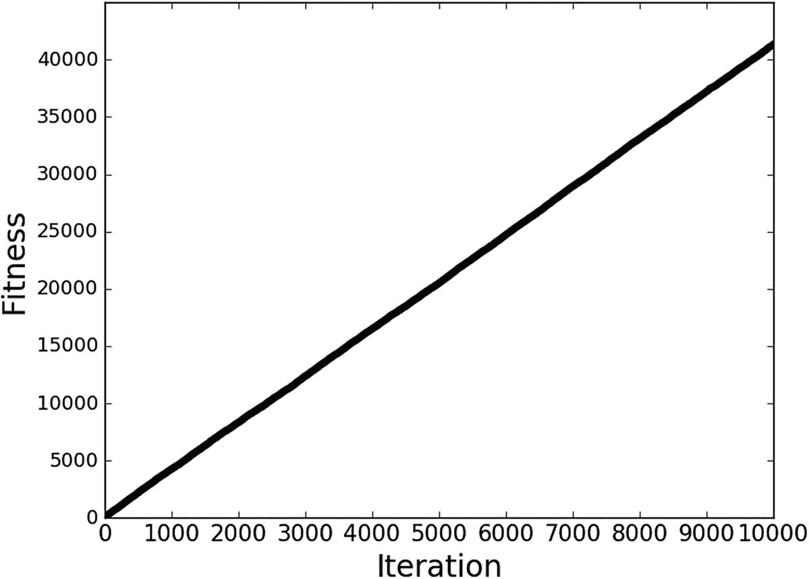

图 4-6

适应值与 10，000 次迭代

表 4-9

新群体中所有解的适应值

<colgroup><col class="tcol1 align-left"> <col class="tcol2 align-left"> <col class="tcol3 align-left"> <col class="tcol4 align-left"> <col class="tcol5 align-left"> <col class="tcol6 align-left"> <col class="tcol7 align-left"> <col class="tcol8 align-left"> <col class="tcol9 align-left"></colgroup> 
|   | 

解决方案 1

 | 

解决方案 2

 | 

解决方案 3

 | 

解决方案 4

 | 

解决方案 5

 | 

解决方案 6

 | 

解决方案 7

 | 

解决方案 8

 |
| --- | --- | --- | --- | --- | --- | --- | --- | --- |
| 健康 | Eighteen point two four | Seventeen point zero seven | Sixteen | Fourteen point four | –8.46 | Thirty-one point seven three | Six point one | Twenty-four point zero nine |

#### 完全实现

清单 [4-8](#PC8) 中给出了实现 GA 的完整代码。

```py
import numpy
import GA

#The y=target is to maximize this equation ASAP:
#    y = w1x1+w2x2+w3x3+w4x4+w5x5+6wx6
#    where (x1,x2,x3,x4,x5,x6)=(4,-2,3.5,5,-11,-4.7)
#    What are the best values for the 6 weights w1 to w6?
#    We are going to use the GA for the best possible values #after a number of generations.

# Inputs of the equation.
equation_inputs = [4,-2,3.5,5,-11,-4.7]

# Number of the weights we are looking to optimize.
num_weights = 6

#GA parameters:
#    Mating pool size
#    Population size

sol_per_pop = 8

num_parents_mating = 4

# Defining the population size.
pop_size = (sol_per_pop,num_weights) # The population will have sol_per_pop chromosome where each chromosome has num_weights genes.
#Creating the initial population.
new_population = numpy.random.uniform(low=-4.0, high=4.0, size=pop_size)
print(new_population)

num_generations = 10,000

for generation in range(num_generations):
    print("Generation : ", generation)
    # Measuring the fitness of each chromosome in the population.
    fitness = GA.cal_pop_fitness(equation_inputs, new_population)

# Selecting the best parents in the population for mating.
    parents = GA.select_mating_pool(new_population, fitness,
                                      num_parents_mating)

    # Generating next generation using crossover.
    offspring_crossover = GA.crossover(parents,
                                       offspring_size=(pop_size[0]-parents.shape[0], num_weights))

    # Adding some variations to the offspring using mutation.
    offspring_mutation = GA.mutation(offspring_crossover)

    # Creating the new population based on the parents and offspring.
    new_population[0:parents.shape[0], :] = parents
    new_population[parents.shape[0]:, :] = offspring_mutation

    # The best result in the current iteration.
    print("Best result : ", numpy.max(numpy.sum(new_population*equation_inputs, axis=1)))

# Getting the best solution after iterating finishing all generations.
#At first, the fitness is calculated for each solution in the final generation.
fitness = GA.cal_pop_fitness(equation_inputs, new_population)
# Then return the index of that solution corresponding to the best fitness.
best_match_idx = numpy.where(fitness == numpy.max(fitness))

print("Best solution : ", new_population[best_match_idx, :])
print("Best solution fitness : ", fitness[best_match_idx])

Listing 4-8The Complete Code for Optimizing a Linear Equation with Six Parameters

```

GA 模块的实现如清单 [4-9](#PC9) 所示。

```py
import numpy

def cal_pop_fitness(equation_inputs, pop):
# Calculating the fitness value of each solution in the current population.
    # The fitness function calcuates the SOP between each input and its corresponding weight.
    fitness = numpy.sum(pop*equation_inputs, axis=1)
    return fitness

def select_mating_pool(pop, fitness, num_parents):
    # Selecting the best individuals in the current generation as parents for producing the offspring of the next generation.
    parents = numpy.empty((num_parents, pop.shape[1]))
    for parent_num in range(num_parents):
        max_fitness_idx = numpy.where(fitness == numpy.max(fitness))
        max_fitness_idx = max_fitness_idx[0][0]
        parents[parent_num, :] = pop[max_fitness_idx, :]
        fitness[max_fitness_idx] = -99999999999
    return parents

def crossover(parents, offspring_size):
    offspring = numpy.empty(offspring_size)
    # The point at which crossover takes place between two parents. Usually it is at the center.
    crossover_point = numpy.uint8(offspring_size[1]/2)

    for k in range(offspring_size[0]):
        # Index of the first parent to mate.
        parent1_idx = k%parents.shape[0]
        # Index of the second parent to mate.
        parent2_idx = (k+1)%parents.shape[0]
        # The new offspring will have its first half of its genes taken from the first parent.
        offspring[k, 0:crossover_point] = parents[parent1_idx, 0:crossover_point]
        # The new offspring will have its second half of its genes taken from the second parent.
        offspring[k, crossover_point:] = parents[parent2_idx, crossover_point:]
    return offspring

def mutation(offspring_crossover):
    # Mutation changes a single gene in each offspring randomly.
    for idx in range(offspring_crossover.shape[0]):
        # The random value to be added to the gene.
        random_value = numpy.random.uniform(-1.0, 1.0, 1)
        offspring_crossover[idx, 4] = offspring_crossover[idx, 4] + random_value
    return offspring_crossover

Listing 4-9
GA Module

```

## NSGA 二号

遗传算法和 NSGA-II 的主要区别是在给定群体(即新一代的父母)中选择最佳个体的方式。在遗传算法中，单个值用于选择最佳个体。这是由适应度函数生成的适应度值。适应值越高，解决方案/个人越好。对于 NSGA-II，不存在单个值，而是由多个目标函数生成的多个值。我们如何基于这些多重价值做出选择，记住所有这些目标具有同等的重要性？必须有一种不同于常规遗传算法的方法来选择最佳个体。NSGA-II 根据两个指标选择其父母或最佳个体:

1.  统治力。

2.  拥挤距离。

我们将在讨论中使用的例子是关于一个想买一件衬衫的人。这个人有两个目标需要通过这件衬衫来实现:

1.  低成本(0 美元到 85 美元之间)。

2.  之前买家的差评(0 到 5 分之间)。

成本以美元计算，反馈以 0 到 5 之间的实数计算，其中 0 为最佳反馈，5 为最差反馈。这意味着两个目标函数是最小化。假设只有 8 个数据样本，如表 [4-10](#Tab10) 所示；我们将用它们来开始。

表 4-10

数据样本

<colgroup><col class="tcol1 align-left"> <col class="tcol2 align-left"> <col class="tcol3 align-left"></colgroup> 
| 

身份

 | 

成本美元

 | 

不良反馈

 |
| --- | --- | --- |
| A | Twenty | Two point two |
| B | Sixty | Four point four |
| C | Sixty-five | Three point five |
| D | Fifteen | Four point four |
| E | Fifty-five | Four point five |
| F | Fifty | One point eight |
| G | Eighty | Four |
| H | Twenty-five | Four point six |

### NSGA 二号协议步骤

NSGA-II 遵循传统遗传算法的一般步骤。变化是不使用适应值来为下一代选择最佳解决方案(父代)；相反，它使用优势和拥挤距离。以下是 NSGA 二号的一般停靠点:

1.  从数据中选择第 0 代的初始群体解决方案。

2.  使用非优势排序将解决方案分成不同的级别。

3.  选择 1 级非支配前沿的最佳解作为亲本进行交配，为下一代产生后代。(如果最后使用的级别内的所有解决方案都被完全选择，没有剩余，则直接转到步骤 5。)

4.  如果从最后使用的级别中选择一个解决方案子集作为父级，那么您必须计算该级别中解决方案的拥挤距离，根据拥挤距离将这些解决方案按差序排序，并从顶部选择剩余解决方案的数量。

5.  使用选择的父母来生产后代。
    1.  对所选父代的锦标赛选择。

    2.  GA 变异(即交叉和变异)对锦标赛结果的影响。这将产生下一代的新后代。

6.  重复步骤 2 到 5，直到达到最大迭代次数。

请注意，您不应该期望在当前理解所有这些步骤。但是不要担心:当你经历每一步的细节时，事情会变得更加容易和清晰。这些步骤总结在图 [4-7](#Fig7) 中。

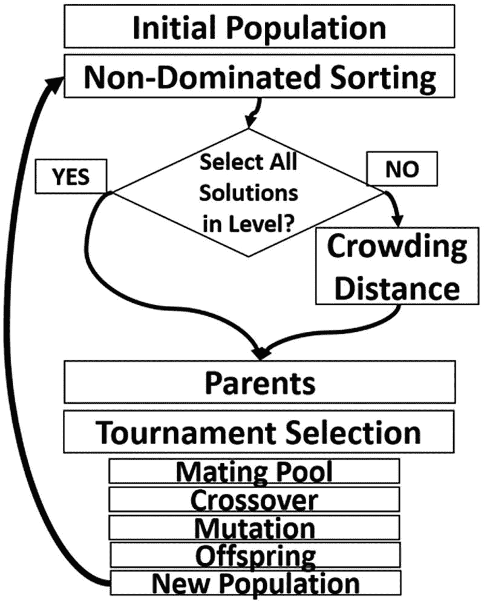

图 4-7

NSGA 二号协议步骤

NSGA 与遗传算法没有什么不同，但增加了一些运算，使其适用于多目标问题。图 [4-8](#Fig8) 突出了 GA 和 NSGA 的区别。遗传算法中计算适应值的步骤被扩展到 NSGA 算法中的多个步骤，从非支配排序开始直到锦标赛选择。在确定交配池将使用什么解决方案后，这两个算法是相似的。


图 4-8

GA 对 NSGA

遗传算法的第一步通常是选择初始群体的解/个体。假设总体规模为 8，这意味着总体中要使用 8 个样本。这意味着表 [4-10](#Tab10) 中的所有样本将用于初始人群。下一步是选择这个群体中的最佳解作为父母，使用优势概念产生下一代的后代。

### 优势

NSGA-II 中的支配地位帮助我们选择作为父母的最佳解决方案集。据说这些解决方案优于其他解决方案。也就是说，它们优于所有其他解决方案。

实际上，在所有目标上，这些解决方案并不总是比其他解决方案差或更差。我们如何在数据中找到最佳的解决方案？为了说明一个解决方案优于另一个解决方案，可以使用以下规则:

当且仅当，解 X 优于解 Y

1.  在所有目标函数中，解决方案 X 不比解决方案 Y 差

2.  至少在一个目标函数上，方案 X 优于方案 Y。

除了说解 X 优于解 Y，我们还可以说:

*   解 X 不受解 y 支配。

*   解 Y 受解 x 支配。

*   解 Y 不支配解 x。

请注意，如果前面的任何条件都不满足，那么解决方案 X 不会优于解决方案 y。这意味着没有解决方案比另一个更好，并且它们之间存在权衡。还要注意，当解 X 优于解 Y 时，意味着解 X 优于解 Y。

不满足前面两个条件中至少一个的所有解的集合称为非支配集。之所以这样叫，是因为该集合中没有一个解优于另一个解。寻找非支配集的步骤如下:

1.  选择索引为 I 的解决方案，其中 I 从 1 开始，对应于第一个解决方案。

2.  检查该解决方案相对于数据中所有其他解决方案的优势。

3.  如果发现一个解支配那个解，那么停止，因为它不可能在非支配集中。直接转到步骤 5。

4.  如果没有解支配那个解，那么把它加到非支配集。

5.  将 I 增加 1，并重复步骤 2 至 4。

使用非支配排序，解决方案被分成多个集合。每个集合称为一个非支配锋。这些锋面按级别排序，第一个非支配锋面在级别 1，第二个非支配锋面在级别 2，依此类推。根据表 [4-10](#Tab10) 中的例子，让我们应用这些步骤来找出第一级的非主导锋。

1.  从解决方案 A 开始，将其与解决方案 B 进行比较，我们发现 A 在第一个目标(成本)上优于 B，因为 A 的成本为 20 美元，低于(即优于)B 的成本 60 美元。此外，在第二个目标(反馈)中，A 优于 B，因为 A 的反馈为 2.2，低于(即优于)B 的反馈 4.4。因此，在所有目标上，A 都优于 B。满足使方案 A 支配方案 B 的条件。但是我们不能断定 A 是非支配集的一员，我们还得等到将 A 与所有其他解进行比较。

2.  比较 A 和 C，很明显 A 在所有目标上都优于 C，因为 A 的成本和反馈都小于 C。结果，C 不支配 A(即 A 支配 C)。我们仍然需要探索下一个解决方案来决定 A 是否是非支配集的成员。

3.  比较 A 和 D，我们发现 A 的反馈 2.2 比 D 的反馈 4.4 好。但是 A 的 20 美元成本比 D 的 15 美元成本更差。因此，每种解决方案在一个目标上都优于其他方案。因此，解决方案 D 不满足两个支配条件。因此，我们可以得出结论，D 不支配 A，A 也不支配 D。我们必须再次对照剩余的解决方案检查 A，以了解其决策。

4.  比较 A 和 E，很明显 A 在所有目标上都优于 E。因此，A 支配 e，让我们比较 A 和下一个解 f。

5.  比较 A 和 F，没有一个解决方案比另一个更好。这与比较 A 和 d 的情况相同，因此，F 并不支配 A，我们必须将 A 和其他解进行比较。

6.  比较 A 和 G，A 在所有目标上都优于 G，因为 A 的成本(20 美元)小于 G 的成本(80 美元)，并且 A 的反馈(2.2)也优于 G 的反馈(4.0)。让我们来看看最终的解决方案。

7.  比较 A 和 H，在所有解决方案中，A 都优于 H。结果 H 并不支配 A，在检查了 A 在所有解中的支配地位后，似乎没有一个解支配 A，所以，A 被视为非支配集的一员。当前的非支配集是 P={A}。让我们转向下一个解决方案。

8.  关于方案 B 和 C，很明显方案 A 占优。因此，我们可以直接检查解决方案 d 的优势。

9.  用 A 比较 D，我们发现 D 在第一个目标(成本)上优于 D，因为 D 的成本是 15 美元，小于 A 的成本 20 美元。关于第二个目标，D 比 A 差，因为 D 的反馈 4.4 大于 A 的反馈 2.2。因为方案 A 并不优于方案 D，我们必须将方案 D 与下一个方案进行比较。

10.  比较 D 和 B，我们发现在第一个目标中 D 比 B 好，在第二个目标中它们是相等的。结果，B 并不支配 D，我们必须对照剩余的解来检查 D，以了解它的决定。

11.  比较 D 和 C，在第一个目标中 D 比 C 好，但是在第二个目标中 D 比 C 差。使 C 支配 D 的条件不满足。结果，C 并不支配 D，我们必须对照下一个解来检查 D。

12.  比较 D 和 E，我们发现 D 在所有目标上都优于 E。我们可以得出结论，E 并不支配 D，继续比较 D 和下一个解。

13.  比较 D 和 F，D 的 15 美元成本比 F 的 50 美元成本更小(更好)。因为解 F 至少在一个目标上比 D 差，所以我们可以停下来得出结论，F 并不支配 D。让我们将 D 与下一个解进行比较。

14.  比较 D 和 G，同样的场景在 F 身上重演。d 的 15 美元成本比 G 的 80 美元成本小(好)。因为方案 G 至少在一个目标上比 D 差，所以我们可以得出结论，G 并不优于 D。让我们将 D 与下一个方案进行比较。

15.  比较 D 和 H，H 在所有目标上都比 D 差，因此 H 不支配 D。在这一点上，我们可以得出结论，没有解决方案支配解决方案 D，并且它包含在非支配集中。当前的非支配集是 P={A，D}。让我们转向下一个解决方案。

16.  使用 E，将其与 A 进行比较，我们发现 A 在所有目标上都优于 E，因为 A 的 20 美元成本小于 E 的 55 美元成本，并且 A 的反馈 2.2 优于 E 的反馈 4.5。由此，我们可以停下来得出结论，A 支配 E；e 不能包含在非支配集合中。

17.  和 F 一起工作，和 A 比较，我们发现 A 在第一个目标上比 F 好，而在第二个目标上 F 比 A 好。因此，没有一种解决方案能支配另一种解决方案。我们仍然需要比较 F 和剩余的解来做决定。

18.  将 F 与所有解进行比较后，不存在支配解 F 的解。因此，F 包含在非支配集中。当前的非支配集是 P={A，D，F}。让我们转向下一个解决方案。

19.  与 G 一起工作，并将其与所有解决方案进行比较，我们发现解决方案 A、C 和 F 占主导地位。因此，G 不能包含在非支配集中。让我们转向最终解决方案。

20.  使用最终的解决方案 H，通过将其与所有解决方案进行比较，我们发现解决方案 A 和 D 占优势。因此，H 不能包含在非支配集中。此时，我们已经检查了所有解决方案的优势。

将每对解比较在一起后，最终的非支配集是 P={A，D，F}。这是第一级非支配锋。在所有目标上，同一战线中的任何解决方案都不会比同一战线中的任何其他解决方案更好。这就是为什么它被称为非支配集，因为没有一个解支配另一个解。

清单 [4-10](#PC10) 给出了检查给定解决方案优势的 Python 代码。给定一个解的索引，它返回支配它的解的 id。它使用 pandas DataFrame (DF)对每个解决方案的目标值以及它们的 id 进行排序。这有助于引用解决方案 ID。创建这个 DF 的一个简单方法是将数据插入 Python 字典，然后将其转换成 pandas DF。

```py
import numpy
import pandas

d = {'A': [20, 2.2],
     'B': [60, 4.4],
     'C': [65, 3.5],
     'D': [15, 4.4],
     'E': [55, 4.5],
     'F': [50, 1.8],
     'G': [80, 4.0],
     'H': [25, 4.6]}

df = pandas.DataFrame(data=d).T
data_labels = list(df.index)

data_array = numpy.array(df).T

# ****Specify the index of the solution here****
sol_idx = 1
sol = data_array[:, sol_idx]

obj1_not_worse = numpy.where(sol[0] >= data_array[0, :])[0]
obj2_not_worse = numpy.where(sol[1] >= data_array[1, :])[0]
not_worse_candidates = set.intersection(set(obj1_not_worse), set(obj2_not_worse))

obj1_better = numpy.where(sol[0] > data_array[0, :])[0]
obj2_better = numpy.where(sol[1] > data_array[1, :])[0]
better_candidates = set.union(set(obj1_better), set(obj2_better))

dominating_solutions = list(set.intersection(not_worse_candidates,
                                             better_candidates))

if len(dominating_solutions) == 0:
    print("No solution dominates solution", data_labels[sol_idx], ".")
else:

    print("Labels of one or more solutions dominating this solution : ", end="")
    for k in dominating_solutions:
        print(data_labels[k], end=",")

Listing 4-10Returning Dominating Solutions

```

对于给定的解，检查支配条件。对于第一个条件，在“not_worse_candidates”变量中返回所有目标中不差于当前解决方案的解决方案的索引。第二个条件搜索至少在一个目标上比当前解决方案更好的解决方案。满足第二个条件的解在“更好的候选”解中返回。要使一个给定的解决方案优于另一个，这两个条件都必须满足。因此,“dominating_solutions”变量只返回满足这两个条件的解。

前面的三个解决方案优于剩下的所有五个解决方案。换句话说，在 1 级非支配前沿的解决方案比所有其他前沿的任何解决方案都好。在第一级的第一个非支配前沿中没有被选中的其他五个解呢？我们将继续使用群体中剩余的样本来进一步寻找下一个非显性水平。

寻找非支配集的步骤将被重复，以在第二层寻找非支配前沿，但是在去除先前在群体的第一层中选择的三个解之后。剩余解的集合是{B，C，E，G，H}。让我们寻找下一个非支配前沿:

1.  从方案 B 开始，检查它对 C 的支配地位，B 的反馈 4.4 比 C 的反馈 3.5 差。根据第一个目标，B 的成本 60 美元比 C 的成本 65 美元要好。因此，方案 C 不优于方案 B。我们仍然需要等待，直到我们将 B 与其余的方案进行比较。

2.  比较 B 和 E，B 在第二个目标中比 E 好，因为 B 的反馈是 4.4，E 的反馈是 4.5。结果，方案 E 不优于方案 b。让我们检查下一个方案。

3.  比较 B 和 G，我们发现在第一个目标中 B 比 G 好，因为 B 的成本是 60 美元，G 的成本是 80 美元。结果，方案 G 不优于方案 b。让我们检查下一个方案。

4.  比较 B 和 H，我们发现在第二个目标中 B 比 H 好，因为 B 的反馈是 4.4，H 的反馈是 4.6。结果，解 H 非支配解 B。在将 B 与所有解进行比较并发现没有解支配它之后，我们可以得出结论，B 包含在级别 2 的非支配前沿中。级别 2 集合现在是 P'={B}。让我们来检查第二个解决方案在剩余的解决方案集中的优势。

5.  比较下一个解决方案 C 和 B，在第二个目标中，C 比 B 好，因为 C 的反馈是 3.5，B 的反馈是 4.4。因此，方案 B 不优于方案 c。

6.  将 C 与其余解比较，没有支配 C 的解，它将包含在第二层的非支配前沿中，即 P'={B，C}。让我们转向下一个解决方案。

7.  将下一个解 E 与群体中所有剩余的解进行比较，我们发现没有一个解支配解 E。因此，E 将包含在级别 2 的非支配前沿中，即 P'={B，C，E}。让我们转向下一个解决方案。

8.  将下一个解决方案 G 与群体中所有剩余的解决方案进行比较，我们发现解决方案 C 优于解决方案 G，因为 C 在所有目标上都优于 G。因此，解 G 不包括在二级非支配锋中。让我们转向下一个解决方案。

9.  将最后一个解 H 与群体中所有剩余的解进行比较，我们发现没有一个解支配解 H。因此，它将包含在级别 2 的非支配前沿中，这将是 P'={B，C，E，H}。

这是第二层非支配前线的终点。剩余解的集合是{G}。这个集合将被用来寻找 3 级非支配锋。因为只剩下一个解，所以它将被单独添加到第三层的非支配前沿，成为 P"={G}。此时，我们成功地将数据分为三个非优势水平，如表 [4-11](#Tab11) 所示。

表 4-11

将数据分为三个非优势水平的结果

<colgroup><col class="tcol1 align-left"> <col class="tcol2 align-left"></colgroup> 
| 

水平

 | 

解决方法

 |
| --- | --- |
| one | {A，D，F} |
| Two | {B，C，E，H} |
| three | {G} |

请注意，级别 I 中的解优于级别 *i* + 1 中的解。也就是说，级别 1 的解决方案优于级别 2 的解决方案，级别 2 的解决方案优于级别 3 的解决方案，以此类推。因此，在选择为人父母的最佳解决方案时，我们将从第一个层次开始选择。如果第一层中可用解的数量少于所需父解的数量，那么我们从第二层中选择剩余的父解，依此类推。

在我们的问题中，人口数量是 8。为了产生同样大小的新一代，我们需要选择其一半的人口作为父母；剩下的一半是父母交配产生的后代。首先，我们需要选出最好的四个父母。

第一个非支配水平只有三个解。因为我们需要四个家长，所以我们将选择所有这三个解决方案。结果现在的父母是{A，D，F}。我们应该从级别 2 中选择剩余的父代。

级别 2 有四个解决方案，我们只需要选择一个。重要的问题是，我们应该从级别 2 中选择哪个解决方案？用于评估同一非支配锋内的解的度量是拥挤距离。接下来，我们将学习如何计算第二层前沿内解决方案的拥挤距离。

### 拥挤距离

拥挤距离是用于在相同的非支配前沿内对解决方案进行优先排序的度量。以下是计算和使用拥挤距离的步骤:

1.  对于每个目标函数，按差序对该级别内的解决方案集进行排序。

2.  对于异常值处的两个解决方案(即最右边和最左边的解决方案)，将其拥挤距离设置为无穷大。

3.  对于中间解，拥挤距离根据等式 4-7 计算。

4.  对于每个解决方案，对所有目标的拥挤距离求和。

5.  按降序对解决方案进行排序，以从最高到最低拥挤距离选择解决方案。

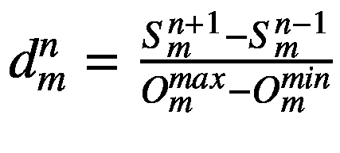(方程式 4-7)

根据一个目标函数对解排序后， *n* 指其位置。 *m* 是指用于计算拥挤距离的目标函数的数目。是根据目标 *m* 的解 *n* 的拥挤距离，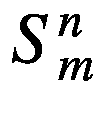是解 *n* 的目标 *m* 的值，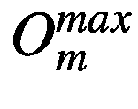是目标 *m* 的最大值，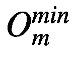是目标 *m* 的最小值。

对于最小化目标，按差序排序解是指按降序排序，其中根据目标，最小(即，最佳)解在最左边，最大(即，最差)解在最右边。

因为异常值处的两个解决方案的拥挤距离等于无穷大，所以我们可以开始计算中间解决方案的拥挤距离。

表 [4-10](#Tab10) 中的问题数据如下，以便于计算拥挤距离。

<colgroup><col class="tcol1 align-left"> <col class="tcol2 align-left"> <col class="tcol3 align-left"></colgroup> 
| 

**ID**

 | 

**成本$**

 | 

**反馈不佳**

 |
| --- | --- | --- |
| A | Twenty | Two point two |
| B | Sixty | Four point four |
| C | Sixty-five | Three point five |
| D | Fifteen | Four point four |
| E | Fifty-five | Four point five |
| F | Fifty | One point eight |
| G | Eighty | Four |
| H | Twenty-five | Four point six |

图 [4-9](#Fig9) 总结了根据成本目标计算方案 E 和 B 的拥挤距离的参数值。

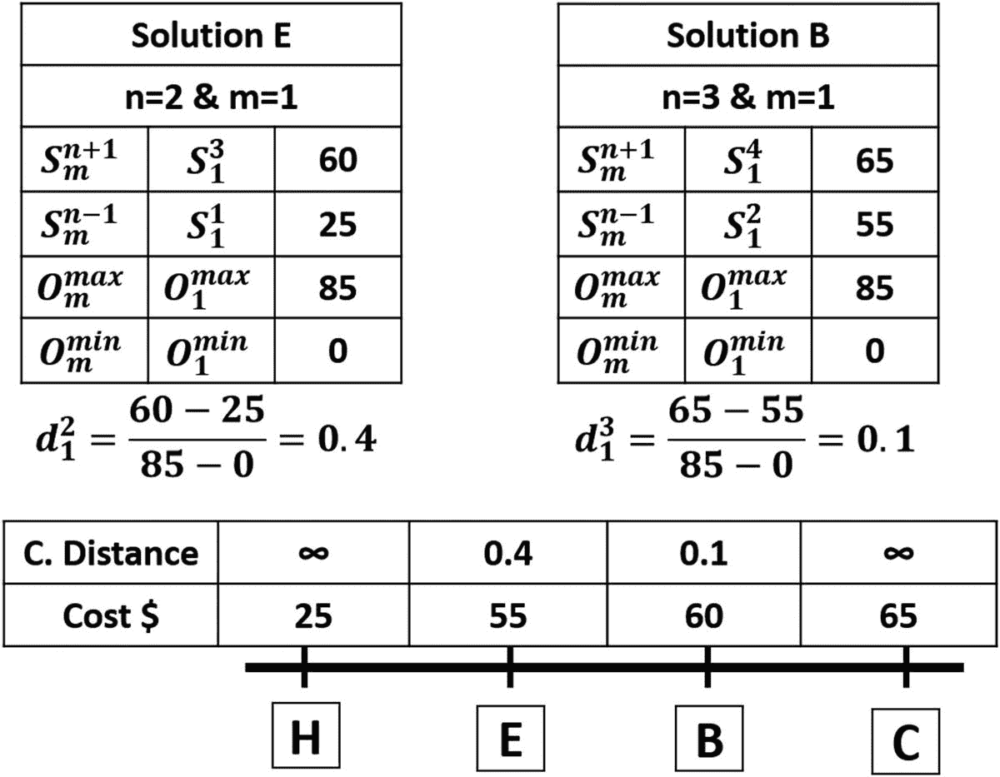

图 4-9

水平 2 解的第一目标拥挤距离

同样，图 [4-10](#Fig10) 显示了如何根据反馈目标计算解决方案 B 和 E 的拥挤距离。

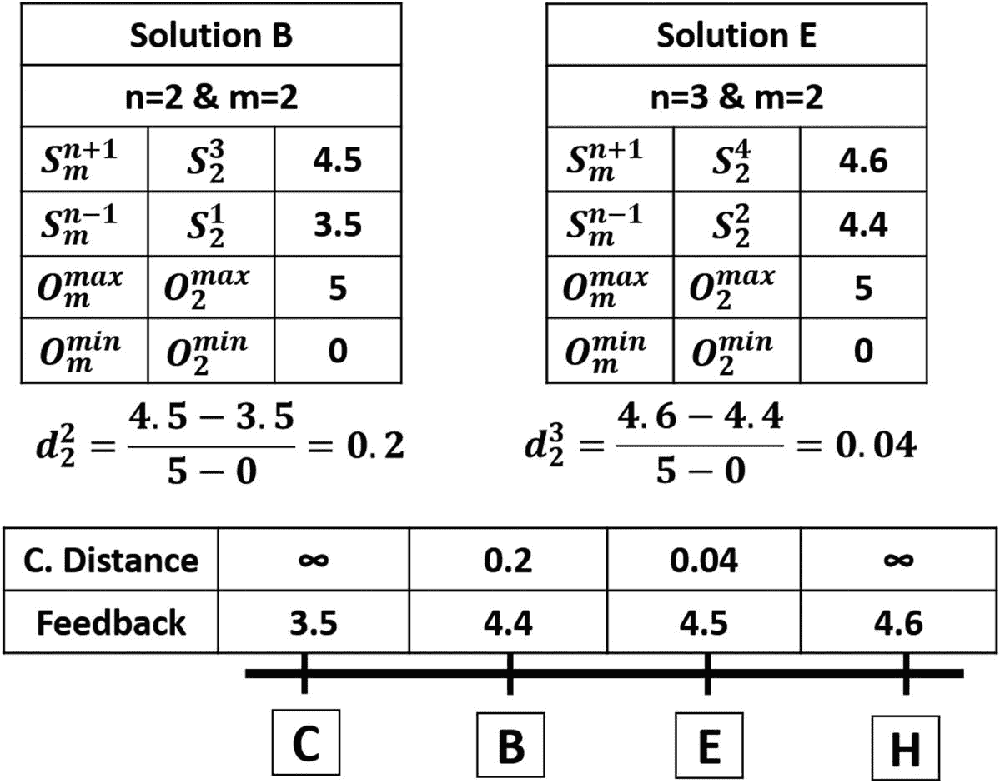

图 4-10

水平 2 解的第一目标拥挤距离

将两个目标的拥挤距离相加，并按降序排列，结果如表 [4-12](#Tab12) 所示。如果我们只需要作为父代的第二层的一个解，那么它将是表 [4-12](#Tab12) 中拥挤距离总和按降序排序后的第一个解。该解就是解 C。因此，所选解的集合将是{A，D，F，C}。请注意，并非所有这些解决方案都将用于生成新的后代，因为它们可能会被锦标赛选择过滤掉。但所有这些解决方案都将用于构成新一代解决方案的前半部分。另一半将来自从锦标赛中选出的父母的交配。

表 4-12

两个目标函数的水平 2 解的拥挤距离之和

<colgroup><col class="tcol1 align-left"> <col class="tcol2 align-left"></colgroup> 
| 

身份

 | 

总和

 |
| --- | --- |
| C | 无穷 |
| H | 无穷 |
| E | Zero point four four |
| B | Zero point three |

### 锦标赛选择

在锦标赛选择中，我们从所选的父母中创建解决方案对。从每一对中，他们和获胜者之间的比赛将进一步用于交叉和变异。所有可能的对是(A，D)，(A，F)，(A，C)，(D，C)和(F，C)。

以下是锦标赛获胜者的评选方式:

*   如果两个解决方案来自不同的非支配级别，那么来自高优先级的解决方案将胜出。

*   如果两个解来自相同的非优势水平，那么胜者将是对应于更高拥挤距离的那个。

让我们考虑第一对(A，D)。因为他们来自同一个级别，我们将使用他们的拥挤距离来学习获胜者。因为我们还没有计算第一级的拥挤距离，所以需要先计算一下。

图 [4-11](#Fig11) 显示了根据两个目标，第 1 级解决方案的最终拥挤距离。关于第一对(A，D)，获胜者是 D，因为它比 A 具有更高的拥挤距离。对于剩余的锦标赛，获胜者是 F，A，D 和 F。这三个唯一的解 A，D 和 F 用于生成四个后代。


图 4-11

两个目标函数的水平 1 解的拥挤距离之和

### 交叉

假设我们从对(A，D)、(A，F)、(D，F)和(F，A)中选择四个新的解，其中后代的前一半和后一半基因分别取自每对中的第一个和最后一个解。交叉的结果如表 [4-13](#Tab13) 所示。

表 4-13

锦标赛获胜者之间的交叉

<colgroup><col class="tcol1 align-left"> <col class="tcol2 align-left"> <col class="tcol3 align-left"></colgroup> 
| 

产物

 | 

成本美元

 | 

反馈

 |
| --- | --- | --- |
| (甲、丁) | Twenty | Four point four |
| (阿、福) | Twenty | One point eight |
| (D，F) | Fifteen | One point eight |

### 变化

变异将应用于交叉的结果。假设我们通过在每个解决方案的前半部分随机添加一个介于–10 和 10 之间的数字来应用突变。变异操作的结果如表 [4-14](#Tab14) 所示。

表 4-14

交叉输出的变异

<colgroup><col class="tcol1 align-left"> <col class="tcol2 align-left"> <col class="tcol3 align-left"></colgroup> 
| 

产物

 | 

成本美元

 | 

反馈

 |
| --- | --- | --- |
| (B，D) | Twenty-seven | Four point four |
| (B，E) | Twenty-five | One point eight |
| (D，E) | Ten | One point eight |

之后，我们已经成功生产了下一代 1 的八种解决方案。前四个解是由非支配排序和拥挤距离产生的。剩下的四个解决方案是我们刚刚通过锦标赛选择、交叉和变异产生的，如表 [4-14](#Tab14) 所示。第 1 代新人口的解决方案见表 [4-15](#Tab15) 。

表 4-15

第 1 代解决方案

<colgroup><col class="tcol1 align-left"> <col class="tcol2 align-left"> <col class="tcol3 align-left"></colgroup> 
| 

身份

 | 

成本美元

 | 

反馈

 |
| --- | --- | --- |
| A | Twenty | Two point two |
| D | Fifteen | Four point four |
| F | Fifty | One point eight |
| C | Sixty-five | Three point five |
| K | Twenty-seven | Four point four |
| L | Twenty-five | One point eight |
| M | Ten | One point eight |
| 普通 | Forty-five | Two point two |

至此，我们已经完成了 NSGA-II 多目标进化算法的所有步骤。下一步是重复 NSGA-II 的步骤 2 到 5，直到达到预定数量的代/迭代。第一代后，算法找到了解 M，它优于上一代种群中的所有解。经过多代，该算法可能会找到更好的解决方案。

## 用遗传算法优化人工神经网络

在第 [4](4.html) 章中，使用四类 Fruits 360 数据集训练人工神经网络，而不使用学习算法。因此，精确度较低，不超过 45%。除了使用 Python 实现之外，在理解了 GA 如何基于数值示例工作之后，本节使用 GA 通过更新其权重(参数)来优化 ANN。

GA 为一个给定的问题创建多个解决方案，并通过若干代进化它们。每个解决方案都包含所有可能有助于增强结果的参数。对于人工神经网络，所有层中的权重有助于实现高精度。因此，GA 中的单个解将包含 ANN 中的所有权重。根据图 [4-7](#Fig7) ，ANN 有四层(一层输入，两层隐藏，一层输出)。任何层中的任何重量都是同一解决方案的一部分。此网络的单个解决方案将包含总权重数，等于 102×150+150×60+60×4=24，540。如果总体有八个解，每个解有 24，540 个参数，则整个总体的参数总数为 24，540×8=196，320。

查看图 [4-8](#Fig8) ，网络参数为矩阵形式，因为这使得人工神经网络的计算更加容易。对于每一层，都有一个相关的权重矩阵。只需将输入矩阵乘以给定层的参数矩阵，即可返回该层的输出。遗传算法中的染色体是 1D 向量，因此我们必须将权重矩阵转换成 1D 向量。

因为矩阵乘法是处理 ANN 的一个很好的选择，所以在使用 ANN 时，我们仍将以矩阵形式表示 ANN 参数。图 [4-12](#Fig12) 总结了使用遗传算法和人工神经网络的步骤。

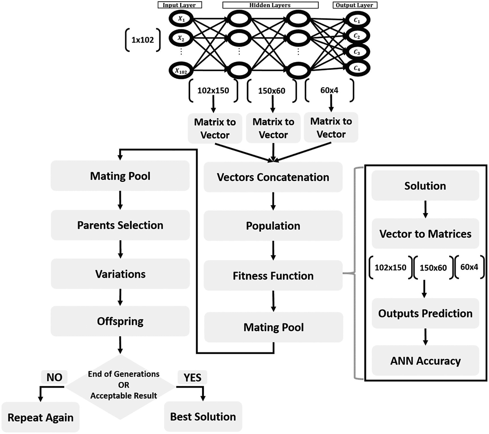

图 4-12

用遗传算法优化神经网络参数

群体中的每个解决方案将有两个表示。第一个是用于 GA 的 1D 向量，第二个是用于 ANN 的矩阵。因为三层有三个权重矩阵(两个隐藏+一个输出)，所以将有三个向量，每个矩阵一个。因为 GA 中的解被表示为单个 1D 向量，所以这三个单独的 1D 向量将被连接成单个 1D 向量。每个解将被表示为长度为 24，540 的向量。清单 [4-11](#PC11) 保存了“mat_to_vector”函数的 Python 代码，该函数将群体内所有解的参数从矩阵转换为向量。

创建一个名为“pop_weights_vector”的空列表变量来保存所有解的向量。该函数接受一组解决方案，并在它们之间循环。对于每个解决方案，都有一个内部循环来遍历它的三个矩阵。对于每个矩阵，使用“numpy.reshape”函数将其转换为向量，该函数接受输入矩阵和矩阵将被整形到的输出大小。变量“curr_vector”接受单个解决方案的所有向量。生成所有向量后，它们被追加到“pop_weights_vector”变量中。

注意，我们对属于同一解决方案的向量使用了“numpy.extend”函数，对属于不同解决方案的向量使用了“numpy.append”。原因是“numpy.extend”将属于同一解决方案的三个向量中的数字连接在一起。换句话说，为两个列表调用这个函数将返回一个新的单个列表，其中包含两个列表中的数字。这适合于为每个解决方案创建一个 1D 染色体。但是“numpy.append”将为每个解决方案返回三个列表。为两个列表调用它，它返回一个新的列表，这个列表被分成两个子列表。这不是我们的目标。最后，函数“mat_to_vector”以 NumPy 数组的形式返回群体解，以便于以后操作。

```py
def mat_to_vector(mat_pop_weights):
    pop_weights_vector = []
    for sol_idx in range(mat_pop_weights.shape[0]):
        curr_vector = []
        for layer_idx in range(mat_pop_weights.shape[1]):
            vector_weights = numpy.reshape(mat_pop_weights[sol_idx, layer_idx], newshape=(mat_pop_weights[sol_idx, layer_idx].size))
            curr_vector.extend(vector_weights)
        pop_weights_vector.append(curr_vector)
    return numpy.array(pop_weights_vector)

Listing 4-11
Parameters Matrix Conversion into Vector

```

在将所有的解从矩阵转换为向量并将它们连接在一起之后，我们准备好按照图 [4-2](#Fig2) 来执行 GA 步骤。图 [4-2](#Fig2) 中除适应值计算之外的所有步骤都与之前讨论的遗传算法实施相似。

诸如 ANN 之类的分类器的常见适应度函数之一是准确性。它是正确分类的样本与样本总数之间的比率。它是根据等式 4-8 计算的。按照图 [4-12](#Fig12) 中的步骤计算每个解的分类精度。

(方程式 4-8)

每个解的单个 1D 向量被转换回三个矩阵，每层一个矩阵(两个隐藏和一个输出)。使用清单 [4-12](#PC12) 中定义的“vector_to_mat”函数进行转换。它逆转了先前所做的工作。但有一个重要的问题:如果给定解的向量只是一个片段，我们如何将它分成三个不同的部分，每个部分代表一个矩阵？输入层和隐含层之间的第一个参数矩阵的大小为 102×150。当转换成向量时，它的长度将是 15，300。因为根据清单 [4-11](#PC11) ，它是要插入“curr_vector”变量的第一个向量，那么它将从索引 0 开始，到索引 15，299 结束。“mat_pop_weights”用作“vector_to_mat”函数的参数，以便了解每个矩阵的大小。不要求包含最近的权重；从中只使用了矩阵的大小。

```py
def vector_to_mat(vector_pop_weights, mat_pop_weights):
    mat_weights = []
    for sol_idx in range(mat_pop_weights.shape[0]):
        start = 0
        end = 0
        for layer_idx in range(mat_pop_weights.shape[1]):
            end = end + mat_pop_weights[sol_idx, layer_idx].size
            curr_vector = vector_pop_weights[sol_idx, start:end]
            mat_layer_weights = numpy.reshape(curr_vector, newshape=(mat_pop_weights[sol_idx, layer_idx].shape))
            mat_weights.append(mat_layer_weights)
            start = end
    return numpy.reshape(mat_weights, newshape=mat_pop_weights.shape)

Listing 4-12
Solution Vector Conversion into Matrices

```

对于同一解决方案中的第二个向量，它是转换一个大小为 150×60 的矩阵的结果。因此，向量长度为 9000。这个向量被插入到“curr_vector”变量中，正好在长度为 15，300 的前一个向量之前。因此，它将从索引 15，300 开始，到索引 15，300+9，000–1 = 24，299 结束。使用–1 是因为 Python 从 0 开始索引。对于从大小为 60×4 的参数矩阵创建的最后一个向量，其长度为 240。因为它被添加到“curr_vector”变量中正好在长度为 9000 的前一个向量之后，所以它的索引将在它之后开始。也就是说，它的开始索引是 24，300，结束索引是 24，300+240–1 = 24，539。所以，我们可以成功地将向量还原成原来的三个矩阵。

为每个解决方案返回的矩阵用于预测所用数据集中 1，962 个样本中每个样本的类别标签，以计算精确度。这是根据清单 [4-13](#PC13) 使用两个函数(“预测输出”和“适应度”)完成的。

```py
def predict_outputs(weights_mat, data_inputs, data_outputs, activation="relu"):
    predictions = numpy.zeros(shape=(data_inputs.shape[0]))
    for sample_idx in range(data_inputs.shape[0]):
        r1 = data_inputs[sample_idx, :]
        for curr_weights in weights_mat:
            r1 = numpy.matmul(a=r1, b=curr_weights)
            if activation == "relu":
                r1 = relu(r1)
            elif activation == "sigmoid":
                r1 = sigmoid(r1)
        predicted_label = numpy.where(r1 == numpy.max(r1))[0][0]
        predictions[sample_idx] = predicted_label
    correct_predictions = numpy.where(predictions == data_outputs)[0].size
    accuracy = (correct_predictions/data_outputs.size)*100
    return accuracy, predictions

def fitness(weights_mat, data_inputs, data_outputs, activation="relu"):
    accuracy = numpy.empty(shape=(weights_mat.shape[0]))
    for sol_idx in range(weights_mat.shape[0]):
        curr_sol_mat = weights_mat[sol_idx, :]
        accuracy[sol_idx], _ = predict_outputs(curr_sol_mat, data_inputs, data_outputs, activation=activation)
    return accuracy

Listing 4-13Predicting Class Labels for Calculating Accuracy

```

“predict_outputs”函数接受单个解决方案的权重、训练数据的输入和输出，以及指定要使用哪个激活函数的可选参数。它类似于清单 [4-7](#PC7) 中创建的前一个函数，但是不同之处在于它被调整为返回解的精度。但是它只返回一个解的精度，而不是群体中所有解的精度。“fitness”函数的作用是循环遍历每个解，将其传递给“predict_outputs”函数，将所有解的精度存储到“accuracy”数组中，并最终返回该数组。

计算出每个解决方案的适合度值(即精度)后，图 [4-12](#Fig12) 中 GA 的剩余步骤以与之前相同的方式应用。最佳亲本根据其准确性被选入交配池。然后应用变异和交叉变异来产生后代。新一代的群体是利用后代和父母两者创建的。这些步骤要重复几代。

### 完整的 Python 实现

这个项目的 Python 实现有三个 Python 文件:

1.  GA.py 用于实现 GA 功能。

2.  ANN.py 用于实现 ANN 函数。

3.  第三个文件，用于通过若干代调用此类函数。

第三个文件是主文件，因为它连接了所有的函数。它读取特征和类标签文件，基于 STD 值 50 过滤特征，创建 ANN 架构，生成初始解决方案，通过计算所有解决方案的适应度值循环通过若干代，选择最佳父代，应用交叉和变异，并最终创建新群体。它的实现在清单 [4-14](#PC14) 中。该文件定义了 GA 参数，例如每个种群的解的数量、选择的父代的数量、突变百分比和代的数量。您可以为它们尝试不同的值。

```py
import numpy
import GA
import pickle
import ANN
import matplotlib.pyplot

f = open("dataset_features.pkl", "rb")
data_inputs2 = pickle.load(f)
f.close()
features_STDs = numpy.std(a=data_inputs2, axis=0)
data_inputs = data_inputs2[:, features_STDs>50]

f = open("outputs.pkl", "rb")
data_outputs = pickle.load(f)
f.close()

#GA parameters:
#    Mating Pool Size (Number of Parents)
#    Population Size
#    Number of Generations
#    Mutation Percent

sol_per_pop = 8
num_parents_mating = 4
num_generations = 1000
mutation_percent = 10

#Creating the initial population.
initial_pop_weights = []
for curr_sol in numpy.arange(0, sol_per_pop):
    HL1_neurons = 150

    input_HL1_weights = numpy.random.uniform(low=-0.1, high=0.1,
                                             size=(data_inputs.shape[1], HL1_neurons))
    HL2_neurons = 60
    HL1_HL2_weights = numpy.random.uniform(low=-0.1, high=0.1,
                                             size=(HL1_neurons, HL2_neurons))
    output_neurons = 4
    HL2_output_weights = numpy.random.uniform(low=-0.1, high=0.1,
                                              size=(HL2_neurons, output_neurons))

    initial_pop_weights.append(numpy.array([input_HL1_weights,
                                                HL1_HL2_weights,
                                                HL2_output_weights]))

pop_weights_mat = numpy.array(initial_pop_weights)
pop_weights_vector = GA.mat_to_vector(pop_weights_mat)

best_outputs = []

accuracies = numpy.empty(shape=(num_generations))

for generation in range(num_generations):
    print("Generation : ", generation)

    # converting the solutions from being vectors to matrices.
    pop_weights_mat = GA.vector_to_mat(pop_weights_vector,
                                       pop_weights_mat)

    # Measuring the fitness of each chromosome in the population.
    fitness = ANN.fitness(pop_weights_mat,
                          data_inputs,
                          data_outputs,
                          activation="sigmoid")
    accuracies[generation] = fitness[0]
    print("Fitness")
    print(fitness)

    # Selecting the best parents in the population for mating.
    parents = GA.select_mating_pool(pop_weights_vector,
                                    fitness.copy(),
                                    num_parents_mating)
    print("Parents")
    print(parents)

    # Generating next generation using crossover.
    offspring_crossover = GA.crossover(parents,
                                       offspring_size=(pop_weights_vector.shape[0]-parents.shape[0], pop_weights_vector.shape[1]))
    print("Crossover")
    print(offspring_crossover)

    # Adding some variations to the offspring using mutation.
    offspring_mutation = GA.mutation(offspring_crossover,
                                     mutation_percent=mutation_percent)
    print("Mutation")
    print(offspring_mutation)

    # Creating the new population based on the parents and offspring.
    pop_weights_vector[0:parents.shape[0], :] = parents
    pop_weights_vector[parents.shape[0]:, :] = offspring_mutation

pop_weights_mat = GA.vector_to_mat(pop_weights_vector, pop_weights_mat)
best_weights = pop_weights_mat [0, :]
acc, predictions = ANN.predict_outputs(best_weights, data_inputs, data_outputs, activation="sigmoid")
print("Accuracy of the best solution is : ", acc)

matplotlib.pyplot.plot(accuracies, linewidth=5, color="black")
matplotlib.pyplot.xlabel("Iteration", fontsize=20)
matplotlib.pyplot.ylabel("Fitness", fontsize=20)
matplotlib.pyplot.xticks(numpy.arange(0, num_generations+1, 100), fontsize=15)
matplotlib.pyplot.yticks(numpy.arange(0, 101, 5), fontsize=15)

f = open("weights_"+str(num_generations)+"_iterations_"+str(mutation_percent)+"%_mutation.pkl", "wb")

pickle.dump(pop_weights_mat, f)
f.close()

Listing 4-14The Main File Connecting GA and ANN Together

```

基于 1，000 代，使用 Matplotlib 可视化库在该文件的末尾创建了一个图，该图显示了精度在每代之间如何变化。如图 [4-13](#Fig13) 所示。经过 1000 次迭代，准确率达到 97%以上。相比之下，在没有使用优化技术的情况下，这一比例为 45%。这是关于为什么结果可能不好的证据，不是因为模型或数据有问题，而是因为没有使用优化技术。当然，对参数使用不同的值，比如 10，000 代，可能会提高精度。在这个文件的末尾，它将参数以矩阵的形式保存到磁盘上以备后用。

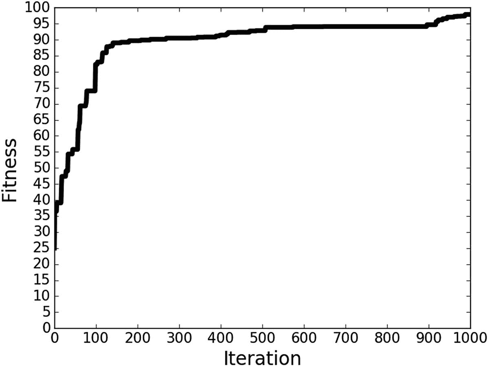

图 4-13

根据 1，000 次迭代的分类精度演变

GA.py 文件的实现在清单 [4-15](#PC15) 中。注意,“mutation”函数接受“mutation_percent”参数，该参数定义了随机改变其值的基因数量。在清单 [4-14](#PC14) 的主文件中设置为 10%。该文件包含两个新函数“mat_to_vector”和“vector_to_mat”。

```py
import numpy
import random

# Converting each solution from matrix to vector.
def mat_to_vector(mat_pop_weights):
    pop_weights_vector = []
    for sol_idx in range(mat_pop_weights.shape[0]):
        curr_vector = []

        for layer_idx in range(mat_pop_weights.shape[1]):
            vector_weights = numpy.reshape(mat_pop_weights[sol_idx, layer_idx], newshape=(mat_pop_weights[sol_idx, layer_idx].size))
            curr_vector.extend(vector_weights)
        pop_weights_vector.append(curr_vector)
    return numpy.array(pop_weights_vector)

# Converting each solution from vector to matrix.
def vector_to_mat(vector_pop_weights, mat_pop_weights):
    mat_weights = []
    for sol_idx in range(mat_pop_weights.shape[0]):
        start = 0
        end = 0
        for layer_idx in range(mat_pop_weights.shape[1]):
            end = end + mat_pop_weights[sol_idx, layer_idx].size
            curr_vector = vector_pop_weights[sol_idx, start:end]
            mat_layer_weights = numpy.reshape(curr_vector, newshape=(mat_pop_weights[sol_idx, layer_idx].shape))
            mat_weights.append(mat_layer_weights)
            start = end
    return numpy.reshape(mat_weights, newshape=mat_pop_weights.shape)

def select_mating_pool(pop, fitness, num_parents):
    # Selecting the best individuals in the current generation as parents for producing the offspring of the next generation.
    parents = numpy.empty((num_parents, pop.shape[1]))
    for parent_num in range(num_parents):
        max_fitness_idx = numpy.where(fitness == numpy.max(fitness))
        max_fitness_idx = max_fitness_idx[0][0]
        parents[parent_num, :] = pop[max_fitness_idx, :]
        fitness[max_fitness_idx] = -99999999999
    return parents

def crossover(parents, offspring_size):
    offspring = numpy.empty(offspring_size)
    # The point at which crossover takes place between two parents. Usually, it is at the center.
    crossover_point = numpy.uint8(offspring_size[1]/2)

    for k in range(offspring_size[0]):
        # Index of the first parent to mate.
        parent1_idx = k%parents.shape[0]
        # Index of the second parent to mate.
        parent2_idx = (k+1)%parents.shape[0]
        # The new offspring will have its first half of its genes taken from the first parent.
        offspring[k, 0:crossover_point] = parents[parent1_idx, 0:crossover_point]
        # The new offspring will have its second half of its genes taken from the second parent.
        offspring[k, crossover_point:] = parents[parent2_idx, crossover_point:]
    return offspring

def mutation(offspring_crossover, mutation_percent):
    num_mutations = numpy.uint8((mutation_percent*offspring_crossover.shape[1])/100)
    mutation_indices = numpy.array(random.sample(range(0, offspring_crossover.shape[1]), num_mutations))
    # Mutation changes a single gene in each offspring randomly.
    for idx in range(offspring_crossover.shape[0]):
        # The random value to be added to the gene.
        random_value = numpy.random.uniform(-1.0, 1.0, 1)
        offspring_crossover[idx, mutation_indices] = offspring_crossover[idx, mutation_indices] + random_value
    return offspring_crossover

Listing 4-15GA.py File Holding the Functions of GA

```

最后，根据清单 [4-16](#PC16) 实现 ANN.py。它包含激活函数(sigmoid 和 ReLU)的实现，以及用于计算精度的“适应度”和“预测输出”函数。

```py
import numpy

def sigmoid(inpt):
    return 1.0/(1.0+numpy.exp(-1*inpt))

def relu(inpt):
    result = inpt
    result[inpt<0] = 0
    return result

def predict_outputs(weights_mat, data_inputs, data_outputs, activation="relu"):
    predictions = numpy.zeros(shape=(data_inputs.shape[0]))
    for sample_idx in range(data_inputs.shape[0]):
        r1 = data_inputs[sample_idx, :]
        for curr_weights in weights_mat:
            r1 = numpy.matmul(a=r1, b=curr_weights)
            if activation == "relu":
                r1 = relu(r1)
            elif activation == "sigmoid":
                r1 = sigmoid(r1)
        predicted_label = numpy.where(r1 == numpy.max(r1))[0][0]
        predictions[sample_idx] = predicted_label
    correct_predictions = numpy.where(predictions == data_outputs)[0].size
    accuracy = (correct_predictions/data_outputs.size)*100
    return accuracy, predictions

def fitness(weights_mat, data_inputs, data_outputs, activation="relu"):
    accuracy = numpy.empty(shape=(weights_mat.shape[0]))
    for sol_idx in range(weights_mat.shape[0]):
        curr_sol_mat = weights_mat[sol_idx, :]
        accuracy[sol_idx], _ = predict_outputs(curr_sol_mat, data_inputs, data_outputs, activation=activation)
    return accuracy

Listing 4-16ANN.py File Implementing the ANN

```