# 6.张量流识别应用

像我们所做的那样，使用 NumPy 从头开始构建一个 DL 模型，如 CNN，有助于我们更好地理解每一层的详细工作原理。对于实际应用，不建议使用这样的实现。一个原因是它的计算是计算密集型的，需要努力优化代码。另一个原因是它不支持分布式处理、GPU 和许多其他功能。另一方面，已经有不同的库以省时的方式支持这些特性。这些库包括 TF、Keras、Theano、PyTorch、Caffe 等等。

本章从介绍 TF DL 库开始，通过构建和可视化一个简单线性模型和一个使用 ANN 的两类分类器的计算图。使用 TensorBoard (TB)可视化计算图形。使用 TF-Layers API，创建了一个 CNN 模型，以应用前面讨论的概念来识别来自 CIFAR10 数据集的图像。

## TF 简介

构建软件程序有不同的编程范例或风格。它们包括 sequential，它将程序构建为一组顺序行，程序从头到尾都遵循这些顺序行；functional，将代码组织成一组可以多次调用的函数；命令式，告诉计算机程序如何工作的每一个细节步骤；还有更多。一种编程语言可能支持不同的范例。但是这些范例的缺点是依赖于书写的语言。

另一个范例是数据流。数据流语言将其程序表示为文本指令，描述从接收数据到返回结果的计算步骤。一个数据流程序可以被想象成一个图形，除了显示操作的输入和输出之外，还显示操作。数据流语言支持并行处理，因为推导出可以同时执行的独立操作要容易得多。

“张量流”这个名字由两个词组成。第一个是“张量”，它是 TF 在计算中使用的数据单位。第二个词是“流”，反映了它使用数据流范式。因此，TF 构建了一个计算图，它由表示为张量的数据和应用于它们的运算组成。为了让事情更容易理解，只要记住 TF 使用张量和运算，而不是使用变量和方法。

以下是将数据流与 TF 一起使用的一些优势:

*   **并行**:更容易识别可以并行执行的操作。

*   **分布式执行**:TF 程序可以跨多个设备(CPU、GPU、TF 处理单元[TPUs])进行分区。TF 本身处理设备间通信和协作的必要工作。

*   **可移植性**:数据流图是模型代码的独立于语言的表示。数据流图可以使用 Python 创建，保存，然后在 C++程序中恢复。

TF 提供多个 APIs 每种都支持不同级别的控制。最底层的 API 被称为 TF Core，它使程序员能够控制每一段代码，并对创建的模型有更好的控制。

但是 TF 中也有许多更高级别的 API，它们通过为经常使用的任务提供一个简单的接口来使事情变得更容易，例如估计器、TF-Layers 和 TF-Learn。所有更高级别的 API 都构建在 TF Core 之上。例如，TF Estimators 是 TF 中的一个高级 API，它比 TF Core 更容易创建模型。

### 张量

张量是 TF 中的基本数据单位；它类似于 NumPy 中的数组。张量由一组原始数据类型组成，如整型、浮点型、字符型和字符串型，它们形成一个数组。

张量既有秩又有形状。表 [6-1](#Tab1) 给出了一些张量的例子，显示了它们的等级和形状。

表 6-1

TF 张量的秩和形状

<colgroup><col class="tcol1 align-left"> <col class="tcol2 align-left"> <col class="tcol3 align-left"></colgroup> 
| 

张量

 | 

军阶

 | 

形状

 |
| --- | --- | --- |
| five | Zero | () |
| [4, 8] | one | (2) |
| [[3, 1, 7], [1, 5, 2]] | Two | (2,2) |
| [[[8, 3]], [[11, 9]]]] | Two | (2,1,2) |

张量的秩是维数。张量形状类似于 NumPy 数组形状。NumPy 数组形状返回每个维度中元素的数量，这就是张量形状的工作方式。但是 tensor rank 返回的只是维数，这类似于 NumPy 数组的 ndim 属性。张量秩只是表示张量中维数的标量值，而形状是表示二维数组的元组，如(4，3)，其中这些维的大小分别是 4 和 3。

让我们从 TF Core 开始。

### TF 核心

为了创建 TF 核心程序，有两个步骤:

1.  构建计算图。

2.  运行计算图。

TF 使用数据流图来表示程序中的计算。在指定了计算序列之后，它在本地或远程机器上的 TF 会话中被执行。假设图 [6-1](#Fig1) 表示一个有四个操作 A、B、C 和 D 的图，其中输入被输入到操作 A，然后传播到操作 D。该图可以只执行它的选定部分，而不需要运行整个图。例如，通过指定会话执行的目标是操作 C，那么程序将一直运行，直到只到达操作 C 的结果。这种方式不会执行操作 D。同样，如果操作 B 是目标，那么操作 C 和 D 也不会执行。


图 6-1

有四种运算的图

使用 TF Core API 需要理解数据流图和会话是如何工作的。使用高级 API(如评估器)对用户隐藏了一些开销。但是理解图和会话是如何工作的有助于理解这些高级 API 是如何实现的。

### 数据流图

数据流图由节点和边组成。节点代表操作单元。边表示操作节点的输入和输出。例如，tensorflow.matmul()方法接受两个输入张量，将它们相乘，然后返回一个输出张量。操作本身用连接到两条边的单个节点表示，每条边对应一个输入张量。还有一条边代表输出张量。稍后，我们将看到如何使用 TB 构建计算图。

一种特殊的节点是常数，它接受零个张量作为输入。常量节点返回的输出是内部存储的值。清单 [6-1](#PC1) 创建一个 float32 类型的常量节点并打印出来。

```py
import tensorflow
tensor1 = tensorflow.constant(3.7, dtype=tensorflow.float32)
print(tensor1)

Listing 6-1
Constant Node

```

当打印常量节点时，结果是

```py
Tensor("Const:0", shape=(), dtype=float32)

```

根据`print`语句的输出，有三点需要注意:

*   形状是()，这意味着张量的秩为 0。

*   输出张量有一个等于“Const:0”的字符串。这个字符串是张量的名字。张量名称是一个重要的属性，因为它用于从图中检索张量值。也是 TF 图中打印的标签。常数张量的默认名称是“Const”。附加到该字符串的 0 将其定义为返回的第一个输出。有些操作会返回多个输出。第一个输出被赋予 0，第二个输出被赋予 1，依此类推。

*   `print`语句不打印值 3.7，而是打印节点本身。只有在对节点求值后，才会打印该值。

#### 张量名称

图中可能有多个常数张量。因此，TF 在字符串“`Const`”后附加一个数字，该数字在图中的所有常数中标识该常数。清单 [6-2](#PC3) 给出了三个常量的例子并打印出来。

```py
import tensorflow

tensor1 = tensorflow.constant(value=3.7, dtype=tensorflow.float32)
tensor2 = tensorflow.constant(value=[[0.5], [7]], dtype=tensorflow.float32)
tensor3 = tensorflow.constant(value=[[12, 9]], dtype=tensorflow.float32)
print(tensor1)
print(tensor2)
print(tensor3)

Listing 6-2Creating Three Constants

```

以下是三个打印语句的结果:

```py
Tensor("Const:0", shape=(), dtype=float32)
Tensor("Const_1:0", shape=(2, 1), dtype=float32)
Tensor("Const_2:0", shape=(1, 2), dtype=float32)

```

第一个张量名是“`Const:0`”。为了与其他张量相区别，字符串“`Const`”被附加了下划线和数字。例如，第二个张量的名字是“`Const_1:0`”。数字“1”是图中该常数的标识符。但是我们可以通过使用清单 [6-3](#PC5) 中的 name 属性来改变张量的名称。

```py
import tensorflow

tensor1 = tensorflow.constant(value=3.7, dtype=tensorflow.float32, name"firstConstant")
tensor2 = tensorflow.constant(value=[[0.5], [7]], dtype=tensorflow.float32, name"secondConstant")
tensor3 = tensorflow.constant(value=[[12, 9]], dtype=tensorflow.float32, name"thirdConstant")
print(tensor1)
print(tensor2)
print(tensor3)

Listing 6-3Setting Names of the Tensors Using the Name Attribute

```

三个打印报表的结果如下:

```py
Tensor("firstConstant:0", shape=(), dtype=float32)
Tensor("secondConstant:0", shape=(2, 1), dtype=float32)
Tensor("thirdConstant:0", shape=(1, 2), dtype=float32)

```

因为每个张量都有一个唯一的名称，所以字符串没有附加数字。如果 name 属性的同一个值被用于多个张量，那么这个数字将如清单 [6-4](#PC7) 所示使用。前两个张量被赋予值`myConstant`，因此第二个张量被附加上数字“1”。

```py
import tensorflow

tensor1 = tensorflow.constant(value=3.7, dtype=tensorflow.float32, name”myConstant”)
tensor2 = tensorflow.constant(value=[[0.5], [7]], dtype=tensorflow.float32, name”myConstant”)
tensor3 = tensorflow.constant(value=[[12, 9]], dtype=tensorflow.float32, name"thirdConstant")
print(tensor1)
print(tensor2)
print(tensor3)

Listing 6-4Two Tensors with the Same Value for the Name Attribute

```

列表 [6-4](#PC7) 的结果如下:

```py
Tensor("myConstant:0", shape=(), dtype=float32)
Tensor("myConstant_1:0", shape=(2, 1), dtype=float32)
Tensor("thirdConstant:0", shape=(1, 2), dtype=float32)

```

在清单 [6-5](#PC9) 中，操作`tensorflow.nn.top_k`用于返回向量的最大 K 值。换句话说，这个操作返回多个值作为输出。基于输出字符串，这两个输出被赋予字符串“`TopKV2`”，但是在冒号后面有一个不同的数字。第一个输出的编号为“0”，第二个输出的编号为“1”。

```py
import tensorflow
aa = tensorflow.nn.top_k([1, 2, 3, 4], 2)
print(aa)

Listing 6-5Operation Returning Multiple Outputs

```

打印输出是

```py
TopKV2(values=<tf.Tensor 'TopKV2:0' shape=(2,) dtype=int32>, indices=<tf.Tensor 'TopKV2:1' shape=(2,) dtype=int32>)

```

到目前为止，我们已经能够打印出张量，但还不能评估它的结果。让我们创建一个 TF 会话来评估操作。

#### 创建 TF 会话

TF 使用`tensorflow.Session`类来表示客户端程序(通常是 Python 程序)和运行时环境之间的连接。一个`tensorflow.Session`对象使用分布式 TF 运行时环境提供对本地机器中的设备和远程设备的访问。它还缓存了关于`tensorflow.Graph`的信息，以便我们可以高效地重新运行同一个图。清单 [6-6](#PC11) 创建了一个 TF 会话，用于评估单个常数张量的结果。待评估的张量被分配给`fetches`属性。

会话被创建并返回到名为`sess`的变量中。在使用`tensorflow.Session.run()`方法运行会话以评估张量`tensor1`之后，结果将是 3.7，这是常数值。这个方法运行`tensorflow.Operation`并评估`tensorflow.Tensor`。这种方法可以接受一个以上的张量进行评估，方法是将它们输入一个列表并将这个列表分配给`fetches`属性。

```py
import tensorflow

tensor1 = tensorflow.constant(value=3.7, dtype=tensorflow.float32)
sess = tensorflow.Session()
print(sess.run(fetches=tensor1))
sess.close()

Listing 6-6Evaluating a Single Constant Tensor

```

由于`tensorflow.Session`拥有物理资源，如 CPU、GPU 和网络连接，它必须在完成执行后释放这些资源。根据清单 [6-6](#PC11) ，我们必须使用`tensorflow.Session.close()`手动退出会话以释放资源。还有另一种创建会话的方法，它会自动关闭。这是通过使用清单 [6-7](#PC12) 中的`with`块来创建的。当会话在`with`块内创建时，它将在到达块外后自动关闭。

```py
import tensorflow

tensor1 = tensorflow.constant(value=3.7, dtype=tensorflow.float32)

with tensorflow.Session() as sess:
    print(sess.run(fetches=tensor1))

Listing 6-7Creating a Session Using the With Block

```

我们还可以在`tensorflow.Session.run()`方法中指定多个张量来获得它们的输出，如清单 [6-8](#PC13) 所示。

```py
import tensorflow

tensor1 = tensorflow.constant(value=3.7, dtype=tensorflow.float32)
tensor2 = tensorflow.constant(value=[[0.5], [7]], dtype=tensorflow.float32)
tensor3 = tensorflow.constant(value=[[12, 9]], dtype=tensorflow.float32)

with tensorflow.Session() as sess:
    print(sess.run(fetches=[tensor1, tensor2, tensor3]))

Listing 6-8Evaluating More Than One Tensor

```

以下是三个评估张量的输出。

```py
3.7
array([[ 0.5], [7.]], dtype=float32)
array([[ 12.,   9.]], dtype=float32)

```

前面的例子只是打印张量的计算结果。可以存储这些值并在程序中重用它们。清单 [6-9](#PC15) 在`results`张量中返回评估结果。

```py
import tensorflow

node1 = tensorflow.constant(value=3.7, dtype=tensorflow.float32)
node2 = tensorflow.constant(value=7.7, dtype=tensorflow.float32)
node3 = tensorflow.constant(value=9.1, dtype=tensorflow.float32)

with tensorflow.Session() as sess:
    results = sess.run(fetches=[node1, node2, node3])

vIDX = 0
for value in results:
    print("Value ", vIDX, " : ", value)
    vIDX = vIDX + 1

Listing 6-9Evaluating More Than One Tensor

```

因为有三个张量要求值，所以三个输出都会存储到`results`张量中，这是一个列表。使用`for`循环，我们可以分别迭代和打印每个输出。输出如下:

```py
Value  0  :  3.7
Value  1  :  7.7
Value  2  :  9.1

```

前面的例子只是计算了常数张量的值，没有应用任何运算。我们可以在这样的张量上应用一些运算。清单 [6-10](#PC17) 创建两个张量，并使用`tensorflow.add`操作将它们相加。这个操作接受两个张量，并将它们相加。两个张量必须具有相同的数据类型(即，dtype 属性)。它返回与输入张量相同类型的新张量。使用+运算符等同于使用`tensorflow.add()`方法。

```py
import tensorflow

tensor1 = tensorflow.constant(value=3.7, dtype=tensorflow.float32)
tensor2 = tensorflow.constant(value=7.7, dtype=tensorflow.float32)

add_op = tensorflow.add(tensor1, tensor2)

with tensorflow.Session() as sess:
    add_result = sess.run(fetches=[add_op])

print("Result of addition : ", add_result)

Listing 6-10Adding Two Tensors Using the tensorflow.add Operation

```

print 语句的输出是

```py
Result of addition :  [11.4]

```

在图 [6-2](#Fig2) 中，清单 [6-10](#PC17) 中的程序图是用 TB 可视化的。请注意，所有节点和边都有标签。这些标签是每个张量和操作的名字。使用默认值。在本章的后面，我们将学习如何在 TB 中可视化图形。


图 6-2

使用 TB 的图形可视化

操作的名字是描述性的，反映了它的工作，但张量的名字不是。我们可以将它们更改为`num1`和`num2`，并将图形可视化，如图 [6-3](#Fig3) 所示。

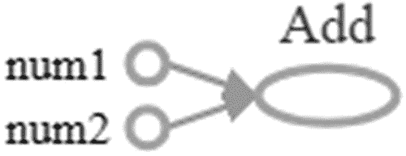

图 6-3

改变张量的名称

#### 使用占位符的参数化图形

前面的图是静态的，因为它使用了常数张量。它总是接受相同的输入，并在每次求值时生成相同的输出。为了能够在程序每次运行时修改输入，我们可以使用`tensorflow.placeholder`。换句话说，为了评估相同的操作但使用不同的输入，您应该使用`tensorflow.placeholder`。注意`placeholder`只能通过重新运行图形来改变它的值。

`tensorflow.placeholder`接受如下三个参数:

*   `dtype`:张量将接受的元素的数据类型。

*   `shape`(可选–默认无):张量内数组的形状。如果没有指定，那么你可以给张量输入任何形状。

*   `name`(可选–默认无):操作的名称。

它返回一个具有这些规格的张量。

我们可以修改清单 [6-10](#PC17) 中的前一个例子，使用清单 [6-11](#PC19) 中的`tensorflow.placeholder`。之前运行会话时，`tensorflow.Session.run()`只接受待评估的操作。当使用`placeholders`时，该方法也将接受`feed_dict`参数中占位符的初始值。`feed_dict`参数接受值作为一个字典，将每个占位符的名称映射到它的值。

```py
import tensorflow

tensor1 = tensorflow.placeholder(dtype=tensorflow.float32, shape=(), name="num1")
tensor2 = tensorflow.placeholder(dtype=tensorflow.float32, shape=(), name="num2")

add_op = tensorflow.add(tensor1, tensor2, name="Add_Op")

with tensorflow.Session() as sess:
    add_result = sess.run(fetches=[add_op], feed_dict={tensor1: 3.7, tensor2: 7.7})

print("Result of addition : ", add_result)

Listing 6-11Parameterized Graph Using a Placeholder

```

为占位符分配与清单 [6-10](#PC17) 中的常量相同的值，将返回相同的结果。使用占位符的好处是它们的值甚至可以在程序中更改，但是常量一旦创建就不能更改。

使用第三个占位符和乘法运算后，清单 [6-12](#PC20) 使用不同的占位符值多次运行会话。它使用了一个`for`循环，遍历由`range()`本地 Python 函数返回的五个数字的列表。所有张量的值被设置为等于列表值，每次迭代一个值。使用`tensorflow.add`运算将前两个张量的值相加。加法的结果被返回到`add_op`张量中。然后使用`tensorflow.multiply`运算将它的值乘以第三个张量。乘法结果在`mul_op`张量中返回。使用`*`操作符等同于使用`tensorflow.add()`方法。与清单 [6-12](#PC20) 中的`mul_op`相比，清单 [6-11](#PC19) 中的`fetches`参数是一组`add_op`。

```py
import tensorflow

tensor1 = tensorflow.placeholder(dtype=tensorflow.float32, shape=(), name="num1")
tensor2 = tensorflow.placeholder(dtype=tensorflow.float32, shape=(), name="num2")
tensor3 = tensorflow.placeholder(dtype=tensorflow.float32, shape=(), name="num3")

add_op = tensorflow.add(tensor1, tensor2, name="Add_Op")
mul_op = tensorflow.multiply(add_op, tensor3, name="Add_Op")

with tensorflow.Session() as sess:
    for num in range(5):
result = sess.run(fetches=[mul_op], feed_dict={tensor1: num, tensor2: num, tensor3: num})
        print("Result at iteration ", num, " : ", result)

Listing 6-12Running the Session for Different Values for the Placeholders

```

print 语句的输出如下:

```py
Result at iteration  0  :  [0.0]
Result at iteration  1  :  [2.0]
Result at iteration  2  :  [8.0]
Result at iteration  3  :  [18.0]
Result at iteration  4  :  [32.0]

```

图 [6-4](#Fig4) 给出了之前图表的可视化。请注意，所有运算和张量都被重命名。前两个张量`num1`和`num2`与第一个操作`Add_Op`相连。这个操作的结果被用作输入，第三个张量`num3`作为第二个操作`Mul_Op`的输入。

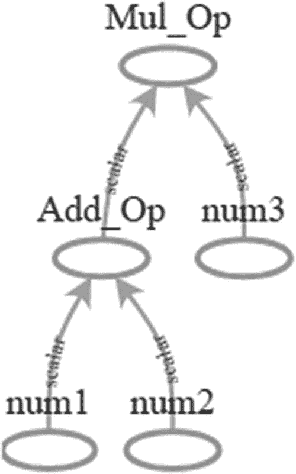

图 6-4

使用 TB 显示清单 [6-12](#PC20) 中的图表

选择`mul_op`张量作为清单 [6-12](#PC20) 中`fetches`列表的成员。为什么不直接选择`add_op`？答案是选择图链中的最后一个张量进行评估。评估`mul_op`将隐式评估图中的所有其他张量。如果选择“add_op”进行评估，那么`mul_op`将不会被评估，因为`add_op`不依赖于`mul_op`，我们与评估它无关。但是`mul_op`是依赖于`add_mul`和其他所有张量的。因此，选择`mul_op`进行评估。请记住，有可能使用一个以上的张量进行评估。

#### TF 变量

占位符用于分配内存以备将来使用。它们的主要用途是为模型提供输入数据以进行训练。如果要对不同的输入数据应用相同的操作，则将输入数据放入占位符中，然后通过为占位符指定不同的值来运行进程。

占位符未初始化，它们的值仅在运行时分配；换句话说，只有在调用张量流之后。Session.run()是赋值的占位符。占位符允许创建不受约束的形状张量，这使它适合用于保存定型数据。

假设您想要将训练数据分配给占位符，并且您只知道每个样本由 35 个特征描述。我们还没有决定使用多少样本进行训练。我们可以创建一个占位符，该占位符接受具有未指定数量的样本但每个样本具有特定数量的特征(列)的张量，如下所示:

```py
data_tensor = tensorflow.placeholder(dtype=tensorflow.float16, shape=[None, 35])

```

占位符只接受值，在赋值后不能更改。请记住，在清单 [6-12](#PC20) 中，我们仅通过用新值重建图形来更改占位符的值。在同一图表中，不能更改占位符值。

ML 模型具有许多可训练的参数，这些参数被改变多次，直到达到它们的最佳值。我们如何允许一个张量多次改变它的值？这不是由常量和占位符提供的，而是由变量(tensorflow。变量())。

TF 变量与其他语言中使用的普通变量相同。它们被赋予初始值，并且这样的值可以在程序执行期间基于应用于它的操作被更新。占位符一旦在执行期间被赋值，就不允许修改数据。

一旦 tensorflow.constant()被调用，常量张量的值将被初始化，但变量在调用 tensorflow 后不会被初始化。变量()。通过在会话中运行 tensor flow . global _ variables _ initializer()操作，有一种简单的方法可以初始化程序中的所有全局变量。请注意，初始化变量并不意味着对它求值。变量需要在初始化后进行求值。清单 [6-13](#PC23) 给出了一个创建名为“Var1”的单个变量的例子，它的值被初始化，然后变量被求值，最后，它的值被打印出来。

```py
import tensorflow

var1 = tensorflow.Variable(initial_value=5.8, dtype=tensorflow.float32, name="Var1")

with tensorflow.Session() as sess:
    init = tensorflow.global_variables_initializer()
    sess.run(fetches=init)
    var_value = sess.run(fetches=var1)
    print("Variable value : ", var_value)

Listing 6-13Creating, Initializing, and Evaluating the Variable

```

打印语句将返回:

```py
Variable value :5.8

```

请注意，会话有两次运行:第一次用于初始化所有变量，第二次用于评估变量。记住占位符是一个函数，而变量是一个类，因此它的名字以大写字母开头。

变量可以由任何类型和形状的张量初始化。这个张量的类型和形状将定义变量的类型和形状，这是不可改变的。变量值可以改变。在分布式环境中，变量可以存储一次，然后在所有设备上共享。它们有一个有助于调试的状态。此外，变量值可以在需要时保存和恢复。

#### 变量初始化

初始化变量有不同的方法。所有变量初始化方法都可以设置变量的形状和数据类型。一种方法是使用先前初始化的变量的初始值。例如，清单 [6-13](#PC23) 中名为“Var1”的变量由值为 5.8 的秩 0 张量初始化。这个初始化的变量可以用来初始化其他变量。注意，变量的初始值可以使用 tensorflow 的 initialized_value()方法返回。可变类。可以将初始值赋给另一个变量，如下所示。通过将“var1”的初始值乘以 5 来初始化变量“var3”。

```py
var2 = tensorflow.Variable(initial_value=var1.initialized_value(), dtype=tensorflow.float32)
var3 = tensorflow.Variable(initial_value=var1.initialized_value()*5, dtype=tensorflow.float32)

```

变量可以基于 TF 中内置操作之一创建的另一个张量进行初始化。生成张量有不同的操作，包括:

*   tensorflow.lin_space(开始，停止，数量，名称=无)

*   tensorflow.range(start，limit=None，delta=1，dtype=None，name="range ")

*   tensorflow.zeros(shape，dtype=tf.float32，name=None)

*   tensorflow.ones(shape，dtype=tf.float32，name=None)

*   tensorflow.constant(value，dtype=None，shape=None，name="Const "，verify_shape=False)

它们与 NumPy 中对应的方法具有相同的含义。所有这些操作都返回指定数据类型和形状的张量。例如，我们可以创建一个张量流。变量()，其值使用 tensorflow.zeros()进行初始化，这将返回具有 12 个元素的 1D 行向量，如下所示:

```py
var1 = tensorflow.Variable(tensorflow.zeros([12]))

```

### 使用 TB 的图形可视化

TF 旨在处理用大量数据训练的深度模型。TF 支持一套名为 TB 的可视化工具，有助于更容易地优化和调试 TF 程序。计算数据流图被可视化为表示操作的一组节点，这些节点通过表示输入和输出张量的边连接在一起。

下面是使用 TB 可视化一个简单图形的总结步骤:

1.  建立数据流图。

2.  使用 tensorflow.summary.FileWriter 将图形写入目录。

3.  在保存的图形目录中启动 TB。

4.  从网络浏览器访问 TB。

5.  形象化图表。

让我们使用清单 [6-14](#PC27) 中的代码进行可视化。这段代码创建了六个变量，分别输入到九个操作中。在编写了构建图形的说明之后，接下来是使用 FileWriter 保存它。tensorflow.summary.FileWriter()构造函数接受两个重要参数:“graph”和“logdir”。“graph”参数接受会话图，该图由“sess.graph”返回，假设会话变量名为“sess”。图形被导出到使用“logdir”参数指定的目录中。更改“logdir”以匹配您的系统。请注意，我们不必初始化变量，也不必运行会话，因为我们的目标不是执行图形，而只是可视化它。

```py
import tensorflow

tensor1 = tensorflow.Variable(initial_value=4, dtype=tensorflow.float32, name="Var1")
tensor2 = tensorflow.Variable(initial_value=15, dtype=tensorflow.float32, name="Var2")
tensor3 = tensorflow.Variable(initial_value=-2, dtype=tensorflow.float32, name="Var3")
tensor4 = tensorflow.Variable(initial_value=1.8, dtype=tensorflow.float32, name="Var4")
tensor5 = tensorflow.Variable(initial_value=14, dtype=tensorflow.float32, name="Var5")
tensor6 = tensorflow.Variable(initial_value=8, dtype=tensorflow.float32, name="Var6")

op1 = tensorflow.add(x=tensor1, y=tensor2, name="Add_Op1")
op2 = tensorflow.subtract(x=op1, y=tensor1, name="Subt_Op1")
op3 = tensorflow.divide(x=op2, y=tensor3, name="Divide_Op1")
op4 = tensorflow.multiply(x=op3, y=tensor4, name="Mul_Op1")
op5 = tensorflow.multiply(x=op4, y=op1, name="Mul_Op2")
op6 = tensorflow.add(x=op5, y=2, name="Add_Op2")
op7 = tensorflow.subtract(x=op6, y=op2, name="Subt_Op2")
op8 = tensorflow.multiply(x=op7, y=tensor6, name="Mul_Op3")
op9 = tensorflow.multiply(x=op8, y=tensor5, name="Mul_Op4")

with tensorflow.Session() as sess:
    writer = tensorflow.summary.FileWriter(logdir="\\AhmedGad\\TensorBoard\\", graph=sess.graph)
    writer.close()

Listing 6-14Saving Dataflow Graph for Visualization Using TB

```

导出图表后，下一步是启动 TB 来访问图表。根据 TF 是安装在单独的虚拟环境(venv)中还是作为 site-packages 目录中的常规库，启动 TB 略有不同。

如果安装在 venv 中，那么必须使用位于 Python 安装的脚本目录下的 activate.bat 文件来激活 TF。假设脚本目录被添加到用户或系统路径变量环境中，并且 venv 文件夹被命名为“tensorflow ”,那么 TF 将根据以下命令被激活:

```py
activate tensorflow

```

激活 TF 后，下一步是根据该命令将 TB 启动到保存图形的目录中:

```py
tensorBoard --logdir=\\AhmedGad\\TensorBoard\\

```

如果 TF 安装在 site-packages 目录中，则可以通过发出以下命令来激活它:

```py
python -m tensorboard.main --logdir="\\AhmedGad\\TensorBoard\\"

```

这将激活 TB，然后我们将准备好通过从 web 浏览器导航到“http://localhost:6006”来可视化图形。该图如图 [6-5](#Fig5) 所示。在这种情况下，更容易调试图形。例如，在图中比代码更容易检测到没有连接到图中任何其他节点的孤立节点。

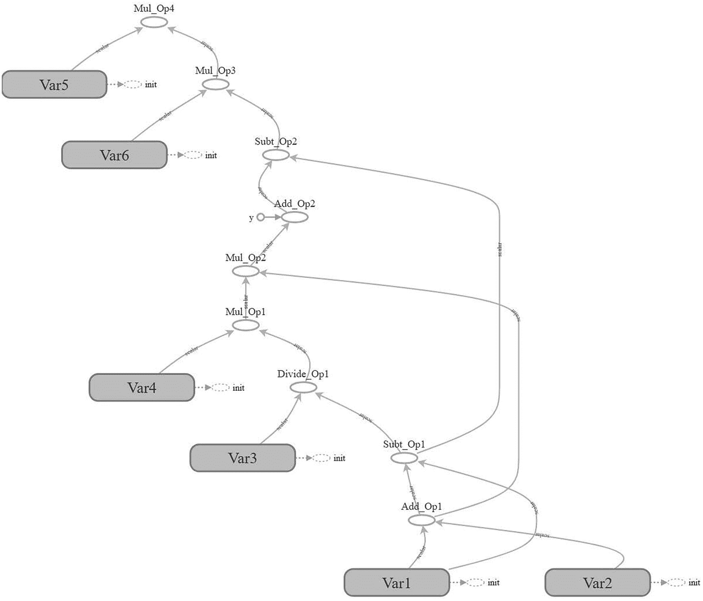

图 6-5

使用 TB 实现数据流图的可视化

### 线性模型

线性模型具有方程 6-1 的一般形式。有 *n* 个输入变量*x*<sub>T5】n</sub>，每个变量被赋予一个权重 *w* <sub>*n*</sub> 总共有 *n* 个权重。偏置 *b* 被添加到每个输入的 SOP 及其相应的偏置。

*和*=*【w】**+*【w】<sub>2</sub>

对于简单的线性模型，有输入数据、权重和偏差。在占位符和变量之间，哪一个选项最适合保存它们？通常，占位符用于在不同的输入上多次应用相同的操作。输入将被逐个分配给占位符，操作将应用于每个输入。变量用于存储可训练参数。因此，输入数据将被分配给一个占位符，但权重和偏差存储在变量中。记住使用 tensor flow . global _ variables _ initializer()来初始化变量。

清单 [6-15](#PC31) 中给出了准备占位符和两个变量的代码。输入样本只有一个输入 *x* <sub>1</sub> 和一个输出 *y* 。占位符“数据输入占位符”表示输入，占位符“数据输出占位符”表示输出。

因为每个样本只有一个输入变量，所以只有一个权重 *w* <sub>1</sub> 。权重被表示为“weight_variable”变量，并被赋予初始值 0.2。偏差表示为变量“bias_variable ”,初始值为 0.1。请注意，占位符在张量流中被赋值。使用“feed_dict”参数的 Session.run()方法。输入占位符被分配为 2.0，输出占位符被分配为 5.0。图形的可视化如图 [6-6](#Fig6) 所示。

请注意，run()方法的“fetches”参数被设置为包含三个元素的列表:“loss”、“error”和“output”。获取表示损失函数的“损失”张量，因为它是图中的目标张量。一旦它被评估，所有其他张量将被评估。提取“错误”和“输出”张量只是为了打印除预测输出之外的预测错误，就像代码末尾的打印语句一样。

注意张量“误差”和“损失”的区别。“误差”张量计算每个样本的预测输出和期望输出之间的平方误差。为了在单个值中总结所有误差，使用了张量“损失”。它计算所有平方误差的总和。

```py
import tensorflow

data_input_placeholder = tensorflow.placeholder(dtype=tensorflow.float32, name="DataInput")
data_output_placeholder = tensorflow.placeholder(dtype=tensorflow.float32, name="DataOutput")
weight_variable = tensorflow.Variable(initial_value=0.1, dtype=tensorflow.float32, name="Weight")
bias_variable = tensorflow.Variable(initial_value=0.2, dtype=tensorflow.float32, name="Bias")

output = tensorflow.multiply(x=data_input_placeholder, y=weight_variable)
output = tensorflow.add(x=output, y=bias_variable)

diff = tensorflow.subtract(x=output, y=data_output_placeholder, name="Diff")
error = tensorflow.square(x=diff, name="PredictError")
loss = tensorflow.reduce_sum(input_tensor=error, name="Loss")

with tensorflow.Session() as sess:
    writer = tensorflow.summary.FileWriter(logdir="\\AhmedGad\\TensorBoard\\", graph=sess.graph)
    init = tensorflow.global_variables_initializer()
    sess.run(fetches=init)
loss, predict_error, predicted_output = sess.run(fetches=[loss, error, output], feed_dict={data_input_placeholder: 2.0,data_output_placeholder: 5.0})
    print("Loss : ", loss, "\nPredicted output : ", predicted_output,"\nPrediction error : ", predict_error)
    writer.close()

Listing 6-15Preparing Inputs, Weight, and Bias for a Linear Model

```

根据分配给占位符和变量的值，打印消息的输出如下:

```py
Loss :  21.16
Predicted output :  0.4
Prediction error :  21.16

```

预测输出为 0.4，期望输出为 5.0。存在等于 21.16 的误差。在提取的张量中只返回一个值，因为程序只处理一个样本。此外，损失值等于误差值，因为只有一个样本。我们可以对多个样本运行该程序。


图 6-6

具有一个输入的线性模型的数据流图的可视化

除了给占位符“data_input_placeholder”分配单个值之外，我们还可以在一个列表中分配多个值。这也适用于“数据输出占位符”占位符。请注意，它们必须具有相同的形状。使用两个样本后修改的程序如清单 [6-16](#PC34) 所示。打印消息如下:

```py
Loss :  51.41
Predicted output :  [ 0.4  0.5]
Prediction error :  [21.16  30.25]

```

这意味着第一个和第二个样本的预测误差分别为 21.16 和 30.25。所有平方误差之和为 51.41。因为损失函数有一个高值，所以我们必须更新参数(权重和偏差),以便最小化预测误差。

```py
import tensorflow

data_input_placeholder = tensorflow.placeholder(dtype=tensorflow.float32, name="DataInput")
data_output_placeholder = tensorflow.placeholder(dtype=tensorflow.float32, name="DataOutput")
weight_variable = tensorflow.Variable(initial_value=0.1, dtype=tensorflow.float32, name="Weight")
bias_variable = tensorflow.Variable(initial_value=0.2, dtype=tensorflow.float32, name="Bias")

output = tensorflow.multiply(x=data_input_placeholder, y=weight_variable)
output = tensorflow.add(x=output, y=bias_variable)

diff = tensorflow.subtract(x=output, y=data_output_placeholder, name="Diff")
error = tensorflow.square(x=diff, name="PredictError")
loss = tensorflow.reduce_sum(input_tensor=error, name="Loss")

with tensorflow.Session() as sess:
    init = tensorflow.global_variables_initializer()
    sess.run(fetches=init)
loss, predict_error, predicted_output = sess.run(fetches=[loss, error, output], feed_dict={data_input_placeholder: [2.0, 3.0],data_output_placeholder: [5.0, 6.0]})
    print("Loss : ", loss, "\nPredicted output : ", predicted_output,"\nPrediction error : ", predict_error)

Listing 6-16Running the TF Program for Multiple Samples

```

目前，没有办法更新参数。TF 中已经有许多优化器可以完成这项工作。

#### 来自 TF Train API 的 GD 优化器

TF 提供了许多优化器来自动优化模型参数。GD 就是一个例子，慢慢改变每个参数的值，直到达到损耗最小的值。GD 根据损失对变量的导数的大小修改每个变量。这与“训练人工神经网络的反向传递”中第 [3](3.html) 章讨论的内容相同。“tensor flow . train”API 有一个名为“GradientDescentOptimizer”的类，它既可以计算导数，也可以优化参数。使用“GradientDescentOptimizer”后的程序如清单 [6-17](#PC35) 所示。

```py
import tensorflow

data_input_placeholder = tensorflow.placeholder(dtype=tensorflow.float32, name="DataInput")
data_output_placeholder = tensorflow.placeholder(dtype=tensorflow.float32, name="DataOutput")
weight_variable = tensorflow.Variable(initial_value=0.1, dtype=tensorflow.float32, name="Weight")
bias_variable = tensorflow.Variable(initial_value=0.2, dtype=tensorflow.float32, name="Bias")

output = tensorflow.multiply(x=data_input_placeholder, y=weight_variable, name="Multiply")
output = tensorflow.add(x=output, y=bias_variable, name="Add")

diff = tensorflow.subtract(x=output, y=data_output_placeholder, name="Diff")
error = tensorflow.square(x=diff, name="PredictError")
loss = tensorflow.reduce_sum(input_tensor=error, name="Loss")
train_optim = tensorflow.train.GradientDescentOptimizer(learning_rate=0.01, name="Optimizer")
minimizer = train_optim.minimize(loss=loss, name="Minimizer")

with tensorflow.Session() as sess:
    writer = tensorflow.summary.FileWriter(graph=sess.graph, logdir="\\AhmedGad\\TensorBoard\\")
    init = tensorflow.global_variables_initializer()
    sess.run(fetches=init)
    for k in range(1000):
        _, data_loss, predict_error, predicted_output = sess.run(fetches=[minimizer,loss, error, output], feed_dict={data_input_placeholder: [1.0, 2.0],data_output_placeholder: [5.0, 6.0]})

    print("Loss : ", data_loss,"\nPredicted output : ", predicted_output,"\nPrediction error : ", predict_error)
    writer.close()

Listing 6-17Using GD for Optimizing the Model Parameters

```

该程序使用一个循环，该循环迭代 1000 次。对于每次迭代，当前参数用于预测输出，损失被计算，并且 GD 优化器更新参数以最小化损失。注意,“minimize()”操作返回一个最小化损失的操作。

迭代结束后，执行 print 语句。以下是它的输出:

```py
Loss :  0.00323573
Predicted output :  [ 4.951612    6.02990532]
Prediction error :  [ 0.0023414   0.00089433]

```

由于 GD，损耗从 51.41 降低到仅为 0.0032。清单 [6-17](#PC35) 中之前程序的图形如图 [6-7](#Fig7) 所示。

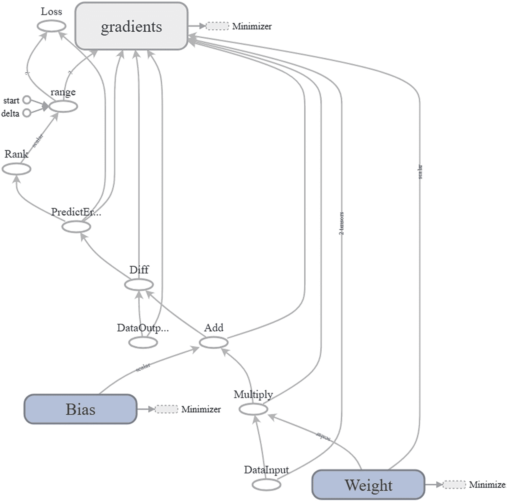

图 6-7

使用 GD 优化的线性模型的数据流图

#### 定位要优化的参数

现在出现了一个重要的问题:优化器如何知道参数来改变它们的值？让我们看看它是怎么知道的。

运行会话后，将执行“最小化”操作。TF 将遵循图节点链来评估这样的操作。TF 发现“极小值”运算依赖于单个自变量，即“损失”张量。因此，我们的目标是最小化这样一个张量的值。我们怎样才能最小化这个张量？我们必须顺着图表往回走。

使用“tensorflow.reduce_sum()”运算来评估“损失”张量。因此，我们的目标是最小化“tensorflow.reduce_sum()”操作的结果。

退一步说，这个操作是用“误差”张量来评估的。因此，我们现在的目标是最小化“误差”张量。再退一步，我们发现“误差”张量依赖于“tensorflow.square()”运算。因此，我们必须最小化“tensorflow.square()”操作。这个操作的输入张量是“diff”张量。因此，我们的目标是最小化“差异”张量。因为“diff”张量是“tensorflow.subtract()”运算的结果，那么我们的目标就是最小化这个运算。

最小化“tensorflow.subtract()”要求我们最小化它的输入张量，即“output”和“data_output_placeholder”。看这两个张量，哪个可以修改？只有变量张量可以修改。因为“data_output_placeholder”不是变量而是占位符，所以我们不能修改。因此，为了最小化结果，我们只需要最小化“输出”张量。

“输出”张量是根据方程 6-1 计算的。它有三个输入:输入、权重和偏差，分别由张量“data_input_placeholder”、“weight_variable”和“bias_variable”表示。找这三个张量，只有“weight_variable”和“bias_variable”可以改变，因为它们是变量。因此，最终我们知道我们的目标是最小化“权重可变”和“偏差可变”张量。

为了最小化“tensor flow . train . gradientdescentoptimizer . minimize()”操作，我们必须更改“weight_variable”和“bias_variable”张量的值。这就是 TF 如何推导出，为了使损失最小化，应该使重量和偏置参数最小化。

## 建筑 FFNN

在本节中，将使用 TF Core API 为分类创建两个基本前馈神经网络(FFNNs)。我们将遵循之前使用 NumPy 构建 ANN 的相同步骤，但有所不同。

概括的步骤如下:

1.  读取训练数据(输入和输出)。

2.  构建神经网络层并准备其参数(权重、偏差和激活函数)。

3.  建立损失函数以评估预测误差。

4.  创建用于训练网络和更新其参数的训练循环。

5.  使用新的看不见的测试数据评估训练的人工神经网络的准确性。

我们将从构建一个单层 FFANN 开始。

### 线性分类

表 [6-2](#Tab2) 给出了第一个分类问题的数据。基于颜色通道红色、绿色和蓝色将 RGB 颜色分类为红色或蓝色是一个二元分类问题。

表 6-2

RGB 颜色分类问题

<colgroup><col class="tcol1 align-center"> <col class="tcol2 align-center"> <col class="tcol3 align-center"> <col class="tcol4 align-center"></colgroup> 
| 

班级

 | 

红色

 | 

格林（姓氏）；绿色的

 | 

蓝色

 |
| --- | --- | --- | --- |
| **红色** | Two hundred and fifty-five | Zero | Zero |
| Two hundred and forty-eight | Eighty | sixty-eight |
| **蓝色** | Zero | nine | Two hundred and fifty-five |
| Sixty-seven | Fifteen | Two hundred and ten |

根据清单 [6-18](#PC37) ，创建了两个占位符(“training_inputs”和“training_outputs”)用于保存训练数据输入和输出。它们的数据类型设置为“float32 ”,但没有特定的形状。“training_inputs”占位符的形状是 N×3。那是什么意思？

通常，占位符用于保存模型的训练数据。训练数据的大小并不总是固定的。样本数量和/或特征数量可能会发生变化。例如，我们可以用 100 个样本训练一个模型，其中每个样本由 15 个特征表示。在本例中，占位符的形状为 100×15。假设我们后来决定将训练样本的数量更改为 50。占位符的形状必须改为 50×15。

```py
import tensorflow
training_inputs = tensorflow.placeholder(shape=[None, 3], dtype=tensorflow.float32)
training_outputs = tensorflow.placeholder(shape=[None, 1], dtype=tensorflow.float32)

Listing 6-18Placeholders for the Training Data Inputs and Outputs

```

为了使生活更容易，TF 支持创建可变形状的占位符。占位符形状是根据分配给它的数据确定的。该形状可以在所有维度上变化，或者仅在某些维度上变化。如果我们决定使用 30 个特征，但是还没有决定训练样本的数量，那么形状是 N×15，其中 N 是样本的数量。向占位符输入 20 个样本，N 将被设置为 20。清单 [6-18](#PC37) 中的两个占位符就是这种情况。若要让占位符泛型用于保存任意数量的训练样本，其形状将设置为(None，3)。None 表示该维度(代表样本数)没有静态大小。

准备好输入和输出后，下一步是决定网络架构，以准备它们的参数(权重和偏差)。因为数据很简单，我们可以画出来。清单 [6-19](#PC38) 给出了用于绘制数据的代码。注意数据是三维的，因此图是三维的，如图 [6-8](#Fig8) 所示。

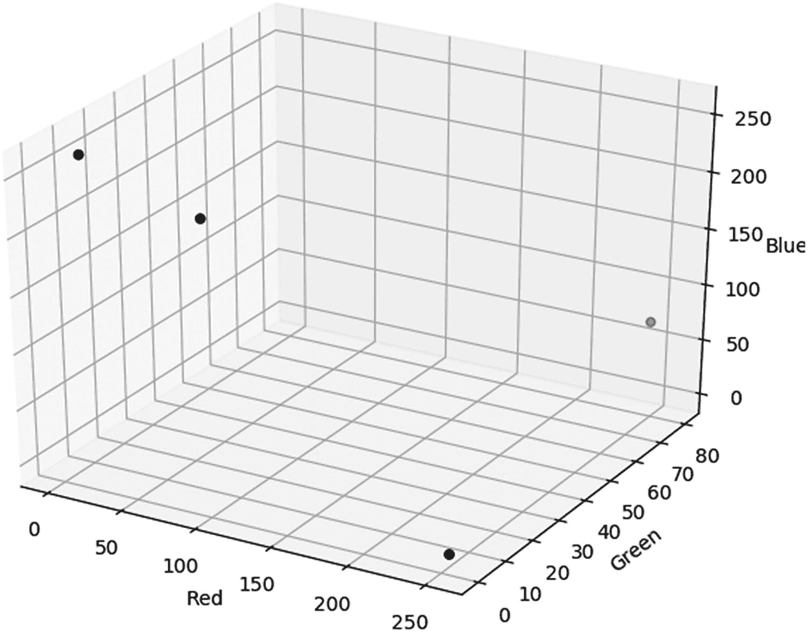

图 6-8

训练数据的 3D 散点图

```py
import matplotlib.pyplot
import mpl_toolkits.mplot3d

figure3D = matplotlib.pyplot.figure()
axis3D = mpl_toolkits.mplot3d.Axes3D(figure3D)

red = [255, 248, 0, 67]
green = [0, 80, 9, 15]
blue = [0, 68, 255, 210]

axis3D.scatter(red, green, blue, color="black")
axis3D.set_xlabel(xlabel="Red")
axis3D.set_ylabel(ylabel="Green")
axis3D.set_zlabel(zlabel="Blue")
matplotlib.pyplot.show()

Listing 6-193D Scatter Plot of the Training Data

```

根据图 [6-8](#Fig8) ，很明显这两类可以线性分离。红色类别的两个样本位于图的右侧，蓝色样本位于左侧。知道它是一个线性问题会引导我们不使用任何隐藏层。因此，网络架构只有输入层和输出层。因为每个样本使用三个要素表示，所以输入图层将只有三个输入，每个要素一个。网络架构如图 [6-9](#Fig9) 所示，其中*X*T6】0= 1.0 为偏置输入， *W* <sub>0</sub> 为偏置。*W*T14】1、*W*T18】2 和*W*T22】3 是三个输入 R(红色)、G(绿色)和 B(蓝色)的权重。

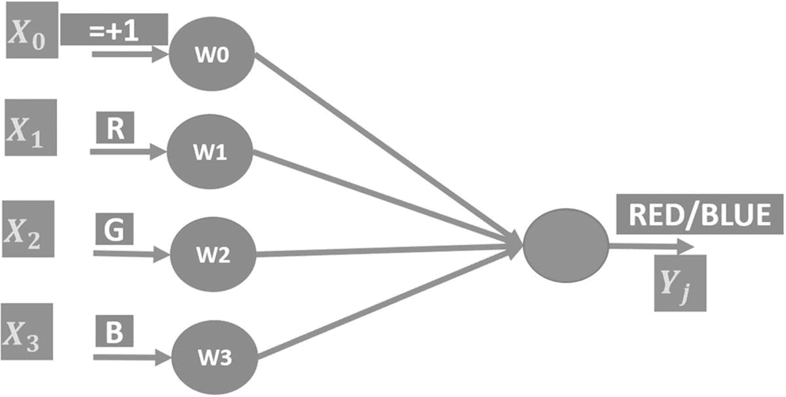

图 6-9

用于 RGB 颜色线性分类的人工神经网络结构

清单 [6-20](#PC39) 准备保存这些参数的变量。因为有三个输入，并且每个输入都有一个权重，所以根据“权重”变量，权重的形状是 3×1。形状为 3×1，以使输入和权重之间的矩阵乘法有效。形状 N×3 的输入数据可以乘以形状 3×1 的权重，结果将是 N×1。根据“偏差”变量，只有一个偏差。

```py
import tensorflow
weights = tensorflow.Variable(initial_value=[[0.003], [0.001], [0.008]], dtype=tensorflow.float32)
bias = tensorflow.Variable(initial_value=[0.001], dtype=tensorflow.float32)

Listing 6-20Preparing ANN Parameter Variables

```

准备好数据、网络架构和参数后，接下来是将训练输入数据输入网络，预测其输出，并根据清单 [6-21](#PC40) 计算损耗。使用“matmul()”运算将输入数据矩阵乘以权重向量，并将结果存储在“sop”张量中。根据等式 6-1，乘法的结果被加到偏差上。加法的结果存储在“sop_bias”张量中。然后将结果应用于由“tensorflow.nn.sigmoid()”操作定义的 sigmoid 函数，并返回到“预测”张量中。

```py
import tensorflow
sop = tensorflow.matmul(a=training_inputs, b=weights, name="SOPs")
sop_bias = tensorflow.add(x=sop, y=bias)
predictions = tensorflow.nn.sigmoid(x=sop_bias, name="Sigmoid")

error = tensorflow.subtract(x=training_outputs, y=predictions, name="Error")
square_error = tensorflow.square(x=error, name="SquareError")
loss = tensorflow.reduce_sum(square_error, name="Loss")

train_optim = tensorflow.train.GradientDescentOptimizer(learning_rate=0.05, name="GradientDescent")
minimizer = train_op.minimize(loss, name="Minimizer")

Listing 6-21Using the Network Parameters to Predict the Outputs of the Training Data

```

预测输出后，接下来是测量损耗。首先，使用“subtract()”运算计算预测输出和正确输出之间的差异，并将结果存储在“误差”张量中。然后使用“平方”张量计算该误差的平方，并将结果存储到“平方误差”张量中。最后，通过将所有误差相加，平方误差减少为一个单一值。结果存储在“损失”张量中。

计算损失是为了了解我们当前距离损失为 0 的最佳结果有多远。基于损耗，在“train_optim”张量中初始化 GD 优化器，以更新网络参数，从而最小化损耗。更新操作被返回到“最小化”张量中。

至此，网络架构已经完成，可以使用输入和输出数据进行训练了。清单 [6-22](#PC41) 中创建了两个 Python 列表来保存训练数据输入和输出。注意红色的类标签是“1.0”，蓝色的是“0.0”。使用“tensorflow”中的“feed_dict”参数将列表分配给占位符“training_inputs”和“training_outputs”。Session.run()"操作。注意，执行的目标是“最小化”操作。该会话经历多次迭代以更新 ANN 参数。

```py
training_inputs_data = [[255, 0, 0],
                        [248, 80, 68],
                        [0, 0, 255],
                        [67, 15, 210]]
training_outputs_data = [[1.0],
                         [1.0],
                         [0.0],
                         [0.0]]

with tensorflow.Session() as sess:
    init = tensorflow.global_variables_initializer()
    sess.run(init)

    for step in range(10):
        sess.run(fetches=minimizer, feed_dict={training_inputs: training_inputs_data, training_outputs: training_outputs_data})

Listing 6-22
Training Data Inputs and Outputs

```

构建用于对表 [6-2](#Tab2) 中的两类问题进行分类的单层人工神经网络的完整代码在清单 [6-23](#PC42) 中。

```py
import tensorflow

# Preparing a placeholder for the training data inputs of shape (N, 3)
training_inputs = tensorflow.placeholder(shape=[None, 3], dtype=tensorflow.float32, name="Inputs")

# Preparing a placeholder for the training data outputs of shape (N, 1)
training_outputs = tensorflow.placeholder(shape=[None, 1], dtype=tensorflow.float32, name="Outputs")

# Initializing neural network weights of shape (3, 1)
weights = tensorflow.Variable(initial_value=[[0.003], [0.001], [0.008]], dtype=tensorflow.float32, name="Weights")

# Initializing the ANN bias
bias = tensorflow.Variable(initial_value=[0.001], dtype=tensorflow.float32, name="Bias")

# Calculating the SOPs by multiplying the weights matrix by the data inputs matrix
sop = tensorflow.matmul(a=training_inputs, b=weights, name="SOPs")

# Adding the bias to the SOPs
sop_bias = tensorflow.add(x=sop, y=bias, name="AddBias")

# Sigmoid activation function of the output layer neuron
predictions = tensorflow.nn.sigmoid(x=sop_bias, name="Sigmoid")

# Calculating the difference (error) between the ANN predictions and the correct outputs
error = tensorflow.subtract(x=training_outputs, y=predictions, name="Error")

# Square error.
square_error = tensorflow.square(x=error, name="SquareError")

# Measuring the prediction error of the network after being trained
loss = tensorflow.reduce_sum(square_error, name="Loss")

# Minimizing the prediction error using gradient descent optimizer
train_optim = tensorflow.train.GradientDescentOptimizer(learning_rate=0.05, name="GradientDescent")
minimizer = train_optim.minimize(loss, name="Minimizer")

# Training data inputs of shape (N, 3)
training_inputs_data = [[255, 0, 0],
                        [248, 80, 68],
                        [0, 0, 255],
                        [67, 15, 210]]

# Training data desired outputs
training_outputs_data = [[1.0],
                         [1.0],
                         [0.0],
                         [0.0]]

# Creating a TensorFlow Session

with tensorflow.Session() as sess:
    writer = tensorflow.summary.FileWriter(logdir="\\AhmedGad\\TensorBoard\\", graph=sess.graph)
    # Initializing the TensorFlow Variables (weights and bias)
    init = tensorflow.global_variables_initializer()
    sess.run(init)

    # Training loop of the neural network
    for step in range(10):
        sess.run(fetches=minimizer, feed_dict={training_inputs: training_inputs_data, training_outputs: training_outputs_data})

    # Class scores of training data
    print("Expected Outputs for Train Data:\n", sess.run(fetches=[predictions, weights, bias], feed_dict={training_inputs: training_inputs_data}))

    # Class scores of new test data
    print("Expected Outputs for Test Data:\n", sess.run(fetches=predictions, feed_dict={training_inputs: [[230, 60, 76], [93, 52, 180]]}))
    writer.close()

Listing 6-23The Complete Code for Classifying the Two-Class RGB Color Problem

```

在所有训练迭代之后，被训练的网络被用于预测训练样本和另外两个看不见的测试样本的输出。以下是清单 [6-23](#PC42) 末尾打印语句的输出。网络能够正确预测所有训练和测试样本。

```py
Expected Outputs for Train Data:
 [[ 1.]
 [ 1.]
 [ 0.]
 [ 0.]]
Expected Outputs for Test Data:
 [[ 1.]
 [ 0.]]

```

训练网络后的权重和偏差如下:

```py
Weights:[[1.90823114], [0.11530305], [-4.13670015]],
Bias: [-0.00771546].

```

图 [6-10](#Fig10) 可视化了清单 [6-23](#PC42) 中创建的图形。

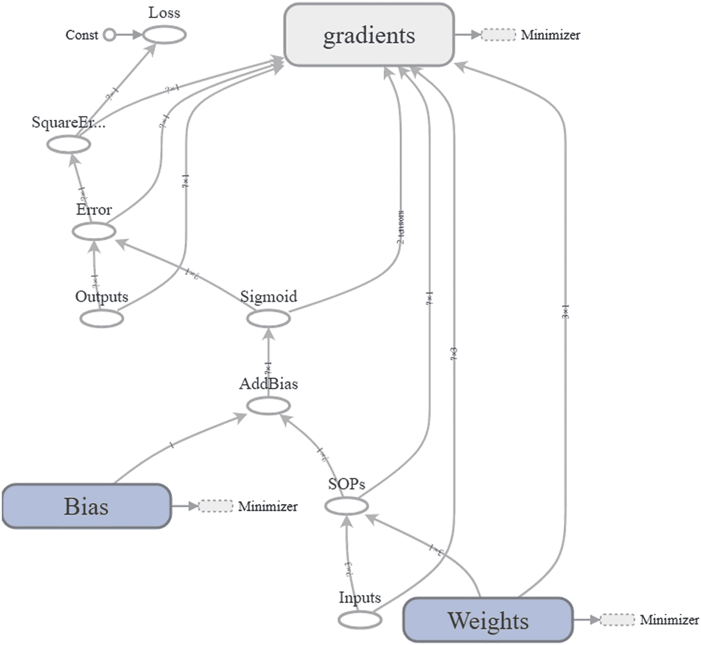

图 6-10

单层人工神经网络图

### 非线性分类

现在，我们将构建一个人工神经网络来模拟具有两个输入的 XOR 门的操作。问题的真值表在表 [6-3](#Tab3) 中。因为问题很简单，我们可以把它画成图 [6-11](#Fig11) 来知道类是线性还是非线性可分的。

表 6-3

双输入异或门的真值表

<colgroup><col class="tcol1 align-center"> <col class="tcol2 align-center"> <col class="tcol3 align-center"></colgroup> 
| 

输出

 | 

A

 | 

B

 |
| --- | --- | --- |
| **1** | one | Zero |
| Zero | one |
| **0** | Zero | Zero |
| one | one |

基于该图，很明显，这些类是非线性可分的。因此，我们必须使用隐藏层。根据第三章[第](3.html)的**节设计 ANN** 中的第一个例子，我们知道只有两个神经元的单个隐藏层就足够了。

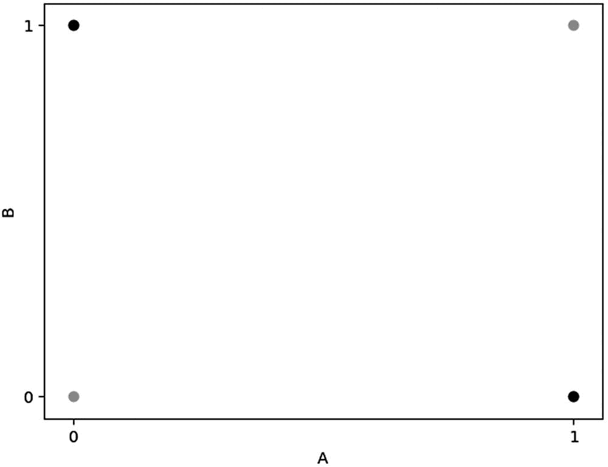

图 6-11

双输入异或门图形

网络架构如图 [6-12](#Fig12) 所示。该隐藏层接受来自输入层的输入。基于它的权重和偏差，它的两个激活函数将产生两个输出。隐藏层的输出将被视为输出层的输入。使用它的激活函数，输出层产生输入样本的最终期望类。

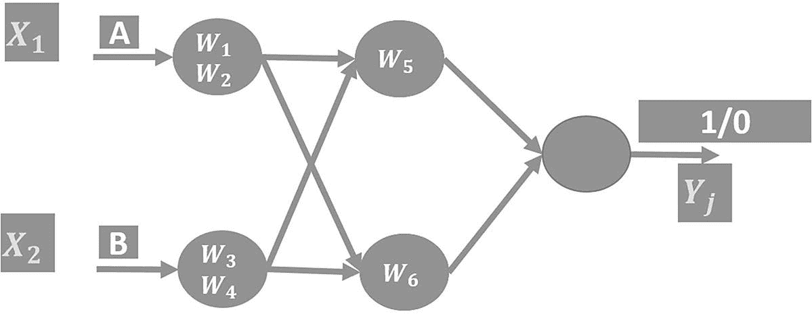

图 6-12

双输入异或门的网络结构

完整的代码在清单 [6-24](#PC45) 中。与上一个示例相比，有一些变化。使用“tensorflow.truncated_normal()”操作随机生成初始参数。隐藏层的输出张量“hidden_sigmoid”被用作输出层的输入。输出层的输出张量就是预测输出。剩下的代码类似于前面的例子。

```py
import tensorflow

# Preparing a placeholder for the training data inputs of shape (N, 3)
training_inputs = tensorflow.placeholder(shape=[4, 2], dtype=tensorflow.float32, name="Inputs")

# Preparing a placeholder for the training data outputs of shape (N, 1)
training_outputs = tensorflow.placeholder(shape=[4, 1], dtype=tensorflow.float32, name="Outputs")

# Initializing the weights of the hidden layer of shape (2, 2)
hidden_weights = tensorflow.Variable(initial_value=tensorflow.truncated_normal(shape=(2,2), name="HiddenRandomWeights"), dtype=tensorflow.float32, name="HiddenWeights")

# Initializing the bias of the hidden layer of shape (1,2)
hidden_bias = tensorflow.Variable(initial_value=tensorflow.truncated_normal(shape=(1,2), name="HiddenRandomBias"), dtype=tensorflow.float32, name="HiddenBias")

# Calculating the SOPs by multiplying the weights matrix of the hidden layer by the data inputs matrix
hidden_sop = tensorflow.matmul(a=training_inputs, b=hidden_weights, name="HiddenSOPs")

# Adding the bias to the SOPs of the hidden layer
hidden_sop_bias = tensorflow.add(x=hidden_sop, y=hidden_bias, name="HiddenAddBias")

# Sigmoid activation function of the hidden layer outputs
hidden_sigmoid = tensorflow.nn.sigmoid(x=hidden_sop_bias, name="HiddenSigmoid")

# Initializing the weights of the output layer of shape (2, 1)
output_weights = tensorflow.Variable(initial_value=tensorflow.truncated_normal(shape=(2,1), name="OutputRandomWeights"), dtype=tensorflow.float32, name="OutputWeights")

# Initializing the bias of the output layer of shape (1,1)
output_bias = tensorflow.Variable(initial_value=tensorflow.truncated_normal(shape=(1,1), name="OutputRandomBias"), dtype=tensorflow.float32, name="OutputBias")

# Calculating the SOPs by multiplying the weights matrix of the hidden layer by the outputs of the hidden layer
output_sop = tensorflow.matmul(a=hidden_sigmoid, b=output_weights, name="Output_SOPs")

# Adding the bias to the SOPs of the hidden layer
output_sop_bias = tensorflow.add(x=output_sop, y=output_bias, name="OutputAddBias")

# Sigmoid activation function of the output layer outputs. These are the predictions.
predictions = tensorflow.nn.sigmoid(x=output_sop_bias, name="OutputSigmoid")

# Calculating the difference (error) between the ANN predictions and the correct outputs
error = tensorflow.subtract(x=training_outputs, y=predictions, name="Error")

# Square error.
square_error = tensorflow.square(x=error, name="SquareError")

# Measuring the prediction error of the network after being trained
loss = tensorflow.reduce_sum(square_error, name="Loss")

# Minimizing the prediction error using gradient descent optimizer
train_optim = tensorflow.train.GradientDescentOptimizer(learning_rate=0.01, name="GradientDescent")
minimizer = train_optim.minimize(loss, name="Minimizer")

# Training data inputs of shape (4, 2)
training_inputs_data = [[1, 0],
                        [0, 1],
                        [0, 0],
                        [1, 1]]

# Training data desired outputs
training_outputs_data = [[1.0],
                         [1.0],
                         [0.0],
                         [0.0]]

# Creating a TensorFlow Session
with tensorflow.Session() as sess:
    writer = tensorflow.summary.FileWriter(logdir="\\AhmedGad\\TensorBoard\\", graph=sess.graph)
    # Initializing the TensorFlow Variables (weights and bias)
    init = tensorflow.global_variables_initializer()
    sess.run(init)

    # Training loop of the neural network
    for step in range(100000):
        print(sess.run(fetches=minimizer, feed_dict={training_inputs: training_inputs_data, training_outputs: training_outputs_data}))

    # Class scores of training data
    print("Expected Outputs for Train Data:\n", sess.run(fetches=[predictions, hidden_weights, output_weights, hidden_bias, output_bias], feed_dict={training_inputs: training_inputs_data}))

    writer.close()

Listing 6-24The Complete Code for ANN Simulating XOR Gate with Two Inputs

```

完成训练过程后，样本被正确分类。以下是预测的输出:

```py
[[0.96982265],
 [0.96998841],
 [0.0275135],
 [0.0380362]]

```

训练后的网络参数如下:

*   隐藏层权重:[–6.27943468，–4.30125761]，[–6.38489389，–4.31706429]]

*   隐藏层偏差:[[–8.8601017]，[8.70441246]]

*   输出图层权重:[[2.49879336，6.37831974]]

*   输出层偏置:[[–4.06760359]]

图 [6-13](#Fig13) 可视化清单 [6-24](#PC45) 的图形。


图 6-13

模拟双输入异或门的人工神经网络图

## 使用 CNN 的 CIFAR10 识别

我们之前讨论的例子帮助我们学习 TF 的基础知识并建立良好的知识。本节通过使用 TF 构建 CNN 来识别来自 CIFAR10 数据集的图像，扩展了这一知识。

### 准备培训数据

CIFAR10 数据集的二进制数据可从本页下载用于 Python:[`www.cs.toronto.edu/~kriz/cifar.html`](http://www.cs.toronto.edu/%257Ekriz/cifar.html)。该数据集有 60，000 幅图像，分为训练集和测试集。有五个包含训练数据的二进制文件，其中每个文件有 10，000 个图像。图像是 32×32×3 大小的 RGB。训练文件被命名为“数据 _ 批处理 _1”、“数据 _ 批处理 _2”等等。有一个名为“test_batch”的测试数据文件，包含 10，000 个图像。有一个名为“batches.meta”的元数据文件，提供了数据集的详细信息，如类标签，即飞机、汽车、鸟、猫、鹿、狗、青蛙、马、船和卡车。

因为数据集中的每个文件都是二进制的，所以我们必须对其进行解码，以便检索实际的图像数据。为了完成这项工作，创建了一个名为“unpickle_patch”的函数，如清单 [6-25](#PC47) 中所定义。

```py
def unpickle_patch(file):
    patch_bin_file = open(file, 'rb')#Reading the binary file.
    patch_dict = pickle.load(patch_bin_file, encoding="bytes")#Loading the details of the binary file into a dictionary.
    return patch_dict#Returning the dictionary.

Listing 6-25Decoding the CIFAR10 Binary Data

```

该方法接受二进制文件路径，并将有关该文件的详细信息返回到“patch_dict”字典中。除了它们的类别标签之外，字典还具有文件中所有 10，000 个样本的图像数据。

有五个训练数据文件。为了解码整个训练数据，创建了一个名为“get_dataset_images”的新函数，如清单 [6-26](#PC48) 所示。该函数接受数据集路径，只对五个训练文件的数据进行解码。首先，它使用“os.listdir()”函数列出数据集目录下的所有文件。所有文件名都返回到“文件名”列表中。

因为所有的训练和测试文件都位于同一个目录中，所以这个函数过滤这个路径下的文件，只返回训练文件。该函数使用“if”语句仅返回以“data_batch_”开头的文件，因为它区别于训练文件名。请注意，测试数据是在构建和训练 CNN 之后准备的。

```py
def get_dataset_images(dataset_path, im_dim=32, num_channels=3):
    num_files = 5#Number of training binary files in the CIFAR10 dataset.
    images_per_file = 10000#Number of samples within each binary file.
    files_names = os.listdir(patches_dir)#Listing the binary files in the dataset path.

    dataset_array = numpy.zeros(shape=(num_files * images_per_file, im_dim, im_dim, num_channels))
    dataset_labels = numpy.zeros(shape=(num_files * images_per_file), dtype=numpy.uint8)

    index = 0#Index variable to count number of training binary files being processed.
    for file_name in files_names:
        if file_name[0:len(file_name) - 1] == "data_batch_":
            print("Working on : ", file_name)
            data_dict = unpickle_patch(dataset_path+file_name)

            images_data = data_dict[b"data"]
            #Reshaping all samples in the current binary file to be of 32x32x3 shape.
            images_data_reshaped = numpy.reshape(images_data, newshape=(len(images_data), im_dim, im_dim, num_channels))
            #Appending the data of the current file after being reshaped.
            dataset_array[index * images_per_file:(index + 1) * images_per_file, :, :, :] = images_data_reshaped
            #Appending the labels of the current file.
            dataset_labels[index * images_per_file:(index + 1) * images_per_file] = data_dict[b"labels"]
            index = index + 1#Incrementing the counter of the processed training files by 1 to accept new file.
    return dataset_array, dataset_labels#Returning the training input data and output labels.

Listing 6-26Decoding All Training Files

```

每个训练文件通过调用“unpickle_patch”函数进行解码，其图像数据和它们的标签被返回到“data_dict”字典中。有五个训练文件，因此这样一个函数有五个类，其中每个调用返回一个字典。

基于该函数返回的字典，“get_dataset_images”函数将所有文件的细节(图像数据和类标签)连接成一个 NumPy 数组。可以使用“data”键从该字典中检索图像数据，并将其存储到“dataset _ array”NumPy 数组中，该数组存储所有训练文件中的所有解码图像。使用“labels”键检索类标签，并将其返回到“dataset _ labels”NumPy 数组中，该数组存储训练数据中所有图像的所有标签。函数返回“数据集数组”和“数据集标签”。

解码时，每个图像的数据返回为长度为 32×32×3=3，072 像素的 1D 向量。这个向量应该被重新塑造成三维的原始形状。这是因为在 TF 中创建的 CNN 层接受这个形状的图像。因此,“get_dataset_images”函数具有接受数据集图像的每个维度的大小的参数。第一个是“im_dim ”,表示行数/列数(它们相等),此外还有“num_channels ”,表示通道数。

在准备好训练数据之后，我们可以使用 TF 来建立和训练 CNN 模型。

### 构建 CNN

CNN 的数据流图是在名为“create_CNN”的函数中创建的，如清单 [6-27](#PC49) 所示。它创建卷积(conv)、ReLU、最大池化、压差和 FC 层的堆栈。CNN 的架构如图 [6-14](#Fig14) 所示。它有三个 conv-relu-pool 组，后面是一个脱离层，最后是两个 FC 层。


图 6-14

CNN 架构

该函数返回最后 FC 层的结果。通常，每一层的输出都是下一层的输入。这要求相邻层的输出和输入的大小一致。请注意，对于每个 conv、ReLU 和 max 池层，需要指定一些参数，例如每个维度的跨度和填充。

```py
def create_CNN(input_data, num_classes, keep_prop):
    filters1, conv_layer1 = create_conv_layer(input_data=input_data, filter_size=7, num_filters=4)
    relu_layer1 = tensorflow.nn.relu(conv_layer1)
    max_pooling_layer1 = tensorflow.nn.max_pool(value=relu_layer1,
                                                ksize=[1, 2, 2, 1],
                                                strides=[1, 1, 1, 1],
                                                padding="VALID")

    filters2, conv_layer2 = create_conv_layer(input_data=max_pooling_layer1, filter_size=5, num_filters=3)
    relu_layer2 = tensorflow.nn.relu(conv_layer2)
    max_pooling_layer2 = tensorflow.nn.max_pool(value=relu_layer2,
                                                ksize=[1, 2, 2, 1],
                                                strides=[1, 1, 1, 1],
                                                padding="VALID")

    filters3, conv_layer3 = create_conv_layer(input_data=max_pooling_layer2, filter_size=3, num_filters=2)
    relu_layer3 = tensorflow.nn.relu(conv_layer3)
    max_pooling_layer3 = tensorflow.nn.max_pool(value=relu_layer3,
                                                ksize=[1, 2, 2, 1],
                                                strides=[1, 1, 1, 1],
                                                padding="VALID")

    flattened_layer = dropout_flatten_layer(previous_layer=max_pooling_layer3, keep_prop=keep_prop)

    fc_result1 = fc_layer(flattened_layer=flattened_layer, num_inputs=flattened_layer.get_shape()[1:].num_elements(),
                          num_outputs=200)

    fc_result2 = fc_layer(flattened_layer=fc_result1, num_inputs=fc_result1.get_shape()[1:].num_elements(),
                          num_outputs=num_classes)
    print("Fully connected layer results : ", fc_result2)
    return fc_result2#Returning the result of the last FC layer.

Listing 6-27Building the CNN Structure

```

CNN 的第一层直接处理输入数据。因此，“create_CNN”函数接受输入数据作为名为“input_data”的输入参数。这些数据是由“get_dataset_images”函数返回的。第一层是卷积层，根据清单 [6-28](#PC50) 使用“创建 conv 层”功能创建。

“创建 conv 图层”函数接受输入数据、过滤器大小和过滤器数量。它返回输入数据与一组过滤器卷积的结果。该组中的滤波器根据输入数据的通道数量来设置其深度。因为通道数是 NumPy 数组中的最后一个元素，所以 index–1 用于返回通道数。这组过滤器被返回到“过滤器”变量中。

```py
def create_conv_layer(input_data, filter_size, num_filters):
    filters = tensorflow.Variable(tensorflow.truncated_normal(shape=(filter_size, filter_size, tensorflow.cast(input_data.shape[-1], dtype=tensorflow.int32), num_filters), stddev=0.05))

    conv_layer = tensorflow.nn.conv2d(input=input_data,
                                      filter=filters,
                                      strides=[1, 1, 1, 1],
                                      padding="VALID")
    return filters, conv_layer#Returning the filters and the convolution layer result.

Listing 6-28Building Convolution Layer

```

卷积层是通过指定输入数据、过滤器和沿四个维度中的每一个维度的步长以及对“tensorflow.nn.conv2D”操作的填充来构建的。填充值“有效”意味着根据过滤器大小，输入图像的某些边界将在结果中丢失。

任何 conv 图层的结果都会被输入到使用“tensorflow.nn.relu”操作创建的 ReLU 图层中。它接受 conv 图层输出，并在应用 ReLU 激活函数后返回相同数量要素的张量。请记住，激活函数有助于创建输入和输出之间的非线性关系。ReLU 层的结果随后被提供给使用“tensorflow.nn.max_pool”操作创建的最大池层。请记住，共享层的目标是使识别转换不变。

“create_CNN”函数接受一个名为“keep_prop”的参数，该参数表示保留脱落层中神经元的概率，这有助于避免过拟合。dropout 层是使用“dropout_flatten_layer”函数实现的，如清单 [6-29](#PC51) 所示。此函数返回用作 FC 层输入的展平数组。

```py
def dropout_flatten_layer(previous_layer, keep_prop):
    dropout = tensorflow.nn.dropout(x=previous_layer, keep_prob=keep_prop)
    num_features = dropout.get_shape()[1:].num_elements()
    layer = tensorflow.reshape(previous_layer, shape=(-1, num_features))#Flattening the results.
    return layer

Listing 6-29Building Dropout Layer

```

因为最后一个 FC 层的输出神经元的数量应该等于数据集类的数量，所以数据集类的数量被用作“create_CNN”函数的另一个名为“num_classes”的输入参数。使用“fc_layer”函数创建 FC 层，根据清单 [6-30](#PC52) 定义。此函数接受丢弃层的展平结果、展平结果中的要素数量以及 FC 层的输出神经元数量。基于输入和输出的数量，名为“fc_weights”的张量表示所创建的 fc 层的权重。它与展平层相乘，得到 FC 层的返回结果。

```py
def fc_layer(flattened_layer, num_inputs, num_outputs):
    fc_weights = tensorflow.Variable(tensorflow.truncated_normal(shape=(num_inputs, num_outputs), stddev=0.05))
    fc_result1 = tensorflow.matmul(flattened_layer, fc_weights)
    return fc_result1#Output of the FC layer (result of matrix multiplication).

Listing 6-30Building FC Layer

```

使用 TB 可视化后的计算图形如图 [6-15](#Fig15) 所示。a 部分给出了 CNN 的架构，直到最后的 max 池层，而 b 部分显示了剩余的步骤。

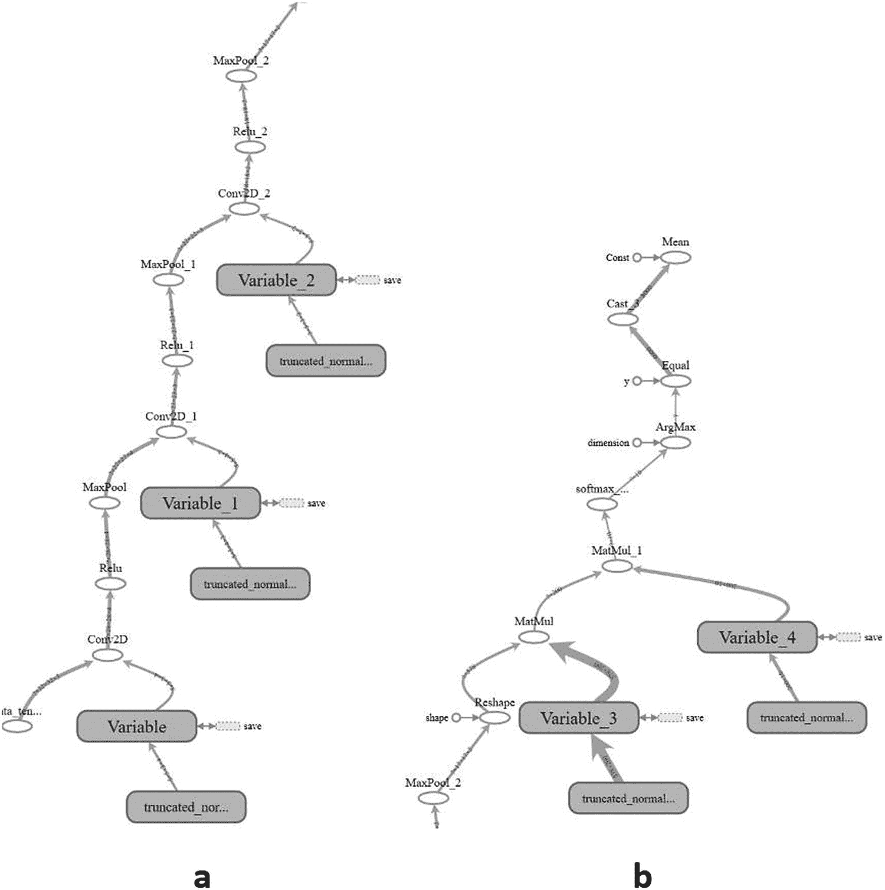

图 6-15

用于分类 CIFAR10 数据集的 CNN 图表

### 训练 CNN

在构建了 CNN 的计算图之后，接下来是针对先前准备的训练数据来训练它。根据清单 [6-31](#PC53) 进行培训。代码从准备数据集和数据占位符的路径开始。请注意，路径应该更改为适合您的系统。然后它调用前面讨论过的函数。被训练的 CNN 的预测被用于测量网络的成本，该成本将使用 GD 优化器被最小化。一些张量有描述性的名称，以便以后测试 CNN 时更容易检索它们。

```py
#Number of classes in the dataset. Used to specify the number of outputs in the last fully connected layer.
num_dataset_classes = 10
#Number of rows & columns in each input image. The image is expected to be rectangular Used to reshape the images and specify the input tensor shape.
im_dim = 32
#Number of channels in each input image. Used to reshape the images and specify the input tensor shape.
num_channels = 3

#Directory at which the training binary files of the CIFAR10 dataset are saved.
patches_dir = "\\AhmedGad\\cifar-10-python\\cifar-10-batches-py\\"

#Reading the CIFAR10 training binary files and returning the input data and output labels. Output labels are used to test the CNN prediction accuracy.
dataset_array, dataset_labels = get_dataset_images(dataset_path=patches_dir, im_dim=im_dim, num_channels=num_channels)
print("Size of data : ", dataset_array.shape)

# Input tensor to hold the data read in the preceding. It is the entry point of the computational graph.
# The given name of 'data_tensor' is useful for retrieving it when restoring the trained model graph for testing.

data_tensor = tensorflow.placeholder(tensorflow.float32, shape=[None, im_dim, im_dim, num_channels], name="data_tensor")

# Tensor to hold the outputs label.
# The name "label_tensor" is used for accessing the tensor when testing the saved trained model after being restored.

label_tensor = tensorflow.placeholder(tensorflow.float32, shape=[None], name="label_tensor")

#The probability of dropping neurons in the dropout layer. It is given a name for accessing it later.
keep_prop = tensorflow.Variable(initial_value=0.5, name="keep_prop")

#Building the CNN architecture and returning the last layer which is the fully connected layer.

fc_result2 = create_CNN(input_data=data_tensor, num_classes=num_dataset_classes, keep_prop=keep_prop)

# Predictions propabilities of the CNN for each training sample.
# Each sample has a probability for each of the 10 classes in the dataset.
# Such a tensor is given a name for accessing it later.

softmax_propabilities = tensorflow.nn.softmax(fc_result2, name="softmax_probs")

# Predictions labels of the CNN for each training sample.
# The input sample is classified as the class of the highest probability.
# axis=1 indicates that maximum of values in the second axis is to be returned. This returns that maximum class probability of each sample.

softmax_predictions = tensorflow.argmax(softmax_propabilities, axis=1)

#Cross entropy of the CNN based on its calculated propabilities.
cross_entropy = tensorflow.nn.softmax_cross_entropy_with_logits(logits=tensorflow.reduce_max(input_tensor=softmax_propabilities, reduction_indices=[1]), labels=label_tensor)

#Summarizing the cross entropy into a single value (cost) to be minimized by the learning algorithm.
cost = tensorflow.reduce_mean(cross_entropy)
#Minimizing the network cost using the Gradient Descent optimizer with a learning rate is 0.01.
error = tensorflow.train.GradientDescentOptimizer(learning_rate=.01).minimize(cost)

#Creating a new TensorFlow Session to process the computational graph.
sess = tensorflow.Session()
#Writing summary of the graph to visualize it using TensorBoard.
tensorflow.summary.FileWriter(logdir="\\AhmedGad\\TensorBoard\\", graph=sess.graph)
#Initializing the variables of the graph.
sess.run(tensorflow.global_variables_initializer())

# Because it may be impossible to feed the complete data to the CNN on normal machines, it is recommended to split the data into a number of patches.
# A subset of the training samples is used to create each path. Samples for each path can be randomly selected.

num_patches = 5#Number of patches
for patch_num in numpy.arange(num_patches):
    print("Patch : ", str(patch_num))
    percent = 80 #percent of samples to be included in each path.

    #Getting the input-output data of the current path.
    shuffled_data, shuffled_labels = get_patch(data=dataset_array, labels=dataset_labels, percent=percent)

    #Data required for cnn operation. 1)Input Images, 2)Output Labels, and 3)Dropout probability
    cnn_feed_dict = {data_tensor: shuffled_data,
                     label_tensor: shuffled_labels,
                     keep_prop: 0.5}

# Training the CNN based on the current patch.
# CNN error is used as input in the run to minimize it.
# SoftMax predictions are returned to compute the classification accuracy.

    softmax_predictions_, _ = sess.run([softmax_predictions, error], feed_dict=cnn_feed_dict)
    #Calculating number of correctly classified samples.
    correct = numpy.array(numpy.where(softmax_predictions_ == shuffled_labels))
    correct = correct.size
    print("Correct predictions/", str(percent * 50000/100), ' : ', correct)

#Closing the session
sess.close()

Listing 6-31Training

CNN

```

不是将整个训练数据提供给 CNN，而是返回数据的一个子集。这有助于将数据调整到可用的内存量。根据清单 [6-32](#PC54) ，使用“get_patch”函数返回子集。该函数接受输入数据、标签和从数据中返回的样本百分比。然后，它根据指定的百分比返回数据的子集。

```py
def get_patch(data, labels, percent=70):
    num_elements = numpy.uint32(percent*data.shape[0]/100)
    shuffled_labels = labels#Temporary variable to hold the data after being shuffled.
    numpy.random.shuffle(shuffled_labels)#Randomly reordering the labels.

    return data[shuffled_labels[:num_elements], :, :, :], shuffled_labels[:num_elements]

Listing 6-32Splitting Dataset into Patches

```

### 保存已训练的模型

根据清单 [6-33](#PC55) ，在训练 CNN 后，保存该模型以备以后测试使用。您还应该更改保存模型的路径，以适合您的系统。

```py
#Saving the model after being trained.
saver = tensorflow.train.Saver()
save_model_path = "\\AhmedGad\\model\\"
save_path = saver.save(sess=sess, save_path=save_model_path+"model.ckpt")
print("Model saved in : ", save_path)

Listing 6-33Saving the Trained CNN Model

```

### 构建和训练 CNN 的完整代码

在完成了从读取数据到保存训练模型的项目的所有部分后，图 [6-16](#Fig16) 给出了步骤的总结。清单 [6-34](#PC56) 给出了训练 CNN 的完整代码。保存训练好的模型后，它将用于预测测试数据的类别标签。

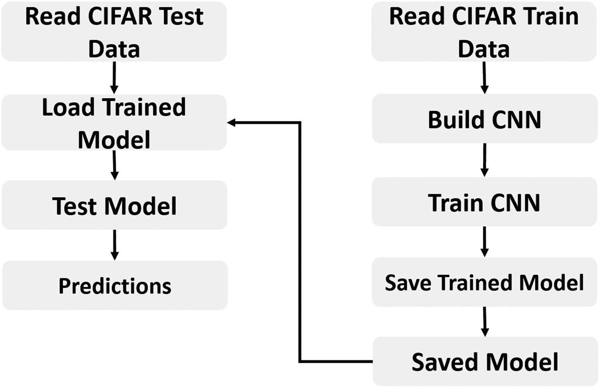

图 6-16

构建使用 CIFAR10 数据集训练的 CNN 的步骤总结

```py
import pickle
import tensorflow
import numpy
import matplotlib.pyplot
import scipy.misc
import os

def get_dataset_images(dataset_path, im_dim=32, num_channels=3):
    """
    This function accepts the dataset path, reads the data, and returns it after being reshaped to match the requirements of the CNN.
    :param dataset_path:Path of the CIFAR10 dataset binary files.
    :param im_dim:Number of rows and columns in each image. The image is expected to be rectangular.
    :param num_channels:Number of color channels in the image.
    :return:Returns the input data after being reshaped and output labels.
    """
    num_files = 5#Number of training binary files in the CIFAR10 dataset.
    images_per_file = 10000#Number of samples within each binary file.
    files_names = os.listdir(patches_dir)#Listing the binary files in the dataset path.
# Creating an empty array to hold the entire training data after being reshaped. The dataset has 5 binary files holding the data. Each binary file has 10,000 samples. Total number of samples in the dataset is 5*10,000=50,000.
# Each sample has a total of 3,072 pixels. These pixels are reshaped to form a RGB image of shape 32x32x3.
# Finally, the entire dataset has 50,000 samples and each sample of shape 32x32x3 (50,000x32x32x3).
    dataset_array = numpy.zeros(shape=(num_files * images_per_file, im_dim, im_dim, num_channels))
    #Creating an empty array to hold the labels of each input sample. Its size is 50,000 to hold the label of each sample in the dataset.
    dataset_labels = numpy.zeros(shape=(num_files * images_per_file), dtype=numpy.uint8)
    index = 0#Index variable to count number of training binary files being processed.
    for file_name in files_names:
# Because the CIFAR10 directory does not only contain the desired training files and has some  other files, it is required to filter the required files. Training files start by 'data_batch_' which is used to test whether the file is for training or not.
        if file_name[0:len(file_name) - 1] == "data_batch_":
            print("Working on : ", file_name)
# Appending the path of the binary files to the name of the current file.
# Then the complete path of the binary file is used to decoded the file and return the actual pixels values.
            data_dict = unpickle_patch(dataset_path+file_name)
# Returning the data using its key 'data' in the dictionary.
# Character b is used before the key to tell it is binary string.
            images_data = data_dict[b"data"]
            #Reshaping all samples in the current binary file to be of 32x32x3 shape.
            images_data_reshaped = numpy.reshape(images_data, newshape=(len(images_data), im_dim, im_dim, num_channels))
            #Appending the data of the current file after being reshaped.
            dataset_array[index * images_per_file:(index + 1) * images_per_file, :, :, :] = images_data_reshaped
            #Appending the labels of the current file.
            dataset_labels[index * images_per_file:(index + 1) * images_per_file] = data_dict[b"labels"]
            index = index + 1#Incrementing the counter of the processed training files by 1 to accept new file.
    return dataset_array, dataset_labels#Returning the training input data and output labels.

def unpickle_patch(file):
    """
    Decoding the binary file.
    :param file:File path to decode its data.
    :return: Dictionary of the file holding details including input data and output labels.
    """
    patch_bin_file = open(file, 'rb')#Reading the binary file.
    patch_dict = pickle.load(patch_bin_file, encoding="bytes")#Loading the details of the binary file into a dictionary.
    return patch_dict#Returning the dictionary.

def get_patch(data, labels, percent=70):
    """
    Returning patch to train the CNN.
    :param data: Complete input data after being encoded and reshaped.
    :param labels: Labels of the entire dataset.
    :param percent: Percent of samples to get returned in each patch.
    :return: Subset of the data (patch) to train the CNN model.
    """
    #Using the percent of samples per patch to return the actual number of samples to get returned.
    num_elements = numpy.uint32(percent*data.shape[0]/100)
    shuffled_labels = labels#Temporary variable to hold the data after being shuffled.
    numpy.random.shuffle(shuffled_labels)#Randomly reordering the labels.
# The previously specified percent of the data is returned starting from the beginning until meeting the required number of samples.
# The labels indices are also used to return their corresponding input images samples.
    return data[shuffled_labels[:num_elements], :, :, :], shuffled_labels[:num_elements]

def create_conv_layer(input_data, filter_size, num_filters):
    """
    Builds the CNN convolution (conv) layer.
    :param input_data:patch data to be processed.
    :param filter_size:#Number of rows and columns of each filter. It is expected to have a rectangular filter.
    :param num_filters:Number of filters.
    :return:The last fully connected layer of the network.
    """
# Preparing the filters of the conv layer by specifying  its shape.
# Number of channels in both input image and each filter must match.
# Because number of channels is specified in the shape of the input image as the last value, index of -1 works fine.
    filters = tensorflow.Variable(tensorflow.truncated_normal(shape=(filter_size, filter_size, tensorflow.cast(input_data.shape[-1], dtype=tensorflow.int32), num_filters), stddev=0.05))
    print("Size of conv filters bank : ", filters.shape)

# Building the convolution layer by specifying the input data, filters, strides along each of the 4 dimensions, and the padding.
# Padding value of 'VALID' means the some borders of the input image will be lost in the result based on the filter size.
    conv_layer = tensorflow.nn.conv2d(input=input_data,
                                      filter=filters,
                                      strides=[1, 1, 1, 1],
                                      padding="VALID")
    print("Size of conv result : ", conv_layer.shape)
    return filters, conv_layer#Returning the filters and the convolution layer result.

def create_CNN(input_data, num_classes, keep_prop):
    """
    Builds the CNN architecture by stacking conv, relu, pool, dropout, and fully connected layers.
    :param input_data:patch data to be processed.
    :param num_classes:Number of classes in the dataset. It helps to determine the number of outputs in the last fully connected layer.
    :param keep_prop:probability of keeping neurons in the dropout layer.
    :return: last fully connected layer.
    """
    #Preparing the first convolution layer.
    filters1, conv_layer1 = create_conv_layer(input_data=input_data, filter_size=7, num_filters=4)
# Applying ReLU activation function over the conv layer output.
# It returns a new array of the same shape as the input array.
    relu_layer1 = tensorflow.nn.relu(conv_layer1)
    print("Size of relu1 result : ", relu_layer1.shape)
# Max-pooling is applied to the ReLU layer result to achieve translation invariance. It returns a new array of a different shape from the input array relative to the strides and kernel size used.
    max_pooling_layer1 = tensorflow.nn.max_pool(value=relu_layer1,
                                                ksize=[1, 2, 2, 1],
                                                strides=[1, 1, 1, 1],
                                                padding="VALID")
    print("Size of maxpool1 result : ", max_pooling_layer1.shape)

    #Similar to the previous conv-relu-pool layers, new layers are just stacked to complete the CNN architecture.
    #Conv layer with 3 filters and each filter is of size 5x5.
    filters2, conv_layer2 = create_conv_layer(input_data=max_pooling_layer1, filter_size=5, num_filters=3)
    relu_layer2 = tensorflow.nn.relu(conv_layer2)
    print("Size of relu2 result : ", relu_layer2.shape)
    max_pooling_layer2 = tensorflow.nn.max_pool(value=relu_layer2,
                                                ksize=[1, 2, 2, 1],
                                                strides=[1, 1, 1, 1],
                                                padding="VALID")
    print("Size of maxpool2 result : ", max_pooling_layer2.shape)

    #Conv layer with 2 filters and a filter size of 5x5.
    filters3, conv_layer3 = create_conv_layer(input_data=max_pooling_layer2, filter_size=3, num_filters=2)
    relu_layer3 = tensorflow.nn.relu(conv_layer3)
    print("Size of relu3 result : ", relu_layer3.shape)
    max_pooling_layer3 = tensorflow.nn.max_pool(value=relu_layer3,
                                                ksize=[1, 2, 2, 1],
                                                strides=[1, 1, 1, 1],
                                                padding="VALID")
    print("Size of maxpool3 result : ", max_pooling_layer3.shape)

    #Adding dropout layer before the fully connected layers to avoid overfitting.
    flattened_layer = dropout_flatten_layer(previous_layer=max_pooling_layer3, keep_prop=keep_prop)

    #First fully connected (FC) layer. It accepts the result of the dropout layer after being flattened (1D).
    fc_result1 = fc_layer(flattened_layer=flattened_layer, num_inputs=flattened_layer.get_shape()[1:].num_elements(),
                          num_outputs=200)
    #Second fully connected layer accepting the output of the previous fully connected layer. Number of outputs is equal to the number of dataset classes.
    fc_result2 = fc_layer(flattened_layer=fc_result1, num_inputs=fc_result1.get_shape()[1:].num_elements(),
                          num_outputs=num_classes)
    print("Fully connected layer results : ", fc_result2)
    return fc_result2#Returning the result of the last FC layer.

def dropout_flatten_layer(previous_layer, keep_prop):
    """
    Applying the dropout layer.
    :param previous_layer: Result of the previous layer to the dropout layer.
    :param keep_prop: Probability of keeping neurons.
    :return: flattened array.
    """
    dropout = tensorflow.nn.dropout(x=previous_layer, keep_prob=keep_prop)
    num_features = dropout.get_shape()[1:].num_elements()
    layer = tensorflow.reshape(previous_layer, shape=(-1, num_features))#Flattening the results.
    return layer

def fc_layer(flattened_layer, num_inputs, num_outputs):
    """
    building a fully connected (FC) layer.
    :param flattened_layer: Previous layer after being flattened.
    :param num_inputs: Number of inputs in the previous layer.
    :param num_outputs: Number of outputs to be returned in such FC layer.
    :return:
    """
    #Preparing the set of weights for the FC layer. It depends on the number of inputs and number of outputs.
    fc_weights = tensorflow.Variable(tensorflow.truncated_normal(shape=(num_inputs, num_outputs), stddev=0.05))
    #Matrix multiplication between the flattened array and the set of weights.
    fc_result1 = tensorflow.matmul(flattened_layer, fc_weights)
    return fc_result1#Output of the FC layer (result of matrix multiplication).

#***********************************************************
#Number of classes in the dataset. Used to specify number of outputs in the last FC layer.
num_dataset_classes = 10
#Number of rows & columns in each input image. The image is expected to be rectangular Used to reshape the images and specify the input tensor shape.
im_dim = 32
# Number of channels in each input image. Used to reshape the images and specify the input tensor shape.
num_channels = 3

#Directory at which the training binary files of the CIFAR10 dataset are saved.
patches_dir = "\\AhmedGad\\cifar-10-python\\cifar-10-batches-py\\"
#Reading the CIFAR10 training binary files and returning the input data and output labels. Output labels are used to test the CNN prediction accuracy.
dataset_array, dataset_labels = get_dataset_images(dataset_path=patches_dir, im_dim=im_dim, num_channels=num_channels)
print("Size of data : ", dataset_array.shape)

# Input tensor to hold the data read in the preceding. It is the entry point of the computational graph.
# The given name of 'data_tensor' is useful for retrieving it when restoring the trained model graph for testing.
data_tensor = tensorflow.placeholder(tensorflow.float32, shape=[None, im_dim, im_dim, num_channels], name="data_tensor")

# Tensor to hold the outputs label.
# The name "label_tensor" is used for accessing the tensor when testing the saved trained model after being restored.
label_tensor = tensorflow.placeholder(tensorflow.float32, shape=[None], name="label_tensor")

#The probability of dropping neurons in the dropout layer. It is given a name for accessing it later.
keep_prop = tensorflow.Variable(initial_value=0.5, name="keep_prop")

#Building the CNN architecture and returning the last layer which is the FC layer.
fc_result2 = create_CNN(input_data=data_tensor, num_classes=num_dataset_classes, keep_prop=keep_prop)

# Predictions propabilities of the CNN for each training sample.
# Each sample has a probability for each of the 10 classes in the dataset.
# Such a tensor is given a name for accessing it later.
softmax_propabilities = tensorflow.nn.softmax(fc_result2, name="softmax_probs")

# Predictions labels of the CNN for each training sample.
# The input sample is classified as the class of the highest probability.
# axis=1 indicates that maximum of values in the second axis is to be returned. This returns that maximum class probability of each sample.
softmax_predictions = tensorflow.argmax(softmax_propabilities, axis=1)

#Cross entropy of the CNN based on its calculated propabilities.
cross_entropy = tensorflow.nn.softmax_cross_entropy_with_logits(logits=tensorflow.reduce_max(input_tensor=softmax_propabilities, reduction_indices=[1]),labels=label_tensor)
#Summarizing the cross entropy into a single value (cost) to be minimized by the learning algorithm.
cost = tensorflow.reduce_mean(cross_entropy)
#Minimizing the network cost using the Gradient Descent optimizer with a learning rate is 0.01.
ops = tensorflow.train.GradientDescentOptimizer(learning_rate=.01).minimize(cost)

#Creating a new TensorFlow Session to process the computational graph.
sess = tensorflow.Session()
#Writing summary of the graph to visualize it using TensorBoard.
tensorflow.summary.FileWriter(logdir="\\AhmedGad\\TensorBoard\\", graph=sess.graph)
#Initializing the variables of the graph.
sess.run(tensorflow.global_variables_initializer())

# Because it may be impossible to feed the complete data to the CNN on normal machines, it is recommended to split the data into a number of patches. A subset of the training samples is used to create each path. Samples for each path can be randomly selected.

num_patches = 5#Number of patches
for patch_num in numpy.arange(num_patches):
    print("Patch : ", str(patch_num))
    percent = 80 #percent of samples to be included in each path.
    #Getting the input-output data of the current path.
    shuffled_data, shuffled_labels = get_patch(data=dataset_array, labels=dataset_labels, percent=percent)
    #Data required for cnn operation. 1)Input Images, 2)Output Labels, and 3)Dropout probability
    cnn_feed_dict = {data_tensor: shuffled_data,
                     label_tensor: shuffled_labels,
                     keep_prop: 0.5}

# Training the CNN based on the current patch.
# CNN error is used as input in the run to minimize it.
# SoftMax predictions are returned to compute the classification accuracy.

    softmax_predictions_, _ = sess.run([softmax_predictions, ops], feed_dict=cnn_feed_dict)
    #Calculating number of correctly classified samples.
    correct = numpy.array(numpy.where(softmax_predictions_ == shuffled_labels))
    correct = correct.size
    print("Correct predictions/", str(percent * 50000/100), ' : ', correct)

#Closing the session
sess.close()

#Saving the model after being trained.
saver = tensorflow.train.Saver()
save_model_path = " \\AhmedGad\\model\\"
save_path = saver.save(sess=sess, save_path=save_model_path+"model.ckpt")
print("Model saved in : ", save_path)

Listing 6-34Complete Code to Train CNN for CIFAR10 Dataset

```

### 准备测试数据

在测试训练好的模型之前，需要准备测试数据并恢复之前训练好的模型。测试数据准备与训练数据类似，只是只有一个二进制文件需要解码。根据清单 [6-35](#PC56) ，根据修改后的“get_dataset_images”函数对测试文件进行解码。请注意，它与用于解码训练数据的函数同名，因为它假设有两个单独的脚本，一个用于训练，另一个用于测试。该函数调用“unpickle_patch”函数，就像之前对训练数据所做的一样。

```py
def get_dataset_images(test_path_path, im_dim=32, num_channels=3):
    data_dict = unpickle_patch(test_path_path)
    images_data = data_dict[b"data"]
    dataset_array = numpy.reshape(images_data, newshape=(len(images_data), im_dim, im_dim, num_channels))
    return dataset_array, data_dict[b"labels"]

Listing 6-35Saving the Trained CNN Model

```

### 测试训练好的 CNN 模型

根据图 [6-16](#Fig16) ，保存的模型将用于预测测试数据的标签。在准备好测试数据并恢复训练好的模型后，我们可以根据清单 [6-36](#PC58) 开始测试模型。值得一提的是，在训练 CNN 时，会话的运行是为了最小化成本。在测试中，我们对最小化成本不再感兴趣，我们只想返回数据样本的预测。这就是为什么 TF 会话通过获取“softmax_propabilities”和“softmax_predictions”张量来仅返回预测。

当图形被恢复时，在训练阶段名为“data_tensor”的张量将被分配测试数据，而名为“label_tensor”的张量将被分配样本标签。

另一个有趣的点是，dropout 层的保持概率“keep_prop”现在设置为 1.0。这意味着不丢弃任何神经元(即使用所有神经元)。这是因为我们只是在决定放弃哪些神经元后才使用预训练模型。现在我们只是使用之前的模型，对任何修改都不感兴趣。

```py
#Dataset path containing the testing binary file to be decoded.
patches_dir = "\\AhmedGad\\cifar-10-python\\cifar-10-batches-py\\"
dataset_array, dataset_labels = get_dataset_images(test_path_path=patches_dir + "test_batch", im_dim=32, num_channels=3)
print("Size of data : ", dataset_array.shape)

sess = tensorflow.Session()

#Restoring the previously saved trained model.
saved_model_path = '\\AhmedGad\\model\\'
saver = tensorflow.train.import_meta_graph(saved_model_path+'model.ckpt.meta')
saver.restore(sess=sess, save_path=saved_model_path+'model.ckpt')

#Initializing the variables.
sess.run(tensorflow.global_variables_initializer())

graph = tensorflow.get_default_graph()

softmax_propabilities = graph.get_tensor_by_name(name="softmax_probs:0")
softmax_predictions = tensorflow.argmax(softmax_propabilities, axis=1)
data_tensor = graph.get_tensor_by_name(name="data_tensor:0")
label_tensor = graph.get_tensor_by_name(name="label_tensor:0")
keep_prop = graph.get_tensor_by_name(name="keep_prop:0")

#keep_prop is equal to 1 because there is no more interest to remove neurons in the testing phase.

feed_dict_testing = {data_tensor: dataset_array,
                     label_tensor: dataset_labels,
                     keep_prop: 1.0}

#Running the session to predict the outcomes of the testing samples.
softmax_propabilities_, softmax_predictions_ = sess.run([softmax_propabilities, softmax_predictions], feed_dict=feed_dict_testing)

#Assessing the model accuracy by counting number of correctly classified samples.
correct = numpy.array(numpy.where(softmax_predictions_ == dataset_labels))
correct = correct.size
print("Correct predictions/10,000 : ", correct)

#Closing the session
sess.close()

Listing 6-36Testing the Trained CNN

```

至此，我们已经成功构建了用于分类 CIFAR10 数据集图像的 CNN 模型。在下一章中，保存的经过训练的 CNN 模型被部署到使用 Flask 创建的 web 服务器上，以供互联网用户访问。