# 七、部署预训练模型

在构建 DL 模型的过程中，创建模型是最难的一步，但它不是终点。为了从创建的模型中获益，用户应该远程访问它们。用户的反馈将有助于改进模型性能。

本章讨论如何在线部署预训练模型以供互联网用户访问。使用 Flask micro web framework，使用 Python 创建 web 应用程序。使用 HTML(超文本标记语言)、CSS(级联样式表)和 JavaScript，构建简单的网页，以允许用户向服务器发送和接收 HTTP(超文本传输协议)请求。用户使用 web 浏览器访问应用程序，并能够将图像上传到服务器。基于部署的模型，图像被分类，并且其类别标签被返回给用户。此外，还创建了一个 Android 应用程序来访问 web 服务器。本章假设读者对 HTML、CSS、JavaScript 和 Android 有基本的了解。读者可以按照此链接中的说明安装烧瓶( [`http://flask.pocoo.org/docs/1.0/installation/`](http://flask.pocoo.org/docs/1.0/installation/) )。

## 应用概述

图 [7-1](#Fig1) 总结了本章的目标应用，它扩展了第 [6](6.html) 章中的步骤:使用 TF 构建 CNN 的数据流图，然后使用 CIFAR10 数据集对其进行训练；最后，保存训练好的模型，为部署做好准备。使用 Flask，可以创建一个监听来自客户端的 HTTP 请求的 web 应用程序。客户端从使用 HTML、CSS 和 JavaScript 创建的网页访问 web 应用程序。

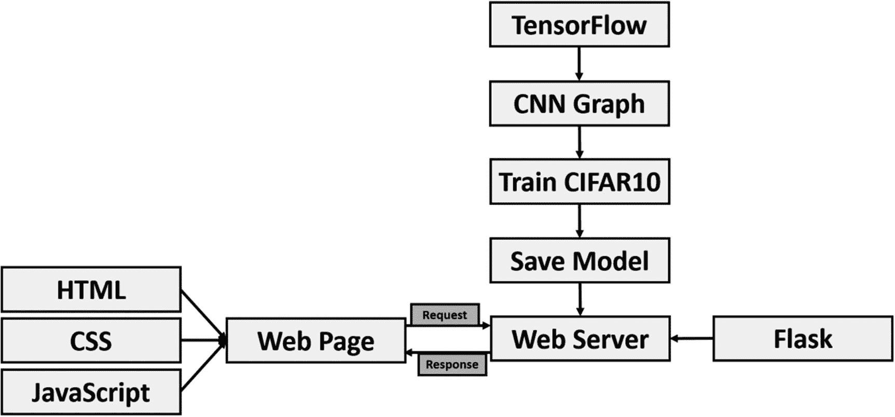

图 7-1

应用程序概述

服务器加载保存的模型，打开一个会话，并等待来自客户端的请求。客户端使用 web 浏览器打开网页，该网页允许将图像上传到服务器进行分类。服务器根据大小确保映像属于 CIFAR10 数据集。之后，将图像输入模型进行分类。由模型预测的标签在对客户端的响应中被返回。最后，客户端在网页上显示标签。为了针对 Android 设备进行定制，创建了向服务器发送 HTTP 请求并接收分类标签的 Android 应用程序。

在这一章中，我们将介绍应用程序中涉及的每个步骤，直到成功完成为止。

## 烧瓶简介

Flask 是一个用于构建 web 应用程序的微框架。尽管是微型的，但它不支持其他框架所支持的一些功能。它被称为“微”，因为它具有构建应用程序所需的核心需求。稍后使用扩展，您可以添加所需的功能。Flask 让用户决定使用什么。例如，它不附带特定的数据库，而是让用户自由选择使用哪个数据库。

Flask 使用 WSGI (Web 服务器网关接口)。WSGI 是服务器处理来自 Python web 应用程序的请求的方式。它被视为服务器和应用程序之间的通信通道。服务器收到请求后，WSGI 处理请求，并将其发送给用 Python 编写的应用程序。WSGI 接收应用程序的响应，并将其返回给服务器。然后，服务器响应客户端。Flask 使用 Werkzeug，这是一个用于实现请求和响应的 SWGI 实用程序。Flask 还使用 jinja2，这是用于构建模板网页的模板引擎，这些网页随后会动态填充数据。

为了开始使用 Flask，让我们根据清单 [7-1](#PC1) 讨论最小 Flask 应用。构建 Flask 应用程序要做的第一件事是从 Flask 类创建一个实例。使用类构造函数创建了`app`实例。构造函数的强制`import_name`参数非常重要。它用于定位应用程序资源。如果在`FlaskApp\firstApp.py`中找到该应用程序，则将该参数设置为`FlaskApp`。例如，如果在应用程序目录下有一个 CSS 文件，则此参数用于定位该文件。

```py
import flask

app = flask.Flask(import_name="FlaskApp")

@app.route(rule="/")
def testFunc():
    return "Hello"

app.run()

Listing 7-1Minimal Flask Application

```

Flask 应用程序由一组函数组成，每个函数都与一个 URL(统一资源定位器)相关联。当客户端导航到一个 URL 时，服务器向应用程序发送请求以响应客户端。应用程序使用与该 URL 相关联的查看功能进行响应。视图函数的返回是呈现在网页上的响应。这就留下了一个问题:我们如何将一个函数与一个 URL 关联起来？幸运的是，答案很简单。

### route()装饰器

首先，该函数是一个可以接受参数的常规 Python 函数。在清单 [7-1](#PC1) 中，函数被调用`testFunc()`，但是还不接受任何参数。它返回字符串`Hello`。这意味着当客户端访问与该函数相关联的 URL 时，字符串`Hello`将呈现在屏幕上。使用`route()`装饰器将 URL 与函数相关联。它被称为“路由”，因为它的工作方式类似于路由器。路由器接收输入消息并决定遵循哪个输出接口。此外，装饰器接收一个输入 URL 并决定调用哪个函数。

`route()`装饰器接受一个名为`rule`的参数，该参数表示与装饰器下面的视图函数相关联的 URL。根据清单[7-1](#PC1),`route()`装饰器将代表主页的 URL `/`关联到名为`testFunc()`的视图函数。

完成这个简单的应用程序后，下一步是通过使用 Flask 类的`run()`方法运行脚本来激活它。运行应用程序的结果如图 [7-2](#Fig2) 所示。根据输出，服务器默认监听 IP(互联网协议)地址`127.0.0.1`，这是一个环回地址。这意味着服务器只是在端口 5000 上侦听来自本地主机的请求。


图 7-2

运行第一个 Flask 应用程序后的控制台输出

当使用网络浏览器访问位于`127.0.0.1:5000/`地址的服务器时，将调用`testFunc()`函数。其输出呈现在网络浏览器上，如图 [7-3](#Fig3) 所示。


图 7-3

访问与`testFunc()`功能相关的 URL

我们可以使用`run()`方法的`host`和`port`参数覆盖 IP 和端口的默认值。覆盖这些参数的默认值后，`run()`方法如下:

```py
app.run(host="127.0.0.5", port=6500)

```

图 [7-4](#Fig4) 显示了将主机设置为`127.0.0.5`并将端口号设置为 6500 后的结果。只要确保没有应用程序正在使用选定的端口。

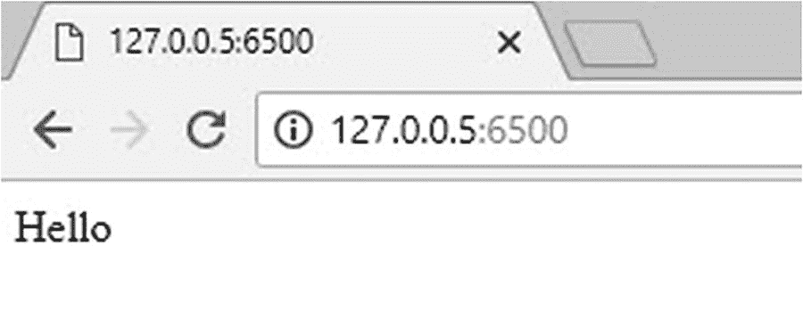

图 7-4

通过覆盖`run()`方法的默认值来监听不同的主机和端口

对于服务器收到的每个请求，HTTP 请求的方法、URL 和响应代码都打印在控制台上。例如，当访问主页时，请求返回 200，这意味着页面被成功定位。访问一个不存在的页面比如`127.0.0.5:6500/abc`会返回 404 作为响应代码，意味着没有找到这个页面。这有助于调试应用程序。


图 7-5

服务器收到的请求

`run()`方法的另一个有用的参数名为`debug`。它是一个布尔参数，用于决定是否打印调试信息。它默认为 False。当这样一个参数被设置为 True 时，我们就不必为代码中的每一个变化重新启动服务器。这在应用程序的开发中非常有用。每次更改后只需保存应用程序的 Python 文件，服务器就会自动重新加载。如图 [7-6](#Fig6) ，服务器开始使用端口号 6500。更改为 6300 后，服务器会自动重新加载以监听新端口。


图 7-6

当调试处于活动状态时，每次更改后自动重新加载服务器

### 添加规则 url 方法

之前，URL 已经使用`route()`装饰器绑定到函数。装饰器在 Flask 类内部调用`add_url_rule()`方法。这个方法和其他的装饰器做同样的工作。我们可以根据清单 [7-2](#PC3) 直接使用这个方法。它像以前一样接受了`rule`参数，但是增加了`view_func`参数。它指定哪个视图功能与该规则相关联。它被设置为函数名，即`testFunc`。当我们使用`route()`装饰器时，函数是隐式已知的。函数正好在装饰器的下面。请注意，对该方法的调用不必正好在函数下面。运行这段代码会返回与之前相同的结果。

```py
import flask

app = flask.Flask(import_name="FlaskApp")

def testFunc():
    return "Hello"
app.add_url_rule(rule="/", view_func=testFunc)

app.run(host="127.0.0.5", port=6300, debug=True)

Listing 7-2Using the add_url_rule() Method

```

### 可变规则

以前的规则是静态的。可以向规则中添加可变部分。它被视为一个参数。可变部分添加在两个尖括号`<>`之间规则的静态部分之后。我们可以修改前面的代码，根据清单 [7-3](#PC4) 接受一个表示名称的变量参数。主页的规则现在是`/<name>`，而不仅仅是`/`。如果客户端导航到 URL `127.0.0.5:6300/Gad`，那么`name`被设置为`Gad`。

```py
import flask

app = flask.Flask(import_name="FlaskApp")

def testFunc(name):
    return "Hello : " + name
app.add_url_rule(rule="/<name>", view_func=testFunc, endpoint="home")

app.run(host="127.0.0.5", port=6300, debug=True)

Listing 7-3Adding Variable Part to the Rule

```

请注意，view 函数中必须有一个参数来接受 URL 的可变部分。因此，`testFunc()`被修改为接受一个与规则中定义的名称相同的参数。函数的返回被修改为也返回参数`name`的值。图 [7-7](#Fig7) 显示了使用变量法则后的结果。改变变量部分，访问主页，就会改变输出。

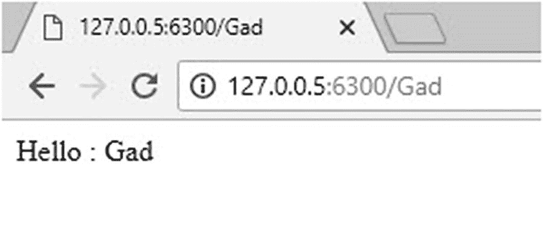

图 7-7

在规则中使用可变部分

可以在规则中使用多个可变部分。根据清单 [7-4](#PC5) ，该规则接受两个参数，代表由`-`分隔的名和姓。

```py
import flask

app = flask.Flask(import_name="FlaskApp")

def testFunc(fname, lname):
    return "Hello : " + fname + " " + lname
app.add_url_rule(rule="/<fname>-<lname>", view_func=testFunc, endpoint="home")

app.run(host="127.0.0.5", port=6300, debug=True)

Listing 7-4Using More Than One Variable Part

```

访问 URL `127.0.0.5:6300/Ahmed-Gad`会将`fname`设置为`Ahmed`，将`lname`设置为`Gad`。结果如图 [7-8](#Fig8) 所示。


图 7-8

规则中有多个可变部分

### 端点

`add_url_rule()`方法接受名为`endpoint`的第三个参数。它是规则的标识符，有助于多次重用同一规则。注意，这个论点也存在于`route()`装饰器中。默认情况下，端点的值被设置为 view 函数。这里有一个场景，其中`endpoint`很重要。

假设网站有两个页面，每个页面分配一个规则。第一条规则是`/`，第二条规则是`/addNums/<num1>-<num2>`。第二页有两个代表两个数字的参数。这些数字加在一起，结果返回到主页进行渲染。清单 [7-5](#PC6) 给出了创建这些规则及其视图功能的代码。给`testFunc()`视图函数一个等于`home`的`endpoint`值。

`add_func()`视图函数接受两个参数，它们是与之相关的规则的可变部分。因为这些参数的值是字符串，所以使用`int()`函数将它们的值转换成整数。然后它们被一起加入到`num3`变量中。这个函数的返回不是数字，而是使用`redirect()`方法重定向到另一个页面。这种方法接受重定向位置。

```py
import flask

app = flask.Flask(import_name="FlaskApp")

def testFunc(result):
    return "Result is : " + result
app.add_url_rule(rule="/<result>", view_func=testFunc, endpoint="home")

def add_func(num1, num2):
    num3 = int(num1) + int(num2)
    return flask.redirect(location=flask.url_for("home", result=num3))
app.add_url_rule(rule="/addNums/<num1>-<num2>", view_func=add_func)

app.run(host="127.0.0.5", port=6300, debug=True)

Listing 7-5Using Endpoint to Redirect Between Pages

```

我们可以简单地使用端点来返回 URL，而不是对 URL 进行硬编码。使用`from_url()`方法从端点返回 URL。除了规则接受的任何变量之外，它还接受规则的端点。因为主页规则接受一个名为`result`的变量，所以我们必须在`from_url()`方法中添加一个名为`result`的参数，并为其赋值。分配给这种变量的值是`num3`。通过导航到 URL `127.0.0.5:6300/addNums/1-2`，数字 1 和 2 相加，结果是 3。该函数然后重定向到主页，在这里规则的`result`变量被设置为等于 3。

使用端点比硬编码 URL 更容易。我们可以简单地将`redirect()`方法的`location`参数赋给规则`/`，但是不推荐这样做。假设主页的 URL 从`/`更改为`/home`，那么我们必须在对主页的每个引用中应用这一更改。而且，假设 URL 很长，比如`127.0.0.5:6300/home/page1`。每次我们需要引用这个 URL 时，都要键入它，这很烦人。端点被视为 URL 的抽象。

证明使用端点重要性的另一个例子是，站点管理员可能决定更改页面的地址。如果页面通过复制和粘贴它的 URL 被多次引用，那么我们必须到处改变 URL。使用端点可以避免这个问题。端点不像 URL 那样频繁更改，因此即使页面的 URL 发生变化，站点也将保持活动状态。请注意，不使用端点进行重定向会使向规则传递可变部分变得困难。

清单 [7-5](#PC6) 中的代码接受从 URL 添加的输入数字。我们可以创建一个简单的 HTML 表单，允许用户输入这些数字。

### HTML 表单

`add_url_rule()`方法(当然还有`route()`装饰器)接受另一个名为`methods`的参数。它接受指定规则响应的 HTTP 方法的列表。该规则可以响应多种类型的方法。

有两种常见的 HTTP 方法:GET 和 POST。GET 方法是默认方法，它发送未加密的数据。POST 方法用于将 HTML 表单数据发送到服务器。让我们创建一个简单的表单，接受两个数字，并将它们发送到 Flask 应用程序进行添加和呈现。

清单 [7-6](#PC7) 给出了创建一个表单的 HTML 代码，该表单除了一个提交类型的输入外，还有两个数字类型的输入。表单方法设置为`post`。海东的网址是 [`http://127.0.0.5:6300/form`](http://127.0.0.5:6300/form) 。该操作表示表单数据将被发送到的页面。有一个规则将该 URL 与一个视图函数相关联，该函数从表单中获取数字，将它们相加，并呈现结果。表单元素的名称非常重要，因为在提交表单后，只有带有 name 属性的元素才会被发送到服务器。元素名称被用作标识符来检索 Flask 应用程序中的元素数据。

```py
<html>
<header>
<title>HTML Form</title>
</header>
<body>

<form method="post" action="http://127.0.0.5:6300/form">
<span>Num1 </span>
<input type="number" name="num1"><br>
<span>Num2 </span>
<input type="number" name="num2"><br>
<input type="submit" name="Add">
</form>

</body>
</html>

Listing 7-6
HTML Form

```

HTML 表单如图 [7-9](#Fig9) 所示。

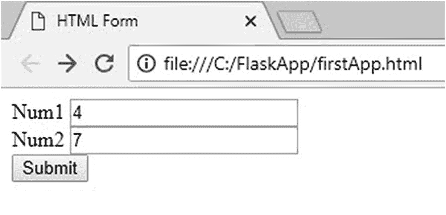

图 7-9

带有两个数字输入的 HTML 表单

提交表单后，清单 [7-7](#PC8) 中的 Flask 应用程序检索表单数据。规则`/form`与`handle_form()`函数相关联。该规则只响应 POST 类型的 HTTP 消息。在函数内部，使用`flask.request.form`字典返回表单元素。每个 HTML 表单元素的名称被用作该对象的索引，以便返回它们的值。例如，名称为`num1`的第一个表单元素的值通过使用`flask.request.form["num1"]`返回。

```py
import flask

app = flask.Flask(import_name="FlaskApp")

def handle_form():
    num1 = flask.request.form["num1"]
    num1 = int(num1)
    num2 = flask.request.form["num2"]
    num2 = int(num2)

    result = num1 + num2
    result = str(result)

    return "Result is : " + result
app.add_url_rule(rule="/form", view_func=handle_form, methods=["POST"])

app.run(host="127.0.0.5", port=6300, debug=True)

Listing 7-7Flask Application to Retrieve the HTML Form Data

```

因为索引`flask.request.form`对象返回的值是一个字符串，所以必须使用`int()`函数将它转换成一个整数。将两个数相加后，它们的结果存储在`result`变量中。这个变量被转换成一个字符串，以便将其值与一个字符串连接起来。连接的字符串由`handle_form`视图函数返回。渲染结果如图 [7-10](#Fig10) 所示。


图 7-10

两个数字 HTML 表单元素相加的结果

### 文件上传

在 Flask 中上传文件非常简单，除了一些变化之外，与前面的例子相似。在 HTML 表单中创建一个类型为`file`的输入。此外，表单加密类型属性`enctype`被设置为`multipart/form-data`。用于上传文件的 HTML 表单的代码如清单 [7-8](#PC9) 所示。表格的截图如图 [7-11](#Fig11) 所示。

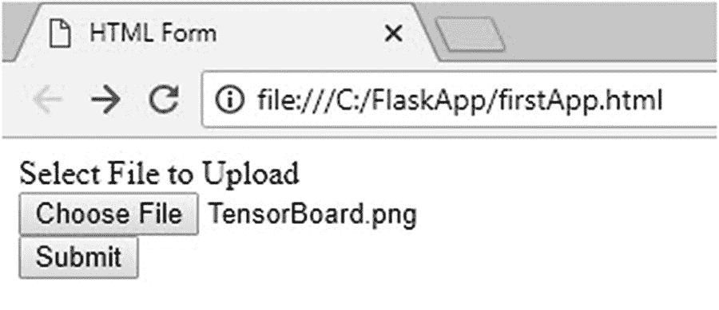

图 7-11

用于上传文件的 HTML 表单

```py
<html>
<header>
<title>HTML Form</title>
</header>
<body>

<form method="post" enctype="multipart/form-data" action="http://127.0.0.5:6300/form">
<span>Select File to Upload</span><br>
<input type="file" name="fileUpload"><br>
<input type="submit" name="Add">
</form>

</body>
</html>

Listing 7-8HTML Form for Uploading a File

```

选择要上传的图像后，它将被发送到根据清单 [7-9](#PC10) 创建的 Flask 应用程序。该规则再次设置为仅响应 POST 类型的 HTTP 消息。之前，我们使用了`flask.request.form`对象来检索数据字段。现在，我们使用`flask.request.files`返回要上传的文件的详细信息。表单输入的名称`fileUpload`被用作该对象的索引，以返回要上传的文件。注意，`flask.request`是一个全局对象，它从客户机 web 页面接收数据。

为了保存文件，使用`filename`属性检索其名称。不建议根据用户提交的文件名保存文件。一些文件名被设置成伤害服务器。为了安全保存文件，使用了`werkzeug.secure_filename()`功能。记得导入`werkzeug`模块。

```py
import flask, werkzeug

app = flask.Flask(import_name="FlaskApp")

def handle_form():
    file = flask.request.files["fileUpload"]
    file_name = file.filename
    secure_file_name = werkzeug.secure_filename(file_name)
    file.save(dst=secure_file_name)

    return "File uploaded successfully."
app.add_url_rule(rule="/form", view_func=handle_form, methods=["POST"])

app.run(host="127.0.0.5", port=6300, debug=True)

Listing 7-9Flask Application to Upload Files to the Server

```

安全文件名返回到`secure_file_name`变量。最后，通过调用`save()`方法永久保存文件。这种方法接受保存文件的目标位置。因为只使用了文件名，所以它将保存在 Flask 应用程序 Python 文件的当前目录中。

### HTML 内部烧瓶应用程序

前一个视图函数的返回输出只是一个显示在 web 页面上的文本，没有任何格式。Flask 支持在 Python 代码中生成 HTML 内容，这有助于更好地呈现结果。清单 [7-10](#PC11) 给出了一个例子，其中`tesFunc()`视图函数的返回结果是 HTML 代码，其中

# 元素呈现结果。数字

[7-12](#Fig12) shows the result.


图 7-12

使用 HTML 代码格式化视图函数的输出

```py
import flask, werkzeug

app = flask.Flask(import_name="FlaskApp")

def testFunc():
    return "<html><body><h1>Hello</h1></body></html>"
app.add_url_rule(rule="/", view_func=testFunc)

app.run(host="127.0.0.5", port=6300, debug=True)

Listing 7-10Generating HTML Inside Python

```

在 Python 代码中生成 HTML 使得调试代码变得困难。最好把 Python 和 HTML 分开。这就是为什么 Flask 支持使用 Jinja2 模板引擎的模板。

#### 烧瓶模板

不是在 Python 文件中键入 HTML 代码，而是创建一个单独的 HTML 文件(即模板)。使用`render_template()`方法在 Python 中呈现这样的模板。HTML 文件被称为模板，因为它不是静态文件。该模板可多次用于不同的数据输入。

为了在 Python 代码中定位 Flask 模板，创建了一个名为`templates`的文件夹来保存所有的 HTML 文件。假设 Flask Python 文件命名为`firstApp.py`，HTML 文件命名为`hello.html`，项目结构如图 [7-13](#Fig13) 所示。在清单 [7-11](#PC12) 中，创建了`hello.html`文件来打印与清单 [7-10](#PC11) 中完全相同的 Hello 消息。


图 7-13

使用模板后的项目结构

```py
<html>
<header>
<title>HTML Template</title>
</header>
<body>

<h1>Hello</h1>

</body>
</html>

Listing 7-11Template to Print Hello Message

```

清单 [7-12](#PC13) 中给出了呈现该模板的 Python 代码。与主页关联的视图函数的返回结果是`render_template()`方法的输出。这个方法接受一个名为`template_name_or_list`的参数来指定模板文件名。请注意，该参数可以接受单个名称或一系列名称。当用多个名称指定一个列表时，将呈现现有的第一个模板。该示例的渲染结果与图 [7-12](#Fig12) 相同。

```py
import flask, werkzeug

app = flask.Flask(import_name="FlaskApp")

def testFunc():
    return flask.render_template(template_name_or_list="hello.html")
app.add_url_rule(rule="/", view_func=testFunc)

app.run(host="127.0.0.5", port=6300, debug=True)

Listing 7-12Python Code to Render an HTML Template

```

#### 动态模板

模板目前是静态的，因为它们每次都以相同的方式呈现。我们可以通过使用可变数据使它们动态化。Jinja2 支持在模板内部添加占位符。在渲染模板时，这些占位符会被评估 Python 表达式的输出所替换。在要打印表达式输出的地方，用`{{...}}`将表达式括起来。清单 [7-13](#PC14) 给出了使用变量`name`的 HTML 代码。

```py
<html>
<header>
<title>HTML Template with an Expression</title>
</header>
<body>

<h1>Hello {{name}}</h1>

</body>
</html>

Listing 7-13HTML Code with an Expression

```

下一步是在根据清单 [7-14](#PC15) 为变量`name`传递值之后呈现模板。要呈现的模板中的变量作为参数与它们的值一起被传递到`render_template`中。访问主页的结果如图 [7-14](#Fig14) 。


图 7-14

用表达式呈现模板的结果

```py
import flask, werkzeug

app = flask.Flask(import_name="FlaskApp")

def testFunc():
    return flask.render_template(template_name_or_list="hello.html", name="Ahmed")
app.add_url_rule(rule="/", view_func=testFunc)

app.run(host="127.0.0.5", port=6300, debug=True)

Listing 7-14Rendering Flask Template with an Expression

```

变量`name`的值是静态类型的，但它可以使用变量规则或 HTML 形式动态生成。清单 [7-15](#PC16) 给出了用于创建接受名称的变量规则的代码。根据规则的变量部分，视图函数必须有一个名为的参数。然后这个参数的值被分配给`render_template()`方法的 name 参数。然后根据图 [7-15](#Fig15) 将该值传递给要渲染的模板。


图 7-15

将从变量规则接收的值传递给 Flask 模板

```py
import flask, werkzeug

app = flask.Flask(import_name="FlaskApp")

def testFunc(name):
    return flask.render_template(template_name_or_list="hello.html", name=name)
app.add_url_rule(rule="/<name>", view_func=testFunc)

app.run(host="127.0.0.5", port=6300, debug=True)

Listing 7-15Variable Rule to Pass Value to Flask Template

```

我们还可以在 HTML 代码中插入 Python 语句、注释和行语句，每个语句都有不同的占位符。语句用``括起来，注释用`{# ... #}`括起来，行语句用`# ... ##`括起来。清单 [7-16](#PC17) 给出了一个例子，其中插入了一个 Python for 循环来打印从 0 到 4 的五个数字，每个数字都在< h1 > HTML 元素中。循环中的每条语句都用``括起来。

Python 使用缩进来定义块。因为 HTML 内部没有缩进，`for`循环的结尾用`endfor`标记。该文件的渲染结果如图 [7-16](#Fig16) 所示。

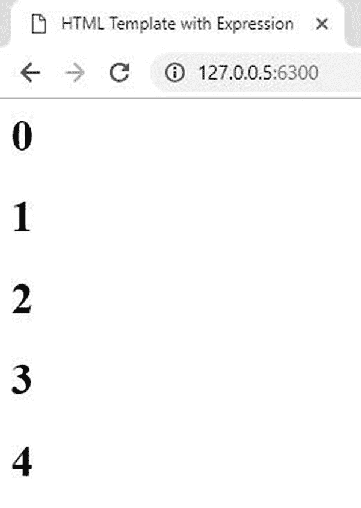

图 7-16

使用 Python 循环呈现模板

```py
<html>
<header>
<title>HTML Template with Expression</title>
</header>
<body>


<h1></h1>


</body>
</html>

Listing 7-16Embedding a Python Loop Inside Flask Template

```

### 静态文件

CSS 和 JavaScript 文件等静态文件用于样式化网页并使其动态化。与模板类似，创建了一个文件夹来存储静态文件。文件夹名为`static`。如果我们要创建一个名为`style.css`的 CSS 文件和一个名为`simpeJS.js`的 JavaScript 文件，项目结构将如图 [7-17](#Fig17) 所示。

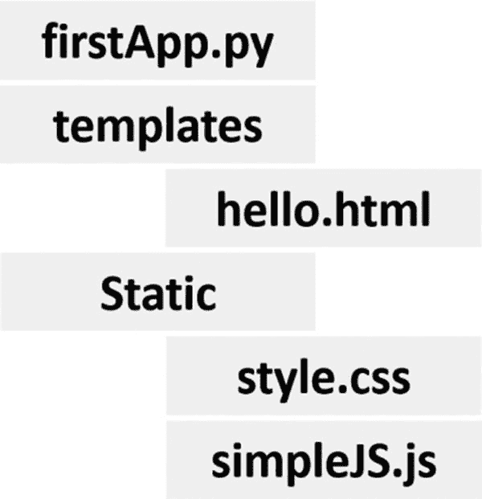

图 7-17

包含模板和静态文件的项目结构

Python 代码与清单 [7-15](#PC16) 中的代码相同，只是没有使用规则的变量部分。清单 [7-17](#PC18) 显示了`hello.html`文件的内容。值得一提的是 HTML 文件是如何链接到 JavaScript 和 CSS 文件的。通常，使用的属性是`text/javascript`。此外，使用<link>标签添加 CSS 文件，其中`rel`属性被设置为`stylesheet`。新的是如何定位这些文件。

```py
<html>
<header>
<title>HTML Template with Expression</title>
<script type="text/javascript" src="{{url_for(endpoint='static', filename='simpleJS.js')}}"></script>
<link rel="stylesheet" href="{{url_for(endpoint='static', filename='style.css')}}">
</header>
<body>


<h1 onclick="showAlert({{k}})"></h1>

</body>
</html>

Listing 7-17HTML File Linked with CSS and JavaScript Files

```

在`<script>`和`<link>`标签中，`url_for()`方法被用在一个表达式中来定位文件。该方法的`endpoint`属性被设置为 static，这意味着您应该查看项目结构下名为`static`的文件夹。该方法接受另一个名为`filename`的参数，它引用静态文件的文件名。

CSS 文件的内容在清单 [7-18](#PC19) 中给出。它只针对任何`<h1>`元素，并通过在其上下添加虚线来修饰它们的文本。

```py
h1 {
text-decoration: underline overline;
}

Listing 7-18Content of the CSS File

```

清单 [7-19](#PC20) 给出了 JavaScript 文件的内容。它有一个名为`showAlert`的函数，该函数接受一个连接到字符串并打印在警报中的参数。当 HTML 模板中代表五个数字的任何一个`<h1>`元素被点击时，这个函数被调用。与元素相关的数字作为参数传递给函数，以便打印出来。

```py
function showAlert(num){
alert("Number is " + num)
}

Listing 7-19Content of the JavaScript File

```

当点击带有文本`1`的数字`<h1>`元素时，输出如图 [7-18](#Fig18) 所示。

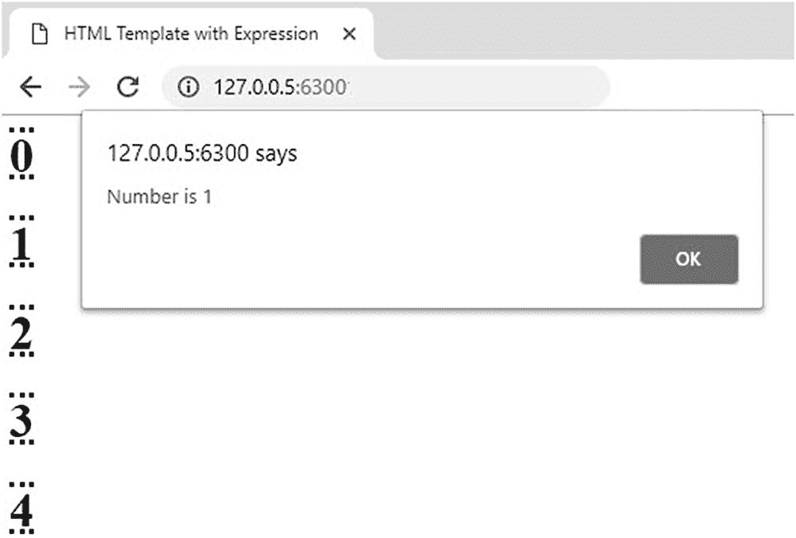

图 7-18

点击带有文本`1`的第二个

# 元素的结果

至此，我们已经有了对 Flask 的介绍，这足以让我们开始部署预训练模型。在接下来的部分中，针对 Fruits 360 和 CIFAR10 数据集的预训练模型将被部署到 web 服务器，以便 Flask 应用程序能够访问它们，从而对客户端上传的图像进行分类。

## 使用 Fruits 360 数据集部署训练模型

我们要部署的第一个模型是第 [5](5.html) 章中使用 Fruits 360 数据集训练的模型，并使用 GA 优化。Flask 应用程序由两个主要页面组成。

第一页是主页。它有一个 HTML 表单，允许用户选择图像文件。该文件被上传到服务器。第二页完成了大部分工作。它遵循第[章和第](5.html)章中的相同步骤。它在上传到服务器后读取图像，提取其特征，使用 STD 过滤特征，使用预训练的 ANN 预测图像类别标签，最后允许用户返回主页选择另一个图像进行分类。该应用具有图 [7-19](#Fig19) 中定义的结构。下面详细讨论一下应用。

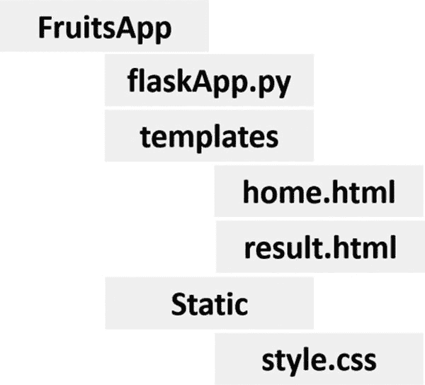

图 7-19

水果 360 识别应用程序结构

清单 7-20 开始了构建应用程序的第一步。导入整个应用程序所需的所有模块。创建 Flask 类的实例时，将构造函数的`import_name`参数设置为父目录的名称，即`FruitsApp`。到目前为止，只创建了一个规则。该规则将主页`/`的 URL 绑定到查看功能`homepage`。应用程序使用主机`127.0.0.5`、端口号`6302`和主动调试模式运行。

```py
import flask, werkzeug, skimage.io, skimage.color, numpy, pickle

app = flask.Flask(import_name="FruitsApp")

def homepage():
    return flask.render_template(template_name_or_list="home.html")
app.add_url_rule(rule="/", view_func=homepage, endpoint="homepage")

app.run(host="127.0.0.5", port=6300, debug=True)

Listing 7-20Basic Structure of the Fruits 360 Recognition Application

```

当用户访问主页`http://127.0.0.5:6302`时，视图函数`homepage()`使用`render_template()`方法呈现`home.html`模板。使用的关联端点是`homepage`，它与视图函数的名称相同。注意，省略这个端点不会改变任何东西，因为默认端点实际上等于视图函数名。清单 [7-21](#PC22) 中给出了`home.html`页面的内容。

```py
<html>
<header>
<title>Select Image</title>
<link rel="stylesheet" href="{{url_for(endpoint='static', filename='style.css')}}">
</header>
<body>

<h1>Select an Image from the Fruits 360 Dataset</h1>
<form enctype="multipart/form-data" action="{{url_for(endpoint='extract')}}" method="post">
<input type="file" name="img"><br>
<input type="submit">
</form>

</body>
</html>

Listing 7-21Implementation of the home.html Page

```

该页面创建一个 HTML 表单，表单中有一个名为`img`的输入，表示要上传的文件。记住表单的加密类型属性`enctype`被设置为`multipart/form-data`，方法为`post`。该操作表示表单数据将提交到的页面。提交表单后，其数据被发送到另一个页面，以对上传的图像文件进行分类。为了避免对 URL 进行硬编码，目标规则的端点被设置为`extract`，用于通过`url_for()`方法获取其 URL。为了能够在 HTML 页面中运行这个表达式，它被包含在`{{...}}`之间。

在页面头中，样式表静态文件`style.css`通过使用接受`endpoint`和`url_for()`方法的`filename`参数的表达式链接到页面。记住，静态文件的`endpoint`被设置为`static`。`filename`参数被设置为目标静态文件名。CSS 文件的内容将在后面讨论。图 [7-20](#Fig20) 显示选择图像文件后的主页屏幕。在提交表单之后，所选择的文件细节被发送到视图函数`extractFeatures`，该函数与端点`extract`相关联，用于进一步的处理。

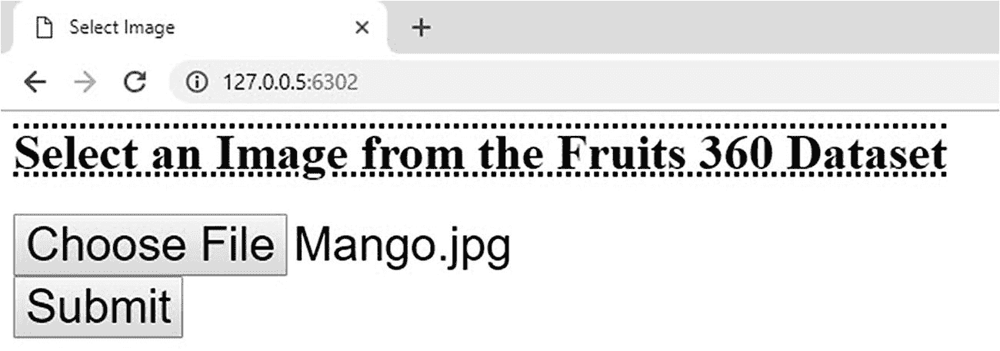

图 7-20

上传水果 360 数据集图片的主页截图

清单 [7-22](#PC23) 给出了与`/extract`规则相关联的`extractFeatures`视图函数的代码。请注意，该规则只监听 POST HTTP 方法。`extractFeatures`视图函数响应之前提交的表单。它使用字典`flask.request.files`返回上传的图像文件。使用图像文件的`filename`属性返回文件名。为了使保存文件更加安全，使用`secure_filename()`函数返回安全文件名，该函数接受原始文件名并返回一个安全名称。根据这个安全名称保存图像。

```py
def extractFeatures():
    img = flask.request.files["img"]
    img_name = img.filename
    img_secure_name = werkzeug.secure_filename(img_name)
    img.save(img_secure_name)
    print("Image Uploaded successfully.")

img_features = extract_features(image_path=img_secure_name)
    print("Features extracted successfully.")

    f = open("weights_1000_iterations_10%_mutation.pkl", "rb")
    weights_mat = pickle.load(f)
    f.close()
    weights_mat = weights_mat[0, :]

    predicted_label = predict_outputs(weights_mat, img_features, activation="sigmoid")

    class_labels = ["Apple", "Raspberry", "Mango", "Lemon"]
    predicted_class = class_labels[predicted_label]
    return flask.render_template(template_name_or_list="result.html", predicted_class=predicted_class)
app.add_url_rule(rule="/extract", view_func=extractFeatures, methods=["POST"], endpoint="extract")

Listing 7-22Python Code for the extractFeatures View Function

```

上传图像到服务器后，使用清单 [7-23](#PC24) 中定义的`extract_features`函数提取其特征。它接受图像路径，并遵循第 [3 章](3.html)的 **Fruits 360 数据集特征挖掘**一节中的步骤，从读取图像文件，提取色调通道直方图，使用 STD 过滤特征，最后返回过滤后的特征集。基于对训练数据进行的实验，根据所选元素的索引来过滤特征。这些元素的数量是 102。然后将特征向量返回到形状为 1×102 的行数量向量中。这就为矩阵乘法做好了准备。返回特征向量后，我们可以继续执行`extractFeatures`视图功能。

```py
def extract_features(image_path):
    f = open("select_indices.pkl", "rb")
    indices = pickle.load(f)
    f.close()

    fruit_data = skimage.io.imread(fname=image_path)
    fruit_data_hsv = skimage.color.rgb2hsv(rgb=fruit_data)
    hist = numpy.histogram(a=fruit_data_hsv[:, :, 0], bins=360)
    im_features = hist[0][indices]
    img_features = numpy.zeros(shape=(1, im_features.size))
    img_features[0, :] = im_features [:im_features.size]
    return img_features

Listing 7-23Extracting Features from the Uploaded Image

```

根据清单 [7-23](#PC23) ，将特征向量接收到`img_features`变量中的下一步是恢复使用遗传算法训练的人工神经网络所学习的一组权重。权重返回到`weights_mat`变量。请注意，这些权重表示在最后一代之后返回的总体的所有解。我们只需要找到群体中的第一个解。这就是为什么索引 0 是从`weights_mat`变量返回的。

根据清单 [7-24](#PC25) ，在准备好图像特征和学习到的权重后，下一步是将它们应用于人工神经网络，以使用`predict_outputs()`函数产生预测标签。它接受权重、特征和激活函数。激活功能与我们之前实现的功能相同。`predict_outputs()`函数通过一个循环，在输入和 ANN 中每层的权重之间执行矩阵乘法。到达输出层的结果后，返回预测的类索引。对应的是分数最高的班级。该索引由该函数返回。

```py
def predict_outputs(weights_mat, data_inputs, activation="relu"):
    r1 = data_inputs
    for curr_weights in weights_mat:
        r1 = numpy.matmul(a=r1, b=curr_weights)
        if activation == "relu":
            r1 = relu(r1)
        elif activation == "sigmoid":
            r1 = sigmoid(r1)
    r1 = r1[0, :]
    predicted_label = numpy.where(r1 == numpy.max(r1))[0][0]
    return predicted_label

Listing 7-24Predicting the Class Label for the Uploaded Image

```

返回预测的类索引后，我们回到清单 [7-22](#PC23) 。然后，返回的索引被转换成相应类的字符串标签。所有标签都保存到`class_labels`列表中。预测的类标签被返回给`predicted_class`变量。`extractFeatures`视图函数最后使用`render_template()`方法呈现`result.html`模板。它将预测的类标签传递给这样的模板。清单 [7-25](#PC26) 中提供了该模板的代码。

```py
<html>
<header>
<title>Predicted Class</title>
<link rel="stylesheet" href="{{url_for(endpoint='static', filename='style.css')}}">
</header>
<body>

<h1>Predicted Label</h1>
<h1>{{predicted_class}}</h1>
<a href="{{url_for(endpoint='homepage')}}">Classify Another Image</a>
</body>
</html>

Listing 7-25Content of the result.html Template

```

该模板创建了一个表达式，能够在`<h1>`元素中呈现预测的类标签。创建一个锚点，让用户返回主页对另一个图像进行分类。主页的 URL 是基于其端点返回的。打印完类别标签后的`result.html`文件屏幕如图 [7-21](#Fig21) 所示。

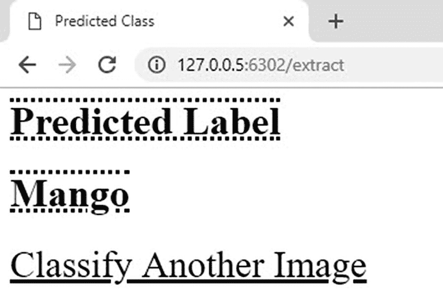

图 7-21

对上传的图像进行分类的结果

注意，该应用程序只有一个名为`style.css`的静态文件，根据清单 [7-26](#PC27) 实现。它只是改变了`<input>`和`<a>`元素的字体大小。它还通过在文本上方和下方添加一行来为`<h1>`元素的文本添加装饰。

```py
a, input{
font-size: 30px;
color: black;
}

h1 {
text-decoration: underline overline dotted;
}

Listing 7-26Static CSS File for Adding Styles

```

在讨论了应用程序的每个部分之后，清单 [7-27](#PC28) 中提供了完整的代码。

```py
import flask, werkzeug, skimage.io, skimage.color, numpy, pickle

app = flask.Flask(import_name="FruitsApp")

def sigmoid(inpt):
    return 1.0/(1.0+numpy.exp(-1*inpt))

def relu(inpt):
    result = inpt
    result[inpt<0] = 0
    return result

def extract_features(image_path):
    f = open("select_indices.pkl", "rb")
    indices = pickle.load(f)
    f.close()

    fruit_data = skimage.io.imread(fname=image_path)
    fruit_data_hsv = skimage.color.rgb2hsv(rgb=fruit_data)
    hist = numpy.histogram(a=fruit_data_hsv[:, :, 0], bins=360)
    im_features = hist[0][indices]
    img_features = numpy.zeros(shape=(1, im_features.size))
    img_features[0, :] = im_features[:im_features.size]
    return img_features

def predict_outputs(weights_mat, data_inputs, activation="relu"):
    r1 = data_inputs

    for curr_weights in weights_mat:
        r1 = numpy.matmul(a=r1, b=curr_weights)
        if activation == "relu":
            r1 = relu(r1)
        elif activation == "sigmoid":
            r1 = sigmoid(r1)
    r1 = r1[0, :]
    predicted_label = numpy.where(r1 == numpy.max(r1))[0][0]
    return predicted_label

def extractFeatures():
    img = flask.request.files["img"]
    img_name = img.filename
    img_secure_name = werkzeug.secure_filename(img_name)
    img.save(img_secure_name)
    print("Image Uploaded successfully.")

    img_features = extract_features(image_path=img_secure_name)
    print("Features extracted successfully.")

    f = open("weights_1000_iterations_10%_mutation.pkl", "rb")
    weights_mat = pickle.load(f)
    f.close()

    weights_mat = weights_mat[0, :]

    predicted_label = predict_outputs(weights_mat, img_features, activation="sigmoid")

    class_labels = ["Apple", "Raspberry", "Mango", "Lemon"]
    predicted_class = class_labels[predicted_label]
    return flask.render_template(template_name_or_list="result.html", predicted_class=predicted_class)
app.add_url_rule(rule="/extract", view_func=extractFeatures, methods=["POST"], endpoint="extract")

def homepage():
    return flask.render_template(template_name_or_list="home.html")
app.add_url_rule(rule="/", view_func=homepage)

app.run(host="127.0.0.5", port=6302, debug=True)

Listing 7-27Complete Code of Flask Application for Classifying Fruits 360 Dataset Images

```

## 使用 CIFAR10 数据集部署训练模型

我们讨论的部署使用 Fruits 360 数据集训练的模型的步骤将会重复，但对于使用使用 CIFAR10 数据集训练的 TensorFlow 创建的模型。与以前的应用程序相比，有一些增强。应用程序的结构如图 [7-22](#Fig22) 所示。

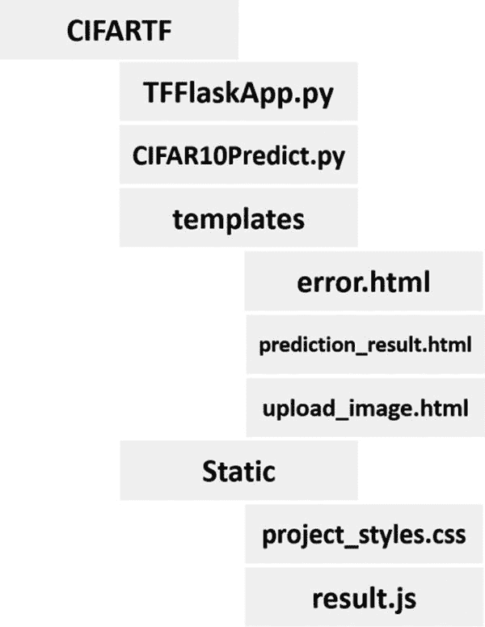

图 7-22

使用 CIFAR10 数据集部署预训练模型的应用程序结构

我们将在后面讨论应用程序的每个部分。让我们从清单 [7-28](#PC29) 中的代码开始。导入整个应用程序所需的库。优选在单独的模块中进行预测步骤。这就是使用`CIFAR10Predict`模块的原因。它具有从 CIFAR10 数据集预测图像的类别标签所需的所有功能。这使得 Flask 应用程序的 Python 文件关注于视图函数。

```py
import flask, werkzeug, os, scipy.misc, tensorflow
import CIFAR10Predict

app = flask.Flask("CIFARTF")

def redirect_upload():
    return flask.render_template(template_name_or_list="upload_image.html")
app.add_url_rule(rule="/", endpoint="homepage", view_func=redirect_upload)

if __name__ == "__main__":
    prepare_TF_session(saved_model_path='\\AhmedGad\\model\\')
    app.run(host="localhost", port=7777, debug=True)

Listing 7-28Preparing a Flask Application for Deploying the Pretrained Model Using CIFAR10 Dataset

```

在运行应用程序之前，最好确保它是执行的主文件，而不是从另一个文件引用的。如果该文件作为主文件运行，其内部的`__name__`变量将等于`__main__`。否则，`__name__`变量被设置为调用该文件的模块。只有当该文件是主文件时，它才应该运行。这就是使用`if`语句的原因。

创建一个 TF 会话，以便使用根据清单 [7-29](#PC30) 实现的`prepare_TF_session`功能恢复预训练模型。该函数接收已保存模型的路径，以便恢复图形，并通过在进行预测之前初始化图形中的变量来准备会话。

```py
def prepare_TF_session(saved_model_path):
    global sess
    global graph

    sess = tensorflow.Session()

    saver = tensorflow.train.import_meta_graph(saved_model_path+'model.ckpt.meta')
    saver.restore(sess=sess, save_path=saved_model_path+'model.ckpt')

    sess.run(tensorflow.global_variables_initializer())

    graph = tensorflow.get_default_graph()
    return graph

Listing 7-29Restoring the Pretrained TF Model

```

准备好会话后，应用程序以`localhost`作为主机、端口号`7777`和活动调试模式运行。

创建了一个将主页 URL `/`绑定到视图功能`redirect_upload()`的规则。这条规则有端点`homepage`。当用户访问主页`http://localhost:777`时，view 函数使用`render_template()`方法渲染清单 [7-30](#PC31) 中定义的`upload_image.html`模板。

```py
<!DOCTYPE html>
<html lang="en">
<head>
<link rel="stylesheet" type="text/css" href="{{url_for(endpoint='static', filename='project_styles.css')}}">
<meta charset="UTF-8">
<title>Upload Image</title>
</head>
<body>
<form enctype="multipart/form-data" method="post" action="http://localhost:7777/upload/">
<center>
<h3>Select CIFAR10 image to predict its label.</h3>
<input type="file" name="image_file" accept="img/*"><br>
<input type="submit" value="Upload">
</center>
</form>
</body>

</html>

Listing 7-30HTML File for Uploading an Image from the CIFAR10 Dataset

```

这个 HTML 文件创建了一个表单，允许用户选择要上传到服务器的图像。该页面截图如图 [7-23](#Fig23) 所示。

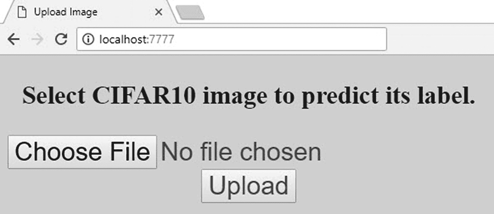

图 7-23

用于上传 CIFAR10 映像的 HTML 页面的屏幕截图

这个页面非常类似于为 Fruits 360 应用程序创建的表单。提交表单后，数据将被发送到与由`action`属性指定的规则相关联的页面，该属性是`/upload`。清单 [7-31](#PC32) 中给出了该规则及其查看功能。

```py
def upload_image():
    global secure_filename
    if flask.request.method == "POST"
        img_file = flask.request.files["image_file"]
        secure_filename = werkzeug.secure_filename(img_file.filename
        img_file.save(secure_filename)
        print("Image uploaded successfully.")
        return flask.redirect(flask.url_for(endpoint="predict"))
    return "Image upload failed."
app.add_url_rule(rule="/upload/", endpoint="upload", view_func=upload_image, methods=["POST"])

Listing 7-31Uploading a CIFAR10 Image to the Server

```

`/upload`规则被赋予一个名为`upload`的端点，它只响应 POST 类型的 HTTP 消息。它与`upload_image`视图功能相关联。它从原始文件名中检索安全文件名，并将图像保存到服务器。如果图像上传成功，那么它使用`redirect()`方法将应用程序重定向到与`predict`端点相关联的 URL。该端点属于`/predict`规则。清单 [7-32](#PC33) 中给出了规则及其视图功能。

```py
def CNN_predict():
    global sess
    global graph

    global secure_filename

    img = scipy.misc.imread(os.path.join(app.root_path, secure_filename))

    if(img.ndim) == 3:
        if img.shape[0] == img.shape[1] and img.shape[0] == 32:
            if img.shape[-1] == 3:
                predicted_class = CIFAR10Predict.main(sess, graph, img)
                return flask.render_template(template_name_or_list="prediction_result.html", predicted_class=predicted_class)
            else:
                return flask.render_template(template_name_or_list="error.html", img_shape=img.shape)
        else:
            return flask.render_template(template_name_or_list="error.html", img_shape=img.shape)
    return "An error occurred."
app.add_url_rule(rule="/predict/", endpoint="predict", view_func=CNN_predict)

Listing 7-32View Function to Predict the Class Label for CIFAR10 Image

```

该函数读取图像文件，并根据其形状和大小检查它是否已经属于 CIFAR10 数据集。这种数据集中的每个图像都有三维；前两个维度大小相等，都是 32。此外，图像是 RGB，因此第三维具有三个通道。如果没有找到这些规范，那么应用程序将被重定向到根据清单 [7-33](#PC34) 实现的`error.html`模板。

```py
<!DOCTYPE html>
<html lang="en">
<head>
<link type="text/css" rel="stylesheet" href="{{url_for(endpoint='static', filename='project_styles.css')}}">
<meta charset="UTF-8">
<title>Error</title>
</head>
<body>
<center>
<h1 class="error">Error</h1>
<h2 class="error-msg">Read image dimensions {{img_shape}} do not match the CIFAR10 specifications (32x32x3).</h2>
<a href="{{url_for(endpoint='homepage')}}"><span>Return to homepage</span>.</a>
</center>
</body>
</html>

Listing 7-33Template

for Indicating That the Uploaded Image Does Not Belong to the CIFAR10 Dataset

```

除了 CIFAR10 数据集的标准大小之外，它还使用表达式打印上传图像的大小。上传不同 shapeCIFAR10 数据集的图像:形状和大小，上传的图像，错误如图 [7-24](#Fig24) 所示。

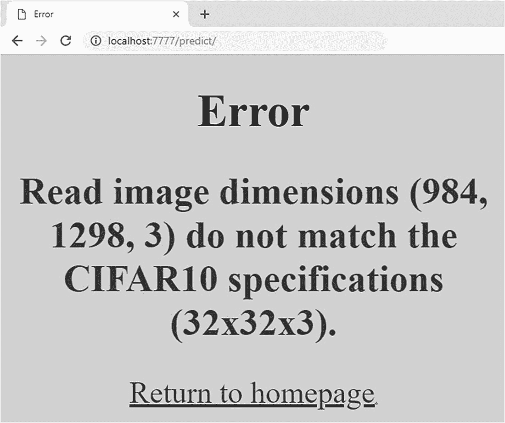

图 7-24

上传与 CIFAR10 图像形状或大小不同的图像时出错

如果上传图像的形状和大小与 CIFS ar 10 图像的形状和大小相匹配，则很可能是一个 CIFS ar 10 图像，其标签将使用模块`CIFAR10Predict`进行预测。如清单 [7-34](#PC35) 所示，它有一个名为`main`的函数，接受读取后的图像并返回其类标签。

```py
def main(sess, graph, img):

    patches_dir = "\\AhmedGad\\cifar-10-python\\cifar-10-batches-py\\"
    dataset_array = numpy.random.rand(1, 32, 32, 3)
    dataset_array[0, :, :, :] = img

    softmax_propabilities = graph.get_tensor_by_name(name="softmax_probs:0")
    softmax_predictions = tensorflow.argmax(softmax_propabilities, axis=1)
    data_tensor = graph.get_tensor_by_name(name="data_tensor:0")
    keep_prop = graph.get_tensor_by_name(name="keep_prop:0")

    feed_dict_testing = {data_tensor: dataset_array, keep_prop: 1.0}

    softmax_propabilities_, softmax_predictions_ = sess.run([softmax_propabilities, softmax_predictions], feed_dict=feed_dict_testing)

    label_names_dict = unpickle_patch(patches_dir + "batches.meta")
    dataset_label_names = label_names_dict[b"label_names"]
    return dataset_label_names[softmax_predictions_[0]].decode('utf-8')

Listing 7-34Predicting the Class Label of the Image

```

该函数恢复所需的张量，这些张量有助于根据它们的名称返回预测标签，例如`softmax_predictions`张量。一些其他张量被恢复以覆盖它们的值，它们是`keep_prop`以避免在测试阶段丢失任何神经元，以及`data_tensor`张量以提供上传的图像文件的数据。然后运行该会话以返回预测的标签。标签只是一个数字，是类的标识符。数据集提供了一个元数据文件，其中有一个包含所有类名称的列表。通过索引列表，标识符被转换成类字符串标签。

预测完成后，`CNN_predict()`视图函数将预测的类发送给`prediction_result.html`模板进行渲染。该模板的实现如清单 [7-35](#PC36) 所示。这很简单。它只是使用一个表达式在一个`<span>`元素中打印预测的类。该页面提供了基于端点返回主页的链接，以选择另一个图像进行分类。上传图片后的渲染页面如图 [7-25](#Fig25) 所示。

```py
<!DOCTYPE html>
<html lang="en">
<head>
<link rel="stylesheet" type="text/css" href="{{url_for(endpoint='static', filename='project_styles.css')}}">
<script type="text/javascript" src="{{url_for(endpoint='static', filename='result.js')}}"></script>
<meta charset="UTF-8">
<title>Prediction Result</title>
</head>
<body onload="show_alert('{{predicted_class}}')">
<center><h1>Predicted Class Label : <span>{{predicted_class}}</span></h1>
<br>
<a href="{{url_for(endpoint='homepage')}}"><span>Return to homepage</span>.</a>
</center>
</body>
</html>

Listing 7-35Rendering Predicted Class

```

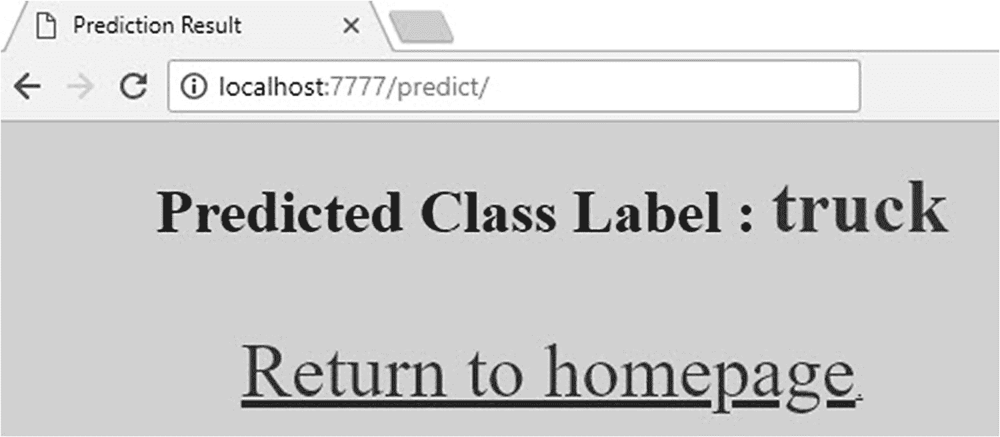

图 7-25

预测类别标签后的渲染结果

注意，当加载清单 [7-35](#PC36) 的元素时，有一个名为`show_alert()`的 JavaScript 函数调用。它接受预测的类标签并显示警告。其实现如清单 [7-36](#PC37) 所示。

```py
function show_alert(predicted_class){
alert("Processing Finished.\nPredicted class is *"+predicted_class+"*.")
}

Listing 7-36JavaScript Alert Showing the Predicted Class

```

既然已经讨论了应用程序的各个部分，清单 [7-37](#PC38) 中给出了完整的代码。

```py
import flask, werkzeug, os, scipy.misc, tensorflow
import CIFAR10Predict#Module for predicting the class label of an input image.

#Creating a new Flask Web application. It accepts the package name.
app = flask.Flask("CIFARTF")

def CNN_predict():
    """
    Reads the uploaded image file and predicts its label using the saved pretrained CNN model.
    :return: Either an error if the image is not for the CIFAR10 dataset or redirects the browser to a new page to show the prediction result if no error occurred.
    """

    global sess

    global graph

# Setting the previously created 'secure_filename' to global.
# This is because to be able to invoke a global variable created in another function, it must be defined global in the caller function.

    global secure_filename
    #Reading the image file from the path it was saved in previously.
    img = scipy.misc.imread(os.path.join(app.root_path, secure_filename))

# Checking whether the image dimensions match the CIFAR10 specifications.
# CIFAR10 images are RGB (i.e. they have 3 dimensions). Its number of dimensions was not equal to 3, then a message will be returned.

    if(img.ndim) == 3:

# Checking if the number of rows and columns of the read image matched CIFAR10 (32 rows and 32 columns).

        if img.shape[0] == img.shape[1] and img.shape[0] == 32:

# Checking whether the last dimension of the image has just 3 channels (Red, Green, and Blue).

            if img.shape[-1] == 3:

# Passing all preceding conditions, the image is proved to be of CIFAR10.
# This is why it is passed to the predictor.

                predicted_class = CIFAR10Predict.main(sess, graph, img)

# After predicting the class label of the input image, the prediction label is rendered on an HTML page.
# The HTML page is fetched from the /templates directory. The HTML page accepts an input which is the predicted class.

                return flask.render_template(template_name_or_list="prediction_result.html", predicted_class=predicted_class)
            else:
                # If the image dimensions do not match the CIFAR10 specifications, then an HTML page is rendered to show the problem.
                return flask.render_template(template_name_or_list="error.html", img_shape=img.shape)

        else:
            # If the image dimensions do not match the CIFAR10 specifications, then an HTML page is rendered to show the problem.
            return flask.render_template(template_name_or_list="error.html", img_shape=img.shape)
    return "An error occurred."#Returned if there is a different error other than wrong image dimensions.

# Creating a route between the URL (http://localhost:7777/predict) to a viewer function that is called after navigating to such URL.
# Endpoint 'predict' is used to make the route reusable without hard-coding it later.

app.add_url_rule(rule="/predict/", endpoint="predict", view_func=CNN_predict)

def upload_image():
    """
    Viewer function that is called in response to getting to the 'http://localhost:7777/upload' URL.
    It uploads the selected image to the server.
    :return: redirects the application to a new page for predicting the class of the image.
    """
    #Global variable to hold the name of the image file for reuse later in prediction by the 'CNN_predict' viewer functions.
    global secure_filename

    if flask.request.method == "POST":#Checking of the HTTP method initiating the request is POST.
        img_file = flask.request.files["image_file"]#Getting the file name to get uploaded.
        secure_filename = werkzeug.secure_filename(img_file.filename)#Getting a secure file name. It is a good practice to use it.
        img_file.save(secure_filename)#Saving the image in the specified path.
        print("Image uploaded successfully.")

# After uploading the image file successfully, next is to predict the class label of it. The application will fetch the URL that is tied to the HTML page responsible for prediction and redirects the browser to it.
# The URL is fetched using the endpoint 'predict'.

        return flask.redirect(flask.url_for(endpoint="predict"))
    return "Image upload failed."

# Creating a route between the URL (http://localhost:7777/upload) to a viewer function that is called after navigating to such URL.
# Endpoint 'upload' is used to make the route reusable without hard-coding it later. The set of HTTP method the viewer function is to respond to is added using the ‘methods’ argument. In this case, the function will just respond to requests of the methods of type POST.

app.add_url_rule(rule="/upload/", endpoint="upload", view_func=upload_image, methods=["POST"])

def redirect_upload():
    """
    A viewer function that redirects the Web application from the root to an HTML page for uploading an image to get classified.
    The HTML page is located under the /templates directory of the application.
    :return: HTML page used for uploading an image. It is 'upload_image.html' in this example.
    """
    return flask.render_template(template_name_or_list="upload_image.html")

# Creating a route between the homepage URL (http://localhost:7777) to a viewer function that is called after getting to such a URL.
# Endpoint 'homepage' is used to make the route reusable without hard-coding it later.

app.add_url_rule(rule="/", endpoint="homepage", view_func=redirect_upload)

def prepare_TF_session(saved_model_path):
    global sess
    global graph

    sess = tensorflow.Session()

    saver = tensorflow.train.import_meta_graph(saved_model_path+'model.ckpt.meta')
    saver.restore(sess=sess, save_path=saved_model_path+'model.ckpt')

    #Initializing the variables.
    sess.run(tensorflow.global_variables_initializer())

    graph = tensorflow.get_default_graph()
    return graph

# To activate the web server to receive requests, the application must run.
# A good practice is to check whether the file is called from an external Python file or not.
# If not, then it will run.

if __name__ == "__main__":

# In this example, the app will run based on the following properties:
# host: localhost

# port: 7777
# debug: flag set to True to return debugging information.

    #Restoring the previously saved trained model.
    prepare_TF_session(saved_model_path='\\AhmedGad\\model\\')
    app.run(host="localhost", port=7777, debug=True)

Listing 7-37Complete Flask Application for CIFAR10 Dataset

```