# 8.跨平台数据科学应用

当前的 DL 库中有一些版本支持为移动设备构建应用程序。例如，TensorFlowLite、Caffe Android 和 Torch Android 都是分别来自 TF、Caffe 和 Torch 的版本，以支持移动设备。这些释放是基于他们的父母。为了使原始模型在移动设备上工作，必须有一个中间步骤。例如，创建使用 TensorFlowLite 的 Android 应用程序的过程有以下总结步骤:

1.  准备 TF 模型。

2.  将 TF 模型转换为 TensorFlowLite 模型。

3.  创建一个 Android 项目。

4.  在项目中导入 TensorFlowLite 模型。

5.  在 Java 代码中调用模型。

为构建一个适合在移动设备上运行的模型而经历这些步骤是令人厌倦的。具有挑战性的步骤是第二步。

TensorFlowLite 是与移动设备兼容的版本。因此，与它的祖先 TF 相比，它被简化了。这意味着它不支持其父库中的所有内容。到目前为止，TensorFlowLite 还不支持 TF 中的一些操作，如 tanh、image.resize_bilinear 和 depth_to_space。当准备在移动设备上工作的模型时，这增加了限制。此外，模型开发人员必须使用语言来创建运行经过训练的 CNN 模型的 Android 应用程序。使用 Python，将使用 TF 创建模型。在使用 TF 优化转换器(TOCO)优化模型之后，使用 Android Studio 创建一个项目。在这样的项目中，将使用 Java 调用模型。因此，这个过程并不简单，创建应用程序也很有挑战性。有关使用 TensorFlowLite 构建移动应用程序的更多信息，请阅读此链接的文档( [`www.tensorflow.org/lite/overview`](http://www.tensorflow.org/lite/overview) )。在这一章中，我们将使用 Kivy (KV)以最小的努力构建跨平台运行的应用程序。

Kivy 是一个抽象和模块化的开源跨平台 Python 框架，用于创建自然用户界面(ui)。它通过使用后端库对图形硬件进行低级访问并处理音频和视频，将开发人员从复杂的细节中分离出来。它只是为开发人员提供简单的 API 来完成任务。

本章使用一些简单的例子来介绍 Kivy，帮助解释它的基本程序结构、UI 小部件、使用 KV 语言构造小部件以及处理动作。Kivy 支持在 Window、Linux、Mac 以及移动设备上执行相同的 Python 代码，这使得它具有跨平台性。使用 Buildozer 和 Python-4-Android (P4A)，Kivy 应用程序被转换成一个 Android 包。不仅执行原生 Python 代码；Kivy 还支持一些在移动设备上执行的库，比如 NumPy 和 PIL (Python Image Library)。在本章结束时，使用 NumPy 构建了一个跨平台应用程序来执行第 [5](5.html) 章中实现的 CNN。本章使用 Ubuntu 是因为 Buildozer 目前可以在 Linux 上使用。

## Kivy 简介

在本节中，将基于一些示例详细讨论 Kivy 基础知识。这有助于我们着手构建自己的应用程序。记得从第 [7](7.html) 章开始，Flask 应用程序通过实例化 Flask 类开始创建应用程序；然后应用程序通过调用`run()`方法来运行。Kivy 类似，但有一些变化。我们可以假设`Flask`类对应于 Kivy 中的`App`类。Kivy 和 Flask 内部都有一个叫`run()`的方法。Kivy 应用程序不是通过实例化 App 类创建的，而是通过实例化一个扩展 App 类的子类创建的。然后，应用程序通过使用从子类创建的实例调用`run()`方法来运行。

Kivy 用于构建一个 UI，该 UI 由一组称为小部件的可视元素组成。在实例化类和运行它之间，我们必须指定使用哪些小部件以及它们的布局。App 类支持一个名为`build()`的方法，该方法返回包含 UI 中所有其他小部件的布局小部件。可以从父 App 类中重写此方法。

### 使用 BoxLayout 的基本应用程序

让我们通过讨论清单 [8-1](#PC1) 中的一个基本 Kivy 应用程序来让事情变得更清楚。首先，从 Kivy 导入所需的模块。`kivy.app`包含了 App 类。这个类被用作我们定义的类`FirstApp`的父类。第二个语句导入`kivy.uix.label`，它有一个标签小部件。这个小部件只在 UI 上显示文本。

在`build()`方法中，标签小部件是使用`kivy.uix.label.Label`类创建的。该类构造函数接受一个名为`text`的参数，它是要在 UI 上显示的文本。返回的标签保存为`FirstApp`对象的属性。与将小部件保存在单独的变量中相比，将小部件作为属性添加到类对象中可以更容易地在以后检索它们。

```py
import kivy.app
import kivy.uix.label
import kivy.uix.boxlayout

class FirstApp(kivy.app.App):
    def build(self):
        self.label = kivy.uix.label.Label(text="Hello Kivy")
        self.layout = kivy.uix.boxlayout.BoxLayout()
        self.layout.add_widget(widget=self.label)
        return self.layout

firstApp = FirstApp()
firstApp.run()

Listing 8-1Basic Kivy Application

```

Kivy 中的小部件被分组到一个根小部件中。在清单 [8-1](#PC1) 中，`BoxLayout`被用作根小部件，它包含所有其他小部件。这就是为什么`kivy.uix.boxlayout`是进口的。基于`kivy.uix.label.BoxLayout`类的构造函数，`BoxLayout`对象被保存为`FirstClass`对象的属性。创建标签和布局对象后，使用`add_widget()`方法将标签添加到布局中。这个方法有一个名为`widget`的参数，它接受要添加到布局中的小部件。将标签添加到根小部件(布局)后，布局由`build()`方法返回。

在创建了子类`FirstApp`并准备好它的`build()`方法之后，就创建了该类的一个实例。然后该实例调用`run()`方法，应用程序窗口根据图 [8-1](#Fig1) 显示。

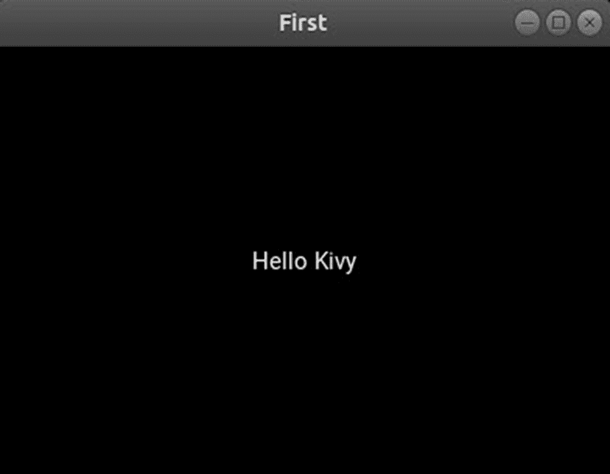

图 8-1

带有文本标签的简单 Kivy 应用程序

### Kivy 应用程序生命周期

只需运行应用程序，`build()`方法中定义的小部件就会呈现在屏幕上。请注意，Kivy 生命周期如图 [8-2](#Fig2) 所示。它类似于 Android 应用程序的生命周期。生命周期从使用`run()`方法运行应用程序开始。之后，执行`build()`方法，返回要显示的小部件。执行`on_start()`方法后，应用程序成功运行。此外，应用程序可能会暂停或停止。如果暂停了，那么调用`on_pause()`方法。如果应用程序恢复，那么调用`on_resume()`方法。如果没有恢复，应用程序就会停止。应用程序可能会在没有暂停的情况下直接停止。如果是这种情况，就调用`on_stop()`方法。


图 8-2

Kivy 应用程序生命周期

图 [8-1](#Fig1) 顶部的标题有`First`字样。那是什么？子类被命名为`FirstApp`。当类以单词`App`结尾命名时，Kivy 使用它前面的工作作为应用程序标题。给班级取名`MyApp`，那么题目就是`My`。注意`App`这个词必须以大写字母开头。如果类被命名为`Firstapp`，那么标题也将是`Firstapp`。注意，我们能够使用类构造函数的`title`参数来设置自定义名称。构造函数还接受一个名为`icon`的参数，它是一个图像的路径。

清单 [8-2](#PC2) 将应用程序标题设置为自定义标题，并且还实现了`on_start()`和`on_stop()`方法。窗口如图 [8-3](#Fig3) 所示。当应用程序启动时，调用`on_start()`方法来打印消息。对于`on_stop()`方法也是如此。

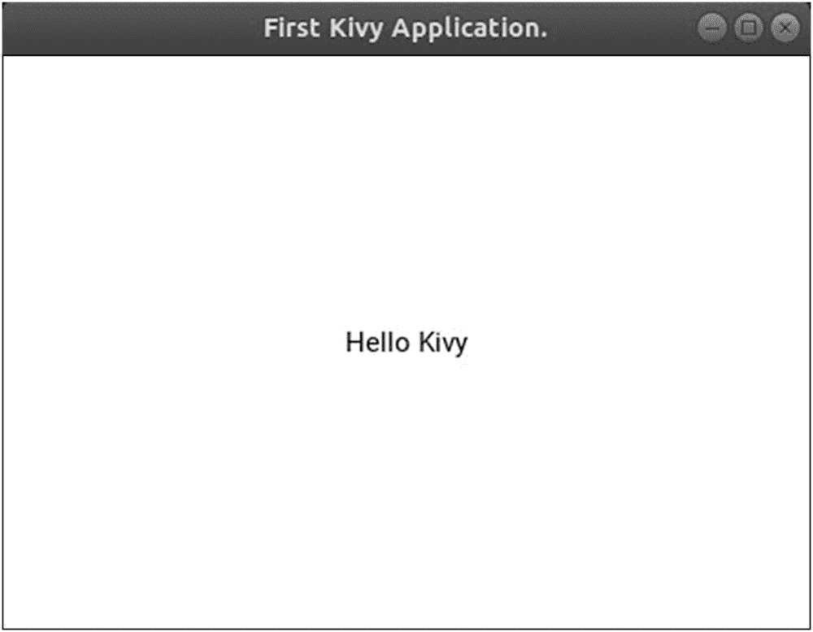

图 8-3

改变应用程序标题

```py
import kivy.app
import kivy.uix.label
import kivy.uix.boxlayout

class FirstApp(kivy.app.App):
    def build(self):
        self.label = kivy.uix.label.Label(text="Hello Kivy")
        self.layout = kivy.uix.boxlayout.BoxLayout()
        self.layout.add_widget(widget=self.label)
        return self.layout

    def on_start(self):
        print("on_start()")

    def on_stop(self):
        print("on_stop()")

firstApp = FirstApp(title="First Kivy Application.")
firstApp.run()

Listing 8-2Implementing Life Cycle Methods

```

我们可以在`BoxLayout`中添加多个小部件。这个布局小部件垂直或水平排列其子部件。它的构造函数有一个名为`orientation`的参数来定义排列。它有两个值:`horizontal`和`vertical`。默认为`horizontal`。

如果方向设置为垂直，则小部件堆叠在彼此之上，其中第一个添加的小部件出现在窗口的底部，最后一个添加的小部件出现在顶部。在这种情况下，窗口高度在所有子小部件中平均分配。

如果方向是水平的，那么小部件是并排添加的，其中第一个添加的小部件是屏幕上最左边的小部件，而最后一个添加的小部件是屏幕上最右边的小部件。在这种情况下，窗口的宽度在所有子部件之间平均分配。

清单 [8-3](#PC3) 使用了五个按钮部件，它们的文本设置为`Button 1`、`Button 2`，直到`Button 5`。这些小部件被水平添加到一个`BoxLayout`小部件中。结果如图 [8-4](#Fig4) 所示。

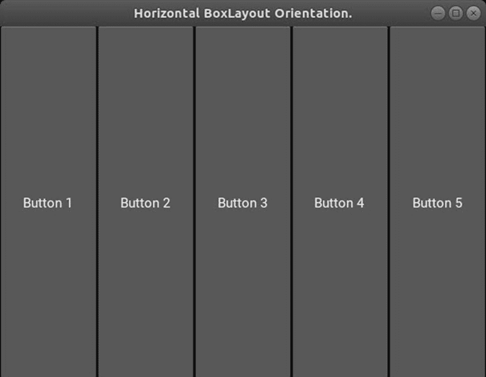

图 8-4

`BoxLayout`小工具的水平方向

```py
import kivy.app
import kivy.uix.button
import kivy.uix.boxlayout

class FirstApp(kivy.app.App):
    def build(self):
        self.button1 = kivy.uix.button.Button(text="Button 1")
        self.button2 = kivy.uix.button.Button(text="Button 2")
        self.button3 = kivy.uix.button.Button(text="Button 3")
        self.button4 = kivy.uix.button.Button(text="Button 4")
        self.button5 = kivy.uix.button.Button(text="Button 5")
        self.layout = kivy.uix.boxlayout.BoxLayout(orientation="horizontal")
        self.layout.add_widget(widget=self.button1)
        self.layout.add_widget(widget=self.button2)
        self.layout.add_widget(widget=self.button3)
        self.layout.add_widget(widget=self.button4)
        self.layout.add_widget(widget=self.button5)
        return self.layout

firstApp = FirstApp(title="Horizontal BoxLayout Orientation.")
firstApp.run()

Listing 8-3Kivy Application using BoxLayout as the Root Widget with Horizontal Orientation

```

### 小部件大小

`BoxLayout`将屏幕平均分配给所有的小工具。添加五个小部件，然后它将屏幕在宽度和高度上分成五个相等的部分。它给每个部件分配一个大小相等的部分。我们可以使用小部件的`size_hint`参数使分配给小部件的零件尺寸变大或变小。它接受一个具有两个值的元组，这两个值定义了相对于窗口大小的宽度和高度。默认情况下，所有小部件的元组都是(1，1)。这意味着大小相等。如果小部件的此参数设置为(2，1)，则小部件的宽度将是默认宽度的两倍。如果设置为(0.5，1)，那么小部件宽度将是默认宽度的一半。

清单 [8-4](#PC4) 更改了一些小部件的`size_hint`参数。图 [8-5](#Fig5) 显示了每个按钮的文本反映其相对于窗口大小的宽度的结果。请注意，小部件向父小部件发出提示，希望其大小符合由`size_hint`参数指定的值。家长可以接受或拒绝请求。这就是为什么它的参数名中有`hint`这个词。例如，设置小部件的`col_force_default`或`row_force_default`属性会使父部件完全忽略`size_hint`参数。注意，`size_hint`是小部件构造函数的一个参数，也可以作为小部件实例的一个属性。


图 8-5

使用 size_hint 参数改变小部件的宽度

```py
import kivy.app
import kivy.uix.button
import kivy.uix.boxlayout

class FirstApp(kivy.app.App):
    def build(self):
        self.button1 = kivy.uix.button.Button(text="2", size_hint = (2, 1))
        self.button2 = kivy.uix.button.Button(text="1")
        self.button3 = kivy.uix.button.Button(text="1.5", size_hint = (1.5, 1))
        self.button4 = kivy.uix.button.Button(text="0.7", size_hint = (0.7, 1))
        self.button5 = kivy.uix.button.Button(text="3", size_hint = (3, 1))
        self.layout = kivy.uix.boxlayout.BoxLayout(orientation="horizontal")
        self.layout.add_widget(widget=self.button1)
        self.layout.add_widget(widget=self.button2)
        self.layout.add_widget(widget=self.button3)
        self.layout.add_widget(widget=self.button4)
        self.layout.add_widget(widget=self.button5)
        return self.layout

firstApp = FirstApp(title="Horizontal BoxLayout Orientation.")
firstApp.run()

Listing 8-4Using the size_hint Argument with theIf added “with” not OK, please clarify listing caption. Widgets to Change Their Relative 
Size

```

### 网格布局

也有`BoxLayout`以外的布局。例如，`GridLayout`根据指定的行数和列数将屏幕分成网格。根据清单 [8-5](#PC5) ，创建了一个两行三列的网格布局，其中添加了六个按钮。行数和列数分别根据`rows`和`cols`属性设置。添加的第一个小部件出现在左上角，而添加的最后一个小部件出现在右下角。结果如图 [8-6](#Fig6) 所示。

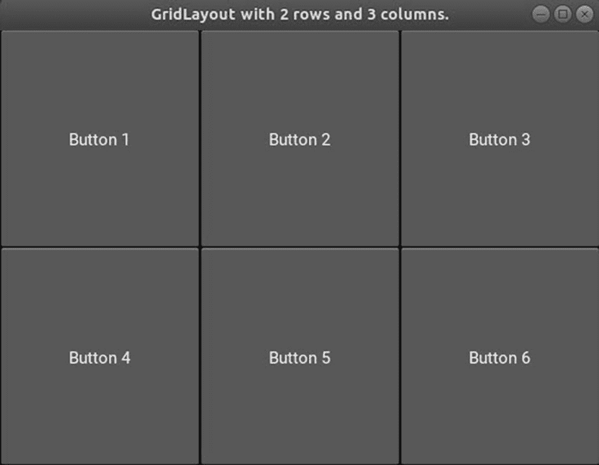

图 8-6

两行三列的网格布局

```py
import kivy.app
import kivy.uix.button
import kivy.uix.gridlayout

class FirstApp(kivy.app.App):
    def build(self):
        self.button1 = kivy.uix.button.Button(text="Button 1")
        self.button2 = kivy.uix.button.Button(text="Button 2")
        self.button3 = kivy.uix.button.Button(text="Button 3")
        self.button4 = kivy.uix.button.Button(text="Button 4")
        self.button5 = kivy.uix.button.Button(text="Button 5")
        self.button6 = kivy.uix.button.Button(text="Button 6")
        self.layout = kivy.uix.gridlayout.GridLayout(rows=2, cols=3)
        self.layout.add_widget(widget=self.button1)
        self.layout.add_widget(widget=self.button2)
        self.layout.add_widget(widget=self.button3)
        self.layout.add_widget(widget=self.button4)
        self.layout.add_widget(widget=self.button5)
        self.layout.add_widget(widget=self.button6)
        return self.layout

firstApp = FirstApp(title="GridLayout with 2 rows and 3 columns.")
firstApp.run()

Listing 8-5Dividing the Window into a Grid of Size 2×3 Using GridLayout

```

另一种适合移动设备的布局是`PageLayout`。它实际上在同一个布局中构建了几个页面。在页面边框处，用户可以向左或向右拖动页面，以便导航到另一个页面。创建这样的布局很简单。只需创建一个`kivy.uix.pagelayout.PageLayout`类的实例，这类似于我们之前所做的。然后，将小部件添加到布局中，就像我们使用`add_widget()`方法一样。

### 更多小部件

UI 中有多个小部件可以使用。例如，`Image`小部件用于根据图像的来源显示图像。`TextInput`小部件允许用户将输入输入到应用程序中。其他还有`CheckBox`、`RadioButton`、`Slider`等等。

清单 [8-6](#PC6) 给出了一个带有`Button`、`Label`、`TextInput`和`Image`小部件的例子。`TextInput`类的构造函数有一个名为`hint_text`的属性，它在小部件中显示一条提示消息，帮助用户知道要输入什么。image 小部件使用`source`属性来指定图像路径。图 [8-7](#Fig7) 显示了结果。稍后，我们将处理这些小部件的动作，比如按钮点击、改变标签文本等等。

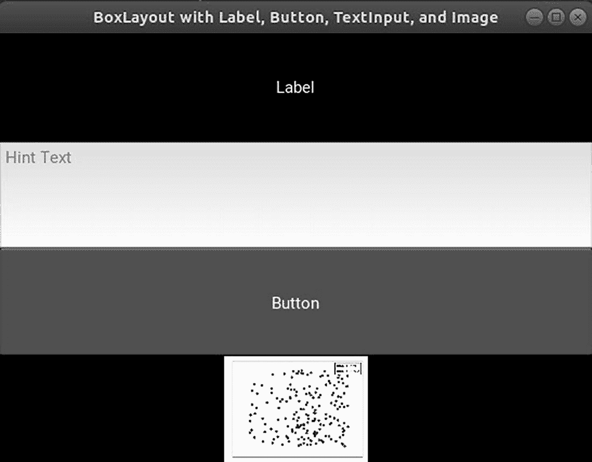

图 8-7

带有`Label`、`TextInput`、`Button`和`Image`小部件的垂直`BoxLayout`

```py
import kivy.app
import kivy.uix.label
import kivy.uix.textinput
import kivy.uix.button
import kivy.uix.image
import kivy.uix.boxlayout

class FirstApp(kivy.app.App):
    def build(self):
        self.label = kivy.uix.label.Label(text="Label")
        self.textinput = kivy.uix.textinput.TextInput(hint_text="Hint Text")
        self.button = kivy.uix.button.Button(text="Button")
        self.image = kivy.uix.image.Image(source="im.png")
        self.layout = kivy.uix.boxlayout.BoxLayout(orientation="vertical")
        self.layout.add_widget(widget=self.label)
        self.layout.add_widget(widget=self.textinput)
        self.layout.add_widget(widget=self.button)
        self.layout.add_widget(widget=self.image)
        return self.layout

firstApp = FirstApp(title="BoxLayout with Label, Button, TextInput, and Image")
firstApp.run()

Listing 8-6BoxLayout with Label, TextInput, Button, and Image Widgets

```

### 小部件树

在前面的例子中，有一个根小部件(布局),有几个子部件直接连接到它。列表 [8-6](#PC6) 的 widget 树如图 [8-8](#Fig8) 所示。这棵树只有一层。我们可以创建一个更深的树，如图 [8-9](#Fig9) 所示，其中垂直方向的根`BoxLayout`部件有两个子布局。第一个是一个有两行两列的`GridLayout`小部件。第二个子窗口是水平方向的水平`BoxLayout`窗口小部件。这些子`GridLayout`部件有自己的子部件。


图 8-9

具有嵌套布局的小部件树


图 8-8

清单 [8-6](#PC6) 中 Kivy 应用程序的部件树

清单 [8-7](#PC7) 中给出了带有图 [8-9](#Fig9) 中定义的小部件树的 Kivy 应用程序。应用程序创建每个父节点，然后创建其子节点，最后将这些子节点添加到父节点中。该应用的渲染窗口如图 [8-10](#Fig10) 所示。


图 8-10

嵌套小部件

```py
import kivy.app
import kivy.uix.label
import kivy.uix.textinput
import kivy.uix.button
import kivy.uix.image
import kivy.uix.boxlayout
import kivy.uix.gridlayout

class FirstApp(kivy.app.App):
    def build(self):
        self.gridLayout = kivy.uix.gridlayout.GridLayout(rows=2, cols=2)
        self.image1 = kivy.uix.image.Image(source="apple.jpg")
        self.image2 = kivy.uix.image.Image(source="bear.jpg")
        self.button1 = kivy.uix.button.Button(text="Button 1")
        self.button2 = kivy.uix.button.Button(text="Button 2")
        self.gridLayout.add_widget(widget=self.image1)
        self.gridLayout.add_widget(widget=self.image2)
        self.gridLayout.add_widget(widget=self.button1)
        self.gridLayout.add_widget(widget=self.button2)

        self.button3 = kivy.uix.button.Button(text="Button 3")
        self.button4 = kivy.uix.button.Button(text="Button 4")

        self.boxLayout = kivy.uix.boxlayout.BoxLayout(orientation="horizontal")
        self.textinput = kivy.uix.textinput.TextInput(hint_text="Hint Text.")
        self.button5 = kivy.uix.button.Button(text="Button 5")
        self.boxLayout.add_widget(widget=self.textinput)
        self.boxLayout.add_widget(widget=self.button5)

        self.rootBoxLayout = kivy.uix.boxlayout.BoxLayout(orientation="vertical")
        self.rootBoxLayout.add_widget(widget=self.gridLayout)
        self.rootBoxLayout.add_widget(widget=self.button3)
        self.rootBoxLayout.add_widget(widget=self.button4)
        self.rootBoxLayout.add_widget(widget=self.boxLayout)

        return self.rootBoxLayout

firstApp = FirstApp(title="Nested Widgets.")
firstApp.run()

Listing 8-7Kivy Application with Nested Widgets in the Widget Tree

```

### 处理事件

我们可以使用`bind()`方法处理 Kivy 小部件生成的事件。此方法接受指定要处理的目标事件的参数。该参数被赋予一个函数或方法，用于处理此类事件。例如，当按下按钮时，触发`on_press`事件。因此，`bind()`方法使用的参数将被命名为`on_press`。假设我们想要使用一个叫做`handle_press`的方法来处理这个事件，那么`bind()`方法的`on_press`参数将被赋予这个方法名。请注意，处理事件的方法接受一个参数，该参数表示触发事件的小部件。让我们看看清单 [8-8](#PC8) 中的应用程序是如何工作的。

这个应用程序有两个`TextInput`小部件，一个`Label`和一个`Button`。用户在每个`TextInput`小部件中输入一个数字。当按钮被按下时，数字被取出并相加，然后结果被呈现在`Label`上。基于前面的例子，应用程序中的一切都是我们熟悉的，除了调用`bind()`方法来使用`add_nums()`方法处理 press 事件。

```py
import kivy.app
import kivy.uix.label
import kivy.uix.textinput
import kivy.uix.button
import kivy.uix.image
import kivy.uix.boxlayout
import kivy.uix.gridlayout

class FirstApp(kivy.app.App):

    def add_nums(self, button):
        num1 = float(self.textinput1.text)
        num2 = float(self.textinput2.text)
        result = num1 + num2
        self.label.text = str(result)

    def build(self):
        self.boxLayout = kivy.uix.boxlayout.BoxLayout(orientation="horizontal")
        self.textinput1 = kivy.uix.textinput.TextInput(hint_text="Enter First Number.")
        self.textinput2 = kivy.uix.textinput.TextInput(hint_text="Enter Second Number.")
        self.boxLayout.add_widget(widget=self.textinput1)
        self.boxLayout.add_widget(widget=self.textinput2)

        self.label = kivy.uix.label.Label(text="Result of Addition.")
        self.button = kivy.uix.button.Button(text="Add Numbers.")
        self.button.bind(on_press=self.add_nums)

        self.rootBoxLayout = kivy.uix.boxlayout.BoxLayout(orientation="vertical")
        self.rootBoxLayout.add_widget(widget=self.label)
        self.rootBoxLayout.add_widget(widget=self.boxLayout)
        self.rootBoxLayout.add_widget(widget=self.button)

        return self.rootBoxLayout

firstApp = FirstApp(title="Handling Actions using Bind().")
firstApp.run()

Listing 8-8Application for Adding Two Numbers and Showing Their Results on a Label

```

按钮调用`bind()`方法，这是任何小部件的属性。为了处理`on_press`事件，该方法将使用它作为一个参数。该参数被设置为等于用名称`add_nums`创建的自定义函数。这意味着每次触发`on_press`事件时，都会执行`add_nums()`方法。`on_press`本身就是一个方法。因为默认情况下它是空的，所以我们需要给它添加一些逻辑。那个逻辑可能是我们在 Python 文件中定义的方法，比如`add_nums`方法。注意，我们创建了一个方法，而不是一个处理事件的函数来访问对象中的所有小部件。如果使用了函数，那么我们必须传递处理事件所需的小部件的属性。

在`add_nums()`方法中，使用`text`属性将两个`TextInput`小部件中的文本返回到`num1`和`num2`变量中。因为`text`属性返回的结果是一个字符串，所以我们要把它转换成一个数字。这是使用`float()`功能完成的。两个数相加，结果返回到`result`变量。将两个数相加将返回一个数。因此，`result`变量的数据类型是数字。因为`text`属性只接受字符串，我们必须使用`str()`函数将`result`变量转换成字符串，以便在标签上显示它的值。图 [8-11](#Fig11) 显示了将两个数相加并将结果呈现在`Label`小工具上后的应用程序 UI。

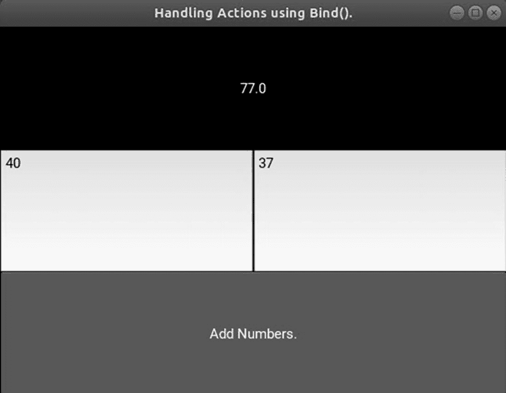

图 8-11

将两个数字相加并在`Label`小部件上显示结果的应用程序 UI

### KV 语言

通过添加更多小部件来扩大小部件树会使 Python 代码更难调试。类似于我们在第 7 章中所做的，将 HTML 代码从 Flask 应用程序的逻辑中分离出来，在这一章中，我们将把 UI 代码从应用程序逻辑中分离出来。

UI 将使用一种叫做 KV language (kvlang 或 Kivy language)的语言创建。这种语言创建扩展名为`.kv`的文件来保存 UI 小部件。因此，将有一个用于处理事件等应用程序逻辑的`.py`文件，以及另一个用于保存应用程序 UI 的`.kv`文件。KV 语言以一种简单的方式构建小部件树，与将它添加到 Python 代码中相比，这种方式更容易理解。KV 语言使得调试 UI 变得容易，因为它清楚地表明了给定的父节点属于哪个子节点。

KV 文件由一组规则组成，这些规则类似于定义小部件的 CSS 规则。规则由小部件类和一组属性及其值组成。在小部件类名后添加一个冒号，表示小部件内容的开始。给定小部件下的内容是缩进的，就像 Python 定义块的内容一样。属性名与其值之间有一个冒号。例如，清单 [8-9](#PC9) 创建了一个构建按钮小部件的规则。

按钮小部件后跟一个冒号。冒号后缩进的所有内容都属于该小部件。缩进空间的数量并不固定为四个。它类似于 Python，我们可以使用任意数量的空格。我们发现有三个属性是缩进的。第一个是`text`属性，它使用冒号与值分开。转到一个新的缩进行，我们可以写入新的属性`background_color`，使用冒号将其与值分开。顺便说一下，颜色是使用 RGBA 颜色空间定义的，其中 A 表示 alpha 通道。颜色值介于 0.0 和 1.0 之间。对于第三个属性，重复相同的过程，用冒号将它的名称和值分开。`color`属性定义了文本的颜色。

```py
Button:
    text: "Press Me."
   background_color: (0.5, 0.5, 0.5, 1.0)
    color: (0,0,0,1)

Listing 8-9Preparing the Button Widget with Some Properties Using KV Language

```

我们可以创建一个简单的 Kivy 应用程序，它使用 KV 文件来构建 UI。假设我们想要构建一个 UI，以`BoxLayout`小部件作为垂直方向的根。这个根小部件有三个子部件(`Button`、`Label`和`TextInput`)。注意，KV 语言只有一个根小部件，它是通过不加任何缩进地键入来定义的。这个根小部件的子部件将被同等缩进。清单 [8-10](#PC10) 中给出了 KV 语言文件。在根小部件之后，`Button`、`Label`和`TextInput`小部件缩进四个空格。根小部件本身可以有属性。每个子部件的属性都缩进在它们的部件后面。这很简单，但是我们如何在 Python 代码中使用这个 KV 文件呢？

```py
BoxLayout:
    orientation: "vertical"
    Button:
        text: "Press Me."
        color: (1,1,1,1)
    Label:
        text: "Label"
    TextInput:
        hint_text: "TextInput"

Listing 8-10Simple UI Created Using KV Language

```

在 Python 代码中加载 KV 文件有两种方式。第一种方法是在`kivy.lang.builder.Builder`类的`load_file()`方法中指定文件的路径。这个方法使用它的`filename`参数来指定文件的路径。该文件可以位于任何位置，不需要与 Python 文件位于同一目录中。清单 [8-11](#PC11) 展示了如何以这种方式定位 KV 文件。

以前，`build()`方法的返回是在 Python 文件中定义的根小部件。现在它返回`load_file()`方法的结果。将 Python 文件中的逻辑与表示分离后，Python 代码更加清晰，现在表示在 KV 文件中。

```py
import kivy.app
import kivy.lang.builder

class FirstApp(kivy.app.App):

    def build(self):
        return kivy.lang.builder.Builder.load_file(filename='ahmedgad/FirstApp/first.kv')

firstApp = FirstApp(title="Importing UI from KV File.")
firstApp.run()

Listing 8-11Locating the LV File Using Its Path

```

使用第二种加载 KV 文件的方式可以使代码更加清晰。这种方式依赖于继承 App 类的子类的名称。如果这个类被命名为`FirstApp`，那么 Kivy 将寻找一个名为`first.kv`的 KV 文件。也就是说，`App`这个词被删除，剩下的文本`First`被转换成小写。如果 Python 文件所在的目录下有一个名为`first.kv`的文件，那么这个文件将被自动加载。

当使用这个方法时，Python 代码将如清单 [8-12](#PC12) 所示。代码现在比以前更清晰，调试也更简单。在`FirstApp`类中添加了`pass`语句，以避免让它为空。注意，如果 Kivy 找不到根据`first.kv`命名的文件，应用程序仍将运行，但会显示一个空白窗口。

```py
import kivy.app

class FirstApp(kivy.app.App):
    pass

firstApp = FirstApp(title="Importing UI from KV File.")
firstApp.run()

Listing 8-12Loading the KV File Named According to the Child Class Name

```

我们可以将清单 [8-8](#PC8) 中的 UI 从 Python 代码中分离出来，并将事件处理程序绑定到 KV 文件中的按钮。KV 文件在清单 [8-13](#PC13) 中给出。

还有几点值得一提。可以使用`id`属性在 KV 文件中给小部件一个 ID。它的值不需要用引号括起来。ID 可用于检索 KV 文件和 Python 文件中的小部件的属性。根据代码，id 被赋予元素`Label`和两个`TextInput`小部件。原因是这些是我们希望根据其属性检索或更改的小部件。

```py
BoxLayout:
    orientation: "vertical"
    Label:
        text: "Result of Addition."
        id: label
    BoxLayout:
        orientation: "horizontal"
        TextInput:
            hint_text: "Enter First Number."
            id: textinput1
        TextInput:
            hint_text: "Enter Second Number."
            id: textinput2
    Button:
        text: "Add Numbers."
        on_press: app.add_nums(root)

Listing 8-13UI of Listing 8-8 for Adding Two Numbers Separated into KV File

```

按钮小部件具有`on_press`属性。它用于将事件处理程序绑定到`on_press`事件。事件处理程序是清单 [8-14](#PC14) 中 Python 代码内的`add_nums()`方法。因此，我们想从 KV 文件中调用一个 Python 方法。我们如何做到这一点？

KV 语言有三个很有帮助的关键词:`app`，指应用实例；`root`，指 KV 文件中的根 widget 还有`self`，指的是当前的小部件。从 Python 代码中调用方法的合适的关键字是`app`关键字。因为它引用了整个应用程序，所以它将能够引用 Python 文件中的方法。因此，我们可以用它来调用使用`app.add_nums()`的`add_nums()`方法。

```py
import kivy.app

class FirstApp(kivy.app.App):

    def add_nums(self, root):
        num1 = float(self.root.ids["textinput1"].text)
        num2 = float(self.root.ids["textinput2"].text)
        result = num1 + num2
        self.root.ids["label"].text = str(result)

firstApp = FirstApp(title="Importing UI from KV File.")
firstApp.run()

Listing 8-14Kivy Python File for Handling the on_press Event

```

在这个方法中，我们想要引用`TextInput`和 label 小部件，以便获取输入的数字并在标签上打印结果。因为`self`参数指的是调用它的对象，也就是关于整个应用程序的实例，所以我们可以用`self.root`用它来指根小部件。这将返回小部件的根，可用于根据它们的 id 访问它的任何子小部件。

KF 文件中的所有 id 都保存在`ids`字典中。我们可以使用这个字典来检索我们想要的任何小部件，只要它有一个 ID。在检索小部件本身之后，我们可以获取它的属性。这样，我们可以返回在`TextInput`小部件中输入的数字，将它们的值从字符串转换为浮点，将它们相加，并将转换为字符串后的结果赋给`Label`小部件的`text`属性。

## P4A

至此，我们对 Kivy 有了一个很好的概述。我们可以使用 Kivy 构建 Android 应用程序。我们将从打包清单 [8-13](#PC13) 和清单 [8-14](#PC14) 中的 Kivy 应用程序开始。

之前的应用不做任何改动，打包后就可以在 Android 上运行了。将 Kivy 应用程序转换为 Android 应用程序的简化步骤如图 [8-12](#Fig12) 所示。


图 8-12

从 Kivy 应用程序构建 Android 应用程序的步骤

完成 Kivy Python 应用程序后，Buildozer 工具将准备创建 APK 文件所需的工具。最重要的工具叫做 P4A。Buildozer 工具在转换成 Android 应用程序之前为每个 Kivy 应用程序创建一个名为`buildozer.spec`的文件。该文件保存了应用程序的详细信息，稍后将在第**节准备 buildozer.spec 文件**中讨论。让我们从安装 Buildozer 工具开始。

### 安装推土机

本节使用 Buildozer 工具将 Kivy 应用程序打包成 Android 应用程序。安装完成后，Buildozer 会自动完成构建 Android 应用程序的过程。它根据所有需求准备环境，以便成功地构建应用程序。这些需求包括 P4A、Android SDK 和 NDK。在安装 Buildozer 之前，需要一些依赖项。可以使用以下 Ubuntu 命令自动下载和安装它们:

```py
ahmed-gad@ubuntu:~$ sudo pip install --upgrade cython==0.21
ahmed-gad@ubuntu:~$ sudo dpkg --add-architecture i386
ahmed-gad@ubuntu:~$ sudo apt-get update
ahmed-gad@ubuntu:~$ sudo apt-get install build-essential ccache git libncurses5:i386 libstdc++6:i386 libgtk2.0-0:i386 libpangox-1.0-0:i386 libpangoxft-1.0-0:i386 libidn11:i386 python2.7 python2.7-dev openjdk-8-jdk unzip zlib1g-dev zlib1g:i386

```

成功安装这些依赖项后，可以根据以下命令安装 Buildozer:

```py
ahmed-gad@ubuntu:~$ sudo install --upgrade buildozer

```

如果您的机器上当前安装了 Buildozer，那么- upgrade 选项可以确保它被升级到最新版本。成功安装 Buildozer 后，让我们准备好`buildozer.spec`文件，以便构建 Android 应用程序。

### 正在准备 buildozer.spec 文件

图 [8-13](#Fig13) 给出了要打包成 Android 应用的项目结构。有一个文件夹名为`FirstApp`，里面有三个文件。第一个文件名为`main.py`，这是之前名为`FirstApp.py`的 Kivy 应用程序。之所以改名，是因为在构建 Android 应用的时候，必须有一个名为`main.py`的文件，它是应用的入口。这不会改变应用程序中的任何内容。


图 8-13

项目结构

在继续下一步之前，最好检查 Kivy 应用程序是否运行成功。只需在你的机器上激活 Kivy 虚拟环境，并根据图 [8-14](#Fig14) 运行`main.py` Python 文件。预计其工作方式如图 [8-11](#Fig11) 所示。


图 8-14

激活 Kivy 虚拟环境以运行 Kivy 应用程序

至此，已经成功创建了一个 Kivy 桌面应用程序。我们现在可以开始准备丢失的文件`buildozer.spec`并构建一个 Android 应用程序。

使用 Buildozer 可以简单地自动生成`buildozer.spec`文件。打开 Ubuntu 终端并导航到应用程序 Python 和 KV 文件所在的`FirstApp`目录后，发出以下命令:

```py
ahmed-gad@ubuntu:~/ahmedgad/FirstApp$ buildozer init

```

发出该命令后，出现确认信息，如图 [8-15](#Fig15) 所示。该文件的一些重要字段在清单 [8-15](#PC18) 中列出。例如，`title`代表应用标题；`source`目录是指`main.py`文件所在的应用程序的根目录，这里设置为当前目录；app 版本；Python 和 Kivy 版本；`orientation`，即应用是否全屏出现；和应用`requirements`，这只是设置为 kivy。如果我们使用 P4A 支持的库，比如 NumPy，那么我们需要将它列在 kivy 旁边，以便将其加载到应用程序中。`permissions`属性表示应用程序请求的权限。如果您的计算机上已经存在 SKD 和 NDK 的路径，您也可以对它们进行硬编码，以节省下载时间。注意，行前的`#`字符表示它是一个注释。`presplash.filename`属性用于指定启动前加载应用程序时出现的图像路径。`icon.filename`属性被赋予用作应用程序图标的图像的文件名。


图 8-15

成功创建`buildozer.spec`文件

这些字段位于规范文件的[app]部分。您还可以编辑规范文件，以更改您认为值得修改的任何字段。默认情况下，`package.domain`属性被设置为`org.test`，这仅用于测试，不用于生产。如果该值保持不变，它将阻止应用程序的构建。

```py
[app]
title = Simple Application
package.name = firstapp
package.domain = gad.firstapp
source.dir = .
source.include_exts = py,png,jpg,kv,atlas
version = 0.1
requirements = kivy
orientation = portrait
osx.python_version = 3
osx.kivy_version = 1.10.1
fullscreen = 0
presplash.filename = presplash.png
icon.filename = icon.png
android.permissions = INTERNET
android.api = 19
android.sdk = 20
android.ndk = 9c
android.private_storage = True
#android.ndk_path =
#android.sdk_path =

Listing 8-15Some Important Fields from the buildozer.spec File

```

在准备好构建 Android 应用程序所需的文件之后，下一步是使用 Buildozer 构建它。

### 使用推土机构建 android 应用程序

准备好所有的项目文件后，Buildozer 使用它们来生成 APK 文件。对于开发，我们可以使用以下命令生成应用程序的调试版本:

```py
ahmed-gad@ubuntu:~/ahmedgad/FirstApp$ buildozer android release

```

图 [8-16](#Fig16) 显示了输入命令时的响应。第一次构建应用程序时，Buildozer 必须下载所有必需的依赖项，比如 SDK、NDK 和 P4A。Buildozer 通过自动下载和安装它们节省了很多精力。根据您的互联网连接，该过程可能需要一段时间才能全部启动和运行；耐心点。


图 8-16

安装 Buildozer 构建 Android 应用程序所需的依赖项

安装成功完成后，会创建两个文件夹。第一个名为`.buildozer`；它表示 Buildozer 下载的构建应用程序所需的所有文件。第二个文件夹名为`bin`；它存储构建应用程序后生成的 APK 文件。我们可以将 APK 文件转移到 Android 设备上进行安装和测试。Android 应用程序的屏幕如图 [8-17](#Fig17) 所示。

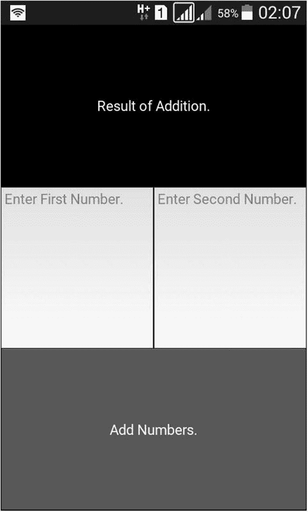

图 8-17

运行 Android 应用程序

如果机器连接并识别了一个 Android 设备，Buildozer 可以根据以下命令生成 APK 文件并在机器上安装它:

```py
ahmed-gad@ubuntu:~/ahmedgad/FirstApp$ buildozer android debug deploy run

```

在基于 Python Kivy 应用程序构建了基本的 Android 应用程序之后，我们可以开始构建更高级的应用程序。并非所有运行在桌面上的 Kivy 应用程序都可以直接在移动设备上运行。某些库可能不支持打包到移动应用程序中。例如，P4A 只支持一组可以在 Android 应用程序中使用的库。如果您使用了不支持的库，应用程序会崩溃。

P4A 支持 Kivy，它可以构建与我们之前讨论的完全一样的应用程序 UI。P4A 还支持其他库，如`NumPy`、`PIL`、`dateutil`、`OpenCV`、`Pyinius`、`Flask`等等。使用 Python 构建 Android 应用程序的限制是只能使用 P4A 支持的库集。在下一节中，我们将讨论如何从第 [3](3.html) 章中创建的应用程序构建一个 Android 应用程序，用于识别水果 360 数据集图像。

## Android 上的图像识别

第 [3](3.html) 章创建的应用程序从 Fruits 360 数据集提取特征，用于训练人工神经网络。在第 7 章[中，创建了一个 Flask 应用程序来从网络上访问它。在这一章中，我们将讨论如何将它打包到一个离线运行的 Android 应用程序中，并在设备上提取功能。](7.html)

首先要考虑的是这个应用程序中使用的库是否受 P4A 支持。使用的库如下:

*   `scikit-image`用于读取原始 RGB 图像并将其转换为 HSV。

*   `NumPy`用于提取特征(即色调直方图)，构建人工神经网络层，并进行预测。

*   `pickle`用于恢复使用遗传算法和所选特征元素的指数训练的网络的最佳权重。

从使用的库中，P4A 只支持 NumPy。不支持`scikit-image`和`pickle`。因此，我们必须找到 P4A 支持的替代库来取代这两个库。替换`scikit-image`的选项有`OpenCV`和`PIL`。我们只需要一个库来读取图像文件，并将其转换为 HSV，仅此而已。`OpenCV`比所需的两个功能更多。将这个库打包到 Android 应用程序中会增加它的大小。为此，使用`PIL`是因为它更简单。

关于`pickle`，我们可以用`NumPy`来代替。`NumPy`可以在扩展名为`.npy`的文件中保存和加载变量。因此，权重和所选元素指数将保存到`.npy`文件中，以便使用`NumPy`读取。

项目结构如图 [8-18](#Fig18) 所示。`Fruits.py`文件包含从测试图像中提取特征并预测其标签所需的函数。除了使用`NumPy`而不是`pickle`和`PIL`而不是`scikit-image`之外，这些功能与第 [3](3.html) 章中的功能几乎相同。清单 [8-16](#PC21) 中给出了该文件的实现。

`extract_features()`函数有一个代表图像文件路径的参数。它使用 PIL 读取它，并使用`convert`方法将其转换到 HSV 颜色空间。这个方法接受指定图像要被转换成 HSV 的`HSV`字符串。然后，`extract_features()`方法提取特征，根据所选索引的`.npy`文件过滤特征元素，最后返回。使`predict_outputs()`函数接受权重`.npy`文件路径，然后使用`NumPy`读取它，基于 ANN 对图像进行分类，并返回分类标签。

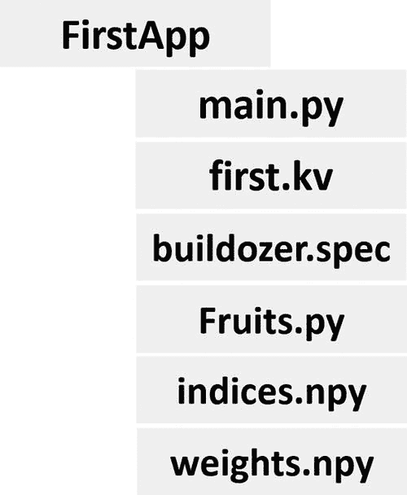

图 8-18

Android 上水果 360 数据集图像识别项目架构

```py
import numpy
import PIL.Image

def sigmoid(inpt):
    return 1.0/(1.0+numpy.exp(-1*inpt))

def relu(inpt):
    result = inpt
    result[inpt<0] = 0
    return result

def predict_output(weights_mat_path, data_inputs, activation="relu"):
    weights_mat = numpy.load(weights_mat_path)
    r1 = data_inputs
    for curr_weights in weights_mat:
        r1 = numpy.matmul(a=r1, b=curr_weights)
        if activation == "relu":
            r1 = relu(r1)
        elif activation == "sigmoid":
            r1 = sigmoid(r1)
    r1 = r1[0, :]
    predicted_label = numpy.where(r1 == numpy.max(r1))[0][0]
    return predicted_label

def extract_features(img_path):
    im = PIL.Image.open(img_path).convert("HSV")
    fruit_data_hsv = numpy.asarray(im, dtype=numpy.uint8)

    indices = numpy.load(file="indices.npy")

    hist = numpy.histogram(a=fruit_data_hsv[:, :, 0], bins=360)
    im_features = hist[0][indices]
    img_features = numpy.zeros(shape=(1, im_features.size))
    img_features[0, :] = im_features[:im_features.size]
    return img_features

Listing 8-16Fruits.py Module for Extracting Features and Classifying Images

```

清单 [8-17](#PC22) 中给出了负责构建应用程序 UI 的 KV 文件`first.kv`。值得一提的是，标签和按钮小部件的字体大小都是使用`font_size`属性增加的。另外，调用`classify_image()`方法来响应按钮部件`on_press`事件。

```py
BoxLayout:
    orientation: "vertical"
    Label:
        text: "Predicted Class Appears Here."
        font_size: 30
        id: label
    BoxLayout:
        orientation: "horizontal"
        Image:
            source: "apple.jpg"
            id: img
    Button:
        text: "Classify Image."
        font_size: 30
        on_press: app.classify_image()

Listing 8-17KV File of the Fruits Recognition Application

```

根据清单 [8-18](#PC23) ，在`main.py`文件中可以找到`classify_image()`方法的实现。该方法从 image 小部件的 source 属性加载要分类的图像的路径。该路径作为参数传递给水果模块中的`extract_features()`函数。`predict_output()`函数接受提取的特征、人工神经网络权重和激活函数。它在每一层的输入和它的权重之间的矩阵乘法之后返回分类标签。然后标签被打印在标签小部件上。

```py
import kivy.app
import Fruits

class FirstApp(kivy.app.App):
    def classify_image(self):
        img_path = self.root.ids["img"].source

        img_features = Fruits.extract_features(img_path)

        predicted_class = Fruits.predict_output("weights.npy", img_features, activation="sigmoid")

        self.root.ids["label"].text = "Predicted Class : " + predicted_class

firstApp = FirstApp(title="Fruits 360 Recognition.")
firstApp.run()

Listing 8-18Implementation of the main.py File of the Fruits Recognition Application

```

在开始构建 APK 文件之前，我们可以通过运行 Kivy 应用程序来确保一切正常。运行应用程序并按下按钮后，图像被分类；结果如图 [8-19](#Fig19) 所示。在确保应用程序成功运行之后，我们可以开始构建 Android 应用程序了。

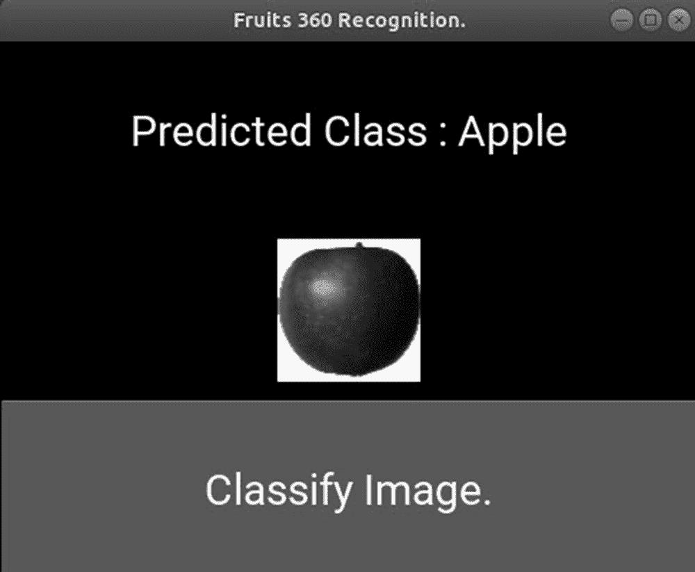

图 8-19

分类图像后运行 Kivy 应用程序的结果

在使用 Buildozer 构建应用程序之前，必须生成`buildozer.spec`文件。您可以使用`buildozer init`命令自动创建它。值得注意的是，在应用程序内部，我们使用两个`.npy`文件来表示过滤后的元素索引和权重。我们需要把它们放进 APK 的档案里。我们如何做到这一点？在`buildozer.spec`文件中，有一个名为`source.include_exts`的属性。它接受我们需要包含到 APK 文件中的所有文件的扩展名，用逗号分隔。这些文件位于应用程序的根目录下。例如，添加扩展名为`py`、`npy`、`kv`、`png`和`jpg`的文件，属性如下:

```py
source.include_exts = py,png,jpg,kv ,npy

```

成功执行应用程序的两个关键步骤是使用 PIL 将 RGB 图像转换为 HSV，以及使用 NumPy 中的`matmul()`函数进行矩阵乘法。注意使用提供这些功能的库版本。

关于从 RGB 到 HSV 的转换，请确保使用新版本的 PIL 枕头。它只是 PIL 的一个扩展，可以毫无区别地导入和使用。关于矩阵乘法，只有 NumPy 1 . 10 . 0 版及更高版本支持。注意不要使用较低的版本。这留下了一个额外的问题，即如何告诉 P4A 我们需要使用特定版本的库。一种方法是在对应于 NumPy 的 P4A 配方中指定所需的版本。这些方法位于 Buildozer 安装目录下的 P4A 安装目录中。例如，根据图 [8-20](#Fig20) 使用版本 1.10.1。基于指定的版本，库将从 Python 包索引(PyPI)下载，并在构建应用程序时自动安装。注意，为 Android 准备 Kivy 的环境比它的使用更难。我们生活在一个准备开发环境比开发本身更难的时代。

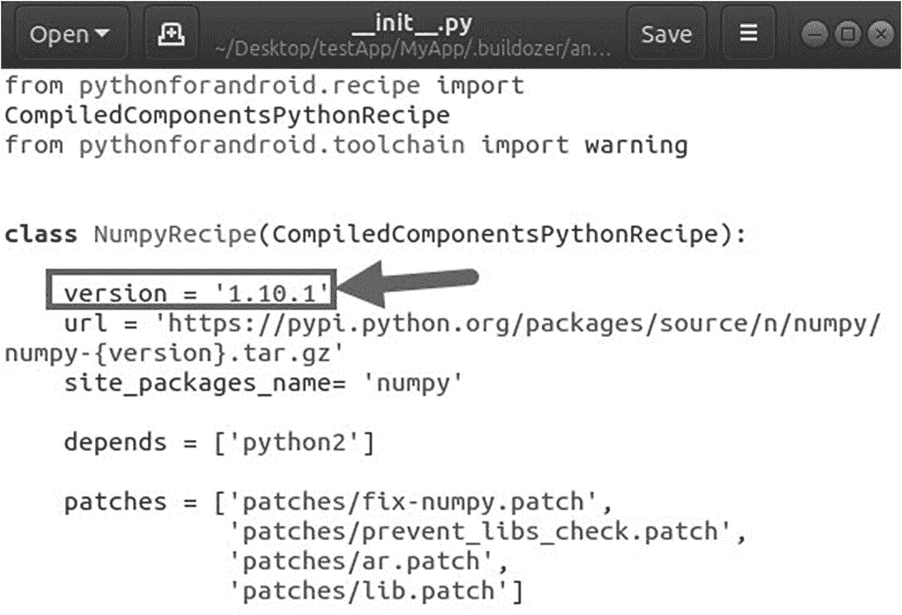

图 8-20

指定要安装的 NumPy 版本

现在我们已经准备好构建 Android 应用程序了。我们可以使用命令`buildozer android debug deploy run`在连接到开发机器的 Android 设备上构建、安装和运行应用程序。我们还可以使用`logcat`工具来打印设备的调试信息。只要在命令的末尾加上这个词。构建成功后，Android 应用 UI 将如图 [8-21](#Fig21) 所示。

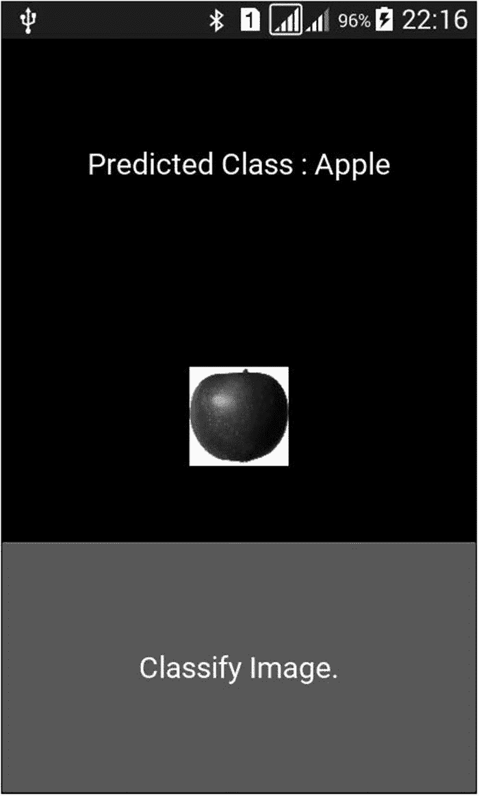

图 8-21

Android 应用程序的用户界面，用于对水果 360 数据集的图像进行分类

## 安卓上的 CNN

在第 [5 章](5.html)的第**节中，我们创建了一个使用`NumPy`从头构建 CNN 的项目。在本节中，这个项目将被打包到一个 Android 应用程序中，以便在设备上执行 CNN。项目结构如图 [8-22](#Fig22) 所示。`numpycnn.py`文件包含第 [5](5.html) 章中讨论的用于构建 CNN 层的所有函数。名为`main.py`的主应用程序文件有一个名为`NumPyCNNApp`的子类。这就是 KV 文件应该命名为`numpycnn.kv`的原因。`buildozer.spec`文件类似于我们之前讨论过的。我们将简单地讨论主文件和它的 KV 文件。根据本章前面的讨论，预计项目这一部分的大部分内容会很清楚。**

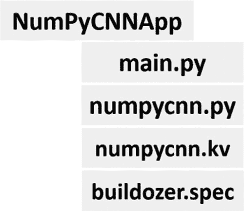

图 8-22

在 Android 上运行 CNN 的项目结构

我们将从清单 [8-19](#PC25) 中的 KV 文件开始。根小部件是一个垂直的`BoxLayout`，它有两个子部件`GridLayout`。第一个`GridLayout`小部件显示原始图像和 CNN 最后一层的结果。它被平均分配来容纳两个垂直的子`BoxLayout`窗口小部件。每个布局都有标签和图像小部件。标签只是让它指示原始图像和结果图像的位置。

根小部件的第二个子部件`GridLayout`，有三个小部件。第一个是一个`Button`，当它被按下时，通过调用主 Python 文件中的`start_cnn()`方法来执行 CNN。第二个是一个`Label`，打印执行完所有 CNN 图层后结果的大小。最后，第三个子组件是一个`TextInput`小部件，它允许用户以文本形式指定 CNN 的架构。例如，`conv2,pool,relu`表示网络由三层组成:第一层是具有四个过滤器的 conv 层，第二层是平均池层，第三层是 ReLU 层。当应用程序运行时，其用户界面如图 [8-23](#Fig23) 所示。

```py
BoxLayout:
    orientation: "vertical"
    GridLayout:
        size_hint_y: 8
        cols: 3
        spacing: "5dp", "5dp"
        BoxLayout:
            orientation: "vertical"
            Label:
                id: lbl1
                size_hint_y: 1
                font_size: 20
                text: "Original"
                color: 0, 0, 0, 1
            Image:
                source: "input_image.jpg"
                id: img1
                size_hint_y: 5
                allow_stretch: True
        BoxLayout:
            orientation: "vertical"
            Label:
                id: lbl2
                size_hint_y: 1
                font_size: 20
                text: ""
                color: 0, 0, 0, 1
            Image:
                id: img2
                size_hint_y: 5
                allow_stretch: True
    GridLayout:
        cols: 3
        size_hint_y: 1
        Button:
            text: "Run CNN"
            on_press: app.start_cnn()
            font_size: 20
            id: btn
        Label:
            text: "Click the button & wait."
            id: lbl_details
            font_size: 20
            color: 0, 0, 0, 1
        TextInput:
            text: "conv4,pool,relu"
            font_size: 20
            id: cnn_struct

Listing 8-19KV File of the CNN Kivy Application

```

清单 [8-20](#PC26) 中给出了`main.py`文件的实现。这个文件的入口点是`start_cnn()`方法。它从`Image`小部件中读取图像路径，并使用我们在前面的例子中讨论过的 PIL 来读取它。为简单起见，使用`convert()`方法将图像转换为灰色。字符`L`将图像转换成灰色。按下`Button`小部件后，该函数运行一个后台线程，该线程根据`TextInput`中指定的结构执行 CNN。最后一层的结果返回给`refresh_GUI()`方法。此方法在 UI 窗口上显示结果的第一个矩阵。


图 8-23

执行 CNN 的 Kivy 应用程序的主窗口

```py
import kivy.app
import PIL.Image
import numpy
import numpycnn
import threading
import kivy.clock

class NumPyCNNApp(kivy.app.App):

    def run_cnn_thread(self):
        layers = self.root.ids["cnn_struct"].text.split(",")
        self.root.ids["lbl_details.text"] = str(layers)
        for layer in layers:
            if layer[0:4] == "conv":
                if len(self.curr_img.shape) == 2:
                    l_filter = numpy.random.rand(int(layer[4:]), 3, 3)
                else:
                    l_filter = numpy.random.rand(int(layer[4:]), 3, 3, self.curr_img.shape[-1])
                self.curr_img = numpycnn.conv(self.curr_img, l_filter)
                print("Output Conv : ", self.curr_img.shape)
            elif layer == "relu":
                self.curr_img = numpycnn.relu(self.curr_img)
                print("Output RelU : ", self.curr_img.shape)
            elif layer == "pool":
                self.curr_img = numpycnn.avgpooling(self.curr_img)
                print("Output Pool : ", self.curr_img.shape)
            elif layer[0:2] == "fc":
                num_outputs = int(layer[2:])
                fc_weights = numpy.random.rand(self.curr_img.size, num_outputs)
                print("FC Weights : ", fc_weights.shape)
                self.CNN_FC_Out = numpycnn.fc(self.curr_img, fc_weights=fc_weights, num_out=num_outputs)
                print("FC Outputs : ", self.CNN_FC_Out)
                print("Output FC : ", self.CNN_FC_Out.shape)
            else:
                self.root.ids["lbl_details"].text = "Check input."
                break
        self.root.ids["btn.text"] = "Try Again."
        self.refresh_GUI()

    def start_cnn(self):
        img1 = self.root.ids["img1"]#Original Image
        im = PIL.Image.open(img1.source).convert("L")
        img_arr = numpy.asarray(im, dtype=numpy.uint8)
        self.curr_img = img_arr

        im_size = str(self.curr_img.shape)
        self.root.ids["lbl_details"].text = "Original image size " + im_size

        threading.Thread(target=self.run_cnn_thread).start()
        self.root.ids["btn"].text = "Wait."

    @kivy.clock.mainthread
    def refresh_GUI(self):
        im = PIL.Image.fromarray(numpy.uint8(self.curr_img[:, :, 0]))
        layer_size = str(self.curr_img.shape)
        im.save("res.png")
        self.root.ids["img2"].source = "res.png"
        self.root.ids["lbl2"].text = "Last Layer Result"
        self.root.ids["lbl_details"].text = "Out size "+layer_size

if __name__ == "__main__":
    NumPyCNNApp().run()

Listing 8-20Implementation of the Main File of the Kivy Application Executing CNN

```

线程执行`run_cnn_thread()`方法。该方法从分割从`TextInput`中检索的文本开始，分别返回每个层。基于 if 语句，从`numpycnn.py`文件中调用合适的函数来构建指定的 CNN 层。例如，如果当前字符串是`relu`，那么`relu`函数将被调用。追加到`conv`字符串的数字用作指定过滤器数量的参数。所有过滤器的形状都是 3×3。它们是随机填充的。如果有未识别的字符串，应用程序会在`Label`上显示一条消息，指出输入有问题。该函数执行完毕后，返回到`refresh_GUI()`方法。它显示返回的第一个矩阵，并在`Label`上打印其大小。

此应用程序的修改版本允许运行所有三个连续的 conv、池和 ReLU 层，并显示所有这些层返回的结果。基于前三层(两个过滤器，带有两个过滤器的 conv 层，接着是池化，然后是 ReLU)，所有返回的结果如图 [8-24](#Fig24) 所示。

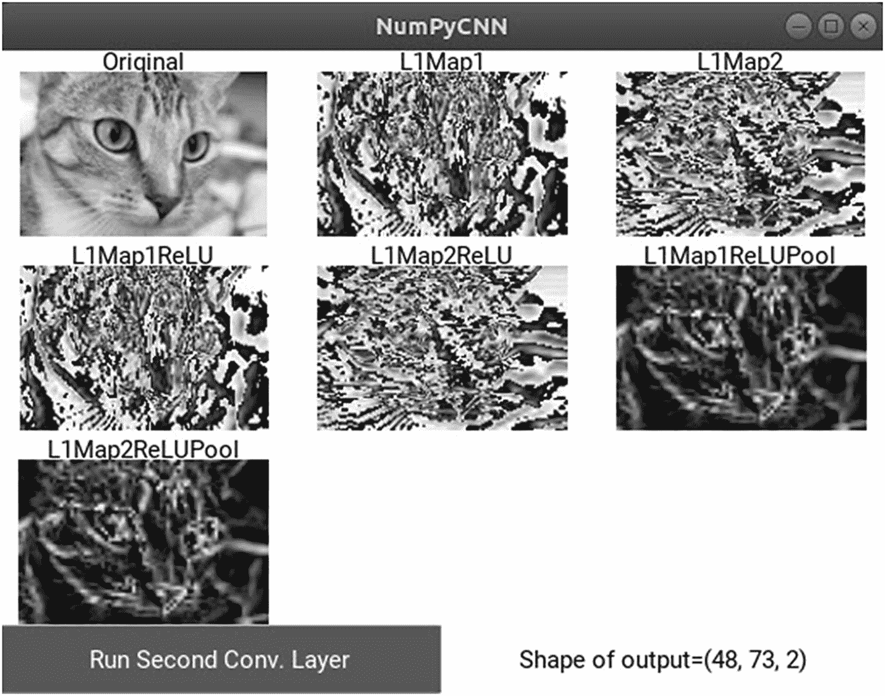

图 8-24

基于三层 CNN (conv2，pool，relu)的所有层的结果

在确保应用程序在桌面上运行良好之后，构建应用程序剩下的唯一文件是`buildozer.spec`文件。可以根据我们之前的讨论来准备。成功创建之后，我们可以像前面一样使用 Buildozer 开始构建它。在 Android 设备上运行应用程序后的用户界面如图 [8-25](#Fig25) 所示。


图 8-25

运行 Kivy 应用程序在 Android 设备上执行 CNN