# 三、Python 和 Scikit Image 的基础知识

在不使用编程语言的情况下进行图像处理就像你凝视夜空时数星星一样。有太多复杂的方法，即使我们尝试手动操作，也是不可能的。但是，如果我们使用 Python、R、C++、MATLAB 等编程语言，同样的工作可以在瞬间完成。

问题是，在我们开始应用任何图像处理方法之前，我们应该了解这门语言。本章旨在帮助你实现这两个目标。本章的前半部分讲述了 Python 的基本概念，这些概念在应用图像处理技术时非常有用。本章的后半部分着眼于 Python 的图像处理库:Scikit Learn。我们在前一章学习的所有概念，以及其他一些概念，都可以通过 Scikit Learn 在 Python 中应用。学完这一章，你应该对 Python 概念和基本的图像处理应用程序感到舒服了。

## Python 基础

在本节中，我们将简要介绍以下概念:

*   变量和数据类型

*   数据结构

*   控制流语句

*   条件语句

*   功能

### 变量和数据类型

关于 Python，我们需要了解的第一件事是如何保存数据，以及数据应该以何种格式保存。我们需要将我们的成像变量设置为一个容器，在其中存储数据。如果我们不使用变量，我们也许能够进行计算，但是我们将不能保存我们的输出。让我们看一个例子:

```py
name = 'Saurav'
age = 20
height = 6.5

```

在本例中，`name`、`age`和`height`分别是存储 Saurav、20 和 6.5 值的变量。命名变量时，我们需要遵循几条规则:

*   变量名必须以字母或下划线开头。

*   变量名的其余部分可以由字母、数字和下划线组成。

*   名称区分大小写。

*   我们不能使用 Python 内置名称。

现在我们需要看看数据类型。在前面的例子中，我们存储了三种数据:文本，用单引号括起来；一个整数和一个带小数的值。Python 自动知道引号内的任何东西都是字符串，不带小数的是 Int，带小数的是 Float。这是 Python 中的三种数据类型。

现在我们知道了如何在变量中保存一个值，我们可能需要打印它。打印可以按如下方式进行

```py
name = 'Saurav'
age = 20
height = 6.5
print(name,age,height)

Output: 20,6.5

```

或者作为

```py
name = 'Saurav'
age = 20
height = 6.5
print(name)
print(age)
print(height)

Output:
Saurav
20
6.5

```

或者作为

```py
name = 'Saurav'
age = 20
height = 6.5
print("the name is", name)
print("the age is", age)
print("the height is", height)

Output:
the name is Saurav'
the age is 20
the height is 6.5

```

另一种打印方式是使用连接器:

```py
name = 'Saurav'
age = 20
height = 6.5
print("My name is %s. My age and height is %d, %f" %(name, age, height))

Output:
My name is Saurav'. My age and height is 20, 6.5

```

上例中，`%s`代表字符串，其中“s”代表字符串；`%d`代表 Int，其中“d”代表数字或整数；而`%f`代表小数，其中“f”代表浮点数。因此，第一个连接器连接到第一个变量，第二个连接到第二个，第三个连接到第三个。一切都用“`%`”(图 [3-1](#Fig1) )连接。


图 3-1

连接器如何工作

### 数据结构

在上一节中，我们看到了如何在变量中保存一个值。但是，如果我们想要保存多个值，那么我们必须使用 Python 数据结构，包括以下内容:

*   列表

*   字典

*   元组

这些结构是图像处理中最广泛使用的结构。

#### 列表

我们可以使用列表在一个变量中存储多个值。举个例子，

```py
Age = [24,35,26,42]
Names = ["Sachin","Saurav","Rahul"]

```

如您所见，列表总是以方括号开始和结束。

#### 字典

字典是键和值的组合。就像普通的字典有单词和意思一样，你可以把键和值看作单词和意思。举个例子，

```py
Details ={"Sachin":24, "Saurav":35, "Rahul":42}

```

字典总是以花括号开始和结束。此外，键和值由冒号分隔。冒号前的第一个元素是键；冒号后的元素是值。

#### 元组

元组也以类似于列表的方式存储值。区别在于元组是不可变的——这意味着，一旦定义了元组，就不能修改值。元组以括号开始和结束。举个例子，

```py
Height = (6.5, 5.4, 5.11)

```

### 控制流语句

有两种控制流语句:

1.  一个循环

2.  一个循环

如果我们想多次重复一个特定的操作，我们使用控制流语句。假设我们想要生成一个两个乘法表。让我们看看如何使用一个`while`循环和一个`for`循环来实现这一点。

```py
count = 1
while count<=10:
 table = 2*count
 count = count+1
 print table
Output:
2
4
6
8
10
12
14
16
18
20

```

让我们检查一下`while`循环的语法。图 [3-2](#Fig2) 描述了一个`while`回路的功能。

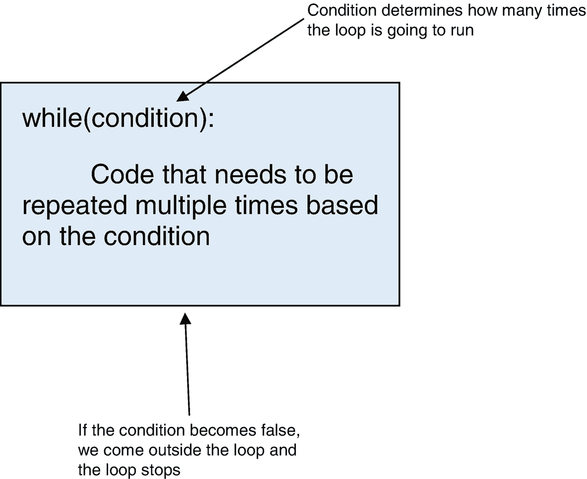

图 3-2

一个`while`循环如何工作

我们的代码片段中的循环将运行十次，因为我们插入了小于或等于十的条件。当计数达到 11 时，条件失败，我们退出循环。

现在让我们看看如何使用`for`循环来解决同样的问题。

```py
for i in range(10):
 table=2*(i+1)
 print(table)
Output:
2
4
6
8
10
12
14
16
18
20

```

图 [3-3](#Fig3) 描述了`for`回路的功能。

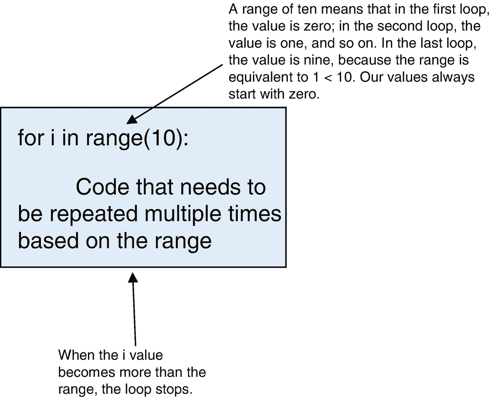

图 3-3

一个`for`循环如何工作

我们示例中的`for`循环将运行十次，因为我们已经规定了 10 的范围。当 I 的值等于 10 时，循环停止。

当我们需要基于条件的循环时，我们使用`while`循环；当我们有预定义的数字时，我们使用`for`循环。这两个循环在图像处理领域都非常重要，您将在后面看到。

### 条件语句

条件语句用于根据您提供的条件给出二进制结果。表 [3-1](#Tab1) 中讨论的所有条件均可用于以下示例。如果结果为 true 或 1，则执行条件语句中的代码块；否则，它不会。条件语句可以是以下类型:

表 3-1

*条件运算符*

<colgroup><col class="tcol1 align-center"> <col class="tcol2 align-center"></colgroup> 
| 

**条件**

 | 

**意为**

 |
| --- | --- |
| `a == b` | 检查 a 是否等于 b |
| `a != b` | 检查 a 是否不等于 b |
| `a < b` | 检查 a 是否小于 b |
| `a <= b` | 检查 a 是否小于等于 b |
| `a > b` | 检查 a 是否大于 b |
| `a >= b` | 检查 a 是否大于等于 b |

*   `if`

*   `if-else`

*   `if-elif-else`

让我们用一个例子来看看这三者。假设我们想给某次考试 80 分以上的学生打 A，给 60 分以上 80 分以下的学生打 B，给 59 分以下的学生打 C。代码如下:

```py
marks = 45
if marks >= 80:
 print("You got A Grade")
elif marks >=60 and marks <80:
 print("You got B Grade")
else:
 print("You got C Grade")
Output:
You got C Grade

```

这段代码一个接一个地执行。首先，变量`marks`被赋值为 45。然后遇到第一个条件语句。如果`marks`的值大于或等于 80，则分配 A 级。如果不是这种情况，就会遇到`elif`语句，它检查第二个条件。如果没有一个条件是真的，学生被分配一个 c。

### 功能

当您希望将复杂的代码封装在一个包装器中，然后多次使用该包装器而无需反复编写代码时，可以使用函数。这就像我们专门用一个罐子来装糖，每当我们想取出糖时，我们只使用那个罐子，而不是你放糖、盐、蔬菜和零食的袋子。

图 [3-4](#Fig4) 简单描述了功能。函数可以将一个或多个值作为输入，如 I1、I2、I3 等(In)，并将一个或多个结果作为输出(O)。

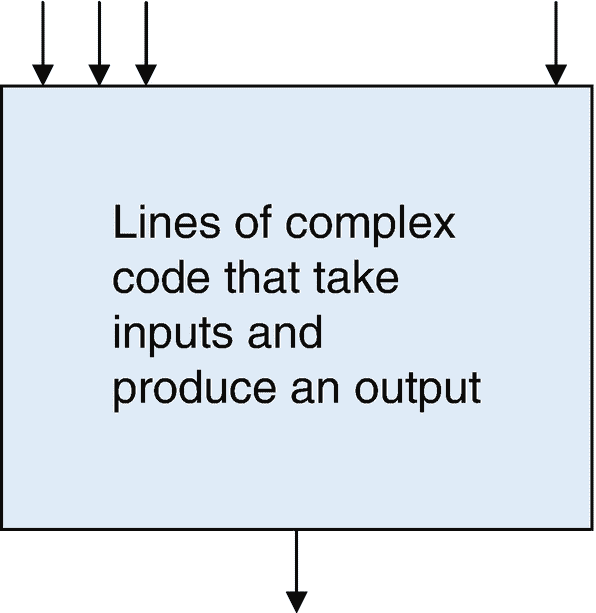

图 3-4

函数如何工作

让我们基于下面的例子来看看如何使用函数。到目前为止，我们已经使用`for`和`while`循环生成了两个乘法表，但是假设我们想要生成一个我们想要的任意数字的表呢？下面是实现这一点的代码:

```py
def table (a):
    for i in range(10):
        table = a*(i+1)
        print(table)

```

该函数将`a`作为输入，并生成一个包含`a`存储的任何值的表。让我们看看如何调用函数。假设我们想生成一个 10 和 17 的乘法表。我们称这个函数为:

```py
table(10)
Output:
10
20
30
40
50
60
70
80
90
100
table(17)
Output:
17
34
51
68
85
102
119
136
153
170

```

现在您已经了解了 Python 的基础知识，让我们继续讨论 Scikit Image。

## Scikit Image

Scikit Image 是一个用于进行基本图像处理的模块。在开始之前，让我们看一下模块的定义。模块是 Python 文件、类或函数的集合。我们可以将复杂冗长的代码保存在不同的文件中。为此，我们需要导入文件并在我们的环境中使用它们。首先，我们需要将 Scikit 映像导入到我们的环境中，如下所示:

```py
import skimage

```

这一行代码导入了进行基本图像分析所需的类和函数的完整集合。

我们可以使用 Scikit Image 应用我们在第 [2](2.html) 章中看到的所有概念。

在本节中，我们将了解使用 Scikit Image 和 Python 的以下操作:

*   上传和查看图像

*   获取图像分辨率

*   查看像素值

*   转换色彩空间

*   保存图像

*   创建基本绘图

*   进行伽马校正

*   旋转、移动和缩放图像

*   确定结构相似性

### 上传和查看图像

让我们看看如何将图像导入 Python 环境并在那里查看。我们从导入一个名为`skimage`的模块开始，这个模块包含了不同的图像处理算法。为了上传和查看图像，我们使用了来自`skimage`模块的一个名为`io`的类。在这个类内部，我们使用`imread`函数来上传和读取一个图像；功能`imshow`用于查看图像。让我们看一下代码。

```py
from skimage import io
img = io.imread('puppy.jpg')
io.imshow(img)
Output:

```

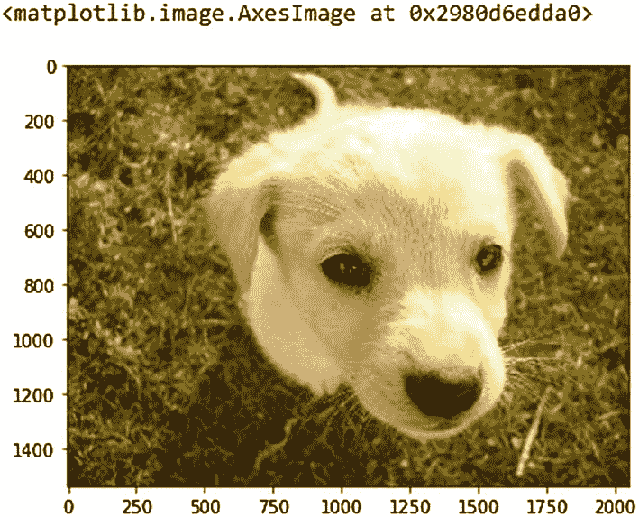

### 获取图像分辨率

为了获得图像的分辨率，我们使用一个名为`shape`的内置函数。当读取一幅图像时，所有的像素值都以数组格式存储；这个数组叫做 *numpy 数组*。在我们读取图像并将其转换为数组后，我们使用`shape`函数来查看分辨率。

在下面的代码中，您可以看到我们有一个分辨率为 1536 × 2048 的图像，它有三个通道(因为它是 RGB 颜色格式)。

```py
#Getting Image Resolution
from skimage import io
img = io.imread('puppy.jpg')
img.shape
Output:
(1536, 2048, 3)

```

### 查看像素值

既然我们知道了图像的分辨率，我们可能想要查看每个像素值。为此，我们将 numpy 数组保存在一行中，换句话说，我们使用一行来存储所有的像素值。当你看下面的代码时，你可以看到我们正在导入另一个名为`pandas`的模块。Pandas 用于读取、写入和处理各种文件格式。这里，我们以 Excel 格式保存像素值:

```py
#Getting Pixel Values
from skimage import io
import pandas as pd
img = io.imread('puppy.jpg')
df = pd.DataFrame(img.flatten())
filepath = 'pixel_values1.xlsx'
df.to_excel(filepath, index=False)

```

当我们查看导入行—`import pandas as pd`—这意味着我们将导入的模块重命名为`pd`。`flatten`功能用于将 RGB 图像的三维转换为一维。然后，我们将该图像保存在名为`pixel_values.xlsx`的 excel 文件中。为此，我们使用名为`to_excel`的熊猫函数。`DataFrame`函数将一维数组转换成类似 Excel 的格式，包含行和列。可以打印`df`变量来查看数据帧结构。

### 转换色彩空间

假设我们的图像在 RGB 颜色空间。我们可能希望将其转换成不同的颜色格式，如第 [2](2.html) 章所述。在这一节中，我们看看不同的转换，然后将图像转换回其原始的 RGB 格式。

在查看代码之前，我们必须检查我们将使用的函数。为了将图像转换成不同的颜色格式，我们需要使用类`color`，它存在于`skimage`模块中。在这个类中，我们可以使用以下函数:

*   `rgb2hsv`

*   `hsv2rgb`

*   `rgb2xyz`

*   `xyz2rgb`

*   `rgb2grey`

*   `grey2rgb`

*   `rgb2yuv`

*   `yuv2rgb`

*   `rgb2lab`

*   `lab2rgb`

*   `rgb2yiq`

*   `yiq2rgb`

*   `rgb2ypbpr`

*   `ypbpr2rgb`

另外，我们还需要使用一个模块，叫做`pylab`。我们通过使用`*`来导入`pylab`中的所有类。我们用`pylab`来看不同区块的不同图形。然后我们使用函数`figure`一次显示多个图像。现在让我们看看所有的代码及其输出。

#### RGB 到 HSV，反之亦然

```py
#Import libraries
from skimage import io
from skimage import color
from skimage import data
from pylab import *
#Read image
img = io.imread('puppy.jpg')

#Convert to HSV

img_hsv = color.rgb2hsv(img)

#Convert back to RGB
img_rgb = color.hsv2rgb(img_hsv)

#Show both figures
figure(0)
io.imshow(img_hsv)
figure(1)
io.imshow(img_rgb)

Output:

```

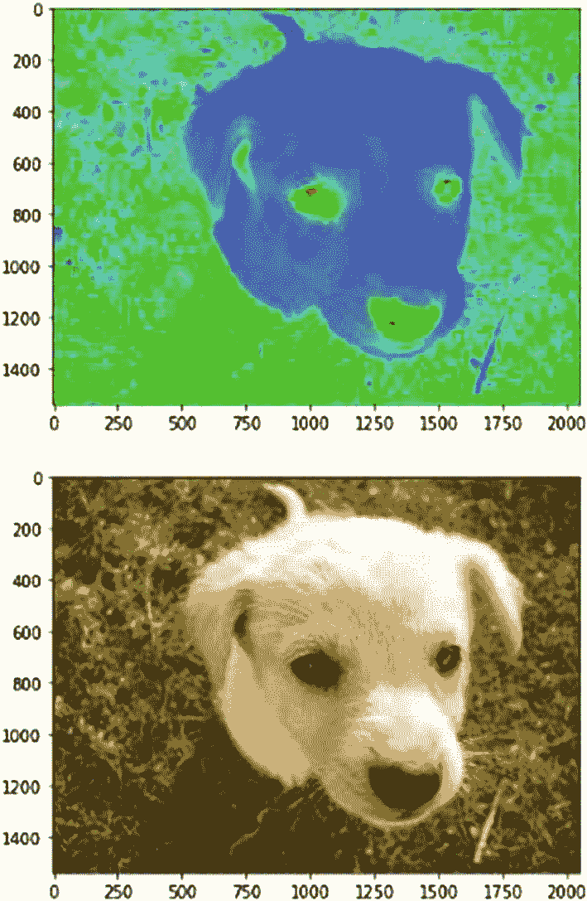

#### RGB 到 XYZ，反之亦然

```py
#Import libraries
from skimage import io
from skimage import color
from skimage import data
#Read image
img = io.imread('puppy.jpg')

#Convert to XYZ
img_xyz = color.rgb2xyz(img)

#Convert back to RGB
img_rgb = color.xyz2rgb(img_xyz)

#Show both figures
figure(0) 

io.imshow(img_xyz)
figure(1)
io.imshow(img_rgb)

Output:

```

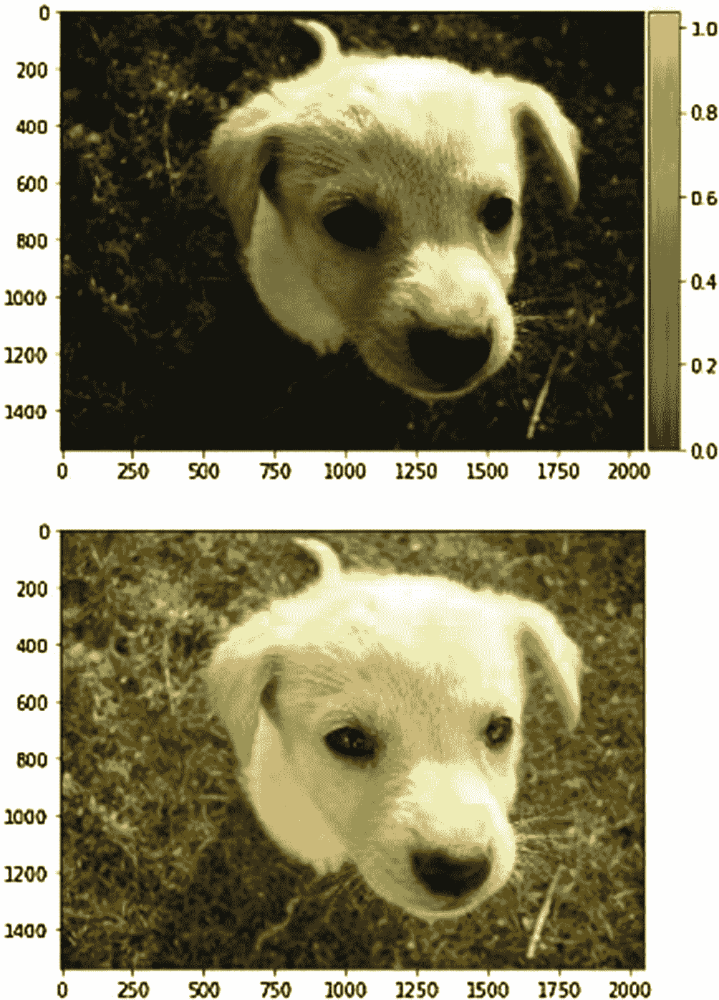

#### RGB 到 LAB，反之亦然

```py
#Import libraries
from skimage import io
from skimage import color
#Read image
img = io.imread('puppy.jpg')

#Convert to LAB
img_lab = color.rgb2lab(img)

#Convert back to RGB

img_rgb = color.lab2rgb(img_lab)

#Show both figures
figure(0)
io.imshow(img_lab)
figure(1)
io.imshow(img_rgb)

Output:

```


#### RGB 到 YUV，反之亦然

```py
#Import libraries
from skimage import io
from skimage import color
#Read image
img = io.imread('puppy.jpg')

#Convert to YUV
img_yuv = color.rgb2yuv(img)

#Convert back to RGB
img_rgb = color.yuv2rgb(img_yuv)

#Show both figures

figure(0)
io.imshow(img_yuv)
figure(1)
io.imshow(img_rgb)

Output:

```

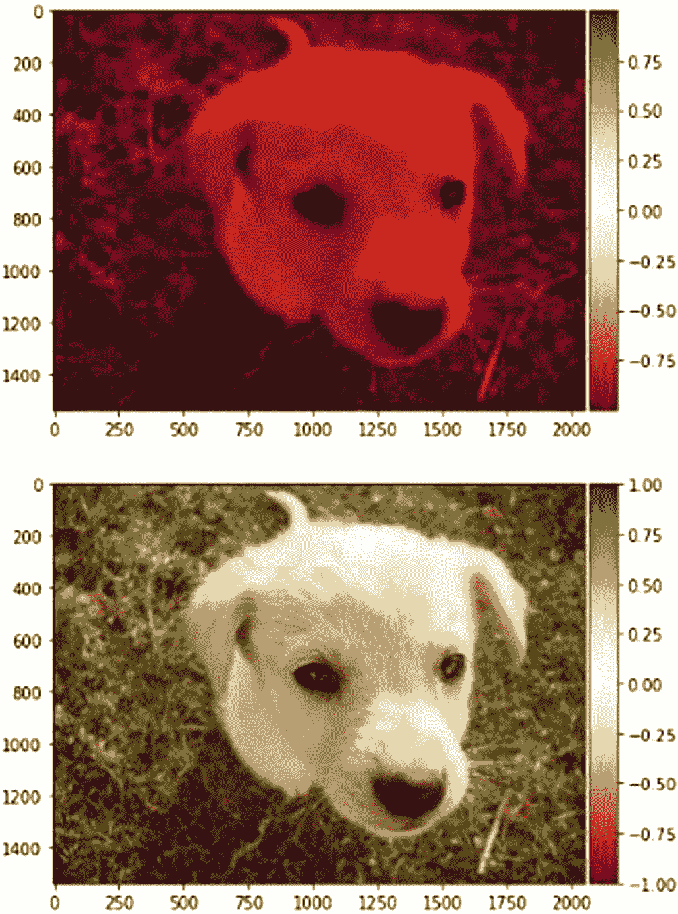

#### RGB 到 YIQ，反之亦然

```py
#Import libraries
from skimage import io
from skimage import color
#Read image
img = io.imread('puppy.jpg')

#Convert to YIQ
img_yiq = color.rgb2yiq(img)

#Convert back to RGB
img_rgb = color.yiq2rgb(img_yiq)

#Show both figures

figure(0)
io.imshow(img_yiq)
figure(1)
io.imshow(img_rgb)

Output:

```

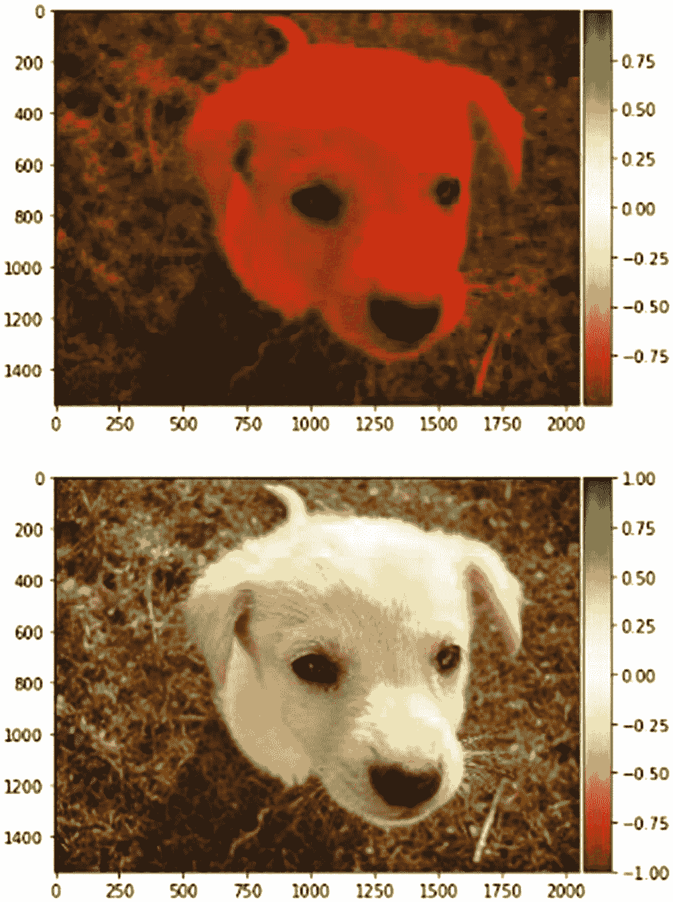

#### RGB 到 YPbPr，反之亦然

```py
#Import libraries
from skimage import io
from skimage import color
#Read image
img = io.imread('puppy.jpg')

#Convert to YPbPr
img_ypbpr= color.rgb2ypbpr(img)

#Convert back to RGB
img_rgb= color.ypbpr2rgb(img_ypbpr)

#Show both figures

figure(0)
io.imshow(img_ypbpr)
figure(1)
io.imshow(img_rgb)

Output:

```

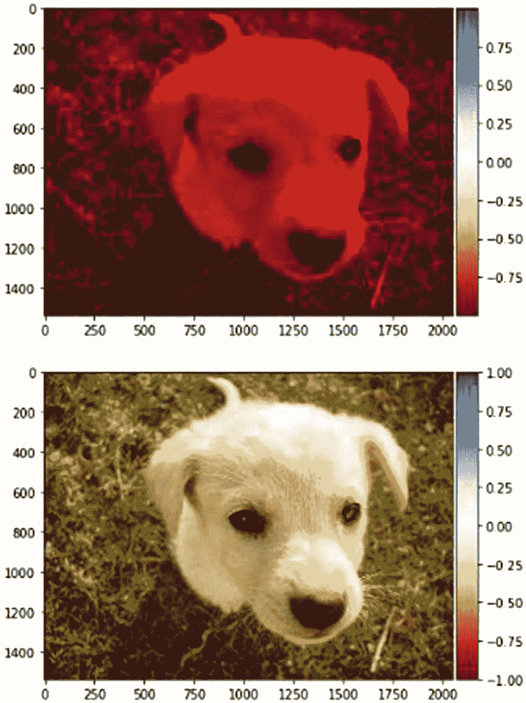

### 保存图像

每次图像分析后，我们可能想要保存图像。为此，我们使用名为`imsave`的`skimage io`函数。在下面的代码中，第一个参数包括要保存图像的文件的名称；第二个是包含图像的变量。

```py
#Import libraries
from skimage import io
from skimage import color
from pylab import *
#Read image
img = io.imread('puppy.jpg')

#Convert to YPbPr
img_ypbpr= color.rgb2ypbpr(img)

#Convert back to RGB

img_rgb= color.ypbpr2rgb(img_ypbpr)

io.imsave("puppy_ypbpr.jpg", img_ypbpr)

```

### 创建基本绘图

在一幅图像中，我们可能想要绘制某些图形。这些图形可以是简单的，如直线，也可以是复杂的，如椭球面。我们来看一些使用名为`draw`的`skimage`绘图类的基本绘图。

#### 线

`line`功能用于在图像上绘制简单的线条。在下面的代码中，前两个参数表示第一个点；最后两个参数表示第二点。然后用这些点画一条线。然后我们可以改变线条的像素值，这样我们就可以在图像上看到线条。

```py
from skimage import io
from skimage import draw

img = io.imread('puppy.jpg')
x,y = draw.line(0,0,1000,1000)
img[x, y] = 0
io.imshow(img)

Output:

```


#### 长方形

为了画矩形，我们使用函数`polygon`。我们不仅可以画矩形，还可以画任何我们想要的多边形。我们所要做的就是给出 x 和 y 坐标，然后定义宽度和高度。

在下面的代码中，我使用了函数`rectangle`。它返回一个带有我们更改的像素值的形状，就像前面的线条示例一样。

```py
from skimage import io
from skimage import draw

img = io.imread('puppy.jpg')
def rectangle(x, y, w, h):
 rr, cc = [x, x + w, x + w, x], [y, y, y + h, y + h]
 return (draw.polygon(rr, cc))
rr, cc = rectangle(10, 10, 500,500)
img[rr, cc] = 1
io.imshow(img)

Output:

```

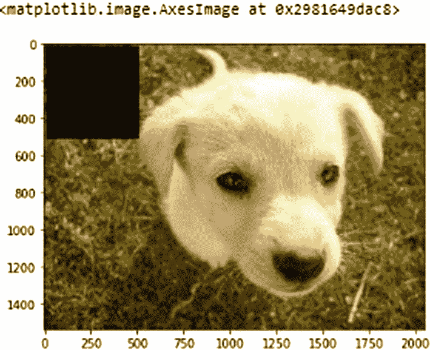

#### 环

`circle`功能用于画圆。在下面的代码中，前两个参数指示圆在图像中的位置；最后一个参数表示半径。

```py
#Import libraries
from skimage import io
from skimage import draw

#Load image
img = io.imread('puppy.jpg')

#Define circle coordinates and radius
x, y = draw.circle(500,500, 100)

#Draw circle
img[x, y] = 1

#Show image
io.imshow(img)

Output:

```

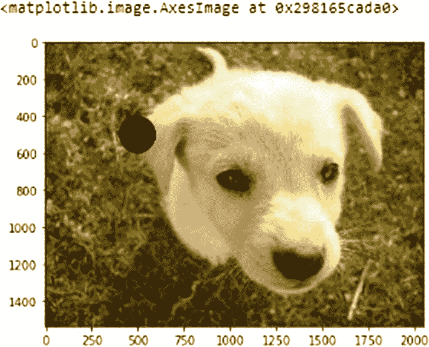

#### 贝塞尔曲线

为了画一条贝塞尔曲线，我们使用函数`bezier_curve. W` e 需要指出三个或更多控制点的位置，然后塑造曲线。以下代码中的前六个参数定义了三点；最后一个参数定义了线中的张力。用不同的值改变曲线。

```py
#Import libraries
from skimage import io
from skimage import draw

#Load image
img = io.imread('puppy.jpg')

#Define Bezier curve coordinates
x, y = draw.bezier_curve(0,0, 500, 500, 900,1200,100)
#Draw Bezier curve
img[x, y] = 1

#Show image
io.imshow(img)

Output:

```

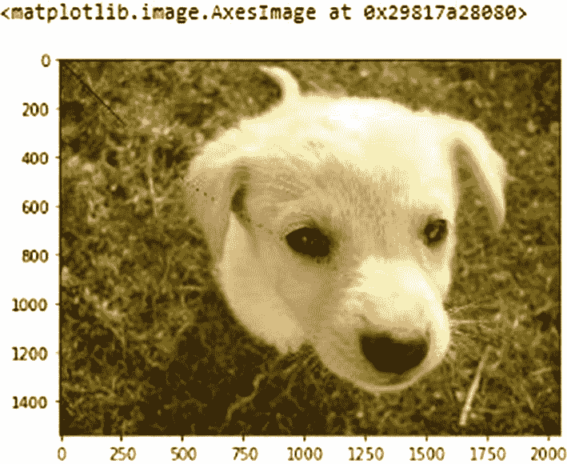

### 进行伽马校正

为了执行图像的伽马校正，基于显示仪器，我们使用`skimage`中的`exposure`类。`exposure`类包含一个名为`adjust_gamma`的函数，我们用它给出一个图像作为输入和我们想要的最终灰度值。通过这种方式，我们得到了伽马校正的图像。

```py
from skimage import exposure
from skimage import io
from pylab import *
img = io.imread('puppy.jpg')
gamma_corrected1 = exposure.adjust_gamma(img, 0.5)
gamma_corrected2 = exposure.adjust_gamma(img, 5)
figure(0)
io.imshow(gamma_corrected1)
figure(1)
io.imshow(gamma_corrected2)

Output:

```

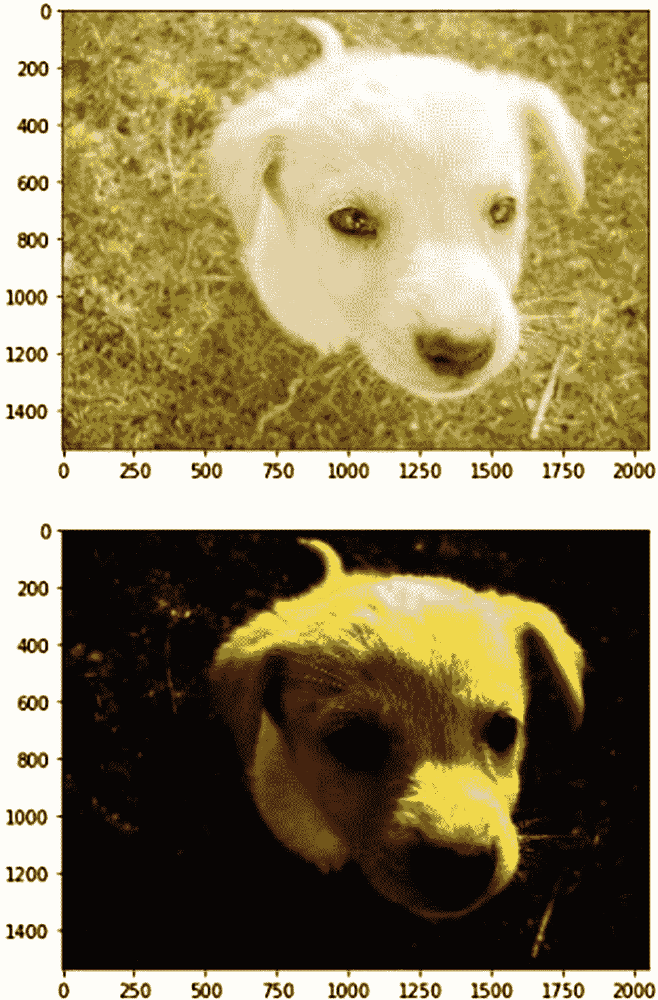

## 旋转、移动和缩放图像

有时我们可能想要旋转图像或改变其大小。为此，我们使用了`skimage`模块中的`transform`类。`transform`有两个功能:`rotate`和`resize`。`rotate`以旋转角度为参数；`resize`将新尺寸作为其参数。

```py
from skimage import io
from skimage.transform import rotate

img = io.imread('puppy.jpg')
img_rot = rotate(img, 20)
io.imshow(img_rot)

Output:

```


```py
from skimage import io

from skimage.transform import resize
img = io.imread('puppy.jpg')
img_res = resize(img, (100,100))
io.imshow(img_res)
io.imsave("ss.jpg", img_res)

Output:

```


## 确定结构相似性

正如我前面解释的，结构相似性被用来寻找指示两幅图像相似程度的指数。值越接近 1 意味着图像非常相似；越接近零的值意味着它们越不相似。在下面的代码中，对于相似图像的第一次比较，我们得到的 SSIM 输出为 1.0。在第二段代码中，我们将该图像与其 YPbPr 对应图像进行比较，我们得到的 SSIM 值为 0.43，这表明相似度较低。

```py
from skimage import io
from skimage.measure import compare_ssim as ssim
img_original = io.imread('puppy.jpg')
img_modified = io.imread('puppy_ypbpr.jpg')

ssim_original = ssim(img_original, img_original, data_range=img_original.max() - img_original.min(), multichannel=True)
ssim_different = ssim(img_original, img_modified, data_range=img_modified.max() - img_modified.min(), multichannel=True)
print(ssim_original,ssim_different)
Output:
1.0 0.4348875243670361

```

SSIM 提出了三个论点。第一指形象；第二个指示像素的范围(最高像素颜色值减去最低像素颜色值)。第三个参数是`multichannel`。True 值意味着图像包含多个通道，如 RGB。False 表示只有一个通道，如灰度。

在下一章中，我们将使用名为 OpenCV 的计算机视觉库来研究高级图像处理概念。