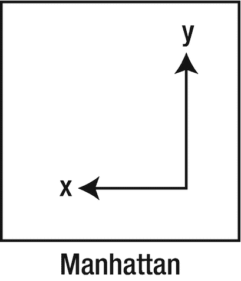
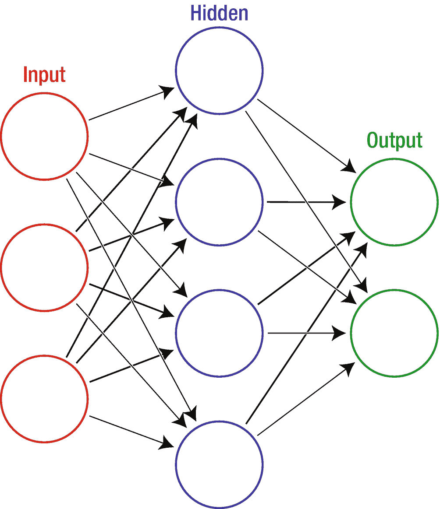
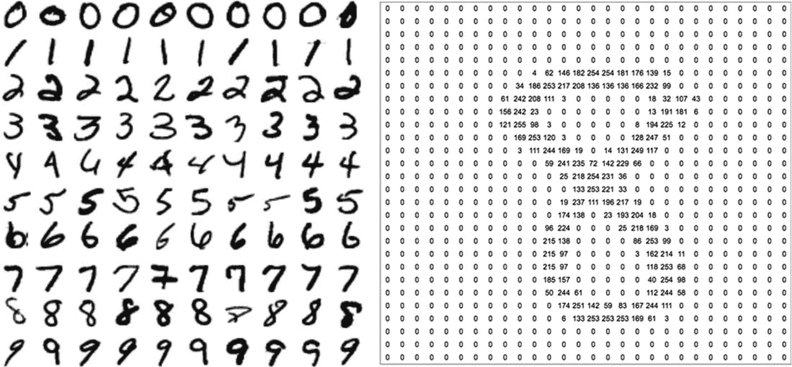
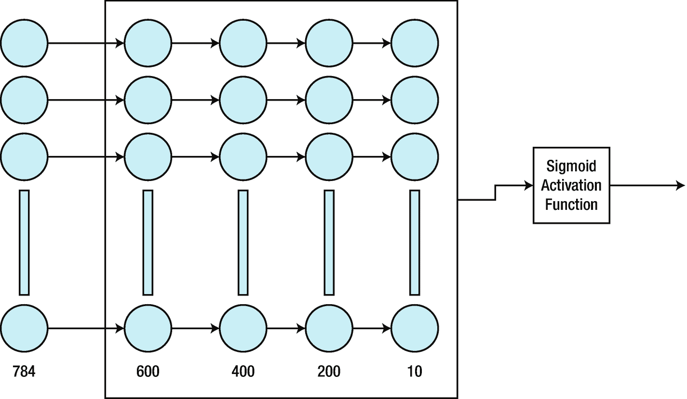
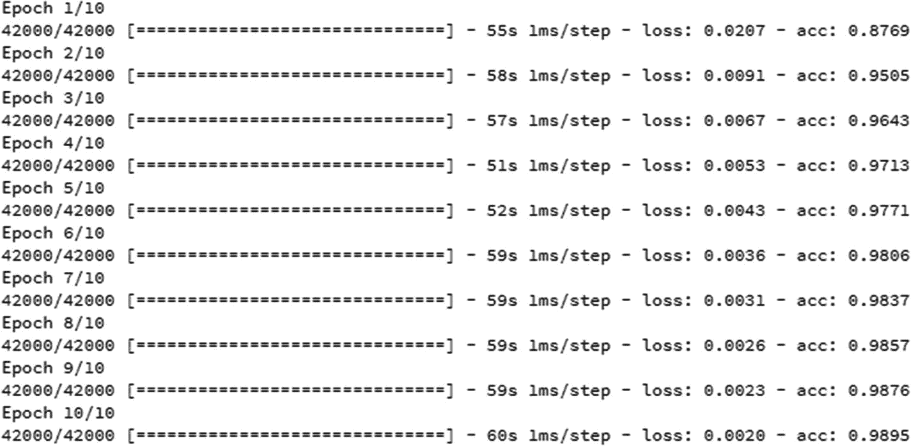
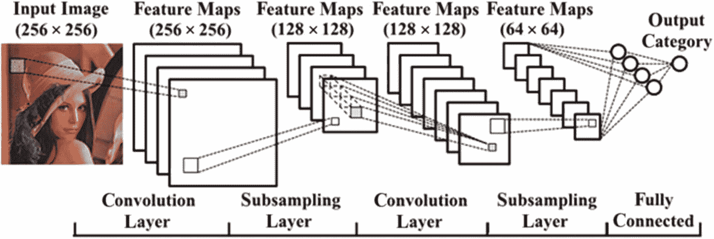
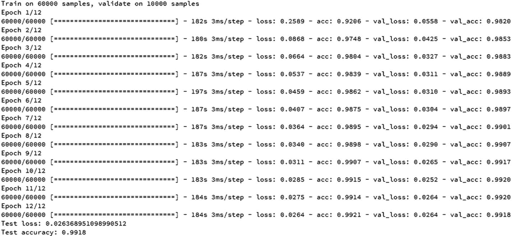

# 五、使用机器学习的图像处理

本章开始时，我们将研究一些最广泛使用的图像处理算法，然后继续讨论图像处理中的机器学习实现。这一章的内容如下:

*   使用尺度不变特征变换(SIFT)算法的特征映射

*   基于随机样本一致性算法的图像配准

*   基于人工神经网络的图像分类

*   基于卷积神经网络的图像分类

*   使用机器学习的图像分类

*   重要术语

## 使用 SIFT 算法的特征映射

假设我们有两幅图像。一张图片是公园里的长椅。第二个图像是整个公园，也包括长凳。现在假设我们想要编写代码来帮助我们找到公园图像中的长椅。你可能认为这是一个简单的任务，但是让我增加一些复杂性。如果长凳的图像是放大的图像怎么办？或者是旋转了呢？还是两者都有？你现在打算怎么处理？

答案在于尺度不变特征变换，或 SIFT 算法。顾名思义，它是比例不变的，这意味着无论我们将图像放大(或缩小)多少，我们仍然可以找到相似之处。这种算法的另一个特点是它是旋转不变的。无论旋转角度如何，它仍然表现良好。这个算法的唯一问题是它是有专利的，这意味着对于学术目的来说它是好的，但是对于商业目的来说，使用它可能会涉及很多法律问题。然而，这不会阻止我们现在学习和应用这个算法。

我们首先必须了解算法的基础。然后，我们可以使用 Python 来应用它来寻找两幅图像之间的相似之处，然后我们将逐行查看代码。

让我们看看 SIFT 算法在处理过程中试图提取的图像特征:

*   缩放(放大或缩小的图像)

*   循环

*   照明

*   远景

如你所见，SIFT 算法不仅考虑了缩放和旋转，还考虑了图像中的光照和我们观看的视角。但是它是如何做到这一切的呢？让我们来看看使用 SIFT 算法的一步一步的过程:

1.  寻找并构建一个空间以确保尺度不变性

2.  找出高斯人之间的区别

3.  找到图像中的重点

4.  删除不重要的点，以进行有效的比较

5.  为步骤 3 中发现的要点提供方向

6.  独特地识别关键特征。

### 第一步:空间建设

在第一步中，我们获取原始图像并执行高斯模糊，以便我们可以移除图像中的一些不重要的点和额外的噪声。完成后，我们调整图像的大小并重复这个过程。调整大小和模糊取决于各种因素，但我们不会在这里进入数学细节。

### 第二步:高斯人之间的差异

在第二步中，我们获取第一步中的图像，并找出它们的值之间的差异。这使得图像比例不变。

### 第三步:重点

在第三步中，我们确定重要点(也称为*关键点*)。我们在步骤 3 中发现的高斯图像之间的差异用于确定局部最大值和最小值。我们取每个像素，然后检查它的邻居。如果该像素在其所有邻居中最大(最大)或最小(最小)，则该像素被标记为关键点。

下一步是找到子像素最大值和/或最小值。我们使用一种叫做*泰勒展开*的数学概念来寻找子像素。当找到子像素时，我们使用相同的过程再次尝试找到最大值和最小值。此外，为了只将拐角作为关键点，我们使用了一个叫做*海森矩阵*的数学概念。角落总是被认为是最好的关键点。

### 第四步:不重要的要点

在这一步中，我们首先确定一个阈值。在关键点生成的图像和亚像素图像中，我们用阈值检查像素强度。如果它小于阈值，我们认为它是一个不重要的关键点，拒绝它。

### 步骤 5:关键点的定位

我们找到每个关键点及其相邻点的梯度方向和幅度，然后我们查看关键点周围最普遍的方向，并将其分配给它。我们使用直方图来寻找这些方向并得到最终的方向。

### 第六步:关键特征

为了使关键点独一无二，我们从中提取关键特征。此外，我们确保在将这些关键点与第二幅图像进行比较时，它们看起来不应该完全相似，而是几乎相似。

现在我们知道了算法的基础，让我们来看看算法应用于一对图像的代码。

```py
import cv2
import numpy as np
import matplotlib.pyplot as plt
from Sift_Operations import *

print("'Make Sure that both the images are in the same folder"')

x = input("Enter First Image Name: ")
Image1 = cv2.imread(x)
y = input("Enter Second Image Name: ")
Image2 = cv2.imread(y)

Image1_gray = cv2.cvtColor(Image1, cv2.COLOR_BGR2GRAY)
Image2_gray = cv2.cvtColor(Image2, cv2.COLOR_BGR2GRAY)

Image1_key_points, Image1_descriptors = extract_sift_features(Image1_gray)
Image2_key_points, Image2_descriptors = extract_sift_features(Image2_gray)

print( 'Displaying SIFT Features')
showing_sift_features(Image1_gray, Image1, Image1_key_points);

norm = cv2.NORM_L2
bruteForce = cv2.BFMatcher(norm)

matches = bruteForce.match(Image1_descriptors, Image2_descriptors)

matches = sorted(matches, key = lambda match:match.distance)

matched_img = cv2.drawMatches(
    Image1, Image1_key_points,
    Image2, Image2_key_points,
    matches[:100], Image2.copy())

plt.figure(figsize=(100,300))
plt.imshow(matched_img)

```

上面的代码将整个 SIFT 算法应用于一对图像。但是，该算法保存在一个名为`Sift_Operations.py`的 Python 文件中，与该代码位于同一目录下。让我们看看里面的代码。

```py
import cv2
import numpy as np
import matplotlib.pyplot as plt

def extract_sift_features(img):
    sift_initialize = cv2.xfeatures2d.SIFT_create()
    key_points, descriptors = sift_initialize.detectAndCompute(img, None)
    return key_points, descriptors

def showing_sift_features(img1, img2, key_points):
    return plt.imshow(cv2.drawKeypoints(img1, key_points, img2.copy()))

```

现在让我们检查代码，根据需要从一个文件跳到另一个文件:

1.  接下来，我们将图像转换为灰度。SIFT 需要灰度图像来执行其操作。我们使用 OpenCV 函数`cv2.cvtColor`进行颜色格式转换。


图 5-1

原始图像

1.  在主代码中，我们导入了重要的库:OpenCV、Numpy、Matplotlib 和自定义模块`Sift_Operations`。`import *`表示导入 Python 文件中存在的所有内容。

2.  接下来，我们读取两幅图像，我们必须对其应用 SIFT 操作。图 5-1 显示了我导入的图像。

1.  现在我们将这两个图像传递给函数`extract_sift_features`，它存储在文件`Sift_Operations.py`中。该函数返回在图像中找到的关键点，以及这些点的特征和描述符的名称。让我们从内部来看看这个函数:

    `sift_initialize = cv2.xfeatures2d.SIFT_create()`
    1.  前面一行代码将整个 SIFT 存储在变量`sift_initialize`中。

    2.  `detectAndCompute`方法用于将算法应用于图像，w 返回关键点和描述符:

        `key_points, descriptors = sift_initialize.detectAndCompute(img, None)`

    3.  然后返回这些值:

        `return key_points, descriptors`

    4.  回到调用代码，这些值存储在特定于图像的不同变量中:

```py
Image1_gray = cv2.cvtColor(Image1, cv2.COLOR_BGR2GRAY)

Image2_gray = cv2.cvtColor(Image2, cv2.COLOR_BGR2GRAY)

```

1.  接下来，初始化`cv2.BFMatcher`函数。它用于寻找关键点的描述符之间的匹配。然后将`norm`变量作为参数传递。它告诉`BFMatcher`使用曼哈顿距离来执行匹配。初始化的算法保存在一个名为`bruteForce`的变量中。

2.  将两个描述符进行匹配`bruteForce.match`，然后根据曼哈顿距离对匹配进行排序:

    ```py
    matches = bruteForce.match(Image1_descriptors, Image2_descriptors)

    matches = sorted(matches, key = lambda match:match.distance)

    ```

3.  `T`两幅图像的关键点基于前 100 个排序匹配进行连接:

    ```py
    matched_img = cv2.drawMatches(

    Image1, Image1_key_points,

    Image2, Image2_key_points,

    matches[:100], Image2.copy())

    ```

4.  最后，显示匹配的图像:

    ```py
    plt.figure(figsize=(100,300))

    plt.imshow(matched_img)

    ```



图 5-2

曼哈顿距离

1.  然后显示这些特征，以便我们可以看到关键点和相似之处。方法`showing_sift_features`就是用来做这件事的。

2.  让我们从内部来看这个方法。`cv2.drawKeypoints`用于绘制两幅图像中发现的关键点。

3.  变量`norm`随后被初始化并用于寻找关键点之间的距离。`cv2.Norm_L2`用于计算曼哈顿距离(图 5-2 )，曼哈顿距离是沿直角-90 度轴测量的两点之间的距离。不是直线距离；它遵循网格方法。

```py
Image1_key_points, Image1_descriptors = extract_sift_features(Image1_gray)

Image2_key_points, Image2_descriptors = extract_sift_features(Image2_gray)

```

整个代码的输出如图 5-3 所示。


图 5-3

使用 SIFT 算法找到的相似性

## 使用 RANSAC 算法的图像配准

假设我们有一个地方的两张鸟瞰图。一张图片使用卫星描绘了这个地方，而第二张图片使用无人机展示了同一张图片的一部分。卫星图像以年为单位进行更新，而无人机图像的拍摄频率要高得多。因此，可能会出现无人机图像捕捉到卫星图像中看不到的发展的情况。在这种情况下，我们可能希望将无人机图像放在与卫星图像完全相同的位置，但也显示最新的更新。这种将一幅图像叠加在另一幅图像上的过程被称为*图像配准*。

RANSAC 是用于图像配准的最佳算法之一，它包括四个步骤:

1.  特征检测和提取

2.  特征匹配

3.  转换函数拟合

4.  图像变换和图像重采样

在第三步中使用 RANSAC 算法来寻找变换函数。我们拍摄两幅图像，然后使用 RANSAC 算法，找到这些图像之间的单应性(相似性)。让我们简单地看一下算法:

1.  随机找到两幅图像的四个共同特征点，然后找到单应矩阵*。

2.  重复这个步骤多次，直到我们得到一个具有最大内联数的单应矩阵

让我们用 Python 来应用这个算法。代码由三个自定义模块组成:`Ransac.py`、`Affine.py`和`Align.py`。`ransac`包含整个 RANSAC 算法，`Affine`用于对图像进行旋转、平移和缩放操作。`Align`用于对齐图像，使其完全对准原始图像。

让我们一行一行地看代码:

1.  首先，我们导入重要的库以及刚刚提到的定制模块。

    ```py
    import numpy as np
    Import cv2
    from Ransac import *
    from Affine import *
    from Align import *

    ```

2.  然后，我们上传想要在第二个图像(目标图像)上注册的图像。接下来，我们上传目标图像。

    ```py
    img_source = cv2.imread("source.jpg")
    img_target = cv2.imread("target.jpg")

    ```

3.  现在，我们使用存储在`Align`模块中的函数`extract_SIFT`来提取关键点和相关描述符(我在上一节解释了这段代码)。

    ```py
    keypoint_source, descriptor_source = extract_SIFT(img_source)
    keypoint_target, descriptor_target = extract_SIFT(img_target)

    ```

4.  接下来，我们使用函数`match_SIFT`获得上一步中找到的所有点的位置:

    ```py
    pos = match_SIFT(descriptor_source, descriptor_target)

    ```

5.  在`match_SIFT`方法中，我们试图在所有匹配的描述符中获得最佳的两个匹配。为此，我们使用函数`BFMatcher`和`knnMatch`。让我们来看看这段代码，它保存在`Align`模块:

    ```py
    bf = cv2.BFMatcher()
    matches = bf.knnMatch(descriptor_source, descriptor_target, k=2)

    ```

    中
6.  我们必须创建一个空的 numpy 数组来存储关键点的位置。姑且称之为`pos`。根据 D. Lowe 的比率测试，我们只将那些比率小于或等于 0.8 的点放入`pos`中(参见本章末尾的重要术语)。

    ```py
    for i in range(matches_num):
            if matches[i][0].distance <= 0.8 * matches[i][1].distance:
                temp = np.array([matches[i][0].queryIdx,
                                 matches[i][0].trainIdx])
                pos = np.vstack((pos, temp))

    ```

7.  `trainIdx`返回描述符在源中的索引，而`queryIdx`返回描述符在目标中的索引。这些是我们在`pos`变量中垂直堆栈的实际位置，然后返回它。

    ```py
    return pos

    ```

8.  现在我们有了描述符的位置，我们使用`Align`模块中的函数`affine_matrix`来获得单应矩阵，我们在图像配准中使用它。

    ```py
    H = affine_matrix(keypoint_source, keypoint_target, pos)

    ```

9.  让我们看看函数的内部:
    1.  首先，我们基于存储在`pos`变量中的最佳描述符位置，将所有关键点存储在`s`和`t`变量中。

        ```py
        s = s[:, pos[:, 0]]
        t = t[:, pos[:, 1]]

        ```

    2.  Then we need to find the inliers. Inliers are the points in the two images that show maximum similarity, and hence can be used to draw RANSAC models. We use the function `ransac_fit`, stored in `ransac` module to get these key points.

        ```py
        _, _, inliers = ransac_fit(s, t)

        ```

        Inside `ransac_fit`, we initialize a few basic variables: the number of inliers, the matrices required to do affine transformation, and a variable that stores the position of the inliers:

        ```py
        inliers_num = 0
        A = None
        t = None
        inliers = None

        ```

        Next, we need to find temporary matrices that help us do affine transformation. For this, we generate indices randomly for our points, then extract points from those indices to pass as a parameter to the function `estimate_affine`.

        ```py
        idx = np.random.randint(0, pts_s.shape[1], (K, 1))
        A_tmp, t_tmp = estimate_affine(pts_s[:, idx], pts_t[:, idx])

        ```

        Now that we have these temporary matrices, we pass them to the function `residual_lengths`, which calculates the error, which helps us decide the final matrix.

        ```py
        residual = residual_lengths(A_tmp, t_tmp, pts_s, pts_t)

        ```

        以下章节给出了对功能`residual_lengths`和`estimate_affine`的解释。既然我们知道了残差/误差，我们就用阈值来检查它。我们已经指定了一个阈值限制。如果残差小于阈值，那么我们计算这些实例的数量。

        `inliers_tmp = np.where(residual < threshold)`

        We then compare the inliers having residual with total inliers defined (which is zero). If the residual inliers are greater than the predefined inliers, we update the predefined inlier with the new inlier value and then update the affine transformation matrices with the temporary matrices A and t. Also, we store the indices of those inliers.

        ```py
        inliers_tmp = np.where(residual < threshold)
        inliers_num_tmp = len(inliers_tmp[0])
        if inliers_num_tmp > inliers_num:
                        inliers_num = inliers_num_tmp
                        inliers = inliers_tmp
                        A = A_tmp
                        t = t_tmp

        ```

        We repeat this process 2,000 times to get the best possible matrices, then return them.

        ```py
        for i in range(ITER_NUM=2000)r
        return A, t, inliers

        ```

    3.  既然我们有了内联数字，我们就用它们来提取最佳源关键点和目标关键点。

        ```py
        s = s[:, inliers[0]]
        t = t[:, inliers[0]]

        ```

    4.  我们使用这些关键点，并将它们发送给`estimate_affine`函数，它给出了我们最终的转换矩阵。

        ```py
        A, t = estimate_affine(s, t)

        ```

    5.  最后，我们将矩阵水平堆叠，并将其作为一个矩阵返回:单应矩阵。

        ```py
        M = np.hstack((A, t))
        return M

        ```

10.  现在我们有了单应矩阵，剩下要做的就是图像配准。为此，我们首先从目标图像中提取行数和列数:

    ```py
    rows, cols, _ = img_target.shape

    ```

11.  然后，将使用我们的源图像，应用单应矩阵，并将其缩放到目标图像的行和高度:

    ```py
    warp = cv2.warpAffine(img_source, H, (cols, rows))

    ```

12.  现在我们把两幅图像混合在一起。为此，我们给目标图像 50%的权重，给扭曲图像 50%的权重
13.  现在，我们要做的就是出示登记证。我们还可以根据自己的要求保存图像。

    ```py
    cv2.imshow('img', merge)
    cv2.waitKey(0)
    cv2.destroyAllWindows()

    ```

### 估计 _ 仿射

`estimate_affine`函数将源图像和目标图像的关键点总数作为输入，并将仿射变换矩阵作为输出返回。基于源关键点的维数，我们初始化一个虚拟矩阵，然后用源关键点填充它以用作循环。然后我们取目标关键点，在找到它的转置后，将维数整形为 2000×1。最后，我们对这两个矩阵进行线性回归，得到直线的斜率和截距。利用这些，我们计算出最终的矩阵 X 和 y。代码如下:

```py
def estimate_affine

(s, t):
    num = s.shape[1]
    M = np.zeros((2 * num, 6))

    for i in range(num):
        temp = [[s[0, i], s[1, i], 0, 0, 1, 0],
                [0, 0, s[0, i], s[1, i], 0, 1]]
        M[2 * i: 2 * i + 2, :] = np.array(temp)
    b = t.T.reshape((2 * num, 1))
    theta = np.linalg.lstsq(M, b)[0]
    X = theta[:4].reshape((2, 2))
    Y = theta[4:]
    return X, Y

```

### 剩余长度

`residual_lengths`函数用于确定我们的模型中存在的误差，并确保我们生成的仿射矩阵或我们匹配的描述符具有尽可能少的误差。首先，我们在仿射矩阵和源关键点之间建立一个线性模型，它给出了目标图像的估计点。我们将它们与实际目标点进行比较，以确定最终误差。然后，我们用这些估计的点减去目标点，取它们的平方，然后求平方根以消除负值的影响。这是均方根误差估计，或残差估计。最后，我们返回值。该操作的代码如下:

```py
def residual_lengths(X, Y, s, t):
    e = np.dot(X, s) + Y
    diff_square = np.power(e - t, 2)
    residual = np.sqrt(np.sum(diff_square, axis=0))
    return residual

```

### 处理图像

让我们看看我们的目标图像(图 5-4 ):


图 5-4

目标图像

### 完整的代码

以下是图像注册的完整代码:

主要代码:

```py
import numpy as np
import cv2
from Ransac import *
from Affine import *
from Align import *

img_source = cv2.imread("2.jpg")
img_target = cv2.imread("target.jpg")
keypoint_source, descriptor_source = extract_SIFT(img_source)
keypoint_target, descriptor_target = extract_SIFT(img_target)
pos = match_SIFT(descriptor_source, descriptor_target)
H = affine_matrix(keypoint_source, keypoint_target, pos)

rows, cols, _ = img_target.shape
warp = cv2.warpAffine(img_source, H, (cols, rows))
merge = np.uint8(img_target * 0.5 + warp * 0.5)
cv2.imshow('img', merge)
cv2.waitKey(0)
cv2.destroyAllWindows()

```

兰萨奇. py:

```py
import numpy as np
from Affine import *
K=3
threshold=1
ITER_NUM = 2000
def residual_lengths(X, Y, s, t):
    e = np.dot(X, s) + Y
    diff_square = np.power(e - t, 2)
    residual = np.sqrt(np.sum(diff_square, axis=0))
    return residual
def ransac_fit(pts_s, pts_t):
    inliers_num = 0
    A = None
    t = None
    inliers = None
    for i in range(ITER_NUM):
        idx = np.random.randint(0, pts_s.shape[1], (K, 1))
        A_tmp, t_tmp = estimate_affine(pts_s[:, idx], pts_t[:, idx])
        residual = residual_lengths(A_tmp, t_tmp, pts_s, pts_t)
        if not(residual is None):
            inliers_tmp = np.where(residual < threshold)
            inliers_num_tmp = len(inliers_tmp[0])
            if inliers_num_tmp > inliers_num:
                inliers_num = inliers_num_tmp
                inliers = inliers_tmp
                A = A_tmp
                t = t_tmp
        else:
            pass
    return A, t, inliers

```

Affine.py:

```py
import numpy as np

def estimate_affine(s, t):
    num = s.shape[1]
    M = np.zeros((2 * num, 6))

    for i in range(num):
        temp = [[s[0, i], s[1, i], 0, 0, 1, 0],
                [0, 0, s[0, i], s[1, i], 0, 1]]
        M[2 * i: 2 * i + 2, :] = np.array(temp)
    b = t.T.reshape((2 * num, 1))
    theta = np.linalg.lstsq(M, b)[0]
    X = theta[:4].reshape((2, 2))
    Y = theta[4:]
    return X, Y

```

Align.py:

```py
import numpy as np
from Ransac import *
import cv2
from Affine import *

def extract_SIFT(img):
    img_gray = cv2.cvtColor(img, cv2.COLOR_BGR2GRAY)
    sift = cv2.xfeatures2d.SIFT_create()
    kp, desc = sift.detectAndCompute(img_gray, None)
    kp = np.array([p.pt for p in kp]).T
    return kp, desc
def match_SIFT(descriptor_source, descriptor_target):
    bf = cv2.BFMatcher()
    matches = bf.knnMatch(descriptor_source, descriptor_target, k=2)
    pos = np.array([], dtype=np.int32).reshape((0, 2))
    matches_num = len(matches)
    for i in range(matches_num):
        if matches[i][0].distance <= 0.8 * matches[i][1].distance:
            temp = np.array([matches[i][0].queryIdx,
                             matches[i][0].trainIdx])
            pos = np.vstack((pos, temp))
    return pos

def affine_matrix(s, t, pos):
    s = s[:, pos[:, 0]]
    t = t[:, pos[:, 1]]
    _, _, inliers = ransac_fit(s, t)
    s = s[:, inliers[0]]
    t = t[:, inliers[0]]
    A, t = estimate_affine(s, t)
    M = np.hstack((A, t))
    return M

```

## 基于人工神经网络的图像分类

在对一组图像应用人工神经网络进行分类之前，让我们首先检查什么是神经网络。例如，当我们受伤时会发生什么？一个信号被立即发送到我们的大脑，然后大脑根据信号的强度做出反应。信号的传递是通过神经元进行的。神经元以突触的形式将信号传递给另一个神经元，这个过程一直持续到信号到达大脑。神经元的结构如图 5-5 所示。


图 5-5

生物神经元

图 5-5 中对我们很重要的信息包括树突和轴突。树突接收来自另一个神经元的信号，轴突将信号传递给下一个神经元。这个链条止于最后一个节点，就是大脑。

人工神经网络使用相同的类比，并使用人工神经元处理信息。信息从一个人工神经元转移到另一个人工神经元，最终导致激活功能，它像大脑一样工作并做出决定。简单人工神经网络的结构如图 5-6 所示。



图 5-6

简单人工神经网络

所以要处理的信息存储在输入节点中。接下来是隐藏层，在这里信息被实际处理。最后，是输出。激活函数在隐藏层和输出层之间。我们称该层为隐藏层，因为我们看不到隐藏层内部发生了什么。在人工神经网络结构中可以有一个或多个隐藏层。隐藏层数越多，网络越深(相对于浅网络)。

现在，如果我们深入研究神经网络的完整细节，这本书将变得非常长，我们将偏离我们的主要主题:图像处理。因此，与其详细研究神经网络，我建议你自己去研究它们。也就是说，现在让我们继续将人工神经网络应用于手写识别。我强烈建议你不要在没有很好的神经网络知识基础的情况下继续学习。

修改后的国家标准和技术研究所(MNIST)数据库包括一个数据集，该数据集包含大约 60，000 幅训练图像和 10，000 幅手写数字测试图像。我们将使用训练数据集*来训练我们的神经网络，然后我们将使用测试数据集*来查看其准确性。最后，你可以给出你自己的手写数字来检验我们训练好的模型的预测。

首先，让我们看一个如何处理神经网络的流程图(图 5-7 )。


图 5-7

流程图

首先，我们必须从 MNIST 数据库下载训练和测试数据集。我们可以从 kaggle 网站( [`https://www.kaggle.com/c/digit-recognizer/data#`](https://www.kaggle.com/c/digit-recognizer/data#) )下载。

下载完数据后，我们需要将数据上传到我们的 Python 环境中。

```py
import pandas as pd
input_data = pd.read_csv("train.csv")

```

现在让我们来看看我们的训练集。它由 785 列组成。每幅图像的分辨率为 28 × 28。因此，784 列包含每个数字的像素值。最后一个表示由像素值表示的实际数字。让我们看看图像和数据集的预览(图 5-8 )。



图 5-8

MNIST 数据集

我们必须用 Python 创建两个数据框。一个将存储所有像素值 X；另一个将存储实际的数字 y。

```py
y = input_data['label']
input_data.drop('label', axis=1, inplace = True)
X = input_data

```

现在我们将`y`中的标签转换成虚拟标签(见重要术语)。

```py
y = pd.get_dummies(y)

```

现在我们有了 X 和 y 的数据，我们可以从神经网络开始。让我们使用 Keras **创建四个隐藏层，一个输入层和一个输出层。**

```py
classifier = Sequential()
classifier.add(Dense(units = 600, kernel_initializer = 'uniform', activation = 'relu', input_dim = 784))
classifier.add(Dense(units = 400, kernel_initializer = 'uniform', activation = 'relu'))
classifier.add(Dense(units = 200, kernel_initializer = 'uniform', activation = 'relu'))
classifier.add(Dense(units = 10, kernel_initializer = 'uniform', activation = 'sigmoid'))

```

第一个隐藏层有 600 个神经元，第二个有 400 个，第三个有 200 个，最后一个有 10 个神经元。然后，我们通过给定`kernel_initializer = 'uniform'`来初始化规范化格式的参数`w`和`b`。在前三层，我们给出激活函数`relu`；最后一层包含了`sigmoid`函数。此外，第一层包含 784 的输入维度。我们的网络现在看起来如图 5-9 所示。



图 5-9

深度神经网络

### 注意

在图 5-9 中，每一个节点都连接到下一层的每一个节点。

现在我们需要计算随机梯度下降算法*来最小化损失:

```py
classifier.compile(optimizer = 'sgd', loss = 'mean_squared_error', metrics = ['accuracy'])

```

最后，我们通过给出 10 的批量*和 10 的时期*来开始训练:

```py
classifier.fit(X_train, y_train, batch_size = 10, epochs = 10)

```

这给了我们 98.95 的准确度。让我们看看输出:



最后，我们在测试数据集上进行预测。首先我们上传它，然后我们做预测:

```py
test_data = pd.read_csv("test.csv")
y_pred = classifier.predict(test_data)

```

所有的预测都保存在变量`y_pred`中。

让我们看看完整的代码:

```py
import pandas as pd
import keras
from keras.models import Sequential
from keras.layers import Dense

input_data = pd.read_csv("train.csv")

y = input_data['label']
input_data.drop('label',axis=1,inplace = True)
X = input_data
y = pd.get_dummies(y)

classifier = Sequential()
classifier.add(Dense(units = 600, kernel_initializer = 'uniform', activation = 'relu', input_dim = 784))
classifier.add(Dense(units = 400, kernel_initializer = 'uniform', activation = 'relu'))
classifier.add(Dense(units = 200, kernel_initializer = 'uniform', activation = 'relu'))
classifier.add(Dense(units = 10, kernel_initializer = 'uniform', activation = 'sigmoid'))
classifier.compile(optimizer = 'sgd', loss = 'mean_squared_error', metrics = ['accuracy'])

classifier.fit(X, y, batch_size = 10, epochs = 10)

test_data = pd.read_csv("test.csv")
y_pred = classifier.predict(test_data)

```

## 基于细胞神经网络的图像分类

CNN 用于图像处理和分类问题。在上一节中，我们看到了如何使用人工神经网络并将其应用于 MNIST 数据集。在这一节中，我们来看一下 CNN 及其在同一数据集上的应用。

对于 CNN，除了正常的神经网络层之外，还有一些额外的层。在上一节中，我们看到每个节点都连接到下一层的每个节点。这可能会非常耗时，还会导致过度拟合*的问题。CNN 被用来纠正这个问题。有了有线电视新闻网，我们就不必连接到每一个节点。对于 CNN，我们应用选择性过滤。图 5-10 显示了一个简单 CNN 的基本结构。



图 5-10

CNN 的摘要

简要总结一下 CNN 是如何工作的，从卷积层开始，我们将一个过滤器(也称为*内核*)应用于输入图像。这个内核一个块一个块地跨越图像，其中每个块都是像素单元的集合。在这个过程中，我们执行矩阵乘法，这导致了较低分辨率的图像。在二次采样层(也称为*下采样层*)中，我们找到平均像素值(称为*平均池*)或最大像素值(称为*最大池*)，并获得更低分辨率的图像。最后，输出连接到全连接层，其中每个最大池输出连接到全连接层中的每个节点。在这之后，接着是神经网络架构。关于 CNN 如何工作的详细解释，请参见吴恩达在 Coursera 上的课程( [`https://www.coursera.org/learn/neural-networks-deep-learning`](https://www.coursera.org/learn/neural-networks-deep-learning) )。

让我们看看如何将 CNN 应用于 MNIST 数据集。首先，我们创建一个名为`load_and_preprocess and`的 Python 文件，将其导入到我们的代码中进行数据预处理。然后我们找到训练和测试数据集。在这段代码中，我没有使用 Kaggle 提供的测试数据集；相反，我将向您展示如何将数据分成训练数据集和测试数据集，然后检查测试数据集的准确性。首先让我们分析一下`load_and_preprocess`模块的代码。

1.  首先，我们定义图像的维度。数据集中的每个图像都是 28 × 28。我们将在变量`r`和`c` :

    ```py
    r, c = 28, 28

    ```

    中保存像素行数和像素列数
2.  然后，我们使用 0 到 9 的标签来定义类的数量，这意味着总共有十个类:

    ```py
    num_classes = 10

    ```

3.  在`keras`模块中，我们有整个 MNIST 数据集。因此，我们没有使用从 Kaggle 下载的`.csv`工作表，而是直接使用来自 Keras 的数据集:

    ```py
    from keras.datasets import mnist

    ```

4.  接下来，我们通过调用 Keras 中名为`load_data()` :

    ```py
    (x_train, y_train), (x_test, y_test) = mnist.load_data()

    ```

    的内置方法，从中提取训练集和测试集
5.  然后我们重塑 numpy 的功能。目前，数据是没有适当结构的数组格式。使用`reshape`，我们给出数据结构。我们通过告诉 Python 以这样一种方式转换数组来做到这一点，即它只在一列中包含所有的像素值:

    ```py
    x_train = x_train.reshape(x_train.shape[0], r, c, 1)
    x_test = x_test.reshape(x_test.shape[0], r, c, 1)

    ```

6.  目前`x_train`和`x_test`的数据类型为 Int(整数)。我们想把它转换成浮点数，这样我们就可以很容易地对它进行预处理:

    ```py
    x_train = x_train.astype('float32')
    x_test = x_test.astype('float32')

    ```

7.  现在我们需要进行规范化。我们用最高像素强度值 255 来划分每个像素，以便数据产生 0 到 1 的较低范围。这有助于有效地训练模型。

    ```py
    x_train /= 255
    x_test /= 255

    ```

8.  既然我们已经处理了自变量*，我们需要处理因变量*，它们是实际的数字标签。为此，我们将当前为整数格式的值转换为分类值*:

    ```py
    y_train = keras.utils.to_categorical(y_train, num_classes)
    y_test = keras.utils.to_categorical(y_test, num_classes)

    ```

9.  最后，我们将所有处理过的数据返回到我们的原始代码:

    ```py
    return (x_train,x_test,y_train,y_test,input_shape)

    ```

让我们看看完整的代码:

```py
from keras.datasets import mnist
import keras

def load_and_preprocess():
    r, c = 28, 28
    num_classes = 10
    x_train, y_train, x_test, y_test = mnist.load_data()
    x_train = x_train.reshape(x_train.shape[0], r, c, 1)
    x_test = x_test.reshape(x_test.shape[0], r, c, 1)
    input_shape = (r, c, 1)

    x_train = x_train.astype('float32')
    x_test = x_test.astype('float32')

    x_train /= 255
    x_test /= 255

    # convert class vectors to binary class matrices
    y_train = keras.utils.to_categorical(y_train, num_classes)
    y_test = keras.utils.to_categorical(y_test, num_classes)
    return (x_train,x_test,y_train,y_test,input_shape)

```

回到我们的主代码，我们现在将声明我们的卷积和子采样层:

```py
model = Sequential()
model.add(Conv2D(32, kernel_size=(3, 3), activation="relu", input_shape=input_shape))
model.add(Conv2D(64, (3, 3), activation="relu"))
model.add(MaxPooling2D(pool_size=(2, 2)))
model.add(Dropout(0.25))
model.add(Flatten())
model.add(Dense(128, activation="relu"))
model.add(Dropout(0.5))
model.add(Dense(num_classes, activation="softmax"))

```

在前面的代码中，我们使用函数`Conv2D`定义了两个卷积层。第二个的输出被提供给子采样层。`Dropout`用于使我们的训练避免过度拟合。它的值介于 0 和 1 之间，我们可以尝试不同的值来找到更好的准确性。`Dense`功能有助于给出`relu`或 softmax(参见重要术语)激活功能的输出。

接下来，我们通过使用 AdaDelta 算法将误差降至最低(参见重要术语):

```py
model.compile(loss=keras.losses.categorical_crossentropy, optimizer=keras.optimizers.Adadelta(), metrics=['accuracy'])

```

最后，我们以 128 的批量和 12 的时期开始训练。我们给出了参数验证数据，因此它可以将训练好的模型应用于测试数据集，并允许我们查看其准确性。

```py
model.fit(x_train, y_train, batch_size=128, epochs=12, validation_data=(x_test, y_test))

```

为了打印准确性，我们使用以下代码:

```py
score = model.evaluate(x_test, y_test, verbose=0)
print('Test loss:', score[0])
print('Test accuracy:', score[1])

```

让我们看看完整的代码。输出如图 5-11 所示。

主代码

```py
import keras
from keras.models import Sequential
from keras.layers import Dense, Dropout, Flatten
from keras.layers import Conv2D, MaxPooling2D
from Load_and_Preprocess import *

x_train,x_test,y_train,y_test, input_shape = load_and_preprocess()
num_classes=10
model = Sequential()
model.add(Conv2D(32, kernel_size=(3, 3),activation='relu',input_shape=input_shape))
model.add(Conv2D(64, (3, 3), activation="relu"))
model.add(MaxPooling2D(pool_size=(2, 2)))
model.add(Dropout(0.25))
model.add(Flatten())
model.add(Dense(128, activation="relu"))

model.add(Dropout(0.5))

model.add(Dense(num_classes, activation="softmax"))

model.compile(loss=keras.losses.categorical_crossentropy,
              optimizer=keras.optimizers.Adadelta(),
              metrics=['accuracy'])

model.fit(x_train, y_train,
          batch_size=128,
          epochs=12,

          validation_data=(x_test, y_test))

score = model.evaluate(x_test, y_test, verbose=0)
print('Test loss:', score[0])
print('Test accuracy:', score[1])

```

加载和预处理

```py
from keras.datasets import mnist
import keras

def load_and_preprocess():
    r, c = 28, 28
    num_classes = 10
    (x_train, y_train), (x_test, y_test) = mnist.load_data()
    x_train = x_train.reshape(x_train.shape[0], r, c, 1)
    x_test = x_test.reshape(x_test.shape[0], r, c, 1)
    input_shape = (r, c, 1)

    x_train = x_train.astype('float32')
    x_test = x_test.astype('float32')

    x_train /= 255
    x_test /= 255
    y_train = keras.utils.to_categorical(y_train, num_classes)
    y_test = keras.utils.to_categorical(y_test, num_classes)
    return (x_train,x_test,y_train,y_test,input_shape)

```

输出



图 5-11

代码输出

## 使用机器学习方法的图像分类

在本节中，我们将探讨三种著名的机器学习算法的应用:

*   决策树

*   支持向量机

*   逻辑回归

首先，让我们检查这三个算法的基础。然后我们将它们应用于 MNIST 数据集，如前所述，这是一个庞大的手写数字数据库。我们使用这个数据集进行手写识别。

### 决策树

当我们想要在生活中做一个重大决定时，我们会做正反两方面的分析。决策树类似于这种方法。基于某个统计阈值，我们确定某个特定的事物是属于一类还是另一类。假设我们想知道一个人是印度人还是外国人。第一个门槛可能是看肤色。下一个阈值可能是语音音调。另一个门槛可能是体格。在应用了所有这些阈值之后，我们制作了一个帮助我们确定那个人所属类别的树。我们不研究统计细节，但与决策树相关的一些重要术语如下:

*   *节点*:树中的一个块

*   *纯节点*:包含单个类元素的节点，如外国人

*   *纯度*:一个节点中同类元素的程度

*   *熵*:用于确定阈值的统计方法

*   *信息增益*:两级节点的熵之差；用于决定何时停止生成树

### 支持向量机

支持向量机使用数学平面(最大间隔超平面)的概念来区分多个类别。因此，使用我们之前的例子，支持向量机在两个类之间画一个平面——在我们的例子中，是印度人和外国人。我们试图最大化这个平面与两个类的距离，这就是为什么它被称为*最大边缘超平面*。为了构建这个超平面，我们使用支持向量的概念，支持向量是每个类的最外面的点。在线性分类的情况下(见重要术语)，此边距直接绘制。但是，当涉及到非线性分类时，支持向量机使用核技巧将非线性转换为线性，然后找到超平面。

### 逻辑回归

逻辑回归是机器学习中最著名的算法之一。它是线性回归的一种改进形式，其中我们使用 logits 来确定元素属于特定类的概率。它给出了 0 到 1 之间的输出。如果输出大于 0.5，则该元素被认为属于一个类；否则，它属于另一个。我们还可以画一条曲线来测试我们的模型的效率。

### 密码

现在我们已经知道了所有三种算法的基础，让我们将它们应用到我们的数据集。第一步是使用 pandas 库读取数据集，并将其存储在变量`data`中:

```py
import pandas as pd
data = pd.read_csv("train.csv")

```

接下来，我们找到因变量和自变量。我们将因变量存储在变量`y`中，将自变量存储在`X`中:

```py
y = data['label']
data.drop('label',axis=1,inplace = True)
X = data
y = pd.Categorical(y)

```

这样做之后，我们导入三个算法，它们保存在`sklearn`模块中:

```py
from sklearn.linear_model import LogisticRegression
from sklearn.tree import DecisionTreeClassifier
from sklearn.svm import LinearSVC

```

导入库后，我们必须创建它们的一个实例:

```py
logreg = LogisticRegression()
dt = DecisionTreeClassifier()
svc = LinearSVC()

```

现在我们的整个算法存储在三个独立的变量中:`logreg`、`dt`和`svc`。接下来，我们要训练我们的模型。我们调用`fit`函数，它直接开始训练:

```py
model_logreg = logreg.fit(X,y)
model_dt = dt.fit(X,y)
model_svc = svc.fit(X,y)

```

将训练好的模型保存在变量中后，我们尝试预测测试数据集中出现的新值:

```py
X_test = pd.read_csv("test.csv")
pred_logreg = model_logreg.predict(X_test)
pred_dt = model_logreg.predict(X_test)
pred_svc = model_logreg.predict(X_test)

```

我们还可以在训练数据集上检查训练模型的准确性:

```py
from sklearn.accuracy import accuracy_score
pred1 = model_logreg.predict(X)
pred2 = model_dt.predict(X)
pred3 = model_svc.predict(X)
print("Decision Tree Accuracy is: ", accuracy_score(pred1, y)*100)
print("Logistic Regression Accuracy is: ", accuracy_score(pred2, y)*100)
print("Support Vector Machine Accuracy is: ", accuracy_score(pred3, y)*100)

```

让我们看看完整的代码和输出:

```py
import pandas as pd
data = pd.read_csv("train.csv")
y = data['label']
data.drop('label',axis=1,inplace = True)
X = data
y = pd.Categorical(y)
from sklearn.linear_model import LogisticRegression
from sklearn.tree import DecisionTreeClassifier
from sklearn.svm import LinearSVC
logreg = LogisticRegression()
dt = DecisionTreeClassifier()
svc = LinearSVC()
model_logreg = logreg.fit(X,y)
model_dt = dt.fit(X,y)
model_svc = svc.fit(X,y)
X_test = pd.read_csv("test.csv")
pred_logreg = model_logreg.predict(X_test)
pred_dt = model_dt.predict(X_test)
pred_svc = model_svc.predict(X_test)
from sklearn.accuracy import accuracy_score
pred1 = model_logreg.predict(X)
pred2 = model_dt.predict(X)
pred3 = model_svc.predict(X)
print("Decision Tree Accuracy is: ", accuracy_score(pred_dt, y)*100)
print("Logistic Regression Accuracy is: ", accuracy_score(pred_logreg, y)*100)
print("Support Vector Machine Accuracy is: ", accuracy_score(pred_svc, y)*100)

```

输出:

```py
Decision Tree Accuracy is: 100.0
Logistic Regression Accuracy is: 93.8547619047619
Support Vector Machine Accuracy is: 88.26190476190476

```

## 重要术语

*   **AdaDelta 算法**梯度下降算法的替代算法；模型从数据集自动学习，而无需预先定义学习速率(在梯度下降算法中是强制性的)；有助于消除过度配合和配合不足的问题

*   **批处理大小**在模型中一次传递一部分数据(批处理),直到数据集结束；在所有批次被处理之后，结果是一个时期

*   **非数字的分类值**标签(例如，猫、狗、高、中、低)；与在 MNIST 数据集中使用相反，在那里标注是数字，这使得预测更加有效

*   **因变量**我们实际预测的一个元素

*   当我们将分类变量转换为分配给每个类别的二进制数时

*   **时期**模型最小化误差所需的步骤数

*   **梯度下降算法**用于基于反向传播和微分概念最小化误差；该模型从该算法中学习数据集中存在的所有重要特征，这有助于它进行有效的预测

*   **单应矩阵**映射两幅图像的一种方式，以找到它们之间的共同模式；用于图像配准

*   **自变量**用于预测因变量的元素

*   **线性分类**一种基于直线分叉的元素分类方法

*   **过拟合**当模型考虑到所有特征，包括不必要的特征；给出错误的结果

*   【Lowe 博士的比率测试用于确定从图像中提取的特征是否可用于寻找它们之间的相似性的测试

*   一个激活函数，用于在模型完成训练后进行分类；有助于确定元素属于哪个类别；具有介于 0 和 1 之间的值

*   测试集数据集的一部分，我们在其中测试模型的效率

*   **训练集**数据集的一部分，用于训练和制作模型

*   **欠拟合**当一个模型不能照顾到所有的重要特征，从而给出错误的结果