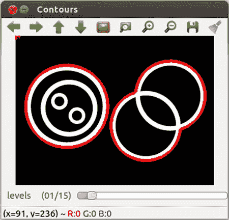
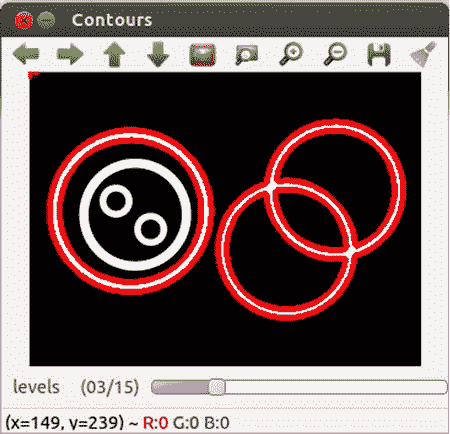
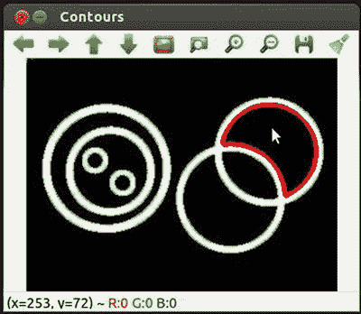
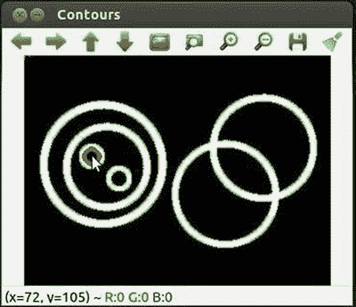
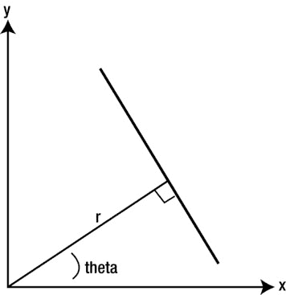
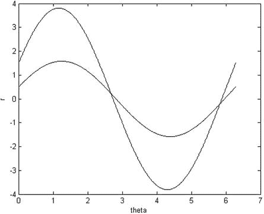
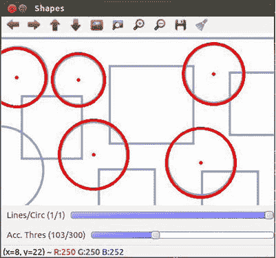
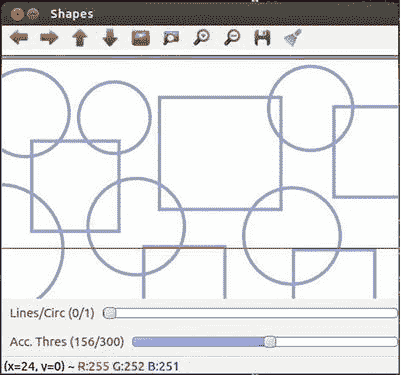
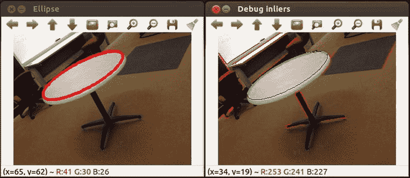
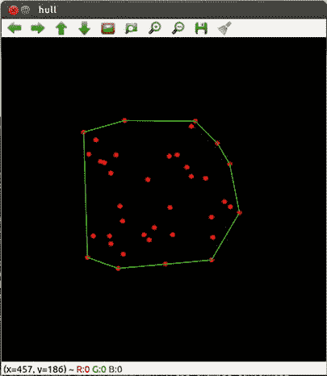

# 六、图像中的形状

Abstract

当我们看到物体时，形状是我们最先注意到的细节之一。本章将致力于赋予计算机这种能力。识别图像中的形状通常是做决定的重要一步。形状是由图像的轮廓定义的。因此，合乎逻辑的是，形状识别步骤通常在检测边缘或轮廓之后应用。

当我们看到物体时，形状是我们最先注意到的细节之一。本章将致力于赋予计算机这种能力。识别图像中的形状通常是做决定的重要一步。形状是由图像的轮廓定义的。因此，合乎逻辑的是，形状识别步骤通常在检测边缘或轮廓之后应用。

因此，我们将首先讨论从图像中提取轮廓。然后我们将开始讨论形状，包括:

*   霍夫变换，这将使我们能够检测图像中的直线和圆形等规则形状
*   随机抽样共识(RANSAC)，一个广泛使用的框架，以确定符合特定模型的数据点。我们将为该算法编写代码，并用它来检测图像中的椭圆
*   计算对象周围的包围盒、包围椭圆和凸包
*   匹配形状

## 轮廓

轮廓和边缘有明显的区别。边缘是图像中亮度梯度的局部最大值(还记得上一章的 Scharr 边缘吗？).正如我们也看到的，这些梯度最大值并不都在物体的轮廓上，它们非常嘈杂。Canny 边缘有点不同，它们很像轮廓，因为它们在梯度最大值提取后经过了许多后处理步骤。相比之下，轮廓是一组相互连接的点，最有可能位于对象的轮廓上。

OpenCV 的轮廓提取对二进制图像(如 Canny 边缘检测的输出或应用于 Scharr 边缘或黑白图像的阈值)起作用，并提取边缘上连接点的层次结构。层次结构被组织成使得树中较高位置的轮廓更可能是物体的轮廓，而较低位置的轮廓可能是有噪声的边缘以及“洞”和有噪声的补片的轮廓。

实现这些功能的函数称为`findContours()`，它使用 s .铃木和 K. Abe 的论文“通过边界跟踪对数字化二进制图像进行拓扑结构分析”(发表于 1985 年版 CVGIP)中描述的算法来提取轮廓并将它们排列成层次结构。论文中描述了决定层次结构的确切规则集，但是简单地说，如果一个轮廓围绕着另一个轮廓，则该轮廓被认为是该轮廓的“父轮廓”。

为了实际展示我们所说的层次结构，我们将编写一个程序，如清单 6-1 所示，它使用我们最喜欢的工具滑块来选择要显示的层次结构的级别数。请注意，该函数只接受二进制图像作为输入。从普通图像获取二值图像的一些方法有:

*   使用`threshold()`或`adaptiveThreshold()`的阈值
*   使用`inRange()`检查像素值的边界，就像我们对基于颜色的对象检测器所做的那样
*   锐利的边缘
*   阈值化沙尔边缘

清单 6-1。说明分层轮廓提取的程序

`// Program to illustrate hierarchical contour extraction`

`// Author: Samarth Manoj Brahmbhatt, University of Pennsylvania`

`#include <opencv2/opencv.hpp>`

`#include <opencv2/highgui/highgui.hpp>`

`#include <opencv2/imgproc/imgproc.hpp>`

`using namespace std;`

`using namespace cv;`

`Mat img;`

`vector<vector<Point> > contours;`

`vector<Vec4i> heirarchy;`

`int levels = 0;`

`void on_trackbar(int, void *) {`

`if(contours.empty()) return;`

`Mat img_show = img.clone();`

`// Draw contours of the level indicated by slider`

`drawContours(img_show, contours, -1, Scalar(0, 0, 255), 3, 8, heirarchy, levels);`

`imshow("Contours", img_show);`

`}`

`int main() {`

`img = imread("circles.jpg");`

`Mat img_b;`

`cvtColor(img, img_b, CV_RGB2GRAY);`

`Mat edges;`

`Canny(img_b, edges, 50, 100);`

`// Extract contours and heirarchy`

`findContours(edges, contours, heirarchy, CV_RETR_TREE, CV_CHAIN_APPROX_NONE);`

`namedWindow("Contours");`

`createTrackbar("levels", "Contours", &levels, 15, on_trackbar);`

`// Initialize by drawing the top level contours (as 'levels' is initialized to 0)`

`on_trackbar(0, 0);`

`while(char(waitKey(1)) != 'q') {}`

`return 0;`

`}`

注意每个轮廓是一个点的 STL 向量。因此，保存轮廓的数据结构是点的向量的向量。层次是四个整数向量的向量。对于每个轮廓，其层次位置由四个整数描述:它们是轮廓向量中基于 0 的索引，指示下一个(在同一级别)、上一个(在同一级别)、父轮廓和第一个子轮廓的位置。如果其中任何一个不存在(例如，如果一个轮廓没有父轮廓)，相应的整数将是负的。还要注意函数`drawContours()`是如何根据层次和该层次的最大允许绘制级别，通过在输入图像上绘制轮廓来修改输入图像的(查阅函数文档)！

图 [6-1](#Fig1) 在一张方便的图片中显示了不同级别的轮廓。

T2】

图 6-1。

Various levels of the hierarchy of contours

通常与`findContours()`一起使用的函数是`approxPolyDP(). approxPolyDP()`用另一条具有较少顶点的曲线逼近一条曲线或多边形，这样两条曲线之间的距离小于或等于指定的精度。您还可以选择闭合该近似曲线(即起点和终点相同)。

### 点多边形测试

我们绕道来描述一个有趣的特性:点多边形测试。正如您可能已经猜到的，函数`pointPolygonTest()`确定一个点是否在多边形内。如果设置了`measureDist`标志，它还会返回从轮廓上最近的点到该点的带符号欧几里德距离。如果点在曲线内，距离为正，如果在曲线外，距离为负，如果点在轮廓上，距离为零。如果标志关闭，带符号的距离会相应地被+1、1 和 0 取代。

让我们制作一个应用来展示我们在点多边形测试和闭合曲线近似方面的新知识，这是一个在图像中找到包围用户单击的点的最小闭合轮廓的应用。它还将展示等高线层次结构中的导航。代码如清单 6-2 所示。

清单 6-2。程序寻找围绕点击点的最小轮廓

`// Program to find the smallest contour that surrounds the clicked point`

`// Author: Samarth Manoj Brahmbhatt, University of Pennsylvania`

`#include <opencv2/opencv.hpp>`

`#include <opencv2/highgui/highgui.hpp>`

`#include <opencv2/imgproc/imgproc.hpp>`

`using namespace std;`

`using namespace cv;`

`Mat img_all_contours;`

`vector<vector<Point> > closed_contours;`

`vector<Vec4i> heirarchy;`

`// Function to approximate contours by closed contours`

`vector<vector<Point> > make_contours_closed(vector<vector<Point> > contours) {`

`vector<vector<Point> > closed_contours;`

`closed_contours.resize(contours.size());`

`for(int i = 0; i < contours.size(); i++)`

`approxPolyDP(contours[i], closed_contours[i], 0.1, true);`

`return closed_contours;`

`}`

`// Function to return the index of smallest contour in 'closed_contours' surrounding the clicked point`

`int smallest_contour(Point p, vector<vector<Point> > contours, vector<Vec4i> heirarchy) {`

`int idx = 0, prev_idx = -1;`

`while(idx >= 0) {`

`vector<Point> c = contours[idx];`

`// Point-polgon test`

`double d = pointPolygonTest(c, p, false);`

`// If point is inside the contour, check its children for an even smaller contour...`

`if(d > 0) {`

`prev_idx = idx;`

`idx = heirarchy[idx][2];`

`}`

`// ...else, check the next contour on the same level`

`else idx = heirarchy[idx][0];`

`}`

`return prev_idx;`

`}`

`void on_mouse(int event, int x, int y, int, void *) {`

`if(event != EVENT_LBUTTONDOWN) return;`

`// Clicked point`

`Point p(x, y);`

`// Find index of smallest enclosing contour`

`int contour_show_idx = smallest_contour(p, closed_contours, heirarchy);`

`// If no such contour, user clicked outside all contours, hence clear image`

`if(contour_show_idx < 0) {`

`imshow("Contours", img_all_contours);`

`return;`

`}`

`// Draw the smallest contour using a thick red line`

`vector<vector<Point> > contour_show;`

`contour_show.push_back(closed_contours[contour_show_idx]);`

`if(!contour_show.empty()) {`

`Mat img_show = img_all_contours.clone();`

`drawContours(img_show, contour_show, -1, Scalar(0, 0, 255), 3);`

`imshow("Contours", img_show);`

`}`

`}`

`int main() {`

`Mat img = imread("circles.jpg");`

`img_all_contours = img.clone();`

`Mat img_b;`

`cvtColor(img, img_b, CV_RGB2GRAY);`

`Mat edges;`

`Canny(img_b, edges, 50, 100);`

`// Extract contours and heirarchy`

`vector<vector<Point> > contours;`

`findContours(edges, contours, heirarchy, CV_RETR_TREE, CV_CHAIN_APPROX_NONE);`

`// Make contours closed so point-polygon test is valid`

`closed_contours = make_contours_closed(contours);`

`// Draw all contours usign a thin green line`

`drawContours(img_all_contours, closed_contours, -1, Scalar(0, 255, 0));`

`imshow("Contours", img_all_contours);`

`// Mouse callback`

`setMouseCallback("Contours", on_mouse);`

`while(char(waitKey(1)) != 'q') {}`

`return 0;`

`}`

注释应该帮助你理解我在代码中遵循的逻辑。需要一点关于导航轮廓层次的细节。如果`idx`是点的向量的向量中轮廓的索引，并且`hierarchy`是层级:

*   `hierarchy[idx][0]`将返回同一层次下一个轮廓的索引
*   `hierarchy[idx[1]`将返回前一个同级轮廓的索引
*   `hierarchy[idx][2]`将返回第一个子轮廓的索引
*   `hierarchy[idx][3]`将返回父轮廓的索引

如果这些等高线中的任何一个不存在，则返回的索引将是负的。

图 [6-2](#Fig2) 中显示了一些 app 在运行中的截图。

T2】

图 6-2。

Smallest enclosing contour app

OpenCV 还提供了其他一些功能，可以通过检查轮廓的一些属性来帮助您过滤噪声图像中的轮廓。这些在表 [6-1](#Tab1) 中列出。

表 6-1。

Contour post-processing functions in OpenCV

<colgroup><col> <col></colgroup> 
| 功能 | 描述 |
| --- | --- |
| ArcLength() | 查找轮廓的长度 |
| 轮廓区域() | 查找轮廓的面积和方向 |
| BoundingRect() | 计算轮廓的垂直包围矩形 |
| convexhull() | 计算轮廓周围的凸包 |
| IsContourConvex() | 测试轮廓的凸性 |
| MinAreaRect() | 计算轮廓周围最小面积的旋转矩形 |
| MinEnclosingCircle() | 寻找包围轮廓的最小面积圆 |
| FitLine() | 将直线(最小平方)拟合到轮廓 |

## 霍夫变换

霍夫变换将轮廓从 X-Y 空间变换到参数空间。然后，它使用目标曲线的某些参数属性(如直线或圆)来识别参数空间中适合目标曲线的点。例如，让我们考虑在应用于图像的边缘检测的输出中检测线条的问题。

### 用霍夫变换检测直线

2D 图像中的点可以用两种方式表示:

图 6-3。

The (`r, theta`) coordinate representation

*   (`X, Y`)坐标
*   (`r, theta`)坐标:`r`是距(`0, 0`)的距离，`theta`是距参考线的角度，通常是 x 轴。这种表示如图 [6-3](#Fig3) 所示。

这些坐标之间的关系是:

`x*cos(theta) + y*sin(theta) = 2*r`

如你所见，(`r, theta`)参数空间中的点(`x, y`)的曲线是正弦曲线。因此，笛卡尔空间中共线的点将对应于霍夫空间中的不同正弦曲线，这些正弦曲线将相交于一个公共点(`r, theta`)。这个(r，theta)点代表笛卡尔空间中通过所有这些点的一条线。为了给你一些例子，图 [6-4](#Fig4) 分别显示了一个点、一对点和五个点的霍夫空间表示。清单 6-3 中所示的 Matlab 代码用于生成图形。

清单 6-3。理解霍夫变换的 Matlab 代码

`%% one point`

`theta = linspace(0, 2*pi, 500);`

`x = 1;`

`y = 1;`

`r = 0.5 * (x * cos(theta) + y * sin(theta));`

`figure; plot(theta, r);`

`xlabel('theta'); ylabel('r');`

`%% two points`

`theta = linspace(0, 2*pi, 500);`

`x = [1 3];`

`y = 2*x + 1;`

`r1 = 0.5 * (x(1) * cos(theta) + y(1) * sin(theta));`

`r2 = 0.5 * (x(2) * cos(theta) + y(2) * sin(theta));`

`figure; plot(theta, r1, theta, r2);`

`xlabel('theta'); ylabel('r');`

`%% five collinear points`

`theta = linspace(0, 2*pi, 500);`

`x = [1 3 5 7 9];`

`y = 2*x + 1;`

`figure; hold on;`

`r = zeros(numel(x), numel(theta));`

`for i = 1 : size(r, 1)`

`r(i, :) = 0.5 * (x(i) * cos(theta) + y(i) * sin(theta));`

`plot(theta, r(i, :));`

`end`

`xlabel('theta'); ylabel('r');`

T2】

图 6-4。

Hough transform of a point, a pair of points, and 5 points (top to bottom, clockwise), respectively

然后，我们可以通过以下策略检测线条:

*   定义离散化霍夫空间的 2-D 矩阵，例如沿着行使用`r`值，沿着列使用`theta`值
*   对于边缘图像中的每个(`x, y`)点，使用等式找到可能(`r, theta`)值的列表，并递增霍夫空间矩阵(该矩阵也称为累加器)中的相应条目
*   当您对所有边缘点执行此操作时，累加器中的某些(`r, theta`)值将具有高值。这些是线，因为每个(`r, theta`)点代表一条唯一的线

OpenCV 函数`HoughLines()`实施这一策略，并接受以下输入:

*   二进制边缘图像(例如，Canny 边缘检测器的输出)
*   `r`和`theta`分辨率
*   将(`r, theta`)点视为一条线的累加器阈值

### 利用霍夫变换检测圆

圆可以由三个参数表示:两个表示圆心，一个表示半径。因为圆的中心位于圆上每个点的法线上，所以我们可以使用以下策略:

*   使用 2D 累加器(映射到图像上的点)为中心累积选票。对于每个边缘点，通过增加对应于沿法线的像素的累加器位置来投票。当你对圆上的所有像素都这样做时，因为中心位于所有的法线上，所以对中心的投票将开始增加。通过设定累加器的阈值，可以找到圆心
*   在下一步中，您将为每个候选中心制作一个 1D 半径直方图，用于估计半径。属于围绕候选中心的圆的每个边缘点将投票选择几乎相同的半径(因为它们将与中心的距离几乎相同),而其他边缘点(可能属于围绕其他候选中心的圆)将投票选择其他伪半径

实现霍夫圆检测的 OpenCV 函数叫做`HoughCircles()`。它接受以下输入:

*   灰度图像(在其上应用 Canny 边缘检测)
*   累加器分辨率与图像分辨率的反比(用于检测圆心)。例如，如果设定为 2，累加器是图像大小的一半
*   检测圆中心之间的最小距离。该参数可用于拒绝虚假中心
*   Canny 边缘检测器用于预处理输入图像的较高阈值(较低阈值设置为较高阈值的一半)
*   累加器阈值
*   最小和最大圆半径，也可以用来过滤掉嘈杂的小圆和虚假的大圆

图 [6-5](#Fig5) 显示了使用 Hough 变换的直线和圆检测，带有累加器阈值滑块和检测直线或圆选择开关。代码如清单 6-4 所示。

T3】

图 6-5。

Circle and line detection at different accumulator thresholds using the Hough transform

清单 6-4。这个程序演示了使用霍夫变换检测直线和圆

`// Program to illustrate line and circle detection using Hough transform`

`// Author: Samarth Manoj Brahmbhatt, University of Pennsylvania`

`#include <opencv2/opencv.hpp>`

`#include <opencv2/highgui/highgui.hpp>`

`#include <opencv2/imgproc/imgproc.hpp>`

`using namespace std;`

`using namespace cv;`

`Mat img;`

`int shape = 0; //0 -> lines, 1 -> circles`

`int thresh = 100; // Accumulator threshold`

`void on_trackbar(int, void *) { // Circles`

`if(shape == 1) {`

`Mat img_gray;`

`cvtColor(img, img_gray, CV_RGB2GRAY);`

`// Find circles`

`vector<Vec3f> circles;`

`HoughCircles(img_gray, circles, CV_HOUGH_GRADIENT, 1, 10, 100, thresh, 5);`

`// Draw circles`

`Mat img_show = img.clone();`

`for(int i = 0; i < circles.size(); i++) {`

`Point center(cvRound(circles[i][0]), cvRound(circles[i][1]));`

`int radius = cvRound(circles[i][2]);`

`// draw the circle center`

`circle(img_show, center, 3, Scalar(0, 0, 255), -1);`

`// draw the circle outline`

`circle(img_show, center, radius, Scalar(0, 0, 255), 3, 8, 0);`

`}`

`imshow("Shapes", img_show);`

`}`

`else if(shape == 0) { // Lines`

`Mat edges;`

`Canny(img, edges, 50, 100);`

`// Find lines`

`vector<Vec2f> lines;`

`HoughLines(edges, lines, 1, CV_PI/180.f, thresh);`

`// Draw lines`

`Mat img_show = img.clone();`

`for(int i = 0; i < lines.size(); i++) {`

`float rho = lines[i][0];`

`float theta = lines[i][1];`

`double a = cos(theta), b = sin(theta);`

`double x0 = a * rho, y0 = b * rho;`

`Point pt1(cvRound(x0 + 1000 * (-b)), cvRound(y0 + 1000 * (a)));`

`Point pt2(cvRound(x0 - 1000 * (-b)), cvRound(y0 - 1000 * (a)));`

`line(img_show, pt1, pt2, Scalar(0, 0, 255));`

`}`

`imshow("Shapes", img_show);`

`}`

`}`

`int main() {`

`img = imread("hough.jpg");`

`namedWindow("Shapes");`

`// Create sliders`

`createTrackbar("Lines/Circles", "Shapes", &shape, 1, on_trackbar);`

`createTrackbar("Acc. Thresh.", "Shapes", &thresh, 300, on_trackbar);`

`// Initialize window`

`on_trackbar(0, 0);`

`while(char(waitKey(1)) != 'q') {}`

`return 0;`

`}`

## 广义霍夫变换

广义霍夫变换可用于检测图像中不遵循简单方程的不规则形状。理论上，任何形状都可以用一个方程来表示，但是回想一下，随着方程中参数数量的增加，所需累加器的维数也随之增加。维基百科的文章和 [`http://homepages.inf.ed.ac.uk/rbf/HIPR2/hough.htm`](http://homepages.inf.ed.ac.uk/rbf/HIPR2/hough.htm) 都是对广义霍夫变换的很好介绍。

## 随机样本一致性(RANSAC)

RANSAC 是一个强大的框架，用于查找符合特定模型的数据点。我们将在此考虑应用 RANSAC 的模型是椭圆的圆锥截面模型。RANSAC 对“异常值”——不符合给定模型的数据点——有很强的抵抗力。为了解释算法本身，让我们考虑在 2D 点的噪声数据集中寻找直线的问题。策略是:

*   从数据集中随机采样点
*   找出符合这些点的直线方程
*   找到“内连线”——符合该线模型的点。为了确定一个点相对于一个模型是内点还是外点，我们需要一个距离的度量。这里，度量将是直线到点欧几里得距离。我们将决定该距离度量的值，该值充当用于内侧/外侧确定的阈值
*   迭代，直到找到一行比预先确定的数目更多的内联体

听起来很简单，对吧？然而，正如您在椭圆检测示例中所观察到的那样，这种简单的机制对噪声非常鲁棒。在继续之前，您应该阅读:

*   维基百科上关于 RANSAC 的文章，因为我们将使用其中概述的 RANSAC 算法框架，它有一些很好的可视化效果，可以帮助您对算法有一个直观的理解
*   Wolfram Alpha 关于椭圆的文章( [`http://mathworld.wolfram.com/Ellipse.html`](http://mathworld.wolfram.com/Ellipse.html) )，尤其是公式 15 到 23，我们将使用它们来计算椭圆的各种属性
*   文章 [`http://nicky.vanforeest.com/misc/fitEllipse/fitEllipse.html`](http://nicky.vanforeest.com/misc/fitEllipse/fitEllipse.html) ，描述了我们将使用的策略来拟合一个椭圆到一组点。理解这篇文章需要矩阵代数的知识，特别是特征值和特征向量

对于这个应用，我决定采用面向对象的策略，以利用 C++的实际能力。函数式编程(就像我们到目前为止一直在做的编程一样——为不同的任务使用函数)对于小型应用来说是可以的。然而，在代码可读性和策略形成方面，对较大的应用使用面向对象的策略是非常有利的，而且运行速度也一样快。该算法的流程如下:

*   使用严格的阈值检测图像中的 Canny 边缘，并提取轮廓以避免虚假轮廓。使用功能`arcLength()`测量轮廓长度，剔除长度小于某个阈值的轮廓
*   对每个轮廓进行一定次数的迭代，其中:
    *   从轮廓中随机选择一定数量的点，并拟合到这些点的椭圆上。根据距离阈值决定当前轮廓中该椭圆的内联体数量
    *   找到最适合当前轮廓的椭圆(具有最大数量的内曲线)。不应该一次使用轮廓中的所有点来拟合椭圆，因为轮廓可能有噪声，因此拟合轮廓中所有点的椭圆可能不是最佳的。通过随机选择点并多次这样做，可以给算法更多的机会找到最佳拟合
*   对所有轮廓重复此过程，并找到具有最多内点的椭圆

为了实现该算法，我使用以下 RANSAC 参数:

*   我们选择随机点的迭代次数。减小该值会减少找到表示椭圆的最佳随机点集的机会，而增大该参数会增加机会，但会导致算法花费更多的处理时间
*   每次迭代中要考虑的随机点数。选择过低的值(如 4 或 5)将无法正确定义椭圆，而选择过高的值将增加从轮廓的不需要部分绘制点的机会。因此，必须小心调整该参数
*   点与椭圆之间距离的阈值，用于将点视为椭圆的内侧
*   要进一步处理的椭圆的最小内联数。这在拟合到每次迭代中选择的随机点的椭圆上进行检查。增加该参数会使算法更加严格

代码本身非常简单。它很长，我还写了一堆调试函数，您可以激活它们来查看一些调试图像(例如，算法选择的最佳轮廓，等等)。功能`debug()`允许您将椭圆拟合到特定轮廓。请注意，这是一次性使用轮廓中的所有点，结果可能不如前面讨论的随机点策略好。我们使用特征库来寻找特征值和特征向量，以将一个椭圆拟合到一组点上，因为未知的原因，OpenCV `eigen()`不能像预期的那样工作。清单 6-5 中的代码没有经过优化，所以可能需要一些时间来处理有很多轮廓的更大的图像。建议您使用尽可能严格的 Canny 阈值，以减少算法必须处理的轮廓数量。如果需要，您还可以更改 RANSAC 参数。

因为除了 OpenCV，我们还使用 Eigen 库，所以如果你没有它，你当然应该安装它(尽管大多数 Ubuntu 系统应该安装了 Eigen)，并编译代码如下:

`g++ -I/usr/include/eigen3 'pkg-config opencv --cflags' findEllipse.cpp -o findEllipse 'pkg-config opencv --libs'`

你可以在终端中输入`sudo apt-get install libeigen3-dev`来安装 Eigen。

代码如清单 6-5 所示。

清单 6-5。使用 RANSAC 寻找最大椭圆的程序

`// Program to find the largest ellipse using RANSAC`

`// Author: Samarth Manoj Brahmbhatt, University of Pennsylvania`

`#include <Eigen/Dense>`

`#include <opencv2/core/eigen.hpp>`

`#include <opencv2/opencv.hpp>`

`#include <opencv2/highgui/highgui.hpp>`

`#include <opencv2/imgproc/imgproc.hpp>`

`#include <algorithm>`

`#include <math.h>`

`#define PI 3.14159265`

`using namespace std;`

`using namespace cv;`

`using namespace Eigen;`

`// Class to hold RANSAC parameters`

`class RANSACparams {`

`private:`

`//number of iterations`

`int iter;`

`//minimum number of inliers to further process a model`

`int min_inliers;`

`//distance threshold to be conted as inlier`

`float dist_thresh;`

`//number of points to select randomly at each iteration`

`int N;`

`public:`

`RANSACparams(int _iter, int _min_inliers, float _dist_thresh, int _N) { //constructor`

`iter = _iter;`

`min_inliers = _min_inliers;`

`dist_thresh = _dist_thresh;`

`N = _N;`

`}`

`int get_iter() {return iter;}`

`int get_min_inliers() {return min_inliers;}`

`float get_dist_thresh() {return dist_thresh;}`

`int get_N() {return N;}`

`};`

`// Class that deals with fitting an ellipse, RANSAC and drawing the ellipse in the image`

`class ellipseFinder {`

`private:`

`Mat img; // input image`

`vector<vector<Point> > contours; // contours in image`

`Mat Q; // Matrix representing conic section of detected ellipse`

`Mat fit_ellipse(vector<Point>); // function to fit ellipse to a contour`

`Mat RANSACellipse(vector<vector<Point> >); // function to find ellipse in contours using RANSAC`

`bool is_good_ellipse(Mat); // function that determines whether given conic section represents a valid ellipse`

`vector<vector<Point> > choose_random(vector<Point>); //function to choose points at random from contour`

`vector<float> distance(Mat, vector<Point>); //function to return distance of points from the ellipse`

`float distance(Mat, Point); //overloaded function to return signed distance of point from ellipse`

`void draw_ellipse(Mat); //function to draw ellipse in an image`

`vector<Point> ellipse_contour(Mat); //function to convert equation of ellipse to a contour of points`

`void draw_inliers(Mat, vector<Point>); //function to debug inliers`

`// RANSAC parameters`

`int iter, min_inliers, N;`

`float dist_thresh;`

`public:`

`ellipseFinder(Mat _img, int l_canny, int h_canny, RANSACparams rp) { // constructor`

`img = _img.clone();`

`// Edge detection and contour extraction`

`Mat edges; Canny(img, edges, l_canny, h_canny);`

`vector<vector<Point> > c;`

`findContours(edges, c, CV_RETR_LIST, CV_CHAIN_APPROX_NONE);`

`// Remove small spurious short contours`

`for(int i = 0; i < c.size(); i++) {`

`bool is_closed = false;`

`vector<Point> _c = c[i];`

`Point p1 = _c.front(), p2 = _c.back();`

`float d = sqrt(pow(p1.x - p2.x,2) + pow(p1.y - p2.y,2));`

`if(d <= 0.5) is_closed = true;`

`d = arcLength(_c, is_closed);`

`if(d > 50) contours.push_back(_c);`

`}`

`iter = rp.get_iter();`

`min_inliers = rp.get_min_inliers();`

`N = rp.get_N();`

`dist_thresh = rp.get_dist_thresh();`

`Q = Mat::eye(6, 1, CV_32F);`

`/*`

`//for debug`

`Mat img_show = img.clone();`

`drawContours(img_show, contours, -1, Scalar(0, 0, 255));`

`imshow("Contours", img_show);`

`//imshow("Edges", edges);`

`*/`

`cout << "No. of Contours = " << contours.size() << endl;`

`}`

`void detect_ellipse(); //final wrapper function`

`void debug(); //debug function`

`};`

`vector<float> ellipseFinder::distance(Mat Q, vector<Point> c) {`

`vector<Point> ellipse = ellipse_contour(Q);`

`vector<float> distances;`

`for(int i = 0; i < c.size(); i++) {`

`distances.push_back(float(pointPolygonTest(ellipse, c[i], true)));`

`}`

`return distances;`

`}`

`float ellipseFinder::distance(Mat Q, Point p) {`

`vector<Point> ellipse = ellipse_contour(Q);`

`return float(pointPolygonTest(ellipse, p, true));`

`}`

`vector<vector<Point> > ellipseFinder::choose_random(vector<Point> c) {`

`vector<vector<Point> > cr;`

`vector<Point> cr0, cr1;`

`// Randomly shuffle all elements of contour`

`std::random_shuffle(c.begin(), c.end());`

`// Put the first N elements into cr[0] as consensus set (see Wikipedia RANSAC algorithm) and`

`// the rest in cr[1] to check for inliers`

`for(int i = 0; i < c.size(); i++) {`

`if(i < N) cr0.push_back(c[i]);`

`else cr1.push_back(c[i]);`

`}`

`cr.push_back(cr0);`

`cr.push_back(cr1);`

`return cr;`

`}`

`Mat ellipseFinder::fit_ellipse(vector<Point> c) {`

`/*`

`// for debug`

`Mat img_show = img.clone();`

`vector<vector<Point> > cr;`

`cr.push_back(c);`

`drawContours(img_show, cr, -1, Scalar(0, 0, 255), 2);`

`imshow("Debug fitEllipse", img_show);`

`*/`

`int N = c.size();`

`Mat D;`

`for(int i = 0; i < N; i++) {`

`Point p = c[i];`

`Mat r(1, 6, CV_32FC1);`

`r = (Mat_<float>(1, 6) << (p.x)*(p.x), (p.x)*(p.y), (p.y)*(p.y), p.x, p.y, 1.f);`

`D.push_back(r);`

`}`

`Mat S = D.t() * D, _S;`

`double d = invert(S, _S);`

`//if(d < 0.001) cout << "S matrix is singular" << endl;`

`Mat C = Mat::zeros(6, 6, CV_32F);`

`C.at<float>(2, 0) = 2;`

`C.at<float>(1, 1) = -1;`

`C.at<float>(0, 2) = 2;`

`// Using EIGEN to calculate eigenvalues and eigenvectors`

`Mat prod = _S * C;`

`Eigen::MatrixXd prod_e;`

`cv2eigen(prod, prod_e);`

`EigenSolver<Eigen::MatrixXd> es(prod_e);`

`Mat evec, eval, vec(6, 6, CV_32FC1), val(6, 1, CV_32FC1);`

`eigen2cv(es.eigenvectors(), evec);`

`eigen2cv(es.eigenvalues(), eval);`

`evec.convertTo(evec, CV_32F);`

`eval.convertTo(eval, CV_32F);`

`// Eigen returns complex parts in the second channel (which are all 0 here) so select just the first channel`

`int from_to[] = {0, 0};`

`mixChannels(&evec, 1, &vec, 1, from_to, 1);`

`mixChannels(&eval, 1, &val, 1, from_to, 1);`

`Point maxLoc;`

`minMaxLoc(val, NULL, NULL, NULL, &maxLoc);`

`return vec.col(maxLoc.y);`

`}`

`bool ellipseFinder::is_good_ellipse(Mat Q) {`

`float a = Q.at<float>(0, 0),`

`b = (Q.at<float>(1, 0))/2,`

`c = Q.at<float>(2, 0),`

`d = (Q.at<float>(3, 0))/2,`

`f = (Q.at<float>(4, 0))/2,`

`g = Q.at<float>(5, 0);`

`if(b*b - a*c == 0) return false;`

`float thresh = 0.09,`

`num = 2 * (a*f*f + c*d*d + g*b*b - 2*b*d*f - a*c*g),`

`den1 = (b*b - a*c) * (sqrt((a-c)*(a-c) + 4*b*b) - (a + c)),`

`den2 = (b*b - a*c) * (-sqrt((a-c)*(a-c) + 4*b*b) - (a + c)),`

`a_len = sqrt(num / den1),`

`b_len = sqrt(num / den2),`

`major_axis = max(a_len, b_len),`

`minor_axis = min(a_len, b_len);`

`if(minor_axis < thresh*major_axis || num/den1 < 0.f || num/den2 < 0.f || major_axis > max(img.rows, img.cols)) return false;`

`else return true;`

`}`

`Mat ellipseFinder::RANSACellipse(vector<vector<Point> > contours) {`

`int best_overall_inlier_score = 0;`

`Mat Q_best = 777 * Mat::ones(6, 1, CV_32FC1);`

`int idx_best = -1;`

`//for each contour...`

`for(int i = 0; i < contours.size(); i++) {`

`vector<Point> c = contours[i];`

`if(c.size() < min_inliers) continue;`

`Mat Q;`

`int best_inlier_score = 0;`

`for(int j = 0; j < iter; j++) {`

`// ...choose points at random...`

`vector<vector<Point> > cr = choose_random(c);`

`vector<Point> consensus_set = cr[0], rest = cr[1];`

`// ...fit ellipse to those points...`

`Mat Q_maybe = fit_ellipse(consensus_set);`

`// ...check for inliers...`

`vector<float> d = distance(Q_maybe, rest);`

`for(int k = 0; k < d.size(); k++)`

`if(abs(d[k]) < dist_thresh) consensus_set.push_back(rest[k]);`

`// ...and find the random set with the most number of inliers`

`if(consensus_set.size() > min_inliers && consensus_set.size() > best_inlier_score) {`

`Q = fit_ellipse(consensus_set);`

`best_inlier_score = consensus_set.size();`

`}`

`}`

`// find cotour with ellipse that has the most number of inliers`

`if(best_inlier_score > best_overall_inlier_score && is_good_ellipse(Q)) {`

`best_overall_inlier_score = best_inlier_score;`

`Q_best = Q.clone();`

`if(Q_best.at<float>(5, 0) < 0) Q_best *= -1.f;`

`idx_best = i;`

`}`

`}`

`/*`

`//for debug`

`Mat img_show = img.clone();`

`drawContours(img_show, contours, idx_best, Scalar(0, 0, 255), 2);`

`imshow("Best Contour", img_show);`

`cout << "inliers " << best_overall_inlier_score << endl;`

`*/`

`if(idx_best >= 0) draw_inliers(Q_best, contours[idx_best]);`

`return Q_best;`

`}`

`vector<Point> ellipseFinder::ellipse_contour(Mat Q) {`

`float a = Q.at<float>(0, 0),`

`b = (Q.at<float>(1, 0))/2,`

`c = Q.at<float>(2, 0),`

`d = (Q.at<float>(3, 0))/2,`

`f = (Q.at<float>(4, 0))/2,`

`g = Q.at<float>(5, 0);`

`vector<Point> ellipse;`

`if(b*b - a*c == 0) {`

`ellipse.push_back(Point(0, 0));`

`return ellipse;`

`}`

`Point2f center((c*d - b*f)/(b*b - a*c), (a*f - b*d)/(b*b - a*c));`

`float num = 2 * (a*f*f + c*d*d + g*b*b - 2*b*d*f - a*c*g),`

`den1 = (b*b - a*c) * (sqrt((a-c)*(a-c) + 4*b*b) - (a + c)),`

`den2 = (b*b - a*c) * (-sqrt((a-c)*(a-c) + 4*b*b) - (a + c)),`

`a_len = sqrt(num / den1),`

`b_len = sqrt(num / den2),`

`major_axis = max(a_len, b_len),`

`minor_axis = min(a_len, b_len);`

`//angle of rotation of ellipse`

`float alpha = 0.f;`

`if(b == 0.f && a == c) alpha = PI/2;`

`else if(b != 0.f && a > c) alpha = 0.5 * atan2(2*b, a-c);`

`else if(b != 0.f && a < c) alpha = PI/2 - 0.5 * atan2(2*b, a-c);`

`// 'draw' the ellipse and put it into a STL Point vector so you can use drawContours()`

`int N = 200;`

`float theta = 0.f;`

`for(int i = 0; i < N; i++, theta += 2*PI/N) {`

`float x = center.x + major_axis*cos(theta)*cos(alpha) + minor_axis*sin(theta)*sin(alpha);`

`float y = center.y - major_axis*cos(theta)*sin(alpha) + minor_axis*sin(theta)*cos(alpha);`

`Point p(x, y);`

`if(x < img.cols && y < img.rows) ellipse.push_back(p);`

`}`

`if(ellipse.size() == 0) ellipse.push_back(Point(0, 0));`

`return ellipse;`

`}`

`void ellipseFinder::detect_ellipse() {`

`Q = RANSACellipse(contours);`

`cout << "Q" << Q << endl;`

`draw_ellipse(Q);`

`}`

`void ellipseFinder::debug() {`

`int i = 1; //index of contour you want to debug`

`cout << "No. of points in contour " << contours[i].size() << endl;`

`Mat a = fit_ellipse(contours[i]);`

`Mat img_show = img.clone();`

`drawContours(img_show, contours, i, Scalar(0, 0, 255), 3);`

`imshow("Debug contour", img_show);`

`draw_inliers(a, contours[i]);`

`draw_ellipse(a);`

`}`

`void ellipseFinder::draw_ellipse(Mat Q) {`

`vector<Point> ellipse = ellipse_contour(Q);`

`vector<vector<Point> > c;`

`c.push_back(ellipse);`

`Mat img_show = img.clone();`

`drawContours(img_show, c, -1, Scalar(0, 0, 255), 3);`

`imshow("Ellipse", img_show);`

`}`

`void ellipseFinder::draw_inliers(Mat Q, vector<Point> c) {`

`vector<Point> ellipse = ellipse_contour(Q);`

`vector<vector<Point> > cs;`

`cs.push_back(ellipse);`

`Mat img_show = img.clone();`

`// draw all contours in thin red`

`drawContours(img_show, contours, -1, Scalar(0, 0, 255));`

`// draw ellipse in thin blue`

`drawContours(img_show, cs, 0, Scalar(255, 0, 0));`

`int count = 0;`

`// draw inliers as green points`

`for(int i = 0; i < c.size(); i++) {`

`double d = pointPolygonTest(ellipse, c[i], true);`

`float d1 = float(d);`

`if(abs(d1) < dist_thresh) {`

`circle(img_show, c[i], 1, Scalar(0, 255, 0), -1);`

`count ++;`

`}`

`}`

`imshow("Debug inliers", img_show);`

`cout << "inliers " << count << endl;`

`}`

`int main() {`

`Mat img = imread("test4.jpg");`

`namedWindow("Ellipse");`

`// object holding RANSAC parameters, initialized using the constructor`

`RANSACparams rp(400, 100, 1, 5);`

`// Canny thresholds`

`int canny_l = 250, canny_h = 300;`

`// Ellipse finder object, initialized using the constructor`

`ellipseFinder ef(img, canny_l, canny_h, rp);`

`ef.detect_ellipse();`

`//ef.debug();`

`while(char(waitKey(1)) != 'q') {}`

`return 0;`

`}`

图 [6-6](#Fig6) 显示了运行中的算法。

T2】

图 6-6。

Finding the largest ellipse in the image using RANSAC

## 边界框和圆形

OpenCV 提供了计算包围一组点的最小面积的矩形或圆形的函数。该矩形可以是直立的(在这种情况下，它将不是具有包围点集的最小面积的矩形)，也可以是旋转的(在这种情况下，它将是)。这些形状有两种用途:

*   OpenCV 中的许多高级特征检测功能接受一个直立矩形作为感兴趣区域(ROI)。ROI 通常用于加速计算。很多时候，我们希望使用计算密集型函数，例如立体块匹配函数，该函数给出左右图像的差异。然而，我们只对图像的某一部分感兴趣。通过指定适当的 ROI，可以告诉函数忽略图像的其他部分，从而不会在我们不感兴趣的图像部分浪费计算。
*   人们可以使用这些边界框和圆的属性(例如，面积、长宽比)来粗略地推断物体的大小或物体离相机的距离。

函数`minAreaRrect()`计算旋转的矩形，`minEnclosingCircle()`计算圆，`boundingRect()`计算包围一组点的最小尺寸的直立矩形。这组点通常被指定为 STL 向量，但是你也可以使用 Mat 来完成。在清单 6-6 中，看看椭圆检测器代码中的`draw_ellipse()`的修改版本，了解如何使用这些函数。这个版本的应用不仅可以在图像中找到一个椭圆，还可以显示围绕椭圆的外接矩形和圆形，如图 [6-7](#Fig7) 所示。

清单 6-6。修改 draw_ellipse()以显示边界圆和矩形

`void ellipseFinder::draw_ellipse(Mat Q) {`

`vector<Point> ellipse = ellipse_contour(Q);`

`vector<vector<Point> > c;`

`c.push_back(ellipse);`

`Mat img_show = img.clone();`

`//draw ellipse`

`drawContours(img_show, c, -1, Scalar(0, 0, 255), 3);`

`//compute bounding shapes`

`RotatedRect r_rect = minAreaRect(ellipse);`

`Rect rect = boundingRect(ellipse);`

`Point2f center; float radius; minEnclosingCircle(ellipse, center, radius);`

`//draw bounding shapes`

`rectangle(img_show, rect, Scalar(255, 0, 255)); //magenta`

`circle(img_show, center, radius, Scalar(255, 0, 0)); //blue`

`Point2f vertices[4]; r_rect.points(vertices);`

`for(int i = 0; i < 4; i++)`

`line(img_show, vertices[i], vertices[(i + 1) % 4], Scalar(0, 255, 0)); //green`

`imshow("Ellipse", img_show);`

`}`

图 6-7。

Bounding circle and rectangles (upright and rotated) for the ellipse detected using RANSAC

## 凸包

一组 2D 点的凸包是包围所有点的最小凸闭合轮廓。因为它是凸的，所以连接凸壳上任意两点的线不与壳边界相交。因为它必须是最小的，所以一组点的凸包是这个集合的子集。OpenCV 函数`convexHull()`可以为一组点计算外壳。它以两种不同的形式给出其输出——构成外壳的点的输入轮廓的索引向量，或外壳点本身。OpenCV 有一个很好看的凸包演示，随机选择一组点，在它周围画出凸包。图 [6-8](#Fig8) 显示了它的作用。

图 6-8。

OpenCV convex hull demo

计算凸包的动机是为了得到最小可能的封闭轮廓，该轮廓是凸的并且包围了集合中的所有点。然后，您可以使用`contourArea()`和`arcLength()`分别估算您的点集的面积和周长。

作为一个练习，你可能想从上一章中得到基于颜色的目标检测器代码，并修改它以得到红色物体的面积和周长。以下是您需要做的事情:

*   在检测器的二进制输出中提取轮廓
*   使用`approxPolyDP()`或`convexHull(). convexHull()`将这些轮廓转换成封闭的轮廓可能会有些矫枉过正，而且会更慢。
*   分别用`contourArea()`和/或`arcLength()`找到闭合轮廓的面积和/或周长，显示面积最大的轮廓，因为它最有可能是你想要的对象

## 摘要

这一章讲了很多关于处理图像中的形状。你可能已经注意到，我们现在已经转移到许多“更高”级别的算法，我不会过多地讨论较低像素级别的过程。这是因为我假设您已经仔细阅读了前面的章节！形状是识别图像中已知对象的简单方法。但是它们也容易出现很多错误，尤其是因为物体的一部分被另一个物体遮挡。另一种识别物体的方法，基于关键点特征的方法，解决了这个问题，我们将在下一章讨论基于关键点的物体识别。

同时，我想强调我在本章中介绍的椭圆检测程序的重要性。它很重要，因为它具有现实世界计算机视觉程序的一个重要特征——它不只是将一堆内置的 OpenCV 函数放在一起，而是使用它们来帮助你自己的本地算法。它也是面向对象的，这是编写大型程序的首选风格。如果您不理解该代码中的任何一行，请参考该函数的在线 OpenCV 文档和/或参考前面的章节。