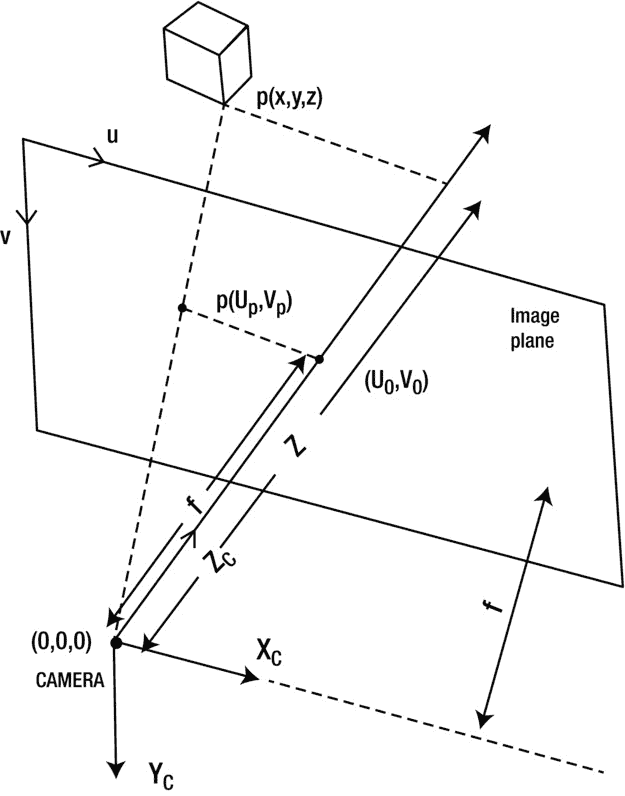
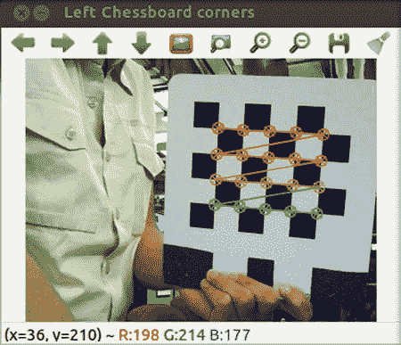
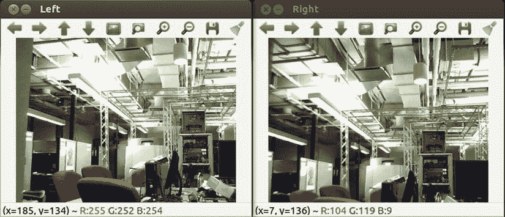
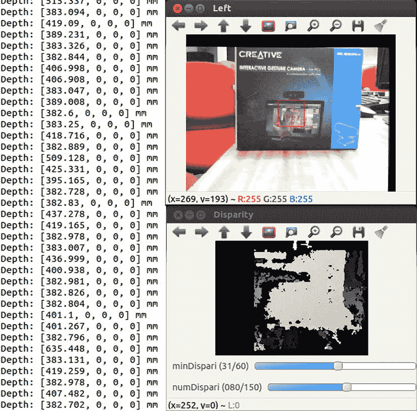
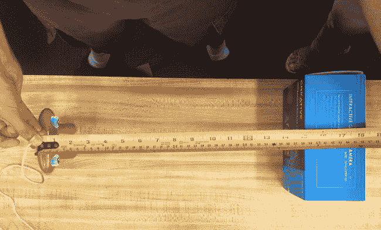

# 十、3D 几何和立体视觉

Abstract

这一章向你介绍了使用单个和多个摄像机的计算机视觉背后的令人兴奋的几何世界。这种几何知识将使您能够将图像坐标转换为实际的 3D 世界坐标，简而言之，您将能够将图像中的位置与世界上明确定义的物理位置相关联。

这一章向你介绍了使用单个和多个摄像机的计算机视觉背后的令人兴奋的几何世界。这种几何知识将使您能够将图像坐标转换为实际的 3D 世界坐标，简而言之，您将能够将图像中的位置与世界上明确定义的物理位置相关联。

本章分为两个主要部分——单摄像机和立体(双)摄像机。对于每个部分，我们将首先讨论相关的数学概念，然后深入研究该数学的 OpenCV 实现。关于立体相机的部分尤其令人兴奋，因为它将使您能够从一对图像中计算出完整的 3D 信息。因此，让我们立即探索相机型号吧！

## 单摄像机校准

您可能知道，每个传感器都需要校准。简而言之，校准是将传感器的测量范围与其测量的真实量相关联的过程。相机是一个传感器，它也需要被校准以给我们物理单位的信息。在没有校准的情况下，我们只能了解图像坐标中的对象，当我们想要在与现实世界交互的机器人上使用视觉系统时，这不是很有用。对于摄像机的标定，首先需要了解摄像机的数学模型，如图 10-1 所示。

图 10-1。

A simple camera model

假设来自真实世界物体的光线使用透镜系统聚焦在称为投影中心的相机点上。显示了一个 3D 坐标系，相机投影中心位于其原点。这就是所谓的相机坐标系。注意，从摄像机图像获得的所有信息都将在该摄像机坐标系中；如果你想将这些信息转换到你的机器人上的任何其他坐标框架，你需要知道从那个框架到相机坐标框架的旋转和平移，我不会在本书中讨论这些。照相机的成像平面沿着 Z 轴位于等于焦距 f 的距离处。成像平面有自己的 2D 坐标系`(u, v)`，现在让我们把它的原点放在 Z 相机轴与成像平面相交的点`(u``0``, v``0``)`。使用相似三角形的概念，很容易观察到相机坐标系中的对象的`(X, Y, Z)`坐标与其图像的`(u, v)`坐标之间的关系是:

然而，在几乎所有的成像软件中，图像的原点都位于左上角。考虑到这一点，关系变成:

单个摄像机的标定是寻找焦距 f 和摄像机坐标系原点的图像`(u``0``v``0``)`的过程。从这些等式中可以明显看出，即使你知道`f`、`u`、、`0`、和`v`、、`0`、，通过校准摄像机，你也不能确定图像点的`Z`坐标，你只能确定一定比例的 X 和 Y 坐标(因为`Z`是未知的)。那么，你可能会说，这些关系的意义是什么？关键是这些关系(以矩阵的形式表示)允许你从物体自身坐标框架中的物体的 3D 坐标和物体图像中的点的 2D 图像坐标之间的一组已知对应关系中找到相机参数`f`、`u`、、`0`、和`v`、、`0`、。这是通过一些巧妙的矩阵数学来完成的，我将在本章后面简要介绍。

相机参数可以被安排到相机矩阵 K 中，如下所示:

假设`(X, Y, Z)`是物体点在物体自身坐标系中的坐标。对于校准，通常使用平面棋盘，因为检测角点相对容易，从而自动确定 3D-2D 点对应关系。现在，因为物体坐标系的选择掌握在我们手中，我们将通过选择使棋盘在`XY`平面上来使生活变得容易得多。因此，所有目标点的`Z`坐标将为 0。如果我们知道棋盘正方形的边长，`X`和`Y`将只是一个点的网格，它们之间的距离。假设`R`和`T`是物体坐标系和摄像机坐标系之间的旋转矩阵和平移。这意味着一旦我们通过`R`和`T`转换了对象坐标，我们将能够使用我们从图 10-1 中导出的关系。`R`和`T`未知。如果我们用列向量`[X Y Z 1]` `T` 来表示物体坐标，那么我们从向量`[u1, u2, u3]` `T` 中得到:可以用来得到图像的像素坐标。具体来说，像素坐标:

现在，如果你有一个算法来检测棋盘图像中的内角，你将有一组棋盘图像的 2D-3D 对应关系。将所有这些对应组合在一起，你会得到两个等式——一个是针对`u`的，一个是针对`v`的。这些方程中的未知数是`R, T`和相机参数。如果你有大量的这些对应关系，你可以解一个庞大的线性方程组来获得相机参数`f`、`u`、、`0`、、`v0`以及每张图像的`R`和`T`。

### 单摄像机标定的 OpenCV 实现

OpenCV 函数`findChessboardCorners()`可以找到棋盘图像中的内角。

图 10-2。

Chessboard corner extraction in OpenCV

它接受图像和图案的大小(沿宽度和高度的内角)作为输入，并使用复杂的算法来计算和返回这些角的像素位置。这些是你的 2D 形象点。您可以自己为 3D 对象点创建一个点 3f 的向量——`X`和`Y`坐标是一个网格，而`Z`坐标都是 0，如前所述。OpenCV 函数`calibrateCamera()`获取这些物体 3D 点和相应的图像 2D 点，并求解方程以输出相机矩阵、`R`、`T`和失真系数。是的，每个相机都有镜头失真，OpenCV 通过使用失真系数来建模。虽然关于确定这些系数背后的数学讨论超出了本书的范围，但是对失真系数的良好估计可以大大提高相机校准。好消息是，如果您有一组不同视图的棋盘图像，OpenCV 通常可以很好地确定系数。

清单 10-1 显示了一个面向对象的方法来读取一组图像，寻找角落，并校准一个相机。它使用了我们在上一章中使用的相同的`CMake`构建系统，以及类似的文件夹组织。假设图像存在于位置`IMAGE_FOLDER`。该程序还将相机矩阵和失真系数存储到一个 XML 文件中，以备后用。

清单 10-1。说明单个摄像机校准的程序

`// Program illustrate single camera calibration`

`// Author: Samarth Manoj Brahmbhatt, University of Pennsylvania`

`#include <opencv2/opencv.hpp>`

`#include <opencv2/highgui/highgui.hpp>`

`#include <opencv2/calib3d/calib3d.hpp>`

`#include <boost/filesystem.hpp>`

`#include "Config.h"`

`using namespace cv;`

`using namespace std;`

`using namespace boost::filesystem3;`

`class calibrator {`

`private:`

`string path; //path of folder containing chessboard images`

`vector<Mat> images; //chessboard images`

`Mat cameraMatrix, distCoeffs; //camera matrix and distortion coefficients`

`bool show_chess_corners; //visualize the extracted chessboard corners?`

`float side_length; //side length of a chessboard square in mm`

`int width, height; //number of internal corners of the chessboard along width and height`

`vector<vector<Point2f> > image_points; //2D image points`

`vector<vector<Point3f> > object_points; //3D object points`

`public:`

`calibrator(string, float, int, int); //constructor, reads in the images`

`void calibrate(); //function to calibrate the camera`

`Mat get_cameraMatrix(); //access the camera matrix`

`Mat get_distCoeffs(); //access the distortion coefficients`

`void calc_image_points(bool); //calculate internal corners of the chessboard image`

`};`

`calibrator::calibrator(string _path, float _side_length, int _width, int _height) {`

`side_length = _side_length;`

`width = _width;`

`height = _height;`

`path = _path;`

`cout << path << endl;`

`// Read images`

`for(directory_iterator i(path), end_iter; i != end_iter; i++) {`

`string filename = path + i->path().filename().string();`

`images.push_back(imread(filename));`

`}`

`}`

`void calibrator::calc_image_points(bool show) {`

`// Calculate the object points in the object co-ordinate system (origin at top left corner)`

`vector<Point3f> ob_p;`

`for(int i = 0; i < height; i++) {`

`for(int j = 0; j < width; j++) {`

`ob_p.push_back(Point3f(j * side_length, i * side_length, 0.f));`

`}`

`}`

`if(show) namedWindow("Chessboard corners");`

`for(int i = 0; i < images.size(); i++) {`

`Mat im = images[i];`

`vector<Point2f> im_p;`

`//find corners in the chessboard image`

`bool pattern_found = findChessboardCorners(im, Size(width, height), im_p, CALIB_CB_ADAPTIVE_THRESH + CALIB_CB_NORMALIZE_IMAGE+ CALIB_CB_FAST_CHECK);`

`if(pattern_found) {`

`object_points.push_back(ob_p);`

`Mat gray;`

`cvtColor(im, gray, CV_BGR2GRAY);`

`cornerSubPix(gray, im_p, Size(5, 5), Size(-1, -1), TermCriteria(CV_TERMCRIT_EPS + CV_TERMCRIT_ITER, 30, 0.1));`

`image_points.push_back(im_p);`

`if(show) {`

`Mat im_show = im.clone();`

`drawChessboardCorners(im_show, Size(width, height), im_p, true);`

`imshow("Chessboard corners", im_show);`

`while(char(waitKey(1)) != ' ') {}`

`}`

`}`

`//if a valid pattern was not found, delete the entry from vector of images`

`else images.erase(images.begin() + i);`

`}`

`}`

`void calibrator::calibrate() {`

`vector<Mat> rvecs, tvecs;`

`float rms_error = calibrateCamera(object_points, image_points, images[0].size(), cameraMatrix, distCoeffs, rvecs, tvecs);`

`cout << "RMS reprojection error " << rms_error << endl;`

`}`

`Mat calibrator::get_cameraMatrix() {`

`return cameraMatrix;`

`}`

`Mat calibrator::get_distCoeffs() {`

`return distCoeffs;`

`}`

`int main() {`

`calibrator calib(IMAGE_FOLDER, 25.f, 5, 4);`

`calib.calc_image_points(true);`

`cout << "Calibrating camera…" << endl;`

`calib.calibrate();`

`//save the calibration for future use`

`string filename = DATA_FOLDER + string("cam_calib.xml");`

`FileStorage fs(filename, FileStorage::WRITE);`

`fs << "cameraMatrix" << calib.get_cameraMatrix();`

`fs << "distCoeffs" << calib.get_distCoeffs();`

`fs.release();`

`cout << "Saved calibration matrices to " << filename << endl;`

`return 0;`

`}`

`calibrateCamera()`返回 RMS 重新投影误差，对于良好的校准，该误差应小于 0.5 像素。我使用的相机和图像集的重投影误差为 0.0547194。请记住，您必须有一套至少 10 幅图像，棋盘在不同的位置和角度，但始终完全可见。

## 立体视觉

立体摄像机就像你的眼睛——两个摄像机水平分开一个固定的距离，称为基线。立体摄像机设置允许您使用视差概念计算图像点的物理深度。为了理解视差，假设您正在通过立体装备的两个相机查看一个 3D 点。如果两个摄像机没有相互指向对方(并且它们通常没有指向对方)，则右边图像中的点的图像将比左边图像中的点的图像具有更低的水平坐标。这种点在两个相机中的图像的明显偏移被称为视差。延伸这个逻辑也告诉我们，视差与点的深度成反比。

### 三角测量

现在，让我们考虑图 10-3 中所示的立体摄像机模型，从更数学的角度来讨论深度和视差之间的关系。

图 10-3。

A stereo camera model

观察两幅图像中点 P 的图像位置。这种情况下的差异是:

使用相似三角形的概念，点的深度(`P`在左摄像机坐标系中的`Z`坐标)由以下表达式决定:因此，点的深度:

一旦你知道了`Z`，你就可以通过使用前面提到的单个相机模型的方程来精确地计算该点的`X`和`Y`坐标。这整个过程被称为“立体三角测量”

### 校准

要校准立体摄像机，首先必须单独校准摄像机。立体声装备的校准需要找出基线`T`。还要注意的是，我在绘制图 10-3 时做了一个强有力的假设——两个图像平面完全垂直对齐，并且彼此平行。小的制造缺陷通常不会导致这种情况，并且存在明确的旋转矩阵`R`来对准两个成像平面。校准还计算出`R. T`也不是一个单一的数字，而是一个代表从左相机原点到右相机原点的平移的向量。OpenCV 函数`stereoCalibrate()`通过接受以下输入来计算`R, T`，以及称为`E`(本质矩阵)和`F`(基本矩阵)的两个其他矩阵:

*   3D 物体点(与单摄像机校准情况相同)
*   左右 2D 图像点(使用左右图像中的`findCameraCorners()`计算)
*   左右摄像机矩阵和失真系数(可选)

请注意，左右摄像机校准信息是可选的，如果没有提供，该函数会尝试计算它。但是强烈建议您提供它，以便该函数只需优化较少的参数。

如果您的 USB 端口连接了立体摄像机，该端口通常没有足够的带宽以 30 fps 的速度传输左右 640 x 480 彩色帧。您可以通过改变与摄像机相关联的`VideoCapture`对象的属性来减小帧的大小，如清单 10-2 所示。图 10-4 显示了我的立体相机拍摄的 320 x 240 帧。对于立体应用，左图像和右图像必须在同一时刻捕捉。这可以通过硬件同步来实现，但是如果你的立体摄像机没有这个功能，你可以首先使用`VideoCapture`类的`grab()`方法快速抓取原始帧，然后使用`retrieve()`方法完成更繁重的去马赛克、解码和`Mat`存储任务。这确保了两个帧几乎同时被捕获。

清单 10-2。这个程序演示了从 USB 立体摄像机捕捉帧

`// Program to illustrate frame capture from a USB stereo camera`

`// Author: Samarth Manoj Brahmbhatt, University of Pennsylvania`

`#include <opencv2/opencv.hpp>`

`#include <opencv2/highgui/highgui.hpp>`

`using namespace cv;`

`using namespace std;`

`int main() {`

`VideoCapture capr(1), capl(2);`

`//reduce frame size`

`capl.set(CV_CAP_PROP_FRAME_HEIGHT, 240);`

`capl.set(CV_CAP_PROP_FRAME_WIDTH, 320);`

`capr.set(CV_CAP_PROP_FRAME_HEIGHT, 240);`

`capr.set(CV_CAP_PROP_FRAME_WIDTH, 320);`

`namedWindow("Left");`

`namedWindow("Right");`

`while(char(waitKey(1)) != 'q') {`

`//grab raw frames first`

`capl.grab();`

`capr.grab();`

`//decode later so the grabbed frames are less apart in time`

`Mat framel, framer;`

`capl.retrieve(framel);`

`capr.retrieve(framer);`

`if(framel.empty() || framer.empty()) break;`

`imshow("Left", framel);`

`imshow("Right", framer);`

`}`

`capl.release();`

`capr.release();`

`return 0;`

`}`

图 10-4。

Frames from a stereo camera

清单 10-3 是一个应用，你可以用它来捕捉一组棋盘图像来校准你的立体相机。当你按下“c”时，它会将一对图像保存到单独的文件夹中(称为`LEFT_FOLDER`和`RIGHT_FOLDER`)。它使用了`CMake`构建系统和一个类似于我们在`CMake`项目中使用的配置文件。

清单 10-3。收集立体声快照进行校准的程序

`// Program to collect stereo snapshots for calibration`

`// Author: Samarth Manoj Brahmbhatt, University of Pennsylvania`

`#include <opencv2/opencv.hpp>`

`#include <opencv2/highgui/highgui.hpp>`

`#include "Config.h"`

`#include <iomanip>`

`using namespace cv;`

`using namespace std;`

`int main() {`

`VideoCapture capr(1), capl(2);`

`//reduce frame size`

`capl.set(CV_CAP_PROP_FRAME_HEIGHT, 240);`

`capl.set(CV_CAP_PROP_FRAME_WIDTH, 320);`

`capr.set(CV_CAP_PROP_FRAME_HEIGHT, 240);`

`capr.set(CV_CAP_PROP_FRAME_WIDTH, 320);`

`namedWindow("Left");`

`namedWindow("Right");`

`cout << "Press 'c' to capture ..." << endl;`

`char choice = 'z';`

`int count = 0;`

`while(choice != 'q') {`

`//grab frames quickly in succession`

`capl.grab();`

`capr.grab();`

`//execute the heavier decoding operations`

`Mat framel, framer;`

`capl.retrieve(framel);`

`capr.retrieve(framer);`

`if(framel.empty() || framer.empty()) break;`

`imshow("Left", framel);`

`imshow("Right", framer);`

`if(choice == 'c') {`

`//save files at proper locations if user presses 'c'`

`stringstream l_name, r_name;`

`l_name << "left" << setw(4) << setfill('0') << count << ".jpg";`

`r_name << "right" << setw(4) << setfill('0') << count << ".jpg";`

`imwrite(string(LEFT_FOLDER) + l_name.str(), framel);`

`imwrite(string(RIGHT_FOLDER) + r_name.str(), framer);`

`cout << "Saved set " << count << endl;`

`count++;`

`}`

`choice = char(waitKey(1));`

`}`

`capl.release();`

`capr.release();`

`return 0;`

`}`

清单 10-4 是一个应用，它通过读入存储在`LEFT_FOLDER`和`RIGHT_FOLDER`中的先前捕获的立体图像，以及先前保存在 DATA_FOLDER 中的单个相机校准信息来校准立体相机。我的相机和一组图像给我的均方根重投影误差为 0.377848 像素。

清单 10-4。说明立体摄像机校准的程序

`// Program illustrate stereo camera calibration`

`// Author: Samarth Manoj Brahmbhatt, University of Pennsylvania`

`#include <opencv2/opencv.hpp>`

`#include <opencv2/highgui/highgui.hpp>`

`#include <opencv2/calib3d/calib3d.hpp>`

`#include <boost/filesystem.hpp>`

`#include "Config.h"`

`using namespace cv;`

`using namespace std;`

`using namespace boost::filesystem3;`

`class calibrator {`

`private:`

`string l_path, r_path; //path for folders containing left and right checkerboard images`

`vector<Mat> l_images, r_images; //left and right checkerboard images`

`Mat l_cameraMatrix, l_distCoeffs, r_cameraMatrix, r_distCoeffs; //Mats for holding individual camera calibration information`

`bool show_chess_corners; //visualize checkerboard corner detections?`

`float side_length; //side length of checkerboard squares`

`int width, height; //number of internal corners in checkerboard along width and height`

`vector<vector<Point2f> > l_image_points, r_image_points; //left and right image points`

`vector<vector<Point3f> > object_points; //object points (grid)`

`Mat R, T, E, F; //stereo calibration information`

`public:`

`calibrator(string, string, float, int, int); //constructor`

`bool calibrate(); //function to calibrate stereo camera`

`void calc_image_points(bool); //function to calculae image points by detecting checkerboard corners`

`};`

`calibrator::calibrator(string _l_path, string _r_path, float _side_length, int _width, int _height) {`

`side_length = _side_length;`

`width = _width;`

`height = _height;`

`l_path = _l_path;`

`r_path = _r_path;`

`// Read images`

`for(directory_iterator i(l_path), end_iter; i != end_iter; i++) {`

`string im_name = i->path().filename().string();`

`string l_filename = l_path + im_name;`

`im_name.replace(im_name.begin(), im_name.begin() + 4, string("right"));`

`string r_filename = r_path + im_name;`

`Mat lim = imread(l_filename), rim = imread(r_filename);`

`if(!lim.empty() && !rim.empty()) {`

`l_images.push_back(lim);`

`r_images.push_back(rim);`

`}`

`}`

`}`

`void calibrator::calc_image_points(bool show) {`

`// Calculate the object points in the object co-ordinate system (origin at top left corner)`

`vector<Point3f> ob_p;`

`for(int i = 0; i < height; i++) {`

`for(int j = 0; j < width; j++) {`

`ob_p.push_back(Point3f(j * side_length, i * side_length, 0.f));`

`}`

`}`

`if(show) {`

`namedWindow("Left Chessboard corners");`

`namedWindow("Right Chessboard corners");`

`}`

`for(int i = 0; i < l_images.size(); i++) {`

`Mat lim = l_images[i], rim = r_images[i];`

`vector<Point2f> l_im_p, r_im_p;`

`bool l_pattern_found = findChessboardCorners(lim, Size(width, height), l_im_p, CALIB_CB_ADAPTIVE_THRESH + CALIB_CB_NORMALIZE_IMAGE+ CALIB_CB_FAST_CHECK);`

`bool r_pattern_found = findChessboardCorners(rim, Size(width, height), r_im_p, CALIB_CB_ADAPTIVE_THRESH + CALIB_CB_NORMALIZE_IMAGE+ CALIB_CB_FAST_CHECK);`

`if(l_pattern_found && r_pattern_found) {`

`object_points.push_back(ob_p);`

`Mat gray;`

`cvtColor(lim, gray, CV_BGR2GRAY);`

`cornerSubPix(gray, l_im_p, Size(5, 5), Size(-1, -1), TermCriteria(CV_TERMCRIT_EPS + CV_TERMCRIT_ITER, 30, 0.1));`

`cvtColor(rim, gray, CV_BGR2GRAY);`

`cornerSubPix(gray, r_im_p, Size(5, 5), Size(-1, -1), TermCriteria(CV_TERMCRIT_EPS + CV_TERMCRIT_ITER, 30, 0.1));`

`l_image_points.push_back(l_im_p);`

`r_image_points.push_back(r_im_p);`

`if(show) {`

`Mat im_show = lim.clone();`

`drawChessboardCorners(im_show, Size(width, height), l_im_p, true);`

`imshow("Left Chessboard corners", im_show);`

`im_show = rim.clone();`

`drawChessboardCorners(im_show, Size(width, height), r_im_p, true);`

`imshow("Right Chessboard corners", im_show);`

`while(char(waitKey(1)) != ' ') {}`

`}`

`}`

`else {`

`l_images.erase(l_images.begin() + i);`

`r_images.erase(r_images.begin() + i);`

`}`

`}`

`}`

`bool calibrator::calibrate() {`

`string filename = DATA_FOLDER + string("left_cam_calib.xml");`

`FileStorage fs(filename, FileStorage::READ);`

`fs["cameraMatrix"] >> l_cameraMatrix;`

`fs["distCoeffs"] >> l_distCoeffs;`

`fs.release();`

`filename = DATA_FOLDER + string("right_cam_calib.xml");`

`fs.open(filename, FileStorage::READ);`

`fs["cameraMatrix"] >> r_cameraMatrix;`

`fs["distCoeffs"] >> r_distCoeffs;`

`fs.release();`

`if(!l_cameraMatrix.empty() && !l_distCoeffs.empty() && !r_cameraMatrix.empty() && !r_distCoeffs.empty()) {`

`double rms = stereoCalibrate(object_points, l_image_points, r_image_points, l_cameraMatrix, l_distCoeffs, r_cameraMatrix, r_distCoeffs, l_images[0].size(), R, T, E, F);`

`cout << "Calibrated stereo camera with a RMS error of " << rms << endl;`

`filename = DATA_FOLDER + string("stereo_calib.xml");`

`fs.open(filename, FileStorage::WRITE);`

`fs << "l_cameraMatrix" << l_cameraMatrix;`

`fs << "r_cameraMatrix" << r_cameraMatrix;`

`fs << "l_distCoeffs" << l_distCoeffs;`

`fs << "r_distCoeffs" << r_distCoeffs;`

`fs << "R" << R;`

`fs << "T" << T;`

`fs << "E" << E;`

`fs << "F" << F;`

`cout << "Calibration parameters saved to " << filename << endl;`

`return true;`

`}`

`else return false;`

`}`

`int main() {`

`calibrator calib(LEFT_FOLDER, RIGHT_FOLDER, 1.f, 5, 4);`

`calib.calc_image_points(true);`

`bool done = calib.calibrate();`

`if(!done) cout << "Stereo Calibration not successful because individial calibration matrices could not be read" << endl;`

`return 0;`

`}`

### 匹配矫正与差异

回想一下关于立体三角测量的讨论，您可以通过找出右图像中的哪个像素与左图像中的像素相匹配，然后计算它们的水平坐标差，来确定一对立体图像中像素的视差。但是在整个右图像中搜索像素匹配非常困难。如何优化匹配像素的搜索？

理论上，左像素的匹配右像素将与左像素在相同的垂直坐标上(但是沿着与深度成反比的水平坐标移动)。这是因为理论上的立体摄像机的单个摄像机仅水平偏移。这大大简化了搜索——您只需在与左侧像素行相同的行中搜索右侧图像！实际上，由于制造缺陷，立体装备中的两个相机没有精确地垂直对齐。校准为我们解决了这个问题——它计算从左摄像机到右摄像机的旋转 R 和平移 T。如果我们通过 R 和 T 变换我们的右图像，两幅图像可以精确地对齐，并且单行搜索变得有效。

在 OpenCV 中，对齐两幅图像的过程(称为立体校正)由函数完成— `stereoRectify(), initUndistortRectifyMap()`和`remap(). stereoRectify()`接收单个摄像机和立体装配的校准信息，并给出以下输出(矩阵名称与在线文档匹配):

*   `R1`—应用于左摄像机图像的旋转矩阵，以使其对齐
*   `R2`—应用于右摄像机图像的旋转矩阵，以使其对齐
*   `P1`—对准的左摄像机的表观摄像机矩阵，附加一列，用于转换到校准坐标系的原点(左摄像机的坐标系)。对于左边的摄像机，这是[0 0 0]T
*   `P2`—对准的右摄像机的表观摄像机矩阵，附加一列，用于转换到校准坐标系(左摄像机坐标系)的原点。对于右边的相机，这大约是[-T 0 0]T，其中 T 是两个相机原点之间的距离
*   `Q`—视差-深度映射矩阵(公式见函数 reprojectImageTo3d()文档)

一旦你得到了这些变换，你必须把它们应用到相应的图像上。做到这一点的有效方法是像素映射。下面是像素图的工作原理——假设校正后的图像是一块适当大小的空白画布，我们希望用未校正图像中的适当像素填充它。像素图是与校正图像大小相同的矩阵，并且充当从校正图像中的位置到未校正图像中的位置的查找表。为了知道必须采用未校正图像中的哪个像素来填充校正图像中的空白像素，只需在像素图中查找相应的条目。因为与浮点乘法相比，矩阵查找非常有效，所以像素图使得对齐图像的过程非常快。OpenCV 函数`initUndistortRectifyMap()`通过将`stereoRectify()`输出的矩阵作为输入来计算像素映射。函数`remap()`将像素图应用于未校正的图像，以对其进行校正。

清单 10-5 显示了所有这些函数的使用例子；我们也鼓励您查阅他们的在线文档，探索各种选项。图 10-5 显示了立体校正的效果——请注意两幅图像中视觉上对应的像素现在处于相同的水平位置。

清单 10-5。说明立体摄像机校正的程序

`// Program illustrate stereo camera rectification`

`// Author: Samarth Manoj Brahmbhatt, University of Pennsylvania`

`#include <opencv2/opencv.hpp>`

`#include <opencv2/highgui/highgui.hpp>`

`#include <opencv2/calib3d/calib3d.hpp>`

`#include <boost/filesystem.hpp>`

`#include "Config.h"`

`using namespace cv;`

`using namespace std;`

`using namespace boost::filesystem3;`

`class calibrator {`

`private:`

`string l_path, r_path;`

`vector<Mat> l_images, r_images;`

`Mat l_cameraMatrix, l_distCoeffs, r_cameraMatrix, r_distCoeffs;`

`bool show_chess_corners;`

`float side_length;`

`int width, height;`

`vector<vector<Point2f> > l_image_points, r_image_points;`

`vector<vector<Point3f> > object_points;`

`Mat R, T, E, F;`

`public:`

`calibrator(string, string, float, int, int);`

`void calc_image_points(bool);`

`bool calibrate();`

`void save_info(string);`

`Size get_image_size();`

`};`

`class rectifier {`

`private:`

`Mat map_l1, map_l2, map_r1, map_r2; //pixel maps for rectification`

`string path;`

`public:`

`rectifier(string, Size); //constructor`

`void show_rectified(Size); //function to show live rectified feed from stereo camera`

`};`

`calibrator::calibrator(string _l_path, string _r_path, float _side_length, int _width, int _height) {`

`side_length = _side_length;`

`width = _width;`

`height = _height;`

`l_path = _l_path;`

`r_path = _r_path;`

`// Read images`

`for(directory_iterator i(l_path), end_iter; i != end_iter; i++) {`

`string im_name = i->path().filename().string();`

`string l_filename = l_path + im_name;`

`im_name.replace(im_name.begin(), im_name.begin() + 4, string("right"));`

`string r_filename = r_path + im_name;`

`Mat lim = imread(l_filename), rim = imread(r_filename);`

`if(!lim.empty() && !rim.empty()) {`

`l_images.push_back(lim);`

`r_images.push_back(rim);`

`}`

`}`

`}`

`void calibrator::calc_image_points(bool show) {`

`// Calculate the object points in the object co-ordinate system (origin at top left corner)`

`vector<Point3f> ob_p;`

`for(int i = 0; i < height; i++) {`

`for(int j = 0; j < width; j++) {`

`ob_p.push_back(Point3f(j * side_length, i * side_length, 0.f));`

`}`

`}`

`if(show) {`

`namedWindow("Left Chessboard corners");`

`namedWindow("Right Chessboard corners");`

`}`

`for(int i = 0; i < l_images.size(); i++) {`

`Mat lim = l_images[i], rim = r_images[i];`

`vector<Point2f> l_im_p, r_im_p;`

`bool l_pattern_found = findChessboardCorners(lim, Size(width, height), l_im_p, CALIB_CB_ADAPTIVE_THRESH + CALIB_CB_NORMALIZE_IMAGE+ CALIB_CB_FAST_CHECK);`

`bool r_pattern_found = findChessboardCorners(rim, Size(width, height), r_im_p, CALIB_CB_ADAPTIVE_THRESH + CALIB_CB_NORMALIZE_IMAGE+ CALIB_CB_FAST_CHECK);`

`if(l_pattern_found && r_pattern_found) {`

`object_points.push_back(ob_p);`

`Mat gray;`

`cvtColor(lim, gray, CV_BGR2GRAY);`

`cornerSubPix(gray, l_im_p, Size(5, 5), Size(-1, -1), TermCriteria(CV_TERMCRIT_EPS + CV_TERMCRIT_ITER, 30, 0.1));`

`cvtColor(rim, gray, CV_BGR2GRAY);`

`cornerSubPix(gray, r_im_p, Size(5, 5), Size(-1, -1), TermCriteria(CV_TERMCRIT_EPS + CV_TERMCRIT_ITER, 30, 0.1));`

`l_image_points.push_back(l_im_p);`

`r_image_points.push_back(r_im_p);`

`if(show) {`

`Mat im_show = lim.clone();`

`drawChessboardCorners(im_show, Size(width, height), l_im_p, true);`

`imshow("Left Chessboard corners", im_show);`

`im_show = rim.clone();`

`drawChessboardCorners(im_show, Size(width, height), r_im_p, true);`

`imshow("Right Chessboard corners", im_show);`

`while(char(waitKey(1)) != ' ') {}`

`}`

`}`

`else {`

`l_images.erase(l_images.begin() + i);`

`r_images.erase(r_images.begin() + i);`

`}`

`}`

`}`

`bool calibrator::calibrate() {`

`string filename = DATA_FOLDER + string("left_cam_calib.xml");`

`FileStorage fs(filename, FileStorage::READ);`

`fs["cameraMatrix"] >> l_cameraMatrix;`

`fs["distCoeffs"] >> l_distCoeffs;`

`fs.release();`

`filename = DATA_FOLDER + string("right_cam_calib.xml");`

`fs.open(filename, FileStorage::READ);`

`fs["cameraMatrix"] >> r_cameraMatrix;`

`fs["distCoeffs"] >> r_distCoeffs;`

`fs.release();`

`if(!l_cameraMatrix.empty() && !l_distCoeffs.empty() && !r_cameraMatrix.empty() && !r_distCoeffs.empty()) {`

`double rms = stereoCalibrate(object_points, l_image_points, r_image_points, l_cameraMatrix, l_distCoeffs, r_cameraMatrix, r_distCoeffs, l_images[0].size(), R, T, E, F);`

`cout << "Calibrated stereo camera with a RMS error of " << rms << endl;`

`return true;`

`}`

`else return false;`

`}`

`void calibrator::save_info(string filename) {`

`FileStorage fs(filename, FileStorage::WRITE);`

`fs << "l_cameraMatrix" << l_cameraMatrix;`

`fs << "r_cameraMatrix" << r_cameraMatrix;`

`fs << "l_distCoeffs" << l_distCoeffs;`

`fs << "r_distCoeffs" << r_distCoeffs;`

`fs << "R" << R;`

`fs << "T" << T;`

`fs << "E" << E;`

`fs << "F" << F;`

`fs.release();`

`cout << "Calibration parameters saved to " << filename << endl;`

`}`

`Size calibrator::get_image_size() {`

`return l_images[0].size();`

`}`

`rectifier::rectifier(string filename, Size image_size) {`

`// Read individal camera calibration information from saved XML file`

`Mat l_cameraMatrix, l_distCoeffs, r_cameraMatrix, r_distCoeffs, R, T;`

`FileStorage fs(filename, FileStorage::READ);`

`fs["l_cameraMatrix"] >> l_cameraMatrix;`

`fs["l_distCoeffs"] >> l_distCoeffs;`

`fs["r_cameraMatrix"] >> r_cameraMatrix;`

`fs["r_distCoeffs"] >> r_distCoeffs;`

`fs["R"] >> R;`

`fs["T"] >> T;`

`fs.release();`

`if(l_cameraMatrix.empty() || r_cameraMatrix.empty() || l_distCoeffs.empty() || r_distCoeffs.empty() || R.empty() || T.empty())`

`cout << "Rectifier: Loading of files not successful" << endl;`

`// Calculate transforms for rectifying images`

`Mat Rl, Rr, Pl, Pr, Q;`

`stereoRectify(l_cameraMatrix, l_distCoeffs, r_cameraMatrix, r_distCoeffs, image_size, R, T, Rl, Rr, Pl, Pr, Q);`

`// Calculate pixel maps for efficient rectification of images via lookup tables`

`initUndistortRectifyMap(l_cameraMatrix, l_distCoeffs, Rl, Pl, image_size, CV_16SC2, map_l1, map_l2);`

`initUndistortRectifyMap(r_cameraMatrix, r_distCoeffs, Rr, Pr, image_size, CV_16SC2, map_r1, map_r2);`

`fs.open(filename, FileStorage::APPEND);`

`fs << "Rl" << Rl;`

`fs << "Rr" << Rr;`

`fs << "Pl" << Pl;`

`fs << "Pr" << Pr;`

`fs << "Q" << Q;`

`fs << "map_l1" << map_l1;`

`fs << "map_l2" << map_l2;`

`fs << "map_r1" << map_r1;`

`fs << "map_r2" << map_r2;`

`fs.release();`

`}`

`void rectifier::show_rectified(Size image_size) {`

`VideoCapture capr(1), capl(2);`

`//reduce frame size`

`capl.set(CV_CAP_PROP_FRAME_HEIGHT, image_size.height);`

`capl.set(CV_CAP_PROP_FRAME_WIDTH, image_size.width);`

`capr.set(CV_CAP_PROP_FRAME_HEIGHT, image_size.height);`

`capr.set(CV_CAP_PROP_FRAME_WIDTH, image_size.width);`

`destroyAllWindows();`

`namedWindow("Combo");`

`while(char(waitKey(1)) != 'q') {`

`//grab raw frames first`

`capl.grab();`

`capr.grab();`

`//decode later so the grabbed frames are less apart in time`

`Mat framel, framel_rect, framer, framer_rect;`

`capl.retrieve(framel);`

`capr.retrieve(framer);`

`if(framel.empty() || framer.empty()) break;`

`// Remap images by pixel maps to rectify`

`remap(framel, framel_rect, map_l1, map_l2, INTER_LINEAR);`

`remap(framer, framer_rect, map_r1, map_r2, INTER_LINEAR);`

`// Make a larger image containing the left and right rectified images side-by-side`

`Mat combo(image_size.height, 2 * image_size.width, CV_8UC3);`

`framel_rect.copyTo(combo(Range::all(), Range(0, image_size.width)));`

`framer_rect.copyTo(combo(Range::all(), Range(image_size.width, 2*image_size.width)));`

`// Draw horizontal red lines in the combo image to make comparison easier`

`for(int y = 0; y < combo.rows; y += 20)`

`line(combo, Point(0, y), Point(combo.cols, y), Scalar(0, 0, 255));`

`imshow("Combo", combo);`

`}`

`capl.release();`

`capr.release();`

`}`

`int main() {`

`string filename = DATA_FOLDER + string("stereo_calib.xml");`

`/*`

`calibrator calib(LEFT_FOLDER, RIGHT_FOLDER, 25.f, 5, 4);`

`calib.calc_image_points(true);`

`bool done = calib.calibrate();`

`if(!done) cout << "Stereo Calibration not successful because individial calibration matrices could not be read" << endl;`

`calib.save_info(filename);`

`Size image_size = calib.get_image_size();`

`*/`

`Size image_size(320, 240);`

`rectifier rec(filename, image_size);`

`rec.show_rectified(image_size);`

`return 0;`

`}`

图 10-5。

Stereo rectification

现在，在两幅图像中获得匹配的像素并计算视差变得相当容易。OpenCV 在`StereoSGBM`类中实现了半全局块匹配(SGBM)算法。这种算法使用一种称为动态规划的技术来使匹配更加鲁棒。该算法有一系列与之相关的参数，主要是:

*   `SADWindowSize`:要匹配的块的大小(必须是奇数)
*   `P1`和`P2`:控制计算出的视差的平滑度的参数。如果两个相邻像素之间的视差分别变化+/- 1 或大于 1，则它们是由动态规划匹配算法引起的“惩罚”
*   `speckleWindowSize`和`speckleRange`:视差往往有斑点。这些参数控制视差斑点过滤器。`speckleWindowSize`表示被认为是斑点的平滑视差区域的最大尺寸，而`speckleRange`表示
*   `minDisparity`和`numberOfDisparities`:这些参数共同控制立体声设置的“范围”。如前所述，右图像中匹配像素的位置在左图像中对应像素位置的左侧。如果`minDisparity`为 0，该算法从左图像中的像素位置开始在右图像中搜索匹配像素，并向左前进。如果`minDisparity`为正，则算法从左图像中位置的左侧(通过`minDisparity`像素)开始在右图像中搜索，然后向左进行。当两个摄像头指向彼此相反的方向时，您会希望这样。当两个摄像头相互指向对方时，您也可以将`minDisparity`设置为负。因此，搜索的开始位置由`minDisparity`确定。然而，搜索总是从其起始位置在右图像中向左进行。有多远？这是由`numberOfDisparities`决定的。注意`numberOfDisparities`必须是 OpenCV 实现的 16 的倍数

清单 10-6 展示了如何使用`StereoSGBM`类计算两幅校正图像的差异。它还允许您使用滑块试验`minDisparity`和`numberOfDisparities`的值。请注意`StereoSGBM`计算的视差转换为可视形式，因为`StereoSGBM`输出的原始视差被缩放 16 倍(阅读`StereoSGBM`的在线文档)。该程序使用 OpenCV `stereo_match`演示代码中立体算法的一些参数值。图 10-6 显示了特定场景的差异。

清单 10-6。程序说明了从一个校准的立体摄像机视差计算

`// Program illustrate disparity calculation from a calibrated stereo camera`

`// Author: Samarth Manoj Brahmbhatt, University of Pennsylvania`

`#include <opencv2/opencv.hpp>`

`#include <opencv2/highgui/highgui.hpp>`

`#include <opencv2/calib3d/calib3d.hpp>`

`#include "Config.h"`

`using namespace cv;`

`using namespace std;`

`class disparity {`

`private:`

`Mat map_l1, map_l2, map_r1, map_r2; // rectification pixel maps`

`StereoSGBM stereo; // stereo matching object for disparity computation`

`int min_disp, num_disp; // parameters of StereoSGBM`

`public:`

`disparity(string, Size); //constructor`

`void set_minDisp(int minDisp) { stereo.minDisparity = minDisp; }`

`void set_numDisp(int numDisp) { stereo.numberOfDisparities = numDisp; }`

`void show_disparity(Size); // show live disparity by processing stereo camera feed`

`};`

`// Callback functions for minDisparity and numberOfDisparities trackbars`

`void on_minDisp(int min_disp, void * _disp_obj) {`

`disparity * disp_obj = (disparity *) _disp_obj;`

`disp_obj -> set_minDisp(min_disp - 30);`

`}`

`void on_numDisp(int num_disp, void * _disp_obj) {`

`disparity * disp_obj = (disparity *) _disp_obj;`

`num_disp = (num_disp / 16) * 16;`

`setTrackbarPos("numDisparity", "Disparity", num_disp);`

`disp_obj -> set_numDisp(num_disp);`

`}`

`disparity::disparity(string filename, Size image_size) {`

`// Read pixel maps from XML file`

`FileStorage fs(filename, FileStorage::READ);`

`fs["map_l1"] >> map_l1;`

`fs["map_l2"] >> map_l2;`

`fs["map_r1"] >> map_r1;`

`fs["map_r2"] >> map_r2;`

`if(map_l1.empty() || map_l2.empty() || map_r1.empty() || map_r2.empty())`

`cout << "WARNING: Loading of mapping matrices not successful" << endl;`

`// Set SGBM parameters (from OpenCV stereo_match.cpp demo)`

`stereo.preFilterCap = 63;`

`stereo.SADWindowSize = 3;`

`stereo.P1 = 8 * 3 * stereo.SADWindowSize * stereo.SADWindowSize;`

`stereo.P2 = 32 * 3 * stereo.SADWindowSize * stereo.SADWindowSize;`

`stereo.uniquenessRatio = 10;`

`stereo.speckleWindowSize = 100;`

`stereo.speckleRange = 32;`

`stereo.disp12MaxDiff = 1;`

`stereo.fullDP = true;`

`}`

`void disparity::show_disparity(Size image_size) {`

`VideoCapture capr(1), capl(2);`

`//reduce frame size`

`capl.set(CV_CAP_PROP_FRAME_HEIGHT, image_size.height);`

`capl.set(CV_CAP_PROP_FRAME_WIDTH, image_size.width);`

`capr.set(CV_CAP_PROP_FRAME_HEIGHT, image_size.height);`

`capr.set(CV_CAP_PROP_FRAME_WIDTH, image_size.width);`

`min_disp = 30;`

`num_disp = ((image_size.width / 8) + 15) & -16;`

`namedWindow("Disparity", CV_WINDOW_NORMAL);`

`namedWindow("Left", CV_WINDOW_NORMAL);`

`createTrackbar("minDisparity + 30", "Disparity", &min_disp, 60, on_minDisp, (void *)this);`

`createTrackbar("numDisparity", "Disparity", &num_disp, 150, on_numDisp, (void *)this);`

`on_minDisp(min_disp, this);`

`on_numDisp(num_disp, this);`

`while(char(waitKey(1)) != 'q') {`

`//grab raw frames first`

`capl.grab();`

`capr.grab();`

`//decode later so the grabbed frames are less apart in time`

`Mat framel, framel_rect, framer, framer_rect;`

`capl.retrieve(framel);`

`capr.retrieve(framer);`

`if(framel.empty() || framer.empty()) break;`

`remap(framel, framel_rect, map_l1, map_l2, INTER_LINEAR);`

`remap(framer, framer_rect, map_r1, map_r2, INTER_LINEAR);`

`// Calculate disparity`

`Mat disp, disp_show;`

`stereo(framel_rect, framer_rect, disp);`

`// Convert disparity to a form easy for visualization`

`disp.convertTo(disp_show, CV_8U, 255/(stereo.numberOfDisparities * 16.));`

`imshow("Disparity", disp_show);`

`imshow("Left", framel);`

`}`

`capl.release();`

`capr.release();`

`}`

`int main() {`

`string filename = DATA_FOLDER + string("stereo_calib.xml");`

`Size image_size(320, 240);`

`disparity disp(filename, image_size);`

`disp.show_disparity(image_size);`

`return 0;`

`}`

图 10-6。

Stereo disparity

如何从视差中获得深度？函数`reprojectImageTo3d()`通过获取视差和由`stereoRectify()`生成的视差-深度映射矩阵`Q`来实现这一点。清单 10-7 显示了一个简单的概念验证应用，它根据视差计算 3D 坐标，并打印出图像中心矩形内各点深度的平均值。从图 10-7 中可以看出，计算出的距离有一点跳跃，但是大部分时间都非常接近正确值 400 mm。回想一下`StereoSGBM`输出的视差是按 16 缩放的，所以我们必须除以 16 才能得到真实的视差。

清单 10-7。使用立体摄像机演示距离测量的程序

`// Program illustrate distance measurement using a stereo camera`

`// Author: Samarth Manoj Brahmbhatt, University of Pennsylvania`

`#include <opencv2/opencv.hpp>`

`#include <opencv2/highgui/highgui.hpp>`

`#include <opencv2/calib3d/calib3d.hpp>`

`#include "Config.h"`

`using namespace cv;`

`using namespace std;`

`class disparity {`

`private:`

`Mat map_l1, map_l2, map_r1, map_r2, Q;`

`StereoSGBM stereo;`

`int min_disp, num_disp;`

`public:`

`disparity(string, Size);`

`void set_minDisp(int minDisp) { stereo.minDisparity = minDisp; }`

`void set_numDisp(int numDisp) { stereo.numberOfDisparities = numDisp; }`

`void show_disparity(Size);`

`};`

`void on_minDisp(int min_disp, void * _disp_obj) {`

`disparity * disp_obj = (disparity *) _disp_obj;`

`disp_obj -> set_minDisp(min_disp - 30);`

`}`

`void on_numDisp(int num_disp, void * _disp_obj) {`

`disparity * disp_obj = (disparity *) _disp_obj;`

`num_disp = (num_disp / 16) * 16;`

`setTrackbarPos("numDisparity", "Disparity", num_disp);`

`disp_obj -> set_numDisp(num_disp);`

`}`

`disparity::disparity(string filename, Size image_size) {`

`FileStorage fs(filename, FileStorage::READ);`

`fs["map_l1"] >> map_l1;`

`fs["map_l2"] >> map_l2;`

`fs["map_r1"] >> map_r1;`

`fs["map_r2"] >> map_r2;`

`fs["Q"] >> Q;`

`if(map_l1.empty() || map_l2.empty() || map_r1.empty() || map_r2.empty() || Q.empty())`

`cout << "WARNING: Loading of mapping matrices not successful" << endl;`

`stereo.preFilterCap = 63;`

`stereo.SADWindowSize = 3;`

`stereo.P1 = 8 * 3 * stereo.SADWindowSize * stereo.SADWindowSize;`

`stereo.P2 = 32 * 3 * stereo.SADWindowSize * stereo.SADWindowSize;`

`stereo.uniquenessRatio = 10;`

`stereo.speckleWindowSize = 100;`

`stereo.speckleRange = 32;`

`stereo.disp12MaxDiff = 1;`

`stereo.fullDP = true;`

`}`

`void disparity::show_disparity(Size image_size) {`

`VideoCapture capr(1), capl(2);`

`//reduce frame size`

`capl.set(CV_CAP_PROP_FRAME_HEIGHT, image_size.height);`

`capl.set(CV_CAP_PROP_FRAME_WIDTH, image_size.width);`

`capr.set(CV_CAP_PROP_FRAME_HEIGHT, image_size.height);`

`capr.set(CV_CAP_PROP_FRAME_WIDTH, image_size.width);`

`min_disp = 30;`

`num_disp = ((image_size.width / 8) + 15) & -16;`

`namedWindow("Disparity", CV_WINDOW_NORMAL);`

`namedWindow("Left", CV_WINDOW_NORMAL);`

`createTrackbar("minDisparity + 30", "Disparity", &min_disp, 60, on_minDisp, (void *)this);`

`createTrackbar("numDisparity", "Disparity", &num_disp, 150, on_numDisp, (void *)this);`

`on_minDisp(min_disp, this);`

`on_numDisp(num_disp, this);`

`while(char(waitKey(1)) != 'q') {`

`//grab raw frames first`

`capl.grab();`

`capr.grab();`

`//decode later so the grabbed frames are less apart in time`

`Mat framel, framel_rect, framer, framer_rect;`

`capl.retrieve(framel);`

`capr.retrieve(framer);`

`if(framel.empty() || framer.empty()) break;`

`remap(framel, framel_rect, map_l1, map_l2, INTER_LINEAR);`

`remap(framer, framer_rect, map_r1, map_r2, INTER_LINEAR);`

`Mat disp, disp_show, disp_compute, pointcloud;`

`stereo(framel_rect, framer_rect, disp);`

`disp.convertTo(disp_show, CV_8U, 255/(stereo.numberOfDisparities * 16.));`

`disp.convertTo(disp_compute, CV_32F, 1.f/16.f);`

`// Calculate 3D co-ordinates from disparity image`

`reprojectImageTo3D(disp_compute, pointcloud, Q, true);`

`// Draw red rectangle around 40 px wide square area im image`

`int xmin = framel.cols/2 - 20, xmax = framel.cols/2 + 20, ymin = framel.rows/2 - 20, ymax = framel.rows/2 + 20;`

`rectangle(framel_rect, Point(xmin, ymin), Point(xmax, ymax), Scalar(0, 0, 255));`

`// Extract depth of 40 px rectangle and print out their mean`

`pointcloud = pointcloud(Range(ymin, ymax), Range(xmin, xmax));`

`Mat z_roi(pointcloud.size(), CV_32FC1);`

`int from_to[] = {2, 0};`

`mixChannels(&pointcloud, 1, &z_roi, 1, from_to, 1);`

`cout << "Depth: " << mean(z_roi) << " mm" << endl;`

`imshow("Disparity", disp_show);`

`imshow("Left", framel_rect);`

`}`

`capl.release();`

`capr.release();`

`}`

`int main() {`

`string filename = DATA_FOLDER + string("stereo_calib.xml");`

`Size image_size(320, 240);`

`disparity disp(filename, image_size);`

`disp.show_disparity(image_size);`

`return 0;`

`}`

 

图 10-7。

Depth measurement using stereo vision

## 摘要

3D 几何不刺激吗？如果你和我一样，对一堆矩阵如何使你能够从一对照片中测量物理图像的实际距离感到着迷，你应该阅读理查德·哈特利和安德鲁·齐泽曼(剑桥大学出版社，2004 年)的《计算机视觉中的多视图几何》，这是这方面的经典著作。立体视觉为您开辟了许多可能性，最重要的是，它允许您在其他计算机视觉算法的输出和现实世界之间建立直接关系！例如，您可以将立体视觉与 object detector 应用相结合，以可靠地了解到被检测对象的物理单位距离。

下一章将带你向在实际移动机器人上部署计算机视觉算法更近一步——它讨论了在 Raspberry Pi 上运行 OpenCV 应用的细节，Raspberry Pi 是一种多功能的小(但功能强大)微控制器，在嵌入式应用中日益闻名。