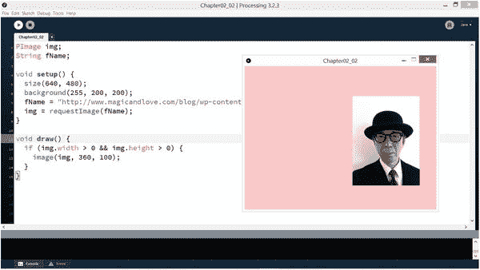
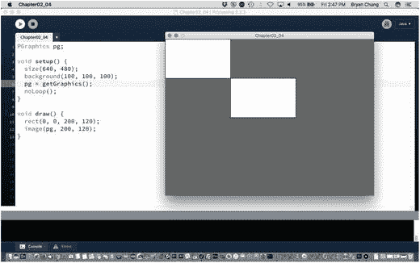
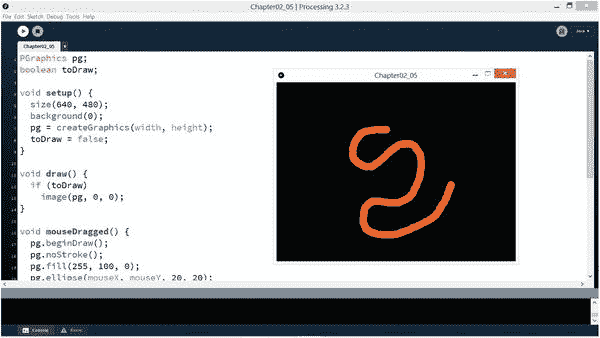
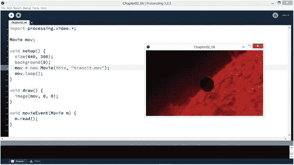
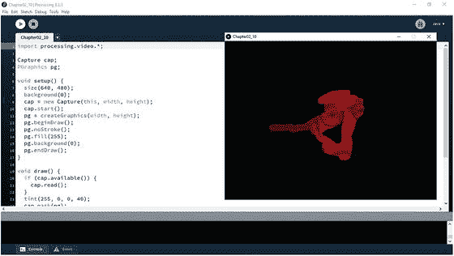
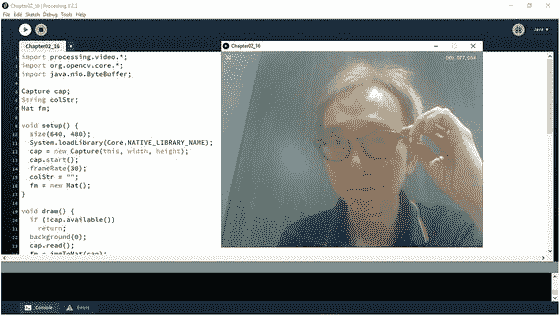
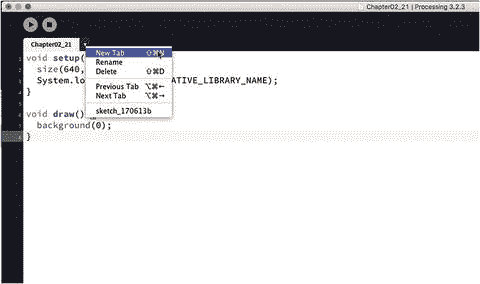

# 二、图像源和表示

本章解释了在 Processing 中创建数字图像的过程，以及在 Processing 和 OpenCV 中光栅图像的内部表示。它演示了如何将外部图像导入到程序中，以及如何使用不同类型的图像处理函数。作为数字图像的一种扩展形式，数字视频和实时视频流的使用将在本章后面的章节中介绍。以下是本章涵盖的基本概念:

*   数字图像基础
*   正在处理的图像
*   处理中的移动图像
*   OpenCV 中的矩阵和图像
*   Processing 和 OpenCV 之间的图像转换

## 数字图像基础

我通常用网格的比喻来表示一幅数字图像。图像的尺寸等于网格的大小，宽度代表列数，高度代表行数。因此，网格内的单元数等于宽度×高度。网格中的每个单元格都是一个彩色像素。对于灰度图像，像素是表示灰色调强度的数字。如果使用一个字节的数据来表示每个像素，灰度将在 0 到 255 的范围内。图 2-1 表示八列六行的灰度图像。


图 2-1。

Grayscale image representation

对于彩色图像，像素是一组代表各个颜色通道强度的数字。常见的颜色表示是 RGB(红、绿、蓝)和 HSB(色调、饱和度、亮度)。为了在 Processing 和 OpenCV 之间架起颜色格式的桥梁，本书主要采用了 ARGB 表示法。每个颜色像素有四个独立的颜色通道，即 alpha(透明度)、红色、绿色和蓝色。例如，完全不透明的红色将是(255，255，0，0)，或者用十六进制表示法#FFFF0000。

总而言之，您使用宽度和高度来描述数字图像的尺寸，使用通道来描述每个像素中颜色元素的数量，使用深度来描述表示每种颜色的数据位数。

## 正在处理的图像

您用来处理数字图像的主要处理类是`PImage` ( [`https://processing.org/reference/PImage.html`](https://processing.org/reference/PImage.html) )。它是仿照 Java 中的`BufferedImage`类( [`https://docs.oracle.com/javase/8/docs/api/java/awt/img/BufferedImage.html`](https://docs.oracle.com/javase/8/docs/api/java/awt/img/BufferedImage.html) )设计的。我不会要求您学习用于`PImage`类的 Javadoc，而是带您完成常见的图像处理任务，以完成以下任务:

*   导入外部图像
*   在处理中创建图像
*   显示图像
*   导出图像

### 导入外部图像

对于这一系列练习，首先创建一个名为`Chapter02_01`的加工草图(程序)。添加外部图像的最简单方法是将图像直接拖动到处理 IDE 窗口上。该过程将在您的加工草图文件夹中创建一个`data`文件夹。或者，您可以在加工草图文件夹中手动创建一个`data`文件夹，并将图像复制到`data`文件夹中。处理过程将自动在该文件夹中搜索外部图像、电影和其他数据文件，如可扩展标记语言(XML)文件。检查您的`data`文件夹中的外部图像。本次练习使用的图像为`HongKong.png`，如图 2-2 所示。下面的代码将加载图像并在处理窗口中显示它。在本例中，处理窗口的大小为 640×480，与图像的大小相同。当裁剪和填充的大小不同时，它们可能会出现。


图 2-2。

Loading an external image

```py
PImage img;

void setup() {

  size(640, 480);
  img = loadImage("HongKong.png");
  noLoop();
}

void draw() {
  image(img, 0, 0);
}

```

第一条语句定义了`PImage`类的一个实例`img`，并且是外部图像的容器。如图所示，`setup()`函数中的语句执行图像文件`HongKong.png`到`img`变量的实际加载:

```py
img = loadImage("HongKong.png");

```

`draw()`函数中的唯一语句，如这里所示，在加工图形窗口中偏移量(0，0)处显示图像:

```py
image(img, 0, 0);

```

注意在`setup()`函数内部有一个`noLoop()`语句。它将执行一次`draw()`功能，而不是在动画模式下循环执行。

在下一个练习中，您将从互联网上加载一个外部图像(图 2-3 )。创建另一个名为`Chapter02_02`的加工草图。输入以下代码。修改`String`变量`fName`，使其指向您想要导入的任何外部图像的 URL。



图 2-3。

Loading an image from the Internet

```py
PImage img;
String fName;

void setup() {
  size(640, 480);
  background(255, 200, 200);
  fName = "http://www.magicandlove.com/blog/wp-content/uploads/2011/10/BryanChung-225x300.png";
  img = requestImage(fName);
}

void draw() {
  if (img.width > 0 && img.height > 0) {
    image(img, 360, 100);
  }
}

```

在本练习中，您将使用函数`requestImage()`来加载一个外部映像，该映像通常驻留在互联网上的某个服务器上。该函数与另一个线程执行异步加载。但是，它不会在成功加载后进行回调。您可以利用`PImage`类的两个属性`width`和`height`来检查加载是否完成。在加载过程中，图像的`width`和`height`属性的值为 0。成功完成加载后，这些值将成为所加载图像的尺寸。以下代码显示了如何修改前面的代码以打印`draw()`函数中`width`和`height`的值，以便您可以检查它们的值:

```py
void draw() {
  println(img.width + ", " + img.height);
  if (img.width > 0 && img.height > 0) {
    image(img, 360, 100);
  }
}

```

如果您故意将 URL 更改为错误的地址，您可能会发现`img.width`和`img.height`的值都变成了-1。

### 在处理中创建图像

除了加载外部图像(图 2-4 ，您还可以在处理过程中从头开始创建数字图像。这样做的函数是`createImage()`，它将返回一个`PImage`类的实例。下一个程序，`Chapter02_03`，将创建一个空的图像，并改变其所有像素为黄色:


图 2-4。

Creating a yellow image within Processing

```py
PImage img;

void setup() {
  size(640, 480);
  background(100, 100, 100);
  img = createImage(width, height, ARGB);
  color yellow = color(255, 255, 0);
  for (int y=0; y<img.height; y++) {
    for (int x=0; x<img.width; x++) {
      img.set(x, y, yellow);
    }
  }
}

void draw() {
  image(img, 0, 0);
}

```

以下语句创建大小为`width` × `height`的数字图像:

```py
img = createImage(width, height, ARGB);

```

变量`width`是指在`size()`函数中指定的加工窗口宽度。它的值是 640。类似地，变量`height`是 480，在`size()`函数中定义。参数`ARGB`定义了四通道图像(即阿尔法、红色、绿色和蓝色)。您还可以使用`RGB`定义三通道图像，使用`ALPHA`定义单个 alpha 通道图像。然而，`PImage`类的内部表示仍然是`ARGB`。下一条语句定义了一个名为`yellow`的颜色变量:

```py
color yellow = color(255, 255, 0);

```

其值为`yellow`，红色和绿色通道的强度最大(255)。带有索引`y`和`x`的嵌套`for`循环简单地遍历图像的所有像素`img`，并将像素颜色更改为`yellow`。注意使用`set()`功能修改单个像素的颜色。这是一种通过使用水平和垂直索引来改变图像中特定点的像素颜色的简便方法。然而,`set()`函数并不是最有效的像素操作方式。我将在本章的后面介绍其他方法来达到这个效果。

```py
img.set(x, y, yellow);

```

### 图形和图像

在下一个练习`Chapter02_04`中，您将研究处理画布的内部结构。类`PGraphics`是主要的图形和渲染上下文。它也是`PImage`的子类。在这种情况下，您可以使用相同的`image()`函数来显示这个图形上下文。下面的代码将首先在画布的左上角绘制一个矩形，然后按偏移量显示画布。执行后，您将看到两个矩形。

```py
PGraphics pg;

void setup() {
  size(640, 480);
  background(100, 100, 100);
  pg = getGraphics();
  noLoop();
}

void draw() {
  rect(0, 0, 200, 120);
  image(pg, 200, 120);
}

```

图 2-5 显示了执行的结果。左上角的第一个矩形是`draw()`函数中`rect()`语句的结果。`image()`语句将整个画布水平偏移 200 像素，垂直偏移 120 像素，并显示整个画布。当您需要将当前绘图画布捕获为图像时，该技术非常有用。



图 2-5。

Use of PGraphics as PImage

在本练习`Chapter02_05`中，您将学习`PGraphics`类的一般用法。您可以将`PGraphics`实例视为一个独立的画布，这样您就可以在屏幕外的画布上进行绘制。当它准备好显示时，您可以使用`image()`功能将其显示在加工窗口中。

```py
PGraphics pg;
boolean toDraw;

void setup() {
  size(640, 480);
  background(0);
  pg = createGraphics(width, height);
  toDraw = false;
}

void draw() {
  if (toDraw)
    image(pg, 0, 0);
}

void mouseDragged() {
  pg.beginDraw();
  pg.noStroke();
  pg.fill(255, 100, 0);
  pg.ellipse(mouseX, mouseY, 20, 20);
  pg.endDraw();
}

void mousePressed() {
  pg.beginDraw();
  pg.background(0);
  pg.endDraw();
  toDraw = false;
}

void mouseReleased() {
  toDraw = true;
}

```

图 2-6 显示了草图样本运行的结果。



图 2-6。

Use of createGraphics() and the PGraphics

注意使用下面的`createGraphics()`函数来创建一个与处理窗口大小相同的`PGraphics`类的实例。它将被用作一个离屏缓冲区来存储您通过拖动鼠标绘制的图形。当您按下、拖动并释放鼠标按钮时，`mousePressed()`、`mouseDragged()`和`mouseReleased()`这三个回调函数将被触发。如果你想在`PGraphics`实例`pg`中创建任何图形，你必须把命令放在`pg.beginDraw()`和`pg.endDraw()`块中。还要注意，您可以通过只输入一个数字来指定灰度颜色，例如在`background(0)`函数中，它用黑色清除背景。在以下代码行中，变量对`mouseX`和`mouseY`将返回处理图形窗口中的当前鼠标位置，以像素为单位:

```py
pg.ellipse(mouseX, mouseY, 20, 20);

```

在该语句中，在当前鼠标位置的屏幕外缓冲区`pg`上绘制了一个椭圆/圆。处理还提供了另一对变量，`pmouseX`和`pmouseY`，它们存储动画最后一帧中的鼠标位置。当您需要绘制一条从前一个鼠标位置到当前位置的线段时，这两对鼠标位置变量将非常有用。

### 加工中的缓冲损伤

在前面的小节中，您学习了如何在处理中使用主图像处理类，`PImage`。对于熟悉 Java 图像处理的人来说，类`BufferedImage` ( [`https://docs.oracle.com/javase/8/docs/api/java/awt/img/BufferedImage.html`](https://docs.oracle.com/javase/8/docs/api/java/awt/img/BufferedImage.html) )对于程序员能够在 Java 中操作图像是很重要的。在处理过程中，您还可以在`PImage`类和`BufferedImage`类之间执行转换。有时候，在处理返回一个`BufferedImage`类的过程中加入其他 Java 图像处理库会很有用。下面的代码演示了处理过程中`PImage`类和`BufferedImage`类之间的转换:

```py
import java.awt.image.BufferedImage;

PImage img;
BufferedImage bim;

void setup() {
  size(640, 480);
  noLoop();
}

void draw() {
  background(0);
  // create the PImage instance img
  img = createImage(width, height, ARGB);
  // create the BufferedImage instance bim from img
  bim = (BufferedImage) img.getNative();
  println(bim.getWidth() + ", " + bim.getHeight());
  // create a new PImage instance nim from BufferedImage bim
  PImage nim = new PImage(bim);
  println(nim.width + ", " + nim.height);
}

```

首先，您使用`import java.awt.image.BufferedImage`将`BufferedImage`的引用包含到您的加工草图中。在`draw()`函数中，使用`createImage()`函数创建一个空的`PImage`实例`img`。通过使用`getNative()`方法，您可以创建一个`BufferedImage`格式的原始图像的副本。给定一个`BufferedImage`、`bim`，您可以通过使用`new PImage(bim)`命令再次创建一个`PImage`。在下面的示例`Chapter02_06`中，您可以看到这种转换在创造性结果中的实际应用:

```py
import java.awt.Robot;
import java.awt.image.BufferedImage;
import java.awt.Rectangle;

Robot robot;

void setup() {
  size(640, 480);
  try {
    robot = new Robot();
  }
  catch (Exception e) {
    println(e.getMessage());
  }
}

void draw() {
  background(0);
  Rectangle rec = new Rectangle(mouseX, mouseY, width, height);
  BufferedImage img1 = robot.createScreenCapture(rec);
  PImage img2 = new PImage(img1);
  image(img2, 0, 0);
}

```

这个处理草图主要使用 Java `Robot`类( [`https://docs.oracle.com/javase/8/docs/api/java/awt/Robot.html`](https://docs.oracle.com/javase/8/docs/api/java/awt/Robot.html) )做一个截屏。屏幕截图的输出(图 2-7 )是一个`BufferedImage`，您可以将其转换为`PImage`以在`draw()`功能中显示。在`setup()`函数中，初始化`try`块中的`robot`实例来捕获`AWTException`。在`draw()`函数中，首先使用一个`Rectangle`对象来定义要捕捉的屏幕区域的偏移量和大小。`robot.createScreenCapture(rec)`将执行实际的屏幕截图，生成的图像存储在`img1`中，它是`BufferedImage`的一个实例。下一条语句将`img1`实例转换成另一个`PImage`实例`img2`，以便用`image()`函数显示。当您在处理窗口内移动鼠标时，您会发现一个有趣的结果，类似于视频艺术中的反馈效果。正是`image()`功能修改了每一帧中的屏幕内容，促成了这个反馈循环。


图 2-7。

Screen capture with PImage

## 处理中的移动图像

您在上一章中安装的用于处理的外部视频库( [`https://processing.org/reference/libraries/video/index.html`](https://processing.org/reference/libraries/video/index.html) )提供了视频播放和捕获的必要功能。它基于 GStreamer 多媒体框架中的 Java 绑定。该库包含两个独立的类:`Movie`用于视频回放，而`Capture`用于实时视频捕捉。两者都是`PImage`的子类。您可以使用类似的方法来处理像素数据。

### 数字电影

下一个练习`Chapter02_07`将循环播放视频库中分发的示例视频`transit.mov`。就像将图像添加到处理草图中一样，您只需将数字视频文件拖到处理 IDE 窗口中。或者你可以在 sketch 文件夹里面创建一个`data`文件夹，把视频文件复制到那里。以下代码执行数字视频的异步回放。每当一个新的帧准备好了，回调`movieEvent()`就会被触发来读取该帧。

```py
import processing.video.*;

Movie mov;

void setup() {
  size(640, 360);
  background(0);
  mov = new Movie(this, "transit.mov");
  mov.loop();
}

void draw() {
  image(mov, 0, 0);
}

void movieEvent(Movie m) {
  m.read();
}

```

当您从主菜单中选择草图➤导入库➤视频时，处理将自动生成第一个`import`语句。下一步是定义`Movie`类实例`mov`。下面的语句将使用视频的名称创建新的实例:

```py
mov = new Movie(this, "transit.mov");

```

关键字`this`指的是当前的加工草图(即`Chapter02_07`)，回调函数`movieEvent()`需要引用它。图 2-8 为运行示意图。



图 2-8。

Digital video playback example

下一个例子`Chapter02_08`，提供了另一种读取数字视频的方法。在这个版本中，每个动画帧中的草图检查新帧的可用性，并同步读取它。

```py
import processing.video.*;

Movie mov;

void setup() {
  size(640, 360);
  background(0);
  mov = new Movie(this, "transit.mov");
  mov.loop();
  frameRate(30);
}

void draw() {
  if (mov.available()) {
    mov.read();
  }
  image(mov, 0, 0);
}

```

注意在`setup()`函数中有一个新的`frameRate()`语句，指定了`draw()`函数的每秒帧速率。对于较慢的计算机，实际帧速率可能比这里指定的要慢。

由于`Movie`是`PImage`的子类，你可以使用`PImage`的`get()`方法从视频的任何一帧中检索像素颜色数据。下一张加工草图`Chapter02_09`将展示这一点:

```py
import processing.video.*;

Movie mov;

void setup() {
  size(640, 360);
  background(0);
  mov = new Movie(this, "transit.mov");
  mov.loop();
  frameRate(30);
}

void draw() {
  if (mov.available()) {
    mov.read();
  }
  image(mov, 0, 0);
}

void mouseClicked() {
  color c = mov.get(mouseX, mouseY);
  println(red(c) + ", " + green(c) + ", " + blue(c));
}

```

在本练习中，您将显示所单击像素的颜色信息。这在`mouseClicked()`回调函数中完成。您提供了像素在`mov`帧中的水平和垂直位置。它返回变量`c`中的颜色数据。通过使用`red()`、`green()`和`blue()`函数，您可以从中检索三原色分量。数字的范围将在 0 到 255 之间。

### 实时视频捕捉

除了数字视频回放之外，Processing 还提供了类`Capture`来支持从常规网络摄像头或捕获设备实时捕获视频流。就像使用`Movie`类时，需要导入`video`库，如下面的练习`Chapter02_10`所示:

```py
import processing.video.*;

Capture cap;

void setup() {
  size(640, 480);
  background(0);
  cap = new Capture(this, width, height);
  cap.start();
}

void draw() {
  image(cap, 0, 0);
}

void captureEvent(Capture c) {
  c.read();
}

```

您将`Capture`类与实例`cap`一起使用。`new`语句创建该类的一个新实例，并将其分配给`cap`。它还需要一个`start()`方法来启动捕获设备。类似于`Movie`类，`Capture`类带有名为`captureEvent()`的回调函数，其中捕获设备可以异步通知主处理草图读入任何可用的新视频帧。由于`Capture`是`PImage`的子类，您可以使用相同的`image()`函数在处理窗口中显示捕捉帧。

在下一个练习`Chapter02_11`中，您将在`draw()`函数中使用捕捉帧的同步读取。同时，您引入了`mask()`功能，通过在一幅蒙版图像上交互绘制来遮盖图像的一部分。

```py
import processing.video.*;

Capture cap;
PGraphics pg;

void setup() {
  size(640, 480);
  background(0);
  cap = new Capture(this, width, height);
  cap.start();
  pg = createGraphics(width, height);
  pg.beginDraw();
  pg.noStroke();
  pg.fill(255);
  pg.background(0);
  pg.endDraw();
}

void draw() {
  if (cap.available()) {
    cap.read();
  }
  tint(255, 0, 0, 40);
  cap.mask(pg);
  image(cap, 0, 0);
}

void mouseDragged() {
  pg.beginDraw();
  pg.ellipse(mouseX, mouseY, 20, 20);
  pg.endDraw();
}

```

在本练习中，您将使用一个名为`pg`的`PGraphics`实例作为离屏缓冲区。在`mouseDragged()`回调函数中，用户可以在黑色背景上创建一个白色圆形标记。在`draw()`函数中，您引入了两个新函数。第一个是`tint()`，用红色(255，0，0)和一点透明度给结果图像着色，如第四个参数 40 所示。第二个是`mask()`功能，在这里你把蒙版`pg`应用到原始图像上(图 2-9)`cap`。结果是一种交互式体验，你可以拖动鼠标来显示底层的实时视频流。



图 2-9。

Live video capture with a mask

## OpenCV 中的矩阵和图像

既然我已经介绍完了如何使用外部图像、视频和直播流进行处理，我将切换回 OpenCV 来帮助您理解它是如何表示数字图像的。开始之前，记得在下一个加工草图`Chapter02_12`中创建一个`code`文件夹。在`code`文件夹中，放入你在前一章创建的 OpenCV 库文件。以下是文件夹中的 OpenCV 文件:

*   `opencv-310.jar`
*   `libopencv_java310.dylib`(适用于苹果电脑)
*   `libopencv_java310.so`(对于 Linux，如 Ubuntu)
*   `opencv_java310.dll`(用于 Windows)

在本练习中，您将使用不同的选项定义多个空矩阵`Mat`，以便理解`Mat`类的内部结构。我将讲述的不同的班级是`Mat`、`Size`、`CvType`和`Scalar`。

```py
import org.opencv.core.*;

void setup() {
  size(640, 480);
  System.loadLibrary(Core.NATIVE_LIBRARY_NAME);
  noLoop();
}

void draw() {
  background(0);
  Mat m1 = new Mat();
  println(m1.dump());
  Mat m2 = new Mat(3, 4, CvType.CV_8UC1, Scalar.all(0));
  println(m2.dump());
  Mat m3 = new Mat(3, 4, CvType.CV_8UC3, Scalar.all(255));
  println(m3.dump());
  Mat m4 = new Mat(new Size(4, 3), CvType.CV_8UC3, new Scalar(0, 255, 0));
  println(m4.dump());
}

```

在本练习中，您定义了四个矩阵。第一个矩阵`m1`是一个没有维度信息的空矩阵。方法`m1.dump()`将返回矩阵内容的可打印形式。第二个矩阵`m2`有三行四列，所以元素总数是 12。每个元素都是 8 位无符号数(`CvType.CV_8UC1`)。首次创建矩阵时，元素的值为 0 ( `Scalar.all(0)`)。方法`m2.dump()`将在三行四列中显示 12 个 0 元素。第三个矩阵`m3`与`m2`具有相同的尺寸。然而，`m3`中的每个元素由三个独立的数字或通道组成(`CvType.CV_8UC3`)。所有元素的值都是 255 ( `Scalar.all(255)`)。您使用不同的方法定义第四个矩阵的维度，`m4`。`new Size(4, 3)`定义了一个新的`Size`对象实例，宽度为 4，高度为 3，相当于一个三行四列的矩阵。每个矩阵元素对于三个通道是相同的。在`m4`中，您用值为`(0, 255, 0)`的`Scalar`实例初始化矩阵元素。

在继续下一个练习之前，让我们看看`CvType`类是如何工作的。`CvType`之后的数据类型规范如下:

```py
CV_[bits][type]C[channels]

```

这里有一个解释:

*   `[bits]`表示代表每个数据元素的位数。它可以是 8、16 或 32。
*   `[type]`表示数据表示的类型。可以不签名，`U`；署名，`S`；还是浮，`F`。
*   `[channels]`表示矩阵中每个数据元素的通道数。它可以是 1、2、3 或 4。

在下一个练习`Chapter02_13`中，您将探索`Mat`类中的许多方法，以理解矩阵元素的数据类型和表示:

```py
import org.opencv.core.*;

void setup() {
  size(640, 480);
  System.loadLibrary(Core.NATIVE_LIBRARY_NAME);
  noLoop();
}

void draw() {
  background(0);
  Mat m1 = new Mat(new Size(4, 3), CvType.CV_8UC3, new Scalar(0, 100, 0));
  println(m1.dump());
  println(m1.rows() + ", " + m1.cols());
  println(m1.width() + ", " + m1.height());
  println("Size: " + m1.size());
  println("Dimension: " + m1.dims());
  println("Number of elements: " + m1.total());
  println("Element size: " + m1.elemSize());
  println("Depth: " + m1.depth());
  println("Number of channels: " + m1.channels());
}

```

您应该从处理控制台窗口获得以下输出:

```py
[  0, 100,   0,   0, 100,   0,   0, 100,   0,   0, 100,   0;
   0, 100,   0,   0, 100,   0,   0, 100,   0,   0, 100,   0;
   0, 100,   0,   0, 100,   0,   0, 100,   0,   0, 100,   0]
3, 4
4, 3
Size: 4x3
Dimension: 2
Number of elements: 12
Element size: 3
Depth: 0
Number of channels: 3

```

大多数信息都很简单。元素大小是每个矩阵元素包含的字节数。深度是每个通道的数据类型指示器。值 0 表示数据类型是 8 位无符号整数，主要用于处理和 OpenCV 之间。除了从现有矩阵中获取信息，下一个练习`Chapter02_14`将展示如何使用`get()`方法从矩阵的单个元素中检索信息:

```py
import org.opencv.core.*;

void setup() {
  size(640, 480);
  System.loadLibrary(Core.NATIVE_LIBRARY_NAME);
  noLoop();
}

void draw() {
  background(0);
  Mat m1 = new Mat(new Size(4, 3), CvType.CV_8UC4, new Scalar(100, 200, 80, 255));
  double [] result = m1.get(0, 0);
  printArray(result);
  byte [] data = new byte[m1.channels()];
  m1.get(2, 2, data);
  for (byte b : data) {
    int i = (b < 0) ? b + 256 : b;
    println(i);
  }
}

```

请注意，在前面的代码中，下面的语句使用`get()`方法来检索位于`m1`中第 0 行第 0 列的数据元素。返回的数据将存储在一个名为`result`的`double`数组中。

```py
double [] result = m1.get(0, 0);

```

您可能会发现，即使矩阵中的每个数据元素都被定义为一个字节(8 位)，使用这种语法的`get()`方法的结果总是返回一个双数组。双数组`result`的长度为 4，这是`CV_8UC4`中定义的通道数。如果将数据元素定义为`CV_8UC1`(即只有一个通道)，那么返回的`result`也将是一个长度等于 1 的双数组。练习的第二部分演示了您还可以显式定义一个长度为 4 的名为`data`的字节数组，使用不同的语法和`get()`方法从位置行 2 列 2 中检索数据元素，并直接将其存储到字节数组`data`中。在`for`循环中，您还需要考虑 Java 没有无符号字节数据类型的事实。对于负数，必须加上 256 才能转换成大于 127 的原始数。

在`get()`方法之后，下一个练习`Chapter02_15`探索了`put()`方法来改变矩阵中数据元素的内容。它演示了使用`put()`方法的两种方式。第一个用字节数组更新数据元素。第二个用一个双数字列表更新数据元素。

```py
import org.opencv.core.*;

void setup() {
  size(640, 480);
  System.loadLibrary(Core.NATIVE_LIBRARY_NAME);
  noLoop();
}

void draw() {
  background(0);
  Mat m1 = new Mat(new Size(4, 3), CvType.CV_8UC4, new Scalar(100, 200, 80, 255));
  byte [] data1 = new byte[m1.channels()];
  byte [] data2 = new byte[m1.channels()];
  m1.get(1, 1, data1);
  data2[0] = data1[3];
  data2[1] = data1[2];
  data2[2] = data1[1];
  data2[3] = data1[0];
  m1.put(1, 1, data2);
  printArray(m1.get(1, 1));
  m1.put(2, 2, 123, 234, 200, 100);
  printArray(m1.get(2, 2));
}

```

本练习的第一部分是将第 1 行第 1 列的数据元素检索到`data1`数组中。然后将`data1`数组重新排序为`data2`数组，长度相同。第一个`put()`方法将`data2`数组存储到同一个数据元素中。然后使用`printArray()`功能显示该数据元素的单个通道信息。在练习的第二部分，您只需在`put()`方法中列出四通道值的四个数字。它们将被存储在第 2 行第 2 列，如第二个`printArray()`语句所示。草图控制台窗口的结果如下:

```py
[0] 255.0
[1] 80.0
[2] 200.0
[3] 100.0
[0] 123.0
[1] 234.0
[2] 200.0
[3] 100.0

```

在结束本次会议之前，您将学习`put()`和`get()`函数的另一个特性，即进行批量信息更新和检索。当编写代码在 Processing 和 OpenCV 之间转换图像数据时，该功能是必不可少的。在接下来的练习`Chapter02_16`中，您将使用一个字节数组和一个矩阵大小的数字序列进行批量更新和检索。

```py
import org.opencv.core.*;

void setup() {
  size(640, 480);
  System.loadLibrary(Core.NATIVE_LIBRARY_NAME);
  noLoop();
}

void draw() {
  background(0);
  Mat m1 = new Mat(new Size(3, 2), CvType.CV_8UC1);
  for (int r=0; r<m1.rows(); r++) {
    for (int c=0; c<m1.cols(); c++) {
      m1.put(r, c, floor(random(100)));
    }
  }
  println(m1.dump());
  byte [] data = new byte[m1.rows()*m1.cols()*m1.channels()];
  m1.get(0, 0, data);
  printArray(data);

  Mat m2 = new Mat(new Size(3, 2), CvType.CV_8UC2, Scalar.all(0));
  m2.put(0, 0, 1, 2, 3, 4, 5, 6, 7, 8);
  println(m2.dump());
}

```

练习的第一部分定义了一个两行三列的小矩阵。每个数据元素都是存储在一个字节中的单通道数字。`for`循环用小于 100 的随机整数值初始化矩阵`m1`。然后定义一个名为`data`的空字节数组，其大小由矩阵`m1`的大小决定(即 2 × 3 × 1 = 6)。在`get()`方法之后，所有的矩阵内容都被转储到`data`数组中。在本练习的第二部分，您将定义另一个矩阵`m2`，它有两行三列。每个数据元素都是一个双通道数字对，如`CV_8UC2`所示。`put()`方法将把数字序列存储到数组的前四个数据元素中。该序列将按行顺序排列。受影响的单元格是(0，0)、(0，1)、(0，2)、(1，0)。括号内的第一个数字是行号，第二个数字是列号。以下语句将(1，2)、(3，4)、(5，6)、(7，8)存储到(0，0)、(0，1)、(0，2)、(1，0)处的位置:

```py
m2.put(0, 0, 1, 2, 3, 4, 5, 6, 7, 8);

```

其余的数据元素不会受到影响。图 2-10 显示了操作后的原始矩阵和新矩阵。


图 2-10。

Operation of the matrix put() function

您可能会注意到，即使您在`get()`和`put()`函数中指定了一个矩阵元素，如果您使用的字节数组超过了一个元素的大小，这些函数也会影响矩阵的其余内容。在下一节中，您将使用这种技术在 Processing 的`PImage`和 OpenCV 的`Mat`之间转换数据。

## Processing 和 OpenCV 之间的图像转换

这一节对于任何想要使用 OpenCV 进行处理的应用都很重要。要使用 OpenCV，您必须将您在处理环境中创建的原始图像(如静态照片、数字视频或网络摄像头直播)转换为 OpenCV 可以操作的`Mat`格式。在对图像执行 OpenCV 操作之后，最后一步是将它们转换成处理可以在其窗口中显示的`PImage`格式。

在本章开始时，您已经了解到处理中的图像是彩色像素的二维数组。水平尺寸是宽度，垂直尺寸是高度。每个像素都是数据类型`color`。颜色像素的内部表示是 32 位的整数。color 实例的十六进制表示法是 0xAARRGGBB，对应于 alpha、红色、绿色和蓝色通道。每个颜色通道的值范围是从 0 到 255。例如，要定义黄色，您可以编写以下代码:

```py
color yellow = color(255, 255, 0);

```

如果你只指定三个颜色通道，默认的 alpha 值会自动设置为 255。您也可以用十六进制符号来表示颜色，如下所示:

```py
color yellow = 0xFFFFFF00;

```

以下代码段将演示`color`变量的使用以及从中检索颜色通道值的不同方法:

```py
color col = color(200, 100, 40);
println("Color value as integer");
println(col);
println("RGB from bitwise operations");
println(col & 0x000000FF);
println((col & 0x0000FF00) >> 8);
println((col & 0x00FF0000) >> 16);
println("RGB from functions");
println(red(col));
println(green(col));
println(blue(col));

```

内部处理不会将图像存储为二维数组。而是存储为名为`pixels[]`的一维整数数组。数组的长度是由它的`width` × `height`定义的图像的像素总数。对于图像中第`y`行和第`x`列的像素，`pixels[]`数组的索引如下:

```py
index = y * width + x;

```

例如，当您有一个只有两行三列的图像时，二维数组如下所示:

<colgroup><col> <col> <col></colgroup> 
| 0 (0, 0) | 1 (0, 1) | 2 (0, 2) |
| 3 (1, 0) | 4 (1, 1) | 5 (1, 2) |

括号内的两个数字是列和行的索引。括号外的单个数字是一维数组中的索引，`pixels[]`，存储处理中的图像。

<colgroup><col> <col> <col> <col> <col> <col></colgroup> 
| 0 (0, 0) | 1 (0, 1) | 2 (0, 2) | 3 (1, 0) | 4 (1, 1) | 5 (1, 2) |

在`pixels[]`数组中，每个单元格都是像素的颜色信息，以 0xAARRGGBB 格式存储为整数。每个整数由 4 个字节组成。整数中的每个字节按照 ARGB 顺序为像素存储一个单独的颜色通道。

<colgroup><col> <col> <col> <col> <col> <col></colgroup> 
| 宝杖 | 宝杖 | 宝杖 | 宝杖 | 宝杖 | 宝杖 |

在 OpenCV 中，颜色像素格式更加灵活，如前一节所示。为了使 OpenCV 与 Processing 兼容，您将坚持使用`CV_8UC4`格式，这样您就可以在 Processing 和 OpenCV 之间交换相同数量的存储。然而，许多 OpenCV 函数依赖于灰度图像(即`CV_8UC1`)和三通道彩色图像的使用，例如 BGR 顺序中的`CV_8UC3)`。在这种情况下，让我们灵活地将图像转换为三个通道和一个单通道彩色图像。

以您用于处理的两行三列为例，OpenCV 表示如下:

<colgroup><col> <col> <col> <col> <col> <col> <col> <col> <col> <col> <col> <col> <col> <col> <col> <col> <col> <col> <col> <col> <col> <col> <col> <col></colgroup> 
| 倍黑 | 游戏结束 | 乡邮投递路线 | 嗜酒者互诫协会 | 倍黑 | 游戏结束 | 乡邮投递路线 | 嗜酒者互诫协会 | 倍黑 | 游戏结束 | 乡邮投递路线 | 嗜酒者互诫协会 | 倍黑 | 游戏结束 | 乡邮投递路线 | 嗜酒者互诫协会 | 倍黑 | 游戏结束 | 乡邮投递路线 | 嗜酒者互诫协会 | 倍黑 | 游戏结束 | 乡邮投递路线 | 嗜酒者互诫协会 |

细胞总数为`width × height × channels`，在本例中为 24。二维图像矩阵将存储为 24 字节或 48 个十六进制字符的线性数组。四个连续的字节组成一个通道顺序为 BGRA 的像素。字节数组将是 OpenCV 图像矩阵的内部表示。

现在你有两个数组。第一个是来自处理的大小为(`width × height`)的整数数组；第二个是来自 OpenCV 的大小为(`width × height × channels`)的字节数组。问题是如何在它们之间进行转换。Java `ByteBuffer`和`IntBuffer`类是这个问题的解决方案。

### 从处理到 OpenCV

您需要在处理环境中有一个源图像。您将使用`Capture`类来检索本练习的视频帧`Chapter02_17`。在每次运行`draw()`函数时，你都试图将帧转换成 OpenCV `Mat`。为了验证转换是否有效，处理草图将允许用户单击视频帧内的任何位置，以在窗口的右上角显示其像素颜色。

```py
import processing.video.*;
import org.opencv.core.*;
import java.nio.ByteBuffer;

Capture cap;
String colStr;
Mat fm;

void setup() {
  size(640, 480);
  System.loadLibrary(Core.NATIVE_LIBRARY_NAME);
  cap = new Capture(this, width, height);
  cap.start();
  frameRate(30);
  colStr = "";
  fm = new Mat();
}

void draw() {
  if (!cap.available())
    return;  
  background(0);
  cap.read();
  fm = imgToMat(cap);
  image(cap, 0, 0);
  text(nf(round(frameRate), 2), 10, 20);
  text(colStr, 550, 20);
}

Mat imgToMat(PImage m) {
  Mat f = new Mat(new Size(m.width, m.height), CvType.CV_8UC4,
    Scalar.all(0));
  ByteBuffer b = ByteBuffer.allocate(f.rows()*f.cols()*f.channels());
  b.asIntBuffer().put(m.pixels);
  b.rewind();
  f.put(0, 0, b.array());
  return f;
}

void mouseClicked() {
  int x = constrain(mouseX, 0, width-1);
  int y = constrain(mouseY, 0, height-1);
  double [] px = fm.get(y, x);
  colStr = nf(round((float)px[1]), 3) + ", " +
    nf(round((float)px[2]), 3) + ", " +
    nf(round((float)px[3]), 3);
}

```

有三个全局变量。第一个，`cap`，是视频捕捉对象。第二个，`fm`，是临时的 OpenCV `Mat`，存储网络摄像头图像的当前帧。第三个是`String`变量`colStr`，保存用户点击的像素的 RGB 颜色值。在`draw()`函数中，程序将当前网络摄像头图像`cap`传递给函数`imgToMat()`。该函数返回一个 OpenCV `Mat`并存储在变量`fm`中。每当用户点击屏幕，回调函数`mouseClicked()`将通过使用`get(y, x)`函数从`fm`对象获取像素颜色数据。然后，它将返回一个名为`px[]`的双数组，该数组按照 ARGB 顺序保存颜色像素信息。请注意，您尚未执行通道重新排序过程，以从处理中的 ARGB 顺序更改为 OpenCV 中的 BGRA 顺序。

程序的核心是`imgToMat()`函数。它接受类型为`PImage`的输入参数。第一条语句定义了一个临时 OpenCV `Mat f`，其大小与输入`m`相同。第二条语句创建了一个大小为 640 × 480 × 4 = 1228800 的`ByteBuffer`变量`b`。它是处理`PImage`和 OpenCV `Mat`之间交换数据的关键缓冲区。下一条语句将`ByteBuffer`视为`IntBuffer`，并将整数数组`m.pixels`作为内容放入自身。在`put`动作之后，你倒带缓冲区`b`，这样指针将回到它的起点，以便后续访问。最后一步是用下面的语句将`byte`数组缓冲区`b`的内容放到`Mat f`中:

```py
f.put(0, 0, b.array());

```

图 2-11 显示了该处理草图从处理视频捕获图像转换为 OpenCV 的测试运行的示例截图。在下一节中，您将从相反的方向将 OpenCV 矩阵转换为处理图像。



图 2-11。

Conversion from Processing to OpenCV

### 从 OpenCV 到处理

在下一个练习`Chapter02_18`中，您将简单地定义一个纯色的四通道 OpenCV 矩阵，并将其直接转换为处理`PImage`进行显示。

```py
import org.opencv.core.*;
import java.nio.ByteBuffer;

void setup() {
  size(640, 480);
  System.loadLibrary(Core.NATIVE_LIBRARY_NAME);
  noLoop();
}

void draw() {
  background(0);
  Mat fm = new Mat(new Size(width, height), CvType.CV_8UC4, new Scalar(255, 255, 200, 0));
  PImage img = matToImg(fm);
  image(img, 0, 0);
}

PImage matToImg(Mat m) {
  PImage im = createImage(m.cols(), m.rows(), ARGB);
  ByteBuffer b = ByteBuffer.allocate(m.rows()*m.cols()*m.channels());
  m.get(0, 0, b.array());
  b.rewind();
  b.asIntBuffer().get(im.pixels);
  im.updatePixels();
  return im;
}

```

这个程序的核心函数是`matToImg()`。它将 OpenCV `Mat`作为唯一的参数，并输出一个处理`PImage`作为返回值。逻辑与上一节正好相反。它再次使用一个`ByteBuffer`类作为临时存储位置。该函数的第一条语句创建一个临时的`PImage`变量`im`，其大小与输入`Mat`参数`m`相同。第二条语句定义了 1，228，800 字节的临时存储。第三条语句使用`Mat`的`get()`方法将内容加载到`ByteBuffer b`中。第四个语句在加载后倒回`ByteBuffer`。下一条语句将`ByteBuffer`视为`IntBuffer`，并将其内容作为整数数组传输到临时`PImage`变量`im`的`pixels`。然后对`PImage`执行一个`updatePixels()`来刷新它的内容并返回给调用者。该草图的结果将是一个填充橙色的窗口，如 ARGB 顺序中`Scalar(255, 255, 200, 0)`所定义。

在下一个练习`Chapter02_19`中，您将在 OpenCV 中进行视频捕捉，并将`Mat`图片帧转换为处理后的`PImage`进行显示。我将在本练习中介绍一些新功能。第一个是 OpenCV 中执行视频捕捉任务的`videoio`(视频输入输出)模块。第二个是`imgproc`(图像处理)模块，帮助你进行色彩转换。您使用与上一个练习相同的`matToImg()`功能。

```py
import org.opencv.core.*;
import org.opencv.videoio.*;
import org.opencv.imgproc.*;
import java.nio.ByteBuffer;

VideoCapture cap;
Mat fm;

void setup() {
  size(640, 480);
  System.loadLibrary(Core.NATIVE_LIBRARY_NAME);
  cap = new VideoCapture();
  cap.set(Videoio.CAP_PROP_FRAME_WIDTH, width);
  cap.set(Videoio.CAP_PROP_FRAME_HEIGHT, height);
  cap.open(Videoio.CAP_ANY);
  fm = new Mat();
  frameRate(30);
}

void draw() {
  background(0);
  Mat tmp = new Mat();
  cap.read(tmp);
  Imgproc.cvtColor(tmp, fm, Imgproc.COLOR_BGR2RGBA);
  PImage img = matToImg(fm);
  image(img, 0, 0);
  text(nf(round(frameRate), 2), 10, 20);
  tmp.release();
}

PImage matToImg(Mat m) {
  PImage im = createImage(m.cols(), m.rows(), ARGB);
  ByteBuffer b = ByteBuffer.allocate(m.rows()*m.cols()*m.channels());
  m.get(0, 0, b.array());
  b.rewind();
  b.asIntBuffer().get(im.pixels);
  im.updatePixels();
  return im;
}

```

第一步是从 OpenCV 导入您将在本练习中使用的所有新模块(即`org.opencv.videoio.*`和`org.opencv.imgproc.*`)。`setup()`函数中的`new`语句是针对`VideoCapture`对象实例`cap`的。它需要定义其捕捉帧大小和计算机中可用的默认相机`Videoio.CAP_ANY`。在`draw()`函数中，`cap.read(tmp)`语句抓取并获取新的视频帧到临时的`Mat tmp`。不幸的是，`tmp`中的颜色通道数量只有三个，并且按 BGR 顺序排列。如果您感兴趣，您可以尝试通过使用它的`channels()`方法来显示通道的数量。下一条语句使用`imgproc`模块将色彩空间从 BGR 转换到 RGBA，并将新图像保存在矩阵变量`fm`中:

```py
Imgproc.cvtColor(tmp, fm, Imgproc.COLOR_BGR2RGBA);

```

如果你查看 OpenCV 3.1.0 的 Javadoc([`http://docs.opencv.org/java/3.1.0/`](http://docs.opencv.org/java/3.1.0/))，你实际上不会发现一个直接从 BGR 到 ARGB 的色彩空间转换。在本练习中，您可以坐下来看看网络摄像头图像会是什么样子。您将在下一个练习中学习如何处理这个问题。图 2-12 为该加工示意图。


图 2-12。

Conversion from OpenCV to Processing

正如所料，由于颜色通道的顺序错误，颜色不自然。您将在下一个练习`Chapter02_20`中通过重新排列颜色通道的顺序来解决这个问题:

```py
import org.opencv.core.*;
import org.opencv.videoio.*;
import org.opencv.imgproc.*;
import java.nio.ByteBuffer;
import java.util.ArrayList;

VideoCapture cap;
Mat fm;

void setup() {
  size(640, 480);
  System.loadLibrary(Core.NATIVE_LIBRARY_NAME);
  cap = new VideoCapture();
  cap.set(Videoio.CAP_PROP_FRAME_WIDTH, width);
  cap.set(Videoio.CAP_PROP_FRAME_HEIGHT, height);
  cap.open(Videoio.CAP_ANY);
  fm = new Mat();
  frameRate(30);
}

void draw() {
  background(0);
  Mat tmp = new Mat();
  Mat src = new Mat();
  cap.read(tmp);
  Imgproc.cvtColor(tmp, src, Imgproc.COLOR_BGR2RGBA);
  fm = src.clone();
  ArrayList<Mat> srcList = new ArrayList<Mat>();
  ArrayList<Mat> dstList = new ArrayList<Mat>();
  Core.split(src, srcList);
  Core.split(fm, dstList);
  Core.mixChannels(srcList, dstList, new MatOfInt(0, 1, 1, 2, 2, 3, 3, 0));
  Core.merge(dstList, fm);
  PImage img = matToImg(fm);
  image(img, 0, 0);
  text(nf(round(frameRate), 2), 10, 20);
  src.release();
  tmp.release();
}

PImage matToImg(Mat m) {
  PImage im = createImage(m.cols(), m.rows(), ARGB);
  ByteBuffer b = ByteBuffer.allocate(m.rows()*m.cols()*m.channels());
  m.get(0, 0, b.array());
  b.rewind();
  b.asIntBuffer().get(im.pixels);
  im.updatePixels();
  return im;
}

```

您在本练习中使用的重新排列颜色通道的新功能是`split()`、`mixChannels()`和`merge()`。您还可以使用 Java 中的`ArrayList`类来处理图像的各个颜色通道。在`draw()`函数中，在函数`Imgproc.cvtColor()`将 BGR 颜色矩阵转换为 RGBA 颜色矩阵`src`之后，您计划将`Mat src`复制到目标`Mat fm`，颜色通道按照 ARGB 顺序重新排列。首先，将`src`矩阵复制到`fm`。第二，您将源`Mat src`分割成一个由四个`Mat`、`srcList`组成的`ArrayList`。列表中的每个成员都是一个数据类型为`CV_8UC1`的`Mat`，对应一个单色通道。第三，你把目的地`Mat fm`拆分成`Mat`的另一个`ArrayList`，命名为`dstList`。第四，函数`Core.mixChannels()`使用`MatOfInt`参数中指定的信息重新排列颜色通道的顺序。`MatOfInt`是`Mat`的子类。它类似于 C++中的向量。本练习中的`MatOfInt`实例是一个一行八列的矩阵。这个矩阵的内容是四对数字，将源通道位置映射到目的通道位置。`src`和`srcList`中的原始颜色通道顺序为 RGBA。`fm`和`dstList`中的目的色彩通道顺序是 ARGB。

*   资料来源:R(0)、G(1)、B(2)、A(3)
*   目的地:A(0)，R(1)，G(2)，B(3)

红色的源通道 0 映射到目的通道 1。源通道 1 映射到目的通道 2 以获得绿色。蓝色的源通道 2 映射到目的通道 3。对于 alpha，源通道 3 映射到目的地 0。这正是`new MatOfInt(0, 1, 1, 2, 2, 3, 3, 0)`命令所指定的。在`Core.mixChannels()`函数之后，名为`dstList`的`ArrayList`包含四个具有正确颜色顺序的单通道矩阵。下一个函数，`Core.merge()`，将把四个矩阵组合成一个单一的矩阵，四个颜色通道按 ARGB 顺序排列。然后程序将`matToImg()`函数应用于`fm`并将`PImage`实例返回给`img`，通过`image()`函数显示在窗口中。图 2-13 显示了如何在加工中运行草图。


图 2-13。

Conversion from OpenCV to Processing with correct color channel order

对于本章的最后一个练习`Chapter02_21`，您将把处理和 OpenCV 之间的转换封装在一个 Java 类中，这样您就不需要在本书的后续练习中显式地调用它们。由于转换函数在处理过程中依赖于类`PImage`，所以扩展`PImage`类来定义它的子类是很方便的。在本练习中，您将新类命名为`CVImage`。在处理 IDE 中，可以添加新的页签来创建新的类，如图 2-14 所示。将新选项卡命名为 CVImage。



图 2-14。

Adding a new tab to create a class in Processing

`CVImage`类的内容如下:

```py
import org.opencv.core.*;
import org.opencv.imgproc.*;
import java.nio.ByteBuffer;
import java.util.ArrayList;

public class CVImage extends PImage {
  final private MatOfInt BGRA2ARGB = new MatOfInt(0, 3, 1, 2, 2, 1, 3, 0);
  final private MatOfInt ARGB2BGRA = new MatOfInt(0, 3, 1, 2, 2, 1, 3, 0);
  // cvImg - OpenCV Mat in BGRA format
  // pixCnt - number of bytes in the image
  private Mat cvImg;
  private int pixCnt;

  public CVImage(int w, int h) {
    super(w, h, ARGB);
    System.loadLibrary(Core.NATIVE_LIBRARY_NAME);
    pixCnt = w*h*4;
    cvImg = new Mat(new Size(w, h), CvType.CV_8UC4, Scalar.all(0));
  }

  public void copyTo() {
    // Copy from the PImage pixels array to the Mat cvImg
    Mat tmp = new Mat(new Size(this.width, this.height), CvType.CV_8UC4, Scalar.all(0));
    ByteBuffer b = ByteBuffer.allocate(pixCnt);
    b.asIntBuffer().put(this.pixels);
    b.rewind();
    tmp.put(0, 0, b.array());
    cvImg = ARGBToBGRA(tmp);
    tmp.release();
  }

  public void copyTo(PImage i) {
    // Copy from an external PImage to here
    if (i.width != this.width || i.height != this.height) {
      println("Size not identical");
      return;
    }
    PApplet.arrayCopy(i.pixels, this.pixels);
    this.updatePixels();
    copyTo();
  }

  public void copyTo(Mat m) {
    // Copy from an external Mat to both the Mat cvImg and PImage pixels array
    if (m.rows() != this.height || m.cols() != this.width) {
      println("Size not identical");
      return;
    }
    Mat out = new Mat(cvImg.size(), cvImg.type(), Scalar.all(0));
    switch (m.channels()) {
    case 1:
      // Greyscale image
      Imgproc.cvtColor(m, cvImg, Imgproc.COLOR_GRAY2BGRA);
      break;
    case 3:
      // 3 channels colour image BGR
      Imgproc.cvtColor(m, cvImg, Imgproc.COLOR_BGR2BGRA);
      break;
    case 4:
      // 4 channels colour image BGRA
      m.copyTo(cvImg);
      break;
    default:
      println("Invalid number of channels " + m.channels());
      return;
    }
    out = BGRAToARGB(cvImg);
    ByteBuffer b = ByteBuffer.allocate(pixCnt);
    out.get(0, 0, b.array());
    b.rewind();
    b.asIntBuffer().get(this.pixels);
    this.updatePixels();
    out.release();
  }

  private Mat BGRAToARGB(Mat m) {
    Mat tmp = new Mat(m.size(), CvType.CV_8UC4, Scalar.all(0));
    ArrayList<Mat> in = new ArrayList<Mat>();
    ArrayList<Mat> out = new ArrayList<Mat>();
    Core.split(m, in);
    Core.split(tmp, out);
    Core.mixChannels(in, out, BGRA2ARGB);
    Core.merge(out, tmp);
    return tmp;
  }

  private Mat ARGBToBGRA(Mat m) {
    Mat tmp = new Mat(m.size(), CvType.CV_8UC4, Scalar.all(0));
    ArrayList<Mat> in = new ArrayList<Mat>();
    ArrayList<Mat> out = new ArrayList<Mat>();
    Core.split(m, in);
    Core.split(tmp, out);
    Core.mixChannels(in, out, ARGB2BGRA);
    Core.merge(out, tmp);
    return tmp;
  }

  public Mat getBGRA() {
    // Get a copy of the Mat cvImg
    Mat mat = cvImg.clone();
    return mat;
  }

  public Mat getBGR() {
    // Get a 3 channels Mat in BGR
    Mat mat = new Mat(cvImg.size(), CvType.CV_8UC3, Scalar.all(0));
    Imgproc.cvtColor(cvImg, mat, Imgproc.COLOR_BGRA2BGR);
    return mat;
  }

  public Mat getGrey() {
    // Get a greyscale copy of the image
    Mat out = new Mat(cvImg.size(), CvType.CV_8UC1, Scalar.all(0));
    Imgproc.cvtColor(cvImg, out, Imgproc.COLOR_BGRA2GRAY);
    return out;
  }
}

```

类定义最重要的部分是`Mat`变量`cvImg`。它维护了一个 OpenCV 矩阵的副本，类型为`CV_8UC4`，颜色通道顺序在 BGRA。`copyTo()`方法有三个版本。第一个没有参数的函数将当前的本地`pixels`数组复制到 OpenCV 矩阵`cvImg`。带有`PImage`参数的第二个函数将输入参数`pixels`数组复制到本地`PImage` `pixels`数组，并更新`cvImg`。带有`Mat`参数的第三个是最复杂的一个。根据输入参数的通道数，该方法首先使用`Imgproc.cvtColor()`函数将输入`Mat`转换为 BGRA 格式的标准四色通道并存储在`cvImg`中。同时，通过使用`ByteBuffer b`，它将图像内容复制到内部的`pixels`数组中，该数组具有 ARGB 颜色通道顺序，用于处理。剩下的三个方法将不同类型的 OpenCV `Mat`返回给调用者。`getGrey()`方法返回类型为`CV_8UC1`的灰度图像。`getBGR()`方法以 BGR 顺序返回带有 OpenCV 标准三色通道的彩色图像。`getBGRA()`方法返回存储为`cvImg`的彩色图像`Mat`，四个通道按 BGRA 顺序排列。

为了演示它的用法，主程序将使用视频捕获类来启动网络摄像头图像流，并从`CVImage`对象实例`img`中获取灰度图像。灰度图像被复制回实例以供显示。处理窗口中的最终显示将是原始网络摄像头图像的灰度版本。

```py
import processing.video.*;

Capture cap;
CVImage img;

void setup() {
  size(640, 480);
  System.loadLibrary(Core.NATIVE_LIBRARY_NAME);
  cap = new Capture(this, width, height);
  cap.start();
  img = new CVImage(cap.width, cap.height);
  frameRate(30);
}

void draw() {
  if (!cap.available())
    return;
  background(0);
  cap.read();
  img.copyTo(cap);
  Mat grey = img.getGrey();
  img.copyTo(grey);
  image(img, 0, 0);
  text(nf(round(frameRate), 2), 10, 20);
  grey.release();
}

```

在结束本章之前，让我们在前面的代码中再添加一个函数。您可能经常想要保存图像的内容以备后用。为此，您可以在处理中使用`PImage`类中的`save()`方法。`save()`方法的参数是您想要保存的图像文件的完整路径名。它可以接受 TARGA、TIFF、JPEG 和 PNG 格式。每当用户按下鼠标左键时，下面的代码将把名为`screenshot.jpg`的图像保存到草图的`data`文件夹中:

```py
void mousePressed() {
  img.save(dataPath("screenshot.jpg"));
}

```

## 结论

本章解释了 Processing 和 OpenCV 中不同的图像表示。通过以下练习，您已经掌握了在处理环境中创建和操作图像的基本技能。您学习了如何在 Processing 和 OpenCV 之间转换图像。上一个练习中定义的类将构成本书的基础，让您学习 OpenCV 和处理，而不必回到与格式转换相关的繁琐细节。在下一章，你将开始操作图像的单个像素来生成有创意的图片。