# 五、结构的识别

在前两章中学习了图像处理之后，您将开始使用处理和 OpenCV 探索计算机视觉。在前几章中，网络摄像头图像是创意输出的来源材料。你没有尝试去理解图像的内容。在本章中，您可以使用计算机视觉的概念来识别图像中的结构。通过这些结构，你会对图像的内容有更多的理解。本章将涉及的主题如下:

*   图像准备
*   边缘检测
*   车道检测
*   圆形检测
*   轮廓处理
*   形状检测

## 图像准备

在发送源图像进行检测之前，通常需要对图像进行优化。所谓优化，我指的是减少原始图像中不必要信息的过程。例如，当您想要识别图像中的直线时，通常不需要彩色图像。灰度的就可以了。有时，黑白图像可能足以满足形状检测的目的。以下是准备图像进行检测时要遵循的步骤:

1.  转换为灰度
2.  转换成黑白图像
3.  形态学操作(侵蚀、扩张)
4.  模糊操作(平滑)

### 转换为灰度

在第 [2](2.html) 章中，你学习了如何通过改变每个像素将彩色 RGB 图像转换成灰度图像。在下面的练习中，您将探索在处理和 OpenCV 中的不同方法来达到相同的效果。第一个练习`Chapter05_01`，将在处理中使用`filter()`函数。本练习中使用的示例图像的大小为 600×600 像素。

```py
PImage source, grey;

void setup() {
  size(1200, 600);
  source = loadImage("sample04.jpg");
  grey = createImage(source.width, source.height, ARGB);
  noLoop();
}

void draw() {
  background(0);
  arrayCopy(source.pixels, grey.pixels);
  grey.updatePixels();
  grey.filter(GRAY);
  image(source, 0, 0);
  image(grey, source.width, 0);
}

```

该程序还演示了如何使用`arrayCopy()`函数有效地从一个数组复制到另一个相同大小的数组。转换图像的实际函数是`grey.filter(GRAY)`。程序会将原始图像和灰度并排显示进行对比，如图 [5-1](#Fig1) 所示。

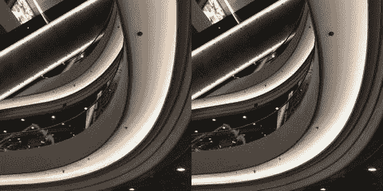

图 5-1。

Grayscale conversion in Processing

下一个版本`Chapter05_02`将使用 OpenCV 函数来执行灰度转换。请注意，在章节 [2](2.html) 示例`Chapter02_21`中定义的`CVImage`类中，您已经编写了`getGrey()`方法来返回灰度图像矩阵。在使用 OpenCV 进行加工之前，请记住将`code`文件夹和`CVImage`定义复制到草图文件夹。样本图像的大小为 600×600 像素。

```py
PImage source;
CVImage srccv, greycv;

void setup() {
  size(1200, 600);
  System.loadLibrary(Core.NATIVE_LIBRARY_NAME);

  source = loadImage("sample04.jpg");

  srccv = new CVImage(source.width, source.height);
  srccv.copyTo(source);
  greycv = new CVImage(source.width, source.height);
  noLoop();
}

void draw() {
  background(0);
  Mat mat = srccv.getGrey();
  greycv.copyTo(mat);
  image(source, 0, 0);
  image(greycv, source.width, 0);
  mat.release();
}

```

在程序中，您使用`CVImage`实例`greycv`来保存通过`getGrey()`方法转换后的灰度图像。

### 转换成黑白图像

您在上一节中获得的灰度图像通常包含 256 级灰色调。在某些应用中，您可能希望只有两个级别，简单的黑色和白色。在这种情况下，您可以使用以下方法将灰度图像进一步转换为黑白图像。练习`Chapter05_03`将向您展示如何使用处理`filter()`函数来实现这一点。本练习中示例图像的大小为 600×600 像素。

```py
PImage source, grey, bw;

void setup() {
  size(1800, 600);
  source = loadImage("sample01.jpg");
  grey = createImage(source.width, source.height, ARGB);
  bw = createImage(source.width, source.height, ARGB);
  noLoop();
}

void draw() {
  background(0);
  arrayCopy(source.pixels, grey.pixels);
  grey.updatePixels();
  grey.filter(GRAY);
  arrayCopy(grey.pixels, bw.pixels);
  bw.updatePixels();
  bw.filter(THRESHOLD, 0.5);
  image(source, 0, 0);
  image(grey, source.width, 0);
  image(bw, source.width+grey.width, 0);
}

```

我经常把黑白转换称为阈值转换。当灰度值低于阈值时，灰度值高于阈值的像素将被认为是黑白的。这里用的函数是`bw.filter(THRESHOLD, 0.5)`，其中数字 0.5 是阈值。图 [5-2](#Fig2) 显示窗口。


图 5-2。

Black-and-white image conversion with thresholding

左边的图像是原始照片。中间的是第一个`filter()`函数后的灰度版。右边的是第二个`filter()`功能后的黑白图像，这次带有选项`THRESHOLD`。下一个练习`Chapter05_04`将展示一个在 OpenCV 中完成的版本:

```py
PImage source;
CVImage srccv, bwcv;

void setup() {
  size(1800, 600);
  System.loadLibrary(Core.NATIVE_LIBRARY_NAME);
  source = loadImage("sample04.jpg");
  srccv = new CVImage(source.width, source.height);
  bwcv = new CVImage(source.width, source.height);
  srccv.copyTo(source);
  noLoop();
}

void draw() {
  background(0);
  Mat grey = srccv.getGrey();
  Mat bw = new Mat();
  Imgproc.threshold(grey, bw, 127, 255, Imgproc.THRESH_BINARY);
  bwcv.copyTo(bw);
  srccv.copyTo(grey);
  image(source, 0, 0);
  image(srccv, source.width, 0);
  image(bwcv, source.width+srccv.width, 0);
  grey.release();
  bw.release();
}

```

以下是执行阈值操作的 OpenCV 函数:

```py
Imgproc.threshold(grey, bw, 127, 255, Imgproc.THRESH_BINARY);

```

在函数中，第一个数字 127 是 0 到 255 范围内的中点。这是阈值。第二个数字 255 是灰度级别的最大数字。

### 形态学运算

图像处理中的形态学操作是修改图像中图案形状的变换。在这一节中，我只介绍侵蚀和扩张操作。下面的练习`Chapter05_05`展示了如何在处理过程中做到这一点:

```py
PImage source, grey, bw, dilate, erode;

void setup() {
  size(1800, 600);
  source = loadImage("sample02.jpg");
  grey = createImage(source.width, source.height, ARGB);
  bw = createImage(source.width, source.height, ARGB);
  dilate = createImage(source.width, source.height, ARGB);
  erode = createImage(source.width, source.height, ARGB);
  noLoop();
}

void draw() {
  background(0);
  arrayCopy(source.pixels, grey.pixels);
  grey.updatePixels();
  grey.filter(GRAY);
  arrayCopy(grey.pixels, bw.pixels);
  bw.updatePixels();
  bw.filter(THRESHOLD, 0.5);
  arrayCopy(bw.pixels, erode.pixels);
  arrayCopy(bw.pixels, dilate.pixels);
  erode.updatePixels();
  dilate.updatePixels();
  dilate.filter(DILATE);
  erode.filter(ERODE);
  image(bw, 0, 0);
  image(erode, bw.width, 0);
  image(dilate, bw.width+erode.width, 0);
}

```

结果显示包含三幅图像，如图 [5-3](#Fig3) 所示。左边的是来自`THRESHOLD`滤镜的黑白图像。中间的是`ERODE`版本。右边的是`DILATE`版本。

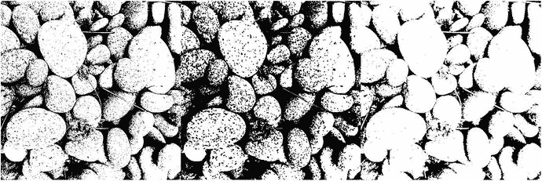

图 5-3。

Erode and dilate filters in Processing

`ERODE`滤镜减少白色区域的数量，而`DILATE`滤镜增加白色区域的数量。对于想要消除黑暗、微小噪声模式的应用来说，`DILATE`滤镜将是一个不错的选择。对于 OpenCV 版本，请参考以下练习，`Chapter05_06`:

```py
PImage source;
CVImage srccv, bwcv, erodecv, dilatecv;

void setup() {
  size(1800, 600);
  System.loadLibrary(Core.NATIVE_LIBRARY_NAME);
  source = loadImage("sample02.jpg");
  srccv = new CVImage(source.width, source.height);
  bwcv = new CVImage(source.width, source.height);
  erodecv = new CVImage(source.width, source.height);
  dilatecv = new CVImage(source.width, source.height);
  srccv.copyTo(source);
  noLoop();
}

void draw() {
  background(0);
  Mat grey = srccv.getGrey();
  Mat bw = new Mat();
  Imgproc.threshold(grey, bw, 127, 255, Imgproc.THRESH_BINARY);
  Mat erode = new Mat();
  Mat dilate = new Mat();
  Mat elem = Imgproc.getStructuringElement(Imgproc.MORPH_RECT, new Size(3, 3));
  Imgproc.erode(bw, erode, elem);
  Imgproc.dilate(bw, dilate, elem);
  bwcv.copyTo(bw);
  erodecv.copyTo(erode);
  dilatecv.copyTo(dilate);
  image(bwcv, 0, 0);
  image(erodecv, bwcv.width, 0);
  image(dilatecv, bwcv.width+erodecv.width, 0);
  grey.release();
  bw.release();
  erode.release();
  dilate.release();
}

```

程序使用前一个`Imgproc.threshold()`函数先将灰度图像转换成黑白图像。随后的`Imgproc.erode()`和`Imgproc.dilate()`功能将分别执行侵蚀和扩张形态操作。在进行侵蚀和扩张操作之前，您需要另一个矩阵，称为`elem`，它是描述形态学操作的结构化元素或内核。它通常有三种形状。

*   `Imgproc.MORPH_RECT`
*   `Imgproc.MORPH_CROSS`
*   `Imgproc.MORPH_ELLIPSE`

不同形状参数的`elem`的内容如下所示:

<colgroup><col> <col> <col></colgroup> 
| `MORPH_ELLIPSE` (3×3) |
| --- |
| Zero | one | Zero |
| one | one | one |
| Zero | one | Zero |

<colgroup><col> <col> <col></colgroup> 
| `MORPH_CROSS` (3×3) |
| --- |
| Zero | one | Zero |
| one | one | one |
| Zero | one | Zero |

<colgroup><col> <col> <col></colgroup> 
| `MORPH_RECT` (3×3) |
| --- |
| one | one | one |
| one | one | one |
| one | one | one |

你会发现，尺寸为 3×3 时，`MORPH_CROSS`和`MORPH_ELLIPSE`效果是一样的。对于更大的尺寸，它们会有所不同。`MORPH_CROSS`只会在中间的行和列中有一个 1，而`MORPH_ELLIPSE`会有一个近似圆形的 1。过滤操作将使用矩阵`elem`扫描源图像。只有那些在`elem`中具有值 1 的像素将被收集用于计算。`DILATE`过滤器将用`elem`中定义的邻域像素中的最大值替换原始图像像素。`ERODE`滤镜将用邻域中的最小值替换原始图像像素。你可以在 OpenCV 文档中的 [`http://docs.opencv.org/3.1.0/d4/d86/group__imgproc__filter.html#gac2db39b56866583a95a5680313c314ad`](http://docs.opencv.org/3.1.0/d4/d86/group__imgproc__filter.html#gac2db39b56866583a95a5680313c314ad) 找到这三个图形的细节。对于`Size()`参数，尺寸越大，变换效果越明显。一般来说，它是一个有一对奇数的正方形。

### 模糊操作

要进一步减少图像中的噪点或不必要的细节，您可以考虑使用模糊效果。Processing 和 OpenCV 都有一个模糊过滤器或函数。下一个练习`Chapter05_07`，在处理中使用模糊滤镜来执行操作:

```py
PImage source, blur;

void setup() {
  size(1200, 600);
  source = loadImage("sample03.jpg");
  blur = createImage(source.width, source.height, ARGB);
  noLoop();
}

void draw() {
  background(0);
  arrayCopy(source.pixels, blur.pixels);
  blur.updatePixels();
  blur.filter(BLUR, 3);
  image(source, 0, 0);
  image(blur, source.width, 0);
}

```

这个程序很简单。它使用带有`BLUR`选项的`filter()`函数。选项后的数字是模糊量。数字越大，图像越模糊。图 [5-4](#Fig4) 显示了程序产生的显示窗口。

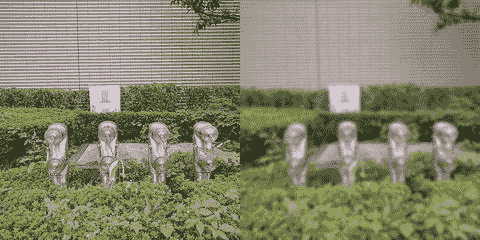

图 5-4。

Blur filter in Processing

对于 OpenCV，有几个模糊函数。在下一个练习`Chapter05_08`中，您将探究其中的一些并比较结果。它使用 OpenCV 的`imgproc`模块中的`blur()`、`medianBlur()`和`GaussianBlur()`函数。第一个`blur()`功能是局部平均操作，其中新图像像素是其邻域像素的平均值。在计算平均值时,`GaussianBlur()`函数对较近的像素赋予较高的权重，这对于去除可见噪声更有效。`medianBlur()`函数采用中值而不是平均值来计算新的像素值，这在去除噪声的同时更有效地保留了边缘/边界。

```py
PImage source;
CVImage srccv, blurcv, mediancv, gaussiancv;

void setup() {
  size(1800, 600);
  System.loadLibrary(Core.NATIVE_LIBRARY_NAME);
  source = loadImage("sample03.jpg");
  srccv = new CVImage(source.width, source.height);
  blurcv = new CVImage(source.width, source.height);
  mediancv = new CVImage(source.width, source.height);
  gaussiancv = new CVImage(source.width, source.height);
  srccv.copyTo(source);
  noLoop();
}

void draw() {
  background(0);
  Mat mat = srccv.getBGR();
  Mat blur = new Mat();
  Mat median = new Mat();
  Mat gaussian = new Mat();
  Imgproc.medianBlur(mat, median, 9);
  Imgproc.blur(mat, blur, new Size(9, 9));
  Imgproc.GaussianBlur(mat, gaussian, new Size(9, 9), 0);
  blurcv.copyTo(blur);
  mediancv.copyTo(median);
  gaussiancv.copyTo(gaussian);
  image(blurcv, 0, 0);
  image(mediancv, blurcv.width, 0);
  image(gaussiancv, blurcv.width+mediancv.width, 0);
  mat.release();
  blur.release();
  median.release();
  gaussian.release();
}

```

三个功能的模糊图像并排显示，如图 [5-5](#Fig5) 所示。


图 5-5。

Three blurring functions in OpenCV

作为本节的总结，您将结合这些操作来构建一个实际的应用，将实时网络摄像头图像转换为二进制黑白图像，以供以后处理。第一个版本是纯处理为练习而写的，`Chapter05_09`，如下所示:

```py
import processing.video.*;

Capture cap;

void setup() {
  size(1280, 480);
  cap = new Capture(this, width/2, height);
  cap.start();
}

void draw() {
  if (!cap.available())
    return;
  background(0);
  cap.read();
  PImage tmp = createImage(cap.width, cap.height, ARGB);
  arrayCopy(cap.pixels, tmp.pixels);
  tmp.filter(GRAY);
  tmp.filter(BLUR, 2);
  tmp.filter(THRESHOLD, 0.25);
  tmp.filter(DILATE);

  image(cap, 0, 0);
  image(tmp, cap.width, 0);
  text(nf(round(frameRate), 2), 10, 20);
}

```

在程序中，你结合了模糊，灰度，阈值和腐蚀操作。对于纯处理实现，性能并不好。您添加`text()`功能，在屏幕上显示当前的帧速率，以便进行比较。图 [5-6](#Fig6) 显示加工显示窗口。

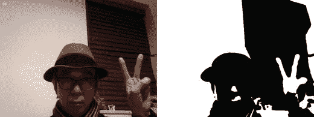

图 5-6。

Image preparation in Processing

对于 OpenCV 实现，在练习`Chapter05_10`中，您还可以将图像操作合并到一个单独的程序中，并将实时网络摄像头图像作为输入。性能比纯处理版好很多。

```py
import processing.video.*;

Capture cap;
CVImage img;

void setup() {
  size(1280, 480);
  System.loadLibrary(Core.NATIVE_LIBRARY_NAME);
  cap = new Capture(this, width/2, height);
  cap.start();
  img = new CVImage(cap.width, cap.height);
}

void draw() {
  if (!cap.available())
    return;
  background(0);
  cap.read();
  img.copyTo(cap);
  Mat tmp1 = img.getGrey();
  Mat tmp2 = new Mat();
  Imgproc.GaussianBlur(tmp1, tmp2, new Size(5, 5), 0);
  Imgproc.threshold(tmp2, tmp1, 80, 255, Imgproc.THRESH_BINARY);
  Mat elem = Imgproc.getStructuringElement(Imgproc.MORPH_RECT, new Size(3, 3));
  Imgproc.dilate(tmp1, tmp2, elem);
  CVImage out = new CVImage(cap.width, cap.height);
  out.copyTo(tmp2);
  image(cap, 0, 0);
  image(out, cap.width, 0);
  tmp1.release();
  tmp2.release();
  elem.release();
  text(nf(round(frameRate), 2), 10, 20);
}

```

图 [5-7](#Fig7) 显示加工显示窗口图像。帧速率明显高于处理版本。

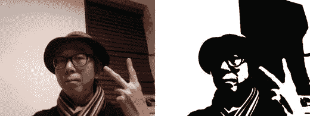

图 5-7。

Image preparation in Processing with OpenCV

## 边缘检测

了解了准备图像的步骤后，您将发现的第一个结构是图像中任何对象的边缘或轮廓。计算机实际上不理解任何图像内容。它只能系统地扫描每个像素及其邻居。对于那些与相邻像素有明显色差的像素，您可以断定这些像素属于可能将两个对象或一个对象与其背景分开的轮廓。

处理没有边缘检测滤波器，尽管实现起来并不困难。对于 OpenCV，可以使用约翰·f·坎尼在 1986 年开发的著名的坎尼边缘检测器。为了运行边缘检测，执行模糊操作以去除噪声并将彩色图像转换为灰度通常是有益的。下一个练习`Chapter05_11`将说明这些步骤:

```py
import processing.video.*;

Capture cap;
CVImage img;

void setup() {
  size(1280, 480);
  System.loadLibrary(Core.NATIVE_LIBRARY_NAME);
  cap = new Capture(this, width/2, height);
  cap.start();
  img = new CVImage(cap.width, cap.height);
}

void draw() {
  if (!cap.available())
    return;
  background(0);
  cap.read();
  img.copyTo(cap);
  Mat tmp1 = img.getGrey();
  Mat tmp2 = new Mat();
  Imgproc.GaussianBlur(tmp1, tmp2, new Size(7, 7), 1.5, 1.5);
  Imgproc.Canny(tmp2, tmp1, 10, 30);
  CVImage out = new CVImage(cap.width, cap.height);
  out.copyTo(tmp1);
  image(cap, 0, 0);
  image(out, cap.width, 0);
  text(nf(round(frameRate), 2), 10, 20);
  tmp1.release();
  tmp2.release();
}

```

以下是边缘检测的主要功能:

```py
Imgproc.Canny(tmp2, tmp1, 10, 30);

```

图像`tmp2`是模糊的灰度图像。图像`tmp1`是包含边缘图像的图像。该函数有两个阈值。第一个数字是下限。如果一个像素的梯度值低于较低的阈值，它将被拒绝。第二个数字是上限。如果像素的梯度值大于上限阈值，它将被接受为边缘像素。如果像素的梯度值介于两个阈值之间，则只有当它连接到高于上限阈值的另一个像素时，它才会被接受为边缘。Canny 也建议第二个是第一个的 2 到 3 倍之间的值。值越大，图像中检测到的边缘越少。图 [5-8](#Fig8) 显示了检测结果。


图 5-8。

Canny edge detection

作为比较，您也可以使用`threshold()`功能将灰度图像转换为黑白图像。之后，您可以使用黑白图像执行边缘检测。下一个练习`Chapter05_12`演示了这种方法:

```py
import processing.video.*;

Capture cap;
CVImage img;

void setup() {
  size(1280, 480);
  System.loadLibrary(Core.NATIVE_LIBRARY_NAME);
  cap = new Capture(this, width/2, height);
  cap.start();
  img = new CVImage(cap.width, cap.height);
}

void

draw() {
  if (!cap.available())
    return;
  background(0);
  cap.read();
  img.copyTo(cap);
  Mat tmp1 = img.getGrey();
  Mat tmp2 = new Mat();
  Imgproc.GaussianBlur(tmp1, tmp2, new Size(7, 7), 1.5, 1.5);
  Imgproc.threshold(tmp2, tmp1, 110, 255, Imgproc.THRESH_BINARY);
  Imgproc.Canny(tmp1, tmp2, 10, 30);
  CVImage out = new CVImage(cap.width, cap.height);
  out.copyTo(tmp2);
  img.copyTo(tmp1);
  image(img, 0, 0);
  image(out, img.width, 0);
  text(nf(round(frameRate), 2), 10, 20);
  tmp1.release();
  tmp2.release();
}

```

生成的图像更加抽象，如图 [5-9](#Fig9) 所示。最终图像中的细节和噪点会更少。

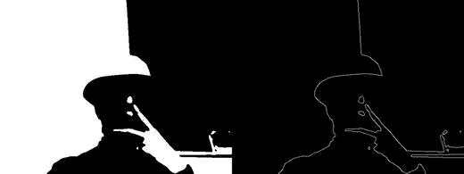

图 5-9。

Canny edge detection with black-and-white image

## 车道检测

除了检测图像中形状的边缘或边界，您还可以使用 OpenCV 中的 Hough 直线变换来检测直线段。官方 OpenCV 文档中有霍夫线变换背后的数学细节；你可以在 [`http://docs.opencv.org/3.1.0/d9/db0/tutorial_hough_lines.html`](http://docs.opencv.org/3.1.0/d9/db0/tutorial_hough_lines.html) 找到文档。下面的练习`Chapter05_13`是处理中的一个简单实现:

```py
import processing.video.*;

Capture cap;
CVImage img;

void setup() {
  size(1280, 480);
  System.loadLibrary(Core.NATIVE_LIBRARY_NAME);
  cap = new Capture(this, width/2, height);
  cap.start();
  img = new CVImage(cap.width, cap.height);
  noStroke();
}

void draw() {
  if (!cap.available())
    return;
  background(0);
  cap.read();
  img.copyTo(cap);
  Mat tmp1 = img.getGrey();
  Mat tmp2 = new Mat();
  Imgproc.Canny(tmp1, tmp2, 50, 150);
  MatOfPoint2f lines = new MatOfPoint2f();
  Imgproc.HoughLines(tmp2, lines, 1, PI/180, 100);
  CVImage out = new CVImage(cap.width, cap.height);
  out.copyTo(tmp2);
  image(cap, 0, 0);
  image(out, cap.width, 0);
  Point [] points = lines.toArray();
  pushStyle();
  noFill();
  stroke(255);
  for (Point p : points) {
    double rho = p.x;
    double theta = p.y;
    double a = cos((float)theta);
    double b = sin((float)theta);
    PVector pt1, pt2;
    double x0 = rho*a;
    double y0 = rho*b;
    pt1 = new PVector((float)(x0 + cap.width*(-b)), (float)(y0 + cap.width*(a)));
    pt2 = new PVector((float)(x0 - cap.width*(-b)), (float)(y0 - cap.width*(a)));
    line(pt1.x, pt1.y, pt2.x, pt2.y);
  }
  popStyle();
  text(nf(round(frameRate), 2), 10, 20);
  tmp1.release();
  tmp2.release();
  lines.release();
}

```

线检测的主要命令是`Imgproc.HoughLines()`功能。第一个参数是 Canny 边缘检测后的黑白图像。第二个参数是存储所有检测到的行信息的输出矩阵。由于它是一个 1×N 双通道矩阵，为了方便起见，您使用了子类`MatOfPoint2f`。其余的参数将决定检测的准确性。从高中代数中，你大概明白一条线可以用下面的式子来表示:

```py
y = m * x + c

```

在`HoughLines()`函数中，同一行由另一个公式表示。

```py
rho = x * cos (theta) + y * sin(theta)

```

这里，`rho`是图像原点到直线的垂直距离，`theta`是垂直线与水平 x 轴所成的角度。`HoughLines()`函数保存一个 2D 数组；第一维是`rho`的值，以像素为单位，第二维是`theta`的值，以度为单位。

第三个参数是测量`rho`的像素分辨率。本例中的值 1 表示`rho`的分辨率为 1 个像素。较大的值通常会生成更多精度较低的线。第四个参数是测量`theta`的角度分辨率。本例中的值`PI/180`表示`theta`的分辨率为 1 度。第五个参数决定了线条的检测效果。在本例中，将只报告那些通过的点超过 100 的线。在线检测之后，您将`lines`矩阵转换为`Point`的数组。数组中的每个成员都是一行。您使用`for`循环中的计算来计算每条线的两个端点，最后`line()`函数用白色绘制这条线。

图 [5-10](#Fig10) 显示了加工窗口。检测到的线条绘制在实时网络摄像头图像上。

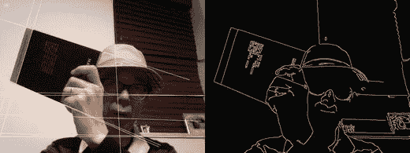

图 5-10。

Hough line transform detection

OpenCV 还有另一个叫做`HoughLinesP()`的直线检测函数，它更高效，使用起来也更友好。它将返回每条线段的两个端点。下面的练习`Chapter05_14`说明了该函数的用法:

```py
import processing.video.*;

Capture cap;
CVImage img;

void setup() {
  size(1280, 480);
  System.loadLibrary(Core.NATIVE_LIBRARY_NAME);
  cap = new Capture(this, width/2, height);
  cap.start();
  img = new CVImage(cap.width, cap.height);
}

void draw() {
  if (!cap.available())
    return;
  background(0);
  cap.read();
  img.copyTo(cap);
  Mat tmp1 = img.getGrey();
  Mat tmp2 = new Mat();
  Imgproc.Canny(tmp1, tmp2, 50, 150);
  Mat lines = new Mat();
  Imgproc.HoughLinesP(tmp2, lines, 1, PI/180, 80, 30, 10);
  CVImage out = new CVImage(cap.width, cap.height);
  out.copyTo(tmp2);
  image(out, cap.width, 0);
  pushStyle();
  fill(100);
  rect(0, 0, cap.width, cap.height);
  noFill();
  stroke(0);
  for (int i=0; i<lines.rows(); i++) {
    double [] pts = lines.get(i, 0);
    float x1 = (float)pts[0];
    float y1 = (float)pts[1];
    float x2 = (float)pts[2];
    float y2 = (float)pts[3];
    line(x1, y1, x2, y2);
  }
  popStyle();
  text(nf(round(frameRate), 2), 10, 20);
  tmp1.release();
  tmp2.release();
  lines.release();
}

```

对于`HoughLinesP()`函数的参数，第一个是图像矩阵。第二个参数是存储所有线段信息的输出矩阵`lines`。第三个参数`1`是像素分辨率，而第四个参数`PI/180`是角度分辨率，单位为度。第五个参数`80`是阈值。第六个参数`30`是最小线路长度。第七个参数`10`是最大线间隙。输出`lines`是一个一维矩阵，只有一列多行。在`draw()`函数内的`for`循环中，您遍历来自`lines`的所有行。每个元素实际上是另一个大小为 4 的数组。前两个是第一个端点的`x`和`y`位置。数组的第三和第四个元素是第二个端点的 x 和 y 位置。对于这两个端点，使用`line()`功能在它们之间画一条直线。图 [5-11](#Fig11) 显示了结果图像。

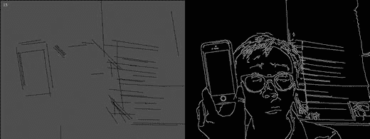

图 5-11。

Hough line transform detection

在下一个练习`Chapter05_15`中，您将使用创意图像处理中常用的一种技术来修改之前的练习。对于每条线段，计算它的中点并对像素颜色信息进行采样。使用此颜色，您可以更改该线段的描边颜色。其结果将类似于绘画中的彩色素描技术。

```py
import processing.video.*;

Capture cap;
CVImage img;

void setup() {
  size(1280, 480);
  System.loadLibrary(Core.NATIVE_LIBRARY_NAME);
  cap = new Capture(this, width/2, height);
  cap.start();
  img = new CVImage(cap.width, cap.height);
}

void draw() {
  if (!cap.available())
    return;
  background(0);
  cap.read();
  img.copyTo(cap);
  Mat tmp1 = img.getGrey();
  Mat tmp2 = new Mat();
  Imgproc.Canny(tmp1, tmp2, 20, 60);
  Mat lines = new Mat();
  Imgproc.HoughLinesP(tmp2, lines, 1, PI/180, 70, 30, 10);
  image(cap, 0, 0);
  pushStyle();
  noFill();
  for (int i=0; i<lines.rows(); i++) {
    double [] pts = lines.get(i, 0);
    float x1 = (float)pts[0];
    float y1 = (float)pts[1];
    float x2 = (float)pts[2];
    float y2 = (float)pts[3];
    int mx = (int)constrain((x1+x2)/2, 0, cap.width-1);
    int my = (int)constrain((y1+y2)/2, 0, cap.height-1);
    color c = cap.pixels[my*cap.width+mx];
    stroke(c);
    strokeWeight(random(1, 5));
    line(x1+cap.width, y1, x2+cap.width, y2);
  }
  popStyle();
  text(nf(round(frameRate), 2), 10, 20);
  tmp1.release();
  tmp2.release();
  lines.release();
}

```

请注意，您还引入了一个`strokeWeight(random(1, 5))`命令来为线段使用不同的笔画粗细。图 [5-12](#Fig12) 显示输出显示。

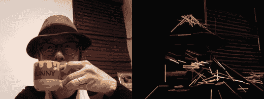

图 5-12。

Line detection as drawing

OpenCV 有一个`LineSegmentDetector`类实现 Rafael Grompone von Gioi 的线段检测器。这种方法将首先在一个非常小的区域中检测图像梯度方向，例如 2×2 像素。相似的方向串接在一起，判断是否可以是线段。下一个练习`Chapter05_16`使用新方法重新创建上一个练习:

```py
import processing.video.*;

Capture cap;
CVImage img;
LineSegmentDetector line;

void setup() {
  size(1280, 480);
  System.loadLibrary(Core.NATIVE_LIBRARY_NAME);
  cap = new Capture(this, width/2, height);
  cap.start();
  img = new CVImage(cap.width, cap.height);
  line = Imgproc.createLineSegmentDetector();
}

void draw() {
  if (!cap.available())
    return;
  background(0);
  cap.read();
  img.copyTo(cap);
  Mat tmp1 = img.getGrey();
  Mat lines = new Mat();
  line.detect(tmp1, lines);
  pushStyle();
  for (int i=0; i<lines.rows(); i++) {
    double [] pts = lines.get(i, 0);
    float x1 = (float)pts[0];
    float y1 = (float)pts[1];
    float x2 = (float)pts[2];
    float y2 = (float)pts[3];
    int mx = (int)constrain((x1+x2)/2, 0, cap.width-1);
    int my = (int)constrain((y1+y2)/2, 0, cap.height-1);
    color col = cap.pixels[my*cap.width+mx];
    stroke(col);
    strokeWeight(random(1, 3));
    line(x1+cap.width, y1, x2+cap.width, y2);
  }
  popStyle();
  image(cap, 0, 0);
  text(nf(round(frameRate), 2), 10, 20);
  tmp1.release();
  lines.release();
}

```

首先将全局变量`line`定义为`LineSegmentDetector`的一个实例。在`setup()`函数中，您使用带有默认设置的静态函数`Imgproc.createLineSegmentDetector()`初始化实例。在`draw()`功能中，检测很简单。使用`line.detect()`方法完成，输入矩阵`tmp1`和输出结果`lines`作为参数。`lines`矩阵的结构与之前的练习相似。每个条目包含两个端点的`x`和`y`位置。结果显示看起来与之前的练习不同，如图 [5-13](#Fig13) 所示。

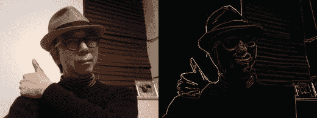

图 5-13。

Line detection with the OpenCV LineSegmentDetector

## 圆形检测

与直线检测类似，OpenCV 图像处理模块`imgproc`也包括使用霍夫圆变换的圆检测方法`HoughCircles()`。在下一个练习`Chapter05_17`中，您将探索此功能，从实时网络摄像头拍摄的准备好的图像中检测圆形:

```py
import processing.video.*;

Capture cap;
CVImage img;

void setup() {
  size(1280, 480);
  System.loadLibrary(Core.NATIVE_LIBRARY_NAME);
  cap = new Capture(this, width/2, height);
  cap.start();
  img = new CVImage(cap.width, cap.height);
}

void draw() {
  if (!cap.available())
    return;
  background(0);
  cap.read();
  img.copyTo(cap);
  Mat tmp1 = img.getGrey();
  Mat tmp2 = new Mat();
  Imgproc.GaussianBlur(tmp1, tmp2, new Size(9, 9), 1);
  Imgproc.Canny(tmp2, tmp1, 100, 200);
  CVImage out = new CVImage(cap.width, cap.height);
  out.copyTo(tmp1);
  MatOfPoint3f circles = new MatOfPoint3f();
  Imgproc.HoughCircles(tmp1, circles, Imgproc.HOUGH_GRADIENT, 1, tmp1.rows()/8, 200, 45, 0, 0);
  Point3 [] points = circles.toArray();
  image(cap, 0, 0);
  image(out, cap.width, 0);
  pushStyle();
  noStroke();
  fill(0, 0, 255, 100);
  for (Point3 p : points) {
    ellipse((float)p.x, (float)p.y, (float)(p.z*2), (float)(p.z*2));
  }
  popStyle();
  text(nf(round(frameRate), 2), 10, 20);
  tmp1.release();
  tmp2.release();
  circles.release();
}

```

该程序首先将图像转换为灰度，然后应用高斯模糊滤镜，最后检测边缘。然后将 Canny 边缘图像发送到`HoughCircles()`功能进行圆检测。第一个参数`tmp1`是输入图像。第二个参数`circles`是输出结果。第三个参数`Imgproc.HOUGH_GRADIENT`，是圆检测的唯一选项。第四个参数是分辨率的反比。通常是 1。第五个参数`tmp1.rows()/8`，是被检测圆之间的最小距离。第六个参数`200`是内部 Canny 边缘检测器的阈值上限。第七个参数`45`，是中心检测的阈值。该值越小，它将检测到的圆越多。其余参数是半径的最小值和最大值。它们默认为 0。结果`circles`是一个一维矩阵。您使用一个`MatOfPoint3f`来存储它的值。每个条目将包含三个值的数组，对应于圆心(`x`、`y`位置)和半径。`for`循环遍历所有圆圈，并以半透明的蓝色显示。图 [5-14](#Fig14) 显示了结果图像。

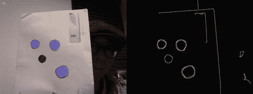

图 5-14。

Hough circle transform for circle detection

您可以通过过度检测来玩圆形检测程序。在下面的练习`Chapter05_18`中，您特意在`HoughCircles()`函数的第七个参数中放了一个小值，这样会产生很多错误检测。下面是程序的源代码:

```py
import processing.video.*;

Capture cap;
CVImage img;

void setup() {
  size(1280, 480);
  System.loadLibrary(Core.NATIVE_LIBRARY_NAME);
  cap = new Capture(this, width/2, height);
  cap.start();
  img = new CVImage(cap.width, cap.height);
}

void draw() {
  if (!cap.available())
    return;
  background(0);
  cap.read();
  img.copyTo(cap);
  MatOfPoint3f circles = new MatOfPoint3f();
  Imgproc.HoughCircles(img.getGrey(), circles, Imgproc.HOUGH_GRADIENT, 1, img.height/10, 200, 20, 0, 0);
  Point3 [] points = circles.toArray();
  pushStyle();
  noStroke();
  for (Point3 p : points) {
    int x1 = constrain((int)p.x, 0, cap.width-1);
    int y1 = constrain((int)p.y, 0, cap.height-1);
    color col = cap.pixels[y1*cap.width+x1];
    fill(color(red(col), green(col), blue(col), 160));
    ellipse(x1+cap.width, y1, (float)(p.z*2), (float)(p.z*2));
  }
  popStyle();
  image(cap, 0, 0);
  text(nf(round(frameRate), 2), 10, 20);
  circles.release();
}

```

你也删除了准备步骤，希望产生更多的圆圈。在`for`循环中，你使用前一种方法给圆圈上色。在这个版本中，你也为每个圆圈使用半透明的颜色。图 [5-15](#Fig15) 显示了结果显示。

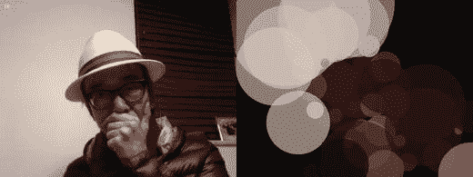

图 5-15。

Drawing with Hough circle transform

该图像是原始网络摄像头图像的抽象渲染。你可以从颜色的使用和圆圈的位置上看出相似之处。就形状而言，你很难把它们与原作联系起来。

## 轮廓处理

在前面的小节中，您使用了 OpenCV 图像处理模块`imgproc`，从数字图像中识别特定的形状。在轮廓处理中，您使用相同的模块来识别图形形状的更一般的轮廓。它包括寻找轮廓和解释轮廓信息的方法。因为这些函数只对二进制图像有效，所以您必须准备好图像，使它们只包含黑白信息。我将介绍轮廓处理的以下步骤:

*   寻找轮廓
*   包围盒
*   最小面积矩形
*   凸包
*   多边形近似
*   测试轮廓中的点
*   检查交叉路口

### 寻找轮廓

在下一个练习`Chapter05_19`中，程序首先模糊灰度图像，然后用`Canny()`函数提取边缘，然后发送给`findContours()`函数:

```py
import processing.video.*;
import java.util.ArrayList;
import java.util.Iterator;

Capture cap;
CVImage img;

void setup() {
  size(1280, 480);
  System.loadLibrary(Core.NATIVE_LIBRARY_NAME);
  cap = new Capture(this, width/2, height);
  cap.start();
  img = new CVImage(cap.width, cap.height);
}

void draw() {
  if (!cap.available())
    return;
  background(0);
  cap.read();
  img.copyTo(cap);
  Mat tmp1 = img.getGrey();
  Mat tmp2 = new Mat();
  Imgproc.blur(tmp1, tmp2, new Size(3, 3));
  Imgproc.Canny(tmp2, tmp1, 50, 100);
  ArrayList<MatOfPoint> contours = new ArrayList<MatOfPoint>();
  Mat hierarchy = new Mat();
  Imgproc.findContours(tmp1, contours, hierarchy,
    Imgproc.RETR_LIST, Imgproc.CHAIN_APPROX_SIMPLE);
  image(cap, 0, 0);
  pushStyle();
  noFill();
  stroke(255, 255, 0);
  Iterator<MatOfPoint> it = contours.iterator();
  while (it.hasNext()) {
    Point [] pts = it.next().toArray();
    for (int i=0; i<pts.length-1; i++) {
      Point p1 = pts[i];
      Point p2 = pts[i+1];
      line((float)p1.x+cap.width, (float)p1.y, (float)p2.x+cap.width, (float)p2.y);
    }
  }
  popStyle();
  text(nf(round(frameRate), 2), 10, 20);
  tmp1.release();
  tmp2.release();
}

```

在`findContours()`函数中，第一个参数是黑白图像。第二个参数是输出等值线数据结构。第三个参数是跟踪外部边缘和内部孔的关系的层级信息。第四个参数`Imgproc.RETR_LIST`检索轮廓信息，无需跟踪层次关系。第五个参数`Imgproc.CHAIN_APPROX_SIMPLE`，只将等高线线段压缩成两个端点。您将在后面的练习中使用其他选项。主要输出`contours`，是`MatOfPoint`的一个 Java `ArrayList`。每个`MatOfPoint`被转换成一个`Point`的数组。`for`循环从一个`Point`到下一个`for`绘制一条线段。图 [5-16](#Fig16) 显示了结果图像。

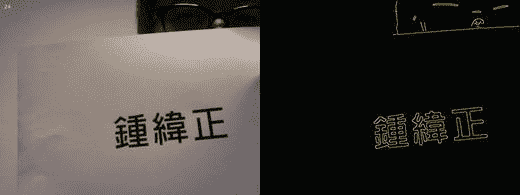

图 5-16。

Contours processing with black-and-white Canny image

下一个练习`Chapter05_20`没有使用 Canny 边缘检测图像，而是使用由`threshold()`函数准备的黑白图像:

```py
import processing.video.*;
import java.util.ArrayList;

Capture cap;
CVImage img;

void setup() {
  size(1280, 480);
  System.loadLibrary(Core.NATIVE_LIBRARY_NAME);
  cap = new Capture(this, width/2, height);
  cap.start();
  img = new CVImage(cap.width, cap.height);
}

void draw() {
  if (!cap.available())
    return;
  background(0);
  cap.read();
  img.copyTo(cap);
  Mat tmp1 = img.getGrey();
  Mat tmp2 = new Mat();
  Imgproc.blur(tmp1, tmp2, new Size(5, 5));
  Imgproc.threshold(tmp2, tmp1, 80, 255, Imgproc.THRESH_BINARY);
  ArrayList<MatOfPoint> contours = new ArrayList<MatOfPoint>();
  Mat hierarchy = new Mat();
  tmp1 = tmp2.clone();
  Imgproc.findContours(tmp1, contours, hierarchy,
    Imgproc.RETR_LIST, Imgproc.CHAIN_APPROX_SIMPLE);
  CVImage out = new CVImage(cap.width, cap.height);
  out.copyTo(tmp1);
  image(out, 0, 0);
  pushStyle();
  noFill();
  stroke(255, 255, 0);
  for (MatOfPoint ps : contours) {
    Point [] pts = ps.toArray();
    for (int i=0; i<pts.length-1; i++) {
      Point p1 = pts[i];
      Point p2 = pts[i+1];
      line((float)p1.x+cap.width, (float)p1.y, (float)p2.x+cap.width, (float)p2.y);
    }
  }
  popStyle();
  text(nf(round(frameRate), 2), 10, 20);
  tmp1.release();
  tmp2.release();

}

```

该练习使用了`threshold()`函数将灰色图像转换为纯黑白图像。`findContours()`功能可以立即在黑白图像上执行轮廓跟踪。在这两个练习中，我还演示了使用`for`循环和`iterator`遍历`MatOfPoint`的 Java `List`的不同方式。图 [5-17](#Fig17) 显示了结果图像。


图 5-17。

Contours processing with threshold image

在接下来的练习`Chapter05_21`中，您将使用`findContours()`函数中的另一个选项来仅检索外部轮廓，而不返回那些内部孔。你用`Imgproc.RETR_EXTERNAL`替换原来的选项`Imgproc.RETR_LIST`。其余保持不变。新声明如下:

```py
Imgproc.findContours(tmp2, contours, hierarchy, Imgproc.RETR_EXTERNAL, Imgproc.CHAIN_APPROX_SIMPLE);

```

如图 [5-18](#Fig18) 所示，汉字的内轮廓在新选项下不可见。

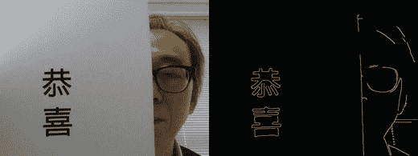

图 5-18。

Contours processing with the RETR_EXTERNAL option

现在，您将进一步探索轮廓检索模式中的其他选项。下一个练习`Chapter05_22`，将使用一个更复杂的`RETR_CCOMP`。它将所有轮廓组织成两个层次。所有外部边界都将位于顶层。这些洞在第二层。对于洞内的任何轮廓也将在顶层。在练习中，您可以利用这些信息用两种不同的颜色填充外部轮廓和孔。程序中使用的源图像大小为 600×600 像素。

```py
import java.util.ArrayList;

CVImage cvimg;
PImage img;

void setup() {
  size(1200, 600);
  System.loadLibrary(Core.NATIVE_LIBRARY_NAME);
  img = loadImage("chinese.png");
  cvimg = new CVImage(img.width, img.height);
  noLoop();
}

void draw() {
  background(0);
  cvimg.copyTo(img);
  Mat tmp1 = new Mat();
  Imgproc.blur(cvimg.getGrey(), tmp1, new Size(3, 3));
  ArrayList<MatOfPoint> contours = new ArrayList<MatOfPoint>();
  Mat hierarchy = new Mat();
  Imgproc.findContours(tmp1, contours, hierarchy,
    Imgproc.RETR_CCOMP, Imgproc.CHAIN_APPROX_SIMPLE);
  image(img, 0, 0);
  pushStyle();
  stroke(255);
  for (int i=0; i<contours.size(); i++) {
    Point [] pts = contours.get(i).toArray();
    int parent = (int)hierarchy.get(0, i)[3];
    // parent -1 implies it is the outer contour.
    if (parent == -1) {
      fill(200);
    } else {
      fill(100);
    }
    beginShape();
    for (Point p : pts) {
      vertex((float)p.x+img.width, (float)p.y);
    }
    endShape(CLOSE);
  }
  popStyle();
  tmp1.release();
  hierarchy.release();

}

```

除了将检索模式更改为`RETR_CCOMP`，您还可以使用`hierarchy`矩阵。它是一个一维矩阵。每一列对应于`contours`矩阵中的一个条目，具有相同的索引排列。`hierarchy`中的每个条目都是一个有四个值的数组。每个值都是轮廓矩阵中条目的索引。索引的映射如下:

*   `hierarchy.get(0, i)[0]`:下一个兄弟轮廓
*   `hierarchy.get(0, i)[1]`:上一个兄弟轮廓
*   `hierarchy.get(0, i)[2]`:第一个子轮廓
*   `hierarchy.get(0, i)[3]`:父轮廓

索引中的值-1 表示相应的条目不可用。如果您看一下`draw()`函数中的`for`循环，该语句检查当前轮廓在位置`i`的父索引。

```py
int parent = (int)hierarchy.get(0, i)[3];

```

如果它没有任何父级(-1)，就用浅灰色着色(如果有，就用深灰色着色)。图 [5-19](#Fig19) 显示了结果图像。左边的汉字来自原图。右边的图像是具有两种灰色调的轮廓的渲染。


图 5-19。

Contours processing with option RETR_CCOMP

还有另一个检索模式`RETR_TREE`，它将在层次矩阵中存储每个轮廓的完整父子树关系。由于它的复杂性，我不会在本书中涉及它。

在您检测到图形形状的轮廓后，绘制轮廓将不是您唯一关心的事情。您可能希望确定移动的图形形状之间的相互作用，或者检查重叠区域。在接下来的部分中，您将研究如何理解从图像中检测到的轮廓信息。

### 包围盒

您可以从轮廓信息中获得的第一个信息是它的边界框。您可以使用 OpenCV 图像处理模块中的`boundingRect()`函数。输入参数是一个轮廓，由一个`MatOfPoint`类实例维护。输出是 OpenCV 矩形类，`Rect`。

```py
import processing.video.*;
import java.util.ArrayList;
import java.util.Iterator;

Capture cap;
CVImage img;

void setup() {
  size(1280, 480);
  System.loadLibrary(Core.NATIVE_LIBRARY_NAME);
  cap = new Capture(this, width/2, height);
  cap.start();
  img = new CVImage(cap.width, cap.height);
}

void draw() {
  if (!cap.available())
    return;
  background(0);
  cap.read();
  img.copyTo(cap);
  Mat tmp1 = img.getGrey();
  Mat tmp2 = new Mat();
  Imgproc.blur(tmp1, tmp2, new Size(3, 3));
  Imgproc.Canny(tmp2, tmp1, 80, 160);
  ArrayList<MatOfPoint> contours = new ArrayList<MatOfPoint>();
  Mat hierarchy = new Mat();
  Imgproc.findContours(tmp1, contours, hierarchy,
    Imgproc.RETR_LIST, Imgproc.CHAIN_APPROX_SIMPLE);
  image(cap, 0, 0);
  pushStyle();
  noStroke();
  Iterator<MatOfPoint> it = contours.iterator();
  while (it.hasNext()) {
    Rect r = Imgproc.boundingRect(it.next());
    int cx = (int)(r.x + r.width/2);
    int cy = (int)(r.y + r.height/2);
    cx = constrain(cx, 0, cap.width-1);
    cy = constrain(cy, 0, cap.height-1);
    color col = cap.pixels[cy*cap.width+cx];
    fill(color(red(col), green(col), blue(col), 200));
    rect((float)r.x+cap.width, (float)r.y, (float)r.width, (float)r.height);
  }
  popStyle();
  text(nf(round(frameRate), 2), 10, 20);
  tmp1.release();
  tmp2.release();
}

```

在这个程序中，`Chapter05_23`，一旦你获得每个包围盒的数据作为一个`Rect`，你就使用处理函数`rect()`来绘制矩形。`Rect`类包含四个属性:`x`、`y`、`width`和`height`。您还可以从矩形的中心获得颜色信息，并使用它给矩形着色，使其具有透明度。结果是原始图像的抽象渲染，如图 [5-20](#Fig20) 所示。


图 5-20。

Bounding rectangle for contours

### 最小面积矩形

OpenCV 图像处理模块有另一个函数`minAreaRect()`，用于计算轮廓的最小面积边界矩形。在下一个练习`Chapter05_24`中，您将获得轮廓的最小面积旋转矩形。结果是一个旋转的矩形类`RotatedRect`。

```py
import processing.video.*;
import java.util.ArrayList;
import java.util.Iterator;

Capture cap;
CVImage img;

void setup() {
  size(1280, 480);
  System.loadLibrary(Core.NATIVE_LIBRARY_NAME);
  cap = new Capture(this, width/2, height);
  cap.start();
  img = new CVImage(cap.width, cap.height);
}

void draw() {
  if (!cap.available())
    return;
  background(0);
  cap.read();
  img.copyTo(cap);
  Mat tmp1 = img.getGrey();
  Mat tmp2 = new Mat();
  Imgproc.blur(tmp1, tmp2, new Size(3, 3));
  Imgproc.Canny(tmp2, tmp1, 100, 200);
  ArrayList<MatOfPoint> contours = new ArrayList<MatOfPoint>();
  Mat hierarchy = new Mat();
  Imgproc.findContours(tmp1, contours, hierarchy,
    Imgproc.RETR_LIST, Imgproc.CHAIN_APPROX_SIMPLE);
  image(cap, 0, 0);
  pushStyle();
  rectMode(CENTER);
  noFill();
  strokeWeight(2);
  Iterator<MatOfPoint> it = contours.iterator();
  while (it.hasNext()) {
    RotatedRect r = Imgproc.minAreaRect(new MatOfPoint2f(it.next().toArray()));
    int cx = constrain((int)r.center.x, 0, cap.width-1);
    int cy = constrain((int)r.center.y, 0, cap.height-1);
    color col = cap.pixels[cy*cap.width+cx];
    stroke(col);
    Point [] pts = new Point[4];
    r.points(pts);
    beginShape();
    for (int i=0; i<pts.length; i++) {
      vertex((float)pts[i].x+cap.width, (float)pts[i].y);
    }
    endShape(CLOSE);
  }
  popStyle();
  text(nf(round(frameRate), 2), 10, 20);
  tmp1.release();
  tmp2.release();
}

```

`minAreaRect()`函数接受一个`MatOfPoint2f`格式的参数。轮廓输出的每个成员都是`MatOfPoint`的一个实例。在这种情况下，您必须将其转换为适当的类`MatOfPoint2f`，然后才能在`minAreaRect()`函数中使用。以下语句可以执行转换:

```py
new MatOfPoint2f(it.next().toArray())

```

`RotatedRect`实例`r`具有属性`center`，该属性保持旋转矩形的中心位置。使用中心点找出绘制矩形的颜色信息。要绘制矩形，使用`points()`方法计算旋转矩形的四个角点。结果是一个`Point`数组，`pts`。有了这四个角点，您可以使用`beginShape()`和`endShape(CLOSE)`方法，通过指定顶点来绘制矩形。图 [5-21](#Fig21) 显示了输出图像。


图 5-21。

Minimum-area rectangle of contour

### 凸包

除了包围盒，还可以使用 OpenCV 来寻找轮廓信息的凸包。您使用的功能是`convexHull()`。它获取`MatOfPoint`轮廓信息并输出一个`MatOfInt`矩阵`hull`。输出实际上是轮廓索引的一个`Point`数组。原则上，`hull`中的条目数小于`Point`数组`pts`，因为它只包含构成凸形的点。

```py
import java.util.ArrayList;
import java.util.Iterator;

CVImage cv;
PImage img;

void setup() {
  size(1200, 600);
  background(50);
  System.loadLibrary(Core.NATIVE_LIBRARY_NAME);
  img = loadImage("chinese.png");
  cv = new CVImage(img.width, img.height);
  noLoop();
}

void draw() {
  cv.copyTo(img);
  Mat tmp1 = cv.getGrey();
  Mat tmp2 = new Mat();
  Imgproc.blur(tmp1, tmp2, new Size(3, 3));
  Imgproc.Canny(tmp2, tmp1, 100, 200);
  ArrayList<MatOfPoint> contours = new ArrayList<MatOfPoint>();
  Mat hierarchy = new Mat();
  Imgproc.findContours(tmp1, contours, hierarchy,
    Imgproc.RETR_LIST, Imgproc.CHAIN_APPROX_SIMPLE);
  image(img, 0, 0);
  pushStyle();
  noFill();
  stroke(250);
  Iterator<MatOfPoint> it = contours.iterator();
  while (it.hasNext()) {
    MatOfInt hull = new MatOfInt();
    MatOfPoint mPt = it.next();
    Point [] pts = mPt.toArray();
    Imgproc.convexHull(mPt, hull);
    int [] indices = hull.toArray();
    beginShape();
    for (int i=0; i<indices.length; i++) {
      vertex((float)pts[indices[i]].x+img.width, (float)pts[indices[i]].y);
    }
    endShape(CLOSE);
    hull.release();
    mPt.release();
  }
  popStyle();
  tmp1.release();
  tmp2.release();
}

```

在这个程序中，`Chapter05_25`，你使用汉字进行测试。结果会更明显。在`while`循环中，你遍历每个轮廓并使用`hull`数组中的顶点创建一个闭合的形状。图 [5-22](#Fig22) 显示了结果图像以供参考。左边的字符是原件，而右边的图形是从轮廓上看的凸包。

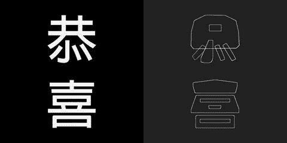

图 5-22。

Convex hull processing in OpenCV

### 多边形近似

除了使用凸包来简化轮廓，OpenCV 还提供了其他方法来简化轮廓。下一个练习`Chapter05_26`介绍了一种给定轮廓的多边形近似方法。功能是`approxPolyDP()`。

```py
import processing.video.*;
import java.util.ArrayList;
import java.util.Iterator;

Capture cap;
CVImage img;

void setup() {
  size(1280, 480);
  System.loadLibrary(Core.NATIVE_LIBRARY_NAME);
  cap = new Capture(this, width/2, height);
  cap.start();
  img = new CVImage(cap.width, cap.height);
}

void draw() {
  if (!cap.available())
    return;
  background(0);
  cap.read();
  img.copyTo(cap);
  Mat tmp1 = img.getGrey();
  Mat tmp2 = new Mat();
  Imgproc.blur(tmp1, tmp2, new Size(3, 3));
  Imgproc.Canny(tmp2, tmp1, 100, 200);
  ArrayList<MatOfPoint> contours = new ArrayList<MatOfPoint>();
  Mat hierarchy = new Mat();
  Imgproc.findContours(tmp1, contours, hierarchy,
    Imgproc.RETR_LIST, Imgproc.CHAIN_APPROX_SIMPLE);
  image(cap, 0, 0);
  pushStyle();
  noFill();
  Iterator<MatOfPoint> it = contours.iterator();
  while (it.hasNext()) {
    strokeWeight(random(5));
    stroke(255, random(160, 256));
    MatOfPoint2f poly = new MatOfPoint2f();
    Imgproc.approxPolyDP(new MatOfPoint2f(it.next().toArray()), poly, 3, true);
    Point [] pts = poly.toArray();
    beginShape();
    for (int i=0; i<pts.length; i++) {
      vertex((float)pts[i].x+cap.width, (float)pts[i].y);
    }
    endShape(CLOSE);
  }
  popStyle();
  text(nf(round(frameRate), 2), 10, 20);
  tmp1.release();
  tmp2.release();
}

```

在`while`循环中，将每个轮廓传递给`approxPolyDP()`函数。第一个参数是转换成`MatOfPoint2f`的轮廓信息。第二个参数`poly`是存储为另一个`MatOfPoint2f`的输出多边形信息。第三个参数是近似精度。较小的值将具有更接近的近似值。第四个参数中的`true`值表示近似曲线是闭合的。请注意，您还可以改变描边粗细和描边颜色来模拟手绘动画效果。图 [5-23](#Fig23) 显示了结果图像。

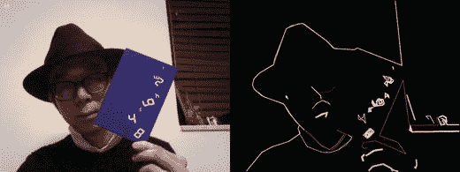

图 5-23。

Polygon approximation

### 测试轮廓中的点

下一个练习`Chapter05_27`，是一个交互式的练习，因为你可以用鼠标改变轮廓的`fill()`颜色。在`draw()`功能中，在绘制每个轮廓之前，使用功能`pointPolygonTest()`执行一个测试，查看当前鼠标位置`mouseX`和`mouseY`是否在其中。由于您使用的是窗口的右侧，您必须将`mouseX`值减去窗口大小的一半，即`cap.width`。要使用`pointPolygonTest()`功能，首先将当前轮廓信息`mp`从`MatOfPoint`转换为`MatOfPoint2f`，并将其作为第一个参数传递。第二个参数是存储在`Point`对象实例中的鼠标位置。第三个布尔参数指示是否要返回距离数据。在本练习中，您使用`false`返回一个指示器，显示该点是在轮廓内部还是外部。正值表示该点位于轮廓内部，负值表示该点位于轮廓外部，而零表示该点位于边缘上。

```py
import processing.video.*;
import java.util.ArrayList;
import java.util.Iterator;

Capture cap;
CVImage img;

void setup() {
  size(1280, 480);
  System.loadLibrary(Core.NATIVE_LIBRARY_NAME);
  cap = new Capture(this, width/2, height);
  cap.start();
  img = new CVImage(cap.width, cap.height);
}

void

draw() {
  if (!cap.available())
    return;
  background(250);
  cap.read();
  img.copyTo(cap);
  Mat tmp1 = img.getGrey();
  Mat tmp2 = new Mat();
  Imgproc.blur(tmp1, tmp2, new Size(3, 3));
  Imgproc.Canny(tmp2, tmp1, 80, 160);
  ArrayList<MatOfPoint> contours = new ArrayList<MatOfPoint>();
  Mat hierarchy = new Mat();
  Imgproc.findContours(tmp1, contours, hierarchy,
    Imgproc.RETR_LIST, Imgproc.CHAIN_APPROX_SIMPLE);
  image(cap, 0, 0);
  pushStyle();
  stroke(50);
  Iterator<MatOfPoint> it = contours.iterator();
  while (it.hasNext()) {
    MatOfPoint mp = it.next();
    Point [] pts = mp.toArray();
    boolean inside = true;
    if (mouseX < cap.width) {
      noFill();
    } else {
      int mx = constrain(mouseX-cap.width, 0, cap.width-1);
      int my = constrain(mouseY, 0, cap.height-1);
      double result = Imgproc.pointPolygonTest(new MatOfPoint2f(pts),
        new Point(mx, my), false);
      if (result > 0) {
        fill(255, 0, 0);
      } else {
        noFill();
      }
    }
    beginShape();
    for (int i=0; i<pts.length; i++) {
      vertex((float)pts[i].x+cap.width, (float)pts[i].y);
    }
    endShape(CLOSE);
  }
  popStyle();
  text(nf(round(frameRate), 2), 10, 20);
  tmp1.release();
  tmp2.release();
  hierarchy.release();
}

```

在该程序中，当鼠标位置在轮廓内时，将`fill()`颜色设置为红色。否则就是`noFill()`。图 [5-24](#Fig24) 显示鼠标位置在手指形成的孔内的瞬间。

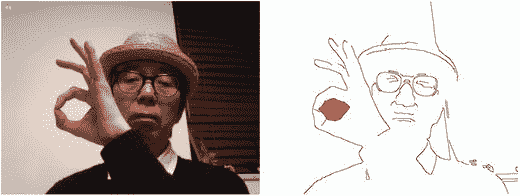

图 5-24。

Testing whether a point is inside a contour with pointPolygonTest

### 检查交叉路口

在进入一般的形状匹配部分之前，我将用另外一个练习`Chapter05_28`来总结轮廓处理的使用。在本练习中，您将参考上一个练习`Chapter05_24`中`RotatedRect`的使用，并在固定矩形区域和从屏幕上的实时网络摄像头图像生成的旋转矩形之间执行检测。

```py
import processing.video.*;
import java.util.ArrayList;
import java.util.Iterator;

Capture cap;
CVImage img;
float minArea, maxArea;
RotatedRect rRect;

void setup() {
  size(1280, 480);
  System.loadLibrary(Core.NATIVE_LIBRARY_NAME);
  cap = new Capture(this, width/2, height);
  cap.start();
  img = new CVImage(cap.width, cap.height);
  minArea = 50;
  maxArea = 6000;
  // This is the fixed rectangular region of size 200x200.
  rRect = new RotatedRect(new Point(cap.width/2, cap.height/2),
    new Size(200, 200), 0);
  rectMode(CENTER);
}

void
draw() {
  if (!cap.available())
    return;
  background(0);
  cap.read();
  img.copyTo(cap);
  Mat tmp1 = img.getGrey();
  Mat tmp2 = new Mat();
  Imgproc.blur(tmp1, tmp2, new Size(3, 3));
  Imgproc.Canny(tmp2, tmp1, 100, 200);
  ArrayList<MatOfPoint> contours = new ArrayList<MatOfPoint>();
  Mat hierarchy = new Mat();
  Imgproc.findContours(tmp1, contours, hierarchy,
    Imgproc.RETR_LIST, Imgproc.CHAIN_APPROX_SIMPLE);
  // Draw the fixed rectangular region.
  pushStyle();
  fill(255, 20);
  stroke(0, 0, 255);
  rect((float)rRect.center.x+cap.width,
    (float)rRect.center.y, (float)rRect.size.width,
    (float)rRect.size.height);
  popStyle();

  pushStyle();
  Iterator<MatOfPoint> it = contours.iterator();
  while (it.hasNext()) {
    MatOfPoint ctr = it.next();
    float area = (float)Imgproc.contourArea(ctr);
    // Exclude the large and small rectangles
    if (area < minArea || area > maxArea)
      continue

;
    // Obtain the rotated rectangles from each contour.
    RotatedRect r = Imgproc.minAreaRect(new MatOfPoint2f(ctr.toArray()));
    Point [] pts = new Point[4];
    r.points(pts);
    stroke(255, 255, 0);
    noFill();
    // Draw the rotated rectangles.
    beginShape();
    for (int i=0; i<pts.length; i++) {
      vertex((float)pts[i].x+cap.width, (float)pts[i].y);
    }
    endShape(CLOSE);
    // Compute the intersection between the fixed region and
    // each rotated rectangle.
    MatOfPoint2f inter = new MatOfPoint2f();
    int rc = Imgproc.rotatedRectangleIntersection(r, rRect, inter);
    //  Skip
the cases with no intersection.
    if (rc == Imgproc.INTERSECT_NONE)
      continue;
    // Obtain the convex hull of the intersection polygon.
    MatOfInt idx = new MatOfInt();
    MatOfPoint mp = new MatOfPoint(inter.toArray());
    Imgproc.convexHull(mp, idx);
    int [] idArray = idx.toArray();
    Point [] ptArray = mp.toArray();
    // Fill the intersection area.
    noStroke();
    fill(255, 100);
    beginShape();
    for (int i=0; i<idArray.length; i++) {
      Point p = ptArray[idArray[i]];
      vertex((float)p.x+cap.width, (float)p.y);
    }
    endShape(CLOSE);
    inter.release();
    idx.release();
    mp.release();
  }
  popStyle();
  image(cap, 0, 0);
  text(nf(round(frameRate), 2), 10, 20);
  tmp1.release();
  tmp2.release();
  hierarchy.release();
}

```

程序首先使用一个`RotatedRect`实例`rRect`定义一个固定区域。它的位置在视频采集屏幕的中心，尺寸为 200×200 像素。在`draw()`功能中，你首先从网络摄像头图像中检索所有轮廓。对于每个轮廓，你筛掉那些尺寸太小或太大的轮廓。对于其余的，您计算存储在变量`r`中的最小面积旋转矩形。对于每个旋转的矩形`r`，用下面的语句对照固定区域`rRect`进行检查:

```py
int rc = Imgproc.rotatedRectangleIntersection(r, rRect, inter);

```

如果它们之间有交集，顶点信息将在`MatOfPoint2f`变量`inter`中。返回代码`rc`，实际上会告诉你发生的交互的类型。`rc`的可能值如下:

*   `Imgproc.INTERSECT_NONE`(无重叠区域)
*   `Imgproc.INTERSECT_PARTIAL`(有重叠区域)
*   `Imgproc.INTERSECT_FULL`(一个矩形在另一个内)

您可以在 [`http://docs.opencv.org/3.1.0/d3/dc0/group__imgproc__shape.html`](http://docs.opencv.org/3.1.0/d3/dc0/group__imgproc__shape.html) 找到检查的详细说明。对于有交集的情况，您可以尝试使用半透明填充颜色来绘制重叠区域。然而，您会发现从变量`inter`返回的顶点顺序并不能保证一个凸形。在程序中，在你把它们画在屏幕上之前，你添加几行来从`inter`中的顶点找到凸包。图 [5-25](#Fig25) 显示了程序的样本输出显示。

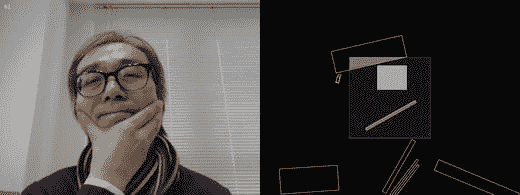

图 5-25。

Finding intersection between rotated rectangles

## 形状检测

在本章的最后一节，我将介绍 OpenCV 图像处理模块中的形状匹配函数`matchShapes()`。`Chapter05_29`练习的工作机制是构建一个形状模板，您希望将该模板与实时网络摄像头图像进行匹配。在这种情况下，您将使用如图 [5-26](#Fig26) 所示的汉字。您也可以创建自己的模式。黑色背景上的任何白色形状通常都很好。该图案图像的尺寸为 640×480 像素。


图 5-26。

Sample Chinese character to match with

该程序将从`data`文件夹中加载图像，并使用您在前面章节中了解到的`findContours()`函数构建轮廓。因为你事先知道这个字符只包含一个轮廓，你只需将第一个轮廓存储在一个`MatOfPoint`变量中。以下源代码中的`prepareChar()`函数执行此功能:

```py
import processing.video.*;
import java.util.ArrayList;
import java.util.Iterator;

Capture cap;
PImage img;
CVImage cv;
MatOfPoint ch;
float maxVal;

void setup() {
  size(1280, 480);
  System.loadLibrary(Core.NATIVE_LIBRARY_NAME);
  cap = new Capture(this, width/2, height);
  cap.start();
  img = loadImage("chinese.png");
  ch = prepareChar(img);
  cv = new CVImage(cap.width, cap.height);
  maxVal = 5;
}

MatOfPoint
prepareChar(PImage i) {
  CVImage chr = new CVImage(i.width, i.height);
  chr.copyTo(i);
  Mat tmp1 = chr.getGrey();
  Mat tmp2 = new Mat();
  Imgproc.blur(tmp1, tmp2, new Size(3, 3));
  Imgproc.threshold(tmp2, tmp1, 127, 255, Imgproc.THRESH_BINARY);
  Mat hierarchy = new Mat();
  ArrayList<MatOfPoint> contours = new ArrayList<MatOfPoint>();
  Imgproc.findContours(tmp1, contours, hierarchy,
    Imgproc.RETR_LIST, Imgproc.CHAIN_APPROX_SIMPLE);
  tmp1.release();
  tmp2.release();
  hierarchy.release();
  return contours.get(0);
}

void

draw() {
  if (!cap.available())
    return;
  background(0);
  cap.read();
  cv.copyTo(cap);
  Mat tmp1 = cv.getGrey();
  Mat tmp2 = new Mat();
  Imgproc.blur(tmp1, tmp2, new Size(3, 3));
  Imgproc.Canny(tmp2, tmp1, 100, 200);
  ArrayList<MatOfPoint> contours = new ArrayList<MatOfPoint>();
  Mat hierarchy = new Mat();
  Imgproc.findContours(tmp1, contours, hierarchy,
    Imgproc.RETR_LIST, Imgproc.CHAIN_APPROX_SIMPLE);
  Iterator<MatOfPoint> it = contours.iterator();
  pushStyle();
  while (it.hasNext()) {
    MatOfPoint cont = it.next();
    double val = Imgproc.matchShapes(ch, cont, Imgproc.CV_CONTOURS_MATCH_I1, 0);
    if (val > maxVal)
      continue;
    RotatedRect r = Imgproc.minAreaRect(new MatOfPoint2f(cont.toArray()));
    Point ctr = r.center

;
    noStroke();
    fill(255, 200, 0);
    text((float)val, (float)ctr.x+cap.width, (float)ctr.y);
    Point [] pts = cont.toArray();
    noFill();
    stroke(100);
    beginShape();
    for (int i=0; i<pts.length; i++) {
      vertex((float)pts[i].x+cap.width, (float)pts[i].y);
    }
    endShape(CLOSE);
  }
  popStyle();
  image(cap, 0, 0);
  text(nf(round(frameRate), 2), 10, 20);
  tmp1.release();
  tmp2.release();
  hierarchy.release();
}

```

在`draw()`功能中，您可以浏览来自实时网络摄像头图像的每个轮廓。您使用`matchShapes()`函数来执行匹配。前两个参数是汉字轮廓和每个实况网络摄像机图像轮廓。剩下的就是匹配方法和一个伪参数。返回值`val`，表示匹配有多接近；数值越小越好。您还可以排除那些返回值大于阈值`maxVal`的轮廓。使用`minAreaRect()`功能找出轮廓的中心，以便在屏幕上显示匹配值。程序的其余部分类似于前几节中绘制每个等高线的部分。

在图 [5-27](#Fig27) 所示的测试中，样本字符与存储的字符不相同。匹配值的范围从 1.5 到 3.5。


图 5-27。

Shape-matching test with other characters

在接下来的测试中，如图 [5-28](#Fig28) 所示，三个字符中有一个是正确的。正确字符的匹配值约为 0.6。

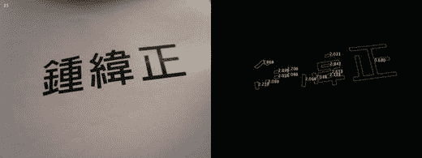

图 5-28。

Shape-matching test with one correct character

在下一个测试中，如图 [5-29](#Fig29) 所示，您使用相同的三个字符，但方向颠倒。正确字符的匹配值约为 0.4。

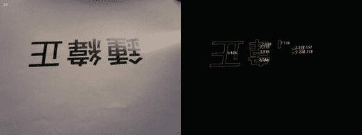

图 5-29。

Shape-matching test with upside-down characters

在下一个测试中，如图 [5-30](#Fig30) 所示，您使用一个手绘字符。样本字符的匹配值大约为 1.0。您可以在`matchShapes()`功能中探索匹配方法参数。不同的方法可能会产生不同范围的返回值。有必要进行测试和实验，以找到适合应用的方法。

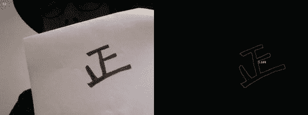

图 5-30。

Shape-matching test with hand-drawn character

## 结论

在本章中，您开始了一些计算机视觉任务，以识别和分析数字图像中的结构元素。你从准备图像和提取边缘开始。从边缘信息中，您可以检测到直线和圆等几何元素。通过一般轮廓处理任务，您开发了一个简单的应用来检测实时网络摄像头视频流中更复杂的形状。在下一章，我将介绍从预先录制的或现场直播的视频中检测和分析运动的想法。