# 六、理解运动

在上一章中，你学习了如何理解一帧图像中的内容。在这一章中，您将开始了解多帧数字视频或实时网络摄像头流中的运动。作为一个简单的解释，只要两个连续帧之间有差异，就可以识别运动。在计算机视觉中，你试图使用各种方法来理解这些差异，以便理解运动方向和前景背景分离等现象。在这一章的开始，我将介绍数字艺术家在处理动态图像时使用的现有方法。我将涉及的主题如下:

*   运动图像的效果
*   帧差分
*   背景去除
*   光流
*   运动历史

## 运动图像的效果

在 20 世纪 90 年代，多媒体设计者主要使用软件导演来创建通过 CD-ROM 平台交付的交互式内容。当时的数字视频资料主要由预先录制的内容组成。然而，Director 能够通过附加组件或插件来扩展其功能。丹尼尔·罗津开发的 TrackThemColors 就是其中之一。extras 使导演能够捕捉和分析从网络摄像头捕捉的数字图像。大约在 1999 年，约翰·梅达的反应式图书系列《镜子镜子》也使用视频输入作为交互功能。此外，Josh Nimoy 的米隆图书馆(由 WebCamXtra 和 JMyron 组成)提供了从 Director、Java 和 Processing 访问网络摄像头的功能。该图书馆以米隆·克鲁格的名字命名，他是一位伟大的美国计算机研究人员和艺术家，在 20 世纪 70 年代用实时视频流创建了增强现实应用的早期形式。另一个参考是伟大的英国摄影师埃德沃德·迈布里奇的定格运动研究，他展示了一系列静态照片来说明连续的运动，如一匹马在奔跑。

通过在处理中使用`video`库，您有了一组一致的函数来处理运动图像。媒体艺术家和设计师一直在探索在处理运动图像时产生创造性视觉效果的方法。以下部分将实现处理中的一些常见效果，以说明这些效果背后的创造性概念。我将介绍以下内容:

*   马赛克效应
*   狭缝扫描摄影
*   滚动效果
*   三维可视化

### 马赛克效应

第一个练习`Chapter06_01`，是你在第 [3 章](3.html)中完成的马赛克效果的修改版本。您将为每个单元格创建原始图像的缩小版本，而不是为网格中的每个单元格使用单一的纯色，在本例中，为每个单元格创建实时网络摄像机视频流。这种效果已经在很多数字艺术和广告材料中使用。以下是节目来源:

```py
// Mosaic effect
import processing.video.*;

final int CELLS = 40;
Capture cap;
PImage img;
int idx;
int rows, cols;

void setup() {
  size(960, 720);
  background(0);
  cap = new Capture(this, 640, 480);
  cap.start();
  rows = CELLS;
  cols = CELLS;
  img = createImage(width/cols, height/rows, ARGB);
  idx = 0;
}

void draw() {
  if (!cap.available())
    return;
  cap.read();
  img.copy(cap, 0, 0, cap.width, cap.height,
    0, 0, img.width, img.height);
  int px = idx % cols;
  int py = idx / cols;
  int ix = px*cap.width/cols;
  int iy = py*cap.height/rows;
  color col = cap.pixels[iy*cap.width+ix];
  tint(col);
  image(img, px*img.width, py*img.height);
  idx++;
  idx %= (rows*cols);
}

```

在`draw()`函数中，程序的每一帧都会将网络摄像头视频图像的快照复制到一个更小的叫做`img`的`PImage`中。它将从左到右、从上到下遍历整个屏幕，将最新的帧粘贴到网格的每个单元格中。在粘贴`img`之前，它使用`tint()`函数来改变颜色，从单元格的左上角反映颜色信息。结果，最终显示将类似于实时图像，而每个单元是时间上的独立帧。图 [6-1](#Fig1) 显示了显示屏的样本。

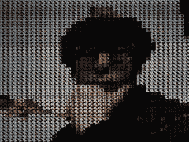

图 6-1。

Mosaic with live camera input

### 狭缝扫描效应

狭缝扫描是一种摄影技术，一次只曝光图像的一条狭缝。对于数字图像处理，您可以修改它，使其一次只包含一行像素。在下一个练习`Chapter06_02`中，您将从网络摄像机直播流的每一帧中仅复制一行垂直像素。这是从运动图像生成静止图像的常用技术。Golan Levin 在 [`http://www.flong.com/texts/lists/slit_scan/`](http://www.flong.com/texts/lists/slit_scan/) 提供狭缝扫描艺术品的综合信息目录。以下清单是练习的来源:

```py
// Slit-scan effect
import processing.video.*;

Capture cap;
PImage img;
int idx, mid;

void setup() {
  size(1280, 480);
  background(0);
  cap = new Capture(this, width/2, height);
  cap.start();
  img = createImage(1, cap.height, ARGB);
  idx = 0;
  mid = cap.width/2;
}

void draw() {
  if (!cap.available())
    return;
  cap.read();
  img.copy(cap, mid, 0, 1, cap.height,
    0, 0, img.width, img.height);
  image(img, idx, 0);
  idx++;
  idx %= width;
}

```

程序很简单。在`draw()`功能中，在捕获视频的中心取一条垂直的像素线，并将其复制到一个水平移动的位置，由`idx`表示。在这种情况下，屏幕上的每条垂直线代表一个单独的时间点，从左向右移动。图 [6-2](#Fig2) 显示了结果图像。

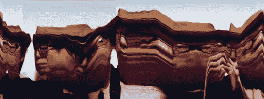

图 6-2。

Slit-scan effect with Processing

### 滚动效果

同样，回到 20 世纪 90 年代，英国多媒体艺术团体 Antirom ( [`http://www.antirom.com/`](http://www.antirom.com/) )让电影的滚动效果变得流行起来。在 Flash 时代，日本设计师 Yugop Nakamura 也大量试验了滚动条作为界面元素。这背后的想法很简单。首先，您构建一个由多个图像组成的长条，类似于模拟电影胶片。这些图像通常是连续运动的快照。然后，您可以通过水平或垂直的滚动运动来制作影片动画。当滚动速度达到一定的阈值时，电影胶片中的每个单元似乎都在自己制作动画，产生类似于早期电影的效果。在下面的练习中，您将实现一个处理版本，`Chapter06_03`:

```py
// Scrolling effect
import processing.video.*;

// Processing modes for the draw() function
public enum Mode {
  WAITING, RECORDING, PLAYING
}

final int FPS = 24;
Capture cap;
Mode mode;
PShape [] shp;
PImage [] img;
PShape strip;
int dispW, dispH;
int recFrame;
float px, vx;

void setup() {
  size(800, 600, P3D);
  background(0);
  cap = new Capture(this, 640, 480);
  cap.start();
  // Frame size of the film strip
  dispW = 160;
  dispH = 120;
  // Position and velocity of the film strip
  px = 0;
  vx = 0;
  prepareShape();
  mode = Mode.WAITING;
  recFrame = 0;
  frameRate(FPS);
  noStroke();
  fill(255);
}

void prepareShape() {
  // Film strip shape
  strip = createShape(GROUP);
  // Keep 24 frames in the PImage array
  img = new PImage[FPS];
  int extra = ceil(width/dispW);
  // Keep 5 more frames to compensate for the
  // continuous scrolling effect
  shp = new PShape[FPS+extra];
  for (int i=0; i<FPS; i++) {
    img[i] = createImage(dispW, dispH, ARGB);
    shp[i] = createShape(RECT, 0, 0, dispW, dispH);
    shp[i].setStroke(false);
    shp[i].setFill(color(255));
    shp[i].setTexture(img[i]);
    shp[i].translate(i*img[i].width, 0);
    strip.addChild(shp[i]);
  }
  // The 5 extra frames are the same as the
  // first 5 ones.
  for (int i=FPS; i<shp.length; i++) {
    shp[i] = createShape(RECT, 0, 0, dispW, dispH);
    shp[i].setStroke(false);
    shp[i].setFill(color(255));
    int j = i % img.length;
    shp[i].setTexture(img[j]);
    shp[i].translate(i*img[j].width, 0);
    strip.addChild(shp[i]);
  }
}

void

draw() {
  switch (mode) {
  case WAITING:
    waitFrame();
    break;
  case RECORDING:
    recordFrame();
    break;
  case PLAYING:
    playFrame();
    break;
  }
}

void waitFrame() {
  // Display to live webcam image while waiting
  if (!cap.available())
    return;
  cap.read();
  background(0);
  image(cap, (width-cap.width)/2, (height-cap.height)/2);
}

void

recordFrame() {
  // Record each frame into the PImage array
  if (!cap.available())
    return;
  if (recFrame >= FPS) {
    mode = Mode.PLAYING;
    recFrame = 0;
    println("Finish recording");
    return;
  }
  cap.read();
  img[recFrame].copy(cap, 0, 0, cap.width, cap.height,
    0, 0, img[recFrame].width, img[recFrame].height);
  int sw = 80;
  int sh = 60;
  int tx = recFrame % (width/sw);
  int ty = recFrame / (width/sw);
  image(img[recFrame], tx*sw, ty*sh, sw, sh);
  recFrame++;
}

void playFrame() {
  background(0);
  // Compute the scrolling speed
  vx = (width/2 - mouseX)*0.6;
  px += vx;
  // Check for 2 boundary conditions
  if (px < (width-strip.getWidth())) {
    px = width - strip.getWidth() - px;
  } else if (px > 0) {
    px = px - strip.getWidth() + width;
  }
  shape(strip, px, 250);
}

void mousePressed() {
  // Press mouse button to record
  if (mode != Mode.RECORDING) {
    mode = Mode.RECORDING;
    recFrame = 0;
    background(0);
    println("Start recording");
  }
}

```

程序有三种状态，由`enum`类型`mode`表示。第一个是`WAITING`状态，屏幕上显示实时网络摄像头。一旦用户按下鼠标按钮，程序进入`RECORDING`状态。在这种状态下，它将 24 帧记录到名为`img`的`PImage`数组中。用户还可以在那一秒钟内获得屏幕上 24 个小框架布局的反馈。录制完成后，它会进入`PLAYING`状态，显示一个长的水平连续画面。它将根据鼠标位置向左或向右滚动。用户也可以通过向左或向右移动鼠标来改变滚动速度。要创建连续循环滚动的幻像，需要在原来的 24 帧的末尾再添加 5 帧。这五帧构成了显示屏的宽度(800 像素)。当电影胶片滚动超出其边界时，您只需将胶片的另一端放在屏幕窗口内，如`playFrame()`功能所示。整个电影胶片保存在由`shp`阵列中的 29 帧组成的`strip PShape`中。图 [6-3](#Fig3) 显示了一个示例截图供参考。

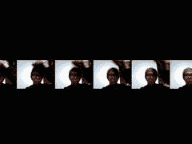

图 6-3。

Scrolling effect of filmstrip

### 三维可视化

你可以进一步将你的实验扩展到三维空间。在下一个练习`Chapter06_04`中，您将在处理显示窗口中显示 24 个帧的集合。该程序将在一个由 24 个图片帧组成的半透明块中同时可视化 24 个连续帧，在三维空间中缓慢旋转。

```py
// 3D effect
import processing.video.*;

final int FPS = 24;
final int CAPW = 640;
final int CAPH = 480;

Capture cap;
PImage [] img;
PShape [] shp;
int idx;
float angle;
int dispW, dispH;

void setup() {
  size(800, 600, P3D);
  cap = new Capture(this, CAPW, CAPH, FPS);
  cap.start();
  idx = 0;
  angle = 0;
  frameRate(FPS);
  // Keep the 24 frames in each img array member
  img = new PImage[FPS];
  // Keep the 24 images in a separate PShape
  shp = new PShape[FPS];
  dispW = cap.width;
  dispH = cap.height;
  for (int i=0; i<FPS; i++) {
    img[i] = createImage(dispW, dispH, ARGB);
    shp[i] = createShape(RECT, 0, 0, dispW, dispH);
    shp[i].setStroke(false);
    shp[i].setFill(color(255, 255, 255, 80));
    shp[i].setTint(color(255, 255, 255, 80));
    shp[i].setTexture(img[i]);
  }
}

void draw() {
  if (!cap.available())
    return;
  background(0);
  lights();
  cap.read();
  // Copy the latest capture image into the
  // array member with index - idx
  img[idx].copy(cap, 0, 0, cap.width, cap.height,
    0, 0, img[idx].width, img[idx].height);
  pushMatrix();
  translate(width/2, height/2, -480);
  rotateY(radians(angle));
  translate(-dispW/2, -dispH/2, -480);
  displayAll();
  popMatrix();
  // Loop through the array with the idx
  idx++;
  idx %= FPS;
  angle += 0.5;
  angle %= 360;
  text(nf(round(frameRate), 2), 10, 20);
}

void

displayAll() {
  // Always display the first frame of
  // index - idx
  pushMatrix();
  int i = idx - FPS + 1;
  if (i < 0)
    i += FPS;
  for (int j=0; j<FPS; j++) {
    shape(shp[i], 0, 0);
    i++;
    i %= FPS;
    translate(0, 0, 40);
  }
  popMatrix();
}

```

每个矩形图像帧对应于一秒钟内 24 帧中的一帧。最上面的总是最新的帧。实际上，你可以看到运动一个接一个地向下传播到其他帧。由于框架是半透明的，当运动向下下沉时，您可以透过它们看到。我在我的作品《时间运动》第一部分中使用了这种效果。有了这个效果，电影中的跳跃剪辑将变成一个平滑的过渡。诀窍在于`displayAll()`函数。变量`idx`代表最新的帧。然后，将从以下语句中计算最早的帧，并由于负值而进行额外的调整:

```py
int i = idx – FPS + 1;

```

之后的`for`循环将以正确的顺序显示每一帧。为了在一秒钟内保存所有的 24 帧，你使用两个数组，`img`和`shp`。数组`img`将每个视频帧存储为一个`PImage`，它将作为纹理映射到数组`shp`的每个成员之上，如`PShape`。`draw()`功能管理整个图框块的旋转，如图 [6-4](#Fig4) 所示。

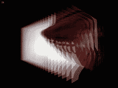

图 6-4。

Video frames in 3D

## 帧差分

现在，您已经看到了许多处理运动图像中的帧的例子，您可以继续了解计算机视觉中如何检测运动。基本原理是，只有当两个图像帧发生变化时，您才能实现运动。通过比较两个帧，您可以简单地知道这两个帧之间发生了什么类型的运动。比较两帧的方法是在处理中使用第 [3](3.html) 章中的`blend()`功能。在下一个练习`Chapter06_05`中，您将实现实时网络摄像头流和静态图像之间的帧差:

```py
// Difference between video and background

import processing.video.*;

final int CAPW = 640;
final int CAPH = 480;

Capture cap;
PImage back, img, diff;
int dispW, dispH;

void setup() {
  size(800, 600);
  cap = new Capture(this, CAPW, CAPH);
  cap.start();
  dispW = width/2;
  dispH = height/2;
  back = createImage(dispW, dispH, ARGB);
  img = createImage(dispW, dispH, ARGB);
  diff = createImage(dispW, dispH, ARGB);
}

void

draw() {
  if (!cap.available())
    return;
  background(0);
  cap.read();
  // Get the difference image.
  diff.copy(cap, 0, 0, cap.width, cap.height,
    0, 0, img.width, img.height);
  diff.filter(GRAY);
  diff.blend(back, 0, 0, back.width, back.height,
    0, 0, diff.width, diff.height, DIFFERENCE);
  // Obtain the threshold binary image.
  img.copy(diff, 0, 0, diff.width, diff.height,
    0, 0, img.width, img.height);
  img.filter(THRESHOLD, 0.4);
  image(cap, 0, 0, dispW, dispH);
  image(back, dispW, 0, dispW, dispH);
  image(diff, 0, dispH, dispW, dispH);
  image(img, dispW, dispH, dispW, dispH);
  text(nf(round(frameRate), 2), 10, 20);
}

void mousePressed() {
  // Update the background image.
  back.copy(cap, 0, 0, cap.width, cap.height,
    0, 0, back.width, back.height);
  back.filter(GRAY);
}

```

在这个程序中，你可以按下鼠标键从网络摄像头直播流中录制一个静态图像，并将其作为背景帧存储在名为`back`的`PImage`变量中。在每一帧中，在`draw()`函数中，它使用`blend()`函数将当前帧与背景进行比较，并将差异存储在`PImage`变量`diff`中。进一步应用阈值滤波器来生成称为`img`的二进制`PImage`。在处理显示窗口中，左上角显示当前视频帧，右上角显示背景图像，左下角显示差异图像，右下角显示阈值二进制图像。在阈值图像中，白色区域表示运动发生的位置。图 [6-5](#Fig5) 显示了一个示例截图供参考。

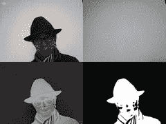

图 6-5。

Frame difference between live video and background

对于无法获得静态背景图像的应用，您可以考虑比较两个连续的帧来获得差异。下面的练习`Chapter06_06`演示了获取两帧之间的差异的纯处理实现:

```py
// Difference between consecutive frames

import processing.video.*;

final int CNT = 2;
// Capture size
final int CAPW = 640;
final int CAPH = 480;

Capture cap;
// Keep two frames to use alternately with
// array indices (prev, curr).
PImage [] img;
int prev, curr;
// Display image size
int dispW, dispH;

void setup() {
  size(800, 600);
  dispW = width/2;
  dispH = height/2;
  cap = new Capture(this, CAPW, CAPH);
  cap.start();
  img = new PImage[CNT];
  for (int i=0; i contours = new ArrayList<MatOfPoint>();
  Mat hierarchy = new Mat();
  Imgproc.findContours(tmp2, contours, hierarchy,
    Imgproc.RETR_LIST, Imgproc.CHAIN_APPROX_SIMPLE);
  Iterator<MatOfPoint> it = contours.iterator();
  pushStyle();
  fill(255, 180);
  noStroke();
  while

(it.hasNext()) {
    MatOfPoint cont = it.next();
    // Draw each bounding box
    Rect rct = Imgproc.boundingRect(cont);
    float area = (float)(rct.width * rct.height);
    if (area < MINAREA)
      continue;
    rect((float)rct.x+dispW, (float)rct.y+dispH,
      (float)rct.width, (float)rct.height);
  }
  popStyle();
  text(nf(round(frameRate), 2), 10, 20);
  int temp = prev;
  prev = curr;
  curr = temp;
  hierarchy.release();
  tmp1.release();
  tmp2.release();
}

```

该程序与前一个类似，只是您使用名为`frames`的 OpenCV `Mat`实例来存储前一帧和当前帧。您还可以使用`Core.absdiff()`函数来计算差异图像，并使用`Imgproc.threshold()`来生成黑白二值图像。当你在`contours`数据结构中循环时，你首先计算边界框面积来过滤那些面积较小的轮廓。剩下的，你在显示窗口的右下角显示矩形，如图 [6-7](#Fig7) 所示。

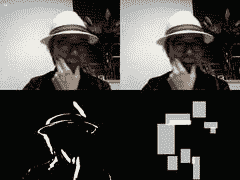

图 6-7。

Simple tracking with frame differencing

## 背景去除

在前面的帧差分练习中，如果你观察足够长的时间，静态背景将保持黑色。只有前景中的运动物体是白色的。OpenCV 中的背景去除或背景减除是指将前景运动物体从静态背景图像中分离出来。您不需要像练习`Chapter06_05`中那样提供静态背景图像。在 OpenCV 的`video`模块中，`BackgroundSubtractor`类将从一系列输入图像中学习，通过在当前帧和背景模型(包含场景的静态背景)之间执行减法来生成前景遮罩。下一个练习`Chapter06_08`说明了背景减除的基本操作:

```py
// Background subtraction
import processing.video.*;
import org.opencv.video.*;
import org.opencv.video.Video;

// Capture size
final int CAPW = 640;
final int CAPH = 480;

Capture cap;
CVImage img;
PImage back;
// OpenCV background subtractor
BackgroundSubtractorMOG2 bkg;
// Foreground mask
Mat fgMask;

void setup() {
  size(1280, 480);
  System.loadLibrary(Core.NATIVE_LIBRARY_NAME);
  cap = new Capture(this, CAPW, CAPH);
  cap.start();
  img = new CVImage(cap.width, cap.height);
  bkg = Video.createBackgroundSubtractorMOG2();
  fgMask = new Mat();
}

void draw() {
  if (!cap.available())
    return;
  background(0);
  cap.read();
  img.copyTo(cap);
  Mat capFrame = img.getBGRA();
  bkg.apply(capFrame, fgMask);
  CVImage out = new CVImage(fgMask.cols(), fgMask.rows());
  out.copyTo(fgMask);
  image(cap, 0, 0);
  // Display the foreground mask
  image(out, cap.width, 0);
  text(nf(round(frameRate), 2), 10, 20);
  capFrame.release();
}

```

该程序使用 Zoran Zivkovic 的基于高斯混合的背景/前景分割算法。类定义在 OpenCV 的`video`模块中。注意使用额外的`import`语句来包含类定义。这个类实例是由`Video.createBackgroundSubtractorMOG2()`函数创建的。要使用该对象，您需要将视频帧和前景蒙版`Mat`、`fgMask`传递给`draw()`函数中每一帧的`apply()`函数。`BackgroundSubtractor`对象`bkg`将从每一帧中学习静态背景应该是什么，并生成前景蒙版。前景蒙版`fgMask`是黑白图像，其中黑色区域是背景，白色区域是前景对象。程序会在左侧显示原始视频帧，在右侧显示前景遮罩，如图 [6-8](#Fig8) 所示。


图 6-8。

Background subtraction in OpenCV

使用前景蒙版，您可以将其与视频帧结合，以从背景中检索前景图像。下面的练习`Chapter06_09`，将使用这种方法实现效果，类似于视频制作中的色度键:

```py
// Background subtraction
import processing.video.*;
import org.opencv.video.*;
import org.opencv.video.Video;

// Capture size
final int CAPW = 640;
final int CAPH = 480;

Capture cap;
CVImage img;
PImage back;
BackgroundSubtractorKNN bkg;
Mat fgMask;
int dispW, dispH;

void setup() {
  size(800, 600);
  dispW = width/2;
  dispH = height/2;
  System.loadLibrary(Core.NATIVE_LIBRARY_NAME);
  cap = new Capture(this, CAPW, CAPH);
  cap.start();
  img = new CVImage(dispW, dispH);
  bkg = Video.createBackgroundSubtractorKNN();
  fgMask = new Mat();
  // Background image
  back = loadImage("background.png");
}

void

draw() {
  if (!cap.available())
    return;
  background(0);
  cap.read();
  PImage tmp = createImage(dispW, dispH, ARGB);
  // Resize the capture image
  tmp.copy(cap, 0, 0, cap.width, cap.height,
    0, 0, tmp.width, tmp.height);
  img.copyTo(tmp);
  Mat capFrame = img.getBGRA();
  bkg.apply(capFrame, fgMask);
  // Combine the video frame and foreground
  // mask to obtain the foreground image.
  Mat fgImage = new Mat();
  capFrame.copyTo(fgImage, fgMask);  
  CVImage out = new CVImage(fgMask.cols(), fgMask.rows());
  // Display the original video capture image.
  image(tmp, 0, 0);
  // Display the static background image.
  image(back, dispW, 0);
  out.copyTo(fgMask);
  // Display the foreground mask.
  image(out, 0, dispH);
  out.copyTo(fgImage);
  // Display the foreground image on top of
  // the static background.
  image(back, dispW, dispH);
  image(out, dispW, dispH);
  text(nf(round(frameRate), 2), 10, 20);
  capFrame.release();
  fgImage.release();
}

```

在这个程序中，您将显示四幅图像。左上方的是实时视频流。右上角的是静态背景图像，存储在名为`back`的`PImage`实例中。左下角的是前景蒙版，如前一个练习所示。右下角的是显示在背景图像上面的前景图像。您还可以尝试另一种背景减除方法，即 K 近邻背景减除法`BackgroundSubtractorKNN`。当图像中的前景像素较少时，这种方法更有效。在`draw()`函数中，程序定义了一个名为`fgImage`的新变量来存储前景图像。你用前景蒙版`fgMask`将当前视频图像`capFrame`复制到`fgImage`。

```py
capFrame.copyTo(fgImage, fgMask);

```

在这种情况下，只有蒙版中的白色区域会被复制。图 [6-9](#Fig9) 显示了整体结果图像。

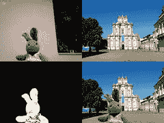

图 6-9。

Background subtraction and foreground extraction

除了前景图像，OpenCV `BackgroundSubtractor`还可以用`getBackgroundImage()`函数检索背景图像。下一个练习`Chapter06_10`将演示它的用法。

```py
// Background subtraction
import processing.video.*;
import org.opencv.video.*;
import org.opencv.video.Video;

// Capture size
final int CAPW = 640;
final int CAPH = 480;

Capture cap;
CVImage img;
PImage back;
BackgroundSubtractorKNN bkg;
// Foreground mask object
Mat fgMask;
int dispW, dispH;

void setup() {
  size(800, 600);
  dispW = width/2;
  dispH = height/2;
  System.loadLibrary(Core.NATIVE_LIBRARY_NAME);
  cap = new Capture(this, CAPW, CAPH);
  cap.start();
  img = new CVImage(dispW, dispH);
  bkg = Video.createBackgroundSubtractorKNN();
  fgMask = new Mat();
  // Background image
  back = loadImage("background.png");
}

void draw() {
  if (!cap.available())
    return;
  background(0);
  cap.read();
  PImage tmp = createImage(dispW, dispH, ARGB);
  // Resize the capture image
  tmp.copy(cap, 0, 0, cap.width, cap.height,
    0, 0, tmp.width, tmp.height);
  img.copyTo(tmp);
  Mat capFrame = img.getBGR();
  bkg.apply(capFrame, fgMask);
  // Background image object
  Mat bkImage = new Mat();
  bkg.getBackgroundImage(bkImage);
  CVImage out = new CVImage(fgMask.cols(), fgMask.rows());
  // Display the original video capture image.
  image(tmp, 0, 0);
  out.copyTo(bkImage);
  // Display the background image.
  image(out, dispW, 0);
  out.copyTo(fgMask);
  // Display the foreground mask.
  image(out, 0, dispH);
  // Obtain the foreground image with the PImage
  // mask method.
  tmp.mask(out);
  // Display the forground image on top of
  // the static background.
  image(back, dispW, dispH);
  image(tmp, dispW, dispH);
  text(nf(round(frameRate), 2), 10, 20);
  capFrame.release();
}

```

在`draw()`函数中，您定义了一个名为`bkImage`的新的`Mat`变量，并使用`getBackgroundImage(bkImage)`方法将背景图像矩阵传递给`bkImage`变量。该程序还解释了使用处理`PImage`类的`mask()`方法执行屏蔽操作的另一种方式。图 [6-10](#Fig10) 显示了一个示例截图。

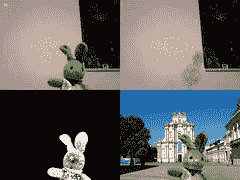

图 6-10。

Background image retrieval

## 光流

OpenCV 有另一种方法来找出运动图像中的运动细节:`video`模块中的光流特征。简单来说，光流就是对像素如何在两个连续帧间移动的分析，如图 [6-11](#Fig11) 所示。

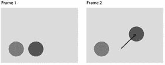

图 6-11。

Optical flow

从第 2 帧开始，您可以逐个扫描每个像素，并尝试将其与第 1 帧中的像素匹配，围绕原始邻域。如果找到匹配，就可以声明第 1 帧中的像素流到第 2 帧中的新位置。您为该像素确定的箭头将是光流信息。要使用光流，您可以假设以下情况:运动对象的像素强度在连续帧之间变化不大，相邻像素具有相似的运动，并且该对象不会移动得太快。

在 OpenCV 实现中，有两种类型的光流分析:稀疏和密集。在这一章中，你将首先研究稠密光流。稀疏光流涉及特征点识别，这是下一章的主题。通常，密集光流是对图像中每个单个像素的光流信息的计算。它是资源密集型的。通常，您会减小视频帧的大小来增强性能。第一个光流练习(第 06_11 章)将基于 Gunnar Farneback 在 2003 年发表的论文“基于多项式展开的两帧运动估计”实现密集光流算法。

```py
// Dense optical flow
import processing.video.*;
import org.opencv.video.*;
import org.opencv.video.Video;

// Capture size
final int CAPW = 640;
final int CAPH = 480;

Capture cap;
CVImage img;
float scaling;
int w, h;
Mat last;

void setup() {
  size(1280, 480);
  System.loadLibrary(Core.NATIVE_LIBRARY_NAME);
  cap = new Capture(this, CAPW, CAPH);
  cap.start();
  scaling = 10;
  w = floor(CAPW/scaling);
  h = floor(CAPH/scaling);
  img = new CVImage(w, h);
  last = new Mat(h, w, CvType.CV_8UC1);
}

void

draw() {
  if (!cap.available())
    return;
  background(0);
  cap.read();
  img.copy(cap, 0, 0, cap.width, cap.height,
    0, 0, img.width, img.height);
  img.copyTo();
  Mat grey = img.getGrey();
  Mat flow = new Mat(last.size(), CvType.CV_32FC2);
  Video.calcOpticalFlowFarneback(last, grey, flow,
    0.5, 3, 10, 2, 7, 1.5, Video.OPTFLOW_FARNEBACK_GAUSSIAN);
  grey.copyTo(last);
  drawFlow(flow);
  image(cap, 0, 0);
  grey.release();
  flow.release();
  text(nf(round(frameRate), 2), 10, 20);
}

void drawFlow(Mat f) {
  // Draw the flow data.
  pushStyle();
  noFill();
  stroke(255);
  for (int y=0; y<f.rows(); y++) {
    float py = y*scaling;
    for (int x=0; x<f.cols(); x++) {
      double [] pt = f.get(y, x);
      float dx = (float)pt[0];
      float dy = (float)pt[1];
      // Skip areas with no flow.
      if (dx == 0 && dy == 0)
        continue;
      float px = x*scaling;
      dx *= scaling;
      dy *= scaling;
      line(px+cap.width, py, px+cap.width+dx, py+dy);
    }
  }
  popStyle();
}

```

图 [6-12](#Fig12) 显示了结果截图。


图 6-12。

Farneback dense optical flow

您可以从视频捕获帧中检索颜色信息，并用原始颜色给线条着色，而不是用白色绘制流线。在这种情况下，您可以轻松地生成网络摄像头实时图像的交互式渲染，如图 [6-13](#Fig13) 所示。

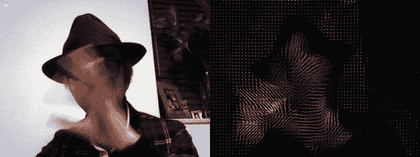

图 6-13。

Dense optical flow in color

在这个版本`Chapter06_12`中，您需要做的唯一更改是在`drawFlow()`函数中。不是在`for`循环外使用`stroke(255)`函数，而是计算像素颜色并将其分配给`stroke()`函数。您已经在前面的章节中使用了这种技术。

```py
void drawFlow(Mat f) {
  // Draw the flow data.
  pushStyle();
  noFill();
  for (int y=0; y<f.rows(); y++) {
    int py = (int)constrain(y*scaling, 0, cap.height-1);
    for (int x=0; x<f.cols(); x++) {
      double [] pt = f.get(y, x);
      float dx = (float)pt[0];
      float dy = (float)pt[1];
      // Skip areas with no flow.
      if (dx == 0 && dy == 0)
        continue;
      int px = (int)constrain(x*scaling, 0, cap.width-1);
      color col = cap.pixels[py*cap.width+px];
      stroke(col);
      dx *= scaling;
      dy *= scaling;
      line(px+cap.width, py, px+cap.width+dx, py+dy);
    }
  }
  popStyle();
}

```

除了使用光流信息渲染网络摄像头图像之外，您还可以将其用于交互设计。例如，您可以在显示屏上定义一个虚拟热点，以及来自网络摄像头的实时图像。当你在虚拟热点上挥手时，你可以为程序触发一个事件，比如回放一个简短的声音剪辑。在交互设计中设计这样的空鼓套件或钢琴是相当常见的。下面的练习`Chapter06_13`将使用光流信息实现这样一个虚拟热点。为了简化程序，您将定义一个额外的类`Region`，来封装代码以实现热点。以下是`Region`的定义:

```py
import java.awt.Rectangle;
import java.lang.reflect.Method;

// The class to define the hotspot.
class Region {
  // Threshold value to trigger the callback function.
  final float FLOW_THRESH = 20;
  Rectangle rct;     // area of the hotspot
  Rectangle screen;  // area of the live capture
  float scaling;     // scaling factor for optical flow size
  PVector flowInfo;  // flow information within the hotspot
  PApplet parent;
  Method func;       // callback function
  boolean touched;

  public Region(PApplet p, Rectangle r, Rectangle s, float f) {
    parent = p;
    // Register the callback function named regionTriggered.
    try {
      func = p.getClass().getMethod("regionTriggered",
        new Class[]{this.getClass()});
    }
    catch

(Exception e) {
      println(e.getMessage());
    }
    screen = s;
    rct = (Rectangle)screen.createIntersection(r);
    scaling = f;
    flowInfo = new PVector(0, 0);
    touched = false;
  }

  void update(Mat f) {
    Rect sr = new Rect(floor(rct.x/scaling), floor(rct.y/scaling),
      floor(rct.width/scaling), floor(rct.height/scaling));
    // Obtain the submatrix - region of interest.
    Mat flow = f.submat(sr);
    flowInfo.set(0, 0);
    // Accumulate the optical flow vectors.
    for (int y=0; y<flow.rows(); y++) {
      for (int x=0; x<flow.cols(); x++) {
        double [] vec = flow.get(y, x);
        PVector item = new PVector((float)vec[0], (float)vec[1]);
        flowInfo.add(item);
      }
    }
    flow.release();
    // When the magnitude of total flow is larger than a
    // threshold, trigger the callback.
    if (flowInfo.mag()>FLOW_THRESH) {
      touched = true;
      try {
        func.invoke(parent, this);
      }
      catch (Exception e) {
        println(e.getMessage());
      }
    } else {
      touched = false;
    }
  }

  void

drawBox() {
    // Draw the hotspot rectangle.
    pushStyle();
    if (touched) {
      stroke(255, 200, 0);
      fill(0, 100, 255, 160);
    } else {
      stroke(160);
      noFill();
    }
    rect((float)(rct.x+screen.x), (float)(rct.y+screen.y),
      (float)rct.width, (float)rct.height);
    popStyle();
  }

  void drawFlow(Mat f, PVector o) {
    // Visualize flow inside the region on
    // the right hand side screen.
    Rect sr = new Rect(floor(rct.x/scaling), floor(rct.y/scaling),
      floor(rct.width/scaling), floor(rct.height/scaling));
    Mat flow = f.submat(sr);
    pushStyle();
    noFill();
    stroke(255);
    for (int y=0; y<flow.rows(); y++) {
      float y1 = y*scaling+rct.y + o.y;
      for (int x=0; x<flow.cols(); x++) {
        double [] vec = flow.get(y, x);
        float x1 = x*scaling+rct.x + o.x;
        float dx = (float)(vec[0]*scaling);
        float dy = (float)(vec[1]*scaling);
        line(x1, y1, x1+dx, y1+dy);
      }
    }
    popStyle();
    flow.release();
  }

  float getFlowMag() {
    // Get the flow vector magnitude.
    return flowInfo.mag();
  }

  void writeMsg(PVector o, String m) {
    // Display message on screen.
    int px = round(o.x + rct.x);
    int py = round(o.y + rct.y);
    text(m, px, py-10);
  }
}

```

在`Region`的类定义中，你使用一个叫做`rct`的 Java `Rectangle`来定义热点区域。另一个`Rectangle`是视频捕捉窗口，叫做`screen`。您使用 Java `Rectangle`而不是 OpenCV `Rect`，因为它为您提供了一种额外的方法来计算两个矩形之间的交集，以免`rct`的定义在`screen`之外，如以下语句所示:

```py
rct = (Rectangle)screen.createIntersection(r);

```

在`Region`的构造函数中，你也使用 Java `Method`类从主程序注册方法`regionTriggered`。在`update()`方法中，你从参数`f`中得到光流矩阵。由于您按照`scaling`中给出的数量对视频采集图像进行了缩减采样，因此为了计算光流，您还需要按照相同的数量对`Region`矩形进行缩减采样。之后，使用`Region`矩形和以下语句计算原始光流矩阵中的子矩阵:

```py
Mat flow = f.submat(sr);

```

在两个嵌套的`for`循环中，您将所有的流向量累积到变量`flowInfo`中。如果它的大小大于一个阈值，你可以断定有什么东西在摄像机前面移动，从而调用主程序中的回调函数`regionTriggered`。其他方法很简单。他们只是画出矩形和流线。

对于主程序，您已经定义了两个测试热点。在`draw()`函数中，在计算光流信息之后，循环通过`regions`数组来更新和绘制必要的信息。作为回调函数，您定义了一个名为`regionTriggered`的函数。引起触发的热点将作为一个`Region`对象实例传递给回调。它首先检索区域内所有流向量的大小，然后调用方法`writeMsg()`在区域顶部显示数字。

```py
// Interaction design with optical flow

import processing.video.*;
import org.opencv.video.*;
import org.opencv.video.Video;
import java.awt.Rectangle;

// Capture size
final int CAPW = 640;
final int CAPH = 480;

Capture cap;
CVImage img;
float scaling;
int w, h;
Mat last;
Region [] regions;
// Flag to indicate if it is the first frame.
boolean first;
// Offset to the right hand side display.
PVector offset;

void setup() {
  size(1280, 480);
  System.loadLibrary(Core.NATIVE_LIBRARY_NAME);
  cap = new Capture(this, CAPW, CAPH);
  cap.start();
  scaling = 20;
  w = floor(CAPW/scaling);
  h = floor(CAPH/scaling);
  img = new CVImage(w, h);
  last = new Mat(h, w, CvType.CV_8UC1);
  Rectangle screen = new Rectangle(0, 0, cap.width, cap.height);
  // Define 2 hotspots

.
  regions = new Region[2];
  regions[0] = new Region(this, new Rectangle(100, 100, 100, 100),
    screen, scaling);
  regions[1] = new Region(this, new Rectangle(500, 200, 100, 100),
    screen, scaling);
  first = true;
  offset = new PVector(cap.width, 0);
}

void draw() {
  if (!cap.available())
    return;
  background(0);
  cap.read();
  img.copy(cap, 0, 0, cap.width, cap.height,
    0, 0, img.width, img.height);
  img.copyTo();
  Mat grey = img.getGrey();
  if (first) {
    grey.copyTo(last);
    first = false;
    return

;
  }
  Mat flow = new Mat(last.size(), CvType.CV_32FC2);
  Video.calcOpticalFlowFarneback(last, grey, flow,
    0.5, 3, 10, 2, 7, 1.5, Video.OPTFLOW_FARNEBACK_GAUSSIAN);
  grey.copyTo(last);
  image(cap, 0, 0);
  drawFlow(flow);
  // Update the hotspots with the flow matrix.
  // Draw the hotspot rectangle.
  // Draw also the flow on the right hand side display.
  for (Region rg : regions) {
    rg.update(flow);
    rg.drawBox();
    rg.drawFlow(flow, offset);
  }
  grey.release();
  flow.release();
  text(nf(round(frameRate), 2), 10, 20);
}

void drawFlow(Mat f) {
  // Draw the flow data.
  pushStyle();
  noFill();
  stroke(255);
  for (int y=0; y<f.rows(); y++) {
    int py = (int)constrain(y*scaling, 0, cap.height-1);
    for (int x=0; x<f.cols(); x++) {
      double [] pt = f.get(y, x);
      float dx = (float)pt[0];
      float dy = (float)pt[1];
      // Skip areas with no flow.
      if (dx == 0 && dy == 0)
        continue;
      int px = (int)constrain(x*scaling, 0, cap.width-1);
      dx *= scaling;
      dy *= scaling;
      line(px, py, px+dx, py+dy);
    }
  }
  popStyle();
}

void

regionTriggered(Region r) {
  // Callback function from the Region class.
  // It displays the flow magnitude number on
  // top of the hotspot rectangle.
  int mag = round(r.getFlowMag());
  r.writeMsg(offset, nf(mag, 3));
}

```

图 [6-14](#Fig14) 显示了一个示例截图供参考。请注意，其中一个热点是通过在网络摄像头前挥手激活的。它用半透明颜色填充，并且在显示器的右侧显示光流幅度值。

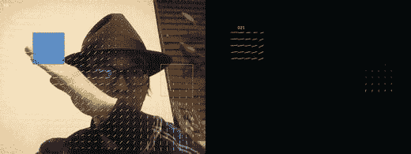

图 6-14。

Virtual hotspots with optical flow interaction

## 运动历史

在光流分析中，注意该函数仅使用两帧来计算流信息。OpenCV 提供了其他函数，可以累积更多的帧来详细分析运动历史。然而，从 3.0 版本开始，这些函数不再是 OpenCV 的标准发行版。它现在分布在 [`https://github.com/opencv/opencv_contrib`](https://github.com/opencv/opencv_contrib) 的`opencv_contrib`库的额外模块中。这就是为什么在第 1 章[中你用额外的模块`optflow`构建了 OpenCV 库。以下是与运动历史相关的功能:](1.html)

*   `calcGlobalOrientation`
*   `calcMotionGradient`
*   `segmentMotion`
*   `updateMotionHistory`

下一个练习`Chapter06_14`，基于`opencv_contrib`分布中的`motempl.cpp`样本。因为它有点复杂，所以您将一步一步地构建它。我将回顾本章前一节中介绍的比较两个连续帧以创建阈值差图像的技术。

```py
// Display threshold difference image.
import processing.video.*;
import org.opencv.core.*;
import org.opencv.imgproc.Imgproc;

final int CNT = 2;
Capture cap;
CVImage img;
Mat [] buf;
Mat silh;
int last;

void setup() {
  size(1280, 480);
  background(0);
  System.loadLibrary(Core.NATIVE_LIBRARY_NAME);
  println(Core.VERSION);
  cap = new Capture(this, width/2, height);
  cap.start();
  img = new CVImage(cap.width, cap.height);
  last = 0;
  // Two frames buffer for comparison
  buf = new Mat[CNT];
  for (int i=0; i<CNT; i++) {
    buf[i] = Mat.zeros(cap.height, cap.width,
      CvType.CV_8UC1);
  }
  // Threshold difference image
  silh = new Mat(cap.height, cap.width, CvType.CV_8UC1,
    Scalar.all(0));
}

void draw() {
  if (!cap.available())
    return;
  background(0);
  cap.read();
  img.copy(cap, 0, 0, cap.width, cap.height,
    0, 0, img.width, img.height);
  img.copyTo();
  Mat grey = img.getGrey();
  grey.copyTo(buf[last]);
  int idx1, idx2;
  idx1 = last;
  idx2 = (last + 1) % buf.length;
  last = idx2;
  silh = buf[idx2];
  // Create the threshold difference image between two frames.
  Core.absdiff(buf[idx1], buf[idx2], silh);
  Imgproc.threshold(silh, silh, 30, 255, Imgproc.THRESH_BINARY);
  CVImage out = new CVImage(cap.width, cap.height);
  out.copyTo(silh);
  image(img, 0, 0);
  image(out, cap.width, 0);
  text(nf(round(frameRate), 2), 10, 20);
  grey.release();
}

```

该程序使用一个名为`buf`的`Mat`数组来维护来自网络摄像头的两个连续帧。基本上，它利用`Core.absdiff()`和`Imgproc.threshold()`函数来计算`draw()`函数中每一帧的阈值差图像。图 [6-15](#Fig15) 显示了一个示例截图。

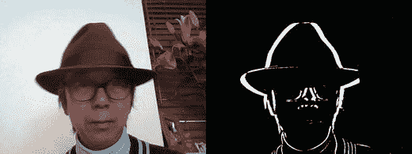

图 6-15。

Threshold difference image

结果就像你在图 [6-6](#Fig6) 中所做的处理。由于阈值差图像仅包含两帧的信息，下一步`Chapter06_15`是累积这些图像中的一些以构建运动历史图像。

```py
// Display motion history image.
import processing.video.*;
import org.opencv.core.*;
import org.opencv.imgproc.Imgproc;
import org.opencv.optflow.Optflow;
import java.lang.System;

final int CNT = 2;
// Motion history duration is 5 seconds.
final double MHI_DURATION = 5;
Capture cap;
CVImage img;
Mat [] buf;
Mat mhi, silh, mask;
int last;
double time0;

void setup() {
  size(1280, 480);
  background(0);
  System.loadLibrary(Core.NATIVE_LIBRARY_NAME);
  println(Core.VERSION);
  cap = new Capture(this, width/2, height);
  cap.start();
  img = new CVImage(cap.width, cap.height);
  last = 0;
  // Maintain two buffer frames.
  buf = new Mat[CNT];
  for (int i=0; i<CNT; i++) {
    buf[i] = Mat.zeros(cap.height, cap.width,
      CvType.CV_8UC1);
  }
  // Initialize the threshold difference image.
  silh = new Mat(cap.height, cap.width, CvType.CV_8UC1,
    Scalar.all(0));
  // Initialize motion history image.
  mhi = Mat.zeros(cap.height, cap.width, CvType.CV_32FC1);
  mask = Mat.zeros(cap.height, cap.width, CvType.CV_8UC1);
  // Store timestamp when program starts to run.
  time0 = System.nanoTime();  
}

void draw() {
  if (!cap.available())
    return;
  background(0);
  cap.read();
  img.copy(cap, 0, 0, cap.width, cap.height,
    0, 0, img.width, img.height);
  img.copyTo();
  Mat grey = img.getGrey();
  grey.copyTo(buf[last]);
  int idx1, idx2;
  idx1 = last;
  idx2 = (last + 1) % buf.length;
  last = idx2;
  silh = buf[idx2];
  // Get current timestamp in seconds.
  double timestamp = (System.nanoTime() - time0)/1e9;
  // Create binary threshold image from two frames.
  Core.absdiff(buf[idx1], buf[idx2], silh);
  Imgproc.threshold(silh, silh, 30, 255, Imgproc.THRESH_BINARY);
  // Update motion history image from the threshold.
  Optflow.updateMotionHistory(silh, mhi, timestamp, MHI_DURATION);
  mhi.convertTo(mask, CvType.CV_8UC1,
    255.0/MHI_DURATION,
    (MHI_DURATION - timestamp)*255.0/MHI_DURATION);
  // Display the greyscale motion history image.
  CVImage out = new CVImage(cap.width, cap.height);
  out.copyTo(mask);
  image(img, 0, 0);
  image(out, cap.width, 0);
  text(nf(round(frameRate), 2), 10, 20);
  grey.release();
}

```

获得剪影的阈值差异图像`silh`后，使用 OpenCV 额外模块`optflow`，通过功能`Optflow.updateMotionHistory()`创建运动历史图像。第一个参数是输入轮廓图像。第二个参数是输出运动历史图像。第三个参数是以秒为单位的当前时间戳。最后一个参数是您想要保持的运动细节的最大持续时间(以秒为单位)，在本例中是 5 秒。运动历史图像`mhi`然后被转换回 8 位，称为`mask`，用于显示。亮的区域是最近的运动，没有更多的运动时会褪成黑色。图 [6-16](#Fig16) 显示了一个示例截图。


图 6-16。

Motion history image

下一步`Chapter06_16`，将进一步分析运动历史图像，找出运动梯度。即像素在帧之间移动的方向。光流模块提供另一个功能`calcMotionGradient()`，计算运动历史图像中每个像素的运动方向。

```py
// Display global motion direction

.
import processing.video.*;
import org.opencv.core.*;
import org.opencv.imgproc.Imgproc;
import org.opencv.optflow.Optflow;
import java.lang.System;

final int CNT = 2;
// Define motion history duration.
final double MHI_DURATION = 5;
final double MAX_TIME_DELTA = 0.5;
final double MIN_TIME_DELTA = 0.05;
Capture cap;
CVImage img;
Mat [] buf;
Mat mhi, mask, orient, silh;
int last;
double time0;

void setup() {
  size(1280, 480);
  background(0);
  System.loadLibrary(Core.NATIVE_LIBRARY_NAME);
  println(Core.VERSION);
  cap = new Capture(this, width/2, height);
  cap.start();
  img = new CVImage(cap.width, cap.height);
  last = 0;
  // Image buffer with two frames.
  buf = new Mat[CNT];
  for (int i=0; i<CNT; i++) {
    buf[i] = Mat.zeros(cap.height, cap.width, CvType.CV_8UC1);
  }
  // Motion history image
  mhi = Mat.zeros(cap.height, cap.width, CvType.CV_32FC1);
  // Threshold difference image
  silh = Mat.zeros(cap.height, cap.width, CvType.CV_8UC1);
  mask = Mat.zeros(cap.height, cap.width, CvType.CV_8UC1);
  orient = Mat.zeros(cap.height, cap.width, CvType.CV_32FC1);
  // Program start time
  time0 = System.nanoTime();
  smooth();
}

void

draw() {
  if (!cap.available())
    return;
  background(0);
  cap.read();
  img.copy(cap, 0, 0, cap.width, cap.height,
    0, 0, img.width, img.height);
  img.copyTo();
  Mat grey = img.getGrey();
  grey.copyTo(buf[last]);
  int idx1, idx2;
  idx1 = last;
  idx2 = (last + 1) % buf.length;
  last = idx2;
  silh = buf[idx2];
  // Get current time in seconds.
  double timestamp = (System.nanoTime() - time0)/1e9;
  // Compute difference with threshold.
  Core.absdiff(buf[idx1], buf[idx2], silh);
  Imgproc.threshold(silh, silh, 30, 255, Imgproc.THRESH_BINARY);
  // Update motion history image.
  Optflow.updateMotionHistory(silh, mhi, timestamp, MHI_DURATION);
  mhi.convertTo(mask, CvType.CV_8UC1,
    255.0/MHI_DURATION,
    (MHI_DURATION - timestamp)*255.0/MHI_DURATION);
  // Display motion history image in 8bit greyscale.
  CVImage out = new CVImage(cap.width, cap.height);
  out.copyTo(mask);
  image(img, 0, 0);
  image(out, cap.width, 0);
  // Compute overall motion gradient.
  Optflow.calcMotionGradient(mhi, mask, orient,
    MAX_TIME_DELTA, MIN_TIME_DELTA, 3);
  // Calculate motion direction of whole frame.
  double angle = Optflow.calcGlobalOrientation(orient, mask,
    mhi, timestamp, MHI_DURATION);
  // Skip cases with too little motion.
  double count = Core.norm(silh, Core.NORM_L1);
  if (count > (cap.width*cap.height*0.1)) {
    pushStyle();
    noFill();
    stroke(255, 0, 0);
    float radius = min(cap.width, cap.height)/2.0;
    ellipse(cap.width/2+cap.width, cap.height/2, radius*2, radius*2);
    stroke(0, 0, 255);
    // Draw the main direction of motion.
    line(cap.width/2+cap.width, cap.height/2,
      cap.width/2+cap.width+radius*cos(radians((float)angle)),
      cap.height/2+radius*sin(radians((float)angle)));
    popStyle();
  }
  fill(0);
  text(nf(round(frameRate), 2), 10, 20);
  grey.release();
}

```

在`draw()`函数中，该语句获取运动历史图像`mhi`，并产生两个输出图像。

```py
Optflow.calcMotionGradient(mhi, mask, orient, MAX_TIME_DELTA, MIN_TIME_DELTA, 3);

```

第一个，`mask`，指示哪些像素具有有效的运动梯度信息。第二个是`orient`，显示每个像素的运动方向角，单位为度。注意，名为`mask`的输出`Mat`将覆盖前面步骤中的原始内容。下一条语句根据上一条语句的结果计算平均运动方向:

```py
double angle = Optflow.calcGlobalOrientation(orient, mask, mhi, timestamp, MHI_DURATION);

```

它将返回以度为单位的运动角度，值从 0 到 360。当屏幕上运动太少时，程序也会跳过这些情况。最后，程序会画一个大圆，并从圆心向检测到的运动方向画一条直线。图 [6-17](#Fig17) 显示了一个带有指向运动方向的蓝线的示例截图。


图 6-17。

Global motion direction

一旦你有了全局运动方向，你就可以用它来进行手势交互。下一个练习`Chapter06_17`演示了从变量`angle`获得的运动方向的简单用法:

```py
// Gestural interaction demo
import processing.video.*;
import org.opencv.core.*;
import org.opencv.imgproc.Imgproc;
import org.opencv.optflow.Optflow;
import java.lang.System;

final int CNT = 2;
// Define motion history duration.
final double MHI_DURATION = 3;
final double MAX_TIME_DELTA = 0.5;
final double MIN_TIME_DELTA = 0.05;
Capture cap;
CVImage img;
Mat [] buf;
Mat mhi, mask, orient, silh;
int last;
double time0;
float rot, vel, drag;

void setup() {
  // Three dimensional scene
  size(640, 480, P3D);
  background(0);
  // Disable depth test.
  hint(DISABLE_DEPTH_TEST);
  System.loadLibrary(Core.NATIVE_LIBRARY_NAME);
  println(Core.VERSION);
  cap = new Capture(this, width, height);
  cap.start();
  img = new CVImage(cap.width, cap.height);
  last = 0;
  // Image buffer with two frames.
  buf = new Mat[CNT];
  for (int i=0; i<CNT; i++) {
    buf[i] = Mat.zeros(cap.height, cap.width, CvType.CV_8UC1);
  }
  // Motion

history image
  mhi = Mat.zeros(cap.height, cap.width, CvType.CV_32FC1);
  // Threshold difference image
  silh = Mat.zeros(cap.height, cap.width, CvType.CV_8UC1);
  mask = Mat.zeros(cap.height, cap.width, CvType.CV_8UC1);
  orient = Mat.zeros(cap.height, cap.width, CvType.CV_32FC1);
  // Program start time
  time0 = System.nanoTime();
  smooth();
  // Rotation of the cube in Y direction
  rot = 0;
  // Rotation velocity
  vel = 0;
  // Damping force
  drag = 0.9;
}

void draw() {
  if (!cap.available())
    return;
  background(0);
  cap.read();
  img.copy(cap, 0, 0, cap.width, cap.height,
    0, 0, img.width, img.height);
  img.copyTo();
  Mat grey = img.getGrey();
  grey.copyTo(buf[last]);
  int idx1, idx2;
  idx1 = last;
  idx2 = (last + 1) % buf.length;
  last = idx2;
  silh = buf[idx2];
  // Get current time in seconds.
  double timestamp = (System.nanoTime() - time0)/1e9;
  // Compute difference with threshold.
  Core.absdiff(buf[idx1], buf[idx2], silh);
  Imgproc.threshold(silh, silh, 30, 255, Imgproc.THRESH_BINARY);
  // Update motion history image.
  Optflow.updateMotionHistory(silh, mhi, timestamp, MHI_DURATION);
  mhi.convertTo(mask, CvType.CV_8UC1,
    255.0/MHI_DURATION,
    (MHI_DURATION - timestamp)*255.0/MHI_DURATION);
  // Display motion history image in 8bit greyscale.
  CVImage out = new CVImage(cap.width, cap.height);
  out.copyTo(mask);
  image(img, 0, 0);
  // Compute overall motion gradient.
  Optflow.calcMotionGradient(mhi, mask, orient,
    MAX_TIME_DELTA, MIN_TIME_DELTA, 3);
  // Calculate motion direction of whole frame.
  double angle = Optflow.calcGlobalOrientation(orient, mask,
    mhi, timestamp, MHI_DURATION);
  // Skip cases with too little motion.
  double count = Core.norm(silh, Core.NORM_L1);
  if (count > (cap.width*cap.height*0.1)) {
    // Moving to the right
    if (angle < 10 || (360 - angle) < 10) {
      vel -= 0.02;
      // Moving to the left
    } else if (abs((float)angle-180) < 20) {
      vel += 0.02;
    }
  }
  // Slow down the velocity

  vel *= drag;
  // Update the rotation angle
  rot += vel;
  fill(0);
  text(nf(round(frameRate), 2), 10, 20);
  // Draw the cube.
  pushMatrix();
  pushStyle();
  fill(255, 80);
  stroke(255);
  translate(cap.width/2, cap.height/2, 0);
  rotateY(rot);
  box(200);
  popStyle();
  popMatrix();
  grey.release();
}

```

程序的结构保持不变。您可以在屏幕中央添加一个带有半透明立方体的 3D 场景。当你在摄像头前水平移动时，你沿着 y 轴旋转立方体。你把这个运动当作一个加速力来改变旋转的速度。图 [6-18](#Fig18) 为程序截图。


图 6-18。

Gestural interaction with motion direction

除了检索全局运动方向之外，您还可以分割运动梯度图像以识别各个运动区域。下一个练习`Chapter06_18`将展示如何使用函数`segmentMotion()`将整体运动信息分割成单独的区域:

```py
// Motion history with motion segment
import processing.video.*;
import org.opencv.core.*;
import org.opencv.imgproc.Imgproc;
import org.opencv.optflow.Optflow;
import java.lang.System;
import java.util.ArrayList;

final int CNT = 2;
// Minimum region area to display
final float MIN_AREA = 300;
// Motion history duration
final double MHI_DURATION = 3;
final double MAX_TIME_DELTA = 0.5;
final double MIN_TIME_DELTA = 0.05;

Capture cap;
CVImage img;
Mat [] buf;
Mat mhi, mask, orient, segMask, silh;
int last;
double time0, timestamp;

void

setup() {
  size(1280, 480);
  background(0);
  System.loadLibrary(Core.NATIVE_LIBRARY_NAME);
  println(Core.VERSION);
  cap = new Capture(this, width/2, height);
  cap.start();
  img = new CVImage(cap.width, cap.height);
  last = 0;
  buf = new Mat[CNT];
  for (int i=0; i<CNT; i++) {
    buf[i] = Mat.zeros(cap.height, cap.width, CvType.CV_8UC1);
  }
  // Motion history image
  mhi = Mat.zeros(cap.height, cap.width, CvType.CV_32FC1);
  mask = Mat.zeros(cap.height, cap.width, CvType.CV_8UC1);
  orient = Mat.zeros(cap.height, cap.width, CvType.CV_32FC1);
  segMask = Mat.zeros(cap.height, cap.width, CvType.CV_32FC1);
  // Threshold difference image
  silh = Mat.zeros(cap.height, cap.width, CvType.CV_8UC1);
  // Program start time
  time0 = System.nanoTime();
  timestamp = 0;
  smooth();
}

void draw() {
  if (!cap.available())
    return;
  background(0);
  cap.read();
  img.copy(cap, 0, 0, cap.width, cap.height,
    0, 0, img.width, img.height);
  img.copyTo();
  Mat grey = img.getGrey();
  grey.copyTo(buf[last]);
  int idx1, idx2;
  idx1 = last;
  idx2 = (last + 1) % buf.length;
  last = idx2;
  silh = buf[idx2];
  double timestamp = (System.nanoTime() - time0)/1e9;
  // Create threshold difference image.
  Core.absdiff(buf[idx1], buf[idx2], silh);
  Imgproc.threshold(silh, silh, 30, 255, Imgproc.THRESH_BINARY);
  // Update motion history image.
  Optflow.updateMotionHistory(silh, mhi, timestamp, MHI_DURATION);
  // Convert motion

history to 8bit image.
  mhi.convertTo(mask, CvType.CV_8UC1,
    255.0/MHI_DURATION,
    (MHI_DURATION - timestamp)*255.0/MHI_DURATION);
  // Display motion history image in greyscale.
  CVImage out = new CVImage(cap.width, cap.height);
  out.copyTo(mask);
  // Calculate overall motion gradient.
  Optflow.calcMotionGradient(mhi, mask, orient,
    MAX_TIME_DELTA, MIN_TIME_DELTA, 3);
  // Segment general motion into different regions.
  MatOfRect regions = new MatOfRect();
  Optflow.segmentMotion(mhi, segMask, regions,
    timestamp, MAX_TIME_DELTA);
  image(img, 0, 0);
  image(out, cap.width, 0);
  // Plot individual motion areas.
  plotMotion(regions.toArray());
  pushStyle();
  fill(0);
  text(nf(round(frameRate), 2), 10, 20);
  popStyle();
  grey.release();
  regions.release();
}

void plotMotion(Rect [] rs) {
  pushStyle();
  fill(0, 0, 255, 80);
  stroke(255, 255, 0);
  for (Rect r : rs) {
    // Skip regions of small area.
    float area = r.width*r.height;
    if (area < MIN_AREA)
      continue;
    // Obtain submatrices from motion images.
    Mat silh_roi = silh.submat(r);
    Mat mhi_roi = mhi.submat(r);
    Mat orient_roi = orient.submat(r);
    Mat mask_roi = mask.submat(r);
    // Calculate motion direction of that region.
    double angle = Optflow.calcGlobalOrientation(orient_roi,
      mask_roi, mhi_roi, timestamp, MHI_DURATION);
    // Skip regions with little motion.
    double count = Core.norm(silh_roi, Core.NORM_L1);
    if (count < (r.width*r.height*0.05))
      continue;
    PVector center = new PVector(r.x + r.width/2,
      r.y + r.height/2);
    float radius = min(r.width, r.height)/2.0;
    ellipse(center.x, center.y, radius*2, radius*2);
    line(center.x, center.y,
      center.x+radius*cos(radians((float)angle)),
      center.y+radius*sin(radians((float)angle)));
    silh_roi.release();
    mhi_roi.release();
    orient_roi.release();
    mask_roi.release();
  }
  popStyle();
}

```

完成计算运动梯度图像的语句后，使用以下语句分割运动信息:

```py
Optflow.segmentMotion(mhi, segMask, regions, timestamp, MAX_TIME_DELTA);

```

主要输入是运动历史图像`mhi`。在这种情况下，您没有段掩码。第二个参数`segMask`只是一个空图像。操作的结果将存储在`MatOfRect`变量`regions`中。你写了函数`plotMotion()`来遍历从`regions`开始的每一个`Rect`。在函数中，它会跳过面积太小而无法使用的区域。您使用相同的`calcGlobalOrientation()`功能找出运动方向。唯一的区别是您使用子矩阵作为每个图像`mhi`、`orient`和`mask`的感兴趣区域。其余部分与您在练习`Chapter06_16`中所做的相同。图 [6-19](#Fig19) 显示了一个示例截图以供参考。


图 6-19。

Segment motion demonstration

图像左侧的每个圆圈是运动片段区域。圆的大小由区域的宽度和高度的较短边来定义。圆内的直线从圆心指向运动方向。

## 结论

在本章中，您研究了如何创造性地使用运动来生成视觉效果。此外，您还学习了如何从一系列帧中识别运动，以及如何将这些信息用于手势交互的界面设计。在下一章中，您将继续学习运动，首先识别感兴趣的点，然后跨图像帧跟踪它们以了解更多关于运动的信息。