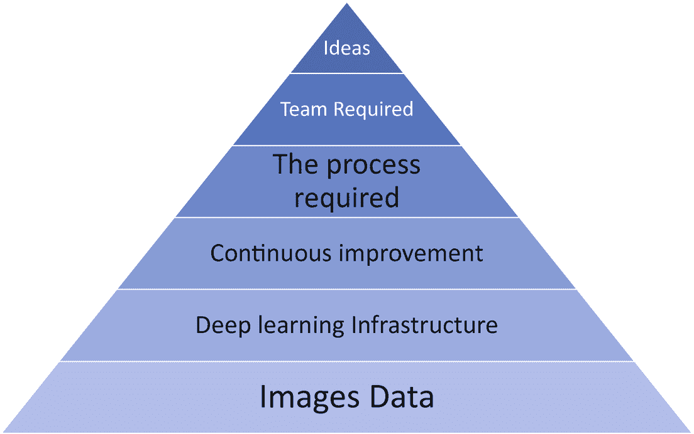
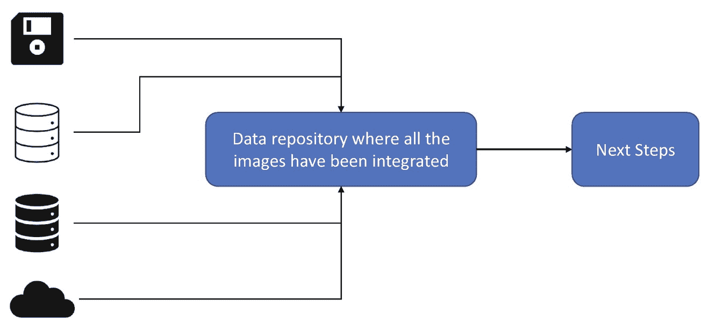
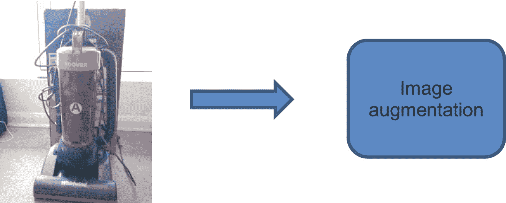
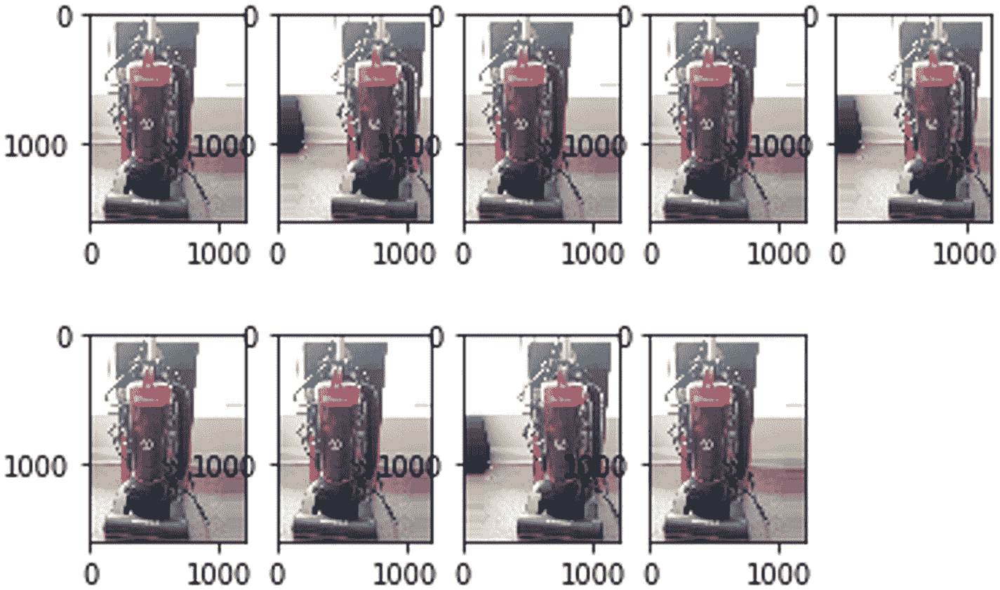
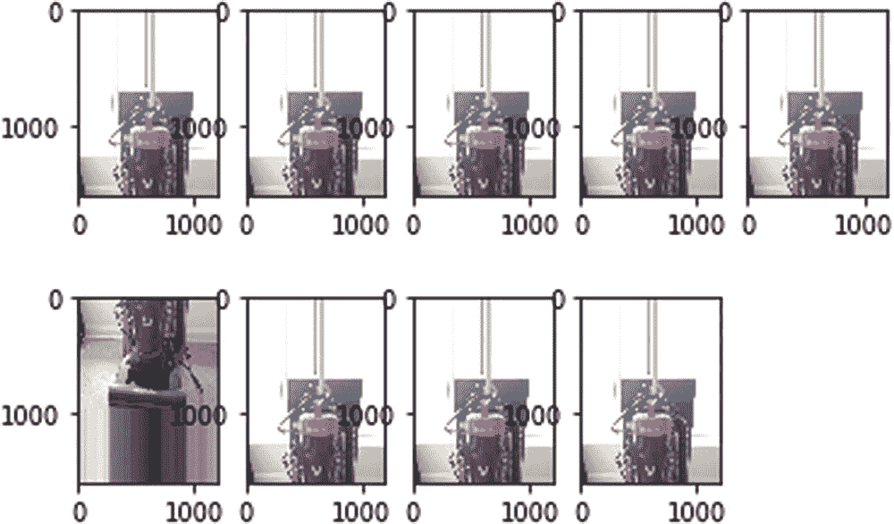
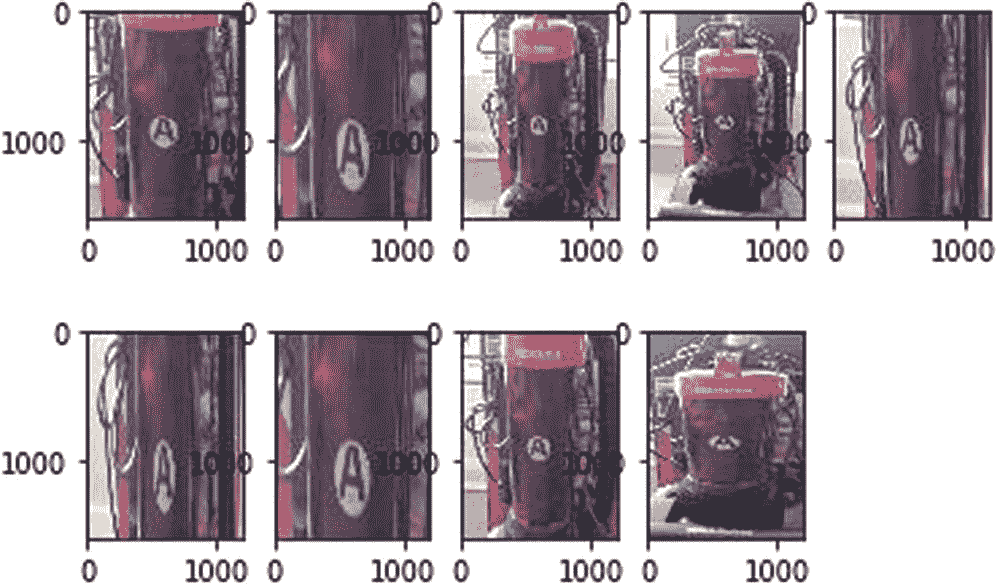
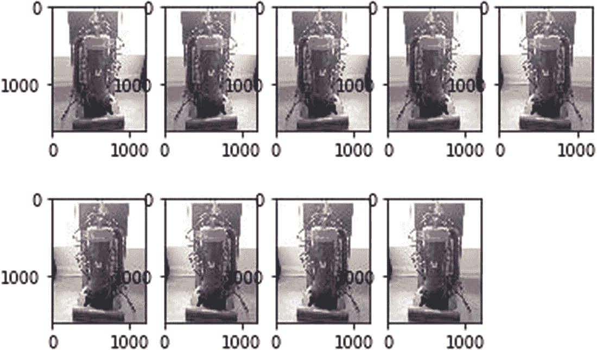
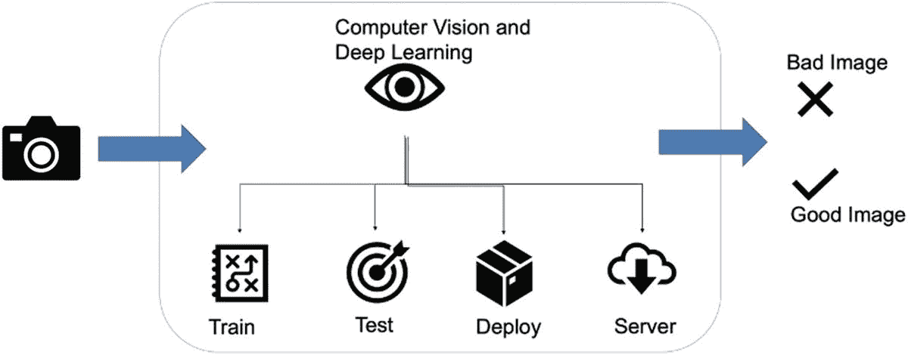

# 8.端到端模型开发

有时候，正是旅程教会了你很多关于目的地的事情。—德雷克号

深度学习是一个漫长而乏味的旅程。这需要练习和持续的严谨。通往成功的道路需要精心的计划、奉献、不断的练习和耐心。在这个旅程中，你已经迈出了第一步。

我们从计算机视觉的核心概念开始这本书。我们使用 OpenCV 开发了解决方案。然后我们探讨了卷积神经网络的概念——各种层、功能和各自的输出。

在本书中，我们已经讨论了多种网络架构。在这个过程中，我们讨论了它们各自的组件、技术细节、优缺点以及后续的改进。我们还解决了二进制图像分类、多类图像分类、对象检测、人脸检测和识别以及视频分析的用例。在本书的最后一章，我们将探索端到端的模型开发周期，包括部署、最佳实践、常见陷阱和面临的挑战。我们还将深入研究项目的需求，并更详细地考察迁移学习的概念。我们将对各种架构的性能进行比较和基准测试。最后，我们将为您讨论接下来的步骤。

在本书的最后一章，我们将讨论以下主题:

1.  深度学习项目需求

2.  端到端模型开发流程

3.  图像放大

4.  常见错误和最佳实践

5.  模型部署和维护

欢迎来到第八章也是最后一章，祝一切顺利！

## 8.1 技术要求

本章的代码和数据集上传到本书的 GitHub 链接 [`https://github.com/Apress/computer-vision-using-deep-learning/tree/main/Chapter8`](https://github.com/Apress/computer-vision-using-deep-learning/tree/main/Chapter8) 。对于这一章，GPU 足以执行代码，你可以使用谷歌合作实验室。我们将使用 Python Jupyter 笔记本。

让我们从深度学习项目中的需求着手。

## 8.2 深度学习项目要求

像任何其他项目一样，基于深度学习的项目也意味着拥有一个成功项目的所有组件。我们正在描述一个图像项目的组成部分，如图 [8-1](#Fig1) 所示。



图 8-1

深度学习计算机视觉项目需要以下组件进行开发和执行。它类似于任何其他项目过程

一个成功的深度学习项目的显著组成部分是

1.  构思或想法指的是持续的头脑风暴，这是深度学习项目成功所必需的。构思过程确保在项目过程中遇到问题时，有一系列可靠的想法和解决方案。需要商业知识和深度学习/机器学习专业知识的良好组合。除了提到的两个角色之外，还需要其他角色，这是下一点——团队结构。

2.  机器学习项目所需的团队需要混合业务主题专家、具有技术敏锐度的专业人员、数据工程团队、软件工程团队、项目经理和 IT 团队。
    1.  主题专家确保项目在实现商业目标的成功道路上。

    2.  数据科学团队负责开发算法。

    3.  项目经理或 scrum masters 管理整个项目。

    4.  软件工程团队允许正确部署模型和创建解决方案所需的接口。

    5.  要求数据工程团队创建传输和保存图像的管道；为了有效的数据管理，需要一个强大的数据工程团队。

    6.  IT 团队确保为整个界面和解决方案建立适当的基础设施。

3.  一个强大而具体的流程确保没有任何步骤被忽略，我们正在为项目的成功做准备。深度学习项目的过程将在下一节详细讨论。

4.  持续改进是反馈和监控的产物。一旦算法被部署到生产系统中，我们应该不断地监控性能，并通过反馈机制来提高性能。监控还可确保在解决方案低于所需准确度阈值的情况下，对解决方案进行检查和改进。我们将在随后的章节中学习更多关于模型维护的内容。

5.  深度学习基础设施是该项目的支柱。如果没有好的机器、处理器、GPU、存储等等，训练一个健壮的基于深度学习的解决方案就变得非常困难，有时甚至是不可能的。在我们具有 4GB 或 8GB RAM 和标准处理器的标准笔记本电脑和台式机中，不可能使用神经网络和对 50，000 幅图像的训练来训练计算机视觉模型。因此，目前需要一个健壮的基础设施。像 Azure 或 Google Cloud 或 Amazon Web Services 这样的云服务提供了可用于此目的的虚拟机，但当然是有成本的。我们在后续章节中建议深度学习项目所需的健壮硬件。

    **注意**感谢谷歌，我们可以免费使用谷歌 Colab。但是 Google Colab 不是永久的解决方案，不应该用于敏感数据集。此外，作为一个免费版本，它并不能确保我们可以使用机器的所有功能。参考资料中提供了 Google Colab 设置。

6.  数据集是训练算法、测量性能和监控未来进展所需的原始材料。需要有效的数据管理来确保所有的图像都被仔细地捕获和保存，训练数据被有效地使用和存储用于审计目的，并且在其上进行预测的不可见的和新的数据集被存储用于将来参考。需要具体的数据管理流程来确保项目取得成功。我们将在下一节中再次检查这一步。

深度学习项目是不同团队和技能组合的有趣结合。算法是解决方案的核心，但算法也需要彻底的测试和部署。主题专家(SME)确保算法能够公正地处理手头的业务问题。简而言之，一个完美的团队是解决方案在现实世界中有效工作所必需的。

我们现在要详细研究整个项目过程，这是下一部分。

## 8.3 深度学习项目流程

像任何其他项目一样，基于深度学习的项目也是为了解决业务问题。像任何其他项目一样，它们需要被部署到生产中。在这一部分，我们将讨论深度学习项目过程中的突出步骤。

深度学习项目的第一步是定义业务问题。整个过程如图 [8-2](#Fig2) 所示。


图 8-2

深度学习项目的各个阶段。它从定义一个健壮的业务问题开始，然后是处理数据、建模和维护

我们将讨论模型构建过程中的每个步骤。在下一节中，我们将首先探索业务问题的定义。

## 8.4 业务问题定义

业务问题定义是项目的核心需求。通常，业务问题没有被清楚地定义，也没有正确地确定范围。在整个项目持续期间都有范围蔓延、滞后和延迟。有时，观察到预期的输出和实际的结果不符合，这在团队之间产生了摩擦，并且在许多情况下整个项目不得不报废。

定义业务问题时面临的常见挑战有

1.  模糊不清的商业问题令人讨厌。例如，“我们必须增加收入。”这个商业问题没有逻辑意义，可以重新架构。

2.  有时，业务目标非常雄心勃勃。例如，“我们必须在接下来的 1 周内将成本降低 80%。”在上述时间框架内实现目标可能不可行。这样的问题必须得到改善。

3.  据观察，很多时候缺乏与业务问题相关的适当的 KPI(关键性能指标)。例如，“我们必须增加收入”是一个非常宽泛的说法。没有任何可测量的标准，很难衡量解决方案的性能。

因此，定义一个好的业务问题是至关重要的。我们正在定义一个好的业务问题的几个组成部分:

1.  简洁明了:一个好的商业问题集中在目标上。例如，“企业希望组织的考勤系统自动化。为此，需要建立一个自动人脸识别系统。”这个问题仍然有更多的组成部分，但是这里明确定义了业务问题。

2.  可度量的:业务问题可以使用 KPI 来度量。如果没有这一衡量标准，将很难衡量系统的实际性能以及解决方案中的误差。为了提高系统的性能，必须有一个 KPI，该 KPI 必须被优化以实现最佳结果。例如，在前面的例子中，我们可以将问题扩展为“企业希望将组织的考勤系统自动化。为此，需要创建一个自动人脸识别系统。该系统的预期准确率为 95%，错误接受率小于 0.01%。”

3.  可实现的:一个好的商业问题是可实现的，并且实际上是可能的。它应该足够实用，以便概念化和实现。例如，在前面的人脸检测示例中，期望 100%的准确率和 0%的错误接受率并不是一个好主意。然而，有一些领域，如用于癌症检测的医学成像，需要非常高的准确率，但达到 100%准确率的完美分数可能是无法实现的。

4.  可维护性:前瞻性的业务问题计划解决方案的未来状态。对结果的监控、算法的维护、刷新周期和后续步骤是更大范围的业务问题的一部分。

拥有一个定义良好的业务问题会导致一个管理良好的开发过程，并最终产生一个富有成效的解决方案。同时，让业务涉众成为讨论和流程的一部分也是非常必要的。他们当然可以通过传授 SME(主题专家)知识来纠正解决方案。

让我们通过计算机视觉领域的两个例子来检查业务问题的定义。

### 8.4.1 用于监控的人脸检测

假设我们有一家零售店。可以按照下面的讨论来识别业务问题。

“有必要改进商场中监控较少的区域的安全系统。零售商需要持续监控这些区域，并检测商店中的入店行窃或任何反社会行为。目前的监控流程大部分是手动的。同时还要求对顾客的面部进行检测，并与禁止进店人员数据库进行匹配，以便店家采取相应措施。”

在这样的业务用例中，业务目标是

1.  持续监控商场中监控较少的区域

2.  发现商场内任何不合群的活动

3.  发现并识别商场当局不允许进入商场的人员

为了进一步完成问题陈述，应确定与检测准确性和错误接受/拒绝率相关的 KPI。在前面的业务问题中:

*   真正肯定:正确地将商店中的人员分类为允许进入商店的“可接受”人员。

*   正确否定:正确地将商店中的人归类为不允许进入商店的“不可接受”的人。

*   误报:错误地将商店中的人员分类为“可接受的”,而这些人员不应该被允许进入商店。

*   错误否定:错误地将商店中的人归类为“不可接受”的人，而这些人应该被允许进入商店。

因此，在前面的业务案例中，根据 KPI，我们将优化解决方案。

我们现在将讨论使用深度学习的计算机视觉的第二个商业用例。

#### 制造业的 8.4.1.1 缺陷检测

假设我们有一个手机制造部门。它在不同的生产线上生产手机。在制造过程中，可能会有外来颗粒进入移动室，如细绳、头发、塑料片、碎片等外来颗粒。尺寸可以非常小，比如 200 微米、300 微米等等。可以按照下面的讨论来识别业务问题。

制造厂希望检测移动室内任何外来物质的存在。需要检测各种类型的异物，如绳子、头发、塑料片、碎片，这些异物可能具有不同的尺寸并位于不同的位置。一台摄像机被放置在生产线的顶部，它可以点击每一个进来的产品的图像。实时地，基于深度学习的网络将检测外来颗粒的存在，并接受或拒绝产品。”

在这样的业务用例中，业务目标是

1.  持续监控实时生产的产品图像

2.  检测产品中是否存在任何异物

为了进一步完成问题陈述，应确定与检测准确性和错误接受/拒绝率相关的 KPI。在前面的业务问题中:

*   真阳性:将产品正确分类为不含任何异物的合格产品

*   正确否:正确地将含有异物的产品归类为不良产品

*   假阳性:错误地接受含有异物的产品

*   假阴性:错误剔除不含异物的产品

因此，在前面的业务案例中，根据 KPI，我们将优化解决方案。

一旦业务问题定义最终确定，我们就进入探索性数据分析、模型构建等下一步(图 [8-2](#Fig2) )。我们将在图 [8-3](#Fig3) 中更详细地描述这些步骤。


图 8-3

深度学习建模过程的详细步骤。在每一步，我们处理图像的各种属性，并创建一个健壮的网络。完成这个项目需要大量的团队合作和专业知识

业务问题定义为我们设定了目标。这意味着我们已经准备好处理数据集，然后开始训练。下一步是我们接下来要讨论的数据发现阶段。

### 8.4.2 源数据或数据发现阶段

一旦我们完成了冻结业务问题、确定业务问题范围、定义 KPI 和性能测量参数的第一步，我们就可以进入数据发现阶段。

在这个阶段，我们主要搜寻数据，或者在计算机视觉的情况下，我们寻找图像。让我们通过在业务问题定义步骤中讨论的相同示例案例来理解。

#### 用于识别的 8.4.2.1 人脸检测

业务问题是“识别显示在摄像机前的人脸，如果它与员工数据库匹配，则将出勤标记为出席。”

在这样的用例中，原始数据将是雇员面部的图像。这些图像必须从不同的角度拍摄，并且尽可能清晰。如果我们要求员工自己点击图片并与团队分享，那么就存在长宽比、尺寸、背景照明、亮度等方面的危险。此外，不同的员工会使用不同的模式点击图片，因此产生的原始数据可能会有很大不同。因此，在这种情况下，建议在相似的环境中拍摄每张图像，以保持一致性。优选地，可以设置照相机，其中每个雇员都可以来点击他们的照片。

但是这种安排并不是训练网络的要求。该网络可以在不同大小和类型的人脸上进行训练。所建议的方法的优点可以是在训练算法时提高精度和计算优势。网络可以在没有这种安排的情况下被训练。

在这个用例中，我们将捕获人脸的原始图像来训练网络。我们已经在第 [6](6.html) 章研究了各种人脸检测网络。必须保存这些培训图像，以供将来参考和审计跟踪。我们已经在上一节的数据管理流程中详细讨论了培训数据管理流程。我们将在后续部分中讨论优化的训练数据的属性。

我们现在来看下一个案例，生产线上的实时监控。

#### 生产线上的 8.4.2.2 生活环境

业务问题是“在现场环境中分析移动电话制造厂制造的图像，并评估产品中是否存在异物。”

对于这个业务用例，我们将搜索历史数据来训练网络。训练数据将由没有异物的产品的好例子和其中存在异物颗粒的坏例子组成。图像数据集必须完整，并且可以包括许多历史图像。这是一种可能性，我们没有得到大量的坏图像；因此，这些图像可能需要手动创建。有人建议，我们可以有一个摄像头来点击图像，这将提供原始图像。但是这些原始图像必须被人工分为好的和坏的类别，这样它们才能被输入网络进行训练。

图像必须具有足够的代表性，并应包含所有可能的变化。我们将在下一节中讨论更多关于图像质量的内容，并且还将检查优化的训练数据的属性。

我们现在进入下一阶段，即数据接收或数据管理。

## 8.5 数据接收或数据管理

需要进行数据管理，以确保我们有一个有效的平台来保存我们的图像，并使用它们来训练算法。它还确保保存所有监控数据集以供将来参考。未来的改进需要算法进行预测的新的和看不见的数据集。

合适的数据管理平台具有以下属性:

1.  在数据发现阶段，我们已经确定了我们希望使用的所有数据源。在数据管理阶段，我们首先确定我们在最后阶段列出的所有来源。

2.  然后整合所有的图像源，以确保我们在同一个平台上拥有所有的工件。数据源可以是离线的，也可以是在线的，可以被管理，有时也可以手动创建。在一段时间内保存并分析来自多个来源的图像。它还包括获取最新的图像。
    1.  对于人脸检测问题，数据集包括过去几个月捕获的历史人脸数据集。对于生产线缺陷检测系统，它可以是来自多条生产线和多个月的历史数据集。

    2.  For face detection, it might include the images captured recently, and for manufacturing detection problem, it will include the live images being captured in the live environment.

        

        图 8-4

        数据存储库，其中可以集成来自多个来源的所有图像以供将来使用

1.  所有数据点随后被加载到一个存储库中(图 [8-4](#Fig4) )。该存储库将被算法访问以训练网络。存储库可以是内部托管的独立服务器，也可以是使用 Azure、Google Cloud、AWS 等基于云的解决方案。理想情况下，这个存储库应该是可扩展的，并且可以在需要时扩展以保存更多的图像。

2.  数据管理需要强大的数据工程技能和 IT 团队的参与。数据工程团队设置了将图像从实时环境传输到存储库的管道，允许将历史图像保存在同一存储库中，并确保系统受到定期监控且保持完整。

一旦数据管理就绪，我们就有了可用于分析的图像。现在，下一步是分析可用的工件，并创建可用于训练算法的最终训练数据集，这是我们将要讨论的下一步。

## 8.6 数据准备和扩充

一旦我们准备好数据并存储在一个公共平台上，我们就开始对数据进行初步分析。我们查看大小、纵横比等图像参数。与结构化数据集相比，对于图像，大量的 EDA(探索性数据分析)是不可能的。但是，我们仍然对图像质量进行了健全性检查。

对于我们在服务器上保存和加载的图像，我们分析我们必须分类的不同类型的类，相对于每个类可用的例子的数量。

Note

“垃圾进，垃圾出”这句老话是对的。如果训练数据集有偏差，结果将不会是具体的。

为了有一个稳健的模型，我们需要有一个完整的、具体的、没有偏见的代表性数据集。一个好的训练数据集的一些属性是

1.  数据集应该涵盖将要使用该解决方案的每个接口的参与情况。例如，在前面讨论的制造缺陷的情况下，如果十条生产线将要使用它们，我们应该有来自所有十条生产线的数据以确保代表性。否则，有可能该解决方案在大多数线上工作良好，但在那些在训练数据集中没有足够表示的线上工作不良。

2.  数据集应该有足够的好的和坏的图像的例子。在理想的情况下，我们会有一个平等的代表，但在现实世界中，我们可能得不到足够的例子。因此，当务之急是我们集中精力收集一个强大的和有代表性的数据集。

    **注意**尽管对于好的和坏的训练数据集没有完美的推荐比例，为了避免偏差，每个类在最终的训练数据集中应该至少有 10%的代表性。

3.  如果存在基于时间的依赖性的元素，则训练数据集应该具有足够的遵守时间因素的示例。例如，在制造缺陷问题中，我们可能希望将一周中不同班次和不同日期的数据包含到训练数据中。

4.  图像的质量对模型的最终准确性起着至关重要的作用。我们确保包含清晰、不模糊或朦胧的图像。很多时候，我们没有一个大的数据集，我们需要进一步扩充图像，这将在下一节中讨论。

5.  这一步的输出应该是我们希望用来训练算法的已配置的训练数据集。

图像增强是一个至关重要的步骤，它允许我们确保我们有足够的训练样本来训练算法，这是我们现在正在讨论的。

### 8.6.1 图片增加

一旦我们收集了图像，很多时候我们没有足够大的数据集来训练算法。它还允许我们向网络添加泛化能力，并防止它过拟合。对于神经网络，我们需要越来越多的数据，图像增强可以通过创建图像版本来帮助人工增加训练数据集。它增强了模型的能力，因为增强图像与原始训练数据集一起提供了不同的变化。

我们可以转换数据，或者换句话说，使用缩放、移位、翻转、旋转、镜像、裁剪和各种其他方法来处理图像。

但是我们也必须小心，因为我们应该只执行我们在现实世界中可以预期的变化。例如，如果我们希望创建一个人脸检测系统，我们不太可能得到 180 度角的人脸，因此我们可以避免这样的旋转。因此，基于手头的业务问题，我们应该选择增强技术。

Keras 深度学习库提供了一种强大的机制来扩充数据集。有一个 ImageDataGenerator 可用于数据扩充。我们现在正在创建解决方案。

我们将使用图 [8-5](#Fig5) 中的照片进行放大。



图 8-5

我们将对这个真空吸尘器的图像进行放大处理

步骤 1:首先导入所有的库。

```py
from numpy import expand_dims
from keras.preprocessing.image import load_img
from keras.preprocessing.image import img_to_array
from keras.preprocessing.image import ImageDataGenerator
from matplotlib import pyplot

```

步骤 2:现在加载图像。

```py
sample_image = load_img('Hoover.jpg')

```

步骤 3:将图像转换为 numpy 数组，并将维数扩展为一个样本。

```py
imageData = img_to_array(sample_image)
samples = expand_dims(imageData, 0)

```

步骤 4:现在创建图像数据生成器。这里，我们正在处理宽度移动属性。

```py
dataGenerator = ImageDataGenerator(width_shift_range=[-150,150])

```

步骤 5:准备迭代器，然后生成图。

```py
dataIterator = dataGenerator.flow(samples, batch_size=1)
for i in range(9):
    pyplot.subplot(250 + 1 + i)
    batch = dataIterator.next()
    image = batch[0].astype('uint8')
    pyplot.imshow(image)
pyplot.show()

```

输出是



我们使用不同的图像生成器，得到不同的结果。在下一个增强版本中，我们将会改变高度。

```py
dataGenerator = ImageDataGenerator(height_shift_range=[-0.4])

```



接下来，我们在不同的级别缩放图像。

```py
dataGenerator = ImageDataGenerator(zoom_range=[0.15,0.9])

```



图像现在已旋转。

```py
dataGenerator = ImageDataGenerator(rotation_range=60)

```


使用不同的亮度值来增强图像。

```py
dataGenerator = ImageDataGenerator(brightness_range=[0.15,0.9])

```


```py
dataGenerator = ImageDataGenerator(horizontal_flip=True)

```



在前面的例子中，我们使用了同一个图像的不同版本。我们不需要单独创建这些版本并保存在我们的数据库中。保存在数据库中会导致巨大的存储空间投资。因此，当我们训练网络本身时，这些增强可以在网络本身内完成。

总之，图像增强帮助我们扩展训练数据集并增强模型的性能。我们可以移动、翻转、裁剪和缩放图像，以创建原始训练图像的更多版本。

一旦我们完成了训练数据集的配置，下一步将从我们现在讨论的数据建模开始。

## 8.7 深度学习建模流程

我们现在可以从建模开始。我们将以生产线上的缺陷检测为例，作为样本用例。我们很清楚训练和测试算法的过程。下文描述了主要步骤，如图 [8-6](#Fig6) 所示。



图 8-6

训练、测试和部署模型是深度学习解决方案的组成部分。它通常需要一个服务器设置来将模型投入生产

正如我们所观察到的，第一步是在我们创建的数据集上训练算法。第一步中的原始数据按 80:20 或 70:30 的比例分为训练和测试。训练数据用于训练算法，而测试数据作为一个看不见的数据集，用于检查模型在看不见的数据集上的性能。大多数时候，我们迭代并创建算法的多个版本。我们根据测试数据的性能挑选最佳模型。

一些思想流派还建议使用 60:20:20 比例的训练、测试和验证分区。这里，训练数据集用于训练算法，测试数据用于检查在看不见的数据集上的性能。我们将使用测试数据来检查性能并选择最佳算法。但是，只有在我们选择了最佳算法后，才会使用验证数据。

我们现在已经准备好开始训练网络了。一般来说，我们从测试两到三个网络开始。例如，我们可以从 VGG16、Inception v3 和 ResNet 开始训练三种算法。我们可以用迁移学习来解决这个问题。我们已经在第 [5](5.html) 章讨论了迁移学习，并在前面的章节中使用了它。在这一部分，我们将更多地研究迁移学习。

这个基本版本为我们设置了基本的准确度、召回率、精确度和 AUC 参数。然后我们分析算法造成的错误分类。我们可能需要增加训练数据集，并通过调整超参数来尝试改进基础版本。理想情况下，调优模型后，性能应该会提高。我们将在本节中对此进行更多讨论。

我们在训练和测试数据集上比较了网络的准确度、精确度和召回率。然后我们选择最适合我们的网络。网络的选择取决于手头的业务问题。一些业务问题可能需要非常高的召回率，例如，如果我们希望使用身体的图像分析来检测癌症，我们将需要接近完美的召回率。换句话说，我们希望我们的分析能够检测到所有被感染的患者，即使精确度很低。

因此，在这一步中，我们主要关注以下几点:

1.  我们创建模型的第一个和基础版本。

2.  我们用不同的版本和性能度量进行迭代。

3.  我们调整超参数来提高性能。

4.  我们挑选最终的解决方案。

一旦选择了网络的最终版本，我们就在看不见的数据集上测试解决方案。通常，这是在真实世界的图像上完成的，以衡量模型的性能。

我们现在将讨论在进行深度学习项目时应该注意的一些要点。我们从迁移学习开始。

### 8.7.1 迁移学习

回想一下第 [5](5.html) 章，我们讨论过迁移学习，如图 [8-7](#Fig7) 所示。迁移学习是我们使用预先训练好的网络来达到目的的过程。研究人员使用非常高的计算能力和数百万张图像来训练复杂的网络。我们可以利用这些网络来解决我们的业务问题。


图 8-7

迁移学习允许我们使用预先训练好的网络，我们可以根据自己的需要定制它们

在迁移学习中，我们提到，我们希望使用预先训练好的网络，针对我们的业务问题对它们进行定制，并训练网络。我们使用基础网络的权重和架构，并根据我们的目的对其进行修改。

有几点值得注意:


图 8-8

我们可以根据数据集大小和图像与预训练网络图像的相似性来定制我们的策略

1.  在使用预先训练好的网络时，必须非常小心。网络的选择很重要，因为它对最终精度起着核心作用。例如，如果我们选择了一个在文本数据上训练的网络，它可能不会对图像给出好的结果。

2.  我们可以在尝试使用预训练模型时使用较低的学习速率，而通常我们会保持权重和架构不变。

3.  初始图层主要用于从图像中提取当前业务问题的特征。一些层用于训练，而其余的层可以冻结。在大多数情况下，我们输入图像并改变最终的层，同时保留网络的权重和架构。

4.  图 [8-8](#Fig8) 根据我们可用的数据集和图像的相似性，为我们提供了挑选和选择策略的方向。

正如我们所观察到的，我们的建模策略随着数据集的变化而变化。我们迭代版本，调整超参数，并得出算法的最佳版本。

### 8.7.2 常见错误/挑战和提升绩效

在训练深度学习算法时，我们面临的最常见挑战和犯的最常见错误是:


图 8-9

低学习率会使收敛变慢，而高学习率可能不会给出最好的结果

1.  **数据质量**:如果输入数据集有噪声，训练将不会有成效。我们还需要确保图像质量良好，没有模糊、朦胧、剪切、非常暗或非常白。

2.  数据量:我们应该确保我们有足够的来自各个类的表示。一般来说，每个班级至少有 1000 张图片，但是研究人员也用更少的图片训练网络。

3.  **训练数据组成**:训练数据的组成是指各个类的分布。在二进制分类的情况下，它指的是好图像与坏图像的比率。每个类在最终的训练数据集中至少有 10%的代表性，这一点至关重要。

4.  **训练数据集**应该具有足够的代表性和完整性，以解决业务问题。换句话说，在输入数据集和我们希望接收的输出之间应该有关系。

5.  **日志监控**:这是一个调试练习，可以在我们卡住的时候使用。我们使用 print 命令并打印输出，这样我们就可以一步一步地调试代码。

6.  **图像的放大**应谨慎使用。图像增强是一种增加数据大小的流行技术，但它对模型有正则化效果。

7.  **数据集**应该经过**洗牌**并且不应该按照特定的顺序，否则会导致最终模型出现偏差。

8.  如果我们使用预训练模型，并且在需要任何**预处理**的情况下，它必须为训练数据集计算，然后应用于验证数据集。此外，预处理应该与原始算法所要求的相同。

9.  **培训期间使用的批量**会影响性能。如果批量非常大，模型可能无法很好地概括。

10.  **权重初始化**是另一个起重要作用的参数。我们应该尝试不同的初始化，并监控差异。

11.  **过拟合**是一件麻烦事，其中测试精度低，而训练精度高。这意味着该算法在看不见的数据集上表现不好。我们可以使用放弃、批量归一化、L1/L2 正则化等等来解决过度拟合的问题。

12.  模型的不足是我们面临的同样的挑战。为了克服欠拟合，我们可以增加数据量，通过训练更深的网络或更多数量的隐藏神经元来增加复杂性，或者可以尝试更复杂的预训练网络。减少正规化也可能有所帮助。

13.  **培训/测试流程、准确性和损失的可视化**使我们能够可视化整个端到端流程。我们可以监控模型的激活、权重和更新。

14.  在训练网络时，我们确实会遇到**消失梯度**的问题。我们已经在第七章[中讨论过了。消失梯度问题是当梯度变得接近零时网络的初始层停止学习的现象。有几种方法可以解决这个问题，如 ReLU、交替权重初始化和梯度下降的变化。](7.html)

    另一方面，爆炸梯度是一个问题，其中误差梯度可以在更新期间累积，并且可以导致非常大的梯度。这会导致网络不稳定，网络无法了解任何信息。有时，我们可能会得到 NaN(不是数字)权重值。我们可以通过重新设计网络来解决爆炸梯度问题。训练时小批量也有帮助。最后，检查渐变的大小有助于解决问题。

15.  有时候，我们会在结果中遇到 **NaN** (不是数字)。有几个原因和解决方法:
    1.  如果我们被零除，就可能发生 NaN。

    2.  如果引用的是零或负数的对数，则可能发生 NaN。

    3.  一般可以通过改变学习率来应对 NaN。

    4.  如果没有工作，我们打印日志并逐层分析各自的输出。

16.  训练时间有时可能会过长。在训练过程中，每一层的权重发生变化，激活也发生变化。因此整体分布也发生变化。这会导致很长的训练时间。如果数据集太大，网络非常复杂，或者硬件不是很强，我们可能需要很长的训练时间。

    To tackle training time, we can try the following options:
    1.  降低网络的复杂性，但必须谨慎行事，因为这不会对模型的性能产生太大影响。

    2.  有时，数据的标准化有助于减少训练时间。

    3.  迭代批量大小以选择最佳训练时间的最佳值也有帮助。

    4.  总的来说，更快更好的硬件将有助于减少网络的训练时间。

17.  学习率影响模型的收敛性。高学习率会导致低精度，但会更快地收敛。另一方面，非常低的学习率会更慢，但解决方案会更好。我们可以观察到，在图 [8-9](#Fig9) 中。一般我们以 0.1 的系数来改变学习率。

1.  有时，我们会禁用一些图层的渐变更新，或者冻结错误的图层。一个更常见的情况是，我们编写了任何自定义层，并且我们进行了错误的计算。

我们现在给出非常简单的步骤来训练深度学习模型:

1.  我们首先创建解决方案的基础版本。例如，VGG16 和使用标准损失函数、学习率等等。

2.  我们在培训前验证以下几点:
    1.  输入数据是正确的。

    2.  如果必须进行预处理，它应该按照原始模型的要求进行匹配。

3.  在这个基础版本中，我们使用了非常小的样本量，可能只有 50 张图片。它确保代码语法正确，并且模型正在训练。我们可能得到非常低的精度或者模型可能过度拟合，但是这一步通常已经完成。

4.  一旦这个基础版本被训练，我们就添加完整的数据集*。*

5.  一旦基础版本被训练好，我们就添加更多的部分，比如数据扩充、正则化等等。我们调整超参数，逐步提高模型的性能。

6.  然后我们继续更复杂的模型，如 ResNet 或 Inception v3。

恭喜你！在训练之后，您的模型现在已经准备就绪，可以进行下一步的部署了。

## 8.8 模型部署和维护

我们现在有了算法的最终版本，我们希望在生产环境中部署它。这仅仅意味着网络将被用于在真实世界和新鲜的看不见的图像上进行预测。

在选择和设计在生产中部署模型的策略之前，我们应该考虑四个重要因素:

1.  该模型将用于实时场景还是批处理模式？如果是实时预测，建议使用基于 API 的部署。

2.  如果模型是实时的，我们预期的传入数据负载是多少？

3.  对于传入的和不可见的数据集需要多少预处理，我们是否期望传入的格式与训练数据集的格式有很大的不同？

4.  模型的刷新周期是多少？如果模型需要经常刷新，建议在离线模式下使用模型，以最小化软件界面。

执行部署的主要技术如下。还可以使用其他解决方案:

1.  有人可能会说，为什么我们不能用应用程序的语言来编写深度学习算法。例如，JavaScript 可能不支持我们在书中讨论过的这些高级网络。此外，用这种语言执行同样的任务需要花费大量的时间和精力，就像“重新发明轮子”

2.  如果核心应用程序是用 Python 编写的，那么部署就变得更容易了。这是一个理想的情况，因为面临的挑战较少。但是仍然需要加载库和包，确保所有的依赖项都已安装，配置也已完成。

3.  我们可以配置一个 Web API 并调用它来为我们做预测。Web API 使得跨语言应用程序之间的相互通信变得更加容易。因此，如果应用程序的前端需要来自深度学习模型的结果，它只需要从提供 API 的地方获得 URL 端点。前端应用程序需要以预定义的格式提供输入，模型可以返回结果。我们正在讨论使用 API 和部署深度学习模型的主要方法:
    1.  REST API 可以用 Flask 或者 Django 创建。Flask 是模型的一个访问点，它允许我们通过 HTTP 请求来利用模型的能力。

    2.  Docker 正在成为部署基于深度学习的模型的最受欢迎的选择。包括所有依赖项的模型可以在一个地方进行容器化和打包。它允许服务器根据需要自动扩展。Kubernetes 是部署机器学习模型的最著名的方法之一。

4.  我们还可以使用 Azure、AWS 等服务来部署我们的模型。这些服务不仅让我们能够训练网络，还能在最终部署中提供支持。

5.  TensorFlow 服务也是我们可用的选项之一。它是 Google 首选的高性能部署系统。

模型的部署是最关键的一步。这是我们希望深度学习模型停留的最终目的地。除了前面讨论的解决方案，我们还使用了 Spark/Flink、Apache Beam 等等来部署模型。

一旦模型被部署到生产环境中，我们现在就可以在真实世界的未知数据集上监控模型的性能。我们一直在衡量表现。现在，模型已经进入了维护阶段，在这个阶段，我们必须确保模型能够按照标准执行并交付结果。在图 [8-10](#Fig10) 中，我们描述了模型维护计划。


图 8-10

需要模型维护来确保模型长期表现良好，并且能够满足交付输出的业务需求

有几点对于模型维护至关重要:

1.  一旦解决方案生效并用于对未知数据集进行预测。但是该算法的性能是基于用于训练该算法的训练数据集的。在训练阶段，会有一些类是算法看不到的。换句话说，可能有一些类别在训练数据中未被充分代表。该模型在这些类上可能表现不佳。

2.  我们必须定期监控性能。我们可能会从真实世界的图像中抽取一小部分样本，并手动对这些图像进行评分。然后，我们可以与模型给出的实际预测进行比较，并检查模型是否表现良好。如果模型的精度/召回率低于阈值，则意味着模型需要刷新。

3.  定期刷新模型也很重要。例如，6 个月一次或一年一次，建议在较新的一组映像上重新训练模型。

4.  一旦模型的新版本准备就绪，我们就比较它的性能，以确保新的性能有所提高。只有当性能有所提高时，我们才能在生产中重新部署这种新模式。

5.  为了使模型刷新成功，我们必须保存现实世界中看不到的图像，以便进行再训练。一个好策略是每天保存一个小的子集，这样就可以捕获跨阶段和跨时间的变化。一旦我们必须重新训练算法，这些图像可以被分级和使用。

在整个过程中，业务涉众必须是讨论中不可分割的一部分。最终，他们拥有解决方案，并且是其中的主要利益相关者。

这就结束了端到端的深度学习模型开发过程。我们现在可以看本章的概要了。

## 8.9 总结

深度学习是一个不断发展的领域。计算机视觉也是如此。使用深度学习的计算机视觉是最受欢迎的解决方案之一，它正在改变整个格局。它们是更加复杂、创新、具体和可维护的解决方案。他们能够比其他解决方案更大程度地扩展功能。这些应用遍及所有领域——零售、电信、航空、BFSI、制造、公用事业等等。

解决方案的功效取决于许多因素，如业务问题定义、培训数据、硬件可用性、准确性 KPI 等。也许最重要的部分是用于训练模型的训练数据。获取具体、完整、有代表性的训练数据确实是一项繁琐的任务。一旦实现了这一点，就会覆盖很多领域。

在本书中，我们探讨了计算机视觉问题的各种神经网络架构。我们从计算机视觉的基础开始，理解了一些使用 OpenCV 的例子。然后，我们详细研究了卷积神经网络及其组件的基础知识。从第三章开始，我们从 LeNet 开始了我们的旅程，并进一步讨论了许多架构，如 VGG16、AlexNet、R-CNN、Fast R-CNN、Fast R-CNN、YOLO、SSD、DeepFace 和 FaceNet。所有这些架构都与实际的 Python 实现一起进行了研究。我们开发了一些用例，如二进制图像分类、多类图像分类、实时视频捕捉中的对象检测、人脸检测、手势识别、人脸识别、视频分析、图像增强技术等。CNN 和各种各样的架构有助于他们的发展。

神经网络还有其他分支，如递归神经网络、GAN、自动编码器等等。神经网络不仅对计算机视觉领域，而且对自然语言处理、音频分析等领域都产生了影响。有很多新颖的用途，如语音到文本的转换、机器翻译、摘要生成、语音情感分析、声音识别等等。

但这并不是结束。还有很长的路要走。我们建议您继续沿着这条路走下去，学习新概念，探索想法，发现新技术。同时，你要记住，人工智能是一把双刃剑。必须谨慎使用。它应该用于提高穷人和受压迫者的地位，改善医疗设施，并与世界上的饥饿和不公正现象作斗争。它也可以用于破坏和暴力，但作为负责任的人类，我们有责任避免将人工智能用于错误的目的。

就这样，我们结束了这一章和这本书。祝你在未来的旅途中一切顺利！

你现在应该能回答练习中的问题了！这一章的结尾有一些参考资料。它们快速回顾了激活功能、图像处理方法、Keras 的各种层及其用法，以及不同类型的图像格式及其各自的差异。

Review Exercises

建议您解决以下问题:

1.  模型部署过程中的各个步骤是什么？

2.  我们如何解决模型中的过度拟合问题？

3.  给你的脸拍照，用 Python 旋转 10 度。

4.  使用本章中的图像增强技术来改进前面章节中的数据集，并比较各自的精确度。

### 进一步阅读

1.  翻阅研究论文《通过划分减少神经网络的训练时间》: [`https://arxiv.org/abs/1511.02954`](https://arxiv.org/abs/1511.02954) 。

2.  探索“使用胶囊层提高神经网络的精度”: [`https://ieeexplore.ieee.org/document/8928194`](https://ieeexplore.ieee.org/document/8928194) 。

3.  通读论文《通过使用 t-SNE 识别和移除数据集中的离群图像来提高卷积神经网络的准确性》: [`www.mdpi.com/2227-7390/8/5/662`](http://www.mdpi.com/2227-7390/8/5/662) 。

4.  探索“主动偏向:通过强调高方差样本训练更精确的神经网络”: [`https://papers.nips.cc/paper/2017/file/2f37d10131f2a483a8dd005b3d14b0d9-Paper.pdf`](https://papers.nips.cc/paper/2017/file/2f37d10131f2a483a8dd005b3d14b0d9-Paper.pdf) 。

5.  阅读论文《CSPNet:可提升 CNN 学习能力的新骨干》: [`https://arxiv.org/pdf/1911.11929v1.pdf`](https://arxiv.org/pdf/1911.11929v1.pdf) 。