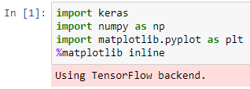
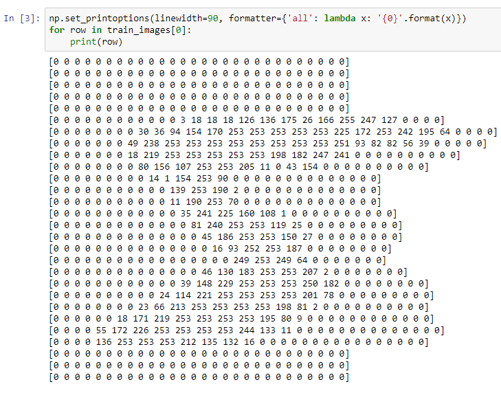
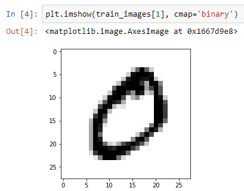
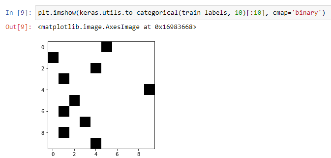
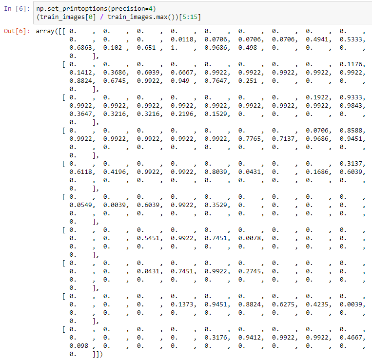
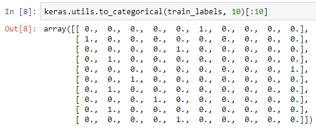
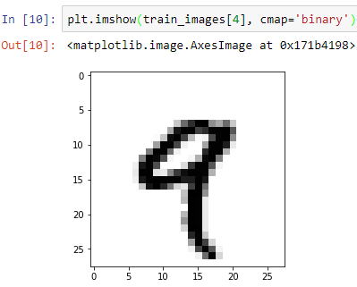

# 二、图像数据

在前一章中，我们准备了我们的机器学习工具包，在那里我们设置了 Keras 和 Docker，以便允许我们运行 Jupyter 笔记本来处理机器学习。

在这一章中，我们将研究如何准备用于机器学习的图像数据，以及将这些数据与 Keras 挂钩所涉及的步骤。我们将从学习 MNIST 数字开始。这些是图像形式的手写字符，我们将通过机器学习有效地对其执行**光学字符识别** ( **OCR** )。然后，我们要讲张量。张量听起来像一个数学单词，确实如此，但作为一名程序员，你已经见过多维数组，所以你实际上已经在使用张量，我会向你展示它的等价性。之后，我们要把图像变成张量。正如你习惯于在计算机上看到的那样，图像需要一种特殊形式的编码来用于机器学习。

然后，我们将转向分类。在这种情况下，我们将使用 0 到 9，它们是单个数字的字符，并将它们转换为类别标签。最后，我们将回顾一下，我将向你们展示一本关于当你为机器学习准备数据时如何思考数据的烹饪书。

# MNIST 数字

现在，让我们学习 MNIST 数字。在这一部分，我们将看看我准备的`ImageData`笔记本，它可以帮助我们理解如何处理图像数据；下载并获取 MNIST 数字；将图像视为原始数据；最后，基于这些数字数据来可视化真实的图像。

我们将要使用的代码包含在一个 IPython 笔记本中。这是我们设置容器的方式，所以你要像我们在设置你的机器学习工具包的最后提到的那样运行你的容器。我还准备了一个我们将要使用的 IPython 笔记本。我们将从导入所有必要的包开始，我们将打开 Matplotlib 以便自动绘图。这意味着当我们显示一个图像时，我们不必调用`.plot`；它会自动为我们完成:

导入包

实际上，Keras 内置了 MNIST 数字作为数据集，因此我们将利用这一便利，继续加载它们。

你需要一个互联网连接，因为它将从亚马逊 S3 下载这些文件。

当我们加载数据时，将有一个 Python 元组，我们将把它解包成两组:一个**训练集**，和一个**测试集**:

Python 元组

把你的数据分割成段，其实是机器学习的一个常见约定。您使用它是为了查看您的模型实际上正在使用训练集进行学习。然后，您可以使用测试集来确保您的模型不会过度拟合，这实际上是考虑到您的模型是在记忆训练数据还是在实际学习。

现在，让我们看看 NumPy 的格式选项的快速设置。当我们打印数组时，我们将图像作为数组的数组进行循环，然后打印出数据。如您所见，该图像实际上只是从`0`到`255`的数字:

灰度图像(阵列阵列)

这是一张灰度图像，这里的每一个整数都记录了这个特定像素有多暗。

现在，让我们绘制图像，看看这些数字到底是什么样子。Matplotlib 有一个简单的`plot`函数，你可以给出一个数组的数组，或者基本上是一个由 *XY* 像素组成的二维数组，它会把它绘制成一个`.image`文件。接下来，你可以看到看起来非常像零的东西:

绘图图像

# 张量——多维数组

现在我们已经了解了一些 MNIST 数字，我们将花时间来看看张量，以及什么是张量。我们将会看到一组多维数组。多维数组也叫**张量**。数学词汇可能有点让人不知所措，但是我们将向你展示它比你想象的要简单得多。然后，我们来看看张量形状。张量形状实际上是维度的数量，或者，就数组而言，是你用来访问它们的不同索引的数量。最后，我们将看看数据类型。张量或多维数组可以保存各种不同的数据类型，我们将解释其中的一些差异。

让我们从基础开始。你能想象到的最基本的张量是一个张量，在编程语言中，它被称为数组。它只是一系列有序的打包在一起的数字。下一个是两个张量。如果你看*灰度图像(数组的数组)*截图，每行是一维，每列是另一维。

所以，一行接一行，这加起来就是两个张量。同样，它只是一个数组的数组。你可以看到有带括号零的训练图像；我们实际上是在一系列图像中挑选出第一张图像。因此，前面有图像数据的三张量实际上是一个图像阵列，每个图像都有一个像素的列和行的阵列。所以，三张量是我们存储黑白图像的基本方式。

作为一个快速的可视化，正如你在索引一的图像中看到的， *Xs* 和 *Ys* (数字后面显示的坐标)就是张量的维数:

张量的维数

现在，我们来谈谈形状。你可以看到我们在 NumPy 多维数组或张量上调用`.shape`，它返回`60000, 28, 28`:

打电话。形状

这是构成我们三个张量的三个维度。它只是一个多维数组。然后，当然还有数据类型，或者`dtype`，就像你在 NumPy 多维数组中所说的那样。你可以看到这些图像被存储为`uint8`，或者 8 位整数，用来记录`0`到`255`的值。嗯，我们经常将这种数据类型用于源数据，尤其是像前面这样的黑白图像。当我们将其转换成实际的机器学习格式时，我们将使用浮点运算。

# 将图像转换成张量

在上一节中，我们学习了一点张量是什么。现在，我们将使用这些知识来准备图像数据，作为机器学习的张量。首先，我们会问一个问题:为什么我们使用浮点数据？然后，我们将了解样本之间的差异以及样本末尾的数据点。最后，我们将标准化数据以用于机器学习。

那么，为什么是浮点呢？嗯，真正的原因是机器学习从根本上来说是一个数学优化问题，当我们处理浮点时，计算机试图优化一系列数学关系，以找到可以预测输出的学习函数。因此，为机器学习准备数据确实需要将普通的二进制数据(如图像)重新格式化为一系列浮点数，这不是我们通常在图像处理方面处理图像的方式，但这是让机器学习算法参与的必要条件。

现在，我们来谈谈样品。按照惯例，样本总是多维数据数组中的第一维。在这里，我们有多个样本，因为机器学习的基本工作原理是通过查看大量不同样本中的大量不同数据点，然后学习一个函数来预测结果。

因此，我们的`train_images`多维数组中的每个图像都是我们将要查看的样本之一。但是正如你在*灰度图像(数组的数组)*截图中看到的，我们现在拥有的样本肯定不是浮点型的；这些仍然是 8 位整数。

因此，我们必须想出一个原则性的方法来转换我们的图像从 8 位到浮点。

现在，我们将开始通过规范化来了解为机器学习准备数据到底需要什么。这实际上意味着你取你的数据(在这种情况下，它是在`0`到`255`范围内的数字)，然后除以另一个数字，这样你就缩小了从`0`到`1`的范围:

标准化输出

这是机器学习算法中数值稳定性所需要的。当您的数据在`0`到`1`的范围内标准化时，它们会做得更好，收敛更快，变得更准确。

就是这样！我们已经看到了如何处理输入数据。要记住两件事:我们将把所有东西都变成浮点，最好是在`0`到`1`的范围内标准化数据。

# 将类别转化为张量

在上一节中，我们讨论了如何将图像转换为用于机器学习的张量，在本节中，我们将讨论如何将输出值(类别)转换为用于机器学习的张量。

我们将讨论输出类，进行离散预测意味着什么，一次性编码的概念；然后，我们将想象一下一键编码作为图像是什么样子，然后我们将通过一本数据准备食谱来回顾一下，您应该使用它来处理机器学习的各种图像数据。

但是现在，我们来谈谈输出。当我们谈论数字时，有`0`到`9`，所以有十个不同的类，不是面向对象意义上的类，而是标签意义上的类。现在，从`0`到`9`的这些标签是独立的数字，我们想要做的预测需要是离散的。预测 *1.5* 对我们没有任何好处，没有这样的数字字符:

0 到 9 个预测

因此，为此，我们将使用数据转换技巧。这个东西被称为一个热点编码，它是你获取一系列标签可能性的地方，在这个例子中，数字`0`到`9`，并把它们变成一种位图，其中每个选项被编码为一列，并且对于每个给定的数据样本，只有一列被设置为`1`(因此是一个热点):

一键编码

现在，查看输入数字(此处为`9`)和输出位图，可以看到第四个索引设置了第九个位，可以看到我们在数据准备中使用了一个图像作为输入，另一个图像作为输出。它们只是碰巧被编码为张量(浮点数的多维数组):

输出位图

当我们创建机器学习算法时，我们要做的是让计算机学习或发现一个函数，将一个图像(数字 9)转换为另一个图像(第九列设置了一位的位图)，这就是我们所说的机器学习。请记住，张量只是多维数组， *x* 和 *y* 值只是像素。我们将这些值标准化，这意味着我们从 0 到 1 的范围内获取它们，以便它们在机器学习算法中有用。标签或输出类只是我们要映射的一个值数组，我们要用单热编码对它们进行编码，这也意味着只有一个是热的，或者设置为 1。

# 摘要

在这一章中，我们学习了 MNIST 数字，以及如何获得它们；张量实际上只是多维数组；我们如何将图像数据编码为张量；我们如何将分类数据编码为张量；然后我们有一个快速回顾和食谱方法来思考维度和张量，为机器学习准备数据。

既然我们已经学会了如何为机器学习设置输入和输出数据，我们将进入下一章，在这里我们将创建一个**经典神经网络** ( **CNN** )。