# 十一、自编码器和图像操作

在前面的章节中，我们已经学习了图像分类、检测图像中的对象以及分割图像中与对象相对应的像素。在这一章中，我们将学习使用自编码器在低维中表示图像，以及通过使用变分自编码器利用图像的低维表示来生成新图像。学习用较低的维度来表示图像，有助于我们在相当大的程度上操纵(修改)图像。我们将学习利用低维表示来生成新图像以及基于两个不同图像的内容和风格的新颖图像。接下来，我们还将学习以这样一种方式修改图像，即图像在视觉上不被改变，然而，对应于图像的类从一个改变到另一个。最后，我们将了解如何生成深度假像:给定一个人 A 的源图像，我们生成一个人 B 的目标图像，其面部表情与人 A 相似。

总的来说，我们将在本章中讨论以下主题:

*   理解和实现自编码器
*   了解卷积自编码器
*   了解可变自编码器
*   对图像进行对抗性攻击
*   执行神经类型转移
*   产生深刻的假象

# 了解自编码器

到目前为止，在前面的章节中，我们已经学习了通过基于输入图像及其相应标签训练模型来分类图像。现在，让我们想象一个场景，我们需要根据图像的相似性对图像进行聚类，并且没有相应的标签。自编码器可以方便地识别和分组相似的图像。

自编码器将图像作为输入，将其存储在一个较低的维度中，并试图再现相同的图像作为输出，因此出现了术语 **auto** (代表能够再现输入)。然而，如果我们只是在输出中再现输入，我们将不需要网络，但是输入乘以 1 就可以了。自编码器的与众不同之处在于，它将图像中存在的信息在较低的维度上进行编码，然后再现图像，因此有了术语**编码器**(代表在较低的维度上表示图像的信息)。这样，相似的图像将具有相似的编码。此外，**解码器**致力于从编码矢量中重建原始图像。

为了进一步理解自编码器，让我们看一下下图:


假设输入图像是 MNIST 手写数字的扁平版本，输出图像与作为输入提供的图像相同。最中间层是编码层，称为**瓶颈**层。发生在输入和瓶颈层之间的操作代表**编码器**，瓶颈层和输出之间的操作代表**解码器**。

通过瓶颈层，我们可以在低得多的维度上表示图像。此外，有了瓶颈层，我们可以重建原始图像。我们利用瓶颈层来解决识别相似图像以及生成新图像的问题，我们将在后续章节中学习如何做。

瓶颈层在以下方面有所帮助:

*   具有相似瓶颈层值(编码表示)的图像可能彼此相似。
*   通过改变瓶颈层的节点值，我们可以改变输出图像。

有了前面的理解，让我们做以下事情:

*   从头开始实现自编码器
*   基于瓶颈层值可视化图像的相似性

在下一节中，我们将了解自编码器是如何构建的，还将了解瓶颈层中不同单元对解码器输出的影响。

## 实现普通自编码器

为了理解如何构建自编码器，让我们在包含手写数字图像的 MNIST 数据集上实现一个:

以下代码可在本书的 GitHub 知识库的`chapter11`文件夹中以`simple_auto_encoder_with_different_latent_size.ipynb`的名称获得-【https://tinyurl.com/mcvp-packt代码长度适中。我们强烈建议您在 GitHub 中执行笔记本以重现结果，同时理解执行的步骤和文本中各种代码组件的解释。

1.  导入相关包并定义设备:

```py
!pip install -q torch_snippets
from torch_snippets import *
from torchvision.datasets import MNIST
from torchvision import transforms
device = 'cuda' if torch.cuda.is_available() else 'cpu'
```

2.  指定我们希望图像通过的转换:

```py
img_transform = transforms.Compose([
                    transforms.ToTensor(),
                    transforms.Normalize([0.5], [0.5]),
                    transforms.Lambda(lambda x: x.to(device))
                ])
```

在前面的代码中，我们看到我们正在将图像转换为张量，对其进行归一化，然后将其传递给设备。

3.  创建训练和验证数据集:

```py
trn_ds = MNIST('/content/', transform=img_transform, \
               train=True, download=True)
val_ds = MNIST('/content/', transform=img_transform, \
               train=False, download=True)
```

4.  定义数据加载器:

```py
batch_size = 256
trn_dl = DataLoader(trn_ds, batch_size=batch_size, \
                    shuffle=True)
val_dl = DataLoader(val_ds, batch_size=batch_size, \
                    shuffle=False)
```

5.  定义网络架构。我们定义在`__init__`方法中构成编码器和解码器的`AutoEncoder`类，以及瓶颈层的维度、`latent_dim`和`forward`方法，并可视化模型摘要:

*   定义包含编码器、解码器和瓶颈层维度的`AutoEncoder`类和`__init__`方法:

```py
class AutoEncoder(nn.Module):
    def __init__(self, latent_dim):
        super().__init__()
        self.latend_dim = latent_dim
        self.encoder = nn.Sequential(
                            nn.Linear(28 * 28, 128), 
                            nn.ReLU(True),
                            nn.Linear(128, 64), 
                            nn.ReLU(True), 
                            nn.Linear(64, latent_dim))
        self.decoder = nn.Sequential(
                            nn.Linear(latent_dim, 64), 
                            nn.ReLU(True),
                            nn.Linear(64, 128), 
                            nn.ReLU(True), 
                            nn.Linear(128, 28 * 28), 
                            nn.Tanh())
```

*   定义`forward`方法:

```py
    def forward(self, x):
        x = x.view(len(x), -1)
        x = self.encoder(x)
        x = self.decoder(x)
        x = x.view(len(x), 1, 28, 28)
        return x
```

*   将前面的模型可视化:

```py
!pip install torch_summary
from torchsummary import summary
model = AutoEncoder(3).to(device)
summary(model, torch.zeros(2,1,28,28))
```

这会产生以下输出:

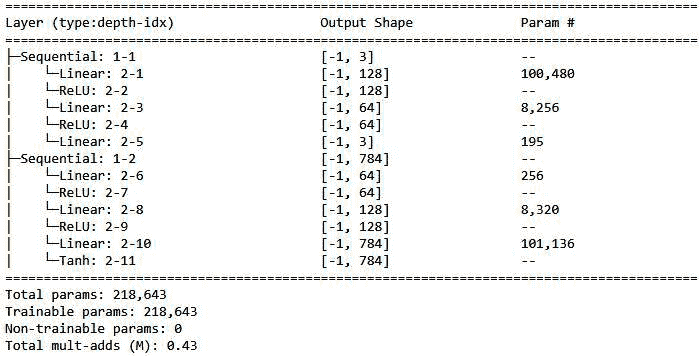

从前面的输出中，我们可以看到`Linear: 2-5 layer`是瓶颈层，其中每个图像都表示为一个三维向量。此外，解码器层使用瓶颈层中的三个值来重构原始图像。

6.  定义一个函数来训练一批数据(`train_batch`)，就像我们在前面章节中所做的那样:

```py
def train_batch(input, model, criterion, optimizer):
    model.train()
    optimizer.zero_grad()
    output = model(input)
    loss = criterion(output, input)
    loss.backward()
    optimizer.step()
    return loss
```

7.  定义要对该批数据进行验证的函数(`validate_batch`):

```py
@torch.no_grad()
def validate_batch(input, model, criterion):
    model.eval()
    output = model(input)
    loss = criterion(output, input)
    return loss
```

8.  定义模型、损失标准和优化器:

```py
model = AutoEncoder(3).to(device)
criterion = nn.MSELoss()
optimizer = torch.optim.AdamW(model.parameters(), \
                              lr=0.001, weight_decay=1e-5)
```

9.  在不断增加的时期内训练模型:

```py
num_epochs = 5
log = Report(num_epochs)

for epoch in range(num_epochs):
    N = len(trn_dl)
    for ix, (data, _) in enumerate(trn_dl):
        loss = train_batch(data, model, criterion, optimizer)
        log.record(pos=(epoch + (ix+1)/N), \
                   trn_loss=loss, end='\r')

    N = len(val_dl)
    for ix, (data, _) in enumerate(val_dl):
        loss = validate_batch(data, model, criterion)
        log.record(pos=(epoch + (ix+1)/N), \
                   val_loss=loss, end='\r')

    log.report_avgs(epoch+1)
```

10.  设想在不断增长的时期内培训和验证的损失:

```py
log.plot_epochs(log=True)
```

上述代码片段返回以下输出:


11.  在`val_ds`数据集上验证模型，该数据集在培训期间未提供:

```py
for _ in range(3):
    ix = np.random.randint(len(val_ds))
    im, _ = val_ds[ix]
    _im = model(im[None])[0]
    fig, ax = plt.subplots(1, 2, figsize=(3,3))
    show(im[0], ax=ax[0], title='input')
    show(_im[0], ax=ax[1], title='prediction')
    plt.tight_layout()
    plt.show()
```

上述代码的输出如下:

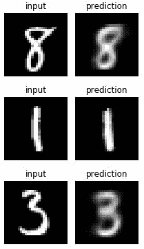

我们可以看到，即使瓶颈层只有三维大小，网络也能以非常高的精确度再现输入。然而，图像并不像我们预期的那样清晰。这主要是因为瓶颈层中的节点数量很少。在下图中，我们将使用不同的瓶颈层大小(2、3、5、10 和 50)对网络进行训练，然后可视化重建的图像:

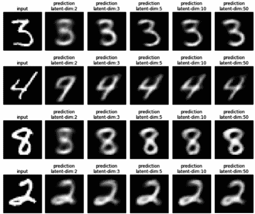

很明显，随着瓶颈层中矢量数量的增加，重建图像的清晰度提高。

在下一节中，我们将学习如何使用**卷积神经网络** ( **CNN** )生成更清晰的图像，我们还将学习如何对相似的图像进行分组。

# 了解卷积自编码器

在上一节中，我们学习了自编码器，并在 PyTorch 中实现了它们。虽然我们已经实现了它们，但我们通过数据集获得的一个便利是，每个图像只有一个通道(每个图像被表示为黑白图像)，并且图像相对较小(28 x 28)。因此，网络拉平了输入，并能够对 784 (28*28)个输入值进行训练，以预测 784 个输出值。然而，在现实中，我们会遇到有 3 个通道的图像，并且比 28 x 28 的图像大得多。

在本节中，我们将了解如何实现一个卷积自编码器，它能够处理多维输入图像。然而，为了与普通自编码器进行比较，我们将使用与上一节中相同的 MNIST 数据集，但是修改了网络，现在我们构建的是卷积自编码器，而不是普通自编码器。

卷积自编码器表示如下:


从前面的图像中，我们可以看到输入图像被表示为瓶颈层中用于重建图像的块。图像经过多次卷积以获取瓶颈表示(即通过**编码器**获得的**瓶颈层**)并且瓶颈表示被放大以获取原始图像(原始图像通过**解码器**被重建)。

现在我们知道卷积自编码器是如何表示的，让我们用下面的代码实现它:

Given that the majority of the code is similar to the code in the previous section, we have only provided the additional code for brevity. The following code is available as `conv_auto_encoder.ipynb` in `Chapter11` folder of this book's GitHub repository. We encourage you to go through the notebook in GitHub if you want to see the complete code.

1.  步骤 1 到 4 与普通自编码器部分完全相同，如下所示:

```py
!pip install -q torch_snippets
from torch_snippets import *
from torchvision.datasets import MNIST
from torchvision import transforms
device = 'cuda' if torch.cuda.is_available() else 'cpu'
img_transform = transforms.Compose([
                    transforms.ToTensor(),
                    transforms.Normalize([0.5], [0.5]),
                    transforms.Lambda(lambda x: x.to(device))
                                    ])

trn_ds = MNIST('/content/', transform=img_transform, \
               train=True, download=True)
val_ds = MNIST('/content/', transform=img_transform, \
               train=False, download=True)

batch_size = 128
trn_dl = DataLoader(trn_ds, batch_size=batch_size, \
                    shuffle=True)
val_dl = DataLoader(val_ds, batch_size=batch_size, \
                    shuffle=False)
```

2.  定义神经网络的类别，`ConvAutoEncoder`:

*   定义类和`__init__`方法:

```py
class ConvAutoEncoder(nn.Module):
    def __init__(self):
        super().__init__()
```

*   定义`encoder`架构:

```py
        self.encoder = nn.Sequential(
                            nn.Conv2d(1, 32, 3, stride=3, \
                                      padding=1), 
                            nn.ReLU(True),
                            nn.MaxPool2d(2, stride=2),
                            nn.Conv2d(32, 64, 3, stride=2, \
                                      padding=1), 
                            nn.ReLU(True),
                            nn.MaxPool2d(2, stride=1)
                        )
```

请注意，在前面的代码中，我们从通道的初始数量`1`开始，将其增加到`32`，然后进一步增加到`64`，同时通过执行`nn.MaxPool2d`和`nn.Conv2d`操作来减小输出值的大小。

*   定义`decoder`架构:

```py
        self.decoder = nn.Sequential(
                        nn.ConvTranspose2d(64, 32, 3, \
                                           stride=2), 
                        nn.ReLU(True),
                        nn.ConvTranspose2d(32, 16, 5, \
                                         stride=3,padding=1), 
                        nn.ReLU(True),
                        nn.ConvTranspose2d(16, 1, 2, \
                                         stride=2,padding=1), 
                        nn.Tanh()
                    )
```

*   定义`forward`方法:

```py
    def forward(self, x):
        x = self.encoder(x)
        x = self.decoder(x)
        return x
```

3.  使用`summary`方法获得模型的概要:

```py
model = ConvAutoEncoder().to(device)
!pip install torch_summary
from torchsummary import summary
summary(model, torch.zeros(2,1,28,28));
```

上述代码会产生以下输出:

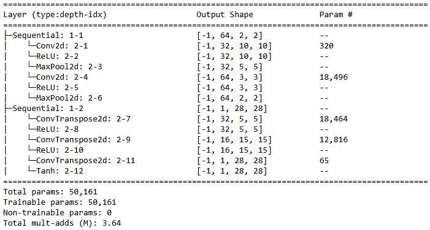

从前面的总结中，我们可以看到形状为批次大小 x 64 x 2 x 2 的`MaxPool2d-6`层充当瓶颈层。

一旦我们对模型进行了训练，就像我们在上一节中所做的那样(在步骤 6、7、8 和 9 中)，训练和验证损失在增加的时期和对输入图像的预测上的变化如下:

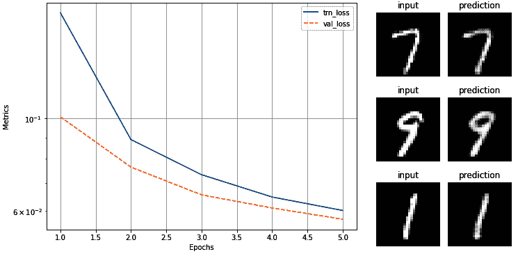

从前面的图像中，我们可以看到卷积自编码器能够比普通自编码器更清晰地预测图像。作为练习，我们建议您改变编码器和解码器中的通道数量，然后分析结果的变化。

在下一节中，我们将解决当图像标签不存在时，基于瓶颈层值对相似图像进行分组的问题。

## 使用 t-SNE 对相似图像进行分组

在前面的部分中，我们假设相似的图像具有相似的嵌入，不相似的图像具有不同的嵌入，在低得多的维度中表示每个图像。然而，我们还没有查看图像相似性度量或详细检查嵌入表示。

在这一节中，我们将在二维空间中绘制嵌入(瓶颈)向量。我们可以通过使用一种称为 **t-SNE** 的技术，将卷积自编码器的 64 维向量减少到 2 维空间。(更多关于 SNE 霸王龙的信息，请点击这里:【http://www.jmlr.org/papers/v9/vandermaaten08a.html】[。)](http://www.jmlr.org/papers/v9/vandermaaten08a.html)

这样，可以证明我们的理解，即相似的图像将具有相似的嵌入，因为相似的图像应该在二维平面中聚集在一起。在下面的代码中，我们将表示二维平面中所有测试图像的嵌入:

下面的代码是上一节构建的代码的延续，理解卷积自编码器的*，在本书的 GitHub 库`Chapter 11`文件夹中以`conv_auto_encoder.ipynb`的名称提供-【https://tinyurl.com/mcvp-packt】的*

1.  初始化列表，以便我们存储图像的潜在向量(`latent_vectors`)和相应的`classes`(注意，我们存储每个图像的类别只是为了验证预期彼此具有非常高的相似性的同一类别的图像在表示方面是否确实彼此接近):

```py
latent_vectors = []
classes = []
```

2.  遍历验证数据加载器(`val_dl`)中的图像，并存储编码器层`(model.encoder(im).view(len(im),-1)`的输出和对应于每个图像(`im`)的类(`clss`):

```py
for im,clss in val_dl:
    latent_vectors.append(model.encoder(im).view(len(im),-1))
    classes.extend(clss)
```

3.  串联`latent_vectors`的 NumPy 数组:

```py
latent_vectors = torch.cat(latent_vectors).cpu()\
                      .detach().numpy()
```

4.  导入 t-SNE ( `TSNE`)并指定每个向量都要转换成一个二维向量(`TSNE(2)`)，这样我们就可以绘制它了:

```py
from sklearn.manifold import TSNE
tsne = TSNE(2)
```

5.  通过在图像嵌入(`latent_vectors`)上运行`fit_transform`方法来拟合 t-SNE:

```py
clustered = tsne.fit_transform(latent_vectors)
```

6.  拟合 t-SNE 后绘制数据点:

```py
fig = plt.figure(figsize=(12,10))
cmap = plt.get_cmap('Spectral', 10)
plt.scatter(*zip(*clustered), c=classes, cmap=cmap)
plt.colorbar(drawedges=True)
```

上述代码提供了以下输出:

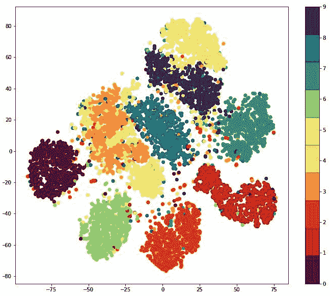

我们可以看到同一类的图像聚集在一起，这加强了我们的理解，即瓶颈层以这样一种方式具有值，即看起来相似的图像将具有相似的值。

到目前为止，我们已经了解了如何使用自编码器将相似的图像分组在一起。在下一节中，我们将学习如何使用自编码器来生成新图像。

# 了解可变自编码器

到目前为止，我们已经看到了一个场景，其中我们可以将相似的图像分组到集群中。此外，我们已经了解到，当我们嵌入属于给定聚类的图像时，我们可以重构(解码)它们。然而，如果一个嵌入(一个潜在向量)落在两个簇之间呢？不能保证我们会生成真实的图像。在这种情况下，可变自编码器就派上了用场。

在我们开始构建一个变分自编码器之前，让我们先来探索一下从不属于一个簇(或者在不同簇中间)的嵌入中生成图像的局限性。首先，我们通过采样向量生成图像:

The following code is a continuation of the code built in the previous section, *Understanding convolutional autoencoders*, and is available as `conv_auto_encoder.ipynb` in the `chapter11` folder of this book's GitHub repository - [https://tinyurl.com/mcvp-packt](https://tinyurl.com/mcvp-packt)

1.  计算前一部分中验证图像的潜在向量(嵌入):

```py
latent_vectors = []
classes = []
for im,clss in val_dl:
    latent_vectors.append(model.encoder(im))
    classes.extend(clss)
latent_vectors = torch.cat(latent_vectors).cpu()\
                      .detach().numpy().reshape(10000, -1)
```

2.  生成具有列级平均值(`mu`)和标准偏差(`sigma`)的随机向量，并在根据平均值和标准偏差创建向量之前，向标准偏差(`torch.randn(1,100)`)添加轻微噪声。最后，将它们保存在一个列表中(`rand_vectors`):

```py
rand_vectors = []
for col in latent_vectors.transpose(1,0):
    mu, sigma = col.mean(), col.std()
    rand_vectors.append(sigma*torch.randn(1,100) + mu)
```

3.  绘制从步骤 2 中获得的矢量和上一节中训练的模型重建的图像:

```py
rand_vectors=torch.cat(rand_vectors).transpose(1,0).to(device)
fig,ax = plt.subplots(10,10,figsize=(7,7)); ax = iter(ax.flat)
for p in rand_vectors:
    img = model.decoder(p.reshape(1,64,2,2)).view(28,28)
    show(img, ax=next(ax))
```

上述代码会产生以下输出:


我们可以从前面的输出中看到，当我们绘制由已知向量列的平均值和添加噪声的标准偏差生成的图像时，我们得到的图像不如以前清晰。这是一个真实的场景，因为我们事先不知道生成真实图片的嵌入向量的范围。

**变分自编码器** ( **VAE** )通过生成均值为 0、标准差为 1 的向量来帮助我们解决这个问题，从而确保我们生成的图像均值为 0、标准差为 1。

本质上，在 VAE，我们指定瓶颈层应该遵循一定的分布。在接下来的部分中，我们将了解我们对 VAE 采取的策略，我们还将了解 KL 散度损失，这有助于我们获取遵循特定分布的瓶颈特征。

## VAE 的工作

在 VAE 中，我们构建网络的方式使得从预定义分布生成的随机向量可以生成逼真的图像。这对于简单的自编码器是不可能的，因为我们没有指定在网络中生成图像的数据的分布。我们采用以下策略，通过 VAE 实现这一点:

1.  编码器的输出是每个图像的两个向量:
    *   一个矢量代表平均值。
    *   另一个代表标准差。
2.  从这两个向量中，我们获取一个修改后的向量，它是平均值和标准偏差之和(乘以一个随机的小数字)。修改后的向量将具有与每个向量相同的维数。
3.  在前一步骤中获得的修改向量作为输入被传递到解码器以获取图像。
4.  我们优化的损耗值是均方误差和 KL 发散损耗的组合:
    *   KL 散度损失分别测量平均向量和标准偏差向量的分布与 0 和 1 的偏差。
    *   均方损失是我们用来重建(解码)图像的优化方法。

通过指定均值向量的分布应该以 0 为中心，标准差向量的分布应该以 1 为中心，我们以这样的方式训练网络:当我们生成均值为 0、标准差为 1 的随机噪声时，解码器将能够生成逼真的图像。

此外，注意，如果我们仅最小化 KL 散度，编码器将会预测平均向量的值为 0，并且每个输入的标准偏差为 1。因此，同时最小化 KL 发散损失和均方损失是重要的。

在下一节中，让我们了解 KL 散度，以便我们可以将其纳入模型的损失值计算中。

## KL 散度

KL 散度有助于解释两种数据分布之间的差异。在我们的具体例子中，我们希望瓶颈特征值遵循均值为 0、标准差为 1 的正态分布。

因此，我们使用 KL 散度损失来理解我们的瓶颈特征值相对于平均值为 0 且标准偏差为 1 的值的预期分布有多不同。

让我们看看 KL 散度损失是如何计算的:


在上式中，σ和μ代表每个输入图像的平均值和标准偏差值。

让我们理解前面等式背后的直觉:

*   确保平均向量分布在 0:
    *   最小化前面等式中的均方误差(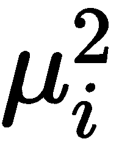)确保尽可能接近 0。
*   确保标准偏差向量分布在 1:
    *   等式其余部分的项(除了)确保 sigma(标准差向量)分布在 1 附近。

当均值( )为 0 且标准差为 1 时，前述损失函数最小化。此外，通过指定我们考虑标准偏差的对数，我们确保 sigma 值不能为负。

现在，我们已经了解了构建 VAE 和最小化损失函数的高级策略，以便获得编码器输出的预定义分布，让我们在下一部分实现 VAE。

## 建设一个 VAE

在这一节中，我们将编码一个 VAE 来生成新的手写数字图像。

The following code is available as `VAE.ipynb` in the `Chapter11` folder of this book's GitHub repository - [https://tinyurl.com/mcvp-packt](https://tinyurl.com/mcvp-packt)

因为我们有相同的数据，所以除了步骤 5 和 6 之外，*实现普通自编码器*部分中的所有步骤都保持不变，在步骤 5 和 6 中，我们分别定义了网络架构和训练模型，我们在下面的代码中定义了这两个模型:

1.  步骤 1 至步骤 4 与普通自编码器部分完全相同，如下所示:

```py
!pip install -q torch_snippets
from torch_snippets import *
import torch
import torch.nn as nn
import torch.nn.functional as F
import torch.optim as optim
from torchvision import datasets, transforms
from torchvision.utils import make_grid
device = 'cuda' if torch.cuda.is_available() else 'cpu'
train_dataset = datasets.MNIST(root='MNIST/', train=True, \
                        transform=transforms.ToTensor(), \
                               download=True)
test_dataset = datasets.MNIST(root='MNIST/', train=False, \
                        transform=transforms.ToTensor(), \
                              download=True)

train_loader = torch.utils.data.DataLoader(dataset = \
                train_dataset, batch_size=64, shuffle=True)
test_loader = torch.utils.data.DataLoader(dataset= \
                test_dataset, batch_size=64, shuffle=False)
```

2.  定义神经网络类，`VAE`:

*   在`__init__`方法中定义将在其他方法中使用的层:

```py
class VAE(nn.Module):
    def __init__(self, x_dim, h_dim1, h_dim2, z_dim):
        super(VAE, self).__init__()
        self.d1 = nn.Linear(x_dim, h_dim1)
        self.d2 = nn.Linear(h_dim1, h_dim2)
        self.d31 = nn.Linear(h_dim2, z_dim)
        self.d32 = nn.Linear(h_dim2, z_dim)
        self.d4 = nn.Linear(z_dim, h_dim2)
        self.d5 = nn.Linear(h_dim2, h_dim1)
        self.d6 = nn.Linear(h_dim1, x_dim)
```

注意，`d1`和`d2`层将对应于编码器部分，`d5`和`d6`将对应于解码器部分。`d31`和`d32`层分别对应于均值和标准差向量。然而，为了方便起见，我们将做的一个假设是我们将使用`d32`层作为方差向量的对数的表示。

*   定义`encoder`方法:

```py
    def encoder(self, x):
        h = F.relu(self.d1(x))
        h = F.relu(self.d2(h))
        return self.d31(h), self.d32(h)
```

注意，编码器返回两个向量:一个向量表示平均值`(self.d31(h))`，另一个向量表示方差值的对数`(self.d32(h))`。

*   定义从编码器输出中取样(`sampling`)的方法:

```py
    def sampling(self, mean, log_var):
        std = torch.exp(0.5*log_var)
        eps = torch.randn_like(std)
        return eps.mul(std).add_(mean)
```

注意*的指数 0.5*log_var* ( `torch.exp(0.5*log_var)`)代表标准差(`std`)。此外，我们将返回平均值和标准偏差乘以随机正态分布生成的噪声的和。通过乘以`eps`，我们确保即使编码器向量有微小的变化，我们也能生成图像。

*   定义`decoder`方法:

```py
    def decoder(self, z):
        h = F.relu(self.d4(z))
        h = F.relu(self.d5(h))
        return F.sigmoid(self.d6(h))
```

*   定义`forward`方法:

```py
    def forward(self, x):
        mean, log_var = self.encoder(x.view(-1, 784))
        z = self.sampling(mean, log_var)
        return self.decoder(z), mean, log_var
```

在前面的方法中，我们确保编码器返回方差值的平均值和对数。接下来，我们进行采样，将均值加上ε乘以方差的对数，并在通过解码器后返回值。

3.  定义用于批量训练和批量验证的函数:

```py
def train_batch(data, model, optimizer, loss_function):
    model.train()
    data = data.to(device)
    optimizer.zero_grad()
    recon_batch, mean, log_var = model(data)
    loss, mse, kld = loss_function(recon_batch, data, \
                                   mean, log_var)
    loss.backward()
    optimizer.step()
    return loss, mse, kld, log_var.mean(), mean.mean()

@torch.no_grad()
def validate_batch(data, model, loss_function):
    model.eval()
    data = data.to(device)
    recon, mean, log_var = model(data)
    loss, mse, kld = loss_function(recon, data, mean, \
                                   log_var)
    return loss, mse, kld, log_var.mean(), mean.mean()
```

4.  定义损失函数:

```py
def loss_function(recon_x, x, mean, log_var):
    RECON = F.mse_loss(recon_x, x.view(-1, 784), \
                       reduction='sum')
    KLD = -0.5 * torch.sum(1 + log_var - mean.pow(2) - \
                           log_var.exp())
    return RECON + KLD, RECON, KLD
```

在前面的代码中，我们正在获取原始图像(`x`)和重建图像(`recon_x`)之间的 MSE 损失(`RECON`)。接下来，我们根据上一节定义的公式计算 KL 发散损失(`KLD`)。请注意，方差对数的指数就是方差值。

5.  定义模型对象(`vae`)和`optimizer`函数:

```py
vae = VAE(x_dim=784, h_dim1=512, h_dim2=256, \
          z_dim=50).to(device)
optimizer = optim.AdamW(vae.parameters(), lr=1e-3)
```

6.  在不断增加的时期内训练模型:

```py
n_epochs = 10
log = Report(n_epochs)

for epoch in range(n_epochs):
    N = len(train_loader)
    for batch_idx, (data, _) in enumerate(train_loader):
        loss, recon, kld, log_var, mean = train_batch(data, \
                                            vae, optimizer, \
                                               loss_function)
        pos = epoch + (1+batch_idx)/N
        log.record(pos, train_loss=loss, train_kld=kld, \
                   train_recon=recon,train_log_var=log_var, \
                   train_mean=mean, end='\r')

    N = len(test_loader)
    for batch_idx, (data, _) in enumerate(test_loader):
        loss, recon, kld,log_var,mean = validate_batch(data, \
                                           vae, loss_function)
        pos = epoch + (1+batch_idx)/N
        log.record(pos, val_loss=loss, val_kld=kld, \
                   val_recon=recon, val_log_var=log_var, \
                   val_mean=mean, end='\r')

    log.report_avgs(epoch+1)
    with torch.no_grad():
        z = torch.randn(64, 50).to(device)
        sample = vae.decoder(z).to(device)
        images = make_grid(sample.view(64, 1, 28, 28))\
                                 .permute(1,2,0)
        show(images)
log.plot_epochs(['train_loss','val_loss'])
```

虽然前面的大部分代码都很熟悉，但是让我们来理解网格图像的生成过程。我们首先生成一个随机向量(`z`)，并通过解码器(`vae.decoder`)获取图像样本。`make_grid`功能绘制图像(如果需要，在绘制前自动反规格化图像)。

损失值变化的输出和生成的图像样本如下:

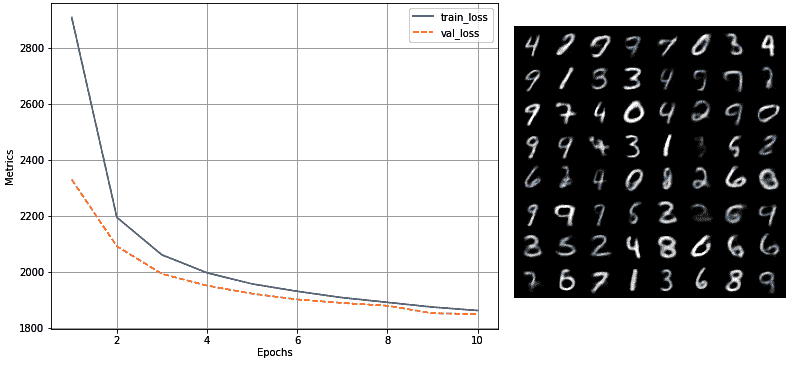

我们可以看到，我们能够生成原始图像中没有的逼真的新图像。

到目前为止，我们已经了解了如何使用 VAEs 生成新图像。然而，如果我们想以一种模型不能识别正确的类的方式来修改图像，该怎么办呢？我们将在下一节中了解解决这一问题的技术。

# 对图像进行对抗性攻击

在上一节中，我们学习了使用 VAE 从随机噪声中生成图像。然而，这是一次无人监督的练习。如果我们想要以这样一种方式修改图像，使得图像的变化非常小，以至于对于人类来说它与原始图像无法区分，但是神经网络模型仍然认为该对象属于不同的类别，那么该怎么办？在这种情况下，对图像的对抗性攻击就派上了用场。

对抗性攻击指的是我们对输入图像值(像素)进行的更改，以便我们达到某个目标。

在本节中，我们将学习以这样的方式稍微修改图像，即预训练的模型现在将它们预测为不同的类(由用户指定)而不是原始类。我们将采取的策略如下:

1.  提供一幅大象的图像。
2.  指定与图像对应的目标类。
3.  导入预先训练的模型，其中模型的参数被设置为不更新(`gradients = False`)。
4.  指定我们计算输入图像像素值的梯度，而不是网络的权重值。这是因为在训练欺骗网络时，我们不能控制模型，而只能控制发送给模型的图像。
5.  计算与模型预测和目标类别相对应的损失。
6.  对模型执行反向传播。这一步有助于我们理解与每个输入像素值相关的梯度。
7.  基于对应于每个输入像素值的梯度的方向来更新输入图像像素值。
8.  在多个时期内重复*步骤 5、6、*和 *7* 。

让我们用代码来做这件事:

The following code is available as `adversarial_attack.ipynb` in the `Chapter11` folder of this book's GitHub repository - [https://tinyurl.com/mcvp-packt](https://tinyurl.com/mcvp-packt) The code contains URLs to download data from. We strongly recommend you to execute the notebook in GitHub to reproduce results while you understand the steps to perform and explanation of various code components in text.

1.  导入相关的包、我们为这个用例处理的映像，以及预训练的 ResNet50 模型。此外，指定我们想要冻结参数:

```py
!pip install torch_snippets
from torch_snippets import inspect, show, np, torch, nn
from torchvision.models import resnet50
model = resnet50(pretrained=True)
for param in model.parameters():
    param.requires_grad = False
model = model.eval()
import requests
from PIL import Image
url = 'https://lionsvalley.co.za/wp-content/uploads/2015/11/african-elephant-square.jpg'
original_image = Image.open(requests.get(url, stream=True)\
                            .raw).convert('RGB')
original_image = np.array(original_image)
original_image = torch.Tensor(original_image)
```

2.  导入 Imagenet 类并为每个类分配 id:

```py
image_net_classes = 'https://gist.githubusercontent.com/yrevar/942d3a0ac09ec9e5eb3a/raw/238f720ff059c1f82f368259d1ca4ffa5dd8f9f5/imagenet1000_clsidx_to_labels.txt'
image_net_classes = requests.get(image_net_classes).text
image_net_ids = eval(image_net_classes)
image_net_classes = {i:j for j,i in image_net_ids.items()}
```

3.  指定一个函数来规格化(`image2tensor`)和反规格化(`tensor2image`)图像:

```py
from torchvision import transforms as T
from torch.nn import functional as F
normalize = T.Normalize([0.485, 0.456, 0.406], 
                        [0.229, 0.224, 0.225])
denormalize=T.Normalize( \
                [-0.485/0.229,-0.456/0.224,-0.406/0.225], 
                [1/0.229, 1/0.224, 1/0.225])
def image2tensor(input):
    x = normalize(input.clone().permute(2,0,1)/255.)[None]
    return x
def tensor2image(input):
    x = (denormalize(input[0].clone()).permute(1,2,0)*255.)\
                                      .type(torch.uint8)
    return x
```

4.  定义对给定图像进行预测的函数(`predict_on_image`):

```py
def predict_on_image(input):
    model.eval()
    show(input)
    input = image2tensor(input)
    pred = model(input)
    pred = F.softmax(pred, dim=-1)[0]
    prob, clss = torch.max(pred, 0)
    clss = image_net_ids[clss.item()]
    print(f'PREDICTION: `{clss}` @ {prob.item()}')
```

在前面的代码中，我们将输入图像转换为张量(这是一个使用前面定义的`image2tensor`方法进行归一化的函数)，并通过`model`获取图像中对象的类别(`clss`)和预测的概率(`prob`)。

5.  定义`attack`功能:

*   `attack`函数以`image`、`model`和`target`为输入:

```py
from tqdm import trange
losses = []
def attack(image, model, target, epsilon=1e-6):
```

*   将图像转换为张量，并指定输入需要计算梯度:

```py
    input = image2tensor(image)
    input.requires_grad = True
```

*   通过将标准化输入(`input`)传递给模型来计算预测，然后计算与指定目标类别相对应的损失值:

```py
    pred = model(input)
    loss = nn.CrossEntropyLoss()(pred, target)
```

*   执行反向传播以减少损失:

```py
    loss.backward()
    losses.append(loss.mean().item())
```

*   基于梯度方向非常轻微地更新图像:

```py
    output = input - epsilon * input.grad.sign()
```

在前面的代码中，我们以非常小的量更新输入值(乘以`epsilon`)。此外，我们不是通过梯度的大小来更新图像，而是在将其乘以一个非常小的值(`epsilon`)后，只更新梯度的方向(`input.grad.sign()`)。

*   将张量转换成图像(`tensor2image`)后返回输出，反规格化图像:

```py
    output = tensor2image(output)
    del input
    return output.detach()
```

6.  将图像修改为属于不同的类别:

*   指定我们要将图像转换到的目标(`desired_targets`):

```py
modified_images = []
desired_targets = ['lemon', 'comic book', 'sax, saxophone']
```

*   循环遍历目标，并在每次迭代中指定目标类:

```py
for target in desired_targets:
    target = torch.tensor([image_net_classes[target]])
```

*   修改图像以攻击更多的时期，并将它们收集在一个列表中:

```py
    image_to_attack = original_image.clone()
    for _ in trange(10):
        image_to_attack = attack(image_to_attack,model,target)
    modified_images.append(image_to_attack)
```

*   以下代码会产生修改后的图像和相应的类:

```py
for image in [original_image, *modified_images]:
    predict_on_image(image)
    inspect(image)
```

上述代码生成以下内容:


我们可以看到，当我们非常轻微地修改图像时，预测类完全不同，但是具有非常高的置信度。

现在我们已经了解了如何修改图像，以便按照我们的意愿对它们进行分类，在下一节中，我们将学习如何以我们选择的样式修改图像(内容图像)。我们必须提供一个内容图像和一个样式图像。

# 执行神经类型转移

在神经风格迁移中，我们有一个内容图像和一个风格图像，我们以这样一种方式组合这两个图像，即组合的图像保留了内容图像的内容，同时保持了风格图像的风格。

样式图像和内容图像的示例如下:


在前面的图片中，我们希望保留右边图片中的内容(内容图像)，但是用左边图片中的颜色和纹理覆盖它(样式图像)。

执行神经类型转移的过程如下。我们尝试以这样的方式修改原始图像，即损失值被分成**内容损失**和**风格损失**。内容损失是指生成的图像与内容图像的**差异**有多大。风格损失指的是**如何关联**风格图像与生成的图像。

虽然我们提到损失是基于图像的差异来计算的，但在实践中，我们通过确保损失是使用图像的特征层激活而不是原始图像来计算的来稍微修改它。例如，当通过第二层时，第二层的内容损失将是内容图像的*激活和生成的图像*之间的平方差。

损失是在要素图层而不是原始图像上计算的，因为要素图层捕捉原始图像的某些属性(例如，较高层中与原始图像相对应的前景轮廓和较低层中细粒度对象的细节)。

虽然计算内容损失似乎很简单，但是让我们试着理解如何计算生成的图像和样式图像之间的相似性。一种叫做**克矩阵**的技术派上了用场。Gram matrix 计算生成的图像和风格图像之间的相似度，计算如下:


*GM[l]* 是风格图像 *S* 和生成图像 *G* 在 *l* 层的克矩阵值。
格拉姆矩阵由矩阵乘以其自身的转置产生。我们来了解一下这个操作的用途。

假设您正在处理一个要素输出为 32 x 32 x 256 的图层。gram 矩阵计算为一个通道中 32 x 32 个值中的每一个相对于所有通道中的值的相关性。因此，gram 矩阵计算的结果是一个 256 x 256 的矩阵。我们现在比较样式图像和生成的图像的 256 x 256 值来计算样式损失。

让我们来理解为什么语法矩阵对风格转换很重要。

在一个成功的场景中，假设我们把毕加索的风格迁移到了蒙娜丽莎上。姑且称毕加索风格 *St* (风格)，蒙娜丽莎原作 *So* (来源)，最终图像 *Ta* (目标)。注意，在理想情况下，图像 *Ta* 中的局部特征与 *St* 中的局部特征相同。即使内容可能不一样，但在风格转换中，让相似的颜色、形状和纹理作为风格图像进入目标图像是很重要的。

通过扩展，如果我们发送 *So* 并从 VGG19 的中间层提取其特征，它们将不同于通过发送 *Ta* 获得的特征。然而，在每个特征集中，相应的向量将以相似的方式彼此相对变化。比方说，例如，在两个特征集中，第一通道的平均值与第二通道的平均值的比值将是相似的。这就是为什么我们试图用克损失来计算。

通过比较内容图像相对于生成图像的特征激活的差异来计算内容损失。通过首先计算预定义层中的 gram 矩阵，然后比较生成的图像和风格图像的 gram 矩阵，来计算风格损失。

既然我们能够计算样式损失和内容损失，最终修改的输入图像是最小化总体损失的图像，即样式和内容损失的加权平均值。
我们采用的实现神经风格迁移的高级策略如下:

1.  将输入图像通过预先训练的模型。
2.  提取预定义图层的图层值。
3.  将生成的图像传递给模型，并在相同的预定义层提取其值。
4.  计算对应于内容图像和生成图像的每一层的内容损失。
5.  将样式图像传递到模型的多个层，并计算样式图像的 gram 矩阵值。
6.  将生成的图像通过与样式图像相同的层，并计算其对应的 gram 矩阵值。
7.  提取两幅图像的 gram 矩阵值的平方差。这将是风格的损失。
8.  总体损失将是样式损失和内容损失的加权平均值。
9.  最小化总损失的输入图像将是最终感兴趣的图像。

现在让我们编写前面的策略:

The following code is available as `neural_style_transfer.ipynb` in the `chapter11` folder of this book's GitHub repository - [https://tinyurl.com/mcvp-packt](https://tinyurl.com/mcvp-packt) The code contains URLs to download data from and is moderately lengthy. We strongly recommend you to execute the notebook in GitHub to reproduce results while you understand the steps to perform and explanation of various code components in text.

1.  导入相关包:

```py
!pip install torch_snippets
from torch_snippets import *
from torchvision import transforms as T
from torch.nn import functional as F
device = 'cuda' if torch.cuda.is_available() else 'cpu'
```

2.  定义预处理和后处理数据的函数:

```py
from torchvision.models import vgg19
preprocess = T.Compose([
                T.ToTensor(),
                T.Normalize(mean=[0.485, 0.456, 0.406], 
                            std=[0.229, 0.224, 0.225]),
                T.Lambda(lambda x: x.mul_(255))
            ])
postprocess = T.Compose([
                T.Lambda(lambda x: x.mul_(1./255)),
                T.Normalize(\
                mean=[-0.485/0.229,-0.456/0.224,-0.406/0.225], 
                            std=[1/0.229, 1/0.224, 1/0.225]),
            ])
```

3.  定义`GramMatrix`模块:

```py
class GramMatrix(nn.Module):
    def forward(self, input):
        b,c,h,w = input.size()
        feat = input.view(b, c, h*w)
        G = feat@feat.transpose(1,2)
        G.div_(h*w)
        return G
```

在前面的代码中，我们计算了所有可能的特征内积，这基本上是询问所有向量如何相互关联。

4.  定义 gram 矩阵对应的 MSE 损失，`GramMSELoss`:

```py
class GramMSELoss(nn.Module):
    def forward(self, input, target):
        out = F.mse_loss(GramMatrix()(input), target)
        return(out)
```

一旦我们有了两个特征集的 gram 向量，重要的是它们尽可能地匹配，因此有了`mse_loss`。

5.  定义模型类，`vgg19_modified`:

*   初始化该类:

```py
class vgg19_modified(nn.Module):
    def __init__(self):
        super().__init__()
```

*   提取特征:

```py
        features = list(vgg19(pretrained = True).features)
        self.features = nn.ModuleList(features).eval() 
```

*   定义`forward`方法，该方法获取层列表并返回对应于每个层的特征:

```py
    def forward(self, x, layers=[]):
        order = np.argsort(layers)
        _results, results = [], []
        for ix,model in enumerate(self.features):
            x = model(x)
            if ix in layers: _results.append(x)
        for o in order: results.append(_results[o])
        return results if layers is not [] else x
```

*   定义模型对象:

```py
vgg = vgg19_modified().to(device)
```

6.  导入内容和样式图像:

```py
!wget https://www.dropbox.com/s/z1y0fy2r6z6m6py/60.jpg
!wget https://www.dropbox.com/s/1svdliljyo0a98v/style_image.png
```

*   确保图像的大小调整为相同的形状，512 x 512 x 3:

```py
imgs = [Image.open(path).resize((512,512)).convert('RGB') \
        for path in ['style_image.png', '60.jpg']]
style_image,content_image=[preprocess(img).to(device)[None] \
                              for img in imgs]
```

7.  用`requires_grad = True`指定要修改的内容图像:

```py
opt_img = content_image.data.clone()
opt_img.requires_grad = True
```

8.  指定定义内容损失和样式损失的层，即我们使用的中间 VGG 层，以比较样式的 gram 矩阵和内容的原始特征向量:

```py
style_layers = [0, 5, 10, 19, 28] 
content_layers = [21]
loss_layers = style_layers + content_layers
```

9.  定义内容和样式损失值的损失函数:

```py
loss_fns = [GramMSELoss()] * len(style_layers) + \
            [nn.MSELoss()] * len(content_layers)
loss_fns = [loss_fn.to(device) for loss_fn in loss_fns]
```

10.  定义与内容和风格损失相关的权重:

```py
style_weights = [1000/n**2 for n in [64,128,256,512,512]] 
content_weights = [1]
weights = style_weights + content_weights
```

11.  我们需要操作我们的图像，使得目标图像的风格尽可能地类似于`style_image`。因此，我们通过计算从 VGG 的几个选定层获得的特征的`GramMatrix`来计算`style_image`的`style_targets`值。由于应该保留全部内容，我们选择`content_layer`变量来计算来自 VGG 的原始特征:

```py
style_targets = [GramMatrix()(A).detach() for A in \
                 vgg(style_image, style_layers)]
content_targets = [A.detach() for A in \
                   vgg(content_image, content_layers)]
targets = style_targets + content_targets
```

12.  定义`optimizer`和迭代次数(`max_iters`)。尽管我们可以使用 Adam 或任何其他优化器，但据观察，LBFGS 是在确定性场景中工作得最好的优化器。此外，由于我们处理的是一幅图像，因此没有任何随机性。许多实验表明，LBFGS 收敛更快，并且在神经传递设置中的损失更低，因此我们将使用此优化器:

```py
max_iters = 500
optimizer = optim.LBFGS([opt_img])
log = Report(max_iters)
```

13.  执行优化。在我们一次又一次迭代同一个张量的确定性场景中，我们可以将优化器步骤包装为一个没有参数的函数，并重复调用它，如下所示:

```py
iters = 0
while iters < max_iters:
    def closure():
        global iters
        iters += 1
        optimizer.zero_grad()
        out = vgg(opt_img, loss_layers)
        layer_losses = [weights[a]*loss_fns[a](A,targets[a]) \
                        for a,A in enumerate(out)]
        loss = sum(layer_losses)
        loss.backward()
        log.record(pos=iters, loss=loss, end='\r')
        return loss
    optimizer.step(closure)
```

14.  绘制损失的变化:

```py
log.plot(log=True)
```

这会产生以下输出:

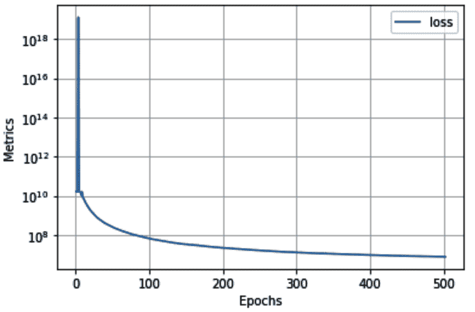

15.  使用内容和样式图像的组合绘制图像:

```py
out_img = postprocess(opt_img[0]).permute(1,2,0)
show(out_img)
```

输出如下所示:


从上图我们可以看出，图片是内容和风格图片的结合。

至此，我们已经看到了处理图像的两种方式:对抗性攻击来修改图像的类别，以及风格转换来将一个图像的风格与另一个图像的内容相结合。在下一节中，我们将学习如何生成深度假像，这种假像将表情从一张脸转移到另一张脸上。

# 产生深刻的假象

到目前为止，我们已经学习了两种不同的图像到图像的任务:使用 UNet 的语义分割和使用自编码器的图像重建。深度伪装是一种图像到图像的任务，有着非常相似的基本理论。

想象一下这样一个场景，您想要创建一个应用程序，该应用程序获取一张脸的给定图像，并以您想要的方式改变面部表情。在这种情况下，深度假货就派上了用场。虽然我们不会在本书中讨论深度假动作的最新进展，但像少数镜头对抗学习这样的技术可以用来生成带有感兴趣的面部表情的真实图像。关于深度假动作和 GANs 的知识(你将在接下来的章节中学习)将帮助你识别哪些视频是假视频。

在深度伪装的任务中，我们会有几百张 A 人的照片和几百张 B 人的照片，目的是用 A 人的面部表情重建 B 人的面部，反之亦然。

下图解释了深度假图像生成过程的工作原理:

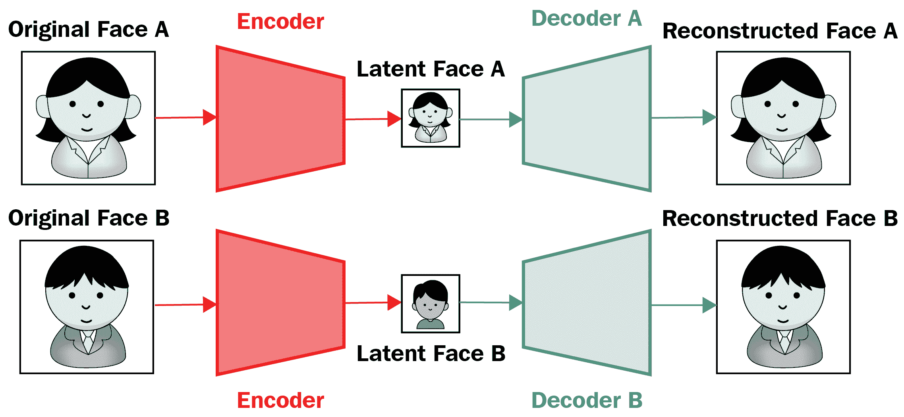

在上图中，我们通过编码器( **Encoder** )传递人 A 和人 B 的图像。一旦我们得到了人 A ( **潜脸 A** )和人 B ( **潜脸 B** )对应的潜向量，我们就将潜向量通过它们对应的解码器(**解码器 A** 和**解码器 B** )来获取对应的原始图像(**重构脸 A** 和**重构脸 B** )。到目前为止，编码器和解码器的概念与我们在*自编码器*部分学到的非常相似。然而，在这个场景中，*我们只有一个编码器，但是有两个解码器*(每个解码器对应不同的人)。期望从编码器获得的潜在向量表示关于图像中存在的面部表情的信息，而解码器获取对应于人的图像。一旦编码器和两个解码器被训练，在执行深度伪图像生成时，我们在我们的架构内切换连接如下:

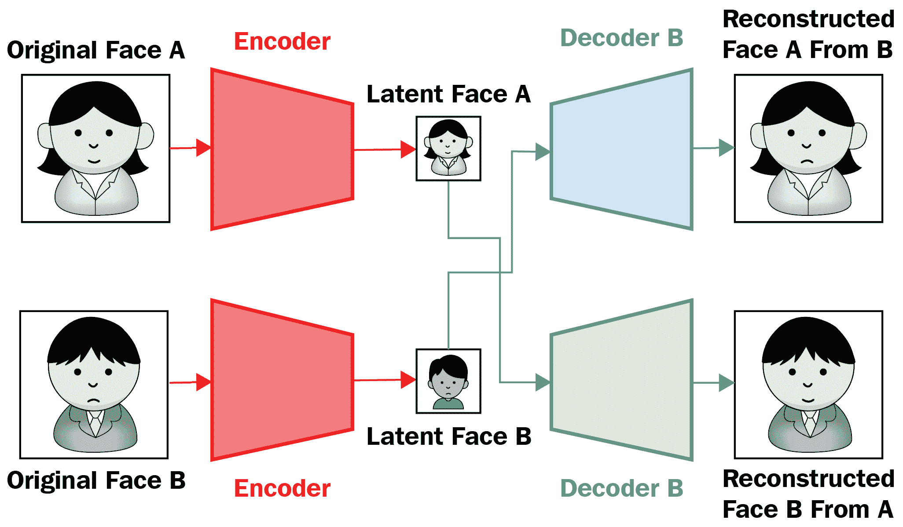

当人 A 的潜在向量通过解码器 B 时，重构的人 B 的脸将具有人 A 的特征(微笑的脸)，反之亦然。

有助于生成真实图像的另一个技巧是扭曲人脸图像，并以扭曲的人脸作为输入，原始图像作为输出的方式将它们提供给网络。

现在我们已经了解了它是如何工作的，让我们用下面的代码使用自编码器实现一个人的假图像和另一个人的表情的生成:

以下代码在本书的 GitHub 知识库的`Chapter11`文件夹中以`Generating_Deep_Fakes.ipynb`的形式提供-【https://tinyurl.com/mcvp-packt 代码包含下载数据的 URL，长度适中。我们强烈建议您在 GitHub 中执行笔记本以重现结果，同时理解执行的步骤和文本中各种代码组件的解释。

1.  让我们下载数据和源代码，如下所示:

```py
import os
if not os.path.exists('Faceswap-Deepfake-Pytorch'):
    !wget -q https://www.dropbox.com/s/5ji7jl7httso9ny/person_images.zip
    !wget -q https://raw.githubusercontent.com/sizhky/deep-fake-util/main/random_warp.py
    !unzip -q person_images.zip
!pip install -q torch_snippets torch_summary
from torch_snippets import *
from random_warp import get_training_data
```

2.  从图像中获取面部裁剪:

*   定义面部层叠，它在图像中的面部周围绘制一个边界框。在*第 18 章，OpenCV 图像分析实用程序*中有更多关于级联的内容。然而，现在，可以说面部层叠在图像中存在的面部周围绘制了一个紧密的边界框:

```py
face_cascade = cv2.CascadeClassifier(cv2.data.haarcascades + \
                        'haarcascade_frontalface_default.xml')
```

*   定义一个函数(`crop_face`)用于从图像中裁剪面部:

```py
def crop_face(img):
    gray = cv2.cvtColor(img, cv2.COLOR_BGR2GRAY)
    faces = face_cascade.detectMultiScale(gray, 1.3, 5)
    if(len(faces)>0):
        for (x,y,w,h) in faces:
            img2 = img[y:(y+h),x:(x+w),:]
        img2 = cv2.resize(img2,(256,256))
        return img2, True
    else:
        return img, False
```

在前面的函数中，我们通过 face cascade 传递灰度图像(`gray`)并裁剪包含人脸的矩形。接下来，我们将返回一个重新调整大小的图像(`img2`)。此外，考虑到在图像中没有检测到人脸的情况，我们传递一个标志来显示是否检测到人脸。

*   裁剪`personA`和`personB`的图像，并将它们放在单独的文件夹中:

```py
!mkdir cropped_faces_personA
!mkdir cropped_faces_personB

def crop_images(folder):
    images = Glob(folder+'/*.jpg')
    for i in range(len(images)):
        img = read(images[i],1)
        img2, face_detected = crop_face(img)
        if(face_detected==False):
            continue
        else:
            cv2.imwrite('cropped_faces_'+folder+'/'+str(i)+ \
                '.jpg',cv2.cvtColor(img2, cv2.COLOR_RGB2BGR))
crop_images('personA')
crop_images('personB')
```

3.  创建数据加载器并检查数据:

```py
class ImageDataset(Dataset):
    def __init__(self, items_A, items_B):
        self.items_A = np.concatenate([read(f,1)[None] \
                                       for f in items_A])/255.
        self.items_B = np.concatenate([read(f,1)[None] \
                                       for f in items_B])/255.
        self.items_A += self.items_B.mean(axis=(0, 1, 2)) \
                        - self.items_A.mean(axis=(0, 1, 2))

    def __len__(self):
        return min(len(self.items_A), len(self.items_B))
    def __getitem__(self, ix):
        a, b = choose(self.items_A), choose(self.items_B)
        return a, b

    def collate_fn(self, batch):
        imsA, imsB = list(zip(*batch))
        imsA, targetA = get_training_data(imsA, len(imsA))
        imsB, targetB = get_training_data(imsB, len(imsB))
        imsA, imsB, targetA, targetB = [torch.Tensor(i)\
                                        .permute(0,3,1,2)\
                                        .to(device) \
                                        for i in [imsA, imsB,\
                                        targetA, targetB]]
        return imsA, imsB, targetA, targetB

a = ImageDataset(Glob('cropped_faces_personA'), \
                 Glob('cropped_faces_personB'))
x = DataLoader(a, batch_size=32, collate_fn=a.collate_fn)
```

数据加载器返回四个张量，`imsA`、`imsB`、`targetA`和`targetB`。第一个张量(`imsA`)是第三个张量(`targetA`)的变形(扭曲)版本，第二个张量(`imsB`)是第四个张量(`targetB`)的变形(扭曲)版本。

此外，正如您在第`a =ImageDataset(Glob('cropped_faces_personA'), Glob('cropped_faces_personB'))`行中看到的，我们有两个图像文件夹，每个人一个。任何人脸之间都没有关系，在`__iteritems__`数据集中，我们每次都随机提取两张人脸。

这一步的关键功能是`get_training_data`，出现在`collate_fn`中。这是扭曲面的增强功能。我们将扭曲的人脸作为自编码器的输入，并尝试预测正常的人脸。

扭曲的优势在于，它不仅增加了我们的训练数据量，还充当了网络的正则化器，尽管给定了一张扭曲的脸，但网络仍被迫理解关键的面部特征。

*   让我们来看看几张图片:

```py
inspect(*next(iter(x)))

for i in next(iter(x)):
    subplots(i[:8], nc=4, sz=(4,2))
```

上述代码会产生以下输出:


注意，输入图像是扭曲的，而输出图像不是，并且输入到输出图像现在具有一一对应关系。

4.  构建模型并检查它:

*   定义卷积(`_ConvLayer`)和放大(`_UpScale`)函数，以及在构建模型时将利用的`Reshape`类:

```py
def _ConvLayer(input_features, output_features):
    return nn.Sequential(
        nn.Conv2d(input_features, output_features, 
                  kernel_size=5, stride=2, padding=2),
        nn.LeakyReLU(0.1, inplace=True)
    )

def _UpScale(input_features, output_features):
    return nn.Sequential(
        nn.ConvTranspose2d(input_features, output_features, 
                         kernel_size=2, stride=2, padding=0),
        nn.LeakyReLU(0.1, inplace=True)
    )

class Reshape(nn.Module):
    def forward(self, input):
        output = input.view(-1, 1024, 4, 4) # channel * 4 * 4
        return output
```

*   定义`Autoencoder`模型类，它有一个`encoder`和两个解码器(`decoder_A`和`decoder_B`):

```py
class Autoencoder(nn.Module):
    def __init__(self):
        super(Autoencoder, self).__init__()

        self.encoder = nn.Sequential(
                        _ConvLayer(3, 128),
                        _ConvLayer(128, 256),
                        _ConvLayer(256, 512),
                        _ConvLayer(512, 1024),
                        nn.Flatten(),
                        nn.Linear(1024 * 4 * 4, 1024),
                        nn.Linear(1024, 1024 * 4 * 4),
                        Reshape(),
                        _UpScale(1024, 512),
                    )

        self.decoder_A = nn.Sequential(
                        _UpScale(512, 256),
                        _UpScale(256, 128),
                        _UpScale(128, 64),
                        nn.Conv2d(64, 3, kernel_size=3, \
                                  padding=1),
                        nn.Sigmoid(),
                    )

        self.decoder_B = nn.Sequential(
                        _UpScale(512, 256),
                        _UpScale(256, 128),
                        _UpScale(128, 64),
                        nn.Conv2d(64, 3, kernel_size=3, \
                                  padding=1),
                        nn.Sigmoid(),
                    )

    def forward(self, x, select='A'):
        if select == 'A':
            out = self.encoder(x)
            out = self.decoder_A(out)
        else:
            out = self.encoder(x)
            out = self.decoder_B(out)
        return out
```

*   生成模型摘要:

```py
from torchsummary import summary
model = Autoencoder()
summary(model, torch.zeros(32,3,64,64), 'A');
```

上述代码生成以下输出:

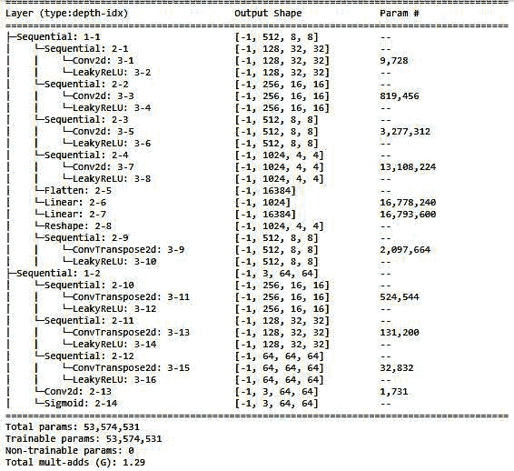

5.  定义`train_batch`逻辑:

```py
def train_batch(model, data, criterion, optimizes):
    optA, optB = optimizers
    optA.zero_grad()
    optB.zero_grad()
    imgA, imgB, targetA, targetB = data
    _imgA, _imgB = model(imgA, 'A'), model(imgB, 'B')

    lossA = criterion(_imgA, targetA)
    lossB = criterion(_imgB, targetB)

    lossA.backward()
    lossB.backward()

    optA.step()
    optB.step()

    return lossA.item(), lossB.item()
```

我们感兴趣的是运行`model(imgA, 'B')`(它将使用来自类 A 的输入图像返回类 B 的图像)，但是我们没有与之进行比较的基础事实。因此，我们现在做的是从`imgA`(其中`imgA`是`targetA`的扭曲版本)预测`_imgA`，并使用`nn.L1Loss`比较`_imgA`和`targetA`。

我们不需要`validate_batch`，因为没有验证数据集。我们将在训练中预测新的图像，并定性地观察进展。

6.  创建训练模型所需的所有组件:

```py
model = Autoencoder().to(device)

dataset = ImageDataset(Glob('cropped_faces_personA'), \
                       Glob('cropped_faces_personB'))
dataloader = DataLoader(dataset, 32, \
                        collate_fn=dataset.collate_fn)

optimizers=optim.Adam( \
                [{'params': model.encoder.parameters()}, \
                 {'params': model.decoder_A.parameters()}], \
                 lr=5e-5, betas=(0.5, 0.999)), \
        optim.Adam([{'params': model.encoder.parameters()}, \
                 {'params': model.decoder_B.parameters()}], \
                        lr=5e-5, betas=(0.5, 0.999))

criterion = nn.L1Loss()
```

7.  训练模型:

```py
n_epochs = 1000
log = Report(n_epochs)
!mkdir checkpoint
for ex in range(n_epochs):
    N = len(dataloader)
    for bx,data in enumerate(dataloader):
        lossA, lossB = train_batch(model, data, 
                                   criterion, optimizers)
        log.record(ex+(1+bx)/N, lossA=lossA, 
                   lossB=lossB, end='\r')

    log.report_avgs(ex+1)
    if (ex+1)%100 == 0:
        state = {
                'state': model.state_dict(),
                'epoch': ex
            }
        torch.save(state, './checkpoint/autoencoder.pth')

    if (ex+1)%100 == 0:
        bs = 5
        a,b,A,B = data
        line('A to B')
        _a = model(a[:bs], 'A')
        _b = model(a[:bs], 'B')
        x = torch.cat([A[:bs],_a,_b])
        subplots(x, nc=bs, figsize=(bs*2, 5))

        line('B to A')
        _a = model(b[:bs], 'A')
        _b = model(b[:bs], 'B')
        x = torch.cat([B[:bs],_a,_b])
        subplots(x, nc=bs, figsize=(bs*2, 5))

log.plot_epochs()
```

上述代码会生成重建的图像，如下所示:


损失值的变化如下:

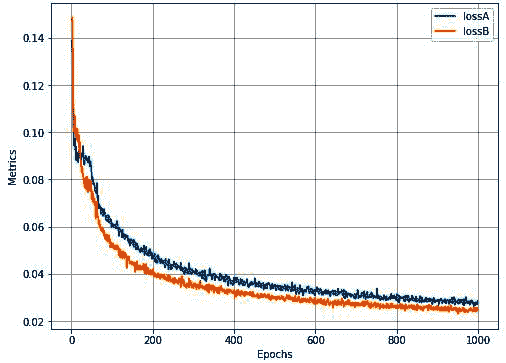

正如你所看到的，我们可以通过调整自编码器将一张脸的表情转换成另一张脸的表情。此外，随着历元数量的增加，重建的图像变得更加真实。

# 摘要

在这一章中，我们已经了解了自编码器的不同变体:普通的、卷积的和变化的。我们还了解了瓶颈层中的单元数量如何影响重建图像。接下来，我们学习了使用 t-SNE 技术识别与给定图像相似的图像。我们了解到，当我们对向量进行采样时，我们无法获得真实的图像，通过使用变分自编码器，我们了解到通过使用重建损失和 KL 发散损失的组合来生成新的图像。接下来，我们学习了如何对图像进行对抗性攻击，以修改图像的类别，同时不改变图像的感知内容。最后，我们了解了如何利用内容损失和基于 gram 矩阵的样式损失的组合来优化图像的内容和样式损失，从而得到由两个输入图像组合而成的图像。最后，我们学习了在没有任何监督的情况下调整自编码器来交换两张脸。

既然我们已经学习了从一组给定的图像中生成新的图像，在下一章中，我们将在这个主题的基础上使用一个叫做生成对抗网络的网络的变体来生成全新的图像。

# 问题

1.  什么是自编码器中的编码器？
2.  自编码器针对什么损失函数进行优化？
3.  自编码器如何帮助分组相似的图像？
4.  卷积自编码器什么时候有用？
5.  如果我们从普通/卷积自编码器获得的嵌入向量空间中随机采样，为什么会得到不直观的图像？
6.  VAEs 优化的损失函数是什么？
7.  VAEs 如何克服普通/卷积自编码器生成新图像的限制？
8.  在对抗性攻击中，为什么我们修改输入图像像素而不是权重值？

9.  在神经类型转移中，我们优化的损失是什么？
10.  为什么我们在计算样式和内容损失时考虑不同图层的激活而不考虑原始图像？
11.  为什么我们在计算风格损失时考虑的是克矩阵损失而不是图像之间的差异？
12.  为什么我们在建立模型的时候会扭曲图像，从而产生深度假像？