# 十三、用于操作图像的高级 GAN

在前一章中，我们学习了如何利用**生成对抗网络** ( **GANs** )来生成逼真的图像。在这一章中，我们将学习如何利用 GANs 来处理图像。我们将学习使用 GANs 生成图像的两种变体——监督和非监督方法。在监督方法中，我们将提供输入和输出对组合，以基于输入图像生成图像，我们将在 Pix2Pix GAN 中了解这一点。在无监督方法中，我们将指定输入和输出，然而，我们不会提供输入和输出之间的一一对应，而是期望 GAN 学习两个类的结构，并将图像从一个类转换为另一个类，这将在 CycleGAN 中学习。

另一类无监督的图像处理涉及从随机向量的潜在空间生成图像，并查看图像如何随着潜在向量值的变化而变化，我们将在*在自定义图像上利用 style gan*部分了解这一点。最后，我们将了解如何利用预先训练的 GAN–SRGAN，它有助于将低分辨率图像转换为高分辨率图像。

具体来说，我们将了解以下主题:

*   利用 Pix2Pix GAN
*   利用循环根
*   在自定义图像上利用 StyleGAN
*   超分辨率氮化镓

# 利用 Pix2Pix GAN

想象一个场景，我们有彼此相关的图像对(例如，一个对象的边缘图像作为输入，一个对象的实际图像作为输出)。给定的挑战是我们想要在给定物体边缘的输入图像的情况下生成图像。在传统的设置中，这将是一个简单的输入到输出的映射，因此是一个监督学习问题。然而，想象一下，你正和一个创意团队一起工作，他们正试图为产品设计出一个全新的外观。在这种情况下，监督学习没有太大帮助——因为它只从历史中学习。GAN 在这里很方便，因为它将确保生成的图像看起来足够真实，并为实验留下空间(因为我们有兴趣检查生成的图像是否像感兴趣的类之一)。

在本节中，我们将学习从手绘的鞋子轮廓生成鞋子图像的架构。我们将采用以下策略从涂鸦中生成逼真的图像:

1.  获取大量实际图像，并使用标准 cv2 边缘检测技术创建相应的轮廓。
2.  从原始图像的补丁中采样颜色，以便生成器知道要生成的颜色。
3.  构建一个 UNet 架构，将带有样本补丁颜色的轮廓作为输入，并预测相应的图像-这是我们的生成器。
4.  建立一个鉴别器架构，它可以拍摄图像并预测图像是真是假。
5.  将发生器和鉴别器一起训练到发生器可以生成欺骗鉴别器的图像的程度。

让我们编码策略:

以下代码在本书的 GitHub 知识库的`Chapter13`文件夹中以`Pix2Pix_GAN.ipynb`的形式提供-【https://tinyurl.com/mcvp-packt 代码包含下载数据的 URL，长度适中。我们强烈建议您在 GitHub 中执行 notebook 以重现结果，同时理解执行的步骤和对文本中各种代码组件的解释。

1.  导入数据集并安装相关包:

```py
try:
    !wget https://bit.ly/3kiuN93
    !mv 3kiuN93 ShoeV2.zip
    !unzip ShoeV2.zip
    !unzip ShoeV2_F/ShoeV2_photo.zip
except:
    !wget https://www.dropbox.com/s/g6b6gtvmdu0h77x/ShoeV2_photo.zip
!pip install torch_snippets
from torch_snippets import *
device = 'cuda' if torch.cuda.is_available() else 'cpu'
```

前面的代码下载鞋子的图像。下载图像的示例如下:


对于我们的问题，我们想画出鞋子的轮廓(边缘)和鞋子的样本补丁颜色。在下一步中，我们将获取给定鞋子图像的边缘。这样，我们可以训练一个模型，在给定鞋子的轮廓和样本补丁颜色的情况下，重建鞋子的图像。

2.  定义一个函数从下载的图像中提取边缘:

```py
def detect_edges(img):
    img_gray = cv2.cvtColor(img, cv2.COLOR_RGB2GRAY)
    img_gray = cv2.bilateralFilter(img_gray, 5, 50, 50)
    img_gray_edges = cv2.Canny(img_gray, 45, 100)
    # invert black/white
    img_gray_edges = cv2.bitwise_not(img_gray_edges) 
    img_edges=cv2.cvtColor(img_gray_edges,cv2.COLOR_GRAY2RGB)
    return img_edges
```

在前面的代码中，我们利用 OpenCV 包中可用的各种方法来获取图像中的边缘(关于 OpenCV 方法如何工作的更多细节，请参见第十八章、*中的[使用 OpenCV 实用程序进行图像分析](10c383c5-5c46-4d64-ab9c-9832ef3a3dae.xhtml)*)。

3.  定义图像转换管道(`preprocess`和`normalize`):

```py
IMAGE_SIZE = 256
preprocess = T.Compose([
                    T.Lambda(lambda x: torch.Tensor(x.copy())\
                             .permute(2, 0, 1).to(device))
                ])
normalize = lambda x: (x - 127.5)/127.5
```

4.  定义数据集类(`ShoesData`)。这个数据集类返回原始图像和带边缘的图像。我们将传递给网络的另一个细节是随机选择的区域中的颜色块。通过这种方式，我们使用户能够获得手绘轮廓图像，在图像的不同部分喷洒所需的颜色，并生成新的图像。此处显示了输入(第三幅图像)和输出(第一幅图像)的示例(彩色效果最佳):


然而，我们在步骤 1 中得到的输入图像只是鞋子的图像(第一幅图像)，我们将用它来提取鞋子的边缘(第二幅图像)。此外，我们将在下一步中使用颜色来获取前面图像的输入(第三个图像)-输出(第一个图像)组合。

在下面的代码中，我们将构建一个类，该类获取轮廓图像，散布颜色，并返回一对散布了颜色的图像和原始的鞋子图像(生成轮廓的图像):

*   定义`ShoesData`类、`__init__`方法和`__len__`方法:

```py
class ShoesData(Dataset):
    def __init__(self, items):
        self.items = items
    def __len__(self): return len(self.items)
```

*   定义`__getitem__`方法。在这种方法中，我们将处理输入图像以获取具有边缘的图像，然后用原始图像中存在的颜色来点缀图像。这里，我们获取给定图像的边缘:

```py
    def __getitem__(self, ix):
        f = self.items[ix]
        try: im = read(f, 1)
        except:
            blank = preprocess(Blank(IMAGE_SIZE, \
                                     IMAGE_SIZE, 3))
            return blank, blank
        edges = detect_edges(im)
```

*   一旦我们获取了图像的边缘，调整图像的大小并使其正常化:

```py
        im, edges = resize(im, IMAGE_SIZE), \
                    resize(edges, IMAGE_SIZE)
        im, edges = normalize(im), normalize(edges)
```

*   给`edges`图像和`preprocess`原始图像和`edges`图像上色:

```py
        self._draw_color_circles_on_src_img(edges, im)
        im, edges = preprocess(im), preprocess(edges)
        return edges, im
```

*   定义喷洒颜色的功能:

```py
    def _draw_color_circles_on_src_img(self, img_src, \
                                       img_target):
        non_white_coords = self._get_non_white_coordinates\
                                    (img_target)
        for center_y, center_x in non_white_coords:
            self._draw_color_circle_on_src_img(img_src, \
                        img_target, center_y, center_x)

    def _get_non_white_coordinates(self, img):
        non_white_mask = np.sum(img, axis=-1) < 2.75
        non_white_y, non_white_x = np.nonzero(non_white_mask)
        # randomly sample non-white coordinates
        n_non_white = len(non_white_y)
        n_color_points = min(n_non_white, 300)
        idxs = np.random.choice(n_non_white, n_color_points, \
                                replace=False)
        non_white_coords = list(zip(non_white_y[idxs], \
                                    non_white_x[idxs]))
        return non_white_coords

    def _draw_color_circle_on_src_img(self, img_src, \
                            img_target, center_y, center_x):
        assert img_src.shape == img_target.shape
        y0, y1, x0, x1 = self._get_color_point_bbox_coords(\
                                        center_y, center_x)
        color = np.mean(img_target[y0:y1, x0:x1],axis=(0, 1))
        img_src[y0:y1, x0:x1] = color

    def _get_color_point_bbox_coords(self, center_y,center_x):
        radius = 2
        y0 = max(0, center_y-radius+1)
        y1 = min(IMAGE_SIZE, center_y+radius)
        x0 = max(0, center_x-radius+1)
        x1 = min(IMAGE_SIZE, center_x+radius)
        return y0, y1, x0, x1

    def choose(self): return self[randint(len(self))]
```

5.  定义训练和验证数据对应的数据集和数据加载器:

```py
from sklearn.model_selection import train_test_split
train_items, val_items = train_test_split(\
                        Glob('ShoeV2_photo/*.png'), \
                        test_size=0.2, random_state=2)
trn_ds, val_ds = ShoesData(train_items), ShoesData(val_items)

trn_dl = DataLoader(trn_ds, batch_size=32, shuffle=True)
val_dl = DataLoader(val_ds, batch_size=32, shuffle=True)
```

6.  定义生成器和鉴别器架构，它们利用权重初始化(`weights_init_normal`)、`UNetDown`和`UNetUp`架构，正如我们在[第 9 章](40b56752-6dda-4449-8535-6bfcf5e534d8.xhtml)、*图像分割*和[第 10 章](9b3e4a1d-dfbb-4580-920c-5ff1238021b2.xhtml)、*目标检测和分割应用*中所做的那样，来定义`GeneratorUNet`和`Discriminator`架构。

*   初始化权重，使其遵循正态分布:

```py
def weights_init_normal(m):
    classname = m.__class__.__name__
    if classname.find("Conv") != -1:
        torch.nn.init.normal_(m.weight.data, 0.0, 0.02)
    elif classname.find("BatchNorm2d") != -1:
        torch.nn.init.normal_(m.weight.data, 1.0, 0.02)
        torch.nn.init.constant_(m.bias.data, 0.0)
```

*   定义`UNetwDown`和`UNetUp`类:

```py
class UNetDown(nn.Module):
    def __init__(self, in_size, out_size, normalize=True, \
                 dropout=0.0):
        super(UNetDown, self).__init__()
        layers = [nn.Conv2d(in_size, out_size, 4, 2, 1, \
                            bias=False)]
        if normalize:
            layers.append(nn.InstanceNorm2d(out_size))
        layers.append(nn.LeakyReLU(0.2))
        if dropout:
            layers.append(nn.Dropout(dropout))
        self.model = nn.Sequential(*layers)

    def forward(self, x):
        return self.model(x)

class UNetUp(nn.Module):
    def __init__(self, in_size, out_size, dropout=0.0):
        super(UNetUp, self).__init__()
        layers = [
            nn.ConvTranspose2d(in_size, out_size, 4, 2, 1, \
                               bias=False),
            nn.InstanceNorm2d(out_size),
            nn.ReLU(inplace=True),
        ]
        if dropout:
            layers.append(nn.Dropout(dropout))

        self.model = nn.Sequential(*layers)

    def forward(self, x, skip_input):
        x = self.model(x)
        x = torch.cat((x, skip_input), 1)

        return x
```

*   定义`GeneratorUNet`类:

```py
class GeneratorUNet(nn.Module):
    def __init__(self, in_channels=3, out_channels=3):
        super(GeneratorUNet, self).__init__()

        self.down1 = UNetDown(in_channels,64,normalize=False)
        self.down2 = UNetDown(64, 128)
        self.down3 = UNetDown(128, 256)
        self.down4 = UNetDown(256, 512, dropout=0.5)
        self.down5 = UNetDown(512, 512, dropout=0.5)
        self.down6 = UNetDown(512, 512, dropout=0.5)
        self.down7 = UNetDown(512, 512, dropout=0.5)
        self.down8 = UNetDown(512, 512, normalize=False, \
                              dropout=0.5)

        self.up1 = UNetUp(512, 512, dropout=0.5)
        self.up2 = UNetUp(1024, 512, dropout=0.5)
        self.up3 = UNetUp(1024, 512, dropout=0.5)
        self.up4 = UNetUp(1024, 512, dropout=0.5)
        self.up5 = UNetUp(1024, 256)
        self.up6 = UNetUp(512, 128)
        self.up7 = UNetUp(256, 64)

        self.final = nn.Sequential(
            nn.Upsample(scale_factor=2),
            nn.ZeroPad2d((1, 0, 1, 0)),
            nn.Conv2d(128, out_channels, 4, padding=1),
            nn.Tanh(),
        )

    def forward(self, x):
        d1 = self.down1(x)
        d2 = self.down2(d1)
        d3 = self.down3(d2)
        d4 = self.down4(d3)
        d5 = self.down5(d4)
        d6 = self.down6(d5)
        d7 = self.down7(d6)
        d8 = self.down8(d7)
        u1 = self.up1(d8, d7)
        u2 = self.up2(u1, d6)
        u3 = self.up3(u2, d5)
        u4 = self.up4(u3, d4)
        u5 = self.up5(u4, d3)
        u6 = self.up6(u5, d2)
        u7 = self.up7(u6, d1)
        return self.final(u7)
```

*   定义`Discriminator`类:

```py
class Discriminator(nn.Module):
    def __init__(self, in_channels=3):
        super(Discriminator, self).__init__()

        def discriminator_block(in_filters, out_filters, \
                                normalization=True):
            """Returns downsampling layers of each 
            discriminator block"""
            layers = [nn.Conv2d(in_filters, out_filters, \
                                4, stride=2, padding=1)]
            if normalization:
                layers.append(nn.InstanceNorm2d(out_filters))
            layers.append(nn.LeakyReLU(0.2, inplace=True))
            return layers

        self.model = nn.Sequential(
            *discriminator_block(in_channels * 2, 64, \
                                 normalization=False),
            *discriminator_block(64, 128),
            *discriminator_block(128, 256),
            *discriminator_block(256, 512),
            nn.ZeroPad2d((1, 0, 1, 0)),
            nn.Conv2d(512, 1, 4, padding=1, bias=False)
        )

    def forward(self, img_A, img_B):
        img_input = torch.cat((img_A, img_B), 1)
        return self.model(img_input)
```

7.  定义`generator`和`discriminator`模型对象并提取摘要:

```py
generator = GeneratorUNet().to(device)
discriminator = Discriminator().to(device)
!pip install torch_summary
from torchsummary import summary
print(summary(generator, torch.zeros(3, 3, IMAGE_SIZE, \
                            IMAGE_SIZE).to(device)))
print(summary(discriminator, torch.zeros(3, 3, IMAGE_SIZE, \
                IMAGE_SIZE).to(device), torch.zeros(3, 3, \
                IMAGE_SIZE, IMAGE_SIZE).to(device)))
```

发电机架构总结如下:


鉴别器架构概述如下:

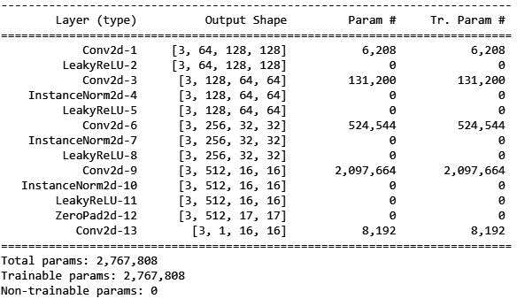

8.  定义训练鉴别器的函数(`discriminator_train_step`):

*   鉴别器函数将源图像(`real_src`)、真实目标(`real_trg`)和虚假目标(`fake_trg`)作为输入:

```py
def discriminator_train_step(real_src, real_trg, fake_trg):
    d_optimizer.zero_grad()
```

*   通过比较真实目标(`real_trg`)和目标的预测值(`real_src`)来计算损失(`error_real`)，其中期望鉴别器将图像预测为真实的(由`torch.ones`表示)，然后执行反向传播:

```py
    prediction_real = discriminator(real_trg, real_src)
    error_real = criterion_GAN(prediction_real, \
                    torch.ones(len(real_src), 1, 16, 16)\
                               .to(device))
    error_real.backward()
```

*   计算假图像(`fake_trg`)对应的鉴别器损失(`error_fake`)，期望鉴别器将假目标归类为假图像(用`torch.zeros`表示)，然后进行反向传播:

```py
    prediction_fake = discriminator( real_src, \
                                    fake_trg.detach())
    error_fake = criterion_GAN(prediction_fake, \
                               torch.zeros(len(real_src), 1, \
                                           16, 16).to(device))
    error_fake.backward()
```

*   执行优化器步骤，并返回预测的真实和虚假目标的总体错误和损失值:

```py
    d_optimizer.step()
    return error_real + error_fake
```

9.  定义训练生成器(`generator_train_step`)的函数，在该函数中，生成器接受假目标(`fake_trg`)并将其训练到通过鉴别器时被识别为假目标的可能性较低的场景:

```py
def generator_train_step(real_src, fake_trg):
    g_optimizer.zero_grad()
    prediction = discriminator(fake_trg, real_src)

    loss_GAN = criterion_GAN(prediction, torch.ones(\
                            len(real_src), 1, 16, 16)\
                             .to(device))
    loss_pixel = criterion_pixelwise(fake_trg, real_trg)
    loss_G = loss_GAN + lambda_pixel * loss_pixel

    loss_G.backward()
    g_optimizer.step()
    return loss_G
```

请注意，在前面的代码中，除了生成器损耗，我们还获取了与给定轮廓的生成图像和真实图像之间的差异相对应的像素损耗(`loss_pixel`):

*   定义一个函数来获取预测样本:

```py
denorm = T.Normalize((-1, -1, -1), (2, 2, 2))
def sample_prediction():
    """Saves a generated sample from the validation set"""
    data = next(iter(val_dl))
    real_src, real_trg = data
    fake_trg = generator(real_src)
    img_sample = torch.cat([denorm(real_src[0]), \
                            denorm(fake_trg[0]), \
                            denorm(real_trg[0])], -1)
    img_sample = img_sample.detach().cpu()\
                           .permute(1,2,0).numpy()
    show(img_sample, title='Source::Generated::GroundTruth', \
         sz=12)
```

10.  将权重初始化(`weights_init_normal`)应用于发生器和鉴别器模型对象:

```py
generator.apply(weights_init_normal)
discriminator.apply(weights_init_normal)
```

11.  指定损失标准和优化方法(`criterion_GAN`和`criterion_pixelwise`):

```py
criterion_GAN = torch.nn.MSELoss()
criterion_pixelwise = torch.nn.L1Loss()

lambda_pixel = 100
g_optimizer = torch.optim.Adam(generator.parameters(), \
                               lr=0.0002, betas=(0.5, 0.999))
d_optimizer = torch.optim.Adam(discriminator.parameters(), \
                               lr=0.0002, betas=(0.5, 0.999))
```

12.  训练模型超过 100 个时期:

```py
epochs = 100
log = Report(epochs)
for epoch in range(epochs):
    N = len(trn_dl)
    for bx, batch in enumerate(trn_dl):
        real_src, real_trg = batch
        fake_trg = generator(real_src) 
        errD = discriminator_train_step(real_src, real_trg, \
                                        fake_trg)
        errG = generator_train_step(real_src, fake_trg)
        log.record(pos=epoch+(1+bx)/N, errD=errD.item(), \
                   errG=errG.item(), end='\r')
    [sample_prediction() for _ in range(2)]
```

13.  在样本手绘轮廓上生成:

```py
[sample_prediction() for _ in range(2)]
```

上述代码生成以下输出:

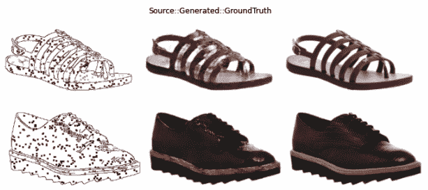

请注意，在前面的输出中，我们生成了与原始图像颜色相似的图像。

在本节中，我们学习了如何利用图像的轮廓来生成图像。然而，这要求我们成对地提供输入和输出，这有时会是一个繁琐的过程。在下一节中，我们将了解不成对的图像转换，在这种情况下，无需我们指定图像的输入和输出映射，网络就能计算出转换。

# 利用循环根

想象一个场景，我们要求您执行从一个类到另一个类的图像转换，但是没有给出输入和相应的输出图像来训练模型。然而，我们在两个不同的文件夹中给你两个类的图像。在这种情况下，CycleGAN 就派上了用场。

在本节中，我们将学习如何训练 CycleGAN 将苹果的图像转换为橙子的图像，反之亦然。CycleGAN 中的**循环**指的是我们把一个图像从一个类翻译(转换)到另一个类，再回到原来的类。

概括地说，在此架构中，我们将有三个独立的损耗值(此处提供了更多详细信息):

*   **鉴别器损失**:这确保在训练模型时修改对象类(如前一节所示)。
*   **循环损耗**:将一幅图像从生成的图像循环到原始图像，以保证周围像素不被改变的损耗。
*   **身份损失**:当一个类别的图像通过一个生成器时的损失，该生成器预期将另一个类别的图像转换成输入图像的类别。

在这里，我们将从较高的层面了解构建 CycleGAN 的步骤:

1.  导入和预处理数据集
2.  构建发生器和鉴别器网络 UNet 架构
3.  定义两个生成器:

*   **G_AB** :将 A 类图像转换为 B 类图像的生成器
*   **G_BA** :将 B 类图像转换为 A 类图像的生成器

4.  定义**身份丧失**:

*   如果你要发送一个橙色图像给一个橙色生成器，理想情况下，如果生成器已经理解了关于橙色的一切，它不应该改变图像，应该“生成”完全相同的图像。因此，我们利用这些知识创造了一个身份。
*   当类别 A (real_A)的图像通过 G_BA 并与 real_A 比较时，身份损失应该是最小的。
*   当类 B (real_B)的图像通过 G_AB 并与 real_B 比较时，身份损失应该是最小的。

5.  定义 **GAN 损耗:**

*   real_A 和 fake_A 的鉴频器和发生器损耗(当 real_B 图像通过 G_BA 时获得 fake_A)
*   real_B 和 fake_B 的鉴频器和发生器损耗(当 real_A 图像通过 G_AB 时获得 fake_B)

6.  定义 re- **周期** **损耗:**

*   考虑一个场景，其中一个苹果的图像将被一个橙子生成器转换成一个假橙子，而假橙子将被苹果生成器转换回一个苹果。
*   fake_B，是 real_A 通过 G_AB 时的输出，fake_B 通过 G_BA 时应该会重新生成 real_A。
*   fake_A，是 real_B 通过 G_BA 时的输出，fake_A 通过 G_AB 时应该会重新生成 real_B。

7.  针对三种损失的加权损失进行优化。

现在我们已经了解了这些步骤，让我们对它们进行编码，以便将苹果转换成橙子，反之亦然，如下所示:

以下代码在本书的 GitHub 知识库的`Chapter13`文件夹中以`CycleGAN.ipynb`的形式提供-【https://tinyurl.com/mcvp-packt 代码包含下载数据的 URL，长度适中。我们强烈建议您在 GitHub 中执行笔记本以重现结果，同时理解执行的步骤和文本中各种代码组件的解释。

1.  导入相关数据集和包:

*   下载并提取数据集:

```py
!wget https://www.dropbox.com/s/2xltmolfbfharri/apples_oranges.zip
!unzip apples_oranges.zip
```

我们将要处理的图像样本:

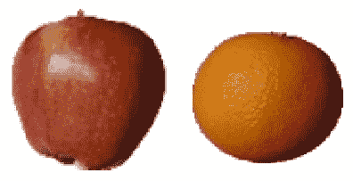

请注意，苹果和橙色图像之间没有一对一的对应关系(不像我们在*利用 Pix2Pix GAN* 部分了解的轮廓到鞋子生成用例)。

*   导入所需的包:

```py
!pip install torch_snippets torch_summary
import itertools
from PIL import Image
from torch_snippets import *
from torchvision import transforms
from torchvision.utils import make_grid
from torchsummary import summary
```

2.  定义图像转换管道(`transform`):

```py
IMAGE_SIZE = 256
device = 'cuda' if torch.cuda.is_available() else 'cpu'
transform = transforms.Compose([
    transforms.Resize(int(IMAGE_SIZE*1.33)),
    transforms.RandomCrop((IMAGE_SIZE,IMAGE_SIZE)),
    transforms.RandomHorizontalFlip(),
    transforms.ToTensor(),
    transforms.Normalize((0.5, 0.5, 0.5), (0.5, 0.5, 0.5)),
])
```

3.  定义 dataset 类(`CycleGANDataset`)，以`apple`和`orange`文件夹(解压下载的数据集后得到)为输入，提供一批苹果和橙子的图片:

```py
class CycleGANDataset(Dataset):
    def __init__(self, apples, oranges):
        self.apples = Glob(apples)
        self.oranges = Glob(oranges)

    def __getitem__(self, ix):
        apple = self.apples[ix % len(self.apples)]
        orange = choose(self.oranges)
        apple = Image.open(apple).convert('RGB')
        orange = Image.open(orange).convert('RGB')
        return apple, orange

    def __len__(self): return max(len(self.apples), \
                                  len(self.oranges))
    def choose(self): return self[randint(len(self))]

    def collate_fn(self, batch):
        srcs, trgs = list(zip(*batch))
        srcs=torch.cat([transform(img)[None] for img in srcs]\
                         , 0).to(device).float()
        trgs=torch.cat([transform(img)[None] for img in trgs]\
                         , 0).to(device).float()
        return srcs.to(device), trgs.to(device)
```

4.  定义训练和验证数据集以及数据加载器:

```py
trn_ds = CycleGANDataset('apples_train', 'oranges_train')
val_ds = CycleGANDataset('apples_test', 'oranges_test')

trn_dl = DataLoader(trn_ds, batch_size=1, shuffle=True, \
                    collate_fn=trn_ds.collate_fn)
val_dl = DataLoader(val_ds, batch_size=5, shuffle=True, \
                    collate_fn=val_ds.collate_fn)
```

5.  按照前面章节的定义，定义网络的权重初始化方法(`weights_init_normal`):

```py
def weights_init_normal(m):
    classname = m.__class__.__name__
    if classname.find("Conv") != -1:
        torch.nn.init.normal_(m.weight.data, 0.0, 0.02)
        if hasattr(m, "bias") and m.bias is not None:
            torch.nn.init.constant_(m.bias.data, 0.0)
    elif classname.find("BatchNorm2d") != -1:
        torch.nn.init.normal_(m.weight.data, 1.0, 0.02)
        torch.nn.init.constant_(m.bias.data, 0.0)
```

6.  定义剩余块网络(`ResidualBlock`)，因为在这个实例中，我们将利用 ResNet:

```py
class ResidualBlock(nn.Module):
    def __init__(self, in_features):
        super(ResidualBlock, self).__init__()

        self.block = nn.Sequential(
            nn.ReflectionPad2d(1),
            nn.Conv2d(in_features, in_features, 3),
            nn.InstanceNorm2d(in_features),
            nn.ReLU(inplace=True),
            nn.ReflectionPad2d(1),
            nn.Conv2d(in_features, in_features, 3),
            nn.InstanceNorm2d(in_features),
        )

    def forward(self, x):
        return x + self.block(x)
```

7.  定义发电机网络(`GeneratorResNet`):

```py
class GeneratorResNet(nn.Module):
    def __init__(self, num_residual_blocks=9):
        super(GeneratorResNet, self).__init__()
        out_features = 64
        channels = 3
        model = [
            nn.ReflectionPad2d(3),
            nn.Conv2d(channels, out_features, 7),
            nn.InstanceNorm2d(out_features),
            nn.ReLU(inplace=True),
        ]
        in_features = out_features
        # Downsampling
        for _ in range(2):
            out_features *= 2
            model += [
                nn.Conv2d(in_features, out_features, 3, \
                          stride=2, padding=1),
                nn.InstanceNorm2d(out_features),
                nn.ReLU(inplace=True),
            ]
            in_features = out_features

        # Residual blocks
        for _ in range(num_residual_blocks):
            model += [ResidualBlock(out_features)]

        # Upsampling
        for _ in range(2):
            out_features //= 2
            model += [
                nn.Upsample(scale_factor=2),
                nn.Conv2d(in_features, out_features, 3, \
                          stride=1, padding=1),
                nn.InstanceNorm2d(out_features),
                nn.ReLU(inplace=True),
            ]
            in_features = out_features

        # Output layer
        model += [nn.ReflectionPad2d(channels), \
                  nn.Conv2d(out_features, channels, 7), \
                  nn.Tanh()]
        self.model = nn.Sequential(*model)
        self.apply(weights_init_normal)
    def forward(self, x):
        return self.model(x)
```

8.  定义鉴别器网络(`Discriminator`):

```py
class Discriminator(nn.Module):
    def __init__(self):
        super(Discriminator, self).__init__()

        channels, height, width = 3, IMAGE_SIZE, IMAGE_SIZE

        def discriminator_block(in_filters, out_filters, \
                                normalize=True):
            """Returns downsampling layers of each 
            discriminator block"""
            layers = [nn.Conv2d(in_filters, out_filters, \
                                4, stride=2, padding=1)]
            if normalize:
                layers.append(nn.InstanceNorm2d(out_filters))
            layers.append(nn.LeakyReLU(0.2, inplace=True))
            return layers

        self.model = nn.Sequential(
            *discriminator_block(channels,64,normalize=False),
            *discriminator_block(64, 128),
            *discriminator_block(128, 256),
            *discriminator_block(256, 512),
            nn.ZeroPad2d((1, 0, 1, 0)),
            nn.Conv2d(512, 1, 4, padding=1)
        )
        self.apply(weights_init_normal)

    def forward(self, img):
        return self.model(img)
```

*   定义生成图像样本的函数-`generate_sample`:

```py
@torch.no_grad()
def generate_sample():
    data = next(iter(val_dl))
    G_AB.eval()
    G_BA.eval()    
    real_A, real_B = data
    fake_B = G_AB(real_A)
    fake_A = G_BA(real_B)
    # Arange images along x-axis
    real_A = make_grid(real_A, nrow=5, normalize=True)
    real_B = make_grid(real_B, nrow=5, normalize=True)
    fake_A = make_grid(fake_A, nrow=5, normalize=True)
    fake_B = make_grid(fake_B, nrow=5, normalize=True)
    # Arange images along y-axis
    image_grid = torch.cat((real_A,fake_B,real_B,fake_A), 1)
    show(image_grid.detach().cpu().permute(1,2,0).numpy(), \
         sz=12)
```

9.  定义训练发电机的功能(`generator_train_step`):

*   该函数以两个发电机模型(G_AB 和 G_BA 为`Gs`)、`optimizer`和两个类的实像——`real_A`和`real_B`——作为输入:

```py
def generator_train_step(Gs, optimizer, real_A, real_B):
```

*   指定生成器:

```py
    G_AB, G_BA = Gs
```

*   将优化器的梯度设置为零:

```py
    optimizer.zero_grad()
```

*   如果你要发送一个橙色图像到一个橙色生成器，理想情况下，如果生成器已经理解了关于橙色的一切，它不应该对图像做任何改变，应该“生成”精确的图像。因此，我们利用这些知识创造了一个身份。对应于`criterion_identity`的损失函数将在训练模型之前给出。计算 A 类图像(苹果)和 B 类图像(橙子)的身份损失(`loss_identity`):

```py
    loss_id_A = criterion_identity(G_BA(real_A), real_A)
    loss_id_B = criterion_identity(G_AB(real_B), real_B)

    loss_identity = (loss_id_A + loss_id_B) / 2
```

*   当图像通过生成器时，计算 GAN 损耗，并且生成的图像应尽可能接近另一个类别(在这种情况下，当训练生成器时，我们有`np.ones`，因为我们将一个类别的假图像传递给同一类别的鉴别器):

```py
    fake_B = G_AB(real_A)
    loss_GAN_AB = criterion_GAN(D_B(fake_B), \
                torch.Tensor(np.ones((len(real_A), 1, \
                                      16, 16))).to(device))
    fake_A = G_BA(real_B)
    loss_GAN_BA = criterion_GAN(D_A(fake_A), \
                torch.Tensor(np.ones((len(real_A), 1, \
                                      16, 16))).to(device))

    loss_GAN = (loss_GAN_AB + loss_GAN_BA) / 2
```

*   计算循环损耗。考虑一个场景，其中一个苹果的图像将被一个橙子生成器转换成一个假橙子，并且这样一个假橙子将被苹果生成器转换回苹果。如果发生器是完美的，这个过程应该返回原始图像，这意味着以下循环损耗应该为零:

```py
    recov_A = G_BA(fake_B)
    loss_cycle_A = criterion_cycle(recov_A, real_A)
    recov_B = G_AB(fake_A)
    loss_cycle_B = criterion_cycle(recov_B, real_B)

    loss_cycle = (loss_cycle_A + loss_cycle_B) / 2
```

*   计算总损耗，并在返回计算值之前执行反向传播:

```py
    loss_G = loss_GAN + lambda_cyc * loss_cycle + \
            lambda_id * loss_identity
    loss_G.backward()
    optimizer.step()
    return loss_G, loss_identity, loss_GAN, loss_cycle, \
            loss_G, fake_A, fake_B
```

10.  定义训练鉴别器的函数(`discriminator_train_step`):

```py
def discriminator_train_step(D, real_data, fake_data, \
                             optimizer):
    optimizer.zero_grad()
    loss_real = criterion_GAN(D(real_data), \
             torch.Tensor(np.ones((len(real_data), 1, \
                                   16, 16))).to(device))
    loss_fake = criterion_GAN(D(fake_data.detach()), \
             torch.Tensor(np.zeros((len(real_data), 1, \
                                   16, 16))).to(device))
    loss_D = (loss_real + loss_fake) / 2
    loss_D.backward()
    optimizer.step()
    return loss_D
```

11.  定义生成器、鉴别器对象、优化器和损失函数:

```py
G_AB = GeneratorResNet().to(device)
G_BA = GeneratorResNet().to(device)
D_A = Discriminator().to(device)
D_B = Discriminator().to(device)

criterion_GAN = torch.nn.MSELoss()
criterion_cycle = torch.nn.L1Loss()
criterion_identity = torch.nn.L1Loss()

optimizer_G = torch.optim.Adam(
    itertools.chain(G_AB.parameters(), G_BA.parameters()), \
    lr=0.0002, betas=(0.5, 0.999))
optimizer_D_A = torch.optim.Adam(D_A.parameters(), \
                        lr=0.0002, betas=(0.5, 0.999))
optimizer_D_B = torch.optim.Adam(D_B.parameters(), \
                        lr=0.0002, betas=(0.5, 0.999))

lambda_cyc, lambda_id = 10.0, 5.0
```

12.  在越来越多的时期训练网络:

```py
n_epochs = 10
log = Report(n_epochs)
for epoch in range(n_epochs):
    N = len(trn_dl)
    for bx, batch in enumerate(trn_dl):
        real_A, real_B = batch

        loss_G, loss_identity, loss_GAN, loss_cycle, \
        loss_G, fake_A, fake_B = generator_train_step(\
                                  (G_AB,G_BA), optimizer_G, \
                                  real_A, real_B)
        loss_D_A = discriminator_train_step(D_A, real_A, \
                                    fake_A, optimizer_D_A)
        loss_D_B = discriminator_train_step(D_B, real_B, \
                                    fake_B, optimizer_D_B)
        loss_D = (loss_D_A + loss_D_B) / 2

        log.record(epoch+(1+bx)/N, loss_D=loss_D.item(), \
            loss_G=loss_G.item(), loss_GAN=loss_GAN.item(), \
            loss_cycle=loss_cycle.item(), \
           loss_identity=loss_identity.item(), end='\r')
        if bx%100==0: generate_sample()

    log.report_avgs(epoch+1)
```

13.  训练完模型后生成图像:

```py
generate_sample()
```

上述代码生成以下输出:

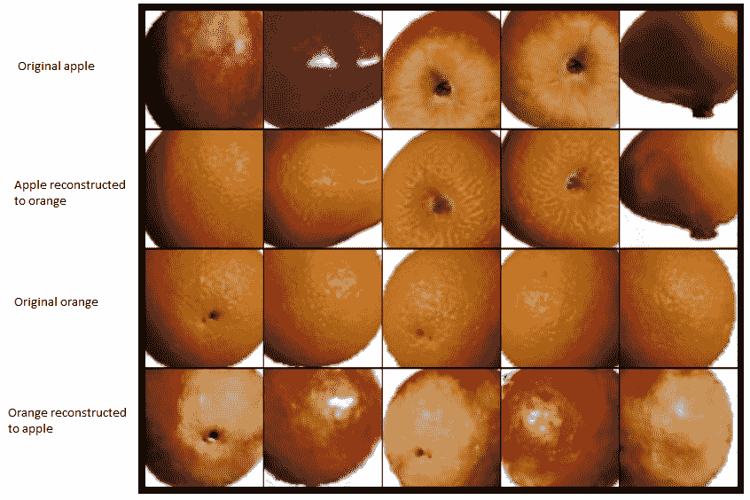

从前面的例子中，我们可以看到，我们成功地将苹果转换为橙子(前两行)，将橙子转换为苹果(后两行)。

到目前为止，我们已经了解了通过 Pix2Pix GAN 的成对图像到图像转换和通过 CycleGAN 的不成对图像到图像转换。在下一节中，我们将了解如何利用 StyleGAN 将一种样式的图像转换成另一种样式的图像。

# 在自定义图像上利用 StyleGAN

让我们首先了解在 StyleGAN 发明之前的一些历史发展。正如我们所知，从上一章生成假面涉及到了 GANs 的使用。研究面临的最大问题是可以生成的图像很小(通常为 64 x 64)。任何产生较大尺寸图像的努力都会导致生成器或鉴别器陷入局部极小值，从而停止训练并产生乱码。生成高质量图像的重大飞跃之一涉及一篇名为 ProGAN(Progressive GAN 的缩写)的研究论文，其中涉及一个聪明的技巧。

发生器和鉴别器的尺寸都逐渐增大。在第一步中，创建一个生成器和鉴别器，从潜在向量生成 4 x 4 图像。在此之后，附加卷积(和放大)层被添加到经过训练的生成器和鉴别器，其将负责接受 4×4 图像(在步骤 1 中从潜在向量生成)并生成/鉴别 8×8 图像。一旦这个步骤也完成了，新的层在发生器和鉴别器中再次被创建，被训练以生成更大的图像。图像大小以这种方式一步一步(渐进地)增加。其逻辑是，向已经运行良好的网络添加新层比从头开始学习所有层更容易。通过这种方式，图像被放大到 1024×1024 像素的分辨率(图像来源:[https://arxiv.org/pdf/1710.10196v3.pdf](https://arxiv.org/pdf/1710.10196v3.pdf)):

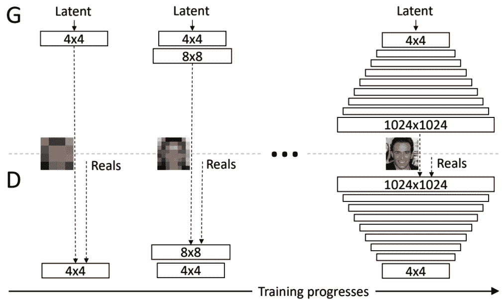

尽管它取得了很大的成功，但控制生成图像的各个方面(如性别和年龄)却相当困难，这主要是因为网络只能获得一个输入(在前面的图像中:潜伏在网络的顶部)。StyleGAN 解决了这个问题。

StyleGAN 使用了一种类似的训练方案，图像是逐步生成的，但每次网络增长时都会增加一组潜在输入。这意味着该网络现在接受多个潜在向量在定期间隔的图像大小生成。在生成阶段给出的每一个潜势决定了在那个网络阶段将要生成的特征(风格)。让我们在这里更详细地讨论 StyleGAN 的工作细节:

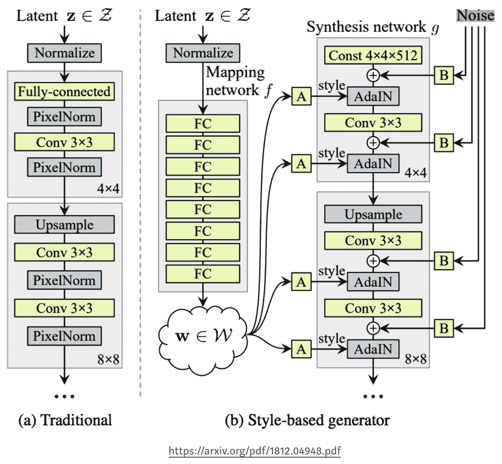

在上图中，我们可以对比生成图像的传统方式和基于样式的生成器。在传统的发电机中，只有一个输入。但是，在基于样式的生成器中有一种机制。下面我们来了解一下细节:

1.  创建一个大小为 1 x 512 的随机噪声向量 *z* 。
2.  将此馈送到一个称为样式网络(或映射网络)的辅助网络，该网络创建一个大小为 18 x 512 的张量 *w* 。

3.  发生器(合成)网络包含 18 个卷积层。每层将接受以下内容作为输入:
    *   对应行的*w*(‘A’)
    *   随机噪声向量(“B”)
    *   前一层的输出

请注意，噪声(‘B’)仅用于正则化目的。

前面的三个组合将创建一个接收 1 x 512 矢量的管道，并创建一个 1024 x 1024 的图像。

现在，让我们了解从映射网络生成的 18×512 向量中的 18 个 1×512 向量中的每一个如何对图像的生成做出贡献。在合成网络的前几层添加的 1 x 512 矢量有助于图像中存在的整体姿势和大比例特征，如姿势、脸型等(因为它们负责生成 4 x 4、8 x 8 图像等，这些是将在后面的层中进一步增强的前几个图像)。中间层中添加的矢量对应于小比例特征，例如发型、眼睛睁开/闭上(因为它们负责生成 16 x 16、32 x 32 和 64 x 64 的图像)。最后几层添加的矢量对应于图像的配色方案和其他微结构。当我们到达最后几层时，图像结构被保留，面部特征被保留但只有图像级细节如光照条件被改变。

在本节中，我们将利用预先训练的 StyleGAN2 模型来定制我们感兴趣的图像，使其具有不同的风格。

对于我们的目标，我们将使用 StyleGAN2 模型执行样式转换。概括地说，下面是 faces 上的样式转换是如何工作的(下面的内容在您浏览代码的结果时会更清楚):

*   假设 w [1] 样式向量用于生成 face-1，w [2] 样式向量用于生成 face-2。两个都是 18 x 512。
*   w [2] 中 18 个矢量的前几个(负责生成 4×4 到 8×8 分辨率的图像)被替换为 w [1] 中的相应矢量。然后，我们转移非常粗糙的特征，例如从面 1 到面 2 的姿态。

*   如果在 w [2] 中用 w [1] 中的样式向量替换后面的样式向量(比如 18 x 512 的第三个到第十五个——它们负责生成 64 x 64 到 256 x 256 维的一批图像),那么我们就转移眼睛、鼻子和其他面部中级特征。
*   如果最后几个风格向量(其负责生成 512 x 512 到 1024 x 1024 维的一批图像)被替换，则精细级别的特征如肤色和背景(其不会以显著的方式影响整个面部)被转移。

了解了如何进行样式转换后，现在让我们了解如何使用 StyleGAN2 在自定义图像上执行样式转换:

1.  拍摄自定义图像。
2.  对齐自定义图像，以便仅存储图像的面部区域。
3.  获取可能生成自定义校准图像的潜在向量。
4.  通过将随机潜在向量(1 x 512)传递到映射网络来生成图像。

到这一步，我们有两个图像——我们定制的对齐图像和由 StyleGAN2 网络生成的图像。我们现在想把自定义图像的一些特性转移到生成的图像上，反之亦然。

让我们编写前面的策略。

请注意，我们正在利用从 GitHub 存储库中获取的预训练网络，因为训练这样的网络需要几天甚至几周的时间:

您需要一个支持 CUDA 的环境来运行下面的代码。以下代码在本书的 GitHub 知识库的`Chapter13`文件夹中以`Customizing_StyleGAN2.ipynb`的形式提供-【https://tinyurl.com/mcvp-packt 代码包含下载数据的 URL，长度适中。我们强烈建议您在 GitHub 中执行 notebook 以重现结果，同时理解执行的步骤和对文本中各种代码组件的解释。

1.  克隆存储库，安装需求，并获取预先训练好的权重:

```py
import os
if not os.path.exists('pytorch_stylegan_encoder'):
    !git clone https://github.com/jacobhallberg/pytorch_stylegan_encoder.git
    %cd pytorch_stylegan_encoder
    !git submodule update --init --recursive
    !wget -q https://github.com/jacobhallberg/pytorch_stylegan_encoder/releases/download/v1.0/trained_models.zip
    !unzip -q trained_models.zip
    !rm trained_models.zip
    !pip install -qU torch_snippets
    !mv trained_models/stylegan_ffhq.pth InterFaceGAN/models/pretrain
else:
    %cd pytorch_stylegan_encoder

from torch_snippets import *
```

2.  加载预训练的生成器和合成网络，映射网络的权重:

```py
from InterFaceGAN.models.stylegan_generator import StyleGANGenerator
from models.latent_optimizer import PostSynthesisProcessing

synthesizer=StyleGANGenerator("stylegan_ffhq").model.synthesis
mapper = StyleGANGenerator("stylegan_ffhq").model.mapping
trunc = StyleGANGenerator("stylegan_ffhq").model.truncation
```

3.  定义从随机向量生成图像的函数:

```py
post_processing = PostSynthesisProcessing()
post_process = lambda image: post_processing(image)\
                .detach().cpu().numpy().astype(np.uint8)[0]

def latent2image(latent):
    img = post_process(synthesizer(latent))
    img = img.transpose(1,2,0)
    return img
```

4.  生成随机向量:

```py
rand_latents = torch.randn(1,512).cuda()
```

在前面的代码中，我们通过映射和截断网络传递随机的 1 x 512 维向量，以生成 1 x 18 x 512 的向量。这 18 x 512 个矢量决定了生成图像的风格。

5.  从随机向量生成图像:

```py
show(latent2image(trunc(mapper(rand_latents))), sz=5)
```

上述代码生成以下输出:

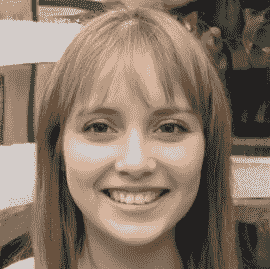

到目前为止，我们已经生成了一个图像。在接下来的几行代码中，您将了解如何在前面生成的图像和您选择的图像之间执行样式转换。

6.  获取自定义图像(`MyImage.jpg`)并对齐。对齐对于生成适当的潜在向量非常重要，因为 StyleGAN 中生成的所有图像都以面部为中心，并且特征明显可见:

```py
!wget https://www.dropbox.com/s/lpw10qawsc5ipbn/MyImage.JPG\
 -O MyImage.jpg
!git clone https://github.com/Puzer/stylegan-encoder.git
!mkdir -p stylegan-encoder/raw_images
!mkdir -p stylegan-encoder/aligned_images
!mv MyImage.jpg stylegan-encoder/raw_images
```

7.  对齐自定义图像:

```py
!python stylegan-encoder/align_images.py \
stylegan-encoder/raw_img/ \
stylegan-encoder/aligned_img/
!mv stylegan-encoder/aligned_img/* ./MyImage.jpg
```

8.  使用校准图像生成能够完美再现校准图像的潜影。这是识别潜在向量组合的过程，该潜在向量组合使对准图像和从潜在向量生成的图像之间的差异最小化:

```py
from PIL import Image
img = Image.open('MyImage.jpg')
show(np.array(img), sz=4, title='original')

!python encode_image.py ./MyImage.jpg\
 pred_dlatents_myImage.npy\
 --use_latent_finder true\
 --image_to_latent_path ./trained_models/image_to_latent.pt

pred_dlatents = np.load('pred_dlatents_myImage.npy')
pred_dlatent = torch.from_numpy(pred_dlatents).float().cuda()
pred_image = latent2image(pred_dlatent)
show(pred_image, sz=4, title='synthesized')
```

上述代码生成以下输出:


Python 脚本`encode_image.py`在较高层次上执行以下操作:

1.  在空间创建一个随机向量。
2.  用这个向量合成一个图像。
3.  使用 VGG 感知损失(与神经风格转换中使用的损失相同)将合成图像与原始输入图像进行比较。

4.  对随机向量进行反向传播，以减少固定迭代次数的损失。
5.  优化的矢量现在将合成一幅图像，VGG 为该图像给出与输入图像几乎相同的特征，因此合成的图像将看起来与输入图像相似。

现在我们有了对应于感兴趣图像的潜在向量，让我们在下一步执行图像之间的风格转换。

9.  执行风格转换:

如前所述，风格迁移背后的核心逻辑实际上是部分风格张量的转移，即 18 x 512 个风格张量中的 18 个的子集。这里，我们将在一种情况下传输前两行(18 x 512)，在一种情况下传输 3-15 行，在一种情况下传输 15-18 行。因为每组向量负责生成图像的不同方面，所以每组交换向量交换图像中的不同特征:

```py
idxs_to_swap = slice(0,3)
my_latents=torch.Tensor(np.load('pred_dlatents_myImage.npy', \
                                  allow_pickle=True))

A, B = latent2image(my_latents.cuda()), latent2image(trunc(mapper(rand_latents)))
generated_image_latents = trunc(mapper(rand_latents))

x = my_latents.clone()
x[:,idxs_to_swap] = generated_image_latents[:,idxs_to_swap]
a = latent2image(x.float().cuda())

x = generated_image_latents.clone()
x[:,idxs_to_swap] = my_latents[:,idxs_to_swap]
b = latent2image(x.float().cuda())

subplots([A,a,B,b], figsize=(7,8), nc=2, \
         suptitle='Transfer high level features')
```

前面的代码生成了以下内容:

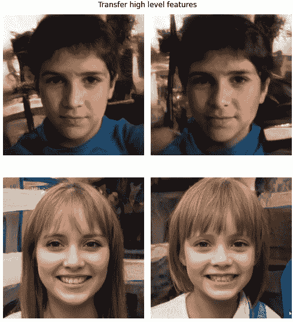

下面是用`idxs_to_swap`分别作为`slice(4,15)`和`slice (15,18)`的输出。

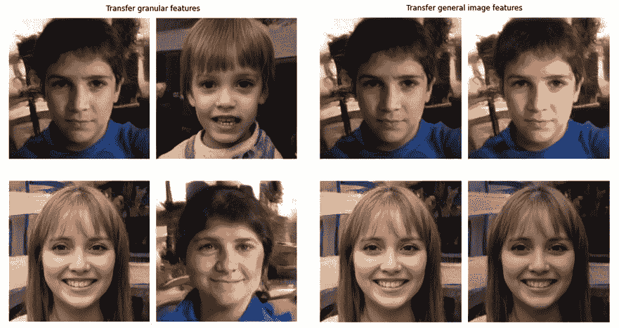

10.  接下来，我们推断一个样式向量，这样新的向量将只改变我们的自定义图像的微笑。为此，你需要计算移动潜在向量的正确方向。我们可以通过首先创建大量的假图像来实现这一点。然后使用 SVM 分类器来训练并找出图像中的人是否在微笑。因此，这个 SVM 创造了一个超平面，把微笑的脸和不微笑的脸分开。移动所需的方向将垂直于该超平面，表示为`stylegan_ffhq_smile_w_boundary.npy`。实现细节可以在`InterfaceGAN/edit.py`代码本身中找到:

```py
!python InterFaceGAN/edit.py\
 -m stylegan_ffhq\
 -o results_new_smile\
 -b InterFaceGAN/boundaries/stylegan_ffhq_smile_w_boundary.npy\
 -i pred_dlatents_myImage.npy\
 -s WP\
 --steps 20

generated_faces = glob.glob('results_new_smile/*.jpg')

subplots([read(im,1) for im in sorted(generated_faces)], \
         figsize=(10,10))
```

下面是生成的图像:


总之，我们已经了解了在使用 GANs 生成高分辨率人脸图像方面的研究进展。诀窍是在增加分辨率的步骤中增加发生器和鉴别器的复杂性，以便在每一步中，两个模型都能很好地完成任务。我们了解了如何通过确保每个分辨率下的特征都由一个称为样式向量的独立输入来决定，从而操纵生成图像的样式。我们还学习了如何通过从一个图像到另一个图像交换样式来操作不同图像的样式。

现在，我们已经了解了如何利用预训练的 StyleGAN2 模型来执行风格转换，在下一节中，我们将利用预训练的超分辨率 GAN 模型来生成高分辨率图像。

# 超分辨率氮化镓

在上一节中，我们看到了一个场景，其中我们利用预先训练好的 StyleGAN 来生成给定样式的图像。在本节中，我们将更进一步，了解如何利用预先训练的模型来执行图像超分辨率。在将超分辨率 GAN 模型应用于图像之前，我们将对其架构有所了解。

首先，我们将理解 GAN 是超分辨率任务的良好解决方案的原因。想象这样一个场景，给你一张图片，要求你提高它的分辨率。直觉上，你会考虑各种插值技术来执行超分辨率。这里有一个低分辨率图像样本以及各种技术的输出(图像来源:[https://arxiv.org/pdf/1609.04802.pdf](https://arxiv.org/pdf/1609.04802.pdf)):


从前面的图像中，我们可以看到，当从低分辨率(原始图像的 4X 缩小图像)重建图像时，双三次插值等传统插值技术没有多大帮助。

虽然基于 ResNet 的超分辨率 UNet 在这种情况下可以派上用场，但 GANs 可能更有用，因为它们模拟人类的感知。假设鉴别器知道典型的超分辨率图像看起来是什么样的，那么它可以检测生成的图像具有不一定看起来像高分辨率图像的属性的情况。

确定了超分辨率对 GANs 的需求后，让我们了解并利用预训练模型。

## 架构

虽然从头开始编码和训练超分辨率 GAN 是可能的，但我们将尽可能利用预先训练的模型。因此，在本节中，我们将利用 Christian Ledig 及其团队开发的模型，该模型发表在题为*使用生成式对抗网络的照片级单图像超分辨率*的论文中。

SRGAN 的架构如下(图片来源:[https://arxiv.org/pdf/1609.04802.pdf](https://arxiv.org/pdf/1609.04802.pdf)):

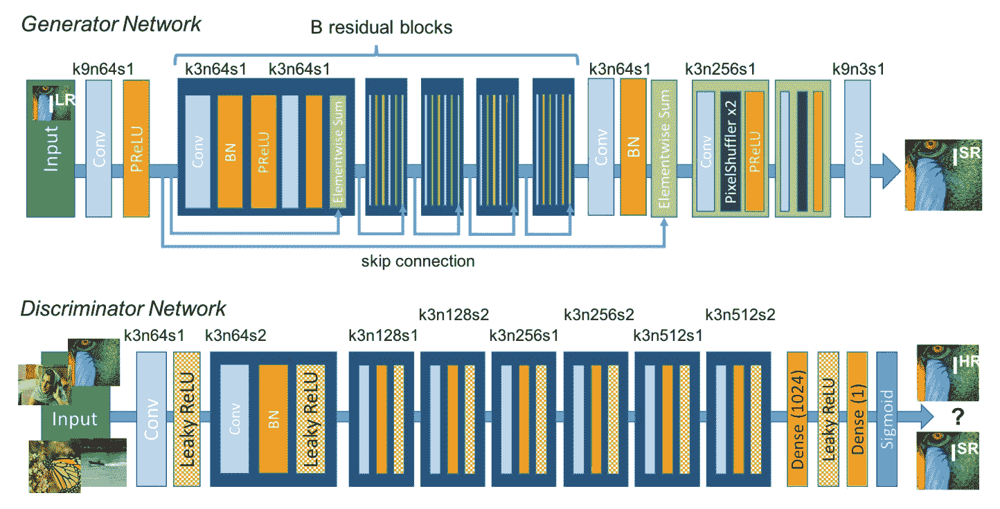

从前面的图像中，我们看到鉴别器将高分辨率图像作为输入来训练预测图像是高分辨率图像还是低分辨率图像的模型。生成器网络将低分辨率图像作为输入，并得出高分辨率图像。在训练模型时，内容损失和敌对损失都被最小化。要详细了解模型训练的细节，并比较用于生成高分辨率图像的各种技术的结果，我们建议您通读本文。

通过对模型构建方式的高级理解，我们将编码利用预训练的 SRGAN 模型将低分辨率图像转换为高分辨率图像的方法。

## 编码 SRGAN

以下是加载预训练的 SRGAN 并进行预测的步骤:

以下代码可在本书的 GitHub 知识库的`Chapter 13`文件夹中以`Image super resolution using SRGAN.ipynb`的名称获得-【https://tinyurl.com/mcvp-packt 代码包含了下载数据的 URL。我们强烈建议您在 GitHub 中执行 notebook 以重现结果，同时理解执行的步骤和对文本中各种代码组件的解释。

1.  导入相关包和预训练模型:

```py
import os
if not os.path.exists('srgan.pth.tar'):
    !pip install -q torch_snippets
    !wget -q https://raw.githubusercontent.com/sizhky/a-PyTorch-Tutorial-to-Super-Resolution/master/models.py -O models.py
    from pydrive.auth import GoogleAuth
    from pydrive.drive import GoogleDrive
    from google.colab import auth
    from oauth2client.client import GoogleCredentials

    auth.authenticate_user()
    gauth = GoogleAuth()
    gauth.credentials = \
            GoogleCredentials.get_application_default()
    drive = GoogleDrive(gauth)

    downloaded = drive.CreateFile({'id': \
                    '1_PJ1Uimbr0xrPjE8U3Q_bG7XycGgsbVo'})
    downloaded.GetContentFile('srgan.pth.tar')
    from torch_snippets import *
    device = 'cuda' if torch.cuda.is_available() else 'cpu'
```

2.  加载模型:

```py
model = torch.load('srgan.pth.tar', map_location='cpu')['generator'].to(device)
model.eval()
```

3.  获取要转换为高分辨率的图像:

```py
!wget https://www.dropbox.com/s/nmzwu68nrl9j0lf/Hema6.JPG
```

4.  定义图像的`preprocess`和`postprocess`函数:

```py
preprocess = T.Compose([
                T.ToTensor(),
                T.Normalize([0.485, 0.456, 0.406],
                            [0.229, 0.224, 0.225]),
                T.Lambda(lambda x: x.to(device))
            ])

postprocess = T.Compose([
                T.Lambda(lambda x: (x.cpu().detach()+1)/2),
                T.ToPILImage()
            ])
```

5.  加载图像并对其进行预处理:

```py
image = readPIL('Hema6.JPG')
image.size
# (260,181)
image = image.resize((130,90))
im = preprocess(image)
```

请注意，在前面的代码中，我们对原始图像执行了额外的调整大小，以进一步模糊图像，但这只是为了说明，因为当我们缩小图像时，改进会更加明显。

6.  将预处理后的图像通过加载的`model`和`postprocess`模型输出:

```py
sr = model(im[None])[0]
sr = postprocess(sr)
```

7.  绘制原始图像和高分辨率图像:

```py
subplots([image, sr], nc=2, figsize=(10,10), \
         titles=['Original image','High resolution image'])
```

上述代码会产生以下输出:

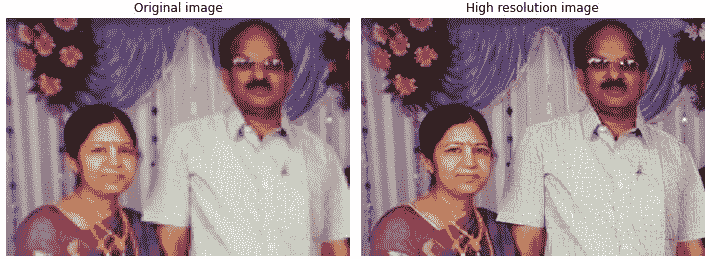

从前面的图像中，我们可以看到高分辨率图像捕捉到了原始图像中模糊的细节。

请注意，如果原始图像模糊，则原始图像和高分辨率图像之间的对比度会很高。但是，如果原始图像没有模糊，对比度就不会那么高。我们鼓励您使用不同分辨率的图像。

# 摘要

在本章中，我们学习了如何使用 Pix2Pix GAN 从给定的轮廓生成图像。此外，我们还学习了 CycleGAN 中的各种损失函数，用于将一类图像转换为另一类图像。接下来，我们了解了 StyleGAN 如何帮助生成逼真的人脸，以及如何根据生成器的训练方式将样式从一个图像复制到另一个图像。最后，我们了解了如何利用预训练的 SRGAN 模型来生成高分辨率图像。

在下一章中，我们将转而学习基于非常少(通常少于 20 张)的图像来训练图像分类模型。

# 问题

1.  为什么我们需要 Pix2Pix GAN，而 UNet 等监督学习算法可以从轮廓生成图像？
2.  为什么我们需要在 CycleGAN 中针对三种不同的损失函数进行优化？
3.  ProgressiveGAN 中的技巧如何帮助构建 StyleGAN？
4.  我们如何识别对应于给定自定义图像的潜在向量？